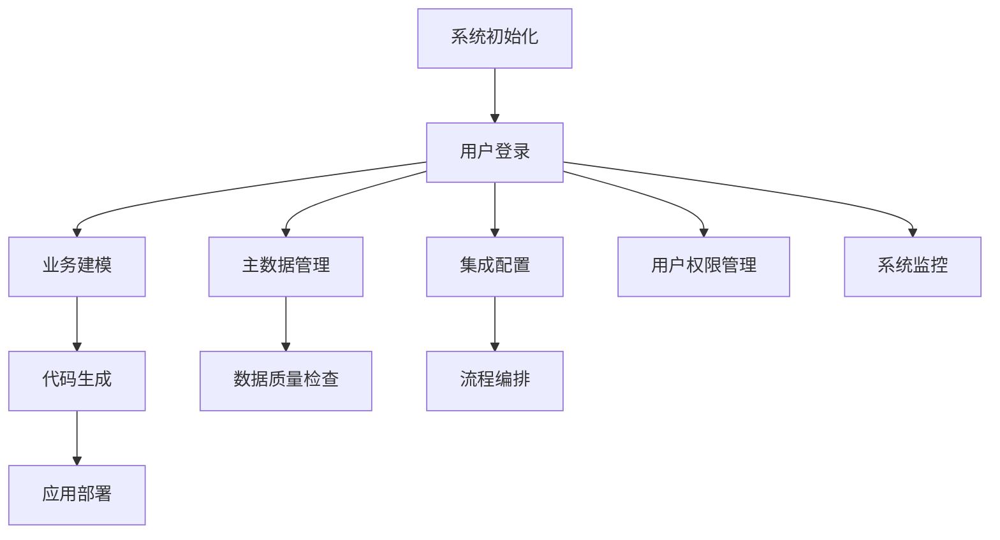

## 1. 产品概述
BONE是一个元数据驱动的开发平台，旨在简化企业应用开发流程，提高开发效率。
- 主要解决企业应用开发周期长、维护成本高的问题，为开发团队提供一站式开发解决方案。
- 目标用户为企业开发团队，市场价值在于降低开发成本、提高开发效率、确保系统一致性。

## 2. 核心功能

### 2.1 用户角色
| 角色 | 注册方式 | 核心权限 |
|------|---------------------|------------------|
| 系统管理员 | 系统初始化 | 所有功能的管理权限 |
| 开发人员 | 管理员邀请 | 元数据管理、代码生成、扩展开发 |
| 业务分析师 | 管理员邀请 | 业务建模、主数据管理 |
| 集成工程师 | 管理员邀请 | 系统集成、流程编排 |

### 2.2 功能模块
1. **控制台**：系统概览、仪表盘、快速入口
2. **元数据管理**：业务建模、代码生成、实体管理
3. **主数据管理**：主数据治理、质量管控、数据标准化
4. **扩展管理**：扩展点管理、插件开发与部署
5. **集成管理**：连接器配置、流程编排、数据同步
6. **IAM管理**：用户管理、角色管理、权限控制
7. **系统管理**：系统配置、监控告警、日志管理

### 2.3 页面详情
| 页面名称 | 模块名称 | 功能描述 |
|-----------|-------------|---------------------|
| 控制台 | 仪表盘 | 系统健康状态、最近操作、关键指标展示 |
| 控制台 | 快速入口 | 常用功能快捷访问、待办事项提醒 |
| 元数据管理 | 实体管理 | 创建、编辑、删除业务实体，管理实体字段和关系 |
| 元数据管理 | 代码生成 | 基于实体模型生成前后端代码，支持多种模板 |
| 元数据管理 | 模板管理 | 管理代码生成模板，支持自定义模板 |
| 主数据管理 | 主数据实体 | 定义主数据实体结构，管理主数据字段 |
| 主数据管理 | 数据质量 | 配置数据质量规则，执行质量检查，生成质量报告 |
| 主数据管理 | 数据记录 | 管理主数据记录，支持批量导入导出 |
| 扩展管理 | 扩展点管理 | 定义系统扩展点，管理扩展点生命周期 |
| 扩展管理 | 插件管理 | 上传、部署、卸载插件，管理插件配置 |
| 集成管理 | 连接器管理 | 配置各种系统连接器，管理连接参数 |
| 集成管理 | 流程编排 | 可视化流程设计，支持拖拽式流程配置 |
| 集成管理 | 流程监控 | 监控集成流程执行状态，查看执行日志 |
| IAM管理 | 用户管理 | 创建、编辑、禁用用户，管理用户信息 |
| IAM管理 | 角色管理 | 创建、编辑角色，分配权限 |
| IAM管理 | 权限管理 | 定义系统权限，管理权限分配 |
| IAM管理 | 审计日志 | 查看用户操作审计日志，支持日志搜索 |
| 系统管理 | 系统配置 | 管理系统全局配置，调整系统参数 |
| 系统管理 | 监控告警 | 查看系统监控指标，配置告警规则 |
| 系统管理 | 日志管理 | 查看系统运行日志，支持日志分析 |

## 3. 核心流程
用户使用BONE平台的主要流程包括：
1. 系统管理员初始化系统，创建初始用户和角色
2. 开发人员登录系统，创建业务实体模型
3. 开发人员基于实体模型生成代码，部署到目标环境
4. 业务分析师定义主数据实体，配置数据质量规则
5. 集成工程师配置连接器，设计集成流程
6. 系统管理员管理用户权限，监控系统运行状态

## 4. 用户界面设计
### 4.1 设计风格
- 主色调：深蓝色 (#1890ff)、白色 (#ffffff)
- 辅助色：浅灰色 (#f0f2f5)、绿色 (#52c41a)、红色 (#ff4d4f)
- 按钮风格：圆角矩形，带有轻微阴影
- 字体：系统默认字体，标题16-20px，正文14px，辅助文字12px
- 布局风格：卡片式布局，顶部导航栏，左侧菜单栏，右侧内容区
- 图标风格：线性图标，简洁现代

### 4.2 页面设计概览
| 页面名称 | 模块名称 | UI元素 |
|-----------|-------------|-------------|
| 控制台 | 仪表盘 | 卡片式布局，图表展示，实时数据更新，响应式设计 |
| 元数据管理 | 实体管理 | 表格展示，拖拽式字段管理，树形结构展示实体关系 |
| 元数据管理 | 代码生成 | 表单配置，进度条展示生成过程，下载链接 |
| 主数据管理 | 数据质量 | 仪表盘展示质量评分，表格展示质量问题，图表分析 |
| 扩展管理 | 插件管理 | 卡片式展示插件列表，状态指示器，操作按钮组 |
| 集成管理 | 流程编排 | 拖拽式流程图设计器，节点配置面板，连接关系可视化 |
| IAM管理 | 用户管理 | 表格展示用户列表，筛选器，批量操作按钮 |
| 系统管理 | 监控告警 | 实时监控图表，告警状态指示器，历史数据趋势图 |

### 4.3 响应式设计
- 桌面优先设计，支持1024px以上屏幕
- 平板适配：768px-1023px，调整布局为上下结构
- 移动端适配：320px-767px，使用汉堡菜单，简化界面元素
- 触摸优化：增大点击区域，支持手势操作

### 4.4 3D场景指导（不适用）
本产品为企业级管理系统，不涉及3D场景设计。