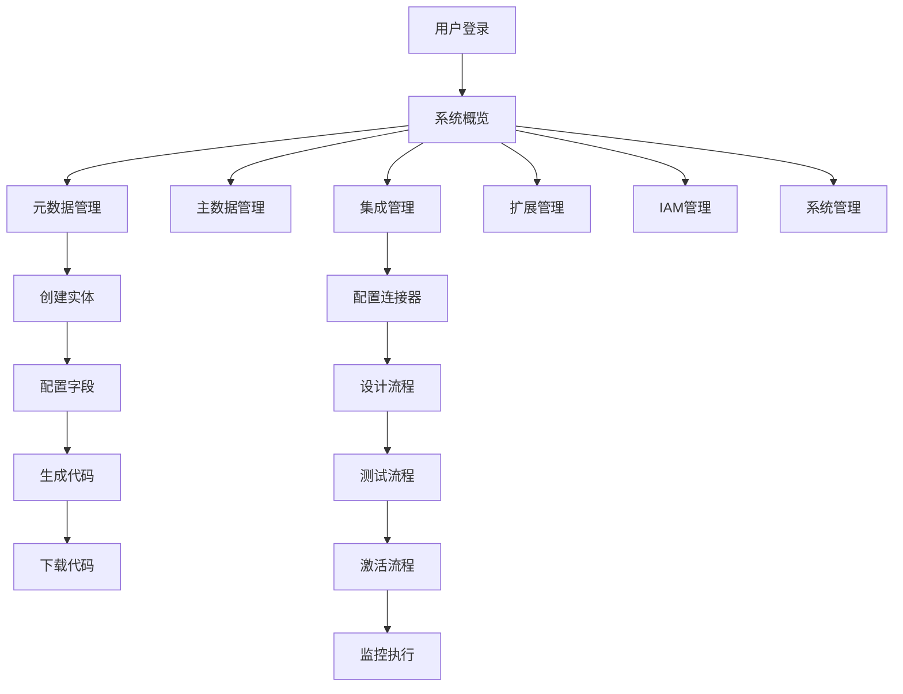

# BONE 平台产品需求文档

## 1. 产品概览
BONE 是一个企业级全栈开源快速开发平台，旨在通过元数据驱动和低代码方式，大幅提升企业应用开发效率和系统集成能力。
- 解决企业开发效率低、系统集成复杂、信创环境部署碎片化等核心痛点
- 为金融、政务、制造等行业提供安全、高效、可扩展的应用开发解决方案

## 2. 核心功能

### 2.1 用户角色
| 角色 | 注册方式 | 核心权限 |
|------|---------|----------|
| 系统管理员 | 预置账号 | 所有功能权限，包括系统配置、用户管理、权限管理 |
| 开发人员 | 邀请注册 | 元数据建模、代码生成、集成流程设计、插件开发 |
| 业务分析师 | 邀请注册 | 主数据管理、数据质量监控、报表查看 |
| 普通用户 | 邀请注册 | 基于角色的功能访问权限 |

### 2.2 功能模块
1. **管理后台**：系统概览、快速入口、统一管理界面
2. **元数据管理**：业务实体管理、代码生成、模板管理
3. **主数据管理**：主数据实体管理、数据质量控制、数据发布
4. **集成管理**：连接器管理、流程编排、流程监控
5. **扩展管理**：扩展点管理、插件管理、Wasm沙箱
6. **IAM管理**：用户管理、角色管理、权限管理、审计日志
7. **系统管理**：系统配置、监控告警、备份恢复

### 2.3 页面详情
| 页面名称 | 模块名称 | 功能描述 |
|---------|---------|----------|
| 管理后台 | 系统概览 | 展示BONE平台监控指标、框架相关指标和最近操作记录 |
| 管理后台 | 快速入口 | 提供常用功能的快速导航入口，支持自定义配置 |
| 管理后台 | 定制化仪表板 | 允许用户创建和定制个人或团队仪表板 |
| 元数据管理 | 实体管理 | 支持业务实体的创建、编辑、删除和发布，管理实体的字段和属性 |
| 元数据管理 | 代码生成 | 支持根据实体生成前后端代码，支持自定义模板 |
| 元数据管理 | 模板管理 | 管理代码生成模板，支持模板的创建、编辑和删除 |
| 主数据管理 | 主数据实体管理 | 支持主数据实体的创建、编辑、删除和发布 |
| 主数据管理 | 数据质量管理 | 配置和执行数据质量规则，检查和报告数据质量问题 |
| 主数据管理 | 主数据记录管理 | 管理主数据记录，支持数据的导入、编辑、发布和归档 |
| 集成管理 | 连接器管理 | 管理系统连接器，支持连接器的创建、编辑和测试 |
| 集成管理 | 流程编排 | 设计和管理集成流程，支持可视化流程设计 |
| 集成管理 | 流程监控 | 监控流程执行状态，查看执行日志 |
| 扩展管理 | 扩展点管理 | 管理系统扩展点，支持扩展点的创建和配置 |
| 扩展管理 | 插件管理 | 管理系统插件，支持插件的上传、部署和管理 |
| IAM管理 | 用户管理 | 管理系统用户，包括创建、编辑、禁用用户 |
| IAM管理 | 角色管理 | 管理系统角色，包括创建、编辑角色，分配权限 |
| IAM管理 | 权限管理 | 定义系统权限，管理权限分配 |
| IAM管理 | 审计日志 | 记录用户操作，支持合规导出 |
| 系统管理 | 系统配置 | 管理系统配置，支持配置的修改和历史记录 |
| 系统管理 | 监控告警 | 监控系统指标，配置告警规则 |
| 系统管理 | 备份恢复 | 管理系统备份，支持数据恢复 |

## 3. 核心流程
### 用户操作流程
1. 用户通过登录页面进入系统
2. 系统验证用户身份并分配权限
3. 用户进入管理后台，查看系统概览
4. 用户根据需要访问不同功能模块
5. 用户执行相应操作，系统记录操作日志
6. 用户退出系统

### 元数据建模与代码生成流程
1. 用户创建业务实体，定义字段和关系
2. 用户配置实体属性和验证规则
3. 用户选择代码模板
4. 系统生成前后端代码
5. 用户下载并部署生成的代码

### 集成流程编排流程
1. 用户配置连接器，测试连接
2. 用户设计集成流程，配置流程节点和连接
3. 用户测试流程执行
4. 用户激活流程，系统监控流程执行
5. 用户查看流程执行日志和统计信息

## 4. 用户界面设计
### 4.1 设计风格
- 主色调：深蓝色 (#1E40AF) 和白色 (#FFFFFF)
- 辅助色：浅蓝色 (#3B82F6)、绿色 (#10B981)、红色 (#EF4444)
- 按钮风格：圆角矩形，有轻微的阴影效果
- 字体：系统默认无衬线字体，标题使用 18-24px，正文使用 14-16px
- 布局风格：基于卡片的模块化布局，顶部导航栏，左侧功能菜单
- 图标风格：使用现代简约的线性图标，保持一致性

### 4.2 页面设计概览
| 页面名称 | 模块名称 | UI元素 |
|---------|---------|--------|
| 管理后台 | 系统概览 | 卡片式布局，包含仪表盘、指标图表、最近操作时间线，使用蓝色主题，响应式设计 |
| 元数据管理 | 实体管理 | 表格展示实体列表，右侧编辑面板，支持拖拽排序字段，使用浅蓝色主题 |
| 集成管理 | 流程编排 | 可视化流程图编辑器，节点拖拽，连线配置，使用绿色主题 |
| IAM管理 | 用户管理 | 表格展示用户列表，支持批量操作，状态切换，使用深蓝色主题 |
| 系统管理 | 监控告警 | 实时监控图表，告警列表，使用红色和黄色主题标识不同级别告警 |

### 4.3 响应式设计
- 桌面优先设计，支持 1920x1080 及以上分辨率
- 平板适配：768px-1024px 分辨率，调整布局为单栏
- 移动适配：320px-767px 分辨率，使用抽屉式菜单，简化操作界面
- 触摸优化：为移动设备优化触摸区域，确保按钮和交互元素易于点击

### 4.4 3D场景指导（不适用）
本产品主要为管理系统，不包含3D场景需求。