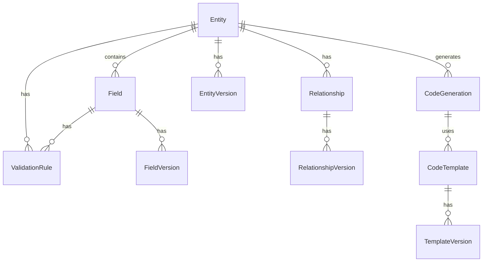
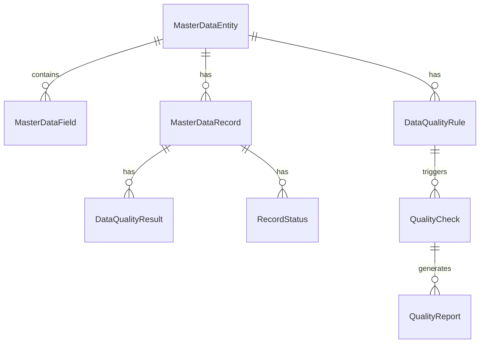
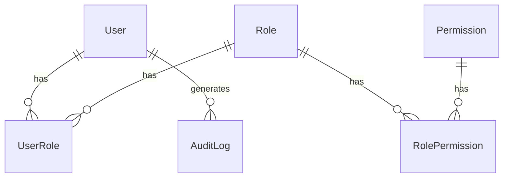
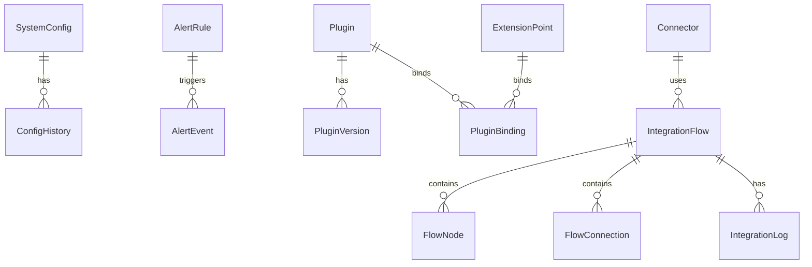

# BONE 平台技术架构文档

## 1. 架构设计

```mermaid
flowchart TD
    subgraph 前端层
        AdminUI[管理后台] --> React[React 18]
        MobileApp[移动端应用] --> ReactNative[React Native]
        MiniApp[小程序] --> MiniAppFramework[小程序框架]
        React --> AntDesign[Ant Design]
        React --> Redux[Redux Toolkit]
        React --> Router[React Router]
    end
    
    subgraph 网关层
        Gateway[API Gateway] --> Nginx[Nginx]
        Gateway --> Kong[Kong API Gateway]
    end
    
    subgraph 应用层
        AdminService[管理服务] --> SpringBoot[Spring Boot 3.2]
        MetadataService[元数据服务] --> SpringBoot
        MasterDataService[主数据服务] --> SpringBoot
        ExtensionService[扩展服务] --> SpringBoot
        IntegrationService[集成服务] --> SpringBoot
        IAMService[IAM服务] --> SpringBoot
        UserService[用户服务] --> SpringBoot
    end
    
    subgraph 引擎层
        MetadataEngine[智能元数据引擎] --> SDK[Bone Metadata SDK]
        MasterDataEngine[主数据平台] --> SDK
        ExtensionEngine[扩展引擎] --> WasmEngine[自研 Wasm 引擎]
        IntegrationEngine[集成引擎] --> Camel[Apache Camel]
        IAMEngine[Policy Decision Engine] --> SpringSecurity[Spring Security]
    end
    
    subgraph 基础设施层
        Registry[服务注册中心] --> Nacos[Nacos 2.2+]
        Config[配置中心] --> Nacos
        MQ[消息队列] --> RocketMQ[RocketMQ 5.1+]
        Cache[缓存] --> Redis[Redis 7.0+]
        Monitor[监控中心] --> Prometheus[Prometheus 2.45+]
    end
    
    subgraph 数据层
        MySQL[(MySQL 8.0+ 分库分表)]
        PostgreSQL[(PostgreSQL 15.0+)]
        ObjectStorage[(对象存储)] --> MinIO[MinIO 2024+]
    end
    
    %% 前端到网关
    AdminUI --> Gateway
    MobileApp --> Gateway
    MiniApp --> Gateway
    
    %% 网关到应用层
    Gateway --> AdminService
    Gateway --> MetadataService
    Gateway --> MasterDataService
    Gateway --> ExtensionService
    Gateway --> IntegrationService
    Gateway --> IAMService
    Gateway --> UserService
    
    %% 应用层到应用层
    AdminService --> MetadataService
    AdminService --> MasterDataService
    AdminService --> ExtensionService
    AdminService --> IntegrationService
    AdminService --> IAMService
    AdminService --> UserService
    
    %% 应用层到引擎层
    MetadataService --> MetadataEngine
    MasterDataService --> MasterDataEngine
    ExtensionService --> ExtensionEngine
    IntegrationService --> IntegrationEngine
    IAMService --> IAMEngine
    
    %% 引擎层到数据层
    MetadataEngine --> MySQL
    MasterDataEngine --> PostgreSQL
    ExtensionEngine --> MySQL
    IntegrationEngine --> MySQL
    IAMEngine --> MySQL
    
    %% 引擎层到基础设施
    MetadataEngine --> Cache
    MasterDataEngine --> Cache
    ExtensionEngine --> MQ
    IntegrationEngine --> MQ
    
    %% 应用层到基础设施
    AdminService --> Registry
    MetadataService --> Registry
    MasterDataService --> Registry
    ExtensionService --> Registry
    IntegrationService --> Registry
    IAMService --> Registry
    UserService --> Registry
    
    AdminService --> Config
    MetadataService --> Config
    MasterDataService --> Config
    ExtensionService --> Config
    IntegrationService --> Config
    IAMService --> Config
    UserService --> Config
    
    AdminService --> Monitor
    MetadataService --> Monitor
    MasterDataService --> Monitor
    ExtensionService --> Monitor
    IntegrationService --> Monitor
    IAMService --> Monitor
    UserService --> Monitor
    
    %% 其他存储
    AdminService --> ObjectStorage
    MetadataService --> ObjectStorage
    MasterDataService --> ObjectStorage
```



## 2. 技术选型

### 2.1 前端技术
| 技术 | 版本 | 用途 |
|------|------|------|
| React | 18+ | 前端框架 |
| TypeScript | 5.5+ | 类型系统 |
| Ant Design | 5.12+ | UI组件库 |
| Redux Toolkit | 2.0+ | 状态管理 |
| React Router | 6.20+ | 路由管理 |
| Vite | 5.0+ | 构建工具 |
| Axios | 1.6+ | HTTP客户端 |
| Monaco Editor | 0.45+ | 代码编辑器 |
| D3.js | 7.0+ | 数据可视化 |
| X6 | 2.0+ | 流程图编辑器 |

### 2.2 后端技术
| 技术 | 版本 | 用途 |
|------|------|------|
| Java | 17+ | 核心开发语言 |
| Spring Boot | 3.2+ | 后端框架 |
| Spring Cloud | 2023+ | 微服务框架 |
| Spring Security | 6.2+ | 安全框架 |
| Bone Metadata SDK | 1.0+ | 元数据管理 |
| Apache Camel | 4.0+ | 系统集成 |
| JWT | 0.11+ | 认证令牌 |
| Sentinel | 1.8+ | 限流熔断 |
| Seata | 1.7+ | 分布式事务 |

### 2.3 中间件
| 技术 | 版本 | 用途 |
|------|------|------|
| Nacos | 2.2+ | 服务注册与发现 |
| RocketMQ | 5.1+ | 消息队列 |
| Redis | 7.0+ | 缓存 |
| Prometheus | 2.45+ | 监控 |
| Grafana | 10.0+ | 监控面板 |
| ELK Stack | 8.0+ | 日志管理 |

### 2.4 数据库
| 技术 | 版本 | 用途 |
|------|------|------|
| MySQL | 8.0+ | 关系型数据库（默认，分库分表） |
| PostgreSQL | 15.0+ | 关系型数据库 |
| 达梦8 | - | 信创数据库 |
| 人大金仓 | - | 信创数据库 |
| MinIO | 2024+ | 对象存储 |

## 3. 微服务与Java工程映射

| 领域名称 | 微服务名 | Java工程名 | API前缀 | 数据库 | 端口 |
|---------|---------|-----------|---------|---------|------|
| 管理域 | admin-service | bone-admin | `/api/v1/admin` | `admin_db` | 8086 |
| 元数据域 | metadata-service | bone-metadata | `/api/v1/metadata` | `metadata_db` | 8081 |
| 主数据域 | masterdata-service | bone-masterdata | `/api/v1/masterdata` | `master_db` | 8083 |
| 集成域 | integration-service | bone-integration | `/api/v1/integration` | `integration_db` | 8084 |
| 扩展域 | extension-service | bone-extension | `/api/v1/extension` | `extension_db` | 8085 |
| 权限中台 | authz-service | bone-authz | `/api/v1/authz` | `authz_db` | 8082 |
| 用户域 | user-service | bone-user | `/api/v1/user` | `user_db` | 8087 |
| API网关 | bone-gateway | bone-gateway | - | - | 8080 |

## 4. API定义

### 4.1 管理服务 API
| API路径 | 方法 | 功能 | 权限 |
|---------|------|------|------|
| `/api/v1/admin/dashboard/metrics` | GET | 获取系统和业务指标 | 系统管理权限 |
| `/api/v1/admin/dashboard/operations` | GET | 获取最近操作记录 | 系统管理权限 |
| `/api/v1/admin/dashboard` | GET | 获取仪表板列表 | 已认证 |
| `/api/v1/admin/dashboard` | POST | 创建仪表板 | 已认证 |
| `/api/v1/admin/dashboard/{id}` | GET | 获取仪表板详情 | 已认证 |
| `/api/v1/admin/dashboard/{id}` | PUT | 更新仪表板 | 仪表板所有者 |
| `/api/v1/admin/dashboard/{id}` | DELETE | 删除仪表板 | 仪表板所有者 |

### 4.2 元数据服务 API
| API路径 | 方法 | 功能 | 权限 |
|---------|------|------|------|
| `/api/v1/metadata/entities` | GET | 获取实体列表 | 元数据管理权限 |
| `/api/v1/metadata/entities` | POST | 创建实体 | 元数据管理权限 |
| `/api/v1/metadata/entities/{id}` | PUT | 更新实体 | 元数据管理权限 |
| `/api/v1/metadata/entities/{id}` | DELETE | 删除实体 | 元数据管理权限 |
| `/api/v1/metadata/entities/{id}/publish` | POST | 发布实体 | 元数据管理权限 |
| `/api/v1/metadata/generate` | POST | 生成代码 | 元数据管理权限 |
| `/api/v1/metadata/templates` | GET | 获取模板列表 | 模板管理权限 |
| `/api/v1/metadata/templates` | POST | 创建模板 | 模板管理权限 |

### 4.3 主数据服务 API
| API路径 | 方法 | 功能 | 权限 |
|---------|------|------|------|
| `/api/v1/masterdata/entities` | GET | 获取主数据实体列表 | 主数据管理权限 |
| `/api/v1/masterdata/entities` | POST | 创建主数据实体 | 主数据管理权限 |
| `/api/v1/masterdata/entities/{id}` | PUT | 更新主数据实体 | 主数据管理权限 |
| `/api/v1/masterdata/entities/{id}` | DELETE | 删除主数据实体 | 主数据管理权限 |
| `/api/v1/masterdata/rules` | GET | 获取质量规则列表 | 主数据管理权限 |
| `/api/v1/masterdata/rules` | POST | 创建质量规则 | 主数据管理权限 |
| `/api/v1/masterdata/records` | GET | 获取主数据记录 | 主数据管理权限 |
| `/api/v1/masterdata/records` | POST | 导入主数据记录 | 主数据管理权限 |

### 4.4 集成服务 API
| API路径 | 方法 | 功能 | 权限 |
|---------|------|------|------|
| `/api/v1/integration/connectors` | GET | 获取连接器列表 | 集成管理权限 |
| `/api/v1/integration/connectors` | POST | 创建连接器 | 集成管理权限 |
| `/api/v1/integration/connectors/{id}` | PUT | 更新连接器 | 集成管理权限 |
| `/api/v1/integration/connectors/{id}` | DELETE | 删除连接器 | 集成管理权限 |
| `/api/v1/integration/flows` | GET | 获取流程列表 | 集成管理权限 |
| `/api/v1/integration/flows` | POST | 创建流程 | 集成管理权限 |
| `/api/v1/integration/flows/{id}` | PUT | 更新流程 | 集成管理权限 |
| `/api/v1/integration/flows/{id}` | DELETE | 删除流程 | 集成管理权限 |
| `/api/v1/integration/flows/{id}/activate` | POST | 激活流程 | 集成管理权限 |

### 4.5 扩展服务 API
| API路径 | 方法 | 功能 | 权限 |
|---------|------|------|------|
| `/api/v1/extension/points` | GET | 获取扩展点列表 | 扩展管理权限 |
| `/api/v1/extension/points` | POST | 创建扩展点 | 扩展管理权限 |
| `/api/v1/extension/points/{id}` | PUT | 更新扩展点 | 扩展管理权限 |
| `/api/v1/extension/points/{id}` | DELETE | 删除扩展点 | 扩展管理权限 |
| `/api/v1/extension/plugins` | GET | 获取插件列表 | 扩展管理权限 |
| `/api/v1/extension/plugins` | POST | 上传插件 | 扩展管理权限 |
| `/api/v1/extension/plugins/{id}/deploy` | POST | 部署插件 | 扩展管理权限 |
| `/api/v1/extension/plugins/{id}/undeploy` | POST | 卸载插件 | 扩展管理权限 |

### 4.6 IAM服务 API
| API路径 | 方法 | 功能 | 权限 |
|---------|------|------|------|
| `/api/v1/authz/login` | POST | 用户登录 | 无 |
| `/api/v1/authz/logout` | POST | 用户登出 | 已认证 |
| `/api/v1/authz/users` | GET | 获取用户列表 | 管理员 |
| `/api/v1/authz/users` | POST | 创建用户 | 管理员 |
| `/api/v1/authz/users/{id}` | PUT | 更新用户 | 管理员 |
| `/api/v1/authz/users/{id}` | DELETE | 删除用户 | 管理员 |
| `/api/v1/authz/roles` | GET | 获取角色列表 | 管理员 |
| `/api/v1/authz/roles` | POST | 创建角色 | 管理员 |
| `/api/v1/authz/roles/{id}/permissions` | POST | 为角色分配权限 | 管理员 |
| `/api/v1/authz/permissions` | GET | 获取权限列表 | 管理员 |
| `/api/v1/authz/audit/logs` | GET | 获取审计日志 | 管理员 |

## 5. 数据模型

### 5.1 元数据模型



### 5.2 主数据模型



### 5.3 IAM模型



### 5.4 系统模型



## 6. 部署架构

### 6.1 容器化部署
BONE平台采用Kubernetes容器化部署，使用Helm Chart进行应用管理。

**部署架构**：
- **控制平面**：Kubernetes Master节点，负责集群管理
- **工作节点**：多个Kubernetes Worker节点，运行应用容器
- **存储**：使用PVC持久化存储，支持云存储或本地存储
- **网络**：使用Calico网络插件，支持Pod间通信

**Helm Chart结构**：
```
bone-chart/
├── Chart.yaml
├── values.yaml
├── templates/
│   ├── deployment.yaml
│   ├── service.yaml
│   ├── ingress.yaml
│   ├── configmap.yaml
│   ├── secret.yaml
│   ├── hpa.yaml
│   └── serviceaccount.yaml
```

### 6.2 部署策略

| 组件 | 部署方式 | 副本数 | 资源 | 高可用 |
|------|----------|--------|------|--------|
| API Gateway | Deployment | 3 | 2C4G | 跨AZ |
| 管理服务 | Deployment | 2 | 2C4G | - |
| 元数据服务 | Deployment | 3 | 4C8G | - |
| 权限中台 | Deployment | 3 | 2C4G | - |
| 主数据服务 | Deployment | 2 | 4C8G | - |
| 集成服务 | Deployment | 2 | 4C8G | - |
| 扩展服务 | Deployment | 2 | 2C4G | - |
| 用户服务 | Deployment | 2 | 2C4G | - |
| MySQL | 分库分表（16物理库） | 1主2从/库 | 16C64G | 主从切换 |
| Redis | 集群 | 6主6从 | 8C16G | 是 |
| RocketMQ | 集群 | 3节点 | 4C8G | 是 |
| MinIO | 分布式 | 4节点 | 8C32G | 是 |

## 7. 安全设计

### 7.1 认证与授权
- **认证**：基于JWT的无状态认证，支持企业SSO集成（OAuth2/SAML/LDAP）
- **授权**：基于RBAC的细粒度权限控制，支持字段级权限
- **会话管理**：Token有效期配置，支持刷新令牌
- **密码策略**：密码强度要求，定期密码更换
- **多因素认证**：支持短信、邮箱、TOTP等多因素认证
- **五层权限模型**：Owner/Deny ABAC/ReBAC/RBAC/Default，确保权限精确控制

### 7.2 数据安全
- **传输加密**：使用TLS 1.3加密所有网络传输
- **存储加密**：敏感数据使用AES-256加密存储
- **数据脱敏**：API返回数据脱敏，日志敏感信息脱敏
- **备份恢复**：定期数据备份，支持灾难恢复

### 7.3 网络安全
- **网络隔离**：使用Kubernetes NetworkPolicy隔离Pod网络
- **API网关**：使用Kong API Gateway进行流量控制和安全防护
- **防火墙**：配置网络防火墙规则，限制访问
- **DDoS防护**：集成DDoS防护服务

### 7.4 审计日志
- **操作审计**：记录所有用户操作，包括登录、权限变更、配置修改等
- **日志存储**：使用对象存储，支持WORM（一次写入多次读取）
- **日志保留**：审计日志保留180天，不可篡改
- **合规性**：满足等保三级要求

## 8. 性能优化

### 8.1 前端优化
- **代码分割**：使用React.lazy和Suspense实现代码分割
- **缓存策略**：合理使用浏览器缓存和Service Worker
- **资源优化**：压缩CSS、JavaScript和图片资源
- **预加载**：关键资源预加载，提高首屏加载速度
- **状态管理**：使用Redux Toolkit优化状态管理
- **渲染优化**：使用React.memo、useMemo、useCallback减少不必要的渲染

### 8.2 后端优化
- **微服务拆分**：合理拆分服务，减少服务间依赖
- **异步处理**：使用消息队列处理异步任务
- **缓存策略**：使用Redis缓存热点数据
- **连接池**：使用数据库连接池和HTTP连接池
- **负载均衡**：使用Kubernetes HPA实现自动扩缩容
- **JVM优化**：合理配置JVM参数，优化垃圾回收

### 8.3 数据库优化
- **索引优化**：合理创建索引，避免全表扫描
- **查询优化**：优化SQL语句，避免复杂查询
- **分库分表**：对大表进行分库分表（256分片）
- **读写分离**：使用主从复制实现读写分离
- **批量操作**：使用批量插入、更新减少数据库操作次数

## 9. 扩展性设计

### 9.1 插件体系（Wasm 方案）
BONE采用自研的Wasm插件系统，基于 WasmEdge 运行时，提供安全、高效的插件扩展能力。

**核心特性**：
- **Wasm沙箱**：使用WasmEdge运行时，提供安全隔离的插件执行环境
- **资源限制**：CPU 100ms，内存 50MB，超时熔断
- **热加载**：支持插件热部署，无需重启服务
- **插件生命周期**：安装、部署、卸载、更新、回滚
- **插件隔离**：使用沙箱机制隔离插件运行环境

### 9.2 扩展点设计
- **扩展点类型**：前置、后置、环绕
- **扩展点注册**：动态注册和发现扩展点
- **扩展点触发**：基于事件驱动的扩展点触发机制
- **扩展点管理**：支持启用/禁用扩展点
- **扩展点文档**：自动生成扩展点文档

### 9.3 多租户支持
- **租户隔离**：支持独立数据库、独立Schema、行级租户ID三种隔离模式
- **资源配额**：为每个租户分配资源配额
- **租户管理**：支持租户创建、编辑、删除
- **租户数据**：租户数据完全隔离
- **租户定制**：支持租户级别的定制化配置

## 10. 实施计划

### 10.1 开发阶段

| 阶段 | 时间 | 核心任务 |
|------|------|----------|
| **阶段0：基础平台** | 2026年Q3 | 控制台、元数据管理、IAM管理开发 |
| **阶段1：核心能力** | 2026年Q4 | 主数据管理、扩展管理开发 |
| **阶段2：集成能力** | 2027年Q1 | 集成管理、系统管理开发 |
| **阶段3：生态扩展** | 2027年Q2 | 插件生态、开放API开发 |

### 10.2 测试计划

| 测试类型 | 阶段 | 内容 |
|----------|------|------|
| **单元测试** | 开发阶段 | 核心功能单元测试，覆盖率≥70% |
| **集成测试** | 开发阶段 | 服务间集成测试，覆盖率≥50% |
| **性能测试** | 预发布阶段 | 系统性能测试，验证SLO指标 |
| **安全测试** | 预发布阶段 | 安全漏洞扫描，渗透测试 |
| **回归测试** | 发布前 | 全功能回归测试，确保无回归问题 |

### 10.3 发布计划

| 阶段 | 时间 | 发布内容 |
|------|------|----------|
| **灰度1** | 2026年Q3末 | 基础平台功能，10%内部用户 |
| **灰度2** | 2026年Q4初 | 核心能力，30%友好客户 |
| **灰度3** | 2026年Q4末 | 集成能力，60%部分客户 |
| **正式发布** | 2027年Q1 | 完整功能，100%所有客户 |

## 11. 风险与依赖

### 11.1 风险分析

| 风险ID | 风险描述 | 影响等级 | 可能性 | 缓解措施 |
|--------|----------|----------|----------|----------|
| R001 | 元数据模型复杂度高，用户学习成本大 | 中 | 中 | 提供详细文档和视频教程，开发向导式界面 |
| R002 | 代码生成质量不满足复杂业务需求 | 高 | 中 | 提供模板定制能力，支持代码后处理 |
| R003 | 系统集成复杂度高，连接器适配困难 | 中 | 中 | 提供标准连接器库，支持自定义连接器 |
| R004 | 性能瓶颈，大规模数据处理慢 | 高 | 中 | 优化数据库查询，引入缓存机制，支持异步处理 |
| R005 | 安全漏洞，权限控制不严格 | 高 | 低 | 定期安全审计，实施最小权限原则，加密敏感数据 |
| R006 | 信创环境兼容性问题 | 中 | 中 | 提前进行信创环境测试，优化适配方案 |
| R007 | 插件系统安全性问题 | 高 | 中 | 加强插件沙箱隔离，实施插件权限控制 |

### 11.2 依赖管理

| 依赖项 | 版本要求 | 用途 | 风险等级 | 管理策略 |
|--------|----------|------|----------|----------|
| Spring Boot | 3.2+ | 后端框架 | 低 | 定期更新版本，监控安全漏洞 |
| Spring Cloud | 2023+ | 微服务框架 | 低 | 定期更新版本，监控安全漏洞 |
| Bone Metadata SDK | 1.0+ | 元数据管理 | 中 | 建立SDK版本管理机制，定期更新 |
| Nacos | 2.2+ | 服务注册与发现 | 中 | 部署高可用集群，定期备份配置 |
| RocketMQ | 5.1+ | 消息队列 | 中 | 部署高可用集群，监控消息积压 |
| Redis | 7.0+ | 缓存 | 中 | 部署哨兵模式，定期备份数据 |
| MySQL | 8.0+ | 关系型数据库 | 中 | 部署主从复制，定期备份 |
| PostgreSQL | 15.0+ | 关系型数据库 | 中 | 部署主从复制，定期备份 |
| Apache Camel | 4.0+ | 系统集成 | 中 | 监控集成流程执行状态 |
| React | 18+ | 前端框架 | 低 | 定期更新版本，监控安全漏洞 |
| Ant Design | 5.12+ | UI组件库 | 低 | 定期更新版本，监控安全漏洞 |

## 12. 总结

本技术架构文档提供了BONE平台的完整技术方案，包括架构设计、技术选型、微服务映射、API定义、数据模型、部署架构、安全设计、性能优化、扩展性设计和实施计划。

BONE平台采用微服务架构，基于Spring Boot、Spring Cloud、Bone Metadata SDK等核心技术，提供元数据驱动的应用生成、企业集成、扩展运行时等核心能力，旨在解决企业开发效率低、系统集成复杂、信创环境部署碎片化等痛点。

通过合理的架构设计和技术选型，BONE平台能够满足金融、政务、制造等行业的苛刻要求，为企业提供安全、高效、可扩展的应用开发解决方案。