## 1. 架构设计

```mermaid
flowchart TD
    subgraph 前端层
        AdminUI[管理后台] --> ReactComponents[React组件]
        MobileApp[移动端应用] --> ReactNative[React Native]
        MiniApp[小程序] --> MiniAppFramework[小程序框架]
    end
    
    subgraph 应用层
        AdminService[管理服务] --> API[API接口]
        MetadataService[元数据服务] --> API
        MasterDataService[主数据服务] --> API
        ExtensionService[扩展服务] --> API
        IntegrationService[集成服务] --> API
        IAMService[IAM服务] --> API
    end
    
    subgraph 引擎层
        MetadataEngine[智能元数据引擎] --> Core[核心引擎]
        MasterDataEngine[企业主数据平台] --> Core
        ExtensionEngine[ExtPoint扩展引擎] --> Core
        IntegrationEngine[集成引擎] --> Core
        IAMEngine[IAM引擎] --> Core
    end
    
    subgraph 基础设施层
        Registry[服务注册中心] --> Nacos[Nacos]
        Config[配置中心] --> Nacos
        MQ[消息队列] --> RocketMQ[RocketMQ]
        Cache[缓存] --> Redis[Redis]
        Monitor[监控中心] --> Sentinel[Sentinel]
    end
    
    subgraph 数据层
        DB[数据库] --> MySQL[MySQL]
        DB --> PostgreSQL[PostgreSQL]
        FileStorage[文件存储] --> MinIO[MinIO]
    end
    
    AdminUI --> AdminService
    MobileApp --> AdminService
    MiniApp --> AdminService
    
    AdminService --> MetadataService
    AdminService --> MasterDataService
    AdminService --> ExtensionService
    AdminService --> IntegrationService
    AdminService --> IAMService
    
    MetadataService --> MetadataEngine
    MasterDataService --> MasterDataEngine
    ExtensionService --> ExtensionEngine
    IntegrationService --> IntegrationEngine
    IAMService --> IAMEngine
    
    MetadataEngine --> DB
    MasterDataEngine --> DB
    ExtensionEngine --> DB
    IntegrationEngine --> DB
    IAMEngine --> DB
    
    MetadataEngine --> Cache
    MasterDataEngine --> Cache
    ExtensionEngine --> MQ
    IntegrationEngine --> MQ
    
    AdminService --> Registry
    MetadataService --> Registry
    MasterDataService --> Registry
    ExtensionService --> Registry
    IntegrationService --> Registry
    IAMService --> Registry
    
    AdminService --> Config
    MetadataService --> Config
    MasterDataService --> Config
    ExtensionService --> Config
    IntegrationService --> Config
    IAMService --> Config
    
    AdminService --> Monitor
    MetadataService --> Monitor
    MasterDataService --> Monitor
    ExtensionService --> Monitor
    IntegrationService --> Monitor
    IAMService --> Monitor
```


## 2. 技术描述
- 前端：React@18 + TypeScript@5.5 + Ant Design@5.12 + Redux Toolkit@2.0 + React Router@6.20 + Vite@4.4
- 移动端：React Native@0.74 + Expo@51
- 后端：Spring Boot@3.2 + Spring Cloud@2023 + Bone Metadata SDK@1.0
- 服务注册与发现：Nacos@2.2
- 服务治理：Sentinel@1.8
- 消息队列：RocketMQ@5.1
- 分布式事务：Seata@1.6
- 缓存：Redis@7.0
- 数据库：MySQL@8.0 + PostgreSQL@15.0
- 文件存储：MinIO
- 系统集成：Apache Camel@4.0
- 业务规则：LiteFlow@2.10

## 3. 路由定义
### 3.1 前端路由
| 路由 | 用途 |
|-------|---------|
| /dashboard | 控制台仪表盘 |
| /metadata/entities | 元数据实体管理 |
| /metadata/generate | 代码生成 |
| /metadata/templates | 模板管理 |
| /masterdata/entities | 主数据实体管理 |
| /masterdata/records | 主数据记录管理 |
| /masterdata/quality | 数据质量管理 |
| /extension/points | 扩展点管理 |
| /extension/plugins | 插件管理 |
| /integration/connectors | 连接器管理 |
| /integration/flows | 流程编排 |
| /integration/monitor | 流程监控 |
| /iam/users | 用户管理 |
| /iam/roles | 角色管理 |
| /iam/permissions | 权限管理 |
| /iam/audit | 审计日志 |
| /system/config | 系统配置 |
| /system/monitor | 系统监控 |
| /system/logs | 日志管理 |

### 3.2 后端API路由
| 路由 | 用途 |
|-------|---------|
| /api/metadata/** | 元数据服务API |
| /api/masterdata/** | 主数据服务API |
| /api/extension/** | 扩展服务API |
| /api/integration/** | 集成服务API |
| /api/iam/** | IAM服务API |
| /api/system/** | 系统服务API |

## 4. API定义
### 4.1 元数据服务API
```typescript
// 实体管理
interface Entity {
  id: number;
  name: string;
  description: string;
  fields: Field[];
  relationships: Relationship[];
  createdAt: string;
  updatedAt: string;
}

interface Field {
  id: number;
  name: string;
  type: string;
  length: number;
  isRequired: boolean;
  defaultValue: string;
  description: string;
  validationRules: ValidationRule[];
}

interface Relationship {
  id: number;
  sourceEntityId: number;
  targetEntityId: number;
  type: string;
  sourceFieldId: number;
  targetFieldId: number;
}

interface ValidationRule {
  id: number;
  type: string;
  expression: string;
  message: string;
}

// 代码生成
interface CodeGenerateRequest {
  entityId: number;
  template: string;
  options: Record<string, any>;
}

interface CodeGenerateResponse {
  taskId: string;
  status: string;
  downloadUrl?: string;
}
```

### 4.2 主数据服务API
```typescript
// 主数据实体
interface MasterDataEntity {
  id: number;
  name: string;
  description: string;
  fields: Field[];
  createdAt: string;
  updatedAt: string;
}

// 主数据记录
interface MasterDataRecord {
  id: number;
  entityId: number;
  data: Record<string, any>;
  status: string;
  createdAt: string;
  updatedAt: string;
}

// 数据质量
interface DataQualityRule {
  id: number;
  entityId: number;
  name: string;
  type: string;
  expression: string;
  severity: string;
}

interface DataQualityResult {
  id: number;
  recordId: number;
  ruleId: number;
  passed: boolean;
  message: string;
  timestamp: string;
}
```

### 4.3 扩展服务API
```typescript
// 扩展点
interface ExtensionPoint {
  id: number;
  name: string;
  description: string;
  pointType: string;
  target: string;
  createdAt: string;
}

// 插件
interface ExtensionPlugin {
  id: number;
  name: string;
  version: string;
  description: string;
  status: string;
  jarPath: string;
  createdAt: string;
  updatedAt: string;
  configs: ExtensionConfig[];
}

interface ExtensionConfig {
  id: number;
  pluginId: number;
  key: string;
  value: string;
  description: string;
}
```

### 4.4 集成服务API
```typescript
// 连接器
interface Connector {
  id: number;
  name: string;
  type: string;
  config: Record<string, any>;
  status: string;
  createdAt: string;
  updatedAt: string;
}

// 集成流程
interface IntegrationFlow {
  id: number;
  name: string;
  description: string;
  status: string;
  nodes: FlowNode[];
  connections: FlowConnection[];
  createdAt: string;
  updatedAt: string;
}

interface FlowNode {
  id: number;
  flowId: number;
  name: string;
  type: string;
  config: Record<string, any>;
  positionX: number;
  positionY: number;
}

interface FlowConnection {
  id: number;
  flowId: number;
  sourceNodeId: number;
  targetNodeId: number;
  condition: string;
}
```

### 4.5 IAM服务API
```typescript
// 用户
interface User {
  id: number;
  username: string;
  email: string;
  status: string;
  createdAt: string;
  updatedAt: string;
  roles: Role[];
}

// 角色
interface Role {
  id: number;
  name: string;
  description: string;
  createdAt: string;
  updatedAt: string;
  permissions: Permission[];
}

// 权限
interface Permission {
  id: number;
  name: string;
  code: string;
  description: string;
  createdAt: string;
}

// 审计日志
interface AuditLog {
  id: number;
  userId: number;
  action: string;
  resource: string;
  ipAddress: string;
  userAgent: string;
  timestamp: string;
  details: Record<string, any>;
}
```

## 5. 服务器架构图
```mermaid
flowchart TD
    subgraph 客户端层
        Client[前端应用]
    end
    
    subgraph API网关层
        Gateway[API网关]
    end
    
    subgraph 应用服务层
        AdminService[管理服务]
        MetadataService[元数据服务]
        MasterDataService[主数据服务]
        ExtensionService[扩展服务]
        IntegrationService[集成服务]
        IAMService[IAM服务]
    end
    
    subgraph 引擎层
        MetadataEngine[