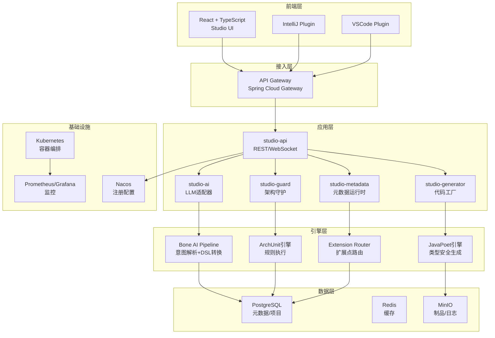

# BONE X Studio 实现方案

## 1. 项目概述

BONE X Studio 是新一代企业级 AI 原生研发操作系统，定位为 "开发者的工作空间"（Developer Workspace Platform）。产品采用双核心架构：

- **核心A：架构治理中心（Bone Studio）**——通过"架构即代码"保障核心领域架构确定性
- **核心B：元数据应用工厂（BONE Platform）**——通过"元数据驱动"赋能业务应用快速交付

## 2. 技术架构

### 2.1 整体架构

### 2.2 技术栈

| 层级 | 技术选型 | 版本 | 选型理由 |
|------|----------|------|----------|
| 前端框架 | React + TypeScript | 18.x | 复杂交互界面，生态成熟 |
| 代码编辑器 | Monaco Editor | 0.44+ | 类VSCode体验，语法高亮 |
| UI组件库 | Ant Design | 5.12+ | 企业级组件，设计规范 |
| 微前端 | Module Federation | 2.0+ | 独立部署，运行时集成 |
| API框架 | Spring Boot + WebFlux | 3.2+ | 高性能响应式，生态丰富 |
| API网关 | Spring Cloud Gateway | 2023+ | 路由灵活，性能优秀 |
| 代码生成 | JavaPoet + Freemarker | 1.13+ / 2.3+ | 类型安全+模板灵活 |
| AI适配 | LangChain4j / Spring AI | 0.30+ | 多模型统一抽象 |
| DSL解析 | ANTLR4 | 4.13+ | 工业级语法解析 |
| 架构守护 | ArchUnit + ASM | 1.2+ | 字节码分析，规则丰富 |
| 工作流引擎 | Apache Camel | 4.0+ | 企业集成模式丰富 |
| 规则引擎 | LiteFlow | 2.10+ | 业务规则编排 |
| 关系数据库 | PostgreSQL | 15+ | JSONB灵活，ACID保障 |
| 缓存 | Redis | 7.0+ | 高性能，数据结构丰富 |
| 消息队列 | RocketMQ | 5.1+ | 高可靠，事务消息 |
| 对象存储 | MinIO / S3 | - | 制品存储，审计日志 |
| 容器编排 | Kubernetes | 1.24+ | 云原生标准 |
| 服务注册 | Nacos | 2.2+ | 服务发现+配置管理 |
| 监控 | Prometheus + Grafana | - | 指标采集+可视化 |
| 链路追踪 | SkyWalking | 9.0+ | 分布式追踪，性能分析 |

## 3. 核心模块实现计划

### 3.1 架构治理中心（Core A）

#### 3.1.1 限界上下文设计器
- **实现内容**：拖拽式聚合根设计、关系映射、事件建模
- **技术实现**：
  - 前端：React Flow + TypeScript
  - 后端：Spring Boot + REST API
  - 数据存储：PostgreSQL JSONB

#### 3.1.2 AI业务建模引擎
- **实现内容**：自然语言→限界上下文→完整DDD模块生成
- **技术实现**：
  - 前端：React + Monaco Editor
  - 后端：LangChain4j + LLM API
  - 数据存储：PostgreSQL + Redis

#### 3.1.3 DDD脚手架生成器
- **实现内容**：四层架构代码生成（含CQRS L1/L2/L3）
- **技术实现**：
  - 后端：JavaPoet + Freemarker
  - 模板管理：PostgreSQL
  - 制品存储：MinIO

#### 3.1.4 架构守护系统
- **实现内容**：4条铁律+命名+CQRS+扩展点检测，CI阻断
- **技术实现**：
  - 后端：ArchUnit + ASM
  - CI集成：GitHub Actions / GitLab CI
  - 规则存储：PostgreSQL

#### 3.1.5 扩展点市场
- **实现内容**：企业级扩展能力复用平台
- **技术实现**：
  - 前端：React + Ant Design
  - 后端：Spring Boot + Redis
  - 插件存储：MinIO

### 3.2 元数据应用工厂（Core B）

#### 3.2.1 可视化实体建模器
- **实现内容**：拖拽创建实体、字段、关系、校验规则
- **技术实现**：
  - 前端：React Flow + Formily
  - 后端：Spring Boot + REST API
  - 数据存储：PostgreSQL JSONB

#### 3.2.2 代码生成引擎
- **实现内容**：实体→前后端代码（React/Vue + Spring Boot）
- **技术实现**：
  - 后端：JavaPoet + Freemarker
  - 模板管理：PostgreSQL
  - 制品存储：MinIO

#### 3.2.3 主数据管理（MDM）
- **实现内容**：主数据实体、质量规则、数据看板
- **技术实现**：
  - 前端：React + Ant Design Pro
  - 后端：Spring Boot + JPA
  - 数据存储：PostgreSQL

#### 3.2.4 企业集成引擎
- **实现内容**：连接器管理、可视化流程编排（Apache Camel内核）
- **技术实现**：
  - 前端：React Flow
  - 后端：Apache Camel + Spring Boot
  - 数据存储：PostgreSQL + Redis

#### 3.2.5 插件管理
- **实现内容**：Wasm插件热部署、沙箱隔离、版本回滚
- **技术实现**：
  - 后端：Spring Boot + Wasmtime
  - 插件存储：MinIO
  - 沙箱隔离：Docker

### 3.3 统一IAM与多租户

#### 3.3.1 用户与权限管理
- **实现内容**：用户/角色/权限/审计/多租户/SSO
- **技术实现**：
  - 前端：React + Ant Design
  - 后端：Spring Boot + SA-Token
  - 数据存储：PostgreSQL

#### 3.3.2 多租户架构
- **实现内容**：行级隔离、Schema隔离、数据库隔离
- **技术实现**：
  - 后端：Spring Boot + MyBatis拦截器
  - 数据存储：PostgreSQL + 多数据源

### 3.4 系统管理与运维

#### 3.4.1 配置管理
- **实现内容**：系统配置、环境配置、租户配置
- **技术实现**：
  - 前端：React + Ant Design
  - 后端：Spring Boot + Nacos
  - 数据存储：PostgreSQL + Redis

#### 3.4.2 监控与告警
- **实现内容**：系统监控、应用监控、告警管理
- **技术实现**：
  - 前端：React + Grafana嵌入
  - 后端：Spring Boot + Prometheus
  - 数据存储：PostgreSQL + Redis

#### 3.4.3 K8s部署管理
- **实现内容**：应用部署、资源管理、版本管理
- **技术实现**：
  - 前端：React + Ant Design
  - 后端：Spring Boot + Kubernetes Client
  - 数据存储：PostgreSQL

### 3.5 CLI与开发者工具

#### 3.5.1 命令行工具
- **实现内容**：代码生成、架构检查、部署管理
- **技术实现**：
  - 后端：Java + Picocli
  - 前端：Node.js + Commander

#### 3.5.2 IDE插件
- **实现内容**：IntelliJ IDEA插件、VSCode插件
- **技术实现**：
  - IntelliJ：Kotlin + Plugin SDK
  - VSCode：TypeScript + Extension API

## 4. 开发流程与里程碑

### 4.1 开发流程

1. **需求分析**：基于BONE_X.md文档，细化功能需求
2. **架构设计**：确定技术架构、模块划分、数据模型
3. **原型设计**：前端UI原型、API接口设计
4. **开发实现**：按模块进行开发
5. **测试验证**：单元测试、集成测试、性能测试
6. **部署上线**：Kubernetes部署、CI/CD配置

### 4.2 里程碑

| 阶段 | 时间 | 完成内容 |
|------|------|----------|
| **Phase 1: 基础架构搭建** | 4周 | 搭建Spring Boot微服务框架、前端微前端架构、数据库初始化 |
| **Phase 2: 核心A实现** | 8周 | 架构治理中心、限界上下文设计器、DDD脚手架生成器、架构守护系统 |
| **Phase 3: 核心B实现** | 8周 | 元数据应用工厂、可视化实体建模器、代码生成引擎、主数据管理 |
| **Phase 4: 共享能力实现** | 4周 | 统一IAM、多租户架构、系统管理、监控告警 |
| **Phase 5: 集成与测试** | 4周 | 模块集成、端到端测试、性能优化、安全审计 |
| **Phase 6: 部署与上线** | 2周 | Kubernetes部署、CI/CD配置、文档完善 |

## 5. 关键技术点解决方案

### 5.1 AI业务建模引擎
- **方案**：使用LangChain4j构建AI Pipeline，实现意图解析、实体抽取、DSL转换
- **实现**：
  - 前端：提供自然语言输入界面，实时反馈
  - 后端：使用LangChain4j连接LLM API，生成DDD模型
  - 数据存储：将生成的模型存储到PostgreSQL

### 5.2 架构守护系统
- **方案**：基于ArchUnit实现架构规则检查，集成到CI流程
- **实现**：
  - 定义4条铁律：依赖方向、Domain纯净度、充血模型、ACL防腐层
  - 实现自定义ArchUnit规则，检测架构违规
  - 集成到GitHub Actions，实现CI阻断

### 5.3 多租户架构
- **方案**：基于Shared Database + Shared Schema策略，通过tenant_id字段实现数据隔离
- **实现**：
  - 开发MyBatis拦截器，自动注入tenant_id
  - 实现租户上下文，贯穿整个请求生命周期
  - 支持行级隔离、Schema隔离、数据库隔离三种模式

### 5.4 微前端架构
- **方案**：使用Module Federation 2.0实现去中心化微前端架构
- **实现**：
  - 基座应用提供统一布局、导航框架和公共库
  - 各业务模块作为独立微应用动态加载
  - 实现模块联邦类型安全

### 5.5 代码生成引擎
- **方案**：结合JavaPoet和Freemarker，实现类型安全的代码生成
- **实现**：
  - 使用JavaPoet生成类型安全的Java代码
  - 使用Freemarker生成前端代码和配置文件
  - 支持模板自定义和版本管理

## 6. 部署与运维

### 6.1 Kubernetes部署
- **方案**：使用Helm Chart管理Kubernetes部署
- **实现**：
  - 为每个微服务创建Helm Chart
  - 配置资源请求和限制
  - 实现服务发现和负载均衡

### 6.2 CI/CD流程
- **方案**：使用GitHub Actions实现CI/CD
- **实现**：
  - 代码提交触发构建
  - 运行单元测试和架构检查
  - 构建Docker镜像并推送到镜像仓库
  - 部署到Kubernetes集群

### 6.3 监控与告警
- **方案**：使用Prometheus + Grafana实现监控
- **实现**：
  - 配置Spring Boot Actuator暴露指标
  - 使用Prometheus采集指标
  - 使用Grafana创建监控面板
  - 配置告警规则

## 7. 风险与依赖

### 7.1 风险
- **LLM API依赖**：AI建模能力依赖外部LLM API，可能存在稳定性和成本问题
- **架构复杂度**：双核心架构设计复杂，需要大量的集成和测试工作
- **性能挑战**：代码生成和架构检查可能对系统性能造成压力
- **安全风险**：多租户架构需要确保数据隔离和访问控制

### 7.2 依赖
- **外部服务**：LLM API、云存储服务
- **开源组件**：Spring Boot、React、ArchUnit、Apache Camel等
- **基础设施**：Kubernetes、PostgreSQL、Redis、RocketMQ

## 8. 结论

BONE X Studio 是一个复杂但强大的企业级研发操作系统，通过双核心架构解决了"架构不腐化"与"业务快交付"的矛盾。本实现方案基于现有代码库，结合最新的技术栈，为BONE X Studio的落地提供了详细的技术路径。

通过分阶段的开发计划和里程碑管理，我们可以有序地实现各个核心模块，并最终构建一个完整的企业级研发操作系统。