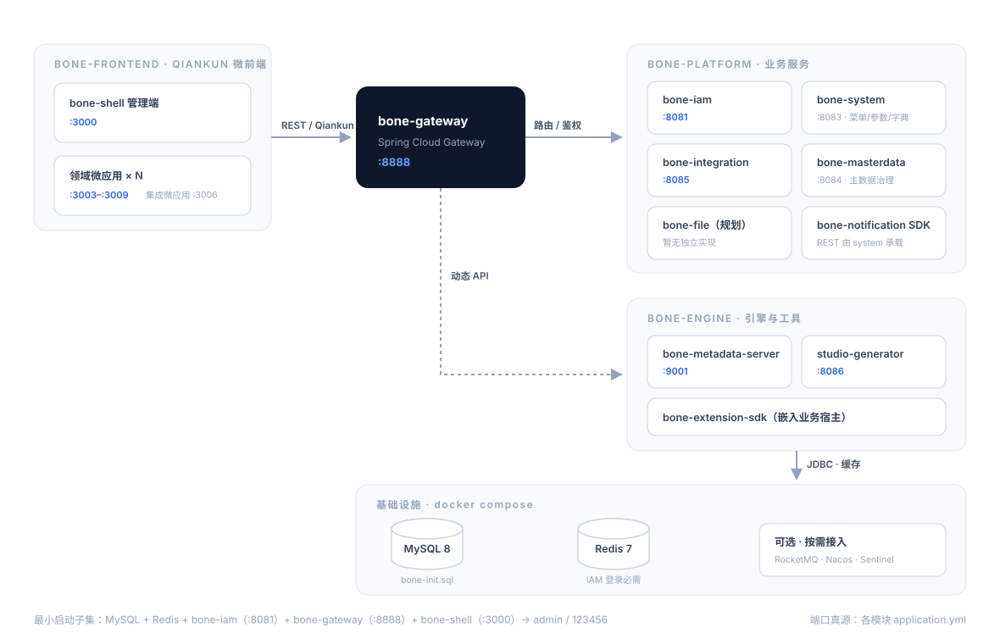

# Bone — Build Once, Natively Everywhere

**企业级全栈开源原生快速开发平台**


> **100% 开源免费 · 元数据驱动 · 四大引擎协同**
> **「构建可复用的系统，创造可持续的价值。」** —— 梅山

---

> **开源承诺**：本仓库全部代码以 [MIT](LICENSE) 协议开源、免费使用（含生产环境）。文中提及的「商业版」为未来 **服务形态** 规划（SLA 保障、技术支持等），不改变代码的开源属性。

## 阅读指引

| 你想了解… | 建议阅读 |
|-----------|----------|
| **产品定位、当前能力与演进方向** | 本文 |
| **工程实现、API、DDL、本地调试** | [doc/README.md](doc/README.md) → [架构规范](doc/architecture/README.md) · [本地构建](doc/wiki/03-本地开发与构建.md) |
| **AI 助手 / 贡献者门禁** | [AGENTS.md](AGENTS.md) · [CONTRIBUTING.md](CONTRIBUTING.md) |

**说明**：本文用于快速了解项目，不代替详细设计。具体接口、表结构、端口和实现状态以 `doc/`、OpenAPI 与代码为准。

---

## 目录

- [项目概述](#项目概述)
- [设计原则](#设计原则)
- [核心价值](#核心价值)
- [四大引擎](#四大引擎)
- [协同架构](#协同架构)
- [技术路线](#技术路线)
- [演进路线](#演进路线)
- [快速体验](#快速体验)
- [文档与社区](#文档与社区)
- [常见问题](#常见问题)
- [License](#license)

---

## 项目概述

Bone 以 **「Build Once, Natively Everywhere」** 为长期愿景：用**统一元数据**描述业务，用**标准化引擎**承载主数据、扩展与集成，让企业应用从「项目制重复建设」走向「平台化持续演进」。

产品层面对外称“四大引擎”；DDD 战略分类上，**元数据 / 建模是当前核心域**，主数据、扩展和集成是支撑域。产品能力与 DDD 投资分类用途不同，并不矛盾。

当前仓库是这一愿景的开源参考实现：元数据双模式、IAM、主数据、扩展管理和集成等能力已有代码和启动入口，完整度各不相同；尚未落地的能力在本文中明确标为“规划”或“目标”。

---

## 设计原则

以下原则用于指导架构与产品决策：

1. **元数据先行（Metadata-First）**  
   业务实体、字段、关系和规则尽量可配置、可版本化；复杂领域逻辑仍保留显式代码，避免为“可配置”牺牲可维护性。

2. **开闭原则（ExtPoint）**  
   核心流程稳定；行业差异、客户定制通过扩展点与插件注入，避免 fork 主干。

3. **单一可信数据源（Master Data）**  
   客户、组织、物料等核心对象形成权威主数据和统一视图，通过 API/SDK 分发并治理副本一致性。

4. **契约化集成（Integration）**  
   异构系统通过连接器与可编排流程对接；协议适配、幂等、重试、可观测性为一等公民。

5. **契约化 API（API-First）**  
   对外统一 `/api/v1/{domain}/**`；错误码、日志、多租户见 [Bone-API-规范](doc/architecture/Bone-API-规范.md)。

6. **实现状态可追溯**
   README 只做概览；落地状态以 [P0 看板](doc/wiki/07-P0-TODO看板.md)、模块详设和测试为准。

---

## 核心价值

### 开发效率

- **元数据驱动**：一次建模，驱动数据结构与访问行为；减少重复 CRUD 与样板工程。
- **双模式交付**：按场景选择 **模式 A · 生成式**（源码进 Git，可审计）或 **模式 B · 运行时**（动态 CRUD/API，减少标准代码生成）。详细对比见 [智能元数据引擎](#智能元数据引擎smart-metadata-engine)。
- **多端统一（愿景）**：一次建模，适配 Web 管理端、移动端 App、小程序——**Web 微前端（Qiankun）为当前主线**，移动端为规划路线。

### 企业级能力

- **身份与隔离**：RBAC、JWT 和租户上下文已形成基础能力；列级权限、SSO/MFA 按阶段完善。
- **一致性策略**：优先使用本地事务、幂等和 Outbox；确需跨服务强一致时再评估 Seata（AT/TCC）。
- **可观测性**：审计日志和部分指标已落地；链路追踪与统一监控仍在演进。

---

## 四大引擎

四大引擎是产品能力视图，不等同于四个 DDD 核心域。下文同时标注当前实现与演进目标，避免把路线图当成现状。模块关系见 [元数据能力对照](doc/design/modules/元数据能力-实现映射与竞品对照.md)。

### 智能元数据引擎（Smart Metadata Engine）

**定位**：平台核心域。用 **统一元模型（catalog）+ 可插拔的扩展字段存储** 描述业务，并提供两种互补的交付模式：

> 术语速览：**catalog**＝实体、字段和关系的登记册；**扩展字段**＝实体的动态扩展属性，SDK 提供三种存储模式——**预留列（默认推荐）**、**JSON 列**、**EAV 键值对**（极低频场景，非推荐首选）；**SmartQL**＝面向元模型的查询语言；**逃逸舱**＝标准能力覆盖不到时改用生成代码或手写代码。

| 模式 | 处理方式 | 适用场景 | 主要模块 |
|------|----------|----------|----------|
| **A · 生成式交付** | 元数据 → 生成可审计源码 → 编译部署 | 复杂领域逻辑、源码审计、深度定制 | `bone-metadata-sdk` + `bone-metadata-server` + `studio-generator` |
| **B · 运行时元数据面** | 元数据 → 运行时解释 → 动态 CRUD/API | 配置型实体、运营后台、SaaS 标准对象 | `bone-metadata-sdk` + `bone-metadata-engine` + `bone-metadata-server` |

```text
                    ┌── 模式 A：生成式（当前主线）
  meta_* 模型 ──────┤     server(catalog) → generator → Java/TS 工程 → sdk 仓储绑定物理表
                    │
                    └── 模式 B：运行时（MVP 已交付，能力演进中）
                          server(catalog) → engine → 动态 REST / SmartQL → sdk 直接读写库
```

**模式 A（生成式）** — 适合要求源码入库、包含复杂领域逻辑或需要与 ExtPoint 深度结合的场景。

**模式 B（运行时）** — 适合运营后台、配置型实体和多租户 SaaS 标准对象。**当前状态**：动态记录读写 MVP 已交付（`JdbcRuntimeRecordService` + `/api/v1/runtime/entities/{code}/records`，网关路由已配置，见 [P0 看板 META-002B](doc/wiki/07-P0-TODO看板.md)）；模型发布、热加载和低停机变更仍在演进。模式 B 成熟后，标准 CRUD 可不依赖生成器；生成器继续承担 DDD 骨架和深度定制代码的生成。

**共享能力（两模式共用）**：

| 能力方向 | 说明 |
|----------|------|
| 平台数据面 | **bone-metadata-sdk**：仓储、扩展字段三模式（预留列/JSON/EAV，默认预留列，分配失败自动降级 JSON）、多数据源方言（模式 B 的 JDBC 执行底座） |
| 建模控制面 | **bone-metadata-server**：catalog REST + 扩展字段 API（`:9001`） |
| 规则与动态访问 | **[bone-metadata-engine](bone-engine/bone-metadata-engine/)**：表达式/校验/SmartQL/动态 CRUD（模式 B 核心，逐步替代「为每张表生成代码」） |
| 权限与多租户 | 元数据绑定行级租户、列级规则（两模式统一策略） |
| 运行时演进 | 模型发布、热加载、低停机变更（引擎 + 发布流程分阶段实现） |
| 交付模式标注 | `meta_entity.delivery_mode`：`GENERATIVE` / `RUNTIME`（当前已落库） |

**相关代码**：[`bone-engine/bone-metadata-sdk`](bone-engine/bone-metadata-sdk/) · [`bone-engine/bone-metadata-server`](bone-engine/bone-metadata-server/) · [`bone-engine/bone-metadata-engine`](bone-engine/bone-metadata-engine/)（模式 B） · [`bone-engine/studio-generator`](bone-engine/studio-generator/)（模式 A） · 前端 [bone-metadata-app](bone-frontend/apps/bone-metadata-app/) · [bone-generator-app](bone-frontend/apps/bone-generator-app/)

> 能力对照与竞品：[元数据能力-实现映射与竞品对照](doc/design/modules/元数据能力-实现映射与竞品对照.md) §1.3、§3.3

---

### 企业主数据平台（Master Data Platform）

**定位**：形成核心主数据的权威记录与统一视图。

| 状态 | 能力 |
|------|------|
| **当前实现** | 主数据实体与记录管理、业务实体转换、JSON 导出、质量报告查询 |
| **演进目标** | 多品类治理、血缘追踪、清洗与质量评分、数据资产目录、标准 API/SDK 分发 |

**相关代码**：[`bone-platform/bone-masterdata`](bone-platform/bone-masterdata/) · [`bone-masterdata-app`](bone-frontend/apps/bone-masterdata-app/)

---

### ExtPoint 扩展引擎（Extension Engine）

**定位**：通过预定义扩展点注入差异化逻辑，尽量不修改核心流程代码。

| 状态 | 能力 |
|------|------|
| **当前实现** | 扩展点路由与缓存、表达式匹配、执行防护；Studio CRUD、版本、部署与回滚 |
| **演进目标** | 更完整的插件生命周期、制品隔离、沙箱执行、调用链观测和动态参数治理 |

**典型场景**：促销叠加、政务会签、行业 BOM 等。

**相关代码**：[`bone-engine/bone-extension-engine/bone-extension-sdk`](bone-engine/bone-extension-engine/bone-extension-sdk/) · [`bone-engine/bone-extension-engine/bone-extension-studio`](bone-engine/bone-extension-engine/bone-extension-studio/) · 前端 [bone-extension-app](bone-frontend/apps/bone-extension-app/)

---

### 集成引擎（Integration Engine）

**定位**：打通 ERP / CRM / OA / 协作与消息系统，构建企业数字生态链。

| 能力方向 | 目标 | 当前状态 |
|----------|------|-------------------|
| 多协议 | 按业务需要扩展协议连接器 | **REST/HTTP** 已实现；FTP/JDBC/MQ 返回 501 |
| 连接器工厂 | 标准化连接器 | CRUD + 连接测试（`int_connector`） |
| 流程编排 | 分支、并行、循环 | **线性** START→HTTP→END（INT-09） |
| 可靠性 | 重试、幂等、死信与最终一致性 | 执行日志 + 领域事件 + **MQ Outbox 中继**（INT-10 已交付，默认落日志，开启 `BONE_INTEGRATION_OUTBOX_MQ_ENABLED` 中继 RocketMQ） |
| Camel 编排 | 可视化 DSL 执行 | **Camel 编译器已交付**（INT-11）：`int_flow_node` 图 DSL → Camel 路由（choice/multicast）；默认执行仍为线性（INT-09），Camel 执行经 `integration.camel.execution-enabled` 启用 |

**相关代码**（唯一集成服务，勿与已移除的 engine 模块混淆）：

- 后端：[`bone-platform/bone-integration`](bone-platform/bone-integration/)（Maven 构件 `bone-platform-integration`，默认 `:8085`）
- 前端：[`bone-integration-app`](bone-frontend/apps/bone-integration-app/)（`:3006`，经 Shell `:3000` 加载）

交付进度：[P0 看板 · 集成](doc/wiki/07-P0-TODO看板.md#集成引擎bone-platformbone-integration) · 运维说明：[平台集成 README](bone-platform/bone-integration/README.md) · 收敛决策：[ADR-集成单模块](doc/architecture/ADR-integration-consolidation.md)

---

## 协同架构

- **元数据引擎**提供统一模型、仓储和两种交付路径。
- **主数据平台**基于元数据能力治理权威记录和数据质量。
- **扩展引擎**与**集成引擎**是可按场景组合的支撑能力，不构成必须串行经过的处理链路。

物理部署不要求四个独立进程。例如，集成能力由 `bone-platform/bone-integration` 单一进程承载，扩展 SDK 则嵌入业务宿主。

---

## 技术路线

| 层面 | 当前主线 | 演进方向 |
|------|----------|----------|
| 后端 | Java 17、Spring Boot 3.2、DDD + CQRS | 持续强化模块边界与契约测试 |
| 数据 | Bone Metadata SDK、MySQL、Redis | 元数据发布、热加载与低停机变更 |
| API 与安全 | REST、OpenAPI、Spring Security、JWT、Gateway | 更细粒度权限与统一治理 |
| 集成与可靠性 | HTTP、Camel 编译器、Outbox；RocketMQ 可选 | 更多连接器、流程运行时和可观测性 |
| 前端 | React 18、TypeScript、Vite 5、Ant Design 5、Qiankun | 模型驱动复用与多端适配 |
| 工程质量 | Spotless、ArchUnit、ESLint、Prettier、Vitest | 提升自动化测试和基准覆盖 |

Nacos、Sentinel、Seata、SkyWalking 等保留为按部署规模评估的技术选项，不作为所有场景的默认依赖。

---

## 演进路线

| 阶段 | 定位 | 重点 |
|------|------|------|
| **当前基线** | Build Once, Web First | 模式 A + 模式 B 运行时 MVP；catalog/扩展字段、IAM、主数据、扩展、集成已有实现 |
| **下一里程碑** | 强化运行时与工程闭环 | 模型发布/热加载、连接器扩展、数据血缘、统一可观测性和端到端验收 |
| **后续方向** | 行业与多端复用 | 行业模板、多端适配、插件生态；以真实项目验证后逐步交付 |

具体排期不在 README 承诺；交付状态与工程债见 [P0 看板](doc/wiki/07-P0-TODO看板.md) 和各模块详设。

---

## 快速体验

面向贡献者与评估者的 **最小路径**（完整端口见 [本地开发与构建](doc/wiki/03-本地开发与构建.md)）。

**开发环境拓扑**（端口真源为各模块 `application.yml`；最小登录路径见图下注释）：



### 环境要求

JDK 17+ · Maven 3.8+ · Node.js 18+ · MySQL 8+ · Redis 7.x（IAM 登录必需） · Git

### 常用环境变量

`BONE_DB_URL` · `BONE_DB_USERNAME` · `BONE_DB_PASSWORD` · `BONE_SERVER_PORT` · `BONE_GATEWAY_PORT`

> `BONE_DB_PASSWORD` 需与 MySQL root 口令一致。IAM、元数据服务等数据库客户端需要该变量；网关不连接数据库。环境变量只在当前终端及其子进程中生效，另开终端时需重新设置。

### 步骤

```bash
git clone https://gitee.com/meishan315/bone.git
cd bone

# 统一口令：与 MySQL root 保持一致；新终端需再次执行
export BONE_DB_PASSWORD=bone_dev_pass

# 数据库 + 缓存（方式一：docker compose，首次启动自动导入 bone-init.sql）
docker compose up -d mysql redis
# 方式二：自备 MySQL/Redis——先手动导 DDL：mysql -u root -p < bone-init.sql

# 后端（全量；仅验集成可用下一行子集）
mvn clean install -DskipTests
# mvn clean install -pl bone-platform/bone-integration -am -DskipTests

# IAM（新终端；先重新 export BONE_DB_PASSWORD）
export BONE_DB_PASSWORD=bone_dev_pass
cd bone-platform/bone-iam && mvn spring-boot:run -Dspring-boot.run.profiles=dev

# 网关（新终端；shell 前端代理指向 :8888，不启动则登录失败）
cd bone-platform/bone-gateway && mvn spring-boot:run

# 系统服务（新终端；Shell 首页概览和快捷操作依赖 :8083）
export BONE_DB_PASSWORD=bone_dev_pass
cd bone-platform/bone-system && mvn spring-boot:run -Dspring-boot.run.profiles=dev

# 集成（可选，另开终端；经网关访问见下表）
# cd bone-platform/bone-integration && mvn spring-boot:run

# 前端 Shell（新终端；仅启动 Shell，功能页需再启动对应微应用）
cd bone-frontend && npm ci && npm run dev
```

### 默认入口（启动对应服务后）

| 入口 | 地址 |
|------|------|
| 管理后台 Shell | http://localhost:3000 |
| 集成微前端 | http://localhost:3006（需单独启动 `bone-integration-app`，亦可从 Shell 菜单进入） |
| API 网关（推荐） | http://localhost:8888/api/v1/... |
| IAM | http://localhost:8081 |
| 集成 API（直连） | http://localhost:8085/api/v1/integration/... |
| 元数据服务 | http://localhost:9001 |
| Studio 生成器 | http://localhost:8086（模式 A 代码生成） |

- **端口速查**：integration `:8085` · studio-generator `:8086` · metadata-server `:9001`（默认 profile `local`；若以 `dev` profile 启动则为 `:8885`），无占用即可并行启动；各模块端口真源为各自 `application.yml` 与 [本地开发与构建](doc/wiki/03-本地开发与构建.md)
- 默认账号：`admin` / `123456`（首次登录请修改；与 `bone-init.sql` 一致）
- **口令对齐**：MySQL root 密码由 `BONE_DB_PASSWORD` 注入 docker compose 与 IAM dev profile。若数据卷已使用默认值 `bone_root_pass` 初始化，需在 IAM 所在终端设置 `BONE_DB_PASSWORD=bone_root_pass`
- DDL 策略：改 [bone-init.sql](bone-init.sql) 后重建库，见 [数据库开发规范](doc/architecture/数据库开发规范.md)
- 仓库中**无** `bone-admin` 模块；在线演示环境以社区公告为准

---

## 文档与社区

### 文档（仓库内 · 推荐）

- [doc/README.md](doc/README.md) — 总索引  
- [BONE 总体架构](doc/architecture/BONE-总体架构设计方案.md)  
- [Bone-API-规范](doc/architecture/Bone-API-规范.md)  
- [元数据三模块对照](doc/design/modules/元数据能力-实现映射与竞品对照.md)  
- [主 PRD](doc/prd/BONE产品需求文档正式版.md)  
- [引擎索引](bone-engine/README.md)

### 参与贡献

- [CONTRIBUTING.md](CONTRIBUTING.md) — 提交规范与 CI 说明  
- Issue / PR：[Gitee 仓库](https://gitee.com/meishan315/bone)  
- 欢迎：核心能力、连接器、插件、文档与翻译

### 社区与支持

- **代码仓库**：[https://gitee.com/meishan315/bone](https://gitee.com/meishan315/bone)  
- **微信公众号**：梅山见道（MeishanInsight）  
- **交流**：添加微信 `meishan-bone` 加入技术群  

[](https://gitee.com/meishan315/bone)

---

## 常见问题

**Q: 如何判断某项能力是否已经实现？**
A: 先看本文的“当前状态”，再以 OpenAPI、代码和测试为准；迭代范围见 [P0 看板](doc/wiki/07-P0-TODO看板.md)。

**Q: 启动失败？**  
A: 确认 JDK 17+、MySQL 已导入 `bone-init.sql`、端口无冲突；详见 [本地开发与构建](doc/wiki/03-本地开发与构建.md)。

**Q: API 路径规范？**  
A: 统一 `/api/v1/{domain}/**`，见 [Bone-API-规范](doc/architecture/Bone-API-规范.md)。

**Q: 集成服务在哪个目录？**  
A: 仅 **`bone-platform/bone-integration`**（构件 `bone-platform-integration`）；前端为 **`bone-integration-app`**。历史 `bone-engine/bone-integration` 已移除，见 [ADR-集成单模块](doc/architecture/ADR-integration-consolidation.md)。

**Q: 如何开发扩展插件？**  
A: 见 [扩展引擎使用指南](bone-engine/bone-extension-engine/docs/使用指南.md) 与 `bone-extension-sdk` 示例。

**Q: 有可参考的 DDD 工程样板吗？**  
A: [`bone-blueprint/`](bone-blueprint/) 是官方 DDD 参考实现（订单示例，`:8082`，包含 ArchUnit 门禁），新模块建议对照组织代码；另有 Go 对照实现 [`bone-engine/go-engine/`](bone-engine/go-engine/)（实验性）。

**Q: 生产部署？**  
A: 各模块 Spring Boot 可执行 JAR + 网关；环境变量见 [config/env/README.md](config/env/README.md)。完整生产指引将随 `doc/deployment/` 持续补充。

---

## License

本项目基于 [MIT](LICENSE) 协议开源，可免费商用；授权与版权声明以 LICENSE 文件为准。
