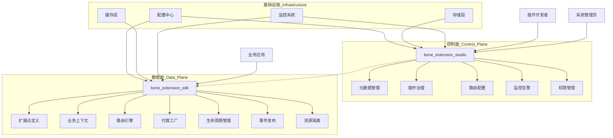
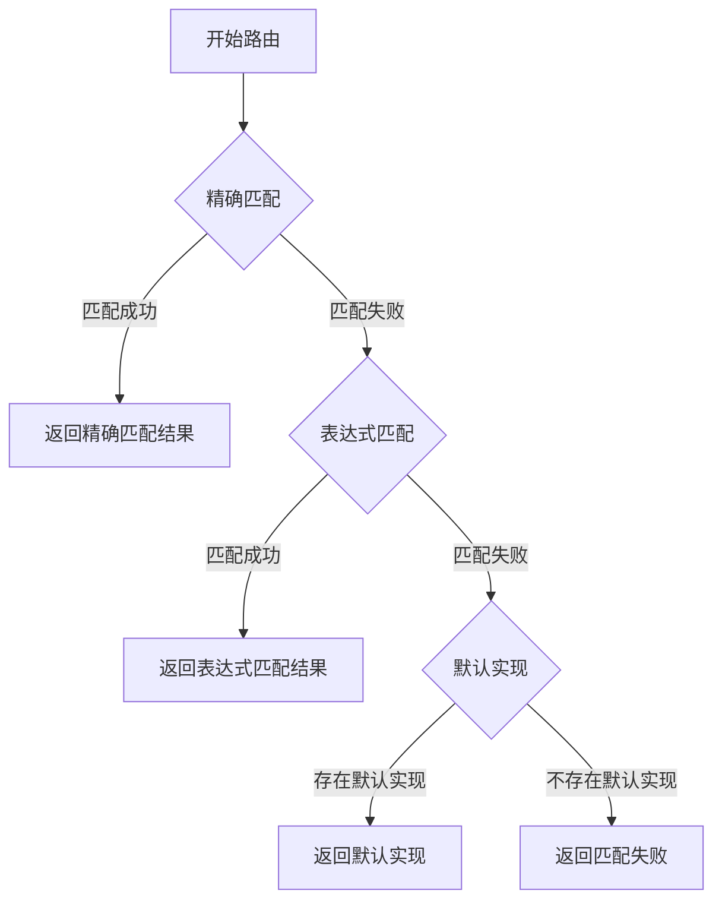

# Bone 扩展引擎设计方案

## 一、架构概述

### 1.1 产品定位

Bone 扩展引擎是一个轻量级、高性能的企业级插件化架构框架，旨在实现系统核心逻辑的稳定性与业务需求的灵活性之间的平衡。基于"开闭原则"，引擎通过标准化扩展点机制，允许在不修改核心代码的情况下动态注入定制化业务逻辑，从而快速响应业务变化、支持多租户定制化需求并降低系统维护成本。

### 1.2 核心设计理念

- **关注点分离**：将核心业务逻辑与可变业务逻辑分离，实现系统核心的稳定性与业务扩展的灵活性
- **标准化扩展**：提供统一的扩展点定义和实现规范，降低扩展开发和维护成本
- **智能路由**：基于多维度条件的智能路由机制，实现精准的扩展实现选择
- **完整生命周期**：从扩展点定义、实现、注册到执行的完整生命周期管理
- **高度可观测**：全面的监控、日志和追踪能力，确保扩展行为可监控、可诊断
- **安全隔离**：提供资源隔离、异常处理、权限控制等安全保障机制

### 1.3 典型应用场景

- **多租户SaaS平台**：为不同租户提供定制化的业务逻辑实现
- **行业解决方案**：针对不同行业客户的差异化需求提供扩展能力
- **功能灰度发布**：新功能的受控发布和验证，降低发布风险
- **A/B测试**：支持多版本功能的效果对比和数据收集
- **业务规则动态调整**：无需代码修改即可调整业务规则和逻辑
- **插件化架构**：构建可插拔的系统架构，支持第三方扩展开发

### 1.4 技术优势

- **低侵入性**：最小化对业务代码的侵入，易于集成和使用
- **高性能设计**：采用多级缓存、代理优化等机制确保扩展调用的低延迟
- **丰富的生态**：与主流框架（Spring Boot等）无缝集成
- **完善的工具链**：提供开发、测试、监控、管理的完整工具链
- **灵活的配置**：支持动态配置和热更新，提高运维效率

## 二、系统架构

### 2.1 二元架构设计

Bone 扩展引擎采用"SDK + 管理台"的二元架构设计，通过清晰的分层实现了扩展能力的标准化与可管理性：



二元架构的核心优势在于将运行时与管理能力解耦，既保证了SDK的轻量高效，又提供了强大的管理和监控能力。

#### 2.1.1 数据面（Data Plane）- bone-extension-sdk
- **轻量级嵌入式框架**：仅依赖核心库，最小化对业务应用的侵入
- **扩展点运行时**：负责扩展点的发现、路由、调用等核心功能
- **高性能设计**：采用多级缓存、代理优化等机制，确保扩展点调用的低延迟
- **资源隔离**：通过类加载器隔离、线程池隔离等机制确保扩展实现的安全运行
- **可观测性**：内置指标采集、链路追踪和日志记录能力

#### 2.1.2 控制面（Control Plane）- bone-extension-studio
- **元数据管理**：扩展点定义、版本控制、依赖分析和兼容性检查
- **插件生命周期治理**：上传、安装、升级、卸载插件全生命周期管理
- **路由规则配置**：可视化配置路由规则，支持表达式编辑与校验
- **监控与告警**：实时监控扩展点调用情况，异常告警与自动降级
- **权限与审计**：细粒度的权限控制和完整的操作审计日志

#### 2.1.3 基础设施层
- **配置中心**：统一管理扩展点配置，支持动态更新和版本控制
- **存储层**：持久化扩展点元数据、插件信息和配置历史
- **缓存层**：多级缓存架构，提高路由决策和扩展点调用性能
- **监控系统**：收集运行指标，提供可视化监控和告警能力

### 2.2 核心组件交互流程

扩展点调用的典型流程如下：

1. **初始化阶段**：
   - 扩展点扫描与注册
   - 路由规则加载与缓存
   - 扩展实例初始化

2. **调用阶段**：
   - 业务应用创建业务上下文（BizContext）
   - 代理工厂拦截扩展点调用
   - 路由引擎根据上下文匹配最佳扩展实现
   - 执行扩展实现并返回结果
   - 记录调用指标和日志

3. **管理阶段**：
   - 管理台监控扩展点调用情况
   - 动态调整路由规则和流量分配
   - 插件的上传、升级和卸载

这种分层架构设计确保了扩展引擎的高内聚、低耦合和易扩展性，同时提供了完善的可观测性和治理能力。

### 2.2 核心组件

#### 2.2.1 SDK 核心组件

- **扩展点注解（Annotation）**：定义扩展点和扩展实现的核心注解体系，包括`@ExtPoint`、`@Extension`、`@ExtPointDoc`等
- **业务上下文（BizContext）**：封装业务环境信息，作为扩展点调用和路由的核心依据，支持多维度属性
- **路由引擎（ExtPointRouter）**：基于上下文信息智能匹配最合适的扩展实现，支持精确匹配、表达式匹配和默认实现的三级路由策略
- **代理工厂（ExtPointProxyFactory）**：为扩展点接口创建动态代理，拦截调用并触发路由，内置缓存优化
- **扩展仓库（ExtPointRepository）**：存储和管理扩展点元数据和实现类信息，支持动态注册和发现
- **事件发布器（ExtensionEventPublisher）**：发布扩展点生命周期事件，支持同步和异步事件处理
- **配置管理器（ExtensionConfigManager）**：管理扩展点配置信息，支持动态更新和配置缓存
- **生命周期管理器（ExtensionLifecycle）**：管理扩展点的完整生命周期，包括初始化、前置处理、后置处理、异常处理和销毁
- **扩展加载器（ExtensionLoader）**：基于SPI机制和Spring容器自动发现和加载扩展点实现
- **安全管理器（ExtensionSecurityManager）**：提供扩展执行的安全保障，包括权限控制、资源限制和沙箱隔离
- **监控采集器（ExtensionMetricsCollector）**：采集扩展点调用指标，支持Prometheus等监控系统集成

#### 2.2.2 管理台核心组件

- **元数据管理**：扩展点定义、版本控制、依赖分析和兼容性检查，提供可视化的元数据浏览
- **插件治理**：插件的上传、安装、升级、卸载等全生命周期管理，支持依赖图谱展示和冲突检测
- **路由配置**：可视化配置路由规则，支持表达式编辑、语法校验和规则测试
- **监控中心**：扩展点调用次数、响应时间、成功率等指标监控，提供实时和历史数据展示
- **告警系统**：异常调用、性能异常、资源超限等告警机制，支持多渠道通知
- **灰度管理**：灰度发布策略配置、流量分配和效果监控
- **A/B测试**：实验创建、变体管理和效果分析
- **权限与审计**：细粒度的权限控制和完整的操作审计日志，满足合规性要求

## 三、核心功能设计

### 3.1 标准化扩展点

标准化扩展点是Bone扩展引擎的核心概念，通过清晰的接口定义和注解机制，实现业务逻辑的可插拔设计。

#### 3.1.1 扩展点定义

扩展点是业务流程中定义的标准化接口，通过 `@ExtPoint` 注解进行标记，作为业务系统与扩展实现之间的契约。扩展点接口应该遵循单一职责原则，接口设计简洁明了。

**设计模式应用**：采用工厂方法模式（Factory Method Pattern）和模板方法模式（Template Method Pattern）的结合，定义扩展点接口作为模板，各扩展实现作为具体工厂。

```java
@ExtPoint(name = "订单折扣计算", description = "不同场景下的订单折扣逻辑")
public interface OrderDiscountExtPoint {
    DiscountResult calculate(BizContext<Order> context);
}
```

**核心注解参数说明**：
- **name**: 扩展点的可读名称，用于管理台展示
- **description**: 扩展点的详细描述，说明其用途和适用场景
- **type**: 扩展点类型，默认为业务扩展（BUSINESS）
- **version**: 扩展点版本号，用于版本管理和兼容性控制
- **enabled**: 是否启用，默认为true
- **category**: 扩展点分类，用于组织和管理扩展点
- **priority**: 默认优先级，当多个扩展点需要协同工作时使用

#### 3.1.2 扩展点设计原则

1. **接口简洁原则**：扩展点接口应保持简洁，避免过度设计，通常只定义一个核心方法
2. **单一职责原则**：每个扩展点应专注于解决特定的业务问题
3. **合理抽象原则**：通过继承和组合实现接口的合理抽象和复用
4. **向前兼容原则**：接口演进应保持向后兼容，可通过默认方法等机制实现
5. **上下文传递原则**：通过BizContext统一传递业务上下文信息，避免接口参数过多

#### 3.1.3 扩展点版本管理

为了支持扩展点的演进和兼容性管理，Bone扩展引擎提供了完整的版本管理机制：

```java
@ExtPoint(
    name = "用户服务", 
    description = "用户信息管理服务",
    version = "2.0.0",
    deprecatedSince = "1.5.0",
    deprecatedIn = "3.0.0"
)
public interface UserService {
    UserDTO getUserById(String userId);
    
    // 新增方法，通过默认实现保持向后兼容
    default UserProfileDTO getUserProfile(String userId) {
        UserDTO user = getUserById(userId);
        return convertToProfile(user);
    }
    
    // 辅助方法
    private UserProfileDTO convertToProfile(UserDTO user) {
        // 转换逻辑
        return new UserProfileDTO();
    }
}

#### 3.1.4 扩展实现

扩展实现是对扩展点接口的具体实现，通过 `@Extension` 注解标记，定义了扩展的路由维度、执行优先级和灰度策略等关键属性。

```java
@Extension(
    point = "OrderDiscountExtPoint",
    name = "VIP大额订单折扣",
    description = "VIP租户大额订单的特殊折扣处理",
    tenantCode = "VIP_TENANT",
    bizCode = "ORDER",
    scenario = "NORMAL",
    priority = 100,
    condition = "#context.data.amount > 1000",
    version = "1.0.0",
    enabled = true
)
@Component
public class VipLargeOrderDiscount implements OrderDiscountExtPoint {
    @Override
    public DiscountResult calculate(BizContext<Order> context) {
        // VIP用户大额订单折扣逻辑
        Order order = context.getData();
        BigDecimal discountRate = order.getAmount().compareTo(new BigDecimal(5000)) > 0 ? 
            new BigDecimal(0.8) : new BigDecimal(0.9);
        
        return new DiscountResult(discountRate, order.getAmount().multiply(discountRate));
    }
}

@Extension(
    point = "OrderDiscountExtPoint",
    name = "默认订单折扣",
    description = "标准订单的默认折扣处理",
    tenantCode = "DEFAULT",
    bizCode = "ORDER",
    scenario = "NORMAL",
    priority = 50,
    version = "1.0.0"
)
@Component
public class DefaultOrderDiscount implements OrderDiscountExtPoint {
    @Override
    public DiscountResult calculate(BizContext<Order> context) {
        // 默认订单折扣逻辑
        return new DiscountResult(new BigDecimal(0.95), context.getData().getAmount().multiply(new BigDecimal(0.95)));
    }
}
```

**路由维度说明**：
- **point**: 目标扩展点接口或名称，指定实现的扩展点
- **name**: 扩展实现的可读名称
- **description**: 扩展实现的详细描述
- **tenantCode**: 租户编码，支持多租户隔离，使用"DEFAULT"表示默认实现
- **bizCode**: 业务域编码，标识业务领域，如"ORDER"、"PAYMENT"等
- **useCase**: 用例标识，标识具体业务用例，如"MEMBER_PAY"、"VIP_DISCOUNT"等
- **scenario**: 场景标识，进一步细化应用场景，如"CREATE"、"UPDATE"、"QUERY"等
- **condition**: 动态条件表达式，支持SpEL表达式，用于复杂条件的动态匹配
- **priority**: 优先级，当多个扩展匹配时，优先级高的优先执行
- **version**: 扩展实现的版本号，用于版本控制和灰度发布
- **enabled**: 是否启用该扩展实现
- **rolloutRate**: 灰度发布的流量比例（0-1）
- **rolloutType**: 灰度发布的类型，如PERCENTAGE（百分比）、USER_ID（用户ID哈希）等

#### 3.1.5 扩展实现最佳实践

1. **无状态设计**：扩展实现应尽量保持无状态，避免使用静态变量或成员变量存储状态信息
2. **依赖注入**：使用Spring的依赖注入机制注入所需的服务和组件
3. **异常处理**：实现适当的异常处理逻辑，避免异常直接传递给调用方
4. **性能考虑**：对于频繁调用的扩展，考虑使用缓存、异步处理等优化手段
5. **日志规范**：使用统一的日志格式，记录必要的上下文信息，但避免记录敏感数据
6. **参数校验**：对输入参数进行必要的校验，确保数据的合法性
7. **资源管理**：合理管理数据库连接、文件句柄等资源，避免资源泄露

#### 3.1.6 文档化支持

为了提升扩展点的可维护性和开发体验，Bone扩展引擎提供了丰富的文档化支持机制。通过 `@ExtPointDoc` 注解，开发者可以为扩展点提供详细的文档信息，这些信息将在管理台中展示，方便其他开发者理解和使用。

```java
@ExtPointDoc(
    title = "支付服务扩展点",
    description = "提供多种支付方式的统一接入接口",
    usage = "用于处理订单支付、会员支付等场景",
    parameters = { 
        @Parameter(name = "context", description = "业务上下文，包含支付请求信息") 
    },
    returnValue = @ReturnValue(description = "支付结果，包含支付状态、交易ID等信息"),
    examples = {
        @Example(
            title = "订单支付示例",
            description = "处理普通订单支付的示例",
            code = "BizContext<PaymentRequest> context = BizContext.of(\"ORDER\", \"DEFAULT\").data(paymentRequest).build();\nPaymentResult result = paymentService.processPayment(context);"
        )
    },
    since = "1.0.0",
    deprecated = false
)
@ExtPoint
public interface PaymentService {
    PaymentResult processPayment(BizContext<PaymentRequest> context);
}
```

文档化支持的核心优势：

1. **自文档化代码**：文档与代码紧密结合，确保文档的时效性和准确性
2. **统一的文档格式**：标准化的文档格式，便于阅读和理解
3. **管理台可视化**：在管理台中以结构化方式展示扩展点文档
4. **开发体验提升**：帮助开发者快速理解和使用扩展点
5. **API变更追踪**：通过版本信息追踪API的演进过程

### 3.2 智能路由与上下文传递

#### 3.2.1 业务上下文设计

业务上下文（`BizContext<T>`）是Bone扩展引擎的核心概念，作为数据载体在扩展点调用过程中传递业务信息。它提供了统一的上下文管理机制，支持丰富的数据操作API和多维度的元数据存储，是实现智能路由和灵活扩展的基础。

**核心元数据维度**：

- **租户标识（tenantCode）**：支持多租户场景下的路由隔离，"DEFAULT"表示默认租户
- **业务域（bizCode）**：标识业务领域，如"ORDER"、"PAYMENT"、"REFUND"
- **用例（useCase）**：标识具体业务用例，如"MEMBER_PAY"、"VIP_DISCOUNT"
- **场景（scenario）**：进一步细化业务场景，如"CREATE"、"UPDATE"、"QUERY"
- **环境（env）**：区分运行环境，如"DEV"、"TEST"、"PROD"
- **用户组（userGroup）**：标识用户或业务分组，如"GOLD"、"PLATINUM"、"DEFAULT"

**数据与元数据**：

- **业务数据（data）**：具体的业务数据对象，支持泛型
- **自定义属性（attributes）**：支持扩展的键值对，用于传递特定业务参数
- **请求元数据**：请求ID、时间戳、调用链等信息
- **标签信息（tags）**：用于路由和监控的特殊标记

**上下文操作API**：

```java
public class BizContext<T> {
    // 核心元数据
    private String tenantCode;       // 租户标识
    private String bizCode;          // 业务域
    private String useCase;          // 用例标识
    private String scenario;         // 场景标识
    private String env;              // 环境标识
    private String userGroup;        // 用户组
    
    // 扩展数据存储
    private T data;                  // 业务数据，泛型支持
    private Map<String, Object> attributes; // 自定义属性
    
    // 调用元数据
    private String requestId;        // 请求ID，全局唯一
    private Map<String, String> headers;     // 请求头信息
    private List<ExtensionTrace> traces;     // 调用链追踪信息
    private long startTimeMillis;    // 开始时间戳
    private Map<String, Object> tags;        // 标签信息，用于路由和监控
    
    // 私有构造函数，强制使用Builder创建实例
    private BizContext() {
        // 初始化必要的默认值
        this.startTimeMillis = System.currentTimeMillis();
        this.requestId = generateRequestId();
    }
    
    // 静态工厂方法
    public static <T> Builder<T> builder() {
        return new Builder<>();
    }
    
    // 简化创建方式
    public static <T> BizContext<T> of(String bizCode, String scenario) {
        return builder().bizCode(bizCode).scenario(scenario).build();
    }
    
    // 简化创建方式
    public static <T> BizContext<T> ofTenant(String tenantCode, String bizCode, String scenario) {
        return builder().tenantCode(tenantCode).bizCode(bizCode).scenario(scenario).build();
    }
    
    // 获取上下文属性
    public <V> V getAttribute(String key) {
        return attributes != null ? (V) attributes.get(key) : null;
    }
    
    // 安全获取上下文属性，提供默认值
    public <V> V getAttributeOrDefault(String key, V defaultValue) {
        V value = getAttribute(key);
        return value != null ? value : defaultValue;
    }
    
    // 设置上下文属性
    public void setAttribute(String key, Object value) {
        if (attributes == null) {
            attributes = new HashMap<>();
        }
        attributes.put(key, value);
    }
    
    // 批量设置上下文属性
    public void setAttributes(Map<String, Object> newAttributes) {
        if (attributes == null) {
            attributes = new HashMap<>();
        }
        if (newAttributes != null) {
            attributes.putAll(newAttributes);
        }
    }
    
    // 检查是否包含指定属性
    public boolean containsAttribute(String key) {
        return attributes != null && attributes.containsKey(key);
    }
    
    // 添加标签（用于路由和监控）
    public void addTag(String key, Object value) {
        if (tags == null) {
            tags = new HashMap<>();
        }
        tags.put(key, value);
    }
    
    // 获取标签值
    public <V> V getTag(String key) {
        return tags != null ? (V) tags.get(key) : null;
    }
    
    // 复制上下文，创建新实例
    public BizContext<T> copy() {
        Builder<T> builder = builder()
            .tenantCode(this.tenantCode)
            .bizCode(this.bizCode)
            .useCase(this.useCase)
            .scenario(this.scenario)
            .env(this.env)
            .userGroup(this.userGroup)
            .data(this.data)
            .requestId(this.requestId);
            
        // 复制标签
        if (this.tags != null) {
            builder.tags(new HashMap<>(this.tags));
        }
        
        // 复制属性
        if (this.attributes != null) {
            builder.attributes(new HashMap<>(this.attributes));
        }
        
        // 复制请求头
        if (this.headers != null) {
            builder.headers(new HashMap<>(this.headers));
        }
        
        // 复制追踪信息
        if (this.traces != null) {
            builder.traces(new ArrayList<>(this.traces));
        }
        
        return builder.build();
    }
    
    // 上下文合并
    public BizContext<T> merge(BizContext<?> other) {
        if (other == null) {
            return this;
        }
        
        BizContext<T> result = this.copy();
        
        // 合并核心元数据，非空值覆盖
        if (other.tenantCode != null) {
            result.tenantCode = other.tenantCode;
        }
        if (other.bizCode != null) {
            result.bizCode = other.bizCode;
        }
        if (other.useCase != null) {
            result.useCase = other.useCase;
        }
        if (other.scenario != null) {
            result.scenario = other.scenario;
        }
        if (other.env != null) {
            result.env = other.env;
        }
        if (other.userGroup != null) {
            result.userGroup = other.userGroup;
        }
        
        // 合并标签
        if (other.tags != null) {
            if (result.tags == null) {
                result.tags = new HashMap<>();
            }
            result.tags.putAll(other.tags);
        }
        
        // 合并属性
        if (other.attributes != null) {
            result.setAttributes(other.attributes);
        }
        
        return result;
    }
    
    // 生成唯一请求ID
    private static String generateRequestId() {
        return UUID.randomUUID().toString();
    }
    
    // Getter方法
    public String getTenantCode() {
        return tenantCode;
    }
    
    public String getBizCode() {
        return bizCode;
    }
    
    public String getUseCase() {
        return useCase;
    }
    
    public String getScenario() {
        return scenario;
    }
    
    public String getEnv() {
        return env;
    }
    
    public String getUserGroup() {
        return userGroup;
    }
    
    public T getData() {
        return data;
    }
    
    public String getRequestId() {
        return requestId;
    }
    
    public Map<String, String> getHeaders() {
        return headers;
    }
    
    public List<ExtensionTrace> getTraces() {
        return traces;
    }
    
    public long getStartTimeMillis() {
        return startTimeMillis;
    }
    
    public Map<String, Object> getTags() {
        return tags;
    }
    
    public Map<String, Object> getAttributes() {
        return attributes;
    }
    
    // Builder内部类
    public static class Builder<T> {
        private final BizContext<T> context;
        
        private Builder() {
            this.context = new BizContext<>();
        }
        
        public Builder<T> tenantCode(String tenantCode) {
            context.tenantCode = tenantCode;
            return this;
        }
        
        public Builder<T> bizCode(String bizCode) {
            context.bizCode = bizCode;
            return this;
        }
        
        public Builder<T> useCase(String useCase) {
            context.useCase = useCase;
            return this;
        }
        
        public Builder<T> scenario(String scenario) {
            context.scenario = scenario;
            return this;
        }
        
        public Builder<T> env(String env) {
            context.env = env;
            return this;
        }
        
        public Builder<T> userGroup(String userGroup) {
            context.userGroup = userGroup;
            return this;
        }
        
        public Builder<T> data(T data) {
            context.data = data;
            return this;
        }
        
        public Builder<T> attribute(String key, Object value) {
            context.setAttribute(key, value);
            return this;
        }
        
        public Builder<T> attributes(Map<String, Object> attributes) {
            context.setAttributes(attributes);
            return this;
        }
        
        public Builder<T> header(String key, String value) {
            if (context.headers == null) {
                context.headers = new HashMap<>();
            }
            context.headers.put(key, value);
            return this;
        }
        
        public Builder<T> headers(Map<String, String> headers) {
            context.headers = headers;
            return this;
        }
        
        public Builder<T> tags(Map<String, Object> tags) {
            context.tags = tags;
            return this;
        }
        
        public Builder<T> tag(String key, Object value) {
            context.addTag(key, value);
            return this;
        }
        
        public Builder<T> trace(ExtensionTrace trace) {
            if (context.traces == null) {
                context.traces = new ArrayList<>();
            }
            context.traces.add(trace);
            return this;
        }
        
        public Builder<T> traces(List<ExtensionTrace> traces) {
            context.traces = traces;
            return this;
        }
        
        public Builder<T> requestId(String requestId) {
            context.requestId = requestId;
            return this;
        }
        
        public BizContext<T> build() {
            // 验证必要的上下文信息
            validateContext();
            return context;
        }
        
        private void validateContext() {
            // 可以在这里添加必要的验证逻辑
            // 例如：确保bizCode不为null
        }
    }
}
```

#### 3.2.2 多维度路由策略

**设计模式应用**：Bone扩展引擎采用策略模式（Strategy Pattern）与责任链模式（Chain of Responsibility）相结合的方式实现多级路由决策。这种设计允许灵活组合不同的路由策略，并支持路由过程的可扩展性。

**核心路由组件**：

- **ExtensionRouterEngine**：路由引擎核心，负责协调整个路由过程
- **ExtensionRouter**：路由策略接口，定义路由决策方法
- **MultiDimensionExtensionRouter**：多维度路由器实现，基于多个维度进行匹配
- **ExpressionExtensionRouter**：表达式路由器，支持SpEL表达式匹配
- **DefaultExtensionRouter**：默认路由器，处理兜底逻辑
- **ExtensionRouteFilterChain**：路由过滤器链，对匹配结果进行进一步过滤

**评分机制设计**：

Bone扩展引擎采用多级评分机制进行路由匹配，每个维度都有对应的权重。通过累加各维度得分，选择评分最高的扩展实现作为最终路由目标。

| 匹配维度 | 评分规则 | 权重 | 说明 |
|---------|---------|------|------|
| 业务域匹配 | 完全匹配加100分 | 最高 | 确保业务边界，优先选择同业务域的实现 |
| 租户匹配 | 完全匹配加80分 | 高 | 支持多租户隔离，保障数据安全 |
| 环境匹配 | 完全匹配加70分 | 高 | 支持环境隔离，避免环境混淆 |
| 用例匹配 | 完全匹配加65分 | 中高 | 针对具体业务用例的精确匹配 |
| 场景匹配 | 完全匹配加60分 | 中高 | 针对业务场景的精确匹配 |
| 用户组匹配 | 完全匹配加50分 | 中 | 支持用户或业务分组的差异化逻辑 |
| 版本匹配 | 完全匹配加40分 | 中 | 支持版本控制和灰度发布 |
| 标签匹配 | 每匹配一个相关标签加10分 | 中低 | 支持通过标签进行灵活路由 |
| 时间窗口匹配 | 匹配加25分 | 中低 | 支持基于时间的特殊逻辑 |

**路由策略实现**：

```java
public interface RoutingStrategy {
    /**
     * 根据上下文和候选扩展点，选择合适的扩展实现
     * @param context 业务上下文
     * @param candidates 候选扩展点列表
     * @return 路由结果
     */
    RouteResult route(BizContext<?> context, List<ExtensionDefinition> candidates);
}

public class MultiDimensionExtensionRouter implements ExtensionRouter {
    @Override
    public RouteResult route(BizContext<?> context, List<ExtensionDefinition> candidates) {
        Objects.requireNonNull(context, "Context cannot be null");
        Objects.requireNonNull(candidates, "Candidates cannot be null");
        
        Map<ExtensionDefinition, Integer> scores = new HashMap<>();
        
        // 遍历候选扩展，计算每个扩展的匹配得分
        for (ExtensionDefinition candidate : candidates) {
            int score = calculateMatchScore(context, candidate);
            scores.put(candidate, score);
        }
        
        // 按得分排序，选择最高分的扩展
        return scores.entrySet().stream()
                .max(Map.Entry.comparingByValue())
                .map(entry -> new RouteResult(entry.getKey(), entry.getValue()))
                .orElseGet(() -> RouteResult.noMatch());
    }
    
    private int calculateMatchScore(BizContext<?> context, ExtensionDefinition definition) {
        int score = 0;
        
        // 业务域匹配
        if (matchField(context.getBizCode(), definition.getBizCode())) {
            score += 100;
        }
        
        // 租户匹配
        if (matchField(context.getTenantCode(), definition.getTenantCode())) {
            score += 80;
        }
        
        // 环境匹配
        if (matchField(context.getEnv(), definition.getEnv())) {
            score += 70;
        }
        
        // 用例匹配
        if (matchField(context.getUseCase(), definition.getUseCase())) {
            score += 65;
        }
        
        // 场景匹配
        if (matchField(context.getScenario(), definition.getScenario())) {
            score += 60;
        }
        
        // 用户组匹配
        if (matchField(context.getUserGroup(), definition.getUserGroup())) {
            score += 50;
        }
        
        // 版本匹配
        if (matchVersion(context.getVersion(), definition.getVersion())) {
            score += 40;
        }
        
        // 标签匹配
        score += calculateTagMatchScore(context.getTags(), definition.getTags());
        
        // 时间窗口匹配
        if (isWithinTimeWindow(definition)) {
            score += 25;
        }
        
        return score;
    }
    
    private boolean matchField(String contextValue, String definitionValue) {
        // 支持通配符匹配
        if (definitionValue == null || "*".equals(definitionValue)) {
            return true;
        }
        return contextValue != null && contextValue.equals(definitionValue);
    }
    
    private boolean matchVersion(String contextVersion, String definitionVersion) {
        // 版本匹配逻辑，支持通配符
        if (definitionVersion == null || "*".equals(definitionVersion)) {
            return true;
        }
        return contextVersion != null && definitionVersion != null && 
               contextVersion.equals(definitionVersion);
    }
    
    private int calculateTagMatchScore(Map<String, Object> contextTags, Map<String, Object> definitionTags) {
        if (contextTags == null || definitionTags == null) {
            return 0;
        }
        
        return definitionTags.entrySet().stream()
                .filter(entry -> contextTags.containsKey(entry.getKey()) && 
                                 contextTags.get(entry.getKey()).equals(entry.getValue()))
                .mapToInt(entry -> 10)
                .sum();
    }
    
    private boolean isWithinTimeWindow(ExtensionDefinition definition) {
        // 时间窗口匹配逻辑
        Date now = new Date();
        Date startTime = definition.getStartTime();
        Date endTime = definition.getEndTime();
        
        // 无时间限制的扩展总是匹配
        if (startTime == null && endTime == null) {
            return true;
        }
        
        // 检查是否在有效时间范围内
        boolean afterStart = (startTime == null) || now.after(startTime);
        boolean beforeEnd = (endTime == null) || now.before(endTime);
        
        return afterStart && beforeEnd;
    }
}

#### 3.2.3 三级路由策略

Bone扩展引擎采用三级路由策略，确保路由决策的精确性和灵活性，同时提供兜底机制保证系统稳定性。

**三级路由流程图**：



**1. 精确匹配阶段**

精确匹配是第一优先级，通过业务上下文的关键维度与扩展定义进行严格匹配：

- 匹配维度：租户(tenantCode)、业务域(bizCode)、场景(scenario)、环境(env)等核心属性
- 匹配规则：要求完全一致，不支持模糊匹配或部分匹配
- 优势：匹配效率高，路由结果明确，无歧义

```java
public class ExactMatchExtensionRouter implements ExtensionRouter {
    @Override
    public RouteResult route(BizContext<?> context, List<ExtensionDefinition> candidates) {
        Objects.requireNonNull(context, "Context cannot be null");
        Objects.requireNonNull(candidates, "Candidates cannot be null");
        
        for (ExtensionDefinition candidate : candidates) {
            if (isExactMatch(context, candidate)) {
                return new RouteResult(candidate, 1000); // 精确匹配设置高优先级分数
            }
        }
        return RouteResult.noMatch();
    }
    
    private boolean isExactMatch(BizContext<?> context, ExtensionDefinition definition) {
        // 检查是否为默认租户或默认环境的特殊情况
        boolean tenantMatch = isDefaultOrMatch(context.getTenantCode(), definition.getTenantCode());
        boolean environmentMatch = isDefaultOrMatch(context.getEnv(), definition.getEnv());
        
        // 核心属性必须完全匹配
        return tenantMatch && 
               environmentMatch &&
               Objects.equals(context.getBusinessDomain(), definition.getBusinessDomain()) &&
               Objects.equals(context.getUseCase(), definition.getUseCase()) &&
               Objects.equals(context.getScenario(), definition.getScenario());
    }
    
    private boolean isDefaultOrMatch(String contextValue, String definitionValue) {
        return "DEFAULT".equals(definitionValue) || Objects.equals(contextValue, definitionValue) || "*".equals(definitionValue);
    }
}
```

**2. 表达式匹配阶段**

当精确匹配失败时，进入表达式匹配阶段，通过SpEL表达式处理复杂的动态匹配条件：

- 支持SpEL表达式：基于Spring Expression Language，支持复杂的条件表达式
- 上下文变量：表达式可访问BizContext中的所有属性和业务数据
- 动态计算：根据运行时上下文动态计算匹配结果
- 适用场景：复杂的业务规则、个性化逻辑、动态条件判断

```java
public class ExpressionExtensionRouter implements ExtensionRouter {
    private final SpelExpressionParser expressionParser = new SpelExpressionParser();
    private final StandardEvaluationContext evaluationContext = new StandardEvaluationContext();
    
    @Override
    public RouteResult route(BizContext<?> context, List<ExtensionDefinition> candidates) {
        Objects.requireNonNull(context, "Context cannot be null");
        Objects.requireNonNull(candidates, "Candidates cannot be null");
        
        // 设置上下文变量，使表达式可以访问
        evaluationContext.setVariable("context", context);
        evaluationContext.setVariable("bizCode", context.getBizCode());
        evaluationContext.setVariable("scenario", context.getScenario());
        evaluationContext.setVariable("tenantCode", context.getTenantCode());
        evaluationContext.setVariable("env", context.getEnv());
        evaluationContext.setVariable("user", context.getAttribute("user"));
        evaluationContext.setVariable("data", context.getData());
        
        // 检查是否有匹配的表达式条件
        List<ExtensionDefinition> matched = new ArrayList<>();
        for (ExtensionDefinition candidate : candidates) {
            if (matchesExpression(context, candidate)) {
                matched.add(candidate);
            }
        }
        
        // 如果有多个匹配项，使用多维度评分机制选择最优的
        if (matched.size() > 0) {
            MultiDimensionExtensionRouter dimensionRouter = new MultiDimensionExtensionRouter();
            return dimensionRouter.route(context, matched);
        }
        
        return RouteResult.noMatch();
    }
    
    private boolean matchesExpression(BizContext<?> context, ExtensionDefinition definition) {
        String condition = definition.getCondition();
        if (condition == null || condition.isEmpty()) {
            return false;
        }
        
        try {
            Expression expression = expressionParser.parseExpression(condition);
            Boolean result = expression.getValue(evaluationContext, Boolean.class);
            return result != null && result;
        } catch (Exception e) {
            // 表达式解析错误，记录日志但不影响路由流程
            return false;
        }
    }
}
```

**3. 默认实现阶段**

当精确匹配和表达式匹配都失败时，系统会尝试查找默认实现，确保业务逻辑的连续性：

- 默认标识：通过tenantCode="DEFAULT"和优先级较低的配置识别默认实现
- 降级策略：提供统一的兜底逻辑，防止业务中断
- 全局默认：可以配置全局默认实现，作为最后的保障

```java
public class DefaultExtensionRouter implements ExtensionRouter {
    @Override
    public RouteResult route(ExtensionContext<?> context, List<ExtensionDefinition> candidates) {
        Objects.requireNonNull(context, "Context cannot be null");
        Objects.requireNonNull(candidates, "Candidates cannot be null");
        
        // 查找默认实现（tenantCode为DEFAULT）
        List<ExtensionDefinition> defaultExtensions = candidates.stream()
                .filter(def -> "DEFAULT".equals(def.getTenantCode()))
                .collect(Collectors.toList());
        
        if (defaultExtensions.isEmpty()) {
            return RouteResult.noMatch();
        }
        
        // 如果有多个默认实现，优先选择bizCode匹配的
        if (context.getBizCode() != null) {
            for (ExtensionDefinition def : defaultExtensions) {
                if (Objects.equals(context.getBizCode(), def.getBizCode())) {
                    return new RouteResult(def, 100);
                }
            }
        }
        
        // 返回第一个默认实现
        return new RouteResult(defaultExtensions.get(0), 50);
    }
}
```

**路由引擎集成**

三级路由策略通过RouterEngine进行统一协调，确保路由过程的顺序执行和结果处理：

```java
public class ExtensionRouterEngine {
    private final List<ExtensionRouter> extensionRouters = new ArrayList<>();
    
    public ExtensionRouterEngine() {
        // 按优先级注册路由策略
        extensionRouters.add(new ExactMatchExtensionRouter());
        extensionRouters.add(new ExpressionExtensionRouter());
        extensionRouters.add(new DefaultExtensionRouter());
    }
    
    public ExtensionDefinition route(BizContext<?> context, List<ExtensionDefinition> candidates) {
        Objects.requireNonNull(context, "Context cannot be null");
        Objects.requireNonNull(candidates, "Candidates cannot be null");
        
        // 依次尝试各级路由策略
        for (ExtensionRouter router : extensionRouters) {
            RouteResult result = router.route(context, candidates);
            if (result.isMatched()) {
                // 记录路由决策日志
                logRouteDecision(context, result);
                return result.getExtension();
            }
        }
        
        // 所有策略都未匹配成功
        throw new ExtensionNotFoundException("No matching extension found for context: " + context);
    }
    
    private void logRouteDecision(BizContext<?> context, RouteResult result) {
        // 记录路由决策日志，包含上下文信息和匹配结果
        // 实现日志记录逻辑，记录决策过程和结果
    }
}
```

**三级路由的优势**：

1. **精确性与灵活性平衡**：精确匹配确保关键场景的精确路由，表达式匹配提供灵活的动态条件处理
2. **性能优化**：优先使用高效的精确匹配，仅在必要时才执行复杂的表达式计算
3. **可靠性保障**：默认实现机制确保即使没有精确匹配的扩展，系统也能继续运行
4. **可扩展性**：每级路由都支持自定义扩展，可以根据业务需求调整匹配逻辑

### 3.3 插件生命周期管理

插件生命周期管理是Bone扩展引擎的核心特性之一，它提供了完整的扩展点生命周期控制机制，确保扩展点在各个阶段都能被正确初始化、调用和销毁。

#### 3.3.1 生命周期接口设计

Bone扩展引擎定义了标准的生命周期接口，允许开发者在扩展点的各个生命周期阶段执行自定义逻辑：

```java
public interface ExtensionLifecycle {
    /**
     * 扩展点初始化阶段，在Spring容器启动并扫描到扩展点后调用
     * 适用于资源初始化、配置加载等操作
     * 
     * @param extension 扩展点实例对象
     */
    default void initialize(Object extension) {
        // 默认空实现
    }
    
    /**
     * 扩展点调用前阶段，在目标方法执行前调用
     * 适用于参数校验、权限检查、日志记录等操作
     * 
     * @param extension 扩展点实例对象
     * @param method 被调用的方法
     * @param args 方法参数
     */
    default void beforeInvoke(Object extension, Method method, Object[] args) {
        // 默认空实现
    }
    
    /**
     * 扩展点调用后阶段，在目标方法成功执行后调用
     * 适用于结果处理、日志记录、资源清理等操作
     * 
     * @param extension 扩展点实例对象
     * @param method 被调用的方法
     * @param args 方法参数
     * @param result 方法返回结果
     */
    default void afterInvoke(Object extension, Method method, Object[] args, Object result) {
        // 默认空实现
    }
    
    /**
     * 扩展点异常阶段，在目标方法执行抛出异常时调用
     * 适用于异常处理、错误恢复、降级处理等操作
     * 
     * @param extension 扩展点实例对象
     * @param method 被调用的方法
     * @param args 方法参数
     * @param exception 抛出的异常
     */
    default void onException(Object extension, Method method, Object[] args, Exception exception) {
        // 默认空实现
    }
    
    /**
     * 扩展点销毁阶段，在应用关闭时调用
     * 适用于资源释放、连接关闭等操作
     * 
     * @param extension 扩展点实例对象
     */
    default void destroy(Object extension) {
        // 默认空实现
    }
}
```

#### 3.3.2 生命周期管理机制

Bone扩展引擎采用生命周期管理器统一协调扩展点的生命周期：

```java
public class ExtensionLifecycleManager {
    private final List<ExtensionLifecycle> lifecycleHandlers = new CopyOnWriteArrayList<>();
    
    /**
     * 注册生命周期处理器
     */
    public void registerLifecycleHandler(ExtensionLifecycle handler) {
        lifecycleHandlers.add(handler);
    }
    
    /**
     * 初始化扩展点
     */
    public void initializeExtension(Object extension) {
        for (ExtensionLifecycle handler : lifecycleHandlers) {
            try {
                handler.initialize(extension);
            } catch (Exception e) {
                // 记录异常但不中断初始化过程
                log.warn("Failed to initialize extension {}, handler: {}", 
                         extension.getClass().getSimpleName(), 
                         handler.getClass().getSimpleName(), e);
            }
        }
    }
    
    /**
     * 扩展点调用前处理
     */
    public void beforeInvoke(Object extension, Method method, Object[] args) {
        for (ExtensionLifecycle handler : lifecycleHandlers) {
            try {
                handler.beforeInvoke(extension, method, args);
            } catch (Exception e) {
                // 记录异常但不中断调用过程
                log.warn("Failed to execute beforeInvoke for extension {}, handler: {}", 
                         extension.getClass().getSimpleName(), 
                         handler.getClass().getSimpleName(), e);
            }
        }
    }
    
    // afterInvoke, onException, destroy 方法类似实现...
}
```

#### 3.3.3 生命周期事件体系

Bone扩展引擎集成了Spring事件机制，定义了完整的扩展点事件体系：

```java
// 基础事件类
public abstract class ExtensionEvent extends ApplicationEvent {
    private final String extensionName;
    private final String extensionType;
    
    public ExtensionEvent(Object source, String extensionName, String extensionType) {
        super(source);
        this.extensionName = extensionName;
        this.extensionType = extensionType;
    }
    
    // getter方法...
}

// 扩展点注册事件
public class ExtensionRegisteredEvent extends ExtensionEvent {
    private final String extPointName;
    private final Map<String, String> attributes;
    
    public ExtensionRegisteredEvent(Object source, String extensionName, 
                                   String extensionType, String extPointName) {
        super(source, extensionName, extensionType);
        this.extPointName = extPointName;
        this.attributes = new HashMap<>();
    }
    
    // getter和setter方法...
}

// 扩展点调用前事件
public class ExtensionInvokeBeforeEvent extends ExtensionEvent {
    private final Method method;
    private final Object[] args;
    private final String bizContext;
    
    // 构造函数和getter方法...
}

// 扩展点调用后事件
public class ExtensionInvokeAfterEvent extends ExtensionEvent {
    private final Method method;
    private final Object[] args;
    private final Object result;
    private final long executionTime;
    
    // 构造函数和getter方法...
}

// 扩展点异常事件
public class ExtensionInvokeExceptionEvent extends ExtensionEvent {
    private final Method method;
    private final Object[] args;
    private final Exception exception;
    private final long executionTime;
    
    // 构造函数和getter方法...
}

// 扩展点路由选择事件
public class ExtensionRouteSelectedEvent extends ExtensionEvent {
    private final String extPointName;
    private final BizContext<?> context;
    private final List<ExtensionDefinition> candidates;
    
    // 构造函数和getter方法...
}
```

### 3.6 灵活配置与动态更新

Bone扩展引擎提供完整的配置管理体系，支持多维度配置隔离、动态更新和配置验证，确保扩展实现的灵活性和可维护性。

#### 3.6.1 参数动态配置

提供基于配置中心的动态配置管理，支持配置热更新和变更通知：

```java
@Configuration
public class ExtensionConfigManager {
    
    private final ConfigCenterClient configCenterClient;
    private final Map<String, Map<String, Object>> configCache = new ConcurrentHashMap<>();
    private final Map<String, Set<ConfigChangeListener>> listeners = new ConcurrentHashMap<>();
    
    @Autowired
    public ExtensionConfigManager(ConfigCenterClient configCenterClient) {
        this.configCenterClient = configCenterClient;
        initConfigListener();
    }
    
    private void initConfigListener() {
        // 注册配置变更监听器
        configCenterClient.addChangeListener("bone.extension", (changedKeys) -> {
            changedKeys.forEach(key -> {
                // 刷新缓存
                configCache.remove(key);
                // 通知相关监听器
                notifyConfigChange(key);
            });
        });
    }
    
    public <T> T getConfig(String key, Class<T> type, T defaultValue) {
        try {
            return configCache.computeIfAbsent(key, k -> {
                Map<String, Object> config = configCenterClient.getConfigMap(k);
                return Collections.unmodifiableMap(config);
            }).computeIfAbsent(type.getName(), t -> {
                T value = configCenterClient.getValue(key, type);
                return value != null ? value : defaultValue;
            });
        } catch (Exception e) {
            // 配置获取失败，返回默认值
            log.warn("Failed to get config for key: {}, using default value", key, e);
            return defaultValue;
        }
    }
    
    public <T> T getConfigByContext(ExtensionContext<?> context, String configKey, Class<T> type, T defaultValue) {
        // 构建租户+业务+场景的配置键
        String contextKey = buildContextConfigKey(context, configKey);
        
        // 优先获取上下文特定配置
        T value = getConfig(contextKey, type, null);
        if (value != null) {
            return value;
        }
        
        // 回退到默认配置
        return getConfig(configKey, type, defaultValue);
    }
    
    private String buildContextConfigKey(ExtensionContext<?> context, String baseKey) {
        StringBuilder keyBuilder = new StringBuilder(baseKey);
        
        if (context.getTenantId() != null) {
            keyBuilder.append(".tenant.").append(context.getTenantId());
        }
        
        if (context.getBusinessDomain() != null) {
            keyBuilder.append(".domain.").append(context.getBusinessDomain());
        }
        
        if (context.getEnvironment() != null) {
            keyBuilder.append(".env.").append(context.getEnvironment());
        }
        
        if (context.getScenario() != null) {
            keyBuilder.append(".scenario.").append(context.getScenario());
        }
        
        return keyBuilder.toString();
    }
    
    public void addConfigChangeListener(String configKey, ConfigChangeListener listener) {
        listeners.computeIfAbsent(configKey, k -> ConcurrentHashMap.newKeySet()).add(listener);
    }
    
    private void notifyConfigChange(String configKey) {
        Set<ConfigChangeListener> keyListeners = listeners.get(configKey);
        if (keyListeners != null) {
            keyListeners.forEach(listener -> {
                try {
                    listener.onConfigChange(configKey);
                } catch (Exception e) {
                    log.error("Error notifying config change for key: {}", configKey, e);
                }
            });
        }
    }
    
    public interface ConfigChangeListener {
        void onConfigChange(String configKey);
    }
}
```

配置中心客户端实现：

```java
public interface ConfigCenterClient {
    <T> T getValue(String key, Class<T> type);
    Map<String, Object> getConfigMap(String key);
    void addChangeListener(String namespace, ConfigChangeCallback callback);
}

// Nacos实现示例
@Component
public class NacosConfigCenterClient implements ConfigCenterClient {
    
    private final ConfigService configService;
    
    @Autowired
    public NacosConfigCenterClient(ConfigService configService) {
        this.configService = configService;
    }
    
    @Override
    public <T> T getValue(String key, Class<T> type) {
        try {
            String dataId = key;
            String group = "DEFAULT_GROUP";
            String config = configService.getConfig(dataId, group, 5000);
            
            if (type == String.class) {
                return type.cast(config);
            } else if (type == Integer.class) {
                return type.cast(Integer.parseInt(config));
            } else if (type == Boolean.class) {
                return type.cast(Boolean.parseBoolean(config));
            } else if (type == Double.class) {
                return type.cast(Double.parseDouble(config));
            } else {
                // JSON转换
                return JsonUtils.parseObject(config, type);
            }
        } catch (Exception e) {
            log.error("Failed to get config from Nacos for key: {}", key, e);
            return null;
        }
    }
    
    @Override
    public Map<String, Object> getConfigMap(String key) {
        try {
            String dataId = key;
            String group = "DEFAULT_GROUP";
            String config = configService.getConfig(dataId, group, 5000);
            
            if (config != null && (config.startsWith("{") || config.startsWith("["))) {
                return JsonUtils.parseObject(config, new TypeReference<Map<String, Object>>() {});
            }
            return Collections.emptyMap();
        } catch (Exception e) {
            log.error("Failed to get config map from Nacos for key: {}", key, e);
            return Collections.emptyMap();
        }
    }
    
    @Override
    public void addChangeListener(String namespace, ConfigChangeCallback callback) {
        try {
            String dataId = namespace + ".*";  // 监听指定命名空间下的所有配置
            String group = "DEFAULT_GROUP";
            
            configService.addListener(dataId, group, new Listener() {
                @Override
                public Executor getExecutor() {
                    return null;  // 使用默认线程池
                }
                
                @Override
                public void receiveConfigInfo(String configInfo) {
                    // 提取变化的配置键
                    List<String> changedKeys = extractChangedKeys(namespace, configInfo);
                    callback.onConfigChanged(changedKeys);
                }
            });
        } catch (Exception e) {
            log.error("Failed to add config change listener for namespace: {}", namespace, e);
        }
    }
    
    private List<String> extractChangedKeys(String namespace, String configInfo) {
        // 实现配置变更解析逻辑
        // ...
        return Collections.emptyList();
    }
    
    public interface ConfigChangeCallback {
        void onConfigChanged(List<String> changedKeys);
    }
}
```

#### 3.6.2 配置隔离机制

支持多维度的配置隔离，确保不同租户、业务场景使用正确的配置：

```java
public class ConfigIsolationManager {
    
    @Autowired
    private ExtensionConfigManager configManager;
    
    public <T> T getConfig(ExtensionContext<?> context, String configKey, Class<T> type, T defaultValue) {
        // 构建多维度配置路径
        List<String> configPaths = buildConfigPaths(context, configKey);
        
        // 按优先级顺序查找配置
        for (String path : configPaths) {
            T value = configManager.getConfig(path, type, null);
            if (value != null) {
                return value;
            }
        }
        
        // 所有路径都未找到，返回默认值
        return defaultValue;
    }
    
    private List<String> buildConfigPaths(ExtensionContext<?> context, String baseKey) {
        List<String> paths = new ArrayList<>();
        
        // 1. 完整路径：租户+业务域+环境+场景
        if (context.getTenantId() != null && context.getBusinessDomain() != null && 
            context.getEnvironment() != null && context.getScenario() != null) {
            paths.add(baseKey + ".tenant." + context.getTenantId() + ".domain." + 
                      context.getBusinessDomain() + ".env." + context.getEnvironment() + 
                      ".scenario." + context.getScenario());
        }
        
        // 2. 租户+业务域
        if (context.getTenantId() != null && context.getBusinessDomain() != null) {
            paths.add(baseKey + ".tenant." + context.getTenantId() + ".domain." + context.getBusinessDomain());
        }
        
        // 3. 租户+场景
        if (context.getTenantId() != null && context.getScenario() != null) {
            paths.add(baseKey + ".tenant." + context.getTenantId() + ".scenario." + context.getScenario());
        }
        
        // 4. 业务域+场景
        if (context.getBusinessDomain() != null && context.getScenario() != null) {
            paths.add(baseKey + ".domain." + context.getBusinessDomain() + ".scenario." + context.getScenario());
        }
        
        // 5. 租户+环境
        if (context.getTenantId() != null && context.getEnvironment() != null) {
            paths.add(baseKey + ".tenant." + context.getTenantId() + ".env." + context.getEnvironment());
        }
        
        // 6. 仅租户
        if (context.getTenantId() != null) {
            paths.add(baseKey + ".tenant." + context.getTenantId());
        }
        
        // 7. 仅业务域
        if (context.getBusinessDomain() != null) {
            paths.add(baseKey + ".domain." + context.getBusinessDomain());
        }
        
        // 8. 仅环境
        if (context.getEnvironment() != null) {
            paths.add(baseKey + ".env." + context.getEnvironment());
        }
        
        // 7. 仅场景
        if (context.getScenario() != null) {
            paths.add(baseKey + ".scenario." + context.getScenario());
        }
        
        // 8. 默认路径
        paths.add(baseKey);
        
        return paths;
    }
    
    // 配置验证和类型转换
    public <T> T getValidatedConfig(ExtensionContext<?> context, String configKey, Class<T> type, 
                                   T defaultValue, Predicate<T> validator) {
        T value = getConfig(context, configKey, type, defaultValue);
        
        // 验证配置有效性
        if (value != null && validator.test(value)) {
            return value;
        }
        
        // 配置无效，返回默认值并记录警告
        log.warn("Config validation failed for key: {}, using default value", configKey);
        return defaultValue;
    }
}
```

#### 3.6.3 配置验证与容错

提供配置验证机制和容错策略，确保配置异常时系统仍能正常运行：

```java
public class ConfigValidator {
    
    public static <T> boolean validate(T value, ConfigValidation validation) {
        if (value == null) {
            return validation.allowNull();
        }
        
        if (value instanceof String) {
            String strValue = (String) value;
            if (validation.minLength() > 0 && strValue.length() < validation.minLength()) {
                return false;
            }
            if (validation.maxLength() > 0 && strValue.length() > validation.maxLength()) {
                return false;
            }
            if (validation.pattern() != null && !validation.pattern().isEmpty()) {
                return Pattern.matches(validation.pattern(), strValue);
            }
        } else if (value instanceof Number) {
            double numValue = ((Number) value).doubleValue();
            if (validation.min() > Double.NEGATIVE_INFINITY && numValue < validation.min()) {
                return false;
            }
            if (validation.max() < Double.POSITIVE_INFINITY && numValue > validation.max()) {
                return false;
            }
        } else if (value instanceof Collection) {
            Collection<?> collection = (Collection<?>) value;
            if (validation.minSize() > 0 && collection.size() < validation.minSize()) {
                return false;
            }
            if (validation.maxSize() > 0 && collection.size() > validation.maxSize()) {
                return false;
            }
        }
        
        return true;
    }
    
    // 配置验证注解
    @Retention(RetentionPolicy.RUNTIME)
    @Target({ElementType.FIELD})
    public @interface ConfigValidation {
        boolean allowNull() default true;
        int minLength() default 0;
        int maxLength() default Integer.MAX_VALUE;
        String pattern() default "";
        double min() default Double.NEGATIVE_INFINITY;
        double max() default Double.POSITIVE_INFINITY;
        int minSize() default 0;
        int maxSize() default Integer.MAX_VALUE;
    }
}

// 配置容错处理
public class ConfigFaultTolerance {
    
    // 配置降级策略
    public static <T> T handleConfigFault(String configKey, Class<T> type, T defaultValue, Exception ex) {
        // 记录异常
        log.error("Config error for key: {}, using fallback value", configKey, ex);
        
        // 根据异常类型决定降级策略
        if (ex instanceof ConfigTimeoutException) {
            // 超时异常，尝试使用本地缓存
            return getFromLocalCache(configKey, type, defaultValue);
        } else if (ex instanceof ConfigParseException) {
            // 解析异常，尝试使用默认格式
            return parseWithDefaultFormat(configKey, type, defaultValue);
        } else {
            // 其他异常，直接返回默认值
            return defaultValue;
        }
    }
    
    private static <T> T getFromLocalCache(String key, Class<T> type, T defaultValue) {
        // 从本地缓存获取配置
        // ...
        return defaultValue;
    }
    
    private static <T> T parseWithDefaultFormat(String key, Class<T> type, T defaultValue) {
        // 尝试使用默认格式解析
        // ...
        return defaultValue;
    }
}
```

#### 3.6.4 配置版本管理

支持配置的版本控制，便于追踪配置变更历史和回滚：

```java
public class ConfigVersionManager {
    
    private final ConfigVersionRepository versionRepository;
    
    @Autowired
    public ConfigVersionManager(ConfigVersionRepository versionRepository) {
        this.versionRepository = versionRepository;
    }
    
    // 保存配置版本
    public void saveConfigVersion(String configKey, Object configValue, String operator, String comment) {
        ConfigVersion version = new ConfigVersion();
        version.setConfigKey(configKey);
        version.setConfigValue(JsonUtils.toJsonString(configValue));
        version.setOperator(operator);
        version.setComment(comment);
        version.setCreateTime(LocalDateTime.now());
        version.setVersion(generateVersion());
        
        versionRepository.save(version);
    }
    
    // 获取配置历史版本
    public List<ConfigVersion> getConfigHistory(String configKey, int limit) {
        return versionRepository.findTopByConfigKeyOrderByCreateTimeDesc(configKey, limit);
    }
    
    // 回滚到指定版本
    public boolean rollbackToVersion(String configKey, String versionId, String operator) {
        ConfigVersion version = versionRepository.findByIdAndConfigKey(versionId, configKey);
        if (version == null) {
            return false;
        }
        
        try {
            // 解析历史配置值
            Object configValue = JsonUtils.parse(version.getConfigValue(), Object.class);
            
            // 更新当前配置
            ExtensionConfigManager configManager = SpringContextHolder.getBean(ExtensionConfigManager.class);
            configManager.updateConfig(configKey, configValue);
            
            // 记录回滚操作
            saveConfigVersion(configKey, configValue, operator, "Rollback to version: " + version.getVersion());
            
            return true;
        } catch (Exception e) {
            log.error("Failed to rollback config {} to version {}", configKey, versionId, e);
            return false;
        }
    }
    
    private String generateVersion() {
        // 生成版本号，格式：YYYYMMDD.HHMMSS.SSS
        return DateTimeFormatter.ofPattern("yyyyMMdd.HHmmss.SSS").format(LocalDateTime.now());
    }
}

// 配置版本实体
public class ConfigVersion {
    private String id;
    private String configKey;
    private String configValue;
    private String operator;
    private String comment;
    private LocalDateTime createTime;
    private String version;
    // getter/setter方法...
}

## 四、技术实现方案

### 4.1 核心注解实现

#### 4.1.1 ExtPoint注解

```java
@Target(ElementType.TYPE)
@Retention(RetentionPolicy.RUNTIME)
@Documented
public @interface ExtPoint {
    String name() default "";
    String description() default "";
    ExtensionType type() default ExtensionType.BUSINESS;
    String version() default "1.0.0";
    boolean enabled() default true;
}
```

#### 4.1.2 Extension注解

```java
@Target(ElementType.TYPE)
@Retention(RetentionPolicy.RUNTIME)
@Documented
@Component
public @interface Extension {
    Class<?> point();
    String tenantId() default "DEFAULT";
    String businessDomain() default "DEFAULT";
    String useCase() default "DEFAULT";
    String scenario() default "DEFAULT";
    String condition() default "";
    int priority() default 0;
    boolean enabled() default true;
    String name() default "";
}
```

### 4.2 业务上下文实现

```java
import java.io.Serializable;
import java.time.LocalDateTime;
import java.util.Collections;
import java.util.HashMap;
import java.util.Map;
import java.util.Objects;

public class ExtensionContext<T> implements Serializable {
    private static final long serialVersionUID = 1L;
    
    private final String tenantId;
    private final String businessDomain;
    private final String useCase;
    private final String scenario;
    private final String environment;
    private final String group;
    private final T payload;
    private final LocalDateTime createTime;
    private final ThreadLocal<Map<String, Object>> attributes = ThreadLocal.withInitial(HashMap::new);
    private final Map<String, String> metadata = new HashMap<>();
    
    // 私有构造函数，确保通过Builder或静态工厂方法创建实例
    private ExtensionContext(String tenantId, String businessDomain, String useCase, String scenario, T payload) {
        this.tenantId = tenantId;
        this.businessDomain = businessDomain;
        this.useCase = useCase;
        this.scenario = scenario;
        this.environment = null;
        this.group = null;
        this.payload = payload;
        this.createTime = LocalDateTime.now();
    }
    
    // 私有构造函数，支持环境和分组
    private ExtensionContext(String tenantId, String businessDomain, String useCase, String scenario, String environment, String group, T payload) {
        this.tenantId = tenantId;
        this.businessDomain = businessDomain;
        this.useCase = useCase;
        this.scenario = scenario;
        this.environment = environment;
        this.group = group;
        this.payload = payload;
        this.createTime = LocalDateTime.now();
    }
    
    // 静态工厂方法
    public static <T> ExtensionContext<T> create() {
        return ExtensionContext.<T>builder().build();
    }
    
    public static <T> ExtensionContext<T> ofTenant(String tenantId) {
        return ExtensionContext.<T>builder().tenantId(tenantId).build();
    }
    
    public static <T> ExtensionContext<T> ofBusiness(String businessDomain) {
        return ExtensionContext.<T>builder().businessDomain(businessDomain).build();
    }
    
    public static <T> ExtensionContext<T> of(String tenantId, String businessDomain) {
        return ExtensionContext.<T>builder().tenantId(tenantId).businessDomain(businessDomain).build();
    }
    
    // 实例方法 - 创建新实例
    public ExtensionContext<T> withScenario(String scenario) {
        return new ExtensionContext<>(tenantId, businessDomain, useCase, scenario, environment, group, payload);
    }
    
    public ExtensionContext<T> withEnvironment(String environment) {
        return new ExtensionContext<>(tenantId, businessDomain, useCase, scenario, environment, group, payload);
    }
    
    public ExtensionContext<T> withGroup(String group) {
        return new ExtensionContext<>(tenantId, businessDomain, useCase, scenario, environment, group, payload);
    }
    
    public ExtensionContext<T> withPayload(T payload) {
        return new ExtensionContext<>(tenantId, businessDomain, useCase, scenario, environment, group, payload);
    }
    
    // 属性操作方法（线程安全）
    public ExtensionContext<T> withAttribute(String key, Object value) {
        Objects.requireNonNull(key, "Attribute key must not be null");
        attributes().put(key, value);
        return this;
    }
    
    public ExtensionContext<T> withAttributes(Map<String, Object> attributes) {
        Objects.requireNonNull(attributes, "Attributes map must not be null");
        this.attributes().putAll(attributes);
        return this;
    }
    
    @SuppressWarnings("unchecked")
    public <V> V getAttribute(String key) {
        if (key == null) {
            return null;
        }
        return (V) this.attributes().get(key);
    }
    
    public boolean hasAttribute(String key) {
        return key != null && attributes().containsKey(key);
    }
    
    // 合并上下文
    public ExtensionContext<T> merge(ExtensionContext<T> other) {
        Objects.requireNonNull(other, "Other context must not be null");
        
        ExtensionContextBuilder<T> builder = ExtensionContext.<T>builder()
                .tenantId(this.tenantId != null ? this.tenantId : other.tenantId)
                .businessDomain(this.businessDomain != null ? this.businessDomain : other.businessDomain)
                .useCase(this.useCase != null ? this.useCase : other.useCase)
                .scenario(this.scenario != null ? this.scenario : other.scenario)
                .environment(this.environment != null ? this.environment : other.environment)
                .group(this.group != null ? this.group : other.group)
                .payload(this.payload != null ? this.payload : other.payload);
        
        // 合并属性（other中的属性优先）
        Map<String, Object> mergedAttributes = new HashMap<>(attributes());
        mergedAttributes.putAll(other.attributes());
        builder.attributes(mergedAttributes);
        
        return builder.build();
    }
    
    // 内部方法，获取属性映射
    private Map<String, Object> attributes() {
        return this.attributes.get();
    }
    
    // Getter方法
    public String getTenantId() {
        return tenantId;
    }
    
    public String getBusinessDomain() {
        return businessDomain;
    }
    
    public String getUseCase() {
        return useCase;
    }
    
    public String getScenario() {
        return scenario;
    }
    
    public String getEnvironment() {
        return environment;
    }
    
    public String getGroup() {
        return group;
    }
    
    public T getPayload() {
        return payload;
    }
    
    public LocalDateTime getCreateTime() {
        return createTime;
    }
    
    // Builder相关方法
    public static <T> ExtensionContextBuilder<T> builder() {
        return new ExtensionContextBuilder<T>();
    }
    
    // 内部Builder类
    public static class ExtensionContextBuilder<T> {
        private String tenantId;
        private String businessDomain;
        private String useCase;
        private String scenario;
        private String environment;
        private String group;
        private T payload;
        private Map<String, Object> attributes;
        
        public ExtensionContextBuilder<T> tenantId(String tenantId) {
            this.tenantId = tenantId;
            return this;
        }
        
        public ExtensionContextBuilder<T> businessDomain(String businessDomain) {
            this.businessDomain = businessDomain;
            return this;
        }
        
        public ExtensionContextBuilder<T> useCase(String useCase) {
            this.useCase = useCase;
            return this;
        }
        
        public ExtensionContextBuilder<T> scenario(String scenario) {
            this.scenario = scenario;
            return this;
        }
        
        public ExtensionContextBuilder<T> environment(String environment) {
            this.environment = environment;
            return this;
        }
        
        public ExtensionContextBuilder<T> group(String group) {
            this.group = group;
            return this;
        }
        
        public ExtensionContextBuilder<T> payload(T payload) {
            this.payload = payload;
            return this;
        }
        
        public ExtensionContextBuilder<T> attribute(String key, Object value) {
            Objects.requireNonNull(key, "Attribute key must not be null");
            if (this.attributes == null) {
                this.attributes = new HashMap<>();
            }
            this.attributes.put(key, value);
            return this;
        }
        
        public ExtensionContextBuilder<T> attributes(Map<String, Object> attributes) {
            this.attributes = attributes;
            return this;
        }
        
        public ExtensionContext<T> build() {
            ExtensionContext<T> context = new ExtensionContext<>(tenantId, businessDomain, useCase, scenario, environment, group, payload);
            // 初始化属性
            if (this.attributes != null && !this.attributes.isEmpty()) {
                context.attributes().putAll(this.attributes);
            }
            return context;
        }
    }
    
    public Map<String, Object> getAttributes() { 
        return Collections.unmodifiableMap(attributes()); 
    }
}
```

### 4.3 路由引擎实现

路由引擎是Bone扩展引擎的核心组件，负责根据业务上下文智能匹配最合适的扩展实现。DefaultExtPointRouter实现了三级路由匹配策略，并通过缓存机制优化性能。

```java
import com.github.benmanes.caffeine.cache.Cache;
import com.github.benmanes.caffeine.cache.CacheBuilder;
import lombok.extern.slf4j.Slf4j;
import org.springframework.beans.factory.annotation.Autowired;
import org.springframework.stereotype.Component;

import java.util.*;
import java.util.stream.Collectors;

@Component
@Slf4j
public class DefaultExtPointRouter implements ExtPointRouter {
    
    private final ExtPointRepository repository;
    private final ExpressionEvaluator expressionEvaluator;
    private final Cache<RouteKey, Object> routeCache;
    
    public DefaultExtPointRouter(ExtPointRepository repository, 
                               ExpressionEvaluator expressionEvaluator,
                               ExtensionConfigProperties config) {
        this.repository = repository;
        this.expressionEvaluator = expressionEvaluator;
        
        // 初始化路由缓存
        CacheBuilder<Object, Object> cacheBuilder = CacheBuilder.newBuilder()
            .maximumSize(config.getCache().getMaximumSize())
            .expireAfterWrite(config.getCache().getExpireAfterWrite());
            
        if (config.getCache().isRecordStats()) {
            cacheBuilder.recordStats();
        }
        
        this.routeCache = cacheBuilder.build();
    }
    
    @Override
    public <T> T route(Class<T> extPointClass, ExtensionContext<?> context) {
        // 添加空值检查
        Objects.requireNonNull(extPointClass, "Extension point class must not be null");
        Objects.requireNonNull(context, "Extension context must not be null");
        
        // 构建缓存Key
        RouteKey cacheKey = new RouteKey(extPointClass, context);
        
        // 尝试从缓存获取
        if (routeCache != null) {
            T cached = (T) routeCache.getIfPresent(cacheKey);
            if (cached != null) {
                log.debug("Route cache hit for: {}", cacheKey);
                return cached;
            }
        }
        
        // 执行路由逻辑
        T result = doRoute(extPointClass, context);
        
        // 缓存结果
        if (routeCache != null && result != null) {
            routeCache.put(cacheKey, result);
        }
        
        return result;
    }
    
    private <T> T doRoute(Class<T> extPointClass, ExtensionContext<?> context) {
        List<Extension> candidates = repository.findByPoint(extPointClass);
        
        if (candidates.isEmpty()) {
            throw new ExtensionNotFoundException("No extension found for: " + extPointClass.getName());
        }
        
        // 过滤启用的扩展
        List<Extension> enabledExtensions = candidates.stream()
            .filter(Extension::isEnabled)
            .collect(Collectors.toList());
            
        if (enabledExtensions.isEmpty()) {
            throw new ExtensionNotFoundException("No enabled extension found for: " + extPointClass.getName());
        }
        
        // 三级路由匹配
        Optional<Extension> targetExtension = findTargetExtension(enabledExtensions, context);
        
        return targetExtension.map(extension -> {
            try {
                T instance = createExtensionInstance(extension);
                log.debug("Routed to extension: {} for context: {}", extension.getId(), context);
                return instance;
            } catch (Exception e) {
                throw new RouteException("Failed to create extension instance: " + extension.getId(), e);
            }
        }).orElseThrow(() -> new ExtensionNotFoundException(
            "No matching extension found for context: " + context));
    }
    
    /**
     * 三级路由匹配策略实现
     */
    private Optional<Extension> findTargetExtension(List<Extension> extensions, ExtensionContext<?> context) {
        // 第一步：精确匹配 - 匹配租户、业务域、场景等维度
        List<Extension> exactMatches = extensions.stream()
            .filter(extension -> matchExact(extension, context))
            .collect(Collectors.toList());
            
        if (!exactMatches.isEmpty()) {
            // 对精确匹配结果进行评分排序
            return exactMatches.stream()
                .max(Comparator.comparing(ext -> calculateScore(ext, context)));
        }
        
        // 第二步：表达式匹配 - 通过SpEL表达式动态匹配复杂条件
        List<Extension> expressionMatches = extensions.stream()
            .filter(extension -> matchExpression(extension, context))
            .collect(Collectors.toList());
            
        if (!expressionMatches.isEmpty()) {
            // 对表达式匹配结果按优先级排序
            return expressionMatches.stream()
                .max(Comparator.comparingInt(Extension::getPriority));
        }
        
        // 第三步：默认实现 - 查找DEFAULT租户或没有特定租户限制的扩展
        return extensions.stream()
            .filter(extension -> "DEFAULT".equals(extension.getTenantId()) || extension.getTenantId() == null)
            .findFirst();
    }
    
    /**
     * 精确匹配逻辑
     */
    private boolean matchExact(Extension extension, ExtensionContext<?> context) {
        // 租户匹配
        if (context.getTenantId() != null && !context.getTenantId().equals(extension.getTenantId()) && 
            !"DEFAULT".equals(extension.getTenantId())) {
            return false;
        }
        
        // 业务域匹配
        if (context.getBusinessDomain() != null && !context.getBusinessDomain().equals(extension.getBusinessDomain()) && 
            !"DEFAULT".equals(extension.getBusinessDomain())) {
            return false;
        }
        
        // 场景匹配
        if (context.getScenario() != null && !context.getScenario().equals(extension.getScenario()) && 
            !"DEFAULT".equals(extension.getScenario())) {
            return false;
        }
        
        // 用例匹配
        if (context.getUseCase() != null && !context.getUseCase().equals(extension.getUseCase()) && 
            !"DEFAULT".equals(extension.getUseCase())) {
            return false;
        }
        
        // 环境匹配
        if (context.getEnvironment() != null && !context.getEnvironment().equals(extension.getEnvironment()) && 
            !"DEFAULT".equals(extension.getEnvironment())) {
            return false;
        }
        
        // 分组匹配
        if (context.getGroup() != null && !context.getGroup().equals(extension.getGroup()) && 
            !"DEFAULT".equals(extension.getGroup())) {
            return false;
        }
        
        return true;
    }
    
    /**
     * 表达式匹配逻辑
     */
    private boolean matchExpression(Extension extension, ExtensionContext<?> context) {
        if (StringUtils.isEmpty(extension.getCondition())) {
            return false;
        }
        
        try {
            Map<String, Object> variables = new HashMap<>();
            variables.put("context", context);
            variables.put("payload", context.getPayload());
            variables.put("tenantId", context.getTenantId());
            variables.put("businessDomain", context.getBusinessDomain());
            variables.put("scenario", context.getScenario());
            variables.put("useCase", context.getUseCase());
            variables.put("environment", context.getEnvironment());
            variables.put("group", context.getGroup());
            variables.putAll(context.getAttributes());
            
            return expressionEvaluator.evaluate(extension.getCondition(), variables, Boolean.class);
        } catch (Exception e) {
            log.warn("Failed to evaluate condition: {} for extension: {}", extension.getCondition(), extension.getId(), e);
            return false;
        }
    }
    
    /**
     * 路由评分计算
     */
    private int calculateScore(Extension extension, ExtensionContext<?> context) {
        int score = 0;
        
        // 业务域匹配 (最高权重)
        if (context.getBusinessDomain() != null && context.getBusinessDomain().equals(extension.getBusinessDomain())) {
            score += 100;
        }
        
        // 租户匹配
        if (context.getTenantId() != null && context.getTenantId().equals(extension.getTenantId())) {
            score += 80;
        }
        
        // 环境匹配
        if (context.getEnvironment() != null && context.getEnvironment().equals(extension.getEnvironment())) {
            score += 70;
        }
        
        // 用例匹配
        if (context.getUseCase() != null && context.getUseCase().equals(extension.getUseCase())) {
            score += 65;
        }
        
        // 场景匹配
        if (context.getScenario() != null && context.getScenario().equals(extension.getScenario())) {
            score += 60;
        }
        
        // 分组匹配
        if (context.getGroup() != null && context.getGroup().equals(extension.getGroup())) {
            score += 50;
        }
        
        // 优先级权重
        score += extension.getPriority();
        
        return score;
    }
    
    /**
     * 创建扩展实例
     */
    private <T> T createExtensionInstance(Extension extension) {
        // 从Spring容器获取扩展实例
        return (T) applicationContext.getBean(extension.getBeanName());
    }
    
    /**
     * 路由缓存Key，用于缓存路由结果
     */
    private static class RouteKey {
        private final Class<?> extPointClass;
        private final String tenantId;
        private final String businessDomain;
        private final String useCase;
        private final String scenario;
        private final String environment;
        private final String group;
        private final Map<String, Object> attributes;
        
        public RouteKey(Class<?> extPointClass, ExtensionContext<?> context) {
            this.extPointClass = extPointClass;
            this.tenantId = context.getTenantId();
            this.businessDomain = context.getBusinessDomain();
            this.useCase = context.getUseCase();
            this.scenario = context.getScenario();
            this.environment = context.getEnvironment();
            this.group = context.getGroup();
            this.attributes = context.getAttributes();
        }
        
        @Override
        public boolean equals(Object o) {
            if (this == o) return true;
            if (o == null || getClass() != o.getClass()) return false;
            RouteKey routeKey = (RouteKey) o;
            return Objects.equals(extPointClass, routeKey.extPointClass) &&
                   Objects.equals(tenantId, routeKey.tenantId) &&
                   Objects.equals(businessDomain, routeKey.businessDomain) &&
                   Objects.equals(useCase, routeKey.useCase) &&
                   Objects.equals(scenario, routeKey.scenario) &&
                   Objects.equals(environment, routeKey.environment) &&
                   Objects.equals(group, routeKey.group) &&
                   Objects.equals(attributes, routeKey.attributes);
        }
        
        @Override
        public int hashCode() {
            return Objects.hash(extPointClass, tenantId, businessDomain, useCase, scenario, environment, group, attributes);
        }
        
        @Override
        public String toString() {
            return "RouteKey{" +
                   "extPointClass=" + extPointClass.getName() +
                   ", tenantId='" + tenantId + "'" +
                   ", businessDomain='" + businessDomain + "'" +
                   ", scenario='" + scenario + "'" +
                   '}';
        }
    }
}
```

### 4.4 配置管理实现

配置管理是Bone扩展引擎的重要组成部分，通过ExtensionConfigProperties类提供了灵活的配置选项，支持缓存、事件、存储等核心功能的自定义配置。

```java
import lombok.Data;
import org.springframework.boot.context.properties.ConfigurationProperties;
import org.springframework.validation.annotation.Validated;

import java.time.Duration;
import java.util.*;

@ConfigurationProperties(prefix = "bone.extension")
@Data
@Validated
public class ExtensionConfigProperties {
    
    /**
     * 是否启用扩展引擎
     */
    private boolean enabled = true;
    
    /**
     * 自动扫描的基础包路径列表
     */
    private List<String> basePackages = Arrays.asList("com.bone.extension");
    
    /**
     * 是否启用自动扫描扩展点
     */
    private boolean autoScan = true;
    
    /**
     * 缓存配置
     */
    private CacheConfig cache = new CacheConfig();
    
    /**
     * 事件配置
     */
    private EventConfig event = new EventConfig();
    
    /**
     * 存储配置
     */
    private RepositoryConfig repository = new RepositoryConfig();
    
    /**
     * 安全配置
     */
    private SecurityConfig security = new SecurityConfig();
    
    /**
     * 监控配置
     */
    private MonitorConfig monitor = new MonitorConfig();
    
    /**
     * 预热配置
     */
    private WarmupConfig warmup = new WarmupConfig();
    
    @Data
    public static class CacheConfig {
        /**
         * 是否启用缓存
         */
        private boolean enabled = true;
        
        /**
         * 缓存最大条目数
         */
        private int maximumSize = 1000;
        
        /**
         * 缓存过期时间
         */
        private Duration expireAfterWrite = Duration.ofMinutes(30);
        
        /**
         * 是否记录缓存统计信息
         */
        private boolean recordStats = true;
        
        /**
         * 缓存类型: caffeine, redis, none
         */
        private String type = "caffeine";
        
        /**
         * Redis缓存配置(当type为redis时有效)
         */
        private RedisCacheConfig redis = new RedisCacheConfig();
        
        @Data
        public static class RedisCacheConfig {
            /**
             * Redis缓存前缀
             */
            private String keyPrefix = "bone:extension:";
            
            /**
             * 是否启用Redis缓存读写分离
             */
            private boolean readFromReplica = false;
            
            /**
             * 缓存TTL模式: DEFAULT, PERSISTENT
             */
            private String ttlMode = "DEFAULT";
        }
    }
    
    @Data
    public static class EventConfig {
        /**
         * 是否启用事件发布
         */
        private boolean enabled = true;
        
        /**
         * 是否异步发布事件
         */
        private boolean asyncPublish = true;
        
        /**
         * 线程池配置
         */
        private ExecutorConfig executor = new ExecutorConfig();
        
        /**
         * 是否使用有序事件处理
         */
        private boolean ordered = true;
        
        /**
         * 事件处理超时时间
         */
        private Duration timeout = Duration.ofSeconds(5);
        
        /**
         * 事件类型配置映射
         */
        private Map<String, Boolean> eventTypes = new HashMap<>();
        
        @Data
        public static class ExecutorConfig {
            /**
             * 核心线程池大小
             */
            private int corePoolSize = 5;
            
            /**
             * 最大线程池大小
             */
            private int maxPoolSize = 20;
            
            /**
             * 队列容量
             */
            private int queueCapacity = 100;
            
            /**
             * 线程存活时间
             */
            private Duration keepAliveTime = Duration.ofSeconds(60);
        }
    }
    
    @Data
    public static class RepositoryConfig {
        /**
         * 存储类型: memory, database, redis, mongodb, etcd
         */
        private String type = "memory";
        
        /**
         * 是否启用分布式存储
         */
        private boolean distributed = false;
        
        /**
         * 存储初始化延迟时间
         */
        private Duration initDelay = Duration.ofSeconds(1);
        
        /**
         * 数据库存储配置(当type为database时有效)
         */
        private DatabaseConfig database = new DatabaseConfig();
        
        @Data
        public static class DatabaseConfig {
            /**
             * 是否使用JPA存储
             */
            private boolean useJpa = true;
            
            /**
             * 数据同步间隔
             */
            private Duration syncInterval = Duration.ofMinutes(1);
            
            /**
             * 是否启用事务
             */
            private boolean enableTransaction = true;
        }
    }
    
    @Data
    public static class SecurityConfig {
        /**
         * 是否启用权限检查
         */
        private boolean enablePermissionCheck = true;
        
        /**
         * 是否启用沙箱隔离
         */
        private boolean enableSandbox = false;
        
        /**
         * 允许的扩展点包路径前缀
         */
        private List<String> allowedPackagePrefixes = Arrays.asList("com.example");
    }
    
    @Data
    public static class MonitorConfig {
        /**
         * 是否启用指标收集
         */
        private boolean enableMetrics = true;
        
        /**
         * 是否启用详细日志
         */
        private boolean enableDetailedLogging = false;
        
        /**
         * 是否启用告警
         */
        private boolean enableAlerting = false;
        
        /**
         * 慢调用阈值
         */
        private Duration slowCallThreshold = Duration.ofSeconds(1);
    }
    
    @Data
    public static class WarmupConfig {
        /**
         * 是否启用自动预热
         */
        private boolean enabled = false;
        
        /**
         * 预热延迟时间
         */
        private Duration delay = Duration.ofSeconds(5);
        
        /**
         * 预热的扩展点类名列表
         */
        private List<String> extPointClasses = new ArrayList<>();
    }
}
```

### 4.5 Spring Boot自动配置

Spring Boot自动配置是Bone扩展引擎快速集成到应用中的关键机制。通过ExtensionAutoConfiguration类，实现了核心组件的自动装配和灵活配置。

```java
import org.springframework.beans.factory.annotation.Autowired;
import org.springframework.boot.autoconfigure.condition.*;
import org.springframework.boot.context.properties.EnableConfigurationProperties;
import org.springframework.context.annotation.*;
import org.springframework.core.annotation.AnnotationAttributes;
import org.springframework.core.type.AnnotationMetadata;
import org.springframework.context.annotation.ImportAware;
import org.springframework.core.Ordered;
import org.springframework.core.annotation.Order;
import javax.annotation.PostConstruct;
import lombok.extern.slf4j.Slf4j;

@Configuration
@EnableConfigurationProperties(ExtensionConfigProperties.class)
@ConditionalOnProperty(prefix = "bone.extension", name = "enabled", havingValue = "true", matchIfMissing = true)
@Slf4j
public class ExtensionAutoConfiguration implements ImportAware {

    @Autowired
    private ExtensionConfigProperties properties;
    
    private String[] basePackages = {};
    private boolean enableAutoScan = true;
    private boolean enableCache = true;
    private boolean enableEvents = true;

    @Override
    public void setImportMetadata(AnnotationMetadata importMetadata) {
        AnnotationAttributes attributes = AnnotationAttributes
                .fromMap(importMetadata.getAnnotationAttributes(EnableExtPoints.class.getName(), false));
        if (attributes != null) {
            this.basePackages = attributes.getStringArray("basePackages");
            this.enableAutoScan = attributes.getBoolean("enableAutoScan");
            this.enableCache = attributes.getBoolean("enableCache");
            this.enableEvents = attributes.getBoolean("enableEvents");
        }
    }
    
    @PostConstruct
    public void init() {
        // 初始化日志
        log.info("Bone Extension Engine is initializing...");
        log.debug("Extension Config: {}", properties);
        
        // 如果没有指定basePackages，使用配置文件中的值
        if (basePackages == null || basePackages.length == 0) {
            basePackages = properties.getBasePackages().toArray(new String[0]);
        }
    }
    
    /**
     * 扩展点代理工厂Bean定义
     */
    @Bean
    @ConditionalOnMissingBean
    public ExtPointProxyFactory extPointProxyFactory(ExtPointRouter router) {
        return new DefaultExtPointProxyFactory(router);
    }
    
    /**
     * 扩展点路由器Bean定义
     */
    @Bean
    @ConditionalOnMissingBean
    public ExtPointRouter extPointRouter(ExtPointRepository repository, 
                                       ExpressionEvaluator expressionEvaluator,
                                       ExtensionConfigProperties config) {
        return new DefaultExtPointRouter(repository, expressionEvaluator, config);
    }
    
    /**
     * 扩展点仓库Bean定义
     */
    @Bean
    @ConditionalOnMissingBean
    public ExtPointRepository extPointRepository() {
        // 根据配置创建不同类型的仓库实现
        switch (properties.getRepository().getType()) {
            case "database":
                return new DatabaseExtPointRepository();
            case "redis":
                return new RedisExtPointRepository();
            case "mongodb":
                return new MongoDbExtPointRepository();
            case "etcd":
                return new EtcdExtPointRepository();
            default:
                return new MemoryExtPointRepository();
        }
    }
    
    /**
     * 表达式求值器Bean定义
     */
    @Bean
    @ConditionalOnMissingBean
    public ExpressionEvaluator expressionEvaluator() {
        return new SpelExpressionEvaluator();
    }
    
    /**
     * 事件发布器Bean定义
     */
    @Bean
    @ConditionalOnMissingBean
    @ConditionalOnProperty(prefix = "bone.extension.event", name = "enabled", havingValue = "true")
    public ExtensionEventPublisher extensionEventPublisher(ApplicationContext applicationContext) {
        return new DefaultExtensionEventPublisher(applicationContext);
    }
    
    /**
     * 扩展点扫描器Bean定义
     */
    @Bean
    @ConditionalOnMissingBean
    @ConditionalOnProperty(prefix = "bone.extension", name = "autoScan", havingValue = "true")
    @ConditionalOnExpression("${bone.extension.autoScan:false} and ${bone.extension.enabled:true}")
    public ExtensionScanner extensionScanner() {
        return new ExtensionScanner(basePackages);
    }
    
    /**
     * 业务上下文持有者Bean定义
     */
    @Bean
    @ConditionalOnMissingBean
    public BizContextHolder bizContextHolder() {
        return new ThreadLocalBizContextHolder();
    }
    
    /**
     * 扩展点注册器Bean定义
     */
    @Bean
    @ConditionalOnMissingBean
    public ExtensionRegistry extensionRegistry(ExtPointRepository repository) {
        return new DefaultExtensionRegistry(repository);
    }
    
    /**
     * 扩展点初始化器Bean定义
     */
    @Bean
    @Order(Ordered.HIGHEST_PRECEDENCE)
    @ConditionalOnProperty(prefix = "bone.extension", name = "enabled", havingValue = "true")
    public ExtensionInitializer extensionInitializer(ExtensionRegistry registry, 
                                                   ExtensionScanner scanner,
                                                   ExtensionConfigProperties config) {
        return new DefaultExtensionInitializer(registry, scanner, config);
    }
    
    /**
     * 扩展点监听器Bean定义
     */
    @Bean
    @ConditionalOnProperty(prefix = "bone.extension.monitor", name = "enableMetrics", havingValue = "true")
    public ExtensionListener metricExtensionListener() {
        return new MetricExtensionListener();
    }
    
    /**
     * 扩展点预热器Bean定义
     */
    @Bean
    @ConditionalOnProperty(prefix = "bone.extension.warmup", name = "enabled", havingValue = "true")
    public ExtensionWarmup extensionWarmup(ExtensionConfigProperties config,
                                         ExtPointRouter router) {
        return new DefaultExtensionWarmup(config, router);
    }

    @Bean
    @ConditionalOnMissingBean(ExtPointRouter.class)
    public ExtPointRouter extPointRouter() {
        DefaultExtPointRouter router = new DefaultExtPointRouter();
        router.setEnableCache(enableCache);
        return router;
    }

    @Bean
    @ConditionalOnMissingBean(ExtPointProxyFactory.class)
    public ExtPointProxyFactory extPointProxyFactory(
            ExtPointRouter extPointRouter,
            ExtensionLifecycle extensionLifecycle,
            ExtensionEventPublisher eventPublisher,
            ExtensionConfigManager configManager) {
        ExtPointProxyFactory factory = new ExtPointProxyFactory(extPointRouter, extensionLifecycle, eventPublisher, configManager);
        factory.setEnableCache(enableCache);
        return factory;
    }
    
    // 其他Bean定义...
}
```

## 五、使用示例

### 5.1 支付服务扩展点示例

下面通过一个完整的支付服务扩展点示例，展示Bone扩展引擎的实际使用方式。

#### 5.1.1 扩展点接口定义

```java
import java.math.BigDecimal;

@ExtPoint
@ExtPointDoc(
    title = "支付服务扩展点",
    description = "提供多种支付方式的统一接入接口",
    usage = "用于处理订单支付、会员支付等场景",
    parameters = {
        @Parameter(name = "context", description = "业务上下文，包含支付请求信息")
    },
    returnValue = @ReturnValue(description = "支付结果，包含支付状态、交易ID等信息")
)
public interface PaymentService {
    PaymentResult processPayment(BizContext<PaymentRequest> context);
    
    class PaymentRequest {
        private String orderId;
        private BigDecimal amount;
        private String currency;
        private String paymentMethod;
        private String userId;
        
        // getters and setters
        public String getOrderId() { return orderId; }
        public void setOrderId(String orderId) { this.orderId = orderId; }
        
        public BigDecimal getAmount() { return amount; }
        public void setAmount(BigDecimal amount) { this.amount = amount; }
        
        public String getCurrency() { return currency; }
        public void setCurrency(String currency) { this.currency = currency; }
        
        public String getPaymentMethod() { return paymentMethod; }
        public void setPaymentMethod(String paymentMethod) { this.paymentMethod = paymentMethod; }
        
        public String getUserId() { return userId; }
        public void setUserId(String userId) { this.userId = userId; }
    }
    
    class PaymentResult {
        private String paymentId;
        private String status;
        private String message;
        private BigDecimal paidAmount;
        private long paidTime;
        
        // getters and setters
        public String getPaymentId() { return paymentId; }
        public void setPaymentId(String paymentId) { this.paymentId = paymentId; }
        
        public String getStatus() { return status; }
        public void setStatus(String status) { this.status = status; }
        
        public String getMessage() { return message; }
        public void setMessage(String message) { this.message = message; }
        
        public BigDecimal getPaidAmount() { return paidAmount; }
        public void setPaidAmount(BigDecimal paidAmount) { this.paidAmount = paidAmount; }
        
        public long getPaidTime() { return paidTime; }
        public void setPaidTime(long paidTime) { this.paidTime = paidTime; }
    }
}
```

#### 5.1.2 支付宝支付实现

```java
import org.slf4j.Logger;
import org.slf4j.LoggerFactory;
import org.springframework.stereotype.Component;
import java.util.UUID;

@Extension(
    name = "alipayService",
    description = "支付宝支付实现",
    bizCode = {"ORDER", "MEMBERSHIP"},
    tenantCode = {"DEFAULT", "TENANT001"},
    scenario = {"NORMAL_PAY"},
    paymentMethod = "ALIPAY",
    priority = 5
)
@Component
public class AlipayServiceImpl implements PaymentService {
    
    private static final Logger logger = LoggerFactory.getLogger(AlipayServiceImpl.class);

    @Override
    public PaymentResult processPayment(BizContext<PaymentRequest> context) {
        PaymentRequest request = context.getData();
        String tenantCode = context.getTenantCode();
        String env = context.getEnv();
        String group = context.getAttribute("group", String.class);
        String channel = context.getAttribute("channel", String.class);
        
        logger.info("Processing Alipay payment for order: {}, amount: {}, tenant: {}, env: {}, group: {}, channel: {}", 
                request.getOrderId(), request.getAmount(), tenantCode, env, group, channel);
        
        // 根据环境和分组维度调整支付逻辑
        boolean isProduction = "PROD".equals(env);
        boolean isVIP = "GOLD".equals(group) || "PLATINUM".equals(group);
        
        try {
            // 模拟支付宝支付处理逻辑
            // 1. 构建支付宝请求参数
            logger.debug("Building Alipay request parameters");
            
            // 2. 调用支付宝SDK
            logger.debug("Calling Alipay SDK for payment processing");
            
            // 3. 处理支付结果
            PaymentResult result = new PaymentResult();
            result.setPaymentId("ALI" + UUID.randomUUID().toString().substring(0, 10).toUpperCase());
            result.setStatus("SUCCESS");
            result.setMessage("支付宝支付成功");
            result.setPaidAmount(request.getAmount());
            result.setPaidTime(System.currentTimeMillis());
            
            return result;
        } catch (Exception e) {
            logger.error("Alipay payment processing failed for order: {}", request.getOrderId(), e);
            PaymentResult result = new PaymentResult();
            result.setPaymentId("ALI_FAIL_" + System.currentTimeMillis());
            result.setStatus("FAILED");
            result.setMessage("支付宝支付失败: " + e.getMessage());
            return result;
        }
    }
}
```

#### 5.1.3 微信支付实现

```java
import org.slf4j.Logger;
import org.slf4j.LoggerFactory;
import org.springframework.stereotype.Component;
import java.util.UUID;

@Extension(
    name = "wechatPayService",
    description = "微信支付实现",
    bizCode = {"ORDER", "MEMBERSHIP"},
    tenantCode = {"DEFAULT", "TENANT002"},
    scenario = {"NORMAL_PAY", "MINI_APP_PAY"},
    paymentMethod = "WECHAT",
    priority = 6
)
@Component
public class WechatPayServiceImpl implements PaymentService {

    private static final Logger logger = LoggerFactory.getLogger(WechatPayServiceImpl.class);

    @Override
    public PaymentResult processPayment(BizContext<PaymentRequest> context) {
        PaymentRequest request = context.getData();
        String tenantCode = context.getTenantCode();
        String env = context.getEnv();
        String group = context.getAttribute("group", String.class);
        String channel = context.getAttribute("channel", String.class);
        
        logger.info("Processing WeChat payment for order: {}, amount: {}, tenant: {}, env: {}, group: {}, channel: {}", 
                request.getOrderId(), request.getAmount(), tenantCode, env, group, channel);
        
        // 根据环境和分组维度调整支付逻辑
        boolean isProduction = "PROD".equals(env);
        boolean isVIP = "GOLD".equals(group) || "PLATINUM".equals(group);
        
        try {
            // 模拟微信支付处理逻辑
            // 1. 构建微信支付请求参数
            logger.debug("Building WeChat payment request parameters");
            
            // 2. 调用微信支付API
            logger.debug("Calling WeChat Pay API");
            
            // 3. 处理支付结果
            PaymentResult result = new PaymentResult();
            result.setPaymentId("WX" + UUID.randomUUID().toString().substring(0, 10).toUpperCase());
            result.setStatus("SUCCESS");
            result.setMessage("微信支付成功");
            result.setPaidAmount(request.getAmount());
            result.setPaidTime(System.currentTimeMillis());
            
            return result;
        } catch (Exception e) {
            logger.error("WeChat payment processing failed for order: {}", request.getOrderId(), e);
            PaymentResult result = new PaymentResult();
            result.setPaymentId("WX_FAIL_" + System.currentTimeMillis());
            result.setStatus("FAILED");
            result.setMessage("微信支付失败: " + e.getMessage());
            return result;
        }
    }
}
```

#### 5.1.4 企业专属支付实现

```java
import org.slf4j.Logger;
import org.slf4j.LoggerFactory;
import org.springframework.stereotype.Component;
import java.util.UUID;

@Extension(
    name = "enterprisePaymentService",
    description = "企业专属支付实现",
    bizCode = {"ENTERPRISE_ORDER"},
    tenantCode = {"ENTERPRISE001"},
    scenario = {"BATCH_PAY"},
    paymentMethod = "ENTERPRISE",
    priority = 10
)
@Component
public class EnterprisePaymentServiceImpl implements PaymentService {

    private static final Logger logger = LoggerFactory.getLogger(EnterprisePaymentServiceImpl.class);

    @Override
    public PaymentResult processPayment(BizContext<PaymentRequest> context) {
        PaymentRequest request = context.getData();
        String tenantCode = context.getTenantCode();
        String env = context.getEnv();
        String contractId = context.getAttribute("contractId", String.class);
        
        logger.info("Processing enterprise payment for order: {}, contract: {}, tenant: {}", 
                request.getOrderId(), contractId, tenantCode);
        
        try {
            // 企业专属支付流程
            // 1. 验证企业合约
            logger.debug("Validating enterprise contract: {}", contractId);
            
            // 2. 应用企业专属优惠
            logger.debug("Applying enterprise discount");
            
            // 3. 执行批量支付处理
            PaymentResult result = new PaymentResult();
            result.setPaymentId("ENT" + UUID.randomUUID().toString().substring(0, 10).toUpperCase());
            result.setStatus("SUCCESS");
            result.setMessage("企业批量支付成功");
            result.setPaidAmount(request.getAmount());
            result.setPaidTime(System.currentTimeMillis());
            
            return result;
        } catch (Exception e) {
            logger.error("Enterprise payment processing failed for order: {}", request.getOrderId(), e);
            PaymentResult result = new PaymentResult();
            result.setPaymentId("ENT_FAIL_" + System.currentTimeMillis());
            result.setStatus("FAILED");
            result.setMessage("企业支付失败: " + e.getMessage());
            return result;
        }
    }
}
```

#### 5.1.5 在业务中使用

```java
import org.springframework.beans.factory.annotation.Autowired;
import org.springframework.stereotype.Service;
import java.math.BigDecimal;

@Service
public class PaymentServiceDemo {
    
    @Autowired
    private PaymentService paymentService;
    
    public PaymentService.PaymentResult processPaymentByScenario(
            String orderId, 
            BigDecimal amount, 
            String userId, 
            String tenantCode, 
            String scenario) {
        
        // 创建支付请求
        PaymentService.PaymentRequest request = new PaymentService.PaymentRequest();
        request.setOrderId(orderId);
        request.setAmount(amount);
        request.setCurrency("CNY");
        request.setUserId(userId);
        
        // 根据场景设置支付方式
        if ("MINI_APP_PAY".equals(scenario)) {
            request.setPaymentMethod("WECHAT");
        } else if ("BATCH_PAY".equals(scenario) && "ENTERPRISE001".equals(tenantCode)) {
            request.setPaymentMethod("ENTERPRISE");
        } else {
            request.setPaymentMethod("ALIPAY");
        }
        
        // 创建业务上下文，包含多维度信息
        BizContext<PaymentService.PaymentRequest> context = new BizContext.Builder<PaymentService.PaymentRequest>()
            .bizCode("ORDER")
            .tenantCode(tenantCode)
            .scenario(scenario)
            .env(getCurrentEnvironment()) // 获取当前环境
            .data(request)
            // 添加自定义属性
            .attribute("group", getUserGroup(userId))  // 获取用户分组
            .attribute("channel", getUserChannel(userId))
            .attribute("clientType", getClientType())
            // 企业支付特有属性
            .attribute("contractId", getContractId(tenantCode))
            .build();
        
        // 扩展点框架会根据上下文自动选择合适的实现类
        // 例如：如果是企业租户的批量支付，会自动选择EnterprisePaymentServiceImpl
        return paymentService.processPayment(context);
    }
    
    // 辅助方法实现
    private String getCurrentEnvironment() {
        // 从配置或系统属性获取当前环境
        return System.getProperty("spring.profiles.active", "dev");
    }
    
    private String getUserGroup(String userId) {
        // 从用户服务获取用户分组信息
        // 模拟实现
        return userId.startsWith("VIP") ? "PLATINUM" : "DEFAULT";
    }
    
    private String getUserChannel(String userId) {
        // 获取用户渠道信息
        return "APP";
    }
    
    private String getClientType() {
        // 获取客户端类型
        return "MOBILE";
    }
    
    private String getContractId(String tenantCode) {
        // 获取企业租户的合约ID
        return "ENTERPRISE001".equals(tenantCode) ? "CONTRACT001" : null;
    }
}
```

## 六、高级特性

### 6.1 文档化支持

Bone扩展引擎提供了完善的文档化支持，通过`@ExtPointDoc`注解可以为扩展点提供详细的元数据信息，便于开发人员理解和使用扩展点。

```java
@ExtPointDoc(
    title = "扩展点标题",
    domain = "业务领域",
    category = "功能分类",
    description = "详细描述",
    usage = "使用场景",
    params = { @ExtPointDoc.Param(name = "param1", type = "String", description = "参数说明", required = true) },
    returnInfo = @ExtPointDoc.Return(type = "Result", description = "返回值说明", errorCodes = {}),
    example = "// 使用示例代码",
    notes = "注意事项",
    creator = "开发团队",
    createDate = "2023-01-01"
)
```

文档化支持的优势：
- **自动生成API文档**：系统可以自动收集`@ExtPointDoc`注解信息，生成完整的API文档
- **开发体验提升**：开发人员可以通过IDE插件查看扩展点详细信息
- **参数与返回值说明**：通过`params`和`returnInfo`属性提供详细的参数和返回值文档
- **使用示例**：通过`example`属性提供实际使用示例
- **元数据管理**：通过`notes`、`creator`和`createDate`属性维护扩展点的元数据信息

### 6.2 扩展点组合模式

Bone扩展引擎支持强大的组合模式，可以将多个扩展点实现组合在一起，形成处理链或责任链，实现复杂的业务流程编排。

#### 6.2.1 顺序执行模式

```java
@Extension(
    point = "OrderProcessExtPoint",
    name = "compositeOrderProcessor",
    description = "订单处理组合器",
    tenantCode = "TENANT001",
    mode = ExtensionMode.SEQUENTIAL // 顺序执行模式
)
@Component
public class CompositeOrderProcessor implements OrderProcessExtPoint {
    
    @Autowired
    private List<OrderProcessExtPoint> processors;
    
    @Override
    public Order process(BizContext<Order> context) {
        Order order = context.getData();
        // 按照顺序依次执行所有处理器
        for (OrderProcessExtPoint processor : processors) {
            // 可以根据上下文决定是否继续执行
            if (shouldSkipProcessor(processor, context)) {
                continue;
            }
            order = processor.process(context);
            // 检查是否需要终止处理链
            if (order.isTerminated()) {
                break;
            }
        }
        return order;
    }
    
    private boolean shouldSkipProcessor(OrderProcessExtPoint processor, BizContext<Order> context) {
        // 根据业务规则决定是否跳过某个处理器
        return false;
    }
}
```

#### 6.2.2 条件组合模式

```java
@Extension(
    point = "PaymentValidatorExtPoint",
    name = "conditionalPaymentValidator",
    description = "条件支付验证器",
    mode = ExtensionMode.CONDITIONAL
)
@Component
public class ConditionalPaymentValidator implements PaymentValidatorExtPoint {
    
    @Autowired
    private List<PaymentValidatorExtPoint> validators;
    
    @Override
    public ValidationResult validate(BizContext<Payment> context) {
        // 并行验证所有条件
        List<CompletableFuture<ValidationResult>> futures = validators.stream()
            .filter(validator -> validator != this) // 排除自身
            .map(validator -> CompletableFuture.supplyAsync(
                () -> validator.validate(context)))
            .collect(Collectors.toList());
        
        // 收集所有验证结果
        List<ValidationResult> results = futures.stream()
            .map(CompletableFuture::join)
            .collect(Collectors.toList());
        
        // 处理验证结果
        return combineResults(results);
    }
    
    private ValidationResult combineResults(List<ValidationResult> results) {
        // 组合所有验证结果
        // 如果有任一验证失败，则整体失败
        boolean allSuccess = results.stream().allMatch(ValidationResult::isSuccess);
        return new ValidationResult(allSuccess, 
            allSuccess ? "验证通过" : "存在验证失败项");
    }
}
```

#### 6.2.3 流水线模式

```java
@Extension(
    point = "OrderPipelineExtPoint",
    name = "orderProcessingPipeline",
    description = "订单处理流水线",
    mode = ExtensionMode.PIPELINE
)
@Component
public class OrderProcessingPipeline implements OrderPipelineExtPoint {
    
    @Autowired
    private PipelineManager pipelineManager;
    
    @Override
    public Order process(BizContext<Order> context) {
        Order order = context.getData();
        String pipelineName = context.getAttribute("pipelineName", String.class);
        
        // 获取对应的流水线配置
        Pipeline pipeline = pipelineManager.getPipeline(pipelineName);
        
        // 执行流水线中的所有阶段
        for (PipelineStage stage : pipeline.getStages()) {
            // 查找对应阶段的扩展点实现
            OrderPipelineExtPoint stageProcessor = stage.getProcessor();
            order = stageProcessor.process(context);
            
            // 检查是否需要根据结果跳转
            if (stage.hasJumpCondition() && stage.shouldJump(context, order)) {
                int targetStage = stage.getJumpTarget();
                // 跳转到指定阶段
                if (targetStage >= 0 && targetStage < pipeline.getStages().size()) {
                    stage = pipeline.getStages().get(targetStage);
                }
            }
        }
        
        return order;
    }
}
```

### 6.3 动态版本管理

Bone扩展引擎提供了强大的动态版本管理能力，支持A/B测试、灰度发布和金丝雀发布，帮助团队安全地推出新功能。

#### 6.3.1 版本控制与灰度发布

```java
@Extension(
    point = "DiscountExtPoint",
    name = "newDiscountCalculator",
    version = "2.0.0",
    description = "新一代折扣计算引擎",
    rolloutRate = 0.3,  // 30%流量
    rolloutType = RolloutType.PERCENTAGE,
    rolloutCriteria = "userId.length() > 10"
)
@Component
public class NewDiscountCalculator implements DiscountExtPoint {
    
    @Override
    public BigDecimal calculateDiscount(ExtensionContext<OrderInfo> context) {
        OrderInfo order = context.getPayload();
        String userId = context.getAttribute("userId", String.class);
        
        // 新一代折扣算法实现
        // 1. 基础折扣计算
        BigDecimal baseDiscount = order.getAmount().multiply(new BigDecimal("0.95"));
        
        // 2. VIP用户额外折扣
        if (isVIPUser(userId)) {
            baseDiscount = baseDiscount.multiply(new BigDecimal("0.9"));
        }
        
        // 3. 首单用户特殊折扣
        if (isFirstOrder(userId)) {
            baseDiscount = baseDiscount.min(new BigDecimal("100"));
        }
        
        return baseDiscount;
    }
    
    private boolean isVIPUser(String userId) {
        // 判断是否为VIP用户
        return userId.startsWith("VIP");
    }
    
    private boolean isFirstOrder(String userId) {
        // 判断是否为首单
        return userId.endsWith("FIRST");
    }
}
```

#### 6.3.2 流量分配策略

Bone扩展引擎支持多种流量分配策略，满足不同场景的灰度需求：

```java
// 基于百分比的流量分配
@Extension(
    point = "SearchEngineExtPoint",
    name = "newSearchEngine",
    version = "3.0.0",
    rolloutType = RolloutType.PERCENTAGE,
    rolloutRate = 0.5  // 50%流量
)
public class NewSearchEngine implements SearchEngineExtPoint {}

// 基于用户ID的流量分配（稳定流量）
@Extension(
    point = "RecommendEngineExtPoint",
    name = "aiRecommendEngine",
    version = "4.0.0",
    rolloutType = RolloutType.USER_ID_HASH,
    rolloutRate = 0.2  // 20%用户
)
public class AIRecommendEngine implements RecommendEngineExtPoint {}

// 基于规则的流量分配
@Extension(
    point = "PromotionEngineExtPoint",
    name = "newPromotionEngine",
    version = "2.1.0",
    rolloutType = RolloutType.RULE_BASED,
    rolloutCriteria = "context.getEnv() == 'TEST' && userLevel > 5"
)
public class NewPromotionEngine implements PromotionEngineExtPoint {}

// 基于时间段的流量分配
@Extension(
    point = "NotificationExtPoint",
    name = "richNotification",
    version = "2.0.0",
    rolloutType = RolloutType.TIME_BASED,
    startTime = "2023-12-01T00:00:00",
    endTime = "2023-12-31T23:59:59",
    rolloutRate = 0.7  // 70%流量
)
public class RichNotificationImpl implements NotificationExtPoint {}
```

#### 6.3.3 动态流量调整

系统支持在运行时动态调整流量分配，无需重启应用：

```java
// 动态调整流量的API示例
public class DynamicRolloutService {
    
    @Autowired
    private ExtensionRegistry extensionRegistry;
    
    @Autowired
    private ExtensionConfigManager configManager;
    
    // 动态调整某个扩展点实现的流量比例
    public void updateRolloutRate(String extPointName, String extensionName, double rate) {
        // 验证参数
        if (rate < 0 || rate > 1) {
            throw new IllegalArgumentException("Rollout rate must be between 0 and 1");
        }
        
        // 更新配置
        ExtensionConfig config = configManager.getExtensionConfig(extPointName, extensionName);
        if (config != null) {
            config.setRolloutRate(rate);
            configManager.updateExtensionConfig(config);
            
            // 通知路由引擎刷新缓存
            extensionRegistry.refreshExtension(extPointName);
        }
    }
    
    // 动态切换扩展点实现
    public void switchToVersion(String extPointName, String targetVersion) {
        // 获取所有版本的实现
        List<ExtensionDefinition> extensions = extensionRegistry.getExtensions(extPointName);
        
        // 更新流量分配
        for (ExtensionDefinition ext : extensions) {
            if (ext.getVersion().equals(targetVersion)) {
                // 设置目标版本接收100%流量
                updateRolloutRate(extPointName, ext.getName(), 1.0);
            } else {
                // 设置其他版本接收0%流量
                updateRolloutRate(extPointName, ext.getName(), 0.0);
            }
        }
    }
}
```

## 七、性能优化

性能优化是Bone扩展引擎的核心特性之一，通过多层次的优化策略，确保在高并发场景下依然保持优异的性能表现。

### 7.1 缓存策略

Bone扩展引擎实现了多级缓存机制，从路由决策到扩展实例，全方位提升性能。

#### 7.1.1 路由结果缓存

```java
public class DefaultExtPointRouter implements ExtPointRouter {
    
    // 使用Caffeine实现高性能缓存
    private Cache<RouteKey, ExtensionInstance> routeCache;
    
    public DefaultExtPointRouter(ExtensionConfigProperties config) {
        CacheConfig cacheConfig = config.getCache();
        
        // 配置缓存参数
        this.routeCache = Caffeine.newBuilder()
            // 最大缓存条目数
            .maximumSize(cacheConfig.getMaxSize())
            // 过期时间
            .expireAfterWrite(cacheConfig.getTtl(), TimeUnit.SECONDS)
            // 自动刷新
            .refreshAfterWrite(cacheConfig.getRefreshInterval(), TimeUnit.SECONDS)
            // 统计信息
            .recordStats()
            .build();
    }
    
    @Override
    public <T> T route(Class<T> extPointType, ExtensionContext<?> context) {
        // 构建路由键
        RouteKey routeKey = buildRouteKey(extPointType, context);
        
        // 尝试从缓存获取
        return (T) routeCache.get(routeKey, k -> findTargetExtension(extPointType, context));
    }
    
    // 获取缓存统计信息
    public CacheStats getCacheStats() {
        return routeCache.stats();
    }
    
    // 主动刷新缓存
    public void refreshCache(Class<?> extPointType) {
        // 实现缓存刷新逻辑
        Set<RouteKey> keys = routeCache.asMap().keySet().stream()
            .filter(key -> key.getExtPointType().equals(extPointType.getName()))
            .collect(Collectors.toSet());
            
        for (RouteKey key : keys) {
            routeCache.invalidate(key);
        }
    }
}
```

#### 7.1.2 代理对象缓存

```java
public class DefaultExtPointProxyFactory implements ExtPointProxyFactory {
    
    // 缓存扩展点代理对象
    private final ConcurrentHashMap<String, Object> proxyCache = new ConcurrentHashMap<>();
    
    @Override
    public <T> T getProxy(Class<T> extPointType) {
        String cacheKey = generateCacheKey(extPointType);
        
        // 双重检查锁定模式
        return (T) proxyCache.computeIfAbsent(cacheKey, k -> createProxy(extPointType));
    }
    
    private <T> T createProxy(Class<T> extPointType) {
        // 使用JDK动态代理创建扩展点代理对象
        return (T) Proxy.newProxyInstance(
            extPointType.getClassLoader(),
            new Class<?>[] { extPointType },
            new ExtensionInvocationHandler(extPointType)
        );
    }
    
    private String generateCacheKey(Class<?> extPointType) {
        return extPointType.getName();
    }
    
    // 清除指定扩展点的代理缓存
    public void clearProxyCache(Class<?> extPointType) {
        String cacheKey = generateCacheKey(extPointType);
        proxyCache.remove(cacheKey);
    }
    
    // 清除所有代理缓存
    public void clearAllProxyCache() {
        proxyCache.clear();
    }
}
```

#### 7.1.3 配置缓存

```java
public class CachingExtensionConfigManager implements ExtensionConfigManager {
    
    private final ExtensionConfigManager delegate;
    private final Cache<String, ExtensionConfig> configCache;
    
    public CachingExtensionConfigManager(ExtensionConfigManager delegate, CacheConfig cacheConfig) {
        this.delegate = delegate;
        
        // 配置缓存参数
        this.configCache = Caffeine.newBuilder()
            .maximumSize(cacheConfig.getMaxSize())
            .expireAfterWrite(cacheConfig.getTtl(), TimeUnit.SECONDS)
            .build();
    }
    
    @Override
    public ExtensionConfig getExtensionConfig(String extPointName, String extensionName) {
        String cacheKey = buildCacheKey(extPointName, extensionName);
        return configCache.get(cacheKey, k -> delegate.getExtensionConfig(extPointName, extensionName));
    }
    
    @Override
    public void updateExtensionConfig(ExtensionConfig config) {
        // 更新源配置
        delegate.updateExtensionConfig(config);
        
        // 清除本地缓存
        String cacheKey = buildCacheKey(config.getExtPointName(), config.getExtensionName());
        configCache.invalidate(cacheKey);
    }
    
    private String buildCacheKey(String extPointName, String extensionName) {
        return extPointName + ":" + extensionName;
    }
}
```

### 7.2 异步处理

Bone扩展引擎采用异步处理机制，将非核心流程与主业务流程解耦，提升系统整体吞吐量。

#### 7.2.1 事件异步发布

```java
public class DefaultExtensionEventPublisher implements ExtensionEventPublisher {
    
    private final ApplicationContext applicationContext;
    private final Executor eventExecutor;
    private final Logger logger = LoggerFactory.getLogger(DefaultExtensionEventPublisher.class);
    
    public DefaultExtensionEventPublisher(ApplicationContext applicationContext, EventConfig config) {
        this.applicationContext = applicationContext;
        
        // 配置事件处理线程池
        this.eventExecutor = new ThreadPoolExecutor(
            config.getCorePoolSize(),
            config.getMaxPoolSize(),
            config.getKeepAliveTime(), TimeUnit.SECONDS,
            new LinkedBlockingQueue<>(config.getQueueCapacity()),
            new ThreadFactoryBuilder().setNameFormat("ext-event-%d").build(),
            new ThreadPoolExecutor.CallerRunsPolicy()
        );
    }
    
    @Override
    public void publishEvent(ExtensionEvent event) {
        // 异步发布事件
        eventExecutor.submit(() -> {
            try {
                applicationContext.publishEvent(event);
            } catch (Exception e) {
                logger.error("Failed to publish extension event: {}", event, e);
            }
        });
    }
    
    @Override
    public void publishEvents(List<ExtensionEvent> events) {
        // 批量异步发布事件
        events.forEach(this::publishEvent);
    }
}
```

#### 7.2.2 监控数据异步采集

```java
public class AsyncMetricExtensionListener implements ExtensionListener {
    
    private final MetricsCollector metricsCollector;
    private final Executor metricExecutor;
    private final Logger logger = LoggerFactory.getLogger(AsyncMetricExtensionListener.class);
    
    public AsyncMetricExtensionListener(MetricsCollector metricsCollector, MonitorConfig config) {
        this.metricsCollector = metricsCollector;
        
        // 配置监控线程池
        this.metricExecutor = new ThreadPoolExecutor(
            config.getCorePoolSize(),
            config.getMaxPoolSize(),
            config.getKeepAliveTime(), TimeUnit.SECONDS,
            new LinkedBlockingQueue<>(config.getQueueCapacity()),
            new ThreadFactoryBuilder().setNameFormat("ext-metric-%d").build(),
            new ThreadPoolExecutor.DiscardPolicy()  // 监控数据可丢弃，不影响主流程
        );
    }
    
    @Override
    public void onBeforeInvoke(ExtensionInvokeContext context) {
        // 记录开始时间
        context.setAttribute("startTime", System.currentTimeMillis());
    }
    
    @Override
    public void onAfterInvoke(ExtensionInvokeContext context, Object result) {
        // 异步收集性能指标
        metricExecutor.submit(() -> {
            try {
                collectMetrics(context, result, null);
            } catch (Exception e) {
                logger.warn("Failed to collect metrics", e);
            }
        });
    }
    
    @Override
    public void onException(ExtensionInvokeContext context, Exception e) {
        // 异步收集异常指标
        metricExecutor.submit(() -> {
            try {
                collectMetrics(context, null, e);
            } catch (Exception ex) {
                logger.warn("Failed to collect exception metrics", ex);
            }
        });
    }
    
    private void collectMetrics(ExtensionInvokeContext context, Object result, Exception e) {
        // 获取执行时间
        Long startTime = context.getAttribute("startTime", Long.class);
        long executionTime = startTime != null ? 
            System.currentTimeMillis() - startTime : 0;
        
        // 构建指标数据
        MetricData metricData = new MetricData.Builder()
            .withExtPointName(context.getExtPointName())
            .withExtensionName(context.getExtensionName())
            .withTenantId(context.getTenantId())
            .withExecutionTime(executionTime)
            .withSuccess(e == null)
            .withError(e != null ? e.getClass().getName() : null)
            .build();
        
        // 上报指标
        metricsCollector.collect(metricData);
    }
}
```

### 7.3 预热机制

Bone扩展引擎实现了完善的预热机制，通过预加载常用的扩展点和路由规则，有效避免冷启动性能问题。

#### 7.3.1 启动时预热

```java
public class DefaultExtensionWarmup implements ExtensionWarmup, ApplicationListener<ApplicationReadyEvent> {
    
    private final ExtensionConfigProperties config;
    private final ExtPointRouter router;
    private final ExtensionRegistry registry;
    private final Logger logger = LoggerFactory.getLogger(DefaultExtensionWarmup.class);
    
    public DefaultExtensionWarmup(ExtensionConfigProperties config, ExtPointRouter router, ExtensionRegistry registry) {
        this.config = config;
        this.router = router;
        this.registry = registry;
    }
    
    @Override
    public void onApplicationEvent(ApplicationReadyEvent event) {
        if (config.getWarmup().isEnabled()) {
            logger.info("Starting extension engine warmup process");
            warmup();
        }
    }
    
    @Override
    public void warmup() {
        WarmupConfig warmupConfig = config.getWarmup();
        
        // 获取需要预热的扩展点列表
        List<String> warmupExtPoints = warmupConfig.getExtPoints();
        if (warmupExtPoints == null || warmupExtPoints.isEmpty()) {
            // 如果没有指定，预热所有扩展点
            warmupExtPoints = registry.getAllExtPointNames();
        }
        
        // 执行预热
        for (String extPointName : warmupExtPoints) {
            try {
                warmupExtPoint(extPointName);
            } catch (Exception e) {
                logger.error("Failed to warmup extension point: {}", extPointName, e);
            }
        }
        
        logger.info("Extension engine warmup completed");
    }
    
    private void warmupExtPoint(String extPointName) throws ClassNotFoundException {
        Class<?> extPointType = Class.forName(extPointName);
        
        // 获取预热用的上下文模板
        List<ExtensionContext<?>> warmupContexts = createWarmupContexts(extPointName);
        
        // 使用不同的上下文进行预热，覆盖常见的路由场景
        for (ExtensionContext<?> context : warmupContexts) {
            try {
                // 执行路由，预热缓存
                router.route(extPointType, context);
            } catch (Exception e) {
                logger.debug("Warmup for context failed, this might be expected: {}", context, e);
            }
        }
    }
    
    private List<ExtensionContext<?>> createWarmupContexts(String extPointName) {
        List<ExtensionContext<?>> contexts = new ArrayList<>();
        
        // 创建常见场景的上下文模板
        // 1. 默认租户的默认场景
        contexts.add(new ExtensionContext.Builder<>()
            .businessDomain("DEFAULT")
            .tenantId("DEFAULT")
            .scenario("DEFAULT")
            .payload(new Object())
            .build());
        
        // 2. 常见业务场景
        contexts.add(new ExtensionContext.Builder<>()
            .businessDomain("ORDER")
            .tenantId("DEFAULT")
            .scenario("NORMAL")
            .payload(new Object())
            .build());
        
        // 3. 多租户场景
        contexts.add(new ExtensionContext.Builder<>()
            .businessDomain("DEFAULT")
            .tenantId("TENANT001")
            .scenario("DEFAULT")
            .payload(new Object())
            .build());
        
        return contexts;
    }
}
```

#### 7.3.2 定时预热

```java
@Component
@ConditionalOnProperty(prefix = "bone.extension.warmup", name = "scheduled.enabled", havingValue = "true")
public class ScheduledExtensionWarmup {
    
    private final ExtensionWarmup warmupService;
    private final Logger logger = LoggerFactory.getLogger(ScheduledExtensionWarmup.class);
    
    public ScheduledExtensionWarmup(ExtensionWarmup warmupService) {
        this.warmupService = warmupService;
    }
    
    @Scheduled(fixedRateString = "${bone.extension.warmup.scheduled.interval:3600000}")
    public void scheduledWarmup() {
        logger.info("Executing scheduled extension warmup");
        try {
            warmupService.warmup();
            logger.info("Scheduled extension warmup completed");
        } catch (Exception e) {
            logger.error("Scheduled extension warmup failed", e);
        }
    }
    
    // 支持手动触发预热
    @Scheduled(cron = "${bone.extension.warmup.scheduled.cron:0 0 2 * * ?}")
    public void cronBasedWarmup() {
        scheduledWarmup();
    }
}
```

#### 7.3.3 缓存预热策略配置

```yaml
# 缓存预热配置示例
bone:
  extension:
    warmup:
      enabled: true
      # 需要预热的扩展点列表，为空则预热所有
      ext-points:
        - com.example.extension.PaymentService
        - com.example.extension.DiscountService
      scheduled:
        enabled: true
        # 定时预热间隔，单位毫秒
        interval: 3600000
        # 定时预热的cron表达式，每天凌晨2点执行
        cron: "0 0 2 * * ?"
```

通过这些性能优化措施，Bone扩展引擎能够在高并发场景下保持优异的性能表现，同时提供灵活的配置选项，让用户可以根据实际业务需求进行调整。

## 八、最佳实践

最佳实践是Bone扩展引擎高效、可靠运行的重要保障。本章节将详细介绍扩展点设计、实现和使用的最佳实践指南，帮助开发者充分发挥框架的优势。

### 8.1 扩展点设计原则

#### 8.1.1 单一职责原则

每个扩展点应该专注于一个特定的业务场景，避免设计过于复杂的扩展点接口。单一职责有助于提高代码的可维护性和可测试性。

**良好示例：**
```java
// 支付服务扩展点 - 专注于支付处理
@ExtPoint
@ExtPointDoc(
    name = "支付服务扩展点",
    description = "处理各种支付方式的统一接口",
    version = "1.0.0"
)
public interface PaymentService {
    /**
     * 处理支付请求
     * @param request 支付请求参数
     * @return 支付结果
     */
    PaymentResult processPayment(PaymentRequest request);
    
    /**
     * 验证支付请求
     * @param request 支付请求参数
     * @return 是否有效
     */
    boolean validatePayment(PaymentRequest request);
}

// 折扣服务扩展点 - 专注于折扣计算
@ExtPoint
@ExtPointDoc(
    name = "折扣服务扩展点",
    description = "根据不同业务规则计算折扣",
    version = "1.0.0"
)
public interface DiscountService {
    /**
     * 计算折扣金额
     * @param context 折扣计算上下文
     * @return 折扣金额
     */
    BigDecimal calculateDiscount(DiscountContext context);
}
```

**避免示例：**
```java
// 反例：一个扩展点包含多个不相关的功能
@ExtPoint
public interface OrderService {
    // 支付相关方法
    PaymentResult processPayment(PaymentRequest request);
    // 折扣相关方法
    BigDecimal calculateDiscount(DiscountContext context);
    // 退款相关方法
    void processRefund(RefundRequest request);
    // 通知相关方法
    void notifyUser(Notification notification);
}
```

#### 8.1.2 接口简洁原则

扩展点接口设计应简洁明了，参数明确，避免过多的方法重载和不必要的参数。简洁的接口更容易理解和实现。

**良好示例：**
```java
// 简洁的订单处理接口
@ExtPoint
public interface OrderProcessor {
    /**
     * 处理订单
     * @param request 订单请求，包含所有必要参数
     * @return 订单处理结果
     */
    OrderResult process(OrderRequest request);
}

// 使用构建器模式的请求对象
public class OrderRequest {
    private String orderId;
    private BigDecimal amount;
    private String customerId;
    private String paymentMethod;
    private List<OrderItem> items;
    // 其他属性...
    
    // 私有构造函数
    private OrderRequest(Builder builder) {
        this.orderId = builder.orderId;
        this.amount = builder.amount;
        this.customerId = builder.customerId;
        this.paymentMethod = builder.paymentMethod;
        this.items = builder.items;
    }
    
    // 构建器静态内部类
    public static class Builder {
        private String orderId;
        private BigDecimal amount;
        private String customerId;
        private String paymentMethod;
        private List<OrderItem> items = new ArrayList<>();
        
        public Builder orderId(String orderId) {
            this.orderId = orderId;
            return this;
        }
        
        public Builder amount(BigDecimal amount) {
            this.amount = amount;
            return this;
        }
        
        // 其他构建方法...
        
        public OrderRequest build() {
            // 验证必填字段
            if (orderId == null || amount == null || customerId == null) {
                throw new IllegalArgumentException("Missing required fields");
            }
            return new OrderRequest(this);
        }
    }
    
    // Getter方法...
}
```

#### 8.1.3 合理抽象原则

选择合适的抽象粒度，避免过度设计或抽象不足。良好的抽象能够平衡灵活性和复杂度。

**分层抽象示例：**
```java
// 基础消息处理接口
@ExtPoint
public interface MessageHandler {
    /**
     * 处理消息的核心方法
     * @param message 消息对象
     */
    void handleMessage(Message message);
}

// 针对特定消息类型的扩展接口
@ExtPoint
public interface OrderMessageHandler extends MessageHandler {
    /**
     * 处理订单相关消息
     * @param orderMessage 订单消息
     */
    void handleOrderMessage(OrderMessage orderMessage);
    
    // 继承自MessageHandler的方法可以有默认实现
    @Override
    default void handleMessage(Message message) {
        if (message instanceof OrderMessage) {
            handleOrderMessage((OrderMessage) message);
        } else {
            throw new IllegalArgumentException("Unsupported message type");
        }
    }
}
```

#### 8.1.4 向前兼容原则

扩展点版本升级时保持向后兼容，确保已有的扩展实现能够继续正常工作。可以通过默认方法、适配器模式等方式实现。

**版本兼容示例：**
```java
// 初始版本的扩展点
@ExtPoint
public interface UserService {
    /**
     * 获取用户基本信息
     * @param userId 用户ID
     * @return 用户信息
     */
    UserInfo getUserInfo(String userId);
}

// 升级后的扩展点，添加新功能但保持向后兼容
@ExtPoint
public interface UserService {
    /**
     * 获取用户基本信息
     * @param userId 用户ID
     * @return 用户信息
     */
    UserInfo getUserInfo(String userId);
    
    /**
     * 获取用户详细信息（新增方法，提供默认实现）
     * @param userId 用户ID
     * @param includeExtendedInfo 是否包含扩展信息
     * @return 用户详细信息
     */
    default UserDetailInfo getUserDetailInfo(String userId, boolean includeExtendedInfo) {
        // 默认实现可以调用现有方法并转换数据结构
        UserInfo basicInfo = getUserInfo(userId);
        UserDetailInfo detailInfo = new UserDetailInfo();
        detailInfo.setId(basicInfo.getId());
        detailInfo.setName(basicInfo.getName());
        detailInfo.setEmail(basicInfo.getEmail());
        // 设置默认值或转换数据
        return detailInfo;
    }
    
    /**
     * 标记为弃用的方法，但保留向后兼容
     */
    @Deprecated
    default OldUserInfo getOldUserInfo(String userId) {
        UserInfo newInfo = getUserInfo(userId);
        // 转换为旧的数据结构
        return new OldUserInfo(newInfo.getId(), newInfo.getName());
    }
}
```

### 8.2 扩展实现最佳实践

#### 8.2.1 无状态设计

扩展实现应尽量设计为无状态，避免在实例变量中存储请求相关的状态信息，以确保线程安全和可重用性。

**良好示例：**
```java
@Component
@Extension(
    bizCode = "ORDER", 
    tenantCode = "DEFAULT",
    name = "订单折扣服务",
    description = "基于订单金额和用户等级的折扣计算实现"
)
public class OrderDiscountServiceImpl implements DiscountService {
    
    // 注入的依赖是线程安全的服务组件
    private final PricingService pricingService;
    private final CustomerService customerService;
    
    // 构造函数注入
    @Autowired
    public OrderDiscountServiceImpl(PricingService pricingService, 
                                   CustomerService customerService) {
        this.pricingService = pricingService;
        this.customerService = customerService;
    }
    
    @Override
    public BigDecimal calculateDiscount(DiscountContext context) {
        // 所有状态都来自上下文参数，不使用实例变量存储请求状态
        OrderInfo order = context.getOrder();
        String userId = context.getUserId();
        
        // 获取用户信息
        UserInfo user = customerService.getUserById(userId);
        
        // 基于上下文计算折扣
        if (isVipUser(user) && order.getAmount().compareTo(new BigDecimal(1000)) > 0) {
            return order.getAmount().multiply(new BigDecimal("0.05")); // 5%折扣
        } else if (order.getAmount().compareTo(new BigDecimal(500)) > 0) {
            return order.getAmount().multiply(new BigDecimal("0.02")); // 2%折扣
        }
        
        return BigDecimal.ZERO;
    }
    
    private boolean isVipUser(UserInfo user) {
        return "VIP".equals(user.getUserLevel()) || "PLATINUM".equals(user.getUserLevel());
    }
}
```

**避免示例：**
```java
// 反例：使用实例变量存储请求状态
@Component
@Extension(bizCode = "ORDER", tenantCode = "DEFAULT")
public class BadOrderDiscountServiceImpl implements DiscountService {
    
    // 危险：实例变量存储请求状态，在并发环境下会导致数据混乱
    private OrderInfo currentOrder;
    private String currentUserId;
    private BigDecimal calculatedDiscount;
    
    @Override
    public BigDecimal calculateDiscount(DiscountContext context) {
        // 保存状态到实例变量
        this.currentOrder = context.getOrder();
        this.currentUserId = context.getUserId();
        
        // 使用实例变量进行计算
        calculateDiscountInternal();
        
        // 返回计算结果
        return this.calculatedDiscount;
    }
    
    private void calculateDiscountInternal() {
        // 危险：使用实例变量，在并发环境下可能被其他请求修改
        if (this.currentOrder.getAmount().compareTo(new BigDecimal(1000)) > 0) {
            this.calculatedDiscount = this.currentOrder.getAmount().multiply(new BigDecimal("0.05"));
        } else {
            this.calculatedDiscount = BigDecimal.ZERO;
        }
    }
}
```

#### 8.2.2 异常处理最佳实践

妥善处理扩展实现中可能发生的异常，避免影响主流程。定义统一的异常处理机制，区分业务异常和技术异常。

**统一异常处理：**
```java
// 扩展点业务异常基类
public abstract class ExtensionException extends RuntimeException {
    
    private final String errorCode;
    private final Map<String, Object> contextInfo;
    
    public ExtensionException(String message, String errorCode) {
        super(message);
        this.errorCode = errorCode;
        this.contextInfo = new HashMap<>();
    }
    
    public ExtensionException(String message, String errorCode, Throwable cause) {
        super(message, cause);
        this.errorCode = errorCode;
        this.contextInfo = new HashMap<>();
    }
    
    public String getErrorCode() {
        return errorCode;
    }
    
    public Map<String, Object> getContextInfo() {
        return Collections.unmodifiableMap(contextInfo);
    }
    
    public ExtensionException addContextInfo(String key, Object value) {
        this.contextInfo.put(key, value);
        return this;
    }
}

// 支付相关业务异常
public class PaymentException extends ExtensionException {
    public PaymentException(String message) {
        super(message, "PAYMENT_ERROR");
    }
    
    public PaymentException(String message, Throwable cause) {
        super(message, "PAYMENT_ERROR", cause);
    }
}

// 扩展实现中的异常处理
@Component
@Extension(bizCode = "PAYMENT", tenantCode = "DEFAULT")
public class AlipayServiceImpl implements PaymentService {
    
    private static final Logger logger = LoggerFactory.getLogger(AlipayServiceImpl.class);
    private final PaymentClient paymentClient;
    
    @Autowired
    public AlipayServiceImpl(PaymentClient paymentClient) {
        this.paymentClient = paymentClient;
    }
    
    @Override
    public PaymentResult processPayment(PaymentRequest request) {
        try {
            // 1. 参数校验
            validateRequest(request);
            
            // 2. 业务处理
            PaymentResponse response = paymentClient.pay(
                request.getOrderId(),
                request.getAmount(),
                request.getPaymentMethod()
            );
            
            // 3. 处理响应
            if ("SUCCESS".equals(response.getStatus())) {
                return new PaymentResult(
                    response.getTransactionId(),
                    PaymentStatus.SUCCESS,
                    response.getAmount()
                );
            } else if ("PENDING".equals(response.getStatus())) {
                return new PaymentResult(
                    response.getTransactionId(),
                    PaymentStatus.PENDING,
                    response.getAmount()
                );
            } else {
                throw new PaymentException("Payment failed with status: " + response.getStatus())
                    .addContextInfo("orderId", request.getOrderId())
                    .addContextInfo("responseCode", response.getCode());
            }
            
        } catch (IllegalArgumentException e) {
            // 参数验证异常
            logger.warn("Invalid payment request: {}", e.getMessage());
            throw new PaymentException("Invalid payment request: " + e.getMessage(), e)
                .addContextInfo("orderId", request.getOrderId());
                
        } catch (ClientException e) {
            // 第三方服务调用异常
            logger.error("Payment gateway error: {}", e.getMessage(), e);
            throw new PaymentException("Payment service unavailable", e)
                .addContextInfo("gatewayCode", e.getErrorCode())
                .addContextInfo("retryable", e.isRetryable());
                
        } catch (PaymentException e) {
            // 已知业务异常，直接抛出
            throw e;
            
        } catch (Exception e) {
            // 未知异常，包装后抛出
            logger.error("Unexpected error in payment processing", e);
            throw new PaymentException("Internal payment processing error", e)
                .addContextInfo("orderId", request.getOrderId())
                .addContextInfo("requestTime", new Date());
        }
    }
    
    private void validateRequest(PaymentRequest request) {
        if (request.getOrderId() == null || request.getOrderId().isEmpty()) {
            throw new IllegalArgumentException("Order ID is required");
        }
        if (request.getAmount() == null || request.getAmount().compareTo(BigDecimal.ZERO) <= 0) {
            throw new IllegalArgumentException("Invalid payment amount");
        }
        // 其他校验...
    }
}
```

#### 8.2.3 性能考虑

注意扩展实现的性能，避免耗时操作阻塞主线程，合理使用缓存和异步处理。

**性能优化示例：**
```java
@Component
@Extension(bizCode = "PRODUCT", tenantCode = "DEFAULT")
public class CachedProductServiceImpl implements ProductService {
    
    private static final Logger logger = LoggerFactory.getLogger(CachedProductServiceImpl.class);
    private final ProductRepository productRepository;
    private final Cache<String, ProductInfo> productCache;
    private final Executor asyncExecutor;
    
    @Autowired
    public CachedProductServiceImpl(ProductRepository productRepository, 
                                  CacheManager cacheManager) {
        this.productRepository = productRepository;
        // 使用Spring Cache作为本地缓存
        this.productCache = cacheManager.getCache("productCache");
        // 创建异步执行器
        this.asyncExecutor = Executors.newFixedThreadPool(5, 
            new ThreadFactoryBuilder().setNameFormat("product-async-%d").build());
    }
    
    @Override
    public ProductInfo getProductInfo(String productId) {
        // 1. 先尝试从缓存获取
        ProductInfo cachedProduct = getFromCache(productId);
        if (cachedProduct != null) {
            logger.debug("Product {} found in cache", productId);
            return cachedProduct;
        }
        
        // 2. 缓存未命中，从数据库获取
        logger.debug("Cache miss for product {}", productId);
        ProductInfo product = productRepository.findById(productId)
            .orElseThrow(() -> new ProductNotFoundException("Product not found: " + productId));
        
        // 3. 异步更新缓存，不阻塞主流程
        asyncExecutor.submit(() -> {
            try {
                updateCache(productId, product);
            } catch (Exception e) {
                logger.error("Failed to update product cache for {}", productId, e);
            }
        });
        
        return product;
    }
    
    @Override
    public List<ProductInfo> searchProducts(ProductSearchCriteria criteria) {
        // 对于复杂查询，使用并行流处理
        if (criteria.isComplexSearch() && criteria.getCategories() != null && criteria.getCategories().size() > 5) {
            return criteria.getCategories().parallelStream()
                .flatMap(category -> searchByCategory(category, criteria).stream())
                .distinct()
                .limit(criteria.getLimit())
                .collect(Collectors.toList());
        }
        
        // 简单查询直接处理
        return productRepository.search(criteria);
    }
    
    private List<ProductInfo> searchByCategory(String category, ProductSearchCriteria criteria) {
        // 分类搜索逻辑
        return productRepository.findByCategory(category, criteria);
    }
    
    private ProductInfo getFromCache(String productId) {
        try {
            return productCache.get(productId, ProductInfo.class);
        } catch (Exception e) {
            logger.warn("Failed to get product from cache: {}", e.getMessage());
            return null;
        }
    }
    
    private void updateCache(String productId, ProductInfo product) {
        try {
            productCache.put(productId, product);
        } catch (Exception e) {
            throw new RuntimeException("Failed to update product cache", e);
        }
    }
}
```

#### 8.2.4 日志规范

使用统一的日志格式，便于问题排查和监控。记录必要的上下文信息，但避免敏感信息泄露。

**日志规范示例：**
```java
@Component
@Extension(bizCode = "DELIVERY", tenantCode = "DEFAULT")
public class SFExpressServiceImpl implements DeliveryService {
    
    // 使用Slf4j记录日志
    private static final Logger logger = LoggerFactory.getLogger(SFExpressServiceImpl.class);
    
    private final DeliveryClient deliveryClient;
    
    @Autowired
    public SFExpressServiceImpl(DeliveryClient deliveryClient) {
        this.deliveryClient = deliveryClient;
    }
    
    @Override
    public TrackingResult trackPackage(String trackingNumber, String tenantCode) {
        // 记录请求开始，使用参数占位符，避免字符串拼接
        logger.debug("Tracking package request: trackingNumber={}, tenantCode={}", 
                    trackingNumber, tenantCode);
        
        long startTime = System.currentTimeMillis();
        try {
            // 调用第三方服务
            TrackingResponse response = deliveryClient.track(trackingNumber);
            
            // 记录成功结果，敏感信息脱敏
            logger.info("Package tracking successful: trackingNumber={}, status={}, events={}", 
                       maskTrackingNumber(trackingNumber), 
                       response.getStatus(),
                       response.getEvents().size());
            
            // 转换结果
            return convertToTrackingResult(response);
            
        } catch (ClientException e) {
            // 记录异常，包含错误码和可重试标记
            logger.error("Delivery client error: trackingNumber={}, errorCode={}, retryable={}", 
                        maskTrackingNumber(trackingNumber), 
                        e.getErrorCode(), 
                        e.isRetryable(),
                        e);
            throw new DeliveryException("Failed to track package", e);
            
        } catch (Exception e) {
            // 记录未预期的异常
            logger.error("Unexpected error tracking package: trackingNumber={}", 
                        maskTrackingNumber(trackingNumber), e);
            throw new DeliveryException("Internal tracking error", e);
            
        } finally {
            // 记录执行时间，用于性能监控
            long duration = System.currentTimeMillis() - startTime;
            logger.debug("Package tracking completed in {}ms: trackingNumber={}", 
                        duration, maskTrackingNumber(trackingNumber));
            
            // 记录慢调用警告
            if (duration > 2000) { // 超过2秒
                logger.warn("Slow tracking detected: trackingNumber={}, duration={}ms", 
                           maskTrackingNumber(trackingNumber), duration);
            }
        }
    }
    
    // 敏感信息脱敏
    private String maskTrackingNumber(String trackingNumber) {
        if (trackingNumber == null || trackingNumber.length() <= 8) {
            return "****";
        }
        int start = 4;
        int end = trackingNumber.length() - 4;
        StringBuilder masked = new StringBuilder(trackingNumber.substring(0, start));
        for (int i = start; i < end; i++) {
            masked.append('*');
        }
        masked.append(trackingNumber.substring(end));
        return masked.toString();
    }
    
    private TrackingResult convertToTrackingResult(TrackingResponse response) {
        // 转换逻辑
        TrackingResult result = new TrackingResult();
        result.setTrackingNumber(response.getTrackingNumber());
        result.setStatus(response.getStatus());
        // 设置其他字段...
        return result;
    }
}
```

### 8.3 路由策略选择

#### 8.3.1 简单场景路由

对于简单的业务场景，使用基本的租户、业务域、场景匹配即可满足需求。

**基本路由示例：**
```java
// 定义扩展点
@ExtPoint
public interface NotificationService {
    void sendNotification(NotificationRequest request);
}

// 默认实现
@Component
@Extension(
    bizCode = "DEFAULT", 
    tenantCode = "DEFAULT",
    name = "默认通知服务",
    description = "标准通知实现"
)
public class DefaultNotificationServiceImpl implements NotificationService {
    @Override
    public void sendNotification(NotificationRequest request) {
        // 默认通知实现
        logger.info("Sending default notification to {}", request.getRecipient());
        // 实现逻辑...
    }
}

// 订单业务域实现
@Component
@Extension(
    bizCode = "ORDER", 
    tenantCode = "DEFAULT",
    name = "订单通知服务",
    description = "订单相关的通知实现"
)
public class OrderNotificationServiceImpl implements NotificationService {
    @Override
    public void sendNotification(NotificationRequest request) {
        // 订单通知特殊实现
        logger.info("Sending order notification for order {}", request.getOrderId());
        // 实现逻辑...
    }
}
```

**使用示例：**
```java
@Service
public class NotificationManager {
    
    private final NotificationService notificationService;
    
    @Autowired
    public NotificationManager(@ExtPointRef NotificationService notificationService) {
        this.notificationService = notificationService;
    }
    
    public void notifyUser(String userId, String message) {
        // 创建默认业务上下文
        BizContext<NotificationRequest> context = new BizContext.Builder<NotificationRequest>()
            .data(new NotificationRequest(userId, message))
            .build();
        
        // 将使用默认实现
        notificationService.sendNotification(context);
    }
    
    public void notifyOrderUpdate(String userId, String orderId, String status) {
        // 创建订单业务域的上下文
        BizContext<NotificationRequest> context = new BizContext.Builder<NotificationRequest>()
            .bizCode("ORDER")
            .data(new NotificationRequest(userId, "Order " + orderId + " status changed to " + status))
            .build();
        
        // 将使用订单业务域的实现
        notificationService.sendNotification(context);
    }
}
```

#### 8.3.2 多租户场景路由

在多租户系统中，通过tenantCode实现租户隔离，为不同租户提供定制化的扩展实现。

**多租户扩展实现：**
```java
// 数据源服务扩展点
@ExtPoint
public interface DataSourceService {
    DataSource getDataSource();
}

// 默认实现
@Component
@Extension(bizCode = "DEFAULT", tenantCode = "DEFAULT")
public class DefaultDataSourceServiceImpl implements DataSourceService {
    
    @Autowired
    @Qualifier("defaultDataSource")
    private DataSource defaultDataSource;
    
    @Override
    public DataSource getDataSource() {
        return defaultDataSource;
    }
}

// 租户A的实现
@Component
@Extension(bizCode = "DEFAULT", tenantCode = "TENANT_A")
public class TenantADataSourceServiceImpl implements DataSourceService {
    
    @Autowired
    @Qualifier("tenantADataSource")
    private DataSource tenantADataSource;
    
    @Override
    public DataSource getDataSource() {
        return tenantADataSource;
    }
}

// 租户B的实现
@Component
@Extension(bizCode = "DEFAULT", tenantCode = "TENANT_B")
public class TenantBDataSourceServiceImpl implements DataSourceService {
    
    @Autowired
    @Qualifier("tenantBDataSource")
    private DataSource tenantBDataSource;
    
    @Override
    public DataSource getDataSource() {
        return tenantBDataSource;
    }
}
```

**多租户路由使用：**
```java
@Service
public class MultiTenantDataService {
    
    private final DataSourceService dataSourceService;
    private final TenantContext tenantContext;
    
    @Autowired
    public MultiTenantDataService(@ExtPointRef DataSourceService dataSourceService, 
                                 TenantContext tenantContext) {
        this.dataSourceService = dataSourceService;
        this.tenantContext = tenantContext;
    }
    
    public <T> List<T> executeQuery(String sql, Class<T> resultType) {
        // 从上下文获取当前租户
        String currentTenant = tenantContext.getCurrentTenant();
        
        // 创建带租户信息的上下文
        BizContext<?> context = new BizContext.Builder<>()
            .tenantCode(currentTenant)
            .build();
        
        // 获取租户对应的数据源
        DataSource dataSource = dataSourceService.getDataSource(context);
        
        // 使用数据源执行查询
        try (Connection conn = dataSource.getConnection();
             PreparedStatement ps = conn.prepareStatement(sql);
             ResultSet rs = ps.executeQuery()) {
            
            // 处理结果集...
            return results;
        } catch (SQLException e) {
            throw new DataAccessException("Query execution failed", e);
        }
    }
}
```

#### 8.3.3 复杂场景路由

对于复杂的业务场景，结合SpEL表达式实现灵活的条件匹配。

**基于表达式的扩展实现：**
```java
// 订单处理扩展点
@ExtPoint
public interface OrderProcessingService {
    OrderResult processOrder(OrderRequest request);
}

// VIP客户处理实现
@Component
@Extension(
    bizCode = "ORDER",
    tenantCode = "DEFAULT",
    name = "VIP订单处理器",
    description = "处理VIP客户的大额订单",
    condition = "#root.getBizContext().getData().getCustomerLevel() == 'VIP' && #root.getBizContext().getData().getOrderAmount() > 1000"
)
public class VipOrderProcessingServiceImpl implements OrderProcessingService {
    @Override
    public OrderResult processOrder(OrderRequest request) {
        // VIP客户特殊处理逻辑
        logger.info("Processing VIP order: {}", request.getOrderId());
        // 实现VIP专属流程...
        return new OrderResult("VIP_PROCESSED");
    }
}

// 普通客户处理实现
@Component
@Extension(
    bizCode = "ORDER",
    tenantCode = "DEFAULT",
    name = "普通订单处理器",
    description = "处理普通客户订单",
    condition = "#root.getBizContext().getData().getCustomerLevel() == 'NORMAL'"
)
public class NormalOrderProcessingServiceImpl implements OrderProcessingService {
    @Override
    public OrderResult processOrder(OrderRequest request) {
        // 普通客户处理逻辑
        logger.info("Processing normal order: {}", request.getOrderId());
        // 实现普通流程...
        return new OrderResult("NORMAL_PROCESSED");
    }
}

// 大客户处理实现
@Component
@Extension(
    bizCode = "ORDER",
    tenantCode = "ENTERPRISE",
    name = "企业客户订单处理器",
    description = "处理企业客户订单",
    condition = "#root.getBizContext().getData().getEnterpriseLevel() != null && #root.getBizContext().getData().getEnterpriseLevel() >= 3"
)
public class EnterpriseOrderProcessingServiceImpl implements OrderProcessingService {
    @Override
    public OrderResult processOrder(OrderRequest request) {
        // 企业客户处理逻辑
        logger.info("Processing enterprise order: {}", request.getOrderId());
        // 实现企业专属流程...
        return new OrderResult("ENTERPRISE_PROCESSED");
    }
}
```

**复杂路由使用示例：**
```java
@Service
public class OrderOrchestrator {
    
    private final OrderProcessingService orderProcessingService;
    
    @Autowired
    public OrderOrchestrator(@ExtPointRef OrderProcessingService orderProcessingService) {
        this.orderProcessingService = orderProcessingService;
    }
    
    public OrderResult createOrder(OrderCreateRequest request) {
        // 构建订单请求对象
        OrderRequest orderRequest = new OrderRequest();
        orderRequest.setOrderId(generateOrderId());
        orderRequest.setCustomerId(request.getCustomerId());
        orderRequest.setCustomerLevel(request.getCustomerLevel());
        orderRequest.setOrderAmount(request.getTotalAmount());
        orderRequest.setEnterpriseLevel(request.getEnterpriseLevel());
        orderRequest.setItems(request.getItems());
        
        // 创建业务上下文
        BizContext<OrderRequest> context = new BizContext.Builder<OrderRequest>()
            .bizCode("ORDER")
            .tenantCode(request.getTenantCode())
            .data(orderRequest)
            .build();
        
        // 调用扩展点，根据表达式自动路由到对应的实现
        return orderProcessingService.processOrder(context);
    }
    
    private String generateOrderId() {
        return "ORD-" + System.currentTimeMillis() + "-" + RandomStringUtils.randomAlphanumeric(6);
    }
}
```

#### 8.3.4 灰度场景路由

对于版本升级和功能灰度发布场景，使用版本控制和流量控制策略。

**灰度发布示例：**
```java
// 价格计算扩展点
@ExtPoint
public interface PricingService {
    BigDecimal calculatePrice(PriceContext context);
}

// 旧版本实现
@Component
@Extension(
    bizCode = "DEFAULT",
    tenantCode = "DEFAULT",
    name = "标准价格计算器",
    description = "标准价格计算逻辑",
    version = "1.0.0",
    trafficRate = 0.8 // 80%流量
)
public class StandardPricingServiceImpl implements PricingService {
    @Override
    public BigDecimal calculatePrice(PriceContext context) {
        // 旧版本价格计算逻辑
        return context.getBasePrice();
    }
}

// 新版本实现（灰度）
@Component
@Extension(
    bizCode = "DEFAULT",
    tenantCode = "DEFAULT",
    name = "增强价格计算器",
    description = "增强版价格计算，包含动态折扣",
    version = "2.0.0",
    trafficRate = 0.2, // 20%流量
    condition = "#root.getBizContext().getData().getUserId() != null && #root.getBizContext().getData().getUserId().startsWith('beta')"
)
public class EnhancedPricingServiceImpl implements PricingService {
    @Override
    public BigDecimal calculatePrice(PriceContext context) {
        // 新版本价格计算逻辑，包含动态折扣
        BigDecimal basePrice = context.getBasePrice();
        // 应用动态折扣策略
        return applyDynamicDiscount(basePrice, context);
    }
    
    private BigDecimal applyDynamicDiscount(BigDecimal basePrice, PriceContext context) {
        // 实现动态折扣逻辑
        return basePrice.multiply(new BigDecimal("0.95")); // 示例：5%折扣
    }
}
```

**灰度发布控制器：**
```java
@RestController
@RequestMapping("/api/admin/traffic")
public class TrafficControlController {
    
    private final ExtensionRegistry extensionRegistry;
    
    @Autowired
    public TrafficControlController(ExtensionRegistry extensionRegistry) {
        this.extensionRegistry = extensionRegistry;
    }
    
    @PutMapping("/adjust")
    public ResponseEntity<TrafficAdjustResult> adjustTraffic(@RequestBody TrafficAdjustRequest request) {
        // 验证请求
        validateRequest(request);
        
        // 调整流量分配
        boolean success = extensionRegistry.updateExtensionTraffic(
            request.getExtPointName(),
            request.getExtensionName(),
            request.getTrafficRate()
        );
        
        if (success) {
            return ResponseEntity.ok(new TrafficAdjustResult(true, "Traffic adjusted successfully"));
        } else {
            return ResponseEntity.status(HttpStatus.INTERNAL_SERVER_ERROR)
                .body(new TrafficAdjustResult(false, "Failed to adjust traffic"));
        }
    }
    
    @GetMapping("/status")
    public ResponseEntity<Map<String, ExtensionTrafficStatus>> getTrafficStatus(@RequestParam String extPointName) {
        // 获取扩展点的流量分配状态
        Map<String, ExtensionTrafficStatus> status = extensionRegistry.getExtensionTrafficStatus(extPointName);
        return ResponseEntity.ok(status);
    }
    
    private void validateRequest(TrafficAdjustRequest request) {
        if (request.getTrafficRate() < 0 || request.getTrafficRate() > 1) {
            throw new IllegalArgumentException("Traffic rate must be between 0 and 1");
        }
        // 其他验证...
    }
}
```

通过遵循这些最佳实践，开发者可以充分发挥Bone扩展引擎的能力，构建出既灵活又可靠的业务扩展系统，同时保证代码的可维护性、性能和安全性。

## 九、高级功能特性

### 9.1 实验管理

提供A/B测试和实验管理能力，支持新功能的灰度发布和效果验证：

```java
public class ABTestManager {
    private ExperimentRepository experimentRepository;
    private UserSegmentService userSegmentService;
    
    public String assignVariant(String experimentId, String userId) {
        Experiment experiment = experimentRepository.findById(experimentId);
        UserSegment segment = userSegmentService.getUserSegment(userId);
        
        // 根据用户特征和实验配置分配变体
        return experiment.getVariantAssignmentStrategy().assign(segment);
    }
    
    public void trackExperimentResult(String experimentId, String userId, String variant, Map<String, Object> metrics) {
        // 记录实验结果数据
    }
}
```

### 9.2 流量监控与调整

提供实时的流量监控和调整能力：

```java
@RestController
@RequestMapping("/api/admin/extensions")
public class ExtensionAdminController {
    
    @Autowired
    private ExtensionRolloutManager rolloutManager;
    
    @PutMapping("/{extensionName}/rollout")
    public ResponseEntity<RolloutStatus> updateRolloutRate(
            @PathVariable String extensionName,
            @RequestBody RolloutRequest request) {
        
        RolloutStatus status = rolloutManager.updateRolloutRate(
            extensionName, 
            request.getRate(), 
            request.getType()
        );
        
        return ResponseEntity.ok(status);
    }
    
    @GetMapping("/{extensionName}/metrics")
    public ResponseEntity<ExtensionMetrics> getExtensionMetrics(
            @PathVariable String extensionName) {
        
        ExtensionMetrics metrics = metricsCollector.collect(extensionName);
        return ResponseEntity.ok(metrics);
    }
}
```

## 十、API文档与开发体验

### 10.1 自动API文档生成

基于扩展点注解自动生成API文档：

```java
@Component
public class ExtensionApiDocGenerator implements ApplicationListener<ContextRefreshedEvent> {
    
    @Override
    public void onApplicationEvent(ContextRefreshedEvent event) {
        ApplicationContext context = event.getApplicationContext();
        Map<String, Object> extPoints = context.getBeansWithAnnotation(ExtPoint.class);
        
        for (Map.Entry<String, Object> entry : extPoints.entrySet()) {
            Class<?> extPointClass = entry.getValue().getClass();
            ExtPointDoc doc = extPointClass.getAnnotation(ExtPointDoc.class);
            if (doc != null) {
                generateApiDoc(extPointClass, doc);
            }
        }
    }
    
    private void generateApiDoc(Class<?> extPointClass, ExtPointDoc doc) {
        // 生成API文档，支持OpenAPI/Swagger格式
    }
}
```

### 10.2 开发工具集成

提供IDE插件和开发工具，提升开发体验：

1. **扩展点脚手架**：自动生成扩展点实现模板
2. **代码补全**：支持扩展点相关API的智能代码补全
3. **路由预览**：可视化预览扩展点路由规则
4. **调试支持**：提供特殊的调试模式，观察扩展点调用过程

## 十一、总结与展望


未来，Bone 扩展引擎将在以下方向持续演进：

1. **更智能的路由策略**：引入AI辅助的路由决策，基于历史调用数据优化路由选择
2. **更丰富的扩展模式**：支持更多样化的扩展模式，如条件分支、循环等复杂流程
3. **更完善的云原生支持**：深度集成云原生生态，支持Kubernetes环境下的动态扩缩容
4. **更强大的开发工具**：提供IDE插件、代码生成等开发工具，进一步降低开发门槛
5. **更广泛的生态集成**：与更多开源框架和中间件深度集成，扩展应用场景

## 十、安全与治理

### 10.1 安全考虑

#### 10.1.1 权限控制机制

Bone扩展引擎提供了细粒度的权限控制机制，确保扩展点调用的安全性：

```java
@Extension(
    name = "securePaymentProcessor",
    description = "安全支付处理器",
    requiredPermissions = {"PAYMENT:PROCESS", "TENANT:VIEW"},
    visibility = Visibility.PUBLIC
)
public class SecurePaymentProcessor implements PaymentService {
    // 实现代码
}
```

#### 10.1.2 沙箱隔离

为每个扩展实现提供运行时沙箱隔离，限制资源访问和执行权限：

```java
public class ExtensionSandbox {
    private SecurityManager securityManager;
    private ResourceLimits resourceLimits;
    
    public Object execute(ExtensionInstance extension, Method method, Object[] args) {
        AccessControlContext context = createRestrictedContext();
        return AccessController.doPrivileged((PrivilegedExceptionAction<Object>) () -> {
            checkResourceLimits();
            return method.invoke(extension, args);
        }, context);
    }
    
    // 其他安全相关方法
}
```

#### 10.1.3 安全审计

提供完整的扩展点调用审计日志，记录谁在何时调用了哪个扩展点：

```java
public class ExtensionAuditManager {
    public void auditAccess(String extPointName, String extensionName, String userId, String tenantId) {
        // 记录审计日志，包含调用时间、用户信息、扩展点信息等
        AuditLog log = new AuditLog(
            System.currentTimeMillis(),
            extPointName,
            extensionName,
            userId,
            tenantId,
            SecurityContextHolder.getContext().getAuthentication()
        );
        auditLogRepository.save(log);
    }
}
```

### 10.2 扩展点治理

#### 10.2.1 扩展点元数据管理

实现完整的扩展点元数据管理机制，支持版本控制和兼容性检查：

```java
public class ExtensionMetadataManager {
    private Map<String, ExtensionMetadata> metadataRegistry = new ConcurrentHashMap<>();
    
    public void registerMetadata(Class<?> extPointClass, ExtensionMetadata metadata) {
        metadataRegistry.put(extPointClass.getName(), metadata);
        validateCompatibility(extPointClass, metadata);
    }
    
    public CompatibilityReport checkCompatibility(String extPointName, Version newVersion) {
        // 实现兼容性检查逻辑
        return new CompatibilityReport();
    }
}
```

#### 10.2.2 动态发现与注册

支持扩展点的动态发现与注册，无需重启应用：

```java
public class DynamicExtensionRegistry implements ApplicationListener<ContextRefreshedEvent> {
    @Override
    public void onApplicationEvent(ContextRefreshedEvent event) {
        ApplicationContext context = event.getApplicationContext();
        Map<String, Object> extensions = context.getBeansWithAnnotation(Extension.class);
        
        for (Map.Entry<String, Object> entry : extensions.entrySet()) {
            registerExtension(entry.getValue());
        }
    }
    
    // 动态注册方法
}
```

## 十一、云原生支持

### 11.1 Kubernetes集成

Bone扩展引擎提供与Kubernetes的深度集成，支持在容器环境中动态扩展和管理：

```yaml
apiVersion: extensions.bone.io/v1alpha1
kind: ExtensionDeployment
metadata:
  name: payment-extension-deployment
spec:
  extensionPoint: com.example.PaymentService
  replicas: 3
  selector:
    matchLabels:
      extension: payment
  template:
    metadata:
      labels:
        extension: payment
    spec:
      containers:
      - name: payment-extension
        image: bone-registry.example.com/payment-extension:1.0.0
        resources:
          limits:
            memory: "512Mi"
            cpu: "500m"
          requests:
            memory: "256Mi"
            cpu: "100m"
```

### 11.2 服务网格集成

支持与服务网格（如Istio）的无缝集成，实现流量控制和策略管理：

```java
public class ServiceMeshIntegration {
    private IstioClient istioClient;
    
    public void configureTrafficRouting(String extPointName, String version, double trafficPercentage) {
        VirtualService virtualService = new VirtualService();
        // 配置流量路由规则
        istioClient.updateVirtualService(virtualService);
    }
    
    public void configureCircuitBreaker(String extPointName) {
        // 配置断路器
    }
}
```

### 11.3 容器化部署最佳实践

为扩展点实现提供容器化部署的最佳实践指南：

1. **最小基础镜像**：使用Alpine等最小化基础镜像，减少攻击面
2. **多阶段构建**：将构建环境与运行环境分离，减小最终镜像体积
3. **非root用户**：避免使用root用户运行扩展
4. **健康检查**：实现标准的健康检查接口
5. **资源限制**：合理设置CPU和内存限制

## 十二、配置中心集成

### 12.1 动态配置管理

Bone扩展引擎支持与多种配置中心集成，实现扩展点配置的动态管理：

```java
public class ConfigCenterIntegration {
    private ConfigClient configClient;
    
    @EventListener(ConfigChangeEvent.class)
    public void onConfigChange(ConfigChangeEvent event) {
        if (event.isChanged("extensions.payment.enabled")) {
            boolean enabled = event.getBooleanValue("extensions.payment.enabled");
            extensionManager.setEnabled("paymentService", enabled);
        }
    }
    
    public void subscribeToExtensionConfig(String extensionName) {
        // 订阅扩展配置变更
    }
}
```

### 12.2 多环境配置管理

支持多环境（开发、测试、预发、生产）的配置隔离和管理：

```java
public class EnvironmentAwareConfigManager {
    private Environment environment;
    private ConfigRepository configRepository;
    
    public <T> T getExtensionConfig(String extensionName, Class<T> configClass) {
        String env = environment.getActiveProfiles()[0];
        return configRepository.getConfig(env, extensionName, configClass);
    }
}
```

## 十三、测试最佳实践

### 13.1 单元测试

为扩展点实现提供完整的单元测试支持：

```java
@ExtPoint
public interface PaymentCalculator {
    BigDecimal calculate(BizContext<PaymentContext> context);
}

@Test
public void testPaymentCalculatorExtension() {
    // 创建测试上下文
    BizContext<PaymentContext> context = BizContext.of("ORDER", "TENANT001")
        .scenario("NORMAL_PAY")
        .env("TEST")
        .data(new PaymentContext("ORDER-123", BigDecimal.valueOf(100)))
        .build();
    
    // 模拟依赖
    DiscountService discountService = Mockito.mock(DiscountService.class);
    Mockito.when(discountService.getDiscountRate("TENANT001")).thenReturn(BigDecimal.valueOf(0.9));
    
    // 测试扩展实现
    PaymentCalculatorImpl calculator = new PaymentCalculatorImpl(discountService);
    BigDecimal result = calculator.calculate(context);
    
    // 验证结果
    assertEquals(BigDecimal.valueOf(90), result);
}
```

### 13.2 集成测试

提供扩展引擎与业务系统集成的测试方案：

```java
@SpringBootTest
public class ExtensionIntegrationTest {
    
    @Autowired
    private PaymentService paymentService;
    
    @Test
    public void testPaymentServiceRoute() {
        // 创建不同的业务上下文，验证路由正确性
        BizContext<PaymentRequest> alipayContext = createAlipayContext();
        BizContext<PaymentRequest> wechatContext = createWechatContext();
        
        PaymentResult alipayResult = paymentService.processPayment(alipayContext);
        PaymentResult wechatResult = paymentService.processPayment(wechatContext);
        
        assertTrue(alipayResult.getPaymentId().startsWith("ALI"));
        assertTrue(wechatResult.getPaymentId().startsWith("WX"));
    }
    
    // 辅助方法
}
```

### 13.3 性能测试

扩展点性能测试的最佳实践：

1. **基准测试**：建立扩展点调用的性能基准
2. **负载测试**：模拟高并发场景下的扩展点行为
3. **性能监控**：持续监控扩展点性能指标
4. **性能调优**：基于测试结果进行有针对性的优化

```java
@BenchmarkMode(Mode.AverageTime)
@OutputTimeUnit(TimeUnit.MICROSECONDS)
@Fork(1)
@Warmup(iterations = 5)
@Measurement(iterations = 10)
public class ExtensionPerformanceBenchmark {
    
    @Benchmark
    public void testPaymentServiceExtension() {
        // 性能测试逻辑
    }
}
```

## 十四、灰度发布与A/B测试

### 14.1 灰度发布策略

支持多种灰度发布策略，实现平滑的版本迭代：

```java
@Extension(
    name = "newDiscountCalculator",
    description = "新的折扣计算算法",
    version = "2.0.0",
    rolloutRate = 0.3,  // 30%流量
    rolloutType = RolloutType.PERCENTAGE,
    rolloutRules = {
        @RolloutRule(attribute = "userType", value = "VIP", percentage = 0.8),
        @RolloutRule(attribute = "region", value = "EAST", percentage = 0.5)
    }
)
public class NewDiscountCalculator implements DiscountCalculator {
    // 实现代码
}
```

### 14.2 A/B测试支持

为业务提供完整的A/B测试能力：

```java
public class ABTestManager {
    private ExperimentRepository experimentRepository;
    private UserSegmentService userSegmentService;
    
    public String assignVariant(String experimentId, String userId) {
        Experiment experiment = experimentRepository.findById(experimentId);
        UserSegment segment = userSegmentService.getUserSegment(userId);
        
        // 根据用户特征和实验配置分配变体
        return experiment.getVariantAssignmentStrategy().assign(segment);
    }
    
    public void trackExperimentResult(String experimentId, String userId, String variant, Map<String, Object> metrics) {
        // 记录实验结果数据
    }
}
```

### 14.3 流量监控与调整

提供实时的流量监控和调整能力：

```java
@RestController
@RequestMapping("/api/admin/extensions")
public class ExtensionAdminController {
    
    @Autowired
    private ExtensionRolloutManager rolloutManager;
    
    @PutMapping("/{extensionName}/rollout")
    public ResponseEntity<RolloutStatus> updateRolloutRate(
            @PathVariable String extensionName,
            @RequestBody RolloutRequest request) {
        
        RolloutStatus status = rolloutManager.updateRolloutRate(
            extensionName, 
            request.getRate(), 
            request.getType()
        );
        
        return ResponseEntity.ok(status);
    }
    
    @GetMapping("/{extensionName}/metrics")
    public ResponseEntity<ExtensionMetrics> getExtensionMetrics(
            @PathVariable String extensionName) {
        
        ExtensionMetrics metrics = metricsCollector.collect(extensionName);
        return ResponseEntity.ok(metrics);
    }
}
```

### 11.1 设计价值回顾

Bone扩展引擎的核心价值在于：

1. **业务灵活性**：通过标准化的扩展点机制，实现业务逻辑的模块化和解耦，支持业务快速创新和变更
2. **技术架构演进**：采用二元架构设计，实现核心稳定与扩展灵活的平衡，支持系统可持续演进
3. **多租户支持**：通过租户隔离的扩展实现，满足SaaS应用对不同租户差异化需求的支持
4. **可观测性**：完善的监控、日志和追踪机制，确保扩展实现的可监控、可排查
5. **性能与可靠性**：通过缓存、异步处理和预热机制，确保扩展引擎的高性能和高可靠性

### 11.2 技术亮点总结

1. **三级路由策略**：精确匹配、表达式匹配和默认实现的三级路由机制，兼顾灵活性和性能
2. **动态条件路由**：基于SpEL表达式的动态条件匹配，支持复杂业务场景的路由决策
3. **版本控制与灰度**：内置的版本控制和流量分配机制，支持安全的功能发布和灰度测试
4. **完善的生命周期**：从初始化、注册、路由到执行的完整生命周期管理，确保扩展点的可靠运行
5. **丰富的配置选项**：多维度的配置管理，支持缓存、事件、安全等各方面的精细控制

### 11.3 未来演进方向

1. **智能化升级**：
   - 引入AI辅助的路由决策，根据历史调用数据自动优化路由策略
   - 实现智能性能分析和自动调优，提升扩展引擎整体性能
   - 开发异常模式识别和自动恢复机制

2. **云原生深度集成**：
   - 支持Serverless架构下的扩展点实现和部署
   - 与容器编排平台深度集成，实现扩展的弹性伸缩
   - 支持跨集群、跨区域的扩展点管理

3. **多语言生态**：
   - 扩展支持Java以外的其他编程语言实现扩展点
   - 构建语言无关的扩展协议和通信机制
   - 提供多语言SDK，降低接入门槛

4. **可视化编排与管理**：
   - 提供扩展点可视化编排和工作流设计能力
   - 开发扩展市场，支持扩展的发现、安装和管理
   - 实现扩展版本的自动化测试和发布流程

5. **安全与治理**：
   - 增强扩展的安全沙箱机制，提供更细粒度的权限控制
   - 建立扩展质量评估体系和治理规范
   - 支持合规性审计和访问控制

Bone扩展引擎将持续进化，通过技术创新和实践积累，为企业应用提供更灵活、高效、可靠的插件化架构解决方案，助力企业实现业务敏捷性和技术架构的现代化转型。