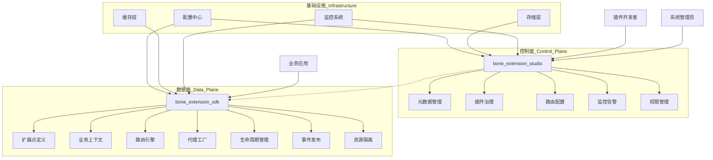
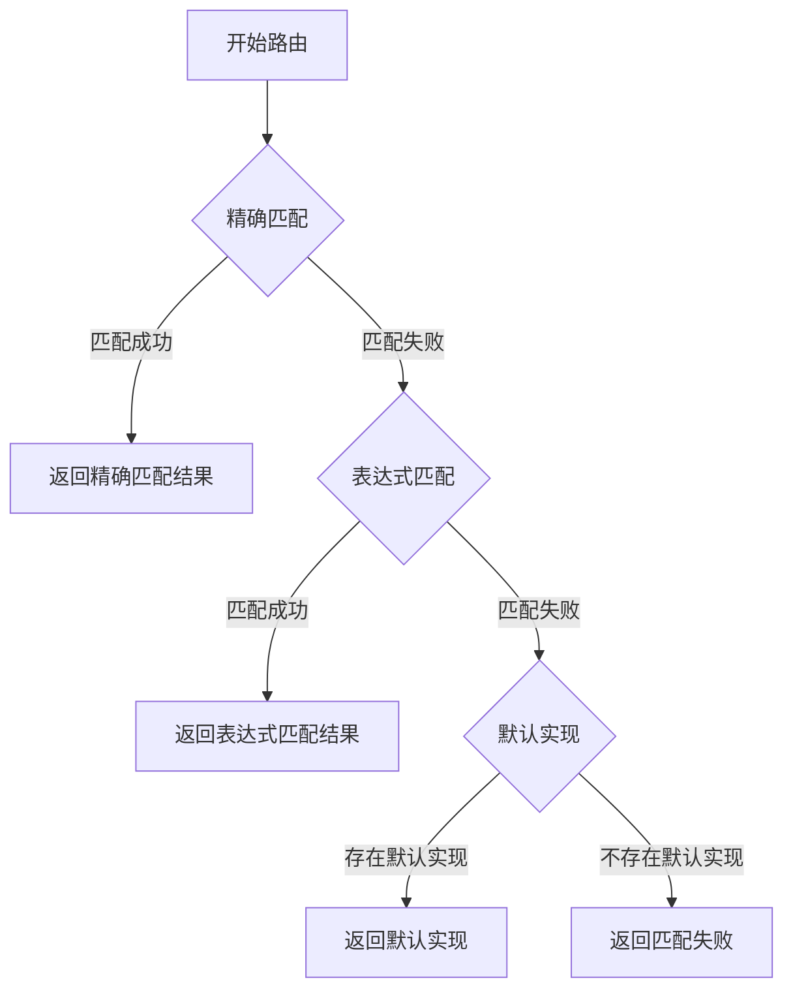

# Bone 扩展引擎设计方案

## 一、架构概述

### 1.1 产品定位

Bone 扩展引擎是一个轻量级、高性能的企业级插件化架构框架，旨在实现系统核心逻辑的稳定性与业务需求的灵活性之间的平衡。基于"开闭原则"，引擎通过标准化扩展点机制，允许在不修改核心代码的情况下动态注入定制化业务逻辑，从而快速响应业务变化、支持多租户定制化需求并降低系统维护成本。

### 1.2 核心设计理念

- **关注点分离**：将核心业务逻辑与可变业务逻辑分离，实现系统核心的稳定性与业务扩展的灵活性
- **标准化扩展**：提供统一的扩展点定义和实现规范，降低扩展开发和维护成本
- **智能路由**：基于多维度条件的智能路由机制，实现精准的扩展实现选择
- **完整生命周期**：从扩展点定义、实现、注册到执行的完整生命周期管理
- **高度可观测**：全面的监控、日志和追踪能力，确保扩展行为可监控、可诊断
- **安全隔离**：提供资源隔离、异常处理、权限控制等安全保障机制

### 1.3 典型应用场景

- **多租户SaaS平台**：为不同租户提供定制化的业务逻辑实现
- **行业解决方案**：针对不同行业客户的差异化需求提供扩展能力
- **功能灰度发布**：新功能的受控发布和验证，降低发布风险
- **A/B测试**：支持多版本功能的效果对比和数据收集
- **业务规则动态调整**：无需代码修改即可调整业务规则和逻辑
- **插件化架构**：构建可插拔的系统架构，支持第三方扩展开发

### 1.4 技术优势

- **低侵入性**：最小化对业务代码的侵入，易于集成和使用
- **高性能设计**：采用多级缓存、代理优化等机制确保扩展调用的低延迟
- **丰富的生态**：与主流框架（Spring Boot等）无缝集成
- **完善的工具链**：提供开发、测试、监控、管理的完整工具链
- **灵活的配置**：支持动态配置和热更新，提高运维效率

## 二、系统架构

### 2.1 二元架构设计

Bone 扩展引擎采用"SDK + 管理台"的二元架构设计，通过清晰的分层实现了扩展能力的标准化与可管理性：



二元架构的核心优势在于将运行时与管理能力解耦，既保证了SDK的轻量高效，又提供了强大的管理和监控能力。

#### 2.1.1 数据面（Data Plane）- bone-extension-sdk
- **轻量级嵌入式框架**：仅依赖核心库，最小化对业务应用的侵入
- **扩展点运行时**：负责扩展点的发现、路由、调用等核心功能
- **高性能设计**：采用多级缓存、代理优化等机制，确保扩展点调用的低延迟
- **资源隔离**：通过类加载器隔离、线程池隔离等机制确保扩展实现的安全运行
- **可观测性**：内置指标采集、链路追踪和日志记录能力

#### 2.1.2 控制面（Control Plane）- bone-extension-studio
- **元数据管理**：扩展点定义、版本控制、依赖分析和兼容性检查
- **插件生命周期治理**：上传、安装、升级、卸载插件全生命周期管理
- **路由规则配置**：可视化配置路由规则，支持表达式编辑与校验
- **监控与告警**：实时监控扩展点调用情况，异常告警与自动降级
- **权限与审计**：细粒度的权限控制和完整的操作审计日志

#### 2.1.3 基础设施层
- **配置中心**：统一管理扩展点配置，支持动态更新和版本控制
- **存储层**：持久化扩展点元数据、插件信息和配置历史
- **缓存层**：多级缓存架构，提高路由决策和扩展点调用性能
- **监控系统**：收集运行指标，提供可视化监控和告警能力

### 2.2 核心组件交互流程

扩展点调用的典型流程如下：

1. **初始化阶段**：
   - 扩展点扫描与注册
   - 路由规则加载与缓存
   - 扩展实例初始化

2. **调用阶段**：
   - 业务应用创建业务上下文（BizContext）
   - 代理工厂拦截扩展点调用
   - 路由引擎根据上下文匹配最佳扩展实现
   - 执行扩展实现并返回结果
   - 记录调用指标和日志

3. **管理阶段**：
   - 管理台监控扩展点调用情况
   - 动态调整路由规则和流量分配
   - 插件的上传、升级和卸载

### 2.3 核心组件

#### 2.3.1 SDK 核心组件

- **扩展点注解（Annotation）**：定义扩展点和扩展实现的核心注解体系，包括`@ExtPoint`、`@Extension`、`@ExtPointDoc`等
- **业务上下文（BizContext）**：封装业务环境信息，作为扩展点调用和路由的核心依据，支持多维度属性
- **路由引擎（ExtPointRouter）**：基于上下文信息智能匹配最合适的扩展实现，支持精确匹配、表达式匹配和默认实现的三级路由策略
- **代理工厂（ExtPointProxyFactory）**：为扩展点接口创建动态代理，拦截调用并触发路由，内置缓存优化
- **扩展仓库（ExtPointRepository）**：存储和管理扩展点元数据和实现类信息，支持动态注册和发现
- **事件发布器（ExtensionEventPublisher）**：发布扩展点生命周期事件，支持同步和异步事件处理
- **配置管理器（ExtensionConfigManager）**：管理扩展点配置信息，支持动态更新和配置缓存
- **生命周期管理器（ExtensionLifecycle）**：管理扩展点的完整生命周期，包括初始化、前置处理、后置处理、异常处理和销毁
- **扩展加载器（ExtensionLoader）**：基于SPI机制和Spring容器自动发现和加载扩展点实现
- **安全管理器（ExtensionSecurityManager）**：提供扩展执行的安全保障，包括权限控制、资源限制和沙箱隔离
- **监控采集器（ExtensionMetricsCollector）**：采集扩展点调用指标，支持Prometheus等监控系统集成

#### 2.3.2 管理台核心组件

- **元数据管理**：扩展点定义、版本控制、依赖分析和兼容性检查，提供可视化的元数据浏览
- **插件治理**：插件的上传、安装、升级、卸载等全生命周期管理，支持依赖图谱展示和冲突检测
- **路由配置**：可视化配置路由规则，支持表达式编辑、语法校验和规则测试
- **监控中心**：扩展点调用次数、响应时间、成功率等指标监控，提供实时和历史数据展示
- **告警系统**：异常调用、性能异常、资源超限等告警机制，支持多渠道通知
- **灰度管理**：灰度发布策略配置、流量分配和效果监控
- **A/B测试**：实验创建、变体管理和效果分析
- **权限与审计**：细粒度的权限控制和完整的操作审计日志，满足合规性要求

## 三、核心功能设计

### 3.1 标准化扩展点

标准化扩展点是Bone扩展引擎的核心概念，通过清晰的接口定义和注解机制，实现业务逻辑的可插拔设计。

#### 3.1.1 扩展点定义

扩展点是业务流程中定义的标准化接口，通过 `@ExtPoint` 注解进行标记，作为业务系统与扩展实现之间的契约。扩展点接口应该遵循单一职责原则，接口设计简洁明了。

**设计模式应用**：采用工厂方法模式（Factory Method Pattern）和模板方法模式（Template Method Pattern）的结合，定义扩展点接口作为模板，各扩展实现作为具体工厂。

```java
@ExtPoint(name = "订单折扣计算", description = "不同场景下的订单折扣逻辑")
public interface OrderDiscountExtPoint {
    DiscountResult calculate(BizContext<Order> context);
}
```

**核心注解参数说明**：
- **name**: 扩展点的可读名称，用于管理台展示
- **description**: 扩展点的详细描述，说明其用途和适用场景
- **type**: 扩展点类型，默认为业务扩展（BUSINESS）
- **version**: 扩展点版本号，用于版本管理和兼容性控制
- **enabled**: 是否启用，默认为true
- **category**: 扩展点分类，用于组织和管理扩展点
- **priority**: 默认优先级，当多个扩展点需要协同工作时使用

#### 3.1.2 扩展点设计原则

1. **接口简洁原则**：扩展点接口应保持简洁，避免过度设计，通常只定义一个核心方法
2. **单一职责原则**：每个扩展点应专注于解决特定的业务问题
3. **合理抽象原则**：通过继承和组合实现接口的合理抽象和复用
4. **向前兼容原则**：接口演进应保持向后兼容，可通过默认方法等机制实现
5. **上下文传递原则**：通过BizContext统一传递业务上下文信息，避免接口参数过多

#### 3.1.3 扩展点版本管理

为了支持扩展点的演进和兼容性管理，Bone扩展引擎提供了完整的版本管理机制：

```java
@ExtPoint(
    name = "用户服务", 
    description = "用户信息管理服务",
    version = "2.0.0",
    deprecatedSince = "1.5.0",
    deprecatedIn = "3.0.0"
)
public interface UserService {
    UserDTO getUserById(String userId);
    
    // 新增方法，通过默认实现保持向后兼容
    default UserProfileDTO getUserProfile(String userId) {
        UserDTO user = getUserById(userId);
        return convertToProfile(user);
    }
    
    // 辅助方法
    private UserProfileDTO convertToProfile(UserDTO user) {
        // 转换逻辑
        return new UserProfileDTO();
    }
}
```

#### 3.1.4 扩展实现

扩展实现是对扩展点接口的具体实现，通过 `@Extension` 注解标记，定义了扩展的路由维度、执行优先级和灰度策略等关键属性。

```java
@Extension(
    point = "OrderDiscountExtPoint",
    name = "VIP大额订单折扣",
    description = "VIP租户大额订单的特殊折扣处理",
    tenantCode = "VIP_TENANT",
    bizCode = "ORDER",
    scenario = "NORMAL",
    priority = 100,
    condition = "#context.data.amount > 1000",
    version = "1.0.0",
    enabled = true
)
@Component
public class VipLargeOrderDiscount implements OrderDiscountExtPoint {
    @Override
    public DiscountResult calculate(BizContext<Order> context) {
        // VIP用户大额订单折扣逻辑
        Order order = context.getData();
        BigDecimal discountRate = order.getAmount().compareTo(new BigDecimal(5000)) > 0 ? 
            new BigDecimal(0.8) : new BigDecimal(0.9);
        
        return new DiscountResult(discountRate, order.getAmount().multiply(discountRate));
    }
}

@Extension(
    point = "OrderDiscountExtPoint",
    name = "默认订单折扣",
    description = "标准订单的默认折扣处理",
    tenantCode = "DEFAULT",
    bizCode = "ORDER",
    scenario = "NORMAL",
    priority = 50,
    version = "1.0.0"
)
@Component
public class DefaultOrderDiscount implements OrderDiscountExtPoint {
    @Override
    public DiscountResult calculate(BizContext<Order> context) {
        // 默认订单折扣逻辑
        return new DiscountResult(new BigDecimal(0.95), context.getData().getAmount().multiply(new BigDecimal(0.95)));
    }
}
```

**路由维度说明**：
- **point**: 目标扩展点接口或名称，指定实现的扩展点
- **name**: 扩展实现的可读名称
- **description**: 扩展实现的详细描述
- **tenantCode**: 租户编码，支持多租户隔离，使用"DEFAULT"表示默认实现
- **bizCode**: 业务域编码，标识业务领域，如"ORDER"、"PAYMENT"等
- **useCase**: 用例标识，标识具体业务用例，如"MEMBER_PAY"、"VIP_DISCOUNT"等
- **scenario**: 场景标识，进一步细化应用场景，如"CREATE"、"UPDATE"、"QUERY"等
- **condition**: 动态条件表达式，支持SpEL表达式，用于复杂条件的动态匹配
- **priority**: 优先级，当多个扩展匹配时，优先级高的优先执行
- **version**: 扩展实现的版本号，用于版本控制和灰度发布
- **enabled**: 是否启用该扩展实现
- **rolloutRate**: 灰度发布的流量比例（0-1）
- **rolloutType**: 灰度发布的类型，如PERCENTAGE（百分比）、USER_ID（用户ID哈希）等

#### 3.1.5 扩展实现最佳实践

1. **无状态设计**：扩展实现应尽量保持无状态，避免使用静态变量或成员变量存储状态信息
2. **依赖注入**：使用Spring的依赖注入机制注入所需的服务和组件
3. **异常处理**：实现适当的异常处理逻辑，避免异常直接传递给调用方
4. **性能考虑**：对于频繁调用的扩展，考虑使用缓存、异步处理等优化手段
5. **日志规范**：使用统一的日志格式，记录必要的上下文信息，但避免记录敏感数据
6. **参数校验**：对输入参数进行必要的校验，确保数据的合法性
7. **资源管理**：合理管理数据库连接、文件句柄等资源，避免资源泄露

#### 3.1.6 文档化支持

为了提升扩展点的可维护性和开发体验，Bone扩展引擎提供了丰富的文档化支持机制。通过 `@ExtPointDoc` 注解，开发者可以为扩展点提供详细的文档信息，这些信息将在管理台中展示，方便其他开发者理解和使用。

```java
@ExtPointDoc(
    title = "支付服务扩展点",
    domain = "支付",
    category = "交易处理",
    description = "提供多种支付方式的统一接入接口",
    usage = "用于处理订单支付、会员支付等场景",
    params = {
        @ExtPointDoc.Param(
            name = "context",
            type = "BizContext<PaymentRequest>",
            description = "业务上下文，包含支付请求信息",
            required = true
        )
    },
    returnInfo = @ExtPointDoc.Return(
        type = "PaymentResult",
        description = "支付结果对象，包含支付状态、订单信息等",
        errorCodes = {}
    ),
    example = "BizContext<PaymentRequest> context = BizContext.of(\"ORDER\", \"DEFAULT\").data(paymentRequest).build();\nPaymentResult result = paymentService.processPayment(context)",
    // 其他可用属性：notes、creator、createDate等
)
@ExtPoint
public interface PaymentService {
    PaymentResult processPayment(BizContext<PaymentRequest> context);
}
```

文档化支持的核心优势：

1. **自文档化代码**：文档与代码紧密结合，确保文档的时效性和准确性
2. **统一的文档格式**：标准化的文档格式，便于阅读和理解
3. **管理台可视化**：在管理台中以结构化方式展示扩展点文档
4. **开发体验提升**：帮助开发者快速理解和使用扩展点
5. **API变更追踪**：通过版本信息追踪API的演进过程

### 3.2 智能路由与上下文传递

#### 3.2.1 业务上下文设计

业务上下文（`BizContext<T>`）是Bone扩展引擎的核心概念，作为数据载体在扩展点调用过程中传递业务信息。它提供了统一的上下文管理机制，支持丰富的数据操作API和多维度的元数据存储，是实现智能路由和灵活扩展的基础。

**核心元数据维度**：

- **租户标识（tenantCode）**：支持多租户场景下的路由隔离，"DEFAULT"表示默认租户
- **业务域（bizCode）**：标识业务领域，如"ORDER"、"PAYMENT"、"REFUND"
- **用例（useCase）**：标识具体业务用例，如"MEMBER_PAY"、"VIP_DISCOUNT"
- **场景（scenario）**：进一步细化业务场景，如"CREATE"、"UPDATE"、"QUERY"
- **环境（env）**：区分运行环境，如"DEV"、"TEST"、"PROD"
- **用户组（userGroup）**：标识用户或业务分组，如"GOLD"、"PLATINUM"、"DEFAULT"

**数据与元数据**：

- **业务数据（data）**：具体的业务数据对象，支持泛型
- **自定义属性（attributes）**：支持扩展的键值对，用于传递特定业务参数
- **请求元数据**：请求ID、时间戳、调用链等信息
- **标签信息（tags）**：用于路由和监控的特殊标记

**上下文操作API**：

```java
public class BizContext<T> {
    // 核心元数据
    private String tenantCode;       // 租户标识
    private String bizCode;          // 业务域
    private String useCase;          // 用例标识
    private String scenario;         // 场景标识
    private String env;              // 环境标识
    private String userGroup;        // 用户组
    
    // 扩展数据存储
    private T data;                  // 业务数据，泛型支持
    private Map<String, Object> attributes; // 自定义属性
    
    // 调用元数据
    private String requestId;        // 请求ID，全局唯一
    private Map<String, String> headers;     // 请求头信息
    private List<ExtensionTrace> traces;     // 调用链追踪信息
    private long startTimeMillis;    // 开始时间戳
    private Map<String, Object> tags;        // 标签信息，用于路由和监控
    
    // 私有构造函数，强制使用Builder创建实例
    private BizContext() {
        // 初始化必要的默认值
        this.startTimeMillis = System.currentTimeMillis();
        this.requestId = generateRequestId();
    }
    
    // 静态工厂方法
    public static <T> Builder<T> builder() {
        return new Builder<>();
    }
    
    // 简化创建方式
    public static <T> BizContext<T> of(String bizCode, String scenario) {
        return builder().bizCode(bizCode).scenario(scenario).build();
    }
    
    // 简化创建方式
    public static <T> BizContext<T> ofTenant(String tenantCode, String bizCode, String scenario) {
        return builder().tenantCode(tenantCode).bizCode(bizCode).scenario(scenario).build();
    }
    
    // 获取上下文属性
    public <V> V getAttribute(String key) {
        return attributes != null ? (V) attributes.get(key) : null;
    }
    
    // 安全获取上下文属性，提供默认值
    public <V> V getAttributeOrDefault(String key, V defaultValue) {
        V value = getAttribute(key);
        return value != null ? value : defaultValue;
    }
    
    // 设置上下文属性
    public void setAttribute(String key, Object value) {
        if (attributes == null) {
            attributes = new HashMap<>();
        }
        attributes.put(key, value);
    }
    
    // 批量设置上下文属性
    public void setAttributes(Map<String, Object> newAttributes) {
        if (attributes == null) {
            attributes = new HashMap<>();
        }
        if (newAttributes != null) {
            attributes.putAll(newAttributes);
        }
    }
    
    // 检查是否包含指定属性
    public boolean containsAttribute(String key) {
        return attributes != null && attributes.containsKey(key);
    }
    
    // 添加标签（用于路由和监控）
    public void addTag(String key, Object value) {
        if (tags == null) {
            tags = new HashMap<>();
        }
        tags.put(key, value);
    }
    
    // 获取标签值
    public <V> V getTag(String key) {
        return tags != null ? (V) tags.get(key) : null;
    }
    
    // 复制上下文，创建新实例
    public BizContext<T> copy() {
        Builder<T> builder = builder()
            .tenantCode(this.tenantCode)
            .bizCode(this.bizCode)
            .useCase(this.useCase)
            .scenario(this.scenario)
            .env(this.env)
            .userGroup(this.userGroup)
            .data(this.data)
            .requestId(this.requestId);
            
        // 复制标签
        if (this.tags != null) {
            builder.tags(new HashMap<>(this.tags));
        }
        
        // 复制属性
        if (this.attributes != null) {
            builder.attributes(new HashMap<>(this.attributes));
        }
        
        // 复制请求头
        if (this.headers != null) {
            builder.headers(new HashMap<>(this.headers));
        }
        
        // 复制追踪信息
        if (this.traces != null) {
            builder.traces(new ArrayList<>(this.traces));
        }
        
        return builder.build();
    }
    
    // 上下文合并
    public BizContext<T> merge(BizContext<?> other) {
        if (other == null) {
            return this;
        }
        
        BizContext<T> result = this.copy();
        
        // 合并核心元数据，非空值覆盖
        if (other.tenantCode != null) {
            result.tenantCode = other.tenantCode;
        }
        if (other.bizCode != null) {
            result.bizCode = other.bizCode;
        }
        if (other.useCase != null) {
            result.useCase = other.useCase;
        }
        if (other.scenario != null) {
            result.scenario = other.scenario;
        }
        if (other.env != null) {
            result.env = other.env;
        }
        if (other.userGroup != null) {
            result.userGroup = other.userGroup;
        }
        
        // 合并标签
        if (other.tags != null) {
            if (result.tags == null) {
                result.tags = new HashMap<>();
            }
            result.tags.putAll(other.tags);
        }
        
        // 合并属性
        if (other.attributes != null) {
            result.setAttributes(other.attributes);
        }
        
        return result;
    }
    
    // 生成唯一请求ID
    private static String generateRequestId() {
        return UUID.randomUUID().toString();
    }
    
    // Getter方法
    public String getTenantCode() { return tenantCode; }
    public String getBizCode() { return bizCode; }
    public String getUseCase() { return useCase; }
    public String getScenario() { return scenario; }
    public String getEnv() { return env; }
    public String getUserGroup() { return userGroup; }
    public T getData() { return data; }
    public String getRequestId() { return requestId; }
    public Map<String, String> getHeaders() { return headers; }
    public List<ExtensionTrace> getTraces() { return traces; }
    public long getStartTimeMillis() { return startTimeMillis; }
    public Map<String, Object> getTags() { return tags; }
    public Map<String, Object> getAttributes() { return attributes; }
    
    // Builder内部类
    public static class Builder<T> {
        private final BizContext<T> context;
        
        private Builder() {
            this.context = new BizContext<>();
        }
        
        public Builder<T> tenantCode(String tenantCode) {
            context.tenantCode = tenantCode;
            return this;
        }
        
        public Builder<T> bizCode(String bizCode) {
            context.bizCode = bizCode;
            return this;
        }
        
        public Builder<T> useCase(String useCase) {
            context.useCase = useCase;
            return this;
        }
        
        public Builder<T> scenario(String scenario) {
            context.scenario = scenario;
            return this;
        }
        
        public Builder<T> env(String env) {
            context.env = env;
            return this;
        }
        
        public Builder<T> userGroup(String userGroup) {
            context.userGroup = userGroup;
            return this;
        }
        
        public Builder<T> data(T data) {
            context.data = data;
            return this;
        }
        
        public Builder<T> attribute(String key, Object value) {
            context.setAttribute(key, value);
            return this;
        }
        
        public Builder<T> attributes(Map<String, Object> attributes) {
            context.setAttributes(attributes);
            return this;
        }
        
        public Builder<T> header(String key, String value) {
            if (context.headers == null) {
                context.headers = new HashMap<>();
            }
            context.headers.put(key, value);
            return this;
        }
        
        public Builder<T> headers(Map<String, String> headers) {
            context.headers = headers;
            return this;
        }
        
        public Builder<T> tags(Map<String, Object> tags) {
            context.tags = tags;
            return this;
        }
        
        public Builder<T> tag(String key, Object value) {
            context.addTag(key, value);
            return this;
        }
        
        public Builder<T> trace(ExtensionTrace trace) {
            if (context.traces == null) {
                context.traces = new ArrayList<>();
            }
            context.traces.add(trace);
            return this;
        }
        
        public Builder<T> traces(List<ExtensionTrace> traces) {
            context.traces = traces;
            return this;
        }
        
        public Builder<T> requestId(String requestId) {
            context.requestId = requestId;
            return this;
        }
        
        public BizContext<T> build() {
            // 验证必要的上下文信息
            validateContext();
            return context;
        }
        
        private void validateContext() {
            // 可以在这里添加必要的验证逻辑
            // 例如：确保bizCode不为null
        }
    }
}
```

#### 3.2.2 多维度路由策略

**设计模式应用**：Bone扩展引擎采用策略模式（Strategy Pattern）与责任链模式（Chain of Responsibility）相结合的方式实现多级路由决策。这种设计允许灵活组合不同的路由策略，并支持路由过程的可扩展性。

**核心路由组件**：

- **ExtensionRouterEngine**：路由引擎核心，负责协调整个路由过程
- **ExtensionRouter**：路由策略接口，定义路由决策方法
- **MultiDimensionExtensionRouter**：多维度路由器实现，基于多个维度进行匹配
- **ExpressionExtensionRouter**：表达式路由器，支持SpEL表达式匹配
- **DefaultExtensionRouter**：默认路由器，处理兜底逻辑
- **ExtensionRouteFilterChain**：路由过滤器链，对匹配结果进行进一步过滤

**评分机制设计**：

Bone扩展引擎采用多级评分机制进行路由匹配，每个维度都有对应的权重。通过累加各维度得分，选择评分最高的扩展实现作为最终路由目标。

| 匹配维度 | 评分规则 | 权重 | 说明 |
|---------|---------|------|------|
| 业务域匹配 | 完全匹配加100分 | 最高 | 确保业务边界，优先选择同业务域的实现 |
| 租户匹配 | 完全匹配加80分 | 高 | 支持多租户隔离，保障数据安全 |
| 环境匹配 | 完全匹配加70分 | 高 | 支持环境隔离，避免环境混淆 |
| 用例匹配 | 完全匹配加65分 | 中高 | 针对具体业务用例的精确匹配 |
| 场景匹配 | 完全匹配加60分 | 中高 | 针对业务场景的精确匹配 |
| 用户组匹配 | 完全匹配加50分 | 中 | 支持用户或业务分组的差异化逻辑 |
| 版本匹配 | 完全匹配加40分 | 中 | 支持版本控制和灰度发布 |
| 标签匹配 | 每匹配一个相关标签加10分 | 中低 | 支持通过标签进行灵活路由 |
| 时间窗口匹配 | 匹配加25分 | 中低 | 支持基于时间的特殊逻辑 |

**路由策略实现**：

```java
// 路由结果类
public class RouteResult {
    private final ExtensionDefinition extension;
    private final int score;
    private final boolean matched;
    
    public RouteResult(ExtensionDefinition extension, int score) {
        this.extension = extension;
        this.score = score;
        this.matched = extension != null;
    }
    
    public static RouteResult noMatch() {
        return new RouteResult(null, 0);
    }
    
    public ExtensionDefinition getExtension() {
        return extension;
    }
    
    public int getScore() {
        return score;
    }
    
    public boolean isMatched() {
        return matched;
    }
}

// 扩展路由器接口
public interface ExtensionRouter {
    /**
     * 根据上下文和候选扩展点，选择合适的扩展实现
     * @param context 业务上下文
     * @param candidates 候选扩展点列表
     * @return 路由结果
     */
    RouteResult route(BizContext<?> context, List<ExtensionDefinition> candidates);
}

public class MultiDimensionExtensionRouter implements ExtensionRouter {
    @Override
    public RouteResult route(BizContext<?> context, List<ExtensionDefinition> candidates) {
        Objects.requireNonNull(context, "Context cannot be null");
        Objects.requireNonNull(candidates, "Candidates cannot be null");
        
        Map<ExtensionDefinition, Integer> scores = new HashMap<>();
        
        // 遍历候选扩展，计算每个扩展的匹配得分
        for (ExtensionDefinition candidate : candidates) {
            int score = calculateMatchScore(context, candidate);
            scores.put(candidate, score);
        }
        
        // 按得分排序，选择最高分的扩展
        return scores.entrySet().stream()
                .max(Map.Entry.comparingByValue())
                .map(entry -> new RouteResult(entry.getKey(), entry.getValue()))
                .orElseGet(() -> RouteResult.noMatch());
    }
    
    private int calculateMatchScore(BizContext<?> context, ExtensionDefinition definition) {
        int score = 0;
        
        // 业务域匹配
        if (matchField(context.getBizCode(), definition.getBizCode())) {
            score += 100;
        }
        
        // 租户匹配
        if (matchField(context.getTenantCode(), definition.getTenantCode())) {
            score += 80;
        }
        
        // 环境匹配
        if (matchField(context.getEnv(), definition.getEnv())) {
            score += 70;
        }
        
        // 用例匹配
        if (matchField(context.getUseCase(), definition.getUseCase())) {
            score += 65;
        }
        
        // 场景匹配
        if (matchField(context.getScenario(), definition.getScenario())) {
            score += 60;
        }
        
        // 用户组匹配
        if (matchField(context.getUserGroup(), definition.getUserGroup())) {
            score += 50;
        }
        
        // 版本匹配
        if (matchVersion(context.getVersion(), definition.getVersion())) {
            score += 40;
        }
        
        // 标签匹配
        score += calculateTagMatchScore(context.getTags(), definition.getTags());
        
        // 时间窗口匹配
        if (isWithinTimeWindow(definition)) {
            score += 25;
        }
        
        return score;
    }
    
    private boolean matchField(String contextValue, String definitionValue) {
        // 支持通配符匹配
        if (definitionValue == null || "*".equals(definitionValue)) {
            return true;
        }
        return contextValue != null && contextValue.equals(definitionValue);
    }
    
    private boolean matchVersion(String contextVersion, String definitionVersion) {
        // 版本匹配逻辑，支持通配符
        if (definitionVersion == null || "*".equals(definitionVersion)) {
            return true;
        }
        return contextVersion != null && definitionVersion != null && 
               contextVersion.equals(definitionVersion);
    }
    
    private int calculateTagMatchScore(Map<String, Object> contextTags, Map<String, Object> definitionTags) {
        if (contextTags == null || definitionTags == null) {
            return 0;
        }
        
        return definitionTags.entrySet().stream()
                .filter(entry -> contextTags.containsKey(entry.getKey()) && 
                                 contextTags.get(entry.getKey()).equals(entry.getValue()))
                .mapToInt(entry -> 10)
                .sum();
    }
    
    private boolean isWithinTimeWindow(ExtensionDefinition definition) {
        // 时间窗口匹配逻辑
        Date now = new Date();
        Date startTime = definition.getStartTime();
        Date endTime = definition.getEndTime();
        
        // 无时间限制的扩展总是匹配
        if (startTime == null && endTime == null) {
            return true;
        }
        
        // 检查是否在有效时间范围内
        boolean afterStart = (startTime == null) || now.after(startTime);
        boolean beforeEnd = (endTime == null) || now.before(endTime);
        
        return afterStart && beforeEnd;
    }
}
```

#### 3.2.3 三级路由策略

Bone扩展引擎采用三级路由策略，确保路由决策的精确性和灵活性，同时提供兜底机制保证系统稳定性。

**三级路由流程图**：



**1. 精确匹配阶段**

精确匹配是第一优先级，通过业务上下文的关键维度与扩展定义进行严格匹配：

- 匹配维度：租户(tenantCode)、业务域(bizCode)、场景(scenario)、环境(env)等核心属性
- 匹配规则：要求完全一致，不支持模糊匹配或部分匹配
- 优势：匹配效率高，路由结果明确，无歧义

```java
public class ExactMatchExtensionRouter implements ExtensionRouter {
    @Override
    public RouteResult route(BizContext<?> context, List<ExtensionDefinition> candidates) {
        Objects.requireNonNull(context, "Context cannot be null");
        Objects.requireNonNull(candidates, "Candidates cannot be null");
        
        for (ExtensionDefinition candidate : candidates) {
            if (isExactMatch(context, candidate)) {
                return new RouteResult(candidate, 1000); // 精确匹配设置高优先级分数
            }
        }
        return RouteResult.noMatch();
    }
    
    private boolean isExactMatch(BizContext<?> context, ExtensionDefinition definition) {
        // 检查是否为默认租户或默认环境的特殊情况
        boolean tenantMatch = isDefaultOrMatch(context.getTenantCode(), definition.getTenantCode());
        boolean environmentMatch = isDefaultOrMatch(context.getEnv(), definition.getEnv());
        
        // 核心属性必须完全匹配
        return tenantMatch && 
               environmentMatch &&
               Objects.equals(context.getBizCode(), definition.getBizCode()) &&
               Objects.equals(context.getUseCase(), definition.getUseCase()) &&
               Objects.equals(context.getScenario(), definition.getScenario());
    }
    
    private boolean isDefaultOrMatch(String contextValue, String definitionValue) {
        return "DEFAULT".equals(definitionValue) || Objects.equals(contextValue, definitionValue) || "*".equals(definitionValue);
    }
}
```

**2. 表达式匹配阶段**

当精确匹配失败时，进入表达式匹配阶段，通过SpEL表达式处理复杂的动态匹配条件：

- 支持SpEL表达式：基于Spring Expression Language，支持复杂的条件表达式
- 上下文变量：表达式可访问BizContext中的所有属性和业务数据
- 动态计算：根据运行时上下文动态计算匹配结果
- 适用场景：复杂的业务规则、个性化逻辑、动态条件判断

```java
public class ExpressionExtensionRouter implements ExtensionRouter {
    private final SpelExpressionParser expressionParser = new SpelExpressionParser();
    private final StandardEvaluationContext evaluationContext = new StandardEvaluationContext();
    
    @Override
    public RouteResult route(BizContext<?> context, List<ExtensionDefinition> candidates) {
        Objects.requireNonNull(context, "Context cannot be null");
        Objects.requireNonNull(candidates, "Candidates cannot be null");
        
        // 设置上下文变量，使表达式可以访问
        evaluationContext.setVariable("context", context);
        evaluationContext.setVariable("bizCode", context.getBizCode());
        evaluationContext.setVariable("scenario", context.getScenario());
        evaluationContext.setVariable("tenantCode", context.getTenantCode());
        evaluationContext.setVariable("env", context.getEnv());
        evaluationContext.setVariable("useCase", context.getUseCase());
        evaluationContext.setVariable("userGroup", context.getUserGroup());
        evaluationContext.setVariable("version", context.getVersion());
        evaluationContext.setVariable("tags", context.getTags());
        evaluationContext.setVariable("data", context.getData());
        
        // 检查是否有匹配的表达式条件
        List<ExtensionDefinition> matched = new ArrayList<>();
        for (ExtensionDefinition candidate : candidates) {
            if (matchesExpression(context, candidate)) {
                matched.add(candidate);
            }
        }
        
        // 如果有多个匹配项，使用多维度评分机制选择最优的
        if (matched.size() > 0) {
            MultiDimensionExtensionRouter dimensionRouter = new MultiDimensionExtensionRouter();
            return dimensionRouter.route(context, matched);
        }
        
        return RouteResult.noMatch();
    }
    
    private boolean matchesExpression(BizContext<?> context, ExtensionDefinition definition) {
        String condition = definition.getCondition();
        if (condition == null || condition.isEmpty()) {
            return false;
        }
        
        try {
            Expression expression = expressionParser.parseExpression(condition);
            Boolean result = expression.getValue(evaluationContext, Boolean.class);
            return result != null && result;
        } catch (Exception e) {
            // 表达式解析错误，记录日志但不影响路由流程
            return false;
        }
    }
}
```

**3. 默认实现阶段**

当精确匹配和表达式匹配都失败时，系统会尝试查找默认实现，确保业务逻辑的连续性：

- 默认标识：通过tenantCode="DEFAULT"和优先级较低的配置识别默认实现
- 降级策略：提供统一的兜底逻辑，防止业务中断
- 全局默认：可以配置全局默认实现，作为最后的保障

```java
public class DefaultExtensionRouter implements ExtensionRouter {
    @Override
    public RouteResult route(BizContext<?> context, List<ExtensionDefinition> candidates) {
        Objects.requireNonNull(context, "Context cannot be null");
        Objects.requireNonNull(candidates, "Candidates cannot be null");
        
        // 查找默认实现（tenantCode为DEFAULT）
        List<ExtensionDefinition> defaultExtensions = candidates.stream()
                .filter(def -> "DEFAULT".equals(def.getTenantCode()))
                .collect(Collectors.toList());
        
        if (defaultExtensions.isEmpty()) {
            return RouteResult.noMatch();
        }
        
        // 如果有多个默认实现，优先选择bizCode匹配的
        if (context.getBizCode() != null) {
            for (ExtensionDefinition def : defaultExtensions) {
                if (Objects.equals(context.getBizCode(), def.getBizCode())) {
                    return new RouteResult(def, 100);
                }
            }
        }
        
        // 返回第一个默认实现
        return new RouteResult(defaultExtensions.get(0), 50);
    }
}
```

**路由引擎集成**

三级路由策略通过RouterEngine进行统一协调，确保路由过程的顺序执行和结果处理：

```java
public class ExtensionRouterEngine {
    private static final Logger log = LoggerFactory.getLogger(ExtensionRouterEngine.class);
    private final List<ExtensionRouter> extensionRouters = new ArrayList<>();
    
    public ExtensionRouterEngine() {
        // 按优先级注册路由策略
        extensionRouters.add(new ExactMatchExtensionRouter());
        extensionRouters.add(new ExpressionExtensionRouter());
        extensionRouters.add(new DefaultExtensionRouter());
    }
    
    public ExtensionDefinition route(BizContext<?> context, List<ExtensionDefinition> candidates) {
        Objects.requireNonNull(context, "Context cannot be null");
        Objects.requireNonNull(candidates, "Candidates cannot be null");
        
        log.debug("Starting extension routing for context: tenantCode={}, bizCode={}, scenario={}",
                context.getTenantCode(), context.getBizCode(), context.getScenario());
        
        // 依次尝试各级路由策略
        for (ExtensionRouter router : extensionRouters) {
            RouteResult result = router.route(context, candidates);
            if (result.isMatched()) {
                // 记录路由决策日志
                logRouteDecision(context, result);
                return result.getExtension();
            }
        }
        
        // 所有策略都未匹配成功
        log.error("No matching extension found for context: {}", context);
        throw new ExtensionNotFoundException("No matching extension found for context: " + context);
    }
    
    private void logRouteDecision(BizContext<?> context, RouteResult result) {
        log.info("Extension routing decision: tenantCode={}, bizCode={}, scenario={}, matchedExtension={}, score={}",
                context.getTenantCode(), 
                context.getBizCode(), 
                context.getScenario(),
                result.getExtension().getName(),
                result.getScore());
    }
}
```

**三级路由的优势**：

1. **精确性与灵活性平衡**：精确匹配确保关键场景的精确路由，表达式匹配提供灵活的动态条件处理
2. **性能优化**：优先使用高效的精确匹配，仅在必要时才执行复杂的表达式计算
3. **可靠性保障**：默认实现机制确保即使没有精确匹配的扩展，系统也能继续运行
4. **可扩展性**：每级路由都支持自定义扩展，可以根据业务需求调整匹配逻辑

### 3.3 插件生命周期管理

插件生命周期管理是Bone扩展引擎的核心特性之一，它提供了完整的扩展点生命周期控制机制，确保扩展点在各个阶段都能被正确初始化、调用和销毁。

#### 3.3.1 生命周期接口设计

Bone扩展引擎定义了标准的生命周期接口，允许开发者在扩展点的各个生命周期阶段执行自定义逻辑：

```java
public interface ExtensionLifecycle {
    /**
     * 扩展点初始化阶段，在Spring容器启动并扫描到扩展点后调用
     * 适用于资源初始化、配置加载等操作
     * 
     * @param extension 扩展点实例对象
     */
    default void initialize(Object extension) {
        // 默认空实现
    }
    
    /**
     * 扩展点调用前阶段，在目标方法执行前调用
     * 适用于参数校验、权限检查、日志记录等操作
     * 
     * @param extension 扩展点实例对象
     * @param method 被调用的方法
     * @param args 方法参数
     */
    default void beforeInvoke(Object extension, Method method, Object[] args) {
        // 默认空实现
    }
    
    /**
     * 扩展点调用后阶段，在目标方法成功执行后调用
     * 适用于结果处理、日志记录、资源清理等操作
     * 
     * @param extension 扩展点实例对象
     * @param method 被调用的方法
     * @param args 方法参数
     * @param result 方法返回结果
     */
    default void afterInvoke(Object extension, Method method, Object[] args, Object result) {
        // 默认空实现
    }
    
    /**
     * 扩展点异常阶段，在目标方法执行抛出异常时调用
     * 适用于异常处理、错误恢复、降级处理等操作
     * 
     * @param extension 扩展点实例对象
     * @param method 被调用的方法
     * @param args 方法参数
     * @param exception 抛出的异常
     */
    default void onException(Object extension, Method method, Object[] args, Exception exception) {
        // 默认空实现
    }
    
    /**
     * 扩展点销毁阶段，在应用关闭时调用
     * 适用于资源释放、连接关闭等操作
     * 
     * @param extension 扩展点实例对象
     */
    default void destroy(Object extension) {
        // 默认空实现
    }
}
```

#### 3.3.2 生命周期管理机制

Bone扩展引擎采用生命周期管理器统一协调扩展点的生命周期：

```java
public class ExtensionLifecycleManager {
    private final List<ExtensionLifecycle> lifecycleHandlers = new CopyOnWriteArrayList<>();
    
    /**
     * 注册生命周期处理器
     */
    public void registerLifecycleHandler(ExtensionLifecycle handler) {
        lifecycleHandlers.add(handler);
    }
    
    /**
     * 初始化扩展点
     */
    public void initializeExtension(Object extension) {
        for (ExtensionLifecycle handler : lifecycleHandlers) {
            try {
                handler.initialize(extension);
            } catch (Exception e) {
                // 记录异常但不中断初始化过程
                log.warn("Failed to initialize extension {}, handler: {}", 
                         extension.getClass().getSimpleName(), 
                         handler.getClass().getSimpleName(), e);
            }
        }
    }
    
    /**
     * 扩展点调用前处理
     */
    public void beforeInvoke(Object extension, Method method, Object[] args) {
        for (ExtensionLifecycle handler : lifecycleHandlers) {
            try {
                handler.beforeInvoke(extension, method, args);
            } catch (Exception e) {
                // 记录异常但不中断调用过程
                log.warn("Failed to execute beforeInvoke for extension {}, handler: {}", 
                         extension.getClass().getSimpleName(), 
                         handler.getClass().getSimpleName(), e);
            }
        }
    }
    
    // afterInvoke, onException, destroy 方法类似实现...
}
```

#### 3.3.3 生命周期事件体系

Bone扩展引擎集成了Spring事件机制，定义了完整的扩展点事件体系：

```java
// 基础事件类
public abstract class ExtensionEvent extends ApplicationEvent {
    private final String extensionName;
    private final String extensionType;
    
    public ExtensionEvent(Object source, String extensionName, String extensionType) {
        super(source);
        this.extensionName = extensionName;
        this.extensionType = extensionType;
    }
    
    // getter方法...
}

// 扩展点注册事件
public class ExtensionRegisteredEvent extends ExtensionEvent {
    private final String extPointName;
    private final Map<String, String> attributes;
    
    public ExtensionRegisteredEvent(Object source, String extensionName, 
                                   String extensionType, String extPointName) {
        super(source, extensionName, extensionType);
        this.extPointName = extPointName;
    }
}
```

#### 3.3.4 Spring框架集成

Bone扩展引擎与Spring框架深度集成，利用Spring的生命周期机制管理扩展点：

```java
@Component
public class ExtensionBeanPostProcessor implements BeanPostProcessor, ApplicationContextAware {
    private ApplicationContext applicationContext;
    private final ExtensionRegistry extensionRegistry;
    private final ExtensionLifecycleManager lifecycleManager;
    
    @Autowired
    public ExtensionBeanPostProcessor(ExtensionRegistry extensionRegistry, 
                                     ExtensionLifecycleManager lifecycleManager) {
        this.extensionRegistry = extensionRegistry;
        this.lifecycleManager = lifecycleManager;
    }
    
    @Override
    public Object postProcessAfterInitialization(Object bean, String beanName) throws BeansException {
        // 检查bean是否有@Extension注解
        Extension extension = AnnotationUtils.findAnnotation(bean.getClass(), Extension.class);
        if (extension != null) {
            // 注册扩展点
            registerExtension(bean, extension);
            
            // 触发初始化生命周期
            lifecycleManager.initializeExtension(bean);
            
            // 发布扩展点注册事件
            publishRegisteredEvent(bean, extension);
        }
        return bean;
    }
    
    private void registerExtension(Object bean, Extension extension) {
        // 构建扩展点定义
        ExtensionDefinition definition = new ExtensionDefinition();
        definition.setName(extension.name());
        definition.setPoint(extension.point());
        definition.setTenantCode(extension.tenantCode());
        definition.setBizCode(extension.bizCode());
        definition.setScenario(extension.scenario());
        definition.setEnv(extension.env());
        // 设置其他属性...
        
        // 注册到扩展点注册表
        extensionRegistry.register(definition, bean);
    }
    
    private void publishRegisteredEvent(Object bean, Extension extension) {
        // 发布扩展点注册事件
        ExtensionRegisteredEvent event = new ExtensionRegisteredEvent(
            bean,
            extension.name(),
            bean.getClass().getName(),
            extension.point()
        );
        applicationContext.publishEvent(event);
    }
    
    @Override
    public void setApplicationContext(ApplicationContext applicationContext) throws BeansException {
        this.applicationContext = applicationContext;
    }
}
```

### 3.4 性能优化与缓存策略

Bone扩展引擎实现了多级缓存机制，从路由决策到扩展实例，全方位提升性能。

#### 3.4.1 路由结果缓存

```java
public class DefaultExtensionRouter implements ExtensionRouter {
    
    // 使用Caffeine实现高性能缓存
    private Cache<RouteKey, ExtensionDefinition> routeCache;
    
    public DefaultExtensionRouter(ExtensionConfigProperties config) {
        CacheConfig cacheConfig = config.getCache();
        
        // 配置缓存参数
        this.routeCache = Caffeine.newBuilder()
            // 最大缓存条目数
            .maximumSize(cacheConfig.getMaxSize())
            // 过期时间
            .expireAfterWrite(cacheConfig.getTtl(), TimeUnit.SECONDS)
            // 自动刷新
            .refreshAfterWrite(cacheConfig.getRefreshInterval(), TimeUnit.SECONDS)
            // 统计信息
            .recordStats()
            .build();
    }
    
    @Override
    public RouteResult route(BizContext<?> context, List<ExtensionDefinition> candidates) {
        Objects.requireNonNull(context, "Context cannot be null");
        Objects.requireNonNull(candidates, "Candidates cannot be null");
        
        // 构建路由键
        String extPointName = candidates.isEmpty() ? null : candidates.get(0).getPoint();
        RouteKey routeKey = buildRouteKey(extPointName, context);
        
        // 尝试从缓存获取扩展定义
        ExtensionDefinition extension = routeCache.get(routeKey, k -> findTargetExtension(candidates, context));
        
        // 根据是否找到扩展返回相应的路由结果
        return extension != null ? new RouteResult(extension, 100) : RouteResult.noMatch();
    }
    
    private RouteKey buildRouteKey(String extPointName, BizContext<?> context) {
        // 构建路由键，包含扩展点名称和关键上下文属性
        return new RouteKey(extPointName, 
                           context.getTenantCode(), 
                           context.getBizCode(), 
                           context.getUseCase(), 
                           context.getScenario(), 
                           context.getEnv());
    }
    
    // 路由键类，用于缓存路由结果
    static class RouteKey {
        private final String extPointName;
        private final String tenantCode;
        private final String bizCode;
        private final String useCase;
        private final String scenario;
        private final String env;
        private final int hashCode;
        
        public RouteKey(String extPointName, String tenantCode, String bizCode, 
                       String useCase, String scenario, String env) {
            this.extPointName = extPointName;
            this.tenantCode = tenantCode;
            this.bizCode = bizCode;
            this.useCase = useCase;
            this.scenario = scenario;
            this.env = env;
            this.hashCode = Objects.hash(extPointName, tenantCode, bizCode, 
                                        useCase, scenario, env);
        }
        
        public String getExtPointName() {
            return extPointName;
        }
        
        @Override
        public boolean equals(Object o) {
            if (this == o) return true;
            if (o == null || getClass() != o.getClass()) return false;
            RouteKey routeKey = (RouteKey) o;
            return Objects.equals(extPointName, routeKey.extPointName) &&
                   Objects.equals(tenantCode, routeKey.tenantCode) &&
                   Objects.equals(bizCode, routeKey.bizCode) &&
                   Objects.equals(useCase, routeKey.useCase) &&
                   Objects.equals(scenario, routeKey.scenario) &&
                   Objects.equals(env, routeKey.env);
        }
        
        @Override
        public int hashCode() {
            return hashCode;
        }
        
        @Override
        public String toString() {
            return "RouteKey{" +
                   "extPointName='" + extPointName + "'" +
                   ", tenantCode='" + tenantCode + "'" +
                   ", bizCode='" + bizCode + "'" +
                   ", scenario='" + scenario + "'" +
                   ", env='" + env + "'" +
                   '}';
        }
    }
    
    // 获取缓存统计信息
    public CacheStats getCacheStats() {
        return routeCache.stats();
    }
    
    // 主动刷新缓存
    public void refreshCache(String extPointName) {
        // 实现缓存刷新逻辑
        Set<RouteKey> keys = routeCache.asMap().keySet().stream()
            .filter(key -> key.getExtPointName().equals(extPointName))
            .collect(Collectors.toSet());
            
        for (RouteKey key : keys) {
            routeCache.invalidate(key);
        }
    }
    
    private ExtensionDefinition findTargetExtension(List<ExtensionDefinition> candidates, BizContext<?> context) {
        // 实现三级路由匹配逻辑
        // 1. 先尝试精确匹配
        // 2. 再尝试表达式匹配
        // 3. 最后查找默认实现
        
        // 精确匹配 - 匹配核心属性
        for (ExtensionDefinition candidate : candidates) {
            if (isMatch(candidate, context)) {
                return candidate;
            }
        }
        
        // 默认实现 - 查找tenantCode为DEFAULT的实现
        for (ExtensionDefinition candidate : candidates) {
            if ("DEFAULT".equals(candidate.getTenantCode())) {
                // 优先选择bizCode匹配的默认实现
                if (context.getBizCode() != null && Objects.equals(candidate.getBizCode(), context.getBizCode())) {
                    return candidate;
                }
            }
        }
        
        // 返回第一个默认实现（如果有）
        return candidates.stream()
            .filter(candidate -> "DEFAULT".equals(candidate.getTenantCode()))
            .findFirst()
            .orElse(null);
    }
    
    private boolean isMatch(ExtensionDefinition candidate, BizContext<?> context) {
        // 检查租户匹配
        if (!matchField(context.getTenantCode(), candidate.getTenantCode())) {
            return false;
        }
        
        // 检查业务域匹配
        if (!matchField(context.getBizCode(), candidate.getBizCode())) {
            return false;
        }
        
        // 检查用例匹配
        if (context.getUseCase() != null && candidate.getUseCase() != null && 
            !matchField(context.getUseCase(), candidate.getUseCase())) {
            return false;
        }
        
        // 检查场景匹配
        if (context.getScenario() != null && candidate.getScenario() != null && 
            !matchField(context.getScenario(), candidate.getScenario())) {
            return false;
        }
        
        // 检查环境匹配
        if (context.getEnv() != null && candidate.getEnv() != null && 
            !matchField(context.getEnv(), candidate.getEnv())) {
            return false;
        }
        
        return true;
    }
    
    private boolean matchField(String contextValue, String definitionValue) {
        return definitionValue == null || "*".equals(definitionValue) || 
               Objects.equals(contextValue, definitionValue);
    }
}
```

#### 3.4.2 代理对象缓存

```java
public class DefaultExtPointProxyFactory implements ExtPointProxyFactory {
    
    // 缓存扩展点代理对象
    private final ConcurrentHashMap<String, Object> proxyCache = new ConcurrentHashMap<>();
    
    @Override
    public <T> T getProxy(Class<T> extPointType) {
        String cacheKey = generateCacheKey(extPointType);
        
        // 双重检查锁定模式
        return (T) proxyCache.computeIfAbsent(cacheKey, k -> createProxy(extPointType));
    }
    
    private <T> T createProxy(Class<T> extPointType) {
        // 使用JDK动态代理创建扩展点代理对象
        return (T) Proxy.newProxyInstance(
            extPointType.getClassLoader(),
            new Class<?>[] { extPointType },
            new ExtensionInvocationHandler(extPointType)
        );
    }
    
    private String generateCacheKey(Class<?> extPointType) {
        return extPointType.getName();
    }
    
    // 清除指定扩展点的代理缓存
    public void clearProxyCache(Class<?> extPointType) {
        String cacheKey = generateCacheKey(extPointType);
        proxyCache.remove(cacheKey);
    }
    
    // 清除所有代理缓存
    public void clearAllProxyCache() {
        proxyCache.clear();
    }
}
```

## 四、可观测性设计

### 4.1 监控指标采集

Bone扩展引擎内置了全面的监控指标采集机制，通过ExtensionMetricsCollector组件收集扩展点调用的关键指标：

- **调用次数**：记录每个扩展点的调用总数、成功数和失败数
- **响应时间**：收集调用的响应时间分布，支持P95、P99等百分位统计
- **错误率**：计算每个扩展点的错误率，支持按错误类型分类统计
- **资源使用**：监控扩展点执行过程中的资源使用情况，如CPU、内存使用等

### 4.2 链路追踪

Bone扩展引擎集成了主流的链路追踪系统，如SkyWalking、Zipkin等，通过ExtensionTrace组件记录扩展点调用的完整链路：

- **调用链上下文传递**：自动传递和维护调用链上下文信息
- **Span创建与上报**：为每个扩展点调用创建独立的Span，记录详细的调用信息
- **异常链路标记**：对异常调用进行特殊标记，便于问题定位
- **业务标签**：支持添加业务相关的标签，便于业务维度的追踪分析

### 4.3 健康检查

Bone扩展引擎提供了扩展点健康检查机制，通过扩展点健康状态API实时监控扩展点的运行状况：

```java
@RestController
@RequestMapping("/api/extension/health")
public class ExtensionHealthController {
    
    private final ExtensionRegistry extensionRegistry;
    private final ExtensionMetricsCollector metricsCollector;
    
    @Autowired
    public ExtensionHealthController(ExtensionRegistry extensionRegistry, 
                                  ExtensionMetricsCollector metricsCollector) {
        this.extensionRegistry = extensionRegistry;
        this.metricsCollector = metricsCollector;
    }
    
    @GetMapping
    public ResponseEntity<Map<String, ExtensionHealth>> getExtensionHealth() {
        Map<String, ExtensionHealth> healthMap = new HashMap<>();
        
        for (String extensionName : extensionRegistry.getAllExtensionNames()) {
            ExtensionHealth health = new ExtensionHealth();
            health.setStatus(extensionRegistry.isExtensionAvailable(extensionName) ? 
                "UP" : "DOWN");
            
            // 获取性能指标
            Double errorRate = metricsCollector.getErrorRate(extensionName);
            Double avgResponseTime = metricsCollector.getAvgResponseTime(extensionName);
            
            health.setErrorRate(errorRate);
            health.setAvgResponseTime(avgResponseTime);
            health.setLastInvokeTime(metricsCollector.getLastInvokeTime(extensionName));
            
            healthMap.put(extensionName, health);
        }
        
        return ResponseEntity.ok(healthMap);
    }
    
    @GetMapping("/health/{extensionName}")
    public ResponseEntity<ExtensionHealth> getExtensionHealth(@PathVariable String extensionName) {
        if (!extensionRegistry.hasExtension(extensionName)) {
            return ResponseEntity.notFound().build();
        }
        
        ExtensionHealth health = new ExtensionHealth();
        health.setStatus(extensionRegistry.isExtensionAvailable(extensionName) ? 
            "UP" : "DOWN");
        
        health.setErrorRate(metricsCollector.getErrorRate(extensionName));
        health.setAvgResponseTime(metricsCollector.getAvgResponseTime(extensionName));
        health.setLastInvokeTime(metricsCollector.getLastInvokeTime(extensionName));
        
        return ResponseEntity.ok(health);
    }
}

public class ExtensionHealth {
    private String status;
    private Double errorRate;
    private Double avgResponseTime;
    private Long lastInvokeTime;
    // getter/setter方法...
}
```

## 五、部署与集成指南

### 5.1 Spring Boot集成

Bone扩展引擎提供了与Spring Boot的无缝集成能力，通过简单的配置即可启用扩展点功能：

1. **添加依赖**：在项目的pom.xml中添加bone-extension-sdk依赖
2. **启用扩展点**：在Spring Boot应用主类上添加@EnableExtPoints注解
3. **配置属性**：在application.properties或application.yml中配置扩展点相关属性
4. **定义扩展点**：使用@ExtPoint注解定义扩展点接口
5. **实现扩展点**：使用@Extension注解实现扩展点接口

```java
@SpringBootApplication
@EnableExtPoints
public class ExtensionApplication {
    public static void main(String[] args) {
        SpringApplication.run(ExtensionApplication.class, args);
    }
}
```

### 5.2 配置管理

Bone扩展引擎支持多种配置方式，满足不同场景的需求：

- **本地配置**：通过application.properties或application.yml配置
- **配置中心**：支持Spring Cloud Config、Nacos、Apollo等配置中心
- **动态配置**：支持运行时动态更新配置，无需重启应用

主要配置项包括：

- **缓存配置**：缓存大小、过期时间、刷新策略等
- **路由配置**：路由策略、匹配规则、优先级等
- **监控配置**：指标采集间隔、日志级别、采样率等
- **安全配置**：权限控制、资源限制、沙箱隔离等

### 5.3 开发流程

1. **定义扩展点接口**：使用@ExtPoint注解定义业务扩展接口
2. **实现扩展点**：创建扩展实现类，使用@Extension注解标记
3. **测试扩展点**：使用单元测试和集成测试验证扩展实现的正确性
4. **部署扩展**：将扩展实现打包并部署到目标环境
5. **监控扩展**：通过管理台监控扩展的运行情况和性能指标

## 六、最佳实践与注意事项

### 6.1 扩展点设计最佳实践

1. **接口设计**：扩展点接口应遵循单一职责原则，接口简洁明了，避免过度设计
2. **参数传递**：通过BizContext统一传递参数，避免接口参数过多导致的兼容性问题
3. **版本管理**：合理规划扩展点版本，通过默认方法确保向后兼容
4. **异常处理**：定义清晰的异常体系，避免直接抛出底层异常
5. **文档完善**：使用@ExtPointDoc注解提供详细的文档信息，方便其他开发者理解和使用

### 6.2 性能优化建议

1. **缓存优化**：合理配置缓存大小和过期时间，避免缓存击穿和内存溢出
2. **异步处理**：对于耗时操作，考虑使用异步方式处理，避免阻塞主线程
3. **批量处理**：对于大量数据处理，考虑使用批量方式，减少接口调用次数
4. **资源管理**：合理管理数据库连接、文件句柄等资源，避免资源泄露
5. **代码优化**：避免在扩展点实现中执行耗时操作，保持扩展实现的轻量高效

### 6.3 安全注意事项

1. **权限控制**：对扩展点的访问进行细粒度的权限控制，避免未授权访问
2. **输入验证**：对所有输入参数进行严格的验证，防止注入攻击
3. **资源限制**：对扩展点的CPU、内存、线程等资源使用进行限制，防止资源耗尽攻击
4. **沙箱隔离**：对不可信的扩展实现使用沙箱机制进行隔离，避免影响核心系统
5. **日志脱敏**：避免在日志中记录敏感信息，如用户密码、身份证号等

### 6.4 常见问题与解决方案

1. **路由失败**：检查上下文信息是否完整，扩展实现是否正确注册
2. **性能问题**：检查缓存配置是否合理，扩展实现是否存在性能瓶颈
3. **内存泄漏**：检查扩展实现是否正确管理资源，避免静态变量累积
4. **线程安全**：确保扩展实现是线程安全的，避免使用共享可变状态
5. **兼容性问题**：遵循向后兼容原则进行扩展点设计，避免破坏性变更

通过遵循这些最佳实践和注意事项，可以确保Bone扩展引擎在实际应用中稳定、高效地运行，为业务系统提供灵活的扩展能力。