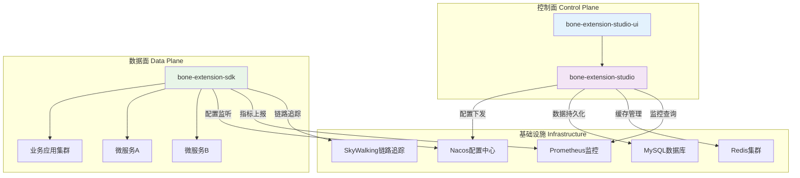

基于对 Bone 扩展引擎的深入分析和业界最佳实践，我为您生成完整的 **Bone 扩展引擎三大模块完整方案**：

---

# 🏗️ **Bone 扩展引擎完整架构方案**

## 🎯 **总体架构设计**



---

## 📦 **1. bone-extension-sdk - 核心运行时引擎**

### **🎯 模块定位**
**轻量级嵌入式扩展框架**，为业务应用提供高性能的扩展点运行时能力。

### **📁 完整项目结构**
```
bone-extension-sdk/
├── src/main/java/com/bone/extension/sdk/
│   ├── annotation/               # 核心注解
│   │   ├── ExtPoint.java
│   │   ├── Extension.java
│   │   └── EnableExtPoints.java
│   ├── context/                  # 上下文管理
│   │   ├── BizContext.java
│   │   ├── BizContextHolder.java
│   │   └── ContextBuilder.java
│   ├── router/                   # 路由引擎
│   │   ├── ExtPointRouter.java
│   │   ├── DefaultExtPointRouter.java
│   │   ├── condition/
│   │   │   ├── ExpressionEvaluator.java
│   │   │   └── ConditionMatcher.java
│   │   └── strategy/
│   │       ├── ExactMatchStrategy.java
│   │       ├── ExpressionMatchStrategy.java
│   │       └── DefaultMatchStrategy.java
│   ├── proxy/                    # 代理机制
│   │   ├── ExtPointProxyFactory.java
│   │   ├── InvocationHandler.java
│   │   └── ProxyCache.java
│   ├── repository/               # 存储抽象
│   │   ├── ExtPointRepository.java
│   │   ├── MemExtPointRepository.java
│   │   ├── RedisExtPointRepository.java
│   │   └── NacosExtPointRepository.java
│   ├── event/                    # 事件机制
│   │   ├── ExtensionEvent.java
│   │   ├── ExtensionEventPublisher.java
│   │   ├── DefaultExtensionEventPublisher.java
│   │   └── event/
│   │       ├── BeforeInvokeEvent.java
│   │       ├── AfterInvokeEvent.java
│   │       └── InvokeErrorEvent.java
│   ├── config/                   # 配置管理
│   │   ├── ExtensionConfigProperties.java
│   │   ├── ExtensionAutoConfiguration.java
│   │   └── ConditionProperties.java
│   ├── support/                  # 工具支持
│   │   ├── SpELExpressionEvaluator.java
│   │   ├── ExtensionClassLoader.java
│   │   ├── ExtensionScanner.java
│   │   └── BeanUtils.java
│   ├── register/                 # 注册机制
│   │   ├── ExtPointRegister.java
│   │   ├── ExtensionRegister.java
│   │   └── RegistryPostProcessor.java
│   ├── metrics/                  # 监控指标
│   └── exception/                # 异常体系
│       ├── ExtensionException.java
│       ├── ExtensionNotFoundException.java
│       ├── RouteException.java
│       └── RegistryException.java
├── src/test/java/                # 测试代码
└── pom.xml
```

### **🔧 核心实现代码**

#### **1.1 核心注解定义**
```java
// ExtPoint.java
@Target(ElementType.TYPE)
@Retention(RetentionPolicy.RUNTIME)
@Documented
public @interface ExtPoint {
    /**
     * 扩展点名称
     */
    String name() default "";
    
    /**
     * 扩展点描述
     */
    String description() default "";
    
    /**
     * 扩展点类型
     */
    ExtensionType type() default ExtensionType.BUSINESS;
    
    /**
     * 版本号
     */
    String version() default "1.0.0";
    
    /**
     * 是否启用
     */
    boolean enabled() default true;
}

// Extension.java
@Target(ElementType.TYPE)
@Retention(RetentionPolicy.RUNTIME)
@Documented
@Component
public @interface Extension {
    /**
     * 扩展点接口类
     */
    Class<?> point();
    
    /**
     * 租户编码
     */
    String tenantCode() default "DEFAULT";
    
    /**
     * 业务编码
     */
    String bizCode() default "DEFAULT";
    
    /**
     * 用例标识
     */
    String useCase() default "DEFAULT";
    
    /**
     * 场景标识
     */
    String scenario() default "DEFAULT";
    
    /**
     * SpEL表达式条件
     */
    String condition() default "";
    
    /**
     * 执行顺序
     */
    int order() default 0;
    
    /**
     * 是否启用
     */
    boolean enabled() default true;
    
    /**
     * 扩展点名称
     */
    String name() default "";
}
```

#### **1.2 业务上下文管理**
```java
// BizContext.java
import lombok.Getter;
import java.util.Collections;
import java.util.HashMap;
import java.util.Map;
import java.util.Objects;
import java.util.concurrent.ConcurrentHashMap;

public class BizContext<T> {
    // 标准业务维度
    private final String tenantCode;
    private final String bizCode;
    private final String useCase;
    private final String scenario;
    private final String env;
    private final String group;
    private final T data;
    
    // 扩展属性，使用ConcurrentHashMap保证线程安全
    @Getter(lazy = true)
    private final Map<String, Object> attributes = new ConcurrentHashMap<>();
    
    // 私有构造函数，确保通过Builder或静态工厂方法创建实例
    private BizContext(String tenantCode, String bizCode, String useCase, String scenario, T data) {
        this.tenantCode = tenantCode;
        this.bizCode = bizCode;
        this.useCase = useCase;
        this.scenario = scenario;
        this.env = null;
        this.group = null;
        this.data = data;
    }
    
    // 私有构造函数，支持环境和分组
    private BizContext(String tenantCode, String bizCode, String useCase, String scenario, String env, String group, T data) {
        this.tenantCode = tenantCode;
        this.bizCode = bizCode;
        this.useCase = useCase;
        this.scenario = scenario;
        this.env = env;
        this.group = group;
        this.data = data;
    }
    
    // 静态工厂方法
    public static <T> BizContext<T> create() {
        return BizContext.<T>builder().build();
    }
    
    public static <T> BizContext<T> ofTenant(String tenantCode) {
        return BizContext.<T>builder().tenantCode(tenantCode).build();
    }
    
    public static <T> BizContext<T> ofBusiness(String bizCode) {
        return BizContext.<T>builder().bizCode(bizCode).build();
    }
    
    public static <T> BizContext<T> of(String tenantCode, String bizCode) {
        return BizContext.<T>builder().tenantCode(tenantCode).bizCode(bizCode).build();
    }
    
    // 实例方法 - 创建新实例
    public BizContext<T> withScenario(String scenario) {
        return new BizContext<>(tenantCode, bizCode, useCase, scenario, env, group, data);
    }
    
    // 属性操作方法（线程安全）
    public BizContext<T> withAttribute(String key, Object value) {
        Objects.requireNonNull(key, "Attribute key must not be null");
        attributes().put(key, value);
        return this;
    }
    
    @SuppressWarnings("unchecked")
    public <V> V getAttribute(String key) {
        if (key == null) {
            return null;
        }
        return (V) this.attributes().get(key);
    }
    
    public boolean hasAttribute(String key) {
        return key != null && attributes().containsKey(key);
    }
    
    // 内部方法，获取属性映射
    private Map<String, Object> attributes() {
        return this.attributes.get();
    }
    
    // Builder相关方法
    public static <T> BizContextBuilder<T> builder() {
        return new BizContextBuilder<T>();
    }
    
    // 内部Builder类
    public static class BizContextBuilder<T> {
        private String tenantCode;
        private String bizCode;
        private String useCase;
        private String scenario;
        private String env;
        private String group;
        private T data;
        private Map<String, Object> attributes;
        
        public BizContextBuilder<T> tenantCode(String tenantCode) {
            this.tenantCode = tenantCode;
            return this;
        }
        
        public BizContextBuilder<T> bizCode(String bizCode) {
            this.bizCode = bizCode;
            return this;
        }
        
        public BizContextBuilder<T> useCase(String useCase) {
            this.useCase = useCase;
            return this;
        }
        
        public BizContextBuilder<T> scenario(String scenario) {
            this.scenario = scenario;
            return this;
        }
        
        public BizContextBuilder<T> env(String env) {
            this.env = env;
            return this;
        }
        
        public BizContextBuilder<T> group(String group) {
            this.group = group;
            return this;
        }
        
        public BizContextBuilder<T> data(T data) {
            this.data = data;
            return this;
        }
        
        public BizContextBuilder<T> attribute(String key, Object value) {
            Objects.requireNonNull(key, "Attribute key must not be null");
            if (this.attributes == null) {
                this.attributes = new HashMap<>();
            }
            this.attributes.put(key, value);
            return this;
        }
        
        public BizContext<T> build() {
            BizContext<T> context = new BizContext<>(tenantCode, bizCode, useCase, scenario, env, group, data);
            // 初始化属性
            if (this.attributes != null && !this.attributes.isEmpty()) {
                context.attributes().putAll(this.attributes);
            }
            return context;
        }
    }
    
    // Getter方法
    public String getTenantCode() { return tenantCode; }
    public String getBizCode() { return bizCode; }
    public String getUseCase() { return useCase; }
    public String getScenario() { return scenario; }
    public String getEnv() { return env; }
    public String getGroup() { return group; }
    public T getData() { return data; }
    public Map<String, Object> getAttributes() { return Collections.unmodifiableMap(attributes()); }
}

// BizContextHolder.java
public class BizContextHolder {
    private static final ThreadLocal<BizContext<?>> CONTEXT_HOLDER = new InheritableThreadLocal<>();
    
    public static void setContext(BizContext<?> context) {
        if (context == null) {
            clearContext();
        } else {
            CONTEXT_HOLDER.set(context);
        }
    }
    
    @SuppressWarnings("unchecked")
    public static <T> BizContext<T> getContext() {
        return (BizContext<T>) CONTEXT_HOLDER.get();
    }
    
    public static void clearContext() {
        CONTEXT_HOLDER.remove();
    }
    
    public static boolean hasContext() {
        return CONTEXT_HOLDER.get() != null;
    }
}
```

#### **1.3 智能路由引擎**
```java
// DefaultExtPointRouter.java
@Component
@Slf4j
public class DefaultExtPointRouter implements ExtPointRouter {
    
    private final ExtPointRepository repository;
    private final ExpressionEvaluator expressionEvaluator;
    private final Cache<RouteKey, Object> routeCache;
    
    public DefaultExtPointRouter(ExtPointRepository repository, 
                               ExpressionEvaluator expressionEvaluator,
                               ExtensionConfigProperties config) {
        this.repository = repository;
        this.expressionEvaluator = expressionEvaluator;
        
        // 初始化路由缓存
        CacheBuilder<Object, Object> cacheBuilder = Caffeine.newBuilder()
            .maximumSize(config.getCache().getMaximumSize())
            .expireAfterWrite(config.getCache().getExpireAfterWrite());
            
        if (config.getCache().isRecordStats()) {
            cacheBuilder.recordStats();
        }
        
        this.routeCache = cacheBuilder.build();
    }
    
    @Override
    public <T> T route(Class<T> extPointClass, BizContext<?> context) {
        // 构建缓存Key
        RouteKey cacheKey = new RouteKey(extPointClass, context);
        
        // 尝试从缓存获取
        if (routeCache != null) {
            T cached = (T) routeCache.getIfPresent(cacheKey);
            if (cached != null) {
                log.debug("Route cache hit for: {}", cacheKey);
                return cached;
            }
        }
        
        // 执行路由逻辑
        T result = doRoute(extPointClass, context);
        
        // 缓存结果
        if (routeCache != null && result != null) {
            routeCache.put(cacheKey, result);
        }
        
        return result;
    }
    
    private <T> T doRoute(Class<T> extPointClass, BizContext<?> context) {
        List<Extension> candidates = repository.findByPoint(extPointClass);
        
        if (candidates.isEmpty()) {
            throw new ExtensionNotFoundException("No extension found for: " + extPointClass.getName());
        }
        
        // 过滤启用的扩展
        List<Extension> enabledExtensions = candidates.stream()
            .filter(Extension::isEnabled)
            .collect(Collectors.toList());
            
        if (enabledExtensions.isEmpty()) {
            throw new ExtensionNotFoundException("No enabled extension found for: " + extPointClass.getName());
        }
        
        // 三级路由匹配
        Optional<Extension> targetExtension = findTargetExtension(enabledExtensions, context);
        
        return targetExtension.map(extension -> {
            try {
                T instance = createExtensionInstance(extension);
                log.debug("Routed to extension: {} for context: {}", extension.getId(), context);
                return instance;
            } catch (Exception e) {
                throw new RouteException("Failed to create extension instance: " + extension.getId(), e);
            }
        }).orElseThrow(() -> new ExtensionNotFoundException(
            "No matching extension found for context: " + context));
    }
    
    private Optional<Extension> findTargetExtension(List<Extension> candidates, BizContext<?> context) {
        // 第一级：精确维度匹配
        Optional<Extension> exactMatch = candidates.stream()
            .filter(ext -> matchExactDimensions(ext, context))
            .min(Comparator.comparing(Extension::getOrder));
            
        if (exactMatch.isPresent()) {
            log.debug("Found exact match extension: {}", exactMatch.get().getId());
            return exactMatch;
        }
        
        // 第二级：表达式匹配
        List<Extension> expressionCandidates = candidates.stream()
            .filter(ext -> StringUtils.isNotEmpty(ext.getCondition()))
            .collect(Collectors.toList());
            
        Optional<Extension> expressionMatch = expressionCandidates.stream()
            .filter(ext -> matchByExpression(ext, context))
            .min(Comparator.comparing(Extension::getOrder));
            
        if (expressionMatch.isPresent()) {
            log.debug("Found expression match extension: {}", expressionMatch.get().getId());
            return expressionMatch;
        }
        
        // 第三级：默认实现
        Optional<Extension> defaultImpl = candidates.stream()
            .filter(this::isDefaultExtension)
            .min(Comparator.comparing(Extension::getOrder));
            
        defaultImpl.ifPresent(ext -> 
            log.debug("Using default extension: {}", ext.getId()));
            
        return defaultImpl;
    }
    
    private boolean matchExactDimensions(Extension extension, BizContext<?> context) {
        return Objects.equals(extension.getTenantCode(), context.getTenantCode()) &&
               Objects.equals(extension.getBizCode(), context.getBizCode()) &&
               Objects.equals(extension.getUseCase(), context.getUseCase()) &&
               Objects.equals(extension.getScenario(), context.getScenario()) &&
               Objects.equals(extension.getEnv(), context.getEnv()) &&
               Objects.equals(extension.getGroup(), context.getGroup());
    }
    
    private boolean matchByExpression(Extension extension, BizContext<?> context) {
        try {
            return expressionEvaluator.evaluate(extension.getCondition(), context);
        } catch (Exception e) {
            log.warn("Failed to evaluate expression: {} for context: {}", 
                    extension.getCondition(), context, e);
            return false;
        }
    }
    
    private boolean isDefaultExtension(Extension extension) {
        return "DEFAULT".equals(extension.getTenantCode()) &&
               "DEFAULT".equals(extension.getBizCode()) &&
               "DEFAULT".equals(extension.getUseCase()) &&
               "DEFAULT".equals(extension.getScenario()) &&
               ("DEFAULT".equals(extension.getEnv()) || extension.getEnv() == null) &&
               ("DEFAULT".equals(extension.getGroup()) || extension.getGroup() == null) &&
               StringUtils.isEmpty(extension.getCondition());
    }
    
    @SuppressWarnings("unchecked")
    private <T> T createExtensionInstance(Extension extension) {
        try {
            Class<?> implClass = Class.forName(extension.getImplClass());
            return (T) SpringContextHolder.getBean(implClass);
        } catch (ClassNotFoundException e) {
            throw new RouteException("Extension class not found: " + extension.getImplClass(), e);
        }
    }
    
    // 路由缓存Key
    private static class RouteKey {
        private final Class<?> extPointClass;
        private final BizContext<?> context;
        private final int hashCode;
        
        public RouteKey(Class<?> extPointClass, BizContext<?> context) {
            this.extPointClass = extPointClass;
            this.context = context;
            this.hashCode = Objects.hash(extPointClass, context.getTenantCode(), 
                                       context.getBizCode(), context.getUseCase(), 
                                       context.getScenario(), context.getEnv(),
                                       context.getGroup());
        }
        
        @Override
        public boolean equals(Object o) {
            if (this == o) return true;
            if (o == null || getClass() != o.getClass()) return false;
            RouteKey routeKey = (RouteKey) o;
            return Objects.equals(extPointClass, routeKey.extPointClass) &&
                   Objects.equals(context.getTenantCode(), routeKey.context.getTenantCode()) &&
                   Objects.equals(context.getBizCode(), routeKey.context.getBizCode()) &&
                   Objects.equals(context.getUseCase(), routeKey.context.getUseCase()) &&
                   Objects.equals(context.getScenario(), routeKey.context.getScenario()) &&
                   Objects.equals(context.getEnv(), routeKey.context.getEnv()) &&
                   Objects.equals(context.getGroup(), routeKey.context.getGroup());
        }
        
        @Override
        public int hashCode() {
            return hashCode;
        }
    }
}
```

#### **1.4 配置管理**
```java
// ExtensionConfigProperties.java
@ConfigurationProperties(prefix = "bone.extension")
@Data
@Validated
public class ExtensionConfigProperties {
    
    /**
     * 是否启用扩展点框架
     */
    private boolean enabled = true;
    
    /**
     * 扫描的基础包路径
     */
    private List<String> basePackages = Arrays.asList("com.bone.extension");
    
    /**
     * 缓存配置
     */
    private CacheConfig cache = new CacheConfig();
    
    /**
     * 事件配置
     */
    private EventConfig event = new EventConfig();
    

    
    /**
     * 存储配置
     */
    private RepositoryConfig repository = new RepositoryConfig();
    
    @Data
    public static class CacheConfig {
        /**
         * 是否启用缓存
         */
        private boolean enabled = true;
        
        /**
         * 缓存最大大小
         */
        private int maximumSize = 1000;
        
        /**
         * 缓存过期时间
         */
        private Duration expireAfterWrite = Duration.ofMinutes(30);
        
        /**
         * 是否记录缓存统计
         */
        private boolean recordStats = true;
    }
    
    @Data
    public static class EventConfig {
        /**
         * 是否启用事件机制
         */
        private boolean enabled = true;
        
        /**
         * 是否异步发布事件
         */
        private boolean asyncPublish = true;
        
        /**
         * 事件线程池配置
         */
        private ExecutorConfig executor = new ExecutorConfig();
    }
    

    
    @Data
    public static class RepositoryConfig {
        /**
         * 存储类型
         */
        private RepositoryType type = RepositoryType.MEMORY;
        
        /**
         * Redis配置
         */
        private RedisConfig redis = new RedisConfig();
        
        /**
         * Nacos配置
         */
        private NacosConfig nacos = new NacosConfig();
    }
    
    @Data
    public static class ExecutorConfig {
        private int corePoolSize = 2;
        private int maxPoolSize = 8;
        private int queueCapacity = 100;
        private Duration keepAliveTime = Duration.ofSeconds(60);
    }
    
    @Data
    public static class RedisConfig {
        private String keyPrefix = "bone:extension:";
        private Duration expireTime = Duration.ofHours(1);
    }
    
    @Data
    public static class NacosConfig {
        private String group = "EXTENSION_GROUP";
        private Duration timeout = Duration.ofSeconds(3);
    }
    
    public enum RepositoryType {
        MEMORY, REDIS, NACOS, DATABASE
    }
}
```

### **📋 Maven配置**
```xml
<?xml version="1.0" encoding="UTF-8"?>
<project xmlns="http://maven.apache.org/POM/4.0.0"
         xmlns:xsi="http://www.w3.org/2001/XMLSchema-instance"
         xsi:schemaLocation="http://maven.apache.org/POM/4.0.0 
                             http://maven.apache.org/xsd/maven-4.0.0.xsd">
    <modelVersion>4.0.0</modelVersion>
    
    <groupId>com.bone</groupId>
    <artifactId>bone-extension-sdk</artifactId>
    <version>1.0.0</version>
    <packaging>jar</packaging>
    
    <name>Bone Extension SDK</name>
    <description>Bone Platform Extension Point SDK</description>
    
    <properties>
        <maven.compiler.source>17</maven.compiler.source>
        <maven.compiler.target>17</maven.compiler.target>
        <project.build.sourceEncoding>UTF-8</project.build.sourceEncoding>
        <spring-boot.version>3.2.0</spring-boot.version>
        <caffeine.version>3.1.8</caffeine.version>
        <micrometer.version>1.12.0</micrometer.version>
    </properties>
    
    <dependencies>
        <!-- Spring Boot Starter -->
        <dependency>
            <groupId>org.springframework.boot</groupId>
            <artifactId>spring-boot-starter</artifactId>
            <version>${spring-boot.version}</version>
        </dependency>
        
        <!-- Spring Boot Configuration Processor -->
        <dependency>
            <groupId>org.springframework.boot</groupId>
            <artifactId>spring-boot-configuration-processor</artifactId>
            <version>${spring-boot.version}</version>
            <optional>true</optional>
        </dependency>
        
        <!-- Spring Context Support -->
        <dependency>
            <groupId>org.springframework</groupId>
            <artifactId>spring-context-support</artifactId>
        </dependency>
        
        <!-- Caffeine Cache -->
        <dependency>
            <groupId>com.github.ben-manes.caffeine</groupId>
            <artifactId>caffeine</artifactId>
            <version>${caffeine.version}</version>
        </dependency>
        
        <!-- Micrometer Metrics -->
        <dependency>
            <groupId>io.micrometer</groupId>
            <artifactId>micrometer-core</artifactId>
            <version>${micrometer.version}</version>
        </dependency>
        
        <!-- Redis Client -->
        <dependency>
            <groupId>org.springframework.boot</groupId>
            <artifactId>spring-boot-starter-data-redis</artifactId>
            <version>${spring-boot.version}</version>
            <optional>true</optional>
        </dependency>
        
        <!-- Nacos Client -->
        <dependency>
            <groupId>com.alibaba.nacos</groupId>
            <artifactId>nacos-client</artifactId>
            <version>2.3.0</version>
            <optional>true</optional>
        </dependency>
        
        <!-- Lombok -->
        <dependency>
            <groupId>org.projectlombok</groupId>
            <artifactId>lombok</artifactId>
            <version>1.18.30</version>
            <optional>true</optional>
        </dependency>
        
        <!-- Test Dependencies -->
        <dependency>
            <groupId>org.springframework.boot</groupId>
            <artifactId>spring-boot-starter-test</artifactId>
            <version>${spring-boot.version}</version>
            <scope>test</scope>
        </dependency>
    </dependencies>
    
    <build>
        <plugins>
            <plugin>
                <groupId>org.springframework.boot</groupId>
                <artifactId>spring-boot-maven-plugin</artifactId>
                <version>${spring-boot.version}</version>
                <configuration>
                    <classifier>exec</classifier>
                </configuration>
            </plugin>
        </plugins>
    </build>
</xml>
```

---

## 🎛️ **2. bone-extension-studio - 管理中心**

### **🎯 模块定位**
**企业级扩展治理平台**，提供完整的扩展点生命周期管理能力。

### **📁 完整项目结构**
```
bone-extension-studio/
├── src/main/java/com/bone/extension/studio/
│   ├── Application.java                    # 启动类
│   ├── application/                        # 应用层
│   │   ├── service/                       # 应用服务
│   │   │   ├── ExtensionPointAppService.java
│   │   │   ├── PluginLifecycleAppService.java
│   │   │   ├── RouteRuleAppService.java
│   │   │   ├── MonitoringAppService.java
│   │   │   └── SystemAppService.java
│   │   ├── dto/                          # 数据传输对象
│   │   │   ├── request/
│   │   │   │   ├── CreateExtensionPointRequest.java
│   │   │   │   ├── UpdateExtensionPointRequest.java
│   │   │   │   ├── PluginUploadRequest.java
│   │   │   │   ├── CreateRouteRuleRequest.java
│   │   │   │   └── SearchRequest.java
│   │   │   └── response/
│   │   │       ├── ExtensionPointDTO.java
│   │   │       ├── PluginDTO.java
│   │   │       ├── RouteRuleDTO.java
│   │   │       ├── MetricsDTO.java
│   │   │       └── PageResult.java
│   │   └── command/                      # 命令对象
│   │       ├── PluginInstallCommand.java
│   │       ├── PluginUpgradeCommand.java
│   │       ├── RulePublishCommand.java
│   │       └── ConfigUpdateCommand.java
│   ├── domain/                           # 领域层
│   │   ├── model/                        # 领域模型
│   │   │   ├── ExtensionPoint.java
│   │   │   ├── ExtensionImplementation.java
│   │   │   ├── RouteRule.java
│   │   │   ├── PluginPackage.java
│   │   │   ├── AuditLog.java
│   │   │   └── SystemConfig.java
│   │   ├── service/                      # 领域服务
│   │   │   ├── ExtensionPointDomainService.java
│   │   │   ├── PluginDomainService.java
│   │   │   ├── RouteRuleDomainService.java
│   │   │   └── MetricsDomainService.java
│   │   ├── repository/                   # 仓储接口
│   │   │   ├── ExtensionPointRepository.java
│   │   │   ├── ExtensionImplementationRepository.java
│   │   │   ├── RouteRuleRepository.java
│   │   │   ├── PluginPackageRepository.java
│   │   │   └── AuditLogRepository.java
│   │   ├── event/                        # 领域事件
│   │   │   ├── ExtensionPointPublishedEvent.java
│   │   │   ├── PluginInstalledEvent.java
│   │   │   ├── RouteRuleChangedEvent.java
│   │   │   └── DomainEventPublisher.java
│   │   └── exception/                    # 领域异常
│   │       ├── DomainException.java
│   │       ├── ExtensionPointNotFoundException.java
│   │       ├── PluginConflictException.java
│   │       └── RuleValidationException.java
│   ├── infrastructure/                   # 基础设施层
│   │   ├── repository/                   # 仓储实现
│   │   │   ├── jpa/
│   │   │   │   ├── JpaExtensionPointRepository.java
│   │   │   │   ├── JpaExtensionImplementationRepository.java
│   │   │   │   ├── JpaRouteRuleRepository.java
│   │   │   │   └── JpaAuditLogRepository.java
│   │   │   └── redis/
│   │   │       ├── RedisCacheRepository.java
│   │   │       └── RedisLockRepository.java
│   │   ├── external/                     # 外部服务
│   │   │   ├── NacosConfigClient.java
│   │   │   ├── MetricsQueryClient.java
│   │   │   ├── SecurityScannerClient.java
│   │   │   └── DependencyAnalyzerClient.java
│   │   ├── config/                       # 配置类
│   │   │   ├── JpaConfig.java
│   │   │   ├── RedisConfig.java
│   │   │   ├── SecurityConfig.java
│   │   │   ├── WebConfig.java
│   │   │   └── AsyncConfig.java
│   │   └── util/                         # 工具类
│   │       ├── JsonUtils.java
│   │       ├── FileUtils.java
│   │       ├── SecurityUtils.java
│   │       └── IdGenerator.java
│   └── interfaces/                       # 接口层
│       ├── web/                          # Web控制器
│       │   ├── controller/
│       │   │   ├── ExtensionPointController.java
│       │   │   ├── PluginController.java
│       │   │   ├── RouteRuleController.java
│       │   │   ├── MonitoringController.java
│       │   │   └── SystemController.java
│       │   ├── dto/                      # Web DTO
│       │   ├── validator/                # 参数校验
│       │   └── advice/                   # 全局处理
│       │       ├── GlobalExceptionHandler.java
│       │       ├── ResponseAdvice.java
│       │       └── LoggingAdvice.java
│       ├── rpc/                          # RPC接口
│       └── task/                         # 定时任务
│           ├── MetricsCollectorTask.java
│           ├── CacheCleanupTask.java
│           └── HealthCheckTask.java
├── src/main/resources/
│   ├── application.yml
│   ├── application-dev.yml
│   ├── application-prod.yml
│   ├── db/
│   │   └── migration/
│   ├── static/
│   └── templates/
└── src/test/java/                        # 测试代码
```

### **🔧 核心实现代码**

#### **2.1 领域模型**
```java
// ExtensionPoint.java
@Entity
@Table(name = "ext_extension_point")
@Getter
@Setter
@ToString
@NoArgsConstructor
@AllArgsConstructor
public class ExtensionPoint {
    
    @Id
    @Column(name = "point_id", length = 64)
    private String pointId;
    
    @Column(name = "name", nullable = false, length = 128)
    private String name;
    
    @Column(name = "description", length = 512)
    private String description;
    
    @Column(name = "category", length = 64)
    private String category;
    
    @Column(name = "interface_class", nullable = false, length = 256)
    private String interfaceClass;
    
    @Column(name = "parameter_schema", columnDefinition = "TEXT")
    private String parameterSchema;
    
    @Enumerated(EnumType.STRING)
    @Column(name = "status", length = 32)
    private ExtensionStatus status = ExtensionStatus.DRAFT;
    
    @Column(name = "version", length = 32)
    private String version = "1.0.0";
    
    @Column(name = "owner", length = 64)
    private String owner;
    
    @CreationTimestamp
    @Column(name = "create_time")
    private Date createTime;
    
    @UpdateTimestamp
    @Column(name = "update_time")
    private Date updateTime;
    
    @Version
    @Column(name = "version_lock")
    private Long versionLock;
    
    // 聚合边界内的实体
    @OneToMany(mappedBy = "extensionPoint", cascade = CascadeType.ALL, fetch = FetchType.LAZY)
    private List<ExtensionImplementation> implementations = new ArrayList<>();
    
    @OneToMany(mappedBy = "extensionPoint", cascade = CascadeType.ALL, fetch = FetchType.LAZY)
    private List<RouteRule> routeRules = new ArrayList<>();
    
    // 领域方法
    public void publish() {
        if (this.status != ExtensionStatus.DRAFT) {
            throw new DomainException("Only draft extension points can be published");
        }
        this.status = ExtensionStatus.ACTIVE;
        this.updateTime = new Date();
        
        // 发布领域事件
        DomainEventPublisher.publish(new ExtensionPointPublishedEvent(this.pointId));
    }
    
    public void disable() {
        if (this.status != ExtensionStatus.ACTIVE) {
            throw new DomainException("Only active extension points can be disabled");
        }
        this.status = ExtensionStatus.DISABLED;
        this.updateTime = new Date();
    }
    
    public void addImplementation(ExtensionImplementation implementation) {
        if (this.implementations == null) {
            this.implementations = new ArrayList<>();
        }
        implementation.setExtensionPoint(this);
        this.implementations.add(implementation);
    }
    
    public void validate() {
        if (StringUtils.isBlank(this.name)) {
            throw new DomainException("Extension point name cannot be empty");
        }
        if (StringUtils.isBlank(this.interfaceClass)) {
            throw new DomainException("Interface class cannot be empty");
        }
        // 验证接口类是否存在
        try {
            Class.forName(this.interfaceClass);
        } catch (ClassNotFoundException e) {
            throw new DomainException("Interface class not found: " + this.interfaceClass);
        }
    }
}

// ExtensionImplementation.java
@Entity
@Table(name = "ext_extension_implementation")
@Getter
@Setter
@ToString
@NoArgsConstructor
@AllArgsConstructor
public class ExtensionImplementation {
    
    @Id
    @Column(name = "impl_id", length = 64)
    private String implId;
    
    @ManyToOne(fetch = FetchType.LAZY)
    @JoinColumn(name = "point_id")
    @ToString.Exclude
    private ExtensionPoint extensionPoint;
    
    @Column(name = "name", nullable = false, length = 128)
    private String name;
    
    @Column(name = "impl_class", nullable = false, length = 256)
    private String implClass;
    
    @Column(name = "version", length = 32)
    private String version;
    
    @Enumerated(EnumType.STRING)
    @Column(name = "status", length = 32)
    private ImplementationStatus status = ImplementationStatus.DEVELOPING;
    
    @Column(name = "config", columnDefinition = "TEXT")
    private String config;
    
    @Column(name = "dependencies", columnDefinition = "TEXT")
    private String dependencies;
    
    @Column(name = "file_size")
    private Long fileSize;
    
    @Column(name = "file_path", length = 512)
    private String filePath;
    
    @Column(name = "developer", length = 64)
    private String developer;
    
    @Column(name = "description", length = 512)
    private String description;
    
    @CreationTimestamp
    @Column(name = "upload_time")
    private Date uploadTime;
    
    @UpdateTimestamp
    @Column(name = "update_time")
    private Date updateTime;
    
    // 业务方法
    public void enable() {
        this.status = ImplementationStatus.ACTIVE;
        this.updateTime = new Date();
    }
    
    public void disable() {
        this.status = ImplementationStatus.DISABLED;
        this.updateTime = new Date();
    }
    
    public Map<String, Object> getConfigMap() {
        if (StringUtils.isBlank(this.config)) {
            return Collections.emptyMap();
        }
        try {
            return JsonUtils.parseMap(this.config);
        } catch (Exception e) {
            throw new DomainException("Invalid config format: " + this.config, e);
        }
    }
    
    public void setConfigMap(Map<String, Object> config) {
        if (config == null || config.isEmpty()) {
            this.config = null;
        } else {
            this.config = JsonUtils.toJson(config);
        }
    }
}
```

#### **2.2 应用服务**
```java
// ExtensionPointAppService.java
@Service
@Transactional
@Slf4j
public class ExtensionPointAppService {
    
    private final ExtensionPointDomainService domainService;
    private final ExtensionPointRepository repository;
    private final NacosConfigClient configClient;
    private final AuditLogRepository auditLogRepository;
    
    public ExtensionPointAppService(ExtensionPointDomainService domainService,
                                  ExtensionPointRepository repository,
                                  NacosConfigClient configClient,
                                  AuditLogRepository auditLogRepository) {
        this.domainService = domainService;
        this.repository = repository;
        this.configClient = configClient;
        this.auditLogRepository = auditLogRepository;
    }
    
    public PageResult<ExtensionPointDTO> searchExtensionPoints(SearchRequest request) {
        Pageable pageable = PageRequest.of(request.getPage() - 1, request.getSize(),
                                          getSort(request));
        
        Page<ExtensionPoint> page = repository.findByCriteria(request, pageable);
        
        List<ExtensionPointDTO> dtos = page.getContent().stream()
            .map(this::convertToDTO)
            .collect(Collectors.toList());
            
        return PageResult.of(dtos, page.getTotalElements(), request.getPage(), request.getSize());
    }
    
    public ExtensionPointDTO getExtensionPoint(String pointId) {
        ExtensionPoint point = repository.findById(pointId)
            .orElseThrow(() -> new ExtensionPointNotFoundException(pointId));
        return convertToDTO(point);
    }
    
    public ExtensionPointDTO createExtensionPoint(CreateExtensionPointRequest request) {
        // 验证请求参数
        request.validate();
        
        // 创建领域对象
        ExtensionPoint point = new ExtensionPoint();
        point.setPointId(IdGenerator.nextId());
        point.setName(request.getName());
        point.setDescription(request.getDescription());
        point.setCategory(request.getCategory());
        point.setInterfaceClass(request.getInterfaceClass());
        point.setParameterSchema(request.getParameterSchema());
        point.setOwner(request.getOwner());
        point.setVersion(request.getVersion());
        
        // 验证领域对象
        point.validate();
        
        // 保存到数据库
        ExtensionPoint saved = repository.save(point);
        
        // 记录审计日志
        auditLogRepository.save(AuditLog.extensionPointCreated(saved.getPointId(), 
                                                              SecurityUtils.getCurrentUser()));
        
        log.info("Extension point created: {}", saved.getPointId());
        return convertToDTO(saved);
    }
    
    public ExtensionPointDTO updateExtensionPoint(String pointId, 
                                                 UpdateExtensionPointRequest request) {
        // 查找现有扩展点
        ExtensionPoint point = repository.findById(pointId)
            .orElseThrow(() -> new ExtensionPointNotFoundException(pointId));
            
        // 验证状态
        if (point.getStatus() == ExtensionStatus.ACTIVE) {
            throw new DomainException("Cannot modify active extension point");
        }
        
        // 更新字段
        if (StringUtils.isNotBlank(request.getName())) {
            point.setName(request.getName());
        }
        if (StringUtils.isNotBlank(request.getDescription())) {
            point.setDescription(request.getDescription());
        }
        if (StringUtils.isNotBlank(request.getCategory())) {
            point.setCategory(request.getCategory());
        }
        if (StringUtils.isNotBlank(request.getParameterSchema())) {
            point.setParameterSchema(request.getParameterSchema());
        }
        
        // 验证并保存
        point.validate();
        ExtensionPoint updated = repository.save(point);
        
        // 记录审计日志
        auditLogRepository.save(AuditLog.extensionPointUpdated(pointId, 
                                                              SecurityUtils.getCurrentUser()));
        
        log.info("Extension point updated: {}", pointId);
        return convertToDTO(updated);
    }
    
    public void publishExtensionPoint(String pointId) {
        ExtensionPoint point = repository.findById(pointId)
            .orElseThrow(() -> new ExtensionPointNotFoundException(pointId));
            
        point.publish();
        repository.save(point);
        
        // 发布到配置中心
        publishToConfigCenter(point);
        
        // 记录审计日志
        auditLogRepository.save(AuditLog.extensionPointPublished(pointId, 
                                                               SecurityUtils.getCurrentUser()));
        
        log.info("Extension point published: {}", pointId);
    }
    
    public void deleteExtensionPoint(String pointId) {
        ExtensionPoint point = repository.findById(pointId)
            .orElseThrow(() -> new ExtensionPointNotFoundException(pointId));
            
        // 检查是否有依赖
        if (!point.getImplementations().isEmpty()) {
            throw new DomainException("Cannot delete extension point with implementations");
        }
        if (!point.getRouteRules().isEmpty()) {
            throw new DomainException("Cannot delete extension point with route rules");
        }
        
        repository.delete(point);
        
        // 记录审计日志
        auditLogRepository.save(AuditLog.extensionPointDeleted(pointId, 
                                                              SecurityUtils.getCurrentUser()));
        
        log.info("Extension point deleted: {}", pointId);
    }
    
    private void publishToConfigCenter(ExtensionPoint point) {
        try {
            Map<String, Object> config = new HashMap<>();
            config.put("pointId", point.getPointId());
            config.put("name", point.getName());
            config.put("interfaceClass", point.getInterfaceClass());
            config.put("parameterSchema", point.getParameterSchema());
            config.put("status", point.getStatus().name());
            config.put("version", point.getVersion());
            
            configClient.publishConfig(buildConfigDataId(point.getPointId()), config);
        } catch (Exception e) {
            log.error("Failed to publish extension point to config center: {}", point.getPointId(), e);
            throw new DomainException("Failed to publish to config center", e);
        }
    }
    
    private ExtensionPointDTO convertToDTO(ExtensionPoint point) {
        ExtensionPointDTO dto = new ExtensionPointDTO();
        dto.setPointId(point.getPointId());
        dto.setName(point.getName());
        dto.setDescription(point.getDescription());
        dto.setCategory(point.getCategory());
        dto.setInterfaceClass(point.getInterfaceClass());
        dto.setParameterSchema(point.getParameterSchema());
        dto.setStatus(point.getStatus());
        dto.setVersion(point.getVersion());
        dto.setOwner(point.getOwner());
        dto.setCreateTime(point.getCreateTime());
        dto.setUpdateTime(point.getUpdateTime());
        
        // 统计信息
        if (point.getImplementations() != null) {
            dto.setImplementationCount(point.getImplementations().size());
            dto.setActiveImplementationCount((int) point.getImplementations().stream()
                .filter(impl -> impl.getStatus() == ImplementationStatus.ACTIVE)
                .count());
        }
        
        if (point.getRouteRules() != null) {
            dto.setRouteRuleCount(point.getRouteRules().size());
        }
        
        return dto;
    }
    
    private Sort getSort(SearchRequest request) {
        if (StringUtils.isBlank(request.getSortField())) {
            return Sort.by(Sort.Direction.DESC, "createTime");
        }
        
        Sort.Direction direction = "descend".equals(request.getSortOrder()) ? 
                                 Sort.Direction.DESC : Sort.Direction.ASC;
        return Sort.by(direction, request.getSortField());
    }
    
    private String buildConfigDataId(String pointId) {
        return String.format("extension-point-%s", pointId);
    }
}
```

#### **2.3 Web控制器**
```java
// ExtensionPointController.java
@RestController
@RequestMapping("/api/extension/points")
@Validated
@Slf4j
public class ExtensionPointController {
    
    private final ExtensionPointAppService appService;
    
    public ExtensionPointController(ExtensionPointAppService appService) {
        this.appService = appService;
    }
    
    @GetMapping
    public ApiResponse<PageResult<ExtensionPointDTO>> listExtensionPoints(
            @Valid SearchRequest request) {
        PageResult<ExtensionPointDTO> result = appService.searchExtensionPoints(request);
        return ApiResponse.success(result);
    }
    
    @GetMapping("/{pointId}")
    public ApiResponse<ExtensionPointDTO> getExtensionPoint(
            @PathVariable @NotBlank String pointId) {
        ExtensionPointDTO dto = appService.getExtensionPoint(pointId);
        return ApiResponse.success(dto);
    }
    
    @PostMapping
    public ApiResponse<ExtensionPointDTO> createExtensionPoint(
            @Valid @RequestBody CreateExtensionPointRequest request) {
        ExtensionPointDTO dto = appService.createExtensionPoint(request);
        return ApiResponse.success(dto);
    }
    
    @PutMapping("/{pointId}")
    public ApiResponse<ExtensionPointDTO> updateExtensionPoint(
            @PathVariable @NotBlank String pointId,
            @Valid @RequestBody UpdateExtensionPointRequest request) {
        ExtensionPointDTO dto = appService.updateExtensionPoint(pointId, request);
        return ApiResponse.success(dto);
    }
    
    @PostMapping("/{pointId}/publish")
    public ApiResponse<Void> publishExtensionPoint(
            @PathVariable @NotBlank String pointId) {
        appService.publishExtensionPoint(pointId);
        return ApiResponse.success();
    }
    
    @PostMapping("/{pointId}/disable")
    public ApiResponse<Void> disableExtensionPoint(
            @PathVariable @NotBlank String pointId) {
        appService.disableExtensionPoint(pointId);
        return ApiResponse.success();
    }
    
    @DeleteMapping("/{pointId}")
    public ApiResponse<Void> deleteExtensionPoint(
            @PathVariable @NotBlank String pointId) {
        appService.deleteExtensionPoint(pointId);
        return ApiResponse.success();
    }
    
    @GetMapping("/categories")
    public ApiResponse<List<String>> getCategories() {
        List<String> categories = appService.getCategories();
        return ApiResponse.success(categories);
    }
}
```

#### **2.4 应用配置**
```yaml
# application.yml
spring:
  application:
    name: bone-extension-studio
  profiles:
    active: dev
    
server:
  port: 8080
  servlet:
    context-path: /
    
management:
  endpoints:
    web:
      exposure:
        include: health,info,metrics,prometheus
  endpoint:
    health:
      show-details: always

bone:
  extension:
    studio:
      # 安全配置
      security:
        enabled: true
        jwt:
          secret: bone-extension-studio-secret-key
          expiration: 86400
      # 文件上传配置
      upload:
        max-file-size: 100MB
        max-request-size: 100MB
        temp-dir: /tmp/bone-extension/uploads
      # 监控配置
      monitoring:
        enabled: true
        retention-days: 30
      # 审计配置
      audit:
        enabled: true
        retention-days: 90

# application-dev.yml
spring:
  datasource:
    url: jdbc:mysql://localhost:3306/bone_extension?useUnicode=true&characterEncoding=utf8&useSSL=false
    username: root
    password: 123456
    driver-class-name: com.mysql.cj.jdbc.Driver
  jpa:
    hibernate:
      ddl-auto: update
    show-sql: true
    properties:
      hibernate:
        format_sql: true
  redis:
    host: localhost
    port: 6379
    password:
    database: 0

nacos:
  config:
    server-addr: localhost:8848
    namespace: dev
  discovery:
    server-addr: localhost:8848
    namespace: dev

logging:
  level:
    com.bone.extension.studio: DEBUG
    org.hibernate.SQL: DEBUG

# application-prod.yml
spring:
  datasource:
    url: jdbc:mysql://${DB_HOST:localhost}:3306/bone_extension?useUnicode=true&characterEncoding=utf8&useSSL=true
    username: ${DB_USERNAME:bone}
    password: ${DB_PASSWORD:bone@123}
    driver-class-name: com.mysql.cj.jdbc.Driver
    hikari:
      maximum-pool-size: 20
      minimum-idle: 5
      connection-timeout: 30000
  jpa:
    hibernate:
      ddl-auto: validate
    show-sql: false
  redis:
    cluster:
      nodes: ${REDIS_NODES:localhost:6379}
    password: ${REDIS_PASSWORD:}
    lettuce:
      pool:
        max-active: 20
        max-idle: 10
        min-idle: 5

nacos:
  config:
    server-addr: ${NACOS_SERVER:localhost:8848}
    namespace: ${NACOS_NAMESPACE:prod}
  discovery:
    server-addr: ${NACOS_SERVER:localhost:8848}
    namespace: ${NACOS_NAMESPACE:prod}

logging:
  level:
    com.bone.extension.studio: INFO
  file:
    path: /var/log/bone-extension-studio
  logback:
    rollingpolicy:
      max-file-size: 100MB
      max-history: 30
```

---

## 🎨 **3. bone-extension-studio-ui - React管理界面**

### **🎯 模块定位**
**现代化、响应式React管理控制台**，为Bone扩展引擎提供专业的管理界面。

### **📁 完整项目结构**
```
bone-extension-studio-ui/
├── public/                     # 静态资源
│   ├── favicon.ico
│   ├── logo.png
│   ├── manifest.json
│   └── robots.txt
├── src/
│   ├── api/                   # API接口层
│   │   ├── client/           # HTTP客户端
│   │   │   ├── index.ts
│   │   │   ├── interceptors.ts
│   │   │   └── types.ts
│   │   ├── services/         # API服务
│   │   │   ├── extension-point.ts
│   │   │   ├── plugin.ts
│   │   │   ├── route-rule.ts
│   │   │   ├── monitoring.ts
│   │   │   ├── system.ts
│   │   │   └── auth.ts
│   │   └── types/            # API类型定义
│   │       ├── extension.ts
│   │       ├── common.ts
│   │       ├── response.ts
│   │       └── request.ts
│   ├── components/           # 组件库
│   │   ├── common/           # 通用组件
│   │   │   ├── PageHeader/
│   │   │   │   ├── index.tsx
│   │   │   │   └── style.module.css
│   │   │   ├── SearchForm/
│   │   │   ├── DataTable/
│   │   │   ├── StatusTag/
│   │   │   ├── UploadButton/
│   │   │   ├── JsonViewer/
│   │   │   └── CodeEditor/
│   │   ├── business/         # 业务组件
│   │   │   ├── RuleDesigner/
│   │   │   │   ├── index.tsx
│   │   │   │   ├── ConditionGroup.tsx
│   │   │   │   ├── ConditionItem.tsx
│   │   │   │   └── style.module.css
│   │   │   ├── PluginUploader/
│   │   │   ├── MetricsDashboard/
│   │   │   ├── ExtensionPointForm/
│   │   │   ├── DependencyGraph/
│   │   │   └── TraceViewer/
│   │   └── layout/           # 布局组件
│   │       ├── MainLayout/
│   │       ├── Sidebar/
│   │       ├── Header/
│   │       └── Footer/
│   ├── hooks/                # 自定义Hooks
│   │   ├── usePagination.ts
│   │   ├── useForm.ts
│   │   ├── useTable.ts
│   │   ├── useWebSocket.ts
│   │   ├── usePermission.ts
│   │   ├── useChart.ts
│   │   └── useLocalStorage.ts
│   ├── pages/                # 页面组件
│   │   ├── metadata/         # 元数据管理
│   │   │   ├── ExtensionPointList.tsx
│   │   │   ├── ExtensionPointDetail.tsx
│   │   │   ├── ExtensionPointForm.tsx
│   │   │   └── index.ts
│   │   ├── plugin/           # 插件管理
│   │   │   ├── PluginList.tsx
│   │   │   ├── PluginUpload.tsx
│   │   │   ├── PluginDetail.tsx
│   │   │   └── index.ts
│   │   ├── routing/          # 路由配置
│   │   │   ├── RouteRuleList.tsx
│   │   │   ├── RouteRuleDesigner.tsx
│   │   │   ├── RouteSimulator.tsx
│   │   │   └── index.ts
│   │   ├── monitoring/       # 监控分析
│   │   │   ├── Overview.tsx
│   │   │   ├── MetricsDashboard.tsx
│   │   │   ├── TraceViewer.tsx
│   │   │   ├── AlertCenter.tsx
│   │   │   └── index.ts
│   │   ├── system/           # 系统管理
│   │   │   ├── UserManagement.tsx
│   │   │   ├── RoleManagement.tsx
│   │   │   ├── AuditLog.tsx
│   │   │   └── index.ts
│   │   ├── auth/             # 认证相关
│   │   │   ├── Login.tsx
│   │   │   ├── Profile.tsx
│   │   │   └── index.ts
│   │   └── dashboard/        # 仪表盘
│   │       ├── Overview.tsx
│   │       └── index.ts
│   ├── stores/               # 状态管理
│   │   ├── appStore.ts
│   │   ├── userStore.ts
│   │   ├── metadataStore.ts
│   │   ├── pluginStore.ts
│   │   ├── routingStore.ts
│   │   ├── monitoringStore.ts
│   │   └── systemStore.ts
│   ├── types/                # 全局类型定义
│   │   ├── global.d.ts
│   │   ├── extension.d.ts
│   │   ├── api.d.ts
│   │   ├── component.d.ts
│   │   └── store.d.ts
│   ├── utils/                # 工具函数
│   │   ├── request.ts
│   │   ├── format.ts
│   │   ├── validator.ts
│   │   ├── storage.ts
│   │   ├── constants.ts
│   │   ├── eventBus.ts
│   │   └── download.ts
│   ├── styles/               # 样式文件
│   │   ├── globals.css
│   │   ├── variables.css
│   │   ├── mixins.css
│   │   ├── antd-theme.ts
│   │   └── index.css
│   ├── router/               # 路由配置
│   │   ├── index.tsx
│   │   ├── routes.tsx
│   │   ├── guards.tsx
│   │   └── types.ts
│   ├── contexts/             # React Context
│   │   ├── AppContext.tsx
│   │   ├── ConfigContext.tsx
│   │   └── ThemeContext.tsx
│   ├── constants/            # 常量定义
│   │   ├── routes.ts
│   │   ├── status.ts
│   │   ├── permissions.ts
│   │   └── storage.ts
│   ├── App.tsx
│   ├── main.tsx
│   ├── vite-env.d.ts
│   └── auto-imports.d.ts
├── env/                      # 环境配置
│   ├── .env
│   ├── .env.development
│   ├── .env.production
│   └── .env.test
├── docs/                     # 项目文档
├── tests/                    # 测试文件
├── package.json
├── vite.config.ts
├── tsconfig.json
├── index.html
└── README.md
```

### **🔧 核心实现代码**

#### **3.1 扩展点列表页面**
```tsx
// src/pages/metadata/ExtensionPointList.tsx
import React, { useEffect, useState } from 'react';
import {
  Table,
  Button,
  Space,
  Tag,
  message,
  Modal,
  Form,
  Input,
  Select,
  Card,
  Row,
  Col,
} from 'antd';
import {
  PlusOutlined,
  EditOutlined,
  DeleteOutlined,
  EyeOutlined,
  ReloadOutlined,
  ExportOutlined,
} from '@ant-design/icons';
import { useTable } from '@/hooks/useTable';
import { useMetadataStore } from '@/stores/metadataStore';
import { extensionPointApi } from '@/api/services/extension-point';
import type { ExtensionPoint, SearchParams } from '@/types';
import { ExtensionPointForm } from '@/components/business/ExtensionPointForm';
import { PageHeader } from '@/components/common/PageHeader';
import { StatusTag } from '@/components/common/StatusTag';
import { downloadFile } from '@/utils/download';

const { Search } = Input;
const { Option } = Select;

export const ExtensionPointList: React.FC = () => {
  const [formVisible, setFormVisible] = useState(false);
  const [editingRecord, setEditingRecord] = useState<ExtensionPoint | null>(null);
  const [exportLoading, setExportLoading] = useState(false);
  const [searchForm] = Form.useForm();
  
  const {
    data,
    loading,
    searchParams,
    tableProps,
    actions: { loadData, handleSearch, handleReset },
  } = useTable({
    fetchData: extensionPointApi.getList,
  });

  const { categories, fetchCategories } = useMetadataStore();

  useEffect(() => {
    loadData();
    fetchCategories();
  }, []);

  const handleCreate = () => {
    setEditingRecord(null);
    setFormVisible(true);
  };

  const handleEdit = (record: ExtensionPoint) => {
    setEditingRecord(record);
    setFormVisible(true);
  };

  const handleView = (record: ExtensionPoint) => {
    window.location.href = `/metadata/extension-points/${record.pointId}`;
  };

  const handleDelete = async (record: ExtensionPoint) => {
    Modal.confirm({
      title: '确认删除',
      content: `确定要删除扩展点"${record.name}"吗？此操作不可恢复。`,
      okText: '确认',
      cancelText: '取消',
      okType: 'danger',
      onOk: async () => {
        try {
          await extensionPointApi.delete(record.pointId);
          message.success('删除成功');
          loadData();
        } catch (error) {
          message.error('删除失败');
        }
      },
    });
  };

  const handleExport = async () => {
    setExportLoading(true);
    try {
      const data = await extensionPointApi.exportList(searchParams);
      downloadFile(data, 'extension-points.xlsx');
      message.success('导出成功');
    } catch (error) {
      message.error('导出失败');
    } finally {
      setExportLoading(false);
    }
  };

  const onSearch = (values: SearchParams) => {
    handleSearch(values);
  };

  const onReset = () => {
    searchForm.resetFields();
    handleReset();
  };

  const columns = [
    {
      title: '扩展点名称',
      dataIndex: 'name',
      key: 'name',
      width: 200,
      render: (text: string, record: ExtensionPoint) => (
        <Button type="link" onClick={() => handleView(record)}>
          {text}
        </Button>
      ),
    },
    {
      title: '分类',
      dataIndex: 'category',
      key: 'category',
      width: 120,
    },
    {
      title: '版本',
      dataIndex: 'version',
      key: 'version',
      width: 100,
    },
    {
      title: '状态',
      dataIndex: 'status',
      key: 'status',
      width: 100,
      render: (status: string) => <StatusTag status={status} />,
    },
    {
      title: '实现数量',
      dataIndex: 'implementationCount',
      key: 'implementationCount',
      width: 100,
      render: (count: number, record: ExtensionPoint) => (
        <span>
          {record.activeImplementationCount || 0}/{count || 0}
        </span>
      ),
    },
    {
      title: '路由规则',
      dataIndex: 'routeRuleCount',
      key: 'routeRuleCount',
      width: 100,
    },
    {
      title: '负责人',
      dataIndex: 'owner',
      key: 'owner',
      width: 120,
    },
    {
      title: '创建时间',
      dataIndex: 'createTime',
      key: 'createTime',
      width: 180,
      render: (time: string) => new Date(time).toLocaleString(),
    },
    {
      title: '操作',
      key: 'action',
      width: 200,
      fixed: 'right' as const,
      render: (_: any, record: ExtensionPoint) => (
        <Space size="small">
          <Button
            type="link"
            icon={<EyeOutlined />}
            onClick={() => handleView(record)}
          >
            查看
          </Button>
          <Button
            type="link"
            icon={<EditOutlined />}
            onClick={() => handleEdit(record)}
          >
            编辑
          </Button>
          <Button
            type="link"
            danger
            icon={<DeleteOutlined />}
            onClick={() => handleDelete(record)}
          >
            删除
          </Button>
        </Space>
      ),
    },
  ];

  return (
    <div className="extension-point-list">
      <PageHeader
        title="扩展点管理"
        description="管理系统的扩展点定义和配置"
      />
      
      <Card>
        {/* 搜索区域 */}
        <Form
          form={searchForm}
          layout="inline"
          onFinish={onSearch}
          style={{ marginBottom: 16 }}
        >
          <Row gutter={16} style={{ width: '100%' }}>
            <Col span={6}>
              <Form.Item name="keyword">
                <Search
                  placeholder="搜索扩展点名称"
                  allowClear
                  onSearch={searchForm.submit}
                />
              </Form.Item>
            </Col>
            <Col span={4}>
              <Form.Item name="category">
                <Select placeholder="选择分类" allowClear>
                  <Option value="">全部</Option>
                  {categories.map(category => (
                    <Option key={category} value={category}>
                      {category}
                    </Option>
                  ))}
                </Select>
              </Form.Item>
            </Col>
            <Col span={4}>
              <Form.Item name="status">
                <Select placeholder="选择状态" allowClear>
                  <Option value="">全部</Option>
                  <Option value="DRAFT">草稿</Option>
                  <Option value="ACTIVE">已发布</Option>
                  <Option value="DISABLED">已停用</Option>
                </Select>
              </Form.Item>
            </Col>
            <Col span={10}>
              <Form.Item>
                <Space>
                  <Button type="primary" htmlType="submit">
                    搜索
                  </Button>
                  <Button onClick={onReset}>重置</Button>
                </Space>
              </Form.Item>
            </Col>
          </Row>
        </Form>

        {/* 操作区域 */}
        <div style={{ marginBottom: 16 }}>
          <Space>
            <Button
              type="primary"
              icon={<PlusOutlined />}
              onClick={handleCreate}
            >
              新建扩展点
            </Button>
            <Button
              icon={<ReloadOutlined />}
              onClick={loadData}
            >
              刷新
            </Button>
            <Button
              icon={<ExportOutlined />}
              loading={exportLoading}
              onClick={handleExport}
            >
              导出
            </Button>
          </Space>
        </div>

        {/* 表格 */}
        <Table
          {...tableProps}
          columns={columns}
          scroll={{ x: 1200 }}
          rowKey="pointId"
        />
      </Card>

      {/* 表单弹窗 */}
      <ExtensionPointForm
        visible={formVisible}
        editingRecord={editingRecord}
        onCancel={() => setFormVisible(false)}
        onSuccess={() => {
          setFormVisible(false);
          loadData();
        }}
      />
    </div>
  );
};
```

#### **3.2 路由规则设计器**
```tsx
// src/components/business/RuleDesigner/RuleDesigner.tsx
import React, { useState, useMemo } from 'react';
import {
  Card,
  Button,
  Space,
  Form,
  Select,
  Input,
  InputNumber,
  DatePicker,
  message,
  Typography,
} from 'antd';
import {
  PlusOutlined,
  DeleteOutlined,
  CloseOutlined,
} from '@ant-design/icons';
import type { RouteRule, Condition, ConditionGroup } from '@/types';

const { Title } = Typography;
const { Option } = Select;
const { TextArea } = Input;

interface RuleDesignerProps {
  value?: RouteRule;
  onChange?: (value: RouteRule) => void;
  pointMetadata?: any;
  readonly?: boolean;
}

const operatorOptions = [
  { value: 'EQUALS', label: '等于' },
  { value: 'NOT_EQUALS', label: '不等于' },
  { value: 'CONTAINS', label: '包含' },
  { value: 'NOT_CONTAINS', label: '不包含' },
  { value: 'GT', label: '大于' },
  { value: 'GTE', label: '大于等于' },
  { value: 'LT', label: '小于' },
  { value: 'LTE', label: '小于等于' },
  { value: 'IN', label: '在...中' },
  { value: 'NOT_IN', label: '不在...中' },
  { value: 'BETWEEN', label: '在...之间' },
  { value: 'STARTS_WITH', label: '以...开始' },
  { value: 'ENDS_WITH', label: '以...结束' },
];

export const RuleDesigner: React.FC<RuleDesignerProps> = ({
  value,
  onChange,
  pointMetadata,
  readonly = false,
}) => {
  const [ruleData, setRuleData] = useState<RouteRule>(value || {
    conditionGroups: [{
      operator: 'AND',
      conditions: [],
    }],
    priority: 0,
  });

  const availableFields = useMemo(() => {
    if (!pointMetadata?.parameterSchema) return [];
    
    try {
      const schema = JSON.parse(pointMetadata.parameterSchema);
      return schema.properties ? Object.keys(schema.properties) : [];
    } catch {
      return [];
    }
  }, [pointMetadata]);

  const handleConditionChange = (
    groupIndex: number,
    conditionIndex: number,
    field: string,
    value: any
  ) => {
    const newRuleData = { ...ruleData };
    const condition = newRuleData.conditionGroups[groupIndex].conditions[conditionIndex];
    
    newRuleData.conditionGroups[groupIndex].conditions[conditionIndex] = {
      ...condition,
      [field]: value,
    };
    
    setRuleData(newRuleData);
    onChange?.(newRuleData);
  };

  const addConditionGroup = () => {
    const newRuleData = {
      ...ruleData,
      conditionGroups: [
        ...ruleData.conditionGroups,
        {
          operator: 'AND',
          conditions: [],
        },
      ],
    };
    setRuleData(newRuleData);
    onChange?.(newRuleData);
  };

  const removeConditionGroup = (index: number) => {
    if (ruleData.conditionGroups.length <= 1) {
      message.warning('至少保留一个条件组');
      return;
    }
    
    const newRuleData = {
      ...ruleData,
      conditionGroups: ruleData.conditionGroups.filter((_, i) => i !== index),
    };
    setRuleData(newRuleData);
    onChange?.(newRuleData);
  };

  const addCondition = (groupIndex: number) => {
    const newRuleData = { ...ruleData };
    newRuleData.conditionGroups[groupIndex].conditions.push({
      field: '',
      operator: 'EQUALS',
      value: '',
      valueType: 'string',
    });
    
    setRuleData(newRuleData);
    onChange?.(newRuleData);
  };

  const removeCondition = (groupIndex: number, conditionIndex: number) => {
    const newRuleData = { ...ruleData };
    newRuleData.conditionGroups[groupIndex].conditions = 
      newRuleData.conditionGroups[groupIndex].conditions.filter((_, i) => i !== conditionIndex);
    
    setRuleData(newRuleData);
    onChange?.(newRuleData);
  };

  const renderValueInput = (condition: Condition, groupIndex: number, conditionIndex: number) => {
    const handleValueChange = (value: any) => {
      handleConditionChange(groupIndex, conditionIndex, 'value', value);
    };

    switch (condition.operator) {
      case 'IN':
      case 'NOT_IN':
        return (
          <Select
            mode="tags"
            style={{ width: 200 }}
            placeholder="请输入值"
            value={Array.isArray(condition.value) ? condition.value : []}
            onChange={handleValueChange}
            disabled={readonly}
          />
        );
      case 'BETWEEN':
        return (
          <Space>
            <InputNumber
              placeholder="最小值"
              value={condition.value?.[0]}
              onChange={(value) => {
                const newValue = [value, condition.value?.[1]];
                handleValueChange(newValue);
              }}
              disabled={readonly}
            />
            <span>至</span>
            <InputNumber
              placeholder="最大值"
              value={condition.value?.[1]}
              onChange={(value) => {
                const newValue = [condition.value?.[0], value];
                handleValueChange(newValue);
              }}
              disabled={readonly}
            />
          </Space>
        );
      case 'GT':
      case 'GTE':
      case 'LT':
      case 'LTE':
        return (
          <InputNumber
            style={{ width: 200 }}
            placeholder="请输入数值"
            value={condition.value}
            onChange={handleValueChange}
            disabled={readonly}
          />
        );
      default:
        return (
          <Input
            style={{ width: 200 }}
            placeholder="请输入值"
            value={condition.value}
            onChange={(e) => handleValueChange(e.target.value)}
            disabled={readonly}
          />
        );
    }
  };

  return (
    <div className="rule-designer">
      {ruleData.conditionGroups.map((group, groupIndex) => (
        <Card
          key={groupIndex}
          title={
            <Space>
              <Title level={5} style={{ margin: 0 }}>
                条件组 {groupIndex + 1}
              </Title>
              <Select
                value={group.operator}
                onChange={(value) => {
                  const newRuleData = { ...ruleData };
                  newRuleData.conditionGroups[groupIndex].operator = value;
                  setRuleData(newRuleData);
                  onChange?.(newRuleData);
                }}
                disabled={readonly}
              >
                <Option value="AND">AND (所有条件满足)</Option>
                <Option value="OR">OR (任一条件满足)</Option>
              </Select>
            </Space>
          }
          extra={
            !readonly && (
              <Button
                type="link"
                danger
                icon={<DeleteOutlined />}
                onClick={() => removeConditionGroup(groupIndex)}
              >
                删除条件组
              </Button>
            )
          }
          style={{ marginBottom: 16 }}
        >
          <Space direction="vertical" style={{ width: '100%' }}>
            {group.conditions.map((condition, conditionIndex) => (
              <Space key={conditionIndex} align="start" style={{ width: '100%' }}>
                <Select
                  style={{ width: 150 }}
                  placeholder="选择字段"
                  value={condition.field}
                  onChange={(value) => handleConditionChange(
                    groupIndex,
                    conditionIndex,
                    'field',
                    value
                  )}
                  disabled={readonly}
                >
                  {availableFields.map(field => (
                    <Option key={field} value={field}>
                      {field}
                    </Option>
                  ))}
                </Select>
                
                <Select
                  style={{ width: 150 }}
                  placeholder="操作符"
                  value={condition.operator}
                  onChange={(value) => handleConditionChange(
                    groupIndex,
                    conditionIndex,
                    'operator',
                    value
                  )}
                  disabled={readonly}
                >
                  {operatorOptions.map(op => (
                    <Option key={op.value} value={op.value}>
                      {op.label}
                    </Option>
                  ))}
                </Select>
                
                {renderValueInput(condition, groupIndex, conditionIndex)}
                
                {!readonly && (
                  <Button
                    type="link"
                    danger
                    icon={<CloseOutlined />}
                    onClick={() => removeCondition(groupIndex, conditionIndex)}
                  />
                )}
              </Space>
            ))}
            
            {!readonly && (
              <Button
                type="dashed"
                icon={<PlusOutlined />}
                onClick={() => addCondition(groupIndex)}
                block
              >
                添加条件
              </Button>
            )}
          </Space>
        </Card>
      ))}
      
      {!readonly && (
        <Button
          type="dashed"
          icon={<PlusOutlined />}
          onClick={addConditionGroup}
          block
        >
          添加条件组
        </Button>
      )}
    </div>
  );
};
```

#### **3.3 应用配置**
```typescript
// vite.config.ts
import { defineConfig } from 'vite';
import react from '@vitejs/plugin-react';
import path from 'path';

export default defineConfig({
  plugins: [react()],
  resolve: {
    alias: {
      '@': path.resolve(__dirname, 'src'),
    },
  },
  server: {
    port: 3000,
    proxy: {
      '/api': {
        target: 'http://localhost:8080',
        changeOrigin: true,
      },
      '/ws': {
        target: 'http://localhost:8080',
        changeOrigin: true,
        ws: true,
      },
    },
  },
  build: {
    outDir: 'dist',
    sourcemap: false,
    rollupOptions: {
      output: {
        manualChunks: {
          vendor: ['react', 'react-dom'],
          antd: ['antd'],
          charts: ['echarts', '@ant-design/charts'],
          utils: ['lodash-es', 'dayjs'],
        },
      },
    },
  },
  css: {
    modules: {
      localsConvention: 'camelCase',
    },
    preprocessorOptions: {
      less: {
        javascriptEnabled: true,
      },
    },
  },
});

// package.json
{
  "name": "bone-extension-studio-ui",
  "version": "1.0.0",
  "type": "module",
  "scripts": {
    "dev": "vite",
    "build": "tsc && vite build",
    "preview": "vite preview",
    "lint": "eslint . --ext ts,tsx --report-unused-disable-directives --max-warnings 0",
    "lint:fix": "eslint . --ext ts,tsx --fix",
    "type-check": "tsc --noEmit",
    "test": "vitest",
    "test:ui": "vitest --ui",
    "build:analyze": "ANALYZE=true npm run build"
  },
  "dependencies": {
    "react": "^18.2.0",
    "react-dom": "^18.2.0",
    "react-router-dom": "^6.8.0",
    "antd": "^5.12.0",
    "@ant-design/icons": "^5.2.0",
    "@ant-design/charts": "^1.4.0",
    "axios": "^1.6.0",
    "zustand": "^4.4.0",
    "@tanstack/react-query": "^5.0.0",
    "echarts": "^5.4.0",
    "echarts-for-react": "^3.0.2",
    "lodash-es": "^4.17.21",
    "dayjs": "^1.11.0",
    "ahooks": "^3.7.0"
  },
  "devDependencies": {
    "@types/react": "^18.2.0",
    "@types/react-dom": "^18.2.0",
    "@types/lodash-es": "^4.17.0",
    "@typescript-eslint/eslint-plugin": "^6.0.0",
    "@typescript-eslint/parser": "^6.0.0",
    "@vitejs/plugin-react": "^4.0.0",
    "eslint": "^8.45.0",
    "eslint-plugin-react-hooks": "^4.6.0",
    "eslint-plugin-react-refresh": "^0.4.0",
    "typescript": "^5.0.0",
    "vite": "^5.0.0",
    "vitest": "^1.0.0"
  }
}
```

---

## 🚀 **部署与运维方案**

### **Docker部署配置**
```yaml
# docker-compose.yml
version: '3.8'

services:
  # 前端UI服务
  bone-extension-studio-ui:
    image: bone/extension-studio-ui:${VERSION}
    build:
      context: ./bone-extension-studio-ui
      dockerfile: Dockerfile
    ports:
      - "80:80"
    environment:
      - API_BASE_URL=http://bone-extension-studio:8080
    depends_on:
      - bone-extension-studio
    networks:
      - bone-network

  # 管理后端服务
  bone-extension-studio:
    image: bone/extension-studio:${VERSION}
    build:
      context: ./bone-extension-studio
      dockerfile: Dockerfile
    ports:
      - "8080:8080"
    environment:
      - SPRING_PROFILES_ACTIVE=prod
      - DB_URL=jdbc:mysql://mysql:3306/bone_extension
      - REDIS_URL=redis://redis:6379
      - NACOS_SERVER=nacos:8848
      - JVM_OPTS=-Xmx2g -Xms1g -XX:+UseG1GC
    depends_on:
      - mysql
      - redis
      - nacos
    networks:
      - bone-network
    healthcheck:
      test: ["CMD", "curl", "-f", "http://localhost:8080/actuator/health"]
      interval: 30s
      timeout: 10s
      retries: 3

  # MySQL数据库
  mysql:
    image: mysql:8.0
    environment:
      - MYSQL_ROOT_PASSWORD=${DB_PASSWORD}
      - MYSQL_DATABASE=bone_extension
      - MYSQL_USER=bone
      - MYSQL_PASSWORD=bone@123
    volumes:
      - mysql_data:/var/lib/mysql
      - ./sql/init.sql:/docker-entrypoint-initdb.d/init.sql
    command:
      - --character-set-server=utf8mb4
      - --collation-server=utf8mb4_unicode_ci
      - --default-authentication-plugin=mysql_native_password
    networks:
      - bone-network

  # Redis缓存
  redis:
    image: redis:7.0-alpine
    command: redis-server --appendonly yes
    volumes:
      - redis_data:/data
    networks:
      - bone-network

  # Nacos配置中心
  nacos:
    image: nacos/nacos-server:2.2.3
    environment:
      - MODE=standalone
      - SPRING_DATASOURCE_PLATFORM=mysql
      - MYSQL_SERVICE_HOST=mysql
      - MYSQL_SERVICE_DB_NAME=bone_extension
      - MYSQL_SERVICE_USER=bone
      - MYSQL_SERVICE_PASSWORD=bone@123
    ports:
      - "8848:8848"
    depends_on:
      - mysql
    networks:
      - bone-network

  # Prometheus监控
  prometheus:
    image: prom/prometheus:latest
    ports:
      - "9090:9090"
    volumes:
      - ./monitoring/prometheus.yml:/etc/prometheus/prometheus.yml
      - prometheus_data:/prometheus
    command:
      - '--config.file=/etc/prometheus/prometheus.yml'
      - '--storage.tsdb.path=/prometheus'
      - '--web.console.libraries=/etc/prometheus/console_libraries'
      - '--web.console.templates=/etc/prometheus/consoles'
      - '--storage.tsdb.retention.time=200h'
      - '--web.enable-lifecycle'
    networks:
      - bone-network

  # Grafana仪表盘
  grafana:
    image: grafana/grafana:latest
    ports:
      - "3000:3000"
    environment:
      - GF_SECURITY_ADMIN_PASSWORD=admin123
    volumes:
      - grafana_data:/var/lib/grafana
      - ./monitoring/grafana/provisioning:/etc/grafana/provisioning
    depends_on:
      - prometheus
    networks:
      - bone-network

volumes:
  mysql_data:
  redis_data:
  prometheus_data:
  grafana_data:

networks:
  bone-network:
    driver: bridge
```

### **监控告警配置**
```yaml
# monitoring/prometheus.yml
global:
  scrape_interval: 15s
  evaluation_interval: 15s

rule_files:
  - "alert_rules.yml"

alerting:
  alertmanagers:
    - static_configs:
        - targets: []

scrape_configs:
  - job_name: 'bone-extension-studio'
    static_configs:
      - targets: ['bone-extension-studio:8080']
    metrics_path: '/actuator/prometheus'
    scrape_interval: 10s
    
  - job_name: 'bone-extension-sdk-apps'
    static_configs:
      - targets: ['app1:8080', 'app2:8080', 'app3:8080']
    metrics_path: '/actuator/prometheus'
    scrape_interval: 10s
    
  - job_name: 'prometheus'
    static_configs:
      - targets: ['localhost:9090']

# monitoring/alert_rules.yml
groups:
  - name: bone-extension-alerts
    rules:
      - alert: ExtensionErrorRateHigh
        expr: rate(bone_extension_errors_total[5m]) > 0.1
        for: 2m
        labels:
          severity: warning
          service: extension-engine
        annotations:
          summary: "扩展点错误率过高"
          description: "错误率超过10%，当前值: {{ $value }}"
          
      - alert: ExtensionResponseTimeHigh
        expr: histogram_quantile(0.95, rate(bone_extension_duration_seconds_bucket[5m])) > 1
        for: 2m
        labels:
          severity: warning
          service: extension-engine
        annotations:
          summary: "扩展点响应时间过高"
          description: "P95响应时间超过1秒，当前值: {{ $value }}s"
          
      - alert: ExtensionCircuitBreakerOpen
        expr: bone_extension_circuit_breaker_state == 1
        for: 1m
        labels:
          severity: critical
          service: extension-engine
        annotations:
          summary: "扩展点熔断器已打开"
          description: "扩展点熔断器处于打开状态，需要立即检查"
```

---

## ✅ **总结**

### **架构优势**
1. **完整的三层架构**: SDK(运行时) + Studio(管理) + UI(界面) 清晰分离
2. **高性能设计**: 缓存、异步、批量处理等优化
3. **企业级特性**: 多租户、权限控制、审计日志、监控告警
4. **可扩展性**: 插件化架构，支持水平扩展
5. **可观测性**: 完整的监控、日志、链路追踪体系

### **技术亮点**
- **SDK**: 零侵入、高性能、支持多种存储后端
- **Studio**: 领域驱动设计、事件驱动架构、完整的生命周期管理
- **UI**: 现代化React技术栈、类型安全、优秀的用户体验

### **部署运维**
- **容器化部署**: 完整的Docker Compose配置
- **监控告警**: Prometheus + Grafana + 告警规则
- **高可用**: 支持集群部署、负载均衡、故障转移

这套完整的 Bone 扩展引擎方案为企业级应用提供了强大的扩展能力，既保证了核心架构的稳定性，又提供了灵活的扩展机制，真正实现了"构建可复用的系统，创造可持续的价值"的理念。