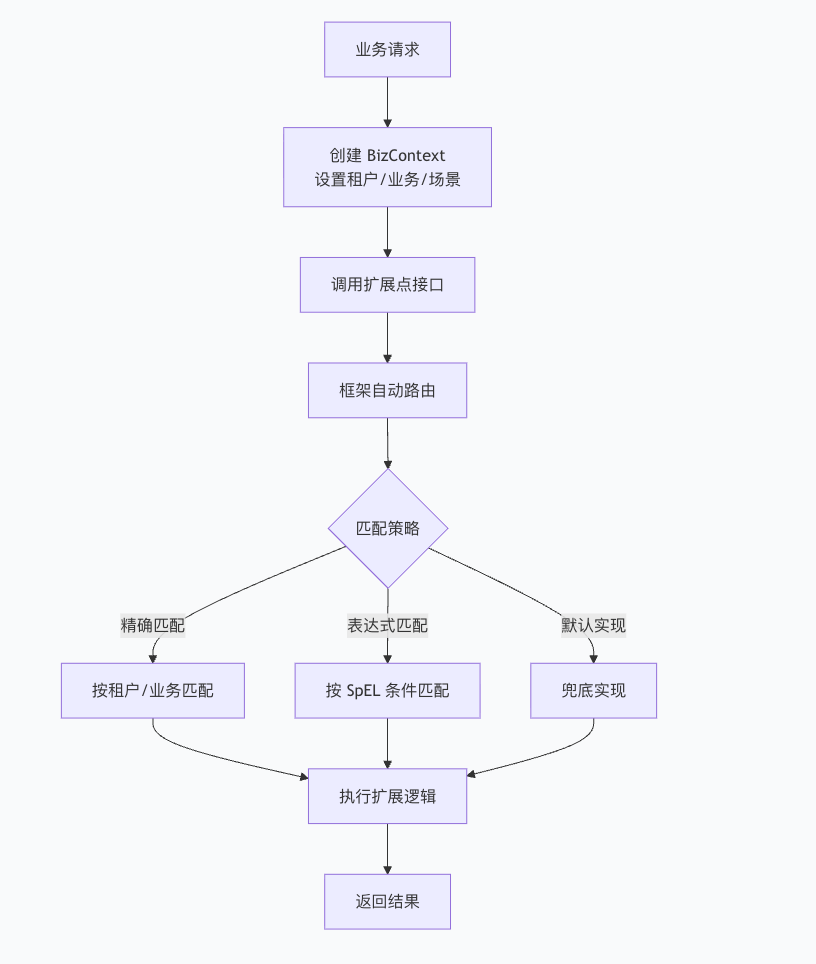
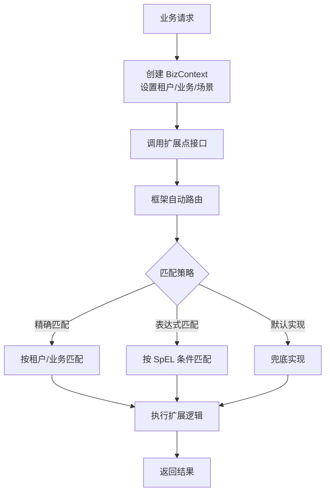

# Bone Extension Framework 使用指南

## 🎯 一句话理解 Bone 扩展框架

**Bone 扩展框架让你像"插件"一样为业务逻辑动态添加租户专属、场景专属或条件专属的处理逻辑，而无需修改核心代码。**

---

## 📋 目录

1. [框架概述](#1-框架概述)
2. [5分钟快速上手](#2-5分钟快速上手)
3. [核心概念详解](#3-核心概念详解)
4. [高级特性](#4-高级特性)
5. [最佳实践](#5-最佳实践)
6. [故障排查](#6-故障排查)
7. [常见问题解答](#7-常见问题解答)
8. [版本历史](#8-版本历史)
9. [附录：速查表](#9-附录速查表)

---

## 1. 框架概述

### 1.1 核心价值
- **解耦核心业务**：将定制化逻辑从核心流程中分离
- **动态路由**：根据业务上下文自动选择合适实现
- **多租户支持**：为不同租户提供专属业务逻辑
- **灵活扩展**：无需修改代码即可添加新业务规则

### 1.2 典型使用流程



### 1.3 主要特性
- ✅ 基于注解的声明式扩展
- ✅ 多维度路由（租户、业务、场景、用例）
- ✅ SpEL 表达式动态条件匹配
- ✅ 优先级控制机制
- ✅ 与 Spring 深度集成
- ✅ 高性能多级缓存
- ✅ 动态注册扩展实现

---

## 2. 5分钟快速上手

### 2.1 基础配置

**步骤1：添加依赖**
```xml
<dependency>
    <groupId>com.bone</groupId>
    <artifactId>bone-extension</artifactId>
    <version>1.3.0</version>
</dependency>
```

**步骤2：启用框架**
```java
@SpringBootApplication
@EnableExtPoints(basePackages = "com.yourcompany.extension")
public class Application {
    public static void main(String[] args) {
        SpringApplication.run(Application.class, args);
    }
}
```

**步骤3：基础配置**
```yaml
# application.yml
bone:
  extension:
    cache-enabled: true
    cache-size: 1000
    logging-enabled: true
    metrics-enabled: false  # 生产环境建议开启
```

### 2.2 最小完整示例

```java
// 1. 定义扩展点接口
@ExtPoint(name = "用户问候扩展点", description = "根据用户类型返回不同的问候语")
public interface GreetingExtension {
    String greet(BizContext<String> context);
}

// 2. 默认问候实现
@ExtProvider(priority = 100)  // 低优先级，兜底实现
@Service
public class DefaultGreetingImpl implements GreetingExtension {
    @Override
    public String greet(BizContext<String> context) {
        String userName = context.getData();
        return "Hello, " + userName + "!";
    }
}

// 3. VIP用户问候实现
@ExtProvider(
    condition = "#context.getAttribute('isVip') == true",  // SpEL表达式
    priority = 50  // 高优先级
)
@Service
public class VipGreetingImpl implements GreetingExtension {
    @Override
    public String greet(BizContext<String> context) {
        String userName = context.getData();
        return "尊贵的VIP用户 " + userName + "，欢迎回来！";
    }
}

// 4. 业务服务类
@Service
public class UserService {
    
    @Autowired
    private GreetingExtension greetingExtension;
    
    public String welcomeUser(String userName, boolean isVip) {
        // 创建业务上下文
        BizContext<String> context = BizContext.<String>builder()
            .tenantCode("TENANT_A")      // 租户维度
            .bizCode("USER_SERVICE")     // 业务维度
            .data(userName)              // 业务数据
            .attribute("isVip", isVip)   // 自定义属性
            .build();
        
        // 使用上下文管理器（自动清理）
        try (BizContexts.ContextManager manager = BizContexts.with(context)) {
            return greetingExtension.greet(context);
        }
    }
}

// 5. 测试类
@SpringBootTest
class UserServiceTest {
    
    @Autowired
    private UserService userService;
    
    @Test
    void testGreetNormalUser() {
        String result = userService.welcomeUser("张三", false);
        assertEquals("Hello, 张三!", result);
    }
    
    @Test
    void testGreetVipUser() {
        String result = userService.welcomeUser("李四", true);
        assertEquals("尊贵的VIP用户 李四，欢迎回来！", result);
    }
}
```

> 💡 **新手提示**：复制上面的代码到你的项目中，修改包名即可运行！

---

## 3. 核心概念详解

### 3.1 扩展点接口设计

**良好设计原则：**
```java
// ✅ 推荐：职责单一，方法明确
@ExtPoint(name = "订单处理扩展点", description = "订单生命周期扩展能力")
public interface OrderExtensionPoint {
    
    /**
     * 订单创建前处理 - 返回修改后的订单数据
     */
    OrderDTO preCreateOrder(BizContext<OrderRequest> context);
    
    /**
     * 订单创建后处理 - 无返回值，用于通知等
     */
    void postCreateOrder(BizContext<OrderDTO> context);
    
    /**
     * 订单验证 - 返回验证结果
     */
    ValidationResult validateOrder(BizContext<OrderRequest> context);
}

// ❌ 避免：职责过多，方法模糊
@ExtPoint(name = "订单扩展点")
public interface BadOrderExtension {
    Object process(Object request);  // 过于通用
    boolean check();                 // 没有明确含义
}
```

### 3.2 扩展实现配置

**@ExtProvider 注解详解：**
```java
@ExtProvider(
    // 维度匹配
    tenantCode = "TENANT_A",     // 租户编码
    bizCode = "ECOMMERCE",       // 业务编码  
    useCase = "CREATE_ORDER",    // 用例编码
    scenario = "MOBILE_APP",     // 场景编码
    
    // 动态条件
    condition = "#data.amount > 100 && #context.getAttribute('channel') == 'APP'",
    
    // 优先级控制（数值越小优先级越高）
    priority = 50
)
@Service
public class TenantAOrderExtension implements OrderExtensionPoint {
    // 实现方法...
}
```

### 3.3 业务上下文使用

**创建丰富的上下文：**
```java
public OrderDTO createOrder(OrderRequest request, UserInfo user) {
    BizContext<OrderRequest> context = BizContext.builder()
        // 核心维度
        .tenantCode(user.getTenantCode())
        .bizCode("ORDER_MANAGEMENT")
        .useCase("CREATE_ORDER")
        .scenario(getOrderScenario(request))
        
        // 业务数据
        .data(request)
        
        // 业务属性（用于表达式匹配）
        .attribute("userId", user.getId())
        .attribute("userLevel", user.getLevel())
        .attribute("channel", request.getChannel())
        .attribute("ip", getClientIp())
        .attribute("isFirstOrder", orderService.isFirstOrder(user.getId()))
        
        // 时间信息
        .attribute("requestTime", LocalDateTime.now())
        .build();
    
    // 自动上下文管理（推荐）
    try (BizContexts.ContextManager manager = BizContexts.with(context)) {
        return orderService.processOrder(context);
    }
}
```

> ⚠️ **重要提醒**：务必使用 try-with-resources 或 finally 块清理上下文，避免内存泄漏！

---

## 4. 高级特性

### 4.1 表达式路由（SpEL）

**可用变量：**
```java
// 在 condition 表达式中可用的变量：
@ExtProvider(condition = "
    #tenantCode == 'TENANT_A' &&           // 租户编码
    #data.amount > 1000 &&                 // 业务数据属性
    #context.getAttribute('vipLevel') == 'GOLD' &&  // 上下文属性
    #bizCode.startsWith('ORDER') &&        // 业务编码
    T(java.util.Objects).equals(#scenario, 'MOBILE')  // 静态方法调用
")
```

**实用表达式示例：**
```java
// 1. 数值范围判断
@ExtProvider(condition = "#data.amount >= 100 && #data.amount <= 1000")

// 2. 字符串匹配
@ExtProvider(condition = "#data.status in {'PENDING', 'PROCESSING'}")

// 3. 集合操作
@ExtProvider(condition = "#data.items.?[price > 100].size() > 0")

// 4. 复杂条件组合
@ExtProvider(condition = "
    (#tenantCode == 'TENANT_A' && #data.amount > 500) || 
    (#tenantCode == 'TENANT_B' && #data.amount > 1000)
")

// 5. 安全访问（避免NPE）
@ExtProvider(condition = "#data.user?.level == 'VIP'")
```

### 4.2 优先级控制实战

```java
// 优先级：10（最高）→ 50（中）→ 100（最低）

// 1. 管理员订单（最高优先级）
@ExtProvider(
    priority = 10, 
    condition = "#data.userId.startsWith('ADMIN')"
)
@Service
public class AdminOrderExtension implements OrderExtensionPoint {
    @Override
    public OrderDTO preCreateOrder(BizContext<OrderRequest> context) {
        OrderDTO order = new OrderDTO();
        order.setAdminFlag(true);
        order.setPriority(1);  // 最高优先级
        return order;
    }
}

// 2. VIP用户订单（中优先级）
@ExtProvider(
    priority = 50,
    condition = "#context.getAttribute('vipLevel') != null"
)
@Service  
public class VipOrderExtension implements OrderExtensionPoint {
    @Override
    public OrderDTO preCreateOrder(BizContext<OrderRequest> context) {
        OrderDTO order = new OrderDTO();
        order.setVipLevel(context.getAttribute("vipLevel"));
        order.setPriority(2);
        return order;
    }
}

// 3. 默认订单处理（最低优先级）
@ExtProvider(priority = 100)
@Service
public class DefaultOrderExtension implements OrderExtensionPoint {
    @Override
    public OrderDTO preCreateOrder(BizContext<OrderRequest> context) {
        OrderDTO order = new OrderDTO();
        order.setPriority(3);  // 普通优先级
        return order;
    }
}
```

### 4.3 组合多个扩展实现

**适用场景**：需要多个扩展点依次处理同一业务
```java
@Service
public class OrderProcessingService {
    
    @Autowired
    private ExtPointComposite<OrderExtensionPoint> orderExtensionComposite;
    
    public OrderProcessingResult processOrder(OrderRequest request) {
        BizContext<OrderRequest> context = createContext(request);
        
        try (BizContexts.ContextManager manager = BizContexts.with(context)) {
            
            // 1. 获取所有匹配的扩展（按优先级排序）
            List<OrderExtensionPoint> extensions = orderExtensionComposite.getExtensions(context);
            
            OrderDTO finalResult = null;
            List<ProcessingStep> steps = new ArrayList<>();
            
            // 2. 依次执行每个扩展
            for (OrderExtensionPoint extension : extensions) {
                String extensionName = extension.getClass().getSimpleName();
                
                try {
                    OrderDTO currentResult = extension.preCreateOrder(context);
                    steps.add(ProcessingStep.success(extensionName, "执行成功"));
                    
                    if (currentResult != null) {
                        finalResult = currentResult;
                        // 更新上下文供下一个扩展使用
                        context.setData(convertToRequest(currentResult));
                    }
                    
                } catch (Exception e) {
                    steps.add(ProcessingStep.failed(extensionName, e.getMessage()));
                    // 单个扩展失败不影响其他扩展执行
                }
            }
            
            return OrderProcessingResult.builder()
                .order(finalResult)
                .processingSteps(steps)
                .success(finalResult != null)
                .build();
        }
    }
}
```

### 4.4 动态注册扩展

**运行时动态添加扩展：**
```java
@Service
public class DynamicExtensionManager {
    
    @Autowired
    private ExtProviderRegister providerRegister;
    
    /**
     * 动态注册租户专属扩展
     */
    public void registerTenantExtension(String tenantCode, String bizCode) {
        OrderExtensionPoint dynamicImpl = new DynamicOrderExtension();
        
        ExtProviderMetadata metadata = ExtProviderMetadata.builder()
            .tenantCode(tenantCode)
            .bizCode(bizCode)
            .priority(75)
            .condition("#data.amount > 0")
            .build();
            
        providerRegister.registerExtension(OrderExtensionPoint.class, dynamicImpl, metadata);
    }
    
    /**
     * 动态注销扩展
     */
    public void unregisterExtension(OrderExtensionPoint extension) {
        providerRegister.unregisterExtension(OrderExtensionPoint.class, extension);
    }
}

// 动态扩展实现
class DynamicOrderExtension implements OrderExtensionPoint {
    @Override
    public OrderDTO preCreateOrder(BizContext<OrderRequest> context) {
        // 动态业务逻辑
        return new OrderDTO();
    }
    
    // 其他方法实现...
}
```

---

## 5. 最佳实践

### 5.1 扩展点设计原则

| 原则 | 正确示例 | 错误示例 |
|------|----------|----------|
| **单一职责** | `OrderValidationExt` 只做验证 | `OrderExt` 包含验证、计算、通知 |
| **明确命名** | `preCreateUser`, `validateOrder` | `process`, `handle` |
| **合理返回值** | `OrderDTO`, `ValidationResult` | `void`（无法传递数据） |
| **异常处理** | 抛出 `BizException` 包含错误码 | 抛出通用 `Exception` |

### 5.2 性能优化指南

**1. 表达式优化**
```java
// ❌ 避免：复杂嵌套表达式
@ExtProvider(condition = "#data.user.addresses.?[#this.default].size() > 0 && 
                          #data.user.addresses.?[#this.default].get(0).city == 'Beijing'")

// ✅ 推荐：简化表达式 + 预计算
@ExtProvider(condition = "#context.getAttribute('isBeijingUser') == true")
@Service  
public class OptimizedExtension implements OrderExtensionPoint {
    @Override
    public OrderDTO preCreateOrder(BizContext<OrderRequest> context) {
        // 预计算复杂条件
        boolean isBeijingUser = calculateIsBeijingUser(context.getData());
        context.setAttribute("isBeijingUser", isBeijingUser);
        
        return processOrder(context);
    }
}
```

**2. 缓存策略**
```java
@Service
public class CachedExtensionImpl implements ProductExtensionPoint {
    
    // 本地缓存减少重复查询
    private final Cache<String, ProductConfig> cache = CacheBuilder.newBuilder()
        .maximumSize(1000)
        .expireAfterWrite(10, TimeUnit.MINUTES)
        .build();
    
    @Override
    public ProductDTO enhanceProduct(BizContext<ProductRequest> context) {
        String cacheKey = context.getTenantCode() + ":" + context.getData().getProductId();
        
        return cache.get(cacheKey, () -> {
            // 缓存miss时的加载逻辑
            return loadAndProcessProduct(context);
        });
    }
    
    @PostConstruct
    public void warmUpCache() {
        // 应用启动时预热常用数据
    }
}
```

**3. 异步处理**
```java
@ExtProvider(tenantCode = "TENANT_A")
@Service
public class AsyncOrderExtensionImpl implements OrderExtensionPoint {
    
    @Async("extensionExecutor")
    @Override
    public void postCreateOrder(BizContext<OrderDTO> context) {
        // 异步处理非关键路径
        OrderDTO order = context.getData();
        notificationService.sendOrderConfirmation(order);
        analyticsService.recordOrderEvent(order);
    }
}
```

### 5.3 错误处理最佳实践

**统一异常处理：**
```java
// 自定义业务异常
public class ExtensionBizException extends RuntimeException {
    private final String errorCode;
    private final String errorMessage;
    
    public ExtensionBizException(String errorCode, String errorMessage) {
        super(errorMessage);
        this.errorCode = errorCode;
        this.errorMessage = errorMessage;
    }
}

// 健壮的扩展实现
@ExtProvider(tenantCode = "TENANT_A")
@Service  
public class RobustExtensionImpl implements OrderExtensionPoint {
    
    @Override
    public OrderDTO preCreateOrder(BizContext<OrderRequest> context) {
        try {
            // 1. 参数验证
            OrderRequest request = context.getData();
            if (request == null) {
                throw new ExtensionBizException("INVALID_REQUEST", "请求数据不能为空");
            }
            
            // 2. 业务验证
            if (request.getAmount().compareTo(BigDecimal.ZERO) <= 0) {
                throw new ExtensionBizException("INVALID_AMOUNT", "订单金额必须大于0");
            }
            
            // 3. 业务处理
            return processOrder(request);
            
        } catch (ExtensionBizException e) {
            // 业务异常，记录并重新抛出
            log.warn("业务异常: {}", e.getErrorMessage());
            throw e;
        } catch (Exception e) {
            // 系统异常，包装为业务异常
            log.error("系统异常", e);
            throw new ExtensionBizException("SYSTEM_ERROR", "系统处理异常");
        }
    }
}
```

### 5.4 实际业务场景示例

本节通过真实业务场景展示Bone扩展框架的实际应用，帮助开发者更好地理解如何在生产环境中有效使用扩展点。

#### 5.4.1 多租户SaaS系统中的租户定制化支付处理

在多租户SaaS系统中，不同租户可能有完全不同的支付流程和业务规则。通过扩展点可以为每个租户提供专属的支付处理逻辑。

```java
/**
 * 支付处理扩展点
 * 定义了支付前验证、支付金额计算和支付后处理三个核心方法
 */
@ExtPoint(name = "支付处理扩展点", description = "支持多租户的支付处理流程定制")
public interface PaymentExtPoint {
    
    /**
     * 支付前验证
     * @param context 业务上下文，包含订单信息和支付请求
     * @return 验证结果，包含是否通过和错误信息
     */
    ValidationResult prePayValidate(BizContext<PaymentRequest> context);
    
    /**
     * 计算最终支付金额
     * @param context 业务上下文
     * @return 支付计算结果
     */
    PaymentCalculationResult calculatePayment(BizContext<PaymentRequest> context);
    
    /**
     * 支付后处理
     * @param context 业务上下文，包含支付结果
     */
    void postPayProcess(BizContext<PaymentResult> context);
}

/**
 * 电商平台租户支付实现
 * 提供标准电商支付流程，包括优惠券、积分抵扣等功能
 */
@ExtProvider(tenantCode = "ECOMMERCE_TENANT", priority = 100)
@Service
@Slf4j
public class EcommercePaymentExtImpl implements PaymentExtPoint {
    
    @Autowired
    private CouponService couponService;
    
    @Autowired
    private PointsService pointsService;
    
    @Autowired
    private PaymentLogService logService;
    
    @Override
    public ValidationResult prePayValidate(BizContext<PaymentRequest> context) {
        try {
            PaymentRequest request = context.getData();
            
            // 参数验证
            if (request == null || request.getOrderId() == null) {
                return ValidationResult.fail("INVALID_REQUEST", "支付请求参数不完整");
            }
            
            // 业务验证
            if (!isOrderValid(request.getOrderId(), context.getTenantCode())) {
                return ValidationResult.fail("INVALID_ORDER", "订单无效或已被处理");
            }
            
            // 优惠券验证
            if (request.getCouponId() != null) {
                ValidationResult couponValidation = couponService.validateCoupon(
                    request.getCouponId(), request.getUserId(), request.getAmount());
                if (!couponValidation.isSuccess()) {
                    return couponValidation;
                }
            }
            
            log.info("Payment validation passed for order: {}", request.getOrderId());
            return ValidationResult.success();
        } catch (Exception e) {
            log.error("Payment validation failed for tenant: {}", context.getTenantCode(), e);
            return ValidationResult.fail("VALIDATION_ERROR", "支付验证过程中出现异常");
        }
    }
    
    @Override
    public PaymentCalculationResult calculatePayment(BizContext<PaymentRequest> context) {
        PaymentRequest request = context.getData();
        BigDecimal baseAmount = request.getAmount();
        BigDecimal finalAmount = baseAmount;
        Map<String, BigDecimal> deductionDetails = new HashMap<>();
        
        // 优惠券计算
        if (request.getCouponId() != null) {
            BigDecimal couponDiscount = couponService.calculateDiscount(
                request.getCouponId(), baseAmount);
            finalAmount = finalAmount.subtract(couponDiscount);
            deductionDetails.put("COUPON_DISCOUNT", couponDiscount);
        }
        
        // 积分抵扣
        if (request.getPointsToDeduct() > 0) {
            BigDecimal pointsValue = pointsService.calculatePointsValue(request.getPointsToDeduct());
            finalAmount = finalAmount.subtract(pointsValue);
            deductionDetails.put("POINTS_DEDUCTION", pointsValue);
        }
        
        // 确保最终金额不为负数
        finalAmount = finalAmount.max(BigDecimal.ZERO);
        
        return PaymentCalculationResult.builder()
            .originalAmount(baseAmount)
            .finalAmount(finalAmount)
            .deductionDetails(deductionDetails)
            .currency("CNY")
            .build();
    }
    
    @Override
    public void postPayProcess(BizContext<PaymentResult> context) {
        PaymentResult result = context.getData();
        
        // 记录支付日志
        logService.logPayment(result);
        
        // 异步处理积分扣减
        if (result.getPointsDeducted() > 0) {
            CompletableFuture.runAsync(() -> {
                try {
                    pointsService.deductPoints(result.getUserId(), result.getPointsDeducted());
                } catch (Exception e) {
                    log.error("Failed to deduct points for user: {}", result.getUserId(), e);
                }
            });
        }
        
        // 异步发送通知
        sendPaymentNotification(result);
    }
    
    private boolean isOrderValid(Long orderId, String tenantCode) {
        // 实际的订单验证逻辑
        return true;
    }
    
    private void sendPaymentNotification(PaymentResult result) {
        // 发送支付通知的逻辑
    }
}

/**
 * 金融服务租户支付实现
 * 支持复杂的费率计算、手续费分配和合规检查
 */
@ExtProvider(tenantCode = "FINANCIAL_TENANT", priority = 100)
@Service
@Slf4j
public class FinancialPaymentExtImpl implements PaymentExtPoint {
    
    @Autowired
    private ComplianceService complianceService;
    
    @Autowired
    private FeeService feeService;
    
    @Override
    public ValidationResult prePayValidate(BizContext<PaymentRequest> context) {
        PaymentRequest request = context.getData();
        
        // 合规性检查
        if (!complianceService.checkTransaction(request.getUserId(), request.getAmount())) {
            return ValidationResult.fail("COMPLIANCE_VIOLATION", "交易不符合合规要求");
        }
        
        // 风控检查
        RiskLevel riskLevel = complianceService.assessRisk(request);
        if (riskLevel == RiskLevel.HIGH) {
            return ValidationResult.fail("HIGH_RISK", "交易风险等级过高");
        }
        
        return ValidationResult.success();
    }
    
    @Override
    public PaymentCalculationResult calculatePayment(BizContext<PaymentRequest> context) {
        PaymentRequest request = context.getData();
        
        // 计算手续费
        BigDecimal fee = feeService.calculateFee(request.getAmount(), request.getPaymentMethod());
        
        // 计算税率
        BigDecimal tax = calculateTax(request.getAmount(), request.getTaxType());
        
        return PaymentCalculationResult.builder()
            .originalAmount(request.getAmount())
            .finalAmount(request.getAmount().add(fee).add(tax))
            .feeAmount(fee)
            .taxAmount(tax)
            .currency("CNY")
            .build();
    }
    
    @Override
    public void postPayProcess(BizContext<PaymentResult> context) {
        // 金融特有的支付后处理逻辑
        // 包括：清算、对账标记、合规记录等
        complianceService.recordTransaction(context.getData());
    }
    
    private BigDecimal calculateTax(BigDecimal amount, String taxType) {
        // 根据税务类型计算税额
        return amount.multiply(new BigDecimal("0.06")); // 默认6%税率
    }
}

/**
 * 支付服务集成类
 * 负责集成支付扩展点并提供统一的支付接口
 */
@Service
@Slf4j
public class PaymentService {
    
    @Autowired
    private PaymentExtPoint paymentExtPoint;
    
    @Autowired
    private TransactionService transactionService;
    
    /**
     * 处理支付请求
     * @param request 支付请求
     * @param tenantCode 租户代码
     * @return 支付处理结果
     */
    public PaymentProcessResult processPayment(PaymentRequest request, String tenantCode) {
        // 创建业务上下文
        BizContext<PaymentRequest> context = BizContext.<PaymentRequest>builder()
            .tenantCode(tenantCode)
            .bizCode("PAYMENT_SERVICE")
            .data(request)
            .attribute("timestamp", System.currentTimeMillis())
            .build();
        
        // 使用上下文管理器（自动清理）
        try (BizContexts.ContextManager manager = BizContexts.with(context)) {
            // 1. 支付前验证
            ValidationResult validationResult = paymentExtPoint.prePayValidate(context);
            if (!validationResult.isSuccess()) {
                log.warn("Payment validation failed: {}", validationResult.getErrorMessage());
                return PaymentProcessResult.fail(
                    validationResult.getErrorCode(), 
                    validationResult.getErrorMessage());
            }
            
            // 2. 计算支付金额
            PaymentCalculationResult calculationResult = paymentExtPoint.calculatePayment(context);
            
            // 3. 执行实际支付
            PaymentResult paymentResult = transactionService.executePayment(
                request, calculationResult.getFinalAmount());
            
            if (paymentResult.isSuccess()) {
                // 4. 支付成功后的处理
                BizContext<PaymentResult> postPayContext = BizContext.<PaymentResult>builder()
                    .tenantCode(tenantCode)
                    .bizCode("PAYMENT_SERVICE")
                    .data(paymentResult)
                    .build();
                
                try {
                    paymentExtPoint.postPayProcess(postPayContext);
                } catch (Exception e) {
                    // 支付后处理异常不影响主流程
                    log.error("Post payment process failed", e);
                }
                
                return PaymentProcessResult.success(paymentResult.getTransactionId(), 
                    calculationResult.getFinalAmount());
            } else {
                log.error("Payment execution failed: {}", paymentResult.getErrorMessage());
                return PaymentProcessResult.fail(paymentResult.getErrorCode(), 
                    paymentResult.getErrorMessage());
            }
        } catch (Exception e) {
            log.error("Payment processing failed", e);
            return PaymentProcessResult.fail("SYSTEM_ERROR", "支付处理过程中出现系统异常");
        }
    }
}
#### 5.4.2 电商系统中的促销策略扩展

在电商系统中，不同商品、不同用户群体、不同营销场景可能需要应用不同的促销规则。通过扩展点可以灵活配置和管理各类促销策略。

```java
/**
 * 促销计算扩展点
 * 支持多种促销策略的动态切换与组合
 */
@ExtPoint(name = "促销计算扩展点", description = "电商系统中的促销策略计算接口")
public interface PromotionExtPoint {
    
    /**
     * 计算促销优惠金额
     * @param context 业务上下文，包含订单和商品信息
     * @return 促销计算结果
     */
    PromotionResult calculatePromotion(BizContext<OrderContext> context);
}

/**
 * 满减促销策略实现
 * 根据订单金额门槛提供固定金额减免
 */
@ExtProvider(condition = "#data.orderType == 'NORMAL' && #context.getAttribute('promotionType') == 'FULL_DISCOUNT'", 
             priority = 200)
@Service
@Slf4j
public class FullDiscountPromotionImpl implements PromotionExtPoint {
    
    @Autowired
    private PromotionConfigService configService;
    
    @Override
    public PromotionResult calculatePromotion(BizContext<OrderContext> context) {
        OrderContext orderContext = context.getData();
        BigDecimal orderAmount = orderContext.getTotalAmount();
        
        // 获取满减配置
        List<FullDiscountRule> rules = configService.getFullDiscountRules(
            context.getTenantCode(), 
            orderContext.getChannel()
        );
        
        // 查找符合条件的最高等级满减规则
        FullDiscountRule appliedRule = findBestSuitableRule(orderAmount, rules);
        
        if (appliedRule != null) {
            log.info("Applied full discount promotion: {} for order: {}", 
                    appliedRule.getRuleName(), orderContext.getOrderId());
            
            return PromotionResult.builder()
                .promotionType("FULL_DISCOUNT")
                .discountAmount(appliedRule.getDiscountAmount())
                .promotionName(appliedRule.getRuleName())
                .description(String.format("满%s减%s", 
                        appliedRule.getThresholdAmount(), appliedRule.getDiscountAmount()))
                .build();
        }
        
        return PromotionResult.empty();
    }
    
    private FullDiscountRule findBestSuitableRule(BigDecimal orderAmount, List<FullDiscountRule> rules) {
        // 按门槛金额降序排列，优先选择最高等级的满减
        return rules.stream()
            .filter(rule -> orderAmount.compareTo(rule.getThresholdAmount()) >= 0)
            .max(Comparator.comparing(FullDiscountRule::getThresholdAmount))
            .orElse(null);
    }
}

/**
 * 会员折扣促销策略实现
 * 根据用户会员等级提供不同比例的折扣
 */
@ExtProvider(condition = "#data.userInfo.memberLevel != null", priority = 180)
@Service
@Slf4j
public class MemberDiscountPromotionImpl implements PromotionExtPoint {
    
    @Override
    public PromotionResult calculatePromotion(BizContext<OrderContext> context) {
        OrderContext orderContext = context.getData();
        UserInfo userInfo = orderContext.getUserInfo();
        
        // 根据会员等级获取折扣比例
        double discountRate = getDiscountRateByMemberLevel(userInfo.getMemberLevel());
        if (discountRate < 1.0) { // 有折扣
            BigDecimal originalAmount = orderContext.getTotalAmount();
            BigDecimal discountAmount = originalAmount.subtract(
                originalAmount.multiply(new BigDecimal(discountRate)));
            
            String memberLevelName = getMemberLevelName(userInfo.getMemberLevel());
            log.info("Applied member discount: {}% for user: {}", 
                    (1 - discountRate) * 100, userInfo.getUserId());
            
            return PromotionResult.builder()
                .promotionType("MEMBER_DISCOUNT")
                .discountAmount(discountAmount)
                .promotionName(memberLevelName + "专属折扣")
                .description(String.format("%s专享%.1f折优惠", 
                        memberLevelName, discountRate * 10))
                .build();
        }
        
        return PromotionResult.empty();
    }
    
    private double getDiscountRateByMemberLevel(String memberLevel) {
        // 根据会员等级返回折扣率
        switch (memberLevel) {
            case "VIP": return 0.95;   // VIP用户95折
            case "GOLD": return 0.90;  // 黄金会员9折
            case "PLATINUM": return 0.85;  // 铂金会员85折
            case "DIAMOND": return 0.80;   // 钻石会员8折
            default: return 1.0;       // 普通用户无折扣
        }
    }
    
    private String getMemberLevelName(String memberLevel) {
        // 获取会员等级中文名
        switch (memberLevel) {
            case "VIP": return "VIP会员";
            case "GOLD": return "黄金会员";
            case "PLATINUM": return "铂金会员";
            case "DIAMOND": return "钻石会员";
            default: return "普通会员";
        }
    }
}

/**
 * 特定商品促销策略实现
 * 为指定商品提供专属促销价格或优惠
 */
@ExtProvider(priority = 190)
@Service
@Slf4j
public class ProductSpecificPromotionImpl implements PromotionExtPoint {
    
    @Autowired
    private ProductPromotionService productPromotionService;
    
    @Override
    public PromotionResult calculatePromotion(BizContext<OrderContext> context) {
        OrderContext orderContext = context.getData();
        List<OrderItem> items = orderContext.getOrderItems();
        
        // 计算每个商品的促销优惠
        BigDecimal totalDiscount = BigDecimal.ZERO;
        Map<String, BigDecimal> itemDiscounts = new HashMap<>();
        
        for (OrderItem item : items) {
            // 检查商品是否有特定促销
            ProductPromotion promotion = productPromotionService.getActivePromotion(
                item.getProductId(), 
                context.getTenantCode(),
                context.getAttribute("campaignId", String.class)
            );
            
            if (promotion != null) {
                BigDecimal itemDiscount = calculateItemDiscount(item, promotion);
                totalDiscount = totalDiscount.add(itemDiscount);
                itemDiscounts.put(item.getProductId(), itemDiscount);
            }
        }
        
        if (totalDiscount.compareTo(BigDecimal.ZERO) > 0) {
            log.info("Applied product specific promotions, total discount: {}", totalDiscount);
            
            return PromotionResult.builder()
                .promotionType("PRODUCT_SPECIFIC")
                .discountAmount(totalDiscount)
                .promotionName("商品专享优惠")
                .description("特定商品专享价格优惠")
                .itemDiscountDetails(itemDiscounts)
                .build();
        }
        
        return PromotionResult.empty();
    }
    
    private BigDecimal calculateItemDiscount(OrderItem item, ProductPromotion promotion) {
        // 根据促销类型计算商品优惠
        switch (promotion.getPromotionType()) {
            case "DIRECT_DISCOUNT":
                // 直降金额
                return promotion.getDiscountAmount().multiply(new BigDecimal(item.getQuantity()));
            case "PRICE_DISCOUNT":
                // 特价优惠
                BigDecimal originalPrice = item.getPrice();
                BigDecimal promotionPrice = promotion.getPromotionPrice();
                return originalPrice.subtract(promotionPrice).multiply(new BigDecimal(item.getQuantity()));
            case "PERCENT_DISCOUNT":
                // 百分比折扣
                double discountPercent = promotion.getDiscountPercent() / 100.0;
                return item.getSubtotal().multiply(new BigDecimal(discountPercent));
            default:
                return BigDecimal.ZERO;
        }
    }
}

/**
 * 促销服务集成类
 * 负责协调多种促销策略的应用
 */
@Service
@Slf4j
public class PromotionService {
    
    @Autowired
    private PromotionExtPoint promotionExtPoint;
    
    /**
     * 应用促销策略
     * @param orderContext 订单上下文
     * @param tenantCode 租户代码
     * @return 促销应用结果
     */
    public OrderPromotionResult applyPromotions(OrderContext orderContext, String tenantCode) {
        // 创建业务上下文
        BizContext<OrderContext> context = BizContext.<OrderContext>builder()
            .tenantCode(tenantCode)
            .bizCode("ORDER_PROMOTION")
            .data(orderContext)
            .attribute("timestamp", System.currentTimeMillis())
            .build();
        
        // 使用上下文管理器（自动清理）
        try (BizContexts.ContextManager manager = BizContexts.with(context)) {
            // 存储所有应用的促销结果
            List<PromotionResult> appliedPromotions = new ArrayList<>();
            BigDecimal totalDiscount = BigDecimal.ZERO;
            
            // 注意：由于框架的优先级机制，这里只返回一个最高优先级的促销结果
            // 如需组合多种促销，需要调整设计或自定义处理逻辑
            PromotionResult promotionResult = promotionExtPoint.calculatePromotion(context);
            
            if (!promotionResult.isEmpty()) {
                appliedPromotions.add(promotionResult);
                totalDiscount = promotionResult.getDiscountAmount();
                log.info("Applied promotion: {} with discount: {}", 
                        promotionResult.getPromotionName(), totalDiscount);
            } else {
                log.info("No promotions applied for order: {}", orderContext.getOrderId());
            }
            
            // 计算最终价格
            BigDecimal finalAmount = orderContext.getTotalAmount().subtract(totalDiscount);
            finalAmount = finalAmount.max(BigDecimal.ZERO); // 确保最终价格不为负
            
            return OrderPromotionResult.builder()
                .originalAmount(orderContext.getTotalAmount())
                .totalDiscount(totalDiscount)
                .finalAmount(finalAmount)
                .appliedPromotions(appliedPromotions)
                .build();
        } catch (Exception e) {
            // 促销计算异常不应影响订单流程，记录日志并返回无促销的结果
            log.error("Failed to calculate promotions for order: {}", 
                    orderContext.getOrderId(), e);
            
            return OrderPromotionResult.builder()
                .originalAmount(orderContext.getTotalAmount())
                .totalDiscount(BigDecimal.ZERO)
                .finalAmount(orderContext.getTotalAmount())
                .appliedPromotions(Collections.emptyList())
                .errorMessage("促销计算失败，按原价结算")
                .build();
        }
    }
}
        
        #### 5.4.3 风控系统中的规则扩展

在风控系统中，需要根据不同业务场景、不同风险等级和不同监管要求动态应用不同的风控规则。通过扩展点可以灵活配置和管理各类风控规则。

```java
/**
 * 风控规则扩展点
 * 支持多种风控策略的灵活配置与执行
 */
@ExtPoint(name = "风控规则扩展点", description = "风控系统中的规则评估与决策接口")
public interface RiskControlExtPoint {
    
    /**
     * 评估交易风险
     * @param context 业务上下文，包含交易信息和用户数据
     * @return 风险评估结果
     */
    RiskAssessmentResult assessRisk(BizContext<TransactionInfo> context);
}

/**
 * 交易金额风控规则实现
 * 基于交易金额和用户历史交易模式评估风险
 */
@ExtProvider(priority = 100)
@Service
@Slf4j
public class AmountRiskControlImpl implements RiskControlExtPoint {
    
    @Autowired
    private UserTransactionHistoryService historyService;
    
    @Autowired
    private RiskConfigService configService;
    
    @Override
    public RiskAssessmentResult assessRisk(BizContext<TransactionInfo> context) {
        TransactionInfo transaction = context.getData();
        BigDecimal amount = transaction.getAmount();
        String userId = transaction.getUserId();
        
        // 获取风控配置阈值
        RiskThresholdConfig config = configService.getAmountRiskConfig(
            context.getTenantCode(), 
            transaction.getBusinessType()
        );
        
        // 基础金额检查
        if (amount.compareTo(config.getHighRiskThreshold()) > 0) {
            log.warn("High risk transaction detected by amount: {} for user: {}", amount, userId);
            return RiskAssessmentResult.builder()
                .riskLevel(RiskLevel.HIGH)
                .riskCode("HIGH_AMOUNT")
                .riskDescription("交易金额超出高风险阈值")
                .suggestedAction(RiskAction.REVIEW)
                .confidenceScore(0.9)
                .build();
        }
        
        // 检查是否超过用户历史交易均值的异常倍数
        if (config.isUserPatternCheckEnabled()) {
            BigDecimal avgAmount = historyService.getAverageTransactionAmount(userId, 30);
            if (avgAmount != null && avgAmount.compareTo(BigDecimal.ZERO) > 0) {
                // 计算金额相对于历史均值的倍数
                BigDecimal multiple = amount.divide(avgAmount, 2, RoundingMode.HALF_UP);
                
                if (multiple.compareTo(new BigDecimal(config.getAmountMultipleThreshold())) > 0) {
                    log.warn("Abnormal transaction amount pattern: {}x average for user: {}", multiple, userId);
                    return RiskAssessmentResult.builder()
                        .riskLevel(RiskLevel.MEDIUM)
                        .riskCode("ABNORMAL_AMOUNT_PATTERN")
                        .riskDescription(String.format("交易金额超出用户历史均值%.1f倍", multiple.doubleValue()))
                        .suggestedAction(RiskAction.MONITOR)
                        .confidenceScore(0.7)
                        .build();
                }
            }
        }
        
        // 低风险或无风险
        return RiskAssessmentResult.builder()
            .riskLevel(RiskLevel.LOW)
            .riskCode("NORMAL_AMOUNT")
            .riskDescription("交易金额在正常范围内")
            .suggestedAction(RiskAction.PASS)
            .confidenceScore(0.95)
            .build();
    }
}

/**
 * 地理位置风控规则实现
 * 基于交易地理位置和用户常用位置评估风险
 */
@ExtProvider(priority = 110)
@Service
@Slf4j
public class LocationRiskControlImpl implements RiskControlExtPoint {
    
    @Autowired
    private UserLocationService locationService;
    
    @Autowired
    private GeoDistanceService distanceService;
    
    @Override
    public RiskAssessmentResult assessRisk(BizContext<TransactionInfo> context) {
        TransactionInfo transaction = context.getData();
        String userId = transaction.getUserId();
        Location transactionLocation = transaction.getLocation();
        
        // 获取用户常用位置
        List<UserFrequentLocation> frequentLocations = locationService.getUserFrequentLocations(userId);
        
        if (transactionLocation == null) {
            // 无地理位置信息，返回中等风险
            log.warn("No location information for transaction from user: {}", userId);
            return RiskAssessmentResult.builder()
                .riskLevel(RiskLevel.MEDIUM)
                .riskCode("MISSING_LOCATION")
                .riskDescription("交易缺少地理位置信息")
                .suggestedAction(RiskAction.MONITOR)
                .confidenceScore(0.6)
                .build();
        }
        
        if (frequentLocations.isEmpty()) {
            // 新用户无常用位置，需要额外验证
            return RiskAssessmentResult.builder()
                .riskLevel(RiskLevel.MEDIUM)
                .riskCode("NEW_USER_LOCATION")
                .riskDescription("新用户首次交易位置")
                .suggestedAction(RiskAction.VERIFY)
                .confidenceScore(0.7)
                .build();
        }
        
        // 检查是否在常用位置附近
        boolean isNearFrequentLocation = false;
        double minDistance = Double.MAX_VALUE;
        
        for (UserFrequentLocation freqLocation : frequentLocations) {
            double distance = distanceService.calculateDistance(
                transactionLocation.getLatitude(), transactionLocation.getLongitude(),
                freqLocation.getLatitude(), freqLocation.getLongitude()
            );
            
            minDistance = Math.min(minDistance, distance);
            
            // 如果距离小于5公里，认为是常用位置
            if (distance < 5.0) {
                isNearFrequentLocation = true;
                break;
            }
        }
        
        if (!isNearFrequentLocation) {
            // 非常用位置交易，检查是否有短时间内的异地交易
            boolean hasRecentRemoteTransaction = locationService.hasRecentRemoteTransaction(
                userId, transactionLocation, 24 // 24小时内
            );
            
            if (hasRecentRemoteTransaction) {
                // 短时间内异地交易，高风险
                log.warn("Remote transaction detected for user: {} at distance: {}km", userId, minDistance);
                return RiskAssessmentResult.builder()
                    .riskLevel(RiskLevel.HIGH)
                    .riskCode("REMOTE_TRANSACTION")
                    .riskDescription(String.format("检测到异地交易，距离常用位置%.1f公里", minDistance))
                    .suggestedAction(RiskAction.BLOCK)
                    .confidenceScore(0.85)
                    .build();
            }
            
            // 非常用位置但非短时间异地，中等风险
            return RiskAssessmentResult.builder()
                .riskLevel(RiskLevel.MEDIUM)
                .riskCode("UNUSUAL_LOCATION")
                .riskDescription(String.format("交易位置不常用，距离常用位置%.1f公里", minDistance))
                .suggestedAction(RiskAction.VERIFY)
                .confidenceScore(0.75)
                .build();
        }
        
        // 常用位置，低风险
        return RiskAssessmentResult.builder()
            .riskLevel(RiskLevel.LOW)
            .riskCode("FREQUENT_LOCATION")
            .riskDescription("交易位置为用户常用位置")
            .suggestedAction(RiskAction.PASS)
            .confidenceScore(0.9)
            .build();
    }
}

/**
 * 行为模式风控规则实现
 * 基于用户行为模式和交易时间模式评估风险
 */
@ExtProvider(priority = 120)
@Service
@Slf4j
public class BehaviorPatternRiskControlImpl implements RiskControlExtPoint {
    
    @Autowired
    private UserBehaviorService behaviorService;
    
    @Override
    public RiskAssessmentResult assessRisk(BizContext<TransactionInfo> context) {
        TransactionInfo transaction = context.getData();
        String userId = transaction.getUserId();
        long transactionTime = transaction.getTimestamp();
        
        // 检查交易时间模式
        DayOfWeek dayOfWeek = LocalDateTime.ofInstant(
            Instant.ofEpochMilli(transactionTime), ZoneId.systemDefault()
        ).getDayOfWeek();
        int hourOfDay = LocalDateTime.ofInstant(
            Instant.ofEpochMilli(transactionTime), ZoneId.systemDefault()
        ).getHour();
        
        // 获取用户交易时间模式
        UserTimePattern timePattern = behaviorService.getUserTransactionTimePattern(userId);
        
        if (timePattern != null) {
            // 检查是否在用户不活跃时段交易
            if (isUnusualTimeSlot(dayOfWeek, hourOfDay, timePattern)) {
                log.warn("Transaction at unusual time slot: {}:{}, user: {}", dayOfWeek, hourOfDay, userId);
                return RiskAssessmentResult.builder()
                    .riskLevel(RiskLevel.MEDIUM)
                    .riskCode("UNUSUAL_TIME_SLOT")
                    .riskDescription(String.format("交易发生在用户不活跃时段: %s %02d:00", dayOfWeek, hourOfDay))
                    .suggestedAction(RiskAction.MONITOR)
                    .confidenceScore(0.7)
                    .build();
            }
        }
        
        // 检查短时间内的交易频率
        int transactionCount = behaviorService.getRecentTransactionCount(
            userId, transactionTime - 3600000, transactionTime // 最近1小时
        );
        
        if (transactionCount > 10) { // 1小时内超过10笔交易
            log.warn("High transaction frequency: {} in 1 hour for user: {}", transactionCount, userId);
            return RiskAssessmentResult.builder()
                .riskLevel(RiskLevel.HIGH)
                .riskCode("HIGH_TRANSACTION_FREQUENCY")
                .riskDescription(String.format("短时间内交易频率异常: 1小时内%d笔", transactionCount))
                .suggestedAction(RiskAction.REVIEW)
                .confidenceScore(0.8)
                .build();
        }
        
        // 低风险或无风险
        return RiskAssessmentResult.builder()
            .riskLevel(RiskLevel.LOW)
            .riskCode("NORMAL_BEHAVIOR")
            .riskDescription("交易行为模式正常")
            .suggestedAction(RiskAction.PASS)
            .confidenceScore(0.9)
            .build();
    }
    
    private boolean isUnusualTimeSlot(DayOfWeek dayOfWeek, int hourOfDay, UserTimePattern timePattern) {
        // 检查是否在用户通常不活跃的时间段
        if (dayOfWeek == DayOfWeek.SATURDAY || dayOfWeek == DayOfWeek.SUNDAY) {
            // 周末模式
            return !timePattern.getWeekendActiveHours().contains(hourOfDay);
        } else {
            // 工作日模式
            return !timePattern.getWeekdayActiveHours().contains(hourOfDay);
        }
    }
}

/**
 * 风控服务集成类
 * 负责协调多种风控规则的执行和结果聚合
 */
@Service
@Slf4j
public class RiskControlService {
    
    @Autowired
    private RiskControlExtPoint riskControlExtPoint;
    
    /**
     * 执行风控评估
     * @param transaction 交易信息
     * @param tenantCode 租户代码
     * @return 风控决策结果
     */
    public RiskDecisionResult executeRiskControl(TransactionInfo transaction, String tenantCode) {
        // 创建业务上下文
        BizContext<TransactionInfo> context = BizContext.<TransactionInfo>builder()
            .tenantCode(tenantCode)
            .bizCode("RISK_CONTROL")
            .data(transaction)
            .attribute("timestamp", System.currentTimeMillis())
            .build();
        
        // 使用上下文管理器（自动清理）
        try (BizContexts.ContextManager manager = BizContexts.with(context)) {
            // 执行风控评估
            RiskAssessmentResult assessmentResult = riskControlExtPoint.assessRisk(context);
            
            // 根据风险评估结果生成风控决策
            RiskDecision decision = generateRiskDecision(assessmentResult);
            
            // 记录风控决策日志
            logRiskDecision(transaction, assessmentResult, decision);
            
            return RiskDecisionResult.builder()
                .decision(decision)
                .riskLevel(assessmentResult.getRiskLevel())
                .riskCode(assessmentResult.getRiskCode())
                .riskDescription(assessmentResult.getRiskDescription())
                .timestamp(System.currentTimeMillis())
                .build();
        } catch (Exception e) {
            // 风控评估异常时默认返回需要审核
            log.error("Risk control assessment failed for transaction: {}", 
                    transaction.getTransactionId(), e);
            
            return RiskDecisionResult.builder()
                .decision(RiskDecision.REVIEW)
                .riskLevel(RiskLevel.UNKNOWN)
                .riskCode("RISK_SYSTEM_ERROR")
                .riskDescription("风控系统评估异常")
                .timestamp(System.currentTimeMillis())
                .errorMessage(e.getMessage())
                .build();
        }
    }
    
    private RiskDecision generateRiskDecision(RiskAssessmentResult assessment) {
        // 根据风险等级和建议操作生成最终决策
        switch (assessment.getRiskLevel()) {
            case HIGH:
                return assessment.getSuggestedAction() == RiskAction.BLOCK ? 
                       RiskDecision.REJECT : RiskDecision.REVIEW;
            case MEDIUM:
                return assessment.getSuggestedAction() == RiskAction.VERIFY ? 
                       RiskDecision.CHALLENGE : RiskDecision.MONITOR;
            case LOW:
                return RiskDecision.APPROVE;
            default:
                return RiskDecision.REVIEW;
        }
    }
    
    private void logRiskDecision(TransactionInfo transaction, 
                               RiskAssessmentResult assessment, 
                               RiskDecision decision) {
        // 记录风控决策日志
        log.info("Risk control decision: {} for transaction: {}, risk level: {}, risk code: {}",
                decision, transaction.getTransactionId(), 
                assessment.getRiskLevel(), assessment.getRiskCode());
        
        // 可以在这里调用风控日志服务进行持久化存储
    }
}
        BigDecimal finalPrice = basePrice.multiply(new BigDecimal("1.13"));
        
        #### 5.4.4 医疗保险理赔处理

在医疗保险系统中，不同类型的理赔（门诊、住院、特殊病种等）需要应用不同的理赔规则和计算逻辑。通过扩展点可以灵活配置各类理赔处理策略。

```java
/**
 * 医疗保险理赔扩展点
 * 支持不同类型医疗理赔的处理与验证
 */
@ExtPoint(name = "医疗保险理赔扩展点", description = "处理各类医疗保险理赔的接口")
public interface MedicalClaimExtensionPoint {
    
    /**
     * 处理医疗理赔申请
     * @param context 业务上下文，包含理赔申请信息
     * @return 理赔处理结果
     */
    ClaimProcessResult processClaim(BizContext<ClaimRequest> context);
    
    /**
     * 验证理赔材料和资格
     * @param context 业务上下文，包含理赔申请信息
     * @return 验证结果
     */
    ValidationResult validateClaim(BizContext<ClaimRequest> context);
}

/**
 * 门诊理赔处理实现
 * 处理门诊医疗费用的理赔申请
 */
@ExtProvider(condition = "#data.claimType == 'OUTPATIENT'", priority = 100)
@Service
@Slf4j
public class OutpatientClaimExtensionImpl implements MedicalClaimExtensionPoint {
    
    @Autowired
    private MedicalFeeService medicalFeeService;
    
    @Autowired
    private PolicyCoverageService coverageService;
    
    @Autowired
    private MedicalRecordService recordService;
    
    @Override
    public ClaimProcessResult processClaim(BizContext<ClaimRequest> context) {
        ClaimRequest request = context.getData();
        String policyNo = request.getPolicyNo();
        String patientId = request.getPatientId();
        
        log.info("Processing outpatient claim for policy: {}, patient: {}", policyNo, patientId);
        
        // 获取保单覆盖范围
        PolicyCoverage coverage = coverageService.getPolicyCoverage(policyNo);
        
        // 计算可理赔金额
        List<MedicalExpense> expenses = request.getMedicalExpenses();
        BigDecimal totalExpense = calculateTotalExpense(expenses);
        BigDecimal deductible = coverage.getOutpatientDeductible();
        BigDecimal reimbursementRate = coverage.getOutpatientReimbursementRate();
        
        // 计算实际赔付金额（扣除免赔额后按比例赔付）
        BigDecimal reimbursableAmount = totalExpense.subtract(deductible).max(BigDecimal.ZERO);
        BigDecimal reimbursementAmount = reimbursableAmount.multiply(reimbursementRate);
        
        // 检查是否超过年度限额
        BigDecimal yearlyLimit = coverage.getOutpatientYearlyLimit();
        BigDecimal usedAmount = recordService.getYearlyUsedAmount(policyNo, "OUTPATIENT");
        BigDecimal remainingAmount = yearlyLimit.subtract(usedAmount);
        
        if (reimbursementAmount.compareTo(remainingAmount) > 0) {
            reimbursementAmount = remainingAmount;
            log.warn("Claim amount exceeds yearly limit, adjusted to: {}", reimbursementAmount);
        }
        
        // 生成理赔明细
        List<ClaimDetail> details = generateClaimDetails(expenses, coverage);
        
        return ClaimProcessResult.builder()
            .claimId(generateClaimId())
            .policyNo(policyNo)
            .patientId(patientId)
            .claimType("OUTPATIENT")
            .totalExpense(totalExpense)
            .reimbursementAmount(reimbursementAmount)
            .deductible(deductible)
            .reimbursementRate(reimbursementRate)
            .claimDetails(details)
            .status(ClaimStatus.APPROVED)
            .processTime(new Date())
            .build();
    }
    
    @Override
    public ValidationResult validateClaim(BizContext<ClaimRequest> context) {
        ClaimRequest request = context.getData();
        
        // 基础参数验证
        if (request == null || request.getPolicyNo() == null || request.getPatientId() == null) {
            return ValidationResult.fail("INVALID_REQUEST", "理赔申请参数不完整");
        }
        
        // 保单有效性检查
        if (!coverageService.isPolicyActive(request.getPolicyNo())) {
            return ValidationResult.fail("POLICY_INACTIVE", "保单已失效或未激活");
        }
        
        // 患者资格检查
        if (!coverageService.isPatientCovered(request.getPolicyNo(), request.getPatientId())) {
            return ValidationResult.fail("PATIENT_NOT_COVERED", "患者不在保单覆盖范围内");
        }
        
        // 理赔时效检查（门诊通常要求90天内）
        Date treatmentDate = request.getTreatmentDate();
        Date claimDate = request.getClaimDate();
        long daysBetween = ChronoUnit.DAYS.between(
            treatmentDate.toInstant(), claimDate.toInstant());
        
        if (daysBetween > 90) {
            return ValidationResult.fail("CLAIM_TIMEOUT", "超出门诊理赔申请时效（90天）");
        }
        
        // 医疗费用合理性检查
        try {
            List<MedicalExpense> expenses = request.getMedicalExpenses();
            for (MedicalExpense expense : expenses) {
                if (!medicalFeeService.isFeeReasonable(expense.getCategory(), expense.getAmount())) {
                    return ValidationResult.fail("UNREASONABLE_FEE", 
                        "医疗费用不合理: " + expense.getCategory() + " - " + expense.getAmount());
                }
            }
        } catch (Exception e) {
            log.error("Failed to validate medical fees", e);
            return ValidationResult.fail("VALIDATION_ERROR", "医疗费用验证失败");
        }
        
        log.info("Outpatient claim validated successfully: {}", request.getPolicyNo());
        return ValidationResult.success();
    }
    
    private BigDecimal calculateTotalExpense(List<MedicalExpense> expenses) {
        return expenses.stream()
            .map(MedicalExpense::getAmount)
            .reduce(BigDecimal.ZERO, BigDecimal::add);
    }
    
    private List<ClaimDetail> generateClaimDetails(List<MedicalExpense> expenses, PolicyCoverage coverage) {
        List<ClaimDetail> details = new ArrayList<>();
        
        for (MedicalExpense expense : expenses) {
            // 检查费用是否在覆盖范围内
            boolean isCovered = coverageService.isExpenseCovered(
                coverage, expense.getCategory(), expense.getItemCode());
            
            if (isCovered) {
                // 计算单项赔付金额
                BigDecimal itemRate = coverageService.getExpenseReimbursementRate(
                    coverage, expense.getCategory());
                BigDecimal reimbursedAmount = expense.getAmount().multiply(itemRate);
                
                details.add(ClaimDetail.builder()
                    .expenseCategory(expense.getCategory())
                    .itemCode(expense.getItemCode())
                    .itemName(expense.getItemName())
                    .expenseAmount(expense.getAmount())
                    .reimbursementRate(itemRate)
                    .reimbursementAmount(reimbursedAmount)
                    .status(ClaimDetailStatus.APPROVED)
                    .build());
            } else {
                details.add(ClaimDetail.builder()
                    .expenseCategory(expense.getCategory())
                    .itemCode(expense.getItemCode())
                    .itemName(expense.getItemName())
                    .expenseAmount(expense.getAmount())
                    .reimbursementRate(BigDecimal.ZERO)
                    .reimbursementAmount(BigDecimal.ZERO)
                    .status(ClaimDetailStatus.DENIED)
                    .reason("不在覆盖范围内")
                    .build());
            }
        }
        
        return details;
    }
    
    private String generateClaimId() {
        // 生成唯一理赔ID
        return "CLM" + System.currentTimeMillis() + RandomStringUtils.randomNumeric(6);
    }
}

/**
 * 住院理赔处理实现
 * 处理住院医疗费用的理赔申请
 */
@ExtProvider(condition = "#data.claimType == 'INPATIENT'", priority = 100)
@Service
@Slf4j
public class InpatientClaimExtensionImpl implements MedicalClaimExtensionPoint {
    
    @Autowired
    private HospitalService hospitalService;
    
    @Autowired
    private PolicyCoverageService coverageService;
    
    @Autowired
    private MedicalRecordService recordService;
    
    @Override
    public ClaimProcessResult processClaim(BizContext<ClaimRequest> context) {
        ClaimRequest request = context.getData();
        String policyNo = request.getPolicyNo();
        String hospitalId = request.getHospitalId();
        
        log.info("Processing inpatient claim for policy: {}, hospital: {}", policyNo, hospitalId);
        
        // 获取医院等级信息
        HospitalInfo hospitalInfo = hospitalService.getHospitalInfo(hospitalId);
        
        // 获取保单覆盖范围
        PolicyCoverage coverage = coverageService.getPolicyCoverage(policyNo);
        
        // 计算住院天数
        long hospitalizationDays = ChronoUnit.DAYS.between(
            request.getAdmissionDate().toInstant(), 
            request.getDischargeDate().toInstant()) + 1; // 入院当天计为1天
        
        // 计算总费用
        List<MedicalExpense> expenses = request.getMedicalExpenses();
        BigDecimal totalExpense = calculateTotalExpense(expenses);
        
        // 获取报销比例（根据医院等级和住院天数）
        BigDecimal reimbursementRatio = getReimbursementRatio(
            hospitalInfo.getLevel(), hospitalizationDays, coverage);
        
        // 计算免赔额
        BigDecimal deductible = coverage.getInpatientDeductible();
        if (hospitalInfo.getLevel() > 3) { // 三级以上医院免赔额更高
            deductible = deductible.multiply(new BigDecimal("1.5"));
        }
        
        // 计算报销金额
        BigDecimal reimbursementAmount = calculateInpatientReimbursement(
            totalExpense, deductible, reimbursementRatio, coverage);
        
        // 生成理赔明细
        List<ClaimDetail> details = generateInpatientClaimDetails(
            expenses, hospitalInfo, coverage);
        
        return ClaimProcessResult.builder()
            .claimId(generateClaimId())
            .policyNo(policyNo)
            .patientId(request.getPatientId())
            .claimType("INPATIENT")
            .totalExpense(totalExpense)
            .reimbursementAmount(reimbursementAmount)
            .deductible(deductible)
            .reimbursementRate(reimbursementRatio)
            .hospitalLevel(hospitalInfo.getLevel())
            .hospitalizationDays(hospitalizationDays)
            .claimDetails(details)
            .status(ClaimStatus.APPROVED)
            .processTime(new Date())
            .build();
    }
    
    @Override
    public ValidationResult validateClaim(BizContext<ClaimRequest> context) {
        ClaimRequest request = context.getData();
        
        // 基础参数验证
        if (request == null || request.getPolicyNo() == null || request.getHospitalId() == null) {
            return ValidationResult.fail("INVALID_REQUEST", "住院理赔申请参数不完整");
        }
        
        // 保单有效性检查
        if (!coverageService.isPolicyActive(request.getPolicyNo())) {
            return ValidationResult.fail("POLICY_INACTIVE", "保单已失效或未激活");
        }
        
        // 住院日期验证
        if (request.getAdmissionDate() == null || request.getDischargeDate() == null ||
            request.getAdmissionDate().after(request.getDischargeDate())) {
            return ValidationResult.fail("INVALID_DATE", "住院日期无效");
        }
        
        // 医院资质验证
        HospitalInfo hospitalInfo = hospitalService.getHospitalInfo(request.getHospitalId());
        if (hospitalInfo == null || !hospitalInfo.isInNetwork()) {
            return ValidationResult.fail("HOSPITAL_NOT_IN_NETWORK", "医院不在理赔网络内");
        }
        
        // 医保状态验证
        if (!recordService.isPatientEligibleForInpatientClaim(
            request.getPatientId(), request.getPolicyNo())) {
            return ValidationResult.fail("PATIENT_NOT_ELIGIBLE", "患者不具备住院理赔资格");
        }
        
        // 理赔时效检查（住院通常要求180天内）
        Date dischargeDate = request.getDischargeDate();
        Date claimDate = request.getClaimDate();
        long daysBetween = ChronoUnit.DAYS.between(
            dischargeDate.toInstant(), claimDate.toInstant());
        
        if (daysBetween > 180) {
            return ValidationResult.fail("CLAIM_TIMEOUT", "超出住院理赔申请时效（180天）");
        }
        
        log.info("Inpatient claim validated successfully: {}", request.getPolicyNo());
        return ValidationResult.success();
    }
    
    private BigDecimal getReimbursementRatio(int hospitalLevel, long days, PolicyCoverage coverage) {
        // 根据医院等级和住院天数确定报销比例
        BigDecimal baseRatio = coverage.getInpatientReimbursementRate();
        
        // 医院等级系数
        BigDecimal hospitalFactor;
        switch (hospitalLevel) {
            case 1:
            case 2:
                hospitalFactor = new BigDecimal("1.1"); // 二级及以下医院报销比例上浮10%
                break;
            case 3:
                hospitalFactor = new BigDecimal("1.0"); // 三级医院标准比例
                break;
            default:
                hospitalFactor = new BigDecimal("0.9"); // 三级以上医院报销比例下浮10%
                break;
        }
        
        // 住院天数系数
        BigDecimal dayFactor;
        if (days > 30) {
            dayFactor = new BigDecimal("1.05"); // 30天以上住院报销比例上浮5%
        } else if (days <= 7) {
            dayFactor = new BigDecimal("0.95"); // 7天以下住院报销比例下浮5%
        } else {
            dayFactor = new BigDecimal("1.0"); // 7-30天标准比例
        }
        
        return baseRatio.multiply(hospitalFactor).multiply(dayFactor);
    }
    
    private BigDecimal calculateInpatientReimbursement(BigDecimal totalExpense, 
                                                     BigDecimal deductible, 
                                                     BigDecimal ratio, 
                                                     PolicyCoverage coverage) {
        // 计算住院报销金额
        BigDecimal reimbursableAmount = totalExpense.subtract(deductible).max(BigDecimal.ZERO);
        BigDecimal reimbursement = reimbursableAmount.multiply(ratio);
        
        // 检查单次限额
        BigDecimal singleLimit = coverage.getInpatientSingleLimit();
        if (reimbursement.compareTo(singleLimit) > 0) {
            reimbursement = singleLimit;
        }
        
        // 检查年度限额
        BigDecimal yearlyLimit = coverage.getInpatientYearlyLimit();
        BigDecimal usedAmount = recordService.getYearlyUsedAmount(
            coverage.getPolicyNo(), "INPATIENT");
        BigDecimal remainingAmount = yearlyLimit.subtract(usedAmount);
        
        if (reimbursement.compareTo(remainingAmount) > 0) {
            reimbursement = remainingAmount;
        }
        
        return reimbursement;
    }
    
    private List<ClaimDetail> generateInpatientClaimDetails(List<MedicalExpense> expenses, 
                                                          HospitalInfo hospital, 
                                                          PolicyCoverage coverage) {
        // 生成住院理赔明细，逻辑类似门诊但有特殊规则
        // ...（实现代码）
        return new ArrayList<>();
    }
    
    private BigDecimal calculateTotalExpense(List<MedicalExpense> expenses) {
        return expenses.stream()
            .map(MedicalExpense::getAmount)
            .reduce(BigDecimal.ZERO, BigDecimal::add);
    }
    
    private String generateClaimId() {
        return "CLM" + System.currentTimeMillis() + RandomStringUtils.randomNumeric(6);
    }
}

/**
 * 商业医疗保险理赔增强实现
 * 提供商业医疗保险的额外理赔处理
 */
@ExtProvider(condition = "#data.policyType == 'COMMERCIAL'", priority = 90)
@Service
@Slf4j
public class CommercialClaimEnhancementExtensionImpl implements MedicalClaimExtensionPoint {
    
    @Autowired
    private CommercialPolicyService commercialPolicyService;
    
    @Autowired
    private MedicalClaimExtensionPoint delegate; // 委托给基础理赔处理实现
    
    @Override
    public ClaimProcessResult processClaim(BizContext<ClaimRequest> context) {
        ClaimRequest request = context.getData();
        
        // 先调用基础理赔处理
        ClaimProcessResult baseResult = delegate.processClaim(context);
        
        // 获取商业保险额外赔付
        CommercialPolicy commercialPolicy = commercialPolicyService.getPolicy(request.getPolicyNo());
        BigDecimal additionalReimbursement = calculateCommercialReimbursement(
            baseResult, commercialPolicy, request);
        
        // 增强理赔结果
        BigDecimal totalReimbursement = baseResult.getReimbursementAmount()
            .add(additionalReimbursement);
        
        log.info("Commercial insurance additional reimbursement: {} for policy: {}",
                additionalReimbursement, request.getPolicyNo());
        
        // 创建增强后的理赔结果
        return ClaimProcessResult.builder()
            .from(baseResult) // 复制基础结果的所有属性
            .reimbursementAmount(totalReimbursement)
            .additionalBenefits(additionalReimbursement)
            .policyType("COMMERCIAL")
            .build();
    }
    
    @Override
    public ValidationResult validateClaim(BizContext<ClaimRequest> context) {
        ClaimRequest request = context.getData();
        
        // 先执行基础验证
        ValidationResult baseValidation = delegate.validateClaim(context);
        if (!baseValidation.isSuccess()) {
            return baseValidation;
        }
        
        // 商业保险特定验证
        CommercialPolicy policy = commercialPolicyService.getPolicy(request.getPolicyNo());
        
        // 检查等待期
        if (isWithinWaitingPeriod(policy, request.getTreatmentDate())) {
            return ValidationResult.fail("WAITING_PERIOD", "尚在等待期内，无法理赔");
        }
        
        // 检查特定疾病覆盖
        if (request.getDiagnosisCode() != null) {
            if (!commercialPolicyService.isDiseaseCovered(
                policy, request.getDiagnosisCode())) {
                return ValidationResult.fail("DISEASE_NOT_COVERED", "诊断疾病不在商业保险覆盖范围内");
            }
        }
        
        // 检查理赔时效（商业保险可能有特殊要求）
        if (policy.getClaimPeriodDays() != null) {
            Date treatmentDate = request.getTreatmentDate();
            Date claimDate = request.getClaimDate();
            long daysBetween = ChronoUnit.DAYS.between(
                treatmentDate.toInstant(), claimDate.toInstant());
            
            if (daysBetween > policy.getClaimPeriodDays()) {
                return ValidationResult.fail("CLAIM_TIMEOUT", 
                    String.format("超出商业保险理赔申请时效（%d天）", policy.getClaimPeriodDays()));
            }
        }
        
        log.info("Commercial insurance claim validated successfully: {}", request.getPolicyNo());
        return ValidationResult.success();
    }
    
    private boolean isWithinWaitingPeriod(CommercialPolicy policy, Date treatmentDate) {
        // 检查是否在等待期内
        Date policyEffectiveDate = policy.getEffectiveDate();
        long daysBetween = ChronoUnit.DAYS.between(
            policyEffectiveDate.toInstant(), treatmentDate.toInstant());
        
        return daysBetween < policy.getWaitingPeriodDays();
    }
    
    private BigDecimal calculateCommercialReimbursement(ClaimProcessResult baseResult, 
                                                     CommercialPolicy policy, 
                                                     ClaimRequest request) {
        // 根据商业保险计划计算额外赔付
        BigDecimal additionalAmount = BigDecimal.ZERO;
        
        switch (policy.getPlanType()) {
            case "PREMIUM":
                // 高端计划：赔付自付部分的80%
                if (baseResult.getDeductible() != null) {
                    additionalAmount = baseResult.getDeductible().multiply(new BigDecimal("0.8"));
                }
                // 额外的住院津贴
                if ("INPATIENT".equals(request.getClaimType()) && request.getAdmissionDate() != null && request.getDischargeDate() != null) {
                    long days = ChronoUnit.DAYS.between(
                        request.getAdmissionDate().toInstant(), 
                        request.getDischargeDate().toInstant()) + 1;
                    additionalAmount = additionalAmount.add(
                        new BigDecimal(days).multiply(new BigDecimal("500"))); // 每天500元津贴
                }
                break;
            case "STANDARD":
                // 标准计划：赔付自付部分的50%
                if (baseResult.getDeductible() != null) {
                    additionalAmount = baseResult.getDeductible().multiply(new BigDecimal("0.5"));
                }
                break;
            case "BASIC":
                // 基础计划：赔付自付部分的30%
                if (baseResult.getDeductible() != null) {
                    additionalAmount = baseResult.getDeductible().multiply(new BigDecimal("0.3"));
                }
                break;
        }
        
        // 检查单次赔付限额
        if (additionalAmount.compareTo(policy.getSingleClaimLimit()) > 0) {
            additionalAmount = policy.getSingleClaimLimit();
        }
        
        return additionalAmount;
    }
}

/**
 * 医疗保险理赔服务集成类
 * 负责协调理赔处理流程
 */
@Service
@Slf4j
public class MedicalClaimService {
    
    @Autowired
    private MedicalClaimExtensionPoint claimExtensionPoint;
    
    @Autowired
    private ClaimNotificationService notificationService;
    
    @Autowired
    private ClaimAuditService auditService;
    
    /**
     * 处理医疗理赔申请
     * @param request 理赔申请
     * @param tenantCode 租户代码
     * @return 理赔处理结果
     */
    public ClaimProcessingResult processMedicalClaim(ClaimRequest request, String tenantCode) {
        // 创建业务上下文
        BizContext<ClaimRequest> context = BizContext.<ClaimRequest>builder()
            .tenantCode(tenantCode)
            .bizCode("MEDICAL_CLAIM")
            .data(request)
            .attribute("timestamp", System.currentTimeMillis())
            .attribute("claimSource", request.getSource() != null ? request.getSource() : "SYSTEM")
            .build();
        
        // 使用上下文管理器（自动清理）
        try (BizContexts.ContextManager manager = BizContexts.with(context)) {
            log.info("Start processing medical claim for policy: {}, type: {}", 
                    request.getPolicyNo(), request.getClaimType());
            
            // 1. 记录理赔申请
            String applicationId = recordClaimApplication(request);
            
            // 2. 验证理赔资格和材料
            ValidationResult validationResult = claimExtensionPoint.validateClaim(context);
            
            if (!validationResult.isSuccess()) {
                // 验证失败，记录并通知
                log.warn("Claim validation failed: {} - {}", 
                        validationResult.getErrorCode(), validationResult.getErrorMessage());
                
                auditService.recordValidationFailure(
                    applicationId, validationResult.getErrorCode(), validationResult.getErrorMessage());
                
                notificationService.sendClaimRejectionNotice(
                    request.getPolicyNo(), request.getPatientId(), validationResult.getErrorMessage());
                
                return ClaimProcessingResult.builder()
                    .applicationId(applicationId)
                    .status(ClaimOverallStatus.REJECTED)
                    .errorCode(validationResult.getErrorCode())
                    .errorMessage(validationResult.getErrorMessage())
                    .build();
            }
            
            // 3. 处理理赔计算
            ClaimProcessResult processResult = claimExtensionPoint.processClaim(context);
            
            // 4. 记录理赔处理结果
            auditService.recordClaimProcessing(applicationId, processResult);
            
            // 5. 发送通知
            if (ClaimStatus.APPROVED.equals(processResult.getStatus())) {
                notificationService.sendClaimApprovalNotice(
                    request.getPolicyNo(), request.getPatientId(), processResult);
                
                // 异步处理理赔支付
                CompletableFuture.runAsync(() -> {
                    try {
                        processClaimPayment(processResult);
                    } catch (Exception e) {
                        log.error("Failed to process claim payment for: {}", 
                                processResult.getClaimId(), e);
                    }
                });
            }
            
            log.info("Claim processed successfully: {}, amount: {}", 
                    processResult.getClaimId(), processResult.getReimbursementAmount());
            
            return ClaimProcessingResult.builder()
                .applicationId(applicationId)
                .claimId(processResult.getClaimId())
                .status(ClaimOverallStatus.COMPLETED)
                .claimResult(processResult)
                .build();
            
        } catch (Exception e) {
            // 处理异常
            log.error("Failed to process medical claim for policy: {}", 
                    request.getPolicyNo(), e);
            
            // 记录异常并通知
            String errorId = UUID.randomUUID().toString();
            auditService.recordProcessingError(errorId, request, e.getMessage());
            notificationService.sendSystemErrorNotice(request.getPolicyNo(), errorId);
            
            return ClaimProcessingResult.builder()
                .status(ClaimOverallStatus.ERROR)
                .errorCode("SYSTEM_ERROR")
                .errorMessage("系统处理异常，请联系客服")
                .errorId(errorId)
                .build();
        }
    }
    
    private String recordClaimApplication(ClaimRequest request) {
        // 记录理赔申请
        return "APP" + System.currentTimeMillis();
    }
    
    private void processClaimPayment(ClaimProcessResult result) {
        // 处理理赔支付逻辑
        log.info("Processing payment for claim: {}, amount: {}", 
                result.getClaimId(), result.getReimbursementAmount());
        // ...支付处理代码
    }
}

#### 5.4.5 物流配送路径优化

在电商物流系统中，不同的配送场景（同城急送、跨省配送、冷链运输等）需要应用不同的路径规划和优化算法。通过扩展点可以灵活配置各类配送策略。

```java
/**
 * 物流配送路径优化扩展点
 * 支持不同场景下的配送路径规划和优化
 */
@ExtPoint(name = "物流配送路径优化扩展点", description = "处理各类物流配送路径规划的接口")
public interface DeliveryRouteOptimizationExtPoint {
    
    /**
     * 优化配送路径
     * @param context 业务上下文，包含配送请求信息
     * @return 优化后的路径规划结果
     */
    RouteOptimizationResult optimizeRoute(BizContext<DeliveryRequest> context);
    
    /**
     * 预估配送时间
     * @param context 业务上下文，包含配送请求信息
     * @return 配送时间预估结果
     */
    TimeEstimationResult estimateTime(BizContext<DeliveryRequest> context);
    
    /**
     * 计算配送成本
     * @param context 业务上下文，包含配送请求信息
     * @return 配送成本计算结果
     */
    CostCalculationResult calculateCost(BizContext<DeliveryRequest> context);
}

/**
 * 同城急送路径优化实现
 * 针对同城快速配送场景的路径优化
 */
@ExtProvider(condition = "#data.deliveryType == 'URBAN_EXPRESS'", priority = 100)
@Service
@Slf4j
public class UrbanExpressRouteOptimizationImpl implements DeliveryRouteOptimizationExtPoint {
    
    @Autowired
    private TrafficService trafficService;
    
    @Autowired
    private RiderService riderService;
    
    @Autowired
    private MapService mapService;
    
    @Autowired
    private RedisTemplate<String, Object> redisTemplate;
    
    @Override
    public RouteOptimizationResult optimizeRoute(BizContext<DeliveryRequest> context) {
        DeliveryRequest request = context.getData();
        String orderId = request.getOrderId();
        Location startLocation = request.getPickupLocation();
        Location endLocation = request.getDeliveryLocation();
        
        log.info("Optimizing urban express route for order: {} from {} to {}", 
                orderId, startLocation, endLocation);
        
        // 尝试从缓存获取路径规划结果
        String cacheKey = generateRouteCacheKey(orderId, startLocation, endLocation);
        RouteOptimizationResult cachedResult = getCachedRouteResult(cacheKey);
        if (cachedResult != null) {
            log.info("Using cached route result for order: {}", orderId);
            return cachedResult;
        }
        
        try {
            // 获取实时交通信息
            TrafficInfo trafficInfo = trafficService.getRealTimeTrafficInfo(
                startLocation, endLocation, new Date());
            
            // 计算基础路径
            List<Location> basePath = mapService.calculateRoute(
                startLocation, endLocation, MapRouteType.FASTEST);
            
            // 应用交通信息调整路径
            List<Location> optimizedPath = adjustPathWithTraffic(basePath, trafficInfo);
            
            // 查找最近的骑手
            RiderAssignment rider = riderService.findNearestAvailableRider(startLocation);
            
            // 生成配送点序列
            List<DeliveryPoint> deliveryPoints = generateDeliveryPoints(optimizedPath, request);
            
            // 构建结果
            RouteOptimizationResult result = RouteOptimizationResult.builder()
                .orderId(orderId)
                .deliveryType("URBAN_EXPRESS")
                .optimizedPath(optimizedPath)
                .deliveryPoints(deliveryPoints)
                .estimatedDistance(calculateRouteDistance(optimizedPath))
                .estimatedTimeInMinutes(estimateTravelTime(optimizedPath, trafficInfo))
                .assignedRiderId(rider != null ? rider.getRiderId() : null)
                .riderEtaMinutes(rider != null ? rider.getEtaMinutes() : 0)
                .optimizationTime(new Date())
                .status(RouteStatus.OPTIMIZED)
                .build();
            
            // 缓存结果（有效期10分钟）
            cacheRouteResult(cacheKey, result, 10, TimeUnit.MINUTES);
            
            log.info("Route optimized successfully for order: {}, distance: {} km, time: {} min",
                    orderId, result.getEstimatedDistance(), result.getEstimatedTimeInMinutes());
            
            return result;
            
        } catch (Exception e) {
            log.error("Failed to optimize route for order: {}", orderId, e);
            throw new RouteOptimizationException("路径优化失败: " + e.getMessage(), e);
        }
    }
    
    @Override
    public TimeEstimationResult estimateTime(BizContext<DeliveryRequest> context) {
        DeliveryRequest request = context.getData();
        Location startLocation = request.getPickupLocation();
        Location endLocation = request.getDeliveryLocation();
        
        try {
            // 获取实时交通信息
            TrafficInfo trafficInfo = trafficService.getRealTimeTrafficInfo(
                startLocation, endLocation, new Date());
            
            // 估算基础行驶时间
            int baseTravelTime = mapService.estimateTravelTime(
                startLocation, endLocation, MapRouteType.FASTEST);
            
            // 考虑交通状况调整时间
            double trafficFactor = trafficInfo.getTrafficCongestionFactor();
            int adjustedTravelTime = (int) (baseTravelTime * trafficFactor);
            
            // 考虑天气因素
            WeatherInfo weatherInfo = trafficService.getCurrentWeather(startLocation);
            int weatherAdjustment = calculateWeatherTimeAdjustment(weatherInfo);
            adjustedTravelTime += weatherAdjustment;
            
            // 考虑取货和送货停留时间
            int pickupTime = 5; // 假设取货需要5分钟
            int deliveryTime = 3; // 假设送货需要3分钟
            
            // 计算骑手到达取货点时间
            RiderAssignment nearestRider = riderService.findNearestAvailableRider(startLocation);
            int riderArrivalTime = nearestRider != null ? nearestRider.getEtaMinutes() : 15;
            
            // 计算总预计时间
            int totalEstimatedTime = riderArrivalTime + pickupTime + adjustedTravelTime + deliveryTime;
            
            return TimeEstimationResult.builder()
                .orderId(request.getOrderId())
                .estimatedTotalTimeInMinutes(totalEstimatedTime)
                .riderArrivalTimeInMinutes(riderArrivalTime)
                .travelTimeInMinutes(adjustedTravelTime)
                .pickupTimeInMinutes(pickupTime)
                .deliveryTimeInMinutes(deliveryTime)
                .factors(
                    Map.of(
                        "traffic", trafficFactor,
                        "weather", weatherAdjustment,
                        "riderAvailability", nearestRider != null ? "AVAILABLE" : "LIMITED"
                    )
                )
                .estimatedDeliveryTime(
                    new Date(System.currentTimeMillis() + totalEstimatedTime * 60 * 1000)
                )
                .build();
                
        } catch (Exception e) {
            log.error("Failed to estimate delivery time for order: {}", request.getOrderId(), e);
            throw new TimeEstimationException("时间估算失败: " + e.getMessage(), e);
        }
    }
    
    @Override
    public CostCalculationResult calculateCost(BizContext<DeliveryRequest> context) {
        DeliveryRequest request = context.getData();
        Location startLocation = request.getPickupLocation();
        Location endLocation = request.getDeliveryLocation();
        
        try {
            // 计算基础配送距离
            double distance = mapService.calculateDistance(startLocation, endLocation);
            
            // 基础价格 = 起步价 + 超里程费
            BigDecimal basePrice = new BigDecimal("8.00"); // 起步价8元
            if (distance > 3) { // 3公里后每公里加收1.5元
                double extraDistance = distance - 3;
                BigDecimal extraFee = new BigDecimal(extraDistance).multiply(new BigDecimal("1.5"));
                basePrice = basePrice.add(extraFee);
            }
            
            // 考虑时段溢价
            BigDecimal timeSurcharge = calculateTimeSurcharge();
            
            // 考虑天气溢价
            WeatherInfo weatherInfo = trafficService.getCurrentWeather(startLocation);
            BigDecimal weatherSurcharge = calculateWeatherSurcharge(weatherInfo);
            
            // 考虑订单重量和体积
            BigDecimal weightSurcharge = BigDecimal.ZERO;
            if (request.getWeight() != null && request.getWeight() > 5) { // 超过5kg加收
                double extraWeight = request.getWeight() - 5;
                weightSurcharge = new BigDecimal(extraWeight).multiply(new BigDecimal("2.0"));
            }
            
            // 计算总费用
            BigDecimal totalCost = basePrice.add(timeSurcharge)
                .add(weatherSurcharge).add(weightSurcharge);
            
            // 应用优惠（如果有）
            BigDecimal discount = calculateDiscount(request);
            BigDecimal finalCost = totalCost.subtract(discount);
            if (finalCost.compareTo(BigDecimal.ZERO) < 0) {
                finalCost = BigDecimal.ZERO;
            }
            
            return CostCalculationResult.builder()
                .orderId(request.getOrderId())
                .baseCost(basePrice)
                .timeSurcharge(timeSurcharge)
                .weatherSurcharge(weatherSurcharge)
                .weightSurcharge(weightSurcharge)
                .discount(discount)
                .totalCost(finalCost)
                .distanceInKm(distance)
                .currency("CNY")
                .calculationTime(new Date())
                .build();
                
        } catch (Exception e) {
            log.error("Failed to calculate delivery cost for order: {}", request.getOrderId(), e);
            throw new CostCalculationException("费用计算失败: " + e.getMessage(), e);
        }
    }
    
    private RouteOptimizationResult getCachedRouteResult(String cacheKey) {
        try {
            return (RouteOptimizationResult) redisTemplate.opsForValue().get(cacheKey);
        } catch (Exception e) {
            log.warn("Failed to get route result from cache: {}", cacheKey, e);
            return null;
        }
    }
    
    private void cacheRouteResult(String cacheKey, RouteOptimizationResult result, 
                                 long timeout, TimeUnit unit) {
        try {
            redisTemplate.opsForValue().set(cacheKey, result, timeout, unit);
        } catch (Exception e) {
            log.warn("Failed to cache route result: {}", cacheKey, e);
        }
    }
    
    private String generateRouteCacheKey(String orderId, Location start, Location end) {
        return "route:optimize:" + orderId + ":" + start.getLatitude() + ":" + 
               start.getLongitude() + ":" + end.getLatitude() + ":" + end.getLongitude();
    }
    
    private List<Location> adjustPathWithTraffic(List<Location> basePath, TrafficInfo trafficInfo) {
        // 根据交通信息调整路径
        // 实现路径优化算法
        return basePath; // 简化实现
    }
    
    private double calculateRouteDistance(List<Location> path) {
        // 计算路径总距离
        return path.stream()
            .zipWithNext((l1, l2) -> mapService.calculateDistance(l1, l2))
            .reduce(0.0, Double::sum);
    }
    
    private int estimateTravelTime(List<Location> path, TrafficInfo trafficInfo) {
        // 估算旅行时间
        return 30; // 简化实现
    }
    
    private List<DeliveryPoint> generateDeliveryPoints(List<Location> path, DeliveryRequest request) {
        // 生成配送点序列
        return new ArrayList<>(); // 简化实现
    }
    
    private int calculateWeatherTimeAdjustment(WeatherInfo weatherInfo) {
        // 根据天气计算时间调整
        switch (weatherInfo.getCondition()) {
            case RAINY:
                return 10;
            case SNOWY:
                return 20;
            case HEAVY_FOG:
                return 15;
            default:
                return 0;
        }
    }
    
    private BigDecimal calculateTimeSurcharge() {
        // 计算时段溢价
        Calendar calendar = Calendar.getInstance();
        int hour = calendar.get(Calendar.HOUR_OF_DAY);
        
        // 高峰期溢价
        if ((hour >= 7 && hour <= 9) || (hour >= 17 && hour <= 19)) {
            return new BigDecimal("2.00");
        }
        // 深夜溢价
        if (hour >= 22 || hour < 6) {
            return new BigDecimal("5.00");
        }
        
        return BigDecimal.ZERO;
    }
    
    private BigDecimal calculateWeatherSurcharge(WeatherInfo weatherInfo) {
        // 根据天气计算溢价
        switch (weatherInfo.getCondition()) {
            case RAINY:
                return new BigDecimal("3.00");
            case SNOWY:
                return new BigDecimal("5.00");
            case EXTREME_HEAT:
                return new BigDecimal("2.00");
            default:
                return BigDecimal.ZERO;
        }
    }
    
    private BigDecimal calculateDiscount(DeliveryRequest request) {
        // 计算折扣
        if (request.getCouponCode() != null && request.getCouponCode().startsWith("NEWUSER")) {
            return new BigDecimal("5.00");
        }
        return BigDecimal.ZERO;
    }
}

/**
 * 冷链运输路径优化实现
 * 针对冷链物流场景的路径规划和优化
 */
@ExtProvider(condition = "#data.deliveryType == 'COLD_CHAIN'", priority = 100)
@Service
@Slf4j
public class ColdChainRouteOptimizationImpl implements DeliveryRouteOptimizationExtPoint {
    
    @Autowired
    private ColdStorageService coldStorageService;
    
    @Autowired
    private VehicleService vehicleService;
    
    @Autowired
    private TemperatureMonitoringService temperatureService;
    
    @Autowired
    private MapService mapService;
    
    @Override
    public RouteOptimizationResult optimizeRoute(BizContext<DeliveryRequest> context) {
        DeliveryRequest request = context.getData();
        String orderId = request.getOrderId();
        Location startLocation = request.getPickupLocation();
        Location endLocation = request.getDeliveryLocation();
        
        log.info("Optimizing cold chain route for order: {} with temperature requirement: {}", 
                orderId, request.getTemperatureRequirement());
        
        try {
            // 验证冷链车辆可用性
            List<ColdChainVehicle> availableVehicles = vehicleService.findAvailableColdChainVehicles(
                startLocation, request.getTemperatureRequirement());
            
            if (availableVehicles.isEmpty()) {
                throw new VehicleUnavailableException("暂无满足温度要求的冷链车辆");
            }
            
            // 计算冷链路径（考虑温度控制站点）
            List<Location> route = calculateColdChainRoute(startLocation, endLocation, 
                request.getTemperatureRequirement());
            
            // 选择最合适的车辆
            ColdChainVehicle selectedVehicle = selectOptimalVehicle(
                availableVehicles, route, request.getTemperatureRequirement());
            
            // 计算预计能耗（燃油/电力）
            double estimatedEnergyConsumption = calculateEnergyConsumption(
                route, selectedVehicle, request.getTemperatureRequirement());
            
            // 构建结果
            RouteOptimizationResult result = RouteOptimizationResult.builder()
                .orderId(orderId)
                .deliveryType("COLD_CHAIN")
                .optimizedPath(route)
                .estimatedDistance(calculateRouteDistance(route))
                .estimatedTimeInMinutes(estimateTravelTime(route, selectedVehicle))
                .assignedVehicleId(selectedVehicle.getVehicleId())
                .vehicleType(selectedVehicle.getVehicleType())
                .energyConsumption(estimatedEnergyConsumption)
                .temperatureRequirement(request.getTemperatureRequirement())
                .optimizationTime(new Date())
                .status(RouteStatus.OPTIMIZED)
                .build();
            
            log.info("Cold chain route optimized successfully for order: {}, vehicle: {}",
                    orderId, selectedVehicle.getVehicleId());
            
            return result;
            
        } catch (Exception e) {
            log.error("Failed to optimize cold chain route for order: {}", orderId, e);
            throw new RouteOptimizationException("冷链路径优化失败: " + e.getMessage(), e);
        }
    }
    
    @Override
    public TimeEstimationResult estimateTime(BizContext<DeliveryRequest> context) {
        DeliveryRequest request = context.getData();
        
        try {
            // 计算基础行驶时间
            List<Location> route = calculateColdChainRoute(
                request.getPickupLocation(), request.getDeliveryLocation(),
                request.getTemperatureRequirement());
            
            // 获取合适的车辆类型
            ColdChainVehicle vehicle = vehicleService.findAvailableColdChainVehicles(
                request.getPickupLocation(), request.getTemperatureRequirement()).get(0);
            
            // 考虑车辆行驶速度限制（冷链车通常速度较低）
            int baseTravelTime = (int)(calculateRouteDistance(route) / vehicle.getAverageSpeed() * 60);
            
            // 考虑温控设备启停时间
            int temperatureAdjustmentTime = 30; // 假设温控调整需要30分钟
            
            // 考虑必要的停靠站点时间
            int stationStopTime = 15 * countRequiredStops(route, request.getTemperatureRequirement());
            
            // 计算总时间
            int totalTime = baseTravelTime + temperatureAdjustmentTime + stationStopTime;
            
            return TimeEstimationResult.builder()
                .orderId(request.getOrderId())
                .estimatedTotalTimeInMinutes(totalTime)
                .travelTimeInMinutes(baseTravelTime)
                .temperatureAdjustmentTimeInMinutes(temperatureAdjustmentTime)
                .stationStopTimeInMinutes(stationStopTime)
                .factors(
                    Map.of(
                        "temperature", request.getTemperatureRequirement(),
                        "vehicleType", vehicle.getVehicleType(),
                        "requiredStops", countRequiredStops(route, request.getTemperatureRequirement())
                    )
                )
                .estimatedDeliveryTime(
                    new Date(System.currentTimeMillis() + totalTime * 60 * 1000)
                )
                .build();
                
        } catch (Exception e) {
            log.error("Failed to estimate cold chain delivery time for order: {}", 
                    request.getOrderId(), e);
            throw new TimeEstimationException("冷链配送时间估算失败: " + e.getMessage(), e);
        }
    }
    
    @Override
    public CostCalculationResult calculateCost(BizContext<DeliveryRequest> context) {
        DeliveryRequest request = context.getData();
        
        try {
            // 计算基础距离
            List<Location> route = calculateColdChainRoute(
                request.getPickupLocation(), request.getDeliveryLocation(),
                request.getTemperatureRequirement());
            double distance = calculateRouteDistance(route);
            
            // 基础运输费用
            BigDecimal baseTransportCost = new BigDecimal(distance)
                .multiply(new BigDecimal("12.00")); // 假设冷链运输12元/公里
            
            // 温控成本（根据温度要求不同而变化）
            BigDecimal temperatureControlCost = calculateTemperatureControlCost(
                request.getTemperatureRequirement(), distance);
            
            // 能耗成本
            ColdChainVehicle vehicle = vehicleService.findAvailableColdChainVehicles(
                request.getPickupLocation(), request.getTemperatureRequirement()).get(0);
            double energyConsumption = calculateEnergyConsumption(
                route, vehicle, request.getTemperatureRequirement());
            BigDecimal energyCost = new BigDecimal(energyConsumption)
                .multiply(vehicle.getEnergyCostPerUnit());
            
            // 保险费用（冷链货物通常需要额外保险）
            BigDecimal insuranceCost = request.getGoodsValue() != null ?
                request.getGoodsValue().multiply(new BigDecimal("0.01")) : // 1%的保险费率
                new BigDecimal("100.00"); // 默认保险费
            
            // 计算总费用
            BigDecimal totalCost = baseTransportCost.add(temperatureControlCost)
                .add(energyCost).add(insuranceCost);
            
            return CostCalculationResult.builder()
                .orderId(request.getOrderId())
                .baseCost(baseTransportCost)
                .temperatureControlCost(temperatureControlCost)
                .energyCost(energyCost)
                .insuranceCost(insuranceCost)
                .totalCost(totalCost)
                .distanceInKm(distance)
                .temperatureRequirement(request.getTemperatureRequirement())
                .currency("CNY")
                .calculationTime(new Date())
                .build();
                
        } catch (Exception e) {
            log.error("Failed to calculate cold chain delivery cost for order: {}", 
                    request.getOrderId(), e);
            throw new CostCalculationException("冷链配送费用计算失败: " + e.getMessage(), e);
        }
    }
    
    private List<Location> calculateColdChainRoute(Location start, Location end, 
                                                 TemperatureRequirement tempReq) {
        // 计算考虑温控站点的冷链路径
        // ...实现代码
        return mapService.calculateRoute(start, end, MapRouteType.HIGHWAY_PREFERRED);
    }
    
    private ColdChainVehicle selectOptimalVehicle(List<ColdChainVehicle> vehicles, 
                                                List<Location> route, 
                                                TemperatureRequirement tempReq) {
        // 选择最合适的冷链车辆
        return vehicles.get(0); // 简化实现
    }
    
    private double calculateEnergyConsumption(List<Location> route, 
                                            ColdChainVehicle vehicle, 
                                            TemperatureRequirement tempReq) {
        // 计算能耗
        double distance = calculateRouteDistance(route);
        
        // 能耗随温度要求不同而变化
        double temperatureFactor;
        if (tempReq.getType() == TemperatureType.FROZEN) {
            temperatureFactor = 2.0; // 冷冻能耗最高
        } else if (tempReq.getType() == TemperatureType.CHILLED) {
            temperatureFactor = 1.5; // 冷藏次之
        } else {
            temperatureFactor = 1.0; // 恒温最低
        }
        
        return distance * vehicle.getBaseEnergyConsumptionPerKm() * temperatureFactor;
    }
    
    private double calculateRouteDistance(List<Location> path) {
        // 计算路径总距离
        return path.stream()
            .zipWithNext((l1, l2) -> mapService.calculateDistance(l1, l2))
            .reduce(0.0, Double::sum);
    }
    
    private int estimateTravelTime(List<Location> path, ColdChainVehicle vehicle) {
        // 估算旅行时间
        double distance = calculateRouteDistance(path);
        return (int)(distance / vehicle.getAverageSpeed() * 60);
    }
    
    private int countRequiredStops(List<Location> route, TemperatureRequirement tempReq) {
        // 计算必要的停靠站点数量
        return 0; // 简化实现
    }
    
    private BigDecimal calculateTemperatureControlCost(TemperatureRequirement tempReq, double distance) {
        // 根据温度要求计算温控成本
        BigDecimal baseCostPerKm;
        
        if (tempReq.getType() == TemperatureType.FROZEN) {
            baseCostPerKm = new BigDecimal("8.00"); // 冷冻成本最高
        } else if (tempReq.getType() == TemperatureType.CHILLED) {
            baseCostPerKm = new BigDecimal("5.00"); // 冷藏次之
        } else {
            baseCostPerKm = new BigDecimal("3.00"); // 恒温最低
        }
        
        return baseCostPerKm.multiply(new BigDecimal(distance));
    }
}

/**
 * 跨省长途配送路径优化实现
 * 针对跨省长途物流场景的路径规划
 */
@ExtProvider(condition = "#data.deliveryType == 'INTER_PROVINCE'", priority = 100)
@Service
@Slf4j
public class InterProvinceRouteOptimizationImpl implements DeliveryRouteOptimizationExtPoint {
    
    @Autowired
    private LogisticsHubService hubService;
    
    @Autowired
    private MapService mapService;
    
    @Autowired
    private VehicleService vehicleService;
    
    @Autowired
    private RestTemplate restTemplate;
    
    @Value("${logistics.transportation.cost.api}")
    private String transportationCostApi;
    
    @Override
    public RouteOptimizationResult optimizeRoute(BizContext<DeliveryRequest> context) {
        DeliveryRequest request = context.getData();
        String orderId = request.getOrderId();
        Location startLocation = request.getPickupLocation();
        Location endLocation = request.getDeliveryLocation();
        
        log.info("Optimizing inter-province route for order: {} from {} to {}", 
                orderId, startLocation.getProvince(), endLocation.getProvince());
        
        try {
            // 查找合适的物流枢纽
            LogisticsHub departureHub = hubService.findNearestHub(startLocation);
            LogisticsHub arrivalHub = hubService.findNearestHub(endLocation);
            
            // 计算三段式路径：起点->出发枢纽->到达枢纽->终点
            List<Location> firstLeg = mapService.calculateRoute(startLocation, departureHub.getLocation());
            List<Location> mainLeg = mapService.calculateRoute(
                departureHub.getLocation(), arrivalHub.getLocation(), MapRouteType.HIGHWAY_PREFERRED);
            List<Location> lastLeg = mapService.calculateRoute(arrivalHub.getLocation(), endLocation);
            
            // 合并路径
            List<Location> fullRoute = new ArrayList<>();
            fullRoute.addAll(firstLeg);
            fullRoute.addAll(mainLeg.subList(1, mainLeg.size())); // 避免重复添加枢纽点
            fullRoute.addAll(lastLeg.subList(1, lastLeg.size())); // 避免重复添加枢纽点
            
            // 为不同路段选择合适的运输方式
            String mainTransportType = selectMainTransportType(departureHub, arrivalHub, request);
            
            // 估算运输时间和成本
            int estimatedTime = estimateTotalTime(firstLeg, mainLeg, lastLeg, mainTransportType);
            double estimatedDistance = calculateTotalDistance(firstLeg, mainLeg, lastLeg);
            
            // 构建结果
            RouteOptimizationResult result = RouteOptimizationResult.builder()
                .orderId(orderId)
                .deliveryType("INTER_PROVINCE")
                .optimizedPath(fullRoute)
                .departureHubId(departureHub.getHubId())
                .arrivalHubId(arrivalHub.getHubId())
                .mainTransportType(mainTransportType)
                .estimatedDistance(estimatedDistance)
                .estimatedTimeInMinutes(estimatedTime)
                .routeSegments(
                    List.of(
                        new RouteSegment("FIRST_LEG", firstLeg, "TRUCK"),
                        new RouteSegment("MAIN_LEG", mainLeg, mainTransportType),
                        new RouteSegment("LAST_LEG", lastLeg, "TRUCK")
                    )
                )
                .optimizationTime(new Date())
                .status(RouteStatus.OPTIMIZED)
                .build();
            
            log.info("Inter-province route optimized successfully for order: {}, using {} transport",
                    orderId, mainTransportType);
            
            return result;
            
        } catch (Exception e) {
            log.error("Failed to optimize inter-province route for order: {}", orderId, e);
            throw new RouteOptimizationException("跨省路径优化失败: " + e.getMessage(), e);
        }
    }
    
    @Override
    public TimeEstimationResult estimateTime(BizContext<DeliveryRequest> context) {
        DeliveryRequest request = context.getData();
        
        try {
            // 查找物流枢纽
            LogisticsHub departureHub = hubService.findNearestHub(request.getPickupLocation());
            LogisticsHub arrivalHub = hubService.findNearestHub(request.getDeliveryLocation());
            
            // 计算各段距离
            double firstLegDistance = mapService.calculateDistance(
                request.getPickupLocation(), departureHub.getLocation());
            double mainLegDistance = mapService.calculateDistance(
                departureHub.getLocation(), arrivalHub.getLocation());
            double lastLegDistance = mapService.calculateDistance(
                arrivalHub.getLocation(), request.getDeliveryLocation());
            
            // 选择主要运输方式
            String mainTransportType = selectMainTransportType(departureHub, arrivalHub, request);
            
            // 计算各段时间
            int firstLegTime = (int)(firstLegDistance / 60 * 60); // 假设短途卡车60km/h
            int mainLegTime = calculateMainLegTime(mainLegDistance, mainTransportType);
            int lastLegTime = (int)(lastLegDistance / 60 * 60); // 假设短途卡车60km/h
            
            // 考虑中转时间
            int transferTime = 2 * 60; // 假设每个枢纽中转需要2小时
            
            // 考虑装卸时间
            int loadingTime = 1 * 60; // 装货1小时
            int unloadingTime = 1 * 60; // 卸货1小时
            
            // 计算总时间
            int totalTime = firstLegTime + mainLegTime + lastLegTime + 
                          transferTime + loadingTime + unloadingTime;
            
            return TimeEstimationResult.builder()
                .orderId(request.getOrderId())
                .estimatedTotalTimeInMinutes(totalTime)
                .firstLegTimeInMinutes(firstLegTime)
                .mainLegTimeInMinutes(mainLegTime)
                .lastLegTimeInMinutes(lastLegTime)
                .transferTimeInMinutes(transferTime)
                .loadingUnloadingTimeInMinutes(loadingTime + unloadingTime)
                .factors(
                    Map.of(
                        "mainTransportType", mainTransportType,
                        "distance", mainLegDistance,
                        "departureHub", departureHub.getHubId(),
                        "arrivalHub", arrivalHub.getHubId()
                    )
                )
                .estimatedDeliveryTime(
                    new Date(System.currentTimeMillis() + totalTime * 60 * 1000)
                )
                .build();
                
        } catch (Exception e) {
            log.error("Failed to estimate inter-province delivery time for order: {}", 
                    request.getOrderId(), e);
            throw new TimeEstimationException("跨省配送时间估算失败: " + e.getMessage(), e);
        }
    }
    
    @Override
    public CostCalculationResult calculateCost(BizContext<DeliveryRequest> context) {
        DeliveryRequest request = context.getData();
        
        try {
            // 查找物流枢纽
            LogisticsHub departureHub = hubService.findNearestHub(request.getPickupLocation());
            LogisticsHub arrivalHub = hubService.findNearestHub(request.getDeliveryLocation());
            
            // 计算各段距离
            double firstLegDistance = mapService.calculateDistance(
                request.getPickupLocation(), departureHub.getLocation());
            double mainLegDistance = mapService.calculateDistance(
                departureHub.getLocation(), arrivalHub.getLocation());
            double lastLegDistance = mapService.calculateDistance(
                arrivalHub.getLocation(), request.getDeliveryLocation());
            
            // 选择主要运输方式
            String mainTransportType = selectMainTransportType(departureHub, arrivalHub, request);
            
            // 计算短途配送费用（首段和末段）
            BigDecimal shortHaulRate = new BigDecimal("8.00"); // 短途运输8元/公里
            BigDecimal firstLegCost = new BigDecimal(firstLegDistance).multiply(shortHaulRate);
            BigDecimal lastLegCost = new BigDecimal(lastLegDistance).multiply(shortHaulRate);
            
            // 获取长途运输费用
            BigDecimal mainLegCost = getMainLegTransportCost(
                mainLegDistance, mainTransportType, request.getWeight(), request.getVolume());
            
            // 计算中转费用
            BigDecimal transferFee = new BigDecimal("200.00"); // 每次中转200元
            
            // 计算其他费用
            BigDecimal handlingFee = new BigDecimal("150.00"); // 装卸费
            BigDecimal insuranceFee = request.getGoodsValue() != null ?
                request.getGoodsValue().multiply(new BigDecimal("0.005")) : // 0.5%保险费率
                new BigDecimal("50.00"); // 默认保险费
            
            // 计算总费用
            BigDecimal totalCost = firstLegCost.add(mainLegCost).add(lastLegCost)
                .add(transferFee).add(handlingFee).add(insuranceFee);
            
            return CostCalculationResult.builder()
                .orderId(request.getOrderId())
                .firstLegCost(firstLegCost)
                .mainLegCost(mainLegCost)
                .lastLegCost(lastLegCost)
                .transferFee(transferFee)
                .handlingFee(handlingFee)
                .insuranceFee(insuranceFee)
                .totalCost(totalCost)
                .distanceInKm(firstLegDistance + mainLegDistance + lastLegDistance)
                .mainTransportType(mainTransportType)
                .currency("CNY")
                .calculationTime(new Date())
                .build();
                
        } catch (Exception e) {
            log.error("Failed to calculate inter-province delivery cost for order: {}", 
                    request.getOrderId(), e);
            throw new CostCalculationException("跨省配送费用计算失败: " + e.getMessage(), e);
        }
    }
    
    private String selectMainTransportType(LogisticsHub departureHub, 
                                        LogisticsHub arrivalHub, 
                                        DeliveryRequest request) {
        // 根据距离、时效要求、货物特性选择主要运输方式
        double distance = mapService.calculateDistance(
            departureHub.getLocation(), arrivalHub.getLocation());
        
        // 航空：距离>1000km且要求时效高
        if (distance > 1000 && request.getDeliveryTimeRequirement() == DeliveryTimeRequirement.URGENT) {
            return "AIR";
        }
        // 铁路：距离>500km且货物量大
        else if (distance > 500 && request.getVolume() != null && request.getVolume() > 20) {
            return "RAIL";
        }
        // 公路：默认选择
        else {
            return "TRUCK";
        }
    }
    
    private int calculateMainLegTime(double distance, String transportType) {
        // 根据运输方式计算主要路段时间（分钟）
        switch (transportType) {
            case "AIR":
                return (int)(distance / 800 * 60); // 空运平均800km/h
            case "RAIL":
                return (int)(distance / 100 * 60); // 铁路平均100km/h
            case "TRUCK":
            default:
                return (int)(distance / 80 * 60); // 长途卡车平均80km/h
        }
    }
    
    private double calculateTotalDistance(List<Location>... routeSegments) {
        double totalDistance = 0;
        for (List<Location> segment : routeSegments) {
            totalDistance += segment.stream()
                .zipWithNext((l1, l2) -> mapService.calculateDistance(l1, l2))
                .reduce(0.0, Double::sum);
        }
        return totalDistance;
    }
    
    private int estimateTotalTime(List<Location> firstLeg, List<Location> mainLeg, 
                                List<Location> lastLeg, String mainTransportType) {
        // 估算总时间
        double firstLegDistance = calculateRouteDistance(firstLeg);
        double mainLegDistance = calculateRouteDistance(mainLeg);
        double lastLegDistance = calculateRouteDistance(lastLeg);
        
        int firstLegTime = (int)(firstLegDistance / 60 * 60); // 短途卡车60km/h
        int mainLegTime = calculateMainLegTime(mainLegDistance, mainTransportType);
        int lastLegTime = (int)(lastLegDistance / 60 * 60); // 短途卡车60km/h
        
        int transferTime = 2 * 60; // 中转时间2小时
        
        return firstLegTime + mainLegTime + lastLegTime + transferTime;
    }
    
    private double calculateRouteDistance(List<Location> path) {
        // 计算路径距离
        return path.stream()
            .zipWithNext((l1, l2) -> mapService.calculateDistance(l1, l2))
            .reduce(0.0, Double::sum);
    }
    
    private BigDecimal getMainLegTransportCost(double distance, String transportType, 
                                            Double weight, Double volume) {
        // 调用外部API获取运输成本
        try {
            Map<String, Object> params = new HashMap<>();
            params.put("distance", distance);
            params.put("transportType", transportType);
            params.put("weight", weight != null ? weight : 0);
            params.put("volume", volume != null ? volume : 0);
            
            ResponseEntity<CostResponse> response = restTemplate.postForEntity(
                transportationCostApi, params, CostResponse.class);
            
            if (response.getStatusCode().is2xxSuccessful() && response.getBody() != null) {
                return response.getBody().getTotalCost();
            }
        } catch (Exception e) {
            log.warn("Failed to get transport cost from API, using fallback calculation", e);
        }
        
        // 备用计算逻辑
        BigDecimal rate;
        switch (transportType) {
            case "AIR":
                rate = new BigDecimal("5.00"); // 空运5元/km
                break;
            case "RAIL":
                rate = new BigDecimal("2.50"); // 铁路2.5元/km
                break;
            case "TRUCK":
            default:
                rate = new BigDecimal("3.00"); // 公路3元/km
                break;
        }
        
        return new BigDecimal(distance).multiply(rate);
    }
}

/**
 * 物流配送服务集成类
 * 负责协调物流配送路径优化和计算
 */
@Service
@Slf4j
public class DeliveryService {
    
    @Autowired
    private DeliveryRouteOptimizationExtPoint routeOptimizationExtPoint;
    
    @Autowired
    private OrderService orderService;
    
    @Autowired
    private NotificationService notificationService;
    
    @Autowired
    private MetricsService metricsService;
    
    /**
     * 处理配送路径规划请求
     * @param request 配送请求
     * @param tenantCode 租户代码
     * @return 配送规划结果
     */
    public DeliveryPlanResult planDelivery(DeliveryRequest request, String tenantCode) {
        // 创建业务上下文
        BizContext<DeliveryRequest> context = BizContext.<DeliveryRequest>builder()
            .tenantCode(tenantCode)
            .bizCode("DELIVERY_PLAN")
            .data(request)
            .attribute("timestamp", System.currentTimeMillis())
            .attribute("orderPriority", request.getPriority() != null ? request.getPriority() : "STANDARD")
            .build();
        
        // 记录开始时间用于性能监控
        long startTime = System.currentTimeMillis();
        
        try (BizContexts.ContextManager manager = BizContexts.with(context)) {
            log.info("Starting delivery planning for order: {}, type: {}", 
                    request.getOrderId(), request.getDeliveryType());
            
            // 1. 验证订单状态
            if (!orderService.isOrderReadyForDelivery(request.getOrderId())) {
                throw new IllegalStateException("订单未准备好进行配送规划");
            }
            
            // 2. 优化配送路径
            RouteOptimizationResult routeResult = routeOptimizationExtPoint.optimizeRoute(context);
            
            // 3. 预估配送时间
            TimeEstimationResult timeResult = routeOptimizationExtPoint.estimateTime(context);
            
            // 4. 计算配送成本
            CostCalculationResult costResult = routeOptimizationExtPoint.calculateCost(context);
            
            // 5. 更新订单状态
            orderService.updateOrderDeliveryInfo(request.getOrderId(), routeResult, timeResult, costResult);
            
            // 6. 构建完整的配送计划
            DeliveryPlanResult result = DeliveryPlanResult.builder()
                .orderId(request.getOrderId())
                .deliveryType(request.getDeliveryType())
                .routeResult(routeResult)
                .timeEstimation(timeResult)
                .costCalculation(costResult)
                .estimatedDeliveryTime(timeResult.getEstimatedDeliveryTime())
                .totalCost(costResult.getTotalCost())
                .planStatus(DeliveryPlanStatus.CREATED)
                .creationTime(new Date())
                .build();
            
            // 记录性能指标
            long processingTime = System.currentTimeMillis() - startTime;
            metricsService.recordDeliveryPlanningMetrics(
                request.getDeliveryType(), processingTime, routeResult.getStatus());
            
            log.info("Delivery planning completed for order: {}, cost: {}, time: {} min",
                    request.getOrderId(), costResult.getTotalCost(), 
                    timeResult.getEstimatedTotalTimeInMinutes());
            
            // 异步发送配送计划通知
            CompletableFuture.runAsync(() -> {
                try {
                    notificationService.sendDeliveryPlanNotification(request.getOrderId(), result);
                } catch (Exception e) {
                    log.warn("Failed to send delivery plan notification for order: {}", 
                            request.getOrderId(), e);
                }
            });
            
            return result;
            
        } catch (Exception e) {
            // 处理异常
            log.error("Failed to plan delivery for order: {}", request.getOrderId(), e);
            
            // 记录失败指标
            long processingTime = System.currentTimeMillis() - startTime;
            metricsService.recordDeliveryPlanningFailure(
                request.getDeliveryType(), processingTime, e.getClass().getSimpleName());
            
            // 发送失败通知
            notificationService.sendDeliveryPlanningFailure(request.getOrderId(), e.getMessage());
            
            throw new DeliveryPlanningException("配送规划失败: " + e.getMessage(), e);
        }
    }
    
    /**
     * 获取配送费用估算
     * @param request 配送请求
     * @param tenantCode 租户代码
     * @return 费用估算结果
     */
    public CostCalculationResult getDeliveryCostEstimate(DeliveryRequest request, String tenantCode) {
        BizContext<DeliveryRequest> context = BizContext.<DeliveryRequest>builder()
            .tenantCode(tenantCode)
            .bizCode("DELIVERY_COST_ESTIMATE")
            .data(request)
            .build();
        
        try (BizContexts.ContextManager manager = BizContexts.with(context)) {
            return routeOptimizationExtPoint.calculateCost(context);
        } catch (Exception e) {
            log.error("Failed to get delivery cost estimate: {}", e.getMessage());
            throw new CostEstimationException("费用估算失败: " + e.getMessage(), e);
        }
    }
    
    /**
     * 获取配送时间估算
     * @param request 配送请求
     * @param tenantCode 租户代码
     * @return 时间估算结果
     */
    public TimeEstimationResult getDeliveryTimeEstimate(DeliveryRequest request, String tenantCode) {
        BizContext<DeliveryRequest> context = BizContext.<DeliveryRequest>builder()
            .tenantCode(tenantCode)
            .bizCode("DELIVERY_TIME_ESTIMATE")
            .data(request)
            .build();
        
        try (BizContexts.ContextManager manager = BizContexts.with(context)) {
            return routeOptimizationExtPoint.estimateTime(context);
        } catch (Exception e) {
            log.error("Failed to get delivery time estimate: {}", e.getMessage());
            throw new TimeEstimationException("时间估算失败: " + e.getMessage(), e);
        }
    }
}
        if (basePrice.compareTo(new BigDecimal("1000")) >= 0) {
            finalPrice = finalPrice.subtract(new BigDecimal("100"));
        }
        
        return PriceResult.builder()
            .originalPrice(basePrice)
            .finalPrice(finalPrice)
            .currency("CNY")
            .build();
    }
}

// 跨境电商价格策略
@ExtProvider(tenantCode = "CROSSBORDER_ECOMMERCE")  
@Service
public class CrossBorderPricingImpl implements PricingExtensionPoint {
    @Override
    public PriceResult calculatePrice(BizContext<PriceRequest> context) {
        PriceRequest request = context.getData();
        
        // 汇率转换
        BigDecimal usdPrice = exchangeRateService.convertToUSD(request.getBasePrice());
        
        // 关税 + 物流 + 服务费
        BigDecimal finalPrice = usdPrice
            .add(calculateTariff(usdPrice))
            .add(calculateShipping(context))
            .add(usdPrice.multiply(new BigDecimal("0.05")));
            
        return PriceResult.builder()
            .originalPrice(usdPrice)
            .finalPrice(finalPrice)
            .currency("USD")
            .build();
    }
}
```

#### 场景2：会员积分系统
```java
@ExtPoint(name = "会员积分扩展点")  
public interface MembershipExtensionPoint {
    int calculatePoints(BizContext<Transaction> context);
    MemberLevel checkLevelUpgrade(BizContext<Member> context);
}

// 普通会员
@ExtProvider(priority = 200)
@Service
public class RegularMemberImpl implements MembershipExtensionPoint {
    @Override
    public int calculatePoints(BizContext<Transaction> context) {
        // 1元 = 1积分
        return context.getData().getAmount().intValue();
    }
}

// 黄金会员  
@ExtProvider(condition = "#data.level == 'GOLD'", priority = 150)
@Service
public class GoldMemberImpl implements MembershipExtensionPoint {
    @Override
    public int calculatePoints(BizContext<Transaction> context) {
        // 1元 = 1.5积分
        return context.getData().getAmount().multiply(new BigDecimal("1.5")).intValue();
    }
}

// 银行联名会员
@ExtProvider(condition = "#context.getAttribute('bankPartner') != null", priority = 100)
@Service
public class BankMemberImpl implements MembershipExtensionPoint {
    @Override
    public int calculatePoints(BizContext<Transaction> context) {
        String bankType = context.getAttribute("bankPartner");
        BigDecimal multiplier = getBankMultiplier(bankType);
        return context.getData().getAmount().multiply(multiplier).intValue();
    }
}
```

---

## 6. 故障排查

### 6.1 常见问题解决方案

| 问题现象 | 可能原因 | 解决方案 |
|----------|----------|----------|
| 扩展点未调用 | 1. 未启用扫描<br>2. 包路径错误<br>3. 缺少注解 | 1. 检查 `@EnableExtPoints`<br>2. 验证 `basePackages`<br>3. 确认 `@ExtProvider` |
| 表达式匹配失败 | 1. 语法错误<br>2. 变量不存在<br>3. NPE | 1. 使用简单表达式测试<br>2. 检查可用变量<br>3. 添加空值检查 |
| 性能问题 | 1. 复杂表达式<br>2. 重复查询<br>3. 同步阻塞 | 1. 简化表达式<br>2. 添加缓存<br>3. 使用异步处理 |

### 6.2 调试工具

**1. 启用详细日志**
```yaml
# application.yml
logging:
  level:
    com.bone.engine.extension: DEBUG
    org.springframework.expression: DEBUG
```

**2. 诊断控制器**
```java
@RestController
@RequestMapping("/diagnostic")
public class ExtensionDiagnosticController {
    
    @Autowired
    private ExtPointRegistry extPointRegistry;
    
    @GetMapping("/extensions")
    public Map<String, Object> getExtensions() {
        Map<String, Object> result = new HashMap<>();
        
        // 获取所有注册的扩展点
        extPointRegistry.getExtPoints().forEach((name, definition) -> {
            result.put(name, definition.getProviders().stream()
                .map(p -> p.getBeanName() + " (priority: " + p.getPriority() + ")")
                .collect(Collectors.toList()));
        });
        
        return result;
    }
    
    @PostMapping("/test-expression")  
    public Map<String, Object> testExpression(@RequestBody TestRequest request) {
        // 测试表达式匹配
        Map<String, Object> result = new HashMap<>();
        try {
            boolean match = expressionEvaluator.evaluate(request.getExpression(), request.getContext());
            result.put("match", match);
            result.put("success", true);
        } catch (Exception e) {
            result.put("success", false);
            result.put("error", e.getMessage());
        }
        return result;
    }
}
```

**3. 性能监控**
```java
@Component
public class ExtensionPerformanceMonitor {
    
    private final Map<String, PerformanceStats> stats = new ConcurrentHashMap<>();
    
    @EventListener
    public void onExtensionCall(ExtensionCallEvent event) {
        String key = event.getExtensionPoint() + ":" + event.getProvider();
        stats.computeIfAbsent(key, k -> new PerformanceStats())
             .recordCall(event.getDuration(), event.isSuccess());
    }
    
    @Scheduled(fixedRate = 300000) // 5分钟
    public void reportSlowExtensions() {
        stats.entrySet().stream()
            .filter(entry -> entry.getValue().getAverageDuration() > 100) // >100ms
            .forEach(entry -> log.warn("慢扩展点: {}, 平均耗时: {}ms", 
                entry.getKey(), entry.getValue().getAverageDuration()));
    }
}
```

---

## 7. 常见问题解答

### 7.1 基础问题

**Q: 什么时候应该使用扩展点框架？**
A: 当你的业务需要：
- 为不同租户提供定制逻辑
- 根据动态条件选择不同实现
- 避免在核心代码中写大量 if-else
- 需要支持插件化架构

**Q: 扩展点框架和策略模式有什么区别？**
A: 策略模式是设计模式，需要手动选择策略；扩展点框架是基础设施，自动根据上下文路由，支持更丰富的匹配维度。

### 7.2 性能问题

**Q: 表达式路由的性能开销大吗？**
A: 框架内置多级缓存，对相同表达式和上下文会缓存匹配结果。建议：
- 避免过于复杂的表达式
- 对高频调用场景使用精确匹配
- 开启缓存预热

**Q: 如何监控扩展点性能？**
A:
1. 配置 `metrics-enabled: true`
2. 使用 `ExtensionPerformanceMonitor`
3. 分析扩展点调用日志

### 7.3 高级用法

**Q: 如何实现扩展点的A/B测试？**
A: 使用表达式路由：
```java
@ExtProvider(condition = "#context.getAttribute('abTestGroup') == 'A'")
public class VersionAExtension implements FeatureExtension {
    // A版本逻辑
}

@ExtProvider(condition = "#context.getAttribute('abTestGroup') == 'B'")  
public class VersionBExtension implements FeatureExtension {
    // B版本逻辑
}
```

**Q: 扩展点之间如何传递数据？**
A: 通过 `BizContext` 的 attributes：
```java
// 第一个扩展点
context.setAttribute("processedData", result);

// 后续扩展点
MyData data = context.getAttribute("processedData");
```

---

## 8. 版本历史

### 1.3.0 (最新)
- 扩展点版本管理
- 热更新支持
- 性能优化
- 文档自动生成

### 1.2.0
- 动态注册扩展
- 监控指标
- 异步执行
- 多租户增强

### 1.1.0
- 组合执行
- 缓存预热
- 表达式优化
- 错误处理增强

### 1.0.0
- 基础扩展点机制
- 注解驱动
- SpEL表达式路由
- Spring集成

---

## 9. 附录：速查表

### 9.1 注解速查

| 注解 | 用途 | 示例 |
|------|------|------|
| `@ExtPoint` | 定义扩展点接口 | `@ExtPoint(name="订单扩展点")` |
| `@ExtProvider` | 实现扩展点 | `@ExtProvider(tenantCode="T1", priority=50)` |
| `@EnableExtPoints` | 启用框架 | `@EnableExtPoints(basePackages="com.xx")` |

### 9.2 API速查

| 方法 | 用途 | 示例 |
|------|------|------|
| `BizContext.builder()` | 创建上下文 | `.tenantCode("T1").data(obj).build()` |
| `BizContexts.with()` | 设置上下文 | `try (var mgr = BizContexts.with(ctx)) { }` |
| `ExtPointComposite.getExtensions()` | 获取所有匹配实现 | `composite.getExtensions(context)` |

### 9.3 表达式速查

| 表达式 | 含义 |
|--------|------|
| `#tenantCode == 'T1'` | 租户匹配 |
| `#data.amount > 100` | 数据属性判断 |
| `#context.getAttribute('vip')` | 上下文属性访问 |
| `#data.items.size() > 0` | 集合操作 |

---

## 🎉 开始使用！

现在你已经掌握了 Bone Extension Framework 的核心概念和最佳实践。建议从 [2. 5分钟快速上手](#2-5分钟快速上手) 的最小示例开始，逐步应用到你的业务场景中。

**遇到问题？** 查看 [6. 故障排查](#6-故障排查) 和 [7. 常见问题解答](#7-常见问题解答)，或检查框架日志中的详细错误信息。

Happy Coding! 🚀