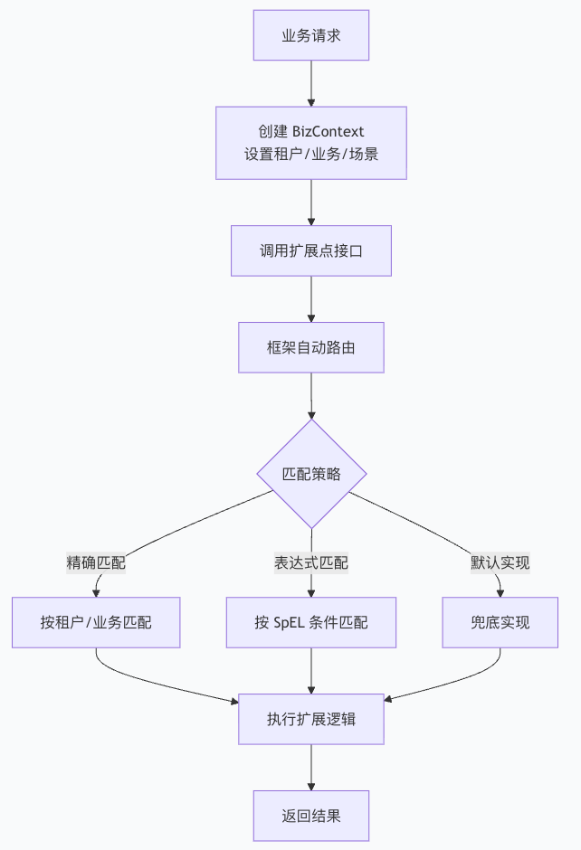
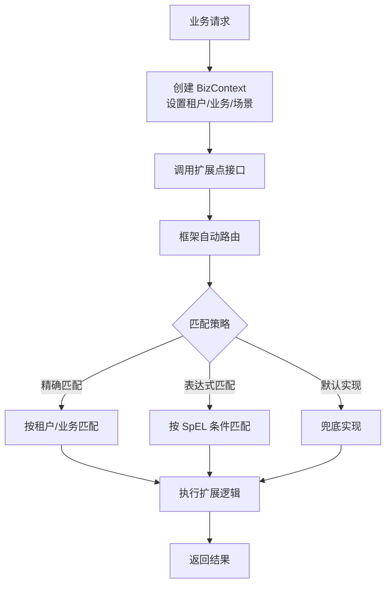

# Bone Extension Framework 使用指南

## 🎯 一句话理解 Bone 扩展框架

**Bone 扩展框架让你像"插件"一样为业务逻辑动态添加租户专属、场景专属或条件专属的处理逻辑，而无需修改核心代码。**

---

## 📋 目录

1. [框架概述](#1-框架概述)
2. [5分钟快速上手](#2-5分钟快速上手)
3. [核心概念详解](#3-核心概念详解)
4. [高级特性](#4-高级特性)
5. [最佳实践](#5-最佳实践)
6. [故障排查](#6-故障排查)
7. [常见问题解答](#7-常见问题解答)
8. [版本历史](#8-版本历史)
9. [附录：速查表](#9-附录速查表)

---

## 1. 框架概述

### 1.1 核心价值
- **解耦核心业务**：将定制化逻辑从核心流程中分离
- **动态路由**：根据业务上下文自动选择合适实现
- **多租户支持**：为不同租户提供专属业务逻辑
- **灵活扩展**：无需修改代码即可添加新业务规则

### 1.2 典型使用流程



### 1.3 主要特性
- ✅ 基于注解的声明式扩展
- ✅ 多维度路由（租户、业务、场景、用例）
- ✅ SpEL 表达式动态条件匹配
- ✅ 优先级控制机制
- ✅ 与 Spring 深度集成
- ✅ 高性能多级缓存
- ✅ 动态注册扩展实现

---

## 2. 5分钟快速上手

### 2.1 基础配置

**步骤1：添加依赖**
```xml
<dependency>
    <groupId>com.bone</groupId>
    <artifactId>bone-extension</artifactId>
    <version>1.3.0</version>
</dependency>
```

**步骤2：启用框架**
```java
@SpringBootApplication
@EnableExtPoints(basePackages = "com.yourcompany.extension")
public class Application {
    public static void main(String[] args) {
        SpringApplication.run(Application.class, args);
    }
}
```

**步骤3：基础配置**
```yaml
# application.yml
bone:
  extension:
    cache-enabled: true
    cache-size: 1000
    logging-enabled: true
    metrics-enabled: false  # 生产环境建议开启
```

### 2.2 最小完整示例

```java
// 1. 定义扩展点接口
@ExtPoint(name = "用户问候扩展点", description = "根据用户类型返回不同的问候语")
public interface GreetingExtension {
    String greet(BizContext<String> context);
}

// 2. 默认问候实现
@ExtProvider(priority = 100)  // 低优先级，兜底实现
@Service
public class DefaultGreetingImpl implements GreetingExtension {
    @Override
    public String greet(BizContext<String> context) {
        String userName = context.getData();
        return "Hello, " + userName + "!";
    }
}

// 3. VIP用户问候实现
@ExtProvider(
    condition = "#context.getAttribute('isVip') == true",  // SpEL表达式
    priority = 50  // 高优先级
)
@Service
public class VipGreetingImpl implements GreetingExtension {
    @Override
    public String greet(BizContext<String> context) {
        String userName = context.getData();
        return "尊贵的VIP用户 " + userName + "，欢迎回来！";
    }
}

// 4. 业务服务类
@Service
public class UserService {
    
    @Autowired
    private GreetingExtension greetingExtension;
    
    public String welcomeUser(String userName, boolean isVip) {
        // 创建业务上下文
        BizContext<String> context = BizContext.<String>builder()
            .tenantCode("TENANT_A")      // 租户维度
            .bizCode("USER_SERVICE")     // 业务维度
            .data(userName)              // 业务数据
            .attribute("isVip", isVip)   // 自定义属性
            .build();
        
        // 使用上下文管理器（自动清理）
        try (BizContexts.ContextManager manager = BizContexts.with(context)) {
            return greetingExtension.greet(context);
        }
    }
}

// 5. 测试类
@SpringBootTest
class UserServiceTest {
    
    @Autowired
    private UserService userService;
    
    @Test
    void testGreetNormalUser() {
        String result = userService.welcomeUser("张三", false);
        assertEquals("Hello, 张三!", result);
    }
    
    @Test
    void testGreetVipUser() {
        String result = userService.welcomeUser("李四", true);
        assertEquals("尊贵的VIP用户 李四，欢迎回来！", result);
    }
}
```

> 💡 **新手提示**：复制上面的代码到你的项目中，修改包名即可运行！

---

## 3. 核心概念详解

### 3.1 扩展点接口设计

**良好设计原则：**
```java
// ✅ 推荐：职责单一，方法明确
@ExtPoint(name = "订单处理扩展点", description = "订单生命周期扩展能力")
public interface OrderExtensionPoint {
    
    /**
     * 订单创建前处理 - 返回修改后的订单数据
     */
    OrderDTO preCreateOrder(BizContext<OrderRequest> context);
    
    /**
     * 订单创建后处理 - 无返回值，用于通知等
     */
    void postCreateOrder(BizContext<OrderDTO> context);
    
    /**
     * 订单验证 - 返回验证结果
     */
    ValidationResult validateOrder(BizContext<OrderRequest> context);
}

// ❌ 避免：职责过多，方法模糊
@ExtPoint(name = "订单扩展点")
public interface BadOrderExtension {
    Object process(Object request);  // 过于通用
    boolean check();                 // 没有明确含义
}
```

### 3.2 扩展实现配置

**@ExtProvider 注解详解：**
```java
@ExtProvider(
    // 维度匹配
    tenantCode = "TENANT_A",     // 租户编码
    bizCode = "ECOMMERCE",       // 业务编码  
    useCase = "CREATE_ORDER",    // 用例编码
    scenario = "MOBILE_APP",     // 场景编码
    
    // 动态条件
    condition = "#data.amount > 100 && #context.getAttribute('channel') == 'APP'",
    
    // 优先级控制（数值越小优先级越高）
    priority = 50
)
@Service
public class TenantAOrderExtension implements OrderExtensionPoint {
    // 实现方法...
}
```

### 3.3 业务上下文使用

**创建丰富的上下文：**
```java
public OrderDTO createOrder(OrderRequest request, UserInfo user) {
    BizContext<OrderRequest> context = BizContext.builder()
        // 核心维度
        .tenantCode(user.getTenantCode())
        .bizCode("ORDER_MANAGEMENT")
        .useCase("CREATE_ORDER")
        .scenario(getOrderScenario(request))
        
        // 业务数据
        .data(request)
        
        // 业务属性（用于表达式匹配）
        .attribute("userId", user.getId())
        .attribute("userLevel", user.getLevel())
        .attribute("channel", request.getChannel())
        .attribute("ip", getClientIp())
        .attribute("isFirstOrder", orderService.isFirstOrder(user.getId()))
        
        // 时间信息
        .attribute("requestTime", LocalDateTime.now())
        .build();
    
    // 自动上下文管理（推荐）
    try (BizContexts.ContextManager manager = BizContexts.with(context)) {
        return orderService.processOrder(context);
    }
}
```

> ⚠️ **重要提醒**：务必使用 try-with-resources 或 finally 块清理上下文，避免内存泄漏！

---

## 4. 高级特性

### 4.1 表达式路由（SpEL）

**可用变量：**
```java
// 在 condition 表达式中可用的变量：
@ExtProvider(condition = "
    #tenantCode == 'TENANT_A' &&           // 租户编码
    #data.amount > 1000 &&                 // 业务数据属性
    #context.getAttribute('vipLevel') == 'GOLD' &&  // 上下文属性
    #bizCode.startsWith('ORDER') &&        // 业务编码
    T(java.util.Objects).equals(#scenario, 'MOBILE')  // 静态方法调用
")
```

**实用表达式示例：**
```java
// 1. 数值范围判断
@ExtProvider(condition = "#data.amount >= 100 && #data.amount <= 1000")

// 2. 字符串匹配
@ExtProvider(condition = "#data.status in {'PENDING', 'PROCESSING'}")

// 3. 集合操作
@ExtProvider(condition = "#data.items.?[price > 100].size() > 0")

// 4. 复杂条件组合
@ExtProvider(condition = "
    (#tenantCode == 'TENANT_A' && #data.amount > 500) || 
    (#tenantCode == 'TENANT_B' && #data.amount > 1000)
")

// 5. 安全访问（避免NPE）
@ExtProvider(condition = "#data.user?.level == 'VIP'")
```

### 4.2 优先级控制实战

```java
// 优先级：10（最高）→ 50（中）→ 100（最低）

// 1. 管理员订单（最高优先级）
@ExtProvider(
    priority = 10, 
    condition = "#data.userId.startsWith('ADMIN')"
)
@Service
public class AdminOrderExtension implements OrderExtensionPoint {
    @Override
    public OrderDTO preCreateOrder(BizContext<OrderRequest> context) {
        OrderDTO order = new OrderDTO();
        order.setAdminFlag(true);
        order.setPriority(1);  // 最高优先级
        return order;
    }
}

// 2. VIP用户订单（中优先级）
@ExtProvider(
    priority = 50,
    condition = "#context.getAttribute('vipLevel') != null"
)
@Service  
public class VipOrderExtension implements OrderExtensionPoint {
    @Override
    public OrderDTO preCreateOrder(BizContext<OrderRequest> context) {
        OrderDTO order = new OrderDTO();
        order.setVipLevel(context.getAttribute("vipLevel"));
        order.setPriority(2);
        return order;
    }
}

// 3. 默认订单处理（最低优先级）
@ExtProvider(priority = 100)
@Service
public class DefaultOrderExtension implements OrderExtensionPoint {
    @Override
    public OrderDTO preCreateOrder(BizContext<OrderRequest> context) {
        OrderDTO order = new OrderDTO();
        order.setPriority(3);  // 普通优先级
        return order;
    }
}
```

### 4.3 组合多个扩展实现

**适用场景**：需要多个扩展点依次处理同一业务
```java
@Service
public class OrderProcessingService {
    
    @Autowired
    private ExtPointComposite<OrderExtensionPoint> orderExtensionComposite;
    
    public OrderProcessingResult processOrder(OrderRequest request) {
        BizContext<OrderRequest> context = createContext(request);
        
        try (BizContexts.ContextManager manager = BizContexts.with(context)) {
            
            // 1. 获取所有匹配的扩展（按优先级排序）
            List<OrderExtensionPoint> extensions = orderExtensionComposite.getExtensions(context);
            
            OrderDTO finalResult = null;
            List<ProcessingStep> steps = new ArrayList<>();
            
            // 2. 依次执行每个扩展
            for (OrderExtensionPoint extension : extensions) {
                String extensionName = extension.getClass().getSimpleName();
                
                try {
                    OrderDTO currentResult = extension.preCreateOrder(context);
                    steps.add(ProcessingStep.success(extensionName, "执行成功"));
                    
                    if (currentResult != null) {
                        finalResult = currentResult;
                        // 更新上下文供下一个扩展使用
                        context.setData(convertToRequest(currentResult));
                    }
                    
                } catch (Exception e) {
                    steps.add(ProcessingStep.failed(extensionName, e.getMessage()));
                    // 单个扩展失败不影响其他扩展执行
                }
            }
            
            return OrderProcessingResult.builder()
                .order(finalResult)
                .processingSteps(steps)
                .success(finalResult != null)
                .build();
        }
    }
}
```

### 4.4 动态注册扩展

**运行时动态添加扩展：**
```java
@Service
public class DynamicExtensionManager {
    
    @Autowired
    private ExtProviderRegister providerRegister;
    
    /**
     * 动态注册租户专属扩展
     */
    public void registerTenantExtension(String tenantCode, String bizCode) {
        OrderExtensionPoint dynamicImpl = new DynamicOrderExtension();
        
        ExtProviderMetadata metadata = ExtProviderMetadata.builder()
            .tenantCode(tenantCode)
            .bizCode(bizCode)
            .priority(75)
            .condition("#data.amount > 0")
            .build();
            
        providerRegister.registerExtension(OrderExtensionPoint.class, dynamicImpl, metadata);
    }
    
    /**
     * 动态注销扩展
     */
    public void unregisterExtension(OrderExtensionPoint extension) {
        providerRegister.unregisterExtension(OrderExtensionPoint.class, extension);
    }
}

// 动态扩展实现
class DynamicOrderExtension implements OrderExtensionPoint {
    @Override
    public OrderDTO preCreateOrder(BizContext<OrderRequest> context) {
        // 动态业务逻辑
        return new OrderDTO();
    }
    
    // 其他方法实现...
}
```

---

## 5. 最佳实践

### 5.1 扩展点设计原则

| 原则 | 正确示例 | 错误示例 |
|------|----------|----------|
| **单一职责** | `OrderValidationExt` 只做验证 | `OrderExt` 包含验证、计算、通知 |
| **明确命名** | `preCreateUser`, `validateOrder` | `process`, `handle` |
| **合理返回值** | `OrderDTO`, `ValidationResult` | `void`（无法传递数据） |
| **异常处理** | 抛出 `BizException` 包含错误码 | 抛出通用 `Exception` |

### 5.2 性能优化指南

**1. 表达式优化**
```java
// ❌ 避免：复杂嵌套表达式
@ExtProvider(condition = "#data.user.addresses.?[#this.default].size() > 0 && 
                          #data.user.addresses.?[#this.default].get(0).city == 'Beijing'")

// ✅ 推荐：简化表达式 + 预计算
@ExtProvider(condition = "#context.getAttribute('isBeijingUser') == true")
@Service  
public class OptimizedExtension implements OrderExtensionPoint {
    @Override
    public OrderDTO preCreateOrder(BizContext<OrderRequest> context) {
        // 预计算复杂条件
        boolean isBeijingUser = calculateIsBeijingUser(context.getData());
        context.setAttribute("isBeijingUser", isBeijingUser);
        
        return processOrder(context);
    }
}
```

**2. 缓存策略**
```java
@Service
public class CachedExtensionImpl implements ProductExtensionPoint {
    
    // 本地缓存减少重复查询
    private final Cache<String, ProductConfig> cache = CacheBuilder.newBuilder()
        .maximumSize(1000)
        .expireAfterWrite(10, TimeUnit.MINUTES)
        .build();
    
    @Override
    public ProductDTO enhanceProduct(BizContext<ProductRequest> context) {
        String cacheKey = context.getTenantCode() + ":" + context.getData().getProductId();
        
        return cache.get(cacheKey, () -> {
            // 缓存miss时的加载逻辑
            return loadAndProcessProduct(context);
        });
    }
    
    @PostConstruct
    public void warmUpCache() {
        // 应用启动时预热常用数据
    }
}
```

**3. 异步处理**
```java
@ExtProvider(tenantCode = "TENANT_A")
@Service
public class AsyncOrderExtensionImpl implements OrderExtensionPoint {
    
    @Async("extensionExecutor")
    @Override
    public void postCreateOrder(BizContext<OrderDTO> context) {
        // 异步处理非关键路径
        OrderDTO order = context.getData();
        notificationService.sendOrderConfirmation(order);
        analyticsService.recordOrderEvent(order);
    }
}
```

### 5.3 错误处理最佳实践

**统一异常处理：**
```java
// 自定义业务异常
public class ExtensionBizException extends RuntimeException {
    private final String errorCode;
    private final String errorMessage;
    
    public ExtensionBizException(String errorCode, String errorMessage) {
        super(errorMessage);
        this.errorCode = errorCode;
        this.errorMessage = errorMessage;
    }
}

// 健壮的扩展实现
@ExtProvider(tenantCode = "TENANT_A")
@Service  
public class RobustExtensionImpl implements OrderExtensionPoint {
    
    @Override
    public OrderDTO preCreateOrder(BizContext<OrderRequest> context) {
        try {
            // 1. 参数验证
            OrderRequest request = context.getData();
            if (request == null) {
                throw new ExtensionBizException("INVALID_REQUEST", "请求数据不能为空");
            }
            
            // 2. 业务验证
            if (request.getAmount().compareTo(BigDecimal.ZERO) <= 0) {
                throw new ExtensionBizException("INVALID_AMOUNT", "订单金额必须大于0");
            }
            
            // 3. 业务处理
            return processOrder(request);
            
        } catch (ExtensionBizException e) {
            // 业务异常，记录并重新抛出
            log.warn("业务异常: {}", e.getErrorMessage());
            throw e;
        } catch (Exception e) {
            // 系统异常，包装为业务异常
            log.error("系统异常", e);
            throw new ExtensionBizException("SYSTEM_ERROR", "系统处理异常");
        }
    }
}
```

### 5.4 实战业务场景

#### 5.4.1 多租户价格策略
```java
@ExtPoint(name = "价格计算扩展点")
public interface PricingExtensionPoint {
    PriceResult calculatePrice(BizContext<PriceRequest> context);
}

// 国内电商价格策略
@ExtProvider(tenantCode = "DOMESTIC_ECOMMERCE")
@Service
public class DomesticPricingImpl implements PricingExtensionPoint {
    @Override
    public PriceResult calculatePrice(BizContext<PriceRequest> context) {
        PriceRequest request = context.getData();
        BigDecimal basePrice = request.getBasePrice();
        
        // 增值税计算
        BigDecimal finalPrice = basePrice.multiply(new BigDecimal("1.13"));
        
        // 满减活动
        if (basePrice.compareTo(new BigDecimal("1000")) >= 0) {
            finalPrice = finalPrice.subtract(new BigDecimal("100"));
        }
        
        return PriceResult.builder()
            .originalPrice(basePrice)
            .finalPrice(finalPrice)
            .currency("CNY")
            .build();
    }
}

// 跨境电商价格策略
@ExtProvider(tenantCode = "CROSSBORDER_ECOMMERCE")  
@Service
public class CrossBorderPricingImpl implements PricingExtensionPoint {
    @Override
    public PriceResult calculatePrice(BizContext<PriceRequest> context) {
        PriceRequest request = context.getData();
        
        // 汇率转换
        BigDecimal usdPrice = exchangeRateService.convertToUSD(request.getBasePrice());
        
        // 关税 + 物流 + 服务费
        BigDecimal finalPrice = usdPrice
            .add(calculateTariff(usdPrice))
            .add(calculateShipping(context))
            .add(usdPrice.multiply(new BigDecimal("0.05")));
            
        return PriceResult.builder()
            .originalPrice(usdPrice)
            .finalPrice(finalPrice)
            .currency("USD")
            .build();
    }
}
```

#### 5.4.2 会员积分系统
```java
@ExtPoint(name = "会员积分扩展点")  
public interface MembershipExtensionPoint {
    int calculatePoints(BizContext<Transaction> context);
    MemberLevel checkLevelUpgrade(BizContext<Member> context);
}

// 普通会员
@ExtProvider(priority = 200)
@Service
public class RegularMemberImpl implements MembershipExtensionPoint {
    @Override
    public int calculatePoints(BizContext<Transaction> context) {
        // 1元 = 1积分
        return context.getData().getAmount().intValue();
    }
}

// 黄金会员  
@ExtProvider(condition = "#data.level == 'GOLD'", priority = 150)
@Service
public class GoldMemberImpl implements MembershipExtensionPoint {
    @Override
    public int calculatePoints(BizContext<Transaction> context) {
        // 1元 = 1.5积分
        return context.getData().getAmount().multiply(new BigDecimal("1.5")).intValue();
    }
}

// 银行联名会员
@ExtProvider(condition = "#context.getAttribute('bankPartner') != null", priority = 100)
@Service
public class BankMemberImpl implements MembershipExtensionPoint {
    @Override
    public int calculatePoints(BizContext<Transaction> context) {
        String bankType = context.getAttribute("bankPartner");
        BigDecimal multiplier = getBankMultiplier(bankType);
        return context.getData().getAmount().multiply(multiplier).intValue();
    }
}
```

#### 5.4.3 医疗保险理赔实战场景 🏥

**场景概述**
在医疗保险系统中，不同保险类型、不同医院等级、不同疾病类型的理赔处理逻辑差异很大。使用Bone扩展框架可以优雅地处理这些复杂的业务分支。

**业务挑战**
- **多保险类型**：基本医保、商业保险、大病保险等
- **多医院等级**：三甲、二甲、社区医院等不同报销比例
- **多疾病类型**：普通疾病、慢性病、重大疾病等
- **多理赔场景**：门诊、住院、特殊门诊等

**定义医疗保险理赔扩展点**
```java
@ExtPoint(name = "医疗保险理赔扩展点", description = "处理不同类型医疗保险的理赔业务")
public interface MedicalClaimExtensionPoint {
    
    /**
     * 验证理赔申请资料
     */
    ValidationResult validateClaim(BizContext<ClaimRequest> context);
    
    /**
     * 计算理赔金额
     */
    ClaimCalculationResult calculateClaim(BizContext<ClaimRequest> context);
    
    /**
     * 理赔后处理（通知、记录等）
     */
    void postClaimProcessing(BizContext<ClaimResult> context);
    
    /**
     * 获取理赔限制信息
     */
    ClaimLimitInfo getClaimLimit(BizContext<ClaimRequest> context);
}
```

**门诊理赔处理实现**
```java
@ExtProvider(
    tenantCode = "MEDICAL_INSURANCE_A",
    condition = "#data.claimType == 'OUTPATIENT' && #data.insuranceType == 'BASIC_MEDICAL'",
    priority = 100
)
@Service
@Slf4j
public class OutpatientClaimExtension implements MedicalClaimExtensionPoint {
    
    @Autowired
    private MedicalCatalogService medicalCatalogService;

    @Override
    public ValidationResult validateClaim(BizContext<ClaimRequest> context) {
        ClaimRequest request = context.getData();
        ValidationResult result = new ValidationResult();
        
        // 基础信息验证
        if (request.getTreatmentDate().isAfter(LocalDate.now())) {
            result.addError("INVALID_TREATMENT_DATE", "就诊日期不能晚于当前日期");
        }
        
        // 药品目录验证
        for (MedicineItem item : request.getMedicineItems()) {
            if (!medicalCatalogService.isInSocialSecurityCatalog(item.getMedicineCode())) {
                result.addWarning("MEDICINE_NOT_IN_CATALOG", 
                    String.format("药品【%s】不在医保目录内", item.getMedicineName()));
            }
        }
        
        return result;
    }

    @Override
    public ClaimCalculationResult calculateClaim(BizContext<ClaimRequest> context) {
        ClaimRequest request = context.getData();
        
        // 计算总费用
        BigDecimal totalCost = calculateTotalCost(request);
        
        // 应用门诊报销规则
        ClaimCalculationResult result = applyOutpatientReimbursementRules(totalCost, request);
        
        return result;
    }
    
    // 其他方法实现...
}
```

**住院理赔处理实现**
```java
@ExtProvider(
    tenantCode = "MEDICAL_INSURANCE_A", 
    condition = "#data.claimType == 'INPATIENT' && #data.insuranceType == 'BASIC_MEDICAL'",
    priority = 90
)
@Service
@Slf4j
public class InpatientClaimExtension implements MedicalClaimExtensionPoint {
    
    @Autowired
    private HospitalService hospitalService;

    @Override
    public ValidationResult validateClaim(BizContext<ClaimRequest> context) {
        ClaimRequest request = context.getData();
        ValidationResult result = new ValidationResult();
        
        // 住院日期验证
        if (request.getDischargeDate().isBefore(request.getAdmissionDate())) {
            result.addError("INVALID_DATE_RANGE", "出院日期不能早于入院日期");
        }
        
        // 医院资质验证
        HospitalInfo hospital = hospitalService.getHospitalInfo(request.getHospitalCode());
        if (!hospital.isInNetwork()) {
            result.addWarning("OUT_OF_NETWORK_HOSPITAL", 
                String.format("医院【%s】非定点医院", hospital.getName()));
        }
        
        return result;
    }

    @Override
    public ClaimCalculationResult calculateClaim(BizContext<ClaimRequest> context) {
        ClaimRequest request = context.getData();
        
        // 获取医院信息
        HospitalInfo hospital = hospitalService.getHospitalInfo(request.getHospitalCode());
        String hospitalLevel = hospital.getLevel();
        
        // 计算住院总费用
        BigDecimal totalCost = calculateInpatientTotalCost(request);
        
        // 根据医院等级应用不同报销规则
        ClaimCalculationResult result = applyInpatientReimbursementRules(totalCost, hospitalLevel, request);
        
        return result;
    }
    
    // 其他方法实现...
}
```

**重大疾病特殊处理实现**
```java
@ExtProvider(
    tenantCode = "MEDICAL_INSURANCE_A",
    condition = "#data.diseaseType == 'CRITICAL_ILLNESS' || #context.getAttribute('isCriticalIllness') == true",
    priority = 50  // 较高优先级，覆盖普通住院规则
)
@Service
@Slf4j
public class CriticalIllnessClaimExtension implements MedicalClaimExtensionPoint {
    
    @Autowired
    private CriticalIllnessService criticalIllnessService;

    @Override
    public ValidationResult validateClaim(BizContext<ClaimRequest> context) {
        ClaimRequest request = context.getData();
        ValidationResult result = new ValidationResult();
        
        // 重大疾病诊断验证
        if (!criticalIllnessService.isValidCriticalIllnessDiagnosis(request.getDiseaseCode())) {
            result.addError("INVALID_CRITICAL_ILLNESS", "不符合重大疾病诊断标准");
        }
        
        return result;
    }

    @Override
    public ClaimCalculationResult calculateClaim(BizContext<ClaimRequest> context) {
        ClaimRequest request = context.getData();
        
        // 获取重大疾病特殊政策
        CriticalIllnessPolicy policy = criticalIllnessService.getPolicy(request.getDiseaseCode());
        
        // 计算总费用
        BigDecimal totalCost = calculateTotalCost(request);
        
        // 应用重大疾病特殊报销规则
        ClaimCalculationResult result = applyCriticalIllnessRules(totalCost, policy, request);
        
        return result;
    }
    
    // 其他方法实现...
}
```

**理赔流程集成服务**
```java
@Service
@Slf4j
public class MedicalClaimService {
    
    @Autowired
    private ExtPointComposite<MedicalClaimExtensionPoint> claimExtensionComposite;
    
    /**
     * 处理医疗保险理赔全流程
     */
    public ClaimProcessResult processMedicalClaim(ClaimRequest request) {
        // 创建理赔上下文
        BizContext<ClaimRequest> context = createClaimContext(request);
        
        // 使用上下文管理器执行理赔流程
        try (BizContexts.ContextManager manager = BizContexts.with(context)) {
            return executeClaimProcess(context);
        }
    }
    
    private ClaimProcessResult executeClaimProcess(BizContext<ClaimRequest> context) {
        ClaimRequest request = context.getData();
        
        // 1. 获取所有匹配的扩展实现
        List<MedicalClaimExtensionPoint> extensions = claimExtensionComposite.getExtensions(context);
        
        // 2. 执行验证阶段
        ValidationResult validationResult = executeValidationPhase(extensions, context);
        if (validationResult.hasErrors()) {
            return createValidationFailedResult(request.getClaimId(), validationResult);
        }
        
        // 3. 执行计算阶段
        List<ClaimCalculationResult> calculationResults = executeCalculationPhase(extensions, context);
        
        // 4. 执行后处理阶段
        executePostProcessingPhase(extensions, context, calculationResults);
        
        // 5. 汇总理赔结果
        return aggregateClaimResults(request.getClaimId(), calculationResults, validationResult.getWarnings());
    }
    
    // 其他辅助方法...
}
```

**理赔场景测试用例**
```java
@SpringBootTest
@ExtPointTest
class MedicalClaimServiceTest {
    
    @Autowired
    private MedicalClaimService medicalClaimService;
    
    @Test
    void testOutpatientClaim() {
        // 准备门诊理赔数据
        ClaimRequest request = ClaimRequest.builder()
            .claimId("CLM202401010001")
            .claimType("OUTPATIENT")
            .insuranceType("BASIC_MEDICAL")
            .totalAmount(new BigDecimal("500"))
            .build();
        
        // 执行理赔
        ClaimProcessResult result = medicalClaimService.processMedicalClaim(request);
        
        // 验证结果
        assertTrue(result.isSuccess());
        assertTrue(result.getTotalReimbursementAmount().compareTo(BigDecimal.ZERO) > 0);
    }
    
    @Test
    void testCriticalIllnessClaim() {
        // 准备重大疾病理赔数据
        ClaimRequest request = ClaimRequest.builder()
            .claimId("CLM202401010003")
            .claimType("INPATIENT")
            .insuranceType("BASIC_MEDICAL")
            .diseaseCode("CANCER")
            .totalAmount(new BigDecimal("80000"))
            .build();
        
        // 执行理赔
        ClaimProcessResult result = medicalClaimService.processMedicalClaim(request);
        
        // 验证结果 - 重大疾病应该有特殊处理
        assertTrue(result.isSuccess());
        assertTrue(result.getTotalReimbursementAmount().compareTo(new BigDecimal("50000")) > 0);
    }
}
```

**场景总结**
通过Bone扩展框架，医疗保险理赔系统实现了：
- **灵活扩展**：新增保险类型、医院等级、疾病类型时无需修改核心代码
- **精准路由**：根据不同条件自动选择最合适的理赔处理逻辑
- **统一管理**：复杂的理赔规则通过扩展点统一管理，降低维护成本
- **易于测试**：每个扩展点可以独立测试，业务逻辑清晰

---

## 6. 故障排查

### 6.1 常见问题解决方案

| 问题现象 | 可能原因 | 解决方案 |
|----------|----------|----------|
| 扩展点未调用 | 1. 未启用扫描<br>2. 包路径错误<br>3. 缺少注解 | 1. 检查 `@EnableExtPoints`<br>2. 验证 `basePackages`<br>3. 确认 `@ExtProvider` |
| 表达式匹配失败 | 1. 语法错误<br>2. 变量不存在<br>3. NPE | 1. 使用简单表达式测试<br>2. 检查可用变量<br>3. 添加空值检查 |
| 性能问题 | 1. 复杂表达式<br>2. 重复查询<br>3. 同步阻塞 | 1. 简化表达式<br>2. 添加缓存<br>3. 使用异步处理 |

### 6.2 调试工具

**1. 启用详细日志**
```yaml
# application.yml
logging:
  level:
    com.bone.engine.extension: DEBUG
    org.springframework.expression: DEBUG
```

**2. 诊断控制器**
```java
@RestController
@RequestMapping("/diagnostic")
public class ExtensionDiagnosticController {
    
    @Autowired
    private ExtPointRegistry extPointRegistry;
    
    @GetMapping("/extensions")
    public Map<String, Object> getExtensions() {
        Map<String, Object> result = new HashMap<>();
        
        // 获取所有注册的扩展点
        extPointRegistry.getExtPoints().forEach((name, definition) -> {
            result.put(name, definition.getProviders().stream()
                .map(p -> p.getBeanName() + " (priority: " + p.getPriority() + ")")
                .collect(Collectors.toList()));
        });
        
        return result;
    }
}
```

**3. 性能监控**
```java
@Component
public class ExtensionPerformanceMonitor {
    
    private final Map<String, PerformanceStats> stats = new ConcurrentHashMap<>();
    
    @EventListener
    public void onExtensionCall(ExtensionCallEvent event) {
        String key = event.getExtensionPoint() + ":" + event.getProvider();
        stats.computeIfAbsent(key, k -> new PerformanceStats())
             .recordCall(event.getDuration(), event.isSuccess());
    }
    
    @Scheduled(fixedRate = 300000) // 5分钟
    public void reportSlowExtensions() {
        stats.entrySet().stream()
            .filter(entry -> entry.getValue().getAverageDuration() > 100) // >100ms
            .forEach(entry -> log.warn("慢扩展点: {}, 平均耗时: {}ms", 
                entry.getKey(), entry.getValue().getAverageDuration()));
    }
}
```

---

## 7. 常见问题解答

### 7.1 基础问题

**Q: 什么时候应该使用扩展点框架？**
A: 当你的业务需要：
- 为不同租户提供定制逻辑
- 根据动态条件选择不同实现
- 避免在核心代码中写大量 if-else
- 需要支持插件化架构

**Q: 扩展点框架和策略模式有什么区别？**
A: 策略模式是设计模式，需要手动选择策略；扩展点框架是基础设施，自动根据上下文路由，支持更丰富的匹配维度。

### 7.2 性能问题

**Q: 表达式路由的性能开销大吗？**
A: 框架内置多级缓存，对相同表达式和上下文会缓存匹配结果。建议：
- 避免过于复杂的表达式
- 对高频调用场景使用精确匹配
- 开启缓存预热

**Q: 如何监控扩展点性能？**
A:
1. 配置 `metrics-enabled: true`
2. 使用 `ExtensionPerformanceMonitor`
3. 分析扩展点调用日志

### 7.3 高级用法

**Q: 如何实现扩展点的A/B测试？**
A: 使用表达式路由：
```java
@ExtProvider(condition = "#context.getAttribute('abTestGroup') == 'A'")
public class VersionAExtension implements FeatureExtension {
    // A版本逻辑
}

@ExtProvider(condition = "#context.getAttribute('abTestGroup') == 'B'")  
public class VersionBExtension implements FeatureExtension {
    // B版本逻辑
}
```

**Q: 扩展点之间如何传递数据？**
A: 通过 `BizContext` 的 attributes：
```java
// 第一个扩展点
context.setAttribute("processedData", result);

// 后续扩展点
MyData data = context.getAttribute("processedData");
```

---

## 8. 版本历史

### 1.3.0 (最新)
- 扩展点版本管理
- 热更新支持
- 性能优化
- 文档自动生成

### 1.2.0
- 动态注册扩展
- 监控指标
- 异步执行
- 多租户增强

### 1.1.0
- 组合执行
- 缓存预热
- 表达式优化
- 错误处理增强

### 1.0.0
- 基础扩展点机制
- 注解驱动
- SpEL表达式路由
- Spring集成

---

## 9. 附录：速查表

### 9.1 注解速查

| 注解 | 用途 | 示例 |
|------|------|------|
| `@ExtPoint` | 定义扩展点接口 | `@ExtPoint(name="订单扩展点")` |
| `@ExtProvider` | 实现扩展点 | `@ExtProvider(tenantCode="T1", priority=50)` |
| `@EnableExtPoints` | 启用框架 | `@EnableExtPoints(basePackages="com.xx")` |

### 9.2 API速查

| 方法 | 用途 | 示例 |
|------|------|------|
| `BizContext.builder()` | 创建上下文 | `.tenantCode("T1").data(obj).build()` |
| `BizContexts.with()` | 设置上下文 | `try (var mgr = BizContexts.with(ctx)) { }` |
| `ExtPointComposite.getExtensions()` | 获取所有匹配实现 | `composite.getExtensions(context)` |

### 9.3 表达式速查

| 表达式 | 含义 |
|--------|------|
| `#tenantCode == 'T1'` | 租户匹配 |
| `#data.amount > 100` | 数据属性判断 |
| `#context.getAttribute('vip')` | 上下文属性访问 |
| `#data.items.size() > 0` | 集合操作 |

---

## 🎉 开始使用！

现在你已经掌握了 Bone Extension Framework 的核心概念和最佳实践。建议从 [2. 5分钟快速上手](#2-5分钟快速上手) 的最小示例开始，逐步应用到你的业务场景中。

**遇到问题？** 查看 [6. 故障排查](#6-故障排查) 和 [7. 常见问题解答](#7-常见问题解答)，或检查框架日志中的详细错误信息。

Happy Coding! 🚀