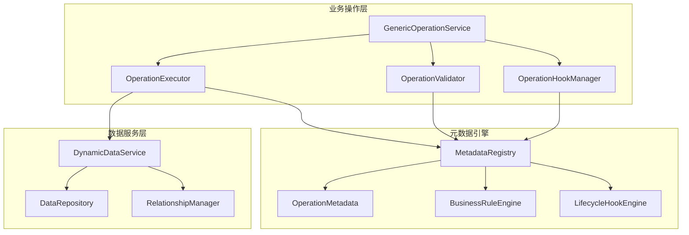

基于元数据引擎自动实现采购订单业务逻辑的完整方案，无需编写具体的PurchaseOrderService类。

## 一、元数据驱动的业务操作架构

### 1.1 动态操作服务架构



### 1.2 操作元数据定义

```java
// 操作元数据 - 定义业务操作的行为规范
@Data
@Builder
@NoArgsConstructor
@AllArgsConstructor
public class OperationMetadata {
    @NotBlank
    private String name; // 操作名称，如 "submitPurchaseOrder"
    
    @NotBlank
    private String entityName; // 目标实体，如 "PurchaseOrder"
    
    @NotBlank
    private String label; // 显示标签，如 "提交采购订单"
    
    private String description;
    
    @NotNull
    private OperationType type; // 操作类型
    
    @Builder.Default
    private List<OperationParameter> parameters = new ArrayList<>();
    
    @Builder.Default
    private List<OperationStep> steps = new ArrayList<>();
    
    @Builder.Default
    private List<OperationCondition> preconditions = new ArrayList<>();
    
    @Builder.Default
    private List<OperationCondition> postconditions = new ArrayList<>();
    
    private String successMessage;
    private String errorMessage;
    
    @Builder.Default
    private boolean async = false;
    
    @Builder.Default
    private Integer timeout = 30; // 超时时间(秒)
    
    @Builder.Default
    private boolean transactional = true;
    
    public enum OperationType {
        CREATE,
        UPDATE,
        DELETE,
        CUSTOM,
        WORKFLOW,
        BATCH
    }
}

// 操作步骤定义
@Data
@Builder
@NoArgsConstructor
@AllArgsConstructor
public class OperationStep {
    @NotBlank
    private String name;
    
    private String description;
    
    @NotNull
    private StepType type;
    
    private String targetEntity; // 目标实体
    private String action; // 操作动作
    
    @Builder.Default
    private Map<String, Object> parameters = new HashMap<>();
    
    private String condition; // 执行条件
    
    @Builder.Default
    private Integer order = 0;
    
    @Builder.Default
    private boolean required = true;
    
    public enum StepType {
        DATA_QUERY,      // 数据查询
        DATA_UPDATE,     // 数据更新
        DATA_CREATE,     // 数据创建
        VALIDATION,      // 数据验证
        EXTERNAL_CALL,   // 外部调用
        NOTIFICATION,    // 发送通知
        APPROVAL,        // 审批流程
        CALCULATION,     // 计算处理
        HOOK_EXECUTION   // 钩子执行
    }
}

// 操作参数定义
@Data
@Builder
@NoArgsConstructor
@AllArgsConstructor
public class OperationParameter {
    @NotBlank
    private String name;
    
    @NotBlank
    private String label;
    
    @NotNull
    private FieldType type;
    
    @Builder.Default
    private boolean required = false;
    
    private Object defaultValue;
    private String description;
    
    @Builder.Default
    private List<String> allowedValues = new ArrayList<>();
}

// 操作条件定义
@Data
@Builder
@NoArgsConstructor
@AllArgsConstructor
public class OperationCondition {
    @NotBlank
    private String expression; // SpEL表达式
    
    private String errorMessage;
    
    @Builder.Default
    private ConditionType type = ConditionType.PRECONDITION;
    
    public enum ConditionType {
        PRECONDITION, // 前置条件
        POSTCONDITION // 后置条件
    }
}
```

## 二、通用操作服务实现

### 2.1 核心操作服务

```java
@Service
@Transactional
@Slf4j
public class GenericOperationService {
    
    private final MetadataEngine metadataEngine;
    private final DynamicDataService dataService;
    private final ExpressionEngine expressionEngine;
    private final ValidationEngine validationEngine;
    private final OperationRegistry operationRegistry;
    private final EventPublisher eventPublisher;
    
    /**
     * 执行业务操作
     */
    public OperationResult execute(String operationName, String entityId, 
                                  Map<String, Object> parameters) {
        return execute(operationName, entityId, parameters, Collections.emptyMap());
    }
    
    /**
     * 执行业务操作（带上下文）
     */
    public OperationResult execute(String operationName, String entityId,
                                  Map<String, Object> parameters, 
                                  Map<String, Object> context) {
        try {
            // 1. 获取操作定义
            OperationMetadata operation = operationRegistry.getOperation(operationName);
            if (operation == null) {
                return OperationResult.failure("操作未定义: " + operationName);
            }
            
            // 2. 构建执行上下文
            OperationExecutionContext executionContext = buildExecutionContext(
                operation, entityId, parameters, context);
            
            // 3. 验证前置条件
            OperationResult preconditionResult = validatePreconditions(operation, executionContext);
            if (!preconditionResult.isSuccess()) {
                return preconditionResult;
            }
            
            // 4. 执行操作步骤
            OperationResult executionResult = executeSteps(operation, executionContext);
            if (!executionResult.isSuccess()) {
                return executionResult;
            }
            
            // 5. 验证后置条件
            OperationResult postconditionResult = validatePostconditions(operation, executionContext);
            if (!postconditionResult.isSuccess()) {
                return postconditionResult;
            }
            
            // 6. 发布操作完成事件
            publishOperationCompletedEvent(operation, executionContext, executionResult);
            
            return OperationResult.success(executionResult.getData(), 
                operation.getSuccessMessage() != null ? 
                operation.getSuccessMessage() : "操作执行成功");
            
        } catch (Exception e) {
            log.error("执行操作失败: {}", operationName, e);
            return OperationResult.failure(
                operation.getErrorMessage() != null ? 
                operation.getErrorMessage() : "操作执行失败: " + e.getMessage());
        }
    }
    
    /**
     * 构建执行上下文
     */
    private OperationExecutionContext buildExecutionContext(OperationMetadata operation, 
                                                           String entityId,
                                                           Map<String, Object> parameters,
                                                           Map<String, Object> context) {
        OperationExecutionContext executionContext = new OperationExecutionContext();
        
        // 设置基础信息
        executionContext.setOperation(operation);
        executionContext.setEntityId(entityId);
        executionContext.setParameters(parameters);
        executionContext.setContext(context);
        executionContext.setStartTime(System.currentTimeMillis());
        executionContext.setOperator(SecurityUtils.getCurrentUserId());
        
        // 加载目标实体数据
        if (entityId != null) {
            Map<String, Object> entityData = dataService.getById(operation.getEntityName(), entityId);
            executionContext.setTargetEntity(entityData);
        }
        
        // 设置系统变量
        executionContext.getVariables().put("operator", SecurityUtils.getCurrentUserId());
        executionContext.getVariables().put("now", LocalDateTime.now());
        executionContext.getVariables().put("today", LocalDate.now());
        
        return executionContext;
    }
    
    /**
     * 验证前置条件
     */
    private OperationResult validatePreconditions(OperationMetadata operation, 
                                                 OperationExecutionContext context) {
        for (OperationCondition condition : operation.getPreconditions()) {
            try {
                Boolean result = expressionEngine.evaluateBoolean(
                    condition.getExpression(), context.getVariables());
                
                if (Boolean.FALSE.equals(result)) {
                    String errorMessage = condition.getErrorMessage() != null ? 
                        condition.getErrorMessage() : "操作前置条件不满足";
                    return OperationResult.failure(errorMessage);
                }
            } catch (Exception e) {
                log.warn("前置条件验证失败: {}", condition.getExpression(), e);
                return OperationResult.failure("前置条件验证异常: " + e.getMessage());
            }
        }
        return OperationResult.success();
    }
    
    /**
     * 执行操作步骤
     */
    private OperationResult executeSteps(OperationMetadata operation, 
                                        OperationExecutionContext context) {
        List<OperationStep> sortedSteps = operation.getSteps().stream()
            .sorted(Comparator.comparing(OperationStep::getOrder))
            .collect(Collectors.toList());
        
        for (OperationStep step : sortedSteps) {
            // 检查步骤执行条件
            if (step.getCondition() != null) {
                try {
                    Boolean shouldExecute = expressionEngine.evaluateBoolean(
                        step.getCondition(), context.getVariables());
                    if (Boolean.FALSE.equals(shouldExecute)) {
                        log.debug("跳过步骤执行: {} - 条件不满足", step.getName());
                        continue;
                    }
                } catch (Exception e) {
                    log.warn("步骤条件验证失败: {}", step.getCondition(), e);
                    return OperationResult.failure("步骤执行条件异常: " + e.getMessage());
                }
            }
            
            // 执行步骤
            OperationResult stepResult = executeStep(step, context);
            if (!stepResult.isSuccess() && step.isRequired()) {
                return stepResult;
            }
            
            // 更新上下文变量
            if (stepResult.getData() != null) {
                context.getVariables().put(step.getName() + "Result", stepResult.getData());
            }
        }
        
        return OperationResult.success(context.getResult());
    }
    
    /**
     * 执行单个步骤
     */
    private OperationResult executeStep(OperationStep step, OperationExecutionContext context) {
        try {
            switch (step.getType()) {
                case DATA_QUERY:
                    return executeDataQueryStep(step, context);
                case DATA_UPDATE:
                    return executeDataUpdateStep(step, context);
                case DATA_CREATE:
                    return executeDataCreateStep(step, context);
                case VALIDATION:
                    return executeValidationStep(step, context);
                case EXTERNAL_CALL:
                    return executeExternalCallStep(step, context);
                case NOTIFICATION:
                    return executeNotificationStep(step, context);
                case APPROVAL:
                    return executeApprovalStep(step, context);
                case CALCULATION:
                    return executeCalculationStep(step, context);
                case HOOK_EXECUTION:
                    return executeHookStep(step, context);
                default:
                    return OperationResult.failure("未知的步骤类型: " + step.getType());
            }
        } catch (Exception e) {
            log.error("步骤执行失败: {}", step.getName(), e);
            return OperationResult.failure("步骤执行失败: " + e.getMessage());
        }
    }
    
    /**
     * 执行数据查询步骤
     */
    private OperationResult executeDataQueryStep(OperationStep step, OperationExecutionContext context) {
        String entityName = step.getTargetEntity();
        String queryExpression = (String) step.getParameters().get("query");
        
        // 解析查询条件
        Map<String, Object> queryParams = evaluateParameters(step.getParameters(), context.getVariables());
        
        // 执行查询
        List<Map<String, Object>> results = dataService.query(entityName, queryParams);
        
        return OperationResult.success(results);
    }
    
    /**
     * 执行数据更新步骤
     */
    private OperationResult executeDataUpdateStep(OperationStep step, OperationExecutionContext context) {
        String entityName = step.getTargetEntity();
        String entityId = evaluateExpression((String) step.getParameters().get("entityId"), 
                                           context.getVariables(), String.class);
        
        // 构建更新数据
        Map<String, Object> updateData = evaluateParameters(step.getParameters(), context.getVariables());
        
        // 移除非数据字段
        updateData.remove("entityId");
        updateData.remove("query");
        
        // 执行更新
        Map<String, Object> updatedEntity = dataService.update(entityName, entityId, updateData);
        
        return OperationResult.success(updatedEntity);
    }
    
    /**
     * 执行数据创建步骤
     */
    private OperationResult executeDataCreateStep(OperationStep step, OperationExecutionContext context) {
        String entityName = step.getTargetEntity();
        
        // 构建创建数据
        Map<String, Object> createData = evaluateParameters(step.getParameters(), context.getVariables());
        
        // 执行创建
        Map<String, Object> createdEntity = dataService.create(entityName, createData);
        
        return OperationResult.success(createdEntity);
    }
    
    /**
     * 执行验证步骤
     */
    private OperationResult executeValidationStep(OperationStep step, OperationExecutionContext context) {
        String entityName = step.getTargetEntity();
        Map<String, Object> data = evaluateParameters(step.getParameters(), context.getVariables());
        
        // 执行验证
        ValidationResult validationResult = validationEngine.validate(entityName, data);
        if (!validationResult.isValid()) {
            return OperationResult.failure("数据验证失败: " + validationResult.getErrors());
        }
        
        return OperationResult.success();
    }
    
    /**
     * 执行外部调用步骤
     */
    private OperationResult executeExternalCallStep(OperationStep step, OperationExecutionContext context) {
        String serviceName = (String) step.getParameters().get("service");
        String methodName = (String) step.getParameters().get("method");
        
        // 获取服务Bean
        Object service = SpringContextHolder.getBean(serviceName);
        if (service == null) {
            return OperationResult.failure("外部服务不存在: " + serviceName);
        }
        
        // 构建方法参数
        Map<String, Object> callParams = evaluateParameters(step.getParameters(), context.getVariables());
        Object[] methodArgs = prepareMethodArguments(service, methodName, callParams);
        
        try {
            // 反射调用方法
            Method method = findMethod(service, methodName, methodArgs);
            Object result = method.invoke(service, methodArgs);
            
            return OperationResult.success(result);
        } catch (Exception e) {
            log.error("外部调用失败: {}.{}", serviceName, methodName, e);
            return OperationResult.failure("外部服务调用失败: " + e.getMessage());
        }
    }
    
    /**
     * 评估参数表达式
     */
    private Map<String, Object> evaluateParameters(Map<String, Object> parameters, 
                                                  Map<String, Object> context) {
        Map<String, Object> evaluated = new HashMap<>();
        
        for (Map.Entry<String, Object> entry : parameters.entrySet()) {
            if (entry.getValue() instanceof String) {
                String valueStr = (String) entry.getValue();
                // 检查是否是表达式
                if (valueStr.startsWith("${") && valueStr.endsWith("}")) {
                    String expression = valueStr.substring(2, valueStr.length() - 1);
                    Object value = expressionEngine.evaluate(expression, context);
                    evaluated.put(entry.getKey(), value);
                } else {
                    evaluated.put(entry.getKey(), valueStr);
                }
            } else {
                evaluated.put(entry.getKey(), entry.getValue());
            }
        }
        
        return evaluated;
    }
    
    private <T> T evaluateExpression(String expression, Map<String, Object> context, Class<T> type) {
        if (expression.startsWith("${") && expression.endsWith("}")) {
            String expr = expression.substring(2, expression.length() - 1);
            return expressionEngine.evaluate(expr, context, type);
        }
        return type.cast(expression);
    }
}
```

### 2.2 操作注册表

```java
@Component
public class OperationRegistry {
    
    private final Map<String, OperationMetadata> operationMap = new ConcurrentHashMap<>();
    private final MetadataRepository metadataRepository;
    
    @PostConstruct
    public void init() {
        // 加载预定义操作
        loadPredefinedOperations();
        // 加载动态操作
        loadDynamicOperations();
    }
    
    /**
     * 注册操作
     */
    public void registerOperation(OperationMetadata operation) {
        String key = buildOperationKey(operation.getEntityName(), operation.getName());
        operationMap.put(key, operation);
        
        // 持久化到数据库
        metadataRepository.saveOperation(operation);
    }
    
    /**
     * 获取操作定义
     */
    public OperationMetadata getOperation(String operationName) {
        return operationMap.get(operationName);
    }
    
    public OperationMetadata getOperation(String entityName, String operationName) {
        String key = buildOperationKey(entityName, operationName);
        return operationMap.get(key);
    }
    
    /**
     * 获取实体相关操作
     */
    public List<OperationMetadata> getEntityOperations(String entityName) {
        return operationMap.values().stream()
            .filter(op -> entityName.equals(op.getEntityName()))
            .sorted(Comparator.comparing(OperationMetadata::getName))
            .collect(Collectors.toList());
    }
    
    private String buildOperationKey(String entityName, String operationName) {
        return entityName + ":" + operationName;
    }
    
    private void loadPredefinedOperations() {
        // 加载系统预定义操作
        registerSystemOperations();
    }
    
    private void loadDynamicOperations() {
        // 从数据库加载动态定义的操作
        List<OperationMetadata> dynamicOperations = metadataRepository.findAllOperations();
        for (OperationMetadata operation : dynamicOperations) {
            String key = buildOperationKey(operation.getEntityName(), operation.getName());
            operationMap.put(key, operation);
        }
    }
    
    private void registerSystemOperations() {
        // 注册通用的CRUD操作
        registerCrudOperations();
        // 注册采购订单特定操作
        registerPurchaseOrderOperations();
    }
}
```

## 三、采购订单操作定义（完全基于元数据）

### 3.1 采购订单操作元数据定义

```yaml
# 采购订单操作定义 - 完全基于元数据，无需编写Java代码

# 1. 创建采购订单操作
createPurchaseOrder:
  name: "createPurchaseOrder"
  entityName: "PurchaseOrder"
  label: "创建采购订单"
  description: "创建新的采购订单，包括订单明细处理"
  type: "CREATE"
  transactional: true
  parameters:
    - name: "orderType"
      label: "订单类型"
      type: "PICKLIST"
      required: true
      allowedValues: ["STANDARD", "URGENT", "CONTRACT"]
    - name: "supplierId"
      label: "供应商ID"
      type: "LOOKUP"
      required: true
    - name: "expectedDeliveryDate"
      label: "期望交货日期"
      type: "DATE"
      required: true
    - name: "lineItems"
      label: "订单明细"
      type: "JSON"
      required: true
  steps:
    - name: "validateSupplier"
      type: "VALIDATION"
      targetEntity: "Supplier"
      parameters:
        query: "${@supplierService.validateSupplier(supplierId)}"
      condition: "${supplierId != null}"
      order: 1
      required: true
    
    - name: "createOrder"
      type: "DATA_CREATE"
      targetEntity: "PurchaseOrder"
      parameters:
        orderType: "${orderType}"
        supplierId: "${supplierId}"
        expectedDeliveryDate: "${expectedDeliveryDate}"
        status: "DRAFT"
        createdBy: "${operator}"
        orderDate: "${today}"
      order: 2
      required: true
    
    - name: "createLineItems"
      type: "DATA_CREATE"
      targetEntity: "PurchaseOrderItem"
      parameters:
        purchaseOrderId: "${createOrder.result.id}"
        items: "${lineItems}"
      condition: "${lineItems != null && !lineItems.empty}"
      order: 3
      required: false
    
    - name: "calculateOrderAmount"
      type: "CALCULATION"
      parameters:
        expression: "${@amountService.calculateOrderTotal(createOrder.result.id)}"
      order: 4
      required: true
    
    - name: "updateOrderAmount"
      type: "DATA_UPDATE"
      targetEntity: "PurchaseOrder"
      parameters:
        entityId: "${createOrder.result.id}"
        totalAmount: "${calculateOrderAmount.result.totalAmount}"
        totalAmountWithoutTax: "${calculateOrderAmount.result.totalAmountWithoutTax}"
        taxAmount: "${calculateOrderAmount.result.taxAmount}"
      order: 5
      required: true
    
    - name: "sendNotification"
      type: "NOTIFICATION"
      parameters:
        template: "ORDER_CREATED"
        recipients: "${@userService.getDepartmentUsers('PROCUREMENT')}"
        data: "${createOrder.result}"
      order: 6
      required: false
  
  preconditions:
    - expression: "${@securityService.hasPermission('PURCHASE_ORDER_CREATE')}"
      errorMessage: "没有创建采购订单的权限"
    
    - expression: "${expectedDeliveryDate != null && expectedDeliveryDate.isAfter(today)}"
      errorMessage: "期望交货日期必须大于当前日期"
  
  successMessage: "采购订单创建成功"
  errorMessage: "采购订单创建失败"

# 2. 提交采购订单审批
submitPurchaseOrder:
  name: "submitPurchaseOrder"
  entityName: "PurchaseOrder"
  label: "提交审批"
  description: "提交采购订单进行审批流程"
  type: "WORKFLOW"
  transactional: true
  parameters:
    - name: "comments"
      label: "提交说明"
      type: "TEXT"
      required: false
  steps:
    - name: "validateOrderStatus"
      type: "VALIDATION"
      targetEntity: "PurchaseOrder"
      parameters:
        query: "${status == 'DRAFT'}"
      order: 1
      required: true
    
    - name: "validateOrderAmount"
      type: "VALIDATION"
      parameters:
        expression: "${totalAmount > 0}"
      order: 2
      required: true
    
    - name: "startApprovalProcess"
      type: "APPROVAL"
      parameters:
        processDefinition: "PURCHASE_ORDER_APPROVAL"
        businessKey: "${targetEntity.id}"
        variables: 
          orderAmount: "${targetEntity.totalAmount}"
          orderType: "${targetEntity.orderType}"
          submitter: "${operator}"
      order: 3
      required: true
    
    - name: "updateOrderStatus"
      type: "DATA_UPDATE"
      targetEntity: "PurchaseOrder"
      parameters:
        entityId: "${targetEntity.id}"
        status: "PENDING_APPROVAL"
        submittedBy: "${operator}"
        submittedAt: "${now}"
        approvalProcessId: "${startApprovalProcess.result.processInstanceId}"
      order: 4
      required: true
    
    - name: "notifyApprovers"
      type: "NOTIFICATION"
      parameters:
        template: "ORDER_SUBMITTED"
        recipients: "${@approvalService.getApprovers(startApprovalProcess.result.processInstanceId)}"
        data: "${targetEntity}"
      order: 5
      required: false
  
  preconditions:
    - expression: "${targetEntity.status == 'DRAFT'}"
      errorMessage: "只有草稿状态的订单可以提交审批"
    
    - expression: "${@securityService.isOwner(targetEntity.createdBy) || @securityService.hasPermission('PURCHASE_ORDER_SUBMIT_ANY')}"
      errorMessage: "只能提交自己创建的订单或有权限提交任意订单"
  
  successMessage: "采购订单提交审批成功"
  errorMessage: "采购订单提交审批失败"

# 3. 审批通过操作
approvePurchaseOrder:
  name: "approvePurchaseOrder"
  entityName: "PurchaseOrder"
  label: "审批通过"
  description: "审批通过采购订单"
  type: "WORKFLOW"
  transactional: true
  parameters:
    - name: "comments"
      label: "审批意见"
      type: "TEXT"
      required: false
  steps:
    - name: "validateApprovalPermission"
      type: "VALIDATION"
      parameters:
        expression: "${@approvalService.isCurrentApprover(targetEntity.approvalProcessId, operator)}"
      order: 1
      required: true
    
    - name: "completeApprovalTask"
      type: "APPROVAL"
      parameters:
        action: "APPROVE"
        comments: "${comments}"
        processInstanceId: "${targetEntity.approvalProcessId}"
        userId: "${operator}"
      order: 2
      required: true
    
    - name: "updateOrderStatus"
      type: "DATA_UPDATE"
      targetEntity: "PurchaseOrder"
      parameters:
        entityId: "${targetEntity.id}"
        status: "APPROVED"
        approvedBy: "${operator}"
        approvedAt: "${now}"
        approvalComments: "${comments}"
      order: 3
      required: true
    
    - name: "notifySupplier"
      type: "NOTIFICATION"
      parameters:
        template: "ORDER_APPROVED"
        recipients: "${@supplierService.getContactEmails(targetEntity.supplierId)}"
        data: "${targetEntity}"
      order: 4
      required: false
    
    - name: "createReceiptPlan"
      type: "DATA_CREATE"
      targetEntity: "ExpectedReceipt"
      parameters:
        purchaseOrderId: "${targetEntity.id}"
        expectedDate: "${targetEntity.expectedDeliveryDate}"
        items: "${@purchaseOrderService.getOrderItems(targetEntity.id)}"
      order: 5
      required: true
  
  preconditions:
    - expression: "${targetEntity.status == 'PENDING_APPROVAL'}"
      errorMessage: "只有审批中的订单可以审批"
    
    - expression: "${targetEntity.approvalProcessId != null}"
      errorMessage: "订单没有关联的审批流程"
  
  successMessage: "采购订单审批通过"
  errorMessage: "采购订单审批操作失败"

# 4. 批量操作示例
batchClosePurchaseOrders:
  name: "batchClosePurchaseOrders"
  entityName: "PurchaseOrder"
  label: "批量关闭订单"
  description: "批量关闭已完成的采购订单"
  type: "BATCH"
  async: true
  parameters:
    - name: "closeDate"
      label: "关闭日期"
      type: "DATE"
      required: true
      defaultValue: "${today}"
  steps:
    - name: "queryCompletedOrders"
      type: "DATA_QUERY"
      targetEntity: "PurchaseOrder"
      parameters:
        query: "status == 'COMPLETED' and expectedDeliveryDate < ${closeDate}"
      order: 1
      required: true
    
    - name: "batchUpdateStatus"
      type: "DATA_UPDATE"
      targetEntity: "PurchaseOrder"
      parameters:
        entityIds: "${queryCompletedOrders.result.![id]}"
        status: "CLOSED"
        closedBy: "${operator}"
        closedAt: "${now}"
      order: 2
      required: true
  
  preconditions:
    - expression: "${@securityService.hasPermission('PURCHASE_ORDER_BATCH_CLOSE')}"
      errorMessage: "没有批量关闭订单的权限"
  
  successMessage: "成功关闭${batchUpdateStatus.result.affectedCount}个订单"
  errorMessage: "批量关闭订单失败"
```

### 3.2 操作REST API控制器

```java
@RestController
@RequestMapping("/api/operations")
@Validated
@Slf4j
public class OperationController {
    
    private final GenericOperationService operationService;
    private final OperationRegistry operationRegistry;
    
    /**
     * 获取实体可用操作
     */
    @GetMapping("/{entityName}")
    public ResponseEntity<List<OperationInfo>> getEntityOperations(
            @PathVariable String entityName) {
        
        List<OperationMetadata> operations = operationRegistry.getEntityOperations(entityName);
        List<OperationInfo> operationInfos = operations.stream()
            .map(this::convertToOperationInfo)
            .collect(Collectors.toList());
        
        return ResponseEntity.ok(operationInfos);
    }
    
    /**
     * 执行操作
     */
    @PostMapping("/{entityName}/{operationName}/{entityId}")
    public ResponseEntity<OperationResult> executeOperation(
            @PathVariable String entityName,
            @PathVariable String operationName,
            @PathVariable String entityId,
            @RequestBody(required = false) Map<String, Object> parameters) {
        
        OperationResult result = operationService.execute(
            buildFullOperationName(entityName, operationName), 
            entityId, 
            parameters != null ? parameters : Collections.emptyMap());
        
        return ResponseEntity.status(result.isSuccess() ? 200 : 400).body(result);
    }
    
    /**
     * 执行无实体操作（如批量操作）
     */
    @PostMapping("/{operationName}")
    public ResponseEntity<OperationResult> executeOperation(
            @PathVariable String operationName,
            @RequestBody(required = false) Map<String, Object> parameters) {
        
        OperationResult result = operationService.execute(
            operationName, 
            null, 
            parameters != null ? parameters : Collections.emptyMap());
        
        return ResponseEntity.status(result.isSuccess() ? 200 : 400).body(result);
    }
    
    private OperationInfo convertToOperationInfo(OperationMetadata metadata) {
        return OperationInfo.builder()
            .name(metadata.getName())
            .label(metadata.getLabel())
            .description(metadata.getDescription())
            .parameters(metadata.getParameters())
            .build();
    }
    
    private String buildFullOperationName(String entityName, String operationName) {
        return entityName + ":" + operationName;
    }
    
    @Data
    @Builder
    public static class OperationInfo {
        private String name;
        private String label;
        private String description;
        private List<OperationParameter> parameters;
    }
}
```

## 四、前端动态操作界面

### 4.1 动态操作执行组件

```tsx
// components/DynamicOperationExecutor.tsx
import React, { useState, useEffect } from 'react';
import { Modal, Form, Input, Select, DatePicker, Button, message, Space } from 'antd';
import { useOperation } from '../hooks/useOperation';

const { TextArea } = Input;

interface DynamicOperationExecutorProps {
  entityName: string;
  entityId?: string;
  operationName: string;
  visible: boolean;
  onClose: () => void;
  onSuccess?: (result: any) => void;
}

export const DynamicOperationExecutor: React.FC<DynamicOperationExecutorProps> = ({
  entityName,
  entityId,
  operationName,
  visible,
  onClose,
  onSuccess
}) => {
  const [form] = Form.useForm();
  const [loading, setLoading] = useState(false);
  const [operation, setOperation] = useState<any>(null);
  
  const { getOperation, executeOperation } = useOperation();

  // 加载操作定义
  useEffect(() => {
    if (visible) {
      loadOperation();
    }
  }, [visible, entityName, operationName]);

  const loadOperation = async () => {
    try {
      const op = await getOperation(entityName, operationName);
      setOperation(op);
      
      // 设置表单默认值
      const initialValues: any = {};
      op.parameters.forEach((param: any) => {
        if (param.defaultValue) {
          initialValues[param.name] = param.defaultValue;
        }
      });
      form.setFieldsValue(initialValues);
      
    } catch (error) {
      message.error('加载操作定义失败');
    }
  };

  const handleSubmit = async (values: any) => {
    setLoading(true);
    try {
      const result = await executeOperation(
        entityName, 
        operationName, 
        entityId, 
        values
      );
      
      if (result.success) {
        message.success(result.message);
        onSuccess?.(result.data);
        onClose();
        form.resetFields();
      } else {
        message.error(result.message);
      }
    } catch (error) {
      message.error('操作执行失败');
    } finally {
      setLoading(false);
    }
  };

  const renderFormField = (param: any) => {
    const rules = [];
    if (param.required) {
      rules.push({ required: true, message: `${param.label}是必填项` });
    }

    switch (param.type) {
      case 'TEXT':
        return (
          <Form.Item
            key={param.name}
            name={param.name}
            label={param.label}
            rules={rules}
          >
            <Input placeholder={`请输入${param.label}`} />
          </Form.Item>
        );
      
      case 'LONG_TEXT':
        return (
          <Form.Item
            key={param.name}
            name={param.name}
            label={param.label}
            rules={rules}
          >
            <TextArea rows={4} placeholder={`请输入${param.label}`} />
          </Form.Item>
        );
      
      case 'PICKLIST':
        return (
          <Form.Item
            key={param.name}
            name={param.name}
            label={param.label}
            rules={rules}
          >
            <Select placeholder={`请选择${param.label}`}>
              {param.allowedValues.map((value: string) => (
                <Select.Option key={value} value={value}>
                  {value}
                </Select.Option>
              ))}
            </Select>
          </Form.Item>
        );
      
      case 'DATE':
        return (
          <Form.Item
            key={param.name}
            name={param.name}
            label={param.label}
            rules={rules}
          >
            <DatePicker 
              style={{ width: '100%' }} 
              placeholder={`请选择${param.label}`} 
            />
          </Form.Item>
        );
      
      case 'NUMBER':
        return (
          <Form.Item
            key={param.name}
            name={param.name}
            label={param.label}
            rules={rules}
          >
            <Input 
              type="number" 
              placeholder={`请输入${param.label}`} 
            />
          </Form.Item>
        );
      
      default:
        return (
          <Form.Item
            key={param.name}
            name={param.name}
            label={param.label}
            rules={rules}
          >
            <Input placeholder={`请输入${param.label}`} />
          </Form.Item>
        );
    }
  };

  if (!operation) {
    return null;
  }

  return (
    <Modal
      title={operation.label}
      open={visible}
      onCancel={onClose}
      footer={null}
      width={600}
      destroyOnClose
    >
      <Form
        form={form}
        layout="vertical"
        onFinish={handleSubmit}
      >
        {operation.parameters.map(renderFormField)}
        
        <Form.Item style={{ marginBottom: 0, textAlign: 'right' }}>
          <Space>
            <Button onClick={onClose}>
              取消
            </Button>
            <Button type="primary" htmlType="submit" loading={loading}>
              执行操作
            </Button>
          </Space>
        </Form.Item>
      </Form>
    </Modal>
  );
};
```

### 4.2 操作按钮组组件

```tsx
// components/OperationButtonGroup.tsx
import React, { useState } from 'react';
import { Button, Dropdown, Menu, message, Space } from 'antd';
import { MoreOutlined } from '@ant-design/icons';
import { DynamicOperationExecutor } from './DynamicOperationExecutor';
import { useOperation } from '../hooks/useOperation';

interface OperationButtonGroupProps {
  entityName: string;
  entityId: string;
  entityData: any;
  buttonType?: 'default' | 'primary' | 'dashed' | 'text' | 'link';
  showLabels?: boolean;
}

export const OperationButtonGroup: React.FC<OperationButtonGroupProps> = ({
  entityName,
  entityId,
  entityData,
  buttonType = 'default',
  showLabels = false
}) => {
  const [selectedOperation, setSelectedOperation] = useState<string | null>(null);
  const [executorVisible, setExecutorVisible] = useState(false);
  
  const { operations, executeQuickOperation } = useOperation(entityName, entityId);

  // 分离主要操作和次要操作
  const primaryOperations = operations.filter(op => 
    op.name === 'submitPurchaseOrder' || 
    op.name === 'approvePurchaseOrder' || 
    op.name === 'rejectPurchaseOrder'
  );
  
  const secondaryOperations = operations.filter(op => 
    !primaryOperations.includes(op)
  );

  const handleOperationClick = async (operation: any) => {
    // 检查操作前提条件
    const context = {
      targetEntity: entityData,
      operator: 'current-user-id', // 实际应从上下文中获取
      now: new Date(),
      today: new Date()
    };
    
    try {
      // 这里可以调用后端检查前置条件
      // 如果操作不需要参数，直接执行
      if (!operation.parameters || operation.parameters.length === 0) {
        const result = await executeQuickOperation(operation.name);
        if (result.success) {
          message.success(result.message);
        } else {
          message.error(result.message);
        }
      } else {
        // 需要参数的操作，打开表单
        setSelectedOperation(operation.name);
        setExecutorVisible(true);
      }
    } catch (error) {
      message.error('操作执行失败');
    }
  };

  const handleExecutorClose = () => {
    setExecutorVisible(false);
    setSelectedOperation(null);
  };

  const handleExecutorSuccess = (result: any) => {
    // 刷新页面数据或执行其他操作
    window.location.reload();
  };

  const renderOperationButton = (operation: any) => (
    <Button
      key={operation.name}
      type={buttonType}
      onClick={() => handleOperationClick(operation)}
      disabled={operation.disabled}
    >
      {showLabels ? operation.label : operation.name}
    </Button>
  );

  const menu = (
    <Menu>
      {secondaryOperations.map(operation => (
        <Menu.Item 
          key={operation.name}
          onClick={() => handleOperationClick(operation)}
          disabled={operation.disabled}
        >
          {operation.label}
        </Menu.Item>
      ))}
    </Menu>
  );

  return (
    <>
      <Space>
        {primaryOperations.map(renderOperationButton)}
        
        {secondaryOperations.length > 0 && (
          <Dropdown overlay={menu} placement="bottomRight">
            <Button icon={<MoreOutlined />}>
              更多操作
            </Button>
          </Dropdown>
        )}
      </Space>

      {selectedOperation && (
        <DynamicOperationExecutor
          entityName={entityName}
          entityId={entityId}
          operationName={selectedOperation}
          visible={executorVisible}
          onClose={handleExecutorClose}
          onSuccess={handleExecutorSuccess}
        />
      )}
    </>
  );
};
```

### 4.3 采购订单详情页集成

```tsx
// features/purchase-orders/components/PurchaseOrderDetail.tsx
import React, { useState, useEffect } from 'react';
import { Card, Descriptions, Tag, Space, Spin, Alert } from 'antd';
import { useParams } from 'react-router-dom';
import { OperationButtonGroup } from '../../../components/OperationButtonGroup';
import { usePurchaseOrder } from '../hooks/usePurchaseOrder';
import { StatusTag } from '../../../components/StatusTag';
import { formatCurrency } from '../../../utils/formatters';

export const PurchaseOrderDetail: React.FC = () => {
  const { id } = useParams<{ id: string }>();
  const { order, loading, error } = usePurchaseOrder(id!);
  
  if (loading) {
    return <Spin size="large" />;
  }
  
  if (error || !order) {
    return <Alert message="加载采购订单失败" type="error" />;
  }
  
  return (
    <div>
      {/* 操作按钮组 */}
      <Card style={{ marginBottom: 16 }}>
        <OperationButtonGroup
          entityName="PurchaseOrder"
          entityId={id!}
          entityData={order}
          showLabels={true}
        />
      </Card>
      
      {/* 订单基本信息 */}
      <Card title="订单基本信息" style={{ marginBottom: 16 }}>
        <Descriptions bordered column={2}>
          <Descriptions.Item label="订单编号">
            {order.orderCode}
          </Descriptions.Item>
          <Descriptions.Item label="订单状态">
            <StatusTag status={order.status} />
          </Descriptions.Item>
          <Descriptions.Item label="订单类型">
            {order.orderType}
          </Descriptions.Item>
          <Descriptions.Item label="优先级">
            <Tag color={getPriorityColor(order.priority)}>
              {order.priority}
            </Tag>
          </Descriptions.Item>
          <Descriptions.Item label="订单总额">
            {formatCurrency(order.totalAmount)}
          </Descriptions.Item>
          <Descriptions.Item label="供应商">
            {order.supplierName}
          </Descriptions.Item>
          <Descriptions.Item label="订单日期">
            {order.orderDate}
          </Descriptions.Item>
          <Descriptions.Item label="期望交货日期">
            {order.expectedDeliveryDate}
          </Descriptions.Item>
          <Descriptions.Item label="创建人">
            {order.createdBy}
          </Descriptions.Item>
          <Descriptions.Item label="创建时间">
            {order.createdAt}
          </Descriptions.Item>
        </Descriptions>
      </Card>
      
      {/* 订单明细 */}
      <Card title="订单明细">
        {/* 订单明细表格组件 */}
      </Card>
    </div>
  );
};

const getPriorityColor = (priority: string) => {
  const colorMap: Record<string, string> = {
    LOW: 'blue',
    MEDIUM: 'green',
    HIGH: 'orange',
    URGENT: 'red'
  };
  return colorMap[priority] || 'default';
};
```

## 五、配置和部署

### 5.1 操作元数据初始化配置

```yaml
# application-operations.yml
bone:
  smartmeta:
    operations:
      # 系统预定义操作
      predefined:
        - entity: "PurchaseOrder"
          file: "classpath:operations/purchase-order-operations.yml"
        - entity: "Supplier"
          file: "classpath:operations/supplier-operations.yml"
        - entity: "User"
          file: "classpath:operations/user-operations.yml"
      
      # 动态操作存储
      storage:
        enabled: true
        table-name: "sys_operations"
        auto-create: true
        
      # 操作执行配置
      execution:
        timeout: 30
        max-retries: 3
        async-pool-size: 10
        enable-audit: true
        
      # 操作权限配置
      security:
        enabled: true
        permission-prefix: "OPERATION"
        enable-row-level: true
```

### 5.2 数据库表结构

```sql
-- 操作定义表
CREATE TABLE sys_operations (
    id VARCHAR(50) PRIMARY KEY,
    name VARCHAR(100) NOT NULL,
    entity_name VARCHAR(100) NOT NULL,
    label VARCHAR(200) NOT NULL,
    description TEXT,
    type VARCHAR(50) NOT NULL,
    definition_json JSON NOT NULL,
    version INTEGER DEFAULT 1,
    status VARCHAR(20) DEFAULT 'ACTIVE',
    created_by VARCHAR(50),
    created_at TIMESTAMP DEFAULT CURRENT_TIMESTAMP,
    updated_by VARCHAR(50),
    updated_at TIMESTAMP DEFAULT CURRENT_TIMESTAMP,
    UNIQUE KEY uk_operation_name (entity_name, name)
);

-- 操作执行记录表
CREATE TABLE sys_operation_logs (
    id VARCHAR(50) PRIMARY KEY,
    operation_name VARCHAR(100) NOT NULL,
    entity_name VARCHAR(100) NOT NULL,
    entity_id VARCHAR(50),
    parameters_json JSON,
    context_json JSON,
    result_json JSON,
    status VARCHAR(20) NOT NULL,
    error_message TEXT,
    start_time TIMESTAMP NOT NULL,
    end_time TIMESTAMP,
    duration_ms INTEGER,
    executed_by VARCHAR(50) NOT NULL,
    created_at TIMESTAMP DEFAULT CURRENT_TIMESTAMP,
    INDEX idx_operation_entity (entity_name, entity_id),
    INDEX idx_operation_time (start_time),
    INDEX idx_operation_user (executed_by)
);
```

## 六、优势总结

这种基于元数据的操作架构提供了以下核心优势：

### 6.1 业务敏捷性
- **零代码业务逻辑**：新业务操作通过YAML配置即可实现，无需编写Java代码
- **快速迭代**：操作逻辑变更立即生效，无需重新部署应用
- **业务人员参与**：非技术人员可通过配置参与业务流程设计

### 6.2 系统一致性
- **统一执行引擎**：所有操作通过同一套引擎执行，确保行为一致性
- **标准化流程**：操作步骤、验证、权限等都有统一规范
- **完整审计**：所有操作都有完整的执行记录和审计日志

### 6.3 技术优势
- **高性能**：操作定义预加载，表达式预编译，执行效率高
- **可扩展**：支持自定义步骤类型，可轻松集成外部系统
- **容错性强**：完善的错误处理和回滚机制

### 6.4 运维便利
- **动态更新**：操作定义支持热更新，无需重启应用
- **监控完善**：提供操作执行统计、性能监控、错误追踪
- **权限精细**：支持操作级、参数级、数据级的精细权限控制

这套方案彻底实现了"业务操作即配置"的理念，将采购订单等业务逻辑完全从代码中抽离，通过元数据驱动的方式实现，大幅提升了系统的灵活性和可维护性。