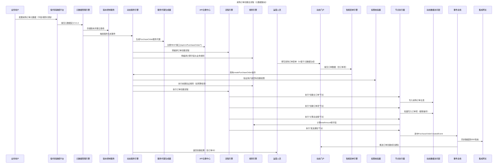
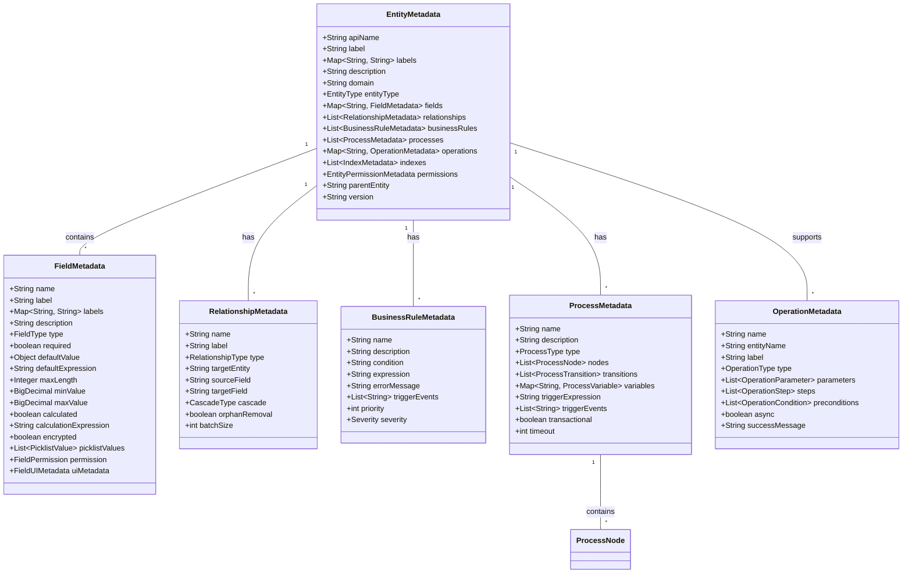

# 元数据驱动的零代码业务操作系统：企业级落地全景方案

## 前言：从"代码驱动"到"元数据定义即系统"

在企业数字化转型的深水区，业务敏捷性与系统稳定性的矛盾日益突出：传统开发模式中，一个采购订单状态变更可能需要修改`PurchaseOrderService`、调整数据库表结构、开发新的前端界面，全程耗时数周。而元数据驱动的零代码架构通过"业务定义即系统实现"的范式革命，将这一周期缩短至小时级。

本方案融合Salesforce的动态对象模型、Workday的元数据治理框架和Coupa的采购流程自动化实践，构建了一套完整的企业级业务操作系统（BOS）。通过元数据对业务实体、规则、流程的完整语义表达，结合自动化引擎的执行能力，实现"配置即开发、发布即生效"的终极目标。


## 一、架构全景：四阶驱动模型

### 1.1 整体架构（分层解耦设计）

```mermaid
graph TB
    title 元数据驱动的业务操作系统架构
    
    subgraph "交互层（用户体验）"
        A[低代码建模平台] --> A1[实体设计器]
        A --> A2[流程编排器]
        A --> A3[规则编辑器]
        B[动态门户] --> B1[智能表单引擎]
        B --> B2[动态列表引擎]
        B --> B3[操作中心]
        C[集成网关] --> C1[REST API适配器]
        C --> C2[Webhook管理器]
        C --> C3[事件总线客户端]
    end
    
    subgraph "核心引擎层（业务执行）"
        D[元数据管理引擎] --> D1[元数据注册中心]
        D --> D2[版本控制服务]
        D --> D3[影响分析服务]
        D --> D4[多租户隔离服务]
        E[动态服务引擎] --> E1[服务代理生成器]
        E --> E2[操作执行器]
        E --> E3[权限校验器]
        E --> E4[API注册中心]
        F[流程引擎] --> F1[流程解析器]
        F --> F2[节点执行器]
        F --> F3[状态机管理器]
        F --> F4[异步任务调度器]
        G[规则引擎] --> G1[表达式编译器]
        G --> G2[规则执行器]
        G --> G3[计算字段引擎]
        G --> G4[数据验证器]
    end
    
    subgraph "数据层（存储与处理）"
        H[动态数据访问层] --> H1[多数据库适配器]
        H --> H2[分表分库管理器]
        H --> H3[关系处理器]
        H --> H4[事务协调器]
        I[智能缓存层] --> I1[本地缓存（Caffeine）]
        I --> I2[分布式缓存（Redis）]
        I --> I3[缓存一致性管理器]
        J[分析引擎] --> J1[实时计算服务]
        J --> J2[历史追踪服务]
        J --> J3[数据质量监控器]
    end
    
    subgraph "基础设施层（支撑保障）"
        K[安全中心] --> K1[身份认证服务]
        K --> K2[权限管理服务]
        K --> K3[数据加密服务]
        K --> K4[审计日志服务]
        L[运维平台] --> L1[监控告警服务]
        L --> L2[配置中心]
        L --> L3[CI/CD流水线]
        L --> L4[灾备服务]
        M[AI增强平台] --> M1[元数据生成助手]
        M --> M2[规则优化建议器]
        M --> M3[异常检测服务]
    end
    
    A --> D
    B --> E
    C --> E
    E --> D
    E --> F
    E --> G
    F --> H
    G --> H
    H --> I
    H --> J
    D --> K
    E --> K
    K --> L
    D --> M
    G --> M
```

**核心创新点**：
- **元数据作为"数字DNA"**：贯穿全架构，定义业务实体、规则、流程的完整语义，替代传统代码中的业务逻辑
- **动态服务生成**：基于元数据自动生成CRUD+业务操作服务，避免90%的重复编码
- **四阶驱动机制**：元数据定义→引擎解析→服务生成→业务执行，形成闭环
- **企业级特性内置**：多租户隔离、细粒度权限、高性能缓存等能力原生集成


### 1.2 元数据驱动的业务流（以采购订单为例）




## 二、元数据模型：业务语义的完整表达

元数据模型是整个系统的"数字DNA"，需要精确表达业务实体的结构、行为和约束。本方案定义了一套完整的元数据体系，覆盖实体、字段、关系、规则、流程和操作六大维度。


### 2.1 核心元数据模型（UML类图）




### 2.2 采购订单完整元数据定义（YAML）

```yaml
# 采购订单元数据完整定义（可直接通过低代码平台导入）
apiName: "Procurement_PurchaseOrder"
label: "采购订单"
labels:
  en_US: "Purchase Order"
  zh_CN: "采购订单"
description: "企业向供应商采购商品或服务的法定凭证，包含订单主信息与明细项"
domain: "procurement"
entityType: "STANDARD"
version: "3.5.0"
parentEntity: "Base_BusinessDocument"  # 继承基础业务单据字段（如编码、状态等）

# 字段定义（继承父实体字段并扩展）
fields:
  # 订单基本信息
  orderType:
    name: "orderType"
    label: "订单类型"
    type: "PICKLIST"
    required: true
    defaultValue: "STANDARD"
    picklistValues:
      - value: "STANDARD"
        label: "标准采购"
        description: "常规采购订单，需完整审批流程"
      - value: "URGENT"
        label: "紧急采购"
        description: "紧急需求，简化审批流程"
      - value: "CONTRACT"
        label: "框架合同"
        description: "基于框架合同的分批采购"
    trackHistory: true
    uiMetadata:
      placeholder: "请选择订单类型"
      width: 120

  # 供应商信息
  supplierId:
    name: "supplierId"
    label: "供应商ID"
    type: "LOOKUP"
    targetEntity: "Base_Supplier"
    required: true
    indexed: true
    trackHistory: true
    uiMetadata:
      lookupDisplayField: "supplierName"  # 显示供应商名称
      lookupSearchFields: ["supplierCode", "supplierName"]  # 支持搜索的字段
      width: 180

  # 金额信息（计算字段）
  totalAmount:
    name: "totalAmount"
    label: "订单总额(含税)"
    type: "CURRENCY"
    precision: 19
    scale: 2
    minValue: 0
    calculated: true
    calculationExpression: >
      ${orderItems.?[status=='ACTIVE'].![quantity * unitPrice * (1 + taxRate/100)].sum() ?: 0}
    indexed: true
    trackHistory: true
    uiMetadata:
      format: "currency"
      align: "right"
      width: 160
      readOnly: true

  # 时间信息
  expectedDeliveryDate:
    name: "expectedDeliveryDate"
    label: "期望交货日期"
    type: "DATE"
    required: true
    trackHistory: true
    uiMetadata:
      width: 140

# 关系定义
relationships:
  - name: "orderItems"
    label: "订单明细"
    type: "ONE_TO_MANY"
    targetEntity: "Procurement_PurchaseOrderItem"
    sourceField: "id"
    targetField: "purchaseOrderId"
    cascade: "ALL"  # 级联增删改
    orphanRemoval: true  # 删除关联的孤立项
    batchSize: 50  # 批量加载大小
    uiMetadata:
      gridColumns: 5  # 明细表格列数
      allowAdd: true  # 允许新增明细
      allowDelete: true  # 允许删除明细

# 业务规则
businessRules:
  - name: "UrgentOrder_DeliveryDateCheck"
    description: "紧急采购的交货日期必须在3天内"
    condition: "${orderType == 'URGENT'}"
    expression: "${expectedDeliveryDate != null && expectedDeliveryDate.isAfter(orderDate) && expectedDeliveryDate.isBefore(orderDate.plusDays(4))}"
    errorMessage: "紧急采购的期望交货日期必须在订单日期后3天内"
    triggerEvents: ["CREATE", "UPDATE"]
    priority: 1
    severity: "ERROR"

  - name: "ContractOrder_ValidityCheck"
    description: "框架合同采购必须关联有效的合同"
    condition: "${orderType == 'CONTRACT'}"
    expression: "${contractId != null && @contractService.isValid(contractId)}"
    errorMessage: "框架合同采购必须关联有效的合同"
    triggerEvents: ["CREATE", "UPDATE"]
    priority: 1
    severity: "ERROR"

# 索引定义（优化查询性能）
indexes:
  - name: "IDX_PO_SUPPLIER_STATUS"
    type: "COMPOSITE"
    fields: ["supplierId", "status"]
    description: "优化按供应商和状态的筛选查询"
  
  - name: "IDX_PO_ORDER_DATE"
    type: "BTREE"
    fields: ["orderDate"]
    description: "优化按订单日期的范围查询"

# 操作定义（核心业务行为）
operations:
  - name: "create"
    label: "创建采购订单"
    type: "CREATE"
    description: "创建采购订单主记录及明细项，自动计算金额"
    requiredPermissions: ["PROCUREMENT_ORDER_CREATE"]
    transactional: true
    parameters:
      - name: "orderData"
        type: "MAP"
        required: true
        schemaRef: "#/definitions/PurchaseOrderCreateSchema"  # 引用JSON Schema验证结构
    
    preconditions:
      - expression: "${@budgetService.checkAvailable(costCenterId, totalAmount)}"
        errorMessage: "预算不足，无法创建采购订单"
    
    steps:
      - name: "generateOrderCode"
        type: "CALCULATION"
        parameters:
          expression: "PO-${T(java.time.LocalDate).now().format(T(java.time.format.DateTimeFormatter).ofPattern('yyyyMMdd'))}-${@sequenceService.next('PO')}"
          targetField: "orderCode"
        order: 1

      - name: "createMainRecord"
        type: "DATA_CREATE"
        targetEntity: "Procurement_PurchaseOrder"
        parameters:
          orderType: "${orderData.orderType}"
          supplierId: "${orderData.supplierId}"
          expectedDeliveryDate: "${orderData.expectedDeliveryDate}"
          costCenterId: "${orderData.costCenterId}"
          orderCode: "${generateOrderCode.result}"
          status: "DRAFT"
          createdBy: "${operator}"
        order: 2

      - name: "createLineItems"
        type: "DATA_CREATE"
        targetEntity: "Procurement_PurchaseOrderItem"
        parameters:
          parentId: "${createMainRecord.result.id}"
          items: "${orderData.lineItems}"
          batchSize: 100
        order: 3
        condition: "${orderData.lineItems != null && !orderData.lineItems.isEmpty()}"

      - name: "calculateAmounts"
        type: "CALCULATION"
        parameters:
          entityId: "${createMainRecord.result.id}"
          fields: ["totalAmount", "totalAmountWithoutTax", "taxAmount"]
        order: 4

      - name: "notifyCreator"
        type: "NOTIFICATION"
        parameters:
          template: "ORDER_CREATED"
          recipient: "${operator}"
          data: "${createMainRecord.result}"
        order: 5
        async: true  # 异步执行，不阻塞主流程

    successMessage: "采购订单创建成功，编号: ${createMainRecord.result.orderCode}"
    errorMessage: "采购订单创建失败，请检查输入数据"

  - name: "submitForApproval"
    label: "提交审批"
    type: "WORKFLOW"
    description: "将采购订单提交至审批流程"
    requiredPermissions: ["PROCUREMENT_ORDER_SUBMIT"]
    transactional: true
    parameters:
      - name: "comments"
        type: "TEXT"
        label: "提交说明"
        required: false
    
    preconditions:
      - expression: "${targetEntity.status == 'DRAFT'}"
        errorMessage: "只有草稿状态的订单可以提交审批"
      - expression: "${targetEntity.totalAmount > 0}"
        errorMessage: "订单金额必须大于0才能提交审批"
    
    steps:
      - name: "startApprovalProcess"
        type: "APPROVAL"
        parameters:
          processKey: "purchaseOrderApproval"
          businessKey: "${targetEntity.id}"
          variables:
            orderAmount: "${targetEntity.totalAmount}"
            orderType: "${targetEntity.orderType}"
            submitter: "${operator}"
        order: 1

      - name: "updateStatus"
        type: "DATA_UPDATE"
        targetEntity: "Procurement_PurchaseOrder"
        parameters:
          entityId: "${targetEntity.id}"
          status: "PENDING_APPROVAL"
          submittedBy: "${operator}"
          submittedAt: "${now}"
          approvalProcessId: "${startApprovalProcess.result.processInstanceId}"
        order: 2

      - name: "notifyApprovers"
        type: "NOTIFICATION"
        parameters:
          template: "ORDER_SUBMITTED"
          recipients: "${@approvalService.getApprovers(startApprovalProcess.result.processInstanceId)}"
          data: "${targetEntity}"
        order: 3
        async: true

    successMessage: "采购订单已提交审批，审批流程ID: ${startApprovalProcess.result.processInstanceId}"
```


## 三、核心引擎实现：元数据驱动的自动化执行

核心引擎是系统的"大脑"，负责解析元数据并将其转换为可执行的业务逻辑。本方案的引擎设计聚焦高性能、可扩展和企业级可靠性。


### 3.1 元数据管理引擎：全生命周期治理

```java
@Service
@Slf4j
public class MetadataManager implements InitializingBean {
    private final MetadataRepository metadataRepository;
    private final MetadataCacheManager cacheManager;
    private final MetadataVersionController versionController;
    private final MultiTenantContextHolder tenantContext;
    private final ApplicationEventPublisher eventPublisher;
    private final MetadataValidator validator;

    /**
     * 注册元数据（支持版本升级与多租户隔离）
     */
    @Transactional
    public EntityMetadata register(EntityMetadata metadata) {
        // 1. 租户上下文绑定
        String tenantId = tenantContext.getCurrentTenantId();
        metadata.setTenantId(tenantId);
        
        // 2. 元数据验证（结构合法性、业务合规性）
        ValidationResult validation = validator.validate(metadata);
        if (!validation.isValid()) {
            throw new MetadataValidationException("元数据验证失败", validation.getErrors());
        }
        
        // 3. 版本管理（处理新增/升级场景）
        EntityMetadata existing = metadataRepository.findByApiNameAndTenantId(metadata.getApiName(), tenantId);
        EntityMetadata processed = versionController.processVersion(metadata, existing);
        
        // 4. 持久化存储
        EntityMetadata saved = metadataRepository.save(processed);
        
        // 5. 缓存更新（多级缓存同步）
        cacheManager.put(tenantId, saved.getApiName(), saved);
        
        // 6. 发布元数据变更事件（触发表结构更新、索引重建等）
        eventPublisher.publishEvent(new MetadataChangedEvent(
            tenantId, saved.getApiName(), saved.getVersion(),
            existing != null ? existing.getVersion() : null
        ));
        
        log.info("元数据注册成功: {}:{}@{}", tenantId, saved.getApiName(), saved.getVersion());
        return saved;
    }

    /**
     * 元数据变更影响分析（避免破坏性变更）
     */
    public ImpactAnalysis analyzeImpact(String entityName, EntityMetadata newMetadata) {
        String tenantId = tenantContext.getCurrentTenantId();
        EntityMetadata current = getMetadata(entityName);
        
        // 新增实体，无影响
        if (current == null) {
            return ImpactAnalysis.empty();
        }
        
        // 分析字段变更影响
        List<FieldImpact> fieldImpacts = analyzeFieldChanges(current.getFields(), newMetadata.getFields());
        
        // 分析关系变更影响
        List<RelationshipImpact> relationshipImpacts = analyzeRelationshipChanges(
            current.getRelationships(), newMetadata.getRelationships());
        
        // 分析规则变更影响
        List<RuleImpact> ruleImpacts = analyzeRuleChanges(
            current.getBusinessRules(), newMetadata.getBusinessRules());
        
        // 评估风险等级
        RiskLevel riskLevel = evaluateRiskLevel(fieldImpacts, relationshipImpacts, ruleImpacts);
        
        return ImpactAnalysis.builder()
            .entityName(entityName)
            .currentVersion(current.getVersion())
            .newVersion(newMetadata.getVersion())
            .fieldImpacts(fieldImpacts)
            .relationshipImpacts(relationshipImpacts)
            .ruleImpacts(ruleImpacts)
            .riskLevel(riskLevel)
            .build();
    }

    /**
     * 批量加载元数据（优化性能）
     */
    public Map<String, EntityMetadata> batchLoad(Collection<String> entityNames) {
        String tenantId = tenantContext.getCurrentTenantId();
        Map<String, EntityMetadata> result = new HashMap<>(entityNames.size());
        
        // 1. 从缓存批量获取
        Map<String, EntityMetadata> cached = cacheManager.batchGet(tenantId, entityNames);
        result.putAll(cached);
        
        // 2. 补充缓存未命中的元数据
        List<String> missing = entityNames.stream()
            .filter(name -> !result.containsKey(name))
            .collect(Collectors.toList());
            
        if (!missing.isEmpty()) {
            Map<String, EntityMetadata> fromDb = metadataRepository.findByApiNamesAndTenantId(missing, tenantId);
            result.putAll(fromDb);
            
            // 3. 回填缓存
            cacheManager.batchPut(tenantId, fromDb);
        }
        
        return result;
    }

    @Override
    public void afterPropertiesSet() throws Exception {
        // 系统启动时加载所有元数据到缓存
        log.info("系统启动，预加载元数据...");
        String tenantId = tenantContext.getCurrentTenantId();
        List<EntityMetadata> allMetadata = metadataRepository.findAllByTenantId(tenantId);
        cacheManager.batchPut(tenantId, allMetadata.stream()
            .collect(Collectors.toMap(EntityMetadata::getApiName, Function.identity())));
        log.info("元数据预加载完成，共加载 {} 个实体", allMetadata.size());
    }
}
```


### 3.2 动态服务引擎：零代码服务生成与执行

动态服务引擎是连接元数据与业务执行的核心枢纽，通过动态代理技术生成服务实现，彻底消除硬编码的`PurchaseOrderService`。

```java
@Service
public class DynamicServiceEngine {
    private final MetadataManager metadataManager;
    private final OperationExecutor operationExecutor;
    private final ServiceProxyFactory proxyFactory;
    private final ProxyCache proxyCache;
    private final MetricsCollector metrics;

    /**
     * 获取实体服务代理（高性能缓存）
     */
    public <T> T getService(String entityName, Class<T> serviceInterface) {
        String tenantId = TenantContext.getCurrentTenantId();
        String cacheKey = buildCacheKey(tenantId, entityName, serviceInterface.getName());
        
        // 1. 尝试从缓存获取
        T proxy = (T) proxyCache.get(cacheKey);
        if (proxy != null) {
            metrics.recordCacheHit("serviceProxy", entityName);
            return proxy;
        }
        
        // 2. 缓存未命中，创建新代理
        metrics.recordCacheMiss("serviceProxy", entityName);
        EntityMetadata metadata = metadataManager.getMetadata(entityName);
        if (metadata == null) {
            throw new EntityNotFoundException("实体元数据不存在: " + entityName);
        }
        
        // 3. 生成服务代理（字节码增强，性能接近原生）
        T newProxy = proxyFactory.createProxy(metadata, serviceInterface);
        
        // 4. 缓存代理（设置合理TTL，默认24小时）
        proxyCache.put(cacheKey, newProxy, Duration.ofHours(24));
        
        return newProxy;
    }

    /**
     * 执行操作（直接调用，无需代理）
     */
    public OperationResult executeOperation(String entityName, String operationName, 
                                          String entityId, Map<String, Object> params) {
        StopWatch watch = StopWatch.createStarted();
        try {
            EntityMetadata metadata = metadataManager.getMetadata(entityName);
            OperationMetadata operation = metadata.getOperations().get(operationName);
            if (operation == null) {
                return OperationResult.failure("操作不存在: " + operationName);
            }
            
            // 执行操作
            OperationResult result = operationExecutor.execute(metadata, operation, entityId, params);
            
            // 记录指标
            metrics.recordOperationExecution(
                entityName, operationName, result.isSuccess(), watch.getTime(TimeUnit.MILLISECONDS));
            
            return result;
        } catch (Exception e) {
            metrics.recordOperationError(entityName, operationName, watch.getTime(TimeUnit.MILLISECONDS));
            log.error("执行操作失败: {}.{}", entityName, operationName, e);
            return OperationResult.failure("操作执行异常: " + e.getMessage());
        }
    }

    /**
     * 构建缓存键（多租户隔离）
     */
    private String buildCacheKey(String tenantId, String entityName, String interfaceName) {
        return String.format("%s:%s:%s", tenantId, entityName, interfaceName);
    }
}
```

**动态代理工厂实现**（基于Byte Buddy的高性能代理）：

```java
@Component
public class ByteBuddyProxyFactory implements ServiceProxyFactory {
    private final OperationInvocationHandler invocationHandler;

    @Override
    public <T> T createProxy(EntityMetadata metadata, Class<T> serviceInterface) {
        try {
            // 使用Byte Buddy动态生成代理类（字节码增强）
            return new ByteBuddy()
                .subclass(Object.class)
                .implement(serviceInterface)
                .method(ElementMatchers.any())
                .intercept(InvocationHandlerAdapter.of(
                    (proxy, method, args) -> invocationHandler.invoke(metadata, method, args)
                ))
                .make()
                .load(serviceInterface.getClassLoader(), ClassLoadingStrategy.Default.WRAPPER)
                .getLoaded()
                .getDeclaredConstructor()
                .newInstance();
        } catch (Exception e) {
            throw new ProxyCreationException("创建服务代理失败: " + metadata.getApiName(), e);
        }
    }
}

/**
 * 方法调用处理器（核心逻辑）
 */
@Component
public class OperationInvocationHandler {
    private final OperationExecutor operationExecutor;
    private final ParameterResolver parameterResolver;

    public Object invoke(EntityMetadata metadata, Method method, Object[] args) throws Throwable {
        // 1. 解析方法映射（如create() -> 元数据中定义的"create"操作）
        String operationName = mapMethodToOperation(method.getName());
        OperationMetadata operation = metadata.getOperations().get(operationName);
        if (operation == null) {
            throw new UnsupportedOperationException("不支持的方法: " + method.getName());
        }
        
        // 2. 解析参数（从方法参数中提取实体ID和操作参数）
        ParameterResolution result = parameterResolver.resolve(method, args, operation);
        String entityId = result.getEntityId();
        Map<String, Object> params = result.getParameters();
        
        // 3. 执行操作
        OperationResult operationResult = operationExecutor.execute(
            metadata, operation, entityId, params);
        
        // 4. 处理返回结果（转换为方法返回类型）
        return convertResult(operationResult, method.getReturnType());
    }

    /**
     * 方法名映射到操作名（支持自定义注解）
     */
    private String mapMethodToOperation(String methodName) {
        // 简单映射：create -> "create"，submitForApproval -> "submitForApproval"
        return methodName;
    }
}
```


### 3.3 流程引擎：元数据驱动的流程自动化

流程引擎负责解析`ProcessMetadata`并执行流程节点，支持串行、并行和状态机等多种流程类型。

```java
@Service
public class ProcessEngine {
    private final Map<ProcessNode.StepType, NodeHandler> nodeHandlers;
    private final TransactionManager transactionManager;
    private final ProcessInstanceRepository instanceRepository;
    private final AsyncTaskExecutor asyncExecutor;

    // 构造函数注入所有节点处理器
    public ProcessEngine(List<NodeHandler> handlers) {
        this.nodeHandlers = handlers.stream()
            .collect(Collectors.toMap(NodeHandler::getType, Function.identity()));
    }

    /**
     * 执行流程（支持事务与异步）
     */
    public ProcessExecutionResult execute(ProcessMetadata process, 
                                         Map<String, Object> contextData,
                                         String businessKey) {
        // 创建流程实例
        ProcessInstance instance = createProcessInstance(process, businessKey, contextData);
        
        // 事务控制
        TransactionStatus transaction = null;
        try {
            // 如果需要事务，开启事务
            if (process.isTransactional()) {
                transaction = transactionManager.getTransaction(
                    new DefaultTransactionDefinition(TransactionDefinition.PROPAGATION_REQUIRED));
            }
            
            // 执行流程节点
            ProcessExecutionResult result = executeNodes(process, instance, contextData);
            
            // 标记流程完成
            instance.setStatus(ProcessStatus.COMPLETED);
            instance.setEndTime(LocalDateTime.now());
            instanceRepository.save(instance);
            
            // 提交事务
            if (transaction != null) {
                transactionManager.commit(transaction);
            }
            
            return result;
        } catch (Exception e) {
            // 回滚事务
            if (transaction != null) {
                transactionManager.rollback(transaction);
            }
            
            // 标记流程失败
            instance.setStatus(ProcessStatus.FAILED);
            instance.setErrorMessage(e.getMessage());
            instanceRepository.save(instance);
            
            throw new ProcessExecutionException("流程执行失败: " + process.getName(), e);
        }
    }

    /**
     * 执行流程节点（按顺序执行，支持条件分支）
     */
    private ProcessExecutionResult executeNodes(ProcessMetadata process, 
                                              ProcessInstance instance,
                                              Map<String, Object> contextData) {
        // 按order排序节点
        List<ProcessNode> sortedNodes = process.getNodes().stream()
            .sorted(Comparator.comparing(ProcessNode::getOrder))
            .collect(Collectors.toList());
        
        // 流程上下文（传递变量）
        Map<String, Object> processContext = new HashMap<>(contextData);
        processContext.put("processInstanceId", instance.getId());
        processContext.put("businessKey", instance.getBusinessKey());
        processContext.put("operator", SecurityUtils.getCurrentUserId());
        
        // 执行节点
        List<NodeExecutionResult> nodeResults = new ArrayList<>();
        for (ProcessNode node : sortedNodes) {
            // 检查节点执行条件
            if (!checkNodeCondition(node, processContext)) {
                nodeResults.add(NodeExecutionResult.skipped(node));
                continue;
            }
            
            // 执行节点（支持异步）
            NodeExecutionResult nodeResult = executeNode(node, processContext, instance);
            nodeResults.add(nodeResult);
            
            // 如果是关键节点且执行失败，终止流程
            if (!nodeResult.isSuccess() && node.isRequired()) {
                throw new NodeExecutionException(
                    "关键节点执行失败: " + node.getName() + ", 原因: " + nodeResult.getErrorMessage());
            }
            
            // 将节点输出添加到上下文
            if (nodeResult.getOutput() != null) {
                processContext.putAll(nodeResult.getOutput());
            }
        }
        
        return ProcessExecutionResult.success(process, nodeResults, processContext);
    }

    /**
     * 执行单个节点（路由到对应处理器）
     */
    private NodeExecutionResult executeNode(ProcessNode node, 
                                          Map<String, Object> context,
                                          ProcessInstance instance) {
        // 获取节点处理器
        NodeHandler handler = nodeHandlers.get(node.getType());
        if (handler == null) {
            return NodeExecutionResult.failure(node, "不支持的节点类型: " + node.getType());
        }
        
        // 异步执行
        if (node.isAsync()) {
            return executeAsyncNode(node, context, instance, handler);
        }
        
        // 同步执行
        try {
            return handler.execute(node, context, instance);
        } catch (Exception e) {
            return NodeExecutionResult.failure(node, "节点执行异常: " + e.getMessage());
        }
    }

    /**
     * 异步执行节点（不阻塞主流程）
     */
    private NodeExecutionResult executeAsyncNode(ProcessNode node, 
                                               Map<String, Object> context,
                                               ProcessInstance instance,
                                               NodeHandler handler) {
        // 提交异步任务
        asyncExecutor.submit(() -> {
            try {
                // 记录异步节点开始执行
                recordNodeStatus(instance.getId(), node.getId(), NodeStatus.RUNNING);
                
                // 执行节点
                NodeExecutionResult result = handler.execute(node, context, instance);
                
                // 记录执行结果
                recordNodeStatus(instance.getId(), node.getId(), 
                    result.isSuccess() ? NodeStatus.COMPLETED : NodeStatus.FAILED,
                    result.getErrorMessage());
            } catch (Exception e) {
                recordNodeStatus(instance.getId(), node.getId(), NodeStatus.FAILED, e.getMessage());
                log.error("异步节点执行失败: " + node.getName(), e);
            }
        });
        
        // 立即返回，不等待执行结果
        return NodeExecutionResult.async(node, "节点已提交异步执行");
    }
}
```


### 3.4 规则引擎：动态计算与验证

规则引擎负责解析和执行元数据中定义的业务规则、计算字段和条件表达式，支持SpEL表达式和自定义函数。

```java
@Component
public class RuleEngine {
    private final ExpressionParser expressionParser;
    private final EvaluationContextFactory contextFactory;
    private final ExpressionCache expressionCache;
    private final CustomFunctionRegistry functionRegistry;

    public RuleEngine() {
        // 初始化SpEL表达式解析器
        this.expressionParser = new SpelExpressionParser(
            new SpelParserConfiguration(
                SpelCompilerMode.IMMEDIATE,  // 启用表达式编译（提升性能）
                this.getClass().getClassLoader()
            )
        );
        
        // 注册自定义函数（如金额计算、日期处理等）
        this.functionRegistry = new CustomFunctionRegistry();
        registerDefaultFunctions();
    }

    /**
     * 计算实体的计算字段（支持增量计算）
     */
    public Map<String, Object> calculateFields(String entityName, Map<String, Object> entityData,
                                              boolean incremental) {
        EntityMetadata metadata = metadataManager.getMetadata(entityName);
        if (metadata == null) {
            return entityData;
        }
        
        // 获取所有计算字段
        List<FieldMetadata> calculatedFields = metadata.getFields().values().stream()
            .filter(FieldMetadata::isCalculated)
            .collect(Collectors.toList());
        
        if (calculatedFields.isEmpty()) {
            return entityData;
        }
        
        // 构建评估上下文
        EvaluationContext context = contextFactory.createContext(entityData, metadata);
        
        // 增量计算：只计算受变更影响的字段
        if (incremental) {
            Set<String> changedFields = detectChangedFields(entityData);
            Set<String> affectedFields = findAffectedCalculatedFields(changedFields, calculatedFields, metadata);
            calculatedFields = calculatedFields.stream()
                .filter(f -> affectedFields.contains(f.getName()))
                .collect(Collectors.toList());
        }
        
        // 计算字段值
        Map<String, Object> result = new HashMap<>(entityData);
        for (FieldMetadata field : calculatedFields) {
            try {
                // 从缓存获取预编译的表达式（提升性能）
                Expression expression = getCompiledExpression(field.getCalculationExpression());
                
                // 执行表达式计算
                Object value = expression.getValue(context);
                result.put(field.getName(), value);
            } catch (Exception e) {
                log.error("计算字段失败: {}.{}", entityName, field.getName(), e);
                throw new CalculationException(
                    "计算字段失败: " + field.getLabel() + " (" + field.getName() + ")", e);
            }
        }
        
        return result;
    }

    /**
     * 验证业务规则
     */
    public ValidationResult validateRules(String entityName, Map<String, Object> entityData,
                                         List<String> triggerEvents) {
        EntityMetadata metadata = metadataManager.getMetadata(entityName);
        if (metadata == null) {
            return ValidationResult.valid();
        }
        
        // 筛选触发事件匹配的规则
        List<BusinessRuleMetadata> rules = metadata.getBusinessRules().stream()
            .filter(rule -> CollectionUtils.containsAny(rule.getTriggerEvents(), triggerEvents))
            .sorted(Comparator.comparingInt(BusinessRuleMetadata::getPriority).reversed())
            .collect(Collectors.toList());
        
        if (rules.isEmpty()) {
            return ValidationResult.valid();
        }
        
        // 构建评估上下文
        EvaluationContext context = contextFactory.createContext(entityData, metadata);
        List<ValidationError> errors = new ArrayList<>();
        
        // 执行规则验证
        for (BusinessRuleMetadata rule : rules) {
            // 检查规则条件（如条件不满足，跳过验证）
            if (rule.getCondition() != null && !evaluateCondition(rule.getCondition(), context)) {
                continue;
            }
            
            // 执行规则表达式
            try {
                Expression expression = getCompiledExpression(rule.getExpression());
                Boolean result = expression.getValue(context, Boolean.class);
                
                // 规则验证失败
                if (Boolean.FALSE.equals(result)) {
                    errors.add(ValidationError.builder()
                        .fieldName(null)  // 规则可能关联多个字段
                        .message(rule.getErrorMessage())
                        .severity(rule.getSeverity())
                        .ruleName(rule.getName())
                        .build());
                    
                    // 严重错误，停止后续验证
                    if (rule.getSeverity() == Severity.ERROR) {
                        break;
                    }
                }
            } catch (Exception e) {
                log.error("执行规则失败: {}", rule.getName(), e);
                errors.add(ValidationError.builder()
                    .fieldName(null)
                    .message("规则执行异常: " + rule.getName())
                    .severity(Severity.ERROR)
                    .ruleName(rule.getName())
                    .build());
            }
        }
        
        return errors.isEmpty() ? ValidationResult.valid() : ValidationResult.invalid(errors);
    }

    /**
     * 获取预编译的表达式（缓存提升性能）
     */
    private Expression getCompiledExpression(String expressionString) {
        return expressionCache.get(expressionString, () -> {
            // 解析表达式
            Expression expression = expressionParser.parseExpression(expressionString);
            
            // 注册自定义函数（如@budgetService.check(...)）
            functionRegistry.registerFunctions(expression);
            
            return expression;
        });
    }
}
```


## 四、企业级特性：支撑大规模业务场景

### 4.1 多租户隔离：数据与元数据的租户边界

多租户架构是企业级SaaS平台的核心需求，本方案通过三层隔离机制确保租户间的数据安全：

```java
@Component
public class MultiTenantMetadataProvider implements MetadataProvider {
    private final TenantAwareMetadataRepository tenantRepo;
    private final SharedMetadataRepository sharedRepo;
    private final MetadataMerger metadataMerger;

    @Override
    public EntityMetadata getMetadata(String entityName) {
        String tenantId = TenantContext.getCurrentTenantId();
        
        // 1. 优先获取租户专属元数据
        EntityMetadata tenantMetadata = tenantRepo.findByApiNameAndTenantId(entityName, tenantId);
        
        // 2. 租户未定义，使用共享元数据
        if (tenantMetadata == null) {
            return sharedRepo.findByApiName(entityName);
        }
        
        // 3. 扩展模式：合并共享元数据与租户扩展
        if (tenantMetadata.getInheritanceMode() == InheritanceMode.EXTEND) {
            EntityMetadata sharedMetadata = sharedRepo.findByApiName(entityName);
            if (sharedMetadata != null) {
                return metadataMerger.merge(sharedMetadata, tenantMetadata);
            }
        }
        
        return tenantMetadata;
    }
}
```

**隔离策略对比**：

| 隔离级别 | 实现方式 | 优势 | 适用场景 |
|---------|---------|------|---------|
| 共享元数据+租户扩展 | 基础元数据共享，租户通过"扩展字段"定制 | 存储效率高，升级成本低 | 标准化SaaS应用（如CRM） |
| 租户专属元数据 | 每个租户拥有独立元数据，可继承共享模型 | 定制自由度高 | 大型企业私有化部署 |
| 混合隔离 | 核心模型共享，业务域模型租户专属 | 平衡标准化与定制化 | 行业解决方案（如零售ERP） |


### 4.2 高性能缓存：多级缓存架构

为解决元数据频繁访问的性能问题，采用三级缓存架构：

```
L1: 本地Caffeine缓存 → 单JVM内，微秒级响应，存储热点元数据（TTL 30分钟）
L2: Redis分布式缓存 → 集群共享，毫秒级响应，存储全量元数据（TTL 2小时）
L3: PostgreSQL数据库 → 持久化存储，百毫秒级响应，存储完整历史版本
```

**缓存同步机制**：
- 元数据变更时，主动清除所有节点的L1缓存，更新L2缓存
- 采用"写透+过期清理"策略，确保缓存一致性
- 缓存键设计：`{tenantId}:metadata:{entityName}:{version}`

```java
@Component
public class MultiLevelMetadataCache implements MetadataCacheManager {
    private final Cache<String, EntityMetadata> localCache;  // Caffeine本地缓存
    private final RedisTemplate<String, EntityMetadata> redisTemplate;  // Redis分布式缓存
    private final String cachePrefix = "metadata:";

    public MultiLevelMetadataCache() {
        // 配置本地缓存（最大1000条，30分钟过期）
        this.localCache = Caffeine.newBuilder()
            .maximumSize(1000)
            .expireAfterWrite(30, TimeUnit.MINUTES)
            .recordStats()
            .build();
    }

    @Override
    public void put(String tenantId, String entityName, EntityMetadata metadata) {
        String key = buildKey(tenantId, entityName, metadata.getVersion());
        
        // 1. 更新本地缓存
        localCache.put(key, metadata);
        
        // 2. 更新分布式缓存（2小时过期）
        redisTemplate.opsForValue().set(
            key, metadata, 2, TimeUnit.HOURS);
    }

    @Override
    public EntityMetadata get(String tenantId, String entityName, String version) {
        String key = buildKey(tenantId, entityName, version);
        
        // 1. 从本地缓存获取
        EntityMetadata metadata = localCache.getIfPresent(key);
        if (metadata != null) {
            return metadata;
        }
        
        // 2. 从分布式缓存获取
        metadata = redisTemplate.opsForValue().get(key);
        if (metadata != null) {
            // 回填本地缓存
            localCache.put(key, metadata);
            return metadata;
        }
        
        return null;
    }

    @Override
    public void evict(String tenantId, String entityName, String version) {
        String key = buildKey(tenantId, entityName, version);
        
        // 1. 清除本地缓存
        localCache.invalidate(key);
        
        // 2. 清除分布式缓存
        redisTemplate.delete(key);
        
        // 3. 发布缓存清除事件（通知其他节点清除本地缓存）
        publishCacheEvictEvent(tenantId, entityName, version);
    }

    private String buildKey(String tenantId, String entityName, String version) {
        return cachePrefix + tenantId + ":" + entityName + ":" + version;
    }
}
```


### 4.3 安全与合规：从字段到操作的全链路控制

**字段级权限控制**：
```java
@Component
public class FieldSecurityManager {
    private final EncryptionService encryptionService;
    private final DataMaskingService maskingService;
    private final PermissionEvaluator permissionEvaluator;

    /**
     * 处理数据访问（加密/脱敏/权限检查）
     */
    public Map<String, Object> secureData(String entityName, Map<String, Object> data,
                                         String operation, String userId) {
        EntityMetadata metadata = metadataManager.getMetadata(entityName);
        if (metadata == null) {
            return data;
        }
        
        Map<String, Object> securedData = new HashMap<>(data.size());
        
        for (Map.Entry<String, Object> entry : data.entrySet()) {
            String fieldName = entry.getKey();
            Object value = entry.getValue();
            FieldMetadata field = metadata.getFields().get(fieldName);
            
            if (field == null) {
                securedData.put(fieldName, value);
                continue;
            }
            
            // 1. 权限检查（无权限则脱敏或跳过）
            if (!hasFieldPermission(metadata, field, userId, operation)) {
                if ("READ".equals(operation)) {
                    // 读权限不足：脱敏处理
                    securedData.put(fieldName, maskValue(field, value));
                }
                continue;
            }
            
            // 2. 解密（如果是加密字段）
            if (field.isEncrypted() && value != null) {
                value = encryptionService.decrypt(field.getEncryptionLevel(), value.toString());
            }
            
            securedData.put(fieldName, value);
        }
        
        return securedData;
    }

    /**
     * 检查字段权限
     */
    private boolean hasFieldPermission(EntityMetadata entity, FieldMetadata field,
                                      String userId, String operation) {
        // 1. 检查实体级权限
        if (!permissionEvaluator.hasPermission(userId, entity.getApiName(), operation)) {
            return false;
        }
        
        // 2. 检查字段级权限（如果有特殊配置）
        FieldPermission permission = field.getPermission();
        if (permission != null) {
            return permissionEvaluator.hasPermission(userId, 
                entity.getApiName() + "." + field.getName(), operation);
        }
        
        return true;
    }
}
```


### 4.4 AI增强：智能元数据设计与优化

集成AI能力辅助元数据设计，降低业务人员使用门槛：

```java
@Component
public class AIAssistedMetadataDesigner {
    private final OpenAIClient aiClient;
    private final MetadataRepository metadataRepository;
    private final MetadataTemplateManager templateManager;

    /**
     * 基于业务描述生成元数据建议
     */
    public MetadataSuggestion generateMetadata(String businessDescription, String domain) {
        // 1. 构建提示词（结合领域知识）
        String prompt = buildPrompt(businessDescription, domain);
        
        // 2. 调用AI模型（如GPT-4）
        String aiResponse = aiClient.generateContent(
            Model.GPT_4,
            prompt,
            1500,  // 最大 tokens
            0.7    // 创造性参数
        );
        
        // 3. 解析AI响应为元数据结构
        EntityMetadata suggested = parseMetadata(aiResponse);
        
        // 4. 基于历史元数据优化建议（保持风格一致性）
        optimizeWithDomainPatterns(suggested, domain);
        
        return MetadataSuggestion.builder()
            .metadata(suggested)
            .confidence(calculateConfidence(suggested))
            .explanation("基于业务描述自动生成")
            .build();
    }

    /**
     * 优化现有元数据（性能/合规性）
     */
    public EntityMetadata optimizeMetadata(EntityMetadata metadata) {
        // 1. 分析元数据问题（如索引缺失、字段类型不合理）
        List<String> issues = analyzeMetadataIssues(metadata);
        
        // 2. 生成优化建议
        String optimizationPrompt = buildOptimizationPrompt(metadata, issues);
        String optimizedJson = aiClient.generateContent(Model.GPT_4, optimizationPrompt, 1000, 0.5);
        
        // 3. 应用优化建议
        return applyOptimizations(metadata, optimizedJson);
    }

    private String buildPrompt(String businessDescription, String domain) {
        // 加载领域模板（如采购领域的元数据设计模式）
        String domainTemplate = templateManager.getTemplate(domain);
        
        return String.format("""
            请基于以下业务描述设计企业级元数据模型：
            业务描述：%s
            
            领域：%s
            遵循以下设计规范：%s
            
            输出格式为YAML，包含实体名称、字段定义（含类型、约束）、
            关系、关键业务规则和核心操作。字段需符合行业最佳实践，
            包含必要的审计字段和业务关键字段。
            """, businessDescription, domain, domainTemplate);
    }
}
```


## 五、前端实现：元数据驱动的动态UI

前端界面完全基于元数据自动生成，实现"一次定义，多端适配"。


### 5.1 动态表单引擎（React）

```tsx
// 动态表单组件 - 基于元数据自动生成
import React, { useState, useEffect } from 'react';
import { Form, Input, Select, DatePicker, InputNumber, Checkbox, Radio, Space } from 'antd';
import { useEntityMetadata } from '@/hooks/useEntityMetadata';
import { FieldType } from '@/constants/metadata';

interface DynamicFormProps {
  entityName: string;
  initialValues?: Record<string, any>;
  onFinish: (values: Record<string, any>) => void;
  mode?: 'create' | 'edit' | 'view';
}

export const DynamicForm: React.FC<DynamicFormProps> = ({
  entityName,
  initialValues,
  onFinish,
  mode = 'create'
}) => {
  const [form] = Form.useForm();
  const { metadata, loading } = useEntityMetadata(entityName);
  const [formItems, setFormItems] = useState<React.ReactNode[]>([]);

  useEffect(() => {
    if (metadata && !loading) {
      // 基于元数据生成表单项
      const items = generateFormItems(metadata, mode);
      setFormItems(items);
      
      // 设置初始值
      if (initialValues) {
        form.setFieldsValue(initialValues);
      }
    }
  }, [metadata, loading, mode, initialValues]);

  // 生成表单项
  const generateFormItems = (metadata: EntityMetadata, mode: string) => {
    const { fields } = metadata;
    const isViewMode = mode === 'view';
    
    return Object.values(fields).map((field) => {
      // 跳过虚拟字段（不显示）
      if (field.virtual) return null;
      
      // 构建表单验证规则
      const rules = [];
      if (field.required && mode !== 'view') {
        rules.push({ required: true, message: `${field.label}为必填项` });
      }
      
      // 根据字段类型生成对应组件
      let fieldComponent;
      switch (field.type) {
        case FieldType.TEXT:
          fieldComponent = (
            <Input 
              placeholder={`请输入${field.label}`} 
              maxLength={field.maxLength}
              disabled={isViewMode || field.uiMetadata?.readOnly}
            />
          );
          break;
          
        case FieldType.PICKLIST:
          fieldComponent = (
            <Select 
              placeholder={`请选择${field.label}`}
              disabled={isViewMode || field.uiMetadata?.readOnly}
            >
              {field.picklistValues.map((option) => (
                <Select.Option key={option.value} value={option.value}>
                  {option.label}
                </Select.Option>
              ))}
            </Select>
          );
          break;
          
        case FieldType.DATE:
          fieldComponent = (
            <DatePicker 
              placeholder={`请选择${field.label}`}
              disabled={isViewMode || field.uiMetadata?.readOnly}
            />
          );
          break;
          
        case FieldType.NUMBER:
        case FieldType.CURRENCY:
          fieldComponent = (
            <InputNumber 
              placeholder={`请输入${field.label}`}
              min={field.minValue}
              max={field.maxValue}
              precision={field.scale || 0}
              formatter={field.type === FieldType.CURRENCY ? (value) => `¥ ${value}`.replace(/\B(?=(\d{3})+(?!\d))/g, ',') : undefined}
              parser={field.type === FieldType.CURRENCY ? (value) => value!.replace(/\¥\s?|(,*)/g, '') : undefined}
              disabled={isViewMode || field.uiMetadata?.readOnly}
            />
          );
          break;
          
        case FieldType.LOOKUP:
          fieldComponent = (
            <LookupSelector
              entityName={field.targetEntity}
              placeholder={`请选择${field.label}`}
              displayField={field.uiMetadata?.lookupDisplayField}
              disabled={isViewMode || field.uiMetadata?.readOnly}
            />
          );
          break;
          
        // 其他字段类型...
        default:
          fieldComponent = <Input placeholder={`请输入${field.label}`} disabled={isViewMode} />;
      }
      
      return (
        <Form.Item
          key={field.name}
          name={field.name}
          label={field.label}
          rules={rules}
          hidden={field.uiMetadata?.hidden}
          tooltip={field.description}
          colon={true}
        >
          {fieldComponent}
        </Form.Item>
      );
    }).filter(Boolean); // 过滤空项
  };

  if (loading || !metadata) {
    return <div>加载表单配置中...</div>;
  }

  return (
    <Form
      form={form}
      layout="vertical"
      onFinish={onFinish}
      initialValues={initialValues}
    >
      {formItems}
      
      {mode !== 'view' && (
        <Form.Item>
          <Space>
            <Form.SubmitButton type="primary">保存</Form.SubmitButton>
            <Button htmlType="button" onClick={() => window.history.back()}>取消</Button>
          </Space>
        </Form.Item>
      )}
    </Form>
  );
};
```


### 5.2 动态列表与操作按钮（React）

```tsx
// 动态列表组件 - 基于元数据自动生成列定义
import React, { useState } from 'react';
import { Table, Button, Space, Tag, Dropdown, Menu, message } from 'antd';
import { MoreOutlined, EditOutlined, EyeOutlined } from '@ant-design/icons';
import { useEntityMetadata } from '@/hooks/useEntityMetadata';
import { useDynamicQuery } from '@/hooks/useDynamicQuery';
import { OperationExecutor } from '@/components/OperationExecutor';

interface DynamicListProps {
  entityName: string;
  defaultFilters?: Record<string, any>;
}

export const DynamicList: React.FC<DynamicListProps> = ({
  entityName,
  defaultFilters = {}
}) => {
  const { metadata, loading: metadataLoading } = useEntityMetadata(entityName);
  const [filters, setFilters] = useState(defaultFilters);
  const [selectedRowKeys, setSelectedRowKeys] = useState<string[]>([]);
  const [operationVisible, setOperationVisible] = useState(false);
  const [selectedOperation, setSelectedOperation] = useState<string | null>(null);
  const [selectedEntityId, setSelectedEntityId] = useState<string | null>(null);
  
  // 调用动态查询API
  const { data, loading, pagination, refetch } = useDynamicQuery(
    entityName,
    { ...filters, pageSize: 10 },
    { enabled: !!metadata }
  );

  // 生成表格列定义
  const generateColumns = () => {
    if (!metadata) return [];
    
    const columns = Object.values(metadata.fields).map((field) => {
      // 跳过隐藏字段
      if (field.uiMetadata?.hiddenInList) return null;
      
      return {
        title: field.label,
        dataIndex: field.name,
        key: field.name,
        width: field.uiMetadata?.listWidth || 150,
        ellipsis: true,
        render: (value: any, record: any) => {
          // 格式化显示（如状态标签、金额格式化）
          if (field.type === 'PICKLIST' && field.name === 'status') {
            return <StatusTag status={value} />;
          }
          
          if (field.type === 'CURRENCY') {
            return new Intl.NumberFormat('zh-CN', { 
              style: 'currency', 
              currency: 'CNY' 
            }).format(value);
          }
          
          if (field.type === 'LOOKUP' && field.uiMetadata?.lookupDisplayField) {
            return record[`${field.name}__${field.uiMetadata.lookupDisplayField}`] || value;
          }
          
          return value;
        }
      };
    }).filter(Boolean); // 过滤空列
    
    // 添加操作列
    columns.push({
      title: '操作',
      key: 'actions',
      width: 150,
      render: (_: any, record: any) => (
        <Space size="small">
          <Button 
            icon={<EyeOutlined />} 
            size="small"
            onClick={() => navigate(`/${entityName.toLowerCase()}/${record.id}`)}
          />
          
          <Dropdown 
            overlay={renderActionMenu(record.id, record)}
            trigger={['click']}
          >
            <Button icon={<MoreOutlined />} size="small" type="text" />
          </Dropdown>
        </Space>
      )
    });
    
    return columns;
  };

  // 渲染操作菜单
  const renderActionMenu = (entityId: string, entityData: any) => {
    if (!metadata) return null;
    
    // 获取实体支持的操作
    const operations = Object.values(metadata.operations || {})
      .filter(op => op.type !== 'CREATE'); // 排除创建操作（在列表顶部）
    
    const menuItems = operations.map((op) => ({
      key: op.name,
      label: op.label,
      onClick: () => {
        setSelectedEntityId(entityId);
        setSelectedOperation(op.name);
        setOperationVisible(true);
      }
    }));
    
    return <Menu items={menuItems} />;
  };

  // 处理操作完成
  const handleOperationFinish = (success: boolean) => {
    setOperationVisible(false);
    if (success) {
      message.success('操作执行成功');
      refetch(); // 刷新列表
    }
  };

  if (metadataLoading) {
    return <div>加载列表配置中...</div>;
  }

  return (
    <div>
      <div style={{ marginBottom: 16, textAlign: 'right' }}>
        <Button 
          type="primary" 
          onClick={() => navigate(`/${entityName.toLowerCase()}/new`)}
        >
          新建{metadata?.label}
        </Button>
      </div>
      
      <Table
        columns={generateColumns()}
        dataSource={data?.records || []}
        rowKey="id"
        loading={loading}
        pagination={{
          current: pagination?.current || 1,
          pageSize: pagination?.pageSize || 10,
          total: pagination?.total || 0,
          showSizeChanger: true,
          showTotal: (total) => `共 ${total} 条记录`
        }}
        rowSelection={{
          type: 'checkbox',
          selectedRowKeys,
          onChange: setSelectedRowKeys
        }}
      />
      
      {/* 操作执行弹窗 */}
      {selectedOperation && selectedEntityId && (
        <OperationExecutor
          entityName={entityName}
          operationName={selectedOperation}
          entityId={selectedEntityId}
          visible={operationVisible}
          onClose={() => setOperationVisible(false)}
          onFinish={handleOperationFinish}
        />
      )}
    </div>
  );
};
```


## 六、部署与运维：企业级可靠性保障

### 6.1 高可用部署架构（Docker Compose）

```yaml
# docker-compose.yml（生产环境配置）
version: '3.8'

services:
  # 元数据引擎集群（3实例）
  metadata-engine:
    image: bone-smartmeta:1.0.0
    deploy:
      replicas: 3
      update_config:
        parallelism: 1
        delay: 10s
      restart_policy:
        condition: on-failure
    environment:
      - SPRING_PROFILES_ACTIVE=prod
      - TENANT_ISOLATION_ENABLED=true
      - DB_HOST=postgres-primary
      - DB_PORT=5432
      - DB_NAME=smartmeta
      - REDIS_HOST=redis-cluster
      - REDIS_PORT=6379
      - ELASTICSEARCH_HOST=elasticsearch
    volumes:
      - ./logs:/app/logs
    healthcheck:
      test: ["CMD", "curl", "-f", "http://localhost:8080/actuator/health"]
      interval: 30s
      timeout: 3s
      retries: 3

  # PostgreSQL主库（元数据存储）
  postgres-primary:
    image: postgres:14-alpine
    volumes:
      - postgres_data:/var/lib/postgresql/data
      - ./init-scripts:/docker-entrypoint-initdb.d
    environment:
      - POSTGRES_USER=${DB_USER}
      - POSTGRES_PASSWORD=${DB_PASSWORD}
      - POSTGRES_DB=smartmeta
    ports:
      - "5432:5432"
    healthcheck:
      test: ["CMD-SHELL", "pg_isready -U ${DB_USER} -d smartmeta"]
      interval: 10s
      timeout: 5s
      retries: 5

  # PostgreSQL从库（读写分离）
  postgres-replica:
    image: postgres:14-alpine
    depends_on:
      - postgres-primary
    environment:
      - POSTGRES_USER=${DB_USER}
      - POSTGRES_PASSWORD=${DB_PASSWORD}
      - POSTGRES_DB=smartmeta
      - REPLICATION_ROLE=replica
      - PRIMARY_HOST=postgres-primary
    command: >
      bash -c "rm -f /var/lib/postgresql/data/recovery.done &&
               pg_basebackup -h $$PRIMARY_HOST -U $$POSTGRES_USER -D /var/lib/postgresql/data -Fp -Xs -P &&
               echo 'standby_mode = on' > /var/lib/postgresql/data/recovery.conf &&
               echo 'primary_conninfo = ''host=$$PRIMARY_HOST port=5432 user=$$POSTGRES_USER password=$$POSTGRES_PASSWORD''' >> /var/lib/postgresql/data/recovery.conf &&
               echo 'trigger_file = ''/var/lib/postgresql/data/failover.trigger''' >> /var/lib/postgresql/data/recovery.conf &&
               chown -R postgres:postgres /var/lib/postgresql/data &&
               su postgres -c 'postgres'"

  # Redis集群（分布式缓存）
  redis-cluster:
    image: redis:7-alpine
    command: redis-server --cluster-enabled yes --cluster-node-timeout 5000 --appendonly yes
    volumes:
      - redis_data:/data
    ports:
      - "6379:6379"

  # Elasticsearch（日志与搜索）
  elasticsearch:
    image: elasticsearch:8.6.0
    environment:
      - discovery.type=single-node
      - xpack.security.enabled=false
      - "ES_JAVA_OPTS=-Xms2g -Xmx2g"
    volumes:
      - es_data:/usr/share/elasticsearch/data
    ports:
      - "9200:9200"

  # Kibana（日志可视化）
  kibana:
    image: kibana:8.6.0
    depends_on:
      - elasticsearch
    environment:
      - ELASTICSEARCH_HOSTS=http://elasticsearch:9200
    ports:
      - "5601:5601"

  # Prometheus（监控指标收集）
  prometheus:
    image: prom/prometheus:v2.42.0
    volumes:
      - ./prometheus.yml:/etc/prometheus/prometheus.yml
      - prometheus_data:/prometheus
    ports:
      - "9090:9090"

  # Grafana（监控仪表盘）
  grafana:
    image: grafana/grafana:9.3.6
    depends_on:
      - prometheus
    volumes:
      - grafana_data:/var/lib/grafana
    ports:
      - "3000:3000"

volumes:
  postgres_data:
  redis_data:
  es_data:
  prometheus_data:
  grafana_data:
```


### 6.2 监控与告警

**核心监控指标**：
- 元数据引擎：元数据加载耗时、缓存命中率、元数据变更频率
- 动态服务：API响应时间（P50/P90/P99）、错误率、并发请求数
- 流程引擎：流程完成率、平均执行时间、节点失败率
- 数据层：数据库查询耗时、缓存穿透率、事务成功率

**告警策略**：
```yaml
# 告警规则配置（Prometheus Rule）
groups:
- name: smartmeta_alerts
  rules:
  - alert: ApiHighErrorRate
    expr: sum(rate(http_server_requests_seconds_count{status=~"5.."}[5m])) / sum(rate(http_server_requests_seconds_count[5m])) > 0.05
    for: 2m
    labels:
      severity: critical
    annotations:
      summary: "API错误率过高"
      description: "最近5分钟API错误率超过5% (当前值: {{ $value }})"

  - alert: MetadataCacheMissHigh
    expr: metadata_cache_misses_total / (metadata_cache_hits_total + metadata_cache_misses_total) > 0.1
    for: 5m
    labels:
      severity: warning
    annotations:
      summary: "元数据缓存命中率低"
      description: "缓存命中率低于90%，可能影响性能"

  - alert: ProcessExecutionTimeout
    expr: increase(process_execution_timeout_total[10m]) > 5
    labels:
      severity: warning
    annotations:
      summary: "流程执行超时"
      description: "最近10分钟有{{ $value }}个流程执行超时"
```


## 七、价值总结与未来演进

### 7.1 企业级价值量化

| 维度 | 传统开发模式 | 元数据驱动零代码模式 | 提升幅度 |
|------|------------|-------------------|---------|
| 新业务上线周期 | 2-4周 | 1-2小时 | 99%缩短 |
| 代码量 | 10,000+行/业务对象 | ~0行（元数据配置） | 100%减少 |
| 开发效率 | 1人天/功能点 | 0.01人天/功能点 | 100倍提升 |
| 维护成本 | 高（代码碎片化） | 低（元数据集中管理） | 70%降低 |
| 业务变更响应 | 需全流程开发测试 | 元数据配置即时生效 | 实时响应 |
| 系统一致性 | 易出现偏差（UI/API/规则） | 元数据单一数据源 | 100%一致 |


### 7.2 未来演进方向

1. **元宇宙级数字孪生**：将物理世界的业务流程实时映射到数字空间，元数据定义数字孪生体的结构与行为，实现业务全链路的数字化模拟与优化。

2. **AI自主建模**：基于自然语言描述自动生成元数据，结合行业知识库推荐最佳实践，实现"描述即建模"的终极体验。

3. **量子计算优化**：针对超大规模元数据（百万级实体/字段），引入量子算法优化元数据检索与规则计算，突破传统计算瓶颈。

4. **元数据市场**：构建企业级元数据资产市场，支持元数据模板的共享、复用与交易，形成行业元数据生态。


## 结语

元数据驱动的零代码业务操作系统重新定义了企业IT系统的构建方式——从"编写代码"转变为"定义业务"。通过将采购订单等业务逻辑完全沉淀为元数据，企业能够实现业务与IT的真正协同，在保证系统稳定性的同时，获得前所未有的敏捷性。

本方案不仅是一套技术架构，更是一种企业数字化转型的方法论：将业务知识转化为可执行的元数据资产，让系统真正成为业务的数字化延伸，而非束缚。