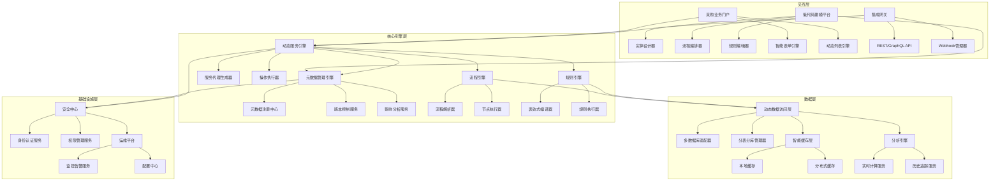
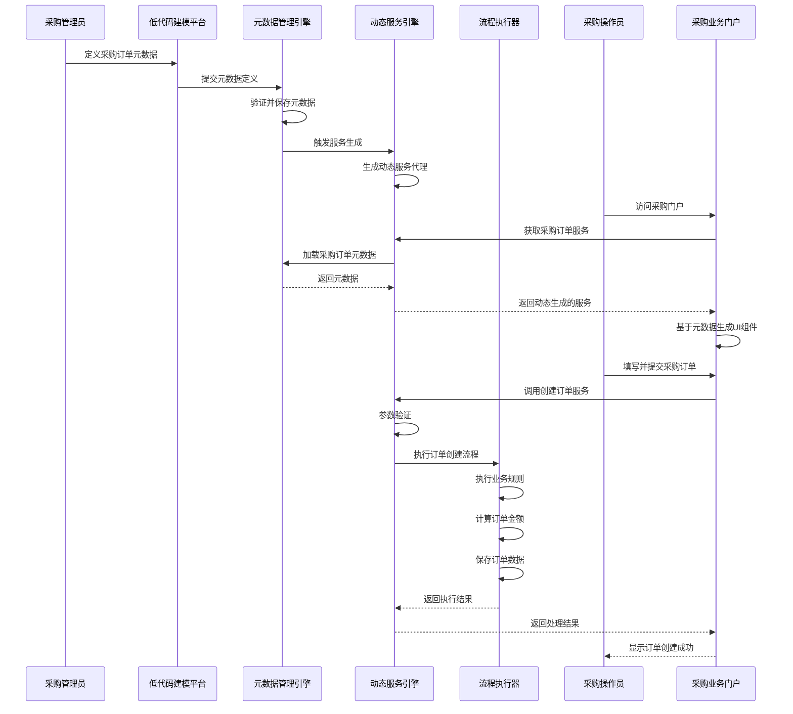
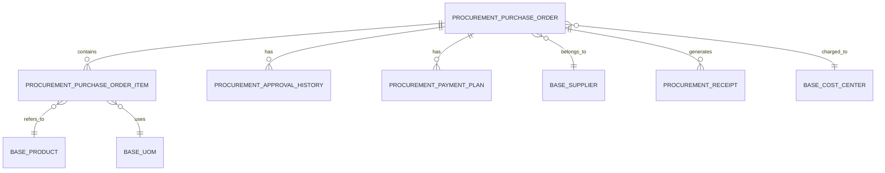
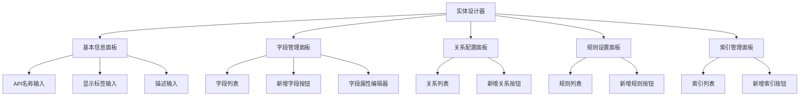
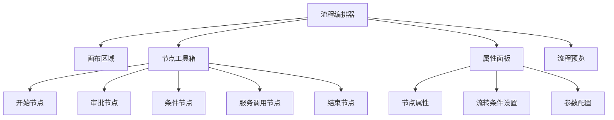
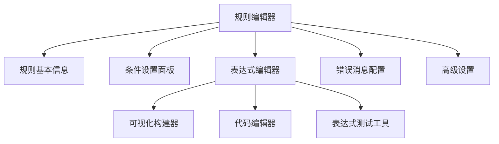

# 采购核心业务模型元数据驱动方案：企业级零代码配置平台

## 1. 方案概述

本方案基于业界最佳实践（Salesforce、Workday、Coupa），构建一套完整的元数据驱动型采购业务操作系统，实现采购核心业务模型、逻辑及规则的动态配置和自动执行。通过低代码建模平台，业务人员可以自主定义业务实体、字段、关系、规则、流程和操作，无需开发人员介入即可完成业务变更和流程优化。

### 1.1 核心价值主张

- **业务敏捷性**：采购业务变更从周级缩短至分钟级，实现"需求即实现"
- **零代码配置**：业务人员通过可视化界面完成所有配置，无需编程
- **统一真相源**：元数据作为唯一的业务定义来源，确保UI、API、存储、规则的一致性
- **企业级保障**：内置多租户隔离、字段级权限、高性能缓存等企业级特性
- **AI增强能力**：集成AI辅助建模、智能规则建议、异常检测等智能化功能

## 2. 系统架构设计

### 2.1 整体架构（四层驱动模型）



### 2.2 元数据驱动的业务流程图



## 3. 元数据模型定义

### 3.1 采购领域实体关系图



### 3.2 采购订单核心元数据定义（YAML）

```yaml
apiName: "Procurement_PurchaseOrder"
label: "采购订单"
labels:
  en_US: "Purchase Order"
  zh_CN: "采购订单"
description: "企业向供应商采购商品或服务的法定凭证，包含订单主信息与明细项"
domain: "procurement"
entityType: "STANDARD"
version: "1.0.0"
parentEntity: "Base_BusinessDocument"  # 继承基础业务单据字段

# 字段定义
fields:
  # 订单基本信息
  orderCode:
    name: "orderCode"
    label: "订单编号"
    type: "TEXT"
    required: true
    unique: true
    maxLength: 50
    defaultExpression: "PO-${T(java.time.LocalDate).now().format(T(java.time.format.DateTimeFormatter).ofPattern('yyyyMMdd'))}-${@sequenceService.next('PO')}"
    pattern: "^PO-\\d{8}-\\d+$"
    indexed: true
    trackHistory: true
    uiMetadata:
      placeholder: "系统自动生成"
      readOnly: true
      width: 180

  orderType:
    name: "orderType"
    label: "订单类型"
    type: "PICKLIST"
    required: true
    defaultValue: "STANDARD"
    picklistValues:
      - value: "STANDARD"
        label: "标准采购"
        description: "常规采购订单"
      - value: "URGENT"
        label: "紧急采购"
        description: "需快速交付的采购"
      - value: "CONTRACT"
        label: "框架合同"
        description: "基于框架合同的采购"
    trackHistory: true
    uiMetadata:
      width: 120

  # 供应商信息
  supplierId:
    name: "supplierId"
    label: "供应商ID"
    type: "LOOKUP"
    targetEntity: "Base_Supplier"
    required: true
    indexed: true
    trackHistory: true
    uiMetadata:
      lookupDisplayField: "supplierName"
      lookupSearchFields: ["supplierCode", "supplierName"]
      width: 180

  # 金额信息（计算字段）
  totalAmount:
    name: "totalAmount"
    label: "订单总额(含税)"
    type: "CURRENCY"
    precision: 19
    scale: 2
    minValue: 0
    calculated: true
    calculationExpression: >
      ${orderItems.?[status=='ACTIVE'].![quantity * unitPrice * (1 + taxRate/100)].sum() ?: 0}
    indexed: true
    trackHistory: true
    uiMetadata:
      format: "currency"
      align: "right"
      width: 160
      readOnly: true

  # 状态信息
  status:
    name: "status"
    label: "订单状态"
    type: "PICKLIST"
    required: true
    defaultValue: "DRAFT"
    picklistValues:
      - value: "DRAFT"
        label: "草稿"
      - value: "PENDING_APPROVAL"
        label: "审批中"
      - value: "APPROVED"
        label: "已批准"
      - value: "REJECTED"
        label: "已拒绝"
      - value: "IN_PROGRESS"
        label: "执行中"
      - value: "COMPLETED"
        label: "已完成"
      - value: "CANCELLED"
        label: "已取消"
    indexed: true
    trackHistory: true
    uiMetadata:
      component: "StatusBadge"
      width: 100

# 关系定义
relationships:
  - name: "orderItems"
    label: "订单明细"
    type: "ONE_TO_MANY"
    targetEntity: "Procurement_PurchaseOrderItem"
    sourceField: "id"
    targetField: "purchaseOrderId"
    cascade: "ALL"
    orphanRemoval: true
    batchSize: 50
    uiMetadata:
      gridColumns: 5
      allowAdd: true
      allowDelete: true

# 业务规则
businessRules:
  - name: "UrgentOrder_DeliveryDateCheck"
    description: "紧急采购的交货日期必须在3天内"
    condition: "${orderType == 'URGENT'}"
    expression: "${expectedDeliveryDate != null && expectedDeliveryDate.isAfter(orderDate) && expectedDeliveryDate.isBefore(orderDate.plusDays(4))}"
    errorMessage: "紧急采购的期望交货日期必须在订单日期后3天内"
    triggerEvents: ["CREATE", "UPDATE"]
    priority: 1
    severity: "ERROR"

  - name: "BudgetCheckRule"
    description: "检查预算是否充足"
    expression: "${@budgetService.checkAvailable(costCenterId, totalAmount)}"
    errorMessage: "预算不足，无法提交订单"
    triggerEvents: ["SUBMIT_FOR_APPROVAL"]
    priority: 2
    severity: "ERROR"

# 操作定义
operations:
  - name: "create"
    label: "创建采购订单"
    type: "CREATE"
    description: "创建采购订单主记录及明细项"
    requiredPermissions: ["PROCUREMENT_ORDER_CREATE"]
    transactional: true
    parameters:
      - name: "orderData"
        type: "MAP"
        required: true
        schemaRef: "#/definitions/PurchaseOrderCreateSchema"
    
    steps:
      - name: "generateOrderCode"
        type: "CALCULATION"
        parameters:
          expression: "PO-${T(java.time.LocalDate).now().format(T(java.time.format.DateTimeFormatter).ofPattern('yyyyMMdd'))}-${@sequenceService.next('PO')}"
          targetField: "orderCode"
        order: 1

      - name: "createMainRecord"
        type: "DATA_CREATE"
        targetEntity: "Procurement_PurchaseOrder"
        parameters:
          orderType: "${orderData.orderType}"
          supplierId: "${orderData.supplierId}"
          expectedDeliveryDate: "${orderData.expectedDeliveryDate}"
          costCenterId: "${orderData.costCenterId}"
          orderCode: "${generateOrderCode.result}"
          status: "DRAFT"
          createdBy: "${operator}"
        order: 2

  - name: "submitForApproval"
    label: "提交审批"
    type: "WORKFLOW"
    description: "将采购订单提交至审批流程"
    requiredPermissions: ["PROCUREMENT_ORDER_SUBMIT"]
    transactional: true
    
    preconditions:
      - expression: "${targetEntity.status == 'DRAFT'}"
        errorMessage: "只有草稿状态的订单可以提交审批"
      - expression: "${targetEntity.totalAmount > 0}"
        errorMessage: "订单金额必须大于0才能提交审批"
    
    steps:
      - name: "startApprovalProcess"
        type: "APPROVAL"
        parameters:
          processKey: "purchaseOrderApproval"
          businessKey: "${targetEntity.id}"
          variables:
            orderAmount: "${targetEntity.totalAmount}"
            orderType: "${targetEntity.orderType}"
            submitter: "${operator}"
        order: 1

      - name: "updateStatus"
        type: "DATA_UPDATE"
        targetEntity: "Procurement_PurchaseOrder"
        parameters:
          entityId: "${targetEntity.id}"
          status: "PENDING_APPROVAL"
        order: 2

# 索引定义
indexes:
  - name: "IDX_PO_SUPPLIER_STATUS"
    type: "COMPOSITE"
    fields: ["supplierId", "status"]
    description: "优化按供应商和状态的查询"
  
  - name: "IDX_PO_ORDER_DATE"
    type: "BTREE"
    fields: ["orderDate"]
    description: "优化按订单日期的范围查询"
```

## 4. 低代码建模平台设计

### 4.1 实体设计器

实体设计器是管理后台的核心组件，允许业务人员通过可视化界面定义采购业务实体的结构和行为。

**核心功能**：
- 实体基本信息配置（名称、标签、描述等）
- 字段定义（类型、约束、默认值、计算表达式等）
- 关系配置（一对一、一对多、多对一、多对多）
- 业务规则设置（验证规则、计算规则等）
- 索引管理（优化查询性能）
- 版本管理（变更追踪、回滚）

**界面设计**：


### 4.2 流程编排器

流程编排器允许业务人员设计采购业务流程，通过拖拽式界面定义流程节点、流转条件和处理逻辑。

**核心功能**：
- 流程模板设计（节点、流转、条件等）
- 审批流程配置（审批人、审批规则、会签/或签等）
- 业务流程自动化（触发条件、处理逻辑等）
- 流程监控和分析

**界面设计**：


### 4.3 规则编辑器

规则编辑器提供直观的界面，允许业务人员配置复杂的业务规则和计算表达式。

**核心功能**：
- 规则条件设置
- 表达式编辑（支持可视化表达式构建器）
- 错误消息配置
- 规则优先级和触发条件设置

**界面设计**：


## 5. 元数据引擎实现

### 5.1 元数据管理引擎

元数据管理引擎负责元数据的完整生命周期管理，包括存储、验证、版本控制和变更通知。

```java
@Service
public class EnhancedMetadataEngine implements MetadataEngine {
    private final MetadataRepository metadataRepository;
    private final MetadataVersionManager versionManager;
    private final MultiTenantManager tenantManager;
    private final MetadataCacheManager cacheManager;
    private final EventPublisher eventPublisher;
    private final MetadataValidator validator;

    /**
     * 注册或更新元数据
     */
    @Transactional
    @Override
    public EntityMetadata register(EntityMetadata metadata) {
        // 1. 租户上下文处理
        String tenantId = tenantManager.getCurrentTenantId();
        metadata.setTenantId(tenantId);
        
        // 2. 元数据验证
        ValidationResult validation = validator.validate(metadata);
        if (!validation.isValid()) {
            throw new MetadataValidationException("元数据验证失败", validation.getErrors());
        }
        
        // 3. 版本管理
        EntityMetadata existing = metadataRepository.findByApiNameAndTenantId(metadata.getApiName(), tenantId);
        EntityMetadata processed = versionManager.processVersion(metadata, existing);
        
        // 4. 存储元数据
        EntityMetadata saved = metadataRepository.save(processed);
        
        // 5. 缓存更新
        cacheManager.put(tenantId, saved.getApiName(), saved);
        
        // 6. 发布元数据变更事件
        eventPublisher.publishEvent(new MetadataChangedEvent(
            tenantId, saved.getApiName(), saved.getVersion(), 
            existing != null ? existing.getVersion() : null
        ));
        
        return saved;
    }

    /**
     * 获取实体元数据
     */
    @Override
    public EntityMetadata getEntityMetadata(String entityName) {
        String tenantId = tenantManager.getCurrentTenantId();
        
        // 先从缓存获取
        EntityMetadata cached = cacheManager.get(tenantId, entityName);
        if (cached != null) {
            return cached;
        }
        
        // 缓存未命中，从数据库获取
        EntityMetadata metadata = metadataRepository.findByApiNameAndTenantId(entityName, tenantId);
        if (metadata != null) {
            // 回填缓存
            cacheManager.put(tenantId, entityName, metadata);
        }
        
        return metadata;
    }
}
```

### 5.2 动态服务引擎

动态服务引擎基于元数据自动生成服务代理，提供CRUD操作和自定义业务操作。

```java
@Service
public class HighPerformanceDynamicServiceEngine {
    private final MetadataEngine metadataEngine;
    private final ProcessExecutionEngine processEngine;
    private final SecurityManager securityManager;
    private final ServiceProxyCache proxyCache;

    /**
     * 获取实体服务代理
     */
    public <T> T getServiceProxy(String entityName, Class<T> serviceInterface) {
        String tenantId = TenantContext.getCurrentTenantId();
        String cacheKey = buildCacheKey(tenantId, entityName, serviceInterface.getName());
        
        // 从缓存获取代理
        T proxy = (T) proxyCache.get(cacheKey);
        if (proxy != null) {
            return proxy;
        }
        
        // 缓存未命中，创建新代理
        EntityMetadata metadata = metadataEngine.getEntityMetadata(entityName);
        if (metadata == null) {
            throw new EntityNotFoundException("实体不存在: " + entityName);
        }
        
        // 使用字节码增强创建高性能代理
        T newProxy = createServiceProxy(metadata, serviceInterface);
        
        // 缓存代理
        proxyCache.put(cacheKey, newProxy, Duration.ofHours(24));
        
        return newProxy;
    }

    /**
     * 执行自定义操作
     */
    public Map<String, Object> executeOperation(String entityName, String operationName, Map<String, Object> params) {
        EntityMetadata metadata = metadataEngine.getEntityMetadata(entityName);
        OperationMetadata operation = metadata.getOperations().get(operationName);
        
        if (operation == null) {
            throw new UnsupportedOperationException("操作不存在: " + operationName);
        }
        
        // 权限检查
        securityManager.checkPermissions(operation.getRequiredPermissions());
        
        // 参数验证
        validateParameters(operation, params);
        
        // 执行操作流程
        return processEngine.executeProcess(operation.getProcessId(), params, buildContext());
    }
}
```

### 5.3 规则引擎

规则引擎负责解析和执行业务规则、计算字段和条件表达式。

```java
@Component
public class RuleEngine {
    private final ExpressionParser expressionParser;
    private final EvaluationContextFactory contextFactory;
    private final ExpressionCache expressionCache;
    private final CustomFunctionRegistry functionRegistry;

    /**
     * 计算实体的计算字段
     */
    public Map<String, Object> calculateFields(String entityName, Map<String, Object> entityData) {
        EntityMetadata metadata = metadataEngine.getEntityMetadata(entityName);
        if (metadata == null) {
            return entityData;
        }
        
        // 获取所有计算字段
        List<FieldMetadata> calculatedFields = metadata.getFields().values().stream()
            .filter(FieldMetadata::isCalculated)
            .collect(Collectors.toList());
        
        if (calculatedFields.isEmpty()) {
            return entityData;
        }
        
        // 创建评估上下文
        EvaluationContext context = contextFactory.createContext(entityData, functionRegistry);
        
        // 计算字段值
        for (FieldMetadata field : calculatedFields) {
            try {
                Expression expression = getCachedExpression(field.getCalculationExpression());
                Object value = expression.getValue(context);
                entityData.put(field.getName(), value);
            } catch (Exception e) {
                log.error("计算字段失败: {}.{} - {}", entityName, field.getName(), e.getMessage());
                // 可以选择设置默认值或抛出异常
            }
        }
        
        return entityData;
    }

    /**
     * 验证业务规则
     */
    public ValidationResult validateBusinessRules(String entityName, Map<String, Object> entityData, String eventType) {
        EntityMetadata metadata = metadataEngine.getEntityMetadata(entityName);
        if (metadata == null) {
            return ValidationResult.success();
        }
        
        List<BusinessRuleMetadata> rules = metadata.getBusinessRules().stream()
            .filter(rule -> rule.getTriggerEvents().contains(eventType))
            .sorted(Comparator.comparingInt(BusinessRuleMetadata::getPriority))
            .collect(Collectors.toList());
        
        ValidationResult result = new ValidationResult();
        EvaluationContext context = contextFactory.createContext(entityData, functionRegistry);
        
        for (BusinessRuleMetadata rule : rules) {
            // 检查规则条件
            if (rule.hasCondition()) {
                Expression conditionExpr = getCachedExpression(rule.getCondition());
                Boolean conditionMet = conditionExpr.getValue(context, Boolean.class);
                if (conditionMet == null || !conditionMet) {
                    continue; // 条件不满足，跳过规则
                }
            }
            
            // 执行规则表达式
            Expression ruleExpr = getCachedExpression(rule.getExpression());
            Boolean valid = ruleExpr.getValue(context, Boolean.class);
            
            if (valid == null || !valid) {
                result.addError(new ValidationError(
                    rule.getName(),
                    rule.getErrorMessage(),
                    rule.getSeverity()
                ));
                
                // 如果是ERROR级别，可以选择提前退出
                if (rule.getSeverity() == Severity.ERROR && result.isFailFast()) {
                    break;
                }
            }
        }
        
        return result;
    }
}
```

## 6. 采购业务门户集成

### 6.1 动态表单引擎

动态表单引擎基于元数据自动生成表单界面，支持字段验证、计算和条件显示。

```typescript
// React组件示例
const DynamicForm = ({ entityName, mode = 'create', initialData = {} }) => {
  // 加载元数据
  const { data: metadata } = useEntityMetadata(entityName);
  const [formData, setFormData] = useState(initialData);
  const [errors, setErrors] = useState({});
  
  // 处理字段变更
  const handleFieldChange = (fieldName, value) => {
    setFormData(prev => ({
      ...prev,
      [fieldName]: value
    }));
    
    // 触发相关字段重新计算
    recalculateFields(fieldName, value);
  };
  
  // 提交表单
  const handleSubmit = async (e) => {
    e.preventDefault();
    
    // 执行客户端验证
    const validationErrors = validateForm();
    if (Object.keys(validationErrors).length > 0) {
      setErrors(validationErrors);
      return;
    }
    
    try {
      // 调用动态服务
      const result = await dynamicService.executeOperation(
        entityName,
        mode === 'create' ? 'create' : 'update',
        formData
      );
      
      // 处理成功结果
      handleSuccess(result);
    } catch (error) {
      // 处理错误
      setErrors({ submit: error.message });
    }
  };
  
  if (!metadata) return <Loading />;
  
  return (
    <Form onSubmit={handleSubmit}>
      {Object.values(metadata.fields).map(field => (
        <FormField
          key={field.name}
          field={field}
          value={formData[field.name]}
          onChange={handleFieldChange}
          error={errors[field.name]}
          mode={mode}
        />
      ))}
      
      {/* 关联子实体表单（如订单项） */}
      {metadata.relationships.map(relationship => (
        <RelationshipForm
          key={relationship.name}
          relationship={relationship}
          parentData={formData}
          onChange={handleRelationshipChange}
        />
      ))}
      
      <FormActions />
    </Form>
  );
};
```

### 6.2 动态列表引擎

动态列表引擎基于元数据自动生成列表视图，支持排序、筛选、分页等功能。

```typescript
const DynamicList = ({ entityName }) => {
  // 加载元数据
  const { data: metadata } = useEntityMetadata(entityName);
  
  // 构建查询参数
  const [queryParams, setQueryParams] = useState(buildDefaultQueryParams(metadata));
  
  // 调用动态列表API
  const { data, loading, pagination, refresh } = useDynamicList(
    entityName,
    queryParams
  );
  
  // 基于元数据生成表格列定义
  const columns = generateColumns(metadata, {
    onView: (id) => navigate(`/${entityName.toLowerCase()}/${id}`),
    onEdit: (id) => navigate(`/${entityName.toLowerCase()}/${id}/edit`),
    onDelete: (id) => handleDelete(id)
  });
  
  // 处理表格变更
  const handleTableChange = (pagination, filters, sorter) => {
    setQueryParams({
      ...queryParams,
      page: pagination.current,
      pageSize: pagination.pageSize,
      filters,
      sorter
    });
  };
  
  if (!metadata) return <Loading />;
  
  return (
    <PageContainer title={metadata.labels?.zh_CN || metadata.label}>
      <ProTable
        columns={columns}
        dataSource={data}
        loading={loading}
        pagination={pagination}
        onChange={handleTableChange}
        rowKey="id"
        toolBarRender={() => [
          <Button 
            type="primary" 
            icon={<PlusOutlined />}
            onClick={() => navigate(`/${entityName.toLowerCase()}/new`)}
          >
            新建{metadata.label}
          </Button>
        ]}
        rowSelection={{
          type: 'checkbox',
          onChange: handleRowSelectionChange
        }}
        tableAlertRender={({ selectedRowKeys }) => (
          <TableAlert
            rowSelection
            selectedRowKeys={selectedRowKeys}
            onClearSelected={() => setSelectedRowKeys([])}
            message={() => (
              <span>
                已选择 {selectedRowKeys.length} 项，
                <a onClick={handleBatchDelete}>批量删除</a>
                <a onClick={handleBatchAction}>批量操作</a>
              </span>
            )}
          />
        )}
      />
    </PageContainer>
  );
};
```

## 7. 部署与集成方案

### 7.1 系统部署架构

```yaml
# docker-compose.yml（简化版）
version: '3.8'
services:
  # 元数据引擎服务
  metadata-engine:
    image: bone-smartmeta-engine:latest
    deploy:
      replicas: 3
      update_config:
        parallelism: 1
        delay: 10s
    environment:
      - SPRING_PROFILES_ACTIVE=prod
      - TENANT_ISOLATION_ENABLED=true
      - REDIS_HOST=redis-cluster
      - DB_HOST=postgres-primary
    healthcheck:
      test: ["CMD", "curl", "-f", "http://localhost:8080/actuator/health"]
      interval: 30s
      timeout: 3s
      retries: 3

  # 低代码建模平台
  lowcode-platform:
    image: bone-lowcode-platform:latest
    deploy:
      replicas: 2
    environment:
      - META_ENGINE_URL=http://metadata-engine:8080
      - REDIS_HOST=redis-cluster

  # 采购业务门户
  procurement-portal:
    image: bone-procurement-portal:latest
    deploy:
      replicas: 2
    environment:
      - META_ENGINE_URL=http://metadata-engine:8080
      - API_GATEWAY_URL=http://api-gateway:8080

  # 数据存储
  postgres-primary:
    image: postgres:14
    volumes:
      - postgres_data:/var/lib/postgresql/data
    environment:
      - POSTGRES_DB=smartmeta
      - POSTGRES_USER=${DB_USER}
      - POSTGRES_PASSWORD=${DB_PASSWORD}

  # 缓存
  redis-cluster:
    image: redis:7-alpine
    command: redis-server --cluster-enabled yes
    volumes:
      - redis_data:/data

volumes:
  postgres_data:
  redis_data:
```

### 7.2 与现有系统集成

元数据驱动的采购业务系统可以与企业现有系统无缝集成，支持多种集成方式：

1. **REST API集成**：提供标准REST API，支持外部系统调用
2. **Webhook机制**：支持事件驱动的系统集成
3. **数据同步**：支持与ERP、WMS等系统的数据同步
4. **单点登录**：支持与企业现有身份认证系统集成

## 8. 最佳实践与建议

### 8.1 元数据设计最佳实践

- **领域驱动设计**：按业务域组织实体和关系
- **适度抽象**：创建基础实体类，通过继承复用通用字段和行为
- **渐进式设计**：先设计核心实体，再逐步扩展相关实体
- **性能优先**：合理使用索引和缓存策略
- **可扩展性**：预留扩展点，支持未来业务增长

### 8.2 实施建议

1. **分阶段实施**：
   - 第一阶段：核心实体模型和基础功能
   - 第二阶段：业务规则和流程自动化
   - 第三阶段：高级特性和系统集成

2. **培训与赋能**：
   - 对业务人员进行低代码平台培训
   - 建立元数据设计评审机制

3. **运维保障**：
   - 建立元数据备份和恢复机制
   - 设置性能监控和告警
   - 定期进行元数据健康检查

## 9. 结论

本方案基于业界最佳实践，构建了一套完整的元数据驱动型采购业务操作系统，实现了采购核心业务模型、逻辑及规则的动态配置和自动执行。通过低代码建模平台，业务人员可以自主定义和维护采购业务，大幅提升业务敏捷性和系统适应性。

系统采用分层架构设计，具备高性能、可扩展、安全可靠等企业级特性，支持多租户、细粒度权限控制、版本管理等高级功能。同时，系统提供丰富的集成接口，可以与企业现有系统无缝集成，为企业数字化转型提供强大支撑。