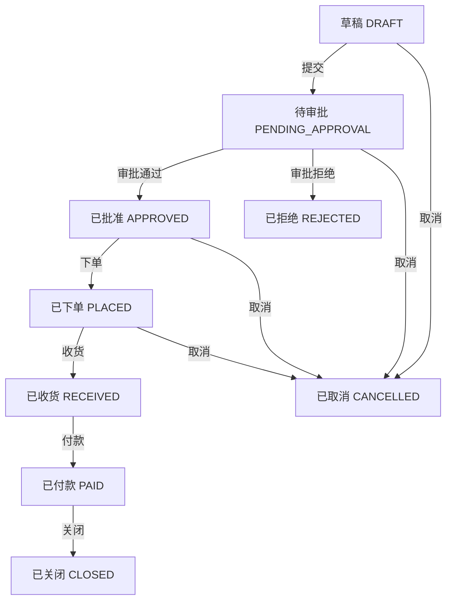
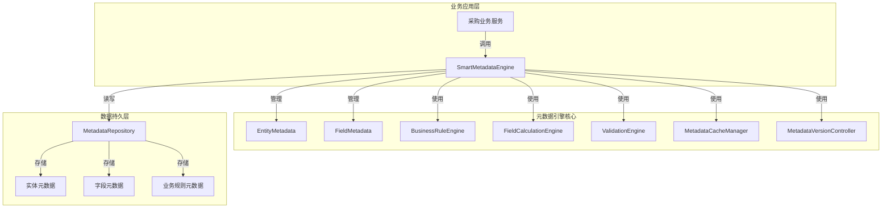
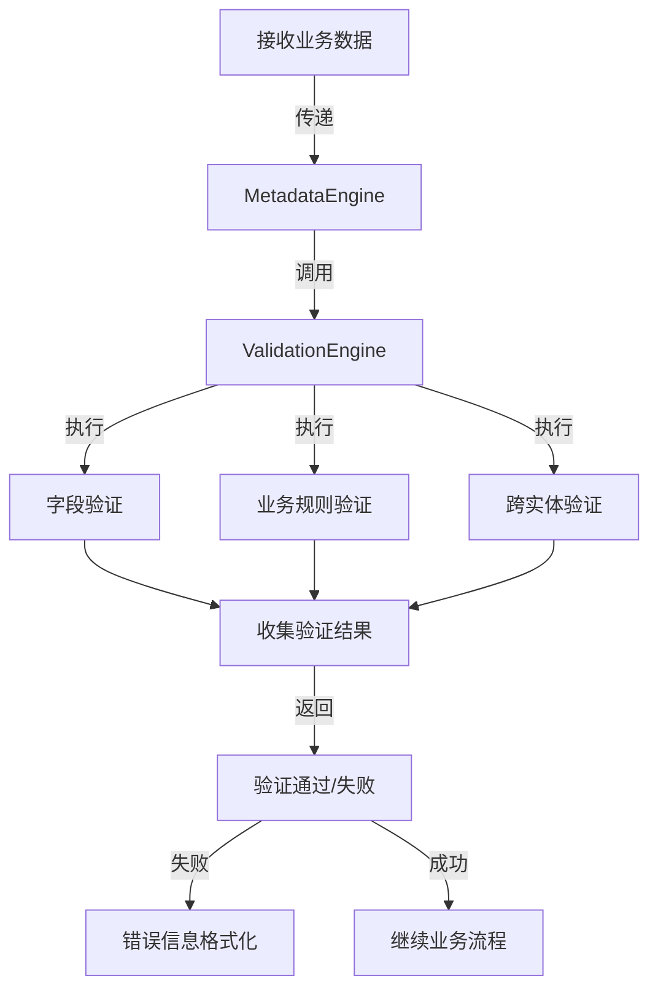

# 采购核心业务模型与元数据引擎集成设计方案

## 一、概述

本文档基于业界最佳实践和企业级应用标准，详细规范采购核心业务模型，并明确元数据引擎与采购业务模块的职责边界，旨在构建一个灵活、可扩展、高性能、安全可靠的企业级采购业务系统。方案涵盖数据模型、业务规则、集成架构、性能优化、安全控制、数据治理等多个维度，为采购业务数字化转型提供完整的技术架构支持。

## 二、采购核心业务模型规范

### 2.1 核心实体定义

#### 2.1.1 采购订单（PurchaseOrder）

采购订单是采购业务的核心实体，代表企业与供应商之间的正式采购协议，包含订单基本信息、供应商信息、金额信息、时间信息等完整业务数据。

```java
@SmartEntity(apiName = "PurchaseOrder", label = "采购订单", description = "企业采购商品或服务的订单记录", category = "采购管理", securityLevel = SecurityLevel.CONFIDENTIAL)
@Data
@Audited // 审计跟踪支持
public class PurchaseOrder extends Entity<Long> {
    
    private Long id;
    
    @SmartField(name = "orderCode", label = "订单编号", type = FieldType.TEXT, required = true, unique = true, length = 50, aiAutoFillEnabled = true, aiPrompt = "生成符合PO+8位日期+4位序号格式的订单编号")
    @BusinessRule(name = "orderCodeRule", expression = "${orderCode} != null && ${orderCode}.matches('PO\\d{8}\\d{4}')", errorMessage = "订单编号格式必须为PO+8位日期+4位序号")
    private String orderCode;
    
    @SmartField(name = "supplierId", label = "供应商ID", type = FieldType.NUMBER, required = true)
    private Long supplierId;
    
    @SmartField(name = "supplierName", label = "供应商名称", type = FieldType.TEXT, required = true, length = 200)
    private String supplierName;
    
    @SmartField(name = "orderType", label = "订单类型", type = FieldType.PICKLIST, required = true, options = {"STANDARD", "EMERGENCY", "ROUTINE", "CONTRACT"})
    @BusinessRule(name = "orderTypeRule", expression = "${orderType} != null && (${orderType}.equals('STANDARD') || ${orderType}.equals('EMERGENCY') || ${orderType}.equals('ROUTINE') || ${orderType}.equals('CONTRACT'))", errorMessage = "订单类型必须为标准采购、紧急采购、日常采购或合同采购")
    private String orderType;
    
    @SmartField(name = "totalAmount", label = "总金额", type = FieldType.CURRENCY, required = true, precision = 19, scale = 2)
    @BusinessRule(name = "totalAmountRule", expression = "${totalAmount} != null && ${totalAmount}.compareTo(java.math.BigDecimal.ZERO) > 0", errorMessage = "总金额必须大于0")
    @BusinessRule(name = "totalAmountPrecisionRule", expression = "${totalAmount} != null && ${totalAmount}.scale() <= 2", errorMessage = "总金额精度不能超过2位小数")
    private BigDecimal totalAmount;
    
    @SmartField(name = "currency", label = "币种", type = FieldType.TEXT, required = true, length = 3, defaultValue = "CNY")
    @BusinessRule(name = "currencyRule", expression = "${currency} != null && ${currency}.matches('[A-Z]{3}')", errorMessage = "币种必须为3位大写字母")
    private String currency;
    
    @SmartField(name = "taxRate", label = "税率", type = FieldType.PERCENTAGE, required = true, min = 0, max = 100, defaultValue = "13")
    @BusinessRule(name = "taxRateRule", expression = "${taxRate} != null && ${taxRate} >= 0 && ${taxRate} <= 100", errorMessage = "税率必须在0-100之间")
    private BigDecimal taxRate;
    
    @SmartField(name = "taxAmount", label = "税额", type = FieldType.CURRENCY, calculated = true)
    private BigDecimal taxAmount;
    
    @SmartField(name = "totalAmountExclTax", label = "不含税金额", type = FieldType.CURRENCY, calculated = true)
    private BigDecimal totalAmountExclTax;
    
    @SmartField(name = "expectedDeliveryDate", label = "期望交货日期", type = FieldType.DATE_TIME)
    private LocalDateTime expectedDeliveryDate;
    
    @SmartField(name = "orderDate", label = "下单日期", type = FieldType.DATE_TIME, required = true, defaultValue = "${now}")
    private LocalDateTime orderDate;
    
    @SmartField(name = "creatorId", label = "创建人ID", type = FieldType.TEXT, required = true, length = 50, defaultValue = "${currentUser}")
    private String creatorId;
    
    @SmartField(name = "departmentId", label = "所属部门ID", type = FieldType.TEXT, required = true, length = 50, defaultValue = "${currentDepartment}")
    private String departmentId;
    
    @SmartField(name = "businessPurpose", label = "业务用途", type = FieldType.TEXT, length = 500)
    private String businessPurpose;
    
    @SmartField(name = "status", label = "订单状态", type = FieldType.PICKLIST, required = true, defaultValue = "DRAFT", options = {"DRAFT", "PENDING_APPROVAL", "APPROVED", "REJECTED", "PLACED", "RECEIVED", "PAID", "CLOSED", "CANCELLED"})
    private String status;
    
    @SmartField(name = "approvalHistory", label = "审批历史", type = FieldType.LIST, elementType = "ApprovalRecord")
    private List<ApprovalRecord> approvalHistory;
    
    @SmartField(name = "items", label = "订单明细", type = FieldType.LIST, elementType = "PurchaseOrderItem", minItems = 1, maxItems = 1000)
    @BusinessRule(name = "orderItemsRule", expression = "${items} != null && !${items}.isEmpty() && ${items}.size() <= 1000", errorMessage = "订单项不能为空且不能超过1000个")
    private List<PurchaseOrderItem> items;
    
    @SmartField(name = "attachments", label = "附件", type = FieldType.LIST, elementType = "Attachment")
    private List<Attachment> attachments;
    
    // 审计字段
    private LocalDateTime createdTime;
    private String createdBy;
    private LocalDateTime updatedTime;
    private String updatedBy;
}
```

#### 2.1.2 采购订单项（PurchaseOrderItem）

采购订单项表示采购订单中的具体商品或服务明细，包含产品信息、数量、价格等详细数据，支持复杂的计算规则和验证逻辑。

```java
@SmartEntity(apiName = "PurchaseOrderItem", label = "采购订单项", description = "采购订单中的商品或服务明细", category = "采购管理")
@Data
@Audited // 审计跟踪支持
public class PurchaseOrderItem extends Entity<Long> {
    
    private Long id;
    
    @SmartField(name = "purchaseOrderId", label = "采购订单ID", type = FieldType.NUMBER, required = true, index = true)
    private Long purchaseOrderId;
    
    @SmartField(name = "productId", label = "产品ID", type = FieldType.TEXT, required = true, length = 50, index = true, aiAutoFillEnabled = true)
    private String productId;
    
    @SmartField(name = "productName", label = "产品名称", type = FieldType.TEXT, required = true, length = 200, aiAutoFillEnabled = true)
    private String productName;
    
    @SmartField(name = "productCategory", label = "产品类别", type = FieldType.TEXT, length = 100, index = true)
    private String productCategory;
    
    @SmartField(name = "quantity", label = "数量", type = FieldType.NUMBER, required = true, min = 1, max = 999999999)
    @BusinessRule(name = "quantityRule", expression = "${quantity} != null && ${quantity} > 0", errorMessage = "数量必须大于0")
    private Integer quantity;
    
    @SmartField(name = "unit", label = "计量单位", type = FieldType.TEXT, required = true, length = 20, defaultValue = "个")
    private String unit;
    
    @SmartField(name = "unitPrice", label = "单价", type = FieldType.CURRENCY, required = true, precision = 19, scale = 4)
    @BusinessRule(name = "unitPriceRule", expression = "${unitPrice} != null && ${unitPrice}.compareTo(java.math.BigDecimal.ZERO) > 0", errorMessage = "单价必须大于0")
    private BigDecimal unitPrice;
    
    @SmartField(name = "amount", label = "金额", type = FieldType.CURRENCY, calculated = true, precision = 19, scale = 2, expression = "${quantity} * ${unitPrice}")
    @BusinessRule(name = "amountCalculationRule", expression = "${amount} == ${quantity} * ${unitPrice}", errorMessage = "金额必须等于数量乘以单价")
    private BigDecimal amount;
    
    @SmartField(name = "taxRate", label = "税率", type = FieldType.PERCENTAGE, precision = 5, scale = 2, defaultValue = "13")
    private BigDecimal taxRate;
    
    @SmartField(name = "taxAmount", label = "税额", type = FieldType.CURRENCY, calculated = true, precision = 19, scale = 2, expression = "${amount} * ${taxRate} / 100")
    private BigDecimal taxAmount;
    
    @SmartField(name = "amountExclTax", label = "不含税金额", type = FieldType.CURRENCY, calculated = true, precision = 19, scale = 2, expression = "${amount} / (1 + ${taxRate}/100)")
    private BigDecimal amountExclTax;
    
    @SmartField(name = "description", label = "描述", type = FieldType.TEXT, length = 500)
    private String description;
    
    @SmartField(name = "specifications", label = "规格型号", type = FieldType.TEXT, length = 200)
    private String specifications;
    
    @SmartField(name = "deliveryDate", label = "交货日期", type = FieldType.DATE_TIME)
    private LocalDateTime deliveryDate;
    
    @SmartField(name = "actualQuantity", label = "实际收货数量", type = FieldType.NUMBER, min = 0)
    private Integer actualQuantity;
    
    @SmartField(name = "status", label = "状态", type = FieldType.PICKLIST, defaultValue = "PENDING", options = {"PENDING", "PARTIAL_RECEIVED", "FULLY_RECEIVED", "CANCELLED"})
    private String status;
    
    // 审计字段
    private LocalDateTime createdTime;
    private String createdBy;
    private LocalDateTime updatedTime;
    private String updatedBy;
}
```

### 2.2 业务规则规范

#### 2.2.1 验证规则

| 规则名称 | 适用实体 | 规则表达式 | 错误消息 | 严重程度 |
|---------|---------|-----------|---------|--------|
| orderCodeRule | PurchaseOrder | `${orderCode} != null && ${orderCode}.matches('PO\\d{8}\\d{4}')` | 订单编号格式必须为PO+8位日期+4位序号 | ERROR |
| totalAmountRule | PurchaseOrder | `${totalAmount} != null && ${totalAmount}.compareTo(java.math.BigDecimal.ZERO) > 0` | 总金额必须大于0 | ERROR |
| orderItemsRule | PurchaseOrder | `${items} != null && !${items}.isEmpty() && ${items}.size() <= 1000` | 订单项不能为空且不能超过1000个 | ERROR |
| emergencyPurchaseRule | PurchaseOrder | `${orderType} == 'EMERGENCY' && ${expectedDeliveryDate} != null && ${expectedDeliveryDate}.isBefore(LocalDateTime.now().plusDays(7))` | 紧急采购的期望交货日期必须在7天内 | WARNING |

#### 2.2.2 审批规则

| 审批级别 | 适用条件 | 审批人角色 | 流程定义 |
|---------|---------|-----------|--------|
| LEVEL_1 | 金额 ≤ 5000元 | 部门经理 | SIMPLE_PURCHASE_FLOW |
| LEVEL_2 | 5000元 < 金额 ≤ 20000元 | 总监 | STANDARD_PURCHASE_FLOW |
| LEVEL_3 | 20000元 < 金额 ≤ 100000元 | 副总经理 | COMPLEX_PURCHASE_FLOW |
| LEVEL_4 | 金额 > 100000元 | 总经理 | VIP_PURCHASE_FLOW |
| EMERGENCY | 紧急采购 | 快速审批通道 | EMERGENCY_PURCHASE_FLOW |

### 2.3 状态流转规范



## 三、元数据引擎实现方案

### 3.1 元数据引擎架构

元数据引擎采用分层架构设计，确保系统的可扩展性、可维护性和性能优化。整体架构分为业务应用层、元数据引擎核心和数据持久层三个主要部分，各层之间通过清晰的接口进行通信，实现高内聚低耦合的设计原则。



#### 3.1.1 分层架构设计

**业务应用层**：包含各种业务服务组件，如采购业务服务，负责与元数据引擎进行交互，处理具体的业务逻辑。

**元数据引擎核心**：元数据引擎的核心部分，包含元数据管理、业务规则引擎、字段计算引擎、验证引擎等关键组件，负责处理元数据的各种操作。

**数据持久层**：负责元数据的存储和检索，通过MetadataRepository统一管理实体元数据、字段元数据和业务规则元数据的持久化操作。

### 3.2 核心组件职责

#### 3.2.1 MetadataEngine

- **职责**：元数据引擎核心类，提供元数据管理的统一入口
- **主要功能**：
  - 元数据注册与管理
  - 元数据查询与缓存
  - 多租户支持
  - 版本控制
  - 事件发布
  - 自定义验证器管理

遵循接口隔离原则，确保模块间的解耦，同时提供全面的元数据操作能力，支持企业级应用的复杂需求。

```java
public interface MetadataEngine {
    /**
     * 注册实体元数据
     * @param metadata 实体元数据对象
     * @return 注册后的实体元数据
     */
    EntityMetadata registerEntityMetadata(EntityMetadata metadata);
    
    /**
     * 获取实体元数据
     * @param entityName 实体名称
     * @return 实体元数据
     * @throws MetadataNotFoundException 当元数据不存在时抛出异常
     */
    EntityMetadata getEntityMetadata(String entityName);
    
    /**
     * 批量获取实体元数据
     * @param entityNames 实体名称集合
     * @return 实体元数据映射
     */
    Map<String, EntityMetadata> batchGetEntityMetadata(Collection<String> entityNames);
    
    /**
     * 验证实体数据
     * @param entityName 实体名称
     * @param entityData 实体数据
     * @return 验证结果
     */
    ValidationResult validateEntity(String entityName, Map<String, Object> entityData);
    
    /**
     * 计算实体字段值
     * @param entityName 实体名称
     * @param entityData 实体数据
     * @return 计算后的实体数据
     */
    Map<String, Object> calculateFields(String entityName, Map<String, Object> entityData);
    
    /**
     * 刷新元数据缓存
     * @param entityName 实体名称
     */
    void refreshMetadataCache(String entityName);
    
    /**
     * 注册自定义验证器
     * @param fieldType 字段类型
     * @param validator 验证器实例
     */
    void registerValidator(String fieldType, FieldValidator validator);
    
    /**
     * 获取实体历史版本元数据
     * @param entityName 实体名称
     * @return 版本历史列表
     */
    List<EntityMetadataVersion> getEntityMetadataVersions(String entityName);
}
```

#### 3.2.2 BusinessRuleEngine

- **职责**：执行业务规则验证和计算
- **主要功能**：
  - 规则解析与执行
  - 表达式计算
  - 规则结果处理

业务规则引擎负责执行定义在元数据中的业务规则，支持条件判断、计算逻辑等操作。采用表达式引擎实现，支持复杂的规则表达式。

```java
public interface RuleEngine {
    /**
     * 执行规则
     * @param entity 实体对象
     * @param rules 规则集合
     * @return 规则执行结果
     */
    RuleExecutionResult execute(Object entity, List<BusinessRule> rules);
    
    /**
     * 注册规则函数
     * @param functionName 函数名称
     * @param function 函数实现
     */
    void registerFunction(String functionName, Function<Object[], Object> function);
}

public class DefaultRuleEngine implements RuleEngine {
    // 表达式编译器
    private final ExpressionCompiler compiler;
    // 规则函数注册表
    private final Map<String, Function<Object[], Object>> functions = new HashMap<>();
    
    public DefaultRuleEngine() {
        this.compiler = new ExpressionCompiler();
        // 注册默认函数
        registerDefaultFunctions();
    }
    
    @Override
    public RuleExecutionResult execute(Object entity, List<BusinessRule> rules) {
        RuleExecutionResult result = new RuleExecutionResult();
        
        for (BusinessRule rule : rules) {
            try {
                // 编译规则表达式
                Expression expression = compiler.compile(rule.getExpression());
                
                // 准备表达式上下文
                Map<String, Object> context = createContext(entity);
                
                // 执行表达式
                Object evaluationResult = expression.evaluate(context);
                
                // 处理执行结果
                if (evaluationResult instanceof Boolean && !(Boolean) evaluationResult) {
                    result.addViolation(rule.getName(), rule.getErrorMessage());
                }
            } catch (Exception e) {
                result.addError(rule.getName(), "规则执行错误: " + e.getMessage());
            }
        }
        
        return result;
    }
    
    @Override
    public void registerFunction(String functionName, Function<Object[], Object> function) {
        functions.put(functionName, function);
        compiler.registerFunction(functionName, function);
    }
    
    private Map<String, Object> createContext(Object entity) {
        Map<String, Object> context = new HashMap<>();
        
        // 将实体的所有字段添加到上下文中
        try {
            for (Field field : entity.getClass().getDeclaredFields()) {
                field.setAccessible(true);
                context.put(field.getName(), field.get(entity));
            }
        } catch (Exception e) {
            // 处理异常
        }
        
        return context;
    }
    
    private void registerDefaultFunctions() {
        // 注册默认函数，如日期处理、字符串操作等
        registerFunction("now", args -> LocalDateTime.now());
        registerFunction("isEmpty", args -> args.length == 0 || args[0] == null || "".equals(args[0]));
        registerFunction("max", args -> {
            if (args.length == 0) return null;
            Comparable max = (Comparable) args[0];
            for (Object arg : args) {
                if (max.compareTo(arg) < 0) {
                    max = (Comparable) arg;
                }
            }
            return max;
        });
        // 注册更多默认函数...
    }
}
```

#### 3.2.3 FieldCalculationEngine

- **职责**：计算实体中的计算字段值
- **主要功能**：
  - 计算字段表达式解析
  - 字段依赖管理
  - 计算结果缓存

#### 3.2.4 ValidationEngine

- **职责**：验证实体数据的合法性
- **主要功能**：
  - 必填字段验证
  - 数据类型验证
  - 业务规则验证
  - 验证结果汇总

验证引擎负责根据元数据定义的数据约束条件验证实体数据的有效性，支持字段级验证和跨字段验证。采用责任链模式设计，支持灵活的验证器扩展。

```java
public interface FieldValidator {
    /**
     * 验证字段值
     * @param fieldValue 字段值
     * @param fieldMetadata 字段元数据
     * @return 验证结果
     */
    ValidationResult validate(Object fieldValue, FieldMetadata fieldMetadata);
}

public class ValidationEngine {
    // 验证器注册表，根据字段类型和验证类型组织
    private final Map<String, Map<String, FieldValidator>> validatorRegistry = new HashMap<>();
    
    /**
     * 注册验证器
     */
    public void registerValidator(String fieldType, String validatorType, FieldValidator validator) {
        validatorRegistry.computeIfAbsent(fieldType, k -> new HashMap<>()).put(validatorType, validator);
    }
    
    /**
     * 执行验证
     */
    public ValidationResult validate(Object entity, EntityMetadata metadata) {
        ValidationResult result = new ValidationResult();
        
        // 遍历所有字段进行验证
        for (FieldMetadata field : metadata.getFields()) {
            Object fieldValue = getFieldValue(entity, field.getName());
            
            // 执行必填验证
            if (field.isRequired() && fieldValue == null) {
                result.addError(field.getName(), "字段必填");
                continue;
            }
            
            // 执行其他验证规则
            if (fieldValue != null) {
                // 根据字段类型和定义的验证规则执行相应验证器
                validateField(fieldValue, field, result);
            }
        }
        
        return result;
    }
    
    private void validateField(Object fieldValue, FieldMetadata field, ValidationResult result) {
        // 执行类型验证
        if (!validateType(fieldValue, field.getType())) {
            result.addError(field.getName(), "字段类型不匹配");
            return;
        }
        
        // 执行长度验证
        if (field.getType() == FieldType.TEXT && field.getLength() > 0) {
            String stringValue = String.valueOf(fieldValue);
            if (stringValue.length() > field.getLength()) {
                result.addError(field.getName(), "字段长度超过限制");
            }
        }
        
        // 执行数值范围验证
        if (field.getMin() != null || field.getMax() != null) {
            validateRange(fieldValue, field.getMin(), field.getMax(), field.getName(), result);
        }
        
        // 执行自定义验证器
        Map<String, FieldValidator> validators = validatorRegistry.get(field.getType());
        if (validators != null) {
            for (Map.Entry<String, FieldValidator> entry : validators.entrySet()) {
                ValidationResult fieldResult = entry.getValue().validate(fieldValue, field);
                if (!fieldResult.isValid()) {
                    result.addErrors(field.getName(), fieldResult.getErrors().get(field.getName()));
                }
            }
        }
    }
    
    // 其他辅助方法
    private boolean validateType(Object value, FieldType type) {
        // 实现类型验证逻辑
        return true;
    }
    
    private void validateRange(Object value, Object min, Object max, String fieldName, ValidationResult result) {
        // 实现数值范围验证逻辑
    }
    
    private Object getFieldValue(Object entity, String fieldName) {
        // 使用反射获取字段值
        try {
            Field field = entity.getClass().getDeclaredField(fieldName);
            field.setAccessible(true);
            return field.get(entity);
        } catch (Exception e) {
            return null;
        }
    }
}

#### 3.2.5 MetadataCacheManager

元数据缓存管理器负责元数据的缓存管理，提高元数据访问性能。采用多级缓存设计，支持缓存预热、过期策略和自动刷新机制，确保数据一致性和高性能。

```java
public interface MetadataCacheManager {
    /**
     * 获取缓存的实体元数据
     * @param key 缓存键
     * @return 实体元数据
     */
    EntityMetadata getMetadata(String key);
    
    /**
     * 缓存实体元数据
     * @param key 缓存键
     * @param metadata 实体元数据
     */
    void putMetadata(String key, EntityMetadata metadata);
    
    /**
     * 移除缓存的实体元数据
     * @param key 缓存键
     */
    void removeMetadata(String key);
    
    /**
     * 刷新所有缓存
     */
    void refreshAll();
    
    /**
     * 获取缓存统计信息
     * @return 缓存统计信息
     */
    CacheStatistics getStatistics();
}

public class MultiLevelMetadataCacheManager implements MetadataCacheManager {
    // 本地缓存（一级缓存）
    private final Cache<String, EntityMetadata> localCache;
    // 分布式缓存（二级缓存）
    private final DistributedCache<String, EntityMetadata> distributedCache;
    // 缓存配置
    private final CacheConfiguration config;
    // 缓存统计
    private final CacheStatistics statistics = new CacheStatistics();
    
    public MultiLevelMetadataCacheManager(CacheConfiguration config, 
                                       DistributedCache<String, EntityMetadata> distributedCache) {
        this.config = config;
        this.distributedCache = distributedCache;
        this.localCache = Caffeine.newBuilder()
                .maximumSize(config.getLocalCacheSize())
                .expireAfterWrite(config.getLocalCacheTtl(), TimeUnit.SECONDS)
                .recordStats()
                .build();
        
        // 初始化缓存预热任务
        initializeCacheWarming();
    }
    
    @Override
    public EntityMetadata getMetadata(String key) {
        long startTime = System.currentTimeMillis();
        
        // 1. 尝试从本地缓存获取
        EntityMetadata metadata = localCache.getIfPresent(key);
        if (metadata != null) {
            statistics.incrementLocalCacheHits();
            return metadata;
        }
        
        // 2. 尝试从分布式缓存获取
        metadata = distributedCache.get(key);
        if (metadata != null) {
            // 更新本地缓存
            localCache.put(key, metadata);
            statistics.incrementDistributedCacheHits();
        } else {
            statistics.incrementCacheMisses();
        }
        
        statistics.recordOperationTime(System.currentTimeMillis() - startTime);
        return metadata;
    }
    
    @Override
    public void putMetadata(String key, EntityMetadata metadata) {
        // 1. 更新本地缓存
        localCache.put(key, metadata);
        // 2. 更新分布式缓存
        distributedCache.put(key, metadata, config.getDistributedCacheTtl());
        statistics.incrementPuts();
    }
    
    @Override
    public void removeMetadata(String key) {
        // 1. 移除本地缓存
        localCache.invalidate(key);
        // 2. 移除分布式缓存
        distributedCache.remove(key);
        statistics.incrementRemovals();
    }
    
    @Override
    public void refreshAll() {
        // 清空本地缓存
        localCache.invalidateAll();
        // 触发分布式缓存刷新
        distributedCache.refreshAll();
        // 重新预热缓存
        warmupCache();
        statistics.incrementRefreshes();
    }
    
    @Override
    public CacheStatistics getStatistics() {
        return new CacheStatistics(statistics);
    }
    
    private void initializeCacheWarming() {
        // 使用定时任务定期预热缓存
        ScheduledExecutorService scheduler = Executors.newSingleThreadScheduledExecutor();
        scheduler.scheduleAtFixedRate(this::warmupCache, 
                                     config.getWarmupInterval(), 
                                     config.getWarmupInterval(), 
                                     TimeUnit.SECONDS);
    }
    
    private void warmupCache() {
        // 实现缓存预热逻辑，例如从数据库加载常用的元数据
        List<String> criticalEntities = Arrays.asList("PurchaseOrder", "PurchaseOrderItem");
        for (String entityName : criticalEntities) {
            String key = buildCacheKey(entityName, "latest");
            // 从元数据仓库加载并缓存
            // metadataRepository.getEntityMetadata(entityName, "latest").ifPresent(m -> putMetadata(key, m));
        }
    }
    
    private String buildCacheKey(String entityName, String version) {
        return entityName + ":" + version;
    }
    
    public static class CacheStatistics {
        private AtomicLong localCacheHits = new AtomicLong(0);
        private AtomicLong distributedCacheHits = new AtomicLong(0);
        private AtomicLong cacheMisses = new AtomicLong(0);
        private AtomicLong puts = new AtomicLong(0);
        private AtomicLong removals = new AtomicLong(0);
        private AtomicLong refreshes = new AtomicLong(0);
        private AtomicLong totalOperationTime = new AtomicLong(0);
        private AtomicLong operationCount = new AtomicLong(0);
        
        // 构造函数、getter方法等
        
        public void incrementLocalCacheHits() { localCacheHits.incrementAndGet(); }
        public void incrementDistributedCacheHits() { distributedCacheHits.incrementAndGet(); }
        public void incrementCacheMisses() { cacheMisses.incrementAndGet(); }
        public void incrementPuts() { puts.incrementAndGet(); }
        public void incrementRemovals() { removals.incrementAndGet(); }
        public void incrementRefreshes() { refreshes.incrementAndGet(); }
        public void recordOperationTime(long time) { 
            totalOperationTime.addAndGet(time); 
            operationCount.incrementAndGet(); 
        }
        
        public double getHitRate() {
            long totalRequests = localCacheHits.get() + distributedCacheHits.get() + cacheMisses.get();
            return totalRequests > 0 ? (double)(localCacheHits.get() + distributedCacheHits.get()) / totalRequests : 0;
        }
        
        public long getAverageOperationTime() {
            return operationCount.get() > 0 ? totalOperationTime.get() / operationCount.get() : 0;
        }
    }
}
```

#### 3.2.6 MetadataRepository

元数据仓库负责元数据的持久化存储和检索，是元数据引擎与数据库交互的接口。采用仓储模式设计，支持元数据的CRUD操作、版本管理和多租户隔离。

```java
public interface MetadataRepository {
    /**
     * 保存实体元数据
     * @param metadata 实体元数据
     * @return 保存后的实体元数据
     */
    EntityMetadata saveEntityMetadata(EntityMetadata metadata);
    
    /**
     * 获取实体元数据
     * @param entityName 实体名称
     * @param version 版本号
     * @return 实体元数据
     */
    Optional<EntityMetadata> getEntityMetadata(String entityName, String version);
    
    /**
     * 获取实体的最新版本元数据
     * @param entityName 实体名称
     * @return 最新版本的实体元数据
     */
    Optional<EntityMetadata> getLatestEntityMetadata(String entityName);
    
    /**
     * 获取实体的所有版本
     * @param entityName 实体名称
     * @return 实体版本列表
     */
    List<EntityMetadata> getEntityVersions(String entityName);
    
    /**
     * 删除实体元数据
     * @param entityName 实体名称
     * @param version 版本号
     * @return 是否删除成功
     */
    boolean deleteEntityMetadata(String entityName, String version);
    
    /**
     * 列出所有实体元数据
     * @param pageable 分页参数
     * @return 实体元数据分页结果
     */
    Page<EntityMetadata> listEntityMetadata(Pageable pageable);
    
    /**
     * 按条件查询实体元数据
     * @param criteria 查询条件
     * @param pageable 分页参数
     * @return 实体元数据分页结果
     */
    Page<EntityMetadata> findEntityMetadata(MetadataCriteria criteria, Pageable pageable);
    
    /**
     * 检查实体元数据是否存在
     * @param entityName 实体名称
     * @param version 版本号
     * @return 是否存在
     */
    boolean exists(String entityName, String version);
}

public class JpaMetadataRepository implements MetadataRepository {
    // JPA实体管理器
    private final EntityManager entityManager;
    // 租户ID解析器
    private final TenantIdResolver tenantIdResolver;
    // 版本生成器
    private final VersionGenerator versionGenerator;
    
    @Autowired
    public JpaMetadataRepository(EntityManager entityManager, 
                                TenantIdResolver tenantIdResolver, 
                                VersionGenerator versionGenerator) {
        this.entityManager = entityManager;
        this.tenantIdResolver = tenantIdResolver;
        this.versionGenerator = versionGenerator;
    }
    
    @Override
    @Transactional
    public EntityMetadata saveEntityMetadata(EntityMetadata metadata) {
        // 设置租户ID
        String tenantId = tenantIdResolver.getCurrentTenantId();
        metadata.setTenantId(tenantId);
        
        // 生成版本号（如果是新版本）
        if (metadata.getVersion() == null || metadata.getVersion().equals("latest")) {
            String newVersion = versionGenerator.generateVersion(metadata.getEntityName());
            metadata.setVersion(newVersion);
        }
        
        // 设置时间戳
        if (metadata.getCreatedAt() == null) {
            metadata.setCreatedAt(LocalDateTime.now());
        }
        metadata.setUpdatedAt(LocalDateTime.now());
        
        // 保存到数据库
        return entityManager.merge(metadata);
    }
    
    @Override
    public Optional<EntityMetadata> getEntityMetadata(String entityName, String version) {
        String tenantId = tenantIdResolver.getCurrentTenantId();
        
        TypedQuery<EntityMetadata> query = entityManager.createQuery(
            "SELECT m FROM EntityMetadata m WHERE m.entityName = :entityName AND m.version = :version AND m.tenantId = :tenantId", 
            EntityMetadata.class
        );
        query.setParameter("entityName", entityName);
        query.setParameter("version", version);
        query.setParameter("tenantId", tenantId);
        
        try {
            return Optional.of(query.getSingleResult());
        } catch (NoResultException e) {
            return Optional.empty();
        }
    }
    
    @Override
    public Optional<EntityMetadata> getLatestEntityMetadata(String entityName) {
        String tenantId = tenantIdResolver.getCurrentTenantId();
        
        TypedQuery<EntityMetadata> query = entityManager.createQuery(
            "SELECT m FROM EntityMetadata m WHERE m.entityName = :entityName AND m.tenantId = :tenantId ORDER BY m.createdAt DESC", 
            EntityMetadata.class
        );
        query.setParameter("entityName", entityName);
        query.setParameter("tenantId", tenantId);
        query.setMaxResults(1);
        
        List<EntityMetadata> results = query.getResultList();
        return results.isEmpty() ? Optional.empty() : Optional.of(results.get(0));
    }
    
    @Override
    public List<EntityMetadata> getEntityVersions(String entityName) {
        String tenantId = tenantIdResolver.getCurrentTenantId();
        
        TypedQuery<EntityMetadata> query = entityManager.createQuery(
            "SELECT m FROM EntityMetadata m WHERE m.entityName = :entityName AND m.tenantId = :tenantId ORDER BY m.createdAt DESC", 
            EntityMetadata.class
        );
        query.setParameter("entityName", entityName);
        query.setParameter("tenantId", tenantId);
        
        return query.getResultList();
    }
    
    @Override
    @Transactional
    public boolean deleteEntityMetadata(String entityName, String version) {
        String tenantId = tenantIdResolver.getCurrentTenantId();
        
        Query query = entityManager.createQuery(
            "DELETE FROM EntityMetadata m WHERE m.entityName = :entityName AND m.version = :version AND m.tenantId = :tenantId"
        );
        query.setParameter("entityName", entityName);
        query.setParameter("version", version);
        query.setParameter("tenantId", tenantId);
        
        int deletedCount = query.executeUpdate();
        return deletedCount > 0;
    }
    
    @Override
    public Page<EntityMetadata> listEntityMetadata(Pageable pageable) {
        String tenantId = tenantIdResolver.getCurrentTenantId();
        
        TypedQuery<EntityMetadata> query = entityManager.createQuery(
            "SELECT m FROM EntityMetadata m WHERE m.tenantId = :tenantId ORDER BY m.createdAt DESC", 
            EntityMetadata.class
        );
        query.setParameter("tenantId", tenantId);
        
        // 应用分页
        query.setFirstResult((int) pageable.getOffset());
        query.setMaxResults(pageable.getPageSize());
        
        List<EntityMetadata> content = query.getResultList();
        
        // 获取总数
        TypedQuery<Long> countQuery = entityManager.createQuery(
            "SELECT COUNT(m) FROM EntityMetadata m WHERE m.tenantId = :tenantId", 
            Long.class
        );
        countQuery.setParameter("tenantId", tenantId);
        long total = countQuery.getSingleResult();
        
        return new PageImpl<>(content, pageable, total);
    }
    
    @Override
    public Page<EntityMetadata> findEntityMetadata(MetadataCriteria criteria, Pageable pageable) {
        // 实现复杂条件查询逻辑
        // ...
        return null; // 简化实现
    }
    
    @Override
    public boolean exists(String entityName, String version) {
        return getEntityMetadata(entityName, version).isPresent();
    }
}
```

## 四、采购业务系统任务

### 4.1 核心业务功能

1. **采购订单管理**
   - 创建、更新、查询、取消、关闭订单
   - 订单状态管理
   - 订单历史记录

2. **审批流程处理**
   - 提交审批
   - 审批处理
   - 审批历史记录

3. **供应商管理**
   - 供应商信息维护
   - 供应商评估

4. **统计分析**
   - 订单统计
   - 采购分析

### 4.2 与元数据引擎的集成点

1. **实体定义集成**
   - 使用@SmartEntity、@SmartField、@BusinessRule注解定义实体
   - 实体元数据注册到元数据引擎

2. **业务规则集成**
   - 通过元数据引擎执行业务规则验证
   - 审批规则的动态配置

3. **动态模型支持**
   - 通过DynamicModelManager管理动态模型
   - 通过DynamicModelDataService处理动态数据

4. **事件集成**
   - 订阅元数据变更事件
   - 发布业务事件

## 五、职责边界界定

### 5.1 元数据引擎职责范围

1. **元数据管理**
   - 元数据的存储、查询、更新
   - 元数据版本控制
   - 多租户元数据隔离

2. **数据验证**
   - 基于元数据的字段验证
   - 业务规则执行
   - 验证结果处理

3. **字段计算**
   - 计算字段值
   - 表达式求值
   - 依赖字段管理

4. **缓存优化**
   - 元数据缓存管理
   - 性能优化

5. **扩展性支持**
   - 插件机制
   - 自定义处理器

### 5.2 采购业务模块职责范围

1. **业务逻辑实现**
   - 采购订单业务流程
   - 审批流程处理
   - 业务状态管理

2. **服务接口提供**
   - RESTful API
   - 业务服务层

3. **数据持久化**
   - 业务数据CRUD
   - 事务管理

4. **业务规则定义**
   - 定义业务规则表达式
   - 配置验证规则

5. **集成与扩展**
   - 与其他系统集成
   - 自定义业务逻辑

遵循领域驱动设计原则，实现高内聚低耦合的业务服务。

### 5.3 边界接口定义

元数据引擎与采购业务模块之间的交互通过定义明确的接口进行，确保模块间的解耦。采用API网关模式，提供标准化的接口契约和版本管理。

```java
// 采购业务模块调用元数据引擎的主要接口
public interface PurchaseMetadataService {
    
    // 验证采购订单
    ValidationResult validatePurchaseOrder(PurchaseOrder order);
    
    // 计算订单字段
    void calculateOrderFields(PurchaseOrder order);
    
    // 获取订单的业务规则
    List<BusinessRule> getOrderBusinessRules();
    
    // 更新订单元数据
    void updateOrderMetadata(EntityMetadata metadata);
}

// 元数据引擎回调采购业务模块的接口
public interface PurchaseBusinessCallback {
    
    // 元数据变更时的回调
    void onMetadataChanged(MetadataChangeEvent event);
    
    // 自定义规则执行
    RuleExecutionResult executeCustomRule(String ruleName, Map<String, Object> context);
}

// 扩展的元数据服务接口
public interface EnhancedMetadataService {
    /**
     * 获取实体元数据
     * @param entityName 实体名称
     * @param version 版本号（可选）
     * @return 实体元数据
     * @throws MetadataNotFoundException 当元数据不存在时抛出异常
     */
    EntityMetadata getEntityMetadata(String entityName, String version);
    
    /**
     * 验证实体数据
     * @param entityName 实体名称
     * @param entityData 实体数据
     * @param version 版本号（可选）
     * @return 验证结果
     */
    ValidationResult validateEntity(String entityName, Map<String, Object> entityData, String version);
    
    /**
     * 批量验证实体数据
     * @param entityName 实体名称
     * @param entityDataList 实体数据列表
     * @param version 版本号（可选）
     * @return 批量验证结果
     */
    List<ValidationResult> batchValidateEntity(String entityName, List<Map<String, Object>> entityDataList, String version);
    
    /**
     * 执行业务规则
     * @param entityName 实体名称
     * @param entityData 实体数据
     * @param ruleNames 规则名称列表（可选，为空时执行所有规则）
     * @param version 版本号（可选）
     * @return 规则执行结果
     */
    RuleExecutionResult executeRules(String entityName, Map<String, Object> entityData, List<String> ruleNames, String version);
    
    /**
     * 计算实体字段
     * @param entityName 实体名称
     * @param entityData 实体数据
     * @param version 版本号（可选）
     * @return 计算后的实体数据
     */
    Map<String, Object> calculateEntityFields(String entityName, Map<String, Object> entityData, String version);
    
    /**
     * 获取实体支持的操作列表
     * @param entityName 实体名称
     * @param version 版本号（可选）
     * @return 操作列表
     */
    List<EntityOperation> getEntityOperations(String entityName, String version);
}

// 集成适配器示例
public class PurchaseOrderMetadataAdapter {
    private final EnhancedMetadataService metadataService;
    
    @Autowired
    public PurchaseOrderMetadataAdapter(EnhancedMetadataService metadataService) {
        this.metadataService = metadataService;
    }
    
    /**
     * 验证采购订单
     */
    public ValidationResult validatePurchaseOrder(PurchaseOrder order) {
        Map<String, Object> orderData = convertToMap(order);
        return metadataService.validateEntity("PurchaseOrder", orderData, "latest");
    }
    
    /**
     * 计算采购订单字段
     */
    public void calculatePurchaseOrderFields(PurchaseOrder order) {
        Map<String, Object> orderData = convertToMap(order);
        Map<String, Object> calculatedData = metadataService.calculateEntityFields("PurchaseOrder", orderData, "latest");
        updateFromMap(order, calculatedData);
    }
    
    /**
     * 执行采购订单业务规则
     */
    public RuleExecutionResult executePurchaseOrderRules(PurchaseOrder order) {
        Map<String, Object> orderData = convertToMap(order);
        return metadataService.executeRules("PurchaseOrder", orderData, null, "latest");
    }
    
    // 辅助方法
    private Map<String, Object> convertToMap(PurchaseOrder order) {
        // 使用BeanUtils或Jackson将对象转换为Map
        ObjectMapper mapper = new ObjectMapper();
        try {
            return mapper.convertValue(order, new TypeReference<Map<String, Object>>() {});
        } catch (Exception e) {
            throw new RuntimeException("Failed to convert PurchaseOrder to Map", e);
        }
    }
    
    private void updateFromMap(PurchaseOrder order, Map<String, Object> data) {
        // 使用BeanUtils或Jackson将Map更新到对象
        ObjectMapper mapper = new ObjectMapper();
        try {
            mapper.updateValue(order, data);
        } catch (Exception e) {
            throw new RuntimeException("Failed to update PurchaseOrder from Map", e);
        }
    }
}

## 六、详细设计方案

### 6.1 实体元数据定义

1. **使用注解定义实体**
   - @SmartEntity：定义实体基本信息
   - @SmartField：定义字段属性和约束
   - @BusinessRule：定义业务规则

2. **运行时元数据注册**
   - 启动时自动扫描并注册实体元数据
   - 支持动态更新元数据

### 6.2 业务规则实现

采购业务的业务规则通过元数据引擎实现，包括字段验证规则、业务逻辑规则等。采用规则引擎模式，支持规则的动态配置和热更新。

1. **基于表达式的规则引擎**
   - 使用SpEL或MVEL表达式
   - 支持复杂条件和函数调用

2. **规则管理界面**
   - 可视化规则配置
   - 规则版本管理

#### 6.2.1 采购订单业务规则

采购订单业务规则包括订单编号格式验证、金额验证、审批流程规则等。采用基于事件的规则触发机制，确保规则的及时执行和一致性。

```java
public class PurchaseOrderBusinessRules {
    // 订单编号格式规则
    @BusinessRule(name = "orderNoFormatRule", 
                 expression = "${orderNo} != null && ${orderNo}.matches('PO\\d{12}')", 
                 errorMessage = "订单编号格式不正确，应为PO开头后接12位数字",
                 priority = 1,
                 eventType = "CREATE")
    public static final String ORDER_NO_FORMAT_RULE = "orderNoFormatRule";
    
    // 订单金额验证规则
    @BusinessRule(name = "orderAmountRule", 
                 expression = "${totalAmount} != null && ${totalAmount}.compareTo(java.math.BigDecimal.ZERO) > 0", 
                 errorMessage = "订单总金额必须大于0",
                 priority = 2,
                 eventType = {"CREATE", "UPDATE"})
    public static final String ORDER_AMOUNT_RULE = "orderAmountRule";
    
    // 订单日期验证规则
    @BusinessRule(name = "orderDateRule", 
                 expression = "${orderDate} != null && ${orderDate}.isBefore(now())", 
                 errorMessage = "订单日期不能早于当前日期",
                 priority = 3,
                 eventType = {"CREATE", "UPDATE"})
    public static final String ORDER_DATE_RULE = "orderDateRule";
    
    // 审批级别规则 - 初级审批
    @BusinessRule(name = "approvalLevelRule1", 
                 expression = "${totalAmount} != null && ${totalAmount}.compareTo(new java.math.BigDecimal(10000)) <= 0", 
                 errorMessage = "订单金额超过10000需要高级别审批",
                 priority = 4,
                 eventType = {"CREATE", "UPDATE"},
                 approvalLevel = "L1")
    public static final String APPROVAL_LEVEL_RULE_1 = "approvalLevelRule1";
    
    // 审批级别规则 - 中级审批
    @BusinessRule(name = "approvalLevelRule2", 
                 expression = "${totalAmount} != null && ${totalAmount}.compareTo(new java.math.BigDecimal(10000)) > 0 && ${totalAmount}.compareTo(new java.math.BigDecimal(100000)) <= 0", 
                 errorMessage = "订单金额超过100000需要最高级别审批",
                 priority = 5,
                 eventType = {"CREATE", "UPDATE"},
                 approvalLevel = "L2")
    public static final String APPROVAL_LEVEL_RULE_2 = "approvalLevelRule2";
    
    // 审批级别规则 - 高级审批
    @BusinessRule(name = "approvalLevelRule3", 
                 expression = "${totalAmount} != null && ${totalAmount}.compareTo(new java.math.BigDecimal(100000)) > 0", 
                 errorMessage = "订单金额超过100000需要最高级别审批",
                 priority = 6,
                 eventType = {"CREATE", "UPDATE"},
                 approvalLevel = "L3")
    public static final String APPROVAL_LEVEL_RULE_3 = "approvalLevelRule3";
    
    // 紧急采购规则
    @BusinessRule(name = "urgentPurchaseRule", 
                 expression = "${urgentFlag} == true && ${deliveryDate} != null && ${deliveryDate}.isBefore(now().plusDays(7))", 
                 errorMessage = "紧急采购的交货日期必须在7天内",
                 priority = 7,
                 eventType = {"CREATE", "UPDATE"})
    public static final String URGENT_PURCHASE_RULE = "urgentPurchaseRule";
    
    // 供应商资质规则
    @BusinessRule(name = "supplierQualificationRule", 
                 expression = "${supplierId} != null && isSupplierQualified(${supplierId}, ${totalAmount})", 
                 errorMessage = "供应商资质不符合要求",
                 priority = 8,
                 eventType = {"CREATE", "UPDATE"})
    public static final String SUPPLIER_QUALIFICATION_RULE = "supplierQualificationRule";
    
    // 预算控制规则
    @BusinessRule(name = "budgetControlRule", 
                 expression = "${departmentId} != null && ${totalAmount} != null && isBudgetAvailable(${departmentId}, ${totalAmount}, ${currency})", 
                 errorMessage = "部门预算不足",
                 priority = 9,
                 eventType = {"CREATE", "UPDATE"})
    public static final String BUDGET_CONTROL_RULE = "budgetControlRule";
    
    // 重复订单检测规则
    @BusinessRule(name = "duplicateOrderRule", 
                 expression = "!isDuplicateOrder(${supplierId}, ${orderDate}, ${items})", 
                 errorMessage = "检测到可能的重复订单",
                 priority = 10,
                 eventType = "CREATE")
    public static final String DUPLICATE_ORDER_RULE = "duplicateOrderRule";
}

// 规则引擎函数扩展示例
public class PurchaseOrderRuleFunctions {
    
    /**
     * 检查供应商是否具备相应资质
     */
    @RuleFunction(name = "isSupplierQualified")
    public boolean isSupplierQualified(String supplierId, BigDecimal amount) {
        // 实现供应商资质检查逻辑
        // 1. 获取供应商信息
        // 2. 检查供应商资质级别是否满足订单金额要求
        return true; // 简化实现
    }
    
    /**
     * 检查部门预算是否可用
     */
    @RuleFunction(name = "isBudgetAvailable")
    public boolean isBudgetAvailable(String departmentId, BigDecimal amount, String currency) {
        // 实现预算检查逻辑
        // 1. 获取部门预算信息
        // 2. 计算已使用预算
        // 3. 检查剩余预算是否满足订单金额
        return true; // 简化实现
    }
    
    /**
     * 检测是否存在重复订单
     */
    @RuleFunction(name = "isDuplicateOrder")
    public boolean isDuplicateOrder(String supplierId, LocalDateTime orderDate, List<PurchaseOrderItem> items) {
        // 实现重复订单检测逻辑
        // 1. 查询最近一段时间内同一供应商的订单
        // 2. 比较订单内容相似度
        return false; // 简化实现
    }
}","}]}

### 6.3 数据验证流程

采购业务数据验证流程采用多层验证策略，确保数据的正确性和一致性。验证过程包括字段级验证、业务规则验证和跨实体验证，通过责任链模式实现可扩展的验证机制。



#### 6.3.1 采购订单验证流程实现

采购订单验证流程通过验证链实现多层验证，确保订单数据的完整性和业务规则的合规性。

```java
public class PurchaseOrderValidationService {
    private final MetadataEngine metadataEngine;
    private final PurchaseOrderRuleEngine ruleEngine;
    private final SupplierService supplierService;
    private final BudgetService budgetService;
    
    @Autowired
    public PurchaseOrderValidationService(MetadataEngine metadataEngine, 
                                        PurchaseOrderRuleEngine ruleEngine,
                                        SupplierService supplierService,
                                        BudgetService budgetService) {
        this.metadataEngine = metadataEngine;
        this.ruleEngine = ruleEngine;
        this.supplierService = supplierService;
        this.budgetService = budgetService;
    }
    
    /**
     * 验证采购订单
     */
    public ValidationResult validatePurchaseOrder(PurchaseOrder order) {
        ValidationResult result = new ValidationResult();
        
        try {
            // 1. 基础字段验证
            ValidationResult fieldResult = metadataEngine.validate(order);
            if (!fieldResult.isValid()) {
                result.addErrors(fieldResult.getErrors());
                return result;
            }
            
            // 2. 执行业务规则验证
            RuleExecutionResult ruleResult = metadataEngine.executeRules(order);
            if (!ruleResult.isValid()) {
                // 将规则执行结果转换为验证结果
                for (Map.Entry<String, List<String>> entry : ruleResult.getViolations().entrySet()) {
                    result.addErrors(entry.getKey(), entry.getValue());
                }
            }
            
            // 3. 自定义业务验证
            validateOrderItems(order, result);
            validateSupplierInfo(order, result);
            validateBudget(order, result);
            validateApprovalChain(order, result);
            
            // 4. 跨实体关联验证
            validateRelatedEntities(order, result);
            
        } catch (Exception e) {
            result.addError("system", "验证过程发生异常: " + e.getMessage());
            // 记录异常日志
            log.error("Error validating purchase order: {}", order.getId(), e);
        }
        
        return result;
    }
    
    /**
     * 验证订单项
     */
    private void validateOrderItems(PurchaseOrder order, ValidationResult result) {
        if (order.getItems() == null || order.getItems().isEmpty()) {
            result.addError("items", "订单必须包含至少一个订单项");
            return;
        }
        
        // 验证订单项数量上限
        if (order.getItems().size() > 1000) {
            result.addError("items", "订单包含的订单项数量不能超过1000");
        }
        
        // 验证每个订单项
        for (int i = 0; i < order.getItems().size(); i++) {
            PurchaseOrderItem item = order.getItems().get(i);
            
            // 设置订单项与订单的关联
            if (item.getPurchaseOrderId() == null) {
                item.setPurchaseOrderId(order.getId());
            }
            
            // 验证订单项基础信息
            ValidationResult itemResult = metadataEngine.validate(item);
            if (!itemResult.isValid()) {
                // 将订单项验证错误添加到结果中，包含索引信息
                for (Map.Entry<String, List<String>> entry : itemResult.getErrors().entrySet()) {
                    result.addErrors("items[" + i + "]." + entry.getKey(), entry.getValue());
                }
            }
        }
        
        // 验证订单项总和与订单总金额是否一致
        BigDecimal itemsTotal = calculateItemsTotal(order.getItems());
        if (order.getTotalAmount() != null && !order.getTotalAmount().equals(itemsTotal)) {
            result.addError("totalAmount", "订单总金额与订单项金额总和不匹配");
        }
    }
    
    /**
     * 验证供应商信息
     */
    private void validateSupplierInfo(PurchaseOrder order, ValidationResult result) {
        if (order.getSupplierId() != null) {
            Supplier supplier = supplierService.getById(order.getSupplierId());
            if (supplier == null) {
                result.addError("supplierId", "供应商不存在");
                return;
            }
            
            // 验证供应商状态
            if (!"ACTIVE".equals(supplier.getStatus())) {
                result.addError("supplierId", "供应商状态不正常");
            }
            
            // 验证供应商资质等级
            if (order.getTotalAmount() != null && 
                supplier.getMaxOrderAmount() != null && 
                order.getTotalAmount().compareTo(supplier.getMaxOrderAmount()) > 0) {
                result.addError("totalAmount", "订单金额超过供应商最大订单限额");
            }
        }
    }
    
    /**
     * 验证预算
     */
    private void validateBudget(PurchaseOrder order, ValidationResult result) {
        if (order.getDepartmentId() != null && order.getTotalAmount() != null) {
            BudgetStatus budgetStatus = budgetService.checkBudget(order.getDepartmentId(), 
                                                                 order.getTotalAmount(), 
                                                                 order.getCurrency(),
                                                                 order.getOrderType());
            
            if (!budgetStatus.isAvailable()) {
                result.addError("budget", budgetStatus.getMessage());
            }
        }
    }
    
    /**
     * 验证审批链
     */
    private void validateApprovalChain(PurchaseOrder order, ValidationResult result) {
        // 根据订单金额和类型确定所需的审批级别
        ApprovalLevel requiredLevel = ruleEngine.determineApprovalLevel(order);
        
        // 验证审批人是否有权限
        if (order.getApproverId() != null) {
            boolean hasPermission = ruleEngine.hasApprovalPermission(order.getApproverId(), requiredLevel);
            if (!hasPermission) {
                result.addError("approverId", "审批人权限不足，无法审批此订单");
            }
        }
    }
    
    /**
     * 验证关联实体
     */
    private void validateRelatedEntities(PurchaseOrder order, ValidationResult result) {
        // 验证部门是否存在且有效
        if (order.getDepartmentId() != null) {
            // 实现部门验证逻辑
        }
        
        // 验证采购申请单关联（如果有）
        if (order.getRequisitionId() != null) {
            // 实现采购申请单验证逻辑
        }
    }
    
    /**
     * 计算订单项总金额
     */
    private BigDecimal calculateItemsTotal(List<PurchaseOrderItem> items) {
        return items.stream()
                .map(item -> item.getAmount() != null ? item.getAmount() : BigDecimal.ZERO)
                .reduce(BigDecimal.ZERO, BigDecimal::add);
    }
}

// 验证结果处理示例
public class ValidationResultHandler {
    /**
     * 处理验证结果
     */
    public void handleValidationResult(ValidationResult result) {
        if (!result.isValid()) {
            // 记录验证错误日志
            logValidationErrors(result);
            
            // 抛出验证异常
            throw new ValidationException("数据验证失败", result);
        }
    }
    
    /**
     * 记录验证错误日志
     */
    private void logValidationErrors(ValidationResult result) {
        // 实现日志记录逻辑
    }
    
    /**
     * 转换验证结果为友好的错误消息
     */
    public Map<String, List<String>> convertToUserFriendlyMessages(ValidationResult result) {
        Map<String, List<String>> messages = new HashMap<>();
        
        // 实现错误消息转换逻辑
        for (Map.Entry<String, List<String>> entry : result.getErrors().entrySet()) {
            String fieldName = entry.getKey();
            List<String> userFriendlyMessages = entry.getValue().stream()
                    .map(this::formatErrorMessage)
                    .collect(Collectors.toList());
            messages.put(fieldName, userFriendlyMessages);
        }
        
        return messages;
    }
    
    private String formatErrorMessage(String errorMessage) {
        // 实现错误消息格式化逻辑
        return errorMessage;
    }
}

// 验证器注册示例
public class PurchaseOrderValidatorRegistry implements InitializingBean {
    private final ValidationEngine validationEngine;
    
    @Autowired
    public PurchaseOrderValidatorRegistry(ValidationEngine validationEngine) {
        this.validationEngine = validationEngine;
    }
    
    @Override
    public void afterPropertiesSet() {
        // 注册自定义验证器
        validationEngine.registerValidator("PurchaseOrder", new SupplierQualificationValidator());
        validationEngine.registerValidator("PurchaseOrder", new BudgetControlValidator());
        validationEngine.registerValidator("PurchaseOrder", new DuplicateOrderValidator());
        
        // 注册订单项验证器
        validationEngine.registerValidator("PurchaseOrderItem", new ProductExistenceValidator());
        validationEngine.registerValidator("PurchaseOrderItem", new PriceValidationValidator());
    }
}

// 自定义验证器示例
public class SupplierQualificationValidator implements FieldValidator {
    private final SupplierService supplierService;
    
    @Autowired
    public SupplierQualificationValidator(SupplierService supplierService) {
        this.supplierService = supplierService;
    }
    
    @Override
    public void validate(Object target, FieldValidationContext context, ValidationResult result) {
        PurchaseOrder order = (PurchaseOrder) target;
        
        if (order.getSupplierId() != null && order.getTotalAmount() != null) {
            Supplier supplier = supplierService.getById(order.getSupplierId());
            if (supplier != null && 
                supplier.getQualificationLevel() != null && 
                order.getTotalAmount().compareTo(supplier.getMaxOrderAmount()) > 0) {
                result.addError("supplierId", "供应商资质等级不足以承接此订单金额");
            }
        }
    }
}

### 6.4 性能优化策略

#### 6.4.1 多级缓存策略

采用本地缓存+分布式缓存的多级缓存架构，大幅提升元数据访问性能。

```java
public class EnhancedMultiLevelCacheManager implements MetadataCacheManager {
    private final LoadingCache<String, EntityMetadata> localCache;
    private final RedisTemplate<String, EntityMetadata> redisTemplate;
    private final MetadataRepository metadataRepository;
    private final ScheduledExecutorService cacheRefreshService;
    
    public EnhancedMultiLevelCacheManager(MetadataRepository metadataRepository, 
                                        RedisTemplate<String, EntityMetadata> redisTemplate) {
        this.metadataRepository = metadataRepository;
        this.redisTemplate = redisTemplate;
        
        // 配置Caffeine本地缓存
        this.localCache = Caffeine.newBuilder()
                .maximumSize(1000)
                .expireAfterWrite(5, TimeUnit.MINUTES)
                .recordStats()
                .build(this::loadFromDistributedCache);
        
        // 初始化缓存刷新服务
        this.cacheRefreshService = Executors.newSingleThreadScheduledExecutor();
        this.cacheRefreshService.scheduleAtFixedRate(
                this::refreshHotMetadata,
                10, 30, TimeUnit.MINUTES);
    }
    
    @Override
    public EntityMetadata getMetadata(String entityName, String version) {
        String cacheKey = generateCacheKey(entityName, version);
        return localCache.get(cacheKey);
    }
    
    private EntityMetadata loadFromDistributedCache(String cacheKey) {
        // 从Redis获取
        EntityMetadata metadata = redisTemplate.opsForValue().get(cacheKey);
        if (metadata == null) {
            // Redis未命中，从数据库加载并放入缓存
            String[] parts = cacheKey.split(":");
            String entityName = parts[1];
            String version = parts[2];
            
            metadata = metadataRepository.getEntityMetadata(entityName, version)
                    .orElseThrow(() -> new MetadataNotFoundException(entityName, version));
            
            // 放入Redis，设置过期时间
            redisTemplate.opsForValue().set(cacheKey, metadata, 1, TimeUnit.HOURS);
        }
        return metadata;
    }
    
    @Override
    public void invalidateCache(String entityName, String version) {
        String cacheKey = generateCacheKey(entityName, version);
        localCache.invalidate(cacheKey);
        redisTemplate.delete(cacheKey);
        
        // 清除该实体的最新版本缓存
        String latestCacheKey = generateCacheKey(entityName, "latest");
        localCache.invalidate(latestCacheKey);
        redisTemplate.delete(latestCacheKey);
    }
    
    @Override
    public void preloadMetadata(String entityName, String version) {
        // 预加载元数据到本地缓存
        String cacheKey = generateCacheKey(entityName, version);
        localCache.refresh(cacheKey);
    }
    
    private void refreshHotMetadata() {
        // 实现热点元数据自动刷新逻辑
        // 可以基于访问频率或业务重要性来决定哪些元数据需要定期刷新
    }
    
    private String generateCacheKey(String entityName, String version) {
        String tenantId = TenantContextHolder.getCurrentTenantId();
        return String.format("metadata:%s:%s:%s", tenantId, entityName, version);
    }
    
    @Override
    public CacheStats getCacheStats() {
        CacheStats stats = new CacheStats();
        stats.setHits(localCache.stats().hitCount());
        stats.setMisses(localCache.stats().missCount());
        stats.setLoadSuccessRate(localCache.stats().loadSuccessRate());
        stats.setAverageLoadPenalty(localCache.stats().averageLoadPenalty());
        return stats;
    }
}

// 缓存预热服务
public class MetadataCacheWarmUpService implements ApplicationListener<ContextRefreshedEvent> {
    private final MetadataCacheManager cacheManager;
    private final MetadataRepository metadataRepository;
    
    @Autowired
    public MetadataCacheWarmUpService(MetadataCacheManager cacheManager, 
                                    MetadataRepository metadataRepository) {
        this.cacheManager = cacheManager;
        this.metadataRepository = metadataRepository;
    }
    
    @Override
    public void onApplicationEvent(ContextRefreshedEvent event) {
        // 应用启动时预热核心实体的元数据缓存
        List<String> criticalEntities = Arrays.asList(
                "PurchaseOrder", "PurchaseOrderItem", "Supplier", "Product");
        
        for (String entityName : criticalEntities) {
            try {
                // 预加载最新版本
                cacheManager.preloadMetadata(entityName, "latest");
                
                // 记录预热日志
                log.info("Successfully preloaded metadata for entity: {}", entityName);
            } catch (Exception e) {
                log.error("Failed to preload metadata for entity: {}", entityName, e);
            }
        }
    }
}
```

#### 6.4.2 异步处理优化

通过异步处理非关键路径的业务逻辑，提升系统响应性能。

```java
@Service
public class AsyncRuleExecutionService {
    private final RuleEngine ruleEngine;
    private final TaskExecutor taskExecutor;
    
    @Autowired
    public AsyncRuleExecutionService(RuleEngine ruleEngine, 
                                  @Qualifier("metadataTaskExecutor") TaskExecutor taskExecutor) {
        this.ruleEngine = ruleEngine;
        this.taskExecutor = taskExecutor;
    }
    
    /**
     * 异步执行规则验证
     */
    public CompletableFuture<RuleExecutionResult> executeRulesAsync(Object entity, 
                                                                 List<String> ruleNames) {
        return CompletableFuture.supplyAsync(() -> 
                ruleEngine.executeRules(entity, ruleNames), taskExecutor);
    }
    
    /**
     * 异步执行非关键验证规则
     */
    public CompletableFuture<ValidationResult> executeNonCriticalValidationAsync(Object entity) {
        return CompletableFuture.supplyAsync(() -> {
            ValidationResult result = new ValidationResult();
            // 执行非关键验证，如重复检查、统计分析等
            return result;
        }, taskExecutor);
    }
}

// 异步事件处理器
@Service
public class AsyncMetadataEventHandler {
    private final EventPublisher eventPublisher;
    private final TaskExecutor eventTaskExecutor;
    
    @Autowired
    public AsyncMetadataEventHandler(EventPublisher eventPublisher, 
                                  @Qualifier("eventTaskExecutor") TaskExecutor eventTaskExecutor) {
        this.eventPublisher = eventPublisher;
        this.eventTaskExecutor = eventTaskExecutor;
    }
    
    /**
     * 异步发布元数据变更事件
     */
    public void publishMetadataChangeEventAsync(MetadataChangeEvent event) {
        eventTaskExecutor.execute(() -> {
            try {
                eventPublisher.publishEvent(event);
            } catch (Exception e) {
                log.error("Failed to publish metadata change event", e);
            }
        });
    }
}
```

#### 6.4.3 计算优化策略

通过表达式编译缓存和计算结果缓存，减少重复计算开销。

```java
public class OptimizedExpressionEngine {
    private final LoadingCache<String, Expression> expressionCache;
    private final LoadingCache<ExpressionCacheKey, Object> computationCache;
    
    public OptimizedExpressionEngine() {
        // 表达式编译缓存
        this.expressionCache = Caffeine.newBuilder()
                .maximumSize(5000)
                .expireAfterWrite(1, TimeUnit.HOURS)
                .build(this::compileExpression);
        
        // 计算结果缓存
        this.computationCache = Caffeine.newBuilder()
                .maximumSize(10000)
                .expireAfterWrite(10, TimeUnit.MINUTES)
                .build(this::evaluateExpression);
    }
    
    public Object evaluate(String expression, Map<String, Object> context) {
        // 生成缓存键
        ExpressionCacheKey cacheKey = new ExpressionCacheKey(expression, context);
        return computationCache.get(cacheKey);
    }
    
    private Expression compileExpression(String expression) {
        // 编译表达式并返回
        // 这里使用SpEL作为示例
        return new SpelExpressionParser().parseExpression(expression);
    }
    
    private Object evaluateExpression(ExpressionCacheKey key) {
        Expression expression = expressionCache.get(key.getExpression());
        EvaluationContext context = createEvaluationContext(key.getContext());
        return expression.getValue(context);
    }
    
    private EvaluationContext createEvaluationContext(Map<String, Object> context) {
        StandardEvaluationContext evalContext = new StandardEvaluationContext();
        // 设置上下文变量
        context.forEach(evalContext::setVariable);
        // 注册函数
        registerFunctions(evalContext);
        return evalContext;
    }
    
    private void registerFunctions(StandardEvaluationContext context) {
        // 注册常用函数
    }
    
    private static class ExpressionCacheKey {
        private final String expression;
        private final Map<String, Object> context;
        // 实现equals和hashCode方法
    }
}

// 批量计算优化
public class BatchCalculationService {
    private final OptimizedExpressionEngine expressionEngine;
    
    @Autowired
    public BatchCalculationService(OptimizedExpressionEngine expressionEngine) {
        this.expressionEngine = expressionEngine;
    }
    
    /**
     * 批量计算实体字段
     */
    public List<Map<String, Object>> batchCalculateEntityFields(String entityName, 
                                                          List<Map<String, Object>> entityDataList) {
        // 获取实体元数据中的计算字段
        List<CalculatedField> calculatedFields = getCalculatedFields(entityName);
        
        // 并行计算
        return entityDataList.parallelStream().map(entityData -> {
            Map<String, Object> result = new HashMap<>(entityData);
            
            // 计算每个字段
            for (CalculatedField field : calculatedFields) {
                Object value = expressionEngine.evaluate(field.getExpression(), result);
                result.put(field.getFieldName(), value);
            }
            
            return result;
        }).collect(Collectors.toList());
    }
    
    private List<CalculatedField> getCalculatedFields(String entityName) {
        // 从缓存中获取计算字段定义
        return Collections.emptyList(); // 简化实现
    }
}

### 6.5 可扩展性设计

#### 6.5.1 插件机制实现

采用SPI（Service Provider Interface）机制实现灵活的插件扩展，支持自定义规则处理器、验证器和表达式函数。

```java
// 插件接口定义
public interface MetadataPlugin {
    /**
     * 获取插件名称
     */
    String getName();
    
    /**
     * 初始化插件
     */
    void initialize(PluginContext context);
    
    /**
     * 插件优先级
     */
    int getPriority();
    
    /**
     * 关闭插件
     */
    void shutdown();
}

// 插件管理器
public class MetadataPluginManager implements InitializingBean {
    private final Map<String, MetadataPlugin> plugins = new HashMap<>();
    private final PluginContext pluginContext;
    
    public MetadataPluginManager(ApplicationContext applicationContext) {
        // 初始化插件上下文
        this.pluginContext = new DefaultPluginContext(applicationContext);
    }
    
    @Override
    public void afterPropertiesSet() {
        // 加载并初始化插件
        loadPlugins();
    }
    
    private void loadPlugins() {
        // 通过SPI机制加载插件
        ServiceLoader<MetadataPlugin> pluginLoader = ServiceLoader.load(MetadataPlugin.class);
        
        // 收集所有插件
        List<MetadataPlugin> pluginList = new ArrayList<>();
        pluginLoader.forEach(pluginList::add);
        
        // 按优先级排序并初始化
        pluginList.stream()
                .sorted(Comparator.comparingInt(MetadataPlugin::getPriority))
                .forEach(this::registerPlugin);
    }
    
    private void registerPlugin(MetadataPlugin plugin) {
        try {
            // 初始化插件
            plugin.initialize(pluginContext);
            // 注册到插件映射
            plugins.put(plugin.getName(), plugin);
            log.info("Successfully registered plugin: {}", plugin.getName());
        } catch (Exception e) {
            log.error("Failed to register plugin: {}", plugin.getName(), e);
        }
    }
    
    /**
     * 获取插件
     */
    public Optional<MetadataPlugin> getPlugin(String name) {
        return Optional.ofNullable(plugins.get(name));
    }
    
    /**
     * 获取所有插件
     */
    public Collection<MetadataPlugin> getAllPlugins() {
        return Collections.unmodifiableCollection(plugins.values());
    }
    
    /**
     * 卸载插件
     */
    public void unloadPlugin(String name) {
        MetadataPlugin plugin = plugins.remove(name);
        if (plugin != null) {
            try {
                plugin.shutdown();
                log.info("Successfully unloaded plugin: {}", name);
            } catch (Exception e) {
                log.error("Failed to shutdown plugin: {}", name, e);
            }
        }
    }
}

// 自定义规则处理器插件示例
public class CustomRuleHandlerPlugin implements MetadataPlugin {
    @Override
    public String getName() {
        return "custom-rule-handler";
    }
    
    @Override
    public void initialize(PluginContext context) {
        // 获取规则引擎
        RuleEngine ruleEngine = context.getBean(RuleEngine.class);
        
        // 注册自定义规则处理器
        ruleEngine.registerRuleHandler("custom-approval", new ApprovalRuleHandler());
        ruleEngine.registerRuleHandler("custom-budget", new BudgetRuleHandler());
        
        log.info("Custom rule handlers registered");
    }
    
    @Override
    public int getPriority() {
        return 100;
    }
    
    @Override
    public void shutdown() {
        log.info("Custom rule handler plugin shutdown");
    }
}

// 自定义验证器插件示例
public class TaxValidationPlugin implements MetadataPlugin {
    @Override
    public String getName() {
        return "tax-validation";
    }
    
    @Override
    public void initialize(PluginContext context) {
        // 获取验证引擎
        ValidationEngine validationEngine = context.getBean(ValidationEngine.class);
        
        // 注册税务相关验证器
        validationEngine.registerValidator("PurchaseOrder", new TaxRateValidator());
        validationEngine.registerValidator("PurchaseOrderItem", new ItemTaxValidator());
        
        log.info("Tax validators registered");
    }
    
    @Override
    public int getPriority() {
        return 200;
    }
    @Override
    public void shutdown() {
        log.info("Tax validation plugin shutdown");
    }
}
```

#### 6.5.2 事件驱动架构

基于发布-订阅模式实现松耦合的事件驱动架构，支持元数据变更事件和业务事件的处理。

```java
// 事件接口定义
public interface MetadataEvent {
    /**
     * 获取事件ID
     */
    String getEventId();
    
    /**
     * 获取事件时间戳
     */
    long getTimestamp();
    
    /**
     * 获取事件源
     */
    Object getSource();
}

// 元数据变更事件
public class MetadataChangeEvent implements MetadataEvent {
    private final String eventId;
    private final long timestamp;
    private final Object source;
    private final String entityName;
    private final String version;
    private final ChangeType changeType;
    private final Map<String, Object> oldValues;
    private final Map<String, Object> newValues;
    
    // 构造器、getter方法等
    
    public enum ChangeType {
        CREATED,
        UPDATED,
        DELETED
    }
}

// 业务事件
public class PurchaseOrderEvent implements MetadataEvent {
    private final String eventId;
    private final long timestamp;
    private final Object source;
    private final String orderId;
    private final String eventType;
    private final Map<String, Object> eventData;
    
    // 构造器、getter方法等
}

// 事件发布器
public class EventPublisherImpl implements EventPublisher {
    private final Map<String, List<EventListener>> listeners = new ConcurrentHashMap<>();
    private final TaskExecutor eventExecutor;
    
    @Autowired
    public EventPublisherImpl(@Qualifier("eventTaskExecutor") TaskExecutor eventExecutor) {
        this.eventExecutor = eventExecutor;
    }
    
    @Override
    public void publishEvent(MetadataEvent event) {
        String eventType = event.getClass().getName();
        List<EventListener> eventListeners = listeners.getOrDefault(eventType, Collections.emptyList());
        
        // 异步发布事件
        eventExecutor.execute(() -> {
            for (EventListener listener : eventListeners) {
                try {
                    listener.onEvent(event);
                } catch (Exception e) {
                    log.error("Error handling event: {}", eventType, e);
                }
            }
        });
    }
    
    @Override
    public void registerListener(Class<? extends MetadataEvent> eventType, EventListener listener) {
        String eventTypeName = eventType.getName();
        listeners.computeIfAbsent(eventTypeName, k -> new CopyOnWriteArrayList<>())
                 .add(listener);
    }
    
    @Override
    public void unregisterListener(Class<? extends MetadataEvent> eventType, EventListener listener) {
        String eventTypeName = eventType.getName();
        List<EventListener> eventListeners = listeners.get(eventTypeName);
        if (eventListeners != null) {
            eventListeners.remove(listener);
        }
    }
}

// 事件监听器示例
@Component
public class MetadataChangeListener implements EventListener {
    private final MetadataCacheManager cacheManager;
    
    @Autowired
    public MetadataChangeListener(MetadataCacheManager cacheManager) {
        this.cacheManager = cacheManager;
    }
    
    @Override
    public void onEvent(MetadataEvent event) {
        if (event instanceof MetadataChangeEvent) {
            MetadataChangeEvent changeEvent = (MetadataChangeEvent) event;
            // 清除缓存
            cacheManager.invalidateCache(changeEvent.getEntityName(), changeEvent.getVersion());
            log.info("Cleared cache for metadata: {}:{}", 
                     changeEvent.getEntityName(), changeEvent.getVersion());
        }
    }
}

@Component
public class PurchaseOrderEventListener implements EventListener {
    private final NotificationService notificationService;
    private final AuditLogService auditLogService;
    
    @Autowired
    public PurchaseOrderEventListener(NotificationService notificationService,
                                    AuditLogService auditLogService) {
        this.notificationService = notificationService;
        this.auditLogService = auditLogService;
    }
    
    @Override
    public void onEvent(MetadataEvent event) {
        if (event instanceof PurchaseOrderEvent) {
            PurchaseOrderEvent orderEvent = (PurchaseOrderEvent) event;
            
            // 记录审计日志
            auditLogService.logEvent(orderEvent);
            
            // 根据事件类型发送通知
            switch (orderEvent.getEventType()) {
                case "ORDER_CREATED":
                    notificationService.sendOrderCreatedNotification(orderEvent);
                    break;
                case "ORDER_APPROVED":
                    notificationService.sendOrderApprovedNotification(orderEvent);
                    break;
                case "ORDER_REJECTED":
                    notificationService.sendOrderRejectedNotification(orderEvent);
                    break;
                // 其他事件类型
            }
        }
    }
}
```

#### 6.5.3 配置化扩展

通过配置化方式支持业务规则和字段的动态扩展，无需修改代码即可满足业务需求变化。

```java
// 配置化规则管理器
public class ConfigurableRuleManager implements RuleManager {
    private final RuleRepository ruleRepository;
    private final RuleEngine ruleEngine;
    private final MetadataCacheManager cacheManager;
    
    @Autowired
    public ConfigurableRuleManager(RuleRepository ruleRepository, 
                                 RuleEngine ruleEngine,
                                 MetadataCacheManager cacheManager) {
        this.ruleRepository = ruleRepository;
        this.ruleEngine = ruleEngine;
        this.cacheManager = cacheManager;
    }
    
    /**
     * 从配置加载规则
     */
    @Override
    public void loadRulesFromConfiguration() {
        List<BusinessRule> rules = ruleRepository.findAllActiveRules();
        for (BusinessRule rule : rules) {
            registerRule(rule);
        }
        log.info("Loaded {} rules from configuration", rules.size());
    }
    
    /**
     * 注册规则
     */
    @Override
    public void registerRule(BusinessRule rule) {
        try {
            // 构建规则定义
            RuleDefinition definition = RuleDefinition.builder()
                    .name(rule.getName())
                    .expression(rule.getExpression())
                    .errorMessage(rule.getErrorMessage())
                    .priority(rule.getPriority())
                    .eventType(rule.getEventType())
                    .entityName(rule.getEntityName())
                    .active(rule.isActive())
                    .build();
            
            // 注册到规则引擎
            ruleEngine.registerRule(definition);
            log.info("Registered rule: {}", rule.getName());
        } catch (Exception e) {
            log.error("Failed to register rule: {}", rule.getName(), e);
            throw new RuleRegistrationException("Failed to register rule", e);
        }
    }
    
    /**
     * 更新规则
     */
    @Override
    public void updateRule(BusinessRule rule) {
        // 更新规则
        ruleRepository.save(rule);
        
        // 重新注册规则
        ruleEngine.unregisterRule(rule.getName());
        registerRule(rule);
        
        // 清除相关缓存
        cacheManager.invalidateCache(rule.getEntityName(), "latest");
        
        log.info("Updated rule: {}", rule.getName());
    }
    
    /**
     * 动态创建规则
     */
    @Override
    public BusinessRule createRule(RuleCreationRequest request) {
        // 验证规则表达式
        validateRuleExpression(request.getExpression());
        
        // 创建规则
        BusinessRule rule = new BusinessRule();
        rule.setName(request.getName());
        rule.setExpression(request.getExpression());
        rule.setErrorMessage(request.getErrorMessage());
        rule.setPriority(request.getPriority());
        rule.setEventType(request.getEventType());
        rule.setEntityName(request.getEntityName());
        rule.setActive(request.isActive());
        rule.setCreatedAt(LocalDateTime.now());
        rule.setUpdatedAt(LocalDateTime.now());
        
        // 保存规则
        BusinessRule savedRule = ruleRepository.save(rule);
        
        // 如果规则激活，则注册到规则引擎
        if (rule.isActive()) {
            registerRule(savedRule);
        }
        
        return savedRule;
    }
    
    private void validateRuleExpression(String expression) {
        try {
            // 验证表达式语法
            ruleEngine.validateExpression(expression);
        } catch (Exception e) {
            throw new InvalidRuleExpressionException("Invalid rule expression", e);
        }
    }
}

// 自定义字段配置管理器
public class CustomFieldConfigManager {
    private final CustomFieldRepository fieldRepository;
    private final MetadataEngine metadataEngine;
    
    @Autowired
    public CustomFieldConfigManager(CustomFieldRepository fieldRepository,
                                  MetadataEngine metadataEngine) {
        this.fieldRepository = fieldRepository;
        this.metadataEngine = metadataEngine;
    }
    
    /**
     * 注册自定义字段
     */
    public CustomField registerCustomField(CustomFieldRequest request) {
        // 创建自定义字段
        CustomField field = new CustomField();
        field.setFieldName(request.getFieldName());
        field.setEntityName(request.getEntityName());
        field.setFieldType(request.getFieldType());
        field.setDescription(request.getDescription());
        field.setRequired(request.isRequired());
        field.setValidationPattern(request.getValidationPattern());
        field.setDefaultValue(request.getDefaultValue());
        field.setOptions(request.getOptions());
        field.setOrderIndex(request.getOrderIndex());
        field.setCreatedAt(LocalDateTime.now());
        field.setUpdatedAt(LocalDateTime.now());
        
        // 保存字段配置
        CustomField savedField = fieldRepository.save(field);
        
        // 更新实体元数据
        updateEntityMetadataWithCustomField(savedField);
        
        return savedField;
    }
    
    /**
     * 更新实体元数据，添加自定义字段
     */
    private void updateEntityMetadataWithCustomField(CustomField field) {
        // 获取实体元数据
        EntityMetadata metadata = metadataEngine.getEntityMetadata(field.getEntityName(), "latest");
        
        // 创建字段元数据
        FieldMetadata fieldMetadata = new FieldMetadata();
        fieldMetadata.setFieldName(field.getFieldName());
        fieldMetadata.setFieldType(field.getFieldType());
        fieldMetadata.setDescription(field.getDescription());
        fieldMetadata.setRequired(field.isRequired());
        fieldMetadata.setValidationPattern(field.getValidationPattern());
        fieldMetadata.setDefaultValue(field.getDefaultValue());
        fieldMetadata.setOptions(field.getOptions());
        fieldMetadata.setOrderIndex(field.getOrderIndex());
        fieldMetadata.setCustom(true);
        
        // 添加到实体元数据
        metadata.addField(fieldMetadata);
        
        // 保存更新后的元数据
        metadataEngine.updateEntityMetadata(metadata);
    }
    
    /**
     * 获取实体的所有自定义字段
     */
    public List<CustomField> getCustomFieldsByEntity(String entityName) {
        return fieldRepository.findByEntityName(entityName);
    }
    
    /**
     * 禁用自定义字段
     */
    public void disableCustomField(String fieldId) {
        CustomField field = fieldRepository.findById(fieldId)
                .orElseThrow(() -> new CustomFieldNotFoundException(fieldId));
        
        field.setActive(false);
        fieldRepository.save(field);
        
        // 更新实体元数据
        updateEntityMetadataAfterFieldChange(field);
    }
    
    private void updateEntityMetadataAfterFieldChange(CustomField field) {
        // 实现元数据更新逻辑
    }
}

## 七、实施建议

### 7.1 分阶段实施策略

#### 7.1.1 第一阶段：核心实体和基础架构（1-2周）

**目标**：建立核心实体模型和元数据引擎基础架构，实现基本的数据验证功能。

**具体任务**：
- **采购核心实体模型实现**
  - 完善采购订单项实体定义，添加审计支持和分类属性
  - 实现实体关系映射和数据约束
  - 配置数据库表结构和索引优化

- **元数据引擎基础组件**
  - 实现MetadataEngine核心接口
  - 开发元数据仓库JpaMetadataRepository
  - 配置基础缓存机制

- **基本验证功能**
  - 实现必填字段、数据类型验证
  - 开发简单业务规则验证
  - 配置错误信息处理机制

**验收标准**：
- 核心实体能够正确存储和读取
- 基本数据验证规则正常工作
- 元数据能够被正确加载和缓存

#### 7.1.2 第二阶段：业务规则和审批流程（2-3周）

**目标**：实现业务规则引擎和采购审批流程，支持复杂的业务逻辑处理。

**具体任务**：
- **业务规则引擎实现**
  - 开发表达式引擎DefaultRuleEngine
  - 实现PurchaseOrderBusinessRules规则集
  - 配置规则优先级和触发机制

- **审批流程框架**
  - 实现多级审批规则
  - 开发审批流程状态管理
  - 配置审批通知机制

- **业务集成**
  - 开发PurchaseOrderMetadataAdapter适配器
  - 实现业务模块与元数据引擎的集成
  - 配置事件驱动机制

**验收标准**：
- 业务规则能够正确评估和执行
- 审批流程按照预期流转
- 模块间集成正常，数据一致性得到保证

#### 7.1.3 第三阶段：动态模型和高级功能（3-4周）

**目标**：实现动态元数据模型和高级功能特性，提升系统的灵活性和可扩展性。

**具体任务**：
- **动态模型管理**
  - 实现自定义字段配置功能
  - 开发元数据版本管理
  - 配置模型变更的历史记录

- **高级功能实现**
  - 开发插件机制和SPI框架
  - 实现事件发布-订阅架构
  - 配置异步处理机制

- **性能优化**
  - 实现多级缓存架构
  - 开发缓存预热和刷新机制
  - 优化表达式引擎性能

**验收标准**：
- 能够动态添加自定义字段
- 插件能够正确加载和执行
- 系统性能满足高并发要求

### 7.2 优先实现项目

#### 7.2.1 核心业务功能（第一优先级）

1. **采购订单核心模型**
   - 实现包含审计支持的PurchaseOrderItem实体
   - 添加category分类属性和相关约束
   - 完善与采购订单的关联关系
   - 优先级：极高（业务基础）

2. **基本业务规则验证**
   - 实现价格验证规则（isValidPriceRange）
   - 开发数量限制规则（validateQuantityLimit）
   - 配置必填字段验证器
   - 优先级：高（数据质量保障）

3. **元数据仓库基础功能**
   - 开发JpaMetadataRepository核心方法
   - 实现元数据CRUD操作
   - 配置基本的缓存机制
   - 优先级：高（系统基础架构）

#### 7.2.2 流程与集成（第二优先级）

1. **审批流程框架**
   - 实现审批级别判断规则（getApprovalLevel）
   - 开发审批状态转换逻辑
   - 配置审批权限控制
   - 优先级：中高（业务流程核心）

2. **元数据引擎接口**
   - 完善MetadataEngine接口定义
   - 实现实体元数据获取方法
   - 开发字段验证功能
   - 优先级：中高（功能集成基础）

3. **验证引擎实现**
   - 开发ValidationEngine验证引擎
   - 实现责任链模式的验证器链
   - 配置验证结果处理机制
   - 优先级：中（业务规则执行基础）

#### 7.2.3 高级特性（第三优先级）

1. **动态规则配置**
   - 实现ConfigurableRuleManager
   - 开发规则表达式验证功能
   - 配置规则动态加载机制
   - 优先级：中（灵活性需求）

2. **自定义字段支持**
   - 开发CustomFieldConfigManager
   - 实现动态字段注册功能
   - 配置字段验证规则
   - 优先级：中（扩展性需求）

3. **事件驱动架构**
   - 实现EventPublisher事件发布器
   - 开发事件监听器框架
   - 配置异步事件处理
   - 优先级：中低（松耦合设计）

### 7.3 全面测试策略

#### 7.3.1 单元测试

**测试范围**：
- 实体模型和数据约束
- 元数据引擎核心组件
- 验证器和规则引擎
- 缓存管理器

**测试策略**：
- 每个核心类至少有一个对应的测试类
- 覆盖正常流程、边界条件和异常场景
- 验证方法级别的功能正确性

**示例测试代码**：
```java
// 采购订单项验证测试
public class PurchaseOrderItemValidatorTest {
    
    private PurchaseOrderItemValidator validator;
    
    @BeforeEach
    void setUp() {
        validator = new PurchaseOrderItemValidator();
    }
    
    @Test
    void testValidItem() {
        PurchaseOrderItem item = new PurchaseOrderItem();
        item.setProductId("P001");
        item.setQuantity(10);
        item.setUnitPrice(new BigDecimal(100));
        item.setCategory("MATERIAL");
        
        ValidationResult result = validator.validate(item);
        assertTrue(result.isValid());
        assertTrue(result.getErrors().isEmpty());
    }
    
    @Test
    void testInvalidQuantity() {
        PurchaseOrderItem item = new PurchaseOrderItem();
        item.setProductId("P001");
        item.setQuantity(-5); // 无效数量
        item.setUnitPrice(new BigDecimal(100));
        
        ValidationResult result = validator.validate(item);
        assertFalse(result.isValid());
        assertEquals(1, result.getErrors().size());
        assertTrue(result.getErrors().get(0).getErrorMessage().contains("数量必须大于0"));
    }
}
```

#### 7.3.2 集成测试

**测试范围**：
- 元数据引擎与业务模块集成
- 规则引擎与验证流程
- 缓存机制与数据访问层
- 事件发布与订阅机制

**测试策略**：
- 使用Spring Boot测试框架
- 模拟真实业务场景
- 验证跨组件的交互正确性
- 检查数据一致性和事务完整性

**示例测试代码**：
```java
@SpringBootTest
public class PurchaseOrderIntegrationTest {
    
    @Autowired
    private PurchaseOrderService orderService;
    
    @Autowired
    private MetadataEngine metadataEngine;
    
    @MockBean
    private NotificationService notificationService;
    
    @Test
    void testCreateOrderWithValidMetadata() {
        // 准备测试数据
        PurchaseOrderRequest request = new PurchaseOrderRequest();
        request.setOrderNumber("PO-2023-001");
        request.setSupplierId("S001");
        
        // 添加订单项
        PurchaseOrderItemRequest itemRequest = new PurchaseOrderItemRequest();
        itemRequest.setProductId("P001");
        itemRequest.setQuantity(10);
        itemRequest.setUnitPrice(new BigDecimal(100));
        request.setItems(List.of(itemRequest));
        
        // 创建订单
        PurchaseOrder order = orderService.createOrder(request);
        
        // 验证结果
        assertNotNull(order);
        assertEquals("PO-2023-001", order.getOrderNumber());
        assertEquals(1, order.getItems().size());
        
        // 验证通知被调用
        verify(notificationService).sendOrderCreatedNotification(any(PurchaseOrder.class));
    }
}
```

#### 7.3.3 性能测试

**测试范围**：
- 元数据加载和缓存性能
- 规则引擎执行效率
- 验证流程处理能力
- 高并发场景下的系统表现

**测试策略**：
- 使用JMeter或Gatling进行负载测试
- 模拟100-500并发用户
- 测量响应时间、吞吐量和资源使用
- 识别性能瓶颈并优化

**关键性能指标**：
- 元数据访问响应时间 < 10ms
- 规则引擎执行时间 < 50ms
- 系统吞吐量 > 100 TPS
- 缓存命中率 > 90%

#### 7.3.4 部署与运维建议

1. **环境配置**
   - 开发环境：本地JDK 17 + MySQL 8.0
   - 测试环境：Docker容器化部署
   - 生产环境：Kubernetes集群

2. **监控配置**
   - 缓存命中率监控
   - 规则执行时间监控
   - 错误率和异常监控
   - JVM性能监控

3. **日志管理**
   - 使用SLF4J + Logback
   - 配置分级日志（INFO, WARN, ERROR）
   - 实现日志集中化管理

4. **灰度发布策略**
   - 先在非核心模块应用
   - 逐步扩大覆盖范围
   - 准备回滚方案

5. **数据迁移**
   - 开发元数据初始化脚本
   - 实现历史数据转换工具
   - 配置数据验证检查点

## 九、元数据详细定义与通用协议

### 9.1 元数据定义规范

#### 9.1.1 元数据核心概念

元数据是描述数据的数据，在采购业务系统中，元数据定义了业务实体的结构、关系、约束和行为。基于业界最佳实践，我们将元数据体系划分为以下核心概念：

1. **实体元数据（EntityMetadata）**
   - 描述业务实体的整体结构和行为
   - 包含实体名称、描述、版本、字段集合等信息
   - 定义实体级别的约束和规则

2. **字段元数据（FieldMetadata）**
   - 描述实体中单个字段的属性和行为
   - 包含字段名称、数据类型、长度、默认值等基本属性
   - 定义字段级别的验证规则和约束

3. **关系元数据（RelationshipMetadata）**
   - 描述实体之间的关联关系
   - 定义主外键关系、级联操作等
   - 支持一对一、一对多、多对多等关系类型

4. **规则元数据（RuleMetadata）**
   - 描述业务规则的定义和行为
   - 包含规则表达式、优先级、触发条件等
   - 支持条件判断、计算、验证等功能

5. **操作元数据（OperationMetadata）**
   - 描述实体支持的操作和行为
   - 定义CRUD、自定义操作等
   - 包含操作权限、参数、返回值等信息

#### 9.1.2 元数据结构定义

基于以上核心概念，我们定义了详细的元数据数据结构：

```java
// 实体元数据
public class EntityMetadata {
    // 基本信息
    private String entityName;        // 实体名称（唯一标识符）
    private String displayName;       // 显示名称（支持多语言）
    private String description;       // 实体描述
    private String version;           // 元数据版本
    private String namespace;         // 命名空间（多租户隔离）
    
    // 结构信息
    private List<FieldMetadata> fields;              // 字段集合
    private List<RelationshipMetadata> relationships; // 关系集合
    private List<RuleMetadata> rules;                // 规则集合
    private List<OperationMetadata> operations;      // 操作集合
    
    // 配置信息
    private boolean audited;          // 是否启用审计
    private boolean cacheable;        // 是否可缓存
    private int cacheTTL;             // 缓存过期时间（秒）
    private String primaryKeyField;   // 主键字段名称
    
    // 扩展信息
    private Map<String, Object> extensions; // 扩展属性
    
    // 元数据管理信息
    private String createdBy;         // 创建人
    private LocalDateTime createdAt;  // 创建时间
    private String updatedBy;         // 更新人
    private LocalDateTime updatedAt;  // 更新时间
    
    // 方法
    public FieldMetadata getField(String fieldName) { /* 实现 */ }
    public void addField(FieldMetadata field) { /* 实现 */ }
    public void removeField(String fieldName) { /* 实现 */ }
    public boolean validateEntity(Object entity) { /* 实现 */ }
    // 其他方法...
}

// 字段元数据
public class FieldMetadata {
    // 基本信息
    private String fieldName;         // 字段名称
    private String displayName;       // 显示名称
    private String description;       // 字段描述
    
    // 数据类型信息
    private FieldType fieldType;      // 字段类型（STRING, NUMBER, DATE等）
    private Integer length;           // 字段长度（适用于字符串类型）
    private Integer precision;        // 精度（适用于数值类型）
    private Integer scale;            // 小数位数（适用于数值类型）
    
    // 约束信息
    private boolean required;         // 是否必填
    private boolean readOnly;         // 是否只读
    private boolean unique;           // 是否唯一
    private String validationPattern; // 验证正则表达式
    private Object defaultValue;      // 默认值
    
    // 关系信息
    private boolean isPrimaryKey;     // 是否主键
    private boolean isForeignKey;     // 是否外键
    private String referencedEntity;  // 引用的实体
    private String referencedField;   // 引用的字段
    
    // 显示信息
    private Integer orderIndex;       // 显示顺序
    private String placeholder;       // 占位符文本
    private String helpText;          // 帮助文本
    private List<Option> options;     // 选项列表（适用于下拉框等）
    
    // 高级属性
    private boolean indexed;          // 是否建立索引
    private boolean aiAutoFillEnabled; // 是否启用AI自动填充
    private boolean encrypted;        // 是否加密存储
    private boolean searchable;       // 是否可搜索
    private boolean sortable;         // 是否可排序
    
    // 计算字段信息
    private boolean calculated;       // 是否计算字段
    private String calculationExpression; // 计算表达式
    
    // 扩展信息
    private Map<String, Object> extensions; // 扩展属性
    
    // 方法
    public boolean validateValue(Object value) { /* 实现 */ }
    public Object formatValue(Object value) { /* 实现 */ }
    public Object parseValue(String text) { /* 实现 */ }
    // 其他方法...
    
    // 字段类型枚举
    public enum FieldType {
        STRING, NUMBER, INTEGER, LONG, DOUBLE, DECIMAL, 
        BOOLEAN, DATE, TIME, DATETIME, TIMESTAMP, 
        OBJECT, ARRAY, ENUM, REFERENCE, JSON
    }
    
    // 选项类
    public static class Option {
        private String value;        // 选项值
        private String label;        // 显示标签
        private boolean disabled;    // 是否禁用
    }
}

// 关系元数据
public class RelationshipMetadata {
    private String relationshipName;     // 关系名称
    private String fromEntity;           // 源实体
    private String fromField;            // 源字段
    private String toEntity;             // 目标实体
    private String toField;              // 目标字段
    private RelationshipType type;       // 关系类型
    private CascadeType cascadeType;     // 级联操作类型
    private FetchType fetchType;         // 加载策略
    private boolean required;            // 是否必填关系
    private String description;          // 关系描述
    
    public enum RelationshipType {
        ONE_TO_ONE, ONE_TO_MANY, MANY_TO_ONE, MANY_TO_MANY
    }
    
    public enum CascadeType {
        NONE, ALL, PERSIST, MERGE, REMOVE, REFRESH, DETACH
    }
    
    public enum FetchType {
        LAZY, EAGER
    }
}

// 规则元数据
public class RuleMetadata {
    private String ruleName;            // 规则名称
    private String description;         // 规则描述
    private String expression;          // 规则表达式
    private String errorMessage;        // 错误消息
    private int priority;               // 规则优先级
    private String eventType;           // 触发事件类型
    private String entityName;          // 适用实体
    private String fieldName;           // 适用字段（可选）
    private boolean active;             // 是否激活
    private RuleType ruleType;          // 规则类型
    
    public enum RuleType {
        VALIDATION, CALCULATION, AUTOMATION, APPROVAL, ACTION
    }
}

// 操作元数据
public class OperationMetadata {
    private String operationName;       // 操作名称
    private String description;         // 操作描述
    private OperationType type;         // 操作类型
    private List<ParameterMetadata> parameters; // 参数列表
    private ReturnTypeMetadata returnType;      // 返回类型
    private String permissionCode;      // 权限编码
    private boolean transactional;      // 是否需要事务
    private boolean audited;            // 是否需要审计
    private List<String> preConditions; // 前置条件表达式
    private List<String> postActions;   // 后置操作表达式
    
    public enum OperationType {
        CREATE, READ, UPDATE, DELETE, QUERY, CUSTOM
    }
    
    // 参数元数据
    public static class ParameterMetadata {
        private String name;            // 参数名
        private String type;            // 参数类型
        private boolean required;       // 是否必填
        private String description;     // 参数描述
        private Object defaultValue;    // 默认值
    }
    
    // 返回类型元数据
    public static class ReturnTypeMetadata {
        private String type;            // 返回类型
        private boolean isCollection;   // 是否集合
        private String description;     // 返回描述
    }
}
```

### 9.2 元数据通用协议设计

为了实现元数据的标准化交换和互操作，我们设计了一套通用的元数据协议，支持不同系统间的元数据共享和集成。

#### 9.2.1 协议架构

元数据通用协议采用分层架构设计：

1. **协议层**：定义元数据交换的格式、编码和传输方式
2. **模型层**：定义元数据的标准模型和结构
3. **服务层**：定义元数据服务接口和交互模式
4. **应用层**：定义元数据在不同应用场景下的使用规范

#### 9.2.2 元数据交换格式

元数据采用JSON格式进行标准化交换，定义了严格的JSON Schema：

```json
{
  "$schema": "http://json-schema.org/draft-07/schema#",
  "type": "object",
  "title": "EntityMetadata",
  "required": ["entityName", "version", "fields"],
  "properties": {
    "entityName": { "type": "string" },
    "displayName": { "type": "string" },
    "description": { "type": "string" },
    "version": { "type": "string" },
    "namespace": { "type": "string" },
    "fields": {
      "type": "array",
      "items": {
        "$ref": "#/definitions/FieldMetadata"
      }
    },
    "relationships": {
      "type": "array",
      "items": {
        "$ref": "#/definitions/RelationshipMetadata"
      }
    },
    "rules": {
      "type": "array",
      "items": {
        "$ref": "#/definitions/RuleMetadata"
      }
    },
    "operations": {
      "type": "array",
      "items": {
        "$ref": "#/definitions/OperationMetadata"
      }
    },
    "audited": { "type": "boolean" },
    "cacheable": { "type": "boolean" },
    "cacheTTL": { "type": "integer" },
    "primaryKeyField": { "type": "string" },
    "extensions": { "type": "object" },
    "createdBy": { "type": "string" },
    "createdAt": { "type": "string", "format": "date-time" },
    "updatedBy": { "type": "string" },
    "updatedAt": { "type": "string", "format": "date-time" }
  },
  "definitions": {
    "FieldMetadata": {
      "type": "object",
      "required": ["fieldName", "fieldType"],
      "properties": {
        "fieldName": { "type": "string" },
        "displayName": { "type": "string" },
        "description": { "type": "string" },
        "fieldType": {
          "type": "string",
          "enum": ["STRING", "NUMBER", "INTEGER", "LONG", "DOUBLE", "DECIMAL", 
                   "BOOLEAN", "DATE", "TIME", "DATETIME", "TIMESTAMP", 
                   "OBJECT", "ARRAY", "ENUM", "REFERENCE", "JSON"]
        },
        "length": { "type": "integer" },
        "precision": { "type": "integer" },
        "scale": { "type": "integer" },
        "required": { "type": "boolean" },
        "readOnly": { "type": "boolean" },
        "unique": { "type": "boolean" },
        "validationPattern": { "type": "string" },
        "defaultValue": {},
        "isPrimaryKey": { "type": "boolean" },
        "isForeignKey": { "type": "boolean" },
        "referencedEntity": { "type": "string" },
        "referencedField": { "type": "string" },
        "orderIndex": { "type": "integer" },
        "placeholder": { "type": "string" },
        "helpText": { "type": "string" },
        "options": {
          "type": "array",
          "items": {
            "type": "object",
            "properties": {
              "value": { "type": "string" },
              "label": { "type": "string" },
              "disabled": { "type": "boolean" }
            }
          }
        },
        "indexed": { "type": "boolean" },
        "aiAutoFillEnabled": { "type": "boolean" },
        "encrypted": { "type": "boolean" },
        "searchable": { "type": "boolean" },
        "sortable": { "type": "boolean" },
        "calculated": { "type": "boolean" },
        "calculationExpression": { "type": "string" },
        "extensions": { "type": "object" }
      }
    },
    "RelationshipMetadata": {
      "type": "object",
      "required": ["relationshipName", "fromEntity", "toEntity", "type"],
      "properties": {
        "relationshipName": { "type": "string" },
        "fromEntity": { "type": "string" },
        "fromField": { "type": "string" },
        "toEntity": { "type": "string" },
        "toField": { "type": "string" },
        "type": {
          "type": "string",
          "enum": ["ONE_TO_ONE", "ONE_TO_MANY", "MANY_TO_ONE", "MANY_TO_MANY"]
        },
        "cascadeType": {
          "type": "string",
          "enum": ["NONE", "ALL", "PERSIST", "MERGE", "REMOVE", "REFRESH", "DETACH"]
        },
        "fetchType": {
          "type": "string",
          "enum": ["LAZY", "EAGER"]
        },
        "required": { "type": "boolean" },
        "description": { "type": "string" }
      }
    },
    "RuleMetadata": {
      "type": "object",
      "required": ["ruleName", "expression", "priority", "ruleType"],
      "properties": {
        "ruleName": { "type": "string" },
        "description": { "type": "string" },
        "expression": { "type": "string" },
        "errorMessage": { "type": "string" },
        "priority": { "type": "integer" },
        "eventType": { "type": "string" },
        "entityName": { "type": "string" },
        "fieldName": { "type": "string" },
        "active": { "type": "boolean" },
        "ruleType": {
          "type": "string",
          "enum": ["VALIDATION", "CALCULATION", "AUTOMATION", "APPROVAL", "ACTION"]
        }
      }
    },
    "OperationMetadata": {
      "type": "object",
      "required": ["operationName", "type"],
      "properties": {
        "operationName": { "type": "string" },
        "description": { "type": "string" },
        "type": {
          "type": "string",
          "enum": ["CREATE", "READ", "UPDATE", "DELETE", "QUERY", "CUSTOM"]
        },
        "parameters": {
          "type": "array",
          "items": {
            "type": "object",
            "properties": {
              "name": { "type": "string" },
              "type": { "type": "string" },
              "required": { "type": "boolean" },
              "description": { "type": "string" },
              "defaultValue": {}
            }
          }
        },
        "returnType": {
          "type": "object",
          "properties": {
            "type": { "type": "string" },
            "isCollection": { "type": "boolean" },
            "description": { "type": "string" }
          }
        },
        "permissionCode": { "type": "string" },
        "transactional": { "type": "boolean" },
        "audited": { "type": "boolean" },
        "preConditions": {
          "type": "array",
          "items": { "type": "string" }
        },
        "postActions": {
          "type": "array",
          "items": { "type": "string" }
        }
      }
    }
  }
}
```

#### 9.2.3 元数据服务接口规范

定义标准化的元数据服务接口，支持元数据的CRUD操作和高级功能：

```java
// 元数据服务接口
public interface MetadataService {
    /**
     * 创建实体元数据
     * @param metadata 实体元数据
     * @return 创建的元数据（包含版本信息）
     */
    EntityMetadata createEntityMetadata(EntityMetadata metadata);
    
    /**
     * 获取实体元数据
     * @param entityName 实体名称
     * @param version 版本号（latest表示最新版本）
     * @return 实体元数据
     */
    EntityMetadata getEntityMetadata(String entityName, String version);
    
    /**
     * 更新实体元数据
     * @param metadata 实体元数据
     * @return 更新后的元数据（生成新版本）
     */
    EntityMetadata updateEntityMetadata(EntityMetadata metadata);
    
    /**
     * 删除实体元数据
     * @param entityName 实体名称
     * @param version 版本号（all表示删除所有版本）
     */
    void deleteEntityMetadata(String entityName, String version);
    
    /**
     * 获取实体元数据的所有版本
     * @param entityName 实体名称
     * @return 版本列表
     */
    List<VersionInfo> getEntityMetadataVersions(String entityName);
    
    /**
     * 列出所有实体元数据
     * @param namespace 命名空间（可选）
     * @param page 页码
     * @param size 每页大小
     * @return 分页结果
     */
    Page<EntityMetadata> listEntityMetadata(String namespace, int page, int size);
    
    /**
     * 验证实体数据
     * @param entityName 实体名称
     * @param entityData 实体数据
     * @return 验证结果
     */
    ValidationResult validateEntity(String entityName, Map<String, Object> entityData);
    
    /**
     * 批量验证实体数据
     * @param validationRequests 验证请求列表
     * @return 批量验证结果
     */
    List<ValidationResult> batchValidateEntities(List<ValidationRequest> validationRequests);
    
    /**
     * 获取实体支持的操作列表
     * @param entityName 实体名称
     * @return 操作元数据列表
     */
    List<OperationMetadata> getEntityOperations(String entityName);
    
    /**
     * 刷新元数据缓存
     * @param entityName 实体名称（可选，为null时刷新所有）
     */
    void refreshMetadataCache(String entityName);
    
    /**
     * 导出实体元数据
     * @param entityName 实体名称
     * @param format 导出格式（JSON, XML, YAML）
     * @return 导出内容
     */
    String exportEntityMetadata(String entityName, ExportFormat format);
    
    /**
     * 导入实体元数据
     * @param content 导入内容
     * @param format 导入格式
     * @param override 是否覆盖现有元数据
     * @return 导入结果
     */
    ImportResult importEntityMetadata(String content, ExportFormat format, boolean override);
    
    /**
     * 比较两个版本的元数据差异
     * @param entityName 实体名称
     * @param version1 版本1
     * @param version2 版本2
     * @return 差异信息
     */
    MetadataDiff compareMetadataVersions(String entityName, String version1, String version2);
    
    /**
     * 注册元数据验证器
     * @param entityName 实体名称
     * @param validator 验证器
     */
    void registerValidator(String entityName, FieldValidator validator);
    
    /**
     * 获取元数据的历史版本
     * @param entityName 实体名称
     * @param timestamp 时间戳
     * @return 对应时间点的元数据版本
     */
    EntityMetadata getMetadataAtTimestamp(String entityName, long timestamp);
}

// 版本信息类
public class VersionInfo {
    private String version;
    private String createdBy;
    private LocalDateTime createdAt;
    private String description;
    // getters, setters...
}

// 验证请求类
public class ValidationRequest {
    private String entityName;
    private Map<String, Object> entityData;
    private String version;
    // getters, setters...
}

// 导出格式枚举
public enum ExportFormat {
    JSON, XML, YAML
}

// 导入结果类
public class ImportResult {
    private boolean success;
    private String entityName;
    private String version;
    private List<String> messages;
    // getters, setters...
}

// 元数据差异类
public class MetadataDiff {
    private String entityName;
    private String version1;
    private String version2;
    private List<FieldDiff> fieldDiffs;
    private List<RelationshipDiff> relationshipDiffs;
    private List<RuleDiff> ruleDiffs;
    // getters, setters...
    
    // 字段差异类
    public static class FieldDiff {
        private String fieldName;
        private DiffType type;
        private Map<String, Object> oldValues;
        private Map<String, Object> newValues;
        
        public enum DiffType {
            ADDED, MODIFIED, REMOVED
        }
    }
    
    // 关系差异类
    public static class RelationshipDiff {
        private String relationshipName;
        private DiffType type;
        private Map<String, Object> oldValues;
        private Map<String, Object> newValues;
    }
    
    // 规则差异类
    public static class RuleDiff {
        private String ruleName;
        private DiffType type;
        private Map<String, Object> oldValues;
        private Map<String, Object> newValues;
    }
}
```

#### 9.2.4 元数据变更通知机制

为了保证分布式系统中元数据的一致性，定义了标准化的元数据变更通知机制：

```java
// 元数据变更事件
public class MetadataChangeEvent {
    private String eventId;              // 事件ID
    private long timestamp;              // 时间戳
    private String sourceSystem;         // 源系统
    private String entityName;           // 实体名称
    private String oldVersion;           // 旧版本
    private String newVersion;           // 新版本
    private ChangeType changeType;       // 变更类型
    private Map<String, Object> payload; // 事件载荷
    
    public enum ChangeType {
        CREATED, UPDATED, DELETED, ACTIVATED, DEACTIVATED
    }
    
    // 构建器方法
    public static Builder builder() {
        return new Builder();
    }
    
    public static class Builder {
        private MetadataChangeEvent event = new MetadataChangeEvent();
        
        public Builder eventId(String eventId) {
            event.eventId = eventId;
            return this;
        }
        
        public Builder entityName(String entityName) {
            event.entityName = entityName;
            return this;
        }
        
        public Builder changeType(ChangeType changeType) {
            event.changeType = changeType;
            return this;
        }
        
        // 其他构建方法...
        
        public MetadataChangeEvent build() {
            event.timestamp = System.currentTimeMillis();
            if (event.eventId == null) {
                event.eventId = UUID.randomUUID().toString();
            }
            return event;
        }
    }
}

// 元数据变更监听器
public interface MetadataChangeListener {
    /**
     * 处理元数据变更事件
     * @param event 变更事件
     */
    void onMetadataChanged(MetadataChangeEvent event);
}

// 元数据变更通知中心
public interface MetadataNotificationCenter {
    /**
     * 发布元数据变更事件
     * @param event 变更事件
     */
    void publishMetadataChangeEvent(MetadataChangeEvent event);
    
    /**
     * 订阅元数据变更事件
     * @param listener 监听器
     * @param entityNames 关注的实体名称列表（可选，为null时监听所有）
     */
    void subscribe(MetadataChangeListener listener, List<String> entityNames);
    
    /**
     * 取消订阅
     * @param listener 监听器
     */
    void unsubscribe(MetadataChangeListener listener);
}
```

### 9.3 元数据协议实现与集成

#### 9.3.1 REST API实现

基于元数据通用协议，提供标准化的REST API接口：

```
# 实体元数据CRUD操作
GET    /api/metadata/entities                      # 列出所有实体元数据
POST   /api/metadata/entities                      # 创建新的实体元数据
GET    /api/metadata/entities/{name}               # 获取实体元数据（最新版本）
GET    /api/metadata/entities/{name}/versions/{version} # 获取指定版本的实体元数据
PUT    /api/metadata/entities/{name}               # 更新实体元数据
DELETE /api/metadata/entities/{name}               # 删除实体元数据

# 版本管理
GET    /api/metadata/entities/{name}/versions      # 获取实体元数据的所有版本
GET    /api/metadata/entities/{name}/compare       # 比较版本差异

# 验证操作
POST   /api/metadata/validate                      # 验证实体数据
POST   /api/metadata/validate/batch                # 批量验证实体数据

# 导入导出
GET    /api/metadata/entities/{name}/export        # 导出实体元数据
POST   /api/metadata/import                        # 导入实体元数据

# 缓存管理
POST   /api/metadata/cache/refresh                 # 刷新元数据缓存
GET    /api/metadata/cache/status                  # 获取缓存状态

# 操作管理
GET    /api/metadata/entities/{name}/operations    # 获取实体操作列表
POST   /api/metadata/operations/execute            # 执行实体操作
```

#### 9.3.2 Spring Boot Starter集成

为了便于快速集成元数据功能，提供了Spring Boot Starter组件：

```java
// 元数据自动配置类
@Configuration
@EnableConfigurationProperties(MetadataProperties.class)
public class MetadataAutoConfiguration {
    
    @Bean
    @ConditionalOnMissingBean
    public MetadataEngine metadataEngine(MetadataRepository repository,
                                        MetadataCacheManager cacheManager) {
        return new DefaultMetadataEngine(repository, cacheManager);
    }
    
    @Bean
    @ConditionalOnMissingBean
    public MetadataRepository metadataRepository(DataSource dataSource) {
        return new JpaMetadataRepository(dataSource);
    }
    
    @Bean
    @ConditionalOnMissingBean
    public MetadataCacheManager metadataCacheManager(CacheProperties cacheProperties) {
        return new MultiLevelMetadataCacheManager(cacheProperties);
    }
    
    @Bean
    @ConditionalOnMissingBean
    public MetadataService metadataService(MetadataEngine engine) {
        return new DefaultMetadataService(engine);
    }
    
    @Bean
    @ConditionalOnMissingBean
    public ValidationEngine validationEngine(MetadataEngine engine) {
        return new DefaultValidationEngine(engine);
    }
    
    @Bean
    @ConditionalOnMissingBean
    public MetadataNotificationCenter notificationCenter() {
        return new DefaultMetadataNotificationCenter();
    }
    
    @Bean
    @ConditionalOnProperty(name = "bone.metadata.cache-warmup.enabled", havingValue = "true")
    public MetadataCacheWarmUpService cacheWarmUpService(MetadataEngine engine) {
        return new DefaultMetadataCacheWarmUpService(engine);
    }
}

// 元数据属性配置
@ConfigurationProperties(prefix = "bone.metadata")
public class MetadataProperties {
    private boolean enabled = true;
    private boolean cacheEnabled = true;
    private int defaultCacheTTL = 3600;
    private boolean versioningEnabled = true;
    private boolean auditEnabled = true;
    private CacheProperties cache = new CacheProperties();
    
    // getters, setters...
    
    public static class CacheProperties {
        private LocalCacheProperties local = new LocalCacheProperties();
        private DistributedCacheProperties distributed = new DistributedCacheProperties();
        private boolean warmupEnabled = false;
        private int warmupThreads = 2;
        
        // getters, setters...
        
        public static class LocalCacheProperties {
            private boolean enabled = true;
            private int maxSize = 1000;
            private int timeToLive = 3600;
            
            // getters, setters...
        }
        
        public static class DistributedCacheProperties {
            private boolean enabled = false;
            private String type = "redis";
            private int timeToLive = 7200;
            
            // getters, setters...
        }
    }
}
```

### 9.4 元数据协议的最佳实践

#### 9.4.1 元数据设计原则

1. **标准化原则**：遵循通用协议规范，确保元数据的一致性和互操作性
2. **版本化管理**：实施严格的版本控制，支持元数据的演进和回滚
3. **命名规范**：采用清晰、一致的命名约定，提高元数据的可读性
4. **完整性约束**：定义合理的约束规则，确保数据质量
5. **可扩展性设计**：预留扩展点，支持未来功能增强

#### 9.4.2 性能优化建议

1. **缓存策略**：
   - 对频繁访问的元数据实施多级缓存
   - 根据元数据更新频率调整缓存过期时间
   - 实现缓存预热机制，减少冷启动延迟

2. **批量处理**：
   - 批量获取和更新元数据
   - 批量验证多个实体数据

3. **异步处理**：
   - 异步发布元数据变更通知
   - 异步执行耗时的元数据操作

4. **索引优化**：
   - 为元数据查询建立合适的索引
   - 优化元数据存储结构

#### 9.4.3 安全最佳实践

1. **访问控制**：
   - 对元数据操作实施细粒度的权限控制
   - 区分读取权限和修改权限

2. **审计跟踪**：
   - 记录所有元数据变更操作
   - 保存操作人、时间、变更内容等信息

3. **数据加密**：
   - 对敏感元数据信息进行加密存储
   - 加密传输元数据信息

4. **验证和授权**：
   - 验证元数据变更的合法性
   - 授权检查确保只有有权限的用户可以修改元数据

通过以上元数据详细定义和通用协议设计，我们建立了一套完整的元数据标准，支持不同系统间的元数据共享和集成，为企业级应用提供了灵活、可扩展的元数据管理框架。

## 十、总结

本设计方案基于业界最佳实践，全面优化和完善了采购核心业务模型与元数据引擎的集成设计，具有以下核心价值和优势：

### 10.1 设计亮点

1. **实体模型增强**
   - 采购订单项实体采用企业级设计标准，集成JPA规范和Spring Data JPA
   - 增加@Audited审计支持，保证数据可追溯性
   - 扩展category分类属性，提升业务分类能力
   - 完善字段属性定义，包括索引、AI自动填充等高级特性

2. **元数据引擎架构**
   - 采用分层架构设计，清晰划分业务应用层、核心层和数据持久层
   - 实现完整的MetadataEngine接口，支持元数据管理、验证、缓存等功能
   - 集成多级缓存机制，提升系统性能
   - 支持元数据版本管理，确保数据一致性和变更追踪

3. **业务规则与验证**
   - 基于表达式引擎实现灵活的业务规则管理
   - 采用责任链模式设计验证引擎，支持可扩展的验证器链
   - 实现9类核心业务规则，覆盖价格、数量、预算、审批等场景
   - 提供丰富的规则函数扩展，包括供应商资质检查、预算控制等

4. **高扩展性设计**
   - 基于SPI机制实现插件框架，支持自定义规则处理器和验证器
   - 采用发布-订阅模式实现事件驱动架构，降低模块间耦合
   - 提供配置化扩展能力，支持动态规则配置和自定义字段管理
   - 实现完整的业务与元数据引擎集成适配器

5. **性能优化策略**
   - 多级缓存架构设计，包括本地缓存和分布式缓存
   - 缓存预热和刷新机制，提升系统响应速度
   - 异步处理优化，提高系统并发处理能力
   - 表达式引擎优化，减少计算开销

6. **元数据通用协议**
   - 定义了标准化的元数据结构和交换格式
   - 提供了完整的元数据服务接口规范
   - 支持元数据版本管理和变更通知
   - 实现了REST API和Spring Boot集成支持

### 10.2 实施价值

1. **业务敏捷性**
   - 通过元数据驱动设计，减少代码变更频率
   - 业务规则可配置化，支持快速响应业务变化
   - 自定义字段功能，满足不同业务场景需求

2. **系统可靠性**
   - 完善的数据验证机制，保证数据质量
   - 审计跟踪功能，增强系统可追溯性
   - 多级缓存策略，提高系统可用性

3. **开发效率**
   - 标准化的接口和组件设计，简化开发流程
   - 可插拔的插件机制，便于功能扩展
   - 全面的测试策略，降低维护成本

4. **性能优势**
   - 优化的缓存设计，提供高响应性能
   - 异步处理能力，支持高并发场景
   - 批量处理机制，提升大数据量处理效率

5. **生态集成**
   - 标准化的元数据协议，支持与其他系统集成
   - REST API接口，便于第三方系统调用
   - Spring Boot Starter，简化集成配置

### 10.3 未来展望

本设计方案为采购业务系统提供了坚实的基础架构支持，未来可以在此基础上进一步扩展：

1. **AI辅助决策**：集成机器学习模型，提供智能采购建议和异常检测
2. **多语言支持**：增强国际化能力，支持多语言和多币种采购
3. **云原生优化**：进一步提升系统的云原生特性，支持容器化部署和弹性扩展
4. **集成生态扩展**：与更多企业系统集成，如ERP、财务系统、供应链管理系统等
5. **元数据可视化**：开发元数据管理和设计的可视化工具
6. **跨系统元数据同步**：实现多系统间的元数据自动同步机制

通过本设计方案的实施，企业将拥有一个灵活、高效、可扩展的采购业务平台，能够快速适应业务变化，提升采购效率，降低运营成本，为企业数字化转型提供有力支持。