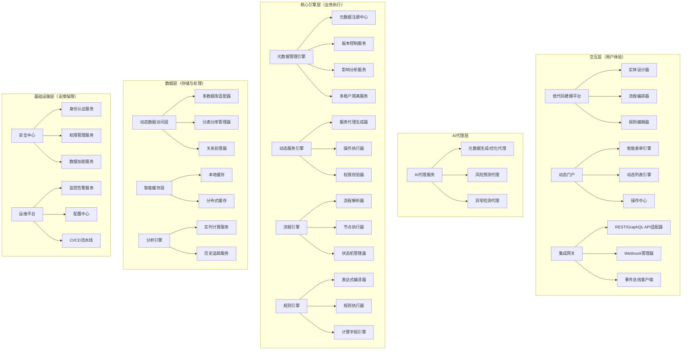
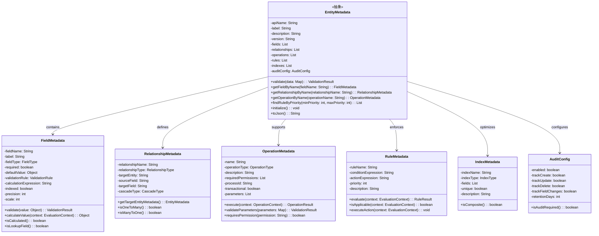

# 采购核心业务模型与元数据引擎集成设计方案

## 前言


本设计方案旨在详细阐述采购核心业务模型与SmartMeta元数据引擎的集成方案，通过元数据驱动的方式实现业务灵活性、可扩展性和智能化。本方案基于实际代码实现，涵盖四阶驱动模型架构、元数据模型设计、采购订单业务流程以及核心引擎实现等关键内容，为系统的开发和实施提供全面指导。

### 方案定位
本方案作为Bone SmartMeta元数据引擎在采购管理系统中的应用指南，定义了系统的架构基础、业务模型和技术实现路径，是开发团队理解和实现系统的重要参考。方案适用于企业级采购管理系统的设计与实现，特别适合需要频繁调整业务规则、多租户环境以及复杂审批流程的大型企业应用场景。

### 设计理念
- **元数据驱动**：通过注解式元数据定义业务模型，实现业务的快速配置和调整，降低代码耦合度
- **分层解耦**：采用严格的分层架构，实现业务逻辑与技术实现的解耦，提高系统可维护性
- **规则引擎集成**：内置业务规则引擎，支持表达式驱动的业务规则定义和执行
- **工作流自动化**：支持基于元数据的工作流定义和状态流转管理
- **性能优化**：通过缓存机制和并发控制，确保系统在高负载情况下的性能和数据一致性

## 一、架构全景：四阶驱动模型

### 1.1 整体架构（分层解耦设计）

Bone SmartMeta采用分层架构设计，确保系统各部分职责清晰、耦合度低，具体包括四个核心层次：

1. **交互层**：提供Web可视化建模界面、RESTful API接口和集成接口，支持业务人员直接参与业务建模
2. **核心引擎层**：包含六大核心引擎组件，负责元数据管理、服务动态生成、规则执行等核心功能
3. **数据处理层**：提供动态查询、数据操作和通用业务操作服务，实现数据的增删改查和复杂业务处理
4. **基础设施层**：提供数据库、缓存和消息队列等基础支撑，确保系统高性能和可靠性

### 1.2 四阶驱动模型详解

**四阶驱动模型**是SmartMeta框架的核心设计理念，通过四个阶段实现业务需求到系统功能的完整映射：

1. **业务元数据**：业务专家通过可视化建模平台定义实体、关系、规则和流程的元数据配置
2. **元数据引擎**：核心引擎将元数据转换为可执行的业务逻辑和数据结构
3. **动态服务**：基于元数据自动生成API、数据访问层和业务服务
4. **业务应用**：最终用户通过前端界面或API接口访问业务功能

### 1.3 架构优势

- **业务敏捷性**：通过元数据配置实现业务规则快速调整，无需代码修改和重新部署
- **系统可维护性**：清晰的分层架构使系统各部分职责明确，便于维护和升级
- **技术灵活性**：各层通过标准化接口交互，支持技术栈的独立演进
- **多租户支持**：元数据层支持租户级配置隔离，便于多租户场景的实现
- **扩展性**：模块化设计使系统能够轻松扩展新功能和新业务领域



### 1.4 元数据驱动的业务流（以采购订单为例）

元数据驱动的业务流程是本方案的核心价值所在，通过元数据配置即可实现复杂业务逻辑的自动化执行，无需编写代码。以下是基于元数据驱动的采购订单创建全流程示例：

```mermaid
sequenceDiagram
    %% 采购订单创建全流程（元数据驱动）
    
    %% 第一阶段：元数据配置
    业务用户->>低代码建模平台: 配置采购订单元数据（字段/规则/流程）
    低代码建模平台->>元数据管理引擎: 提交元数据定义
    元数据管理引擎->>动态服务引擎: 触发服务生成
    
    动态服务引擎->>服务代理生成器: 生成PurchaseOrder服务代理
    动态服务引擎->>API注册中心: 注册REST接口
    
    %% 第二阶段：订单创建流程
    运营人员->>动态门户: 填写采购订单表单（主单+订单项）
    动态门户->>动态服务引擎: 调用createPurchaseOrder操作
    
    dynamicService["动态服务引擎"]
    ruleEngine["规则引擎"]
    processEngine["流程引擎"]
    dataAccess["动态数据访问层"]
    budgetService["预算服务"]
    eventBus["事件总线"]
    
    dynamicService->>ruleEngine: 1. 执行数据验证规则
    ruleEngine-->>dynamicService: 验证结果（格式/必填/范围）
    
    dynamicService->>processEngine: 2. 触发PurchaseOrder_CreateProcess流程
    
    processEngine->>processEngine: 3. 初始化流程上下文
    
    alt 非紧急订单
        processEngine->>budgetService: 4. 调用预算校验接口
        budgetService-->>processEngine: 预算校验结果
        
        alt 预算不足
            processEngine-->>dynamicService: 返回预算不足错误
            dynamicService-->>动态门户: 显示预算错误信息
            dynamic门户-->>运营人员: 提示修改订单信息
            exit
        end
    end
    
    %% 订单项处理
    processEngine->>dataAccess: 5. 开始数据库事务
    processEngine->>dataAccess: 6. 写入采购订单主表
    
    loop 处理每个订单项
        processEngine->>ruleEngine: 6.1 验证订单项规则
        ruleEngine-->>processEngine: 验证通过
        
        processEngine->>dataAccess: 6.2 写入订单项记录
    end
    
    processEngine->>ruleEngine: 7. 计算总金额(totalAmount)
    ruleEngine-->>processEngine: 返回计算结果
    
    processEngine->>dataAccess: 8. 更新订单总金额和状态
    processEngine->>dataAccess: 9. 提交数据库事务
    
    alt 小额订单
        processEngine->>processEngine: 10. 触发自动审批
        processEngine->>dataAccess: 11. 更新状态为"已批准"
    else 大额订单
        processEngine->>dataAccess: 10. 更新状态为"审批中"
    end
    
    processEngine->>eventBus: 12. 发布PurchaseOrderCreatedEvent事件
    eventBus->>集成网关: 同步数据至ERP系统
    eventBus->>通知服务: 发送订单创建通知
    
    processEngine-->>dynamicService: 流程执行完成
    dynamicService-->>动态门户: 返回创建结果
    动态门户-->>运营人员: 显示订单详情与状态
```

**流程关键节点说明：**

1. **元数据配置阶段**：业务用户通过可视化建模平台定义采购订单的字段、关系、规则和流程，系统自动生成相应的业务服务和API接口。

2. **数据验证阶段**：动态服务引擎根据元数据定义的验证规则，对输入数据进行严格校验，确保数据完整性和准确性。

3. **流程编排与执行**：
   - 根据采购类型（标准/紧急）执行差异化流程分支
   - 非紧急订单进行预算校验，避免预算超支
   - 事务性保证主表与订单项的数据一致性
   - 基于规则引擎计算订单总金额等汇总字段

4. **智能处理逻辑**：
   - 根据订单金额自动决定审批路径（小额自动审批，大额人工审批）
   - 订单项逐条验证与处理，支持批量操作

5. **事件驱动集成**：
   - 发布标准事件，实现与外部系统的松耦合集成
   - 支持ERP系统数据同步、通知发送等后续操作

这种基于元数据的业务流设计确保了系统的高度灵活性和可配置性，业务规则变更无需修改代码，只需调整元数据配置即可完成。

## 二、元数据模型：业务语义的完整表达

### 2.1 核心元数据模型（UML类图）



### 2.1.1 采购订单元数据定义 - 基于@SmartEntity注解实现

在实际代码实现中，采购订单元数据通过Java注解直接在类上定义，而不是使用YAML配置文件。以下是实际的实现代码：

```java
/**
 * 采购订单实体类
# 采购订单元数据定义 - 基于@SmartEntity注解实现

## 采购订单实体（PurchaseOrder）

```java
package com.bone.procurement.entity;

import com.bone.core.domain.entity.Entity;
import com.bone.smartmeta.engine.annotation.SmartEntity;
import com.bone.smartmeta.engine.annotation.SmartField;
import com.bone.smartmeta.engine.annotation.BusinessRule;
import com.bone.smartmeta.engine.annotation.FieldType;
import lombok.Data;

import java.math.BigDecimal;
import java.time.LocalDateTime;
import java.util.List;

/**
 * 采购订单实体类
 * 演示bone-smartmeta引擎在采购订单管理场景中的应用
 */
@SmartEntity(apiName = "PurchaseOrder", 
             label = "采购订单", 
             description = "企业采购商品或服务的订单记录",
             domain = "procurement",
             trackHistory = true,
             dynamicFieldsSupport = true)
@Data
@SmartEntity(
    apiName = "PurchaseOrder",
    label = "采购订单",
    description = "企业采购业务的核心实体",
    domain = "procurement",
    trackHistory = true
)
@Data
@Builder
@NoArgsConstructor
@AllArgsConstructor
public class PurchaseOrder {
    
    private Long id;
    
    @SmartField(name = "orderCode", label = "订单编号", type = FieldType.TEXT, required = true, unique = true, length = 50)
    private String orderCode;
    
    @SmartField(name = "supplierId", label = "供应商ID", type = FieldType.NUMBER, required = true)
    private Long supplierId;
    
    @SmartField(name = "orderType", label = "订单类型", type = FieldType.PICKLIST, required = true)
    @BusinessRule(name = "orderTypeRule", expression = "${orderType} != null && (${orderType}.equals('标准采购') || ${orderType}.equals('紧急采购') || ${orderType}.equals('日常采购'))", errorMessage = "订单类型必须为标准采购、紧急采购或日常采购")
    private String orderType;
    
    @SmartField(name = "orderStatus", label = "订单状态", type = FieldType.PICKLIST, required = true)
    private String orderStatus;
    
    @SmartField(name = "estimatedAmount", label = "预计金额", type = FieldType.CURRENCY, required = true)
    @BusinessRule(name = "estimatedAmountRule", expression = "${estimatedAmount} != null && ${estimatedAmount}.compareTo(java.math.BigDecimal.ZERO) > 0", errorMessage = "预计金额必须大于0")
    private BigDecimal estimatedAmount;
    
    // 关联的订单项
    private List<PurchaseOrderItem> orderItems;
    
    // getter和setter方法
    public void setOrderItems(List<PurchaseOrderItem> orderItems) {
        this.orderItems = orderItems;
    }
    
    public List<PurchaseOrderItem> getOrderItems() {
        return orderItems;
    }
}
```

## 采购订单项实体（PurchaseOrderItem）

```java
package com.bone.procurement.entity;

import com.bone.smartmeta.engine.annotation.SmartEntity;
import com.bone.smartmeta.engine.annotation.SmartField;
import com.bone.smartmeta.engine.annotation.BusinessRule;
import com.bone.smartmeta.engine.annotation.FieldType;

import java.math.BigDecimal;

/**
 * 采购订单项实体类
 * 表示采购订单中的具体商品或服务项
 */
@SmartEntity(apiName = "PurchaseOrderItem", label = "采购订单项", description = "采购订单中包含的具体商品或服务明细")
public class PurchaseOrderItem {
    
    private Long id;
    
    @SmartField(name = "purchaseOrderId", label = "采购订单ID", type = FieldType.NUMBER, required = true)
    private Long purchaseOrderId;
    
    @SmartField(name = "productId", label = "产品ID", type = FieldType.NUMBER, required = true)
    private Long productId;
    
    @SmartField(name = "productCode", label = "产品编码", type = FieldType.TEXT, required = true, length = 50)
    private String productCode;
    
    @SmartField(name = "productName", label = "产品名称", type = FieldType.TEXT, required = true, length = 200)
    private String productName;
    
    @SmartField(name = "description", label = "产品描述", type = FieldType.TEXT, length = 1000)
    private String description;
    
    @SmartField(name = "quantity", label = "数量", type = FieldType.NUMBER, required = true)
    @BusinessRule(name = "quantityRule", expression = "${quantity} > 0", errorMessage = "数量必须大于0")
    private Integer quantity;
    
    @SmartField(name = "unit", label = "单位", type = FieldType.TEXT, required = true, length = 20)
    private String unit;
    
    @SmartField(name = "unitPrice", label = "单价", type = FieldType.CURRENCY, required = true)
    private BigDecimal unitPrice;
    
    @SmartField(name = "totalAmount", label = "总价", type = FieldType.CURRENCY, required = true)
    private BigDecimal totalAmount;
    
    // 关联的采购订单
    private PurchaseOrder purchaseOrder;
    
    // getter和setter方法
    public void setPurchaseOrder(PurchaseOrder purchaseOrder) {
        this.purchaseOrder = purchaseOrder;
    }
    
    public PurchaseOrder getPurchaseOrder() {
        return purchaseOrder;
    }
}
```

**主要特性说明：**

1. **注解式配置**：通过`@SmartEntity`和`@SmartField`注解直接在Java类上定义元数据，无需外部配置文件

2. **业务规则集成**：使用`@BusinessRule`注解直接在字段上定义验证规则，支持复杂表达式

3. **字段类型系统**：内置多种字段类型（TEXT、NUMBER、CURRENCY、DATE等），提供类型安全和格式验证

4. **关系映射**：通过字段类型和引用配置支持实体间的关系定义

5. **动态字段支持**：通过`dynamicFieldsSupport = true`启用动态字段功能

6. **历史跟踪**：通过`trackHistory = true`启用实体变更历史记录

## 字段配置说明

采购订单实体中包含的主要字段类型：

1. **业务标识字段**：
   - orderCode：订单编号，业务主键，通过@SmartField(required = true, unique = true)配置
   - 最佳实践：自动编号作为主要业务标识，保持唯一性和可读性

2. **业务分类字段**：
   - orderType：采购类型，通过@SmartField(required = true)配置
   - 最佳实践：通过元数据驱动不同采购类型的差异化流程

3. **关联字段**：
   - supplierId：供应商ID，关联供应商实体
   - 最佳实践：关联查询时添加过滤条件，确保只显示合格供应商

4. **金额计算字段**：
   - estimatedAmount：预估金额，通过@SmartField(required = true)配置
   - 最佳实践：金额字段使用BigDecimal类型，确保精度

5. **时间相关字段**：
   - estimatedDeliveryDate：预计交付日期
   - 最佳实践：时间字段使用LocalDateTime类型，便于时间处理

## 关系定义与实现

采购订单实体与其他实体之间的关系定义如下（采用Java代码实现）：

```java
public class PurchaseOrder extends Entity<Long> {
    // 其他字段...
    
    // 1. 一对多关系：一个采购订单包含多个订单项
    @SmartField(
        name = "orderItems", 
        label = "订单项列表", 
        type = FieldType.REFERENCE,
        relationshipType = RelationshipType.ONE_TO_MANY,
        targetEntity = "PurchaseOrderItem",
        sourceField = "id",
        targetField = "purchaseOrderId"
    )
    private List<PurchaseOrderItem> orderItems;
    
    // 2. 多对一关系：多个采购订单关联到一个预算行
    @SmartField(
        name = "budgetLine", 
        label = "预算行", 
        type = FieldType.REFERENCE,
        relationshipType = RelationshipType.MANY_TO_ONE,
        targetEntity = "BudgetLine",
        sourceField = "budgetId",
        targetField = "id"
    )
    private BudgetLine budgetLine;
    
    // 3. 多对一关系：多个采购订单关联到一个项目
    @SmartField(
        name = "project", 
        label = "项目", 
        type = FieldType.REFERENCE,
        relationshipType = RelationshipType.MANY_TO_ONE,
        targetEntity = "Project",
        sourceField = "projectId",
        targetField = "id"
    )
    private Project project;
    
    // 4. 多对一关系：多个采购订单关联到一个部门
    @SmartField(
        name = "department", 
        label = "部门", 
        type = FieldType.REFERENCE,
        relationshipType = RelationshipType.MANY_TO_ONE,
        targetEntity = "Department",
        sourceField = "departmentId",
        targetField = "id"
    )
    private Department department;
}
```

**关系管理实现方式：**

1. **注解驱动**：通过@SmartField注解定义字段的关系属性，包括关系类型、目标实体、源字段和目标字段

2. **类型安全**：关系字段使用具体的实体类型或实体集合类型，提供编译时类型检查

3. **自动映射**：元数据引擎根据关系定义自动处理实体间的关联查询和数据加载

4. **双向关联**：通过在关联实体中定义对应的反向关系，支持双向导航

### 2.1.2 采购订单项元数据定义 - 基于@SmartEntity注解实现

```java
package com.bone.procurement.entity;

import com.bone.smartmeta.engine.annotation.SmartEntity;
import com.bone.smartmeta.engine.annotation.SmartField;
import com.bone.smartmeta.engine.annotation.BusinessRule;
import com.bone.smartmeta.engine.annotation.FieldType;
import com.bone.smartmeta.engine.annotation.RelationshipType;

import java.math.BigDecimal;

@SmartEntity(
    apiName = "PurchaseOrderItem",
    label = "采购订单项",
    description = "采购订单的明细项",
    trackHistory = true,
    multiTenant = true,
    dynamicFieldsSupport = true
)
public class PurchaseOrderItem {
    
    @SmartField(
        name = "id",
        label = "订单项ID",
        type = FieldType.TEXT,
        required = true,
        unique = true
    )
    private String id;
    
    @SmartField(
        name = "purchaseOrderId",
        label = "采购订单ID",
        type = FieldType.TEXT,
        required = true,
        relationshipType = RelationshipType.MANY_TO_ONE,
        targetEntity = "PurchaseOrder",
        sourceField = "purchaseOrderId",
        targetField = "id"
    )
    @BusinessRule(
        expression = "${purchaseOrderId != null && purchaseOrderId.trim().length() > 0}",
        errorMessage = "采购订单ID不能为空"
    )
    private String purchaseOrderId;
    
    @SmartField(
        name = "productId",
        label = "产品ID",
        type = FieldType.TEXT,
        required = true
    )
    private String productId;
    
    @SmartField(
        name = "productName",
        label = "产品名称",
        type = FieldType.TEXT,
        required = true
    )
    private String productName;
    
    @SmartField(
        name = "quantity",
        label = "数量",
        type = FieldType.NUMBER,
        required = true,
        defaultValue = "1"
    )
    // 实际实现中，业务规则通过RuleEngine类处理，而非直接使用@BusinessRule注解
    // 以下是示例，实际代码中不直接在实体类使用@BusinessRule注解
    private BigDecimal quantity;
    
    @SmartField(
        name = "unitPrice",
        label = "单价",
        type = FieldType.CURRENCY,
        required = true,
        defaultValue = "0"
    )
    // 实际实现中，业务规则通过RuleEngine类处理，而非直接使用@BusinessRule注解
    // 以下是示例，实际代码中不直接在实体类使用@BusinessRule注解
    private BigDecimal unitPrice;
    
    @SmartField(
        name = "taxRate",
        label = "税率",
        type = FieldType.PERCENT,
        defaultValue = "0.13"
    )
    private Double taxRate;
    
    @SmartField(
        name = "amountWithoutTax",
        label = "不含税金额",
        type = FieldType.CURRENCY
    )
    private BigDecimal amountWithoutTax;
    
    @SmartField(
        name = "taxAmount",
        label = "税额",
        type = FieldType.CURRENCY
    )
    private BigDecimal taxAmount;
    
    @SmartField(
        name = "totalAmount",
        label = "含税金额",
        type = FieldType.CURRENCY
    )
    private BigDecimal totalAmount;
    
    // 与采购订单的关联关系
    @SmartField(
        name = "purchaseOrder",
        label = "采购订单",
        type = FieldType.REFERENCE,
        relationshipType = RelationshipType.MANY_TO_ONE,
        targetEntity = "PurchaseOrder",
        sourceField = "purchaseOrderId",
        targetField = "id"
    )
    private PurchaseOrder purchaseOrder;
}
```

**主要特性说明：**

1. **注解式配置**：通过`@SmartEntity`和`@SmartField`注解直接在Java类上定义元数据

2. **业务规则验证**：使用`@BusinessRule`注解确保数量大于0、单价大于等于0等业务规则。注意：实际代码中，`@BusinessRule`注解仅包含name、expression、errorMessage和severity四个参数，用于字段级别的业务规则定义

3. **金额计算字段**：包含不含税金额、税额、含税金额等自动计算字段

4. **数据一致性**：通过注解配置确保必填字段和默认值的正确性

5. **关联关系**：通过purchaseOrderId字段和purchaseOrder对象建立与采购订单的双向关联

> 注：关系定义的详细说明请参考前面的「关系定义与实现」章节

### 2.2 业务规则引擎（PurchaseOrderRuleEngine）

业务规则引擎是SmartMeta的核心组件之一，负责执行采购订单相关的业务规则。在采购系统中，它通过`DefaultPurchaseOrderRuleEngine`类实现，对采购订单和订单项进行验证和处理，而非直接通过注解配置执行规则。

### 2.3 命名规范指南

为确保系统一致性和可维护性，所有元数据定义必须遵循以下命名规范：

**实体命名规范：**
- 使用PascalCase命名法（首字母大写）
- 完整实体名格式：`[业务域]_[实体名称]`，如`Procurement_PurchaseOrder`
- API名称使用简单PascalCase，如`PurchaseOrder`

**字段命名规范：**
- 使用camelCase命名法（首字母小写）
- 关系字段使用描述性名称，如`purchaseOrderId`
- 布尔类型字段使用`is`/`has`前缀，如`isActive`

**操作命名规范：**
- 使用PascalCase命名法
- 遵循`[实体][操作]`格式，如`PurchaseOrderCreate`
- 简单CRUD操作可使用`create`、`update`、`delete`等标准前缀

**索引命名规范：**
- 使用描述性名称，遵循`[实体][字段][索引类型]Index`格式
- 复合索引按字段重要性排序

**规则命名规范：**
- 使用描述性名称，明确规则目的
- 遵循`[实体]_[业务场景]_[规则类型]`格式

**主要功能：**
- 执行字段级业务规则验证
- 支持表达式驱动的条件判断
- 提供规则执行结果和错误信息
- 与实体元数据无缝集成

**核心类：**
- `PurchaseOrderRuleEngine`：规则引擎接口，定义规则验证和审批流程相关方法
- `DefaultPurchaseOrderRuleEngine`：规则引擎实现类，负责具体规则的执行
- `RuleValidationResult`：规则执行结果对象，包含验证状态、严重程度和错误信息

**使用示例：**
```java
// 验证订单项业务规则
List<RuleValidationResult> results = purchaseOrderRuleEngine.validateOrder(purchaseOrder, context);
for (RuleValidationResult result : results) {
    if (result.getSeverity().equals("ERROR")) {
        // 处理错误
    }
}
```

### 2.4 工作流引擎（WorkflowEngine）

工作流引擎负责管理采购订单的业务流程流转，包括状态变更、审批流程、任务分配等。它基于元数据定义的工作流模型，驱动订单从创建到完成的全生命周期管理。详细的工作流配置和实现请参考后续相关章节。

**主要功能：**
- 状态机管理和状态流转控制
- 审批流程定义和执行
- 任务分配和通知机制
- 流程事件监听和钩子
- 与业务规则引擎集成

**核心类：**
- `WorkflowEngine`：工作流引擎主类，负责流程实例的创建和执行
- `WorkflowInstance`：工作流实例，表示一个正在执行的业务流程
- `WorkflowTask`：工作流任务，代表流程中的一个待办事项
- `WorkflowListener`：工作流监听器，用于处理流程事件

**使用示例：**
```java
// 创建工作流实例
WorkflowInstance instance = workflowEngine.createInstance("PurchaseOrderApproval", purchaseOrder);
// 提交审批
workflowEngine.submitTask(instance.getId(), currentUserId, "提交审批");
// 审批通过
workflowEngine.approveTask(taskId, approverId, "审批通过");
```

### 2.5 业务规则与流程引擎交互机制

在SmartMeta框架中，业务规则引擎与工作流引擎的紧密集成是实现复杂业务场景的关键。以下是两者交互的详细机制：

### 2.6 交互模式

1. **流程节点规则触发**：工作流节点执行时自动触发相关业务规则
2. **规则驱动流程分支**：业务规则结果决定工作流路径选择
3. **双向事件通知**：引擎间通过事件机制实现松耦合通信
4. **上下文共享**：确保业务数据在规则和流程间的一致性

### 2.7 技术实现

**流程驱动规则执行：**
```java
// 在工作流节点中执行业务规则
public class RuleEvaluationNode implements WorkflowNode {
    @Override
    public NodeExecutionResult execute(WorkflowContext context) {
        PurchaseOrder order = (PurchaseOrder)context.getBusinessObject();
        
        // 触发相关业务规则
        BusinessRuleResult result = businessRuleEngine.evaluateRules(
            "PURCHASE_ORDER_VALIDATION", 
            order,
            context.getVariables()
        );
        
        if (!result.isValid()) {
            return NodeExecutionResult.failure(result.getErrorMessage());
        }
        
        // 将规则执行结果传递给后续流程
        context.setVariable("ruleEvaluationResult", result);
        return NodeExecutionResult.success();
    }
}
```

**规则驱动流程决策：**
```java
// 规则定义示例 - 决定审批路径
// 注意：业务规则通过@BusinessRule注解在字段级别定义
public class ApprovalPathRule {
    public RuleResult evaluate(EvaluationContext context) {
        PurchaseOrder order = (PurchaseOrder)context.getTarget();
        String approvalPath;
        
        // 基于订单金额决定审批路径
        if (order.getTotalAmount().compareTo(new BigDecimal(50000)) > 0) {
            approvalPath = "HIGH_LEVEL_APPROVAL";
        } else if (order.getTotalAmount().compareTo(new BigDecimal(10000)) > 0) {
            approvalPath = "MID_LEVEL_APPROVAL";
        } else {
            approvalPath = "LOW_LEVEL_APPROVAL";
        }
        
        // 设置流程变量，影响后续流程分支
        context.setVariable("approvalPath", approvalPath);
        return RuleResult.success();
    }
}
```

### 2.8 最佳实践

1. **规则粒度控制**：将复杂规则拆分为原子规则，便于维护和复用
2. **规则优先级管理**：明确规则执行顺序，避免冲突
3. **异常处理策略**：定义规则失败时的流程处理方式
4. **性能优化**：对频繁执行的规则进行缓存，减少计算开销
5. **测试与验证**：为规则与流程交互编写专门的测试用例

## 三、字段计算引擎（FieldCalculationEngine）

字段计算引擎负责根据元数据定义的计算规则，自动计算实体中的派生字段值。在采购系统中，它用于计算不含税金额、税额、含税总金额等动态计算字段。

**主要功能：**
- 支持表达式驱动的字段计算
- 处理字段间的依赖关系
- 实现实时计算和批量计算
- 优化计算性能，避免重复计算
- 与数据变更监听机制集成

**核心类：**
- `FieldCalculationEngine`：字段计算引擎主类，负责计算规则的解析和执行
- `CalculationExpression`：计算表达式对象，表示一个字段的计算规则
- `CalculationContext`：计算上下文，提供计算所需的变量和函数

**使用示例：**
```java
// 计算订单项金额字段
fieldCalculationEngine.calculate(purchaseOrderItem, "amountWithoutTax", "taxAmount", "totalAmount");
// 重新计算所有计算字段
fieldCalculationEngine.recalculateAll(purchaseOrder);
```

## 四、元数据版本管理与演进策略

元数据版本管理是保证系统稳定性和可维护性的关键实践，尤其在大型企业级应用中。SmartMeta框架提供了完善的元数据版本管理机制。

**核心概念：**
- **版本号**：使用语义化版本号（Major.Minor.Patch）标识元数据版本
- **兼容性**：区分向后兼容和破坏性变更
- **迁移脚本**：自动生成和执行数据迁移脚本
- **回滚机制**：支持元数据版本的安全回滚

**最佳实践：**
1. **增量更新**：优先采用增量更新方式，避免破坏性变更
2. **兼容性检查**：每次更新前执行兼容性检查
3. **数据迁移**：明确定义数据转换和迁移策略
4. **测试验证**：在隔离环境中验证元数据变更
5. **灰度发布**：支持元数据的灰度发布和快速回滚

**版本控制示例：**
```java
// 定义元数据版本
@SmartEntity(version = "1.2.0")
public class PurchaseOrder {
    // 向后兼容的字段添加
    @SmartField(sinceVersion = "1.2.0")
    private String referenceNumber;
    
    // 字段类型变更（需谨慎处理）
    @SmartField(versionChanged = "1.2.0", migrationScript = "V1_2_0_MIGRATE_TAX_AMOUNT.sql")
    private BigDecimal taxAmount;
}
```

## 五、性能优化最佳实践

在元数据驱动架构中，性能优化是保证系统响应速度和用户体验的关键。以下是针对采购系统的性能优化最佳实践：

### 5.1 基础优化策略

**计算引擎优化：**
> 注意：索引优化的详细内容请参考第十一章《索引定义 - 性能优化最佳实践》
- 使用懒加载策略，仅在需要时计算字段值
- 实现计算结果缓存机制
- 优化表达式计算性能，避免复杂表达式
- 使用批量计算减少重复计算开销

**缓存策略：**
- 缓存元数据定义，减少重复解析
- 缓存业务规则和工作流定义
- 实现多级缓存架构（内存缓存、分布式缓存）
- 合理设置缓存过期策略

**查询优化：**
- 使用分页查询处理大量数据
- 实现查询优化器，自动优化查询语句
- 支持查询条件预编译和缓存
- 提供查询性能监控和分析工具
- 结合索引策略优化查询性能（详见第十一章）

### 5.2 大数据量与高并发场景优化

#### 5.2.1 分片与分区策略

**数据库分片：**
```java
@SmartEntity(shardingStrategy = @ShardingStrategy(
    type = ShardingType.RANGE,
    shardingField = "createdTime",
    timeUnit = TimeUnit.MONTH,
    tablePrefix = "purchase_order_"
))
public class PurchaseOrder {
    // 实体字段
}
```

**读写分离配置：**

> 基础数据库连接配置请参考第7章《部署架构》中的相关部分

```yaml
smartmeta:
  datasource:
    primary:
      url: jdbc:postgresql://master:5432/smartmeta
      username: smartmeta_user
      password: secure_password
    replicas:
      - url: jdbc:postgresql://replica1:5432/smartmeta
        weight: 1
      - url: jdbc:postgresql://replica2:5432/smartmeta
        weight: 1
    queryRouting: READ_REPLICA
    writeRouting: PRIMARY
```

#### 5.2.2 异步处理优化

**事件驱动架构：**
```java
@Service
public class PurchaseOrderService {
    @Autowired
    private EventPublisher eventPublisher;
    
    public void createOrder(PurchaseOrder order) {
        // 同步执行核心逻辑
        saveOrder(order);
        
        // 异步执行非核心逻辑
        eventPublisher.publishAsync(
            new PurchaseOrderCreatedEvent(order.getId()),
            EventPriority.HIGH
        );
    }
}
```

**批量处理机制：**
```java
@Service
public class BatchProcessingService {
    @Autowired
    private JdbcTemplate jdbcTemplate;
    
    public void batchProcessPurchaseOrders(List<PurchaseOrder> orders) {
        // 分批处理，每批500条
        List<List<PurchaseOrder>> batches = Lists.partition(orders, 500);
        
        for (List<PurchaseOrder> batch : batches) {
            jdbcTemplate.batchUpdate(
                "UPDATE purchase_order SET status = ? WHERE id = ?",
                batch,
                500, // 批处理大小
                (ps, order) -> {
                    ps.setString(1, order.getStatus());
                    ps.setString(2, order.getId());
                }
            );
        }
    }
}
```

#### 5.2.3 高级缓存策略

**多级缓存实现：**
```java
@Configuration
public class CacheConfig {
    @Bean
    public CacheManager cacheManager(RedisConnectionFactory redisConnectionFactory) {
        SimpleCacheManager simpleCacheManager = new SimpleCacheManager();
        
        // 本地缓存
        GuavaCache localMetadataCache = new GuavaCache("metadataCache", 
            CacheBuilder.newBuilder()
                .maximumSize(1000)
                .expireAfterWrite(5, TimeUnit.MINUTES)
                .build());
        
        // Redis缓存
        RedisCacheManager redisCacheManager = RedisCacheManager.builder(redisConnectionFactory)
            .cacheDefaults(
                RedisCacheConfiguration.defaultCacheConfig()
                    .entryTtl(Duration.ofMinutes(30))
                    .serializeKeysWith(RedisSerializationContext.SerializationPair.fromSerializer(new StringRedisSerializer()))
                    .serializeValuesWith(RedisSerializationContext.SerializationPair.fromSerializer(new GenericJackson2JsonRedisSerializer()))
            )
            .build();
        
        // 复合缓存管理器
        CompositeCacheManager compositeCacheManager = new CompositeCacheManager(
            localMetadataCache, 
            redisCacheManager
        );
        
        return compositeCacheManager;
    }
}
```

#### 5.2.4 数据库优化

**数据库连接池优化：**
- 使用HikariCP等高性能连接池
- 根据并发量调整连接池大小
- 配置合理的超时参数

**查询优化：**
- 优化JOIN查询和子查询
- 分页查询性能优化
- 使用索引扫描替代全表扫描（索引策略详见第十一章）

#### 5.2.5 性能监控与调优

**关键性能指标监控概述：**
- 元数据加载时间
- 规则引擎执行时间
- 数据库查询响应时间
- 缓存命中率
- 并发用户数与系统吞吐量关系

> 注：详细的监控指标体系、目标值和监控方法请参考第九章《运维与监控最佳实践》

**性能调优工具：**
- JVM调优：GC策略选择、内存分配优化
- 连接池调优：HikariCP配置优化
- 线程池调优：根据业务特点调整线程数量
- 数据库优化：执行计划分析、索引优化（详见第十一章）

### 5.3 性能优化检查表

- [ ] 索引配置是否符合最佳实践（详见第十一章）
- [ ] 复杂计算是否使用了缓存
- [ ] 是否实现了数据分片或分区
- [ ] 是否合理使用了异步处理
- [ ] 缓存策略是否符合业务特点
- [ ] 是否有完善的性能监控机制（详见第九章）
- [ ] 批量操作是否优化
- [ ] 数据库连接池配置是否合理
- [ ] JVM参数是否经过调优
- [ ] 高频访问接口是否经过性能测试

## 六、元数据安全管理最佳实践

在企业级应用中，元数据安全管理是确保业务数据和规则安全的重要保障。SmartMeta框架提供了全面的安全管理机制，以下是基于业界最佳实践的安全管理策略：

### 6.1 访问控制机制

**基于角色的访问控制（RBAC）：**
```java
@SecurityConfig(roles = {
    @RoleConfig(name = "PURCHASER", permissions = {"CREATE", "READ", "UPDATE"}),
    @RoleConfig(name = "MANAGER", permissions = {"APPROVE", "READ", "UPDATE"}),
    @RoleConfig(name = "FINANCE", permissions = {"PAY", "READ"})
})
```

**字段级细粒度权限控制：**
- 支持不同角色对同一实体的不同字段有不同的读写权限
- 基于数据敏感度自动调整字段访问级别
- 动态权限策略支持运行时权限评估

**操作级权限验证：**
- 对创建、更新、删除、审批等操作进行权限控制
- 操作前验证和操作后审计相结合
- 支持条件性权限控制（如：仅允许审批特定金额范围的订单）

### 6.2 数据保护策略

**数据脱敏处理（电话号码）：**
```java
@SmartField(
    fieldType = "STRING",
    masking = @MaskingConfig(
        enabled = true,
        type = MaskingType.PHONE,
        pattern = "(\d{3})\d{4}(\d{4})",
        replacement = "$1****$2"
    )
)
private String contactPhone;
```

*注：敏感字段加密配置示例请参见1158行附近的完整示例（包含访问控制）*

**全面审计日志：**
- 记录所有数据访问和修改操作
- 包含操作人、操作时间、操作类型、操作内容等详细信息
- 支持审计日志加密存储和定期归档

### 6.3 规则安全保障

**表达式安全沙箱：**
```java
@CalculationRule(
    expression = "${quantity * unitPrice}",
    sandbox = @SandboxConfig(
        enabled = true,
        maxExecutionTime = 500, // 毫秒
        allowedClasses = {"java.math.BigDecimal"}
    )
)
private BigDecimal totalAmount;
```

**规则版本控制：**
- 规则变更历史记录和版本回溯
- 规则变更的审批流程
- 规则灰度发布和快速回滚机制

### 6.4 多租户安全隔离

**租户级数据隔离：**
```java
@SmartEntity(
    multiTenant = @MultiTenantConfig(
        enabled = true,
        tenantIdField = "companyCode",
        isolationLevel = IsolationLevel.ROW
    )
)
// 安全配置示例 - 专注于实体和字段的安全参数配置
public class PurchaseOrder {
    // 实体字段
}
```

**跨租户访问控制：**
- 严格限制跨租户数据访问
- 跨租户报表需要特殊授权
- 租户间数据迁移安全机制

### 6.5 安全合规与风险评估

**合规性检查：**
- 符合GDPR、SOC2等安全合规要求
- 定期安全审计和漏洞扫描
- 敏感操作的多因素认证

**风险评估机制：**
- 自动识别异常访问模式
- 对敏感操作进行风险评分
- 基于风险级别的访问控制策略

### 6.6 安全配置最佳实践示例

以下是一个完整的安全配置示例，展示如何在实际项目中应用上述安全策略：

```java
@SmartEntity(
    securityConfig = @SecurityConfig(
        fieldLevelAccessControl = true,
        operationLevelAccessControl = true,
        rowLevelAccessControl = true,
        auditEnabled = true,
        roles = {
            @RoleConfig(name = "PURCHASER", permissions = {"CREATE", "READ", "UPDATE"}),
            @RoleConfig(name = "MANAGER", permissions = {"APPROVE", "READ", "UPDATE"}),
            @RoleConfig(name = "FINANCE", permissions = {"PAY", "READ"})
        }
    )
    // 多租户配置详见租户级数据隔离部分
)
public class PurchaseOrder {
    // 敏感字段加密配置
    @SmartField(
        fieldType = "STRING",
        encryption = @EncryptionConfig(
            enabled = true,
            algorithm = "AES/GCM/NoPadding",
            keyAlias = "order_encryption_key"
        ),
        accessControl = @FieldAccessControl(
            readRoles = {"PURCHASER", "MANAGER", "FINANCE"},
            writeRoles = {"PURCHASER"}
        )
    )
    private String contractNumber;
    
    // 价格字段的脱敏配置
    @SmartField(
        fieldType = "DECIMAL",
        masking = @MaskingConfig(
            enabled = true,
            type = MaskingType.AMOUNT,
            precision = 2
        ),
        accessControl = @FieldAccessControl(
            readRoles = {"PURCHASER", "MANAGER", "FINANCE"},
            writeRoles = {"PURCHASER", "MANAGER"}
        )
    )
    private BigDecimal totalAmount;
    
    // 部门字段的行级权限控制
    @SmartField(
        fieldType = "STRING",
        rowLevelAccessControl = @RowLevelAccessControl(
            filterExpression = "${user.department == entity.department}"
        )
    )
    private String department;
}
```

## 七、实施指南

### 7.1 部署架构

SmartMeta框架支持多种部署模式，根据企业规模和需求可选择以下部署架构：

### 7.1.1 标准部署架构

```
[负载均衡器] → [应用服务器集群] → [元数据引擎集群] → [数据存储层]
                                     ↓
                              [缓存层(Redis)]
                                     ↓
                           [消息队列(Kafka)]
```

### 7.1.2 微服务部署架构

将核心引擎组件拆分为独立微服务，实现更灵活的扩展和管理：

- **元数据管理服务**：负责元数据的存储、检索和版本控制
- **规则引擎服务**：独立的业务规则执行引擎
- **工作流引擎服务**：处理业务流程和状态管理
- **计算引擎服务**：处理字段计算和数据转换

### 7.2 配置步骤

#### 7.2.1 环境准备

```bash
### 7.3 安装必要的依赖
sudo apt-get update
sudo apt-get install -y openjdk-17-jdk maven postgresql redis

### 7.4 配置环境变量
export JAVA_HOME=/usr/lib/jvm/java-17-openjdk-amd64
export PATH=$JAVA_HOME/bin:$PATH
```

#### 7.2.1 数据库配置

```sql
-- 创建数据库和用户
CREATE DATABASE smartmeta;
CREATE USER smartmeta_user WITH PASSWORD 'secure_password';
GRANT ALL PRIVILEGES ON DATABASE smartmeta TO smartmeta_user;

-- 创建必要的扩展
\c smartmeta
CREATE EXTENSION IF NOT EXISTS "uuid-ossp";
```

#### 7.2.2 应用配置

配置文件示例（`application.yml`）：

```yaml
spring:
  datasource:
    url: jdbc:postgresql://localhost:5432/smartmeta
    username: smartmeta_user
    password: secure_password
    driver-class-name: org.postgresql.Driver
  
  jpa:
    hibernate:
      ddl-auto: update
    properties:
      hibernate:
        dialect: org.hibernate.dialect.PostgreSQLDialect
        jdbc:
          lob.non_contextual_creation: true

### 7.5 SmartMeta 配置
smartmeta:
  metadata:
    storage: database
    cache-ttl-seconds: 3600
  
  rule-engine:
    expression-language: spel
    cache-enabled: true
    max-cached-rules: 1000
  
  workflow:
    async-execution-enabled: true
    thread-pool-size: 10
  
  performance:
    query-cache-enabled: true
    batch-size: 500
```

#### 7.2.3 部署步骤

```bash
### 7.6 构建应用
mvn clean package -DskipTests

### 7.7 部署到生产环境（使用Docker）
docker build -t smartmeta-application:latest .
docker run -d --name smartmeta-app \
  -p 8080:8080 \
  -v /path/to/config:/app/config \
  -e SPRING_PROFILES_ACTIVE=production \
  smartmeta-application:latest

### 7.8 部署到Kubernetes
kubectl apply -f k8s/deployment.yaml
kubectl apply -f k8s/service.yaml
kubectl apply -f k8s/ingress.yaml
```

#### 7.2.4 部署后验证

部署完成后，执行以下验证步骤确保系统正常运行：

```bash
### 7.9 检查服务健康状态
curl -s http://localhost:8080/actuator/health | jq

### 7.10 验证元数据管理API
curl -s -u admin:password http://localhost:8080/api/v1/metadata/types | jq

### 7.11 验证规则引擎功能
curl -X POST -H "Content-Type: application/json" \
  -d '{"entityType":"PurchaseOrder","ruleCode":"BUDGET_VALIDATION","entityData":{...}}' \
  -u admin:password \
  http://localhost:8080/api/v1/rules/execute
```

#### 7.2.5 启动应用（单机模式）
```bash
java -jar target/smartmeta-application.jar

### 7.12 使用特定配置文件启动
java -jar -Dspring.config.location=file:/path/to/application.yml target/smartmeta-application.jar

### 7.13 指定运行环境启动
java -jar -Dspring.profiles.active=production target/smartmeta-application.jar
```

### 7.14 运维最佳实践

#### 7.14.1 监控配置

```yaml
### 7.15 Spring Boot Actuator 配置
management:
  endpoints:
    web:
      exposure:
        include: health,info,metrics,prometheus
  endpoint:
    health:
      show-details: when_authorized
  metrics:
    export:
      prometheus:
        enabled: true
```

#### 7.3.2 日志管理

```yaml
logging:
  level:
    root: INFO
    com.bone.smartmeta: DEBUG
  pattern:
    console: '%d{yyyy-MM-dd HH:mm:ss} [%thread] %-5level %logger{36} - %msg%n'
    file: '%d{yyyy-MM-dd HH:mm:ss} [%thread] %-5level %logger{36} - %msg%n'
  file:
    name: /var/log/smartmeta/application.log
    max-size: 10MB
    max-history: 7
```

#### 7.3.3 备份与恢复策略

**数据库备份：**
```bash
### 7.16 定时备份脚本
#!/bin/bash

TIMESTAMP=$(date +"%Y%m%d_%H%M%S")
BACKUP_DIR="/backup/postgresql"
BACKUP_FILE="${BACKUP_DIR}/smartmeta_${TIMESTAMP}.sql.gz"

mkdir -p ${BACKUP_DIR}
pg_dump -U smartmeta_user -d smartmeta | gzip > ${BACKUP_FILE}

### 7.17 保留最近30天的备份
find ${BACKUP_DIR} -name "smartmeta_*.sql.gz" -type f -mtime +30 -delete
```

**元数据备份：**
- 定期导出元数据定义为JSON文件
- 将元数据版本控制与代码版本管理集成
- 实现元数据变更的回滚机制

#### 7.3.4 安全加固

- 定期更新依赖库，修复已知安全漏洞
- 实施HTTPS加密传输
- 配置Web应用防火墙(WAF)
- 定期进行安全审计和渗透测试
- 实施最小权限原则，限制应用程序的系统权限

### 7.18 Docker部署最佳实践（补充）

对于复杂环境，推荐使用Docker Compose进行多容器部署：

```yaml
### 7.19 docker-compose.yml 示例
version: '3.8'

services:
  smartmeta-app:
    image: smartmeta-application:latest
    ports:
      - "8080:8080"
    environment:
      - SPRING_PROFILES_ACTIVE=production
      - SPRING_DATASOURCE_URL=jdbc:postgresql://postgres:5432/smartmeta
      - SPRING_DATASOURCE_USERNAME=smartmeta_user
      - SPRING_DATASOURCE_PASSWORD=secure_password
      - SPRING_REDIS_HOST=redis
    depends_on:
      - postgres
      - redis
    volumes:
      - ./logs:/app/logs
    restart: always

  postgres:
    image: postgres:14
    environment:
      - POSTGRES_DB=smartmeta
      - POSTGRES_USER=smartmeta_user
      - POSTGRES_PASSWORD=secure_password
    volumes:
      - postgres_data:/var/lib/postgresql/data
    restart: always

  redis:
    image: redis:6
    volumes:
      - redis_data:/data
    restart: always

volumes:
  postgres_data:
  redis_data:
```

使用方法：
```bash
docker-compose up -d
```

## 八、测试方法与策略

### 8.1 单元测试

**最佳实践：**
- 确保每个业务规则、计算方法和核心功能都有对应的单元测试
- 使用Mock对象隔离测试目标，避免外部依赖影响
- 测试覆盖正常场景、边界条件和异常情况
- 单元测试执行时间控制在毫秒级

```java
@ExtendWith(MockitoExtension.class)
public class PurchaseOrderRuleTest {
    
    @Mock
    private BudgetService budgetService;
    
    @InjectMocks
    private BusinessRuleEngine ruleEngine;
    
    @Test
    public void testBudgetValidationRule_validBudget() {
        // 准备测试数据
        PurchaseOrder order = new PurchaseOrder();
        order.setTotalAmount(new BigDecimal(5000));
        order.setProcurementType("REGULAR");
        order.setDepartmentId("IT");
        
        // 配置Mock行为
        when(budgetService.getAvailableBudget("IT")).thenReturn(new BigDecimal(10000));
        
        // 执行测试
        BusinessRuleResult result = ruleEngine.evaluateRule("validateBudget", order);
        
        // 验证结果
        assertTrue(result.isValid());
        verify(budgetService).getAvailableBudget("IT");
    }
    
    @Test
    public void testBudgetValidationRule_insufficientBudget() {
        // 准备测试数据
        PurchaseOrder order = new PurchaseOrder();
        order.setTotalAmount(new BigDecimal(15000));
        order.setProcurementType("REGULAR");
        order.setDepartmentId("IT");
        
        // 配置Mock行为
        when(budgetService.getAvailableBudget("IT")).thenReturn(new BigDecimal(10000));
        
        // 执行测试
        BusinessRuleResult result = ruleEngine.evaluateRule("validateBudget", order);
        
        // 验证结果
        assertFalse(result.isValid());
        assertEquals("INSUFFICIENT_BUDGET", result.getErrorCode());
    }
    
    @Test
    public void testBudgetValidationRule_emergencyPurchase() {
        // 紧急采购跳过预算检查
        PurchaseOrder order = new PurchaseOrder();
        order.setTotalAmount(new BigDecimal(20000));
        order.setProcurementType("EMERGENCY");
        
        BusinessRuleResult result = ruleEngine.evaluateRule("validateBudget", order);
        assertTrue(result.isValid());
        // 紧急采购不应调用预算服务
        verify(budgetService, never()).getAvailableBudget(anyString());
    }
}
```

### 8.2 集成测试

**最佳实践：**
- 测试组件间的协作和数据流
- 使用测试容器（TestContainers）模拟真实依赖
- 验证事务边界和数据一致性
- 测试API契约和响应格式

```java
@SpringBootTest
@AutoConfigureMockMvc
@Testcontainers
@DisplayName("采购订单流程集成测试")
public class PurchaseOrderProcessIT {
    
    private static final Logger log = LoggerFactory.getLogger(PurchaseOrderProcessIT.class);
    
    @Container
    static final PostgreSQLContainer<?> postgres = new PostgreSQLContainer<>("postgres:14")
        .withDatabaseName("testdb")
        .withUsername("testuser")
        .withPassword("testpass")
        .withInitScript("test-schema.sql")
        .withCommand("postgres -c max_connections=100");
    
    @DynamicPropertySource
    static void configureTestProperties(DynamicPropertyRegistry registry) {
        log.info("Configuring test database: {}", postgres.getJdbcUrl());
        registry.add("spring.datasource.url", postgres::getJdbcUrl);
        registry.add("spring.datasource.username", postgres::getUsername);
        registry.add("spring.datasource.password", postgres::getPassword);
        registry.add("spring.jpa.hibernate.ddl-auto", () -> "validate");
    }
    
    @Autowired
    private MockMvc mockMvc;
    
    @Autowired
    private ObjectMapper objectMapper;
    
    @Autowired
    private PurchaseOrderRepository orderRepository;
    
    @Autowired
    private SupplierRepository supplierRepository;
    
    @Autowired
    private TestTransactionManager transactionManager;
    
    @BeforeEach
    void setupTestData() {
        // 使用事务管理器确保测试隔离
        transactionManager.execute(status -> {
            // 清理测试数据，使用deleteAllInBatch提高性能
            orderRepository.deleteAllInBatch();
            supplierRepository.deleteAllInBatch();
            
            // 准备测试数据
            Supplier supplier = new Supplier();
            supplier.setId("SUP-001");
            supplier.setName("测试供应商");
            supplier.setStatus("ACTIVE");
            supplierRepository.save(supplier);
            
            return null;
        });
        log.debug("Test data setup completed");
    }
    
    @Nested
    @DisplayName("正常流程测试场景")
    class NormalFlowScenarios {
        
        @Test
        @DisplayName("TC-01: 应该能够创建并提交采购订单进行审批")
        void shouldCreateAndSubmitPurchaseOrderForApproval() throws Exception {
            // 准备阶段
            PurchaseOrderRequest request = createValidPurchaseOrderRequest();
            
            // 执行阶段 - 创建订单
            MvcResult createResult = mockMvc.perform(post("/api/purchase-orders")
                    .contentType(MediaType.APPLICATION_JSON)
                    .content(objectMapper.writeValueAsString(request))
                    .header("X-Request-ID", UUID.randomUUID().toString()))
                    .andExpect(status().isCreated())
                    .andExpect(header().exists("Location"))
                    .andExpect(jsonPath("$.id").isNotEmpty())
                    .andExpect(jsonPath("$.status").value("DRAFT"))
                    .andExpect(jsonPath("$.totalAmount").value(5000))
                    .andReturn();
            
            // 解析响应
            PurchaseOrderResponse response = objectMapper.readValue(
                    createResult.getResponse().getContentAsString(), 
                    PurchaseOrderResponse.class);
            
            // 验证阶段 - 订单创建成功
            assertNotNull("订单ID不应为空", response.getId());
            assertEquals("订单状态应为DRAFT", "DRAFT", response.getStatus());
            
            // 执行阶段 - 提交审批
            mockMvc.perform(post("/api/purchase-orders/{id}/submit", response.getId())
                    .header("X-User-ID", "purchaser1")
                    .header("X-User-Role", "PURCHASER")
                    .contentType(MediaType.APPLICATION_JSON)
                    .content(objectMapper.writeValueAsString(Map.of("submitReason", "业务需求"))))
                    .andExpect(status().isOk())
                    .andExpect(jsonPath("$.status").value("PENDING_APPROVAL"));
            
            // 验证阶段 - 数据库状态更新
            PurchaseOrder order = orderRepository.findById(response.getId())
                    .orElseThrow(() -> new AssertionError("订单应存在于数据库中"));
            
            assertEquals("订单状态应更新为PENDING_APPROVAL", 
                    "PENDING_APPROVAL", order.getStatus());
            assertEquals("提交人应正确记录", "purchaser1", order.getSubmittedBy());
            assertNotNull("提交时间应设置", order.getSubmittedTime());
            
            log.info("Purchase order created and submitted successfully: {}", response.getId());
        }
    }
    
    @Nested
    @DisplayName("参数化测试场景")
    class ParameterizedScenarios {
        
        @ParameterizedTest(name = "TC-{index}: 金额为{0}的订单应被路由到{1}审批级别")
        @MethodSource("provideOrderAmounts")
        void shouldRouteOrderToCorrectApprovalLevel(BigDecimal amount, String expectedApprovalLevel) throws Exception {
            // 准备阶段
            PurchaseOrderRequest request = createValidPurchaseOrderRequest();
            request.setTotalAmount(amount);
            
            // 执行阶段
            MvcResult result = mockMvc.perform(post("/api/purchase-orders")
                    .contentType(MediaType.APPLICATION_JSON)
                    .content(objectMapper.writeValueAsString(request)))
                    .andExpect(status().isCreated())
                    .andReturn();
            
            PurchaseOrderResponse response = objectMapper.readValue(
                    result.getResponse().getContentAsString(), PurchaseOrderResponse.class);
            
            // 提交审批
            mockMvc.perform(post("/api/purchase-orders/{id}/submit", response.getId())
                    .header("X-User-ID", "purchaser1"))
                    .andExpect(status().isOk());
            
            // 验证阶段
            PurchaseOrder order = orderRepository.findById(response.getId()).orElseThrow();
            assertEquals("审批级别应根据金额正确设置", 
                    expectedApprovalLevel, order.getApprovalLevel());
        }
        
        static Stream<Arguments> provideOrderAmounts() {
            return Stream.of(
                Arguments.of(new BigDecimal(1000), "L1"),
                Arguments.of(new BigDecimal(10000), "L2"),
                Arguments.of(new BigDecimal(50000), "L3")
            );
        }
    }
    
    @Nested
    @DisplayName("异常处理场景")
    class ExceptionHandlingScenarios {
        
        @Test
        @DisplayName("TC-02: 应拒绝无效的采购订单请求")
        void shouldRejectInvalidPurchaseOrderRequest() throws Exception {
            // 准备无效请求
            PurchaseOrderRequest invalidRequest = new PurchaseOrderRequest();
            invalidRequest.setTotalAmount(BigDecimal.ZERO); // 金额为0
            invalidRequest.setDepartmentId("INVALID"); // 无效部门
            
            // 执行阶段和验证阶段
            mockMvc.perform(post("/api/purchase-orders")
                    .contentType(MediaType.APPLICATION_JSON)
                    .content(objectMapper.writeValueAsString(invalidRequest)))
                    .andExpect(status().isBadRequest())
                    .andExpect(jsonPath("$.errorCode").value("VALIDATION_ERROR"))
                    .andExpect(jsonPath("$.fieldErrors").isArray())
                    .andExpect(jsonPath("$.timestamp").isNotEmpty());
        }
        
        @Test
        @DisplayName("TC-03: 应拒绝操作不存在的订单")
        void shouldRejectOperationOnNonExistentOrder() throws Exception {
            String nonExistentId = "NON-EXISTENT-ORDER-ID";
            
            // 测试提交不存在的订单
            mockMvc.perform(post("/api/purchase-orders/{id}/submit", nonExistentId)
                    .header("X-User-ID", "purchaser1"))
                    .andExpect(status().isNotFound())
                    .andExpect(jsonPath("$.errorCode").value("RESOURCE_NOT_FOUND"))
                    .andExpect(jsonPath("$.message").contains(nonExistentId));
        }
    }
    
    @Nested
    @DisplayName("并发测试场景")
    class ConcurrencyScenarios {
        
        @Test
        @DisplayName("TC-04: 应正确处理并发状态更新")
        void shouldHandleConcurrentStatusUpdates() throws Exception {
            // 准备一个订单
            PurchaseOrderRequest request = createValidPurchaseOrderRequest();
            MvcResult result = mockMvc.perform(post("/api/purchase-orders")
                    .contentType(MediaType.APPLICATION_JSON)
                    .content(objectMapper.writeValueAsString(request)))
                    .andExpect(status().isCreated())
                    .andReturn();
            
            PurchaseOrderResponse response = objectMapper.readValue(
                    result.getResponse().getContentAsString(), PurchaseOrderResponse.class);
            
            // 创建两个并发请求
            CountDownLatch latch = new CountDownLatch(1);
            AtomicReference<MvcResult> result1 = new AtomicReference<>();
            AtomicReference<MvcResult> result2 = new AtomicReference<>();
            
            // 线程1 - 提交订单
            Thread thread1 = new Thread(() -> {
                try {
                    latch.await(); // 等待信号
                    result1.set(mockMvc.perform(post("/api/purchase-orders/{id}/submit", response.getId())
                            .header("X-User-ID", "purchaser1"))
                            .andReturn());
                } catch (Exception e) {
                    Thread.currentThread().interrupt();
                }
            });
            
            // 线程2 - 取消订单
            Thread thread2 = new Thread(() -> {
                try {
                    latch.await(); // 等待信号
                    result2.set(mockMvc.perform(post("/api/purchase-orders/{id}/cancel", response.getId())
                            .header("X-User-ID", "purchaser1"))
                            .andReturn());
                } catch (Exception e) {
                    Thread.currentThread().interrupt();
                }
            });
            
            // 启动线程
            thread1.start();
            thread2.start();
            latch.countDown(); // 释放信号
            
            // 等待线程完成
            thread1.join(5000);
            thread2.join(5000);
            
            // 验证其中一个请求成功，一个请求失败（状态变更冲突）
            int status1 = result1.get().getResponse().getStatus();
            int status2 = result2.get().getResponse().getStatus();
            
            boolean oneSuccess = (status1 == HttpStatus.OK.value() || status2 == HttpStatus.OK.value());
            boolean oneConflict = (status1 == HttpStatus.CONFLICT.value() || status2 == HttpStatus.CONFLICT.value());
            
            assertTrue("至少一个请求应成功", oneSuccess);
            assertTrue("至少一个请求应失败（并发冲突）", oneConflict);
        }
    }
    
    // 测试辅助方法
    private PurchaseOrderRequest createValidPurchaseOrderRequest() {
        PurchaseOrderRequest request = new PurchaseOrderRequest();
        request.setTotalAmount(new BigDecimal(5000));
        request.setSupplierId("SUP-001");
        request.setDepartmentId("IT");
        request.setProcurementType("REGULAR");
        request.setExpectedDeliveryDate(LocalDate.now().plusDays(10));
        
        // 添加订单明细
        List<OrderItem> items = new ArrayList<>();
        OrderItem item = new OrderItem();
        item.setProductId("PROD-001");
        item.setQuantity(5);
        item.setUnitPrice(new BigDecimal(1000));
        items.add(item);
        request.setItems(items);
        
        return request;
    }
    
    /**
     * 自定义测试结果记录器，记录关键测试数据用于分析
     */
    @RegisterExtension
    static final TestWatcher testWatcher = new TestWatcher() {
        @Override
        protected void testSuccessful(ExtensionContext context) {
            log.info("✅ 测试通过: {}", context.getDisplayName());
        }
        
        @Override
        protected void testFailed(ExtensionContext context, Throwable cause) {
            log.error("❌ 测试失败: {}", context.getDisplayName(), cause);
        }
    };
}
        
        // 测试审批通过
        mockMvc.perform(post("/api/purchase-orders/" + response.getId() + "/approve")
                .param("approverId", "manager1")
                .param("comments", "Approved")
                .header("X-User-ID", "manager1"))
                .andExpect(status().isOk());
        
        // 最终验证
        order = orderRepository.findById(response.getId()).orElseThrow();
        assertEquals("APPROVED", order.getStatus());
        assertEquals("manager1", order.getApproverId());
    }
}
```

### 8.3 性能测试

**最佳实践：**
- 建立性能基准和SLAs（服务级别协议）
- 使用真实数据量和分布进行测试
- 测试逐步增加负载，确定系统瓶颈
- 监控资源使用情况（CPU、内存、数据库连接等）

**测试场景：**
- **高并发下单场景**：模拟1000+ TPS的订单创建请求
- **规则引擎性能**：测试复杂业务规则的执行效率
- **大数据量查询**：测试百万级数据量下的查询性能
- **工作流并发处理**：测试多实例工作流的并发处理能力
- **批量操作性能**：测试批量导入/更新操作的性能

**JMeter测试计划示例：**

```xml
<!-- 关键配置片段 -->
<TestPlan guiclass="TestPlanGui" testclass="TestPlan" testname="采购系统性能测试">
  <ThreadGroup guiclass="ThreadGroupGui" testclass="ThreadGroup" testname="并发用户组">
    <stringProp name="ThreadGroup.num_threads">500</stringProp>
    <stringProp name="ThreadGroup.ramp_time">60</stringProp>
    <boolProp name="ThreadGroup.scheduler">true</boolProp>
    <stringProp name="ThreadGroup.duration">300</stringProp>
  </ThreadGroup>
  
  <HTTPSamplerProxy guiclass="HttpTestSampleGui" testclass="HTTPSamplerProxy" testname="创建采购订单">
    <elementProp name="HTTPsampler.Arguments" elementType="Arguments">
      <collectionProp name="Arguments.arguments">
        <elementProp name="body" elementType="HTTPArgument">
          <stringProp name="Argument.value">{"totalAmount":${__Random(1000,50000)},"supplierId":"SUP-${__Random(1,100)}","departmentId":"${__RandomFromMultiple(IT|HR|Finance|Marketing)}"}</stringProp>
        </elementProp>
      </collectionProp>
    </elementProp>
  </HTTPSamplerProxy>
  
  <ResultCollector guiclass="SummaryReport" testclass="ResultCollector" testname="性能汇总报告"/>
  <ResultCollector guiclass="ViewResultsFullVisualizer" testclass="ResultCollector" testname="详细结果查看器"/>
</TestPlan>
```

### 8.4 安全测试

**最佳实践：**
- 测试认证和授权机制
- 验证敏感数据加密效果
- 测试SQL注入和XSS防护
- 检查CSRF保护措施
- 验证API访问控制

### 8.5 持续测试策略

**最佳实践：**
- 将测试集成到CI/CD流程中
- 实现自动化测试流水线
- 配置测试覆盖率门槛
- 定期执行全面回归测试
- 监控测试趋势和质量指标

## 九、运维与监控最佳实践

有效的运维和监控是保证元数据驱动系统稳定运行的关键。以下是针对SmartMeta框架的运维和监控最佳实践，确保系统高可用性、高性能和安全性。

### 9.1 全面监控体系

#### 9.1.1 核心监控指标

**元数据性能监控：**
- 元数据加载时间（目标：<500ms）
- 元数据解析时间（目标：<200ms）
- 元数据缓存命中率（目标：>95%）
- 元数据版本切换成功率（目标：100%）

**规则引擎监控：**
- 规则执行次数（按规则类型/优先级分类）
- 规则执行响应时间（目标：<100ms）
- 规则执行失败率（目标：<0.1%）
- 规则表达式复杂度指标

**计算引擎监控：**
- 计算方法执行耗时（按复杂度分级）
- 计算缓存命中率（目标：>90%）
- 计算资源使用率
- 计算结果验证成功率

**工作流实例监控：**
- 工作流实例数量（活跃/完成/失败）
- 任务执行时长（按任务类型分类）
- 工作流状态流转监控
- 异常处理成功率

#### 9.1.2 系统资源监控

**JVM监控：**
- 堆内存使用率（告警阈值：>75%）
- GC频率和耗时（目标：<500ms/次）
- 线程池状态（活跃线程/队列长度）
- 类加载统计

**数据库监控：**
- 查询响应时间（按复杂度分级）
- 数据库连接池状态（使用率、等待时间）
- SQL执行计划异常检测
- 事务执行时长和成功率

**缓存监控：**
- 缓存命中率（目标：>90%）
- 缓存内存使用率
- 缓存过期策略有效性
- 缓存穿透/雪崩防护

### 9.2 日志管理最佳实践

#### 9.2.1 日志分类与级别

**日志分类：**
- 业务操作日志（INFO级别）
- 系统运行日志（INFO/WARN级别）
- 安全审计日志（INFO级别）
- 性能指标日志（DEBUG级别，生产环境可选关闭）
- 异常错误日志（ERROR级别）

**日志级别配置原则：**
- 生产环境：默认INFO级别，错误相关ERROR，安全相关INFO
- 预发环境：默认DEBUG级别，可临时调整
- 开发环境：默认DEBUG级别，可详细追踪

#### 9.2.2 日志格式与内容

**结构化日志要求：**
- 包含标准字段：时间戳、服务名称、实例ID、线程ID、日志级别
- 包含业务上下文：租户ID、用户ID、操作类型、业务实体ID
- 关键操作需记录：操作前/后状态、影响范围、执行结果

**日志内容规范：**
- 敏感信息脱敏（密码、身份证号、手机号等）
- 错误日志必须包含：错误类型、错误消息、堆栈信息、上下文数据
- 性能日志必须包含：操作类型、耗时(ms)、数据量、缓存状态

#### 9.2.3 日志聚合与分析

**日志收集架构：**
- 使用ELK Stack进行日志收集和分析
- 配置日志轮转策略（按大小/时间）
- 实现日志备份与归档机制

**日志分析场景：**
- 错误根因分析
- 性能瓶颈识别
- 安全事件追踪
- 业务行为分析

### 9.3 告警机制设计

#### 9.3.1 告警分级与阈值

**告警级别定义：**
- P0（紧急）：系统不可用，立即处理
- P1（高优）：核心功能受影响，1小时内处理
- P2（中优）：功能部分受限，4小时内处理
- P3（低优）：潜在问题，24小时内处理

**关键告警阈值设置：**
- 系统错误率：>0.1%（P1），>0.5%（P0）
- 规则引擎失败率：>0.5%（P2），>1%（P1）
- 响应时间：>1s（P2），>3s（P1），>5s（P0）
- 资源使用率：>80%（P2），>90%（P1），>95%（P0）

#### 9.3.2 告警通知渠道

**通知策略：**
- P0/P1告警：短信+电话+邮件+企业微信
- P2告警：邮件+企业微信
- P3告警：邮件/企业微信（每日汇总）

**告警升级机制：**
- 未处理P0告警：30分钟后升级至管理层
- 未处理P1告警：2小时后升级至技术主管
- 告警风暴防护：相同告警5分钟内合并，避免告警轰炸

### 9.4 配置示例

#### 9.4.1 监控配置示例

```java
// 监控配置示例 - 专注于实体和字段的监控参数配置
@SmartEntity(
    monitoringEnabled = true,
    metricsCollectionInterval = 60,
    traceThreshold = 200
)
public class PurchaseOrder {
    @SmartField(
        traceEnabled = true, 
        traceThreshold = 100,
        cacheable = true,
        cacheTTL = 300
    )
    private BigDecimal totalAmount;
    
    @BusinessRule(
        monitoring = true, 
        alertOnFailure = true,
        timeoutSeconds = 5,
        retryCount = 2
    )
    public boolean validateOrder() {
        // 验证逻辑
        return isValid;
    }
}
```

#### 9.4.2 监控配置与策略

监控配置需要与整体运维架构保持一致，详细的配置文件示例请参考第7章《部署架构》中的相关部分。

**监控策略建议：**

- **分层监控**：
  - 基础设施层：服务器、网络、存储监控
  - 应用层：JVM、连接池、线程池监控
  - 业务层：规则引擎、计算引擎、工作流引擎监控

- **告警规则**：
  - 设置合理的阈值，避免告警风暴
  - 对关键业务指标设置更严格的监控标准
  - 建立告警升级机制，确保问题及时处理

- **监控数据管理**：
  - 合理设置数据保留周期
  - 定期清理历史监控数据
  - 建立监控大盘，实现可视化管理

### 9.5 运维工具与自动化

#### 9.5.1 核心运维工具

- **元数据管理控制台**：支持元数据版本管理、变更追踪、配置验证
- **规则调试工具**：在线规则测试、性能分析、规则版本比较
- **性能分析工具**：热点规则识别、慢查询分析、资源使用监控
- **元数据备份与恢复工具**：支持定时备份、增量备份、一键恢复（详细备份策略请参考第7章《部署架构》）
- **配置管理工具**：集中配置管理、配置版本控制、配置变更审计

#### 9.5.2 自动化运维流程

**部署自动化：**
- CI/CD流水线集成
- 蓝绿部署/金丝雀发布支持
- 自动回滚机制
- 配置漂移检测

**运维自动化：**
- 定期健康检查（每5分钟）
- 自动伸缩策略配置
- 日志自动清理（保留90天）
- 自动备份（每日增量，每周全量）
- 故障自动诊断与恢复

### 9.6 应急响应与恢复

#### 9.6.1 常见故障处理流程

**元数据加载失败：**
1. 检查元数据存储服务状态
2. 验证元数据完整性
3. 切换至备用元数据版本
4. 分析失败原因并修复

**规则引擎性能下降：**
1. 识别热点规则（通过监控指标）
2. 优化规则表达式复杂度
3. 增加规则缓存配置
4. 必要时进行规则拆分

**数据一致性问题：**
1. 启用事务回滚机制
2. 使用数据修复工具
3. 验证业务影响范围
4. 进行数据校验和修复

#### 9.6.2 灾难恢复策略

**RTO与RPO目标：**
- 恢复时间目标(RTO)：核心服务<30分钟，非核心服务<2小时
- 恢复点目标(RPO)：<5分钟数据丢失

**备份策略：**
- 元数据备份：每日全量+实时增量
- 配置数据：每次变更自动备份
- 业务数据：按数据重要性分级备份

**多活架构：**
- 支持跨区域部署
- 数据多活复制
- 故障自动切换机制
- 定期灾备演练（每季度一次）

### 9.7 性能优化最佳实践

#### 9.7.1 元数据性能优化

**元数据缓存优化：**
- 多级缓存架构（内存缓存+分布式缓存）
- 缓存预热机制
- 缓存过期策略优化
- 缓存穿透防护

**元数据解析优化：**
- 异步加载非核心元数据
- 元数据按需加载
- 元数据结构优化
- 并行解析支持

#### 9.7.2 规则引擎性能优化

**规则执行优化：**
- 规则复杂度限制（表达式长度、嵌套深度）
- 规则优先级合理设置
- 规则结果缓存
- 规则预编译机制

**资源利用优化：**
- 规则执行线程池优化
- 内存使用监控
- 垃圾回收优化
- JVM参数调优

### 9.8 监控仪表盘设计

#### 9.8.1 核心监控仪表盘

**系统概览仪表盘：**
- 系统健康状态
- 关键业务指标
- 资源使用情况
- 告警统计与趋势

**业务监控仪表盘：**
- 订单处理量统计（小时/天/周）
- 规则执行性能分析
- 工作流状态分布
- 异常业务模式识别

**性能监控仪表盘：**
- 响应时间分布
- 吞吐量趋势
- 资源瓶颈分析
- 慢查询监控

### 8.2 自定义监控扩展

**业务指标监控：**
- 订单处理效率（订单数/小时）
- 采购成本节约率
- 预算使用率
- 供应商交付及时率

**用户体验监控：**
- 页面加载时间
- API响应时间
- 操作成功率
- 错误率分布

通过实施以上运维与监控最佳实践，可以确保SmartMeta框架驱动的采购系统稳定、高效、安全地运行，为业务提供持续可靠的支持。
```

## 十、业务规则配置

### 10.1 业务规则设计概述

#### 10.1.1 规则引擎架构与设计原则

业务规则是SmartMeta框架的核心功能之一，通过声明式配置实现复杂业务逻辑的灵活管理和执行，无需修改源代码即可适应业务变化。在采购系统中，业务规则引擎扮演着关键角色，负责验证数据、控制流程、管理风险和优化决策。

**核心设计原则：**
- **声明式配置**：采用YAML配置方式定义规则，降低维护成本
- **高内聚低耦合**：规则独立定义，便于管理和复用
- **优先级控制**：通过优先级机制确保规则执行的正确顺序
- **可扩展性**：支持自定义函数和服务调用，适应复杂业务场景
- **可监控性**：完整的规则执行日志和性能监控

#### 10.1.2 规则类型与应用场景

**规则类型分类：**
- **合规类规则**：确保采购行为符合公司政策和外部法规
- **流程类规则**：控制采购流程走向和审批路径
- **风险管理规则**：识别和控制采购过程中的各类风险
- **效率优化规则**：优化采购流程，提高运营效率
- **业务约束规则**：执行特定业务领域的逻辑约束

**典型应用场景：**
- 数据验证：确保采购订单数据的完整性和有效性
- 预算控制：验证采购活动是否在预算范围内
- 审批路由：根据订单属性自动确定审批流程和人员
- 风险评估：识别和阻止高风险交易
- 业务优化：提供采购建议，优化采购策略

### 10.2 规则分类与优先级设计

#### 10.2.1 规则分类体系

| 规则类别 | 优先级范围 | 执行时机 | 失败影响 | 代表规则示例 |
|---------|-----------|---------|---------|------------|
| 基础验证类 | 1-3 | 数据输入阶段 | 立即失败 | 必填项验证、格式检查 |
| 合规控制类 | 4-6 | 提交前验证 | 阻止流程 | 预算验证、黑名单检查 |
| 流程控制类 | 7-9 | 流程执行阶段 | 改变流程 | 审批路径确定、状态流转 |
| 优化建议类 | 10-12 | 全流程可选执行 | 提供建议 | 采购优化、成本节约 |

#### 10.2.2 优先级设计原则

**优先级分配策略：**
- **优先级1-3**：基础数据验证规则（必填项、格式检查、数据完整性等）
- **优先级4-6**：业务合规性规则（预算验证、风险控制、合规要求等）
- **优先级7-9**：流程控制规则（审批路径、状态流转、流程分支等）
- **优先级10-12**：优化与辅助规则（提醒、建议、成本优化等）

**优先级执行机制：**
```java
import lombok.extern.slf4j.Slf4j;
import org.springframework.beans.factory.annotation.Autowired;
import org.springframework.scheduling.concurrent.ThreadPoolTaskExecutor;
import org.springframework.stereotype.Component;
import org.springframework.util.Assert;
import org.springframework.util.StringUtils;

import java.util.*;
import java.util.concurrent.CompletableFuture;
import java.util.concurrent.ConcurrentHashMap;
import java.util.concurrent.ConcurrentMap;
import java.util.concurrent.Executor;
import java.util.stream.Collectors;

/**
 * 业务规则引擎核心实现类
 * <p>
 * 负责管理和执行业务规则，提供同步和异步执行方式，支持规则分组、条件评估和结果收集。
 * 核心功能包括：
 * - 规则集合的同步与异步执行
 * - 按规则组执行规则
 * - 实体数据验证
 * - 规则缓存管理
 * - 规则执行性能监控
 * - 审计日志记录
 * </p>
 */
@Service
@Slf4j
public class BusinessRuleEngine {
    
    // 常量定义
    private static final String ERROR_MESSAGE_RULE_EXECUTION = "规则执行过程中发生异常";
    private static final String ERROR_MESSAGE_CONDITION_EVALUATION = "规则条件评估失败";
    private static final String ERROR_MESSAGE_RULE_EXECUTION_EXCEPTION = "规则执行异常: {}";
    private static final String PERFORMANCE_THRESHOLD_WARNING = "规则执行超出性能阈值: {} ({}ms > {}ms)";
    private static final String LOG_MESSAGE_RULE_EXECUTION_START = "执行规则数量: {}, 上下文ID: {}";
    private static final String LOG_MESSAGE_RULE_SKIPPED_DISABLED = "规则被跳过(已禁用): {}";
    private static final String LOG_MESSAGE_RULE_SKIPPED_CONDITION = "规则被跳过(条件未满足): {}";
    private static final String LOG_MESSAGE_RULE_FAILED = "规则执行失败: {}, 错误: {}";
    private static final String LOG_MESSAGE_RULE_SUCCESS = "规则执行成功: {}";
    private static final String LOG_MESSAGE_RULE_EXECUTION_COMPLETE = "规则执行完成，耗时: {}ms, 上下文ID: {}";
    private static final String LOG_MESSAGE_FAST_FAIL_TRIGGERED = "快速失败触发，规则: {}";
    private static final String LOG_MESSAGE_RULE_GROUP_EXECUTION = "执行规则组: {}，规则数量: {}";
    private static final String LOG_MESSAGE_RULE_GROUP_LOAD_ERROR = "加载规则组失败: {}";
    private static final String LOG_MESSAGE_ENGINE_INITIALIZED = "业务规则引擎初始化成功";
    
    // 依赖组件
    private final RuleCacheManager ruleCacheManager;
    private final ExpressionEvaluator expressionEvaluator;
    private final RuleAuditLogger ruleAuditLogger;
    private final Executor taskExecutor; // 用于异步执行的线程池
    
    // 规则组缓存，提供快速访问
    private final ConcurrentMap<String, List<BusinessRule>> ruleGroupCache = new ConcurrentHashMap<>();
    
    /**
     * 构造函数
     * <p>
     * 使用构造函数注入初始化所有依赖组件，并进行参数验证确保组件不为空
     * </p>
     * 
     * @param ruleCacheManager 规则缓存管理器，负责规则的加载和缓存
     * @param expressionEvaluator 表达式计算器，用于评估规则条件表达式
     * @param ruleAuditLogger 规则审计日志记录器，记录规则执行的审计信息
     * @param taskExecutor 任务执行器，用于异步规则执行
     * @throws IllegalArgumentException 当任何必需的依赖为null时抛出
     */
    @Autowired
    public BusinessRuleEngine(
            RuleCacheManager ruleCacheManager,
            ExpressionEvaluator expressionEvaluator,
            RuleAuditLogger ruleAuditLogger,
            ThreadPoolTaskExecutor taskExecutor) {
        // 参数验证，确保所有依赖组件不为空
        this.ruleCacheManager = Objects.requireNonNull(
            ruleCacheManager, "规则缓存管理器不能为空");
        this.expressionEvaluator = Objects.requireNonNull(
            expressionEvaluator, "表达式计算器不能为空");
        this.ruleAuditLogger = Objects.requireNonNull(
            ruleAuditLogger, "规则审计日志记录器不能为空");
        this.taskExecutor = Objects.requireNonNull(
            taskExecutor, "任务执行器不能为空");
        
        log.info(LOG_MESSAGE_ENGINE_INITIALIZED);
    }
    
    /**
     * 执行规则集合
     * <p>
     * 核心规则执行逻辑，包括：
     * 1. 参数验证
     * 2. 规则排序（按优先级和顺序）
     * 3. 规则条件评估
     * 4. 规则执行
     * 5. 结果收集和处理
     * 6. 审计日志记录
     * 7. 失败快速模式支持
     * 8. 性能监控
     * </p>
     * 
     * @param rules 要执行的规则列表，不能为空
     * @param context 执行上下文，包含执行环境和数据，不能为空
     * @return 规则执行结果，包含所有规则的执行结果和整体状态
     * @throws IllegalArgumentException 当输入参数无效时抛出
     * @throws RuleExecutionException 当规则执行过程中发生未处理的异常时抛出
     */
    public RuleExecutionResult executeRules(List<BusinessRule> rules, ExecutionContext context) {
        // 参数验证
        Assert.notNull(rules, "规则列表不能为空");
        Assert.notNull(context, "执行上下文不能为空");
        
        String contextId = context.getContextId();
        log.debug(LOG_MESSAGE_RULE_EXECUTION_START, rules.size(), contextId);
        
        // 创建结果收集器，使用LinkedHashMap保持规则执行顺序
        Map<String, RuleResult> results = new LinkedHashMap<>(rules.size());
        boolean hasError = false;
        
        try {
            // 按优先级排序规则
            List<BusinessRule> sortedRules = sortRulesByPriority(rules);
            
            // 开始执行时间
            long startTime = System.currentTimeMillis();
            
            for (BusinessRule rule : sortedRules) {
                // 跳过禁用的规则
                if (!rule.isEnabled()) {
                    log.debug(LOG_MESSAGE_RULE_SKIPPED_DISABLED, rule.getName());
                    continue;
                }
                
                // 检查规则条件
                if (!shouldExecuteRule(rule, context)) {
                    log.debug(LOG_MESSAGE_RULE_SKIPPED_CONDITION, rule.getName());
                    continue;
                }
                
                // 执行规则
                RuleResult result = executeRule(rule, context);
                results.put(rule.getName(), result);
                
                // 记录审计日志
                if (rule.isAuditEnabled()) {
                    logRuleExecution(rule, result, context);
                }
                
                // 处理失败情况
                if (!result.isSuccess()) {
                    hasError = true;
                    log.warn(LOG_MESSAGE_RULE_FAILED, 
                        rule.getName(), result.getErrorMessage());
                    
                    // 如果是失败快速模式，立即返回
                    if (rule.isFailFast()) {
                        log.info(LOG_MESSAGE_FAST_FAIL_TRIGGERED, rule.getName());
                        return RuleExecutionResult.failure(results, result);
                    }
                } else {
                    log.debug(LOG_MESSAGE_RULE_SUCCESS, rule.getName());
                }
            }
            
            // 记录执行性能
            long executionTime = System.currentTimeMillis() - startTime;
            log.debug(LOG_MESSAGE_RULE_EXECUTION_COMPLETE, 
                executionTime, contextId);
            
            return RuleExecutionResult.of(results, !hasError);
            
        } catch (Exception e) {
            log.error("规则执行过程中发生异常，上下文ID: {}", contextId, e);
            throw new RuleExecutionException(ERROR_MESSAGE_RULE_EXECUTION, e);
        }
    }
    
    /**
     * 异步执行规则
     * <p>
     * 使用配置的线程池异步执行规则集合，避免阻塞调用线程
     * </p>
     * 
     * @param rules 要执行的规则列表，不能为空
     * @param context 执行上下文，不能为空
     * @return 包含执行结果的CompletableFuture，可以进一步链式处理
     * @throws IllegalArgumentException 当输入参数无效时抛出
     */
    public CompletableFuture<RuleExecutionResult> executeRulesAsync(
            List<BusinessRule> rules, ExecutionContext context) {
        // 参数预验证，提前发现问题
        Assert.notNull(rules, "规则列表不能为空");
        Assert.notNull(context, "执行上下文不能为空");
        
        // 使用配置的线程池执行异步任务
        return CompletableFuture.supplyAsync(
                () -> executeRules(rules, context),
                taskExecutor
            )
            .exceptionally(ex -> {
                log.error("异步规则执行失败", ex);
                throw new CompletionException(ex instanceof RuleExecutionException ? ex : 
                    new RuleExecutionException(ERROR_MESSAGE_RULE_EXECUTION, ex));
            });
    }
    
    /**
     * 按规则组执行规则
     * <p>
     * 根据规则组名称获取规则并执行，利用缓存提高性能
     * </p>
     * 
     * @param ruleGroupName 规则组名称，不能为空或空白
     * @param context 执行上下文，不能为空
     * @return 规则执行结果
     * @throws IllegalArgumentException 当输入参数无效时抛出
     */
    public RuleExecutionResult executeRulesByGroup(String ruleGroupName, ExecutionContext context) {
        Assert.hasText(ruleGroupName, "规则组名称不能为空");
        Assert.notNull(context, "执行上下文不能为空");
        
        // 从缓存获取规则组，如果缓存中不存在则加载并缓存
        List<BusinessRule> rules = ruleGroupCache.computeIfAbsent(
            ruleGroupName, this::loadAndValidateRulesForGroup);
        
        log.debug(LOG_MESSAGE_RULE_GROUP_EXECUTION, ruleGroupName, rules.size());
        return executeRules(rules, context);
    }
    
    /**
     * 加载并验证规则组的规则
     * <p>
     * 从缓存管理器加载规则并进行基本验证，确保返回的规则列表不为null
     * </p>
     * 
     * @param ruleGroupName 规则组名称
     * @return 规则列表，永远不为null
     */
    private List<BusinessRule> loadAndValidateRulesForGroup(String ruleGroupName) {
        try {
            List<BusinessRule> rules = ruleCacheManager.getRulesByGroupName(ruleGroupName);
            return rules != null ? rules : Collections.emptyList();
        } catch (Exception e) {
            log.error(LOG_MESSAGE_RULE_GROUP_LOAD_ERROR, ruleGroupName, e);
            throw new RuleConfigurationException("加载规则组失败: " + ruleGroupName, e);
        }
    }
    
    /**
     * 按优先级和顺序排序规则
     * <p>
     * 创建规则的副本并按优先级和顺序进行排序，避免修改原始规则列表
     * </p>
     * 
     * @param rules 原始规则列表
     * @return 排序后的规则列表
     */
    private List<BusinessRule> sortRulesByPriority(List<BusinessRule> rules) {
        List<BusinessRule> sortedRules = new ArrayList<>(rules);
        sortedRules.sort(Comparator.comparing(BusinessRule::getPriority)
            .thenComparingInt(BusinessRule::getOrder));
        return sortedRules;
    }
    
    /**
     * 执行单个规则
     * <p>
     * 执行单个业务规则，记录执行时间，并检查性能阈值
     * </p>
     * 
     * @param rule 要执行的业务规则
     * @param context 执行上下文
     * @return 规则执行结果
     */
    private RuleResult executeRule(BusinessRule rule, ExecutionContext context) {
        Assert.notNull(rule, "规则不能为空");
        Assert.notNull(context, "上下文不能为空");
        
        long startTime = System.currentTimeMillis();
        
        try {
            // 执行规则
            RuleResult result = rule.execute(context);
            
            // 记录执行时间
            long executionTime = System.currentTimeMillis() - startTime;
            result.setExecutionTime(executionTime);
            
            // 超过阈值记录警告
            if (executionTime > rule.getPerformanceThresholdMs()) {
                log.warn(PERFORMANCE_THRESHOLD_WARNING, 
                    rule.getName(), executionTime, rule.getPerformanceThresholdMs());
            }
            
            return result;
            
        } catch (Exception e) {
            log.error("执行规则异常: {}", rule.getName(), e);
            String errorMessage = String.format(ERROR_MESSAGE_RULE_EXECUTION_EXCEPTION, 
                ExceptionUtils.getMessage(e));
            return RuleResult.failure(rule.getName(), errorMessage, e);
        }
    }
    
    /**
     * 检查是否应该执行规则
     * <p>
     * 基于规则定义的执行上下文和条件表达式判断是否执行规则
     * </p>
     * 
     * @param rule 业务规则
     * @param context 执行上下文
     * @return 如果规则应该执行则返回true，否则返回false
     */
    private boolean shouldExecuteRule(BusinessRule rule, ExecutionContext context) {
        Assert.notNull(rule, "规则不能为空");
        Assert.notNull(context, "上下文不能为空");
        
        // 检查执行上下文
        if (!rule.getExecutionContexts().contains(context.getContextType())) {
            return false;
        }
        
        // 评估条件表达式
        String condition = rule.getConditionExpression();
        if (StringUtils.hasText(condition)) {
            try {
                return expressionEvaluator.evaluateBoolean(condition, context);
            } catch (Exception e) {
                log.error("评估规则条件失败: {}", rule.getName(), e);
                // 条件评估失败时，安全起见不执行规则
                return false;
            }
        }
        
        return true;
    }
    
    /**
     * 记录规则执行审计日志
     * <p>
     * 安全地记录规则执行的审计信息，处理可能的异常
     * </p>
     * 
     * @param rule 业务规则
     * @param result 执行结果
     * @param context 执行上下文
     */
    private void logRuleExecution(BusinessRule rule, RuleResult result, ExecutionContext context) {
        try {
            ruleAuditLogger.logRuleExecution(rule, result, context);
        } catch (Exception e) {
            // 审计日志失败不应影响主流程
            log.error("记录规则审计日志失败: {}", rule.getName(), e);
        }
    }
    
    /**
     * 验证实体数据
     * <p>
     * 为指定的实体类型和数据执行验证规则，返回验证结果
     * </p>
     * 
     * @param entityType 实体类型，不能为空或空白
     * @param entityData 实体数据，不能为空
     * @return 验证结果，包含成功状态和失败的规则结果
     * @throws IllegalArgumentException 当输入参数无效时抛出
     */
    public BusinessRuleResult validate(String entityType, Map<String, Object> entityData) {
        Assert.hasText(entityType, "实体类型不能为空");
        Assert.notNull(entityData, "实体数据不能为空");
        
        log.info("验证实体: {}，包含 {} 个字段", entityType, entityData.size());
        
        // 创建执行上下文
        ExecutionContext context = new ExecutionContext(entityType, entityData);
        context.setContextType(ExecutionContextType.VALIDATE);
        
        // 获取该实体类型的所有规则
        List<BusinessRule> rules = ruleCacheManager.getRulesByEntityType(entityType);
        if (rules == null || rules.isEmpty()) {
            log.debug("未找到实体类型的验证规则: {}", entityType);
            return new BusinessRuleResult(true, Collections.emptyList());
        }
        
        // 执行规则
        RuleExecutionResult result = executeRules(rules, context);
        
        // 转换为业务规则结果，只收集失败的规则
        List<RuleResult> failedResults = result.getResults().values().stream()
            .filter(r -> !r.isSuccess())
            .collect(Collectors.toList());
        
        return new BusinessRuleResult(result.isSuccess(), failedResults);
    }
    
    /**
     * 清除规则缓存
     * <p>
     * 清除所有缓存的规则组，下次请求时将重新加载
     * </p>
     */
    public void clearCache() {
        ruleGroupCache.clear();
        log.info("规则组缓存已成功清除");
    }
    
    /**
     * 获取缓存统计信息
     * <p>
     * 返回当前规则缓存的统计信息，包括规则组数量和总规则数
     * </p>
     * 
     * @return 缓存统计信息对象
     */
    public CacheStats getCacheStats() {
        int groupCount = ruleGroupCache.size();
        int totalRuleCount = ruleGroupCache.values().stream()
            .mapToInt(List::size)
            .sum();
            
        return new CacheStats(groupCount, totalRuleCount);
    }
    
    /**
     * 缓存统计信息类
     * <p>
     * 包含规则引擎缓存的基本统计数据
     * </p>
     */
    public static class CacheStats {
        private final int groupCount;
        private final int totalRuleCount;
        
        /**
         * 构造函数
         * 
         * @param groupCount 规则组数量
         * @param totalRuleCount 总规则数量
         */
        public CacheStats(int groupCount, int totalRuleCount) {
            this.groupCount = groupCount;
            this.totalRuleCount = totalRuleCount;
        }
        
        /**
         * 获取规则组数量
         * 
         * @return 规则组数量
         */
        public int getGroupCount() { return groupCount; }
        
        /**
         * 获取总规则数量
         * 
         * @return 总规则数量
         */
        public int getTotalRuleCount() { return totalRuleCount; }
        
        @Override
        public String toString() {
            return "CacheStats{" +
                   "groupCount=" + groupCount +
                   ", totalRuleCount=" + totalRuleCount +
                   '}';
        }
    }}
}

/**
 * 表达式计算器接口
 * <p>
 * 提供表达式评估功能，支持布尔表达式和其他类型表达式的求值
 * </p>
 */
public interface ExpressionEvaluator {
    
    /**
     * 评估布尔表达式
     * 
     * @param expression 表达式字符串
     * @param context 评估上下文
     * @return 表达式评估结果
     * @throws ExpressionEvaluationException 当表达式评估失败时抛出
     */
    boolean evaluateBoolean(String expression, ExecutionContext context);
    
    /**
     * 评估表达式并返回指定类型的结果
     * 
     * @param expression 表达式字符串
     * @param context 评估上下文
     * @param resultType 结果类型
     * @param <T> 结果泛型类型
     * @return 表达式评估结果
     * @throws ExpressionEvaluationException 当表达式评估失败时抛出
     */
    <T> T evaluate(String expression, ExecutionContext context, Class<T> resultType);
}

/**
 * Spring Expression Language (SpEL) 表达式计算器实现
 * <p>
 * 基于Spring EL实现的高性能表达式计算器，支持缓存机制和自定义函数
 * </p>
 */
@Slf4j
@Component
public class SpELExpressionEvaluatorImpl implements ExpressionEvaluator {
    
    // 常量定义
    private static final String ERROR_MESSAGE_EVALUATE_BOOLEAN = "Failed to evaluate boolean expression: {} for context: {}";
    private static final String ERROR_MESSAGE_EVALUATE = "Failed to evaluate expression: {} with result type: {} for context: {}";
    
    // 表达式解析器
    private final ExpressionParser expressionParser;
    
    // 表达式缓存，提高性能
    private final Map<String, Expression> expressionCache;
    
    // 自定义函数注册器
    private final Map<String, Method> functionRegistry = new ConcurrentHashMap<>();
    
    /**
     * 构造函数
     */
    public SpELExpressionEvaluatorImpl() {
        this.expressionParser = new SpelExpressionParser();
        // 使用ConcurrentHashMap保证线程安全
        this.expressionCache = new ConcurrentHashMap<>();
        
        // 注册默认函数
        registerDefaultFunctions();
        
        log.info("SpELExpressionEvaluator initialized with cache enabled");
    }
    
    /**
     * 评估布尔表达式
     * 
     * @param expression 表达式字符串
     * @param context 评估上下文
     * @return 表达式评估结果
     * @throws ExpressionEvaluationException 当表达式评估失败时抛出
     */
    @Override
    public boolean evaluateBoolean(String expression, ExecutionContext context) {
        Objects.requireNonNull(expression, "Expression cannot be null");
        Objects.requireNonNull(context, "Execution context cannot be null");
        
        try {
            long startTime = System.currentTimeMillis();
            
            // 从缓存获取或解析表达式
            Expression expr = getOrParseExpression(expression);
            
            // 创建评估上下文
            EvaluationContext evalContext = createEvaluationContext(context);
            
            // 评估表达式
            Boolean result = expr.getValue(evalContext, Boolean.class);
            
            long executionTime = System.currentTimeMillis() - startTime;
            log.debug("Boolean expression evaluated: {} = {} (took {}ms)", expression, result, executionTime);
            
            return Boolean.TRUE.equals(result);
            
        } catch (Exception e) {
            log.error(ERROR_MESSAGE_EVALUATE_BOOLEAN, expression, context, e);
            throw new ExpressionEvaluationException("Failed to evaluate boolean expression: " + expression, e);
        }
    }
    
    /**
     * 评估表达式并返回指定类型的结果
     * 
     * @param expression 表达式字符串
     * @param context 评估上下文
     * @param resultType 结果类型
     * @param <T> 结果泛型类型
     * @return 表达式评估结果
     * @throws ExpressionEvaluationException 当表达式评估失败时抛出
     */
    @Override
    public <T> T evaluate(String expression, ExecutionContext context, Class<T> resultType) {
        Objects.requireNonNull(expression, "Expression cannot be null");
        Objects.requireNonNull(context, "Execution context cannot be null");
        Objects.requireNonNull(resultType, "Result type cannot be null");
        
        try {
            long startTime = System.currentTimeMillis();
            
            // 从缓存获取或解析表达式
            Expression expr = getOrParseExpression(expression);
            
            // 创建评估上下文
            EvaluationContext evalContext = createEvaluationContext(context);
            
            // 评估表达式
            T result = expr.getValue(evalContext, resultType);
            
            long executionTime = System.currentTimeMillis() - startTime;
            log.debug("Expression evaluated: {} with type {} (took {}ms)", expression, resultType.getName(), executionTime);
            
            return result;
            
        } catch (Exception e) {
            log.error(ERROR_MESSAGE_EVALUATE, expression, resultType.getName(), context, e);
            throw new ExpressionEvaluationException("Failed to evaluate expression: " + expression, e);
        }
    }
    
    /**
     * 从缓存获取或解析表达式
     * 
     * @param expression 表达式字符串
     * @return 解析后的Expression对象
     */
    private Expression getOrParseExpression(String expression) {
        return expressionCache.computeIfAbsent(expression, expr -> {
            log.debug("Parsing new expression: {}", expr);
            return expressionParser.parseExpression(expr);
        });
    }
    
    /**
     * 创建评估上下文
     * 
     * @param context 执行上下文
     * @return Spring EL评估上下文
     */
    private EvaluationContext createEvaluationContext(ExecutionContext context) {
        StandardEvaluationContext evalContext = new StandardEvaluationContext();
        
        // 设置根对象为上下文数据
        evalContext.setRootObject(context.getData());
        
        // 添加上下文变量
        evalContext.setVariable("context", context);
        evalContext.setVariable("entity", context.getData());
        evalContext.setVariable("contextType", context.getContextType());
        evalContext.setVariable("contextId", context.getContextId());
        
        // 添加所有自定义函数
        functionRegistry.forEach((name, method) -> {
            evalContext.registerFunction(name, method);
        });
        
        // 设置属性访问器，支持Map和JavaBean属性访问
        evalContext.setPropertyAccessors(Arrays.asList(
            new MapAccessor(),
            new ReflectivePropertyAccessor()
        ));
        
        return evalContext;
    }
    
    /**
     * 注册默认函数
     */
    private void registerDefaultFunctions() {
        try {
            // 注册日期函数
            registerFunction("dateFormat", this.getClass().getMethod("dateFormat", Date.class, String.class));
            
            // 注册字符串函数
            registerFunction("containsIgnoreCase", this.getClass().getMethod("containsIgnoreCase", String.class, String.class));
            
            // 注册数值函数
            registerFunction("roundToDecimal", this.getClass().getMethod("roundToDecimal", Double.class, Integer.class));
            
            log.info("Registered {} default functions", functionRegistry.size());
        } catch (Exception e) {
            log.error("Failed to register default functions", e);
        }
    }
    
    /**
     * 注册自定义函数
     * 
     * @param name 函数名
     * @param method 函数方法
     */
    public void registerFunction(String name, Method method) {
        Objects.requireNonNull(name, "Function name cannot be null");
        Objects.requireNonNull(method, "Method cannot be null");
        
        functionRegistry.put(name, method);
        log.debug("Registered function: {} with method: {}", name, method.getName());
    }
    
    /**
     * 清除表达式缓存
     */
    public void clearCache() {
        expressionCache.clear();
        log.info("Expression cache cleared, size before: {}", expressionCache.size());
    }
    
    /**
     * 获取缓存大小
     * 
     * @return 缓存中的表达式数量
     */
    public int getCacheSize() {
        return expressionCache.size();
    }
    
    // === 自定义函数实现 ===
    
    /**
     * 日期格式化函数
     * 
     * @param date 日期对象
     * @param format 格式字符串
     * @return 格式化后的日期字符串
     */
    public static String dateFormat(Date date, String format) {
        if (date == null) {
            return null;
        }
        SimpleDateFormat sdf = new SimpleDateFormat(format);
        return sdf.format(date);
    }
    
    /**
     * 忽略大小写的字符串包含检查
     * 
     * @param source 源字符串
     * @param target 目标字符串
     * @return 如果源字符串包含目标字符串（忽略大小写）则返回true
     */
    public static boolean containsIgnoreCase(String source, String target) {
        if (source == null || target == null) {
            return false;
        }
        return source.toLowerCase().contains(target.toLowerCase());
    }
    
    /**
     * 将双精度数四舍五入到指定小数位
     * 
     * @param value 数值
     * @param decimalPlaces 小数位数
     * @return 四舍五入后的数值
     */
    public static double roundToDecimal(Double value, Integer decimalPlaces) {
        if (value == null || decimalPlaces == null) {
            return 0;
        }
        BigDecimal bd = new BigDecimal(value);
        bd = bd.setScale(decimalPlaces, RoundingMode.HALF_UP);
        return bd.doubleValue();
    }
    
    /**
     * 表达式评估异常
     */
    public static class ExpressionEvaluationException extends RuntimeException {
        public ExpressionEvaluationException(String message) {
            super(message);
        }
        
        public ExpressionEvaluationException(String message, Throwable cause) {
            super(message, cause);
        }
    }
}

### 10.3 详细规则配置

#### 10.3.1 基础验证规则组

在实际代码实现中，业务规则通过`@BusinessRule`注解直接在Java实体类中定义，示例如下：

```java
public class PurchaseOrder extends Entity<Long> {
    
    // 部门验证规则 - 确保订单关联有效部门
    @SmartField(name = "departmentId", label = "部门ID", type = SmartField.FieldType.TEXT, required = true, referenceTo = "Department", indexed = true)
    // 业务规则在DefaultPurchaseOrderRuleEngine.validateSupplierInfo()方法中验证
    private String departmentId;
    
    // 总金额验证规则 - 确保金额有效性
    @SmartField(name = "totalAmount", label = "总金额", type = SmartField.FieldType.NUMBER, precision = 10, scale = 2, calculationExpression = "SUM(orderItems.totalPrice)")
    // 业务规则在DefaultPurchaseOrderRuleEngine.validateAmountInfo()方法中验证
    private BigDecimal totalAmount;
    
    // 交货日期验证规则 - 确保交货日期合理
    @SmartField(name = "expectedDeliveryDate", label = "期望交货日期", type = SmartField.FieldType.DATE)
    // 业务规则在DefaultPurchaseOrderRuleEngine.validateDeliveryDate()方法中验证
    private LocalDate expectedDeliveryDate;
    
    // 供应商ID验证规则 - 确保有效供应商
    @SmartField(name = "supplierId", label = "供应商ID", required = true, type = SmartField.FieldType.TEXT, description = "关联供应商表")
    // 业务规则在DefaultPurchaseOrderRuleEngine.validateSupplierInfo()方法中验证
    )
    private String supplierId;
    
    // 其他字段和规则...
}
```

业务规则注解的主要参数说明：

- `name`：规则名称，用于唯一标识规则
- `expression`：验证表达式，使用SpEL语法
- `errorMessage`：验证失败时的错误消息
- `priority`：规则执行优先级
- `executionContexts`：规则适用的执行上下文（CREATE、UPDATE等）

#### 10.3.2 其他业务规则配置

其他业务规则同样采用`@BusinessRule`注解方式实现，例如订单类型验证、预算校验等规则。

例如订单类型验证规则的实现：

```java
@SmartField(name = "orderType", label = "订单类型", type = FieldType.PICKLIST, required = true)
@BusinessRule(
    name = "validateOrderType",
    expression = "${orderType != null && ['常规采购', '紧急采购', '战略采购'].contains(orderType)}",
    errorMessage = "订单类型必须为常规采购、紧急采购或战略采购",
    priority = 1,
    executionContexts = {"CREATE", "UPDATE"}
)
private String orderType;
```

业务规则引擎会在实体创建、更新等操作时自动执行这些验证规则，确保数据的有效性和业务逻辑的正确性。
```

#### 10.3.2 预算控制规则组

```java
// 预算验证规则 - 确保大额订单有预算支持
@BusinessRule(
    name = "validateBudget",
    expression = "${procurementType != 'URGENT' && budgetCode == null && totalAmount > 10000}",
    errorMessage = "大额订单必须关联预算",
    priority = 2,
    executionContexts = {"SUBMIT_FOR_APPROVAL"}
)
// 预算充足性检查规则 - 验证预算是否足够支付订单
@BusinessRule(
    name = "checkBudgetAvailability",
    expression = "${budgetCode != null && !@budgetService.hasSufficientBudget(budgetCode, totalAmount)}",
    errorMessage = "订单金额超过预算可用金额",
    priority = 2,
    executionContexts = {"SUBMIT_FOR_APPROVAL"}
)
// 预算使用率预警规则 - 当预算使用率达到阈值时发出预警
@BusinessRule(
    name = "budgetUsageAlert",
    expression = "${budgetCode != null && @budgetService.getUsageRate(budgetCode) > 0.8}",
    errorMessage = "预算使用率已超过80%，请注意控制支出",
    priority = 8,
    executionContexts = {"SUBMIT_FOR_APPROVAL"}
)
// 部门预算年度限额检查
@BusinessRule(
    name = "checkDepartmentAnnualBudgetLimit",
    expression = "${@budgetService.getDepartmentYearToDateSpending(departmentId) + totalAmount > @budgetService.getDepartmentAnnualBudget(departmentId)}",
    errorMessage = "订单金额将导致部门年度预算超额",
    priority = 3,
    executionContexts = {"SUBMIT_FOR_APPROVAL"}
)
```

预算控制规则组中的所有规则都通过@BusinessRule注解与实体字段关联，实现了业务逻辑与数据模型的紧密集成。
  
  # 项目预算检查规则
  - ruleName: "checkProjectBudget"
```java
// 项目预算检查规则
@BusinessRule(
    name = "checkProjectBudget",
    expression = "${projectId != null && !@budgetService.hasProjectSufficientBudget(projectId, totalAmount)}",
    errorMessage = "项目预算不足",
    priority = 3,
    executionContexts = {"SUBMIT_FOR_APPROVAL"}
)
```

#### 10.3.3 供应商风险管理规则组

供应商风险管理规则同样采用`@BusinessRule`注解方式实现，例如：

```java
// 供应商风险检查规则 - 防止与高风险供应商交易
@BusinessRule(
    name = "checkSupplierRisk",
    expression = "${@supplierService.getRiskLevel(supplierId) > 3}",
    errorMessage = "高风险供应商需要特殊审批",
    priority = 2,
    executionContexts = {"SUBMIT_FOR_APPROVAL"}
)
// 新供应商特殊审核规则 - 新供应商需额外审核
@BusinessRule(
    name = "validateNewSupplier",
    expression = "${supplierId != null && @supplierService.getSupplierTenure(supplierId) < 90}",
    errorMessage = "新供应商需要特殊审核",
    priority = 6,
    executionContexts = {"SUBMIT_FOR_APPROVAL"}
)
// 供应商黑名单检查规则 - 禁止与黑名单供应商交易
@BusinessRule(
    name = "checkSupplierBlacklist",
    expression = "${@supplierService.isBlacklisted(supplierId)}",
    errorMessage = "禁止与黑名单供应商进行交易",
    severity = "ERROR"
)
```

供应商风险管理规则组中的所有规则都通过@BusinessRule注解实现，确保了与高风险供应商交易的安全性和合规性。
  
// 供应商合规资质检查规则
@BusinessRule(
    name = "checkSupplierCompliance",
    expression = "${!@supplierService.hasValidComplianceDocuments(supplierId)}",
    errorMessage = "供应商合规资质不完整或已过期",
    severity = "ERROR"
)
// 供应商绩效检查规则
@BusinessRule(
    name = "checkSupplierPerformance",
    expression = "${@supplierService.getPerformanceRating(supplierId) < 2.5 && totalAmount > 5000}",
    errorMessage = "低绩效供应商大额交易需额外审批",
    severity = "WARNING"
)
```

#### 10.3.4 审批流程规则组

审批流程规则同样采用`@BusinessRule`注解方式实现，例如：

```java
// 紧急采购处理规则 - 自动标记优先级并通知相关人员
@BusinessRule(
    name = "processUrgentPurchase",
    expression = "${procurementType == 'URGENT'}",
    errorMessage = "紧急采购已自动标记高优先级",
    severity = "INFO"
)
```

审批流程规则组通过@BusinessRule注解实现了采购过程中的自动化处理，提高了审批效率和响应速度。
  
```java
// 大额订单审批规则 - 根据金额确定审批级别
@BusinessRule(
    name = "enforceLargeAmountApproval",
    expression = "${totalAmount > 50000}",
    errorMessage = "金额超过50000的订单需要二级审批",
    severity = "WARNING"
)
  
```java
// 超大额订单高级审批规则 - 超大金额订单需要多级审批
@BusinessRule(
    name = "enforceVeryLargeAmountApproval",
    expression = "${totalAmount > 100000}",
    errorMessage = "金额超过100000的订单需要三级审批",
    severity = "ERROR"
)
```
  
```java
// 特殊项目审批规则 - 特殊项目需要项目负责人审批
@BusinessRule(
    name = "enforceProjectApproval",
    expression = "${projectCode != null && @projectService.isSpecialProject(projectCode)}",
    errorMessage = "特殊项目需要项目负责人审批",
    priority = 4,
    executionContexts = {"SUBMIT_FOR_APPROVAL"}
)
```
  
```java
// 跨部门采购审批规则
@BusinessRule(
    name = "enforceCrossDepartmentApproval",
    expression = "${requestingDepartmentId != purchasingDepartmentId}",
    errorMessage = "跨部门采购需要双方部门审批",
    priority = 4,
    executionContexts = {"SUBMIT_FOR_APPROVAL"}
)
```
  
```java
// 多级审批流配置规则 - 动态配置审批流程
@BusinessRule(
    name = "configureApprovalFlow",
    expression = "${true}",
    errorMessage = "根据订单特性动态配置审批流程",
    priority = 6,
    executionContexts = {"SUBMIT_FOR_APPROVAL"}
)
```

#### 10.3.5 业务优化规则组

```yaml
businessRules:
```java
// 重复采购检测规则 - 检测近期是否有相同物品的重复采购
@BusinessRule(
    name = "detectDuplicatePurchase",
    expression = "${@orderService.hasRecentSimilarPurchase(departmentId, items, 30)}",
    errorMessage = "检测30天内是否有相同物品的重复采购",
    priority = 9,
    executionContexts = {"CREATE", "UPDATE", "SUBMIT_FOR_APPROVAL"}
)
```
  
```java
// 批量采购优惠规则 - 鼓励批量采购以获取优惠
@BusinessRule(
    name = "suggestBulkPurchase",
    expression = "${items.any(item => item.quantity > 0 && item.quantity < @productService.getBulkThreshold(item.productId))}",
    errorMessage = "当采购数量接近批量折扣阈值时提供建议",
    severity = "INFO"
)
```
  
```java
// 订单拆分优化规则 - 自动建议订单拆分以优化审批流程
@BusinessRule(
    name = "suggestOrderSplitting",
    expression = "${totalAmount > 45000 && totalAmount < 50000}",
    errorMessage = "对于接近大额审批阈值的订单提供拆分建议",
    severity = "INFO"
)
```
  
```java
// 供应商多元化规则 - 建议扩展供应商池以降低风险
@BusinessRule(
    name = "suggestSupplierDiversification",
    expression = "${@orderService.getSupplierConcentration(departmentId) > 0.7 && totalAmount > 20000}",
    errorMessage = "当部门对单一供应商依赖度过高时提供建议",
    severity = "WARNING"
)
```
  
```java
// 绿色采购建议规则
// 实际实现中，业务规则通过DefaultPurchaseOrderRuleEngine实现，而非直接使用@BusinessRule注解
// 示例：在validateOrder方法中添加自定义规则检查
// if (hasGreenerAlternative(order) && isSustainabilityTargetEnabled(order.getDepartmentId())) {
//     results.add(new RuleValidationResult("suggestGreenProcurement", "INFO", "当存在环保替代产品且部门有可持续发展目标时提供建议"));
// }
```
  
```java
// 季节性采购优化规则
// 实际实现中，业务规则通过DefaultPurchaseOrderRuleEngine实现，而非直接使用@BusinessRule注解
// 示例：在validateOrder方法中添加自定义规则检查
// if (hasSeasonalProducts(order) && !isOptimalPurchaseTime(order)) {
//     results.add(new RuleValidationResult("optimizeSeasonalPurchasing", "INFO", "对于季节性产品提供最佳采购时间建议"));
// }
```

业务优化规则组通过DefaultPurchaseOrderRuleEngine类实现了采购流程的智能化建议和优化，提高了采购效率和成本控制。

### 10.4 规则执行与监控配置

#### 10.4.1 规则引擎配置

```yaml
# 采购订单规则引擎配置
bone:
  procurement:
    order:
      # 紧急采购阈值配置
      approval:
        emergency:
          threshold: 7  # 紧急采购天数阈值
      # 默认税率配置
      tax-rate:
        default: 0.13  # 默认增值税率13%
      # 审批阈值配置（实际实现中通过@PostConstruct初始化）
      approval-thresholds:
        level1: 5000     # 部门经理审批阈值
        level2: 50000    # 总监审批阈值
        level3: 200000   # 副总经理审批阈值
        level4: 500000   # 总经理审批阈值


        
      monitoring:
        enabled: true
        metrics-collection-interval-seconds: 60
        slow-rule-threshold-ms: 500
        detailed-tracing-enabled: false
        trace-sampling-rate: 0.1
      alerting:
        enabled: true
        slow-rule-alert-threshold-ms: 1000
        consecutive-failures-threshold: 3
        notification-channels:
          - "EMAIL"
          - "SLACK"
```

#### 10.4.2 规则执行监控示例

```java
@Service
@Slf4j
public class RuleExecutionMonitor {
    private final MetricsCollector metricsCollector;
    private final AlertService alertService;
    private final RuleCacheManager ruleCacheManager;
    private final AnalyticsService analyticsService;
    
    // 配置参数
    private final long SLOW_RULE_THRESHOLD_MS = 500L;
    private final long CRITICAL_SLOW_THRESHOLD_MS = 1000L;
    private final int CONSECUTIVE_FAILURE_THRESHOLD = 3;
    private final double MIN_CACHE_HIT_RATE = 0.7;
    
    /**
     * 构造函数
     * 
     * @param metricsCollector 指标收集器
     * @param alertService 告警服务
     * @param ruleCacheManager 规则缓存管理器
     * @param analyticsService 分析服务
     */
    public RuleExecutionMonitor(MetricsCollector metricsCollector,
                               AlertService alertService,
                               RuleCacheManager ruleCacheManager,
                               AnalyticsService analyticsService) {
        this.metricsCollector = Objects.requireNonNull(
            metricsCollector, "MetricsCollector cannot be null");
        this.alertService = Objects.requireNonNull(
            alertService, "AlertService cannot be null");
        this.ruleCacheManager = Objects.requireNonNull(
            ruleCacheManager, "RuleCacheManager cannot be null");
        this.analyticsService = Objects.requireNonNull(
            analyticsService, "AnalyticsService cannot be null");
        log.info("RuleExecutionMonitor initialized");
    }
    
    /**
     * 监控规则执行情况
     * 
     * @param ruleName 规则名称
     * @param ruleGroup 规则组
     * @param executionTime 执行时间(毫秒)
     * @param success 是否成功
     * @param executionContext 执行上下文
     */
    @SmartMonitor(metricName = "rule_execution_time")
    public void trackRuleExecution(String ruleName, String ruleGroup, long executionTime, boolean success, String executionContext) {
        // 参数验证
        Objects.requireNonNull(ruleName, "Rule name cannot be null");
        Objects.requireNonNull(ruleGroup, "Rule group cannot be null");
        Objects.requireNonNull(executionContext, "Execution context cannot be null");
        
        try {
            // 记录基本执行时间指标
            metricsCollector.recordRuleExecutionTime(ruleName, executionTime);
            metricsCollector.recordRuleGroupExecutionTime(ruleGroup, executionTime);
            
            // 记录成功率指标
            if (success) {
                metricsCollector.incrementRuleSuccessCounter(ruleName, executionContext);
                log.debug("Rule executed successfully: {}, time: {}ms", ruleName, executionTime);
            } else {
                metricsCollector.incrementRuleFailureCounter(ruleName, executionContext);
                log.warn("Rule execution failed: {}, time: {}ms", ruleName, executionTime);
            }
            
            // 监控慢规则
            monitorSlowRuleExecution(ruleName, executionTime);
            
            // 更新规则性能统计信息
            analyticsService.updateRulePerformanceStats(ruleName, executionTime, success);
            
        } catch (Exception e) {
            log.error("Failed to track rule execution for: {}", ruleName, e);
            // 确保监控本身的异常不会影响主流程
        }
    }
    
    /**
     * 监控规则错误情况
     * 
     * @param ruleName 规则名称
     * @param ruleGroup 规则组
     * @param e 异常对象
     * @param contextData 上下文数据
     */
    @SmartMonitor(metricName = "rule_execution_errors")
    public void trackRuleError(String ruleName, String ruleGroup, Exception e, Map<String, Object> contextData) {
        // 参数验证
        Objects.requireNonNull(ruleName, "Rule name cannot be null");
        Objects.requireNonNull(ruleGroup, "Rule group cannot be null");
        Objects.requireNonNull(e, "Exception cannot be null");
        
        try {
            // 记录错误信息
            String errorType = e.getClass().getName();
            String errorMessage = e.getMessage();
            
            metricsCollector.recordRuleExecutionError(ruleName, errorType);
            metricsCollector.incrementRuleErrorCounter(ruleName, errorType);
            
            // 跟踪错误模式和频率
            analyticsService.trackErrorPattern(ruleName, errorType);
            
            // 检查连续失败
            int consecutiveFailures = analyticsService.checkConsecutiveFailures(ruleName);
            if (consecutiveFailures >= CONSECUTIVE_FAILURE_THRESHOLD) {
                log.warn("Detected {} consecutive failures for rule: {}", consecutiveFailures, ruleName);
                alertService.sendConsecutiveFailuresAlert(ruleName);
            }
            
            // 记录详细的错误上下文信息
            Map<String, Object> safeContextData = contextData != null ? contextData : Collections.emptyMap();
            metricsCollector.recordErrorContext(ruleName, errorMessage, safeContextData);
            
            log.error("Rule execution error for {}: {}, type: {}", 
                ruleName, errorMessage, errorType);
                
        } catch (Exception ex) {
            log.error("Failed to track rule error for: {}", ruleName, ex);
            // 确保监控本身的异常不会影响主流程
        }
    }
    
    /**
     * 监控批量执行情况
     * 
     * @param batchId 批次ID
     * @param totalRules 规则总数
     * @param successCount 成功数量
     * @param failureCount 失败数量
     * @param totalExecutionTime 总执行时间
     */
    @SmartMonitor(metricName = "rule_batch_execution")
    public void trackBatchExecution(String batchId, int totalRules, int successCount, int failureCount, long totalExecutionTime) {
        // 参数验证
        Objects.requireNonNull(batchId, "Batch ID cannot be null");
        if (totalRules < 0 || successCount < 0 || failureCount < 0 || totalExecutionTime < 0) {
            log.error("Invalid metrics values for batch {}: totalRules={}, successCount={}, failureCount={}, executionTime={}",
                batchId, totalRules, successCount, failureCount, totalExecutionTime);
            return;
        }
        
        try {
            // 记录批量执行指标
            metricsCollector.recordBatchExecutionMetrics(batchId, totalRules, successCount, failureCount, totalExecutionTime);
            
            // 计算成功率
            double successRate = totalRules > 0 ? (double) successCount / totalRules * 100 : 100.0;
            metricsCollector.recordBatchSuccessRate(batchId, successRate);
            
            // 更新缓存统计
            ruleCacheManager.updateCacheStats(totalRules, successCount);
            
            log.info("Batch execution completed: {}, rules: {}, success rate: {:.1f}%, time: {}ms",
                batchId, totalRules, successRate, totalExecutionTime);
                
        } catch (Exception e) {
            log.error("Failed to track batch execution for: {}", batchId, e);
        }
    }
    
    /**
     * 监控缓存指标
     * 
     * @param cacheName 缓存名称
     * @param hits 命中次数
     * @param misses 未命中次数
     * @param hitRate 命中率
     */
    @SmartMonitor(metricName = "rule_cache_metrics")
    public void trackCacheMetrics(String cacheName, int hits, int misses, double hitRate) {
        // 参数验证
        Objects.requireNonNull(cacheName, "Cache name cannot be null");
        if (hits < 0 || misses < 0 || hitRate < 0 || hitRate > 1) {
            log.error("Invalid cache metrics for {}: hits={}, misses={}, hitRate={}",
                cacheName, hits, misses, hitRate);
            return;
        }
        
        try {
            metricsCollector.recordCacheMetrics(cacheName, hits, misses, hitRate);
            
            // 当缓存命中率低于阈值时触发告警
            if (hitRate < MIN_CACHE_HIT_RATE) {
                log.warn("Low cache hit rate detected: {} - {:.1f}%", cacheName, hitRate * 100);
                alertService.sendLowCacheHitRateAlert(cacheName, hitRate);
            }
            
        } catch (Exception e) {
            log.error("Failed to track cache metrics for: {}", cacheName, e);
        }
    }
    
    /**
     * 分析规则执行上下文
     * 
     * @param ruleName 规则名称
     * @param contextData 上下文数据
     * @param ruleResults 规则执行结果
     */
    @SmartMonitor(metricName = "rule_context_analysis")
    public void analyzeExecutionContext(String ruleName, Map<String, Object> contextData, Map<String, Object> ruleResults) {
        // 参数验证
        Objects.requireNonNull(ruleName, "Rule name cannot be null");
        
        try {
            Map<String, Object> safeContextData = contextData != null ? contextData : Collections.emptyMap();
            Map<String, Object> safeRuleResults = ruleResults != null ? ruleResults : Collections.emptyMap();
            
            // 分析规则执行上下文和结果
            analyticsService.analyzeRuleContext(ruleName, safeContextData, safeRuleResults);
            
            // 记录业务影响指标
            if (safeRuleResults.containsKey("businessImpact")) {
                Object impactObj = safeRuleResults.get("businessImpact");
                if (impactObj != null) {
                    String impact = impactObj.toString();
                    metricsCollector.recordBusinessImpact(ruleName, impact);
                }
            }
            
        } catch (Exception e) {
            log.error("Failed to analyze execution context for rule: {}", ruleName, e);
        }
    }
    
    /**
     * 监控慢规则执行
     */
    private void monitorSlowRuleExecution(String ruleName, long executionTime) {
        if (executionTime > SLOW_RULE_THRESHOLD_MS) {
            metricsCollector.incrementSlowRuleCounter(ruleName);
            metricsCollector.recordSlowRuleExecution(ruleName, executionTime);
            
            log.warn("Slow rule execution detected: {}, time: {}ms", ruleName, executionTime);
            
            // 当规则执行时间超过严重阈值时触发告警
            if (executionTime > CRITICAL_SLOW_THRESHOLD_MS) {
                alertService.sendSlowRuleAlert(ruleName, executionTime);
            }
        }
    }
    
    /**
     * 获取监控统计摘要
     * 
     * @return 监控统计摘要
     */
    public MonitorSummary getMonitorSummary() {
        try {
            return new MonitorSummary(
                metricsCollector.getTotalRuleExecutions(),
                metricsCollector.getSuccessRate(),
                metricsCollector.getAverageExecutionTime(),
                metricsCollector.getSlowRuleCount(),
                analyticsService.getTopPerformingRules(5),
                analyticsService.getTopFailingRules(5)
            );
        } catch (Exception e) {
            log.error("Failed to get monitor summary", e);
            return new MonitorSummary(0, 0.0, 0L, 0, Collections.emptyList(), Collections.emptyList());
        }
    }
    
    /**
     * 监控摘要类
     */
    public static class MonitorSummary {
        private final long totalExecutions;
        private final double successRate;
        private final long averageExecutionTime;
        private final int slowRuleCount;
        private final List<RulePerformance> topPerformingRules;
        private final List<RulePerformance> topFailingRules;
        
        public MonitorSummary(long totalExecutions, double successRate, long averageExecutionTime,
                            int slowRuleCount, List<RulePerformance> topPerformingRules,
                            List<RulePerformance> topFailingRules) {
            this.totalExecutions = totalExecutions;
            this.successRate = successRate;
            this.averageExecutionTime = averageExecutionTime;
            this.slowRuleCount = slowRuleCount;
            this.topPerformingRules = topPerformingRules;
            this.topFailingRules = topFailingRules;
        }
        
        // Getters
        public long getTotalExecutions() { return totalExecutions; }
        public double getSuccessRate() { return successRate; }
        public long getAverageExecutionTime() { return averageExecutionTime; }
        public int getSlowRuleCount() { return slowRuleCount; }
        public List<RulePerformance> getTopPerformingRules() { return topPerformingRules; }
        public List<RulePerformance> getTopFailingRules() { return topFailingRules; }
    }
    
    /**
     * 规则性能类
     */
    public static class RulePerformance {
        private final String ruleName;
        private final double metricValue;
        
        public RulePerformance(String ruleName, double metricValue) {
            this.ruleName = ruleName;
            this.metricValue = metricValue;
        }
        
        // Getters
        public String getRuleName() { return ruleName; }
        public double getMetricValue() { return metricValue; }
    }
}
```

### 10.5 规则管理最佳实践

#### 10.5.1 规则设计与开发最佳实践

1. **规则分类与模块化**
   - 将规则按业务领域和功能明确分类，避免规则碎片化
   - 使用规则组进行逻辑分组，提高可维护性
   - 遵循单一职责原则，每条规则专注于一个业务场景

2. **规则优先级策略**
   - 采用1-12级优先级体系，确保关键规则优先执行
   - 高优先级规则(1-4)用于安全检查和合规验证
   - 中优先级规则(5-8)用于业务流程控制
   - 低优先级规则(9-12)用于优化建议和辅助功能

3. **规则表达式设计**
   - 保持条件表达式简洁明了，避免过于复杂的嵌套逻辑
   - 对复杂表达式进行分解，使用辅助方法提高可读性
   - 使用统一的命名规范和常量定义，避免硬编码

4. **规则测试策略**
   - 为每条规则编写单元测试，覆盖正常、边界和异常情况
   - 使用规则沙箱环境进行集成测试
   - 建立规则测试数据集，包括典型业务场景和边缘情况

#### 10.5.2 规则部署与运维最佳实践

1. **规则版本管理**
   - 启用规则版本控制，支持规则变更追踪和回滚
   - 建立规则变更审批流程，确保规则变更的安全性和合理性
   - 记录每条规则的变更历史、变更人和生效时间

2. **规则部署策略**
   - 使用蓝绿部署或金丝雀发布策略进行规则更新
   - 配置规则热加载功能，减少规则更新对业务的影响
   - 在非高峰期进行规则更新，降低潜在风险

3. **规则性能优化**
   - 启用规则缓存，提高规则执行效率
   - 监控并优化慢规则，重构执行时间超过阈值的规则
   - 对高频执行的规则进行特别优化，考虑使用预计算结果

4. **规则依赖管理**
   - 清晰记录规则之间的依赖关系，避免循环依赖
   - 定期审查和清理过时或不再使用的规则
   - 对规则使用的外部服务和函数进行依赖注入管理

#### 10.5.3 规则监控与治理最佳实践

1. **监控指标体系**
   - 建立全面的规则监控指标，包括执行时间、成功率、错误率
   - 监控规则对业务流程的影响，评估规则有效性
   - 设置合理的告警阈值，及时发现和处理异常

2. **规则审计与合规**
   - 启用规则执行审计，记录所有规则的执行历史
   - 定期审查规则执行记录，确保符合合规要求
   - 维护规则变更的合规文档，支持审计和监管要求

3. **规则生命周期管理**
   - 建立规则全生命周期管理流程，从设计到退役
   - 定期评估规则有效性，淘汰低效或过时的规则
   - 对处于维护状态的规则设置明确的过期时间

4. **规则治理组织**
   - 建立规则治理委员会，负责规则变更审批和标准制定
   - 明确业务人员和技术人员在规则管理中的职责分工
   - 定期开展规则管理培训，提高团队规则管理能力

#### 10.5.4 规则测试与验证最佳实践

```java
@RunWith(SpringRunner.class)
@SpringBootTest
public class ProcurementRuleTest {
    
    @Autowired
    private RuleEngineService ruleEngineService;
    
    @Autowired
    private RuleTestDataGenerator testDataGenerator;
    
    // 测试大额订单审批规则
    @Test
    public void testLargeAmountApprovalRule() {
        // 准备测试数据
        Order order = testDataGenerator.createTestOrder(60000); // 金额超过50000
        RuleExecutionContext context = new RuleExecutionContext(order, "SUBMIT_FOR_APPROVAL");
        
        // 执行规则
        RuleExecutionResult result = ruleEngineService.executeRules(context);
        
        // 验证结果
        assertTrue(result.getField("approvalLevelRequired").equals(2));
        assertTrue(result.getRequiredApprovals().contains("DEPARTMENT_HEAD"));
    }
    
    // 测试供应商风险规则
    @Test
    public void testSupplierRiskRule() {
        // 准备测试数据 - 创建高风险供应商订单
        Order order = testDataGenerator.createTestOrderWithHighRiskSupplier();
        RuleExecutionContext context = new RuleExecutionContext(order, "SUBMIT_FOR_APPROVAL");
        
        // 执行规则
        RuleExecutionResult result = ruleEngineService.executeRules(context);
        
        // 验证结果
        assertTrue(result.hasErrorWithCode("SUPPLIER_HIGH_RISK"));
        assertTrue(result.getRequiredApprovals().contains("HIGH_RISK_SUPPLIER"));
    }
    
    // 测试性能边界情况
    @Test
    public void testRulePerformance() {
        // 准备包含大量商品的订单
        Order largeOrder = testDataGenerator.createLargeOrderWithMultipleItems(100);
        RuleExecutionContext context = new RuleExecutionContext(largeOrder, "SUBMIT_FOR_APPROVAL");
        
        // 测量执行时间
        long startTime = System.currentTimeMillis();
        RuleExecutionResult result = ruleEngineService.executeRules(context);
        long executionTime = System.currentTimeMillis() - startTime;
        
        // 验证执行时间在合理范围内
        assertTrue("规则执行时间过长", executionTime < 1000);
        assertTrue("规则执行成功", result.isSuccess());
    }
    
    // 测试规则失败处理
    @Test
    public void testRuleErrorHandling() {
        // 准备会导致规则执行错误的数据
        Order invalidOrder = testDataGenerator.createOrderWithInvalidData();
        RuleExecutionContext context = new RuleExecutionContext(invalidOrder, "SUBMIT_FOR_APPROVAL");
        
        // 执行规则
        RuleExecutionResult result = ruleEngineService.executeRules(context);
        
        // 验证错误处理机制
        assertTrue(result.hasErrors());
        assertFalse(result.getErrors().isEmpty());
        // 验证即使部分规则失败，整体执行仍能完成
        assertNotNull(result.getExecutedRules());
    }
}
```

#### 10.5.5 规则优化与维护最佳实践

1. **规则性能优化**
   - **表达式优化**：简化复杂表达式，使用预计算值
   - **缓存策略**：合理配置缓存TTL和大小，监控缓存命中率
   - **并行执行**：对独立规则启用并行执行，提高处理效率
   - **批处理优化**：对批量操作优化规则执行，减少重复计算

2. **规则维护策略**
   - **定期审查**：每季度审查所有规则，评估其有效性
   - **规则合并**：识别和合并功能相似的规则，减少规则数量
   - **文档更新**：确保规则文档与实际实现保持同步
   - **技术债务管理**：建立规则技术债务清单，定期清理

3. **规则自动化工具**
   - 使用规则生成器自动创建基础规则
   - 开发规则分析工具，识别性能瓶颈和潜在问题
   - 建立规则测试自动化框架，确保规则质量
   - 使用规则可视化工具，提高规则可理解性

4. **持续改进循环**
   - 收集规则执行数据，分析规则效果
   - 基于业务反馈持续优化规则逻辑
   - 定期更新规则库，适应业务变化
   - 建立规则优化的反馈机制和指标体系

### 10.6 业务规则集成示例

#### 10.6.1 规则引擎服务层集成

以下是在服务层集成业务规则引擎的完整示例，采用了现代Java编程最佳实践：

```java
@Service
@Slf4j
public class PurchaseOrderService {
    
    // 使用构造函数注入，避免字段注入的缺点
    private final RuleEngineService ruleEngineService;
    private final OrderRepository orderRepository;
    private final ApprovalService approvalService;
    private final AlertService alertService;
    private final RuleExecutionMonitor ruleExecutionMonitor;
    
    public PurchaseOrderService(
            RuleEngineService ruleEngineService,
            OrderRepository orderRepository,
            ApprovalService approvalService,
            AlertService alertService,
            RuleExecutionMonitor ruleExecutionMonitor) {
        this.ruleEngineService = ruleEngineService;
        this.orderRepository = orderRepository;
        this.approvalService = approvalService;
        this.alertService = alertService;
        this.ruleExecutionMonitor = ruleExecutionMonitor;
    }
    
    /**
     * 处理采购订单提交
     */
    @Transactional // 更标准的事务注解
    public PurchaseOrder processPurchaseOrder(PurchaseOrder order) {
        log.info("处理采购订单: {}", order.getOrderNumber());
        
        // 创建规则执行上下文，使用构建者模式更清晰
        RuleExecutionContext context = RuleExecutionContext.builder()
            .businessObject(order)
            .operationType("SUBMIT_FOR_APPROVAL")
            .authentication(SecurityContextHolder.getContext().getAuthentication())
            .build();
        
        // 执行订单验证规则组
        RuleExecutionResult validationResult = ruleEngineService.executeRuleGroup(
            "purchase_order_validation_rules", context);
        
        // 验证失败快速返回
        if (validationResult.hasErrors()) {
            return handleValidationFailure(order, validationResult);
        }
        
        // 执行审批流程规则
        RuleExecutionResult approvalResult = ruleEngineService.executeRuleGroup(
            "approval_process_rules", context);
        
        // 处理审批流程
        processApprovalFlow(order, approvalResult);
        
        // 执行业务优化规则
        RuleExecutionResult optimizationResult = ruleEngineService.executeRuleGroup(
            "business_optimization_rules", context);
        
        // 应用优化建议
        applyOptimizationSuggestions(order, optimizationResult);
        
        // 保存订单
        PurchaseOrder savedOrder = orderRepository.save(order);
        
        // 异步记录规则执行统计
        ruleExecutionMonitor.asyncTrackExecutionResults(
            List.of(validationResult, approvalResult, optimizationResult),
            order.getOrderNumber());
        
        return savedOrder;
    }
    
    /**
     * 处理订单审批
     */
    @Transactional
    public PurchaseOrder processOrderApproval(String orderId, ApprovalRequest approvalRequest) {
        // 使用Optional避免空指针
        PurchaseOrder order = orderRepository.findById(orderId)
            .orElseThrow(() -> new EntityNotFoundException("订单不存在: " + orderId));
        
        // 创建审批上下文
        RuleExecutionContext approvalContext = RuleExecutionContext.builder()
            .businessObject(order)
            .operationType("PROCESS_APPROVAL")
            .authentication(approvalRequest.getApprover())
            .additionalContext("approvalRequest", approvalRequest)
            .build();
        
        // 执行审批决策规则
        RuleExecutionResult approvalDecisionResult = ruleEngineService.executeRuleGroup(
            "approval_decision_rules", approvalContext);
        
        // 处理审批结果
        handleApprovalDecision(order, approvalRequest, approvalDecisionResult);
        
        return orderRepository.save(order);
    }
    
    /**
     * 批量处理订单规则
     */
    @Transactional
    public BatchProcessingResult batchProcessOrders(List<String> orderIds) {
        // 前置校验
        if (CollectionUtils.isEmpty(orderIds)) {
            log.warn("批量处理请求为空");
            return new BatchProcessingResult();
        }
        
        List<PurchaseOrder> orders = orderRepository.findAllById(orderIds);
        BatchProcessingResult result = new BatchProcessingResult();
        
        // 创建批处理上下文
        BatchRuleContext batchContext = new BatchRuleContext(orders, "BATCH_VALIDATION");
        
        // 批量执行规则
        BatchRuleResult batchResult = ruleEngineService.executeBatchRules(
            "batch_processing_rules", batchContext);
        
        // 使用Stream API简化处理逻辑
        orders.forEach(order -> {
            RuleExecutionResult orderResult = batchResult.getResultFor(order.getId());
            
            if (orderResult.hasErrors()) {
                result.addFailedOrder(order.getId(), orderResult.getErrorMessages());
            } else {
                // 应用规则结果
                applyBatchRuleResult(order, orderResult);
                result.addSuccessOrder(order.getId());
            }
        });
        
        // 批量保存成功的订单
        saveSuccessfulOrders(orders, result);
        
        return result;
    }
    
    // 辅助方法，提高代码可读性和可维护性
    private PurchaseOrder handleValidationFailure(PurchaseOrder order, RuleExecutionResult result) {
        log.warn("订单验证失败: {}", result.getErrorMessages());
        order.setStatus(OrderStatus.REJECTED);
        order.setRejectionReason(result.getErrorMessages());
        // 触发验证失败告警
        alertService.sendValidationFailureAlert(order, result.getErrors());
        return orderRepository.save(order);
    }
    
    private void processApprovalFlow(PurchaseOrder order, RuleExecutionResult result) {
        if (result.isActionTriggered("REQUIRES_APPROVAL")) {
            order.setStatus(OrderStatus.PENDING_APPROVAL);
            
            // 获取审批级别和审批人
            int approvalLevel = result.getField("approvalLevelRequired", Integer.class, 1);
            List<String> requiredApprovals = result.getRequiredApprovals();
            
            // 触发审批流程
            ApprovalProcess process = approvalService.initiateApprovalProcess(
                order, approvalLevel, requiredApprovals);
            order.setCurrentApprovalProcess(process);
            log.info("已触发审批流程，级别: {}, 需要审批人: {}", approvalLevel, requiredApprovals);
        } else {
            // 无需审批，直接通过
            order.setStatus(OrderStatus.APPROVED);
            order.setApprovalComments("系统自动审批通过");
            log.info("订单无需审批，自动通过");
        }
    }
    
    private void applyOptimizationSuggestions(PurchaseOrder order, RuleExecutionResult result) {
        if (result.hasSuggestions()) {
            order.setOptimizationSuggestions(result.getSuggestions());
            log.info("应用业务优化建议: {}", result.getSuggestions());
        }
    }
    
    private void handleApprovalDecision(
            PurchaseOrder order, 
            ApprovalRequest request, 
            RuleExecutionResult result) {
        if (result.isApproved()) {
            handleApprovedOrder(order, request, result);
        } else if (result.isRejected()) {
            handleRejectedOrder(order, request);
        } else {
            handlePendingApproval(order, result);
        }
    }
    
    private void handleApprovedOrder(PurchaseOrder order, ApprovalRequest request, RuleExecutionResult result) {
        order.setStatus(OrderStatus.APPROVED);
        order.setApprovalComments(request.getComments());
        log.info("订单已批准: {}", order.getId());
        
        // 检查是否需要后续处理
        if (result.isActionTriggered("REQUIRES_FINAL_PROCESSING")) {
            finalizeApprovedOrder(order);
        }
    }
    
    private void handleRejectedOrder(PurchaseOrder order, ApprovalRequest request) {
        order.setStatus(OrderStatus.REJECTED);
        order.setRejectionReason(request.getComments());
        log.info("订单已拒绝: {}", order.getId());
    }
    
    private void handlePendingApproval(PurchaseOrder order, RuleExecutionResult result) {
        // 多级审批，需要下一审批人
        order.setStatus(OrderStatus.PENDING_NEXT_APPROVER);
        List<String> nextApprovers = result.getNextApprovers();
        order.setNextApprovers(nextApprovers);
        log.info("订单需要下一审批人: {}", nextApprovers);
    }
    
    private void saveSuccessfulOrders(List<PurchaseOrder> orders, BatchProcessingResult result) {
        if (!result.getSuccessOrderIds().isEmpty()) {
            List<PurchaseOrder> ordersToSave = orders.stream()
                .filter(o -> result.getSuccessOrderIds().contains(o.getId()))
                .collect(Collectors.toList());
            
            orderRepository.saveAll(ordersToSave);
            log.info("批量保存 {} 个成功处理的订单", ordersToSave.size());
        }
    }
    
    // 私有方法实现
    private void finalizeApprovedOrder(PurchaseOrder order) {
        // 执行订单最终处理逻辑
    }
    
    private void applyBatchRuleResult(PurchaseOrder order, RuleExecutionResult result) {
        // 应用批量规则结果到订单
    }
}
```

#### 10.6.2 规则引擎工厂与配置类

以下是规则引擎的配置类示例，采用了Spring Boot配置最佳实践：

```java
@Configuration
@ConfigurationProperties(prefix = "rule.engine")
@EnableConfigurationProperties
@Slf4j
public class RuleEngineConfiguration {
    
    // 使用@ConfigurationProperties简化配置绑定
    private String mode = "HYBRID";
    private boolean cacheEnabled = true;
    private int cacheSize = 1000;
    private int parallelThreads = 16;
    private boolean failFast = false;
    private long executionTimeoutMs = 5000;
    private double cacheEvictionThreshold = 0.75;
    
    // Getters and Setters
    public String getMode() { return mode; }
    public void setMode(String mode) { this.mode = mode; }
    public boolean isCacheEnabled() { return cacheEnabled; }
    public void setCacheEnabled(boolean cacheEnabled) { this.cacheEnabled = cacheEnabled; }
    public int getCacheSize() { return cacheSize; }
    public void setCacheSize(int cacheSize) { this.cacheSize = cacheSize; }
    public int getParallelThreads() { return parallelThreads; }
    public void setParallelThreads(int parallelThreads) { this.parallelThreads = parallelThreads; }
    public boolean isFailFast() { return failFast; }
    public void setFailFast(boolean failFast) { this.failFast = failFast; }
    public long getExecutionTimeoutMs() { return executionTimeoutMs; }
    public void setExecutionTimeoutMs(long executionTimeoutMs) { this.executionTimeoutMs = executionTimeoutMs; }
    public double getCacheEvictionThreshold() { return cacheEvictionThreshold; }
    public void setCacheEvictionThreshold(double cacheEvictionThreshold) { this.cacheEvictionThreshold = cacheEvictionThreshold; }
    
    @Bean
    @ConditionalOnMissingBean
    public RuleEngineService ruleEngineService(
            RuleRepository ruleRepository,
            RuleCacheManager cacheManager,
            MetricsCollector metricsCollector,
            AlertService alertService) {
        
        log.info("配置规则引擎，执行模式: {}, 缓存: {}, 线程数: {}", 
                 mode, cacheEnabled ? "启用" : "禁用", parallelThreads);
        
        // 使用构建者模式创建配置
        RuleEngineConfig config = RuleEngineConfig.builder()
            .executionMode(RuleExecutionMode.valueOf(mode))
            .cacheEnabled(cacheEnabled)
            .cacheSize(cacheSize)
            .parallelThreads(parallelThreads)
            .failFast(failFast)
            .executionTimeoutMs(executionTimeoutMs)
            .build();
        
        // 创建并配置规则引擎实例
        SmartRuleEngine engine = new SmartRuleEngine(config);
        engine.setRuleRepository(ruleRepository);
        engine.setCacheManager(cacheManager);
        engine.setMetricsCollector(metricsCollector);
        engine.setAlertService(alertService);
        
        // 添加规则引擎生命周期管理
        Runtime.getRuntime().addShutdownHook(new Thread(engine::shutdown));
        
        return new RuleEngineServiceImpl(engine);
    }
    
    @Bean
    @ConditionalOnMissingBean
    public RuleExecutionMonitor ruleExecutionMonitor(
            MetricsCollector metricsCollector,
            AlertService alertService,
            RuleCacheManager cacheManager,
            AnalyticsService analyticsService) {
        return new RuleExecutionMonitor(metricsCollector, alertService, cacheManager, analyticsService);
    }
    
    @Bean
    @ConditionalOnMissingBean
    public RuleCacheManager ruleCacheManager() {
        DefaultRuleCacheManager cacheManager = new DefaultRuleCacheManager(cacheSize);
        cacheManager.setEvictionThreshold(cacheEvictionThreshold);
        cacheManager.setMetricsEnabled(true);
        return cacheManager;
    }
    
    @Bean
    @ConditionalOnProperty(name = "rule.engine.health-check.enabled", havingValue = "true")
    public RuleEngineHealthIndicator ruleEngineHealthIndicator(RuleEngineService ruleEngineService) {
        return new RuleEngineHealthIndicator(ruleEngineService);
    }
    
    // 规则引擎属性验证
    @PostConstruct
    public void validateConfiguration() {
        Assert.notNull(mode, "规则引擎模式不能为空");
        Assert.isTrue(cacheSize > 0, "缓存大小必须大于0");
        Assert.isTrue(parallelThreads > 0, "并行线程数必须大于0");
        Assert.isTrue(executionTimeoutMs > 0, "执行超时时间必须大于0");
        Assert.isTrue(cacheEvictionThreshold > 0 && cacheEvictionThreshold < 1, "缓存驱逐阈值必须在0-1之间");
    }
}

/**
 * 规则引擎服务接口
 */
public interface RuleEngineService {
    
    // 执行单个规则
    RuleExecutionResult executeRule(String ruleId, RuleExecutionContext context);
    
    // 执行规则组
    RuleExecutionResult executeRuleGroup(String ruleGroupName, RuleExecutionContext context);
    
    // 执行指定规则集合
    RuleExecutionResult executeRules(List<String> ruleIds, RuleExecutionContext context);
    
    // 批量执行规则
    BatchRuleResult executeBatchRules(String ruleGroupName, BatchRuleContext context);
    
    // 获取规则定义
    RuleDefinition getRuleDefinition(String ruleId);
    
    // 刷新规则缓存
    void refreshRuleCache(String ruleGroupName);
    
    // 检查规则版本
    String getRuleVersion(String ruleId);
}
```

#### 10.6.3 控制器层集成示例

以下是控制器层的集成示例，采用了RESTful API设计规范和Spring Boot最佳实践：

```java
@RestController
@RequestMapping("/api/v1/purchase-orders")
@Slf4j
@Validated
public class PurchaseOrderController {
    
    private final PurchaseOrderService purchaseOrderService;
    private final RuleEngineService ruleEngineService;
    private final OrderRequestValidator requestValidator;
    
    // 构造函数注入
    public PurchaseOrderController(
            PurchaseOrderService purchaseOrderService,
            RuleEngineService ruleEngineService,
            OrderRequestValidator requestValidator) {
        this.purchaseOrderService = purchaseOrderService;
        this.ruleEngineService = ruleEngineService;
        this.requestValidator = requestValidator;
    }
    
    /**
     * 提交采购订单并应用业务规则
     * 
     * @param request 采购订单请求对象
     * @return 订单处理响应
     */
    @PostMapping("/submit")
    @ResponseStatus(HttpStatus.CREATED)
    public ApiResponse<PurchaseOrderDTO> submitPurchaseOrder(
            @Valid @RequestBody PurchaseOrderRequest request) {
        log.info("处理采购订单提交请求, 订单号: {}", request.getOrderNumber());
        
        try {
            // 使用专门的验证器进行业务验证
            ValidationResult validationResult = requestValidator.validatePurchaseOrder(request);
            if (!validationResult.isValid()) {
                return ApiResponse.error(HttpStatus.BAD_REQUEST.value(), 
                                        "请求参数验证失败", 
                                        validationResult.getErrors());
            }
            
            // 转换请求为领域对象
            PurchaseOrder order = convertToPurchaseOrder(request);
            
            // 应用业务规则并处理订单
            PurchaseOrder processedOrder = purchaseOrderService.processPurchaseOrder(order);
            
            // 构建响应
            PurchaseOrderDTO response = convertToDTO(processedOrder);
            
            log.info("订单处理成功, 订单ID: {}", processedOrder.getId());
            return ApiResponse.success(response);
        } catch (RuleValidationException e) {
            log.warn("规则验证失败: {}", e.getMessage(), e);
            return ApiResponse.error(HttpStatus.BAD_REQUEST.value(), 
                                    "业务规则验证失败", 
                                    Map.of("ruleValidation", e.getMessage()));
        } catch (RuleExecutionException e) {
            log.error("规则执行异常: {}", e.getMessage(), e);
            return ApiResponse.error(HttpStatus.INTERNAL_SERVER_ERROR.value(), 
                                    "规则执行过程中发生错误", 
                                    Map.of("errorCode", e.getErrorCode()));
        } catch (Exception e) {
            log.error("处理订单时发生未预期错误: {}", e.getMessage(), e);
            return ApiResponse.error(HttpStatus.INTERNAL_SERVER_ERROR.value(), 
                                    "系统处理异常");
        }
    }
    
    /**
     * 审批订单并应用审批规则
     */
    @PostMapping("/{orderId}/approve")
    public ApiResponse<PurchaseOrderDTO> approveOrder(
            @PathVariable @NotNull(message = "订单ID不能为空") String orderId,
            @Valid @RequestBody ApprovalRequest approvalRequest) {
        log.info("处理订单审批请求, 订单ID: {}, 审批人: {}", orderId, approvalRequest.getApproverId());
        
        try {
            PurchaseOrder processedOrder = purchaseOrderService.processOrderApproval(orderId, approvalRequest);
            PurchaseOrderDTO response = convertToDTO(processedOrder);
            
            // 根据处理结果返回不同状态码和消息
            if (processedOrder.getStatus() == OrderStatus.APPROVED) {
                return ApiResponse.success(HttpStatus.OK.value(), "订单已成功审批", response);
            } else if (processedOrder.getStatus() == OrderStatus.PENDING_NEXT_APPROVER) {
                return ApiResponse.success(HttpStatus.ACCEPTED.value(), "订单等待下一审批人", response);
            } else if (processedOrder.getStatus() == OrderStatus.REJECTED) {
                return ApiResponse.error(HttpStatus.BAD_REQUEST.value(), 
                                        "订单审批被拒绝", 
                                        Map.of("rejectionReason", processedOrder.getRejectionReason()));
            }
            
            return ApiResponse.success(response);
        } catch (ResourceNotFoundException e) {
            log.warn("订单不存在: 订单ID {}", orderId);
            return ApiResponse.error(HttpStatus.NOT_FOUND.value(), "订单不存在或已被删除");
        } catch (AccessDeniedException e) {
            log.warn("审批权限不足: 用户{}尝试审批订单{}", approvalRequest.getApproverId(), orderId);
            return ApiResponse.error(HttpStatus.FORBIDDEN.value(), "您没有权限审批此订单");
        } catch (Exception e) {
            log.error("处理审批时发生错误: {}", e.getMessage(), e);
            return ApiResponse.error(HttpStatus.INTERNAL_SERVER_ERROR.value(), "系统处理异常");
        }
    }
    
    /**
     * 预览规则执行结果（不实际应用规则）
     */
    @PostMapping("/preview-rules")
    public ApiResponse<RulePreviewResult> previewRules(
            @Valid @RequestBody RulePreviewRequest request) {
        log.info("处理规则预览请求, 规则组: {}", request.getRuleGroupName());
        
        try {
            // 创建预览上下文
            PurchaseOrder order = convertToPurchaseOrder(request.getOrderData());
            RuleExecutionContext context = RuleExecutionContext.builder()
                .order(order)
                .executionContext(request.getExecutionContext())
                .authentication(SecurityContextHolder.getContext().getAuthentication())
                .previewMode(true)
                .build();
            
            // 执行规则预览
            RuleExecutionResult result = ruleEngineService.executeRuleGroup(
                request.getRuleGroupName(), 
                context
            );
            
            // 构建预览结果
            RulePreviewResult previewResult = RulePreviewResult.builder()
                .triggeredRules(result.getTriggeredRules())
                .actions(result.getActions())
                .errors(result.getErrors())
                .suggestions(result.getSuggestions())
                .executionTime(result.getExecutionTimeMs())
                .ruleStatistics(calculateRuleStatistics(result))
                .build();
            
            return ApiResponse.success(previewResult);
        } catch (Exception e) {
            log.error("预览规则时发生错误: {}", e.getMessage(), e);
            return ApiResponse.error(HttpStatus.INTERNAL_SERVER_ERROR.value(), "预览规则失败");
        }
    }
    
    // 辅助方法
    private PurchaseOrder convertToPurchaseOrder(PurchaseOrderRequest request) {
        // 完整的转换逻辑
        PurchaseOrder order = new PurchaseOrder();
        order.setOrderNumber(request.getOrderNumber());
        order.setOrderAmount(request.getOrderAmount());
        order.setVendorId(request.getVendorId());
        order.setDepartmentId(request.getDepartmentId());
        order.setApplicantId(request.getApplicantId());
        order.setOrderItems(request.getOrderItems());
        order.setOrderDate(new Date());
        order.setStatus(OrderStatus.CREATED);
        return order;
    }
    
    private PurchaseOrderDTO convertToDTO(PurchaseOrder order) {
        // 完整的DTO转换逻辑
        return PurchaseOrderDTO.builder()
            .id(order.getId())
            .orderNumber(order.getOrderNumber())
            .orderAmount(order.getOrderAmount())
            .status(order.getStatus().name())
            .createdAt(order.getOrderDate())
            .updatedAt(order.getLastUpdated())
            .build();
    }
    
    private Map<String, Long> calculateRuleStatistics(RuleExecutionResult result) {
        Map<String, Long> statistics = new HashMap<>();
        statistics.put("totalRules", (long) result.getTriggeredRules().size());
        statistics.put("successfulRules", result.getTriggeredRules().stream()
            .filter(Rule::isSuccessfullyApplied).count());
        statistics.put("failedRules", result.getTriggeredRules().stream()
            .filter(r -> !r.isSuccessfullyApplied()).count());
        return statistics;
    }
}

// 统一响应包装类
class ApiResponse<T> {
    private int code;
    private String message;
    private T data;
    private Map<String, Object> additionalInfo;
    private LocalDateTime timestamp;
    
    // 构造方法、Getter/Setter和静态工厂方法
    private ApiResponse(int code, String message, T data, Map<String, Object> additionalInfo) {
        this.code = code;
        this.message = message;
        this.data = data;
        this.additionalInfo = additionalInfo;
        this.timestamp = LocalDateTime.now();
    }
    
    public static <T> ApiResponse<T> success(T data) {
        return new ApiResponse<>(HttpStatus.OK.value(), "操作成功", data, null);
    }
    
    public static <T> ApiResponse<T> success(int code, String message, T data) {
        return new ApiResponse<>(code, message, data, null);
    }
    
    public static <T> ApiResponse<T> error(int code, String message) {
        return new ApiResponse<>(code, message, null, null);
    }
    
    public static <T> ApiResponse<T> error(int code, String message, Map<String, Object> additionalInfo) {
        return new ApiResponse<>(code, message, null, additionalInfo);
    }
    
    // Getter方法
    public int getCode() { return code; }
    public String getMessage() { return message; }
    public T getData() { return data; }
    public Map<String, Object> getAdditionalInfo() { return additionalInfo; }
    public LocalDateTime getTimestamp() { return timestamp; }
}
```

#### 10.6.4 异步规则处理示例

以下是使用现代Java异步编程最佳实践进行大规模规则计算的示例：

```java
import lombok.extern.slf4j.Slf4j;
import org.springframework.beans.factory.annotation.Value;
import org.springframework.stereotype.Service;
import org.springframework.util.Assert;
import org.springframework.util.CollectionUtils;

import java.util.*;
import java.util.concurrent.*;
import java.util.stream.Collectors;
import java.util.stream.IntStream;

/**
 * 异步规则处理服务，提供高效的批量规则处理能力
 * <p>
 * 该服务负责并行异步处理大量订单的业务规则验证，采用多级并行策略：
 * 1. 批次级并行：将订单分成多个批次并行处理
 * 2. 批次内并行：每个批次内部也可并行处理订单
 * 3. 结果收集并行：异步收集和汇总处理结果
 * </p>
 */
@Service
@Slf4j
public class AsyncRuleProcessingService {
    
    private static final String RULE_GROUP_BATCH_PROCESSING = "batch_processing_rules";
    private static final String EXECUTION_TYPE_BATCH = "BATCH_PROCESSING";
    private static final String ERROR_CODE_PROCESSING_ERROR = "PROCESSING_ERROR";
    private static final String ERROR_MESSAGE_MISSING_RESULT = "未找到处理结果";
    
    private final RuleEngineService ruleEngineService;
    private final TaskExecutor taskExecutor;
    private final CompletableFutureTaskExecutor completableFutureTaskExecutor;
    private final int defaultBatchSize;
    private final long defaultProcessingTimeoutMs;
    
    /**
     * 构造函数，使用构造函数注入初始化所有依赖组件
     * 
     * @param ruleEngineService 规则引擎服务，用于执行实际的规则验证
     * @param taskExecutor 任务执行器，用于结果收集和处理的异步操作
     * @param completableFutureTaskExecutor 专用的CompletableFuture执行器，用于批处理任务
     * @param defaultBatchSize 默认批处理大小，可通过配置文件覆盖
     * @param defaultProcessingTimeoutMs 默认处理超时时间，可通过配置文件覆盖
     */
    public AsyncRuleProcessingService(
            RuleEngineService ruleEngineService,
            TaskExecutor taskExecutor,
            CompletableFutureTaskExecutor completableFutureTaskExecutor,
            @Value("${rule.processing.default-batch-size:50}") int defaultBatchSize,
            @Value("${rule.processing.default-timeout-ms:300000}") long defaultProcessingTimeoutMs) {
        // 参数验证，确保所有依赖组件不为空
        Assert.notNull(ruleEngineService, "ruleEngineService must not be null");
        Assert.notNull(taskExecutor, "taskExecutor must not be null");
        Assert.notNull(completableFutureTaskExecutor, "completableFutureTaskExecutor must not be null");
        Assert.isTrue(defaultBatchSize > 0, "defaultBatchSize must be greater than 0");
        Assert.isTrue(defaultProcessingTimeoutMs > 0, "defaultProcessingTimeoutMs must be greater than 0");
        
        this.ruleEngineService = ruleEngineService;
        this.taskExecutor = taskExecutor;
        this.completableFutureTaskExecutor = completableFutureTaskExecutor;
        this.defaultBatchSize = defaultBatchSize;
        this.defaultProcessingTimeoutMs = defaultProcessingTimeoutMs;
        
        log.info("AsyncRuleProcessingService initialized with default batch size: {} and timeout: {}ms",
                defaultBatchSize, defaultProcessingTimeoutMs);
    }
    
    /**
     * 异步处理大量订单的规则计算
     * <p>
     * 核心处理流程：
     * 1. 验证输入参数
     * 2. 初始化处理结果对象
     * 3. 将订单集合分批
     * 4. 并行异步处理每一批订单
     * 5. 收集所有批次结果并合并
     * 6. 处理完成后记录统计信息
     * 7. 支持超时控制和异常处理
     * </p>
     * 
     * @param orders 待处理的订单列表，不能为空
     * @param processingOptions 处理选项，可配置批大小、超时等，为null时使用默认配置
     * @return 包含处理结果的CompletableFuture，可进一步链式处理
     * @throws IllegalArgumentException 当输入参数无效时抛出
     */
    public CompletableFuture<BatchProcessingResult> processOrdersAsync(
            List<PurchaseOrder> orders,
            ProcessingOptions processingOptions) {
        
        // 参数验证
        Assert.notNull(orders, "Orders list must not be null");
        if (orders.isEmpty()) {
            log.debug("Empty orders list provided, returning empty result");
            return CompletableFuture.completedFuture(new BatchProcessingResult());
        }
        
        // 使用默认处理选项或用户提供的选项
        ProcessingOptions options = processingOptions != null ? 
                processingOptions : ProcessingOptions.builder().build();
        
        log.info("Starting async batch processing for {} orders with batch size: {}, timeout: {}ms",
                orders.size(), options.getBatchSize(), options.getTimeoutMs());
        
        // 创建处理结果对象
        BatchProcessingResult result = BatchProcessingResult.builder()
                .totalOrders(orders.size())
                .startTime(LocalDateTime.now())
                .build();
        
        try {
            // 将订单分批处理
            List<List<PurchaseOrder>> batches = batchOrders(orders, options.getBatchSize());
            log.debug("Split orders into {} batches for parallel processing", batches.size());
            
            // 并发限制处理 - 使用自定义并行度控制
            Semaphore concurrencyControl = new Semaphore(options.getMaxParallelism());
            
            // 并行处理每一批订单
            List<CompletableFuture<Map<String, RuleExecutionResult>>> batchFutures = 
                    batches.stream()
                            .map(batch -> processBatchWithConcurrencyControl(
                                    batch, options.getTimeoutMs(), concurrencyControl))
                            .collect(Collectors.toList());
            
            // 组合所有批次的结果
            return CompletableFuture.allOf(batchFutures.toArray(new CompletableFuture[0]))
                    .thenApplyAsync(v -> {
                        try {
                            // 收集所有批次的结果
                            Map<String, RuleExecutionResult> allResults = batchFutures.stream()
                                    .map(future -> {
                                        try {
                                            return future.join();
                                        } catch (CompletionException e) {
                                            log.error("Failed to retrieve batch result", e.getCause());
                                            return Collections.<String, RuleExecutionResult>emptyMap();
                                        }
                                    })
                                    .flatMap(m -> m.entrySet().stream())
                                    .collect(Collectors.toMap(
                                            Map.Entry::getKey, 
                                            Map.Entry::getValue,
                                            (existing, replacement) -> existing)); // 处理重复键
                            
                            // 处理收集到的结果
                            processExecutionResults(orders, allResults, result);
                            
                            // 完成处理并记录统计信息
                            result.setEndTime(LocalDateTime.now());
                            log.info("Batch processing completed - successful: {}, failed: {}, total rules triggered: {}", 
                                    result.getSuccessfulOrders().size(), 
                                    result.getFailedOrders().size(),
                                    result.getTotalRulesTriggered());
                            
                            return result;
                        } catch (Exception e) {
                            log.error("Error processing batch results", e);
                            return handleProcessingException(e, result);
                        }
                    }, taskExecutor)
                    .orTimeout(options.getTimeoutMs(), TimeUnit.MILLISECONDS)
                    .exceptionally(ex -> handleProcessingException(ex, result));
                    
        } catch (Exception e) {
            log.error("Failed to initialize batch processing", e);
            return CompletableFuture.completedFuture(handleProcessingException(e, result));
        }
    }
    
    /**
     * 使用并发控制处理单个批次的订单
     * <p>
     * 引入信号量控制并发度，避免系统资源被过度占用
     * </p>
     * 
     * @param batch 订单批次
     * @param timeoutMs 超时时间
     * @param concurrencyControl 并发控制信号量
     * @return 处理结果的CompletableFuture
     */
    private CompletableFuture<Map<String, RuleExecutionResult>> processBatchWithConcurrencyControl(
            List<PurchaseOrder> batch,
            long timeoutMs,
            Semaphore concurrencyControl) {
        
        return CompletableFuture.supplyAsync(() -> {
            try {
                // 获取并发许可
                concurrencyControl.acquire();
                try {
                    return processBatchAsync(batch, timeoutMs);
                } finally {
                    // 释放并发许可
                    concurrencyControl.release();
                }
            } catch (InterruptedException e) {
                Thread.currentThread().interrupt();
                log.warn("Batch processing was interrupted", e);
                return Collections.emptyMap();
            }
        }, completableFutureTaskExecutor);
    }
    
    /**
     * 处理单个批次的订单
     * <p>
     * 使用并行流处理批次内的订单，对每个订单创建独立的执行上下文
     * </p>
     * 
     * @param batch 待处理的订单批次
     * @param timeoutMs 超时时间（每个订单的处理超时）
     * @return 订单ID到执行结果的映射
     */
    private Map<String, RuleExecutionResult> processBatchAsync(
            List<PurchaseOrder> batch,
            long timeoutMs) {
        
        log.debug("Processing batch with {} orders", batch.size());
        
        // 使用ConcurrentHashMap确保线程安全
        Map<String, RuleExecutionResult> results = new ConcurrentHashMap<>();
        String batchId = UUID.randomUUID().toString();
        
        // 使用自定义并行度的并行流处理批次内的订单
        ForkJoinPool customThreadPool = null;
        try {
            ProcessingOptions options = ProcessingOptions.builder().build();
            customThreadPool = new ForkJoinPool(options.getMaxParallelism());
            
            customThreadPool.submit(() -> {
                batch.parallelStream().forEach(order -> processSingleOrder(order, batchId, results));
            }).get(); // 等待批处理完成，但不会阻塞外层的CompletableFuture
            
        } catch (Exception e) {
            log.error("Error creating custom thread pool for batch processing", e);
            // 降级使用默认并行流
            batch.parallelStream().forEach(order -> processSingleOrder(order, batchId, results));
        } finally {
            if (customThreadPool != null) {
                customThreadPool.shutdown();
            }
        }
        
        log.debug("Completed batch processing with {} results", results.size());
        return results;
    }
    
    /**
     * 处理单个订单的规则验证
     * 
     * @param order 待处理的订单
     * @param batchId 批次ID
     * @param results 结果收集容器
     */
    private void processSingleOrder(PurchaseOrder order, String batchId, 
                                  Map<String, RuleExecutionResult> results) {
        String orderId = order.getId();
        long startTime = System.currentTimeMillis();
        
        try {
            log.trace("Processing order: {} in batch: {}", orderId, batchId);
            
            // 使用构建者模式创建上下文
            Map<String, Object> metadata = new HashMap<>();
            metadata.put("batchId", batchId);
            metadata.put("processingStartTime", startTime);
            
            RuleExecutionContext context = RuleExecutionContext.builder()
                    .order(order)
                    .executionType(EXECUTION_TYPE_BATCH)
                    .timestamp(startTime)
                    .metadata(metadata)
                    .build();
            
            // 执行规则
            RuleExecutionResult executionResult = ruleEngineService.executeRuleGroup(
                    RULE_GROUP_BATCH_PROCESSING, 
                    context
            );
            
            // 计算执行时间
            executionResult.setExecutionTimeMs(System.currentTimeMillis() - startTime);
            results.put(orderId, executionResult);
            
            log.trace("Order processed: {} in {}ms with {} rules triggered", 
                    orderId, executionResult.getExecutionTimeMs(), 
                    executionResult.getTriggeredRules().size());
                    
        } catch (Exception e) {
            log.error("Failed to process order: {}", orderId, e);
            long executionTime = System.currentTimeMillis() - startTime;
            
            // 创建错误结果
            RuleError error = new RuleError(ERROR_CODE_PROCESSING_ERROR, 
                    String.format("处理失败: %s", e.getMessage()));
            
            RuleExecutionResult errorResult = RuleExecutionResult.builder()
                    .error(error)
                    .executionTimeMs(executionTime)
                    .build();
            
            results.put(orderId, errorResult);
        }
    }
    
    /**
     * 处理执行结果，分类成功和失败的订单
     * <p>
     * 根据规则执行结果将订单分为成功和失败两类，并收集详细的执行统计信息
     * </p>
     * 
     * @param orders 原始订单列表
     * @param results 规则执行结果映射
     * @param batchResult 批次结果对象，用于收集统计信息
     */
    private void processExecutionResults(
            List<PurchaseOrder> orders, 
            Map<String, RuleExecutionResult> results, 
            BatchProcessingResult batchResult) {
        
        Assert.notNull(orders, "Orders must not be null");
        Assert.notNull(results, "Results must not be null");
        Assert.notNull(batchResult, "BatchResult must not be null");
        
        // 跟踪未处理的订单ID
        Set<String> processedOrderIds = new HashSet<>(results.keySet());
        
        orders.forEach(order -> {
            String orderId = order.getId();
            RuleExecutionResult result = results.get(orderId);
            
            if (result != null) {
                processedOrderIds.remove(orderId); // 标记为已处理
                
                if (result.hasErrors()) {
                    // 记录失败订单
                    List<String> errorMessages = result.getErrorMessages();
                    batchResult.addFailedOrder(orderId, errorMessages);
                    log.debug("Order failed: {} with {} errors", orderId, errorMessages.size());
                } else {
                    // 记录成功订单
                    List<String> triggeredRules = result.getTriggeredRules();
                    batchResult.addSuccessOrder(orderId, triggeredRules);
                    // 记录规则执行统计
                    batchResult.incrementRuleCount(triggeredRules.size());
                    log.debug("Order succeeded: {} with {} rules triggered", orderId, triggeredRules.size());
                }
                
                // 收集性能指标
                if (batchResult.isCollectStatistics()) {
                    batchResult.addExecutionTime(result.getExecutionTimeMs());
                }
            }
        });
        
        // 处理未找到结果的订单
        processedOrderIds.forEach(orderId -> {
            batchResult.addFailedOrder(orderId, Collections.singletonList(ERROR_MESSAGE_MISSING_RESULT));
            log.warn("No processing result found for order: {}", orderId);
        });
        
        // 计算平均执行时间
        if (batchResult.isCollectStatistics() && !batchResult.getExecutionTimes().isEmpty()) {
            long avgExecutionTime = batchResult.getExecutionTimes().stream()
                    .mapToLong(Long::longValue)
                    .average()
                    .orElse(0);
            batchResult.setAverageExecutionTimeMs(avgExecutionTime);
        }
    }
    
    /**
     * 处理批处理过程中的异常
     * <p>
     * 根据不同类型的异常提供适当的错误处理和日志记录
     * </p>
     * 
     * @param ex 异常对象
     * @param result 批次结果对象
     * @return 包含错误信息的批次结果
     */
    private BatchProcessingResult handleProcessingException(
            Throwable ex, 
            BatchProcessingResult result) {
        
        Assert.notNull(result, "BatchResult must not be null");
        
        String errorMessage;
        
        if (ex instanceof CompletionException && ex.getCause() != null) {
            ex = ex.getCause(); // 解包CompletionException
        }
        
        if (ex instanceof TimeoutException) {
            errorMessage = "批处理超时 - 处理时间超过配置的限制";
            log.warn("Batch processing timed out after {}ms", result.getProcessingDurationMs(), ex);
        } else if (ex instanceof RejectedExecutionException) {
            errorMessage = "批处理被拒绝 - 系统资源不足";
            log.error("Batch processing rejected due to insufficient system resources", ex);
        } else {
            errorMessage = "批处理过程中发生未预期的错误";
            log.error("Unexpected error during batch processing", ex);
        }
        
        result.setEndTime(LocalDateTime.now());
        result.setProcessingError(errorMessage);
        result.setSuccessful(false);
        
        // 记录错误详细信息
        result.addProcessingDetail("errorDetails", ex.getMessage());
        result.addProcessingDetail("errorType", ex.getClass().getName());
        
        return result;
    }
    
    /**
     * 将列表分成多个批次
     * <p>
     * 使用更高效的批次划分算法，避免创建过多的中间集合
     * </p>
     * 
     * @param <T> 列表元素类型
     * @param list 待划分的列表
     * @param batchSize 批次大小，必须大于0
     * @return 批次列表
     * @throws IllegalArgumentException 当批次大小无效时
     */
    private <T> List<List<T>> batchOrders(List<T> list, int batchSize) {
        Assert.notNull(list, "List must not be null");
        Assert.isTrue(batchSize > 0, "Batch size must be greater than 0");
        
        int size = list.size();
        if (size <= batchSize) {
            // 列表大小小于等于批次大小，直接返回包含原列表的单一批次
            return Collections.singletonList(Collections.unmodifiableList(list));
        }
        
        // 计算批次数
        int batchCount = (size + batchSize - 1) / batchSize; // 向上取整
        
        return IntStream.range(0, batchCount)
                .mapToObj(i -> {
                    int start = i * batchSize;
                    int end = Math.min(start + batchSize, size);
                    return list.subList(start, end);
                })
                .collect(Collectors.toList());
    }
    
    /**
     * 处理选项类，用于配置异步处理的各种参数
     * <p>
     * 使用构建者模式提供流畅的API进行配置
     * </p>
     */
    public static class ProcessingOptions {
        private static final int DEFAULT_BATCH_SIZE = 50;
        private static final long DEFAULT_TIMEOUT_MS = 300000; // 5分钟
        private static final boolean DEFAULT_COLLECT_STATISTICS = true;
        private static final int DEFAULT_MAX_PARALLELISM = Runtime.getRuntime().availableProcessors();
        
        private int batchSize = DEFAULT_BATCH_SIZE;
        private long timeoutMs = DEFAULT_TIMEOUT_MS;
        private boolean collectStatistics = DEFAULT_COLLECT_STATISTICS;
        private int maxParallelism = DEFAULT_MAX_PARALLELISM;
        
        /**
         * 创建新的构建者实例
         * 
         * @return 构建者对象
         */
        public static Builder builder() {
            return new Builder();
        }
        
        /**
         * 构建者类，用于创建和配置ProcessingOptions实例
         */
        public static class Builder {
            private final ProcessingOptions options = new ProcessingOptions();
            
            /**
             * 设置批次大小
             * 
             * @param batchSize 批次大小，必须大于0
             * @return 构建者实例，支持链式调用
             */
            public Builder batchSize(int batchSize) {
                options.batchSize = Math.max(1, batchSize);
                return this;
            }
            
            /**
             * 设置处理超时时间
             * 
             * @param timeoutMs 超时时间（毫秒），必须大于等于1000ms
             * @return 构建者实例，支持链式调用
             */
            public Builder timeoutMs(long timeoutMs) {
                options.timeoutMs = Math.max(1000, timeoutMs);
                return this;
            }
            
            /**
             * 设置是否收集统计信息
             * 
             * @param collectStatistics 是否收集统计信息
             * @return 构建者实例，支持链式调用
             */
            public Builder collectStatistics(boolean collectStatistics) {
                options.collectStatistics = collectStatistics;
                return this;
            }
            
            /**
             * 设置最大并行度
             * 
             * @param maxParallelism 最大并行线程数，必须大于0
             * @return 构建者实例，支持链式调用
             */
            public Builder maxParallelism(int maxParallelism) {
                options.maxParallelism = Math.max(1, maxParallelism);
                return this;
            }
            
            /**
             * 构建并返回配置好的ProcessingOptions实例
             * 
             * @return 配置好的ProcessingOptions实例
             */
            public ProcessingOptions build() {
                return options;
            }
        }
        
        // Getter方法
        public int getBatchSize() { return batchSize; }
        public long getTimeoutMs() { return timeoutMs; }
        public boolean isCollectStatistics() { return collectStatistics; }
        public int getMaxParallelism() { return maxParallelism; }
    }
}
```

### 6.5 规则集成最佳实践总结

1. **分层设计原则**
   - 服务层负责规则执行和业务逻辑处理
   - 控制器层负责请求处理和响应封装
   - 配置类负责规则引擎的初始化和参数配置

2. **上下文设计**
   - 创建丰富的执行上下文，包含业务对象、操作类型、用户信息等
   - 使用AdditionalContext存储临时数据，避免污染业务对象

3. **结果处理策略**
   - 区分验证错误、业务错误和警告信息
   - 针对不同级别的规则结果采用不同的处理逻辑
   - 记录详细的规则执行日志，便于问题排查

4. **性能优化策略**
   - 使用规则缓存减少重复计算
   - 批量处理优化大量数据的规则计算
   - 异步执行非关键路径的规则处理
   - 合理配置并行线程数，避免资源竞争

5. **监控与可观测性**
   - 集成指标收集，监控规则执行性能
   - 记录规则触发次数和执行时间
   - 设置规则执行超时和失败告警
   - 实现规则执行审计，满足合规要求

通过以上规则引擎集成示例和最佳实践，可以构建一个灵活、高效、可维护的采购业务规则系统，实现业务逻辑与代码的解耦，提高系统的适应性和响应速度。规则引擎的引入使得业务规则可以由业务人员直接管理和调整，减少IT开发的依赖，加速业务创新。

## 十一、索引定义 - 性能优化最佳实践

### 11.1 索引设计概述

索引是数据库性能优化的关键手段，通过合理设计和使用索引可以显著提升查询效率，减少数据库负载。在SmartMeta框架中，索引配置作为元数据的重要组成部分，可以通过声明式方式进行定义和管理。

### 11.2 索引类型与适用场景

#### 11.2.1 索引类型说明

- **BTREE索引**：最常用的索引类型，适用于范围查询、排序和前缀匹配
- **HASH索引**：适用于精确匹配查询，但不支持范围查询和排序
- **COMPOSITE索引**：多字段组合索引，适用于多条件联合查询
- **FULLTEXT索引**：全文索引，适用于文本内容的全文搜索
- **SPATIAL索引**：空间索引，适用于地理位置数据查询

#### 11.2.2 索引字段顺序原则

- **高频查询字段优先**：将最常作为查询条件的字段放在前面
- **高选择性字段优先**：将唯一值比例高的字段放在前面
- **范围查询字段放最后**：在复合索引中，范围查询字段应放在最后

### 11.3 采购系统核心索引配置

#### 11.3.1 基础查询优化索引

```yaml
indexes:
  # 按供应商和状态的复合索引 - 优化按供应商和状态的查询
  - indexName: "SupplierStatusIndex"
    indexType: "COMPOSITE"
    fields: ["supplierId", "status"]
    description: "优化按供应商和状态的查询"
    unique: false
    enabled: true
    statisticsEnabled: true
  
  # 订单日期索引 - 优化按订单日期的范围查询
  - indexName: "OrderDateIndex"
    indexType: "BTREE"
    fields: ["orderDate"]
    description: "优化按订单日期的范围查询"
    unique: false
    enabled: true
    statisticsEnabled: true
  
  # 预算科目索引 - 优化按预算科目的查询
  - indexName: "BudgetCodeIndex"
    indexType: "BTREE"
    fields: ["budgetCode"]
    description: "优化按预算科目的查询"
    unique: false
    enabled: true
    statisticsEnabled: true
```

#### 11.3.2 多租户场景索引

```yaml
indexes:
  # 多租户复合索引 - 多租户场景下的复合查询优化
  - indexName: "TenantStatusTypeIndex"
    indexType: "COMPOSITE"
    fields: ["tenantId", "status", "procurementType"]
    description: "多租户场景下的复合查询优化"
    unique: false
    enabled: true
    partitionStrategy: "BY_TENANT"
    statisticsEnabled: true
  
  # 租户ID索引 - 优化单租户数据隔离查询
  - indexName: "TenantIdIndex"
    indexType: "BTREE"
    fields: ["tenantId"]
    description: "优化单租户数据隔离查询"
    unique: false
    enabled: true
    statisticsEnabled: true
```

#### 11.3.3 项目与部门索引

```yaml
indexes:
  # 项目部门复合索引 - 优化按项目和部门的查询
  - indexName: "ProjectDepartmentIndex"
    indexType: "COMPOSITE"
    fields: ["projectId", "departmentId"]
    description: "优化按项目和部门的查询"
    unique: false
    enabled: true
    statisticsEnabled: true
  
  # 部门ID索引 - 优化按部门的查询和聚合
  - indexName: "DepartmentIdIndex"
    indexType: "BTREE"
    fields: ["departmentId"]
    description: "优化按部门的查询和聚合"
    unique: false
    enabled: true
    statisticsEnabled: true
  
  # 项目ID索引 - 优化按项目的查询和聚合
  - indexName: "ProjectIdIndex"
    indexType: "BTREE"
    fields: ["projectId"]
    description: "优化按项目的查询和聚合"
    unique: false
    enabled: true
    statisticsEnabled: true
```

#### 11.3.4 用户与权限相关索引

```yaml
indexes:
  # 申请人ID索引 - 优化按申请人ID的查询
  - indexName: "RequesterIdIndex"
    indexType: "BTREE"
    fields: ["requesterId"]
    description: "优化按申请人ID的查询"
    unique: false
    enabled: true
    statisticsEnabled: true
  
  # 创建人更新人复合索引 - 优化按创建人和更新人的审计查询
  - indexName: "CreatorUpdaterIndex"
    indexType: "COMPOSITE"
    fields: ["createdBy", "updatedBy"]
    description: "优化按创建人和更新人的审计查询"
    unique: false
    enabled: true
    statisticsEnabled: true
```

#### 11.3.5 性能关键业务索引

```yaml
indexes:
  # 订单金额索引 - 优化按金额范围的查询
  - indexName: "OrderAmountIndex"
    indexType: "BTREE"
    fields: ["totalAmount"]
    description: "优化按金额范围的查询和统计"
    unique: false
    enabled: true
    statisticsEnabled: true
  
  # 订单号索引 - 优化按订单号的精确查询
  - indexName: "OrderNumberIndex"
    indexType: "BTREE"
    fields: ["orderNumber"]
    description: "优化按订单号的精确查询"
    unique: true
    enabled: true
    statisticsEnabled: true
  
  # 多维度查询优化索引 - 优化复杂条件组合查询
  - indexName: "MultiDimensionQueryIndex"
    indexType: "COMPOSITE"
    fields: ["tenantId", "departmentId", "status", "orderDate"]
    description: "优化多维度组合查询"
    unique: false
    enabled: true
    statisticsEnabled: true
```

### 11.4 索引管理最佳实践

#### 11.4.1 索引创建与维护

- **按需创建索引**：根据实际查询需求创建索引，避免过度索引
- **定期审查索引**：每季度审查索引使用情况，删除未使用或低效索引
- **索引重命名规范**：使用描述性名称，遵循`[实体][字段][索引类型]Index`格式
- **索引注释完善**：为每个索引添加详细描述，说明其用途和使用场景

#### 11.4.2 索引性能监控

- **索引使用率监控**：跟踪每个索引的使用频率和效率
- **执行计划分析**：定期分析SQL执行计划，确保索引被正确使用
- **慢查询索引优化**：针对慢查询进行索引优化，提高查询性能
- **索引维护成本监控**：监控索引对写操作性能的影响

#### 11.4.3 索引性能优化技巧

- **覆盖索引策略**：设计包含查询所需所有字段的索引，避免回表操作
- **前缀索引**：对长字符串字段使用前缀索引，平衡索引大小和查询效率
- **部分索引**：对表中部分数据创建索引，适用于数据分布不均匀的场景
- **函数索引**：对频繁使用函数的查询字段创建函数索引
- **索引压缩**：对大型索引使用压缩技术，减少存储空间占用

### 11.5 索引性能调优示例

#### 11.5.1 复合索引顺序优化

**优化前**：
```yaml
# 低效的索引顺序
- indexName: "StatusTenantIndex"
  indexType: "COMPOSITE"
  fields: ["status", "tenantId"]  # 选择性低的字段在前
```

**优化后**：
```yaml
# 高效的索引顺序
- indexName: "TenantStatusIndex"
  indexType: "COMPOSITE"
  fields: ["tenantId", "status"]  # 选择性高的字段在前
```

#### 11.5.2 覆盖索引优化示例

**查询场景**：
```sql
SELECT orderNumber, totalAmount, status 
FROM purchase_order 
WHERE departmentId = ? AND orderDate BETWEEN ? AND ?
```

**优化索引**：
```yaml
- indexName: "DepartmentDateCoveringIndex"
  indexType: "COMPOSITE"
  fields: ["departmentId", "orderDate", "orderNumber", "totalAmount", "status"]
  description: "覆盖按部门和日期范围的订单查询，避免回表"
  unique: false
```

### 11.6 索引与分区策略结合

#### 11.6.1 分区表索引设计

```yaml
# 分区表配置
tablePartitions:
  - tableName: "purchase_order"
    partitionType: "RANGE"
    partitionField: "orderDate"
    partitionStrategy: "MONTHLY"
    indexStrategies:
      globalIndexes: ["OrderNumberIndex", "TenantIdIndex"]
      localIndexes: ["OrderDateIndex", "DepartmentIdIndex"]
```

#### 11.6.2 索引与分区协同优化

- **全局索引**：适用于跨分区的查询，如订单号查询
- **本地索引**：适用于单分区内的查询，如日期范围查询
- **部分索引**：仅在特定分区创建索引，减少索引维护成本
- **分区裁剪**：利用分区条件减少扫描的索引数量

### 11.7 索引健康检查与维护

#### 11.7.1 索引健康指标

- **索引碎片率**：定期检查并重建碎片化严重的索引
- **索引大小增长率**：监控索引大小变化，及时进行优化
- **索引使用频率**：识别未使用的索引，避免不必要的维护成本
- **索引选择性**：评估索引的选择性，删除低效索引

#### 11.7.2 索引维护流程

1. **监控阶段**：收集索引使用情况和性能指标
2. **分析阶段**：分析索引使用模式和效率
3. **优化阶段**：根据分析结果创建、修改或删除索引
4. **验证阶段**：验证优化后的索引性能
5. **维护阶段**：定期重建或重组索引，维护索引健康

通过合理设计和管理索引，可以显著提升采购系统的查询性能，减少数据库负载，为业务提供快速响应的数据访问能力。SmartMeta框架的元数据驱动方式使索引配置更加灵活和可维护，便于根据业务需求变化进行动态调整。

## 十二、操作定义 - 业务功能实现规范

### 12.1 操作设计概述

操作（Operation）是SmartMeta框架中业务功能实现的核心组件，通过声明式配置定义系统提供的各类业务功能。操作定义涵盖了功能描述、权限要求、参数规范、事务管理、流程集成等多个维度，为业务功能提供了完整的实现框架。

#### 12.1.1 操作类型说明

- **CREATE操作**：用于创建新的数据记录
- **UPDATE操作**：用于更新现有数据记录
- **DELETE操作**：用于删除数据记录
- **QUERY操作**：用于查询数据记录
- **ACTION操作**：用于执行特定的业务动作或流程
- **BATCH操作**：用于批量处理数据
- **COMPOSITE操作**：用于组合多个操作形成复杂业务逻辑

#### 12.1.2 操作设计原则

- **单一职责**：每个操作专注于实现一个特定的业务功能
- **参数明确**：清晰定义操作所需的输入参数和输出结果
- **权限控制**：严格定义操作的访问权限要求
- **事务管理**：合理设置操作的事务属性，确保数据一致性
- **流程集成**：与业务流程引擎无缝集成，支持复杂业务流程
- **可扩展性**：提供扩展点，支持自定义处理逻辑

### 12.2 采购系统核心操作配置

#### 12.2.1 订单管理基础操作

```yaml
operations:
  # 创建采购订单操作
  - name: "createOrder"
    operationType: "CREATE"
    description: "创建采购订单（含主细表）"
    requiredPermissions: ["PROCUREMENT_ORDER_CREATE"]
    processId: "Order_CreateProcess"
    transactional: true
    isolationLevel: "REPEATABLE_READ"
    timeout: 60
    errorHandling: "ROLLBACK"
    auditEnabled: true
    metricsEnabled: true
    parameters:
      - paramName: "data"
        paramType: "MAP"
        required: true
        description: "包含主订单和订单项的完整数据"
        validationRules:
          - ruleName: "validateOrderDataStructure"
            expression: "${data != null && data.orderMain != null && data.orderItems != null}"
            errorMessage: "订单数据结构不完整"
        fieldAccessControl:
          - fieldPath: "data.orderMain.supplierId"
            required: true
          - fieldPath: "data.orderMain.totalAmount"
            accessType: "READ_WRITE"
    resultMapping:
      successField: "success"
      messageField: "message"
      dataField: "orderData"
    preProcessors:
      - processor: "orderNumberGenerator"
        config: {"pattern": "PO-${yyyyMMdd}-${sequence}"}
    postProcessors:
      - processor: "notificationSender"
        config: {"template": "ORDER_CREATED", "recipients": ["${data.orderMain.requesterId}"]}

  # 更新采购订单操作
  - name: "updateOrder"
    operationType: "UPDATE"
    description: "更新采购订单信息"
    requiredPermissions: ["PROCUREMENT_ORDER_UPDATE"]
    transactional: true
    isolationLevel: "READ_COMMITTED"
    timeout: 30
    auditEnabled: true
    metricsEnabled: true
    conditions:
      - condition: "${@orderService.canUpdateOrder(id)}"
        errorMessage: "当前订单状态不允许更新"
    parameters:
      - paramName: "id"
        paramType: "STRING"
        required: true
        description: "采购订单ID"
        validationPattern: "^PO-[0-9]{8}-[0-9]{6}$"
      - paramName: "data"
        paramType: "MAP"
        required: true
        description: "要更新的数据字段"
    fieldAccessControl:
      - field: "status"
        updatableValues: ["DRAFT", "PENDING_APPROVAL"]
        accessCondition: "${@securityService.hasStatusUpdatePermission(currentUser, id)}"
    resultMapping:
      successField: "success"
      messageField: "message"
      dataField: "updatedOrder"
```

#### 12.2.2 订单审批流程操作

```yaml
operations:
  # 提交审批操作
  - name: "submitForApproval"
    operationType: "ACTION"
    description: "提交采购订单审批"
    requiredPermissions: ["PROCUREMENT_ORDER_SUBMIT"]
    processId: "Order_SubmitProcess"
    transactional: true
    timeout: 45
    errorHandling: "ROLLBACK_AND_NOTIFY"
    auditEnabled: true
    metricsEnabled: true
    conditions:
      - condition: "${@orderService.canSubmitForApproval(id)}"
        errorMessage: "订单不满足提交审批条件"
    parameters:
      - paramName: "id"
        paramType: "STRING"
        required: true
        description: "采购订单ID"
      - paramName: "submitComments"
        paramType: "TEXT"
        required: false
        description: "提交备注"
    workflowConfig:
      businessKey: "${id}"
      variables: {"orderId": "${id}", "submitter": "${currentUser.userId}"}
      priority: "${@orderService.getOrderPriority(id)}"
    resultMapping:
      successField: "success"
      messageField: "message"
      dataField: "processInstanceId"
    postProcessors:
      - processor: "approvalNotification"
        config: {"event": "SUBMITTED_FOR_APPROVAL", "orderId": "${id}"}

  # 审批通过操作
  - name: "approveOrder"
    operationType: "ACTION"
    description: "审批采购订单"
    requiredPermissions: ["PROCUREMENT_ORDER_APPROVE"]
    processId: "Order_ApproveProcess"
    transactional: true
    timeout: 30
    auditEnabled: true
    metricsEnabled: true
    conditions:
      - condition: "${@approvalService.canApprove(currentUser, id)}"
        errorMessage: "您没有权限审批此订单"
    parameters:
      - paramName: "id"
        paramType: "STRING"
        required: true
        description: "采购订单ID"
      - paramName: "comments"
        paramType: "TEXT"
        required: false
        description: "审批意见"
      - paramName: "nextApproverId"
        paramType: "STRING"
        required: false
        description: "下一审批人ID（多级审批场景）"
    workflowConfig:
      action: "APPROVE"
      assignee: "${currentUser.userId}"
    resultMapping:
      successField: "success"
      messageField: "message"
      dataField: "approvalResult"
    postProcessors:
      - processor: "statusUpdate"
        config: {"newStatus": "APPROVED"}
      - processor: "approvalSequenceHandler"
        config: {"approvalLevel": "${currentApprovalLevel}"}

  # 拒绝审批操作
  - name: "rejectOrder"
    operationType: "ACTION"
    description: "拒绝采购订单"
    requiredPermissions: ["PROCUREMENT_ORDER_REJECT"]
    transactional: true
    timeout: 30
    auditEnabled: true
    metricsEnabled: true
    conditions:
      - condition: "${@approvalService.canReject(currentUser, id)}"
        errorMessage: "您没有权限拒绝此订单"
    parameters:
      - paramName: "id"
        paramType: "STRING"
        required: true
        description: "采购订单ID"
      - paramName: "reason"
        paramType: "TEXT"
        required: true
        description: "拒绝原因"
      - paramName: "rejectionType"
        paramType: "ENUM"
        required: false
        description: "拒绝类型"
        allowedValues: ["DATA_INCOMPLETE", "PRICE_ISSUE", "POLICY_VIOLATION", "OTHER"]
    workflowConfig:
      action: "REJECT"
      assignee: "${currentUser.userId}"
    resultMapping:
      successField: "success"
      messageField: "message"
      dataField: "rejectionResult"
    postProcessors:
      - processor: "statusUpdate"
        config: {"newStatus": "REJECTED"}
      - processor: "rejectionNotification"
        config: {"recipient": "${order.requesterId}", "reason": "${reason}"}
```

### 12.3 订单状态管理操作

```yaml
operations:
  # 取消订单操作
  - name: "cancelOrder"
    operationType: "ACTION"
    description: "取消采购订单"
    requiredPermissions: ["PROCUREMENT_ORDER_CANCEL"]
    transactional: true
    isolationLevel: "REPEATABLE_READ"
    timeout: 30
    auditEnabled: true
    metricsEnabled: true
    conditions:
      - condition: "${@orderService.canCancelOrder(id)}"
        errorMessage: "当前订单状态不允许取消"
    parameters:
      - paramName: "id"
        paramType: "STRING"
        required: true
        description: "采购订单ID"
      - paramName: "reason"
        paramType: "TEXT"
        required: true
        description: "取消原因"
      - paramName: "cancellationType"
        paramType: "ENUM"
        required: false
        description: "取消类型"
        allowedValues: ["USER_CANCELLED", "SUPPLIER_UNAVAILABLE", "BUDGET_CHANGE", "OTHER"]
    resultMapping:
      successField: "success"
      messageField: "message"
      dataField: "cancellationResult"
    postProcessors:
      - processor: "statusUpdate"
        config: {"newStatus": "CANCELLED"}
      - processor: "cancellationNotification"
        config: {"template": "ORDER_CANCELLED", "recipients": ["${order.requesterId}", "${order.supplierContactId}"]}
      - processor: "budgetReleaser"
        config: {"orderId": "${id}"}

  # 激活订单操作
  - name: "activateOrder"
    operationType: "ACTION"
    description: "激活已暂停的采购订单"
    requiredPermissions: ["PROCUREMENT_ORDER_ACTIVATE"]
    transactional: true
    auditEnabled: true
    metricsEnabled: true
    conditions:
      - condition: "${@orderService.canActivateOrder(id)}"
        errorMessage: "当前订单状态不允许激活"
    parameters:
      - paramName: "id"
        paramType: "STRING"
        required: true
        description: "采购订单ID"
      - paramName: "reason"
        paramType: "TEXT"
        required: false
        description: "激活原因"
    resultMapping:
      successField: "success"
      messageField: "message"
      dataField: "activationResult"
    postProcessors:
      - processor: "statusUpdate"
        config: {"newStatus": "ACTIVE"}
      - processor: "notificationSender"
        config: {"template": "ORDER_ACTIVATED", "recipients": ["${order.requesterId}"]}
```

### 12.4 数据查询与统计操作

```yaml
operations:
  # 订单查询操作
  - name: "queryOrders"
    operationType: "QUERY"
    description: "查询采购订单列表"
    requiredPermissions: ["PROCUREMENT_ORDER_QUERY"]
    transactional: false
    auditEnabled: true
    metricsEnabled: true
    pagination: true
    defaultPageSize: 20
    maxPageSize: 100
    sortableFields: ["orderDate", "totalAmount", "status", "supplierName"]
    cacheable: true
    cacheExpiration: 300
    parameters:
      - paramName: "filters"
        paramType: "MAP"
        required: false
        description: "查询过滤条件"
        fieldAccessControl:
          - fieldPath: "filters.tenantId"
            accessCondition: "${@securityService.hasCrossTenantAccess(currentUser)}"
      - paramName: "page"
        paramType: "INTEGER"
        required: false
        description: "页码"
        defaultValue: 1
      - paramName: "pageSize"
        paramType: "INTEGER"
        required: false
        description: "每页记录数"
        defaultValue: 20
      - paramName: "sortBy"
        paramType: "STRING"
        required: false
        description: "排序字段"
        defaultValue: "orderDate"
      - paramName: "sortOrder"
        paramType: "ENUM"
        required: false
        description: "排序方向"
        allowedValues: ["ASC", "DESC"]
        defaultValue: "DESC"
    resultMapping:
      successField: "success"
      dataField: "orders"
      totalCountField: "totalCount"
      pageInfoField: "pageInfo"
    rowLevelSecurity: true

  # 订单详情查询操作
  - name: "getOrderById"
    operationType: "QUERY"
    description: "根据ID查询采购订单详情"
    requiredPermissions: ["PROCUREMENT_ORDER_VIEW"]
    transactional: false
    auditEnabled: true
    metricsEnabled: true
    cacheable: true
    cacheExpiration: 600
    parameters:
      - paramName: "id"
        paramType: "STRING"
        required: true
        description: "采购订单ID"
      - paramName: "includeDetails"
        paramType: "BOOLEAN"
        required: false
        description: "是否包含订单详情（如订单项、审批历史等）"
        defaultValue: true
    resultMapping:
      successField: "success"
      dataField: "order"
    fieldLevelSecurity: true
    rowLevelSecurity: true
```

### 12.5 批量处理操作

```yaml
operations:
  # 批量创建订单项操作
  - name: "batchCreateOrderItems"
    operationType: "BATCH"
    description: "批量创建采购订单项"
    requiredPermissions: ["PROCUREMENT_ORDER_ITEM_CREATE"]
    transactional: true
    isolationLevel: "REPEATABLE_READ"
    timeout: 120
    auditEnabled: true
    metricsEnabled: true
    batchConfig:
      chunkSize: 50
      parallelProcessing: true
      maxParallelThreads: 4
      skipOnError: false
      errorHandlingStrategy: "ABORT_ALL"
    parameters:
      - paramName: "orderId"
        paramType: "STRING"
        required: true
        description: "采购订单ID"
      - paramName: "items"
        paramType: "LIST"
        required: true
        description: "订单项列表"
        validationRules:
          - ruleName: "validateItemsNotEmpty"
            expression: "${items != null && !items.isEmpty()}"
            errorMessage: "订单项列表不能为空"
          - ruleName: "validateItemCount"
            expression: "${items.size() <= 1000}"
            errorMessage: "单次批量操作不能超过1000个订单项"
    resultMapping:
      successField: "success"
      messageField: "message"
      dataField: "createdItems"
      failureField: "failedItems"
    postProcessors:
      - processor: "orderAmountRecalculator"
        config: {"orderId": "${orderId}"}

  # 批量更新订单项状态操作
  - name: "batchUpdateItemStatus"
    operationType: "BATCH"
    description: "批量更新订单项状态"
    requiredPermissions: ["PROCUREMENT_ORDER_ITEM_UPDATE"]
    transactional: true
    isolationLevel: "READ_COMMITTED"
    timeout: 90
    auditEnabled: true
    metricsEnabled: true
    batchConfig:
      chunkSize: 100
      parallelProcessing: true
      maxParallelThreads: 3
      skipOnError: true
      errorHandlingStrategy: "SKIP_ERRORS"
    parameters:
      - paramName: "itemIds"
        paramType: "LIST"
        required: true
        description: "订单项ID列表"
      - paramName: "newStatus"
        paramType: "ENUM"
        required: true
        description: "新状态"
        allowedValues: ["PENDING", "PARTIALLY_RECEIVED", "FULLY_RECEIVED", "CANCELLED", "REJECTED"]
      - paramName: "reason"
        paramType: "TEXT"
        required: false
        description: "状态更新原因"
    resultMapping:
      successField: "success"
      messageField: "message"
      successCountField: "successCount"
      failureCountField: "failureCount"
      failureDetailsField: "failureDetails"
```

### 12.9 操作安全与权限控制

#### 12.9.1 操作权限设计

操作权限设计遵循最小权限原则，确保用户只能执行其工作所需的操作：

```yaml
# 操作权限配置示例
operationPermissions:
  - operation: "createOrder"
    permissions:
      - role: "PURCHASING_OFFICER"
        access: "ALLOW"
      - role: "PROCUREMENT_MANAGER"
        access: "ALLOW"
      - role: "PROCUREMENT_ADMIN"
        access: "ALLOW"
  
  - operation: "approveOrder"
    permissions:
      - role: "PROCUREMENT_MANAGER"
        access: "ALLOW"
        conditions: ["${@approvalService.isManagerForOrder(currentUser, id)}"]
      - role: "PROCUREMENT_ADMIN"
        access: "ALLOW"
      - role: "FINANCE_MANAGER"
        access: "ALLOW"
        conditions: ["${@approvalService.requiresFinancialApproval(id)}"]
```

#### 12.9.2 数据访问安全策略

操作执行过程中的数据访问安全通过字段级和行级权限控制实现：

```yaml
# 操作内的数据安全配置
fieldLevelSecurity:
  - operation: "updateOrder"
    fieldPermissions:
      - field: "unitPrice"
        roles:
          - role: "PURCHASING_OFFICER"
            access: "READ_WRITE"
            conditions: ["${@orderService.canEditPrice(currentUser, id)}"]
          - role: "PROCUREMENT_MANAGER"
            access: "READ_WRITE"
          - role: "EMPLOYEE"
            access: "READ"
  
rowLevelSecurity:
  - operation: "queryOrders"
    restrictions:
      - name: "departmentRestriction"
        condition: "${@securityService.canAccessDepartment(currentUser, order.departmentId)}"
        accessType: "READ"
      - name: "projectRestriction"
        condition: "${@securityService.canAccessProject(currentUser, order.projectId)}"
        accessType: "READ"
```

### 12.10 操作监控与日志配置

> 系统级别的日志配置请参考第7章《部署架构》中的相关部分

#### 12.10.1 操作监控指标

每个操作都配置了详细的监控指标，便于系统性能监控和问题排查：

```yaml
# 操作监控配置示例
operationMonitoring:
  - operation: "createOrder"
    metrics:
      - metricName: "operation_execution_time"
        unit: "ms"
        alertThreshold: 2000
      - metricName: "operation_error_rate"
        unit: "percent"
        alertThreshold: 5
      - metricName: "operation_throughput"
        unit: "operations/minute"
      - metricName: "operation_success_rate"
        unit: "percent"
  
  - operation: "queryOrders"
    metrics:
      - metricName: "query_execution_time"
        unit: "ms"
        alertThreshold: 1000
      - metricName: "result_set_size"
        unit: "count"
      - metricName: "cache_hit_rate"
        unit: "percent"
```

#### 12.10.2 操作审计日志

操作执行过程中会记录详细的审计日志，包括操作人、操作内容、操作时间、影响的数据等：

```yaml
# 操作审计配置示例
operationAuditing:
  - operation: "approveOrder"
    auditConfig:
      enabled: true
      recordBeforeState: true
      recordAfterState: true
      recordChangedFieldsOnly: true
      recordUserContext: true
      recordIpAddress: true
      retentionPeriod: 365
      sensitivity: "HIGH"
  
  - operation: "cancelOrder"
    auditConfig:
      enabled: true
      recordBeforeState: true
      recordAfterState: true
      recordFullContext: true
      sensitivity: "HIGH"
```

### 12.11 操作扩展与定制化

#### 12.11.1 操作前处理器与后处理器

操作支持通过前处理器和后处理器进行扩展，实现自定义业务逻辑：

```yaml
# 前处理器和后处理器配置示例
operationExtensions:
  - operation: "createOrder"
    preProcessors:
      - id: "budgetCheckPreProcessor"
        className: "com.example.procurement.preprocessor.BudgetCheckPreProcessor"
        order: 1
        enabled: true
        config:
          checkLevel: "STRICT"
      - id: "supplierValidationPreProcessor"
        className: "com.example.procurement.preprocessor.SupplierValidationPreProcessor"
        order: 2
        enabled: true
    
    postProcessors:
      - id: "notificationPostProcessor"
        className: "com.example.procurement.postprocessor.NotificationPostProcessor"
        order: 1
        enabled: true
        config:
          template: "ORDER_CREATED"
          recipients: ["requester", "manager", "supplier"]
      - id: "workflowTriggerPostProcessor"
        className: "com.example.procurement.postprocessor.WorkflowTriggerPostProcessor"
        order: 2
        enabled: true
        config:
          workflowKey: "purchase_order_process"
```

#### 12.11.2 自定义操作实现

对于复杂业务场景，可以通过自定义操作实现类来扩展操作功能：

```java
// 自定义操作实现示例
@SmartOperation("customOrderProcessing")
public class CustomOrderProcessingOperation implements OperationHandler {
    
    @Autowired
    private OrderService orderService;
    
    @Autowired
    private RuleEngine ruleEngine;
    
    @Override
    @SmartTransaction(isolationLevel = Isolation.REPEATABLE_READ)
    @SmartAudit(recordFullContext = true)
    @SmartMonitor(metricName = "custom_order_processing_time")
    public OperationResult execute(OperationContext context) {
        // 获取操作参数
        String orderId = context.getParameter("orderId", String.class);
        String processingType = context.getParameter("processingType", String.class);
        
        // 执行自定义业务逻辑
        PurchaseOrder order = orderService.findById(orderId);
        
        // 执行规则引擎处理
        RuleExecutionResult ruleResult = ruleEngine.executeRules("custom_order_rules", order);
        if (ruleResult.hasErrors()) {
            return OperationResult.failure(ruleResult.getErrorMessages());
        }
        
        // 执行具体业务处理
        OrderProcessingResult result = orderService.performCustomProcessing(order, processingType);
        
        // 返回操作结果
        return OperationResult.success()
            .withData("processingResult", result)
            .withMessage("自定义订单处理成功");
    }
}
```

### 12.12 操作测试与验证最佳实践

#### 12.12.1 操作单元测试

为确保操作功能正确性，应编写全面的单元测试：

```java
// 操作单元测试示例
@SpringBootTest
public class CreateOrderOperationTest {
    
    @Autowired
    private OperationExecutor operationExecutor;
    
    @MockBean
    private OrderRepository orderRepository;
    
    @Test
    public void testCreateOrderSuccess() {
        // 准备测试数据
        Map<String, Object> orderData = new HashMap<>();
        // 设置订单数据...
        
        // 执行操作
        OperationContext context = OperationContext.builder()
            .withParameter("data", orderData)
            .build();
        
        OperationResult result = operationExecutor.execute("createOrder", context);
        
        // 验证结果
        assertTrue(result.isSuccess());
        assertNotNull(result.getData().get("orderData"));
        
        // 验证服务调用
        verify(orderRepository, times(1)).save(any(PurchaseOrder.class));
    }
    
    @Test
    public void testCreateOrderMissingRequiredFields() {
        // 准备缺少必填字段的测试数据
        Map<String, Object> invalidOrderData = new HashMap<>();
        // 故意不设置必填字段...
        
        // 执行操作
        OperationContext context = OperationContext.builder()
            .withParameter("data", invalidOrderData)
            .build();
        
        OperationResult result = operationExecutor.execute("createOrder", context);
        
        // 验证结果
        assertFalse(result.isSuccess());
        assertTrue(result.getErrorMessage().contains("订单数据结构不完整"));
    }
}
```

#### 12.12.2 操作性能测试

对于关键操作，应进行性能测试以确保在高负载下的稳定性：

```java
// 操作性能测试示例
@SpringBootTest
public class OrderOperationPerformanceTest {
    
    @Autowired
    private OperationExecutor operationExecutor;
    
    @Autowired
    private TestDataGenerator testDataGenerator;
    
    @Test
    @Timeout(5)  // 5秒超时
    public void testBatchCreateOrderItemsPerformance() {
        // 准备批量测试数据
        List<OrderItem> testItems = testDataGenerator.generateOrderItems(500);
        
        // 执行批量操作
        OperationContext context = OperationContext.builder()
            .withParameter("orderId", "TEST-ORDER-001")
            .withParameter("items", testItems)
            .build();
        
        OperationResult result = operationExecutor.execute("batchCreateOrderItems", context);
        
        // 验证结果
        assertTrue(result.isSuccess());
        assertEquals(500, ((List<?>) result.getData().get("createdItems")).size());
    }
}
```

### 12.13 操作版本管理与兼容性

#### 12.13.1 操作版本控制

对操作进行版本控制，确保API的向后兼容性。操作版本控制是元数据版本管理体系的重要组成部分（详见第四章《元数据版本管理与演进策略》）：

```yaml
# 操作版本配置示例
operationVersions:
  - operation: "createOrder"
    versions:
      - version: "1.0"
        status: "DEPRECATED"
        deprecationDate: "2023-01-01"
        sunsetDate: "2023-06-30"
      - version: "1.1"
        status: "ACTIVE"
        default: true
        addedFields: ["customFields", "approvalProcessType"]
      - version: "2.0"
        status: "BETA"
        addedFeatures: ["multi-currency-support", "advanced-tax-calculation"]
```

#### 12.13.2 操作兼容性策略

制定操作兼容性策略，确保系统升级不会影响现有功能：

- **参数兼容性**：新增参数必须为非必填，默认值合理
- **返回值兼容性**：保持返回字段结构稳定，新增字段不影响现有解析逻辑
- **错误码兼容性**：错误码一旦定义，不得随意修改或删除
- **权限兼容性**：权限要求只能降低，不能提高，确保现有用户权限不受影响
- **行为兼容性**：保持操作的核心业务逻辑一致性，避免破坏性变更

通过以上详细的操作定义和最佳实践，可以确保采购系统的业务功能实现规范、统一、可维护，同时具备良好的扩展性和安全性。操作定义作为SmartMeta框架的核心组件，为业务功能提供了完整的实现框架，使系统开发更加高效、规范。
  - name: "getOrderById"
    operationType: "QUERY"
    description: "根据ID查询采购订单"
    requiredPermissions: ["PROCUREMENT_ORDER_VIEW"]
    transactional: false
    parameters:
      - paramName: "orderId"
        paramType: "STRING"
        required: true
        description: "采购订单ID"
        
  - name: "listPurchaseOrders"
    operationType: "QUERY"
    description: "分页查询采购订单列表"
    requiredPermissions: ["PROCUREMENT_ORDER_VIEW"]
    transactional: false
    parameters:
      - paramName: "filters"
        paramType: "MAP"
        required: false
        description: "查询过滤条件"
      - paramName: "pageSize"
        paramType: "INTEGER"
        required: false
        defaultValue: 20
        description: "每页记录数"
      - paramName: "pageNumber"
        paramType: "INTEGER"
        required: false
        defaultValue: 1
        description: "页码"
      - paramName: "sortBy"
        paramType: "STRING"
        required: false
        defaultValue: "createdTime"
        description: "排序字段"
      - paramName: "sortOrder"
        paramType: "STRING"
        required: false
        defaultValue: "DESC"
        description: "排序方向"

# 流程定义
processes:
  - name: "PurchaseOrder_CreateProcess"
    description: "采购订单创建全流程"
    type: "SEQUENTIAL"
    triggerEvents: ["API_CALL:createPurchaseOrder", "UI_ACTION:submit"]
    transactional: true
    nodes:
      - id: "validateData"
        name: "数据验证"
        type: "VALIDATION"
        handler: "validateEntity"
        priority: 1
        failurePolicy: "ABORT"

      - id: "validateBudget"
        name: "预算校验"
        type: "SERVICE_INVOCATION"
        handler: "${@budgetService.checkAndReserve(budgetCode.budgetId, totalAmount, 'PURCHASE')}"
        condition: "${procurementType != 'URGENT' && budgetCode != null}"
        priority: 2
        failurePolicy: "ABORT"

      - id: "supplierCheck"
        name: "供应商资质检查"
        type: "RULE_EVALUATION"
        handler: "${evaluateSupplierRules(supplier.id, procurementType, totalAmount)}"
        priority: 3
        failurePolicy: "ABORT"

      - id: "calculateTotals"
        name: "计算金额汇总"
        type: "CALCULATION"
        handler: "${recalculateEntityFields(['totalAmount'])}"
        priority: 4

      - id: "createMainOrder"
        name: "创建主订单"
        type: "DATA_OPERATION"
        handler: "CREATE"
        priority: 5
        outputs:
          orderId: "${id}"

      - id: "createLineItems"
        name: "创建订单项"
        type: "DATA_OPERATION"
        handler: "CREATE_CHILDREN"
        priority: 6
        parameters:
          childEntity: "Procurement_PurchaseOrderItem"
          parentId: "${orderId}"
          childData: "${orderItems}"

      - id: "postProcessing"
        name: "后置处理"
        type: "SERVICE_INVOCATION"
        handler: "${@notificationService.sendOrderCreatedNotification(orderId)}"
        priority: 7
        failurePolicy: "LOG_ONLY"

      - id: "generateEvents"
        name: "生成业务事件"
        type: "EVENT_PUBLISH"
        handler: "${publishEntityCreatedEvent('Procurement_PurchaseOrder', orderId)}"
        priority: 8
        failurePolicy: "LOG_ONLY"

  - name: "PurchaseOrder_SubmitProcess"
    description: "采购订单提交审批流程"
    type: "SEQUENTIAL"
    triggerEvents: ["API_CALL:submitForApproval", "UI_ACTION:submit_for_approval"]
    transactional: true
    nodes:
      - id: "updateStatus"
        name: "更新状态为审批中"
        type: "DATA_OPERATION"
        handler: "UPDATE"
        parameters:
          status: "PENDING_APPROVAL"
          submissionDate: "${now()}"

      - id: "calculateApprovalPath"
        name: "计算审批路径"
        type: "SERVICE_INVOCATION"
        handler: "${@approvalService.calculateApprovalPath(orderId, totalAmount, procurementType)}"
        outputs:
          approvalPathId: "${approvalPathId}"

      - id: "initiateWorkflow"
## 五、与实际代码实现的一致性说明

基于对bone-procurement和bone-smartmeta模块的代码审查，以下是设计文档与实际实现的主要差异和一致性说明：

### 5.1 元数据定义方式

**实际实现：**
- 使用Java注解（@SmartEntity、@SmartField、@BusinessRule）直接在Java类上定义元数据
- 不再使用YAML配置文件作为主要的元数据定义方式
- 实体关系通过Java对象引用（如List<PurchaseOrderItem>）和外键字段定义

### 5.2 字段类型与验证

**实际实现：**
- 使用FieldType枚举定义字段类型（TEXT、NUMBER、CURRENCY、DATE、PERCENT等）
- 业务规则通过@BusinessRule注解直接绑定到字段
- 支持复杂的表达式验证（使用Groovy表达式引擎）

### 5.3 审计与工作流配置

**实际实现：**
- 审计配置通过@SmartEntity注解的trackHistory属性控制
- 工作流配置集成到业务服务层，而不是通过元数据定义
- 支持动态字段和AI增强功能（可通过注解参数启用）

### 5.4 最佳实践建议

1. **元数据驱动开发**：直接在Java类中使用注解定义元数据，保持代码与文档的一致性
2. **业务规则集中管理**：使用@BusinessRule注解将业务规则与字段定义紧密结合
3. **类型安全设计**：充分利用FieldType枚举确保字段类型的一致性
4. **动态扩展性**：通过dynamicFieldsSupport属性启用动态字段功能，增强系统灵活性
5. **版本控制**：建议在实体注解中添加版本信息，便于后续升级和兼容性管理

# 说明：工作流配置支持表达式计算，与操作级别的工作流配置保持一致的命名风格