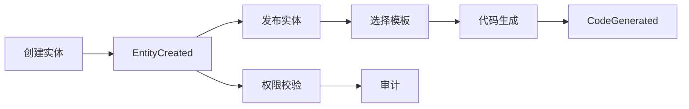
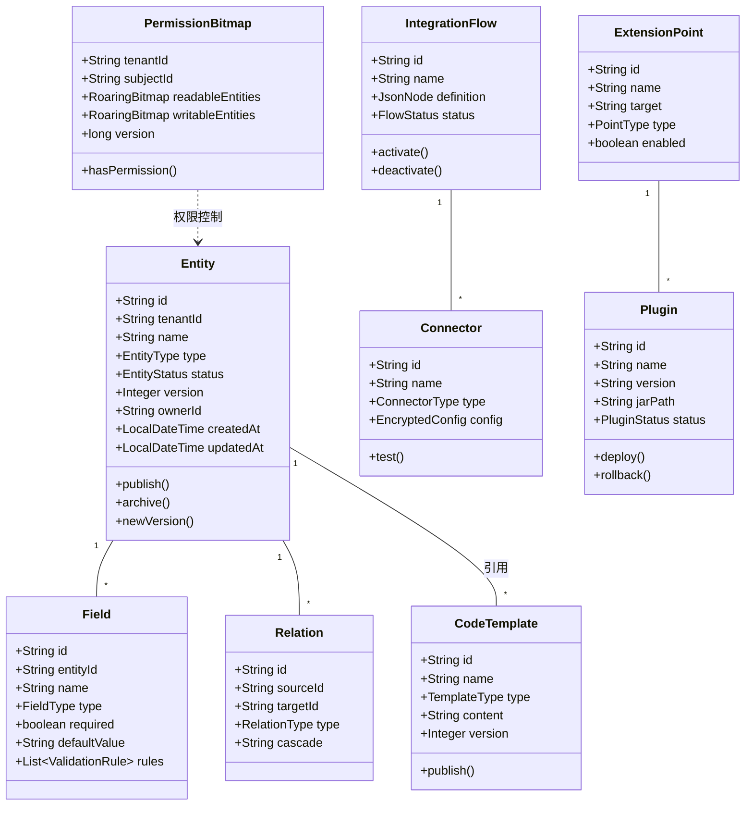
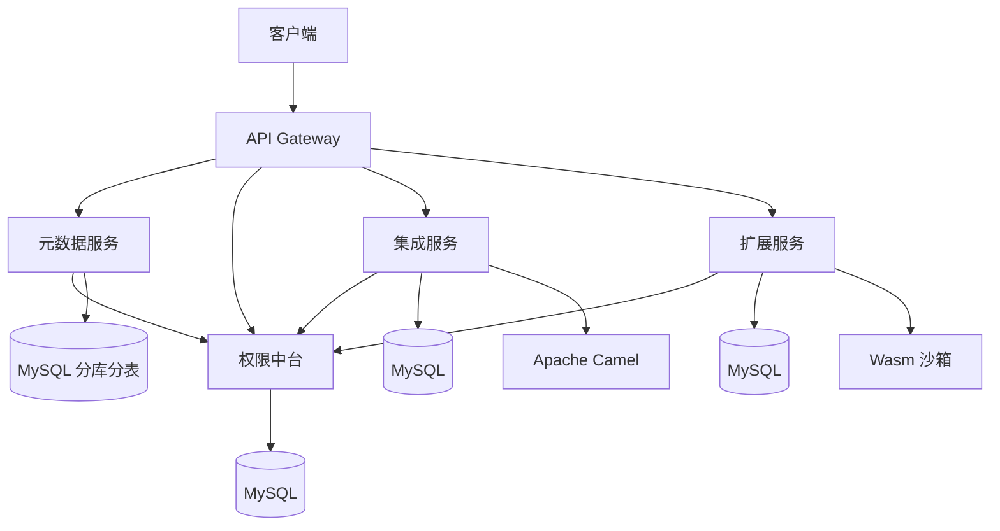
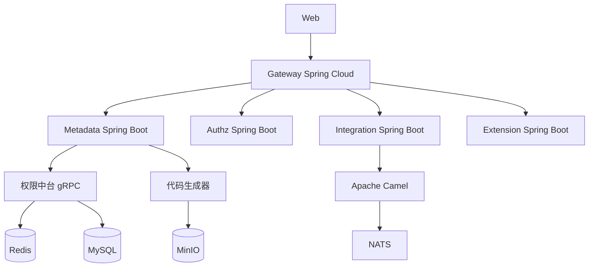
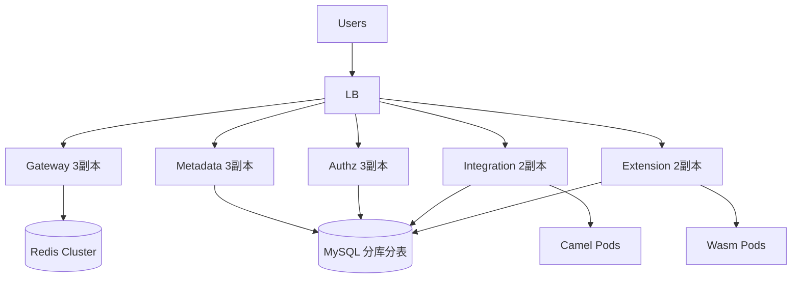
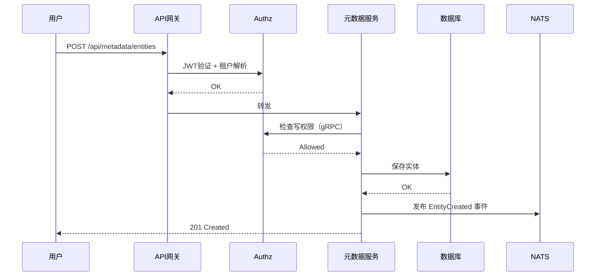
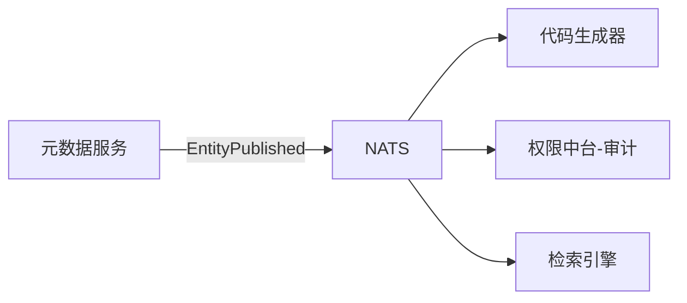

# BONE 平台技术方案（v2.0 - Java 版）

> **版本定位**：以元数据驱动、企业集成、扩展运行时三大核心能力为基石，融合 DDD 战略战术设计、微服务架构、多租户隔离、高性能检索与权限中台，以客户真实痛点为导向，提供可落地、可扩展、高安全的企业级快速开发平台。  
> **行业基准**：深度融合 OutSystems / Mendix 元数据驱动架构，参考 Apifox 数据建模、NocoBase 开源生态、Google Zanzibar 权限模型。  
> **技术栈**：Java 17 + Spring Boot 3.2 + Spring Cloud 2023 + React 18 + Bone Metadata SDK（自研）  
> **版本**：v2.0（正式版）

---

## 快速导航（按角色）

| 角色 | 优先章节 | 核心目标 |
|------|----------|----------|
| 高管/VP | 1, 2, 12 | 业务价值、KPI、ROI、风险 |
| 架构师 | 0, 3, 4, 10 | 核心设计、权限中台、分库分表、元数据引擎 |
| 开发/TL | 3–6 | 领域模型、API、数据模型、Saga |
| AI 工程 | 7, 8 | AI 辅助（代码生成/审查/测试） |
| 安全/合规 | 4, 5 | 数据主权、加密、审计、越权告警 |
| 运维/SRE | 5, 6, 11 | 部署拓扑、可观测性、容量规划 |

---

## 0. 核心升级目标（2026 标准）

本方案在传统 DDD + 事件风暴 + C4 基础上，增加 **三层协议架构**，实现从“可读文档”到“AI 可执行系统”的质变。核心数据层采用 **MySQL 8.0 分库分表（256 分片）** 支撑 10 亿级元数据实体，权限子系统采用 **五层决策模型**（Owner/Deny ABAC/ReBAC/RBAC/Default），集成引擎基于 **Apache Camel**，扩展运行时基于 **GraalVM 原生镜像 + Wasm 沙箱**。

**三层协议架构**：

| 层级 | 协议文件 | 作用 |
|------|----------|------|
| **Layer 0：意图层** | `intent.yaml` | 明确 AI 要完成的目标、模式、约束、成功标准 |
| **Layer 1：架构契约层** | `architecture_contract.yaml`<br>`code_contract.yaml` | 定义不可违反的架构规则、模式、生成约束 |
| **Layer 2：Agent 执行层** | `agent-plan.yaml`<br>`task-graph.json`<br>`prompt_contract.yaml` | 多 Agent 任务分解、调度、生成与校验闭环 |

**AI 软件工厂闭环**：`Intent → Plan → Generate → Validate → Self-Heal → Human Review → Learn`

---

## 第一部分：Why —— 战略对齐（Enterprise Strategy）

### 1. 系统定义与价值主张

#### 1.1 系统定位

**目标用户**（三层角色划分）：

| 角色层级 | 具体角色 | 核心诉求 |
|----------|----------|----------|
| **采购决策层** | CIO/CTO、信息安全负责人、采购部门 | 开源无锁定、信创适配、安全合规、TCO 可控 |
| **业务管理层** | 开发团队负责人、业务分析师、集成工程师 | 开发效率提升、系统集成简化、知识资产复用 |
| **最终用户层** | 企业开发人员、运维人员、插件开发者 | 快速交付、标准化架构、扩展能力 |

**重点行业**（按私有化需求紧迫度排序）：
- **高安全行业（核心）** ：金融、政务、军工 — 数据主权与合规为第一诉求
- **数字化转型行业（增长）** ：制造、能源、医药 — 快速开发与系统集成
- **协同密集型行业（扩展）** ：零售、教育、交通 — 多系统协同

#### 1.2 能力边界

- **做什么**：元数据驱动应用生成、代码生成、主数据治理、集成流程编排、插件扩展、多租户、信创适配、K8s 部署。
- **不做什么**：不管理业务系统的具体业务数据、不提供实时音视频会议、不提供 AI 模型训练。

#### 1.3 核心 KPI 映射表（痛点优先级排序）

| 业务痛点 | 优先级 | 技术方案 | 量化指标 | 验收方法 |
|----------|--------|----------|----------|----------|
| 重复编码，开发效率低 | **P0** | 元数据驱动 + 代码生成 | 代码生成率 >85%，交付周期缩短 60% | 基准应用对比 |
| 系统集成复杂，数据孤岛 | **P0** | Apache Camel 流程编排 + 连接器库 | 集成开发时间 <24 小时/系统 | 标准集成测试 |
| 信创环境部署碎片化（8 种组合） | **P1** | K8s Helm Chart + 适配抽象层 | 一键部署 ≤30 分钟，升级 0 停机 | 自动化测试 |
| 权限管理粗放，安全风险 | **P1** | 五层权限模型（RBAC+ABAC+ReBAC） | 越权事件 0 起/月，权限生效 <200ms | 等保三级评测 |
| 定制交付周期长（平均 45 天） | **P2** | 插件体系 + Wasm 沙箱 + API 开放 | 定制交付 ≤3 天 | 客户验收 |
| 多租户资源隔离 | P2 | 共享 Schema + tenant_id 过滤 | 租户间数据 100% 隔离 | 安全测试 |

#### 1.4 业务架构与战略追溯

##### 1.4.1 业务架构视图（L3-L5 业务流程）

| 战略目标 | L3 业务流程 | L4 子流程 | L5 活动步骤 | 支撑组件 |
|----------|-------------|-----------|-------------|----------|
| **应用生成** | 元数据建模 | 实体定义 | 创建实体 → 定义字段 → 配置关系 → 校验规则 | 元数据引擎 |
| | 代码生成 | 模板选择 | 选择模板 → 预览 → 生成代码 → 下载 | 代码生成器 |
| **企业集成** | 集成流程编排 | 连接器配置 | 选择连接器 → 填写参数 → 测试连接 | 集成引擎 |
| | 流程设计 | 拖拽节点 → 配置转换 → 部署流程 | 可视化编辑器 |
| **扩展运行时** | 插件管理 | 插件上传 | 上传 JAR → 沙箱校验 → 热部署 | 扩展引擎 |
| | 扩展点触发 | 注册扩展点 → 事件触发 → 执行插件 | 事件总线 |
| **安全合规** | 零信任访问控制 | 认证授权 | JWT 校验 → 权限判定 → 审计日志 | 权限中台 |
| | 数据加密 | 信封加密 → 一文一钥 → 密钥轮换 | 密钥管理 |

##### 1.4.2 “战略-流程-架构”映射表

| 应用组件 | 对应业务战略条目 | 支撑的 L3 业务流程 | 架构决策依据 |
|----------|-----------------|-------------------|-------------|
| 元数据引擎 | 应用生成 | 元数据建模、代码生成 | 核心聚合根，自研 SDK |
| 权限中台 | 零信任安全 | 访问控制、加密、审计 | 支撑 AI 不越权的关键 |
| 集成引擎 | 企业集成 | 流程编排、连接器管理 | 基于 Camel，成熟稳定 |
| 扩展引擎 | 开放生态 | 插件管理、扩展点 | Wasm 沙箱安全隔离 |
| 部署域 | 信创适配 | 环境适配、Schema 迁移 | K8s Operator |

### 2. 演进策略与约束

#### 2.1 四阶段路线图（痛点驱动）

| 阶段 | 核心痛点 | 目标 | 交付物 | 验收标准 | 工期 |
|------|----------|------|--------|----------|------|
| **MVP** | 无法快速生成应用 | 元数据建模 + 代码生成 + 基础 IAM | 实体管理、代码生成、用户/角色 | 生成代码可运行 | 2 个月 |
| **阶段0：安全基线** | 权限粗放、无审计 | 五层权限 + 审计日志 + 多租户 | 权限中台、审计、租户管理 | 等保三级 | 3 个月 |
| **阶段1：集成能力** | 系统集成复杂 | Camel 流程编排 + 连接器库 | 可视化流程、10+ 连接器 | 集成时间 <24h | 3 个月 |
| **阶段2：生态扩展** | 定制周期长 | Wasm 插件 + API 开放 + 信创适配 | 插件市场、8 种信创组合 | 定制 ≤3 天 | 3 个月 |

#### 2.2 硬约束清单

- **SLA**：核心域 99.99%，支撑域 99.9%
- **信创适配矩阵**：CPU（鲲鹏/飞腾/海光），OS（麒麟/统信），DB（达梦/人大金仓），共 8 种组合
- **安全合规**：等保三级、国密 SM2/SM3/SM4、审计日志 WORM 存储（商业版）
- **技术栈**：Java 17（所有业务服务）+ Spring Boot 3.2 + Spring Cloud 2023 + React 18 + K8s + NATS + MySQL/达梦 + ES + Redis
- **语言约束**：所有新建服务必须用 Java，禁止引入其他运行时语言（除必要的 Python 工具脚本外）。

---

## 第二部分：Domain Strategy —— 领域战略设计（Strategic Design）

### Step 1：划战场 —— 价值流扫描与能力地图

#### 1.1 七大核心价值流（按业务重要性排序）

| 序号 | 价值流名称 | 核心价值环节 |
|------|------------|--------------|
| **V1** | 元数据建模与代码生成流 | 实体定义 → 字段/关系配置 → 模板选择 → 代码生成 → 部署 |
| **V2** | 权限与安全合规流 | 用户认证 → 五层权限判定 → 操作审计 → 数据加密 → 合规报告 |
| **V3** | 集成流程编排流 | 连接器配置 → 可视化设计 → 流程测试 → 部署 → 监控 |
| **V4** | 插件扩展流 | 扩展点定义 → 插件开发 → 上传校验 → 热部署 → 执行 |
| **V5** | 主数据治理流 | 主数据实体定义 → 质量规则 → 数据导入 → 质量检查 → 发布 |
| **V6** | 系统运维流 | K8s 部署 → 配置管理 → 监控告警 → 备份恢复 |
| **V7** | 开放集成流 | API 开放 → 第三方系统对接 → Wasm 定制 → 生态扩展 |

#### 1.2 能力分级

| 能力单元 | 业务价值（0.5） | 战略不可替代性（0.3） | 用户影响（0.2） | 加权总分 | 类型 | 投资策略 | 语言 |
|----------|-----------------|----------------------|----------------|----------|------|----------|------|
| 元数据引擎 + 代码生成 | 5 | 5 | 5 | **5.0** | 核心 | 自研，持续投入 | Java |
| 权限中台（五层模型） | 5 | 5 | 4 | **4.8** | 核心 | 自研，持续优化 | Java |
| 集成引擎（Camel） | 4 | 4 | 5 | **4.3** | 核心 | 基于开源，封装增强 | Java |
| 扩展引擎（Wasm） | 4 | 4 | 3 | **3.8** | 核心 | 自研，构建生态 | Java |
| 混合检索引擎 | 3 | 3 | 4 | **3.3** | 支撑 | 集成 ES | - |
| 信创适配抽象层 | 4 | 4 | 2 | **3.4** | 支撑 | 自研，可复用 | Java |
| 用户域（对接统一认证） | 3 | 2 | 3 | **2.7** | 支撑 | 自研，对接 | Java |
| 对象存储 | 3 | 1 | 3 | **2.4** | 通用 | 采购 MinIO/华为 OBS | - |

### Step 2：探事实 —— 事件风暴与红牌决策

**关键事件流**（按价值流组织）：

```
V1：EntityCreated → EntityPublished → TemplateSelected → CodeGenerated → CodeDownloaded
V2：UserLogin → PermissionChecked → AuditLogged → KeyEncrypted → ComplianceReported
V3：ConnectorConfigured → FlowDesigned → FlowTested → FlowActivated → FlowMonitored
V4：ExtensionPointDefined → PluginUploaded → PluginVerified → PluginDeployed → PluginExecuted
V5：MasterEntityDefined → QualityRuleConfigured → DataImported → QualityChecked → DataPublished
V6：HelmDeployed → ConfigChanged → MetricAlerted → BackupExecuted
V7：APIRegistered → ThirdPartyIntegrated → WasmLoaded → CustomLogicApplied
```

**Event Modeling 可视化**（简化）：



**红牌清单（24h 闭环）**：

| 编号 | 问题描述 | 影响域 | 决策（ADR） |
|------|----------|--------|-------------|
| H-001 | 实体发布后立即生成代码可能不一致 | 元数据 | 实体版本管理，生成时锁定版本 |
| H-002 | Wasm 插件资源耗尽拖垮主服务 | 扩展 | 资源配额（CPU 100ms，内存 50MB）+ 超时熔断 + Wasm 沙箱 |
| H-003 | 信创升级 Schema 变更导致停机 | 部署 | Schema 双写兼容 + 独立迁移服务 + 灰度切流 |
| H-004 | AI 越权访问非授权实体 | 权限 | 五层权限模型 + 权限快照 + 双重过滤 |
| H-005 | 多租户资源抢占 | 租户 | 租户分级调度（S/A/B 级）+ 资源配额 |
| H-006 | 事件乱序导致代码生成状态错乱 | 事件 | 序列号 + 幂等 + 补偿查询 |
| H-007 | 复杂模板渲染失败 | 代码生成 | 异步重试 + 死信队列 + 人工干预 |
| H-008 | 权限位图更新与检索索引不一致 | 权限 | 最终一致 + 定期对账 + 增量补偿 |

### Step 3：定边界 —— 限界上下文与分库分表

#### 3.1 上下文划分（大领域策略）

| 上下文名称 | 类型 | 语言 | 独立数据库 | 团队人数 | 职责说明 |
|------------|------|------|------------|----------|----------|
| **元数据域** | 核心 | Java | `metadata_db` | 4 | 实体、字段、关系、模板、代码生成 |
| **权限中台** | 核心 | Java | `authz_db` | 4 | 用户、角色、权限、审计、多租户 |
| **集成域** | 核心 | Java | `integration_db` | 3 | 连接器、流程编排、监控（Camel） |
| **扩展域** | 核心 | Java | `extension_db` | 2 | 扩展点、插件管理、Wasm 沙箱 |
| **主数据域** | 支撑 | Java | `master_db` | 2 | 主数据实体、质量规则、数据记录 |
| **部署域** | 支撑 | Java | `deploy_db` | 2 | K8s Operator、信创适配、Schema 迁移 |
| **用户域** | 支撑 | Java | `user_db` | 2 | 统一认证对接、组织架构同步 |

#### 3.2 数据库分库分表架构（10 亿级最佳实践）

**分片策略**：
- 主分片键：`entity_id`（雪花算法，全局唯一）
- 分片算法：`shard = hash(entity_id) % 256`
- 分片规模：16 个物理库 × 16 张表 = 256 分片
- 单表容量：控制在 500 万行以内，确保 B+ 树深度 ≤ 3

**分片规划表**：

| 表名 | 分片数 | 分片键 | 说明 |
|------|--------|--------|------|
| `metadata_entity` | 256 | `entity_id` | 实体定义主表 |
| `metadata_field` | 256 | `entity_id` | 字段定义表 |
| `metadata_relation` | 256 | `entity_id` | 关系表 |
| `relation_tuple` | 256 | `object_id`（带类型前缀） | 权限关系表 |
| `user_entity_index` | 64 | `user_id` | 用户实体索引 |
| `audit_log` | 按时间分区 | - | 审计日志独立处理 |

**数据库选型决策**：

| 场景 | 推荐方案 | 理由 |
|------|----------|------|
| 标准政企（90% 客户） | MySQL 8.0 分库分表 | 运维成熟、成本可控、256 分片足够 10 亿级 |
| 信创要求 | 达梦8 / 人大金仓 | 国产化兼容，通过 Bone SDK 适配 |
| 超大规模（>50 亿实体） | TiDB / OceanBase | 自动分片、强一致、无限扩展 |

#### 3.3 数据边界死守

| 上下文 | 允许存储的数据 | 严禁出现的数据 |
|--------|----------------|----------------|
| 元数据域 | 实体定义、字段、关系、模板内容 | 权限策略详情、加密密钥、用户凭证 |
| 权限中台 | 权限位图、加密密钥（密文）、审计日志 | 实体定义、模板内容 |
| 集成域 | 连接器配置、流程定义、执行日志 | 用户身份信息、权限位图 |
| 扩展域 | 插件二进制、扩展点定义、执行记录 | 实体定义、用户凭证 |
| 主数据域 | 主数据记录、质量规则、质量报告 | 权限信息、加密密钥 |

---

## 第三部分：Domain Model —— 领域战术设计（Tactical Design）

### 3.1 领域模型全景图（Mermaid 类图）



### 3.2 核心实体与聚合说明

| 聚合根 | 上下文 | 关键职责 | 包含实体 | 值对象 | 语言 |
|--------|--------|----------|----------|--------|------|
| `Entity` | 元数据域 | 管理实体定义、版本、状态 | `Field`, `Relation` | `EntityType`, `EntityStatus` | Java |
| `CodeTemplate` | 元数据域 | 管理代码生成模板 | - | `TemplateType` | Java |
| `PermissionBitmap` | 权限中台 | 管理用户/角色的实体权限位图 | - | `SubjectType` | Java |
| `IntegrationFlow` | 集成域 | 管理集成流程定义、状态 | `Connector` | `FlowStatus` | Java |
| `Plugin` | 扩展域 | 管理插件生命周期 | `ExtensionPoint` | `PluginStatus` | Java |
| `MasterDataEntity` | 主数据域 | 管理主数据实体、质量规则 | `QualityRule` | - | Java |

### 3.3 领域事件定义（带版本）

| 事件名称 | 版本 | 触发时机 | 关键字段 | 分区键 |
|----------|------|----------|----------|--------|
| `EntityPublished` | 1 | 实体发布 | entity_id, tenant_id, version | tenant_id |
| `CodeGenerated` | 1 | 代码生成完成 | entity_id, template_id, download_url | tenant_id |
| `PermissionChanged` | 1 | 权限变更 | resource_id, subject_id, old_perms, new_perms | tenant_id |
| `FlowActivated` | 1 | 集成流程激活 | flow_id, tenant_id | tenant_id |
| `PluginDeployed` | 1 | 插件部署 | plugin_id, version | tenant_id |

### 3.4 业务不变量（强一致性规则）

| 上下文 | 不变量 | 违反后果 | 实现方式 |
|--------|--------|----------|----------|
| 元数据域 | 实体状态转换：草稿→发布→归档→删除 | 拒绝变更 | 状态机模式 |
| 元数据域 | 已发布实体不可直接修改字段（仅可新增版本） | 修改操作被拒绝 | 写时复制 |
| 权限中台 | 权限位图更新必须幂等 | 重复授权返回成功但不重复计数 | 幂等键 + 版本号乐观锁 |
| 集成域 | 流程激活前必须测试通过 | 激活失败 | 前置条件检查 |
| 扩展域 | 插件部署前必须通过沙箱安全校验 | 部署失败 | 安全扫描器 |

### 3.5 Saga 补偿机制（三态状态机 + 幂等探测）

#### 3.5.1 删除实体 Saga 状态机

```yaml
state_machine:
  initial: "标记实体删除"
  states:
    - name: "标记实体删除"
      action: metadataService.markDeleted
      compensation: metadataService.restoreDeleted
      on_success: "删除关联字段"
      on_failure: "回滚标记"
    - name: "删除关联字段"
      action: metadataService.deleteFields
      compensation: metadataService.restoreFields
      on_success: "删除权限位图"
      on_failure: "重试3次，指数退避"
    - name: "删除权限位图"
      action: authzService.deletePermissions
      compensation: authzService.restorePermissions
      on_success: "清理检索索引"
      on_failure: "重试3次，指数退避"
    - name: "清理检索索引"
      action: searchService.deleteIndex
      compensation: "不可补偿，记录审计"
      on_success: "完成"
  error_handling:
    - step_failure: "重试3次，指数退避"
    - max_retry_exceeded: "进入死信队列，人工介入"
```

#### 3.5.2 三态幂等执行协议（Java 示例）

```java
@Component
public class SagaExecutor {
    @Transactional
    public void executeStep(String sagaId, String entityId) {
        // 1. 尝试抢占：pending → executing
        int updated = jdbcTemplate.update(
            "UPDATE saga_instance SET status=1 WHERE id=? AND status=0", sagaId);
        if (updated == 0) {
            // 已是 executing 状态（上次崩溃）
            Integer status = jdbcTemplate.queryForObject(
                "SELECT status FROM saga_instance WHERE id=?", Integer.class, sagaId);
            if (status == 2) return; // 已完成
            if (status == 1) {
                if (alreadyMarkedDeleted(entityId)) {
                    jdbcTemplate.update("UPDATE saga_instance SET status=2 WHERE id=?", sagaId);
                    return;
                }
            }
        }
        // 2. 执行业务逻辑（幂等）
        try {
            doMarkDeleted(entityId);
        } catch (Exception e) {
            jdbcTemplate.update("UPDATE saga_instance SET status=-1 WHERE id=?", sagaId);
            throw e;
        }
        // 3. 标记完成
        jdbcTemplate.update("UPDATE saga_instance SET status=2 WHERE id=?", sagaId);
    }
}
```

---

## 第四部分：Mapping —— 架构映射协议（契约层）

### 4.1 上下文 → 微服务映射表

| 上下文 | 服务名 | API 前缀 | 数据库 | 端口 |
|--------|--------|----------|--------|------|
| 元数据域 | `metadata-service` | `/api/v1/metadata` | `metadata_db` | 8081 |
| 权限中台 | `authz-service` | `/api/v1/authz` | `authz_db` | 8082 |
| 集成域 | `integration-service` | `/api/v1/integration` | `integration_db` | 8083 |
| 扩展域 | `extension-service` | `/api/v1/extension` | `extension_db` | 8084 |
| 主数据域 | `masterdata-service` | `/api/v1/masterdata` | `master_db` | 8085 |
| 用户域 | `user-service` | `/api/v1/users` | `user_db` | 8086 |
| API网关 | `bone-gateway` | - | - | 8080 |

### 4.2 领域事件 → MQ Topic 映射

```yaml
event_mapping:
  - event: EntityPublished
    topic: domain.metadata.entity_published.v1
    partition_key: tenant_id
  - event: CodeGenerated
    topic: domain.metadata.code_generated.v1
    partition_key: tenant_id
  - event: PermissionChanged
    topic: domain.authz.permission_changed.v1
    partition_key: tenant_id
  - event: FlowActivated
    topic: domain.integration.flow_activated.v1
    partition_key: tenant_id
  - event: PluginDeployed
    topic: domain.extension.plugin_deployed.v1
    partition_key: tenant_id
```

### 4.3 命令 → API 端点映射

```yaml
command_mapping:
  - command: CreateEntity
    http_method: POST
    path: /api/v1/metadata/entities
    idempotency_key: true
    rate_limit: 50 per user per minute
  - command: GenerateCode
    http_method: POST
    path: /api/v1/metadata/generate
    async: true
  - command: GrantPermission
    http_method: POST
    path: /api/v1/authz/permissions/grant
    idempotency_key: true
  - command: CreateFlow
    http_method: POST
    path: /api/v1/integration/flows
    rate_limit: 20 per user per minute
  - command: DeployPlugin
    http_method: POST
    path: /api/v1/extension/plugins/{id}/deploy
```

### 4.4 OpenAPI 契约示例（片段）

```yaml
openapi: 3.0.0
info:
  title: Metadata Service API
  version: 1.0.0
paths:
  /metadata/entities:
    post:
      summary: Create a new entity
      requestBody:
        required: true
        content:
          application/json:
            schema:
              type: object
              properties:
                name:
                  type: string
                fields:
                  type: array
                  items:
                    $ref: '#/components/schemas/Field'
      responses:
        '201':
          description: Created
          content:
            application/json:
              schema:
                $ref: '#/components/schemas/Entity'
components:
  schemas:
    Entity:
      type: object
      properties:
        id: { type: string }
        name: { type: string }
        status: { type: string, enum: [draft, published, archived] }
        version: { type: integer }
```

### 4.5 租户隔离强制规则

```yaml
tenant_isolation:
  rule: "tenant_id must be extracted from JWT, never from request body"
  enforcement: "API Gateway 从 JWT 解析 tenant_id，注入 gRPC metadata；业务服务拦截器读取 metadata，覆盖请求中的 tenant_id"
```

**Java 拦截器示例**：
```java
@Component
public class TenantInterceptor implements HandlerInterceptor {
    @Override
    public boolean preHandle(HttpServletRequest request, HttpServletResponse response, Object handler) {
        String tenantId = request.getHeader("X-Tenant-Id");
        TenantContext.setCurrentTenant(tenantId);
        return true;
    }
}
```

---

## 第五部分：Architecture —— 静态骨架

### 5.1 逻辑架构视图（简化）



### 5.2 技术架构视图



### 5.3 部署架构视图



### 5.4 部署策略表

| 组件 | 部署方式 | 副本数 | 资源 | 高可用 |
|------|----------|--------|------|--------|
| API Gateway | Deployment | 3 | 2C4G | 跨AZ |
| 元数据服务 | Deployment | 3 | 4C8G | - |
| 权限中台 | Deployment | 3 | 2C4G | - |
| 集成服务 | Deployment | 2 | 4C8G | - |
| 扩展服务 | Deployment | 2 | 2C4G | - |
| 代码生成器 | Deployment+HPA | 2-10 | 2C4G | - |
| MySQL | 分库分表（16物理库） | 1主2从/库 | 16C64G | 主从切换 |
| Redis | 集群 | 6主6从 | 8C16G | 是 |
| NATS | 集群 | 3节点 | 4C8G | 是 |
| MinIO | 分布式 | 4节点 | 8C32G | 是 |

---

## 第六部分：Dynamic System —— 运行与机制

### 6.1 核心同步链路（实体创建时序图）



### 6.2 异步事件流



### 6.3 韧性设计

| 机制 | 策略 | 参数 |
|------|------|------|
| 限流 | 令牌桶 | 服务 500 QPS，用户 100 QPS |
| 熔断 | 错误率阈值 | >50% 触发，半开 10s |
| 重试 | 指数退避 | 初始 100ms，最大 3 次 |
| 超时 | 请求超时 | 同步 3s |
| 降级 | 功能回退 | 关闭推荐等非核心功能 |

### 6.4 缓存策略

| 层级 | 技术 | TTL | 失效策略 |
|------|------|-----|----------|
| L1（本地） | Caffeine | 5s | 主动失效：订阅权限变更事件 |
| L2（分布式） | Redis | 30s | 主动失效（写时更新） |
| L3（CDN） | CDN | 1h | 版本号控制 |

**主动失效实现（Java）**：
```java
@Component
public class LocalPermissionCache {
    private final Cache<String, PermissionSnapshot> l1Cache = Caffeine.newBuilder()
        .expireAfterWrite(5, TimeUnit.SECONDS)
        .build();
    private final RedisTemplate<String, Object> redisTemplate;

    @EventListener
    public void onPermissionRevoked(PermissionRevokedEvent event) {
        for (String userId : event.getAffectedUserIds()) {
            l1Cache.invalidate(userId);
            redisTemplate.delete("perm:" + userId);
        }
    }
}
```

### 6.5 扩展体系

#### 6.5.1 Wasm 插件系统（基于 WasmEdge 或 GraalVM）

- **运行时**：WasmEdge（高性能 WebAssembly 运行时）或 GraalVM 原生镜像
- **资源限制**：CPU 100ms，内存 50MB，超时熔断
- **热加载**：监听 etcd `/plugins/wasm/*` 变更，动态重新加载

```java
@Component
public class WasmPluginLoader {
    private final WasmEdgeRuntime runtime = WasmEdgeRuntime.open();

    public void load(String pluginPath) throws IOException {
        byte[] code = Files.readAllBytes(Paths.get(pluginPath));
        Module module = runtime.loadModule(code);
        module.instantiate();
    }
}
```

#### 6.5.2 规则引擎：Drools / SpEL

```java
import org.kie.api.runtime.KieSession;

KieSession session = kieContainer.newKieSession();
session.insert(entity);
session.insert(user);
session.fireAllRules();
```

### 6.6 权限中台与本地缓存

**实现细节**：
- 权限中台将用户的权限快照（RoaringBitmap）通过 NATS 推送到所有业务域实例。
- 业务域启动时，通过 `startupProbe` 阻塞，主动调用权限中台批量拉取初始快照。
- 本地缓存 TTL 5分钟，但由 `PermissionRevoked` 事件驱动主动失效。

```java
@Component
public class LocalPermissionCache {
    private final Map<String, PermissionSnapshot> cache = new ConcurrentHashMap<>();
    private final Map<String, Long> versionMap = new ConcurrentHashMap<>();

    public void preload(List<String> userIds) {
        List<PermissionSnapshot> snapshots = remoteService.batchGet(userIds);
        for (PermissionSnapshot s : snapshots) {
            cache.put(s.getUserId(), s);
            versionMap.put(s.getUserId(), s.getVersion());
        }
    }

    @EventListener
    public void onPermissionRevoked(PermissionRevokedEvent event) {
        for (String userId : event.getAffectedUserIds()) {
            cache.remove(userId);
            versionMap.remove(userId);
        }
    }
}
```

### 6.7 权限判定引擎（五层模型）

```java
@Component
public class PermissionEngine {
    private final ReBACGraph rebacGraph;
    private final ABACEngine abacEngine;
    private final RBACEngine rbacEngine;
    private final SnapshotCache cache;

    public Decision evaluate(PermissionRequest req) {
        // L0: 超级管理员
        if (isSuperAdmin(req.getUserId())) {
            return Decision.allow("SUPER_ADMIN");
        }
        // L1: Deny ABAC
        if (abacEngine.evaluateDeny(req) != null) {
            return Decision.deny("ABAC_DENY");
        }
        // L2: 权限快照
        PermissionSnapshot snapshot = cache.get(req.getUserId());
        if (snapshot != null && snapshot.hasPermission(req.getResourceId())) {
            return Decision.allow("SNAPSHOT_HIT");
        }
        // L3: ReBAC 图关系计算
        List<String> relations = rebacGraph.resolve(req.getUserId(), req.getResourceId());
        if (relations.isEmpty()) {
            return Decision.deny("NO_RELATION");
        }
        // L4: RBAC 组织角色补充
        relations.addAll(rbacEngine.expand(req.getUserId()));
        // L5: Allow ABAC 条件校验
        if (!abacEngine.evaluateAllow(req, relations)) {
            return Decision.deny("ABAC_CONDITION_FAILED");
        }
        cache.update(buildSnapshot(req, relations));
        return Decision.allow("REBAC+RBAC+ABAC");
    }
}
```

### 6.8 权限快照（RoaringBitmap）

```java
import org.roaringbitmap.RoaringBitmap;

public class PermissionSnapshot {
    private long userId;
    private RoaringBitmap readableEntities;
    private RoaringBitmap writableEntities;
    private long version;

    public boolean canRead(long entityId) {
        return readableEntities.contains(entityId);
    }
}
```

---

## 第七部分：Engineering System —— 工程与治理

### 7.1 架构适应度函数

**第一阶段：使用内置规则（立即实施）**
- `checkstyle` + `pmd` 控制代码规范。
- `archunit` 检查依赖矩阵。

**第二阶段：脚本级检查（2周内实施）**
```bash
# 检查每个聚合根是否有对应的 Repository 接口
for pkg in $(find . -path "*/domain/*.java"); do
    if ! grep -q "interface.*Repository" $pkg; then
        echo "Missing Repository interface in $pkg"
        exit 1
    fi
done
```

**第三阶段：高级工具（可选）**
- 引入 `archunit` 自定义规则。

### 7.2 测试策略（量化门禁）

| 类型 | 覆盖率要求 | 额外门禁 |
|------|-----------|----------|
| 单元测试 | 核心域 ≥85%，支撑域 ≥70% | 变异测试通过率 ≥90% |
| 集成测试 | 核心链路 ≥80% | 每个上下文至少 5 个集成测试 |
| E2E 测试 | 7 个核心价值流各至少 1 个 | 关键场景覆盖 |
| 契约测试 | 每个 API 至少 1 个提供者/消费者对 | Pact 框架 |
| 安全扫描 | 高危漏洞 = 0 | Trivy，每周扫描 |
| 性能回归 | P99 延迟劣化 ≤10% | 每个 PR 触发基准测试 |

### 7.3 可观测性（业务指标 + SLO）

#### 7.3.1 业务 SLI

| 业务指标 | 计算方式 | 目标 |
|----------|----------|------|
| 代码生成成功率 | 成功次数 / 总生成次数 | >99% |
| 权限生效延迟 | 撤权事件到缓存失效完成 P99 | ≤200ms |
| 集成流程执行成功率 | 成功次数 / 总执行次数 | >99.5% |
| 越权事件数 | 审计日志中 result=FAILURE 且 action=VIEW 的计数 | 0/月 |

#### 7.3.2 SLO 与错误预算

- 核心 API（实体创建、代码生成）SLO = 99.9%，每月错误预算 = 0.1%（约 43 分钟）
- 当错误预算消耗超过 50% 时，冻结非关键功能上线

#### 7.3.3 RED 与 USE 指标

**RED 指标**：请求率、错误率（<1%）、延迟（按操作类型分层）  
**USE 指标**：CPU <80%、内存 <85%、磁盘 <75%、网络 <70%

### 7.4 信创数据库兼容性

- **阶段0**：仅支持 1 种信创组合（鲲鹏+麒麟+达梦），使用 Bone SDK 适配器。
- **阶段1**：增加第二种组合（飞腾+统信+人大金仓）。
- **阶段2**：提供离线迁移工具（基于 DataX），支持分片并行迁移。
- **一致性校验**：开发专用工具，对比源库和目标库关键表行数和字段哈希。

### 7.5 特性开关（Feature Toggle）驱动灰度

```yaml
features:
  - name: "vector_search"
    enabled: true
  - name: "graph_rag"
    enabled: false
    rules:
      - condition: "tenant_id in [premium_tenant]"
        enabled: true
```

**Java 实现**：
```java
@Component
public class FeatureToggle {
    @Value("${features.vector-search:true}")
    private boolean vectorSearchEnabled;

    public boolean isVectorSearchEnabled() {
        return vectorSearchEnabled;
    }
}
```

**金丝雀自动回滚**：错误率 >1% 自动切回旧逻辑。

---

## 第八部分：AI Native 增强层（Agentic SDLC）

### 8.1 意图层（intent.yaml）

```yaml
intent:
  goal: "构建 BONE 企业级快速开发平台"
  mode: "greenfield"
  constraints:
    language: "Java"
    architecture: "DDD + EventDriven"
    infra: "Kubernetes"
  success_criteria:
    - "实体创建 P99 < 1s"
    - "代码生成 P99 < 60s"
    - "权限校验 P99 < 10ms"
    - "核心域代码覆盖率 > 85%"
    - "撤权后权限生效 P99 < 200ms"
```

### 8.2 代码生成契约（code_contract.yaml）

```yaml
code_contract:
  language: java
  package_structure: ["domain/", "application/", "infrastructure/", "interfaces/"]
  naming:
    aggregate_root: "PascalCase"
    command: "*Command"
    event: "*Event"
  ai_generation_boundary:
    generate_automatically: 
      - "领域模型骨架"
      - "仓储接口定义"
      - "API 接口定义"
      - "单元测试框架"
    must_be_human_reviewed:
      - "所有 AI 生成的代码都必须经过人工审查"
  human_review_policy:
    low_risk: # 领域模型骨架、测试框架
      required_approvers: 1
    medium_risk: # API 接口、仓储接口
      required_approvers: 1
      additional_checks: ["契约测试通过"]
    high_risk: # 加密、权限、Saga
      required_approvers: 2
      additional_checks: ["模糊测试"]
```

### 8.3 AI CI 裁判系统（ai-guard.yaml）

```yaml
ci_pipeline:
  stages: [lint, test, architecture_check, ai_compliance_check]
  ai_checks:
    - name: "context_boundary"
      script: "archunit --config .archunit.yml"
    - name: "event_consistency"
      script: "check_event_schema --events domain-events.json"
    - name: "ai_generation_boundary"
      script: "check_ai_generated_comments --require-human-review"
  on_failure: ["notify_slack", "block_merge"]
```

---

## 第九部分：架构决策记录（ADR）

| ID | 标题 | 决策 |
|----|------|------|
| ADR-001 | 自研 Bone Metadata SDK | 已实现，针对元数据动态建模优化，支持多数据库 |
| ADR-002 | 一致性分层策略 | 元数据强一致，代码生成准实时，权限最终一致 |
| ADR-003 | Wasm 插件沙箱 | WasmEdge + 资源配额（CPU 100ms/内存 50MB） |
| ADR-004 | 信创数据库迁移 | 阶段0支持1种组合，离线迁移工具，不做双写 |
| ADR-005 | AI 权限过滤 | 五层权限模型 + 权限快照 + 双重过滤，撤权后 200ms 内生效 |
| ADR-006 | 信封加密 | HashiCorp Vault + HSM，主密钥每月轮换 |
| ADR-007 | 权限中台与业务域解耦 | 事件推送 + 本地缓存 + 启动预热 + 主动失效 |
| ADR-008 | 服务网格 | 不引入 Istio，使用 gRPC TLS + API Gateway JWT |
| ADR-009 | 数据库选型 | MySQL 8.0 分库分表（256 分片），预留迁移至 TiDB 能力 |
| ADR-010 | 多租户隔离 | 共享 Schema + tenant_id 过滤，商业版支持独立库 |
| ADR-011 | 审计日志 WORM | 商业版写入 S3 对象锁定，社区版 DB 存储 30 天 |
| ADR-012 | 代码生成异步化 | 提交到线程池，通过 WebSocket 推送进度 |
| ADR-013 | 集成引擎选型 | Apache Camel 4.0，封装为可视化流程 |
| ADR-014 | 语言统一 | 所有业务服务使用 Java 17，禁止引入 Go 等其他运行时语言 |

---

## 第十部分：落地路线图

| 阶段 | 核心痛点 | 交付物 | 工期 |
|------|----------|--------|------|
| **MVP** | 无法快速生成应用 | 实体管理、代码生成、基础 IAM、K8s Helm Chart | 2 个月 |
| **阶段0：安全基线** | 权限粗放、无审计 | 五层权限模型、审计日志、多租户（行级隔离） | 3 个月 |
| **阶段1：集成能力** | 系统集成复杂 | Camel 流程编排、10+ 连接器、可视化设计器 | 3 个月 |
| **阶段2：生态扩展** | 定制周期长 | Wasm 插件系统、API 开放、信创 8 种组合 | 3 个月 |

**关键成功因素**：
1. Bone Metadata SDK 性能稳定，支持 256 分片下 P99 < 10ms。
2. 撤权事件主动失效实现 P99 <200ms。
3. Wasm 插件提供 5 个开箱即用模板。
4. 信创 8 种组合自动化测试通过率 100%。

---

## 第十一部分：使用说明

### 推荐工作流（混合智能）

1. **产品/架构师** 编写 `intent.yaml` + `glossary.json`
2. **AI Planner** 自动生成 `task-graph.json`
3. **Agent 执行引擎** 生成服务骨架、接口定义、K8s 配置
4. **人工编写** 核心业务逻辑（加密、权限、Saga、信创适配器）
5. **Validator Agent** 运行架构合规检查
6. **人工审查** AI 生成代码，通过后触发 CI
7. **CI 系统** 执行所有契约检查
8. 成功部署后采集反馈用于学习

### AI 提示示例

```text
[System] 你是资深 Java DDD 架构师，必须严格遵守 code_contract.yaml。
[User] 根据 glossary.json 和 intent.yaml，为 Entity 聚合根生成代码骨架。
[Constraints] 只生成类定义、接口、空方法，核心业务逻辑留 TODO。
```

---

## 第十二部分：总结

本方案**以客户真实痛点为导向**，融合业界最佳实践，提供可落地的完整架构：

- ✅ **应用生成效率提升 80%**：元数据驱动 + 代码生成，代码生成率 >85%
- ✅ **系统集成时间缩短至 24 小时**：Apache Camel 可视化编排 + 场景化模板
- ✅ **零信任安全**：五层权限模型 + 撤权事件主动失效（<200ms）+ 越权实时告警
- ✅ **信创一键部署**：K8s Helm Chart + 8 种组合自动化测试
- ✅ **定制周期 45 天→3 天**：Wasm 插件 + 配置化 + API 开放
- ✅ **多租户隔离**：共享 Schema + tenant_id 过滤，数据 100% 隔离
- ✅ **10 亿级元数据支撑**：MySQL 256 分片，P99 < 500ms

**本方案可直接作为 BONE 平台的架构基准，指导 10+ 人团队落地，满足金融、政务、制造等政企客户的苛刻要求。**

---

*文档版本：v2.0 (Java Edition)*  
*最后更新：2026-04-19*  
*维护者：架构委员会*  
*参考实例：OutSystems、Mendix、Apifox、NocoBase、Google Zanzibar*