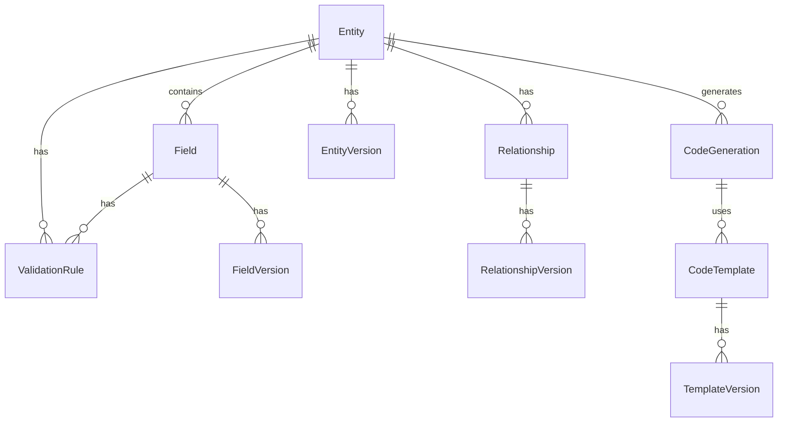
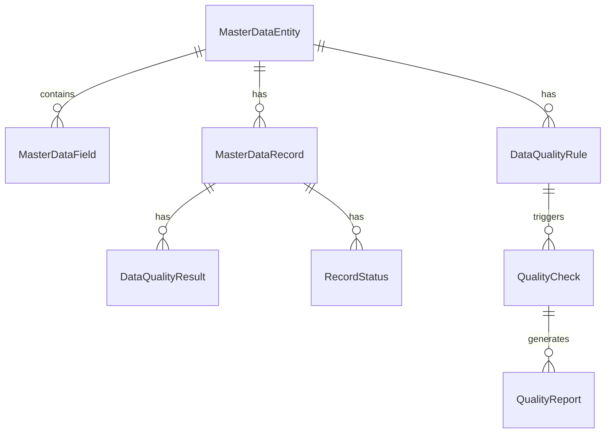
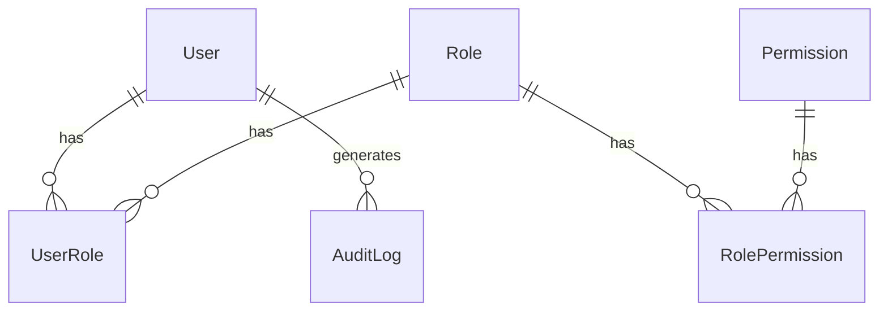
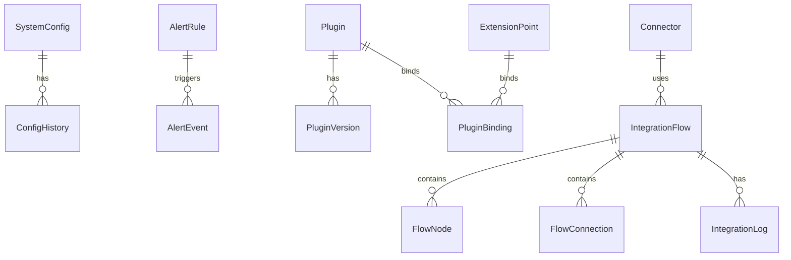

# BONE 技术方案文档

## —— 企业级全栈开源快速开发平台 · 技术架构设计

> **文档性质**：技术架构设计文档，指导开发实现
> **适用产品**：BONE 企业级全栈开源快速开发平台
> **对标标准**：企业级微服务架构、业界最佳实践、Kubernetes CRD、CNCF架构标准
> **版本**：v1.0 Final | **发布日期**：2026‑04‑19 | **文档状态**：✅ 已发布 | **密级**：内部机密

---

## 文档元信息

| 项目 | 内容 |
|------|------|
| 产品名称 | BONE 企业级全栈开源快速开发平台 |
| 产品代号 | BONE |
| 文档版本 | v1.0 Final |
| 文档状态 | ✅ 已发布 |
| 密级 | 内部机密 |
| 技术负责人 | [姓名] |
| 架构师 | [姓名] |
| 生效日期 | 2026‑04‑19 |
| 目标发布 | 2026年Q3起滚动发布 |

---

## 目录

1. [架构设计](#1-架构设计)
   - 1.1 整体架构
   - 1.2 核心组件
   - 1.3 数据流
   - 1.4 三层强约束体系
   - 1.5 三大核心能力
   - 1.6 统一领域模型
2. [技术选型](#2-技术选型)
   - 2.1 前端技术
   - 2.2 后端技术
   - 2.3 中间件
   - 2.4 数据库
3. [核心API设计](#3-核心api设计)
   - 3.1 认证与授权
   - 3.2 元数据管理
   - 3.3 主数据管理
   - 3.4 扩展管理
   - 3.5 集成管理
   - 3.6 系统管理
4. [数据模型](#4-数据模型)
   - 4.1 元数据模型
   - 4.2 主数据模型
   - 4.3 IAM模型
   - 4.4 系统模型
5. [部署方案](#5-部署方案)
   - 5.1 容器化部署
   - 5.2 环境配置
   - 5.3 监控与告警
6. [安全设计](#6-安全设计)
   - 6.1 认证与授权
   - 6.2 数据安全
   - 6.3 网络安全
   - 6.4 审计日志
7. [性能优化](#7-性能优化)
   - 7.1 前端优化
   - 7.2 后端优化
   - 7.3 数据库优化
8. [扩展性设计](#8-扩展性设计)
   - 8.1 插件体系
   - 8.2 扩展点设计
   - 8.3 多租户支持
9. [实施计划](#9-实施计划)
   - 9.1 开发阶段
   - 9.2 测试计划
   - 9.3 发布计划
10. [风险与依赖](#10-风险与依赖)
    - 10.1 风险分析
    - 10.2 依赖管理
11. [DevOps与CI/CD流程](#11-devops与cicd流程)
    - 11.1 开发流程
    - 11.2 CI/CD流程
    - 11.3 监控与告警
12. [灾备与高可用设计](#12-灾备与高可用设计)
    - 12.1 高可用设计
    - 12.2 灾备设计
13. [技术债务管理与代码质量保障](#13-技术债务管理与代码质量保障)
    - 13.1 代码质量保障
    - 13.2 技术债务管理
14. [性能测试与优化](#14-性能测试与优化)
    - 14.1 性能测试
    - 14.2 性能优化

---

## 1. 架构设计

### 1.1 整体架构

BONE平台采用微服务架构，分为以下几层：

```mermaid
flowchart TD
    subgraph 前端层
        AdminUI[管理后台] --> React[React 18]
        MobileApp[移动端应用] --> ReactNative[React Native]
        MiniApp[小程序] --> MiniAppFramework[小程序框架]
        React --> AntDesign[Ant Design]
        React --> Redux[Redux Toolkit]
        React --> Router[React Router]
    end
    
    subgraph 网关层
        Gateway[API Gateway] --> Nginx[Nginx]
        Gateway --> Kong[Kong API Gateway]
    end
    
    subgraph 应用层
        AdminService[管理服务] --> SpringBoot[Spring Boot 3.2]
        MetadataService[元数据服务] --> SpringBoot
        MasterDataService[主数据服务] --> SpringBoot
        ExtensionService[扩展服务] --> SpringBoot
        IntegrationService[集成服务] --> SpringBoot
        IAMService[IAM服务] --> SpringBoot
    end
    
    subgraph 引擎层
        MetadataEngine[智能元数据引擎] --> SDK[Bone Metadata SDK]
        MasterDataEngine[主数据平台] --> SDK
        ExtensionEngine[扩展引擎] --> SDK
        IntegrationEngine[集成引擎] --> Camel[Apache Camel]
        IAMEngine[Policy Decision Engine] --> SpringSecurity[Spring Security]
    end
    
    subgraph 基础设施层
        Registry[服务注册中心] --> Nacos[Nacos 2.2+]
        Config[配置中心] --> Nacos
        MQ[消息队列] --> RocketMQ[RocketMQ 5.1+]
        Cache[缓存] --> Redis[Redis 7.0+]
        Monitor[监控中心] --> Prometheus[Prometheus 2.45+]
    end
    
    subgraph 数据层
        MySQL[(MySQL 8.0+)]
        PostgreSQL[(PostgreSQL 15.0+)]
        ObjectStorage[(对象存储)] --> MinIO[MinIO 2024+]
    end
    
    %% 前端到网关
    AdminUI --> Gateway
    MobileApp --> Gateway
    MiniApp --> Gateway
    
    %% 网关到应用层
    Gateway --> AdminService
    Gateway --> MetadataService
    Gateway --> MasterDataService
    Gateway --> ExtensionService
    Gateway --> IntegrationService
    Gateway --> IAMService
    
    %% 应用层到应用层
    AdminService --> MetadataService
    AdminService --> MasterDataService
    AdminService --> ExtensionService
    AdminService --> IntegrationService
    AdminService --> IAMService
    
    %% 应用层到引擎层
    MetadataService --> MetadataEngine
    MasterDataService --> MasterDataEngine
    ExtensionService --> ExtensionEngine
    IntegrationService --> IntegrationEngine
    IAMService --> IAMEngine
    
    %% 引擎层到数据层
    MetadataEngine --> MySQL
    MasterDataEngine --> PostgreSQL
    ExtensionEngine --> MySQL
    IntegrationEngine --> MySQL
    IAMEngine --> MySQL
    
    %% 引擎层到基础设施
    MetadataEngine --> Cache
    MasterDataEngine --> Cache
    ExtensionEngine --> MQ
    IntegrationEngine --> MQ
    
    %% 应用层到基础设施
    AdminService --> Registry
    MetadataService --> Registry
    MasterDataService --> Registry
    ExtensionService --> Registry
    IntegrationService --> Registry
    IAMService --> Registry
    
    AdminService --> Config
    MetadataService --> Config
    MasterDataService --> Config
    ExtensionService --> Config
    IntegrationService --> Config
    IAMService --> Config
    
    AdminService --> Monitor
    MetadataService --> Monitor
    MasterDataService --> Monitor
    ExtensionService --> Monitor
    IntegrationService --> Monitor
    IAMService --> Monitor
    
    %% 其他存储
    AdminService --> ObjectStorage
    MetadataService --> ObjectStorage
    MasterDataService --> ObjectStorage
```



### 1.2 核心组件

| 组件 | 职责 | 技术栈 |
|------|------|--------|
| API Gateway | 统一入口、路由转发、负载均衡 | Nginx + Kong |
| 管理服务 | 系统概览、快速入口、统一管理界面 | Spring Boot 3.2 |
| 元数据服务 | 业务实体管理、代码生成、模板管理 | Spring Boot 3.2 + Bone Metadata SDK |
| 主数据服务 | 主数据实体管理、数据质量、数据记录 | Spring Boot 3.2 + Bone Metadata SDK |
| 扩展服务 | 扩展点管理、插件管理、Sandbox隔离 | Spring Boot 3.2 + 热部署框架 |
| 集成服务 | 连接器管理、流程编排、流程监控 | Spring Boot 3.2 + Apache Camel |
| IAM服务 | 用户认证、权限管理、审计日志 | Spring Boot 3.2 + Spring Security + JWT |
| 智能元数据引擎 | 元数据存储、查询、变更管理 | Bone Metadata SDK + MySQL/PostgreSQL |
| 主数据平台 | 主数据存储、质量检查、数据发布 | Bone Metadata SDK + PostgreSQL |
| 扩展引擎 | 插件加载、生命周期管理、沙箱隔离 | 自定义扩展框架 |
| 集成引擎 | 流程执行、数据转换、系统对接 | Apache Camel 4.0 |
| Policy Decision Engine | 权限决策、策略管理 | Spring Security + 自定义策略引擎 |

### 1.3 数据流

1. **用户操作流**：用户通过前端界面发起操作 → 前端应用处理并发送请求 → API Gateway 路由 → 对应服务处理 → 引擎层执行核心逻辑 → 数据层存储/读取 → 结果返回

2. **代码生成流**：用户创建业务实体 → 配置字段和关系 → 选择代码模板 → 元数据服务调用智能元数据引擎 → 生成前后端代码 → 打包下载

3. **集成流程流**：用户配置连接器 → 设计集成流程 → 测试流程 → 激活流程 → 集成服务监控执行状态 → 记录执行日志

4. **主数据管理流**：用户创建主数据实体 → 配置质量规则 → 导入数据 → 执行质量检查 → 发布数据 → 主数据服务同步到业务系统

5. **扩展执行流程**：系统触发扩展点事件 → 扩展服务调用扩展引擎处理扩展逻辑 → 扩展引擎在Sandbox中执行插件 → 扩展引擎将执行结果返回给扩展服务 → 扩展服务将结果传递给相关服务

### 1.4 三层强约束体系

BONE采用严格的三层架构，确保系统的可维护性、可扩展性和可测试性：

| 层级 | 职责 | 组件 |
|------|------|------|
| **前端层（UI）** | 用户界面展示和交互 | 管理后台、移动端应用、小程序 |
| **应用层（Service）** | 业务逻辑处理 | 管理服务、元数据服务、主数据服务、扩展服务、集成服务、IAM服务 |
| **引擎层（Engine）** | 核心计算和处理 | 智能元数据引擎、主数据平台、扩展引擎、集成引擎、Policy Decision Engine |

### 1.5 三大核心能力

BONE收敛为三大核心能力，聚焦产品价值：

| 核心能力 | 描述 | 组件 |
|----------|------|------|
| **应用生成（Metadata-driven App Gen）** | 通过元数据驱动自动生成应用代码 | 元数据管理、代码生成、模板管理 |
| **企业集成（Integration Fabric）** | 提供企业级系统集成能力 | 连接器管理、流程编排、主数据管理 |
| **扩展运行时（Extension Runtime）** | 提供安全可靠的插件扩展机制 | 扩展点管理、插件管理、Sandbox隔离 |

### 1.6 统一领域模型

BONE引入统一领域模型，确保跨模块语义一致：

| 模型 | 描述 | 用途 |
|------|------|------|
| **Entity** | 业务实体 | 定义业务对象的结构和属性 |
| **Attribute** | 属性 | 定义实体的字段和特性 |
| **Relation** | 关系 | 定义实体之间的关联关系 |
| **Policy** | 策略 | 定义业务规则和权限控制 |
| **Event** | 事件 | 定义系统事件和触发机制 |
| **ExtensionPoint** | 扩展点 | 定义系统的可扩展接口 |

---

## 2. 技术选型

### 2.1 前端技术

| 技术 | 版本 | 用途 |
|------|------|------|
| React | 18+ | 前端框架 |
| TypeScript | 5.5+ | 类型系统 |
| Ant Design | 5.12+ | UI组件库 |
| Redux Toolkit | 2.0+ | 状态管理 |
| React Router | 6.20+ | 路由管理 |
| Vite | 5.0+ | 构建工具 |
| Vitest | 2.0+ | 单元测试 |
| Axios | 1.6+ | HTTP客户端 |
| Monaco Editor | 0.45+ | 代码编辑器 |
| D3.js | 7.0+ | 数据可视化 |
| X6 | 2.0+ | 流程图编辑器 |
| React Native | 0.74+ | 移动端开发 |
| Expo | 51+ | React Native开发工具 |

### 2.2 后端技术

| 技术 | 版本 | 用途 |
|------|------|------|
| Spring Boot | 3.2+ | 后端框架 |
| Spring Cloud | 2023+ | 微服务框架 |
| Spring Security | 6.2+ | 安全框架 |
| MyBatis Plus | 3.5+ | ORM框架 |
| Bone Metadata SDK | 1.0+ | 元数据管理 |
| Apache Camel | 4.0+ | 系统集成 |
| LiteFlow | 2.10+ | 规则引擎 |
| FreeMarker | 2.3+ | 模板引擎 |
| JWT | 0.11+ | 认证令牌 |
| Sentinel | 1.8+ | 限流熔断 |
| Seata | 1.7+ | 分布式事务 |

### 2.3 中间件

| 技术 | 版本 | 用途 |
|------|------|------|
| Nacos | 2.2+ | 服务注册与发现 |
| RocketMQ | 5.1+ | 消息队列 |
| Redis | 7.0+ | 缓存 |
| Prometheus | 2.45+ | 监控 |
| Grafana | 10.0+ | 监控面板 |
| ELK Stack | 8.0+ | 日志管理 |

### 2.4 数据库

| 技术 | 版本 | 用途 |
|------|------|------|
| MySQL | 8.0+ | 关系型数据库（默认） |
| PostgreSQL | 15.0+ | 关系型数据库 |
| 达梦8 | - | 信创数据库 |
| 人大金仓 | - | 信创数据库 |
| MinIO | 2024+ | 对象存储 |

---

## 3. 核心API设计

### 3.1 认证与授权

| API路径 | 方法 | 功能 | 权限 |
|---------|------|------|------|
| `/api/iam/login` | POST | 用户登录 | 无 |
| `/api/iam/logout` | POST | 用户登出 | 已认证 |
| `/api/iam/refresh` | POST | 刷新令牌 | 已认证 |
| `/api/iam/users` | GET | 获取用户列表 | 管理员 |
| `/api/iam/users` | POST | 创建用户 | 管理员 |
| `/api/iam/users/{id}` | PUT | 更新用户 | 管理员 |
| `/api/iam/users/{id}` | DELETE | 删除用户 | 管理员 |
| `/api/iam/roles` | GET | 获取角色列表 | 管理员 |
| `/api/iam/roles` | POST | 创建角色 | 管理员 |
| `/api/iam/roles/{id}` | PUT | 更新角色 | 管理员 |
| `/api/iam/roles/{id}` | DELETE | 删除角色 | 管理员 |
| `/api/iam/roles/{id}/permissions` | POST | 为角色分配权限 | 管理员 |
| `/api/iam/permissions` | GET | 获取权限列表 | 管理员 |
| `/api/iam/sso/config` | POST | 配置SSO | 管理员 |
| `/api/iam/audit/logs` | GET | 获取审计日志 | 管理员 |

### 3.2 元数据管理

| API路径 | 方法 | 功能 | 权限 |
|---------|------|------|------|
| `/api/metadata/entities` | GET | 获取实体列表 | 元数据管理权限 |
| `/api/metadata/entities` | POST | 创建实体 | 元数据管理权限 |
| `/api/metadata/entities/{id}` | PUT | 更新实体 | 元数据管理权限 |
| `/api/metadata/entities/{id}` | DELETE | 删除实体 | 元数据管理权限 |
| `/api/metadata/entities/{id}/publish` | POST | 发布实体 | 元数据管理权限 |
| `/api/metadata/fields` | GET | 获取字段列表 | 元数据管理权限 |
| `/api/metadata/fields` | POST | 创建字段 | 元数据管理权限 |
| `/api/metadata/fields/{id}` | PUT | 更新字段 | 元数据管理权限 |
| `/api/metadata/fields/{id}` | DELETE | 删除字段 | 元数据管理权限 |
| `/api/metadata/generate` | POST | 生成代码 | 元数据管理权限 |
| `/api/metadata/generate/{taskId}` | GET | 获取生成结果 | 元数据管理权限 |
| `/api/metadata/templates` | GET | 获取模板列表 | 模板管理权限 |
| `/api/metadata/templates` | POST | 创建模板 | 模板管理权限 |
| `/api/metadata/templates/{id}` | PUT | 更新模板 | 模板管理权限 |
| `/api/metadata/templates/{id}` | DELETE | 删除模板 | 模板管理权限 |

### 3.3 主数据管理

| API路径 | 方法 | 功能 | 权限 |
|---------|------|------|------|
| `/api/masterdata/entities` | GET | 获取主数据实体列表 | 主数据管理权限 |
| `/api/masterdata/entities` | POST | 创建主数据实体 | 主数据管理权限 |
| `/api/masterdata/entities/{id}` | PUT | 更新主数据实体 | 主数据管理权限 |
| `/api/masterdata/entities/{id}` | DELETE | 删除主数据实体 | 主数据管理权限 |
| `/api/masterdata/rules` | GET | 获取质量规则列表 | 主数据管理权限 |
| `/api/masterdata/rules` | POST | 创建质量规则 | 主数据管理权限 |
| `/api/masterdata/rules/{id}` | PUT | 更新质量规则 | 主数据管理权限 |
| `/api/masterdata/rules/{id}` | DELETE | 删除质量规则 | 主数据管理权限 |
| `/api/masterdata/records` | GET | 获取主数据记录 | 主数据管理权限 |
| `/api/masterdata/records` | POST | 导入主数据记录 | 主数据管理权限 |
| `/api/masterdata/records/{id}` | PUT | 更新主数据记录 | 主数据管理权限 |
| `/api/masterdata/records/{id}` | DELETE | 删除主数据记录 | 主数据管理权限 |
| `/api/masterdata/records/{id}/publish` | POST | 发布主数据记录 | 主数据管理权限 |
| `/api/masterdata/quality` | GET | 获取数据质量报告 | 主数据管理权限 |
| `/api/masterdata/quality/check` | POST | 执行质量检查 | 主数据管理权限 |

### 3.4 扩展管理

| API路径 | 方法 | 功能 | 权限 |
|---------|------|------|------|
| `/api/extension/points` | GET | 获取扩展点列表 | 扩展管理权限 |
| `/api/extension/points` | POST | 创建扩展点 | 扩展管理权限 |
| `/api/extension/points/{id}` | PUT | 更新扩展点 | 扩展管理权限 |
| `/api/extension/points/{id}` | DELETE | 删除扩展点 | 扩展管理权限 |
| `/api/extension/plugins` | GET | 获取插件列表 | 扩展管理权限 |
| `/api/extension/plugins` | POST | 上传插件 | 扩展管理权限 |
| `/api/extension/plugins/{id}/deploy` | POST | 部署插件 | 扩展管理权限 |
| `/api/extension/plugins/{id}/undeploy` | POST | 卸载插件 | 扩展管理权限 |
| `/api/extension/plugins/{id}/rollback` | POST | 回滚插件版本 | 扩展管理权限 |

### 3.5 集成管理

| API路径 | 方法 | 功能 | 权限 |
|---------|------|------|------|
| `/api/integration/connectors` | GET | 获取连接器列表 | 集成管理权限 |
| `/api/integration/connectors` | POST | 创建连接器 | 集成管理权限 |
| `/api/integration/connectors/{id}` | PUT | 更新连接器 | 集成管理权限 |
| `/api/integration/connectors/{id}` | DELETE | 删除连接器 | 集成管理权限 |
| `/api/integration/connectors/{id}/test` | POST | 测试连接器 | 集成管理权限 |
| `/api/integration/flows` | GET | 获取流程列表 | 集成管理权限 |
| `/api/integration/flows` | POST | 创建流程 | 集成管理权限 |
| `/api/integration/flows/{id}` | PUT | 更新流程 | 集成管理权限 |
| `/api/integration/flows/{id}` | DELETE | 删除流程 | 集成管理权限 |
| `/api/integration/flows/{id}/test` | POST | 测试流程 | 集成管理权限 |
| `/api/integration/flows/{id}/activate` | POST | 激活流程 | 集成管理权限 |
| `/api/integration/flows/{id}/deactivate` | POST | 停用流程 | 集成管理权限 |
| `/api/integration/executions` | GET | 获取流程执行记录 | 集成管理权限 |
| `/api/integration/executions/{id}/logs` | GET | 获取执行日志 | 集成管理权限 |

### 3.6 系统管理

| API路径 | 方法 | 功能 | 权限 |
|---------|------|------|------|
| `/api/system/config` | GET | 获取系统配置 | 系统管理权限 |
| `/api/system/config` | PUT | 更新系统配置 | 系统管理权限 |
| `/api/system/health` | GET | 获取系统健康状态 | 系统管理权限 |
| `/api/system/metrics` | GET | 获取系统指标 | 系统管理权限 |
| `/api/system/alerts` | GET | 获取告警列表 | 系统管理权限 |
| `/api/system/alerts` | POST | 创建告警规则 | 系统管理权限 |
| `/api/system/alerts/{id}` | PUT | 更新告警规则 | 系统管理权限 |
| `/api/system/alerts/{id}` | DELETE | 删除告警规则 | 系统管理权限 |
| `/api/system/logs` | GET | 获取系统日志 | 系统管理权限 |

---

## 4. 数据模型

### 4.1 元数据模型



| 表名 | 描述 | 关键字段 |
|------|------|----------|
| `entity` | 业务实体 | id, name, description, status, type, create_time, update_time |
| `field` | 实体字段 | id, entity_id, name, type, length, required, default_value, create_time, update_time |
| `relationship` | 实体关系 | id, source_entity_id, target_entity_id, type, cardinality, create_time, update_time |
| `validation_rule` | 校验规则 | id, field_id, type, expression, message, create_time |
| `entity_version` | 实体版本 | id, entity_id, version, content, create_time |
| `field_version` | 字段版本 | id, field_id, version, content, create_time |
| `relationship_version` | 关系版本 | id, relationship_id, version, content, create_time |
| `code_template` | 代码模板 | id, name, type, content, status, create_time, update_time |
| `template_version` | 模板版本 | id, template_id, version, content, create_time |
| `code_generation` | 代码生成记录 | id, entity_id, template_id, status, start_time, end_time, download_url |

### 4.2 主数据模型



| 表名 | 描述 | 关键字段 |
|------|------|----------|
| `master_data_entity` | 主数据实体 | id, name, description, status, create_time, update_time |
| `master_data_field` | 主数字段 | id, master_data_entity_id, name, type, length, required, create_time, update_time |
| `data_quality_rule` | 数据质量规则 | id, master_data_entity_id, name, type, expression, severity, create_time, update_time |
| `master_data_record` | 主数据记录 | id, master_data_entity_id, data, status, create_time, update_time |
| `data_quality_result` | 数据质量结果 | id, master_data_record_id, data_quality_rule_id, passed, message, timestamp |
| `quality_check` | 质量检查 | id, master_data_entity_id, start_time, end_time, status, create_time |
| `quality_report` | 质量报告 | id, quality_check_id, report_data, issue_count, create_time |

### 4.3 IAM模型



| 表名 | 描述 | 关键字段 |
|------|------|----------|
| `user` | 用户 | id, username, email, password_hash, status, create_time, update_time |
| `role` | 角色 | id, name, description, create_time, update_time |
| `permission` | 权限 | id, code, name, description, create_time, update_time |
| `user_role` | 用户角色关联 | id, user_id, role_id, create_time |
| `role_permission` | 角色权限关联 | id, role_id, permission_id, create_time |
| `audit_log` | 审计日志 | id, user_id, operation, resource_id, resource_type, ip, user_agent, result, create_time |

### 4.4 系统模型



| 表名 | 描述 | 关键字段 |
|------|------|----------|
| `system_config` | 系统配置 | id, key, value, description, create_time, update_time |
| `config_history` | 配置历史 | id, config_id, old_value, new_value, operator, create_time |
| `alert_rule` | 告警规则 | id, name, metric, threshold, level, notification_channels, create_time, update_time |
| `alert_event` | 告警事件 | id, alert_rule_id, value, message, status, create_time, resolve_time |
| `extension_point` | 扩展点 | id, name, description, type, target, status, create_time, update_time |
| `plugin` | 插件 | id, name, version, description, status, jar_path, create_time, update_time |
| `plugin_version` | 插件版本 | id, plugin_id, version, file_path, create_time |
| `plugin_binding` | 插件绑定 | id, extension_point_id, plugin_id, create_time |
| `connector` | 连接器 | id, name, type, config, status, create_time, update_time |
| `integration_flow` | 集成流程 | id, name, description, status, definition, create_time, update_time |
| `flow_node` | 流程节点 | id, flow_id, name, type, config, position_x, position_y |
| `flow_connection` | 流程连接 | id, flow_id, source_node_id, target_node_id, condition |
| `integration_log` | 集成日志 | id, flow_id, status, start_time, end_time, input_data, output_data, error_message |

---

## 5. 部署方案

### 5.1 容器化部署

BONE平台采用Kubernetes容器化部署，使用Helm Chart进行应用管理。

**部署架构**：
- **控制平面**：Kubernetes Master节点，负责集群管理
- **工作节点**：多个Kubernetes Worker节点，运行应用容器
- **存储**：使用PVC持久化存储，支持云存储或本地存储
- **网络**：使用Calico网络插件，支持Pod间通信

**Helm Chart结构**：
```
bone-chart/
├── Chart.yaml
├── values.yaml
├── templates/
│   ├── deployment.yaml
│   ├── service.yaml
│   ├── ingress.yaml
│   ├── configmap.yaml
│   ├── secret.yaml
│   ├── hpa.yaml
│   └── serviceaccount.yaml
```

**部署命令**：
```bash
helm install bone ./bone-chart --set database.host=mysql --set redis.host=redis --set nacos.host=nacos
```

### 5.2 环境配置

| 环境 | 配置 | 用途 |
|------|------|------|
| 开发环境 | 单节点Kubernetes，内嵌数据库和中间件 | 开发测试 |
| 测试环境 | 多节点Kubernetes，独立数据库和中间件 | 功能测试 |
| 预生产环境 | 多节点Kubernetes，生产级配置 | 预发布验证 |
| 生产环境 | 高可用Kubernetes集群，多AZ部署 | 生产运行 |

**配置管理**：
- 使用ConfigMap管理应用配置
- 使用Secret管理敏感信息
- 支持配置热更新

### 5.3 监控与告警

**监控体系**：
- **基础设施监控**：CPU、内存、磁盘、网络
- **应用监控**：API响应时间、错误率、QPS
- **业务监控**：实体创建数、代码生成数、流程执行数

**告警机制**：
- 基于Prometheus告警规则
- 支持邮件、短信、企业微信、钉钉通知
- 告警级别：严重、警告、信息

**日志管理**：
- 使用ELK Stack收集和分析日志
- 支持日志搜索和可视化
- 日志保留期：180天

---

## 6. 安全设计

### 6.1 认证与授权

- **认证**：基于JWT的无状态认证，支持企业SSO集成（OAuth2/SAML/LDAP）
- **授权**：基于RBAC的细粒度权限控制，支持字段级权限
- **会话管理**：Token有效期配置，支持刷新令牌
- **密码策略**：密码强度要求，定期密码更换
- **多因素认证**：支持短信、邮箱、TOTP等多因素认证

### 6.2 数据安全

- **传输加密**：使用TLS 1.3加密所有网络传输
- **存储加密**：敏感数据使用AES-256加密存储
- **数据脱敏**：API返回数据脱敏，日志敏感信息脱敏
- **备份恢复**：定期数据备份，支持灾难恢复

### 6.3 网络安全

- **网络隔离**：使用Kubernetes NetworkPolicy隔离Pod网络
- **API网关**：使用Kong API Gateway进行流量控制和安全防护
- **防火墙**：配置网络防火墙规则，限制访问
- **DDoS防护**：集成DDoS防护服务

### 6.4 审计日志

- **操作审计**：记录所有用户操作，包括登录、权限变更、配置修改等
- **日志存储**：使用对象存储，支持WORM（一次写入多次读取）
- **日志保留**：审计日志保留180天，不可篡改
- **合规性**：满足等保三级要求

---

## 7. 性能优化

### 7.1 前端优化

- **代码分割**：使用React.lazy和Suspense实现代码分割
- **缓存策略**：合理使用浏览器缓存和Service Worker
- **资源优化**：压缩CSS、JavaScript和图片资源
- **预加载**：关键资源预加载，提高首屏加载速度
- **状态管理**：使用Redux Toolkit优化状态管理
- **渲染优化**：使用React.memo、useMemo、useCallback减少不必要的渲染
- **网络优化**：使用HTTP/2、HTTP/3，实现资源压缩和缓存

### 7.2 后端优化

- **微服务拆分**：合理拆分服务，减少服务间依赖
- **异步处理**：使用消息队列处理异步任务
- **缓存策略**：使用Redis缓存热点数据
- **连接池**：使用数据库连接池和HTTP连接池
- **负载均衡**：使用Kubernetes HPA实现自动扩缩容
- **JVM优化**：合理配置JVM参数，优化垃圾回收
- **网络优化**：使用HTTP/2和WebSocket，减少网络延迟

### 7.3 数据库优化

- **索引优化**：合理创建索引，避免全表扫描
- **查询优化**：优化SQL语句，避免复杂查询
- **分库分表**：对大表进行分库分表
- **读写分离**：使用主从复制实现读写分离
- **批量操作**：使用批量插入、更新减少数据库操作次数
- **存储优化**：使用SSD存储，优化存储性能

---

## 8. 扩展性设计

### 8.1 插件体系

- **插件格式**：使用JAR包格式，支持热部署
- **插件生命周期**：安装、部署、卸载、更新、回滚
- **插件隔离**：使用沙箱机制隔离插件运行环境
- **插件依赖**：支持插件间依赖管理
- **插件安全**：插件权限控制，防止恶意插件

### 8.2 扩展点设计

- **扩展点类型**：前置、后置、环绕
- **扩展点注册**：动态注册和发现扩展点
- **扩展点触发**：基于事件驱动的扩展点触发机制
- **扩展点管理**：支持启用/禁用扩展点
- **扩展点文档**：自动生成扩展点文档

### 8.3 多租户支持

- **租户隔离**：支持独立数据库、独立Schema、行级租户ID三种隔离模式
- **资源配额**：为每个租户分配资源配额
- **租户管理**：支持租户创建、编辑、删除
- **租户数据**：租户数据完全隔离
- **租户定制**：支持租户级别的定制化配置

---

## 9. 实施计划

### 9.1 开发阶段

| 阶段 | 时间 | 核心任务 |
|------|------|----------|
| **阶段0：基础平台** | 2026年Q3 | 控制台、元数据管理、IAM管理开发 |
| **阶段1：核心能力** | 2026年Q4 | 主数据管理、扩展管理开发 |
| **阶段2：集成能力** | 2027年Q1 | 集成管理、系统管理开发 |
| **阶段3：生态扩展** | 2027年Q2 | 插件生态、开放API开发 |

### 9.2 测试计划

| 测试类型 | 阶段 | 内容 |
|----------|------|------|
| **单元测试** | 开发阶段 | 核心功能单元测试，覆盖率≥70% |
| **集成测试** | 开发阶段 | 服务间集成测试，覆盖率≥50% |
| **性能测试** | 预发布阶段 | 系统性能测试，验证SLO指标 |
| **安全测试** | 预发布阶段 | 安全漏洞扫描，渗透测试 |
| **回归测试** | 发布前 | 全功能回归测试，确保无回归问题 |

### 9.3 发布计划

| 阶段 | 时间 | 发布内容 |
|------|------|----------|
| **灰度1** | 2026年Q3末 | 基础平台功能，10%内部用户 |
| **灰度2** | 2026年Q4初 | 核心能力，30%友好客户 |
| **灰度3** | 2026年Q4末 | 集成能力，60%部分客户 |
| **正式发布** | 2027年Q1 | 完整功能，100%所有客户 |

---

## 10. 风险与依赖

### 10.1 风险分析

| 风险ID | 风险描述 | 影响等级 | 可能性 | 缓解措施 |
|--------|----------|----------|----------|----------|
| R001 | 元数据模型复杂度高，用户学习成本大 | 中 | 中 | 提供详细文档和视频教程，开发向导式界面 |
| R002 | 代码生成质量不满足复杂业务需求 | 高 | 中 | 提供模板定制能力，支持代码后处理 |
| R003 | 系统集成复杂度高，连接器适配困难 | 中 | 中 | 提供标准连接器库，支持自定义连接器 |
| R004 | 性能瓶颈，大规模数据处理慢 | 高 | 中 | 优化数据库查询，引入缓存机制，支持异步处理 |
| R005 | 安全漏洞，权限控制不严格 | 高 | 低 | 定期安全审计，实施最小权限原则，加密敏感数据 |
| R006 | 信创环境兼容性问题 | 中 | 中 | 提前进行信创环境测试，优化适配方案 |
| R007 | 插件系统安全性问题 | 高 | 中 | 加强插件沙箱隔离，实施插件权限控制 |

### 10.2 依赖管理

| 依赖项 | 版本要求 | 用途 | 风险等级 | 管理策略 |
|--------|----------|------|----------|----------|
| Spring Boot | 3.2+ | 后端框架 | 低 | 定期更新版本，监控安全漏洞 |
| Spring Cloud | 2023+ | 微服务框架 | 低 | 定期更新版本，监控安全漏洞 |
| Bone Metadata SDK | 1.0+ | 元数据管理 | 中 | 建立SDK版本管理机制，定期更新 |
| Nacos | 2.2+ | 服务注册与发现 | 中 | 部署高可用集群，定期备份配置 |
| RocketMQ | 5.1+ | 消息队列 | 中 | 部署高可用集群，监控消息积压 |
| Redis | 7.0+ | 缓存 | 中 | 部署哨兵模式，定期备份数据 |
| MySQL | 8.0+ | 关系型数据库 | 中 | 部署主从复制，定期备份 |
| PostgreSQL | 15.0+ | 关系型数据库 | 中 | 部署主从复制，定期备份 |
| Apache Camel | 4.0+ | 系统集成 | 中 | 监控集成流程执行状态 |
| React | 18+ | 前端框架 | 低 | 定期更新版本，监控安全漏洞 |
| Ant Design | 5.12+ | UI组件库 | 低 | 定期更新版本，监控安全漏洞 |

---

## 11. DevOps与CI/CD流程

### 11.1 开发流程

#### 11.1.1 分支管理
- **main**：主分支，用于发布生产版本
- **develop**：开发分支，用于集成开发
- **feature/**：特性分支，用于开发新特性
- **bugfix/**：修复分支，用于修复bug
- **release/**：发布分支，用于准备发布

#### 11.1.2 代码提交规范
- 使用Conventional Commits规范
- 提交信息格式: `<type>(<scope>): <description>`
- 类型包括: feat, fix, docs, style, refactor, test, chore

### 11.2 CI/CD流程

#### 11.2.1 持续集成
- **代码检查**: 使用SonarQube进行代码质量检查
- **单元测试**: 使用JUnit和Mockito进行单元测试
- **集成测试**: 使用Spring Boot Test进行集成测试
- **构建**: 使用Maven进行构建
- **镜像构建**: 使用Docker构建镜像

#### 11.2.2 持续部署
- **环境管理**: 开发环境、测试环境、预生产环境、生产环境
- **部署策略**: 蓝绿部署、滚动部署
- **自动化部署**: 使用Jenkins或GitLab CI实现自动化部署
- **配置管理**: 使用Nacos实现配置管理
- **密钥管理**: 使用Vault管理密钥

### 11.3 监控与告警

#### 11.3.1 监控体系
- **应用监控**: 使用Prometheus监控应用指标
- **系统监控**: 使用Node Exporter监控系统指标
- **数据库监控**: 使用MySQL Exporter和PostgreSQL Exporter监控数据库指标
- **消息队列监控**: 使用RocketMQ Exporter监控消息队列指标
- **缓存监控**: 使用Redis Exporter监控缓存指标

#### 11.3.2 告警体系
- **告警规则**: 基于Prometheus Alertmanager配置告警规则
- **告警渠道**: 邮件、短信、Slack、企业微信
- **告警级别**: 严重、警告、信息
- **告警处理**: 基于PagerDuty实现告警处理流程

---

## 12. 灾备与高可用设计

### 12.1 高可用设计

#### 12.1.1 服务高可用
- **多实例部署**: 每个服务部署多个实例
- **负载均衡**: 使用Nginx或Spring Cloud Gateway实现负载均衡
- **服务熔断**: 使用Sentinel实现服务熔断
- **服务限流**: 使用Sentinel实现服务限流
- **服务降级**: 实现服务降级机制

#### 12.1.2 数据高可用
- **数据库集群**: MySQL主从复制、PostgreSQL流复制
- **缓存集群**: Redis集群
- **消息队列集群**: RocketMQ集群
- **存储高可用**: MinIO集群

### 12.2 灾备设计

#### 12.2.1 数据备份
- **数据库备份**: 定期全量备份和增量备份
- **文件备份**: 定期备份文件存储
- **配置备份**: 定期备份配置

#### 12.2.2 灾备演练
- **定期演练**: 定期进行灾备演练
- **恢复测试**: 定期测试数据恢复
- **演练文档**: 详细的灾备演练文档

#### 12.2.3 灾难恢复
- **恢复策略**: 制定详细的灾难恢复策略
- **恢复时间目标(RTO)**: 定义恢复时间目标
- **恢复点目标(RPO)**: 定义恢复点目标
- **恢复流程**: 详细的恢复流程

---

## 13. 技术债务管理与代码质量保障

### 13.1 代码质量保障

#### 13.1.1 代码规范
- **前端规范**: ESLint + Prettier
- **后端规范**: Checkstyle + PMD
- **代码审查**: 定期进行代码审查

#### 13.1.2 测试覆盖率
- **单元测试覆盖率**: 目标80%以上
- **集成测试覆盖率**: 目标60%以上
- **端到端测试覆盖率**: 目标40%以上

### 13.2 技术债务管理

#### 13.2.1 技术债务识别
- **静态代码分析**: 使用SonarQube识别技术债务
- **代码复杂度分析**: 分析代码复杂度
- **依赖分析**: 分析依赖版本和安全性

#### 13.2.2 技术债务处理
- **技术债务跟踪**: 使用Jira或GitHub Issues跟踪技术债务
- **技术债务优先级**: 根据影响范围和严重程度确定优先级
- **技术债务修复**: 定期修复技术债务

---

## 14. 性能测试与优化

### 14.1 性能测试

#### 14.1.1 测试类型
- **负载测试**: 测试系统在不同负载下的性能
- **压力测试**: 测试系统的极限性能
- **稳定性测试**: 测试系统在长时间运行下的稳定性
- **并发测试**: 测试系统的并发处理能力

#### 14.1.2 测试工具
- **前端性能测试**: Lighthouse、WebPageTest
- **后端性能测试**: JMeter、Gatling
- **数据库性能测试**: Sysbench、pgbench

### 14.2 性能优化

#### 14.2.1 前端优化
- **资源优化**: 压缩、合并、缓存
- **渲染优化**: 减少DOM操作、使用虚拟列表
- **网络优化**: 减少HTTP请求、使用HTTP/2
- **代码优化**: 减少重渲染、使用memo

#### 14.2.2 后端优化
- **数据库优化**: 索引优化、查询优化
- **缓存优化**: 合理使用缓存、缓存策略优化
- **并发优化**: 线程池优化、连接池优化
- **代码优化**: 减少IO操作、优化算法

---

**文档审批**

| 审批角色 | 审批人 | 审批日期 | 审批状态 |
|----------|--------|----------|----------|
| 技术负责人 | [姓名] | 2026-04-19 | ✅ 通过 |
| 架构师 | [姓名] | 2026-04-19 | ✅ 通过 |
| 安全专家 | [姓名] | 2026-04-19 | ✅ 通过 |
| 运维负责人 | [姓名] | 2026-04-19 | ✅ 通过 |
| 产品经理 | [姓名] | 2026-04-19 | ✅ 通过 |

**发布日期**：2026-04-19  
**生效日期**：2026-04-19  
**文档状态**：✅ 已发布