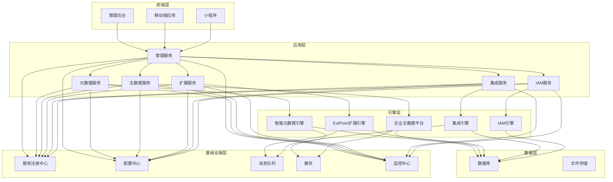
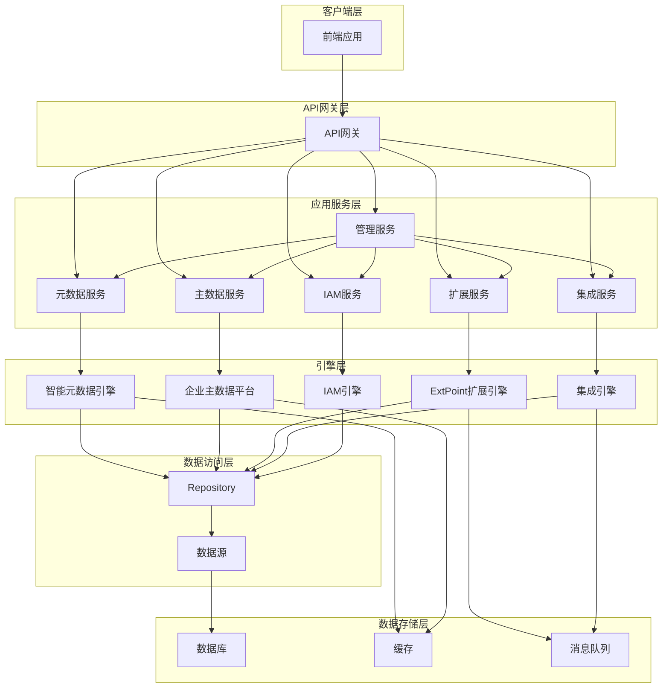
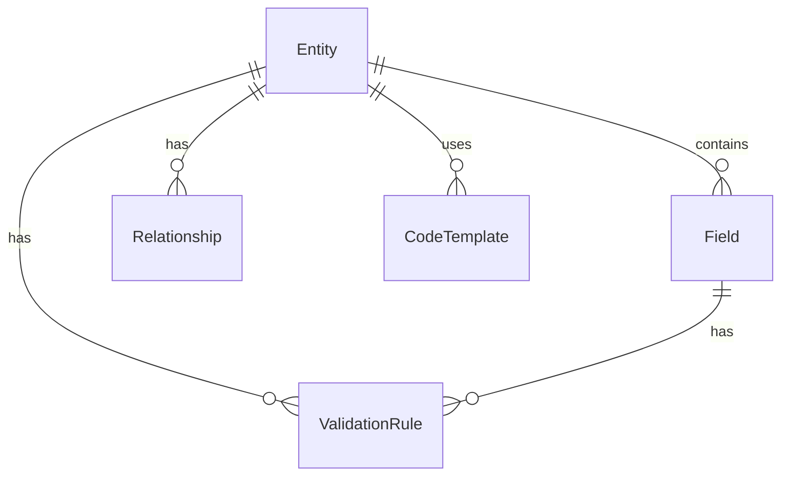
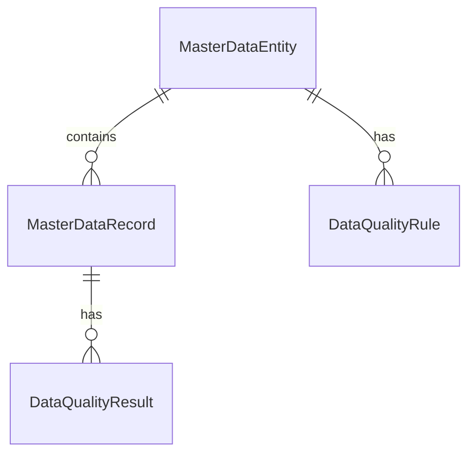
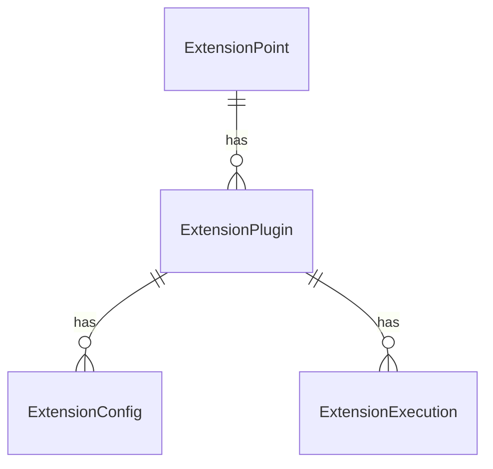
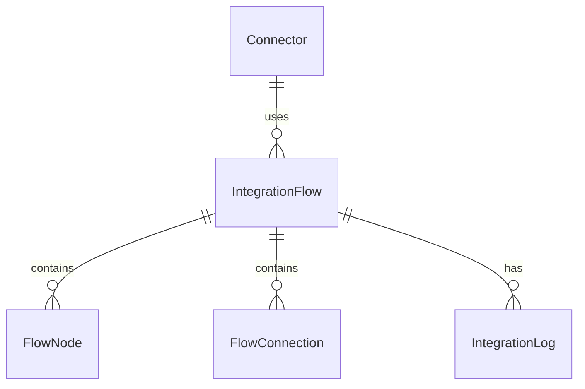
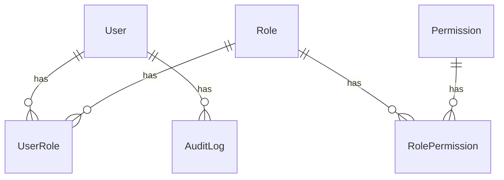

# BONE技术架构设计方案

## 1. 架构设计

## 2. 技术选型

### 2.1 前端技术

| 技术 | 版本 | 用途 |
|------|------|------|
| React | 18+ | 构建用户界面 |
| TypeScript | 5.5+ | 类型安全 |
| Ant Design | 5.12+ | UI组件库 |
| Redux Toolkit | 2.0+ | 状态管理 |
| React Router | 6.20+ | 路由管理 |
| Vite | 4.4+ | 构建工具 |
| Vitest | 2.0+ | 单元测试 |
| React Native | 0.74+ | 移动端开发 |
| Expo | 51+ | React Native开发工具 |

### 2.2 后端技术

| 技术 | 版本 | 用途 |
|------|------|------|
| Spring Boot | 3.2+ | 后端框架 |
| Spring Cloud | 2023+ | 微服务框架 |
| Bone Metadata SDK | 1.0+ | 数据持久化 |
| Nacos | 2.2+ | 服务注册与发现 |
| Sentinel | 1.8+ | 服务熔断与限流 |
| RocketMQ | 5.1+ | 消息队列 |
| Seata | 1.6+ | 分布式事务 |
| Redis | 7.0+ | 缓存 |
| MySQL | 8.0+ | 关系型数据库 |
| PostgreSQL | 15.0+ | 关系型数据库 |
| Apache Camel | 4.0+ | 系统集成 |
| LiteFlow | 2.10+ | 业务规则管理 |

## 3. 路由定义

### 3.1 前端路由

| 路由 | 模块 | 用途 |
|------|------|------|
| /dashboard | 控制台 | 系统概览和仪表盘 |
| /metadata | 元数据管理 | 业务建模和代码生成 |
| /masterdata | 主数据管理 | 主数据治理和质量管控 |
| /extension | 扩展管理 | 扩展点和插件管理 |
| /integration | 集成管理 | 连接器和流程编排 |
| /iam | IAM管理 | 用户、角色和权限管理 |
| /system | 系统管理 | 系统配置和监控 |

### 3.2 后端API路由

| 路由 | 模块 | 用途 |
|------|------|------|
| /api/metadata/** | 元数据服务 | 元数据管理和代码生成 |
| /api/masterdata/** | 主数据服务 | 主数据管理和质量管控 |
| /api/extension/** | 扩展服务 | 扩展点和插件管理 |
| /api/integration/** | 集成服务 | 连接器和流程编排 |
| /api/iam/** | IAM服务 | 用户、角色和权限管理 |
| /api/system/** | 系统服务 | 系统配置和监控 |

## 4. API定义

### 4.1 元数据服务 API

| API路径 | 方法 | 功能描述 | 请求体 (JSON) | 响应体 (JSON) |
|---------|------|----------|---------------|---------------|
| /api/metadata/entities | GET | 获取业务实体列表 | N/A | `{"code": 200, "data": [{"id": 1, "name": "User", "description": "用户实体"}], "message": "success"}` |
| /api/metadata/entities | POST | 创建业务实体 | `{"name": "User", "description": "用户实体", "fields": [...]}` | `{"code": 200, "data": {"id": 1, "name": "User"}, "message": "success"}` |
| /api/metadata/entities/{id} | PUT | 更新业务实体 | `{"name": "User", "description": "用户实体", "fields": [...]}` | `{"code": 200, "data": {"id": 1, "name": "User"}, "message": "success"}` |
| /api/metadata/entities/{id} | DELETE | 删除业务实体 | N/A | `{"code": 200, "data": null, "message": "success"}` |
| /api/metadata/generate | POST | 生成代码 | `{"entityId": 1, "template": "react-springboot"}` | `{"code": 200, "data": {"taskId": "123"}, "message": "success"}` |
| /api/metadata/generate/{taskId} | GET | 获取生成结果 | N/A | `{"code": 200, "data": {"status": "completed", "downloadUrl": "..."}, "message": "success"}` |

### 4.2 主数据服务 API

| API路径 | 方法 | 功能描述 | 请求体 (JSON) | 响应体 (JSON) |
|---------|------|----------|---------------|---------------|
| /api/masterdata/entities | GET | 获取主数据实体列表 | N/A | `{"code": 200, "data": [{"id": 1, "name": "Customer", "description": "客户主数据"}], "message": "success"}` |
| /api/masterdata/entities | POST | 创建主数据实体 | `{"name": "Customer", "description": "客户主数据", "fields": [...]}` | `{"code": 200, "data": {"id": 1, "name": "Customer"}, "message": "success"}` |
| /api/masterdata/entities/{id} | PUT | 更新主数据实体 | `{"name": "Customer", "description": "客户主数据", "fields": [...]}` | `{"code": 200, "data": {"id": 1, "name": "Customer"}, "message": "success"}` |
| /api/masterdata/records | GET | 获取主数据记录 | N/A | `{"code": 200, "data": [{"id": 1, "entityId": 1, "data": {...}}], "message": "success"}` |
| /api/masterdata/records | POST | 创建主数据记录 | `{"entityId": 1, "data": {...}}` | `{"code": 200, "data": {"id": 1, "entityId": 1}, "message": "success"}` |
| /api/masterdata/quality | GET | 获取数据质量报告 | N/A | `{"code": 200, "data": {"entityId": 1, "qualityScore": 95, "issues": [...]}, "message": "success"}` |

### 4.3 扩展服务 API

| API路径 | 方法 | 功能描述 | 请求体 (JSON) | 响应体 (JSON) |
|---------|------|----------|---------------|---------------|
| /api/extension/points | GET | 获取扩展点列表 | N/A | `{"code": 200, "data": [{"id": 1, "name": "orderSubmit", "description": "订单提交扩展点"}], "message": "success"}` |
| /api/extension/plugins | GET | 获取插件列表 | N/A | `{"code": 200, "data": [{"id": 1, "name": "paymentPlugin", "version": "1.0.0"}], "message": "success"}` |
| /api/extension/plugins | POST | 上传插件 | `multipart/form-data` | `{"code": 200, "data": {"id": 1, "name": "paymentPlugin"}, "message": "success"}` |
| /api/extension/plugins/{id} | PUT | 更新插件 | `{"name": "paymentPlugin", "version": "1.1.0"}` | `{"code": 200, "data": {"id": 1, "name": "paymentPlugin"}, "message": "success"}` |
| /api/extension/plugins/{id}/deploy | POST | 部署插件 | N/A | `{"code": 200, "data": {"status": "deployed"}, "message": "success"}` |
| /api/extension/plugins/{id}/undeploy | POST | 卸载插件 | N/A | `{"code": 200, "data": {"status": "undeployed"}, "message": "success"}` |

### 4.4 集成服务 API

| API路径 | 方法 | 功能描述 | 请求体 (JSON) | 响应体 (JSON) |
|---------|------|----------|---------------|---------------|
| /api/integration/connectors | GET | 获取连接器列表 | N/A | `{"code": 200, "data": [{"id": 1, "name": "erpConnector", "type": "REST"}], "message": "success"}` |
| /api/integration/connectors | POST | 创建连接器 | `{"name": "erpConnector", "type": "REST", "config": {...}}` | `{"code": 200, "data": {"id": 1, "name": "erpConnector"}, "message": "success"}` |
| /api/integration/flows | GET | 获取集成流程列表 | N/A | `{"code": 200, "data": [{"id": 1, "name": "orderSync", "description": "订单同步流程"}], "message": "success"}` |
| /api/integration/flows | POST | 创建集成流程 | `{"name": "orderSync", "description": "订单同步流程", "nodes": [...], "connections": [...]}` | `{"code": 200, "data": {"id": 1, "name": "orderSync"}, "message": "success"}` |
| /api/integration/flows/{id} | PUT | 更新集成流程 | `{"name": "orderSync", "description": "订单同步流程", "nodes": [...], "connections": [...]}` | `{"code": 200, "data": {"id": 1, "name": "orderSync"}, "message": "success"}` |
| /api/integration/flows/{id}/test | POST | 测试集成流程 | `{"testData": {...}}` | `{"code": 200, "data": {"status": "success", "result": {...}}, "message": "success"}` |
| /api/integration/flows/{id}/activate | POST | 激活集成流程 | N/A | `{"code": 200, "data": {"status": "activated"}, "message": "success"}` |
| /api/integration/flows/{id}/deactivate | POST | 停用集成流程 | N/A | `{"code": 200, "data": {"status": "deactivated"}, "message": "success"}` |

### 4.5 IAM服务 API

| API路径 | 方法 | 功能描述 | 请求体 (JSON) | 响应体 (JSON) |
|---------|------|----------|---------------|---------------|
| /api/iam/users | GET | 获取用户列表 | N/A | `{"code": 200, "data": [{"id": 1, "username": "admin", "email": "admin@bone.com"}], "message": "success"}` |
| /api/iam/users | POST | 创建用户 | `{"username": "user", "email": "user@bone.com", "password": "password123"}` | `{"code": 200, "data": {"id": 1, "username": "user"}, "message": "success"}` |
| /api/iam/users/{id} | PUT | 更新用户 | `{"username": "user", "email": "user@bone.com"}` | `{"code": 200, "data": {"id": 1, "username": "user"}, "message": "success"}` |
| /api/iam/users/{id} | DELETE | 删除用户 | N/A | `{"code": 200, "data": null, "message": "success"}` |
| /api/iam/roles | GET | 获取角色列表 | N/A | `{"code": 200, "data": [{"id": 1, "name": "Admin", "description": "管理员角色"}], "message": "success"}` |
| /api/iam/roles | POST | 创建角色 | `{"name": "Admin", "description": "管理员角色"}` | `{"code": 200, "data": {"id": 1, "name": "Admin"}, "message": "success"}` |
| /api/iam/roles/{id} | PUT | 更新角色 | `{"name": "Admin", "description": "管理员角色"}` | `{"code": 200, "data": {"id": 1, "name": "Admin"}, "message": "success"}` |
| /api/iam/roles/{id}/permissions | POST | 为角色分配权限 | `{"permissions": ["metadata:read", "metadata:write"]}` | `{"code": 200, "data": {"roleId": 1, "permissions": [...]}, "message": "success"}` |
| /api/iam/permissions | GET | 获取权限列表 | N/A | `{"code": 200, "data": [{"id": 1, "name": "metadata:read", "description": "元数据读取权限"}], "message": "success"}` |
| /api/iam/sso/config | POST | 配置SSO | `{"provider": "oauth2", "config": {...}}` | `{"code": 200, "data": {"id": 1, "provider": "oauth2"}, "message": "success"}` |
| /api/iam/audit/logs | GET | 获取审计日志 | N/A | `{"code": 200, "data": [{"id": 1, "userId": 1, "action": "login", "timestamp": "2026-04-19T10:00:00Z"}], "message": "success"}` |

## 5. 服务器架构图

## 6. 数据模型

### 6.1 元数据模型

**Entity (实体)**
- id: Long (主键)
- name: String (实体名称)
- description: String (实体描述)
- createdAt: Timestamp (创建时间)
- updatedAt: Timestamp (更新时间)

**Field (字段)**
- id: Long (主键)
- entityId: Long (外键，关联Entity)
- name: String (字段名称)
- type: String (字段类型)
- length: Integer (字段长度)
- isRequired: Boolean (是否必填)
- defaultValue: String (默认值)
- description: String (字段描述)

**Relationship (关系)**
- id: Long (主键)
- sourceEntityId: Long (外键，关联源Entity)
- targetEntityId: Long (外键，关联目标Entity)
- type: String (关系类型：一对一、一对多、多对多)
- sourceFieldId: Long (外键，关联源Field)
- targetFieldId: Long (外键，关联目标Field)

**ValidationRule (校验规则)**
- id: Long (主键)
- fieldId: Long (外键，关联Field)
- type: String (规则类型：必填、长度、格式等)
- expression: String (规则表达式)
- message: String (错误消息)

**CodeTemplate (代码模板)**
- id: Long (主键)
- name: String (模板名称)
- type: String (模板类型：前端、后端、数据库)
- content: String (模板内容)
- language: String (语言：Java、React、SQL等)

### 6.2 主数据模型

**MasterDataEntity (主数据实体)**
- id: Long (主键)
- name: String (实体名称)
- description: String (实体描述)
- createdAt: Timestamp (创建时间)
- updatedAt: Timestamp (更新时间)

**MasterDataRecord (主数据记录)**
- id: Long (主键)
- entityId: Long (外键，关联MasterDataEntity)
- data: JSON (记录数据)
- status: String (状态：草稿、已发布、已归档)
- createdAt: Timestamp (创建时间)
- updatedAt: Timestamp (更新时间)

**DataQualityRule (数据质量规则)**
- id: Long (主键)
- entityId: Long (外键，关联MasterDataEntity)
- name: String (规则名称)
- type: String (规则类型：唯一性、格式、范围等)
- expression: String (规则表达式)
- severity: String (严重程度：错误、警告、信息)

**DataQualityResult (数据质量结果)**
- id: Long (主键)
- recordId: Long (外键，关联MasterDataRecord)
- ruleId: Long (外键，关联DataQualityRule)
- passed: Boolean (是否通过)
- message: String (结果消息)
- timestamp: Timestamp (检查时间)

### 6.3 扩展模型

**ExtensionPoint (扩展点)**
- id: Long (主键)
- name: String (扩展点名称)
- description: String (扩展点描述)
- pointType: String (扩展点类型：前置、后置、环绕)
- target: String (目标对象：订单、用户等)
- createdAt: Timestamp (创建时间)

**ExtensionPlugin (扩展插件)**
- id: Long (主键)
- name: String (插件名称)
- version: String (插件版本)
- description: String (插件描述)
- status: String (状态：已安装、已部署、已卸载)
- jarPath: String (插件包路径)
- createdAt: Timestamp (创建时间)
- updatedAt: Timestamp (更新时间)

**ExtensionConfig (扩展配置)**
- id: Long (主键)
- pluginId: Long (外键，关联ExtensionPlugin)
- key: String (配置键)
- value: String (配置值)
- description: String (配置描述)

**ExtensionExecution (扩展执行记录)**
- id: Long (主键)
- pluginId: Long (外键，关联ExtensionPlugin)
- extensionPointId: Long (外键，关联ExtensionPoint)
- status: String (执行状态：成功、失败)
- startTime: Timestamp (开始时间)
- endTime: Timestamp (结束时间)
- errorMessage: String (错误消息)

### 6.4 集成模型

**Connector (连接器)**
- id: Long (主键)
- name: String (连接器名称)
- type: String (连接器类型：REST、SOAP、JDBC等)
- config: JSON (连接器配置)
- status: String (状态：启用、禁用)
- createdAt: Timestamp (创建时间)
- updatedAt: Timestamp (更新时间)

**IntegrationFlow (集成流程)**
- id: Long (主键)
- name: String (流程名称)
- description: String (流程描述)
- status: String (状态：草稿、已激活、已停用)
- createdAt: Timestamp (创建时间)
- updatedAt: Timestamp (更新时间)

**FlowNode (流程节点)**
- id: Long (主键)
- flowId: Long (外键，关联IntegrationFlow)
- name: String (节点名称)
- type: String (节点类型：连接器、转换器、条件等)
- config: JSON (节点配置)
- positionX: Integer (节点位置X)
- positionY: Integer (节点位置Y)

**FlowConnection (流程连接)**
- id: Long (主键)
- flowId: Long (外键，关联IntegrationFlow)
- sourceNodeId: Long (外键，关联源FlowNode)
- targetNodeId: Long (外键，关联目标FlowNode)
- condition: String (连接条件)

**IntegrationLog (集成日志)**
- id: Long (主键)
- flowId: Long (外键，关联IntegrationFlow)
- status: String (执行状态：成功、失败)
- startTime: Timestamp (开始时间)
- endTime: Timestamp (结束时间)
- inputData: JSON (输入数据)
- outputData: JSON (输出数据)
- errorMessage: String (错误消息)

### 6.5 IAM模型

**User (用户)**
- id: Long (主键)
- username: String (用户名)
- email: String (邮箱)
- passwordHash: String (密码哈希)
- status: String (状态：启用、禁用)
- createdAt: Timestamp (创建时间)
- updatedAt: Timestamp (更新时间)

**Role (角色)**
- id: Long (主键)
- name: String (角色名称)
- description: String (角色描述)
- createdAt: Timestamp (创建时间)
- updatedAt: Timestamp (更新时间)

**Permission (权限)**
- id: Long (主键)
- name: String (权限名称)
- code: String (权限代码)
- description: String (权限描述)
- createdAt: Timestamp (创建时间)

**UserRole (用户角色关联)**
- id: Long (主键)
- userId: Long (外键，关联User)
- roleId: Long (外键，关联Role)

**RolePermission (角色权限关联)**
- id: Long (主键)
- roleId: Long (外键，关联Role)
- permissionId: Long (外键，关联Permission)

**AuditLog (审计日志)**
- id: Long (主键)
- userId: Long (外键，关联User)
- action: String (操作类型：登录、创建、更新、删除等)
- resource: String (操作资源)
- ipAddress: String (IP地址)
- userAgent: String (用户代理)
- timestamp: Timestamp (操作时间)
- details: JSON (操作详情)

## 7. 部署架构

### 7.1 容器化部署

```mermaid
flowchart TD
    subgraph 负载均衡层
        LB[负载均衡器]
    end
    
    subgraph 应用服务层
        AdminService1[管理服务实例1]
        AdminService2[管理服务实例2]
        MetadataService1[元数据服务实例1]
        MetadataService2[元数据服务实例2]
        MasterDataService1[主数据服务实例1]
        MasterDataService2[主数据服务实例2]
        ExtensionService1[扩展服务实例1]
        ExtensionService2[扩展服务实例2]
        IntegrationService1[集成服务实例1]
        IntegrationService2[集成服务实例2]
        IAMService1[IAM服务实例1]
        IAMService2[IAM服务实例2]
    end
    
    subgraph 中间件层
        Nacos[Nacos服务注册中心]
        Redis[Redis缓存]
        RocketMQ[RocketMQ消息队列]
        Sentinel[Sentinel服务治理]
        Seata[Seata分布式事务]
    end
    
    subgraph 数据存储层
        MySQL[MySQL数据库]
        PostgreSQL[PostgreSQL数据库]
        MinIO[MinIO文件存储]
    end
    
    LB --> AdminService1
    LB --> AdminService2
    LB --> MetadataService1
    LB --> MetadataService2
    LB --> MasterDataService1
    LB --> MasterDataService2
    LB --> ExtensionService1
    LB --> ExtensionService2
    LB --> IntegrationService1
    LB --> IntegrationService2
    LB --> IAMService1
    LB --> IAMService2
    
    AdminService1 --> Nacos
    AdminService2 --> Nacos
    MetadataService1 --> Nacos
    MetadataService2 --> Nacos
    MasterDataService1 --> Nacos
    MasterDataService2 --> Nacos
    ExtensionService1 --> Nacos
    ExtensionService2 --> Nacos
    IntegrationService1 --> Nacos
    IntegrationService2 --> Nacos
    IAMService1 --> Nacos
    IAMService2 --> Nacos
    
    AdminService1 --> Redis
    AdminService2 --> Redis
    MetadataService1 --> Redis
    MetadataService2 --> Redis
    MasterDataService1 --> Redis
    MasterDataService2 --> Redis
    
    ExtensionService1 --> RocketMQ
    ExtensionService2 --> RocketMQ
    IntegrationService1 --> RocketMQ
    IntegrationService2 --> RocketMQ
    
    AdminService1 --> Sentinel
    AdminService2 --> Sentinel
    MetadataService1 --> Sentinel
    MetadataService2 --> Sentinel
    MasterDataService1 --> Sentinel
    MasterDataService2 --> Sentinel
    ExtensionService1 --> Sentinel
    ExtensionService2 --> Sentinel
    IntegrationService1 --> Sentinel
    IntegrationService2 --> Sentinel
    IAMService1 --> Sentinel
    IAMService2 --> Sentinel
    
    AdminService1 --> Seata
    AdminService2 --> Seata
    MetadataService1 --> Seata
    MetadataService2 --> Seata
    MasterDataService1 --> Seata
    MasterDataService2 --> Seata
    ExtensionService1 --> Seata
    ExtensionService2 --> Seata
    IntegrationService1 --> Seata
    IntegrationService2 --> Seata
    
    MetadataService1 --> MySQL
    MetadataService2 --> MySQL
    MasterDataService1 --> PostgreSQL
    MasterDataService2 --> PostgreSQL
    ExtensionService1 --> MySQL
    ExtensionService2 --> MySQL
    IntegrationService1 --> MySQL
    IntegrationService2 --> MySQL
    IAMService1 --> MySQL
    IAMService2 --> MySQL
    
    AdminService1 --> MinIO
    AdminService2 --> MinIO
    MetadataService1 --> MinIO
    MetadataService2 --> MinIO
    MasterDataService1 --> MinIO
    MasterDataService2 --> MinIO
```

### 7.2 配置管理

| 配置项 | 类型 | 默认值 | 描述 |
|--------|------|--------|------|
| server.port | Integer | 8080 | 服务端口 |
| spring.datasource.url | String | jdbc:mysql://localhost:3306/bone | 数据库连接URL |
| spring.datasource.username | String | root | 数据库用户名 |
| spring.datasource.password | String | root | 数据库密码 |
| spring.cloud.nacos.discovery.server-addr | String | localhost:8848 | Nacos服务地址 |
| spring.cloud.nacos.config.server-addr | String | localhost:8848 | Nacos配置中心地址 |
| spring.redis.host | String | localhost | Redis主机地址 |
| spring.redis.port | Integer | 6379 | Redis端口 |
| rocketmq.name-server | String | localhost:9876 | RocketMQ名称服务地址 |
| seata.tx-service-group | String | bone-group | Seata事务服务组 |
| sentinel.dashboard | String | localhost:8080 | Sentinel控制台地址 |

### 7.3 监控与告警

| 监控项 | 指标 | 告警阈值 | 告警级别 |
|--------|------|----------|----------|
| 服务可用性 | 服务响应状态 | 5xx错误率>5% | 严重 |
| 服务性能 | API响应时间 | P99>1s | 警告 |
| 数据库性能 | 查询响应时间 | P99>500ms | 警告 |
| 系统资源 | CPU使用率 | >80% | 警告 |
| 系统资源 | 内存使用率 | >85% | 警告 |
| 系统资源 | 磁盘使用率 | >90% | 严重 |
| 消息队列 | 队列长度 | >10000 | 警告 |
| 缓存 | 命中率 | <80% | 信息 |

## 8. 安全设计

### 8.1 认证与授权

- **认证方式**：基于JWT的无状态认证
- **授权方式**：基于RBAC的细粒度权限控制
- **SSO集成**：支持OAuth2.0、SAML2.0等标准协议
- **多因素认证**：支持短信、邮箱、TOTP等多因素认证

### 8.2 数据安全

- **数据加密**：传输加密（TLS 1.3）、存储加密（AES-256）
- **数据脱敏**：敏感数据在传输和存储过程中进行脱敏处理
- **访问控制**：基于角色和权限的细粒度访问控制
- **审计日志**：记录所有用户操作和权限变更

### 8.3 网络安全

- **网络隔离**：生产环境与开发环境网络隔离
- **防火墙**：配置网络防火墙，限制访问来源
- **API网关**：统一API入口，实现请求过滤和限流
- **DDoS防护**：部署DDoS防护机制，防止恶意攻击

### 8.4 代码安全

- **代码审计**：定期进行代码安全审计
- **依赖检查**：定期检查第三方依赖的安全漏洞
- **安全测试**：定期进行渗透测试和安全扫描
- **安全编码规范**：制定并执行安全编码规范

## 9. 性能优化

### 9.1 前端优化

- **代码分割**：使用React.lazy和Suspense实现代码分割
- **缓存策略**：合理使用浏览器缓存和Service Worker
- **资源优化**：压缩CSS、JavaScript和图片资源
- **预加载**：关键资源预加载，提高首屏加载速度
- **状态管理**：使用Redux Toolkit优化状态管理

### 9.2 后端优化

- **数据库优化**：合理设计索引，优化SQL查询
- **缓存策略**：使用Redis缓存热点数据
- **异步处理**：使用RocketMQ处理异步任务
- **连接池**：使用数据库连接池和HTTP连接池
- **负载均衡**：部署多实例，实现负载均衡

### 9.3 系统优化

- **JVM优化**：合理配置JVM参数，优化垃圾回收
- **网络优化**：使用HTTP/2和WebSocket，减少网络延迟
- **存储优化**：使用SSD存储，优化存储性能
- **监控优化**：实时监控系统性能，及时发现瓶颈

## 10. 总结

本技术架构设计方案基于业界最佳实践，结合BONE平台的核心功能和业务需求，设计了一套完整、可扩展、高性能的技术架构。方案涵盖了前端、后端、数据存储、安全、性能等各个方面，为BONE平台的开发和部署提供了详细的技术指导。

该架构设计具有以下特点：

1. **模块化设计**：采用微服务架构，将系统拆分为多个独立的服务，提高系统的可维护性和可扩展性
2. **技术栈选型**：选择业界成熟稳定的技术栈，确保系统的可靠性和性能
3. **安全性**：从认证授权、数据安全、网络安全、代码安全等多个层面保障系统安全
4. **性能优化**：通过前端优化、后端优化、系统优化等多种手段，提高系统性能
5. **可观测性**：完善的监控和告警机制，确保系统的可观测性

该设计方案为BONE平台的开发和部署提供了详细的技术指导，有助于确保平台的稳定性、安全性和性能，为企业数字化转型提供有力的技术支撑。