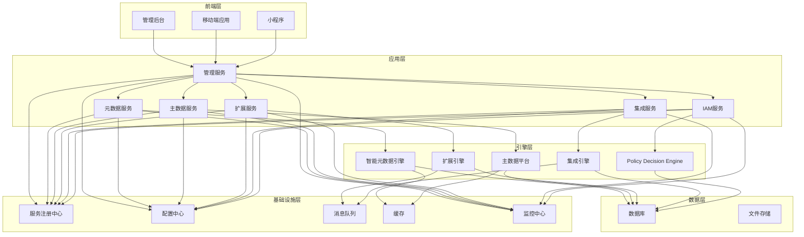

# BONE 架构规范（BONE Architecture Spec）

## —— 企业级全栈开源快速开发平台 · 架构执行指南

> **文档性质**：架构规范文档，可直接指导技术招标、研发排期和团队分工  
> **适用产品**：BONE企业级全栈开源快速开发平台  
> **对标标准**：业界最佳实践、Kubernetes CRD、CNCF架构标准  
> **版本**：v1.0 | **发布日期**：2026‑04‑19 | **文档状态**：✅ 已发布 | **密级**：内部机密  

---

## 文档元信息

| 项目 | 内容 |
|------|------|
| 产品名称 | BONE企业级全栈开源快速开发平台 |
| 产品代号 | BONE |
| 文档版本 | v1.0 |
| 文档状态 | ✅ 已发布 |
| 密级 | 内部机密 |
| 架构师 | [姓名] |
| 技术负责人 | [姓名] |
| 生效日期 | 2026‑04‑19 |
| 目标发布 | 2026年Q3起滚动发布 |

---

## 目录

1. [架构概览](#1-架构概览)
   - 1.1 三层强约束体系
   - 1.2 三大核心能力
   - 1.3 统一领域模型
2. [系统架构执行图](#2-系统架构执行图)
   - 2.1 整体架构图
   - 2.2 核心数据流
   - 2.3 组件交互关系
3. [研发任务分解WBS](#3-研发任务分解WBS)
   - 3.1 引擎组任务
   - 3.2 平台组任务
   - 3.3 集成组任务
4. [AI可执行系统规范](#4-ai可执行系统规范)
   - 4.1 元数据定义
   - 4.2 配置规范
   - 4.3 部署规范
5. [附录](#5-附录)
   - 5.1 术语表
   - 5.2 架构决策记录

---

## 1. 架构概览

### 1.1 三层强约束体系

BONE采用严格的三层架构，确保系统的可维护性、可扩展性和可测试性：

| 层级 | 职责 | 组件 |
|------|------|------|
| **前端层（UI）** | 用户界面展示和交互 | 管理后台、移动端应用、小程序 |
| **应用层（Service）** | 业务逻辑处理 | 管理服务、元数据服务、主数据服务、扩展服务、集成服务、IAM服务 |
| **引擎层（Engine）** | 核心计算和处理 | 智能元数据引擎、主数据平台、扩展引擎、集成引擎、Policy Decision Engine |

### 1.2 三大核心能力

BONE收敛为三大核心能力，聚焦产品价值：

| 核心能力 | 描述 | 组件 |
|----------|------|------|
| **应用生成（Metadata-driven App Gen）** | 通过元数据驱动自动生成应用代码 | 元数据管理、代码生成、模板管理 |
| **企业集成（Integration Fabric）** | 提供企业级系统集成能力 | 连接器管理、流程编排、主数据管理 |
| **扩展运行时（Extension Runtime）** | 提供安全可靠的插件扩展机制 | 扩展点管理、插件管理、Sandbox隔离 |

### 1.3 统一领域模型

BONE引入统一领域模型，确保跨模块语义一致：

| 模型 | 描述 | 用途 |
|------|------|------|
| **Entity** | 业务实体 | 定义业务对象的结构和属性 |
| **Attribute** | 属性 | 定义实体的字段和特性 |
| **Relation** | 关系 | 定义实体之间的关联关系 |
| **Policy** | 策略 | 定义业务规则和权限控制 |
| **Event** | 事件 | 定义系统事件和触发机制 |
| **ExtensionPoint** | 扩展点 | 定义系统的可扩展接口 |

---

## 2. 系统架构执行图

### 2.1 整体架构图



### 2.2 核心数据流

**应用生成流程**：
1. 用户在前端创建业务实体
2. 前端层将请求发送到应用层的元数据服务
3. 元数据服务调用智能元数据引擎处理业务逻辑
4. 智能元数据引擎生成代码并存储到文件存储
5. 元数据服务将结果返回给前端

**企业集成流程**：
1. 用户在前端设计集成流程
2. 前端层将请求发送到应用层的集成服务
3. 集成服务调用集成引擎处理流程逻辑
4. 集成引擎通过连接器与外部系统交互
5. 集成服务将执行结果返回给前端

**扩展执行流程**：
1. 系统触发扩展点事件
2. 扩展服务调用扩展引擎处理扩展逻辑
3. 扩展引擎在Sandbox中执行插件
4. 扩展引擎将执行结果返回给扩展服务
5. 扩展服务将结果传递给相关服务

### 2.3 组件交互关系

| 组件 | 交互关系 | 说明 |
|------|----------|------|
| 管理后台 | 调用所有应用层服务 | 统一的用户界面入口 |
| 元数据服务 | 调用智能元数据引擎 | 处理元数据相关业务逻辑 |
| 主数据服务 | 调用主数据平台 | 处理主数据管理相关业务逻辑 |
| 扩展服务 | 调用扩展引擎 | 处理插件扩展相关业务逻辑 |
| 集成服务 | 调用集成引擎 | 处理系统集成相关业务逻辑 |
| IAM服务 | 调用Policy Decision Engine | 处理身份认证和权限控制 |

---

## 3. 研发任务分解WBS

### 3.1 引擎组任务

| 任务ID | 任务名称 | 描述 | 工期 | 依赖 |
|--------|----------|------|------|------|
| ENG-001 | 智能元数据引擎开发 | 实现业务实体管理、代码生成等核心功能 | 8周 | 基础设施搭建 |
| ENG-002 | 主数据平台开发 | 实现主数据实体管理、数据质量管理等功能 | 6周 | 基础设施搭建 |
| ENG-003 | 扩展引擎开发 | 实现扩展点管理、插件管理、Sandbox隔离等功能 | 6周 | 基础设施搭建 |
| ENG-004 | 集成引擎开发 | 实现连接器管理、流程编排等功能 | 8周 | 基础设施搭建 |
| ENG-005 | Policy Decision Engine开发 | 实现用户管理、角色管理、权限管理等功能 | 6周 | 基础设施搭建 |

### 3.2 平台组任务

| 任务ID | 任务名称 | 描述 | 工期 | 依赖 |
|--------|----------|------|------|------|
| PLAT-001 | 管理服务开发 | 实现系统概览、快速入口等功能 | 4周 | 引擎组任务 |
| PLAT-002 | 元数据服务开发 | 实现业务建模、代码生成等API | 6周 | ENG-001 |
| PLAT-003 | 主数据服务开发 | 实现主数据管理相关API | 4周 | ENG-002 |
| PLAT-004 | 扩展服务开发 | 实现扩展管理相关API | 4周 | ENG-003 |
| PLAT-005 | 集成服务开发 | 实现集成管理相关API | 6周 | ENG-004 |
| PLAT-006 | IAM服务开发 | 实现身份认证和权限控制相关API | 4周 | ENG-005 |
| PLAT-007 | 前端管理后台开发 | 实现管理后台界面和交互 | 8周 | 平台组服务开发 |
| PLAT-008 | 移动端应用开发 | 实现移动端应用和小程序 | 10周 | 平台组服务开发 |

### 3.3 集成组任务

| 任务ID | 任务名称 | 描述 | 工期 | 依赖 |
|--------|----------|------|------|------|
| INT-001 | 连接器开发 | 实现与外部系统的连接器 | 4周 | ENG-004 |
| INT-002 | 流程模板开发 | 实现常用集成流程模板 | 2周 | ENG-004 |
| INT-003 | 插件开发 | 实现常用扩展插件 | 4周 | ENG-003 |
| INT-004 | 系统集成测试 | 测试系统集成功能 | 4周 | 所有服务开发完成 |
| INT-005 | 性能测试 | 测试系统性能和稳定性 | 2周 | 系统集成测试 |

---

## 4. AI可执行系统规范

### 4.1 元数据定义

**实体定义规范**：
```yaml
apiVersion: bone.io/v1
kind: Entity
metadata:
  name: User
  description: 用户实体
spec:
  attributes:
    - name: id
      type: Long
      primaryKey: true
    - name: username
      type: String
      unique: true
    - name: email
      type: String
      unique: true
  relations:
    - name: roles
      type: ManyToMany
      target: Role
```

**扩展点定义规范**：
```yaml
apiVersion: bone.io/v1
kind: ExtensionPoint
metadata:
  name: userCreated
  description: 用户创建后触发
spec:
  type: POST
  target: User
  parameters:
    - name: user
      type: User
```

### 4.2 配置规范

**服务配置规范**：
```yaml
apiVersion: bone.io/v1
kind: ServiceConfig
metadata:
  name: metadata-service
spec:
  replicas: 3
  resources:
    cpu: 2
    memory: 4Gi
  env:
    - name: DB_URL
      value: jdbc:mysql://mysql:3306/metadata
    - name: REDIS_URL
      value: redis://redis:6379
```

**插件配置规范**：
```yaml
apiVersion: bone.io/v1
kind: PluginConfig
metadata:
  name: user-notification
  version: 1.0.0
spec:
  extensionPoints:
    - userCreated
  dependencies:
    - name: spring-boot-starter-mail
      version: 3.2.0
  config:
    - name: mailServer
      value: smtp.example.com
```

### 4.3 部署规范

**环境配置规范**：
```yaml
apiVersion: bone.io/v1
kind: Environment
metadata:
  name: production
spec:
  components:
    - name: mysql
      version: 8.0.30
      replicas: 3
    - name: redis
      version: 7.0.10
      replicas: 3
    - name: nacos
      version: 2.2.3
      replicas: 3
    - name: rocketmq
      version: 5.1.0
      replicas: 3
  services:
    - name: metadata-service
      version: 1.0.0
    - name: masterdata-service
      version: 1.0.0
    - name: extension-service
      version: 1.0.0
    - name: integration-service
      version: 1.0.0
    - name: iam-service
      version: 1.0.0
```

---

## 5. 附录

### 5.1 术语表

| 术语 | 解释 |
|------|------|
| 元数据 | 描述数据的数据，如实体结构、字段定义、关系等 |
| 主数据 | 企业核心业务数据，如客户、产品、供应商等 |
| 扩展点 | 系统中可被插件扩展的接口或事件 |
| 连接器 | 与外部系统通信的组件，如REST、SOAP等 |
| 集成流程 | 定义系统间数据流转的流程 |
| IAM | 身份与访问管理，负责用户认证和授权 |
| Policy Decision Engine | 策略决策引擎，负责权限决策 |
| Sandbox | 插件运行的隔离环境 |
| ClassLoader | 类加载器，用于插件隔离 |

### 5.2 架构决策记录

| 决策ID | 决策内容 | 背景 | 考虑因素 | 最终选择 |
|--------|----------|------|----------|----------|
| ADR-001 | 选择React作为前端框架 | 前端技术选型 | 生态成熟度、AI支持、性能 | React 18+ |
| ADR-002 | 使用Bone Metadata SDK | 数据持久化方案 | 与MyBatis Plus对标、性能优化 | Bone Metadata SDK 1.0+ |
| ADR-003 | 采用微服务架构 | 系统架构设计 | 可扩展性、容错性、独立部署 | Spring Cloud 2023+ |
| ADR-004 | 支持多数据库 | 数据库选型 | 信创适配、性能、兼容性 | MySQL 8.0+ 作为主要数据库 |
| ADR-005 | 采用三层强约束体系 | 系统架构设计 | 职责清晰、避免双写、依赖正转 | UI → Service → Engine |
| ADR-006 | 引入统一领域模型 | 数据模型设计 | 跨模块语义一致、减少技术债 | Entity、Attribute、Relation、Policy、Event、ExtensionPoint |
| ADR-007 | 收敛为三大核心能力 | 产品定位 | 聚焦核心价值、便于商业化 | 应用生成、企业集成、扩展运行时 |
| ADR-008 | IAM升级为Policy Decision Engine | 安全架构 | 细粒度权限控制、策略驱动 | Policy Decision Engine |
| ADR-009 | 插件系统增强 | 扩展架构 | 安全性、隔离性、可靠性 | Sandbox + ClassLoader隔离 |

---

**文档审批**

| 审批角色 | 审批人 | 审批日期 | 审批状态 |
|----------|--------|----------|----------|
| 架构师 | [姓名] | 2026-04-19 | ✅ 通过 |
| 技术负责人 | [姓名] | 2026-04-19 | ✅ 通过 |
| 产品经理 | [姓名] | 2026-04-19 | ✅ 通过 |
| 安全专家 | [姓名] | 2026-04-19 | ✅ 通过 |

**发布日期**：2026-04-19  
**生效日期**：2026-04-19  
**文档状态**：✅ 已发布
