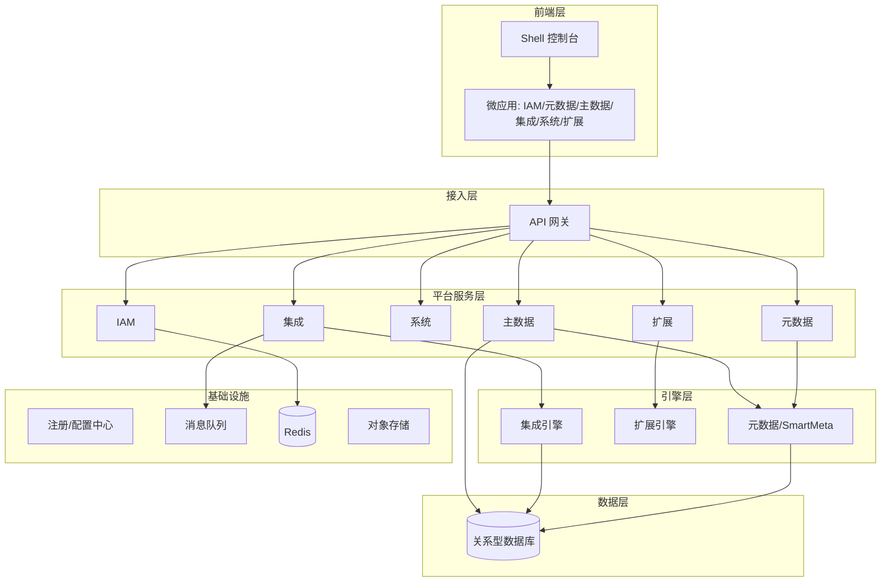
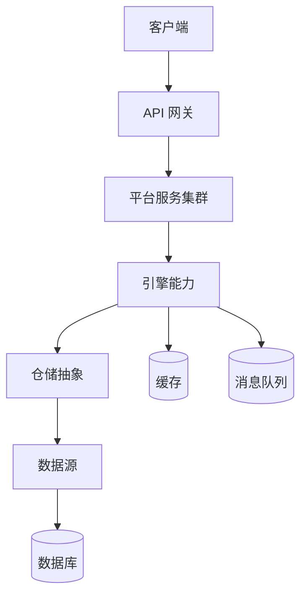
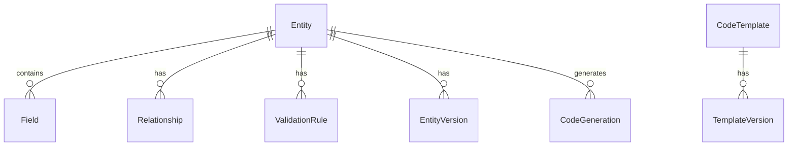
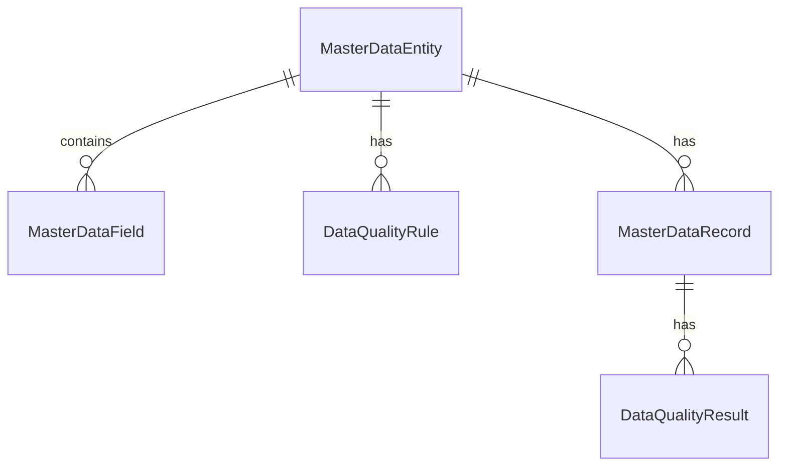
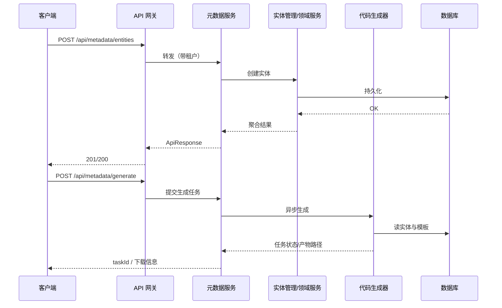
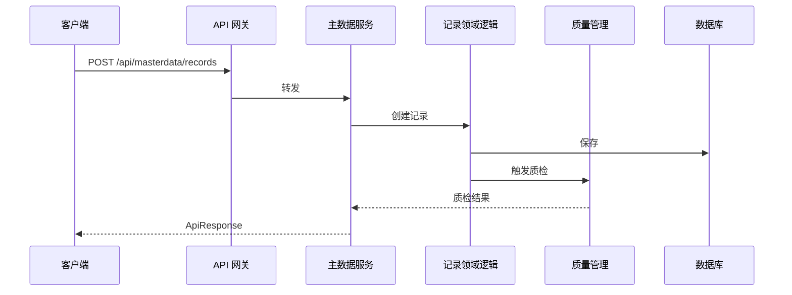
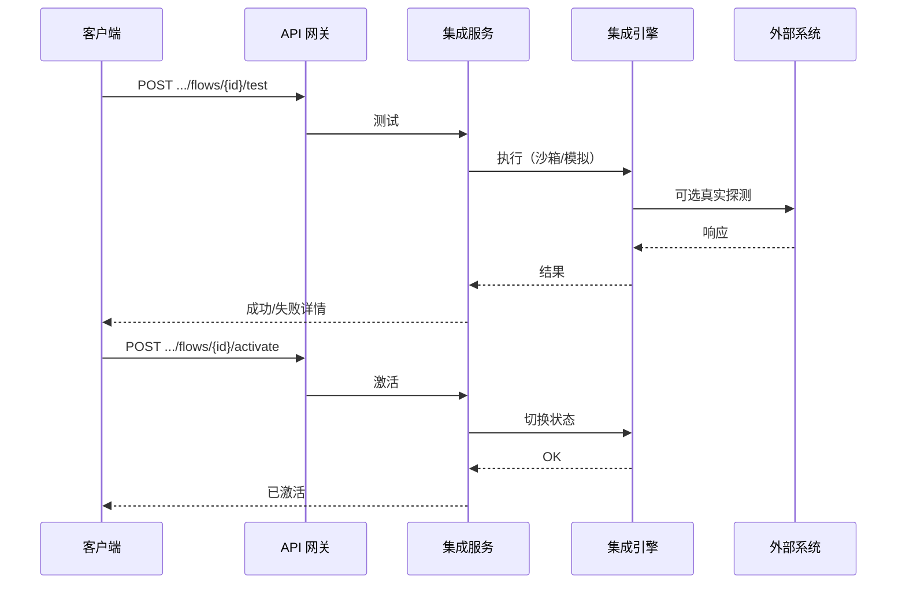
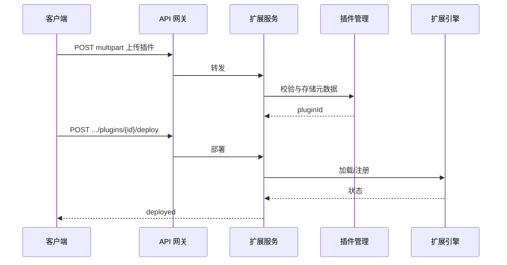
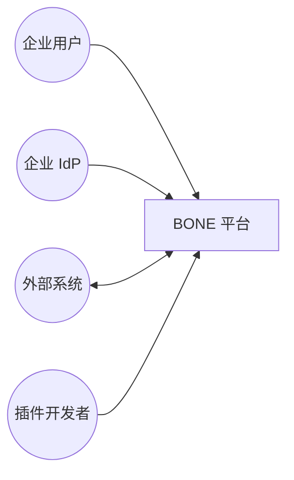

# BONE 总体架构设计方案（最佳实践完整版）

## —— 企业级全栈开源快速开发平台

> **文档性质**：`doc/architecture/` 目录下**平台总体**架构与技术方案权威文档；本版在 v2.0 整合稿基础上，按 **C4、SRE（SLO/SLI）、Well-Architected、API 工程化、韧性模式、零信任与 SDL、数据一致性模式** 等业界最佳实践做了系统化补强。  
> **文档沿革**：2026-05-15 起，原并行 `doc/arch` 方案已废止并合并至本文；2026-05-15 起本文迁入 `doc/architecture/`，与前端架构、UI 规范同目录索引；后续架构变更仅维护本文。  
> **与实现关系**：愿景、分层、能力边界与非功能基线以本文为准；**具体 API 路径、表名 DDL** 与仓库不一致时以 **OpenAPI、`bone-init.sql`、各模块代码** 为准；**§7** 给出 Maven 模块映射。  
> **版本**：v2.1 Best-Practice（最佳实践完整版） | **日期**：2026-05-15 | **状态**：发布

---

## 文档元信息

| 项目 | 内容 |
|------|------|
| 产品名称 | Bone / BONE 企业级全栈开源快速开发平台（**Bone** 与 **BONE** 为同一产品，文档与营销书写可并存） |
| 产品口号 | Build Once, Natively Everywhere |
| 文档类型 | 战略 + 领域 + C4/逻辑/物理架构 + NFR/SLO + 技术栈 + API 工程化 + 数据与安全 + 韧性运维 + 治理演进 |

---

## 目录

- [第一部分 战略与范围](#第一部分-战略与范围)
- [第二部分 架构愿景与原则](#第二部分-架构愿景与原则)
- [第三部分 核心能力与价值流](#第三部分-核心能力与价值流)
- [第四部分 逻辑与物理架构](#第四部分-逻辑与物理架构)
- [第五部分 领域与数据战略](#第五部分-领域与数据战略)
- [第六部分 技术栈](#第六部分-技术栈)
- [第七部分 与当前仓库对齐](#第七部分-与当前仓库对齐)
- [第八部分 API 与路由](#第八部分-api-与路由)
- [第九部分 数据模型](#第九部分-数据模型)
- [第十部分 安全与合规](#第十部分-安全与合规)
- [第十一部分 性能与扩展性](#第十一部分-性能与扩展性)
- [第十二部分 部署与可观测性](#第十二部分-部署与可观测性)
- [第十三部分 DevOps、灾备与高可用](#第十三部分-devops灾备与高可用)
- [第十四部分 工程治理与技术债务](#第十四部分-工程治理与技术债务)
- [第十五部分 实施、测试与发布](#第十五部分-实施测试与发布)
- [第十六部分 风险与依赖](#第十六部分-风险与依赖)
- [第十七部分 演进与 AI 契约](#第十七部分-演进与-ai-契约)
- [第十八部分 研发 WBS](#第十八部分-研发-wbs)
- [第十九部分 AI 可执行规范示例](#第十九部分-ai-可执行规范示例)
- [第二十部分 ADR 与术语](#第二十部分-adr-与术语)
- [第二十一部分 典型交互时序（详细）](#第二十一部分-典型交互时序详细)
- [第二十二部分 命令—API 映射与 OpenAPI 片段](#第二十二部分-命令api-映射与-openapi-片段)
- [第二十三部分 C4 架构视图与边界](#第二十三部分-c4-架构视图与边界)
- [第二十四部分 非功能需求与 SLO/SLI](#第二十四部分-非功能需求与-slosli)
- [第二十五部分 API 工程化规范](#第二十五部分-api-工程化规范)
- [第二十六部分 韧性工程与流量治理](#第二十六部分-韧性工程与流量治理)
- [第二十七部分 数据一致性与集成模式](#第二十七部分-数据一致性与集成模式)
- [第二十八部分 威胁建模与安全开发生命周期](#第二十八部分-威胁建模与安全开发生命周期)
- [第二十九部分 成本、容量与多区域](#第二十九部分-成本容量与多区域)
- [第三十部分 架构质量门禁与外部参考](#第三十部分-架构质量门禁与外部参考)

---

## 第一部分 战略与范围

### 1.1 系统定位与价值主张

构建 **元数据驱动** 的企业级开发与运行平台，将交付模式从「纯代码驱动」转为 **模型 + 配置 + 可验证契约**，支撑私有化、信创与规模化扩展。与根目录 **README** 中的「四大引擎」叙述一致；本文 **§3.1～3.2** 同时给出「三大核心能力」收敛视角，二者为同一产品的互补表述，**无能力范围冲突**。

### 1.2 能力边界

| 做 | 不做 |
|----|------|
| 元数据建模、代码生成、主数据治理、集成编排、插件扩展、多租户、API/SDK、K8s 化部署与可观测 | 不承载客户具体业务线全量业务数据；不提供 RTC 音视频会议；不提供大模型训练平台 |

### 1.3 目标用户与阅读路径

| 角色 | 优先章节 |
|------|----------|
| 高管 / 产品 | 第一、三、十五、十六部分 |
| 架构师 | 第四、五、七、十、二十三～二十七、三十部分 |
| 开发 / TL | 第六、七、八、九、十四、二十五部分 |
| 运维 / SRE | 第十二、十三、二十四、二十九部分 |
| 安全 / 合规 | 第十、二十八部分 |
| AI 工程 | 第十七、十九部分 |

### 1.4 核心 KPI 与痛点映射（摘要）

| 业务痛点 | 优先级 | 技术方向 | 量化目标（规划） |
|----------|--------|----------|------------------|
| 重复编码、交付慢 | P0 | 元数据 + 代码生成 | 生成覆盖与周期基线对比 |
| 系统集成复杂 | P0 | 连接器 + 流程编排 + 可观测 | 标准对接工时上限 |
| 权限粗放、合规风险 | P1 | RBAC 基线 + ABAC/ReBAC 演进、审计 | 越权 0、权限生效时延 |
| 定制周期长 | P2 | 扩展点 + 隔离执行 + API 开放 | 定制交付周期 |
| 多租户隔离 | P2 | tenant_id + 网关注入 + 拦截器 | 隔离抽检通过率 |

### 1.5 演进阶段（痛点驱动，可裁剪）

| 阶段 | 目标 |
|------|------|
| MVP | 元数据建模 + 基础 IAM + 最小主数据/系统 |
| 安全基线 | 审计、租户抽检、密钥外置、弱口令治理 |
| 集成增强 | 连接器库、流程模板、执行大盘 |
| 扩展与生态 | 插件规范、隔离强化、开放 API 策略 |

### 1.6 硬约束（规划级）

- **SLA 目标**：核心域 99.99%、支撑域 99.9%（按业务合同调整）。  
- **技术主栈**：Java 17 + Spring Boot 3.2 + Spring Cloud 2023 + React 18；新增业务服务默认 Java。  
- **合规方向**：等保三级对齐、国密（SM2/SM3/SM4）按需启用、审计日志留存策略可配置。

---

## 第二部分 架构愿景与原则

### 2.1 设计原则（强制执行级）

| 原则 | 说明 |
|------|------|
| **模块化** | 引擎 / 平台 / 框架分层，依赖单向；应用层禁止直连基础设施实现（依赖倒置）。 |
| **可扩展** | 扩展点 + 插件；**配额与超时优先**于无限逻辑。 |
| **安全默认** | 最小权限、默认拒绝、敏感配置外置、关键操作可审计。 |
| **可观测** | 日志、指标、追踪与业务审计分层。 |
| **可演进** | 限界上下文与 API 版本化；重大变更 ADR + 兼容期。 |
| **标准化** | 统一 `ApiResponse`/`PageResult`、错误码、租户与审计字段。 |
| **向后兼容** | 公共 API 变更遵循 semver/弃用期；破坏性变更须 ADR + 双轨运行窗口。 |
| **可测试** | 核心领域逻辑可单测；跨边界通过契约测试与 Testcontainers 类集成测试。 |

### 2.2 云架构五大支柱（对齐 Well-Architected 思想）

| 支柱 | BONE 落地要点 |
|------|----------------|
| **卓越运维** | IaC、可观测三板斧、Runbook、混沌与演练 |
| **安全** | 零信任、最小权限、密钥外置、供应链安全（SBOM/扫描） |
| **可靠** | SLO、多副本、熔断限流、数据备份与 RPO/RTO |
| **性能效率** | 缓存与异步、连接池、容量规划与压测基线 |
| **成本优化** | 非生产降配、日志/指标采样与保留分级、冷热分层（见第二十九部分） |

### 2.3 十二要素与配置（摘要）

- **配置与代码分离**：所有环境差异来自环境变量/配置中心，禁止将生产密钥写入镜像。  
- **无状态进程**：会话与上传进度外置 Redis/OSS；水平扩展依赖无本地粘性（或显式会话亲和策略）。  
- **管理进程**：数据库迁移、批处理与 Web 进程分离 Job/CronWorkload。

---

## 第三部分 核心能力与价值流

### 3.1 三大核心能力（产品收敛）

| 能力 | 用户价值 | 主要承载 |
|------|----------|----------|
| **应用生成** | 少写重复代码，模型即资产 | 元数据、智能元数据、代码生成 |
| **企业集成** | 异构系统可编排、可回放 | 集成引擎、连接器、流程 |
| **扩展运行时** | 核心稳定、个性化外置 | 扩展点、插件生命周期、隔离执行 |

### 3.2 四大引擎（对外表述）

智能元数据引擎、企业主数据平台、ExtPoint 扩展引擎、集成引擎 —— 与三大能力互补：主数据强调 **唯一可信源与质量**，同时服务应用生成与集成消费。

### 3.3 七大价值流与关键事件

| ID | 价值流 | 关键事件链（摘要） |
|----|--------|-------------------|
| V1 | 元数据与生成 | EntityCreated → Published → TemplateSelected → CodeGenerated |
| V2 | 权限与安全 | UserLogin → PermissionChecked → AuditLogged |
| V3 | 集成编排 | ConnectorConfigured → FlowDesigned → FlowTested → FlowActivated |
| V4 | 插件扩展 | ExtensionPointDefined → PluginUploaded → PluginDeployed → PluginExecuted |
| V5 | 主数据治理 | MasterEntityDefined → QualityRuleConfigured → DataImported → QualityChecked → Published |
| V6 | 平台运维 | Deployed → ConfigChanged → MetricAlerted → BackupExecuted |
| V7 | 开放生态 | APIRegistered → ThirdPartyIntegrated → CustomLogicApplied |

### 3.4 架构红牌（须快速闭环评审）

| 编号 | 风险 | 缓解方向 |
|------|------|----------|
| H-001 | 实体发布后生成物与模型版本不一致 | 生成锁定实体版本 |
| H-002 | 插件拖垮主进程 | CPU/内存配额、超时熔断、隔离运行时 |
| H-003 | 信创/Schema 升级停机 | 双写兼容、独立迁移、灰度 |
| H-004 | AI/自动化越权访问 | 权限快照、双重过滤、契约校验 |
| H-005 | 多租户资源抢占 | 租户分级与配额 |
| H-006 | 事件乱序致状态错乱 | 序列号、幂等、补偿查询 |
| H-007 | 模板渲染失败 | 异步重试、DLQ、人工干预 |
| H-008 | 权限索引与实时决策不一致 | 最终一致 + 对账任务 |

---

## 第四部分 逻辑与物理架构

### 4.1 三层强约束

| 层级 | 职责 | 典型形态 |
|------|------|----------|
| **前端层** | UI、微前端组装 | React + Qiankun |
| **平台服务层** | API、鉴权、用例编排 | Spring Boot 服务 |
| **引擎层** | 可复用计算与协议能力 | SDK + Starter / 独立引擎模块 |

单模块内：**DDD + CQRS**：`adapter` → `application` → `domain` ← `infrastructure`。

### 4.2 逻辑架构（平台视角）



### 4.3 物理拓扑：客户端—网关—服务—引擎—数据（纵向）



### 4.4 核心组件职责表

| 组件 | 职责 | 技术要点 |
|------|------|----------|
| API Gateway | 路由、限流、TLS 终结、租户头注入 | Spring Cloud Gateway / Kong / Nginx 组合选型 |
| 元数据相关服务 | 实体/字段/关系/模板/生成任务 | Spring Boot + Bone Metadata SDK + bone-datasource（动态/多库路由） |
| 主数据服务 | 主数据实体、质量、记录、发布 | 同上（持久化与查询以 Metadata SDK 为主路径） |
| 集成服务 | 连接器、流程、执行历史 | 编排引擎（如 Camel）与团队封装 |
| 扩展服务 | 扩展点、插件元数据、发布回滚 | 类加载隔离 / Wasm 等为增强路线 |
| IAM 服务 | 认证、授权、审计 | `bone-platform/bone-iam`：**Spring Security + JWT**（见模块 `pom.xml`）；行业包等可另用 **SA-Token**（如 `bone-business/tpa-saas`），勿在文档中混为同一默认栈 |
| 各引擎 | 领域内核计算 | 与平台服务 Jar 依赖或进程分离 |

### 4.5 典型数据流（五条）

1. **用户操作**：UI → 网关 → 平台服务 → 引擎 → DB/缓存 → 响应。  
2. **代码生成**：建模 → 发布 → 选模板 → 异步生成任务 → 产物存储（DB/对象存储）→ 下载。  
3. **集成执行**：配连接器 → 设计流程 → 测试 → 激活 → 运行监控与执行日志。  
4. **主数据**：定义实体与质量规则 → 导入 → 质检 → 发布 → 对外 API 消费。  
5. **扩展**：事件触发扩展点 → 引擎调度插件 → 隔离执行 → 结果回传与观测。

---

## 第五部分 领域与数据战略

### 5.1 限界上下文

| 上下文 | 类型 | 职责 |
|--------|------|------|
| 元数据域 | 核心 | 模型、模板、生成流水线 |
| 权限 / IAM | 核心 | 身份、授权、审计 |
| 集成域 | 核心 | 连接器、流程、执行与日志 |
| 扩展域 | 核心 | 扩展点、插件元数据、生命周期 |
| 主数据域 | 核心 | 主数据模型、质量、发布 |
| 系统与运维 | 支撑 | 配置、监控、日志、通知 |
| 部署适配 | 支撑 | 多环境、信创、迁移 |

### 5.2 数据边界死守

| 上下文 | 允许存储 | 严禁混入 |
|--------|------------|----------|
| 元数据域 | 实体定义、字段、关系、模板 | 用户凭证、权限位图明文、业务密钥 |
| 权限中台 | 主体/角色/权限、审计、密钥密文 | 业务实体全量内容 |
| 集成域 | 连接器配置、流程定义、执行日志 | 用户密码、无关业务表 |
| 扩展域 | 插件制品元数据、扩展点定义 | 用户凭证 |
| 主数据域 | 主数据记录、质量规则与报告 | 权限策略详情 |

### 5.3 核心聚合与领域事件（摘要）

| 聚合根 | 上下文 | 关键职责 |
|--------|--------|----------|
| Entity（元数据） | 元数据 | 版本、发布、字段与关系 |
| CodeTemplate | 元数据 | 模板版本与生成 |
| IntegrationFlow | 集成 | 激活/停用、定义快照 |
| Plugin | 扩展 | 部署、回滚、版本 |
| MasterDataEntity | 主数据 | 质量规则、记录生命周期 |

| 事件 | 触发时机 | 建议分区键 |
|------|----------|--------------|
| EntityPublished | 实体发布 | tenant_id |
| CodeGenerated | 生成完成 | tenant_id |
| PermissionChanged | 权限变更 | tenant_id |
| FlowActivated | 流程激活 | tenant_id |
| PluginDeployed | 插件部署 | tenant_id |

### 5.4 业务不变量（强一致）

| 上下文 | 不变量 | 手段 |
|--------|--------|------|
| 元数据 | 已发布实体不可原地改字段，须新版本 | 写时复制 / 版本链 |
| 权限 | 授权更新幂等 | 幂等键 + 乐观锁 |
| 集成 | 激活前须测试通过 | 前置校验 |
| 扩展 | 部署前安全扫描 | 沙箱 / 扫描器 |

### 5.5 超大规模扩展（可选目标架构）

当实体规模达 **十亿级** 时考虑：`entity_id` 为雪花 ID，`shard = hash(entity_id) % N`；物理库表拆分与 **TiDB/OceanBase** 等选型通过独立 ADR。**默认交付**以 MySQL 单库或有限分片为主，避免过度设计。

### 5.6 跨上下文编排（Saga 思想）

跨域删除、发布等长事务采用 **可补偿步骤 + 幂等探测 + DLQ**；Saga 状态机与步骤定义以各限界上下文 **ADR + 模块设计** 为准，落地时与各服务事务边界对齐。

---

## 第六部分 技术栈

### 6.1 前端

| 技术 | 版本（规划） | 用途 |
|------|----------------|------|
| React | 18+ | UI |
| TypeScript | 5.x | 类型 |
| Ant Design | 5.x | 组件 |
| Redux Toolkit | 2.x | 状态 |
| React Router | 6.x | 路由 |
| Vite | 4/5 | 构建 |
| Vitest | 2.x | 测试 |
| Qiankun | 2.x | 微前端 |
| Axios | 1.6+ | HTTP |
| Monaco / 图编辑 | 按需 | 建模与编排 |

### 6.2 后端

| 技术 | 版本（规划） | 用途 |
|------|----------------|------|
| Java | 17+ | 语言 |
| Spring Boot | 3.2+ | 应用框架 |
| Spring Cloud / Alibaba | 2023.x | 微服务 |
| Bone Metadata SDK | 1.x | 元数据持久化与仓储扩展 |
| MyBatis / JPA | 随父 POM | ORM |
| RocketMQ、Seata | 按需 | 消息与分布式事务 |
| Redis、Redisson | 7.x | 缓存与分布式协调 |
| Sentinel | 按需 | 限流熔断 |
| Apache Camel | 按需 | 集成编排（若启用） |
| LiteFlow / Aviator | 按需 | 规则与表达式 |

### 6.3 中间件与数据存储

| 技术 | 用途 |
|------|------|
| Nacos | 注册发现、配置 |
| Prometheus + Grafana | 指标与大盘 |
| ELK 或 Loki 等 | 日志检索 |
| MySQL 8.0+ | 主存储 |
| PostgreSQL / 达梦 / 人大金仓 | 多库或信创 |
| MinIO / 云 OBS | 对象存储 |

---

## 第七部分 与当前仓库对齐

| 逻辑组件 | Maven / 目录示例 |
|----------|-------------------|
| 元数据 / SDK / Engine | `bone-engine/bone-metadata-server`、`bone-metadata-sdk`、`bone-metadata-engine` |
| 扩展引擎 | `bone-engine/bone-extension-engine/*` |
| 集成引擎 | `bone-engine/bone-integration` |
| IAM、主数据、系统、网关等 | `bone-platform/bone-iam`、`bone-masterdata`、`bone-system`、`bone-gateway` 等 |
| 框架 | `bone-framework/*` |
| DDD 蓝图 | `bone-blueprint/`（是否纳入根 `pom.xml` 以仓库为准） |

**易混点**：引擎与平台下可能存在同名业务域（如 integration），文档、日志与监控指标须用 **全限定模块名**。`bone-iam` 默认 HTTP 端口以 **`bone-platform/bone-iam/src/main/resources/application.yml` 中 `server.port` 为准**（当前仓库为 **8081**），勿与 `bone-masterdata` / `bone-extension-studio` 的 **8080** 混用。**各模块默认端口总表**见 [doc/wiki/03-本地开发与构建.md](../wiki/03-本地开发与构建.md)「常见服务端口」；根 [README.md](../../README.md) 快速开始中的 **8080** 为营销/演示入口示意，非 IAM 真源。

---

## 第八部分 API 与路由

### 8.1 前端路由（控制台）

| 路径前缀 | 模块 |
|----------|------|
| /dashboard | 控制台 |
| /metadata | 元数据 |
| /masterdata | 主数据 |
| /extension | 扩展 |
| /integration | 集成 |
| /iam | IAM |
| /system | 系统管理 |

### 8.2 API 版本策略

对外可同时支持 **`/api/{domain}/...`** 与 **`/api/v1/{domain}/...`**；**网关负责剥离版本前缀**，服务内保持统一 Controller 映射。具体以网关与模块 `context-path` 配置为准。

### 8.3 核心 API 一览（契约级索引）

> 下列路径为**设计约定**；与代码不一致时以各服务 **OpenAPI / Controller** 为准。

#### 8.3.1 认证与授权（IAM）

| API 路径 | 方法 | 功能 | 权限 |
|----------|------|------|------|
| `/api/iam/login` | POST | 登录 | 匿名 |
| `/api/iam/logout` | POST | 登出 | 已认证 |
| `/api/iam/refresh` | POST | 刷新令牌 | 已认证 |
| `/api/iam/users` | GET/POST | 用户列表/创建 | 管理员 |
| `/api/iam/users/{id}` | PUT/DELETE | 更新/删除用户 | 管理员 |
| `/api/iam/roles` | GET/POST | 角色 | 管理员 |
| `/api/iam/roles/{id}` | PUT/DELETE | 更新/删除角色 | 管理员 |
| `/api/iam/roles/{id}/permissions` | POST | 分配权限 | 管理员 |
| `/api/iam/permissions` | GET | 权限列表 | 管理员 |
| `/api/iam/sso/config` | POST | SSO 配置 | 管理员 |
| `/api/iam/audit/logs` | GET | 审计日志 | 管理员 |

#### 8.3.2 元数据

| API 路径 | 方法 | 功能 |
|----------|------|------|
| `/api/metadata/entities` | GET/POST | 实体列表/创建 |
| `/api/metadata/entities/{id}` | PUT/DELETE | 更新/删除 |
| `/api/metadata/entities/{id}/publish` | POST | 发布实体 |
| `/api/metadata/fields` | GET/POST | 字段 |
| `/api/metadata/fields/{id}` | PUT/DELETE | 字段维护 |
| `/api/metadata/generate` | POST | 提交生成任务 |
| `/api/metadata/generate/{taskId}` | GET | 查询生成结果 |
| `/api/metadata/templates` | GET/POST | 模板 |
| `/api/metadata/templates/{id}` | PUT/DELETE | 模板维护 |

#### 8.3.3 主数据

| API 路径 | 方法 | 功能 |
|----------|------|------|
| `/api/masterdata/entities` | GET/POST | 主数据实体 |
| `/api/masterdata/entities/{id}` | PUT/DELETE | 实体维护 |
| `/api/masterdata/rules` | GET/POST | 质量规则 |
| `/api/masterdata/rules/{id}` | PUT/DELETE | 规则维护 |
| `/api/masterdata/records` | GET/POST | 记录/导入 |
| `/api/masterdata/records/{id}` | PUT/DELETE | 记录维护 |
| `/api/masterdata/records/{id}/publish` | POST | 发布记录 |
| `/api/masterdata/quality` | GET | 质量报告 |
| `/api/masterdata/quality/check` | POST | 执行质检 |

#### 8.3.4 扩展

| API 路径 | 方法 | 功能 |
|----------|------|------|
| `/api/extension/points` | GET/POST | 扩展点 |
| `/api/extension/points/{id}` | PUT/DELETE | 扩展点维护 |
| `/api/extension/plugins` | GET/POST | 插件列表/上传 |
| `/api/extension/plugins/{id}/deploy` | POST | 部署 |
| `/api/extension/plugins/{id}/undeploy` | POST | 卸载 |
| `/api/extension/plugins/{id}/rollback` | POST | 回滚 |

#### 8.3.5 集成

| API 路径 | 方法 | 功能 |
|----------|------|------|
| `/api/integration/connectors` | GET/POST | 连接器 |
| `/api/integration/connectors/{id}` | PUT/DELETE | 连接器维护 |
| `/api/integration/connectors/{id}/test` | POST | 测试连接 |
| `/api/integration/flows` | GET/POST | 流程 |
| `/api/integration/flows/{id}` | PUT/DELETE | 流程维护 |
| `/api/integration/flows/{id}/test` | POST | 测试流程 |
| `/api/integration/flows/{id}/activate` | POST | 激活 |
| `/api/integration/flows/{id}/deactivate` | POST | 停用 |
| `/api/integration/executions` | GET | 执行记录 |
| `/api/integration/executions/{id}/logs` | GET | 执行日志 |

#### 8.3.6 系统管理

| API 路径 | 方法 | 功能 |
|----------|------|------|
| `/api/system/config` | GET/PUT | 系统配置 |
| `/api/system/health` | GET | 健康检查 |
| `/api/system/metrics` | GET | 指标 |
| `/api/system/alerts` | GET/POST | 告警规则 |
| `/api/system/alerts/{id}` | PUT/DELETE | 规则维护 |
| `/api/system/logs` | GET | 系统日志 |

### 8.4 领域事件与 Topic 命名（建议）

```yaml
event_mapping:
  - event: EntityPublished
    topic: domain.metadata.entity_published.v1
    partition_key: tenant_id
  - event: CodeGenerated
    topic: domain.metadata.code_generated.v1
    partition_key: tenant_id
  - event: PermissionChanged
    topic: domain.authz.permission_changed.v1
    partition_key: tenant_id
  - event: FlowActivated
    topic: domain.integration.flow_activated.v1
    partition_key: tenant_id
  - event: PluginDeployed
    topic: domain.extension.plugin_deployed.v1
    partition_key: tenant_id
```

### 8.5 租户隔离强制规则

- `tenant_id` **必须从可信身份**（JWT/网关会话）解析，**禁止**仅信任请求体中的租户字段覆盖。  
- 网关向下游注入 `X-Tenant-Id` 或等价 metadata；业务层 `TenantContext` 与数据访问拦截器一致化。

### 8.6 API 工程化约定（REST 最佳实践）

| 主题 | 约定 |
|------|------|
| **资源建模** | 名词复数、层级不宜过深；子资源用 `/parents/{id}/children` |
| **HTTP 语义** | GET 幂等无副作用；POST 创建；PUT/PATCH 全量/部分更新；DELETE 软删时返回 204 或带 body 的 200（团队统一） |
| **统一响应** | 业务成功体为 `data`；错误带 **稳定 `code`**（机器可读）+ `message`（人类可读）+ 可选 `details[]` |
| **错误与 RFC 7807** | 对外公共 API 推荐 **Problem+JSON**（`application/problem+json`）与内部 `ApiResponse` 映射层 |
| **分页** | `page`+`size` 或 `cursor`+`limit`；响应含 `total` 或 `nextCursor`；最大 `size` 上限防 DoS |
| **排序与过滤** | 白名单字段排序；过滤参数校验防注入 |
| **幂等写** | 对「重复提交敏感」接口支持 **`Idempotency-Key`** 请求头 + 服务端去重表（TTL） |
| **乐观并发** | 更新接口支持 `If-Match: {etag}` 或 `version` 字段，冲突返回 **409** |
| **限流响应** | 返回 **429** + `Retry-After`；网关与业务双层可选 |
| **Trace** | 强制 `traceparent` / `X-Request-Id` 透传，与日志、审计关联 |
| **OpenAPI** | 每个对外服务维护 **单一 OpenAPI 3.1 真源**，CI 做破坏性 diff 门禁 |

---

## 第九部分 数据模型

### 9.1 元数据 ER（概念）



| 概念表 | 说明 | 典型字段 |
|--------|------|----------|
| entity | 业务实体 | id, name, description, status, type, create_time, update_time |
| field | 字段 | id, entity_id, name, type, length, required, default_value |
| relationship | 关系 | source_entity_id, target_entity_id, type, cardinality |
| validation_rule | 校验 | field_id, type, expression, message |
| entity_version / field_version | 版本快照 | entity_id/field_id, version, content |
| code_template / template_version | 模板 | name, type, content, version |
| code_generation | 生成任务 | entity_id, template_id, status, download_url |

### 9.2 主数据 ER（概念）



| 概念表 | 说明 |
|--------|------|
| master_data_entity / field | 主数据模型 |
| data_quality_rule | 质量规则 |
| master_data_record | 业务记录 JSON |
| data_quality_result / quality_check / quality_report | 质检与报告 |

### 9.3 IAM 与系统（概念）

- **IAM**：user、role、permission、user_role、role_permission、audit_log。  
- **系统**：system_config、config_history、alert_rule、alert_event；扩展与集成相关表：extension_point、plugin、plugin_version、plugin_binding、connector、integration_flow、flow_node、flow_connection、integration_log。

**物理表名** 以 `bone-init.sql` 与各模块迁移脚本为准（可能带模块前缀或租户字段）。

---

## 第十部分 安全与合规

### 10.1 零信任与身份

- **默认不信任网络位置**：每请求校验身份与策略；服务间 **mTLS**（服务网格或 Sidecar）为推荐演进方向。  
- **认证**：JWT + 刷新、短期 access；SSO（OAuth2/OIDC/SAML/LDAP）对接企业 IdP。  
- **会话固定与重放**：登录后轮换会话标识；关键操作二次确认（按风险分级）。

### 10.2 授权与策略

- **RBAC 基线**；演进 **Owner / Deny / ABAC / ReBAC / Default** 五层模型须 **独立 ADR** 与分阶段交付。  
- **管理平面与数据平面** API 分离路由或独立网关，缩小暴露面。

### 10.3 数据与密码学

- **传输**：TLS 1.2+（推荐 1.3）。  
- **存储**：敏感字段信封加密/KMS；密钥与数据 **职责分离**。  
- **脱敏**：日志、导出、非生产环境默认脱敏或合成数据。

### 10.4 网络与运行时

- **K8s NetworkPolicy**、入口 WAF、限流；插件/脚本 **资源边界**（CPU/内存/超时）。  
- **供应链**：依赖与镜像漏洞扫描、**SBOM**（CycloneDX/SPDX）、生产镜像 **签名验签**（Cosign 等）。

### 10.5 审计与合规

- 关键操作全量审计（谁、何时、租户、资源、结果、traceId）；留存可配置；等保与国密按合同启用。

### 10.6 密钥与配置

- 生产 **禁止** 弱默认密码与镜像内明文密钥；**fail-fast** 未配置关键项则拒绝启动；轮换流程文档化。

---

## 第十一部分 性能与扩展性

### 11.1 前端

代码分割（`React.lazy`）、缓存与压缩、关键路径预加载、`memo`/`useMemo`、HTTP/2。

### 11.2 后端

异步化、Redis 热点缓存、连接池、HPA、JVM 与 GC 调优、批量写。

### 11.3 数据库

合理索引、避免 N+1、读写分离、分库分表（见 5.5）、归档冷数据。

### 11.4 插件与 Wasm（增强路线）

沙箱执行、**CPU/内存/超时配额**、热部署与回滚、恶意代码扫描；Wasm 引擎选型需 PoC 与 ADR。

### 11.5 多租户模式

独立库 / 独立 Schema / **共享 Schema + tenant_id**（当前仓库常见）；租户级配置与资源配额。

---

## 第十二部分 部署与可观测性

### 12.1 容器化与 Helm

推荐 **Kubernetes + Helm**；Chart 包含 Deployment、Service、Ingress、ConfigMap、Secret、HPA、ServiceAccount。示例：`helm install bone ./bone-chart --set database.host=...`

### 12.2 环境

| 环境 | 说明 |
|------|------|
| dev | 单集群或本地，可内嵌中间件 |
| test | 独立中间件，自动化为主 |
| staging | 生产级参数，验收 |
| prod | 多 AZ、密钥外置、审计全开 |

### 12.3 监控告警与日志

基础设施与应用黄金指标；Prometheus 告警规则对接邮件/IM；**分布式追踪**可选用 SkyWalking、OpenTelemetry + Tempo/Jaeger 等，与 README 中「全链路可观测」表述一致；日志集中检索（ELK 等），**保留期**（如 180 天）可配置。

### 12.4 健康检查与就绪（Kubernetes 最佳实践）

| 探针 | 用途 | 建议 |
|------|------|------|
| **liveness** | 进程死锁/僵死重启 | 轻量、勿依赖外部 DB（可用本地 ping） |
| **readiness** | 是否接流量 | 检查 DB/Redis 等关键依赖；失败则摘除 Service |
| **startup** | 慢启动 JVM | 长启动应用启用，避免误杀 |

### 12.5 SLO 与错误预算（摘要）

与 **第二十四部分** 配套：核心 API 延迟与可用性定义 SLO，用错误预算驱动发布节奏（预算耗尽则冻结功能、优先可靠性）。

---

## 第十三部分 DevOps、灾备与高可用

### 13.1 CI/CD 流程

提交 → **Spotless/格式** → 单元测试与覆盖率门禁 → 构建镜像/JAR → **OWASP Dependency-Check** 等安全扫描 → **OpenAPI 破坏性 diff（若有）** → 部署测试环境 → 人工/自动审批 → 灰度/蓝绿发布生产。

### 13.2 高可用与灾备

多副本、健康检查、跨 AZ；RPO/RTO 目标文档化；**定期恢复演练**；配置与制品分离。

### 13.3 发布与回滚

- **蓝绿 / 金丝雀**：Ingress/服务网格按权重切流；**自动回滚**条件：5xx 比例、P99 延迟、业务黄金指标异常。  
- **数据库迁移**：expand/contract 模式，先向后兼容扩展 schema，再切换代码，最后收缩旧列。

---

## 第十四部分 工程治理与技术债务

| 手段 | 说明 |
|------|------|
| 格式 | Spotless + Google Java Format |
| 静态分析 | Checkstyle、PMD、SpotBugs（模块级绑定） |
| 测试与架构 | JUnit 5、Mockito、**ArchUnit** 分层规则 |
| 覆盖率 | 核心模块阈值与 CI 联动，逐步提高 |
| 依赖 | 锁定 BOM、定期升级与安全基线 |
| **SBOM 与签名** | 构建产出 CycloneDX SPDX；镜像 **cosign** 签名，部署前校验 |
| **机密扫描** | gitleaks / trufflehog 类工具纳入 CI |
| 技术债务 | backlog + 严重项 ADR；季度还债窗口 |

---

## 第十五部分 实施、测试与发布

### 15.1 开发阶段（示例）

| 阶段 | 核心任务 |
|------|----------|
| 阶段 0 | 控制台、元数据、IAM |
| 阶段 1 | 主数据、扩展管理 |
| 阶段 2 | 集成、系统管理 |
| 阶段 3 | 插件生态与开放 API |

### 15.2 测试矩阵

单元（核心覆盖阈值）、集成、性能、安全扫描、发布前全量回归。

### 15.3 发布与灰度

内部小流量灰度 → 友好客户中比例 → 全量；每阶段定义回滚预案与监控看板。

---

## 第十六部分 风险与依赖

### 16.1 风险示例

| ID | 描述 | 缓解 |
|----|------|------|
| R001 | 元数据学习曲线 | 向导式 UI、文档与视频 |
| R002 | 生成代码不满足复杂场景 | 模板扩展、后置钩子 |
| R003 | 连接器适配成本高 | 标准库 + 自定义连接器规范 |
| R004 | 性能瓶颈 | 缓存、异步、扩展读 |
| R005 | 安全漏洞 | 最小权限、渗透与依赖扫描 |
| R006 | 信创兼容 | 提前矩阵测试 |
| R007 | 插件恶意行为 | 沙箱 + 扫描 + 权限模型 |

### 16.2 关键依赖

Spring Boot/Cloud、Bone Metadata SDK、Nacos、RocketMQ、Redis 等 —— **版本随 `bone-parent` 锁定**；重大升级须回归与 ADR。

---

## 第十七部分 演进与 AI 契约

### 17.1 三层协议（可选：Agentic 工程）

| 层级 | 产物 | 作用 |
|------|------|------|
| Layer 0 意图 | intent.yaml | 目标、约束、成功标准 |
| Layer 1 契约 | architecture_contract.yaml、code_contract.yaml | 不可违反的架构与生成规则 |
| Layer 2 执行 | agent-plan.yaml、task-graph.json | 多 Agent 分解与校验闭环 |

详见 [doc/Agenticx编程/Bone-Agentic-Engineering.md](../Agenticx编程/Bone-Agentic-Engineering.md) 与仓库 `.claude/`。

### 17.2 闭环

Intent → Plan → Generate → Validate → Self-Heal → Human Review → Learn。

---

## 第十八部分 研发 WBS

### 18.1 引擎组（示例）

| 任务 ID | 任务 | 说明 |
|---------|------|------|
| ENG-001 | 智能元数据引擎 | 实体、生成内核 |
| ENG-002 | 主数据平台 | 质量与发布 |
| ENG-003 | 扩展引擎 | 扩展点与执行隔离 |
| ENG-004 | 集成引擎 | 连接器与编排 |
| ENG-005 | 权限决策组件 | 与 IAM 协同 |

### 18.2 平台组

| 任务 ID | 任务 | 说明 |
|---------|------|------|
| PLAT-001 | 管理服务 / 控制台 | 聚合入口 |
| PLAT-002～006 | 各域 API | 对应元数据、主数据、扩展、集成、IAM |
| PLAT-007 | 前端微应用 | Qiankun 子应用联调 |

### 18.3 集成组

连接器开发、流程模板、插件样例、系统集成与性能测试。

---

## 第十九部分 AI 可执行规范示例

### 19.1 实体（Entity）CRD 风格示例

```yaml
apiVersion: bone.io/v1
kind: Entity
metadata:
  name: User
  description: 用户实体
spec:
  attributes:
    - name: id
      type: Long
      primaryKey: true
    - name: username
      type: String
      unique: true
    - name: email
      type: String
      unique: true
  relations:
    - name: roles
      type: ManyToMany
      target: Role
```

### 19.2 扩展点（ExtensionPoint）

```yaml
apiVersion: bone.io/v1
kind: ExtensionPoint
metadata:
  name: userCreated
  description: 用户创建后触发
spec:
  type: POST
  target: User
  parameters:
    - name: user
      type: User
```

### 19.3 服务与部署（片段）

```yaml
apiVersion: bone.io/v1
kind: ServiceConfig
metadata:
  name: metadata-service
spec:
  replicas: 3
  resources:
    cpu: "2"
    memory: 4Gi
  env:
    - name: DB_URL
      value: jdbc:mysql://mysql:3306/metadata
```

```yaml
apiVersion: bone.io/v1
kind: Environment
metadata:
  name: production
spec:
  components:
    - name: mysql
      version: "8.0"
      replicas: 3
    - name: redis
      version: "7.0"
      replicas: 3
```

---

## 第二十部分 ADR 与术语

### 20.1 架构决策记录（索引）

| 决策 ID | 内容 | 结论方向 |
|---------|------|----------|
| ADR-001 | 前端框架 | React 18 + TS |
| ADR-002 | 持久化与元数据 | Bone Metadata SDK |
| ADR-003 | 服务形态 | Spring Cloud 微服务 |
| ADR-004 | 主数据库 | MySQL 8 为主，信创多引擎可选 |
| ADR-005 | 分层体系 | UI → Service → Engine |
| ADR-006 | 统一领域词汇 | Entity、Attribute、Relation、Policy、Event、ExtensionPoint |
| ADR-007 | 产品能力收敛 | 应用生成、企业集成、扩展运行时 |
| ADR-008 | 权限演进 | Policy / 五层模型分阶段 |
| ADR-009 | 插件隔离 | Sandbox / ClassLoader / Wasm 路线评估 |
| ADR-010 | 架构沟通 | C4 视图 + 本文为 `doc/architecture/` 下平台总体真源 |
| ADR-011 | 可靠性治理 | 核心路径定义 SLI/SLO 与错误预算 |

### 20.2 术语表

| 术语 | 解释 |
|------|------|
| 元数据 | 描述数据结构、规则与生成配置的数据 |
| 主数据 | 企业级共享核心业务数据 |
| 扩展点 | 核心流程可被插件挂载的锚点 |
| 连接器 | 对接外部系统的适配组件 |
| CQRS | 命令查询职责分离 |
| ADR | Architecture Decision Record |
| Policy Decision Engine | 策略决策引擎，权限与策略判定 |
| Sandbox | 插件或脚本隔离执行环境 |
| SLI | Service Level Indicator，服务水平测量指标 |
| SLO | Service Level Objective，服务水平目标 |
| SBOM | Software Bill of Materials，软件物料清单 |

---

## 第二十一部分 典型交互时序（详细）

> 下列时序描述**逻辑组件**交互；类名与分层以各模块实现为准。

### 21.1 元数据：创建实体与生成代码



### 21.2 主数据：创建记录与质检



### 21.3 集成：流程测试与激活



### 21.4 扩展：上传与部署插件



---

## 第二十二部分 命令—API 映射与 OpenAPI 片段

### 22.1 命令级映射（示例）

```yaml
command_mapping:
  - command: CreateEntity
    http_method: POST
    path: /api/v1/metadata/entities
    idempotency_key: true
    rate_limit: 50 per user per minute
  - command: GenerateCode
    http_method: POST
    path: /api/v1/metadata/generate
    async: true
  - command: GrantPermission
    http_method: POST
    path: /api/v1/authz/permissions/grant
    idempotency_key: true
  - command: CreateFlow
    http_method: POST
    path: /api/v1/integration/flows
    rate_limit: 20 per user per minute
  - command: DeployPlugin
    http_method: POST
    path: /api/v1/extension/plugins/{id}/deploy
```

### 22.2 OpenAPI 3 片段（元数据创建实体）

```yaml
openapi: 3.0.0
info:
  title: Metadata Service API
  version: 1.0.0
paths:
  /metadata/entities:
    post:
      summary: Create a new entity
      requestBody:
        required: true
        content:
          application/json:
            schema:
              type: object
              required: [name]
              properties:
                name: { type: string }
                fields:
                  type: array
                  items:
                    $ref: '#/components/schemas/Field'
      responses:
        '201':
          description: Created
          content:
            application/json:
              schema:
                $ref: '#/components/schemas/Entity'
components:
  schemas:
    Field:
      type: object
      properties:
        name: { type: string }
        type: { type: string }
    Entity:
      type: object
      properties:
        id: { type: string }
        name: { type: string }
        status: { type: string, enum: [draft, published, archived] }
        version: { type: integer }
```

### 22.3 规划态：上下文—服务—库—端口（与 bone-* 模块对照时须校准）

| 上下文 | 服务名（规划） | API 前缀（规划） | 逻辑库名 | 端口（规划示例） |
|--------|----------------|------------------|----------|------------------|
| 元数据 | metadata-service | /api/v1/metadata | metadata_db | 8081 |
| 权限 | authz-service | /api/v1/authz | authz_db | 8082 |
| 集成 | integration-service | /api/v1/integration | integration_db | 8083 |
| 扩展 | extension-service | /api/v1/extension | extension_db | 8084 |
| 主数据 | masterdata-service | /api/v1/masterdata | master_db | 8085 |
| 用户目录 | user-service | /api/v1/users | user_db | 8086 |
| 网关 | bone-gateway | — | — | 8080 |

**说明**：上表为 **目标微服务拆分示例**（端口与当前 As-Is **不一一对应**，例如规划态 `metadata-service:8081` 在仓库中常为 `bone-iam:8081`、`bone-metadata-server:9001`）。当前仓库为 **模块化单体 + 多进程可选** 混合形态，**以各模块 `application.yml` 与 [wiki/03](../wiki/03-本地开发与构建.md) 端口表为准**。

---

## 第二十三部分 C4 架构视图与边界

> 采用 **C4 模型**（Context / Container / Component / Code）统一架构沟通语言；以下到 **容器级**，组件级见各模块设计文档。

### 23.1 Level 1 — 系统上下文（System Context）

| 参与者 | 关系 |
|--------|------|
| 企业用户 / 管理员 | 通过浏览器访问 BONE 控制台 |
| 企业 IdP | OAuth2/OIDC/SAML 与 IAM 集成 |
| 外部业务系统 | 通过 API/连接器与集成引擎交互 |
| 插件开发者 | 上传与维护扩展插件 |



### 23.2 Level 2 — 容器图（Containers）

| 容器 | 职责 | 技术 |
|------|------|------|
| Web 控制台 | 微前端壳 + 子应用 | React、Qiankun、Vite |
| API Gateway | 路由、TLS、限流、租户/Trace 注入 | Spring Cloud Gateway 等 |
| 领域服务（多个） | IAM、元数据、主数据、集成、扩展、系统 | Spring Boot |
| 异步与集成运行时 | 流程执行、消息驱动步骤 | MQ、编排引擎 |
| 关系型数据库 | 事务型主存 | MySQL 等 |
| Redis | 缓存、分布式锁、会话 | Redis + 客户端 |
| 对象存储 | 大对象、生成产物、审计归档 | MinIO / S3 |

### 23.3 Level 3 — 组件（示意，单服务内）

以典型 **DDD 分层** 描述容器内逻辑组件：`adapter`（Controller）→ `application`（Handler）→ `domain`（聚合/服务）← `infrastructure`（Repository 实现）。**禁止** application 直接依赖 infrastructure 具体类（依赖倒置）。

### 23.4 Level 4 — 代码

类/包级设计见 `doc/architecture/Bone-DDD-最终实践方案.md` 与 `bone-blueprint`；不在总体方案中展开。

---

## 第二十四部分 非功能需求与 SLO/SLI

### 24.1 NFR 分类矩阵

| 类别 | 要求示例 |
|------|------------|
| **可用性** | 核心 API 月度可用性 ≥ 99.9%（按合同调整） |
| **延迟** | 核心读 P99 小于 500ms（不含复杂报表）；写路径明确超时 |
| **吞吐** | 峰值 QPS 与队列堆积上限在设计书定义 |
| **耐久性** | RPO/RTO；备份加密与异地副本策略 |
| **可维护性** | 模块圈复杂度、文档与 OpenAPI 同步 |
| **可移植性** | 信创与多数据库适配以 ADR 跟踪 |

### 24.2 SLI / SLO / 错误预算（示例，须按环境校准）

| 能力域 | SLI（怎么量） | SLO（目标） | 错误预算用途 |
|--------|----------------|-------------|--------------|
| 网关可用 | 成功 HTTP 比例 | 99.95% / 月 | 预算耗尽则冻结发布、优先修复 |
| 核心读延迟 | P99 延迟 | 小于 500ms（不含复杂报表） | 驱动缓存与索引优化 |
| 集成执行 | 流程成功率 | ≥ 99% | 驱动重试与幂等设计 |

### 24.3 容量与压测

- 上线前对 **读热点、导入批处理、集成峰值** 建立压测基线；**HPA** 指标以 CPU + 自定义 QPS/队列深度组合为佳。

---

## 第二十五部分 API 工程化规范

（与 **§8.6** 配套；以下为补充条目。）

### 25.1 版本与弃用

- URL 版本 `/api/v{n}` 与 **Header 协商**（`Accept-Version`）二选一为主，避免混用。  
- **弃用周期**：至少 **6 个月** Deprecation 响应头 + 文档公告，再下线。

### 25.2 写操作幂等与重试

- 客户端对 **超时** 应可安全重试的接口必须支持 `Idempotency-Key`。  
- 服务端以 `(tenant_id, key)` 唯一约束 + TTL 清理防表膨胀。

### 25.3 批量与导入

- 大文件导入：**异步任务** + 轮询/Webhook；限制单文件大小与行数；病毒扫描与格式校验在接入层完成。

---

## 第二十六部分 韧性工程与流量治理

| 模式 | 场景 | 实现要点 |
|------|------|----------|
| **超时与隔离** | 跨服务调用 | 每跳独立超时；线程池/舱壁隔离 |
| **重试 + 抖动** | 瞬时故障 | 仅对幂等读或可去重写重试；指数退避 + 抖动 |
| **熔断** | 下游不可用 | 失败率阈值打开熔断；半开探测恢复 |
| **舱壁（Bulkhead）** | 集成引擎拖垮主 API | 独立线程池或独立 Deployment |
| **限流与排队** | 突发流量 | 网关令牌桶 + 业务层排队上限 |
| **降级** | 依赖失败 | 只读缓存、功能开关（feature flag） |

---

## 第二十七部分 数据一致性与集成模式

### 27.1 单服务内

- **事务边界**：与 **聚合根** 一致；跨聚合用领域事件最终一致。  
- **CQRS**：命令路径与查询路径分离，读模型可异步投影。

### 27.2 跨服务

| 模式 | 适用 | 说明 |
|------|------|------|
| **Outbox** | 可靠发事件 | 本地事务 + outbox 表 + 发件进程，避免双写 |
| **Saga / TCC** | 长事务 | 可补偿步骤 + 幂等；与 **第五部分 §5.6** 一致 |
| **CDC** | 搜索索引/数仓 | Debezium 等；注意排序与幂等消费 |

### 27.3 CAP 与主从延迟

- 默认 **CP 倾向**（以业务为准）；读从库时接受 **最终一致**，敏感读走主库或版本校验。

---

## 第二十八部分 威胁建模与安全开发生命周期

### 28.1 STRIDE 速查（按域）

| 威胁类型 | 元数据/生成 | IAM | 集成/连接器 | 插件 |
|----------|-------------|-----|--------------|------|
| 欺骗 | IdP 校验 | MFA、防钓鱼 | 双向 TLS/签名 | 插件签名 |
| 篡改 | 实体版本链 | 审计与完整性 | 流程定义签名校验 | 沙箱完整性 |
| 否认 | 审计日志 | 会话与操作审计 | 执行链 trace | 执行审计 |
| 信息泄露 | 脱敏导出 | 最小权限 | 日志脱敏 connector 密钥 | 禁止读宿主敏感文件 |
| 拒绝服务 | 限流、异步生成 | 登录风控 | 流程资源上限 | 配额 |
| 权限提升 | 租户隔离 | RBAC/ABAC | 禁止脚本任意代码执行 | 能力白名单 |

### 28.2 SDL 活动

需求阶段 **隐私/数据分级** → 设计阶段 **威胁建模** → 实现阶段 **SAST/DAST/依赖扫描** → 发布前 **渗透抽检** → 运行期 **漏洞响应与补丁 SLA**。

---

## 第二十九部分 成本、容量与多区域

### 29.1 成本优化

- 非生产环境 **定时缩容**；日志/指标 **采样与分级保留**；冷数据归档对象存储降层。  
- 数据库 **右规格**（instance sizing）+ 慢查询治理，避免过度预留。

### 29.2 多区域（可选）

- **Active-Passive**：备区冷备；RTO 明确。  
- **Active-Active**：冲突解决成本高，仅在有强业务需求 + ADR 时采用；数据复制延迟写进 SLO。

---

## 第三十部分 架构质量门禁与外部参考

### 30.1 架构评审门禁（建议）

| 门禁项 | 说明 |
|--------|------|
| 分层与依赖 | ArchUnit / 包结构检查通过 |
| API 契约 | OpenAPI diff 无破坏性或未走弃用流程 |
| 安全 | 依赖 CVSS 阈值、容器镜像扫描、密钥扫描 |
| 可观测 | 新服务必须暴露 metrics + 结构化日志 + trace 透传 |
| 运行手册 | 新关键路径须有 Runbook 与 on-call 路由 |

### 30.2 外部参考（非穷尽）

| 参考 | 用途 |
|------|------|
| [C4 Model](https://c4model.com/) | 架构视图 |
| [Google SRE Book](https://sre.google/sre-book/table-of-contents/) | SLO、错误预算 |
| [AWS Well-Architected](https://aws.amazon.com/architecture/well-architected/) | 五大支柱 |
| [OWASP ASVS](https://owasp.org/www-project-application-security-verification-standard/) | 应用安全验证 |
| [CNCF TAG Security](https://github.com/cncf/tag-security) | 云原生安全 |
| [12-Factor App](https://12factor.net/) | 应用形态 |

---

## 审批与维护

| 角色 | 姓名 | 日期 | 状态 |
|------|------|------|------|
| 架构负责人 | | | |
| 研发负责人 | | | |
| 安全负责人 | | | |

**维护说明**：本文件位于 `doc/architecture/`，作为平台总体方案；模块级细节见 [`doc/design/modules/README.md`](../design/modules/README.md) 与 **Bone-DDD 统一方案**（同目录 `Bone-DDD-最终实践方案.md`）。§22.3 端口表为**规划态微服务示例**，与当前 `bone-*` 单体/多进程默认端口不一致时，以根 [README.md](../../README.md)「端口与模块对照」及各模块 `application.yml` 为准。v2.1 起增补 C4、SLO/NFR、API 工程化、韧性、数据一致性、威胁建模、成本与质量门禁等最佳实践章节。

---

*— 文档结束 —*
