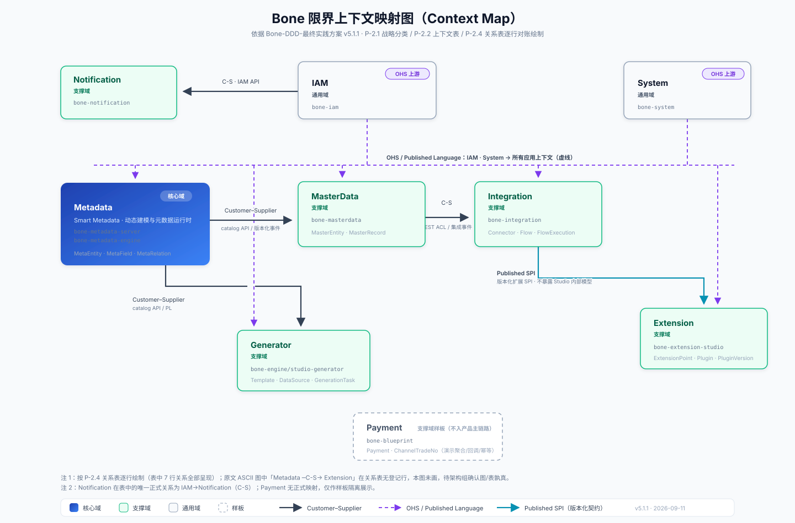

# Bone 领域驱动设计（DDD）统一实践方案

> **单文档决策**：依据 [ADR-0026](./adr/0026-ddd-single-document-consolidation.md)，整合完成后本文是 Bone DDD 原则、工程决策、门禁口径与实施状态唯一、自包含的规范真源。
> **整合状态**：已完成主文档内容整合、生效引用迁移和原分册删除；本文是 Bone DDD 唯一规范入口与实施状态真源。
> **版本**：5.5.7（HC 表二次实测纠错：HC-001 本地载体齐备改判 Manual、HC-005 补 4 个模块下调阈值、HC-008 载体误归 → 改判 Planned；门禁状态检查器补「本地载体反查」「HC 载体存在性」「覆盖率模块覆盖」三项并接入 CI；新增 G-1.1 第 15 条文档门禁，2026-09-17）
> **决策**：[ADR-0024](./adr/0024-ddd-v5-rule-semantics-and-document-split.md)、[ADR-0025](./adr/0025-ddd-v5-0-2-implementation-alignment.md)、[ADR-0026](./adr/0026-ddd-single-document-consolidation.md)、[ADR-0028](./adr/0028-application-service-first-selective-cqrs.md)
> **通用语言**：[glossary.md](../glossary.md)
> **变更记录**：Git 历史 / [CHANGELOG.md](../../CHANGELOG.md)

## 文档说明

### 文档边界

内容分三类：**P- 原则**（主流 DDD / 六边形 / 演进式架构共识）、**E- 工程决策**（Bone 在当前技术栈与组织条件下的选择）、**G- 门禁**（机器检查、语义评审与规划项的真实状态）。三者张力时按序处理：先保护业务边界 / 不变量 / 数据所有权 → 再选最简工程形态 → 机器规则不得超出其真实证明能力 → 破坏性调整记 ADR。

### 主文档导航

层级约定：**文档标题（本文）→ 部分（一页纸 / 三大部分 / 兼容入口 / Owner）→ 章节（P-n / E-n / G-n）→ 小节（n.m）**。

- [一页纸速览](#一页纸速览)
- [速查与阅读指引](#速查与阅读指引)
- [第一部分 原则（P-）](#第一部分-原则p-)
- [第二部分 Bone 工程决策（E-）](#第二部分-bone-工程决策e-)
- [第三部分 门禁与实施状态（G-）](#第三部分-门禁与实施状态g-)
- [Owner 与修订](#owner-与修订)
- [兼容入口与迁移说明（v4.x 遗留，文末附录）](#兼容入口与迁移说明)

### 稳定锚点与索引

> **契约**：外部文档（`AGENTS.md`、ADR、模块详设、代码 javadoc）**只应引用下表锚点**。表内锚点视为公开契约，结构规范化时不得改名；表外章节标题可随结构演进调整，不保证向后兼容。新增外部引用前先把锚点登记到此表。

| 稳定锚点 | 指向 | 已知引用方 |
|----------|------|-----------|
| `#一页纸速览` | 一页纸速览 | 本文导航、按角色阅读 |
| `#application-use-case-boundary` | E-3 应用用例 | `AGENTS.md`、`BONE-X-Studio 详细设计方案`、`8.Studio Generator 详细设计方案` |
| `#cqrs-port-location` | E-4 CQRS 与端口 | `ADR-0013`、DDD 单文档整合计划 |
| `#reliable-event-publishing` | E-5 事务、事件与并发 | 本文内部 |
| `#naming-style` | E-13 命名约定 | `AGENTS.md`、`Bone-API-规范.md`、`8.Studio Generator 详细设计方案` |
| `#context-map-业务限界上下文` | P-2 战略设计优先 | `ADR-0023` |
| `#g-1-1-hard-gate` | G-1.1 Hard gate | `bone-architecture-test/README.md`、`ADR-0020` |
| `#g-1-测试与-ci` | G-1 测试与 CI（**标题自动锚**，依赖 `G-1 测试与 CI` 标题文本不变） | `bone-architecture-test/README.md` |
| `#e-6-领域模型与持久化模型` | E-6 领域模型与持久化模型 | `ADR-0020` |
| `#e-37-入口构件决策` | E-3.7 入口构件决策 | 本文内部 13 处 |
| `#hc-hard-constraints` | G-1.7 HC 硬约束与实测状态 | `AGENTS.md` §12.1（2026-09-17 已收敛为薄引用）、`doc/agents/06-AI协作与编码准则.md` §12.1、本文 G-1.1 / G-1.4 |

**索引**：[通用语言 glossary.md](../glossary.md) ｜ [ADR 目录](./adr/) ｜ [变更记录 CHANGELOG.md](../../CHANGELOG.md) ｜ [API 规范 Bone-API-规范.md](./Bone-API-规范.md)

---

## 一页纸速览

### 12 条核心规则

核心规则统一用 `CORE-*` 标识。v4.x 时代的编号体系与它并行存在，两套编号不要混用。

> **两类规则不要混读**：`CORE-01`～`CORE-08` 是 DDD / 整洁架构的通用原则；`CORE-09`～`CORE-12` 是 **Bone 的工程约束**（源于元数据引擎与自研持久化栈的选型），不适用于其他项目，也不是 DDD 的要求。引用时须说清是哪一类。

| # | 规则 | 最小判定 | 类别 | 判据与示例 |
|---|------|----------|------|------------|
| CORE-01 | 边界先于分层 | 每个限界上下文有语言、Owner、契约与数据所有权 | 通用 DDD | P-2.2、P-2.4、E-1.1 |
| CORE-02 | 依赖向内 | domain 不依赖具体运行时技术与 IO 实现；外层经端口依赖内层 | 通用 DDD | P-4、E-10.1 |
| CORE-03 | 领域行为保护不变量 | 状态迁移与业务决策在聚合、值对象或领域服务 | 通用 DDD | P-3.1、E-6.4 |
| CORE-04 | 一个用例一个入口边界 | 同义构件不一对一套娃；一组内聚用例可由单个 ApplicationService 承载 | 通用 DDD | E-3.2、E-3.7 |
| CORE-05 | 写侧服务聚合，读侧服务投影 | Repository 不做报表 / Join / 投影；查询结果是页面 DTO、统计、跨聚合组合等非聚合本身时，一律走 QueryPort | 通用 DDD | E-4.1、E-4.2 |
| CORE-06 | 聚合是默认一致性边界 | 跨聚合默认最终一致；同库本地跨聚合事务须声明业务不变量、失败语义与并发成本，并记录例外 | 通用 DDD | E-5.1、E-5.4 |
| CORE-07 | 先声明可靠性与并发保证 | Outbox、乐观锁是默认实现，不是唯一实现 | 通用 DDD | E-5.2、E-5.3 |
| CORE-08 | 门禁不冒充领域证明 | 静态检查证明结构；业务语义由测试和评审证明 | 通用 DDD | G-1.2、G-1.5、G-2.1 |
| CORE-09 | EAV 只承载扩展字段（元数据工程约束） | 核心事务、高频查询、聚合字段用物理列；EAV/JSON 仅限可选、动态、长尾扩展属性 | Bone 工程 | E-6.5 |
| CORE-10 | Metadata 描述模型，不执行业务（元数据工程约束） | 元数据回答 What（模型定义）；业务规则（How）在应用/领域层执行 | Bone 工程 | E-9 |
| CORE-11 | 聚合最小化与 1:1 落盘 | 聚合只承载必须强一致的不变量；聚合根是唯一持久化入口，子实体/值对象随根落盘。**禁止把子实体提升为独立聚合**；SDK 无聚合级联时，允许「子实体级仓储 + 同一应用事务内显式逐条落盘」的受控过渡形态（条件、限制与登记要求见 [E-4.1](#e-41-写侧)） | Bone 工程 | E-4.1 |
| CORE-12 | 务实对象映射 | 核心域（L2/L3）`DTO/DO/PO` 分离并用 MapStruct；简单域（L1）允许 Shared / 轻量直转，不因“用了 DDD”强制拆 PO | Bone 工程 | E-6.6 |

> **底线**：门禁（ArchUnit）与 E/G 规范只负责挡住明显的错误和越界，管不了“设计得好不好”——聚合划得对不对、Command 该不该有、模型是否经得起演进，只能靠测试与评审（CORE-08）。规范的作用是减负而不是增负：一旦某条规则逼着人为了合规而合规，它就成了 Ceremonial Architecture，应当删除或降级（E-3.2）。
>
> **CORE-09 / CORE-10 是 Bone 在元数据引擎上的工程约束**（物理列 > 预留列 > JSON > EAV、元数据只描述模型），不是 DDD 的通行原则。它们只适用于 Bone 的元数据能力，不要据此认为 DDD 对通用代码有 EAV 限制。

### 依赖方向

```text
依赖方向（箭头指向被依赖方）：

  adapter ──────────→ application ──────────→ domain
  infrastructure ───→ application ──────────→ domain

出站端口由 domain / application 声明，infrastructure 实现；
运行时外层驱动内层，编译期依赖一律向内。
```

- adapter 可以调用公开应用用例。
- application 可以调用 domain 和出站端口。
- infrastructure 实现 domain/application 定义的出站端口。
- domain 不依赖 Spring 运行时、Web、数据库、MQ、Jackson 或查询 DSL；D1 仅允许 [E-6](#e-6-领域模型与持久化模型) 定义的白名单编译期注解。

### 默认交付路径

```text
写：Controller → ApplicationService → Repository.findById → Aggregate.behavior → Repository.save
读：Controller → ApplicationService.get()/page() → Repository        （简单读，读模型与 domain 一致）
跨步骤：Adapter → Orchestrator → 独立事务步骤 → 补偿/重试
```

默认使用**语义化 ApplicationService** 作为入站边界（[ADR-0028](./adr/0028-application-service-first-selective-cqrs.md)）。复杂度升级时才引入 `Command` / `Handler`：写意图需显式契约或多入口时加 `Command`，命令异步/跨事务时 `CommandHandler` 落在 Outbox 消费端/任务端，读模型与聚合分歧时 ApplicationService 内升级 QueryPort（复杂读再进 `QueryHandler`）。判据见 [E-3.7](#e-37-入口构件决策)。

> **落地现状**：`*ApplicationService` 是**目标形态**，目前仅在 blueprint 样板（如 `OrderPaidConsumptionApplicationService`）有生产实例，其余存量应用层由 `*CommandHandler` / `*QueryHandler` 承载，按 E-0.2 的迁移节奏逐步收敛。所以这里的 ApplicationService 路径是**新代码基准**：评审不要把“存量 Handler 形态”判成违规；反过来，新增模块也不能拿“存量都这么写”当理由继续堆 Handler。状态随本文版本更新，见第三部分。

### 裁剪档位

| 档位 | 适用 | 最低要求 | 映射与读写策略 |
|------|------|----------|----------------|
| L0 | 框架、SDK、纯技术服务 | 依赖方向、公开契约、无业务模型污染 | 无业务模型；原生技术工具包 |
| L1 | CRUD 支撑域 | 边界、租户、写仓储、基础门禁（简单读经写仓储 / ApplicationService，复杂读才用 QueryPort） | 写：入参 → DO(=PO)（**Shared** / 轻量直转）；读：`Query → DTO` |
| L2 | 有状态机或复杂规则的应用域 | 聚合行为、纯领域测试、并发策略、领域事件 | 写：入参 → DO → PO（**Separated**，充血，MapStruct）；读：`QueryPort → DTO` / 投影 |
| L3 | 跨进程不可丢事件、回调、资金流程 | 原子发布、消费幂等、契约测试、补偿与可观测 | 同 L2，另加 Outbox + 幂等 + Orchestrator + DLQ；对外经 ACL |

档位由业务复杂度和集成保证决定，不由目录位置或“模块重要性”决定。

### 五步决策速查

> 新用例或模块按表顺序决策，某步答“否”就停，不追加结构。判据见 [E-3.7 入口构件决策](#e-37-入口构件决策)。

| 步 | 问题 | 否 → | 是 → |
|----|------|------|------|
| ① 边界 | 属于哪个限界上下文？Owner / 语言 / 表所有权是否明确？ | 回 [P-2](#p-2-战略设计优先) 补齐边界再继续 | 进入下一步 |
| ② 不变量 | 是否存在必须同一次提交强一致的不变量 / 状态机？ | 简单读写，直接用 `ApplicationService`，无需聚合 | 建模聚合，由行为保护不变量（见 ③） |
| ③ 读写复杂度 | 读模型是否与聚合结构分歧（报表 / 多聚合 / 搜索）？写意图是否需显式契约、异步、多入口？ | 单一模型，同走 ApplicationService | 读分歧 → `QueryPort`（复杂读再 `QueryHandler`）；写契约 → `Command` → `CommandHandler` |
| ④ 一致性边界 | 跨聚合协作？事件能否丢失？ | 单聚合本地事务 | 最终一致 + 事件；不可丢走 Outbox + 消费幂等 |
| ⑤ 最小结构 | 新加的 `Handler / Service / Port / Facade` 是否承担独立职责？ | 删除／不建 | 保留后检查 [提交前自检](#提交前自检) |

## 速查与阅读指引

> 一页纸速览之外的三个查找入口，按使用顺序排列：**反模式速查**（先知道别做什么）→ **提交前自检**（提交动作清单）→ **按角色阅读**（谁该读哪一段）。

### 反模式速查

| # | 反模式 | 判定信号 | 处置 |
|---|--------|----------|------|
| 1 | **DDD 全家桶套用** | 不分业务一律生成 Command / Handler / Service / DomainService / Repository / Converter | 按 [E-3.7](#e-37-入口构件决策) 决策树裁剪；简单域回退 ApplicationService |
| 2 | **仪式性架构（Ceremonial Architecture）** | 中间层只透传：有效逻辑 ≤ 2 行且无分支、事务、事件或协调 | 删除该层（E-3.2） |
| 3 | **ApplicationService 万能化** | SQL / RPC / 业务规则 / MQ 消费全塞进同一服务 | 规则下沉聚合、查询下沉 QueryPort、IO 走端口 |
| 4 | **DomainService 万能化** | 在 DomainService 里做 IO 与事务编排 | 领域服务只用领域语言做纯规则（E-13.2） |
| 5 | **Repository DAO 化** | 仓储接口出现 `findPage` / `statistics` / `search` / 多表 Join | 查询迁 QueryPort；仓储自声明的方法只返回聚合 / `Optional<聚合>` / boolean / void（E-4.1） |
| 6 | **Metadata / 规则引擎过度使用** | 把简单逻辑配置化、动态化，无类型安全、难调试、AI 无法识别 | 回退显式代码（CORE-10） |
| 7 | **AI 盲目生成冗余代码** | 提示词无约束，自动创建大量空层级与转发类 | 按 [E-3.11](#e-311-aiagent-生成与重构纪律) 最小生成 + 抽象质问 |
| 8 | **贫血模型** | 逻辑写在 Service，聚合退化为纯数据容器（setter 序列改状态） | 状态迁移回落聚合（CORE-03、E-6.4） |

> 详判据：Ceremonial Architecture 见 E-3.2；反贫血见 E-6.4；AI 生成纪律见 [E-3.11](#e-311-aiagent-生成与重构纪律)。

### 提交前自检

> 提醒，不是门禁。它是 [G-4 交付验收清单](#g-4-交付验收清单)的快速子集；括号内为对应条文。

- [ ] 边界 / Owner / 数据所有权先于分层；domain 无外层运行时依赖；不变量与状态迁移在聚合内（CORE-01/02/03）。
- [ ] 写用例默认 `ApplicationService` 起步，不预生成 command / query / handler 空目录；简单读直查，读模型分歧才上 `QueryPort`（CORE-04/05、[E-3.7](#e-37-入口构件决策)、E-4.2）。
- [ ] 一个用例一个入口边界，同义层不互委；中间层只透传就删掉（CORE-04、E-3.2）。
- [ ] 一事务一聚合、跨聚合事件 + 最终一致；不可丢事件走 Outbox + 消费端幂等（CORE-06/07、[E-5.2](#e-52-可靠发布)）。
- [ ] 聚合根是唯一持久化入口，不把子实体提升为独立聚合；核心域（L2/L3）Separated + MapStruct、简单域（L1）Shared（CORE-11/12）。因 SDK 无级联而给子实体建仓储时，须同事务落盘并已登记（[E-4.1](#e-41-写侧)）。
- [ ] 新增抽象先答“没有它，哪个独立问题解决不了”，答不上就不建（E-3.11、P-1）。
- [ ] 并发写入声明冲突策略并测试（E-5.3）。

### 按角色阅读

| 角色 | 首次阅读 | 日常使用 |
|------|----------|----------|
| 新成员 | 一页纸速览 → P-2/P-3 → E-3/E-4 → E-12 | [提交前自检](#提交前自检) |
| 领域/产品 | P-2 战略设计 → Context Map → glossary | 上下文、语言与业务规则评审 |
| 后端工程师 | P-3/P-5 → E-3～E-10 → G-1 | 用例、聚合、事务与端口评审 |
| 架构师 | 全文 → G-1 门禁 | ADR、规则准入与例外治理 |
| 外部读者 | [一页纸速览](#一页纸速览) | 按链接深入本文对应章节 |

第一次阅读应连续读完本文核心正文；实施状态、迁移历史和扩展示例均在本文对应章节查询。

---

## 第一部分 原则（P-）

> **本部分只写行业共识和“为什么”**：P- 是主流 DDD / 六边形 / 演进式架构的通行结论，不写 Bone 的实现细节（类名、目录名、方法名、技术选型）——这些一律放在[第二部分](#第二部分-bone-工程决策e-)。想知道“Bone 到底怎么做”，用[第二部分导读](#第二部分-bone-工程决策e-)的对照表跳到对应 E- 章节。
>
> **唯一例外是 P-2**：战略设计必须落到 Bone 自身的战略判断，所以 P-2.1 的子域分类、P-2.2 的“上下文 ↔ 代码模块”映射是 **Bone 战略快照**（随战略复核变化），不是行业通行结论——读这两张表时不要把它们当作 DDD 的通用分类法，也不要据此推导别的项目该怎么分。除 P-2 之外，P- 部分不出现类名、目录名与技术选型。

### P-1 适用范围

系统化 DDD 适用于：

- 业务语言复杂且持续演进；
- 规则、不变量和状态迁移需要长期维护；
- 多团队或多系统之间需要明确边界；
- 团队愿意投入领域建模和契约治理成本。

纯 CRUD、无演进压力的简单能力可以使用轻量模型，不为“看起来像 DDD”制造聚合、事件和目录。

**复杂度检查**：写操作是否由单一 `*ApplicationService` 清晰表达，判断标准是一个类能不能说清楚这个模块做什么——能，就不引入 Command / Handler。方法数量只是辅助信号：create / update / delete + 少量业务操作、读也可由同一服务覆盖，通常是简单信号；但“方法少、各自却带独立执行策略、状态机、异步、多入口或复杂协调”（如 pay / refund / settle）并不因此变简单。判据先看是否存在独立的执行策略、事务、路由或生命周期，其次才看方法数（见 E-3.2）。

> **正面示例**（L0/L1 大多数支撑域和简单核心域都适用）：
> ```java
> @Service
> public class DictItemApplicationService {
>     public DictItemId create(CreateDictItemCommand command) { ... }
>     public void update(UpdateDictItemCommand command) { ... }
>     public void delete(DictItemId id) { ... }
>     public ImportResult batchImport(ImportDictItemsCommand command) { ... }
>     public DictItemView get(DictItemId id) { ... }
>     public PageResult<DictItemSummary> page(SearchDictItemsQuery query) { ... }
>     public void sort(SortDictItemCommand command) { ... }
> }
> ```
> 7 个方法、一个类就能说清字典项模块的全部职责。**不需要 `CommandHandler`、`QueryHandler`、`QueryService`。**
>
> 两个容易读错的点：入参 `*Command` / `*Query` 是 **application 自己的输入对象**，adapter 的 `*Req` / `*Qry` / `*Resp` 止步于 Controller，不得进入 application 方法签名（E-13.1、E-10.1）；**"有 `*Command` 对象"不等于"要建 `*CommandHandler`"**——Handler 只在命令需独立路由 / 生命周期 / 多入口时引入（E-3.7 AS-03）。

违反此检查的常见信号：

- 新建模块第一天就生成 `command/`、`commandhandler/`、`query/`、`queryhandler/` 四个空目录；
- 一个只有 CRUD 的支撑域却有 15+ 个应用层类；
- ApplicationService 和 CommandHandler 各自只有一个方法且方法体只有一行委派。

### P-2 战略设计优先

<a id="context-map-业务限界上下文"></a>

#### P-2.1 战略分类

Bone 当前只认定 Metadata / Smart Metadata 为核心域；这是当前产品差异化投资决策，不是“DDD 只能有一个核心域”的行业规则。分类应随产品战略复核。

| 子域 | 类型 | 分类依据 |
|------|------|----------|
| Metadata / Smart Metadata | 核心域 | 动态建模、catalog 与元数据运行时构成 Bone 当前主要差异化能力 |
| MasterData | 支撑域 | 基于元数据能力提供主数据治理 |
| Integration | 支撑域 | 连接器、流程编排与执行治理 |
| Extension | 支撑域 | 扩展点与插件生命周期 |
| Notification | 支撑域 | 通知渠道与发送记录 |
| Generator | 支撑域 | 模板、数据源与代码生成任务 |
| Payment | 支撑域样板 | 仅用于演示聚合、回调、幂等与可靠事件 |
| IAM | 通用域 | 身份、认证与授权 |
| System | 通用域 | 配置、日志与监控 |

核心域不是“最复杂模块”或“技术上不可替代模块”的同义词。复核时至少回答：

1. 客户选择 Bone 的主要购买理由是什么？
2. 该能力相对竞品形成了什么可持续差异？
3. 领域专家和研发资源是否持续优先投入？
4. 替换该能力是否会改变 Bone 的产品定位？

#### P-2.2 业务限界上下文

限界上下文是模型和语言的适用边界，不等同于 Maven 模块、微服务或数据库。

每个上下文至少明确：

- 名称与职责；
- 核心通用语言；
- Owner；
- 对外 API/事件契约；
- 数据与写入规则所有权；
- 相邻上下文关系。

| 限界上下文 | 核心职责 | 主要语言 | 代码模块 |
|------------|----------|----------|----------|
| Metadata | 建模 catalog、模型校验、元数据运行时 | `MetaEntity`、`MetaField`、`MetaRelation`、Runtime | `bone-metadata-server`、`bone-metadata-engine`；SDK 为技术支撑 |
| IAM | 账号、租户、角色、权限与认证 | `Account`、`Role`、`Permission`、`Tenant` | `bone-iam` |
| MasterData | 主数据实体、记录与质量治理 | `MasterEntity`、`MasterRecord` | `bone-masterdata` |
| Integration | 连接器、流程、执行与重试 | `Connector`、`Flow`、`FlowExecution` | `bone-integration` |
| Extension | 扩展点、插件、版本与发布 | `ExtensionPoint`、`Plugin`、`PluginVersion` | `bone-extension-studio` |
| System | 平台配置、运维日志与监控 | `SysConfig`、`SysLog`、`Monitor` | `bone-system` |
| Notification | 通知、渠道与发送记录 | `NotificationRecord`、`Channel` | `bone-notification` |
| Generator | 模板、数据源与生成任务 | `Template`、`DataSource`、`GenerationTask` | `bone-engine/studio-generator` |
| Payment | 支付单生命周期样板 | `Payment`、`ChannelTradeNo` | `bone-blueprint` |

代码组织原则：

- 一个模块只能归属一个上下文；
- 一个上下文可以由多个内聚模块组成；
- 是否拆服务由发布、团队、伸缩和故障隔离决定。
- SDK、框架库和网关不因存在 Maven 模块就自动成为限界上下文。
- 表中模块名是 Maven 模块短名；实际路径以根 `pom.xml` 为准，例如 `bone-engine/bone-extension-engine/bone-extension-studio`。
- `bone-init.sql` 中的 `ic_*` 保险表示例数据尚未被认定为限界上下文。

#### P-2.3 通用语言

- 产品、领域专家、研发和测试使用同一业务词汇。
- 聚合、命令、事件、API 与关键字段体现该语言。
- 同名不同义必须加上下文限定。
- 技术词不能替代业务概念。

#### P-2.4 上下文映射

Context Map 只描述业务上下文之间的关系：

- Partnership；
- Customer–Supplier；
- ACL；
- OHS；
- Published Language；
- Shared Kernel；
- Conformist。

Bone 当前业务上下文关系（图与下表以关系表为真源，逐行对账绘制）：



> 图注：实线为已登记的正式业务关系；紫色虚线为 OHS / Published Language 母线（IAM、System → 所有应用上下文）；Payment 为 blueprint 样板，虚框隔离、不入产品主链路。历史 ASCII 图中的「Metadata ─C-S→ Extension」经代码裁决废弃：`bone-extension-studio` 仅依赖 `bone-metadata-sdk` 的 Table/Column 注解、Criteria 与 Repository 等技术持久化能力，对 `bone-metadata-server` 内部包 import 为 0，按 P-2.2「SDK 与技术依赖不混入 Context Map」不属于业务级 Customer–Supplier 关系，Extension 的上游唯 Integration（Published SPI）。

| 上游 | 下游 | 模式 | 契约 | 下游责任 |
|------|------|------|------|----------|
| IAM | 所有应用上下文 | OHS / Published Language | JWT、IAM REST API | 使用 ACL 转换身份与权限语义 |
| Metadata | MasterData | Customer–Supplier | catalog API、版本化快照或事件 | 不依赖 Metadata 内部聚合类型 |
| Metadata | Generator | Customer–Supplier | catalog API / Published Language | 转换为 Generator 自身模板语言 |
| MasterData | Integration | Customer–Supplier | REST ACL 或集成事件 | 不跨库读取主数据表 |
| Integration | Extension | Published Language | 版本化扩展 SPI | SPI 保持兼容，不暴露 Studio 内部模型 |
| System | 所有上下文 | OHS | 配置、日志与监控 API | 只消费公开技术契约 |
| IAM | Notification | Customer–Supplier | IAM API | Notification 不持有 IAM 聚合 |

术语必须按以下语义使用：

- **Shared Kernel**：多个上下文共同拥有、共同维护的一小部分领域模型；变更需要相关团队共同批准。
- **Shared Library / Platform Kernel**：无业务语义的公共技术库；`bone-core`、`bone-web`、`bone-metadata-sdk` 属于此类。
- **Conformist**：下游直接接受上游领域模型且无翻译能力的上下文关系。判据是**下游自己的领域模型里是否出现了上游的业务概念**，而不是“是否依赖了上游的包”——纯技术 SDK（如 `bone-metadata-sdk` 的 `Criteria` / `Repository`）没有业务语义，属 Shared Library，不构成 Conformist；反之，下游若把上游的业务 DTO / 聚合类型直接当作本上下文模型使用（上表 IAM → 各上下文若跳过“转换身份与权限语义”这一步），在模型关系上**就是** Conformist 退化。
- **ACL**：在边界处把外部语言翻译为本上下文语言，不是简单的 HTTP Client 包装。
- **OHS / Published Language**：稳定公开服务与版本化契约，不能等同于内部 Java 包。

framework、SDK、Gateway 等技术依赖另画技术图，不能混入 Context Map。

#### P-2.5 核心域

DDD 不限制组织只能有一个 Core Subdomain。核心域表示当前战略差异化投资，可有多个，也可随战略变化。详见 [P-2.1 战略分类](#p-21-战略分类)。见 [ADR-0023](./adr/0023-core-domain-smart-metadata.md)。

**元数据职责边界（CORE-10）**：Metadata 只描述模型（What：Model Definition / Schema / Relationship / Constraint / Version），不执行业务逻辑（How）。业务规则与状态迁移必须落在应用层与领域层；Metadata 的 Runtime / Validator 只是「模型 → 执行」的通道，不内嵌具体业务语义。防止 Metadata 从「建模系统」膨胀为「第二个应用运行时」。

### P-3 战术建模

#### P-3.1 聚合

聚合是强一致不变量与并发控制边界。

识别聚合时回答：

1. 哪些对象必须在同一提交中共同满足业务不变量？
2. 哪些对象没有脱离根的独立生命周期？
3. 某对象能否不加载根、不破坏根不变量地独立修改并提交？
4. 变更频率、冲突概率和锁定范围是否相容？

约束：

- 聚合尽量小；
- 聚合间使用 ID/值对象引用，不持有对方对象图；
- 外部只能通过聚合根修改内部实体；
- 聚合内实体可以用 `RootId + ChildId` 定位；
- 可凭 ID 寻址本身不是独立聚合判据。

#### P-3.2 实体和值对象

- 实体有稳定身份和生命周期。
- 值对象无独立身份、按值比较、默认不可变。
- 值对象优先使用 `record` 或 `final` 字段。
- 强类型 ID 用于重要跨聚合引用，避免裸标量误传。

#### P-3.3 领域服务

领域服务承载：

- 无法自然归属单个聚合/值对象的纯业务规则；
- 使用领域语言；
- 不依赖具体 IO 实现与框架；确需外部领域事实时，只依赖 domain 端口并由应用层控制调用时机。

领域服务不承担用例事务、DTO 转换、查询报表或技术工具职责。

#### P-3.4 领域事件

- 表达已经发生的领域事实；
- 名称使用过去式；
- 载荷只含领域语义；
- 上下文内可直接使用；
- 跨上下文前转换为版本化集成事件。

`eventId`、trace、schema version 等传输字段属于集成事件信封，不强迫领域事件本体携带。

#### P-3.5 Repository

Repository 是聚合根的集合抽象：

- 按身份或单一业务键加载聚合；
- 保存和删除聚合；
- 不承担分页、报表、Join 或 UI 投影；
- 接口位于 domain，实现位于 infrastructure；
- **1:1 落盘**：聚合根是唯一持久化入口，子实体与值对象随根一起落盘；不为子实体建立“独立聚合”级仓储。聚合内明细确需自己的仓储时按同一聚合口径归并，不构成第二个聚合——判据是它只能读写所属聚合的明细，不独立创建聚合、不跨聚合查询，写入口仍由聚合根方法驱动（CORE-11、E-4.1）。该形态**默认不建**：确需时按 E-0.4 记入 ADR 并在模块 README 登记，且它不得跨聚合查询、不得独立创建聚合——机器无法验证这三点判据，因此不登记即视为越界。

#### P-3.6 聚合建模工作法

新业务不要从建表或生成 Controller 开始。一次最小建模工作坊按以下顺序进行：

1. **讲业务故事**：用领域语言描述参与者、触发、决策、结果与失败。
2. **提取事实**：把“已经发生”的事实写成候选领域事件，如“订单已确认”。
3. **反推命令**：识别产生事实的意图，如“确认订单”。
4. **识别不变量**：明确哪些条件在一次提交后必须同时成立。
5. **划定聚合**：把必须共同保持强一致的对象放入同一边界，其余只保留 ID。
6. **验证冲突模型**：检查聚合是否过大、热点写是否会互相阻塞。
7. **确认边界外协作**：为跨聚合步骤定义事件、幂等、重试和补偿。

建模产物不是 UML 数量，而是以下可执行答案：

| 问题 | 最小产物 |
|------|----------|
| 谁拥有业务规则？ | 聚合行为或纯领域服务 |
| 什么必须强一致？ | 聚合不变量与事务边界 |
| 什么可以稍后完成？ | 领域事件/集成事件与状态机 |
| 谁可以写数据？ | 上下文与表 Owner |
| 失败如何恢复？ | 幂等、重试、补偿、人工入口 |

#### P-3.7 最小聚合示例

以下示例展示规则放置方式，不规定具体持久化注解：

```java
public final class Order {
  private final OrderId id;
  private OrderStatus status;
  private final List<DomainEvent> events = new ArrayList<>();

  public void confirm(Instant occurredAt) {
    if (status != OrderStatus.DRAFT) {
      throw new DomainException("只有草稿订单可以确认");
    }
    status = OrderStatus.CONFIRMED;
    events.add(new OrderConfirmedEvent(id, occurredAt()));
  }
}
```

关键点：

- `confirm()` 表达领域语言并保护状态迁移；
- 调用者不通过 setter 拼装 `CONFIRMED` 状态；
- 事件只在真实迁移后产生；
- 时间、ID 等可测试变化量通过参数、工厂或领域端口注入；
- Application 负责加载和保存，Aggregate 负责决定能否确认。

### P-4 六边形与整洁架构

- 业务策略不依赖技术细节。
- 入站适配器把协议请求转换为应用用例输入。
- 应用用例协调领域和出站端口。
- 出站适配器实现数据库、消息和第三方集成。
- DTO、第三方异常和协议状态不进入 domain。

端口位置由使用者拥有：

- 领域规则需要的外部能力端口可位于 domain；
- 应用流程、查询和通知端口位于 application；
- 实现位于 infrastructure。

**四层架构拓扑**（示意；`Command/Handler/QueryPort/Orchestrator` 均为“按需”构件，判据见 [E-3.7](#e-37-入口构件决策)）：

```text
+----------------------------------------------------------------------+
|                    Adapter Layer（适配层 / 入站）                       |
|  REST Controller · RPC Provider · MQ Consumer · Job / CLI / WebUI    |
|  职责：协议转换、认证鉴权、上下文注入、基础参数校验                       |
+----------------------------------------------------------------------+
                                     │
                                     ▼
+----------------------------------------------------------------------+
|                    Application Layer（应用服务层）                      |
|  默认：ApplicationService（用例编排 / 事务 / 防重）                     |
|  按需：Command / CommandHandler · QueryPort · Orchestrator            |
+----------------------------------------------------------------------+
                                     │
                                     ▼
+----------------------------------------------------------------------+
|                       Domain Layer（核心领域层）                       |
|  Aggregate Root · Entity · Value Object · DomainEvent                 |
|  DomainService（仅跨聚合纯规则）· Repository Port · ACL Port          |
+----------------------------------------------------------------------+
                                     ▲
                                     │  依赖倒置（Dependency Inversion）
+----------------------------------------------------------------------+
|                   Infrastructure Layer（基础设施层 / 出站）              |
|  Repo Impl · Query Adapter / View · MQ Producer                     |
|  RPC / HTTP Client · ACL Impl · Outbox Relay · Converter           |
+----------------------------------------------------------------------+
```

上图是**依赖方向的原则形态，与具体技术栈无关**：业务策略不依赖技术细节，出站适配器实现数据库 / 消息 / 第三方访问，端口由内层声明。图中 `Repo Impl` 即 `domain/repository` 在 `infrastructure/persistence` 的实现；读侧 `Query Adapter` 对应 `application/query/port` 的实现；`Outbox Relay` 对应 [E-5.2](#e-52-可靠发布)。

> **Bone 选定的持久化栈与禁用 ORM 清单是工程约束，不写在原则章**：具体选型（`bone-metadata-sdk`、禁 MyBatis / MyBatis-Plus / JPA / Hibernate）及其门禁状态见 [G-1.7](#hc-hard-constraints) 的 HC-001 / HC-006，语义展开见 [E-4.1](#e-41-写侧)。本部分只在工程决策与门禁章节出现类名、技术选型。

### P-5 CQRS、一致性与可靠性

#### P-5.1 CQRS

CQRS 首先是读写关注点分离：

- 写侧围绕聚合和不变量；
- 读侧围绕投影和查询体验；
- 不默认要求读写分库、事件溯源或异步投影。

#### P-5.2 事务

默认一个业务事务修改一个聚合实例。跨聚合默认最终一致。

允许例外，但必须说明：

- 为什么不能拆为多个步骤；
- 要保护的跨聚合不变量；
- 锁顺序与并发风险；
- 失败、重试和回滚语义；
- 对应测试。

#### P-5.3 最终一致

跨聚合/上下文流程需要明确：

- 状态机；
- 事件或命令；
- 幂等；
- 重试和死信；
- 超时；
- 补偿；
- 可观测与人工恢复。

#### P-5.4 可靠事件发布

选择机制的入口是业务保证，而不是发布 API 名称：先明确能否丢失、能否重复、是否有序、延迟与恢复要求，再选择 Best-effort、Durable 或同步确认。Outbox 是 Bone 的默认 Durable 方案，不是唯一方案；完整工程契约见 [E-5.2](#e-52-可靠发布)。

#### P-5.5 回调幂等与跨聚合协作

外部回调必须：

1. 在进入领域前通过端口验签；
2. 校验时间戳/nonce，防重放；
3. 使用外部流水号或请求 ID 作为幂等键；
4. 由聚合决定重复回调是否引起状态迁移；
5. 使用唯一约束、条件更新或等价原子机制处理并发；
6. 只在真实迁移时产生领域事件。

发布时序、幂等与并发要件以 E-5.2 为准。

### P-6 集成与 ACL

- 外部模型和错误语义不穿透本上下文。
- ACL 使用本上下文语言声明端口。
- 适配器负责请求、响应、错误和空值翻译。
- 跨上下文优先公开 API、Published Language 或本地事件投影。
- 禁止共享写表集成。

### P-7 演进与质量属性

- 核心规则应能无容器测试。
- 关键用例具备日志、指标和追踪。
- 跨边界契约有版本和废弃策略。
- 架构适应度函数防止可机械识别的退化。
- 机器检查不替代领域评审。

---

## 第二部分 Bone 工程决策（E-）

> **本节编号顺序 ≠ 阅读顺序**。`E-0` 是“如何修改本规范”的**元契约**（治理用，首次阅读可跳过，需要时再查）。
> **技术主线（建议按此顺序）**：[E-1 上下文与数据所有权](#e-1-上下文与数据所有权) → [E-2 多租户](#e-2-多租户) → [E-3 应用用例](#e-3-应用用例) → [E-4 CQRS 与端口](#e-4-cqrs-与端口) → [E-5 事务、事件与并发](#e-5-事务事件与并发) → [E-6 领域模型与持久化模型](#e-6-领域模型与持久化模型) → [E-7 ID 与错误](#e-7-id-与错误)。
> **落地脚手架**：[E-8 测试](#e-8-测试) ｜ [E-9 模块适用性](#e-9-模块适用性) ｜ [E-10 包结构参考](#e-10-包结构参考) ｜ [E-12 新模块 5 步](#e-12-新模块-5-步)。**AI 协作**见 [E-11 Flow / AI](#e-11-flow--ai)；**命名约定** [E-13](#e-13-命名约定) 可当字典随查。

**原则（P-）→ 工程决策（E-）对照**（P- 讲为什么，E- 讲 Bone 怎么做）：

| 原则（P-） | 落地的 Bone 工程决策（E-） |
|-----------|---------------------------|
| P-2 战略设计优先 | [E-1 上下文与数据所有权](#e-1-上下文与数据所有权) |
| P-3 战术建模 | [E-6 领域模型与持久化模型](#e-6-领域模型与持久化模型)、[E-7 ID 与错误](#e-7-id-与错误) |
| P-3.5 Repository | [E-4.1 写侧](#e-41-写侧) |
| P-4 六边形与整洁架构 | [E-10 包结构参考](#e-10-包结构参考) |
| P-5 CQRS、一致性与可靠性 | [E-4 CQRS 与端口](#e-4-cqrs-与端口)、[E-5 事务、事件与并发](#e-5-事务事件与并发) |
| P-6 集成与 ACL | [E-4.3 ACL 端口](#e-43-acl-端口) |
| P-7 演进与质量属性 | [E-8 测试](#e-8-测试) + [第三部分 门禁](#第三部分-门禁与实施状态g-) |

### E-0 规范稳定性契约

#### E-0.1 新代码

新代码遵守本文 CORE-01～CORE-12、对应 P/E/G 条文和项目硬约束。

#### E-0.2 存量不符合规范代码的处理

存量采用增量迁移：

- 不因重写规范要求一次性重构业务代码；
- 新增代码不得扩大明确的结构违规；
- freeze 基线只收缩；
- 规则语义发生变化时，先修规则 fixture 和声明，再迁移代码；
- **存量 CommandHandler 迁移**：不强制一次性迁移到 ApplicationService。存量 Handler 在功能修改时评估是否可合并到同义 ApplicationService；新用例一律从 ApplicationService 开始（AS-01）。

#### E-0.3 破坏性变更

修改边界、事务、异常根、持久化策略或门禁语义时：

1. 新增 ADR；
2. 同步本文受影响章节、AGENTS 和 glossary；
3. 区分目标态与实现态；
4. 规则先有正反 fixture，再推广到模块；
5. 不通过重置 freeze 掩盖新增问题。

#### E-0.4 例外

| 范围 | 记录 |
|------|------|
| 跨模块/平台级 | ADR |
| 单模块 | 模块 README |
| 类/方法工程折中 | Javadoc |

例外包含业务理由、Owner、拆除条件和目标日期。相同例外跨两个以上模块出现时，优先复核规则是否合理，而不是机械升级例外。

### E-1 上下文与数据所有权

#### E-1.1 数据所有权硬约束

硬约束：

- 一个模块只属于一个上下文；
- 一张业务表只有一个写入所有者；
- 跨上下文禁止直接写表；
- 业务查询禁止直接 Join 其他上下文拥有的表；
- 跨上下文读取通过公开 API、版本化事件或本地投影；
- 分析平台需要跨域数据时，消费发布的数据产品或快照，不绕过所有权直接依赖在线写表。

#### E-1.2 模块数据所有权声明

每个上下文必须在模块 README 维护可审查的数据所有权声明：

```markdown
## 上下文边界

- 限界上下文：IAM
- Owner：IAM 团队
- 对外契约：JWT、`/api/v1/iam/**`
- 代码模块：`bone-platform/bone-iam`

## 本上下文拥有的表

| 表名 | 用途 | 归属聚合 |
|------|------|----------|
| iam_account | 登录账号 | Account |
```

#### E-1.3 技术模块依赖与 Context Map 演进检查

技术模块依赖不构成业务 Context Map：

```text
应用上下文模块
  ├── bone-core / bone-web / bone-security
  ├── bone-metadata-sdk
  ├── bone-extension-sdk（需要扩展能力时）
  └── 各上下文公开契约或 Client SDK

bone-gateway
  └── HTTP 路由、认证透传与协议级横切
```

Platform Kernel 只允许实体与聚合基类、审计、租户上下文、统一响应、异常根、领域事件标记和 metadata repository SPI 等无单一上下文业务语义的能力。`QueryBuilder` 是基础设施查询能力，不属于领域 Shared Kernel；`bone-gateway` 不承担跨上下文业务编排；公共 SDK 通过语义化版本和契约测试治理兼容性。

出现以下任一情况时执行 Context Map 演进检查：

- 产品战略出现新的差异化投资方向；
- 团队所有权或独立发布边界变化；
- 一个模块开始同时使用两套冲突的业务语言；
- 出现跨上下文写表、直接依赖对方 domain 包或跨库 Join；
- 上下文过大，已无法由单个团队理解、测试和演进。

### E-2 多租户

- `TenantContext` 由框架过滤器/拦截器写入，业务代码不写。
- 业务层通过统一 `TenantProvider` 或认证上下文读取。
- 异步、MQ、Outbox 和定时任务显式携带/恢复租户。
- 跨边界 Command、事件和 RPC 显式携带 `tenantId`。
- 查询和写入必须包含租户隔离。
- 平台超管跨租户操作必须授权并审计。
- 外层不得修改聚合 `tenantId`。

<a id="application-use-case-boundary"></a>

### E-3 应用用例

应用层执行一个用户或系统用例：建立事务、授权与幂等边界，加载聚合并调用领域行为，持久化结果，调用出站端口，转换用例级失败并协调事件发布。聚合内部不变量仍由 domain 负责。

> **默认入站边界是语义化 ApplicationService**（详见 [E-3.7](#e-37-入口构件决策)，决策依据 [ADR-0028](./adr/0028-application-service-first-selective-cqrs.md)）。Command / Handler 是**复杂度驱动的可选件**，不是默认三件套；读写统一走 ApplicationService，CQRS 指读写职责分离，而非类文件数量翻倍。

> **本节子入口（E-3.7 是选型决策入口）**：[E-3.1 允许的入口](#e-31-允许的入口) ｜ [E-3.2 一个用例一个边界](#e-32-一个用例一个边界) ｜ [E-3.3 Orchestrator](#e-33-orchestrator) ｜ [E-3.4 Facade](#e-34-facade) ｜ [E-3.5 事务位置与代理规则](#e-35-事务位置与代理规则) ｜ [E-3.6 写用例参考形态](#e-36-写用例参考形态) ｜ [E-3.7 入口构件决策](#e-37-入口构件决策) ｜ [E-3.8 ApplicationService 拆分标准](#e-38-applicationservice-拆分标准) ｜ [E-3.9 场景 × 模式决策矩阵](#e-39-场景--模式决策矩阵) ｜ [E-3.10 AI/Agent 选型判据](#e-310-aiagent-选型判据) ｜ [E-3.11 AI/Agent 生成与重构纪律](#e-311-aiagent-生成与重构纪律)


#### E-3.1 允许的入口

每个用例只选择一种入口构件：

| 构件 | 适用场景 | 是否可直接作为入站端口 |
|------|----------|------------------------|
| `{语义}ApplicationService` | **默认入口**：简单读写 / CRUD / 一组高度内聚、共享同一应用级策略的操作 | 是 |
| `*CommandHandler` | 单个写用例，且命令需要独立路由、生命周期、异步跨事务或多入口统一执行 | 是 |
| `*QueryHandler` | 单个复杂读用例（分析/报表/搜索等 read model 场景） | 是 |
| `*Orchestrator` | 跨步骤、可重试或可补偿的流程 | 是 |
| `*Facade` | 稳定 Client SDK 契约或多个入站适配器共享用例集合 | 是，但内部只路由到前述构件 |

构件选型遵循“复杂度驱动”：默认 ApplicationService 即可；仅当写意图需显式契约、命令数量多、命令异步化/多入口时引入 Command / CommandHandler，读模型脱离聚合结构时 ApplicationService 内升级 QueryPort，极少数需要独立读路由时引入 QueryHandler（见 [E-3.7](#e-37-入口构件决策) 与 [ADR-0028](./adr/0028-application-service-first-selective-cqrs.md)）。

#### E-3.2 一个用例一个边界

Controller 可以直接依赖 Handler 或合法的 ApplicationService。下列情形禁止；它们靠语义评审判定，没有对应的机器门禁：

- `Controller → Handler → 同义 ApplicationService` 一对一委派；
- `Controller → ApplicationService → 同义 Handler` 一对一委派；
- Handler 为复用而调用另一个 Handler；
- Facade 直接操作 Repository、聚合或 infrastructure；
- 应用构件实现聚合内部不变量。

**Ceremonial Architecture（仪式感架构）**：当中间层只做透传而不增加事务、策略、路由或生命周期管理时，该层是仪式性的。典型信号：`handle()` 方法体只有一行 `return applicationService.xxx(command);`，或 `ApplicationService.handle()` 只有一行 `repository.save(aggregate)`。Ceremonial 层增加类数量、认知负担和修改点，不增加任何架构能力。Bone 禁止 Ceremonial Architecture。

检测方式：若 `handle()` 方法的有效业务逻辑（排除日志、租户获取等横切）不超过 2 行，且不包含条件分支、事务提交、事件发布或多聚合协调，则判定为 Ceremonial。评审时应删除该层，将调用上移或下推到实际执行层。

**正反例**：

```java
// ✅ 合法：有事务 + 聚合加载 + 行为调用 + 保存，即使只有 4 行
@Transactional
public void handle(ConfirmOrderCommand cmd) {
    Order order = repository.findById(cmd.orderId());
    order.confirm();
    repository.save(order);
}

// ❌ Ceremonial：3 行但全是透传，无独立逻辑
public void handle(CreateOrderCommand cmd) {
    log.info("create order");
    return applicationService.create(cmd);
}

// ❌ Ceremonial：读路径已有 ApplicationService，却又包一层只做转调的 QueryHandler
//    （QueryHandler 只在需要独立路由或异步读时才有意义，见 E-4.2）
public OrderDTO handle(OrderByIdQuery query) {
    return orderQueryPort.findById(query.id());  // 一行委派，没有独立路由需求
}
```

关键判据不是行数，而是**是否有独立的事务/策略/路由/协调逻辑**。

ApplicationService 合法条件：

- 表达清晰应用用例或强内聚用例族；
- 只编排，不承载聚合内部规则；
- 不依赖 infrastructure 实现；
- 不使用 QueryBuilder/SQL；
- 不成为 `CommonService`/`BaseService` 通用桶。

`*UseCase` 不是 DDD 禁词，但 Bone 的代码生成、门禁和团队语言已经统一到 Handler/ApplicationService。新代码不再新增 `*UseCase`；这是 Bone 命名兼容策略，不是行业 DDD 原则。

#### E-3.3 Orchestrator

仅用于跨步骤、重试、超时或补偿流程。每一步使用明确事务边界；技术轮询和 Outbox 中继放 adapter/infrastructure。仅为减少构造参数或统一类名，不新增 Orchestrator。

#### E-3.4 Facade

仅在以下场景使用：

- 对外提供稳定、粗粒度且需要独立版本治理的 Client SDK/模块契约；
- 多个入站适配器需要复用上述稳定契约，而不是直接复用单个 Handler。

Facade 不持有领域规则和写事务，不直接操作 Repository。

#### E-3.5 事务位置与代理规则

- 写事务位于最外层写用例边界：CommandHandler、写 ApplicationService 或 Orchestrator 的单步执行器。
- QueryHandler 使用只读事务或无事务查询，按一致性需求决定。
- Facade 默认不持有写事务。
- 同一类内部方法调用不能依赖 Spring 代理产生新事务。
- Orchestrator 需要“每步独立事务”时，用独立步骤 Bean 或 `TransactionTemplate` 实现，并为失败定义重试与补偿。
- 这些手段只服务于已经显式建模的 Orchestrator 步骤；不要用 `REQUIRES_NEW` 或 `TransactionTemplate` 把本该显式建模的跨步骤流程藏进一个方法里。

#### E-3.6 写用例参考形态

> 示例与 `bone-blueprint` 惯用法保持同步：修改样板模块的写用例形态时，必须同步更新本节。

> **以下为 Command + Handler 路径的参考形态**，适用于写意图需显式契约、命令数量较多或异步化的场景（见 E-3.7 决策树）。简单写用例直接使用 ApplicationService，参考 [E-3.7 默认路径](#e-37-入口构件决策)。

```java
@Transactional
public void handle(ConfirmOrderCommand command) {
  // 租户隔离：命令显式携带优先（异步/定时入口），否则取当前请求上下文
  long tenantId =
      command.tenantId() != null ? command.tenantId() : tenantProvider.currentTenantId();

  // SDK findById 返回裸值（未找到为 null），用 findByIdInTenant 在 SQL 层完成租户过滤
  Order order =
      Optional.ofNullable(orderRepository.findByIdInTenant(command.orderId(), tenantId))
          .orElseThrow(() -> new NotFoundException("订单不存在: " + command.orderId()));

  order.confirm();
  orderRepository.save(order);
  // publishFrom 的可靠性取决于实现契约，不能仅凭方法名推断
  domainEventPublisher.publishFrom(order);
}
```

职责边界：

| 构件 | 应做 | 不应做 |
|------|------|--------|
| Controller | 鉴权结果接入、协议 DTO 转换、统一响应 | 状态判断、事务、Repository 调用 |
| CommandHandler | 事务、加载、调用行为、保存、发布 | 复制聚合规则、SQL/QueryBuilder |
| Aggregate | 不变量、状态迁移、领域事件 | 调用数据库、MQ、HTTP |
| Repository Adapter | 聚合映射与持久化 | 业务决策、报表投影 |

若 Handler 中出现 `if (order.getStatus() == ...)` 并据此修改状态，通常说明领域行为泄漏；若聚合中出现 Repository、HTTP Client 或 `@Transactional`，说明应用/基础设施职责泄漏。

#### E-3.7 入口构件决策

默认从**语义化 ApplicationService** 出发；按复杂度逐级升级，不为简单 CRUD 预生成 Command / Query 三件套。Application Service First 是 Bone 的默认架构形态，不是“退而求其次”。

**Application Service First 6 条规则**：

| # | 规则 | 判据 |
|---|------|------|
| AS-01 | Application Service 是默认的应用入口 | 新模块、新上下文一律从 ApplicationService 开始 |
| AS-02 | `*Command` / `*Query` 是用例输入的默认载体；可选件是 `*CommandHandler` | 输入对象固定为 application 自有类型，adapter 的 `*Req` / `*Qry` / `*Resp` 不得进入 application；是否再建 Handler 由 AS-03 判定 |
| AS-03 | Command Handler 在命令需独立路由 / 生命周期 / 多入口时引入 | 命令进入 Outbox / MQ / Scheduler，或同一 Command 被 REST / Kafka / 定时任务共同消费 |
| AS-04 | 读用例默认由 ApplicationService 直接处理，与写用例共用同一入口 | 仅当读模型与聚合结构分歧时，升级到 QueryPort；读编排本身复杂（多端口组合）时考虑拆分读方法 |
| AS-05 | Dedicated Read Model 仅在读复杂度或扩展性要求时引入 | 分析 / 报表 / 搜索等需要独立 read database 或物化视图 |
| AS-06 | CQRS 是频谱，不是开关 | 不存在“全项目 CQRS”或“全项目不 CQRS”的二选一；每个模块按自身复杂度落在频谱的不同位置 |

AS-01～AS-06 的优先级高于目录模板。即便 `studio-generator` 生成了 `command/` 目录，也要按上面的规则判断是否需要；不需要就删掉空目录。

```text
简单读写 / CRUD / 后台配置？
  └─ 是（默认起点）→ 语义化 ApplicationService（读方法、写方法同一入口）
      │
      └─ 复杂化后升级：

写侧升级：
  写意图需要显式契约（intent）或命令数量较多？
    └─ 是 → 引入 Command
  命令需独立路由 / 生命周期 / 异步多入口 / 跨事务？
    └─ 是 → 引入 CommandHandler（异步命令由 adapter 的消息消费端 / 定时任务触发；
             Handler 本身仍在 application/command/handler）

读侧升级：
  读模型与聚合结构分歧 / 需要定制投影 / 统计报表？
    └─ 是 → ApplicationService 内引入 QueryPort
  分析 / 搜索等复杂读，需独立 read model / read database？
    └─ 是 → QueryHandler → QueryPort → QueryAdapter → QueryBuilder

其他入口：
跨多个独立事务步骤，并有重试/补偿？
  └─ 是 → Orchestrator
多个入站协议需要稳定复用同一用例集合？
  └─ 是 → Facade
集成事件消费（MQ Consumer / Outbox Relay）？
  ├─ 消费动作有命令/意图语义（需要显式 Command 对象、独立幂等键、可版本化）？
  │   └─ 是 → Command + CommandHandler
  └─ 消费动作只是业务状态同步 + 幂等占位（Blueprint 的 OrderPaidConsumptionApplicationService）？
      └─ 是 → ApplicationService（理由：幂等抢占必须与业务动作共享同一事务，事务边界是应用层职责）
否则 → 不新增中间层
```

**复杂度与类数量参考**（以 5 个写用例 + 3 个读用例的模块为例）：

| 模式 | 写侧构件 | 读侧构件 | 应用层总类数 |
|------|----------|----------|-------------|
| Everything CQRS | 5 Command + 5 Handler | 3 Query + 3 Handler | ~16+ |
| Application Service First | 1 ApplicationService（5 写方法） | 1 ApplicationService（3 读方法，直查或 QueryPort） | ~3–5 |
| 选择性 CQRS（写复杂） | 3 Command + 3 Handler + 1 ApplicationService | 1 ApplicationService（3 读方法） | ~8–10 |
| 选择性 CQRS（读复杂） | 1 ApplicationService（5 写方法） | 1 ApplicationService + QueryPort（多端口组合） | ~5–7 |

每去掉一个 Ceremonial 层，就少一个维护点、一个测试点、一处新人要读的代码。`studio-generator` 应以 “Application Service First” 为默认输出。

**`studio-generator` 的默认输出（目标态，尚未实现）**：目标是默认输出 `Controller → ApplicationService → Repository`，不生成 `command/`、`query/handler/`、`query/port/` 目录。现状是只内置了 `controller.ftl`、`entity.ftl`、`repository.ftl` 三个模板，没有 ApplicationService 模板，与本节目标不一致；实现之前不得对外宣称“生成器已默认输出 ApplicationService”。之所以先对齐再动手：模板里的每一层都会变成团队的默认写法，错误默认值会随模板扩散到所有引用它的模块。

#### E-3.8 ApplicationService 拆分标准

> 各构件“何时引入”统一见 [E-3.7 决策树](#e-37-入口构件决策)，“能不能存在”的判据见 E-3.2。本节只补一条拆分标准。

单个 ApplicationService 的方法超过 10–15 个、且可以按业务能力分组时，按“是否共享同一组依赖与事务语义”来拆，不要按 CRUD 机械切分。拆出来的每个服务仍要满足 E-3.2——不得退化成套娃或纯透传。

#### E-3.9 场景 × 模式决策矩阵

> 本节是 [E-3.7 决策树](#e-37-入口构件决策) 的场景对照视图，触发条件以 E-3.7 与 [E-3.10](#e-310-aiagent-选型判据) 为准——例如“需显式幂等 / 限流 / 重试”会触发 `CommandHandler`，本表未单列。

| 场景 | 推荐模式 | ApplicationService | Command | CommandHandler | QueryPort | ReadModel |
|------|----------|:---:|:---:|:---:|:---:|:---:|
| 简单 CRUD / 字典 / 配置 | ApplicationService | ✅ | ❌ | ❌ | ❌ | ❌ |
| 简单业务规则 | ApplicationService | ✅ | 可选 | ❌ | ❌ | ❌ |
| 复杂业务动作 / 状态机 | Command + ApplicationService | ✅ | ✅ | 仅异步时 | ❌ | ❌ |
| MQ / 异步 / 多入口执行 | CommandHandler | ✅ | ✅ | ✅ | ❌ | 可选 |
| 复杂查询 / 报表 | ApplicationService + QueryPort | ✅ | ❌ | ❌ | ✅ | 可选 |
| 高性能查询 / 独立读模型 | ApplicationService + QueryPort + ReadModel | ✅ | ❌ | ❌ | ✅ | ✅ |
| Event Sourcing / 完整读写分离 | Full CQRS | ✅ | ✅ | ✅ | ✅ | ✅ |

#### E-3.10 AI/Agent 选型判据

> 与 [E-3.7 决策树](#e-37-入口构件决策) 等价：决策树适合人工走查，本判据适合 AI Agent 与快速自检。

**结构性触发（不按 YES 数量打分）**：Q3 多入口、Q4 异步 / 独立执行生命周期、Q5 显式幂等 / 限流 / 重试——任一为真即需 `CommandHandler`；仅命中 Q1/Q2（业务意图 / 复杂规则组合）时最多引入 `Command`，由 ApplicationService 承载。读侧：Q6 → +`QueryPort`；Q7 → +`ReadModel`。命令异步化一律走 **Outbox + 消费端幂等**（[ADR-0021](./adr/0021-outbox-and-consumer-idempotency-platformization.md)）。

1. 存在明确业务意图（intent）？2. 复杂状态变化 / 多领域规则组合？3. 多个入口触发同一操作（REST/MQ/定时/工作流）？4. 需异步执行（Queue/Retry/DLQ）？5. 需显式幂等 / 限流 / 重试？6. 读模型明显不同于领域模型（跨聚合/报表）？7. 需独立读写扩展（专门读库/投影/ES）？

#### E-3.11 AI/Agent 生成与重构纪律

> 本节约束“生成什么”与“改多少”，与 E-3.10 的选型判据互补；同样适用于人工编码。

1. **最小生成**：默认只生成 `Controller → ApplicationService → Aggregate → Repository` 核心链路；**不应自动生成 DDD 全家桶**——无独立职责的 `CommandHandler` / `DomainService` / `ReadModel` 即 E-3.2 定义的 Ceremonial Architecture。确需 `Command` / `Handler` / `QueryPort` 时按 [E-3.7](#e-37-入口构件决策) 决策树显式创建。
2. **新增抽象前先质问**：任何新增的 `Handler` / `Service` / `Port` / `Facade`，必须能回答「没有这个抽象，哪个**独立**问题无法被解决」；答不上就不建。
3. **渐进重构（Boy Scout）**：对存量代码只做本次需求触达的**局部**顺手迁移；**禁止全仓重构、批量重命名、批量格式化**。存量 `*CommandHandler` 的收敛按 E-0.2 的节奏进行，不得以“统一架构”为名一次性改写。

**AI 生成 Step1–6（等价于 E-3.7 决策树）**：

1. 读该模块 `README` 的上下文 / Owner / 表所有权，确认改动所属边界（P-2）。
2. 判定模块性质与 L0–L3 档位；CRUD 支撑域默认进入 ApplicationService 路径（E-9）。
3. 默认生成 `Controller → ApplicationService → Repository`，**不预创建 command / query / handler 空目录**。
4. 仅当需求命中 E-3.7 的硬触发（异步 / 多入口 / 显式幂等）才追加 `Command` / `CommandHandler`；读模型与聚合分歧才追加 `QueryPort`。
5. 写前对每个新增抽象回答「没有它，哪个独立问题无法解决」；答不上就不生成。
6. 只处理本次需求触达的代码，不改动范围外结构；交付前对照 [提交前自检](#提交前自检) 与 [G-4 交付验收清单](#g-4-交付验收清单) 自检。

<a id="cqrs-port-location"></a>

### E-4 CQRS 与端口

**CQRS 的“读写职责分离”是默认语义**（Command 可改状态、Query 不改状态）；但**是否把它实现成 CommandHandler / QueryHandler / ReadModel 的物理结构，由复杂度驱动，且与领域复杂度正交**——DDD 复杂度和 CQRS 复杂度是两个独立维度：

| | 低读写复杂度 | 高读写复杂度 |
|---|---|---|
| **低领域复杂度** | ApplicationService（简单 CRUD） | ApplicationService + QueryPort + ReadModel / Cache |
| **高领域复杂度** | DDD + ApplicationService + Command | Full CQRS |

领域复杂并不强制 Full CQRS（同步单入口带大量规则只是 DDD + ApplicationService + Command）；查询量大也不强制复杂聚合（简单领域配 ApplicationService + QueryPort + ReadModel + Cache 即可）。CQRS 是一个频谱（Light → Selective → Full），不是硬开关。

**CQRS 解决的是读写模型与执行方式，不是领域建模**——聚合、不变量、边界由 DDD 负责，CQRS 只在读写模型或执行方式确实需要分开时才介入。不要把 **`用了 DDD → 必须 CQRS → 必须 Command → 必须 Handler`** 当成因果链。领域复杂度决定要不要下功夫建模，CQRS 复杂度决定要不要分离读写与执行，两者正交（见上表）。

#### E-4.1 写侧

```text
adapter
  → CommandHandler / ApplicationService
    → domain/repository/*Repository.load
    → Aggregate.behavior
    → domain/repository/*Repository.save
      ← infrastructure/persistence/*RepositoryImpl
```

- Repository 位于 `domain/repository`。
- 返回聚合、`Optional<聚合>`、boolean 或 void。SDK 的 `findById` 返回裸值，未命中为 `null`，在应用边界立刻转成 `Optional` 或抛业务异常，不要让 `null` 继续往里传。
- **`boolean` 只表达"这次写操作是否生效"**（存 / 删的受影响语义），不承载**存在性判断**。`existsBy...` 式方法既把读意图塞进写仓储（绕过 CORE-05），又诱导应用层写出"先查后判"的竞态——检查与动作之间存在窗口，并发下结论会失效（E-5.3）。要判断"能不能做"，用聚合内行为 + 原子条件（唯一约束 / 条件更新）表达，不走"先查再写"。
- Repository 面向聚合根，按 ID 或单一业务键加载，并保存或删除聚合。
- 多条件、Join、统计，以及**自声明**的分页方法都不进写仓储：`domain.repository` 自己声明的方法，返回类型只允许上一条列出的四种，不得返回 `Page` / DTO / 投影。该约束由规则 `domainRepositoriesShouldOnlyDeclareWhitelistedMethods` 检查，当前级别是 Advisory（见 [G-1.5](#g-15-规则证明能力与模块启用状态)）。仅 SDK `Repository` **继承**的 `pageByCriteria(Criteria)` / `queryPage(PageParam)` 可用于简单单表分页——返回聚合行，再由应用层映射 DTO。
- **子实体落盘（CORE-11 的受控形态）**：SDK 当前**不支持聚合级联**——`save(aggregateRoot)` 不会持久化聚合内的集合，集合字段须标 `@Transient`（否则被误映射为根表列），落库靠「子实体级仓储 + **同一应用事务内**显式逐条保存」。这是**受控过渡形态，不是自由选项**，三条限制同时成立才允许：① 该仓储只服务一个聚合根，不得被其他聚合复用；② 不得借它把子实体提升为独立聚合——子实体之间、子实体与外部的一致性仍按 CORE-06 走事件 / Orchestrator，不引入第二个事务边界；③ 子实体读取走查询侧（`*QueryPort` 联表投影或独立投影查询），不在写仓储上加返回 `List` 的查询方法。偏差须在模块 README 登记，并把阻塞项记入 [Bone-Metadata-SDK-能力需求.md](./Bone-Metadata-SDK-能力需求.md)，待 SDK 支持级联或团队决定 PO 分离后按 [E-6.3](#e-63-po-分离信号) 迁移。注意：子实体级仓储返回的是子实体（非聚合），与本条“聚合根唯一持久化入口”及 E-4.1 写仓储返回白名单（`domainRepositoriesShouldOnlyDeclareWhitelistedMethods`，见 [G-1.5](#g-15-规则证明能力与模块启用状态)）存在张力，属本条登记的已知例外；该仓储同样必须按租户过滤、不得被其他聚合复用，且 SDK 级联就绪后须回退为根级 `save`。

#### E-4.2 读侧

**简单读**（读模型与聚合结构一致）由 **ApplicationService 直查**：

```text
adapter → ApplicationService.get()/page() → Repository
```

> 语义口径：`get()` 本质是**加载聚合**（`Repository.findById`）；`page()` 仅限 SDK **继承**的简单单表批量方法（E-4.1）——不等于把写仓储当通用查询入口。出现筛选 / Join / 统计 / 跨聚合 / 外吐投影列时，升级 QueryPort。
>
> 直查返回的聚合是**可变领域对象**：它只用于应用层内部决策与命令回读；adapter 可见的返回值必须是应用投影 / DTO，不得把聚合实例（及其 setter 可达的状态）暴露到 Controller——序列化可变聚合等于把状态迁移接口一并开放出去（E-10.1 转换边界）。

**复杂读 / 读模型与聚合结构分歧**（报表、搜索、跨聚合组合）在 ApplicationService 内引入 QueryPort：

```text
adapter → ApplicationService → QueryPort → QueryAdapter → SQL/DSL
          └ 仅需独立路由 / 异步时 → QueryHandler → application/query/port/*QueryPort ← infrastructure/query/*QueryAdapter
```

- 新查询端口固定在 `application/query/port`，实现固定在 `infrastructure/query`；结果放 `application/query/dto` 或 `projection`。
- `QueryBuilder` / `Criteria` / `SQL` 只在 infrastructure；domain 不依赖查询 DTO / QueryPort / 查询 DSL；QueryHandler 返回投影，不返回聚合供外层修改。
- 存量 `domain/gateway/*ReadPort` 随功能修改迁移（`bone-blueprint` 读侧已完成迁移，可作目标形态范例；存量模块不得照抄旧的 `domain/gateway/*ReadPort` 形态）；新模块按 `application/query/port` 实现。
- **读侧不与写侧对称**（ADR-0028）：写侧用了 `Command/CommandHandler` 不代表读侧也要 `Query/QueryHandler`。复杂列表（如 Customer+Order+Payment+Risk）走 `ApplicationService → QueryPort → SQL/View → DTO`，不硬套 `Query → QueryHandler → Aggregate`；读编排组合多个 QueryPort 时在 ApplicationService 内拆读方法，不新增 QueryService。

读侧参考（多数复杂读由 ApplicationService 直调 QueryPort；只有需要独立路由 / 异步读时才补一层 QueryHandler）：

```java
public interface OrderQueryPort {
  PageResult<OrderSummary> search(OrderSearchCriteria criteria);
}

@Service
public class OrderSearchApplicationService {

  private final OrderRepository orderRepository;
  private final OrderQueryPort orderQueryPort;
  private final TenantProvider tenantProvider;

  public OrderSearchApplicationService(
      OrderRepository orderRepository, OrderQueryPort orderQueryPort,
      TenantProvider tenantProvider) {
    this.orderRepository = orderRepository;
    this.orderQueryPort = orderQueryPort;
    this.tenantProvider = tenantProvider;
  }

  /** 简单读：读模型与聚合一致，直查写仓储；必须走租户作用域加载（E-2），只返回应用投影，不把可变聚合交给 adapter。 */
  public OrderDetail getDetail(OrderId id) {
    Order order = orderRepository.findByIdInTenant(id, tenantProvider.currentTenantId());
    if (order == null) {
      throw new OrderNotFoundException(id);
    }
    return OrderDetail.from(order);
  }

  /** 复杂读：多表组合 / 报表，走 QueryPort，返回应用投影。 */
  public PageResult<OrderSummary> search(OrderSearchRequest req) {
    return orderQueryPort.search(OrderSearchCriteria.from(req));
  }
}
```

`OrderSummary` 是应用投影（非聚合），不得反向改业务状态。CommandHandler 需要业务决策数据时优先加载聚合；确需专用读取时依赖语义化 application 出站端口，并显式说明一致性要求。

> **为什么允许 `findById` 但必须转投影**：`findById` 是**加载写模型**的端口，供命令侧决策与回读（并且按 E-4.1，裸值 `null` 要在应用边界立刻转成 `Optional` 或抛业务异常）。它一旦要**出应用层**就是读路径，返回值必须是投影 / DTO——`public Order getDetail(...)` 这种签名等于把聚合的可变状态和 setter 语义一并交给 Controller（反模式 #8、CORE-05）。**列表与分页同理**：`page()` 这类方法只能用于「读模型与聚合一致」的单表简单读，出现筛选组合、Join、统计、跨聚合、外吐投影列时升级 QueryPort。

#### E-4.3 ACL 端口

- 领域规则直接需要、且能用本上下文业务语言表达的外部业务能力，可在 `domain/gateway` 定义 **Domain Gateway** 端口；不得放查询投影、消息客户端、缓存、时钟等技术端口。
  - 判据：**若拿掉该外部系统，业务规则本身仍能表达，就不是 Domain Gateway**。发短信、发 MQ、写缓存/Redis、生成 UUID、取当前时间、记日志等均属技术能力，一律不进 `domain/gateway`；只有像“账户余额是否足以扣款”这类业务规则依赖的外部事实才进。
- 应用流程需要的通知、时钟、身份生成、幂等、文件等技术能力位于 `application/port/out`；查询能力位于 `application/query/port`。
- 第三方 HTTP/RPC Client、MQ Producer 等出站实现位于 infrastructure，并负责协议 DTO、错误、超时和空值翻译。
- 端口按使用者拥有，而不是按实现技术或供应商命名；不存在第二种实现也不是省略端口的理由，是否建端口由隔离边界和测试需求决定。
- Domain Gateway 可以表达领域所需的外部事实，但远程 IO 不得隐藏在聚合方法中。聚合只接收已经取得的事实或纯端口结果；应用用例或 Orchestrator 控制调用时机、超时、重试、熔断和事务范围。
- 外部 DTO、SDK 异常和协议状态不得穿透 application/domain。

### E-5 事务、事件与并发

#### E-5.1 默认事务

事务位置遵循 [E-3.5](#e-35-事务位置与代理规则)。默认一个业务事务修改一个聚合实例，跨聚合协作走最终一致。

- 跨聚合采用事件或 Orchestrator。
- 若两个对象始终共同维护同一不变量，先复核是否应属于同一聚合。
- 同构批处理必须说明逐项失败、并发冲突和部分成功语义。
- 多聚合本地强一致例外必须记录理由、锁顺序、失败语义并测试。
- Outbox、幂等记录等技术写不是业务聚合，但必须与业务状态满足所声明的原子性。
- 远程 IO 不得隐藏在聚合方法中；确需同步外部确认时，由应用用例或 Orchestrator 显式决定调用是否进入数据库事务范围，并控制超时、重试、熔断、幂等和失败语义。

现有 `oneAggregatePerTransaction()` 只按 Repository 类型扫描，属于 Advisory：

- 无法区分同类型的多个聚合实例；
- 无法完整追踪 Lambda、反射、代理和跨包委派；
- 不能判断两个写操作是否属于同一业务不变量；
- 因此只能发现部分结构风险，不能证明事务语义正确。

<a id="reliable-event-publishing"></a>

#### E-5.2 可靠发布

每个跨边界业务事实先声明：是否允许丢失、重复和乱序，生产与消费如何重试，幂等键、最大可接受延迟、告警和人工恢复方式。

| 发布契约 | 最低保证 | 默认实现 |
|----------|----------|----------|
| **Durable** | 业务写与发布记录在同一事务；记录失败必须向上传播并使事务失败；至少一次交付；消费端幂等 | Transactional Outbox |
| **Best-effort** | 明确允许丢失；必须在类型、配置或调用点显式标识，并记录失败日志和指标 | `AFTER_COMMIT` 异步事件 |
| 分区内有序 | Durable 基础上增加稳定分区键、序号或版本检查 | Outbox + 有序分区 |
| 同步确认 | 明确超时、重试、熔断、幂等和失败契约 | 同步 API |

Durable 发布只有在发布记录成功交接后才能清除聚合事件；写发布记录失败必须向上传播，禁止吞错后清事件。Best-effort 可以在提交后发送，但丢失风险必须是业务接受的显式决定，并同时受三条约束：① **只允许承载观测 / 通知类事实**（日志、指标、缓存失效、提醒），跨上下文的**业务事实不得**走 Best-effort；② 必须在调用点显式标识（专用类型 / 配置项 / 方法级标记，`@NoDomainEvent` 不承担此职责），并在模块文档列明用途；③ L2/L3 模块新增 Best-effort 发布须在评审中说明为什么不能 Durable。“先写数据库，再无事务地发送 MQ”承载不可丢业务事实一律禁止（见本段末）。

禁止仅凭 `publishFrom()` 方法名推断可靠性。其实现必须明确声明 Durable 或 Best-effort 契约；若 Durable 实现需要先提取事件再写 Outbox，则应在同一事务内完成，并在 Outbox 记录成功后清事件。禁止“先写数据库，再无事务地发送 MQ”承载不可丢业务事实。

Outbox 是 Bone 的默认 Durable 实现。CDC、数据库事务日志或其他平台能力只有在证明同等原子性、恢复性和可观测性后才可替代，并通过 ADR 记录。

领域事件表达上下文内事实；集成事件是跨上下文的版本化 Published Language，由发布适配器转换。传输元数据放在 **Integration Event Envelope**，不污染领域事件本体：

| 字段 | 语义 |
|------|------|
| `eventId` | 全局稳定事件标识，也是消费幂等候选键 |
| `tenantId` | 租户隔离标识 |
| `type` | 稳定事件类型 |
| `version` | 契约/schema 版本 |
| `occurredAt` | 领域事实发生时间 |
| `traceId` | 端到端追踪标识 |
| `causationId` | 导致本事件的命令或前序事件标识 |
| `payload` | 版本化业务载荷 |

#### E-5.3 并发

每个可并发写聚合必须声明并验证策略。乐观锁是新聚合的默认候选，不是唯一合法实现。

> **现状提示（不得声称“已用乐观锁”）**：SDK 的通用写路径**尚未消费** `@Version`——`update` / `save` 的更新分支只生成 `WHERE <pk> = ?`，既不追加版本条件、也不自增版本。因此在 SDK 能力就绪前，聚合上声明版本列**不产生任何并发保护**。此时可并发写聚合必须显式声明**替代护栏**（唯一约束、条件更新、单写者 / 串行队列、对账补偿），并在模块登记说明哪一条在真实生效；不得以“表里有 version 列”充当并发策略。阻塞项、验收标准与 blueprint 当前替代护栏见 [Bone-Metadata-SDK-能力需求.md](./Bone-Metadata-SDK-能力需求.md) 需求一。

| 策略 | 适用场景 | 最低必测行为 |
|------|----------|--------------|
| 乐观版本锁 | 低到中冲突、交互式写入 | 版本冲突不覆盖新数据，并映射稳定错误（**当前不可用**：SDK 未消费 `@Version`，见 [E-5.3](#e-53-并发) 现状提示，须用唯一约束 / 条件更新等替代护栏） |
| 条件更新 | 简单状态机、幂等迁移 | 条件不满足时可区分重复与冲突 |
| 唯一约束 | 唯一业务键、回调流水 | 并发重复写只有一个成功 |
| 悲观锁 | 短事务、高冲突且可控 | 锁等待、超时和死锁重试 |
| 单写者/串行队列 | 高频热点聚合 | 分区顺序和消费者恢复 |

幂等键优先使用外部业务键、`eventId` 或客户端 `Idempotency-Key`；存储层以唯一约束或等价原子机制兜底。保留期覆盖最长重试窗口，重复请求返回语义稳定，且租户必须参与幂等隔离。

#### E-5.4 一致性决策树

```text
多个状态是否必须在一次提交后同时满足同一业务不变量？
  ├─ 否 → 独立聚合 + 事件/Orchestrator
  └─ 是
      ├─ 是否属于同一生命周期和并发边界？
      │   └─ 是 → 考虑合并为同一聚合
      └─ 无法合并
          ├─ 同库且本地事务风险可控 → 记录多聚合事务例外
          └─ 跨库/跨上下文 → 状态机 + Outbox + 幂等 + 补偿
```

##### DomainEvent 发布前置判断：这个状态迁移应该发事件吗？

**判据分两层，不要混**（与 [E-5.2](#e-52-可靠发布) 的「领域事件表达上下文内事实；集成事件是跨上下文的版本化 Published Language」对齐）：

- **领域层——是不是一个事实**：DomainEvent 表达**上下文内已发生的关键业务事实**（见 [glossary.md](../glossary.md)「领域事件」）。判据是"这件事在业务语言里算不算一个事实"，**不是**"今天有没有已知订阅者"——用当前订阅者裁剪领域模型，会让后来出现的订阅者无从对接。
- **发布层——要不要发出去**：事实成立之后，是否 `publishFrom()`、是否走 Durable（Outbox），由可靠性契约与订阅情况决定（[E-5.2](#e-52-可靠发布)）。事实成立但暂无订阅者时，允许**登记事实但不发布**——未发布的事件只存在于聚合实例内存中（事件集合是 `@Transient`），随实例回收消失，不会膨胀 Outbox 表；一旦确定要发布，须补 `publishFrom()` 并声明可靠性契约。

反过来，"每个 save() 都要配 publishFrom()"是典型的 Ceremonial Architecture（E-3.1）——它不会增加正确性，只会制造没人订阅的事件、膨胀 Outbox 表、让 Reviewer 误判缺失 publishFrom() 为 bug。

**以下状态迁移不发 DomainEvent**：

| 类型 | 判定规则 | 代码示例 |
|---|---|---|
| **内部状态迁移** | 该迁移只推进本聚合的内部流程，不构成对外可观察的业务事实 | `Order.ship()` PAID→SHIPPED、`Order.deliver()` SHIPPED→DELIVERED |
| **终态到达** | 终态之后不再产生业务动作，该迁移不构成新事实 | `Payment.close()` → CLOSED（终态，不再是需要建模的事实） |
| **技术中间态** | 聚合内部的临时技术状态，不是领域事实 | `Payment.submitToChannel()` PENDING→PAYING（只是"发送请求"，不是领域事实） |

**以下必须发 DomainEvent**：

| 类型 | 判定规则 | 代码示例 |
|---|---|---|
| **新实体创建** | 新生命周期开始，是上下文内的关键事实 | `OrderCreatedEvent`、`PaymentSucceededEvent`（由 Payment 聚合在确认成功时发，下游订单感知） |
| **关键业务状态变更** | 业务语言承认的状态变化（已支付 / 已取消 / 已退款） | `OrderPaidEvent`（支付完成→发货触发）、`OrderCancelledEvent`（取消→支付单关闭）、`PaymentRefundedEvent` |
| **跨聚合协作触发点** | A 聚合的动作构成 B 需要响应的事实 | 同"关键业务状态变更"，触发机制一致 |

**写 Handler 时的自检清单**：

1. 这个 save() 之后有没有 publishFrom()？
2. 如果**没有**——这个状态迁移是否属于"内部状态迁移/终态/技术中间态"三类之一？
3. 如果既不属于三类，也没有 publishFrom()——要么**加事件**，要么**加豁免**（见下）。
4. 加豁免时**两处都要写**：聚合方法 JavaDoc（给人看的语义位置）+ application 类上的 `@NoDomainEvent`（给门禁看的机检位置）。

> **人类形式与机检形式是两件事，只写一半等于没写**：规则 `applicationSaveMustPairWithPublishOrExempt` 判定一个 application 类时，看的是「类中是否出现过 `publishFrom()` 调用」或「类上是否声明了 `com.bone.core.annotation.NoDomainEvent`」。只按下面的格式在聚合 JavaDoc 里写了理由、却没在 application 类上声明 `@NoDomainEvent`，**门禁照样判红**；反过来只加注解不写理由，则理由无人可查（CORE-08：门禁不冒充领域证明）。
>
> 另注意该规则的**粒度是类级**：一个类里只要出现过一处 `publishFrom()`，或类上有 `@NoDomainEvent`，该类其余 `save()` 就不再被检查。所以豁免必须**逐方法**由评审确认理由成立——门禁证明不了"这个状态迁移真的不需要下游感知"。

##### 豁免注释的放置位置与格式

豁免注释**必须放在聚合方法本身的 JavaDoc** 里（不是 Handler 或 ApplicationService 层面），格式统一为 `<p><b>不发 DomainEvent</b>：[具体理由]`。理由要能回答"**这个变化为什么不是需要建模的领域事实**"，不能只写"内部状态"或"终态"这种分类标签，**也不能拿"当前没有订阅者"当理由**——订阅者是集成侧现状，不是领域判断；事实成立但暂无订阅者时按上面第二层处理（登记事实、暂不发布），不要反过来把事实从领域模型里删掉。

> **Blueprint 合规案例**：
> - `Payment.close()` JavaDoc：`不发 DomainEvent：CLOSED 是支付单终态，下游不再关心此聚合的后续状态迁移（订单在取消流程中自行关闭支付单，不依赖支付单反向通知）`
> - `Order.ship()` JavaDoc：`不发 DomainEvent：内部状态迁移，无跨聚合协作需求——订单发货后无任何下游聚合需要以此为前置条件触发自身行为`
> - `Order.deliver()` JavaDoc：`不发 DomainEvent：内部状态迁移，无跨聚合协作需求——订单送达是生命周期终态的业务确认，不触发任何下游聚合行为`
>
> 三个决策都**不需要** publishFrom()，也不违反任何规范。Handler 层面的 `// Payment.close() 不发领域事件` 是辅助提醒，聚合方法 JavaDoc 才是规范要求的位置。

事件发布决策（决定"怎么发"）：

```text
事件丢失是否影响业务正确性？
  ├─ 否 → AFTER_COMMIT/best-effort，并记录日志与指标
  └─ 是 → 业务写与发布记录必须原子
           ├─ 默认：Transactional Outbox
           └─ 替代：证明同等原子性、恢复性、可观测性并记录 ADR
```

#### E-5.5 跨步骤流程参考

以“确认订单后创建支付单”为例：

1. 订单用例在本地事务中确认 `Order`，并原子记录 `OrderConfirmedIntegrationEvent`。
2. Outbox relay 至少一次发布事件。
3. Payment 消费者以 `eventId + tenantId` 幂等消费。
4. Payment 创建支付聚合并记录处理结果。
5. 重复事件返回已有结果，不重复创建支付单。
6. 达到重试上限进入死信并告警，提供人工重放入口。

不要用跨上下文分布式事务隐藏失败状态。业务流程必须能回答“卡在哪一步、能否重试、重复会怎样、谁负责恢复”。

### E-6 领域模型与持久化模型

#### E-6.1 两个独立维度

| 维度 | 选项 | 定义 |
|------|------|------|
| 领域模型纯净度 | D0 Pure | 只依赖 JDK、Bone 最小领域抽象和 domain 端口 |
| 领域模型纯净度 | D1 Annotated | 允许 metadata-sdk 映射注解、Lombok、`org.springframework.lang` 等编译期注解 |
| 持久化模型关系 | Shared | 领域对象同时作为 metadata-sdk 持久化对象 |
| 持久化模型关系 | Separated | infrastructure 使用独立 `*PO` 与 Converter |

`*PO` 不再称为 D2 领域模型：它是 infrastructure 持久化对象，不参与领域纯净度评级。两个维度可以组合，但**组合受档位约束**（[裁剪档位](#裁剪档位)）：L1 简单域允许 `D0 + Shared` 或 `D1 + Shared`；**L2/L3 核心域必须 `D0 + Separated`**，理由见 [E-6.6](#e-66-务实对象映射与-mapstruct)。

#### E-6.2 D1 使用条件

D1 是 Bone 为 metadata-sdk 提供的受控工程例外，**档位上限是 L1**（L2/L3 必须 `D0 + Separated`，见 [E-6.6](#e-66-务实对象映射与-mapstruct)）。仅当映射简单、所用映射注解不引入运行时行为且不扭曲领域结构时使用，不只限于“无行为 CRUD”。

门禁 `domainMustNotDependOnOuterLayers` 按**包路径**判定：它只拦截 `domain` 对 `..adapter..` / `..application..` / `..infrastructure..` 的依赖，规则内部**不存在也不需要**单独的注解白名单——`org.springframework.lang.*`（如 `@NonNull`）、Lombok 与 metadata-sdk 映射注解本身不在上述三个包内，天然不在拦截范围。若合法 D1 领域类被判违规，先确认它是否真的依赖了外层包：是则改依赖；放宽规则解决不了该类违规。

> **已登记偏差（既不是违规，也不是范式）**：`bone-blueprint` 是 **L3** 参考实现，其 `Order` / `Payment` 当前采用 `D1 + Shared`（`@Table` 直接落在聚合上），根因是 SDK 尚不支持聚合级联落库与强类型 ID，先做 PO 分离会二次返工。该偏差已在 `bone-blueprint/README.md` 与 [Bone-Metadata-SDK-能力需求.md](./Bone-Metadata-SDK-能力需求.md) 登记，待 SDK 能力就绪后按 [E-6.3](#e-63-po-分离信号) 迁移。**新模块不得把它当“L3 可以用 D1”的先例**——L3 的默认仍然是 `D0 + Separated`，要偏离必须在模块 README 登记理由。反过来说，评审也不得把 blueprint 的现状判成违规（它是已登记的技术债，债主是 SDK）。

#### E-6.3 PO 分离信号

- 需要独立落表的嵌套集合；
- 模型与表字段语义分歧；
- 多存储或遗留映射；
- 存储级加密、脱敏、复杂审计；
- SDK 无法正确恢复/保存；
- 更换存储会迫使修改领域行为。

跨聚合 ID 和状态机本身都不是自动拆 PO 的充分条件。

#### E-6.4 反贫血

- 状态迁移通过领域行为；
- 不变量在构造、工厂或行为方法中保护；
- 外层不通过 setter 序列修改业务状态；
- 领域服务只承载纯业务规则；
- 测试覆盖拒绝路径。

#### E-6.5 EAV 与扩展字段边界

Bone 扩展字段支持三种存储模式（预留列默认 / JSON / EAV，见《元数据能力-实现映射与竞品对照》），EAV 为极低频、非推荐首选。为防止 EAV 从扩展能力退化为默认数据模型，定义硬边界（CORE-09）：

**EAV / JSON 扩展字段只允许承载**：可选、动态、长尾扩展属性（租户自定义字段、行业特殊属性、低频业务扩展）。

**禁止进入 EAV / JSON**：核心域字段、事务字段、高频查询字段、聚合/统计字段。此类字段必须建模为物理列（含预留列分配），不得以动态属性实现。

判定优先级：**物理列 > 预留列 > JSON > EAV**；EAV 仅限「无法预知键集合」的极低频场景。

#### E-6.6 务实对象映射与 MapStruct

对象模型划分按档位**分级**，不是一律三件套（与 [E-6.1](#e-61-两个独立维度) 的 Shared/Separated 维度对应）：

| 档位 | 模型与映射策略 |
|------|----------------|
| L1 简单域 | 允许 **Shared**：DO 与 PO 合一或轻量直转（字段高度一致、无独立行为时），不引入冗余 Converter |
| L2/L3 核心域 | 采用 **Separated**：`DTO ↔ DO ↔ PO` 分离，聚合根经工厂 / 重建方法从 PO 组装 |

映射工具约定：

- 编译期映射优先使用 **MapStruct**（`componentModel = "spring"`），`*Converter` 位于 `infrastructure`，不手写反射式拷贝；
- PO → 聚合根的组装必须走**领域工厂 / 重建方法**，不在 Converter 里 `new` 出聚合或直接调 setter 破坏不变量（见 E-6.4、E-7.1）；
- `unmappedTargetPolicy` 建议 `ERROR`（暴露漏映射字段），仅在确知可忽略时局部放宽；
- 简单域不因“用了 DDD”而被强制拆分为 PO + Converter（CORE-12、P-1）。

### E-7 ID 与错误

#### E-7.1 ID

- 非 `IDENTITY` 主键尊重调用方预置非空 ID。
- 领域不依赖具体 ID 生成器。
- 重要跨聚合引用优先强类型 ID。
- 遗留自增主键按模块记录。

#### E-7.2 错误模型

异常归入 `DomainException`、`BizException`、`SystemException/InfrastructureException` 三类根。

模块可以定义有业务意义的子类，必须：

- 继承正确根；
- 绑定稳定错误码；
- 不暴露技术类型；
- 由统一异常处理映射；
- 避免无价值的“一场景一异常类”。

### E-8 测试

- 聚合和值对象优先纯 JUnit。
- 关键聚合覆盖主路径、拒绝路径、幂等和并发。
- Repository/QueryAdapter 使用集成测试验证映射和租户。
- ACL 使用契约测试验证翻译和错误隔离。
- **可靠事件与异步边界**：对事务内事件落库、Outbox relay 至少一次投递、消费端 `eventId + tenantId` 幂等、死信与人工重放做集成测试（E-5.2 / E-5.5）；这恰是「单测全绿却真实存在缺陷」的高发区，不能只靠聚合单测覆盖。
- **租户与身份跨边界传递**：异步 / MQ / 定时任务入口验证租户与身份在跨线程、跨进程边界被正确携带与恢复（E-2），避免业务层读到空上下文。
- 测试组合按风险和反馈成本决定，不规定固定比例。

`AggregatePureUnitTestGuard` 的定位与限制见 G-2.1。

### E-9 模块适用性

| 模块性质 | 常见档位 | 适用 |
|----------|----------|------|
| 应用/BFF | L2 / L3 | CORE-01～CORE-08、CORE-11～CORE-12 与完整应用分层（CORE-09/10 是元数据工程约束，按模块适用） |
| SDK/框架库 | L0 | 依赖方向、契约、领域纯净度；无应用层则不套 CQRS 目录 |
| 基础设施服务 | L0 | 技术职责与依赖方向；无业务模型则不套聚合规则 |
| 简单 CRUD 支撑域 | L1 | 边界、租户、写仓储；简单读经应用服务直查，复杂读才上 QueryPort；领域行为按真实复杂度 |

档位定义见[裁剪档位](#裁剪档位)。性质按职责判定，不按 `bone-platform` / `bone-engine` 物理目录判定。

### E-10 包结构参考

```text
com.bone.{module}/
├── adapter/
│   ├── web/                         # HTTP 入站
│   ├── messaging/                   # MQ Consumer
│   ├── rpc/                         # RPC Provider
│   └── schedule/                    # 定时触发
├── application/
│   ├── command/
│   │   ├── cmd/
│   │   └── handler/
│   ├── query/
│   │   ├── qry/
│   │   ├── handler/
│   │   ├── port/
│   │   └── dto/
│   ├── service/                     # 可选：语义化 ApplicationService + 技术编排类（见 E-4.2 写侧）
│   ├── orchestration/               # 可选：跨步骤 Orchestrator
│   └── port/
│       └── out/                     # 应用需要的技术能力端口
├── domain/
│   ├── model/
│   │   ├── aggregate/
│   │   ├── entity/
│   │   ├── valueobject/
│   │   └── event/
│   ├── repository/
│   ├── service/
│   └── gateway/                     # 外部业务能力端口，按需创建
└── infrastructure/
    ├── persistence/                 # 写模型持久化适配器
    ├── query/                       # QueryPort 实现
    ├── messaging/                   # MQ Producer / Outbox relay
    └── integration/                 # 外部 HTTP/RPC/第三方适配器
```

这是**目标参考结构**，列出所有可能的目录。`studio-generator` 的目标默认输出是 `adapter`、`application/service`（含 ApplicationService）、`domain`、`infrastructure` 四个顶级目录下的最小骨架（尚未实现，见 E-3.7）；`application/command/`、`application/query/handler/`、`application/orchestration/` 等目录按 E-3.7 决策树的实际需要创建，不预生成空目录。存量代码不要求一次性搬包；空的 `service`、`orchestration`、`gateway`、`port/out` 也不要作为占位生成。

##### application/service 目录的两类类

`application/service/` 下允许两类类共存，但必须满足各自的**依赖方向**与**调用边界**：

| 维度 | 语义化 ApplicationService | 技术能力编排类 |
|---|---|---|
| **定位** | 业务用例编排入口（E-3.7 AS-01） | 对 `application/port/out` 多端口的协调编排 |
| **依赖** | `domain` 层 + `application/port/out` + `application/query/port` | **只**依赖 `application/port/out`，不得碰 `domain` |
| **调用方** | 仅由 adapter 层 Controller 调用；返回**应用 DTO / 领域结果**，`ApiResponse<T>` / `PageResult<T>` 等协议包装由 Controller 组装 | 可被 Controller 直接注入；同样**不得返回 `ResponseEntity` 等 HTTP 类型**——HTTP 状态码与响应头由 Controller 决定（应用层不承载协议语义） |
| **契约** | 按 E-3.7 决策树逐步引入；多业务能力时按 E-3.8 拆分 | 必须保持少量（典型模块 ≤2 个），典型场景为幂等、限流、请求快照等横切关注点 |
| **禁止** | — | 不得直接出现在 `studio-generator` 默认骨架中；默认骨架只生成 ApplicationService |

> **典型技术编排类示例**：`BlueprintIdempotencyService`（幂等 Key 哈希计算 + 快照存储编排），依赖 `application/port/out/IdempotencyStore`，由 Controller 在业务用例执行前后调 `replay()` / `remember()`。

顶级目录按依赖方向保持稳定；模块较大时，在 `model`、`command`、`query`、`persistence` 等目录内部再按业务能力或聚合细分，避免全模块只有一个巨大的 `entity`/`service` 横切桶。

domain 内部分组有两种合法形态，同一模块内只能选一种，不得并存：

- `domain/model/{aggregate|entity|valueobject|event}`：按构件角色分组，即本节参考图形态；
- `domain/{aggregate}`：按聚合平铺，事件等构件放 `{aggregate}/event` 等子包。Blueprint、IAM 等模块现行采用此形态并符合其余分层规则，属合法变体而非存量债务。

两套形态不设优劣，选择后在模块 README 登记并保持一致；跨模块不要求统一，禁止在同一 `domain` 包内混用两套分组标准。

协议方向必须明确：

- `adapter` 只放入站适配器；MQ Consumer、RPC Provider、定时触发属于入站。
- `infrastructure` 放出站适配器；MQ Producer、RPC/HTTP Client、数据库实现属于出站。
- 同一种协议同时存在入站和出站时按方向分开，不以“都用了 MQ/RPC”为由放进同一包。
- `QueryPort` 固定在 `application/query/port`，实现固定在 `infrastructure/query`。
- `domain/gateway` 只用于领域语言表达的外部业务能力；存量读端口按 [E-4.2](#e-42-读侧) 迁移，技术端口进入 `application/port/out`。

#### E-10.1 各层职责

| 层 | 输入 | 输出 | 允许依赖 |
|----|------|------|----------|
| adapter（入站） | HTTP、MQ 消息、RPC 请求、定时触发 | 应用 Command/Query、协议响应 | application、协议框架 |
| application | Command/Query | 用例结果、出站端口调用 | domain、application ports |
| domain | 领域命令与事实 | 状态变化、领域事件 | JDK、最小领域抽象、受控 domain ports |
| infrastructure（出站） | application/domain 端口 | DB、MQ、外部 HTTP/RPC 结果 | application/domain 端口、技术框架 |

转换边界：

```text
Req/Message
  → Command/Query
    → Aggregate/Value Object
      ↔ PO（需要分离时）
    → Application Projection
  → Resp/Integration Event
```

禁止把 Web Req 直接传入聚合，也禁止从 Controller 裸返回聚合。跨边界对象应明确版本、空值和错误语义。

#### E-10.2 Port、Repository 与 Gateway 放置决策

```text
聚合写模型持久化？
  └─ domain/repository → infrastructure/persistence
页面、列表、统计或组合查询？
  └─ application/query/port → infrastructure/query
应用流程需要通知、时钟、文件、幂等等技术能力？
  └─ application/port/out → infrastructure/{具体能力}
领域规则直接需要外部业务概念？
  └─ domain/gateway → infrastructure/integration
否则
  └─ 不创建抽象目录或单实现薄包装
```

`Repository`、`QueryPort`、`Gateway` 都是出站端口，但服务对象不同：Repository 服务聚合一致性，QueryPort 服务读投影，Gateway 隔离外部业务语义。命名不得互换。

##### domain/service（领域服务）

只在以下条件**同时满足**时创建，**不得**为了对齐目录树而创建空目录或占位类：

1. 行为属于领域逻辑（不是应用层编排、不是技术能力）
2. 不天然属于某个聚合（纯无状态操作、或跨聚合需要领域决策）
3. 行为不涉及 IO（涉及外部调用则应放 `application/port/out` 或 `infrastructure`）

典型场景：两个聚合同等重要的领域协作规则判定、纯函数式的领域计算（如运费计算规则、优惠叠加规则）。

> Blueprint 当前没有 `domain/service` 下的类——如果你的模块也没有，不需要创建该目录。领域服务是"最后选择"（先看能不能放进某个聚合，再看能不能建模为值对象），不是领域层的默认服务形态（见 E-13.2 "领域服务是最后选择"）。

#### E-10.3 按聚合的垂直切分样例

采用 `domain/{aggregate}` 平铺形态时，建议以“一个聚合一个应用用例一组端口”为切片，避免形成横切大桶。示例（Order 聚合，紧凑只读形态）：

```text
com.bone.order/
├── adapter/web/                  # 入站：Controller + *Req/*Resp
│   └── OrderController
├── application/
│   ├── OrderShippingApplicationService   # 单聚合写用例，默认入口
│   └── query/
│       ├── port/OrderQueryPort           # 读模型分歧时才出现
│       └── dto/OrderSummary              # 应用投影
├── domain/
│   ├── Order/                    # 聚合根平铺，非角色子目录
│   │   ├── Order.java
│   │   ├── OrderStatus.java
│   │   ├── OrderItem.java
│   │   └── event/OrderShippedEvent.java
│   └── repository/OrderRepository
└── infrastructure/
    ├── persistence/OrderRepositoryImpl   # = domain/repository 的实现
    └── query/OrderQueryAdapter           # = application/query/port 的实现
```

要点：`application` 与 `infrastructure` 均对比 `domain` 找自己的端口实现（`OrderRepositoryImpl` ↔ `OrderRepository`，`OrderQueryAdapter` ↔ `OrderQueryPort`），一一对应；聚合内部按自身结构组织，事件放 `{aggregate}/event`。只读且极简的用例（无行为、无复杂读）无需出现 `Command` / `Handler` / `QueryPort`，目录也随之省略。

### E-11 Flow / AI

- `@Capability` 标注合法应用用例边界。
- 能力发现不要求新增 `*UseCase` 薄门面。
- AI 调度遵守同一事务、租户、权限和错误边界。
- 生成代码前先判断上下文、聚合和一致性。

### E-12 新模块 5 步

1. 在 README 定义上下文、Owner、语言、契约和表所有权。
2. 判断模块性质与 L0–L3 档位。
3. 选择最小包结构和一个应用用例边界。**默认只创建 Controller + ApplicationService + Repository**；`command/`、`query/handler/`、`query/port/`、`orchestration/` 目录按 E-3.7 决策树的实际需要创建，不预生成空目录。`studio-generator` 也应以这里的默认行为为目标（当前尚未实现）。
4. 写侧用聚合+Repository，读侧默认 ApplicationService 直查；读模型分歧时 ApplicationService 内升级 QueryPort。
5. 接入 Hard gate；语义规则通过测试和评审验证。

#### E-12.1 新模块完成定义

新模块满足以下条件才算完成 DDD 基线，而不是只创建了目录。本清单是 [G-4 交付验收清单](#g-4-交付验收清单) 在新模块场景下的裁剪视图，条目含义以 G-4 为准：

- [ ] README 能说明上下文职责、不负责什么、Owner 和上游/下游；
- [ ] glossary 已补充新增业务词，代码与 API 使用同一语言；
- [ ] 每张业务表有唯一写 Owner，跨上下文没有写表或在线 Join；
- [ ] 至少一个关键用例能从 Adapter 追踪到应用边界和聚合行为；
- [ ] 聚合测试覆盖成功路径与拒绝路径；
- [ ] 读侧不借用 Repository 返回页面投影；
- [ ] 并发写声明冲突策略，跨边界事件声明可靠性保证；
- [ ] Hard gate、受影响测试和契约检查实际通过。

#### E-12.2 代码评审提问

评审按风险提问，不按目录数量打分：

1. 这个改动属于哪个上下文，使用了什么业务语言？
2. 新增规则保护了哪个不变量，为什么放在当前对象？
3. 事务修改了几个聚合实例，失败时状态如何解释？
4. 跨边界数据由谁拥有，是否经过公开契约或 ACL？
5. 重复、并发、超时和事件丢失时会发生什么？
6. 哪些结论由机器门禁证明，哪些仍依赖测试和评审？

<a id="naming-style"></a>

### E-13 命名约定

命名属于团队工程一致性，不属于 DDD 原则；默认是 Advisory。模块可以为一致性将其升级为阻断规则，但不得宣称后缀能证明 DDD 语义。

#### E-13.1 命令、查询与协议 DTO

| 层级 / 包 | 后缀 | 唯一语义 |
|-----------|------|----------|
| `application/command/cmd/` | `*Command` | 应用写用例输入；新代码默认不用 `*Cmd` 类名，目录名 `cmd/` 可保留 |
| `application/query/qry/` | `*Query` | 应用读用例输入；新代码默认不用 `*Qry` 类名，目录名 `qry/` 可保留 |
| `application/command/handler/` | `*CommandHandler` | 单个写用例入口 |
| `application/query/handler/` | `*QueryHandler` | 单个读用例入口 |
| `adapter/web/dto/request/` | `*Req` | adapter 写请求 DTO |
| `adapter/web/dto/request/` | `*Qry` | adapter 查询请求 DTO，可选；不得进入 application |
| `adapter/web/dto/response/` | `*Resp` | adapter 协议响应 DTO |
| `infrastructure/persistence/` | `*PO` | 与领域模型分离时的持久化对象，不是领域模型 |

`Command`、`Query` 是 application 对象；`Req`、`Qry`、`Resp` 是 adapter 协议对象，二者不得混用。`handle()` 的对象参数推荐命名为 `command` / `query`，该约定只改善可读性。

**application 用例的输入对象一律是 `*Command` / `*Query`（或领域类型）**：`*Req` / `*Qry` / `*Resp` **不得出现在 application 方法签名上**（入参与返回值都不行）——把 adapter 协议 DTO 传进用例，会让第一次协议调整就穿透到应用层（E-10.1 转换边界）。这与"要不要建 Handler"无关：`*Command` 对象是**默认存在**的输入载体，`*CommandHandler` 才是可选件（E-3.7 AS-02 / AS-03）。

#### E-13.2 领域与应用构件

| 类型 | 示例 | 语义 |
|------|------|------|
| 聚合根 / 实体 / 值对象 | `Order`、`Payment`、`Money` | 使用通用语言名词，不加类目后缀 |
| 领域服务 | `OrderRefundService` | 仅 `domain/service` 的无状态纯业务规则 |
| 领域事件 | `OrderPaidEvent` | 上下文内已发生事实，使用过去式 |
| 集成事件 | `OrderPaidIntegrationEvent` | 跨上下文版本化事实 |
| 应用服务 | `OrderShippingApplicationService` | 可直接作为语义化用例边界，不与同义 Handler 套娃 |
| 消费型应用服务 | `OrderPaidConsumptionApplicationService` | 集成事件消费的应用用例边界（区别于 `application/event/*EventHandler`——后者处理领域事件的下游动作，消费型 Service 处理**入站集成事件**的幂等+业务动作+事务边界；判定见 E-3.7 "集成事件消费"分支） |
| 编排器 | `OrderRefundOrchestrator` | 跨聚合、可重试或可补偿流程 |
| 入站门面 | `OrderFacade` | 符合 E-3.4 的稳定、粗粒度入站契约 |
| SDK 入站契约 | `MetadataApi` | 新增使用 `*Api`（目标命名示例，非现存类）；存量 `MetadataService` 不追溯 |

**`*Service` 后缀的两种含义**：

| 后缀 | 位置 | 职责 | 典型内容 |
|------|------|------|----------|
| `*DomainService` / `*Service`（domain 层） | `domain/service` | 纯业务规则，无 IO、无事务 | 跨聚合定价策略、复杂业务校验 |
| `*ApplicationService` | `application/service` | 用例编排，有事务、有 IO | 加载聚合、调用行为、保存、发布事件 |

禁止将领域服务命名为 `*ApplicationService`，也禁止在 ApplicationService 中承载聚合内部状态迁移规则。二者不是“简单 vs 复杂”的替代关系，而是不同层的职责分工。

**领域服务是“最后选择”而非“领域层默认服务”**。判断顺序：规则属于某个聚合 → 放入该聚合；不属于单个聚合 → 能否建模为值对象；不能 → 才使用领域服务。避免 `OrderService/UserService/PaymentService` 式的贫血堆积（领域服务被滥用的典型信号）。

**编排边界**：`ApplicationService` = 一个业务用例 + 一个主要事务；`Orchestrator` = 多个独立事务步骤 + 状态推进 + 重试 + 补偿。禁止用 `ApplicationService` 互相调用（如 `OrderService → InventoryService → PaymentService`）充当“编排”——跨步骤流程由 Orchestrator 显式编排（见 E-3.5）。

参考：P-3.3 领域服务、E-3.1 允许的入口。

#### E-13.3 端口、适配器与触发器

| 后缀 | 独占语义 | 禁止 |
|------|----------|------|
| `*Repository` | domain 写侧聚合仓储 | 读侧投影、`*Store` / `*Dao` / `*Mapper` 替代命名 |
| `*QueryPort` | application 模块内列表、搜索、统计等读侧端口 | 跨边界 ACL |
| `*Gateway` | 以本上下文语言声明的出站 ACL / Domain Gateway | 模块内查询、技术 Client |
| `*Adapter` | infrastructure 对某个 application/domain 出站端口的技术实现 | 业务用例入口或领域对象 |
| `*Job` | `adapter/schedule` 定时触发或 Outbox 中继 | 跨聚合业务编排 |
| `*Listener` | MQ / 事件入站监听 | 定时任务 |
| `*Api` | SDK 入站契约 | application 内部类型 |

`Repository`、`QueryPort`、`Gateway` 都是出站端口，但分别服务聚合一致性、读投影和外部业务语义隔离；`Adapter` 是这些端口的外层实现，不是第四种业务端口。

#### E-13.4 后缀冲突裁决

后缀清单已按层拆到 E-13.2（领域与应用构件）和 E-13.3（端口、适配器与触发器），本节只处理容易撞车的几组：

- `*Event` 与 `*IntegrationEvent`：前者是上下文内发生的事实，后者是跨上下文的版本化契约。取舍不清时用更具体的那个，例如 `OrderPaidIntegrationEvent` 优于 `OrderPaidMessage`。
- `*Service` 与 `*ApplicationService`：前者只出现在 `domain/service`（纯规则、无 IO），后者只出现在 `application/service`（用例编排、有事务）。两者不是“简单 vs 复杂”的替代关系，对照见 E-13.2。
- `*Orchestrator` 与 `*Job`：跨聚合业务编排用 `*Orchestrator`；技术轮询和 Outbox 中继是 `*Job`，不是编排器（E-3.3）。
- 存量 `AlertEvent` 实为告警记录，应演进为 `AlertRecord`；后缀与职责不符时，先改职责再改名。

一个后缀只承载一种构件类别。后缀不能替代职责评审，聚合根、实体和值对象一律优先使用 `glossary.md` 中的通用语言。

---

## 第三部分 门禁与实施状态（G-）

> **阅读本部分前先记住四级可信度**（`G-1.1`～`G-1.4`）：**Hard gate**（机器强制、阻断 CI）→ **Semantic review**（人评审保证）→ **Advisory**（只提示，不阻断）→ **Planned**（尚未实现）。
> 规则名与各模块启用状态见 [`G-1.5`](#g-15-规则证明能力与模块启用状态)；条文到门禁的映射见 [`G-1.6`](#g-16-core--e-条文与门禁映射)。**任何情况下不得把 Advisory / Planned 说成“已实现”**（CORE-08）。

### G-1 测试与 CI

规则实现位于 `bone-framework/bone-architecture-test`；模块实际状态以各自 `ArchitectureTest` 为准。“Hard gate”表示规则适合机器阻断，不代表已在所有模块启用；`FreezingArchRule` 只阻断基线之外的新增违规。

**门禁第一原则：目标是阻止架构退化，不是要求所有代码长成同一种形状。** 简单路径（`Controller → ApplicationService → Repository`）天然合法，不得被“应该有 Command”等理由逼出多余构件；规则只能防止退化，不能反过来定义代码形态（CORE-08）。

门禁状态分三层，避免把“已定义”误读为“已强制”：

- **Defined**：共享规则库已实现（ArchUnit 规则存在）；
- **Enforced-in-CI**：模块 `ArchitectureTest` 实际接入，并在 GitHub Actions 等 CI 中运行；
- **Advisory / Planned**：声明方向但未强制，或仅本地脚本可运行。

仅在本地脚本运行、尚未进入 CI 的规则（如 12a/12b/12c）不得称为“已阻断”。G-1.1 与 G-1.5 里的 `Active` / `Frozen` 描述的是**模块接入状态**：`Active` 表示该模块已接入这条规则，不等于全仓已强制；`Frozen` 表示存量违规已登记、只禁新增。规则本身是否已在共享规则库实现，看它是否以具体规则名出现在 G-1.5。评审不得把 Planned/Advisory 说成全仓已证明（见 [G-1.4](#g-14-planned)）。

> **本节子入口**：[G-1.1 Hard gate](#g-11-hard-gate) ｜ [G-1.2 Semantic review](#g-12-semantic-review) ｜ [G-1.3 Advisory](#g-13-advisory) ｜ [G-1.4 Planned](#g-14-planned) ｜ [G-1.5 规则证明能力与模块启用状态](#g-15-规则证明能力与模块启用状态) ｜ [G-1.6 CORE / E 条文与门禁映射](#g-16-core--e-条文与门禁映射) ｜ [G-1.7 HC 硬约束与实测状态](#hc-hard-constraints)


<a id="g-1-1-hard-gate"></a>

#### G-1.1 Hard gate

下表随本文版本更新，最近一次盘点见头部版本行；状态变动必须同步本文。`Frozen` 表示存量违规已登记、禁止新增，不代表当前代码已完全符合目标。

| # | Hard gate 条款 | 实现（共享规则 / 模块自有） | 启用状态 |
|---|----------------|---------------------------|----------|
| 1 | domain 不依赖 adapter、application、infrastructure | `domainMustNotDependOnOuterLayers` | Active（blueprint 等已启用模块） |
| 2 | application 不依赖 infrastructure 实现 | `applicationMustNotDependOnInfrastructure` | Active（blueprint 等已启用模块） |
| 3 | adapter 不直接依赖 infrastructure 实现 | 暂无共享规则；integration 出站 Job 存在存量直连 | Frozen；补端口后升级 Active |
| 4 | domain 不使用 QueryBuilder/Criteria/SQL | `domainMustNotUseQueryBuilder` + Criteria `@ReadSideOnly` | Active（blueprint）；其余见模块测试 |
| 5 | Command 用例不使用 QueryBuilder | `commandHandlersMustNotUseQueryBuilder` | Active/Frozen 混合，见 G-1.5 |
| 6 | Controller 不直接操作 Repository 或领域服务 | `adapterControllersMustNotDependOnDomainRepository` / `adapterControllersMustNotDependOnDomainService` | Active（已接入模块） |
| 7 | 禁止业务模块依赖已删除的 `com.bone.core.usecase.*` | `noBoneCoreUseCaseApiDependency` | Active（无存量） |
| 8 | 禁止外层业务代码修改聚合 `id` / `tenantId` | `outerLayersMustNotMutateAggregateIdentity` | Active（blueprint + 已启用应用模块） |
| 9 | 禁止 JPA、Hibernate、MyBatis、MyBatis-Plus | `scripts/check.sh`（pre-commit `[3/5]` 扫 ORM import、`[5/5]` 扫 pom 依赖）+ `scripts/ci-check.sh`（`[1/7]` 依赖、`[6/7]` import）本地拦截 | Manual（本地）；**CI 级**载体仍为 Planned：maven-enforcer `bannedDependencies` |
| 10 | Controller 返回统一响应契约 | 暂无 ArchUnit 实现 | Planned：待确定可稳定静态判别的实现 |
| 11 | 业务层不直读 TenantContext | `businessLayersMustNotReadTenantContextDirectly` | Active（blueprint）；其余 Frozen/Planned |
| 12a | 通用密钥/Token 扫描 | `scripts/scan-secrets.sh`、`scripts/check.sh`、`scripts/ci-check.sh`（`[3/7]` gitleaks detect）等本地脚本；当前 GitHub Actions 未调用 | Manual / Planned：不得宣称 CI 已阻断 |
| 12b | 租户边界检查 | `businessLayersMustNotReadTenantContextDirectly` + 部分模块测试 | Partial：Blueprint Active，部分模块 Frozen；不能证明所有 SQL 均含租户隔离 |
| 12c | DDL 必备字段与文档同步 | 这是**两件事**：**表名清单同步**由 `scripts/check-ddl-doc-sync.py`（`ci-check.sh` `[7/7]` 调用）本地执行；**必备列（`tenant_id`/`created_at`/`updated_at`/`deleted`）校验**在仓库内**没有任何载体** | 文档同步：Manual（本地，当前 GitHub Actions 未调用）；必备字段：Planned |
| 12d | 第三方依赖漏洞扫描 | `.github/workflows/ci.yml` 的 OWASP dependency-check（CVSS ≥ 7 失败） | Active；只扫描依赖 CVE，不是密钥、租户或 DDL 检查 |
| 12e | 聚合保存须配对 `publishFrom()` 或类级 `@NoDomainEvent` 豁免 | `applicationSaveMustPairWithPublishOrExempt`（blueprint 参考样板，未全模块推广；原仅列于 [G-1.5](#g-15-规则证明能力与模块启用状态)，现补入本表） | Hard gate（blueprint 已启用；其余模块 Planned，待推广） |

上表为**架构与流程门禁**。下面两条是**对本文档自身**的一致性门禁（示例 API 真实性、本文结构自洽与锚点契约），与架构门禁不同层，单独列出——它们不约束业务代码。

| # | 文档门禁条款 | 实现 | 启用状态 |
|---|--------------|------|----------|
| 13 | DDD 文档示例引用的 API 符号必须真实存在 | `scripts/ci/check-ddd-doc-code-sync.py --strict`（校验 publisher API / 聚合事件 API / 仓储方法名，符号真源含 `bone-core`、客户端 SDK、`bone-metadata-sdk` 与全仓 `*Repository`） | Active（`ci.yml` `backend-quality` job 阻断） |
| 14 | 本文自身结构自洽：无 v4.x 编号残留、平台 API 调用真实、相对链接可达、**内部锚点可解析且大小写一致** | `scripts/check-ddd-doc-drift.py`（四项检查；锚点须解析到标题自动锚或显式 `<a id>`；API 白名单由 `bone-core` / `bone-metadata-sdk` 的真实公开方法派生） | Active（`ci.yml` `backend-quality` job 阻断）；守护[稳定锚点](#稳定锚点与索引)契约 |
| 15 | **本文声明的门禁状态必须等于 workflow / 规则库 / pom 的真实状态**（编号唯一、锚点契约可解析、覆盖率阈值一致、规则名真实、`Active` 载体不在本地脚本、HC 载体存在、本地已落地的拦截未被写成无实现、覆盖率模块覆盖已声明） | `scripts/check-ddd-gate-state.py`（登记式反查；`KNOWN_MISSING` 之外的规则名必须真实存在） | Active（`ci.yml` `backend-quality` job 阻断） |

HC-001～HC-008 的**实现载体与实测状态**见 [G-1.7](#hc-hard-constraints)：其中 HC-003 / HC-006 / HC-008 目前**无机器载体**，HC-001 / HC-004 只有本地脚本可跑（pre-commit 与 `ci-check.sh`，**无工作流调用**）——这五条都不得宣称已被 CI 阻断（CORE-08）。HC-005 虽为 Active，但 4 个模块下调了阈值（见 G-1.7），声称"全模块 ≥10%"同样不成立。

Hard gate 只保护结构和明确 API 使用，不证明领域模型正确。

#### G-1.2 Semantic review

- 上下文和聚合边界；
- 不变量与领域行为；
- 多聚合事务例外；
- Orchestrator 补偿；
- 并发和可靠发布保证；
- ACL 翻译；
- D0/D1/PO 选择。

#### G-1.3 Advisory

- Handler/DTO 后缀；
- Repository 返回类型白名单（规则名仍保留 `...DeclareWhitelistedMethods`）；
- 事务注解存在性；
- `oneAggregatePerTransaction()`；
- `AggregatePureUnitTestGuard`。

#### G-1.4 Planned

- freeze 到期 CI；
- 规则库完整正反 fixture；
- 跨上下文表所有权与 SQL Join 的完整静态检测；
- QueryPort 新位置门禁；
- adapter 入站与 infrastructure 出站方向门禁；
- application/domain 端口位置门禁；
- 平台 Integration Event Envelope；
- 并发策略模板；
- 禁 ORM（banned-dependencies）的 **CI 级**门禁、统一响应契约与 DDL 必备字段的静态门禁 → 即 HC-003 / HC-006 / HC-008 完全缺失的载体，以及 HC-001 缺失的 CI 级载体（本地 pre-commit 与 `ci-check.sh` 已有 import / pom 拦截，见 [G-1.7](#hc-hard-constraints)）；
- 集成事件契约的 breaking-change 检查：REST 侧已有 oasdiff（HC-007），事件侧（[E-5.2](#e-52-可靠发布) Envelope 的 `version`）目前**无任何兼容性规则**，跨上下文解耦后却最需要它。
- **`studio-generator` 模板与本文解析出的规范不一致**：现有模板只有 `controller.ftl` / `repository.ftl` / `entity.ftl`（并无 Command / Handler 全家桶，这点不用担心），但 `controller.ftl` 生成的签名直接外吐领域实体——`ApiResponse<${Entity}>`、`ApiResponse<PageResult<${Entity}>>`——与 CORE-05（读侧出投影）和 [E-10.1 各层职责](#e-101-各层职责) 的转换边界冲突。模板需改为「经 ApplicationService 调用 + 返回 adapter 投影 / DTO」，并与 [E-6.6](#e-66-务实对象映射与-mapstruct) 的档位策略对齐后再作为新模块起点。
- 仓库内反向引用（代码注释 → 本文）的清理：`bone-blueprint` 部分 JavaDoc 仍引用旧版章节号（原「PO 分离退出信号」与「领域端口包唯一」两处），对应内容现已落在 [E-6.3](#e-63-po-分离信号) 与 [E-4.1](#e-41-写侧)，须随模块改动同步修正。当前所有检查都只覆盖「文档 → 代码」方向，此类「代码 → 文档」漂移无机器载体。

评审不得把 Planned 或 Advisory 声称为全仓已证明。

#### G-1.5 规则证明能力与模块启用状态

| 规则 | 分级 | 能证明 | 不能证明 |
|------|------|--------|----------|
| `domainMustNotDependOnOuterLayers` | Hard gate | domain 无外层类型依赖 | 领域规则完整 |
| `applicationMustNotDependOnInfrastructure` | Hard gate | application 无具体基础设施依赖 | 端口语义合理 |
| `domainMustNotUseQueryBuilder` | Hard gate | domain 不依赖已识别查询 DSL | 所有动态查询都被识别 |
| `commandHandlersMustNotUseQueryBuilder` | Hard gate | 已识别 Handler 不直用 DSL | 写用例没有隐式复杂读 |
| `domainRepositoriesShouldOnlyDeclareWhitelistedMethods` | Advisory（判据已从方法名升级为返回类型；blueprint、iam、system、masterdata、integration 等模块已接入） | 声明方法的返回类型落在聚合 / `Optional<聚合>` / boolean / void | Repository 语义一定正确 |
| `noUseCaseClassesInApplication` | Bone 兼容门禁 | 不新增旧命名形态 | Use Case 概念错误 |
| `noApplicationUseCasePackage` | Bone 兼容门禁 | application 无 `usecase` 包（多数模块 freeze 防扩张） | 无其他套娃形态 |
| `noBoneCoreUseCaseApiDependency` | Bone 兼容门禁 | 无已删除的 `com.bone.core.usecase` 依赖（无存量，Active） | 其他遗留 API 依赖 |
| `noStudioGeneratorUseCaseAnnotation` | Bone 兼容门禁 | 业务模块不依赖 generator 自造 UseCase SPI（freeze） | 生成代码符合 DDD |
| `noNewDomainStorePackage` | Bone 兼容门禁 | 不新增 `domain.store` 包（freeze） | 存量 store 语义正确 |
| `noCustomBusinessException` | Bone 兼容门禁 | 不新增 `BusinessException` 命名冲突异常根（freeze） | 错误码绑定与归属正确 |
| `noBusinessExceptionSuffix` | Bone 兼容门禁 | 不新增 `*BusinessException` 后缀类（freeze） | 异常语义归属正确 |
| `applicationServicesMustNotOwnDomainRules` | Hard gate 目标 | ApplicationService 不承载状态迁移决策 | 规则放置是否最优 |
| `applicationSaveMustPairWithPublishOrExempt` | Hard gate（blueprint 参考样板，未全模块推广；**已补入 [G-1.1](#g-11-hard-gate) 12e**） | 聚合保存已配对发布或豁免说明 | 豁免理由是否成立、下游是否真的无需感知 |
| `adapterControllersMustNotDependOnGodObjects` | 上帝对象守护（ADR-0028，旧名 `...OnApplicationService` 保留为过渡别名） | 仅禁 `Common*/Base*/Business*/*Manager` 命名；不再禁 Controller → 合法 `*ApplicationService` | 应用层编排一定正确 |
| `adapterControllersMustNotDependOnDomainRepository` | Hard gate | Controller 不越层访问写仓储 | Controller 无业务规则 |
| `adapterControllersMustNotDependOnDomainService` | Hard gate | Controller 不直调领域服务 | 应用编排正确 |
| `commandHandlersShouldBeNamedCommandHandler` | Advisory | 类后缀一致 | 类承担正确命令语义 |
| `queryHandlersShouldBeNamedQueryHandler` | Advisory | 类后缀一致 | 查询模型合理 |
| `commandHandlersShouldBeTransactional` | Advisory | 注解存在 | 事务代理真实生效 |
| `queryHandlersShouldBeReadOnlyTransactional` | Advisory | 只读注解存在 | 数据库真正只读 |
| `outerLayersMustNotMutateAggregateIdentity` | Hard gate | 已识别外层不调用身份 setter | 反射/映射无越权 |
| `readSideDslOnlyInQueryLayer` | Hard gate 目标 | DSL 只在基础设施 | 查询契约合理 |
| `noCrossContextModelDependency` | Hard gate 目标 | 已识别跨包模型依赖 | SQL/运行时无越界 |
| `noCrossContextDomainDependency` | Hard gate 目标 | 已声明根包的 domain 不依赖其他上下文 domain（Shared Kernel 白名单除外，按模块参数化启用） | 白名单合理性、运行时 SQL 越界 |
| `oneAggregatePerTransaction` | Advisory | 一个方法直接调用多个 Repository 类型 | 单聚合实例事务 |
| `businessLayersMustNotReadTenantContextDirectly` | Hard gate 目标 | 业务层不直接读上下文 | 异步租户传递正确 |
| `AggregatePureUnitTestGuard` | Advisory / 卫生检查 | 测试类、行为调用、断言形式存在 | 不变量完整、反贫血成立 |

“Hard gate 目标”表示规则方向适合硬门禁；是否在模块启用仍以模块测试为准。

| 规则 | Blueprint | IAM | MasterData | Integration | 其他模块 |
|------|-----------|-----|------------|-------------|----------|
| `commandHandlersMustNotUseQueryBuilder` | Active | Frozen | Frozen | Active | bone-notification、bone-extension-studio、**bone-system** Active；Metadata Server、Studio Generator Frozen；其余待盘点 |
| `readSideDslOnlyInQueryLayer` | Active | Frozen | Frozen | Frozen | Planned inventory |
| `businessLayersMustNotReadTenantContextDirectly` | Active | Frozen | Frozen | Frozen | Planned inventory |
| `adapterControllersMustNotDependOnGodObjects`（原 `...OnApplicationService`） | Active（仅上帝对象守护，ADR-0028 收窄，不 freeze） | Active（legacy 收敛） | Active | Active | Active |

新增或更新状态必须同时提交对应 `archunit_store`。

#### G-1.6 CORE / E 条文与门禁映射

为便于评审“这条原则由哪条门禁实际守住”，下表建立核心条文到其主要 enforcing gate 的映射。空白表示当前仅由语义评审守护，无机器门禁——这正符合 CORE-08：机器门禁证明结构，业务语义仍靠测试和评审。

| 条文 | 主要守护门禁 | 状态 |
|------|------------|------|
| CORE-01 边界先于分层 | 无直接门禁（语义 + 模块 README 数据所有权声明） | Semantic |
| CORE-02 依赖向内 | `domainMustNotDependOnOuterLayers` | Hard gate（部分模块） |
| CORE-03 领域行为保护不变量 | `applicationServicesMustNotOwnDomainRules`（目标） | Hard gate 目标 |
| CORE-04 一个用例一个入口边界 | `adapterControllersMustNotDependOnGodObjects`（原 `...OnApplicationService`，收窄为上帝对象守护，ADR-0028） | Hard gate（收窄） |
| CORE-05 写聚合 / 读投影 | `commandHandlersMustNotUseQueryBuilder`、`readSideDslOnlyInQueryLayer` | Hard gate / 目标 |
| CORE-06 聚合默认一致性边界 | `oneAggregatePerTransaction` | Advisory |
| CORE-07 可靠性与并发声明 | 无直接门禁（语义 + [E-5 事务、事件与并发](#e-5-事务事件与并发)） | Semantic |
| CORE-08 门禁不冒充领域证明 | 全文门禁说明 | 文档约定 |
| CORE-09 EAV 边界 | 无直接门禁（语义 + 评审） | Semantic |
| CORE-10 Metadata 不执行业务 | 无直接门禁（语义 + 评审） | Semantic |
| CORE-11 聚合最小化与 1:1 落盘 | `domainRepositoriesShouldOnlyDeclareWhitelistedMethods` + `oneAggregatePerTransaction`（按聚合根口径计数） | Advisory / Hard gate 目标 |
| CORE-12 务实对象映射 | 无直接门禁（语义 + 评审；Shared / Separated 由 E-6.1 维度定义） | Semantic |
| E-3 应用用例边界 | `adapterControllersMustNotDependOnDomainRepository` / `...DomainService` | Hard gate |
| E-4.2 读侧端口位置 | `readSideDslOnlyInQueryLayer`（目标） | Hard gate 目标 |
| E-6 D1 纯净度 | `domainMustNotDependOnOuterLayers`（白名单放行编译期注解） | Hard gate |
| E-7 错误模型 | `noCustomBusinessException` / `noBusinessExceptionSuffix`（freeze） | 兼容门禁 |
| E-5.4 DomainEvent 发布前置判断 | `applicationSaveMustPairWithPublishOrExempt`（见 [G-1.1](#g-11-hard-gate) 12e / [G-1.5](#g-15-规则证明能力与模块启用状态)） | Hard gate（参考样板，待全模块推广） |

<a id="hc-hard-constraints"></a>

### G-1.7 HC 硬约束与实测状态

> **本节只回答"实现层有没有机器载体"**；模块级接入状态一律以 [G-1.1](#g-11-hard-gate) 与 [G-1.5](#g-15-规则证明能力与模块启用状态) 为准，两处冲突时以本节实测为准。

以下 8 条是 Bone 声明的架构硬约束。**"实测状态"取自 2026-09-17 对 `BoneDddArchRules`（ArchUnit 规则库）、`.github/workflows/`（全部工作流）与 `bone-parent/pom.xml`（覆盖率阈值）的逐项核对**，核对方式是两条可复现的命令：

```text
grep -n "public static ArchRule" bone-framework/bone-architecture-test/src/main/java/com/bone/architecture/BoneDddArchRules.java
grep -rn <工具名> .github/workflows/
```

| 规则 | 内容 | 实测判定方式 | 实测状态 |
|------|------|--------------|----------|
| **HC-001** | 禁止引入 MyBatis-Plus / JPA / Hibernate / MyBatis | `scripts/check.sh`（pre-commit `[3/5]` 扫 ORM import、`[5/5]` 扫 pom 依赖）+ `scripts/ci-check.sh`（`[1/7]` 依赖、`[6/7]` import）本地拦截；无 `bannedDependencies`、无共享 ArchUnit 规则 | **Manual**（本地载体齐备，缺 CI 载体；同 [G-1.1](#g-11-hard-gate) 9） |
| **HC-002** | domain 层不依赖 Bone 外层包（adapter / application / infrastructure）；是否依赖 Spring / Jakarta 等框架由 D1 编译期注解白名单另行约定（见 E-6.2），本规则**不**覆盖框架依赖 | ArchUnit `domainMustNotDependOnOuterLayers`（仅按包路径拦截 Bone 三层，不拦截 `org.springframework.*` 等框架包） | Active（已接入模块；`ci.yml` 的 `mvn verify` 执行） |
| **HC-003** | Controller 返回必须用 `ApiResponse<T>` 或 `PageResult<T>` | **无实现**：`controllerMustReturnApiResponse` 不在共享规则库中 | **Planned** |
| **HC-004** | 禁止硬编码密钥 / 密码 / Token | `.gitleaks.toml` + `scripts/scan-secrets.sh` / `scripts/check.sh` / `scripts/ci-check.sh`（`[3/7]` gitleaks detect）（本地可跑，**无工作流调用**） | **Manual**（同 [G-1.1](#g-11-hard-gate) 12a） |
| **HC-005** | 核心模块测试覆盖率门槛 | `jacoco:check` 读取 pom 的 `jacoco.minimum.coverage`：父 POM 默认值 + **模块覆盖**（`bone-metadata-engine-{domain,starter,ports}` 覆盖为 `0`、`bone-metadata-engine-runtime` 为 `0.04`，这四个模块实际不受门禁） | Active；**父 POM 实测门槛为 10% 指令覆盖率，不是 70%**；模块覆盖见左栏 |
| **HC-006** | 数据库访问必须通过 bone-metadata-sdk Repository | **无实现**：`repositoryMustUseSdk` 不在共享规则库中 | **Planned** |
| **HC-007** | PR 提交的 OpenAPI spec 不得引入 breaking change | oasdiff（`ci.yml` 的 `openapi-diff` job，base vs head） | Active（PR 阻断） |
| **HC-008** | 新增表必须含 `tenant_id` + `created_at` + `updated_at` + `deleted` | **无实现**：仓库内没有任何校验**必备列**的载体。`scripts/check-ddl-doc-sync.py` 只比对**表名清单**（`bone-init.sql` vs 数据库开发规范 §2），不读列；`scripts/ci-check.sh` 的 `[7/7]` 调用的就是同一个脚本，并不构成必备字段载体 | **Planned**（同 [G-1.1](#g-11-hard-gate) 12c 后半） |

**状态判据（双向，不只是单向升级）**：① 升到 Active 必须先在共享规则库或工作流中存在可复现载体——不得因为"团队按约定在遵守"就标 Active；② 反过来，**本地脚本已真实落地的拦截不得写成 Planned（无实现）**——那会把"已有 pre-commit 拦截"读成"完全没有"（HC-001 曾如此）；③ 被点名的载体必须真的做这件事——把"只比表名清单"的脚本当作"必备字段"载体就是反例（HC-008 曾如此）。③ 无法通用自动化，只能人工复核；② 与「只有本地脚本却称 CI 阻断」互为反向约束，两条都在才能让 `Manual` 中间态稳定。修正本表前，禁止在任何评审或工单中引用本章修正前的旧值。

HC-001 / HC-006 的语义在 [E-4.1](#e-41-写侧) 写侧仓储白名单、[E-4.2](#e-42-读侧) 依赖向内与持久化栈章节展开；HC-003 对应 `Bone-API-规范.md` 的统一响应格式；HC-007 的 OpenAPI spec 位于 `doc/architecture/openapi/`，配置见 `.github/workflows/ci.yml`。

> **与 `AGENTS.md` §12.1 的关系（2026-09-17 已收敛）**：`AGENTS.md` 已完成拆分——入口改为 ≤800 字薄引用（35 行），正文按加载时机拆为 `doc/agents/` 下六份（01 概览与模块结构 / 02 构建运行与部署 / 03 架构分层规范 / 04 测试与代码质量 / 05 数据库与安全 / 06 AI 协作与编码准则），原单文件版备份于 `doc/archive/AGENTS-单文件版-2026-09-17.md`。其 §12.1 **不再并列维护 HC 表**，只保留指向本节 `#hc-hard-constraints` 的薄引用；原 §12.7 资产表的三处错标（把 ArchUnit 称作 HC-002/003/006 的载体、把本地脚本当作 CI 载体、把 `check-ddl-doc-sync.py` 当作必备字段载体）已一并修正。
>
> **收敛前的漂移留档**（用于说明"为什么必须单真源"）：§12.1 曾复制一份完整 HC 表，8 条里与本节不符的有 5 条——HC-001 后果写成「CI 阻断」（实为 Manual）；HC-003 / HC-006 点名了共享规则库中**不存在**的 ArchUnit 规则；HC-004 写「CI 阻断」（实为本地）；HC-005 写 70%（实为父 POM 10%，且 4 个模块下调）；HC-008 把 `scripts/ci-check.sh` 当作必备字段载体（该脚本只比对表名）。**HC 定义真源始终是本节**（G-3 第 7 条：门禁状态只有一处真源）。
>
> `scripts/check-ddd-gate-state.py` 的 AGENTS 反查会持续检测"入口文件是否又长出 HC 副本"，当前提示 **0 条**；一旦有人把 HC 表抄回入口或 `doc/agents/`，该提示会重新出现。

### G-1.8 实施状态指标

目标形态不能只靠叙述。迁移进度看**可复算的数字**，口径由 `scripts/check-ddd-gate-state.py --metrics` 输出——**数字不入库**，一旦写进文档就又变成一份手工副本（本节的成因正是手工副本）。

| 指标 | 口径 | 为什么用它 |
|------|------|------------|
| `*CommandHandler` 类数 | 版本库（`git ls-files`）内 `src/main/java` 下的 `.java`，按文件名后缀计数；**不含测试夹具**（规则库 fixture 里刻意造的同类名会污染计数） | Application Service First 的迁移进度；预期只降不升——存量触达即合并，新模块不再新增 |
| `*ApplicationService` 类数 | 同上 | 目标形态的实际采用面 |
| `*QueryHandler` 类数 | 同上 | 复杂读是否被显式建模 |
| `*UseCase` 类数 | 同上 | 遗留 API 清零（E-13 禁新增，G-3 要求存量清零） |
| `domain/repository` 接口数 | 同上 | CORE-11 / E-4.1 写仓储债务面的计数基线 |

> 指标只说明**结构迁移**，不证明领域模型正确（CORE-08）：`*CommandHandler` 类数下降不等于用例边界清晰，判据仍在 G-1.2 语义评审与 G-2.1 的关键聚合清单。

### G-2 Freeze

Freeze 用于阻止存量违规继续增加，不把违规永久合法化：

- 基线只允许收缩，新增违规直接失败；
- 每项债务有 Owner、拆除条件和目标日期；
- 到期机制未被 CI 消费前，只能称人工治理，不称硬门禁；
- 语义例外优先记录在 ADR 或模块 README，不能只加入 freeze 文件；
- 同一规则在多个模块反复例外时，应复核规则本身是否过度约束；
- 规则改口时先更新分类、正反 fixture 和声明，不通过重置基线掩盖新增问题。

目标 `freeze-ledger.yaml` 字段：

```yaml
- rule: adapterControllersMustNotDependOnApplicationService
  classification: adjusted-god-object-guard
  violations: 0
  items: []
  owner: platform-arch
  removalCondition: "ADR-0028 已收窄为上帝对象命名守护；freeze 条目随规则收窄清零"
  lastRenewal: null
```

`rule` 是稳定标识；`classification` 取 `debt`、`exception`、`planned-adjustment`；`items` 必须可定位；`removalCondition` 必须可验证；`lastRenewal` 记录续期。在 CI 真正读取该文件前，到期不会自动阻断构建，不得为满足台账数字而重写 freeze 基线。

#### G-2.1 TEST-HYGIENE-01 限制

`AggregatePureUnitTestGuard` 只提醒关键聚合应有无容器测试，并检查测试至少调用行为且包含断言。不得据此推导聚合非贫血、不变量完整、断言有业务价值或聚合边界正确。

关键聚合评审至少检查主状态迁移、一个以上非法迁移、幂等行为、并发冲突或条件更新，以及领域事件只在真实迁移时产生。测试组合按风险、反馈速度和边界成本决定，不规定固定比例。

### G-3 规则准入

新增共享规则必须：

1. 有正例和反例 fixture；
2. 记录误报/漏报；
3. 在样板模块验证；
4. 文案不超过实际证明能力；
5. 区分 Hard gate、Semantic review、Advisory、Planned。
6. 存量模块使用 freeze 或分期迁移，不通过更新基线掩盖新增问题。
7. **门禁状态只有一处真源**（[G-1.7](#hc-hard-constraints)）：改动 HC 或规则状态时，同一 PR 必须同步收敛其他载体为薄引用——不得两边各写一份状态。发现不一致时以 G-1.7 的实测为准，并把待收敛项登记下来，不得让两份状态长期并存。（2026-09-17 已完成一次：`AGENTS.md` 拆分后其 §12.1 只留指针，`scripts/check-ddd-gate-state.py` 对此持续告警。）

```text
原则/风险说明
  → ADR 或规范修订
  → 正反 fixture
  → 规则实现
  → blueprint 严格启用
  → 存量模块分期接入
  → 文档标记为已实现
```

应用模块至少启用 domain 依赖方向、application 不依赖 infrastructure、domain/Command 禁查询 DSL、Controller 不直连 Repository/领域服务、聚合身份不可被外层修改、禁止遗留 UseCase API，以及统一持久化栈检查。命名、事务注解、Repository 返回类型与跨类委派传播扫描默认作为 Advisory；模块若提升为阻断，必须说明这是工程策略而非 DDD 语义证明。


### G-4 交付验收清单

提交前逐项确认。速查区里的[提交前自检](#提交前自检)是本清单的快速子集，这里给完整口径：

#### G-4.1 战略边界

- [ ] 上下文、Owner、通用语言和数据所有权清晰；
- [ ] 新依赖没有直接引用其他上下文的 domain/PO；
- [ ] API/事件变更具有版本与兼容策略。

#### G-4.2 战术模型

- [ ] 状态迁移通过聚合行为完成；
- [ ] 值对象在构造时保持有效且默认不可变；
- [ ] 领域服务无 IO、框架和事务职责；
- [ ] Repository 只服务聚合写模型。

#### G-4.3 应用与可靠性

- [ ] 一个用例只有一个入口边界，没有同义层套娃；
- [ ] 写事务位于最外层写用例；
- [ ] 多聚合事务例外有理由、失败语义和测试；
- [ ] 并发、幂等、重试、事件丢失与乱序策略明确。

#### G-4.4 验证

- [ ] 纯领域测试覆盖成功与拒绝路径；
- [ ] Repository/QueryAdapter/ACL 有适当集成或契约测试；
- [ ] ArchUnit 和受影响测试实际执行；
- [ ] 文档描述没有把 Advisory/Planned 写成已实现 Hard gate。

---

## Owner 与修订

- Owner：Bone 架构组。
- 规范语义变更必须有 ADR。
- 边界变化先更新 Context Map 与 glossary。
- 机器规则变化先补 fixture，再更新实现状态。
- 版本变化记录见 Git 历史与 [CHANGELOG.md](../../CHANGELOG.md)。

---

## 兼容入口与迁移说明

以下锚点保留为 v4.x 仓内链接的兼容入口；复核仓内引用清零后移除，新增文档不得链接到本节。

<a id="e-53-应用层结构"></a><a id="e-54-模块适用性"></a><a id="e-8-领域模型与纯净度"></a><a id="e-95-读侧端口"></a><a id="b3-archunit-模板"></a>

| 兼容入口 | 现状去向 |
|----------|----------|
| Legacy-E-5.3 应用层结构（含 E-5.3.1 ApplicationService / E-5.3.2 Facade） | Handler 或语义化 ApplicationService 可直接作为用例边界，禁止互相套娃；Facade 仅用于多入站复用或稳定 Client SDK 契约，不承载写事务与领域规则。见[应用用例边界](#application-use-case-boundary) |
| Legacy-E-5.4 模块适用性 | 见 [E-9 模块适用性](#e-9-模块适用性) |
| Legacy-E-8 领域模型与纯净度 | 见 [E-6 领域模型与持久化模型](#e-6-领域模型与持久化模型) |
| Legacy-E-9.5 读侧端口 | 新读侧端口位于 application；存量 `domain/gateway/*ReadPort` 增量迁移，见 [CQRS 与端口位置](#cqrs-port-location) |
| Legacy-B.3 ArchUnit 模板 | 见 [G-1 测试与 CI](#g-1-测试与-ci) |
| Legacy-`#payment-sample` / `#payment-sample-signature`（原附录 D 代码与支付样板） | 附录已删除。支付回调的验签与幂等按 [ADR-0022](./adr/0022-external-callback-signature-verification-port.md) 与 [E-5.2](#e-52-可靠发布) 实现 |
