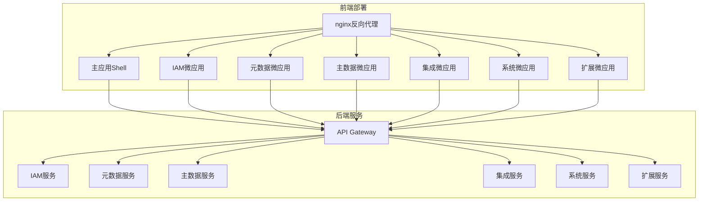

# BONE 前端整体设计方案

## 1. 设计目标

基于 BONE 产品需求文档和技术方案，设计一套现代化、可扩展、高性能的前端架构，实现以下目标：

- **微前端架构**：采用微前端方案，实现多应用集成管理
- **统一 UI 设计**：提供高端大气、风格统一的用户界面
- **高性能**：优化前端性能，提升用户体验
- **可扩展性**：支持插件机制和扩展点
- **最佳实践**：遵循业界前端开发最佳实践

## 2. 技术选型

### 2.1 核心技术栈

| 技术 | 版本 | 用途 | 选型理由 |
|------|------|------|----------|
| React | 18+ | 前端框架 | 生态成熟，性能优秀，适合大型应用 |
| TypeScript | 5.5+ | 类型系统 | 提高代码质量，增强可维护性 |
| Ant Design | 5.12+ | UI组件库 | 功能丰富，设计美观，文档完善 |
| Redux Toolkit | 2.0+ | 状态管理 | 简化Redux使用，提供更好的开发体验 |
| React Router | 6.20+ | 路由管理 | 功能强大，API简洁 |
| Vite | 5.0+ | 构建工具 | 快速的开发服务器和构建速度 |
| Tailwind CSS | 4.0+ | 样式工具 | 原子化CSS，提高开发效率 |
| Axios | 1.6+ | HTTP客户端 | 功能丰富，使用广泛 |
| Monaco Editor | 0.45+ | 代码编辑器 | 提供专业的代码编辑体验 |
| D3.js | 7.0+ | 数据可视化 | 强大的数据可视化能力 |
| X6 | 2.0+ | 流程图编辑器 | 专业的流程图绘制工具 |

### 2.2 微前端技术

| 技术 | 版本 | 用途 | 选型理由 |
|------|------|------|----------|
| Qiankun | 2.0+ | 微前端框架 | 基于single-spa，支持React、Vue等多种框架 |
| Module Federation | - | 模块共享 | Webpack 5特性，实现模块级别的共享 |
| Nginx | 1.20+ | 反向代理 | 负责微前端应用的路由转发 |

## 3. 架构设计

### 3.1 微前端架构

采用基于 Qiankun 的微前端架构，将前端应用划分为以下部分：

1. **主应用 (Shell)**：负责应用的整体布局、导航、认证和微应用管理
2. **微应用**：
   - IAM管理系统
   - 元数据管理系统
   - 主数据管理系统
   - 集成管理系统
   - 系统管理系统
   - 扩展引擎管理控制台

### 3.2 数据流设计

```mermaid
flowchart TD
    subgraph 主应用
        Shell[主应用Shell] --> Auth[认证模块]
        Shell --> Layout[布局组件]
        Shell --> Navigation[导航组件]
        Shell --> MicroAppManager[微应用管理器]
    end
    
    subgraph 微应用
        IAM[IAM管理系统] --> IAMStore[IAM状态管理]
        Metadata[元数据管理系统] --> MetadataStore[元数据状态管理]
        MasterData[主数据管理系统] --> MasterDataStore[主数据状态管理]
        Integration[集成管理系统] --> IntegrationStore[集成状态管理]
        System[系统管理系统] --> SystemStore[系统状态管理]
        Extension[扩展引擎管理] --> ExtensionStore[扩展状态管理]
    end
    
    subgraph 共享层
        SharedComponents[共享组件]
        SharedUtils[共享工具]
        SharedServices[共享服务]
        SharedTypes[共享类型定义]
    end
    
    Shell --> IAM
    Shell --> Metadata
    Shell --> MasterData
    Shell --> Integration
    Shell --> System
    Shell --> Extension
    
    IAM --> SharedComponents
    Metadata --> SharedComponents
    MasterData --> SharedComponents
    Integration --> SharedComponents
    System --> SharedComponents
    Extension --> SharedComponents
    
    IAM --> SharedUtils
    Metadata --> SharedUtils
    MasterData --> SharedUtils
    Integration --> SharedUtils
    System --> SharedUtils
    Extension --> SharedUtils
    
    IAM --> SharedServices
    Metadata --> SharedServices
    MasterData --> SharedServices
    Integration --> SharedServices
    System --> SharedServices
    Extension --> SharedServices
    
    IAM --> SharedTypes
    Metadata --> SharedTypes
    MasterData --> SharedTypes
    Integration --> SharedTypes
    System --> SharedTypes
    Extension --> SharedTypes
```



## 4. 目录结构

### 4.1 主应用目录结构

```
bone-frontend/
├── apps/
│   └── bone-shell/
│       ├── src/
│       │   ├── components/
│       │   │   ├── Layout/
│       │   │   ├── Navigation/
│       │   │   └── Auth/
│       │   ├── hooks/
│       │   ├── utils/
│       │   ├── services/
│       │   ├── store/
│       │   ├── routes/
│       │   ├── types/
│       │   ├── assets/
│       │   ├── App.tsx
│       │   └── main.tsx
│       ├── public/
│       ├── vite.config.ts
│       ├── tsconfig.json
│       └── package.json
├── packages/
│   ├── shared-components/
│   │   ├── src/
│   │   │   ├── components/
│   │   │   ├── hooks/
│   │   │   └── index.ts
│   │   ├── tsconfig.json
│   │   └── package.json
│   ├── shared-utils/
│   │   ├── src/
│   │   │   ├── utils/
│   │   │   └── index.ts
│   │   ├── tsconfig.json
│   │   └── package.json
│   ├── shared-services/
│   │   ├── src/
│   │   │   ├── services/
│   │   │   └── index.ts
│   │   ├── tsconfig.json
│   │   └── package.json
│   └── shared-types/
│       ├── src/
│       │   ├── types/
│       │   └── index.ts
│       ├── tsconfig.json
│       └── package.json
├── micro-apps/
│   ├── bone-iam-app/
│   ├── bone-metadata-app/
│   ├── bone-masterdata-app/
│   ├── bone-integration-app/
│   ├── bone-system-app/
│   └── bone-extension-app/
├── scripts/
├── configs/
├── package.json
└── turbo.json
```

### 4.2 微应用目录结构

以 IAM 管理系统为例：

```
bone-iam-app/
├── src/
│   ├── components/
│   ├── pages/
│   │   ├── UserManagement/
│   │   ├── RoleManagement/
│   │   ├── PermissionManagement/
│   │   └── AuditLog/
│   ├── hooks/
│   ├── utils/
│   ├── services/
│   ├── store/
│   ├── routes/
│   ├── types/
│   ├── assets/
│   ├── App.tsx
│   ├── main.tsx
│   └── bootstrap.ts
├── public/
├── vite.config.ts
├── tsconfig.json
└── package.json
```

## 5. 模块划分

### 5.1 主应用模块

| 模块 | 职责 | 主要组件 |
|------|------|----------|
| 布局模块 | 提供应用整体布局 | Layout, Header, Sidebar, Footer |
| 导航模块 | 管理应用导航 | NavigationMenu, Breadcrumb |
| 认证模块 | 处理用户认证 | Login, Logout, AuthGuard |
| 微应用管理 | 管理微应用的加载和卸载 | MicroAppManager, MicroAppRegistry |
| 全局状态 | 管理全局状态 | GlobalStore, ThemeStore |

### 5.2 微应用模块

#### 5.2.1 IAM管理系统

| 模块 | 职责 | 主要组件 |
|------|------|----------|
| 用户管理 | 管理系统用户 | UserList, UserForm, UserDetail |
| 角色管理 | 管理系统角色 | RoleList, RoleForm, RoleDetail |
| 权限管理 | 管理系统权限 | PermissionList, PermissionForm |
| 审计日志 | 记录系统操作日志 | AuditLogList, AuditLogDetail |

#### 5.2.2 元数据管理系统

| 模块 | 职责 | 主要组件 |
|------|------|----------|
| 实体管理 | 管理业务实体 | EntityList, EntityForm, EntityDetail |
| 字段管理 | 管理实体字段 | FieldList, FieldForm |
| 代码生成 | 生成前后端代码 | CodeGenerateForm, CodeGenerateResult |
| 模板管理 | 管理代码模板 | TemplateList, TemplateForm |

#### 5.2.3 主数据管理系统

| 模块 | 职责 | 主要组件 |
|------|------|----------|
| 主数据实体 | 管理主数据实体 | MasterDataEntityList, MasterDataEntityForm |
| 数据质量 | 管理数据质量规则 | QualityRuleList, QualityRuleForm |
| 数据记录 | 管理主数据记录 | MasterDataRecordList, MasterDataRecordForm |
| 质量报告 | 生成数据质量报告 | QualityReport, QualityCheck |

#### 5.2.4 集成管理系统

| 模块 | 职责 | 主要组件 |
|------|------|----------|
| 连接器管理 | 管理系统连接器 | ConnectorList, ConnectorForm, ConnectorTest |
| 流程编排 | 设计和管理集成流程 | FlowDesigner, FlowList, FlowForm |
| 流程监控 | 监控流程执行状态 | FlowExecutionList, ExecutionDetail |

#### 5.2.5 系统管理系统

| 模块 | 职责 | 主要组件 |
|------|------|----------|
| 系统配置 | 管理系统配置 | ConfigList, ConfigForm |
| 系统健康 | 监控系统健康状态 | HealthDashboard, Metrics |
| 告警管理 | 管理系统告警 | AlertRuleList, AlertEventList |
| 系统日志 | 查看系统日志 | SystemLogList, LogDetail |

#### 5.2.6 扩展引擎管理控制台

| 模块 | 职责 | 主要组件 |
|------|------|----------|
| 扩展点管理 | 管理系统扩展点 | ExtensionPointList, ExtensionPointForm |
| 插件管理 | 管理系统插件 | PluginList, PluginUpload, PluginDeploy |
| 沙箱管理 | 管理插件沙箱 | SandboxList, SandboxDetail |

## 6. UI设计规范

### 6.1 设计原则

- **一致性**：保持各应用间的设计风格一致
- **简洁性**：简洁明了的界面设计，减少视觉干扰
- **易用性**：直观的用户界面，减少学习成本
- **响应式**：适配不同屏幕尺寸
- **可访问性**：支持键盘导航和屏幕阅读器

### 6.2 色彩系统

| 颜色 | 用途 | 色值 |
|------|------|------|
| 主色 | 品牌标识、主要按钮 | #1890ff |
| 辅色 | 强调色、状态提示 | #52c41a |
| 警告色 | 警告提示 | #faad14 |
| 错误色 | 错误提示 | #f5222d |
| 信息色 | 信息提示 | #1890ff |
| 中性色 | 背景、文本 | #f5f5f5, #e8e8e8, #d9d9d9, #bfbfbf, #8c8c8c, #595959, #262626 |

### 6.3 字体系统

| 字体 | 大小 | 行高 | 字重 | 用途 |
|------|------|------|------|------|
| 中文 | 12px | 1.5 | 400 | 小号文本 |
| 中文 | 14px | 1.57 | 400 | 常规文本 |
| 中文 | 16px | 1.5 | 500 | 标题 |
| 中文 | 18px | 1.44 | 500 | 小标题 |
| 中文 | 20px | 1.4 | 600 | 大标题 |
| 中文 | 24px | 1.33 | 600 | 页面标题 |

### 6.4 组件规范

- **按钮**：使用 Ant Design 按钮组件，保持一致的样式和交互
- **表单**：使用 Ant Design 表单组件，支持验证和错误提示
- **表格**：使用 Ant Design 表格组件，支持排序、筛选和分页
- **卡片**：使用 Ant Design 卡片组件，保持一致的阴影和圆角
- **图标**：使用 Ant Design 图标库，保持图标的一致性
- **布局**：使用 Ant Design 布局组件，保持页面结构的一致性

## 7. 性能优化

### 7.1 代码优化

- **代码分割**：使用 React.lazy 和 Suspense 实现代码分割
- **按需加载**：使用动态导入实现组件的按需加载
- **Tree Shaking**：利用 Webpack 的 Tree Shaking 移除未使用的代码
- **压缩代码**：使用 Terser 压缩 JavaScript 代码
- **CSS 优化**：使用 Tailwind CSS 的 JIT 模式减少 CSS 体积

### 7.2 渲染优化

- **虚拟列表**：使用虚拟列表处理长列表数据
- **React.memo**：使用 React.memo 减少不必要的渲染
- **useMemo 和 useCallback**：使用 useMemo 和 useCallback 优化计算和函数引用
- **状态管理优化**：使用 Redux Toolkit 的 createSlice 减少不必要的重渲染

### 7.3 网络优化

- **HTTP/2**：使用 HTTP/2 减少网络请求开销
- **缓存策略**：合理设置缓存策略，减少重复请求
- **数据预加载**：预加载关键数据，提高页面响应速度
- **API 优化**：优化 API 接口，减少数据传输量
- **批量请求**：合并多个请求，减少网络请求次数

### 7.4 构建优化

- **Vite**：使用 Vite 作为构建工具，提高开发和构建速度
- **ESBuild**：使用 ESBuild 进行代码转换和压缩
- **按需引入**：按需引入 Ant Design 组件，减少打包体积
- **分析工具**：使用 Webpack Bundle Analyzer 分析打包体积

## 8. 部署方案

### 8.1 微前端部署架构



### 8.2 部署步骤

1. **构建主应用**：`npm run build` in bone-shell
2. **构建微应用**：`npm run build` in each micro-app
3. **配置 Nginx**：配置反向代理，将请求路由到对应的应用
4. **部署静态资源**：将构建产物部署到 Nginx 静态目录
5. **启动服务**：启动 Nginx 服务

### 8.3 持续集成/持续部署

- **CI/CD 工具**：使用 GitHub Actions 或 Jenkins
- **构建流程**：代码提交 → 代码检查 → 单元测试 → 构建 → 部署
- **环境管理**：开发环境、测试环境、预生产环境、生产环境
- **部署策略**：蓝绿部署、滚动部署

## 9. 开发流程

### 9.1 分支管理

- **main**：主分支，用于发布生产版本
- **develop**：开发分支，用于集成开发
- **feature/**：特性分支，用于开发新特性
- **bugfix/**：修复分支，用于修复 bug
- **release/**：发布分支，用于准备发布

### 9.2 代码规范

- **ESLint**：使用 ESLint 检查代码质量
- **Prettier**：使用 Prettier 统一代码格式
- **TypeScript**：使用 TypeScript 进行类型检查
- **Commit 规范**：使用 Conventional Commits 规范

### 9.3 测试策略

- **单元测试**：使用 Vitest 进行单元测试
- **集成测试**：使用 React Testing Library 进行集成测试
- **端到端测试**：使用 Cypress 进行端到端测试
- **测试覆盖率**：目标单元测试覆盖率 ≥ 80%

### 9.4 开发工具

- **IDE**：Visual Studio Code
- **插件**：ESLint, Prettier, TypeScript, GitLens
- **包管理**：npm 或 yarn
- **代码管理**：Git

## 10. 扩展性设计

### 10.1 插件系统

- **插件机制**：基于 Wasm 的插件系统
- **扩展点**：定义系统的可扩展接口
- **插件加载**：支持动态加载和卸载插件
- **插件隔离**：使用沙箱机制隔离插件运行环境

### 10.2 主题定制

- **主题系统**：基于 Ant Design 的主题系统
- **自定义主题**：支持自定义主题颜色和样式
- **主题切换**：支持明暗主题切换

### 10.3 国际化

- **i18n 支持**：使用 react-i18next 实现国际化
- **多语言**：支持中文、英文等多种语言
- **动态加载**：支持语言包的动态加载

## 11. 安全设计

### 11.1 认证与授权

- **认证**：基于 JWT 的无状态认证
- **授权**：基于 RBAC 的细粒度权限控制
- **会话管理**：Token 有效期配置，支持刷新令牌
- **SSO 集成**：支持企业 SSO 集成

### 11.2 数据安全

- **传输加密**：使用 HTTPS 加密传输
- **数据脱敏**：API 返回数据脱敏，日志敏感信息脱敏
- **XSS 防护**：使用 React 的内置 XSS 防护
- **CSRF 防护**：实现 CSRF 令牌验证

### 11.3 代码安全

- **依赖检查**：定期检查依赖的安全漏洞
- **代码审计**：定期进行代码安全审计
- **安全扫描**：使用安全扫描工具检测安全问题

## 12. 监控与告警

### 12.1 前端监控

- **性能监控**：使用 Lighthouse 和 WebPageTest 监控前端性能
- **错误监控**：使用 Sentry 监控前端错误
- **用户行为分析**：使用 Google Analytics 或 Matomo 分析用户行为

### 12.2 日志管理

- **前端日志**：记录前端错误和关键操作
- **日志收集**：使用 ELK Stack 收集和分析日志
- **日志查询**：提供日志查询界面

### 12.3 告警机制

- **性能告警**：当性能指标超过阈值时触发告警
- **错误告警**：当错误率超过阈值时触发告警
- **业务告警**：当业务指标异常时触发告警

## 13. 实施计划

### 13.1 阶段划分

| 阶段 | 时间 | 核心任务 |
|------|------|----------|
| **阶段1：基础架构** | 2周 | 搭建主应用框架、微前端架构、共享组件库 |
| **阶段2：核心功能** | 4周 | 实现 IAM 管理系统、元数据管理系统、主数据管理系统 |
| **阶段3：集成功能** | 3周 | 实现集成管理系统、系统管理系统、扩展引擎管理控制台 |
| **阶段4：优化与测试** | 2周 | 性能优化、安全测试、兼容性测试 |
| **阶段5：部署与上线** | 1周 | 部署到生产环境、监控配置、上线验证 |

### 13.2 关键里程碑

- **基础架构完成**：主应用和微前端架构搭建完成
- **核心功能完成**：IAM、元数据、主数据管理系统实现完成
- **集成功能完成**：集成、系统、扩展管理系统实现完成
- **性能优化完成**：前端性能达到预期目标
- **安全测试完成**：通过安全测试和漏洞扫描
- **生产部署完成**：成功部署到生产环境

## 14. 风险与应对措施

| 风险 | 影响 | 应对措施 |
|------|------|----------|
| 微前端架构复杂度高 | 开发和维护成本增加 | 制定详细的开发文档和最佳实践指南 |
| 性能问题 | 用户体验下降 | 实施性能优化策略，定期进行性能测试 |
| 安全漏洞 | 系统安全风险 | 定期进行安全审计和漏洞扫描，及时修复安全问题 |
| 兼容性问题 | 不同浏览器和设备的兼容性 | 进行充分的兼容性测试，使用 Polyfill 解决兼容性问题 |
| 依赖管理 | 依赖版本冲突 | 使用 yarn workspace 或 npm workspace 管理依赖，定期更新依赖版本 |

## 15. 总结

本前端设计方案基于 BONE 产品需求和技术方案，采用微前端架构，实现了多应用的集成管理。方案使用了现代化的前端技术栈，遵循了业界最佳实践，注重性能优化和用户体验。通过本方案的实施，将为 BONE 平台提供一个统一、高效、安全、可扩展的前端系统，满足企业级应用的需求。

方案的核心优势：

- **微前端架构**：实现应用的独立开发和部署
- **统一 UI 设计**：提供高端大气、风格统一的用户界面
- **高性能**：通过多种优化手段提升前端性能
- **可扩展性**：支持插件机制和扩展点
- **安全性**：实现了完善的安全措施
- **可维护性**：遵循了前端开发最佳实践，代码质量高

本方案可直接作为 BONE 平台前端开发的指导文档，帮助开发团队快速构建高质量的前端系统。