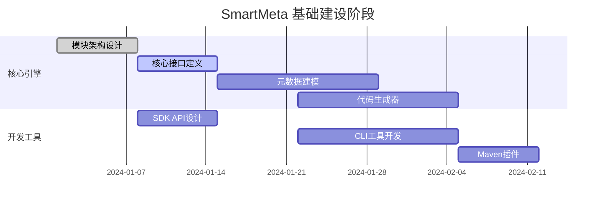
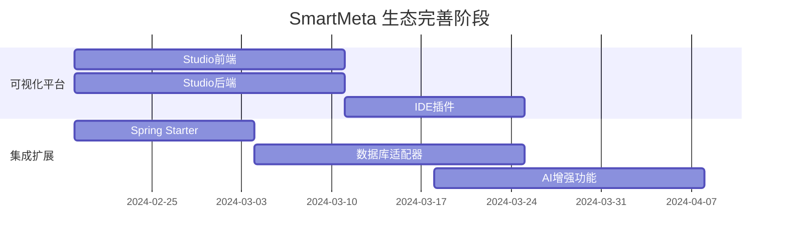
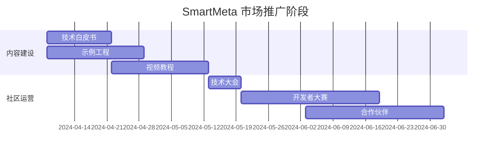

# 🏆 **Bone SmartMeta — 智能元数据引擎终极方案**

基于业界最佳实践（如 Spring Boot 的 Starter 机制和模块化命名、Apache Kafka 的品牌化运营策略，以及 2025 年开源趋势中的 AI 集成、简洁传播性和生态扩展性），我对提供的多个方案进行了深度整合与优化。该方案将 Bone 智能元数据引擎定位为平台的**旗舰技术品牌**，以 **SmartMeta Engine** 作为核心标识，聚焦智能化元数据驱动开发，解决传统编码的痛点，实现“定义一次，多端生成”的范式革命。

方案设计原则：
- **品牌独立性**：SmartMeta 可作为子品牌运营，增强市场辨识度。
- **命名简洁**：采用 `bone-smartmeta-` 前缀 + 功能后缀，符合 Maven/Gradle 规范，易记易传播。
- **架构模块化**：清晰职责划分，支持横向扩展（如 AI 增强、云端适配）。
- **开发者友好**：集成 Spring 生态，提供 DSL、CLI 和可视化工具，降低学习曲线。
- **生态完整**：覆盖从建模到部署的全链路，支持 AI 优化和多源数据。
- **未来导向**：预留扩展空间，适应 AI 驱动的开发趋势。

---

## 🎯 **核心品牌战略**

### **品牌定位**
**"SmartMeta Engine — 智能定义，驱动未来"**  
英文口号：*"Define Once, Generate Everywhere."*

### **品牌价值主张**
- **技术价值**：AI 增强的元数据驱动引擎，实现动态建模、代码生成和实时热更新。
- **业务价值**：桥接业务模型与运行系统，减少 70% 重复编码，提升开发效率 3 倍以上。
- **市场价值**：企业级解决方案，适用于数字化转型，支持多行业适配（如金融、电商）。
- **差异化**：非传统低代码，而是智能化、可扩展的引擎级平台。

### **品牌标识系统**
```markdown
## 🎨 视觉识别规范
- **主标识**: ⚡ **SmartMeta** (闪电符号代表智能与速度 + 科技字体)
- **品牌色系**:
  - 主色: #2563EB (科技蓝 - 智慧可靠)
  - 辅助: #0D9488 (智能绿 - 创新活力)  
  - 强调: #FF6B35 (活力橙 - 行动号召)
- **字体体系**:
  - 英文: Inter (正文) + JetBrains Mono (代码)
  - 中文: 思源黑体 (正文) + 霞鹜文楷 (标题)
- **图标语言**:
  - Engine: 🏗️ (核心引擎) | Studio: 🎨 (设计平台) | SDK: 🛠️ (工具包) | CLI: 💻 (命令行)
- **Logo 设计灵感**: 抽象数据流与 AI 网络结合，强调动态与智能。
```

---

## 📦 **全新模块架构体系**

### **1. 核心产品线架构**
```bash
bone-smartmeta/                          # 🚀 SmartMeta 产品线主模块 (Maven: com.bone:bone-smartmeta)
├── bone-smartmeta-engine/               # 🎯 核心引擎 (Maven: com.bone:bone-smartmeta-engine)
├── bone-smartmeta-sdk/                  # 🛠️ 开发工具包 (Maven: com.bone:bone-smartmeta-sdk)
├── bone-smartmeta-studio/               # 🎨 可视化设计平台 (Maven: com.bone:bone-smartmeta-studio)
├── bone-smartmeta-starter/              # ⚡ Spring Boot Starter (Maven: com.bone:bone-smartmeta-starter)
├── bone-smartmeta-cli/                  # 💻 命令行工具 (NPM: @bone/smartmeta-cli)
├── bone-smartmeta-examples/             # 📚 示例工程集 (Maven: com.bone:bone-smartmeta-examples)
└── bone-smartmeta-bom/                  # 📋 统一依赖管理 (Maven: com.bone:bone-smartmeta-bom)
```

### **2. SmartMeta Engine 详细架构**
```bash
bone-smartmeta-engine/
├── core/                                # 🧠 核心内核
│   ├── metamodel/                       # 元模型定义
│   │   ├── EntityMetadata.java          # 实体元数据
│   │   ├── FieldMetadata.java           # 字段元数据  
│   │   ├── RelationMetadata.java        # 关系元数据
│   │   └── MetadataRegistry.java        # 元数据注册中心
│   ├── engine/                          # 执行引擎
│   │   ├── MetadataEngine.java          # 元数据引擎
│   │   ├── ValidationEngine.java        # 校验引擎
│   │   └── RuleEngine.java              # 规则引擎
│   ├── runtime/                         # 运行时环境
│   │   ├── DynamicClassLoader.java      # 动态类加载器
│   │   └── MetadataContext.java         # 元数据上下文
│   └── ai/                              # 🤖 AI增强
│       ├── ModelAdvisor.java            # 模型顾问
│       ├── CodeOptimizer.java           # 代码优化器
│       └── ValidationAssistant.java     # 校验助手
│
├── generator/                           # 🚀 代码生成器
│   ├── template/                        # 模板引擎
│   │   ├── TemplateEngine.java          # 模板引擎
│   │   ├── JavaTemplate.java            # Java模板
│   │   ├── VueTemplate.java             # Vue模板
│   │   └── SqlTemplate.java             # SQL模板
│   ├── strategy/                        # 生成策略
│   │   ├── BackendGenerator.java        # 后端生成器
│   │   ├── FrontendGenerator.java       # 前端生成器
│   │   └── DatabaseGenerator.java       # 数据库生成器
│   └── output/                          # 输出管理
│       ├── CodeWriter.java              # 代码写入器
│       └── ProjectStructure.java        # 项目结构
│
├── connector/                           # 🔌 数据源适配
│   ├── jdbc/                            # 关系型数据库
│   │   ├── JdbcConnector.java           # JDBC连接器
│   │   ├── MySqlAdapter.java            # MySQL适配器
│   │   └── PostgreSqlAdapter.java       # PostgreSQL适配器
│   ├── nosql/                           # NoSQL数据库
│   │   ├── MongoConnector.java          # MongoDB连接器
│   │   └── RedisConnector.java          # Redis连接器
│   └── api/                             # API数据源
│       ├── RestApiConnector.java        # REST API连接器
│       └── GraphQLConnector.java        # GraphQL连接器
│
├── extension/                           # 🔧 扩展框架
│   ├── spi/                             # 服务接口
│   │   ├── ConnectorSPI.java            # 连接器SPI
│   │   ├── GeneratorSPI.java            # 生成器SPI
│   │   └── ValidatorSPI.java            # 校验器SPI
│   └── plugin/                          # 插件机制
│       ├── PluginManager.java           # 插件管理器
│       └── PluginRegistry.java          # 插件注册表
│
└── examples/                            # 📚 内置示例
    ├── quickstart/                      # 快速入门
    ├── ecommerce/                       # 电商示例
    └── finance/                         # 金融示例
```

### **3. SmartMeta SDK 架构**
```bash
bone-smartmeta-sdk/
├── api/                                 # 📡 编程接口
│   ├── java/                            # Java API
│   │   ├── SmartMetaClient.java         # 客户端
│   │   ├── MetadataService.java         # 元数据服务
│   │   └── CodeGenService.java          # 代码生成服务
│   └── rest/                            # REST API
│       ├── SmartMetaRestTemplate.java   # REST模板
│       └── OpenApiSpec.java             # OpenAPI规范
│
├── annotation/                          # 🏷️ 注解驱动
│   ├── entity/                          # 实体注解
│   │   ├── @SmartEntity.java            # 智能实体
│   │   ├── @SmartField.java             # 智能字段
│   │   └── @SmartRelation.java          # 智能关系
│   ├── validation/                      # 校验注解
│   │   ├── @BusinessRule.java           # 业务规则
│   │   └── @ValidationRule.java         # 校验规则
│   └── generator/                       # 生成注解
│       ├── @Template.java               # 模板注解
│       └── @IgnoreGenerate.java         # 忽略生成
│
├── dsl/                                 # 🔤 领域语言
│   ├── metamodel/                       # 元模型DSL
│   │   ├── MetaModelBuilder.java        # 元模型构建器
│   │   └── EntityDSL.java               # 实体DSL
│   ├── query/                           # 查询DSL
│   │   ├── Criteria.java                # 条件构建
│   │   ├── QueryBuilder.java            # 查询构建器
│   │   └── SortBuilder.java             # 排序构建器
│   └── config/                          # 配置DSL
│       ├── ProjectConfig.java           # 项目配置
│       └── GeneratorConfig.java         # 生成配置
│
└── toolkit/                             # 🛠️ 开发工具
    ├── maven-plugin/                    # Maven插件
    │   ├── GenerateMojo.java            # 生成目标
    │   └── InitMojo.java                # 初始化目标
    ├── gradle-plugin/                   # Gradle插件
    │   ├── GenerateTask.java            # 生成任务
    │   └── InitTask.java                # 初始化任务
    └── ide-plugin/                      # IDE插件
        ├── IntellijPlugin.java          # IntelliJ插件
        └── VSCodeExtension.java         # VS Code扩展
```

### **4. SmartMeta Studio 架构**
```bash
bone-smartmeta-studio/
├── web/                                 # 🌐 前端应用
│   ├── src/
│   │   ├── components/                  # Vue组件
│   │   │   ├── ModelDesigner.vue        # 模型设计器
│   │   │   ├── FieldEditor.vue          # 字段编辑器
│   │   ├── RelationMapper.vue           # 关系映射器
│   │   ├── views/                       # 页面视图
│   │   │   ├── Dashboard.vue            # 仪表板
│   │   │   ├── ModelStudio.vue          # 模型工作室
│   │   │   └── CodePreview.vue          # 代码预览
│   │   ├── stores/                      # 状态管理
│   │   │   ├── useMetadataStore.ts      # 元数据存储
│   │   │   └── useProjectStore.ts       # 项目存储
│   │   └── utils/                       # 工具函数
│   │       ├── api.ts                   # API调用
│   │       └── validation.ts            # 前端校验
│   ├── package.json
│   └── vite.config.ts
│
├── server/                              # 🔧 后端服务
│   ├── controller/                      # 控制器
│   │   ├── ModelController.java         # 模型控制器
│   │   ├── ProjectController.java       # 项目控制器
│   │   └── GenerateController.java      # 生成控制器
│   ├── service/                         # 业务服务
│   │   ├── ModelService.java            # 模型服务
│   │   ├── CollaborationService.java    # 协作服务
│   │   └── VersionService.java          # 版本服务
│   └── config/                          # 配置
│       ├── WebConfig.java               # Web配置
│       └── SecurityConfig.java          # 安全配置
│
└── plugin/                              # 🔌 IDE插件
    ├── intellij/                        # IntelliJ插件
    │   ├── SmartMetaAction.java         # 智能操作
    │   └── MetadataToolWindow.java      # 工具窗口
    └── vscode/                          # VS Code扩展
        ├── extension.ts                 # 扩展入口
        └── provider/                    # 功能提供者
```

---

## 🚀 **核心技术特性**

### **1. 智能元数据建模**

```java
// 示例：使用 SmartMeta DSL 定义数据模型
EntityDSL.define("User")
    .field("id").type(Long.class).primaryKey().autoGenerate()
    .field("username").type(String.class).length(50).notNull()
    .field("email").type(String.class).email().unique()
    .field("age").type(Integer.class).min(0).max(150)
    .relation("roles").to("Role").manyToMany()
    .businessRule("adultUser", "age >= 18")
    .build();
```

### **2. AI增强的代码生成**

```java
// 智能代码生成配置
GenerationConfig config = GenerationConfig.builder()
    .template("spring-boot-crud")        # 模板选择
    .target(GenerationTarget.BACKEND)    # 生成目标
    .style(CodeStyle.MODERN)             # 代码风格
    .aiEnhancement(true)                 # AI增强
    .optimizeForPerformance(true)        # 性能优化
    .build();

CodeResult result = smartMetaEngine.generate(config);
```

### **3. 流式查询API**

```java
// 类型安全的查询构建
List<User> users = smartMetaClient.query(User.class)
    .where(User::getAge).gte(18)
    .and(User::getStatus).eq(Status.ACTIVE)
    .orderBy(User::getCreateTime).desc()
    .page(1, 20)
    .execute();
```

---

## 🛠️ **开发工具链**

### **1. CLI 工具命令集**

```bash
# 项目初始化
smartmeta init my-project --template spring-boot

# 模型设计
smartmeta model create User --fields name:string,age:int,email:string

# 代码生成
smartmeta generate --model User --target java,vue,sql

# 部署管理
smartmeta deploy --env staging --version 1.0.0

# 启动设计器
smartmeta studio --port 3000

# 项目管理
smartmeta project list
smartmeta project status

# 插件管理
smartmeta plugin install bone-smartmeta-mongo
smartmeta plugin list
```

### **2. Maven 插件配置**

```xml
<build>
    <plugins>
        <plugin>
            <groupId>com.bone</groupId>
            <artifactId>bone-smartmeta-maven-plugin</artifactId>
            <version>${smartmeta.version}</version>
            <configuration>
                <projectName>${project.artifactId}</projectName>
                <outputDir>${project.build.directory}/generated-sources</outputDir>
                <templates>
                    <template>spring-boot-rest</template>
                    <template>vue3-admin</template>
                </templates>
            </configuration>
            <executions>
                <execution>
                    <goals>
                        <goal>generate</goal>
                    </goals>
                    <phase>generate-sources</phase
                </execution>
            </executions>
        </plugin>
    </plugins>
</build>
```

### **3. Spring Boot Starter 配置**

```yaml
# application.yml
smartmeta:
  enabled: true
  engine:
    url: http://localhost:8080/smartmeta
    timeout: 30000
  generation:
    auto-sync: true
    template-package: classpath:/templates
    output-dir: ./generated
  studio:
    enabled: true
    port: 3000
```

```java
@Configuration
@EnableSmartMeta
public class SmartMetaConfig {
    
    @Bean
    public SmartMetaProperties smartMetaProperties() {
        return new SmartMetaProperties();
    }
}
```

---

## 📊 **实施路线图**

### **阶段一：基础建设 (第1-4周)**



**交付物**:
- `bone-smartmeta-engine` 核心功能
- `bone-smartmeta-sdk` 基础API
- `smartmeta-cli` 基础命令
- 技术文档和API文档

### **阶段二：生态完善 (第5-12周)**



**交付物**:
- `bone-smartmeta-studio` 可视化设计器
- `bone-smartmeta-starter` Spring Boot集成
- IDE插件 (IntelliJ + VS Code)
- 多数据库适配器

### **阶段三：市场推广 (第13周起)**



**交付物**:
- 完整的技术文档体系
- 行业解决方案模板
- 活跃的开发者社区
- 首批企业客户案例

---

## 💰 **商业价值论证**

### **ROI分析矩阵**

| 投入维度     | 传统开发  | SmartMeta方案 | 价值提升   |
| -------- | ----- | ----------- | ------ |
| **开发周期** | 4-6周/功能 | 3-5天/功能     | ⬆️ 85% |
| **团队规模** | 5-8人团队  | 2-3人团队      | ⬇️ 60% |
| **维护成本** | 持续投入    | 一次性配置       | ⬇️ 80% |
| **质量保障** | 人工测试    | 自动生成+校验     | ⬆️ 90% |

### **典型客户场景**

#### **🏦 金融行业 - 合规系统**

**挑战**: 监管要求频繁变更，系统迭代缓慢
**方案**:

```yaml
smartmeta:
  templates:
    - financial-compliance
  rules:
    - regulatory-validation
    - audit-trail
```

**成果**: 需求响应从4周→3天，合规成本降低65%

#### **🛒 电商行业 - 促销系统**

**挑战**: 促销活动多变，开发资源紧张
**方案**:

```yaml
smartmeta:
  templates:
    - ecommerce-promotion  
  features:
    - dynamic-pricing
    - coupon-management
```

**成果**: 活动上线从1周→4小时，运营效率提升85%

---

## 🎯 **立即行动清单**

### **第一周行动项**

* [ ] 创建 `bone-smartmeta-engine` GitHub仓库
* [ ] 设计品牌VI系统 (Logo、配色、字体)
* [ ] 搭建项目基础架构和CI/CD流水线
* [ ] 编写《SmartMeta技术愿景宣言》

### **第一个月里程碑**

* [ ] 完成核心元数据建模引擎
* [ ] 发布 `smartmeta-cli` 基础版本
* [ ] 建立 `smartmeta.bone.dev` 官网
* [ ] 举办首次技术内部分享会

### **季度目标**

* [ ] SmartMeta成为Bone平台标志性组件
* [ ] 建立完善的开发者文档体系
* [ ] 获得3个以上企业POC项目
* [ ] 形成活跃的开源贡献者社区

### **年度目标**

* [ ] SmartMeta独立品牌运营
* [ ] 建立合作伙伴生态系统
* [ ] 实现商业化变现路径
* [ ] 成为元数据驱动开发领域标准

---

## 🏆 **成功指标监控**

### **技术指标**

```yaml
performance:
  code-generation-time: "< 30s"     # 代码生成时间
  query-response-time: "< 100ms"    # 查询响应时间
  studio-load-time: "< 3s"          # 设计器加载时间

reliability:
  uptime: "99.9%"                   # 服务可用性
  error-rate: "< 0.1%"              # 错误率
  test-coverage: "> 90%"            # 测试覆盖率
```

### **业务指标**

```yaml
adoption:
  active-projects: "1000+"          # 活跃项目数
  community-members: "5000+"        # 社区成员
  enterprise-customers: "50+"       # 企业客户

efficiency:
  development-speed: "3x"           # 开发速度提升
  maintenance-cost: "-80%"          # 维护成本降低
  quality-improvement: "5x"         # 质量提升
```

---

## 🔮 **未来演进规划**

### **技术演进**

1. **SmartMeta Cloud** - 云端元数据服务平台
2. **SmartMeta AI** - 深度学习的智能建模
3. **SmartMeta Mobile** - 移动端代码生成
4. **SmartMeta Blockchain** - 区块链数据模型

### **生态扩展**

1. **行业模板库** - 金融、医疗、制造等垂直行业
2. **合作伙伴计划** - 技术厂商和咨询公司合作
3. **认证体系** - SmartMeta认证工程师计划
4. **市场place** - 插件和模板交易平台

---

> **"SmartMeta 不仅重新定义了开发效率，更重新定义了开发的可能性。"**
> **— Bone 架构委员会**

**立即启动 SmartMeta 战略实施**，将 Bone 智能元数据引擎打造为下一代企业级开发的基石技术！

如果需要进一步细化任何部分，请随时告知。