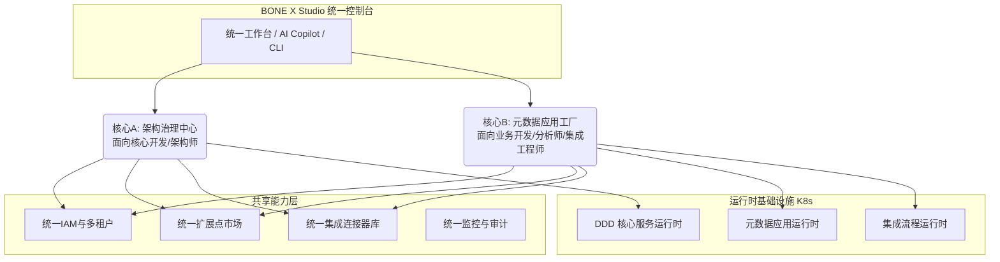
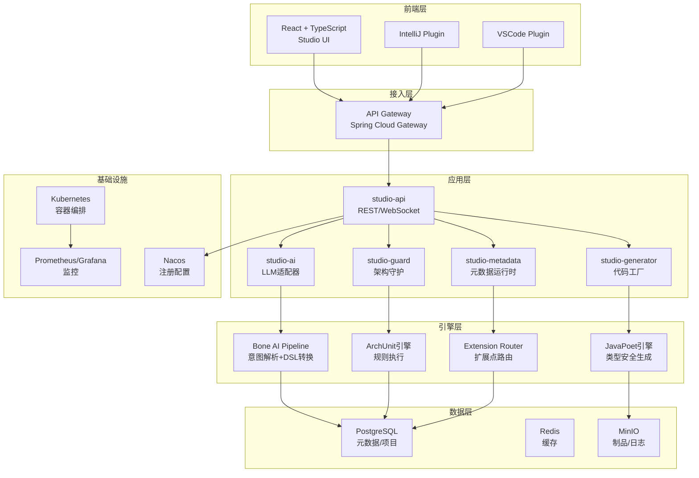
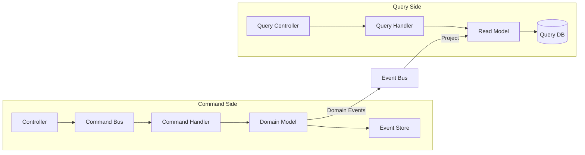
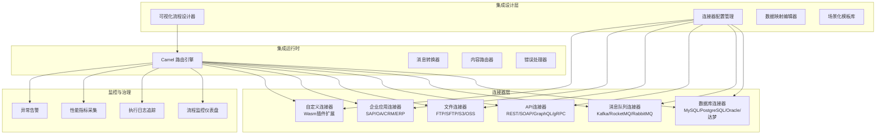
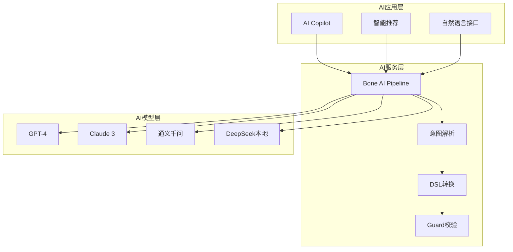
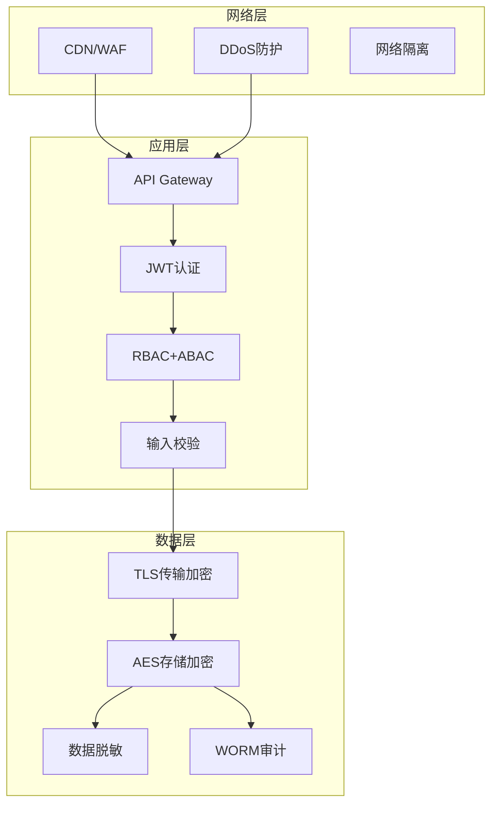

# BONE X Studio 详细设计方案 v5.0

## 企业级 AI 原生研发操作系统 · 终局详细设计

> **文档性质**：技术详细设计文档，可直接指导架构实现、代码开发、部署运维  
> **适用产品**：BONE X Studio 企业级研发操作系统  
> **设计基准**（与仓库权威一致）：[`doc/architecture/Bone-DDD-最终实践方案.md`](../architecture/Bone-DDD-最终实践方案.md)（DDD 分层与 P0 铁律）、[`doc/prd/BONE产品需求文档正式版.md`](../prd/BONE产品需求文档正式版.md)（产品范围与能力）、[`doc/architecture/BONE-总体架构设计方案.md`](../architecture/BONE-总体架构设计方案.md)（总体架构与 NFR；与 `doc/architecture/README.md` 索引一致）。代码生成与 ArchUnit 规则对齐 **bone-blueprint** 示例仓库形态，**版本号不以「Blueprint v×」为准**，以 DDD 统一方案版本为准。  
> **版本**：v5.0 Final | **发布日期**：2026‑04‑23 | **最近修订**：2026‑05‑16 | **文档状态**：✅ 已发布（含 As-Is / 愿景分层） | **密级**：内部机密  

---

## 文档分层说明（As-Is vs 愿景）

阅读本文时，请区分 **仓库已实现（As-Is）** 与 **BONE X Studio 终局愿景（Vision）**。未标注 **[Vision]** 的小节若与下表冲突，**以 As-Is 与 `doc/architecture` 权威文档为准**。

| 标记 | 含义 | 典型内容 |
|------|------|----------|
| **As-Is** | 当前 monorepo 可构建、可运行的模块与端口 | 下表「仓库对照」 |
| **Vision** | 目标态多微服务、多存储、AI Pipeline 全量能力 | §4.3.3 五服务拆分、PostgreSQL 主库、Module Federation 等 |
| **Hybrid** | 部分落地、部分规划 | 代码生成（`studio-generator` 已有）、架构守护（规则与 ArchUnit 在演进） |

### 仓库对照（As-Is，2026-05）

| 本文档 / 愿景名称 | Maven / 目录真源 | 默认端口（开发） | 说明 |
|-------------------|------------------|------------------|------|
| BONE Platform 各微应用 | `bone-frontend/apps/bone-*-app` + Qiankun Shell | 3000–3009 | 见 [wiki/03](../wiki/03-本地开发与构建.md) |
| 代码生成（Generator） | `bone-engine/studio-generator` | **8085** | 与 `bone-platform/bone-integration` 同端口时需改 `server.port` |
| 扩展 Studio | `bone-engine/bone-extension-engine/bone-extension-studio` | **8088** | 与 `bone-masterdata`（8080）勿同机默认端口并行 |
| 元数据 · 数据面 SDK | `bone-engine/bone-metadata-sdk` | （嵌入业务进程） | 平台 P0 持久化；见 [三模块定义](./modules/元数据能力-实现映射与竞品对照.md) |
| 元数据 · 扩展字段 REST | `bone-engine/bone-metadata-server` | **9001** | `/v1/metadata/fields:*`；非实体建模全量 API |
| 元数据 · 智能引擎 | `bone-engine/bone-metadata-engine` | 随宿主 | 默认未接平台；详设 [§9](./modules/9.%20SmartMeta%20引擎模块技术说明.md) |
| IAM / 主数据 / 系统 | `bone-platform/bone-iam` / `bone-masterdata` / `bone-system` | 8081 / 8080 / 8083 | 持久化均依赖 metadata-sdk |
| DDD 参考实现 | `bone-blueprint/` | — | 非根聚合模块，单独 `mvn -f bone-blueprint/pom.xml test` |
| **studio-api** [Vision] | 无独立进程 | 8080（示意） | 由网关 + 各平台服务组合，非单 Jar |
| **studio-ai / studio-guard** [Vision] | 无独立进程 | 8081 / 8083（示意） | AI 与 Guard 能力规划为独立服务，当前分散在引擎与工具链 |
| **studio-metadata** [Vision] | SDK + server + engine + metadata-app + generator | 8084（**勿作启动端口**） | 产品能力包；真源见 [元数据能力-实现映射与竞品对照](./modules/元数据能力-实现映射与竞品对照.md) |

**端口真源**：[doc/wiki/03-本地开发与构建.md](../wiki/03-本地开发与构建.md)。**DDL 真源**：根目录 [`bone-init.sql`](../bone-init.sql) · [数据库开发规范.md](../architecture/数据库开发规范.md)。

> 下文 **第一部分～第三部分** 中，产品叙事与双核心架构多为 **[Vision]**；落地排期请交叉查阅 [主 PRD](../prd/BONE产品需求文档正式版.md) 与 [模块详设](./modules/README.md)。

---

## 文档元信息

| 项目 | 内容 |
|------|------|
| 产品名称 | BONE X Studio |
| 产品代号 | Bone-OS |
| 设计版本 | v5.0 Final |
| 文档状态 | ✅ 已发布 |
| 密级 | 内部机密 |
| 架构负责人 | [姓名] |
| 技术负责人 | [姓名] |
| 项目负责人 | [姓名] |
| 生效日期 | 2026‑04‑23 |

---

## 目录

**第一部分：产品与架构总览**

1. [产品愿景与核心定位](#1-产品愿景与核心定位)
2. [用户与场景分析](#2-用户与场景分析)
3. [产品范围与边界](#3-产品范围与边界)
4. [技术架构总览](#4-技术架构总览)

**第二部分：核心领域设计**

5. [领域驱动设计（DDD）规范](#5-领域驱动设计规范)
6. [CQRS与事件驱动架构](#6-cqrs与事件驱动架构)
7. [多租户架构设计](#7-多租户架构设计)
8. [前端架构设计](#8-前端架构设计)

**第三部分：功能模块详细设计**

9. [统一控制台与仪表盘](#9-统一控制台与仪表盘)
10. [架构治理中心](#10-架构治理中心)
11. [元数据应用工厂](#11-元数据应用工厂)
12. [统一IAM与权限中台](#12-统一iam与权限中台)
13. [系统管理与运维](#13-系统管理与运维)
14. [CLI与开发者工具](#14-cli与开发者工具)

**第四部分：基础设施与运营**

15. [AI原生能力设计](#15-ai原生能力设计)
16. [安全架构设计](#16-安全架构设计)
17. [性能优化与高可用](#17-性能优化与高可用)
18. [部署与运维架构](#18-部署与运维架构)
19. [发布与灰度策略](#19-发布与灰度策略)
20. [风险与依赖](#20-风险与依赖)
21. [开源与社区策略](#21-开源与社区策略)

---

## 第一部分：产品与架构总览

### 1. 产品愿景与核心定位

#### 1.1 产品定位

BONE X Studio v5.0 是新一代企业级 AI 原生研发操作系统，定位为 **"开发者的工作空间"（Developer Workspace Platform）**。产品采用**双核心架构**：

- **核心A：架构治理中心（Bone Studio）**——通过"架构即代码"保障核心领域架构确定性
- **核心B：元数据应用工厂（BONE Platform）**——通过"元数据驱动"赋能业务应用快速交付

双核心共享统一IAM、扩展点市场与Kubernetes基础设施，实现"架构不腐化"与"业务快交付"的终极统一。

#### 1.2 核心愿景

**一句话定位**：
> BONE X Studio = 架构治理系统（Bone Studio）+ 元数据应用工厂（BONE Platform）
> 一个平台解决"架构不腐化"与"业务快交付"的终极矛盾。

#### 1.3 核心价值主张

| 用户角色 | 核心诉求 | 本方案价值 | 量化指标 |
|----------|----------|------------|----------|
| **CTO/技术VP** | 架构不腐化、业务快响应 | 双核心引擎，核心域严格治理，业务域敏捷交付 | 架构健康分≥90，新应用交付<3天 |
| **架构师** | 规范可编程、架构可观测 | 将 DDD/CQRS 与《Bone-DDD》P0 铁律写入 Studio 模板与 Guard，自动下发至所有服务 | 规范落地率100% |
| **核心开发** | 复杂业务逻辑聚焦 | AI生成符合规范的DDD代码，扩展点替代if-else | 样板代码减少70% |
| **业务开发** | 快速构建CRUD应用 | 可视化实体建模，一键生成前后端代码 | 简单应用5分钟内上线 |
| **集成工程师** | 异构系统对接高效 | 可视化流程编排，50+连接器 | 集成时间缩短80% |

#### 1.4 成功标准（OKR）

| Objective | Key Result | 目标值 | 优先级 |
|-----------|------------|--------|--------|
| **O1：企业级研发OS领导者** | KR1: 支持Java/Go双语言架构治理 | 双语言 | P0 |
| | KR2: 架构健康分（ArchUnit评分） | ≥90 | P0 |
| | KR3: 元数据驱动应用交付效率 | <3天/应用 | P0 |
| | KR4: 金融/政务/互联网标杆客户 | ≥8家 | P0 |
| **O2：AI架构生成能力** | KR5: AI生成代码合规率 | >95% | P1 |
| | KR6: 自然语言→可运行DDD模块 | <5分钟 | P1 |
| **O3：繁荣扩展生态** | KR7: Extension Marketplace插件数 | ≥20个 | P2 |
| **O4：企业级高可用** | KR8: 核心服务SLA | 99.99% | P0 |

#### 1.5 北极星指标

1. **架构健康分**：所有接入服务的ArchUnit评分均值，目标 ≥90分
2. **应用交付效率**：从建模到可运行测试环境的时间，目标 <3天
3. **AI生成采纳率**：AI生成模块通过Guard校验后直接合并占比，目标 >75%

---

### 2. 用户与场景分析

#### 2.1 用户角色画像

| 角色层级 | 角色名称 | 典型画像 | 核心诉求 | 使用频率 |
|----------|----------|----------|----------|----------|
| 决策层 | CTO/技术VP | 500+人研发团队负责人 | 架构不腐化、业务快响应、TCO可控 | 低频 |
| 决策层 | 首席架构师 | 企业架构委员会主席 | 规范可编程、架构可观测、跨团队一致性 | 中频 |
| 管理层 | 技术负责人（TL） | 20-50人业务线负责人 | 交付效率、质量兜底、新人快速上手 | 高频 |
| 执行层 | 核心开发工程师 | 负责复杂业务领域 | 少写样板代码、避免架构违规、扩展点复用 | 高频 |
| 执行层 | 业务开发工程师 | 负责业务CRUD应用 | 快速建模、一键生成代码、少写重复代码 | 高频 |
| 执行层 | 集成工程师 | 系统集成专员 | 系统对接、流程编排、数据同步 | 中频 |
| 执行层 | 业务分析师 | 业务需求分析师 | 业务建模、主数据治理、需求落地 | 高频 |
| 运维层 | DevOps工程师 | CI/CD维护者 | 流水线集成、质量门禁、自动阻断 | 日常 |
| 生态层 | 插件开发者 | ISV/企业内部IT | 标准化API、扩展点开发、插件发布 | 项目制 |

#### 2.2 核心用户旅程

**旅程1：核心开发——从需求到合规的DDD代码**

1. **接收需求**：实现订单支付功能，支持VIP折扣、库存校验
2. **AI建模**：在Studio AI工作台输入自然语言需求
3. **架构预览**：系统自动生成限界上下文、聚合根Order、扩展点PriceCalculator、CQRS L2建议
4. **代码生成**：一键生成完整DDD模块（Domain充血/Application/Adapter/Infrastructure）
5. **本地校验**：执行`bone check`，自动检测依赖方向、Domain纯净度
6. **CI阻断**：Push后ArchUnit铁律校验，违规无法合并
7. **扩展点配置**：从Marketplace拖拽"VIP折扣策略"，配置路由规则

**旅程2：业务开发——快速构建客户管理系统**

1. **登录Studio**：进入元数据应用工厂
2. **可视化建模**：拖拽创建"客户"实体，添加字段（姓名、电话、等级）
3. **代码生成**：选择React+Spring Boot模板，一键生成前后端代码
4. **部署测试**：生成的代码直接部署到测试环境，验证CRUD功能
5. **主数据治理**：将"客户"提升为主数据实体，配置唯一性规则
6. **迭代**：修改实体模型，重新生成代码，增量更新

**旅程3：集成工程师——订单系统与ERP对接**

1. **配置连接器**：添加REST连接器指向ERP系统
2. **流程设计**：拖拽"订单创建触发→调用ERP创建销售订单→回写订单状态"
3. **测试流程**：输入测试数据，验证流程执行
4. **激活监控**：激活流程，在监控面板查看执行状态

**旅程4：架构师——企业级架构治理**

1. **规范配置**：在 Studio 中定义企业模板（强制分布式 ID、CQRS 物理分包、`CommandHandler`/`QueryHandler` 命名与事务边界；领域层禁止 Spring/JPA **`@Entity`**，持久化元数据仅允许 **bone-metadata-sdk D1 白名单注解**，与《Bone-DDD》§17 一致）
2. **全量接入**：要求所有新服务通过Studio生成，存量服务接入Guard
3. **架构巡检**：每周查看架构健康看板，识别腐化模块
4. **自动修复**：对低分模块执行`bone migrate --auto`，自动迁移

#### 2.3 目标行业与场景矩阵

| 行业 | 优先级 | 核心场景 | 关键需求 | 对应功能模块 |
|------|--------|----------|----------|--------------|
| 互联网金融 | P0 | 支付核心、风控引擎、合规审计 | 强一致性DDD、扩展点、ACL | 架构治理中心、扩展点市场 |
| 政务数字化 | P0 | 电子公文、审批流程、数据交换 | 信创适配、等保合规、主数据 | 元数据工厂、IAM、信创适配 |
| 互联网大厂 | P0 | 中台建设、微服务治理、新人培训 | 100+服务架构一致性、快速上手 | 架构治理中心、AI生成 |
| 智能制造 | P1 | 设备管理、供应链协同 | 多租户扩展点、复杂集成 | 扩展点市场、集成引擎 |
| 医药研发 | P1 | 临床文档、版本追溯 | 版本管理、知识图谱 | 主数据管理 |

---

### 3. 产品范围与边界

#### 3.1 双核心引擎架构



#### 3.2 包含范围（In Scope）

| 核心 | 功能模块 | 详细能力 |
|------|----------|----------|
| **架构治理中心** | 限界上下文设计器 | 拖拽式聚合根设计、关系映射、事件建模 |
| | AI业务建模引擎 | 自然语言→限界上下文→完整DDD模块生成 |
| | DDD 脚手架生成器 | 单服务内 **adapter / application / domain / infrastructure** 包结构 + **CQRS**（与《Bone-DDD》§14）；与主 PRD **UI→Service→Engine 三层运行时约束**并存——前者是代码分层，后者是部署与调用的纵向约束 |
| | 架构守护系统 | 4条铁律+命名+CQRS+扩展点检测，CI阻断 |
| | CQRS智能分级 | 自动分析查询复杂度，建议L1/L2/L3 |
| | 扩展点市场 | 企业级扩展能力复用平台 |
| | 渐进式演进控制台 | 存量系统评估、自动迁移、进度跟踪 |
| **元数据应用工厂** | 可视化实体建模器 | 拖拽创建实体、字段、关系、校验规则 |
| | 代码生成引擎 | 实体→前后端代码（React/Vue + Spring Boot） |
| | 模板管理 | 自定义模板、版本管理、沙箱调试 |
| | 主数据管理（MDM） | 主数据实体、质量规则、数据看板 |
| | 企业集成引擎 | 连接器管理、可视化流程编排（Apache Camel内核） |
| | 插件管理 | Wasm插件热部署、沙箱隔离、版本回滚 |
| **共享能力** | 统一IAM | 用户/角色/权限/审计/多租户/SSO |
| | 系统管理 | 配置、监控、日志、K8s部署 |

#### 3.3 社区版 vs 商业版边界

| 功能 | 社区版 | 商业版 |
|------|--------|--------|
| 架构治理中心（DDD脚手架+Guard） | ✅ | ✅ |
| AI业务建模引擎 | ❌（需自带LLM API Key） | ✅（含企业级Prompt优化） |
| 元数据建模+代码生成 | ✅（基础模板） | ✅（全模板+自定义） |
| 主数据管理（MDM） | ❌ | ✅ |
| 集成引擎（连接器+流程编排） | 仅REST/SOAP | 全部连接器+高级EIP |
| 扩展点市场 | ✅（公共插件） | ✅（私有插件+审批流） |
| 多租户 | ❌ | ✅ |
| 信创数据库适配 | ❌ | ✅ |
| 企业级SSO | ❌ | ✅ |
| Kubernetes Helm Chart | ✅ | ✅ |
| 官方技术支持 | GitHub Issues | SLA保障 |

#### 3.4 不包含范围（Out of Scope）

| 功能 | 原因 | 替代方案 |
|------|------|----------|
| 在线IDE/代码编辑器 | 非核心能力 | 提供IDE插件 |
| 代码托管（Git） | 企业已有 | 对接Webhook |
| 运行时监控（APM） | 专业APM厂商 | 对接OpenTelemetry |
| 低代码/无代码拖拽（完全配置化） | 面向专业开发者，生成源码 | 不规划 |
| 移动端原生App开发 | 资源优先 | V3.0规划 |

---

### 4. 技术架构总览

#### 4.1 整体架构图 **[Vision]**

> 下图描述终局多服务形态；当前仓库以 `bone-frontend` 微前端 + `bone-platform` / `bone-engine` 模块化单体为主，见上文「仓库对照」。



#### 4.2 技术栈选型

| 层级 | 技术选型 | 版本 | 选型理由 |
|------|----------|------|----------|
| 前端框架 | React + TypeScript | 18.x | 复杂交互界面，生态成熟 |
| 代码编辑器 | Monaco Editor | 0.44+ | 类VSCode体验，语法高亮 |
| UI组件库 | Ant Design | 5.12+ | 企业级组件，设计规范 |
| 微前端 | **Qiankun**（As-Is）/ Module Federation（Vision） | 2.x | 仓库实现为 Qiankun + `vite-plugin-qiankun`，见 [bone-前端架构](../architecture/bone-前端架构.md) |
| API框架 | Spring Boot + WebFlux | 3.2+ | 高性能响应式，生态丰富 |
| API网关 | Spring Cloud Gateway | 2023+ | 路由灵活，性能优秀 |
| 代码生成 | JavaPoet + Freemarker | 1.13+ / 2.3+ | 类型安全+模板灵活 |
| AI适配 | LangChain4j / Spring AI | 0.30+ | 多模型统一抽象 |
| DSL解析 | ANTLR4 | 4.13+ | 工业级语法解析 |
| 架构守护 | ArchUnit + ASM | 1.2+ | 字节码分析，规则丰富 |
| 工作流引擎 | Apache Camel | 4.0+ | 企业集成模式丰富 |
| 规则引擎 | LiteFlow | 2.10+ | 业务规则编排 |
| 关系数据库 | PostgreSQL | 15+ | JSONB灵活，ACID保障 |
| 缓存 | Redis | 7.0+ | 高性能，数据结构丰富 |
| 消息队列 | RocketMQ | 5.1+ | 高可靠，事务消息 |
| 对象存储 | MinIO / S3 | - | 制品存储，审计日志 |
| 容器编排 | Kubernetes | 1.24+ | 云原生标准 |
| 服务注册 | Nacos | 2.2+ | 服务发现+配置管理 |
| 监控 | Prometheus + Grafana | - | 指标采集+可视化 |
| 链路追踪 | SkyWalking | 9.0+ | 分布式追踪，性能分析 |

#### 4.3 分层架构详解

**4.3.1 前端层**

采用 **Module Federation 2.0** 微前端架构，基座应用提供统一布局、导航框架和公共库，各业务模块作为独立微应用动态加载。

| 模块 | 技术 | 职责 |
|------|------|------|
| 基座（Host） | React + TypeScript | 统一布局、路由分发、全局状态 |
| 控制台模块 | Ant Design Pro | 仪表盘、工作台、快速入口 |
| 架构建模模块 | React Flow | 限界上下文设计器、拖拽建模 |
| 元数据建模模块 | Formily | 实体建模、字段配置、关系映射 |
| 集成流程模块 | React Flow | 流程编排、连接器配置 |
| IAM模块 | Ant Design | 用户/角色/权限管理 |

**4.3.2 接入层**

基于 **Spring Cloud Gateway** 统一接入：

```yaml
spring:
  cloud:
    gateway:
      routes:
        - id: studio-api
          uri: lb://studio-api
          predicates:
            - Path=/api/v1/**
          filters:
            - name: RequestRateLimiter
            - name: JwtAuthentication
        - id: studio-ws
          uri: lb:ws://studio-api
          predicates:
            - Path=/ws/**
```

**4.3.3 应用层** **[Vision]**

按业务领域划分的 **5 个核心微服务（目标态）**；与仓库 As-Is 对照见文首「仓库对照」表。

| 服务 | 端口（Vision 示意） | 职责 | 关键API | As-Is 映射 |
|------|---------------------|------|---------|------------|
| studio-api | 8080 | 通用API、WebSocket | `/api/v1/**`, `/ws/**` | 网关 + 各 `bone-platform/*` 服务 |
| studio-ai | 8081 | AI建模、自然语言处理 | `/api/v1/ai/generate` | 规划中；勿与 `bone-iam:8081` 混为同一进程 |
| studio-generator | 8082 | 代码生成、模板管理 | `/api/v1/generate/**` | **`bone-engine/studio-generator`（当前 8085）** |
| studio-guard | 8083 | 架构守护、规则执行 | `/api/v1/guard/**` | ArchUnit / 契约门禁（CI）；非独立 8083 服务 |
| studio-metadata | 8084（**勿作端口**） | 元数据能力包（见文首表） | `/api/v1/metadata/**`（Vision 实体）；As-Is 扩展字段 **`/v1/metadata/fields:*` @ 9001** | sdk + server + engine + generator |

**4.3.4 引擎层**

提供4大核心引擎：

| 引擎 | 技术实现 | 职责 |
|------|----------|------|
| Bone AI Pipeline | LangChain4j + ANTLR4 | 意图解析、实体抽取、DSL转换 |
| JavaPoet引擎 | JavaPoet + ASM | 类型安全的Java代码生成 |
| ArchUnit引擎 | ArchUnit + 自定义规则 | 架构规则执行、违规检测 |
| Extension Router | 自研 + Caffeine | 扩展点路由、多维度匹配 |

**4.3.5 数据层**

采用多存储策略：

| 存储 | 用途 | 数据结构 |
|------|------|----------|
| PostgreSQL | 元数据、项目、用户 | 关系表 + JSONB |
| Redis | 会话、缓存、限流 | String/Hash/Set/ZSet |
| MinIO | 代码包、日志、插件 | 对象存储 |
| RocketMQ | 异步事件、领域事件 | Topic/Queue |

#### 4.4 核心API定义

**模块生成API**

```yaml
POST /api/v1/modules/generate
Request:
  {
    "description": "订单系统，支持支付、取消、VIP折扣",
    "cqrsLevel": "L2",
    "language": "java",
    "aggregates": [
      {
        "name": "Order",
        "behaviors": ["pay", "cancel"],
        "extensionPoints": ["OrderPriceCalculator"],
        "gateways": ["InventoryGateway", "PaymentGateway"]
      }
    ]
  }
Response:
  {
    "code": 0,
    "message": "success",
    "data": {
      "moduleId": "mod_123",
      "status": "GENERATED",
      "downloadUrl": "/api/v1/modules/mod_123/download",
      "guardReport": {
        "score": 98,
        "violations": [],
        "fixes": [
          {
            "type": "domain-purity",
            "original": "@Data",
            "fixed": "@Getter + @NoArgsConstructor"
          }
        ]
      }
    }
  }
```

---

## 第二部分：核心领域设计

### 与平台权威文档的关系（必读）

| 维度 | 权威文档 | 本方案约定 |
|------|----------|------------|
| **分层、P0 铁律、包结构、读写路径、D0/D1** | [`doc/architecture/Bone-DDD-最终实践方案.md`](../architecture/Bone-DDD-最终实践方案.md) | Studio Guard、脚手架与 AI 提示词**以此文第二部分为门禁**；文中历史用语「Bone-Blueprint」指 **bone-blueprint 示例仓库**及模板形态，**不与已过时的 Blueprint 文档版本号绑定**（参见《Bone-DDD》附录 A）。 |
| **产品能力、模块边界、里程碑** | [`doc/prd/BONE产品需求文档正式版.md`](../prd/BONE产品需求文档正式版.md) | 「元数据应用工厂」与 PRD 中**应用生成 / 企业集成 / 扩展运行时**对齐；控制台、IAM、系统管理等与 PRD 第 4 章模块一致。 |
| **总体架构、多租户、NFR、跨服务一致性** | [`doc/architecture/BONE-总体架构设计方案.md`](../architecture/BONE-总体架构设计方案.md) | 与《Bone-DDD》§5.4 交叉引用；跨聚合默认最终一致。 |

**Application 层入口**：平台模块与生成物默认采用 **`CommandHandler` / `QueryHandler` + cmd/qry**（见《Bone-DDD》§14、§18）；**不强制**独立的 `UseCase` 门面（《Bone-DDD》§20）；Studio 若输出 UseCase 类，仅视为**可选编排壳**，事务与不变量仍须在 Handler 或领域层满足 P0。

### 5. 领域驱动设计规范

#### 5.1 DDD实施框架

系统严格遵循领域驱动设计方法论，采用战术设计和战略设计双维度推进。**《Bone-DDD-最终实践方案》** 为仓库内 **DDD + CQRS + 分层依赖** 的唯一权威；**bone-blueprint** 为全特性参考实现与生成模板来源。代码生成、ArchUnit 与 CI 门禁须可映射到该文档 **§12（铁律）** 与 **§14～§18**。

#### 5.2 限界上下文划分

| 限界上下文 | 职责范围 | 核心领域概念 |
|-----------|----------|--------------|
| **ArchitectureGovernance** | 限界上下文设计、AI建模、脚手架生成、Guard守护、CQRS分级、扩展点市场、渐进演进 | BlueprintTemplate, DDDModule, GuardRule, ExtensionPoint, MigrationPlan |
| **MetadataFactory** | 实体建模、代码生成、模板管理、主数据、集成引擎、插件管理 | MetaEntity, CodeTemplate, MasterData, Connector, IntegrationFlow, Plugin |
| **IAM** | 账户、角色、权限、审计、多租户 | Account, Role, Permission, AuditLog, Tenant |
| **SystemManagement** | 配置、监控、日志、K8s部署 | SystemConfig, MonitorAlert, LogEntry, DeployJob |
| **Console** | 工作台、仪表盘、全局搜索、AI Copilot | Dashboard, Widget, QuickAction, SearchIndex |

#### 5.3 聚合根设计规范

每个聚合根满足以下约束：
- 封装一组一致变更的对象边界
- 通过根实体统一对外访问
- 内部对象只能通过聚合根引用
- 跨聚合引用使用唯一标识（ID）而非对象引用
- 一个事务只修改一个聚合

**5.3.1 聚合根清单**

| 聚合根 | 所属上下文 | 包含实体 | 业务规则 |
|--------|-----------|----------|----------|
| **BlueprintTemplate** | ArchitectureGovernance | TemplateRule, TemplateVersion | 版本唯一性、规则完整性 |
| **DDDModule** | ArchitectureGovernance | AggregateRoot, ValueObject, DomainEvent, ExtensionPoint | 命名规范、CQRS等级一致性 |
| **MetaEntity** | MetadataFactory | MetaField, MetaRelation, ValidationRule | 命名唯一性、循环依赖检测 |
| **MasterDataEntity** | MetadataFactory | DataQualityRule, DataRecord | 类型一致性、质量规则有效性 |
| **IntegrationFlow** | MetadataFactory | Connector, FlowNode, DataMapper | 节点连通性、无循环依赖 |
| **Account** | IAM | Profile, Credential, Session | 密码策略、登录锁定 |
| **Tenant** | IAM | Member, RoleAssignment, ResourceQuota | 层级深度限制、管理员唯一 |
| **Plugin** | MetadataFactory | PluginVersion, PluginConfig | 版本兼容性、沙箱资源限制 |

#### 5.4 实体与值对象

**5.4.1 实体（Entity）**

> **Bone 仓库对齐（重要）**：以下 Java 片段为**示意性**抽象基类写法，便于说明审计字段；**Bone 平台实现**不得在本仓库的 `domain` 聚合上使用 JPA `@Entity` / `@MappedSuperclass` 等映射注解。请遵循《Bone-DDD-最终实践方案》§16～§17：领域标识与多租户继承 **`AggregateRoot` / `TenantAbstractEntity`（bone-core）**，持久化元数据仅使用 **bone-metadata-sdk D1 白名单注解**；技术映射放在 `infrastructure`。

所有实体在概念上继承统一审计语义（与 bone-core 基础实体字段对齐）：

```java
@Getter
@MappedSuperclass
public abstract class BaseEntity {
    @Id
    @GeneratedValue(strategy = GenerationType.IDENTITY)
    private Long id;
    
    @CreatedDate
    private LocalDateTime createdAt;
    
    @LastModifiedDate
    private LocalDateTime updatedAt;
    
    @Version
    private Long version;  // 乐观锁
}
```

**5.4.2 值对象（Value Object）**

值对象无独立标识，通过属性值判定相等性，一旦创建即不可变（Immutable）。

```java
// 典型值对象
public record EmailAddress(String value) {
    public EmailAddress {
        if (!value.matches("^[A-Za-z0-9+_.-]+@(.+)$")) {
            throw new DomainException("Invalid email format");
        }
    }
}

public record Money(BigDecimal amount, Currency currency) {
    public Money add(Money other) {
        if (!this.currency.equals(other.currency)) {
            throw new DomainException("Currency mismatch");
        }
        return new Money(this.amount.add(other.amount), this.currency);
    }
}

public record SnowflakeId(long value) {
    public static SnowflakeId generate() {
        return new SnowflakeId(SnowflakeIdGenerator.nextId());
    }
}
```

#### 5.5 领域事件

领域事件用于聚合间通信和跨边界通知，命名遵循过去时态：

```java
// 领域事件基类
public abstract class DomainEvent {
    private final String eventId = UUID.randomUUID().toString();
    private final LocalDateTime occurredAt = LocalDateTime.now();
    private final String aggregateId;
    private final Long aggregateVersion;
}

// 具体事件
public class DDDModuleGenerated extends DomainEvent {
    private final String moduleName;
    private final String cqrsLevel;
    private final List<String> generatedFiles;
    
    public DDDModuleGenerated(DDDModule module) {
        super(module.getId().toString(), module.getVersion());
        this.moduleName = module.getName();
        this.cqrsLevel = module.getCqrsLevel().name();
        this.generatedFiles = module.getGeneratedFiles();
    }
}
```

事件通过 **RocketMQ** 异步分发：

```java
@Component
@RequiredArgsConstructor
public class DomainEventPublisher {
    private final RocketMQTemplate rocketMQTemplate;
    
    public void publish(DomainEvent event) {
        String topic = "bone-" + event.getClass().getSimpleName().toLowerCase();
        rocketMQTemplate.send(topic, MessageBuilder.withPayload(event).build());
    }
}
```

#### 5.6 领域服务

领域服务处理不适合放在实体或值对象中的跨领域逻辑：

```java
// 租户开通服务（涉及多聚合协调）
@DomainService
public class TenantProvisioningService {
    private final TenantRepository tenantRepository;
    private final AccountRepository accountRepository;
    private final RoleRepository roleRepository;
    private final DomainEventPublisher eventPublisher;
    
    @Transactional
    public Tenant provision(ProvisionTenantCommand command) {
        // 1. 创建租户
        Tenant tenant = Tenant.create(command.getName(), command.getAdminEmail());
        tenantRepository.save(tenant);
        
        // 2. 创建管理员账户
        Account admin = Account.createAdmin(command.getAdminEmail(), tenant.getId());
        accountRepository.save(admin);
        
        // 3. 分配默认角色
        Role adminRole = roleRepository.findSystemRole("TENANT_ADMIN");
        tenant.assignRole(admin, adminRole);
        
        // 4. 发布领域事件
        eventPublisher.publish(new TenantProvisioned(tenant));
        
        return tenant;
    }
}

// 架构评估服务
@DomainService
public class ArchitectureEvaluationService {
    private final ArchUnitExecutor archUnitExecutor;
    private final HealthScoreCalculator scoreCalculator;
    
    public EvaluationReport evaluate(Project project) {
        List<Violation> violations = archUnitExecutor.check(project);
        double score = scoreCalculator.calculate(violations);
        
        return EvaluationReport.builder()
            .projectId(project.getId())
            .score(score)
            .violations(violations)
            .suggestions(generateSuggestions(violations))
            .build();
    }
}
```

---

### 6. CQRS与事件驱动架构

#### 6.1 CQRS架构模式

系统采用完整的CQRS模式，将读模型（Query）和写模型（Command）彻底分离。



#### 6.2 CQRS三级分级策略

| 等级 | 名称 | Repository查询 | QueryBuilder | 数据源 | 适用场景 |
|------|------|---------------|--------------|--------|----------|
| **L1** | 标准模式 | ✅ 允许任意查询 | 可选 | 单一 | 80%业务（单表/简单关联CRUD） |
| **L2** | 局部CQRS | ⚠️ 仅规则查询 | ✅ 强制 | 单一 | 列表/报表复杂、多条件分页 |
| **L3** | 完整CQRS | ❌ 禁止（仅写） | ✅ 强制 | 读写分离 | 高并发、复杂领域 |

**升级信号识别算法**：

```java
public class CqrsLevelAnalyzer {
    public CqrsLevel analyze(Module module) {
        int queryConditions = countQueryConditions(module);
        int joinTables = countJoinTables(module);
        int repositoryMethods = countRepositoryQueryMethods(module);
        double readWriteRatio = calculateReadWriteRatio(module);
        
        if (joinTables >= 3 || readWriteRatio > 10) {
            return CqrsLevel.L3;
        }
        if (queryConditions >= 3 || repositoryMethods > 8) {
            return CqrsLevel.L2;
        }
        return CqrsLevel.L1;
    }
}
```

#### 6.3 四级架构铁律

| 铁律 | 规则 | 检测方式 | CI行为 |
|------|------|----------|--------|
| **铁律1** | 依赖方向：Domain层不依赖Adapter/Infrastructure层 | ArchUnit | 🔴 阻断构建 |
| **铁律2** | Domain 纯净度：禁止 Spring / **JPA `@Entity` 等**；允许 **bone-metadata-sdk D1** 元数据注解（《Bone-DDD》§17） | ArchUnit + 注解白名单 | 🔴 阻断构建 |
| **铁律3** | 充血模型：禁止在Handler中写状态判断 | AST分析 | 🟡 警告 |
| **铁律4** | ACL防腐层：禁止直接调用外部服务 | 依赖分析 | 🔴 阻断构建 |

**ArchUnit规则实现**：

```java
@AnalyzeClasses(packages = "com.bone")
public class BoneGuardRules {
    
    @ArchTest
    static final ArchRule dependencyDirection = noClasses()
        .that().resideInAPackage("..domain..")
        .should().dependOnClassesThat()
        .resideInAnyPackage("..adapter..", "..application..", "..infrastructure..")
        .because("铁律1：Domain必须绝对向内依赖");
    
    @ArchTest
    static final ArchRule domainPurity = classes()
        .that().resideInAPackage("..domain..")
        .should().notBeAnnotatedWith(Service.class)
        .andShould().notBeAnnotatedWith(Component.class)
        .andShould().notBeAnnotatedWith(Repository.class)
        .andShould().notBeAnnotatedWith("javax.persistence.Entity")
        .because("铁律2：Domain零框架依赖");
    
    @ArchTest
    static void noAnemicModel(JavaClasses classes) {
        methods().that().areDeclaredInClassesThat()
            .resideInAPackage("..application.command.handler..")
            .should().notHaveNameMatching(".*(setStatus|getStatus|if).*")
            .because("铁律3：业务逻辑必须在Domain");
    }
}
```

#### 6.4 Command端设计

**命令基类**：

```java
public abstract class BaseCommand {
    private final String commandId = UUID.randomUUID().toString();
    private final Long operatorId;
    private final Long tenantId;
    private final LocalDateTime occurredAt = LocalDateTime.now();
    private final String idempotencyKey;  // 幂等键
}
```

**命令处理器**：

```java
@Component
@RequiredArgsConstructor
public class CreateBlueprintTemplateCommandHandler {
    private final BlueprintTemplateRepository repository;
    private final DomainEventPublisher eventPublisher;
    
    @Transactional
    public Long handle(CreateBlueprintTemplateCommand cmd) {
        // 幂等检查
        if (repository.existsByIdempotencyKey(cmd.getIdempotencyKey())) {
            return repository.findByIdeempotencyKey(cmd.getIdempotencyKey()).getId();
        }
        
        // 创建聚合根
        BlueprintTemplate template = BlueprintTemplate.create(
            cmd.getName(),
            cmd.getDescription(),
            cmd.getRules()
        );
        
        repository.save(template);
        eventPublisher.publish(new BlueprintTemplateCreated(template));
        
        return template.getId();
    }
}
```

#### 6.5 Query端设计

查询端采用专用读模型（Read Model），通过事件投影（Event Projection）同步数据：

```java
@Component
public class BlueprintTemplateProjector {
    private final BlueprintTemplateReadRepository readRepository;
    
    @EventListener
    public void on(BlueprintTemplateCreated event) {
        BlueprintTemplateReadModel model = new BlueprintTemplateReadModel();
        model.setId(event.getAggregateId());
        model.setName(event.getName());
        model.setVersion(event.getVersion());
        readRepository.save(model);
    }
    
    @EventListener
    public void on(BlueprintTemplateUpdated event) {
        readRepository.update(event.getAggregateId(), event.getChanges());
    }
}
```

**QueryHandler**：

```java
@Component
@RequiredArgsConstructor
public class BlueprintTemplateQueryHandler {
    private final BlueprintTemplateReadRepository readRepository;
    private final QueryBuilder queryBuilder;
    
    public PageResult<BlueprintTemplateDto> query(BlueprintTemplatePageQuery query) {
        return queryBuilder.from(BlueprintTemplateReadModel.class)
            .where(BlueprintTemplateReadModel::getName).like(query.getName())
            .where(BlueprintTemplateReadModel::getVersion).eq(query.getVersion())
            .orderByDesc(BlueprintTemplateReadModel::getCreatedAt)
            .page(query.getPageNum(), query.getPageSize())
            .map(this::toDto);
    }
}
```

#### 6.6 事件溯源（Event Sourcing）

关键业务数据采用事件溯源模式：

```java
@Entity
@Table(name = "event_store")
public class EventEntry {
    @Id
    private String eventId;
    private String aggregateType;
    private String aggregateId;
    private Long aggregateVersion;
    private String eventType;
    
    @Column(columnDefinition = "JSONB")
    private String eventData;
    
    private LocalDateTime occurredAt;
    private Long tenantId;
}

@Component
public class EventStore {
    private final EventEntryRepository repository;
    private final SnapshotRepository snapshotRepository;
    
    public List<DomainEvent> loadEvents(String aggregateId) {
        // 优先从快照加载
        Snapshot snapshot = snapshotRepository.findLatest(aggregateId);
        List<EventEntry> entries;
        
        if (snapshot != null) {
            entries = repository.findByAggregateIdAndVersionGreaterThan(
                aggregateId, snapshot.getVersion());
        } else {
            entries = repository.findByAggregateId(aggregateId);
        }
        
        return entries.stream()
            .map(this::deserialize)
            .collect(Collectors.toList());
    }
    
    public void saveEvents(String aggregateId, List<DomainEvent> events) {
        List<EventEntry> entries = events.stream()
            .map(this::serialize)
            .collect(Collectors.toList());
        repository.saveAll(entries);
        
        // 每10个事件创建快照
        if (shouldCreateSnapshot(aggregateId)) {
            createSnapshot(aggregateId);
        }
    }
}
```

---

### 7. 多租户架构设计

#### 7.1 多租户策略

系统采用 **Shared Database + Shared Schema** 的多租户策略，通过 `tenant_id` 字段实现数据隔离：

```sql
CREATE TABLE blueprint_template (
    id BIGINT PRIMARY KEY,
    tenant_id BIGINT NOT NULL,
    name VARCHAR(200) NOT NULL,
    description TEXT,
    version VARCHAR(50),
    rules JSONB,
    created_at TIMESTAMP DEFAULT CURRENT_TIMESTAMP,
    updated_at TIMESTAMP DEFAULT CURRENT_TIMESTAMP,
    deleted TINYINT DEFAULT 0,
    INDEX idx_tenant_id (tenant_id),
    UNIQUE KEY uk_tenant_name (tenant_id, name)
);
```

#### 7.2 租户上下文

租户上下文贯穿整个请求生命周期：

```java
@Component
public class TenantContext {
    private static final ThreadLocal<Long> currentTenant = new ThreadLocal<>();
    private static final ThreadLocal<TenantInfo> tenantInfo = new ThreadLocal<>();
    
    public static void setCurrentTenant(Long tenantId) {
        currentTenant.set(tenantId);
    }
    
    public static Long getCurrentTenant() {
        return currentTenant.get();
    }
    
    public static void clear() {
        currentTenant.remove();
        tenantInfo.remove();
    }
}

@Component
public class TenantInterceptor implements HandlerInterceptor {
    private final TenantRepository tenantRepository;
    
    @Override
    public boolean preHandle(HttpServletRequest request, 
                            HttpServletResponse response, 
                            Object handler) {
        String tenantId = extractTenantId(request);
        if (tenantId != null) {
            Tenant tenant = tenantRepository.findById(Long.parseLong(tenantId))
                .orElseThrow(() -> new TenantNotFoundException(tenantId));
            TenantContext.setCurrentTenant(tenant.getId());
            TenantContext.setTenantInfo(tenant.toInfo());
        }
        return true;
    }
    
    private String extractTenantId(HttpServletRequest request) {
        // 优先级：Header > JWT > Domain
        String header = request.getHeader("X-Tenant-ID");
        if (header != null) return header;
        
        String token = extractJwtToken(request);
        if (token != null) {
            return JwtUtils.getTenantId(token);
        }
        
        return extractFromDomain(request.getServerName());
    }
}
```

**MyBatis拦截器自动注入tenant_id**：

```java
@Intercepts({
    @Signature(type = Executor.class, method = "query", args = {MappedStatement.class, Object.class, RowBounds.class, ResultHandler.class}),
    @Signature(type = Executor.class, method = "update", args = {MappedStatement.class, Object.class})
})
public class TenantInterceptor implements Interceptor {
    
    @Override
    public Object intercept(Invocation invocation) throws Throwable {
        MappedStatement ms = (MappedStatement) invocation.getArgs()[0];
        Object parameter = invocation.getArgs()[1];
        
        // 自动为租户表添加tenant_id过滤
        if (parameter instanceof Map) {
            @SuppressWarnings("unchecked")
            Map<String, Object> paramMap = (Map<String, Object>) parameter;
            if (isTenantTable(ms.getId())) {
                paramMap.put("tenant_id", TenantContext.getCurrentTenant());
            }
        }
        
        return invocation.proceed();
    }
}
```

#### 7.3 租户隔离级别

| 隔离级别 | 实现方式 | 适用场景 |
|----------|----------|----------|
| **行级隔离（默认）** | Shared DB + Shared Schema + tenant_id | 标准租户，成本敏感 |
| **Schema隔离** | Shared DB + Independent Schema | VIP租户，需要更强隔离 |
| **数据库隔离** | Independent DB Instance | 企业级租户，合规要求 |

```java
@Component
public class TenantIsolationStrategy {
    private final Map<TenantLevel, DataSource> dataSources;
    
    public DataSource getDataSource(Long tenantId) {
        Tenant tenant = tenantRepository.findById(tenantId)
            .orElseThrow();
        
        return switch (tenant.getIsolationLevel()) {
            case ROW_LEVEL -> sharedDataSource;
            case SCHEMA_LEVEL -> schemaDataSources.get(tenant.getSchemaName());
            case DATABASE_LEVEL -> databaseDataSources.get(tenantId);
        };
    }
}
```

#### 7.4 租户生命周期

```java
@Service
@Transactional
public class TenantLifecycleService {
    
    // 1. 注册
    public Tenant register(RegisterTenantCommand cmd) {
        Tenant tenant = Tenant.create(cmd.getName(), cmd.getAdminEmail());
        tenant.setStatus(TenantStatus.PENDING);
        tenant = tenantRepository.save(tenant);
        
        // 异步初始化租户资源
        eventPublisher.publish(new TenantRegistered(tenant));
        
        return tenant;
    }
    
    // 2. 开通（事件驱动）
    @EventListener
    public void on(TenantRegistered event) {
        Tenant tenant = tenantRepository.findById(event.getTenantId()).orElseThrow();
        
        // 初始化Schema/数据库
        initializeDatabase(tenant);
        
        // 创建默认角色和权限
        initializeRoles(tenant);
        
        // 激活租户
        tenant.activate();
        tenantRepository.save(tenant);
        
        eventPublisher.publish(new TenantActivated(tenant));
    }
    
    // 3. 暂停
    public void suspend(Long tenantId) {
        Tenant tenant = tenantRepository.findById(tenantId).orElseThrow();
        tenant.suspend();
        tenantRepository.save(tenant);
        
        // 拒绝该租户所有请求
        RateLimiterRegistry.get(tenantId).setLimit(0);
    }
    
    // 4. 注销
    public void decommission(Long tenantId) {
        Tenant tenant = tenantRepository.findById(tenantId).orElseThrow();
        
        // 数据归档到冷存储
        archiveData(tenant);
        
        // 软删除
        tenant.setDeleted(true);
        tenantRepository.save(tenant);
    }
}
```

#### 7.5 资源配额与限流

```java
@Component
public class TenantQuotaService {
    private final RedisTemplate<String, Object> redisTemplate;
    
    // 配额检查
    public boolean checkQuota(Long tenantId, QuotaType type, long delta) {
        Tenant tenant = tenantRepository.findById(tenantId).orElseThrow();
        Quota quota = tenant.getQuota(type);
        
        String key = "quota:" + tenantId + ":" + type;
        Long current = redisTemplate.opsForValue().increment(key, delta);
        
        if (current > quota.getLimit()) {
            // 超限处理
            if (quota.getAction() == QuotaAction.HARD_LIMIT) {
                return false;  // 硬限制：拒绝请求
            } else {
                // 软限制：告警但允许
                alertService.sendQuotaAlert(tenant, type, current, quota.getLimit());
            }
        }
        
        return true;
    }
    
    // API限流
    @Bean
    public KeyResolver tenantKeyResolver() {
        return exchange -> {
            Long tenantId = TenantContext.getCurrentTenant();
            return Mono.just("tenant:" + tenantId);
        };
    }
}
```

---

### 8. 前端架构设计

#### 8.1 微前端架构

采用 **Module Federation 2.0** 实现去中心化微前端架构：

```javascript
// webpack.config.js (基座)
module.exports = {
  plugins: [
    new ModuleFederationPlugin({
      name: 'host',
      remotes: {
        console: 'console@http://localhost:3001/remoteEntry.js',
        arch: 'arch@http://localhost:3002/remoteEntry.js',
        metadata: 'metadata@http://localhost:3003/remoteEntry.js',
        iam: 'iam@http://localhost:3004/remoteEntry.js',
      },
      shared: {
        react: { singleton: true, requiredVersion: '^18.0.0' },
        'react-dom': { singleton: true },
        antd: { singleton: true },
        zustand: { singleton: true },
      },
    }),
  ],
};
```

**模块联邦类型安全**：

```typescript
// @types/remote.d.ts
declare module 'console/App' {
  const App: React.ComponentType;
  export default App;
}

declare module 'arch/Designer' {
  const Designer: React.ComponentType<{ projectId: string }>;
  export default Designer;
}
```

#### 8.2 状态管理

**8.2.1 全局状态（Zustand）**

```typescript
// stores/authStore.ts
interface AuthState {
  user: User | null;
  tenant: Tenant | null;
  permissions: Set<string>;
  login: (credentials: Credentials) => Promise<void>;
  logout: () => void;
  hasPermission: (permission: string) => boolean;
}

export const useAuthStore = create<AuthState>((set, get) => ({
  user: null,
  tenant: null,
  permissions: new Set(),
  
  login: async (credentials) => {
    const { user, tenant, permissions } = await authApi.login(credentials);
    set({ user, tenant, permissions: new Set(permissions) });
    // 持久化到localStorage
    persistState({ user, tenant });
  },
  
  logout: () => {
    set({ user: null, tenant: null, permissions: new Set() });
    clearPersistedState();
  },
  
  hasPermission: (permission) => get().permissions.has(permission),
}));

// 持久化中间件
const persistState = (state: Partial<AuthState>) => {
  localStorage.setItem('auth', JSON.stringify(state));
};
```

**8.2.2 服务端状态（TanStack Query）**

```typescript
// hooks/useModules.ts
export const useModules = (projectId: string, query: ModulePageQuery) => {
  return useQuery({
    queryKey: ['modules', projectId, query],
    queryFn: () => moduleApi.list(projectId, query),
    staleTime: 5 * 60 * 1000, // 5分钟
    cacheTime: 10 * 60 * 1000,
  });
};

export const useGenerateModule = () => {
  const queryClient = useQueryClient();
  
  return useMutation({
    mutationFn: (cmd: GenerateModuleCommand) => moduleApi.generate(cmd),
    onSuccess: (data, variables) => {
      // 成功后自动刷新列表
      queryClient.invalidateQueries({
        queryKey: ['modules', variables.projectId],
      });
    },
  });
};
```

#### 8.3 组件设计规范

**8.3.1 组件分层**

| 层级 | 职责 | 示例 |
|------|------|------|
| **基础组件（Base）** | 纯UI渲染，无业务逻辑 | Button, Input, Modal, Table |
| **业务组件（Business）** | 封装特定业务逻辑 | DataForm, DataTable, ApiDesigner |
| **页面组件（Page）** | 页面级组装，协调数据流 | MetaObjectListPage, DashboardPage |
| **布局组件（Layout）** | 页面骨架和导航 | SidebarLayout, TopNavLayout |

**8.3.2 业务组件示例**

```tsx
// DataForm组件
interface DataFormProps<T> {
  schema: FormSchema;
  initialValues?: Partial<T>;
  onSubmit: (values: T) => Promise<void>;
  onCancel?: () => void;
}

export const DataForm = <T extends Record<string, any>>({
  schema,
  initialValues,
  onSubmit,
  onCancel,
}: DataFormProps<T>) => {
  const [form] = Form.useForm();
  const [loading, setLoading] = useState(false);
  
  const handleSubmit = async (values: T) => {
    setLoading(true);
    try {
      await onSubmit(values);
      message.success('保存成功');
    } catch (error) {
      message.error('保存失败：' + error.message);
    } finally {
      setLoading(false);
    }
  };
  
  return (
    <Form
      form={form}
      initialValues={initialValues}
      onFinish={handleSubmit}
      layout="vertical"
    >
      {schema.fields.map((field) => (
        <Form.Item
          key={field.name}
          name={field.name}
          label={field.label}
          rules={field.rules}
        >
          {renderField(field)}
        </Form.Item>
      ))}
      <Form.Item>
        <Space>
          <Button type="primary" htmlType="submit" loading={loading}>
            提交
          </Button>
          {onCancel && <Button onClick={onCancel}>取消</Button>}
        </Space>
      </Form.Item>
    </Form>
  );
};
```

#### 8.4 路由设计

```tsx
// routes/index.tsx
export const router = createBrowserRouter([
  {
    path: '/',
    element: <AuthGuard><AppLayout /></AuthGuard>,
    children: [
      {
        index: true,
        element: <Navigate to="/dashboard" />,
      },
      {
        path: 'dashboard',
        element: <DashboardPage />,
      },
      {
        path: 'arch',
        element: <PermissionGuard permission="arch:view"><ArchLayout /></PermissionGuard>,
        children: [
          {
            path: 'designer/:projectId',
            element: <ContextDesigner />,
          },
          {
            path: 'guard',
            element: <GuardDashboard />,
          },
          {
            path: 'marketplace',
            element: <ExtensionMarketplace />,
          },
        ],
      },
      {
        path: 'metadata',
        element: <PermissionGuard permission="metadata:view"><MetadataLayout /></PermissionGuard>,
        children: [
          {
            path: 'entities',
            element: <EntityList />,
          },
          {
            path: 'modeler/:entityId?',
            element: <EntityModeler />,
          },
          {
            path: 'integration',
            element: <IntegrationDesigner />,
          },
        ],
      },
      {
        path: 'iam',
        element: <PermissionGuard permission="iam:view"><IamLayout /></PermissionGuard>,
        children: [
          {
            path: 'users',
            element: <UserList />,
          },
          {
            path: 'roles',
            element: <RoleList />,
          },
          {
            path: 'tenants',
            element: <TenantList />,
          },
        ],
      },
    ],
  },
  {
    path: '/login',
    element: <LoginPage />,
  },
]);
```

#### 8.5 UI规范

**主题定制（Ant Design ConfigProvider）**：

```tsx
const theme = {
  token: {
    colorPrimary: '#1890ff',
    borderRadius: 4,
    fontSize: 14,
    sizeStep: 4,
    sizeUnit: 4,
  },
  components: {
    Button: {
      paddingInline: 16,
      paddingBlock: 8,
    },
    Table: {
      headerBg: '#fafafa',
    },
  },
};

<ConfigProvider theme={theme}>
  <App />
</ConfigProvider>
```

**间距规范（Design Token）**：

```typescript
export const spacing = {
  xs: 8,
  sm: 16,
  md: 24,
  lg: 32,
  xl: 48,
  xxl: 64,
};

// 使用
<div style={{ padding: spacing.md, marginBottom: spacing.sm }}>
  Content
</div>
```

---

## 第三部分：功能模块详细设计

### 9. 统一控制台与仪表盘

#### 9.1 模块概述

统一控制台是用户进入系统的首个界面，提供全局导航、快捷操作、数据概览和个性化定制能力。

**核心功能**：
- 全局搜索（跨模块全文搜索）
- 消息通知中心
- 可定制仪表盘
- 快速操作面板
- 最近访问记录

#### 9.2 统一工作台

```tsx
// pages/Dashboard/index.tsx
export const DashboardPage: React.FC = () => {
  const { user } = useAuthStore();
  const { widgets, layout } = useDashboardStore();
  const { data: healthScore } = useHealthScore();
  const { data: recentItems } = useRecentItems();
  
  // 根据角色推荐不同布局
  const roleBasedWidgets = useMemo(() => {
    if (user?.role === 'core_developer') {
      return [
        { id: 'ai-modeler', type: 'ai-chat', position: { x: 0, y: 0 } },
        { id: 'health-score', type: 'metric', position: { x: 1, y: 0 } },
        { id: 'guard-alerts', type: 'list', position: { x: 0, y: 1 } },
      ];
    }
    if (user?.role === 'business_developer') {
      return [
        { id: 'entity-modeler', type: 'quick-action', position: { x: 0, y: 0 } },
        { id: 'recent-apps', type: 'list', position: { x: 1, y: 0 } },
        { id: 'mdm-quality', type: 'metric', position: { x: 0, y: 1 } },
      ];
    }
    return widgets;
  }, [user, widgets]);
  
  return (
    <div className="dashboard">
      <PageHeader
        title={`欢迎回来，${user?.name}`}
        extra={<QuickActions actions={getQuickActions(user?.role)} />}
      />
      
      <ReactGridLayout
        className="layout"
        layout={layout}
        cols={12}
        rowHeight={100}
        width={1200}
        isDraggable
        isResizable
      >
        {roleBasedWidgets.map((widget) => (
          <div key={widget.id} data-grid={widget.position}>
            <WidgetRenderer
              type={widget.type}
              config={widget.config}
              data={widget.type === 'health-score' ? healthScore : recentItems}
            />
          </div>
        ))}
      </ReactGridLayout>
    </div>
  );
};
```

#### 9.3 全局搜索

```typescript
// services/searchService.ts
export class GlobalSearchService {
  private readonly searchIndex: Map<string, SearchableItem[]>;
  
  async search(query: string, scope?: SearchScope): Promise<SearchResult[]> {
    const keywords = this.tokenize(query);
    
    // 并行搜索多个索引
    const results = await Promise.all([
      this.searchModules(keywords, scope),
      this.searchEntities(keywords, scope),
      this.searchAPIs(keywords, scope),
      this.searchPlugins(keywords, scope),
      this.searchDocs(keywords, scope),
    ]);
    
    // 融合排序
    return this.rankAndMerge(results.flat());
  }
  
  private async searchModules(keywords: string[], scope?: SearchScope): Promise<SearchResult[]> {
    const query = `
      SELECT id, name, description,
             ts_rank(to_tsvector('chinese', name || ' ' || description), query) as rank
      FROM ddd_module
      WHERE to_tsvector('chinese', name || ' ' || description) @@ to_tsquery('chinese', $1)
        AND tenant_id = $2
        AND deleted = false
      ORDER BY rank DESC
      LIMIT 20
    `;
    
    return db.query(query, [keywords.join(' & '), TenantContext.getCurrentTenant()]);
  }
}
```

**搜索UI组件**：

```tsx
export const GlobalSearch: React.FC = () => {
  const [open, setOpen] = useState(false);
  const [query, setQuery] = useState('');
  const { data: results, isLoading } = useSearch(query, { enabled: query.length > 2 });
  
  useEffect(() => {
    const down = (e: KeyboardEvent) => {
      if (e.key === 'k' && (e.metaKey || e.ctrlKey)) {
        e.preventDefault();
        setOpen((open) => !open);
      }
    };
    document.addEventListener('keydown', down);
    return () => document.removeEventListener('keydown', down);
  }, []);
  
  return (
    <Modal
      open={open}
      onCancel={() => setOpen(false)}
      footer={null}
      width={600}
      className="global-search-modal"
    >
      <Input
        prefix={<SearchOutlined />}
        placeholder="搜索模块、实体、API、文档..."
        value={query}
        onChange={(e) => setQuery(e.target.value)}
        suffix={<Tag>⌘K</Tag>}
        autoFocus
      />
      
      {isLoading && <Spin />}
      
      {results && (
        <div className="search-results">
          {groupByType(results).map((group) => (
            <div key={group.type}>
              <Divider orientation="left">{group.type}</Divider>
              <List
                dataSource={group.items}
                renderItem={(item) => (
                  <List.Item
                    onClick={() => {
                      navigate(item.url);
                      setOpen(false);
                    }}
                  >
                    <List.Item.Meta
                      avatar={<Icon type={item.type} />}
                      title={<Highlighter text={item.title} keyword={query} />}
                      description={item.description}
                    />
                  </List.Item>
                )}
              />
            </div>
          ))}
        </div>
      )}
    </Modal>
  );
};
```

#### 9.4 通知中心

```typescript
// stores/notificationStore.ts
interface NotificationState {
  notifications: Notification[];
  unreadCount: number;
  addNotification: (notification: Notification) => void;
  markAsRead: (id: string) => void;
  markAllAsRead: () => void;
}

export const useNotificationStore = create<NotificationState>((set, get) => ({
  notifications: [],
  unreadCount: 0,
  
  addNotification: (notification) => {
    set((state) => ({
      notifications: [notification, ...state.notifications].slice(0, 100),
      unreadCount: state.unreadCount + 1,
    }));
    
    // Web Notification API
    if (Notification.permission === 'granted') {
      new Notification(notification.title, {
        body: notification.content,
        icon: '/logo.png',
      });
    }
  },
  
  markAsRead: (id) => {
    set((state) => {
      const notifications = state.notifications.map((n) =>
        n.id === id ? { ...n, read: true } : n
      );
      return {
        notifications,
        unreadCount: notifications.filter((n) => !n.read).length,
      };
    });
  },
}));

// WebSocket连接
export const useNotificationSocket = () => {
  const { addNotification } = useNotificationStore();
  
  useEffect(() => {
    const ws = new WebSocket('/ws/notifications');
    
    ws.onmessage = (event) => {
      const notification = JSON.parse(event.data);
      addNotification(notification);
    };
    
    return () => ws.close();
  }, []);
};
```

---

### 10. 架构治理中心

#### 10.1 限界上下文可视化设计器

**React Flow实现**：

```tsx
export const ContextDesigner: React.FC<{ projectId: string }> = ({ projectId }) => {
  const [nodes, setNodes, onNodesChange] = useNodesState([]);
  const [edges, setEdges, onEdgesChange] = useEdgesState([]);
  const { data: context } = useBoundedContext(projectId);
  
  const onDrop = useCallback(
    (event: React.DragEvent) => {
      event.preventDefault();
      
      const type = event.dataTransfer.getData('application/reactflow');
      const position = reactFlowInstance.screenToFlowPosition({
        x: event.clientX,
        y: event.clientY,
      });
      
      const newNode = createNode(type, position);
      setNodes((nds) => nds.concat(newNode));
    },
    [reactFlowInstance]
  );
  
  const onConnect = useCallback(
    (params: Connection) => {
      // 检测循环依赖
      if (wouldCreateCycle(params.source, params.target, nodes, edges)) {
        message.error('检测到循环依赖，违反DDD原则');
        return;
      }
      
      setEdges((eds) => addEdge(params, eds));
    },
    [nodes, edges]
  );
  
  const generateCode = useCallback(async () => {
    const dsl = toDSL(nodes, edges);
    const result = await generateModule(dsl);
    
    // 显示代码预览
    Modal.info({
      title: '代码生成预览',
      width: 800,
      content: <CodePreview files={result.files} />,
    });
  }, [nodes, edges]);
  
  return (
    <div className="context-designer">
      <NodePalette />
      
      <ReactFlow
        nodes={nodes}
        edges={edges}
        onNodesChange={onNodesChange}
        onEdgesChange={onEdgesChange}
        onConnect={onConnect}
        onDrop={onDrop}
        onDragOver={(e) => e.preventDefault()}
        nodeTypes={nodeTypes}
        edgeTypes={edgeTypes}
        fitView
      >
        <Controls />
        <Background />
        <MiniMap />
      </ReactFlow>
      
      <div className="toolbar">
        <Button type="primary" onClick={generateCode}>
          生成代码
        </Button>
        <Button onClick={() => validateModel(nodes, edges)}>
          校验模型
        </Button>
      </div>
    </div>
  );
};
```

**自定义节点类型**：

```tsx
const nodeTypes = {
  aggregate: AggregateNode,
  entity: EntityNode,
  valueObject: ValueObjectNode,
  domainEvent: DomainEventNode,
  extensionPoint: ExtensionPointNode,
  gateway: GatewayNode,
};

const AggregateNode: React.FC<NodeProps<AggregateData>> = ({ data }) => {
  return (
    <div className="aggregate-node">
      <div className="node-header">
        <DatabaseOutlined />
        <span>{data.name}</span>
        <Tag color="blue">聚合根</Tag>
      </div>
      <div className="node-body">
        {data.fields?.map((field) => (
          <div key={field.name} className="field">
            <span className="field-name">{field.name}</span>
            <span className="field-type">{field.type}</span>
          </div>
        ))}
      </div>
      <div className="node-footer">
        {data.behaviors?.map((behavior) => (
          <Tag key={behavior}>{behavior}()</Tag>
        ))}
      </div>
      <Handle type="source" position={Position.Right} />
      <Handle type="target" position={Position.Left} />
    </div>
  );
};
```

#### 10.2 AI业务建模引擎

**三层Prompt架构**：

```java
@Component
public class AIGenerationService {
    private final LLMClient llmClient;
    private final GuardService guardService;
    private final GeneratorService generatorService;
    
    public GenerationResult generate(GenerateCommand command) {
        // Layer 1: System Prompt（架构上下文）
        String systemPrompt = """
            You are an expert on Bone DDD unified practice (doc/architecture/Bone-DDD-最终实践方案.md) and bone-blueprint reference layout.
            All generated code MUST follow:
            - DDD tactical patterns (Aggregate, Entity, Value Object, Domain Event)
            - CQRS L1/L2/L3 strategy based on complexity
            - Extension Point pattern for multi-tenant scenarios
            - Hexagonal architecture (Domain <- Application <- Adapter)
            - Domain layer MUST NOT contain Spring/JPA annotations
            - Use Snowflake Long ID for all aggregates
            """;
        
        // Layer 2: Context Prompt（领域上下文）
        String contextPrompt = buildContextPrompt(command);
        
        // Layer 3: Task Prompt（具体任务）
        String taskPrompt = buildTaskPrompt(command);
        
        // 调用LLM
        String aiResponse = llmClient.chat(systemPrompt, contextPrompt, taskPrompt);
        
        // 解析为DSL
        BoneDSL dsl = parseDSL(aiResponse);
        
        // Guarded Generation：生成+校验+修正
        GenerationResult result = guardedGenerate(dsl);
        
        return result;
    }
    
    private GenerationResult guardedGenerate(BoneDSL dsl) {
        int maxAttempts = 3;
        
        for (int i = 0; i < maxAttempts; i++) {
            // 生成代码
            List<GeneratedFile> files = generatorService.generate(dsl);
            
            // 架构校验
            GuardReport report = guardService.check(files);
            
            if (report.isPassed()) {
                return GenerationResult.success(files, report);
            }
            
            // 自动修正
            if (report.hasFixableViolations()) {
                dsl = applyFixes(dsl, report.getFixes());
                continue;
            }
            
            // 无法自动修正
            return GenerationResult.failed(report);
        }
        
        throw new GenerationException("Max attempts exceeded");
    }
}
```

**DSL定义**：

```yaml
# Bone DSL v1.0
boundedContext:
  name: order
  cqrsLevel: L2
  
aggregates:
  - name: Order
    idType: Long
    fields:
      - name: customerId
        type: Long
      - name: totalAmount
        type: BigDecimal
      - name: status
        type: OrderStatus
    valueObjects:
      - name: OrderItem
        fields:
          - name: productId
            type: Long
          - name: quantity
            type: Integer
          - name: unitPrice
            type: BigDecimal
    behaviors:
      - name: pay
        parameters: []
        return: void
      - name: cancel
        parameters: []
        return: void
    events:
      - OrderCreated
      - OrderPaid
      - OrderCancelled
      
extensionPoints:
  - name: OrderPriceCalculator
    scenarios:
      - default
      - vip
      - promotion
    parameters:
      - name: baseAmount
        type: BigDecimal
      - name: items
        type: List<OrderItem>
    return: BigDecimal
    
gateways:
  - name: InventoryGateway
    methods:
      - name: checkStock
        parameters:
          - productId: Long
          - quantity: Integer
        return: boolean
  - name: PaymentGateway
    methods:
      - name: processPayment
        parameters:
          - orderId: Long
          - amount: BigDecimal
        return: PaymentResult
```

#### 10.3 架构守护系统

**Guard Service实现**：

```java
@Service
public class GuardService {
    private final List<GuardRule> rules;
    private final ArchUnitExecutor archUnitExecutor;
    
    public GuardReport check(Project project) {
        GuardReport report = new GuardReport();
        
        for (GuardRule rule : rules) {
            if (!rule.isEnabled(project)) {
                continue;
            }
            
            RuleResult result = rule.execute(project);
            report.addResult(result);
            
            if (result.isBlocking() && result.hasViolations()) {
                report.setBlocked(true);
                report.setBlockReason(rule.getName() + " violation detected");
                break;
            }
        }
        
        report.calculateScore();
        return report;
    }
}

@Component
public class DependencyDirectionRule implements GuardRule {
    
    @Override
    public RuleResult execute(Project project) {
        JavaClasses classes = new ClassFileImporter().importPath(project.getSourcePath());
        
        EvaluationResult result = ArchRuleDefinition.noClasses()
            .that().resideInAPackage("..domain..")
            .should().dependOnClassesThat()
            .resideInAnyPackage("..adapter..", "..application..", "..infrastructure..")
            .evaluate(classes);
        
        List<Violation> violations = result.getFailureReport().getDetails().stream()
            .map(d -> new Violation(
                ViolationType.DEPENDENCY_DIRECTION,
                d.getDescription(),
                Severity.BLOCKING,
                true  // fixable
            ))
            .collect(Collectors.toList());
        
        return new RuleResult("Dependency Direction", violations);
    }
    
    @Override
    public boolean isBlocking() {
        return true;
    }
}

@Component
public class DomainPurityRule implements GuardRule {
    
    @Override
    public RuleResult execute(Project project) {
        JavaClasses classes = new ClassFileImporter().importPath(project.getSourcePath());
        
        List<Violation> violations = new ArrayList<>();
        
        for (JavaClass clazz : classes) {
            if (!clazz.getPackageName().contains(".domain.")) {
                continue;
            }
            
            // 检查Spring注解
            for (JavaAnnotation<?> annotation : clazz.getAnnotations()) {
                if (annotation.getRawType().getPackageName().startsWith("org.springframework")) {
                    violations.add(new Violation(
                        ViolationType.DOMAIN_PURITY,
                        String.format("%s contains Spring annotation @%s", 
                            clazz.getName(), annotation.getRawType().getSimpleName()),
                        Severity.BLOCKING,
                        true  // fixable: can remove annotation
                    ));
                }
            }
            
            // 检查JPA注解
            for (JavaAnnotation<?> annotation : clazz.getAnnotations()) {
                if (annotation.getRawType().getPackageName().startsWith("javax.persistence")) {
                    violations.add(new Violation(
                        ViolationType.DOMAIN_PURITY,
                        String.format("%s contains JPA annotation @%s", 
                            clazz.getName(), annotation.getRawType().getSimpleName()),
                        Severity.BLOCKING,
                        true
                    ));
                }
            }
        }
        
        return new RuleResult("Domain Purity", violations);
    }
}
```

**自动修复（Auto Fix）**：

```java
@Service
public class AutoFixService {
    private final JavaParser javaParser;
    
    public FixResult fix(Project project, ViolationType violationType) {
        return switch (violationType) {
            case DOMAIN_PURITY -> fixDomainPurity(project);
            case NAMING_CONVENTION -> fixNaming(project);
            case CQRS_COMPLIANCE -> fixCQRS(project);
            default -> FixResult.skipped("Not auto-fixable");
        };
    }
    
    private FixResult fixDomainPurity(Project project) {
        List<Fix> fixes = new ArrayList<>();
        
        for (File javaFile : project.getDomainJavaFiles()) {
            CompilationUnit cu = javaParser.parse(javaFile);
            
            // 移除Spring注解
            cu.findAll(AnnotationExpr.class).stream()
                .filter(a -> a.getNameAsString().startsWith("Service") ||
                            a.getNameAsString().startsWith("Component") ||
                            a.getNameAsString().startsWith("Repository"))
                .forEach(annotation -> {
                    annotation.remove();
                    fixes.add(new Fix(
                        javaFile.getName(),
                        "Removed @" + annotation.getNameAsString(),
                        FixType.REMOVE_ANNOTATION
                    ));
                });
            
            // 替换@Data为@Getter + @NoArgsConstructor
            cu.findAll(AnnotationExpr.class).stream()
                .filter(a -> a.getNameAsString().equals("Data"))
                .forEach(annotation -> {
                    annotation.replace(new NormalAnnotationExpr(
                        new Name("Getter"), new NodeList<>()));
                    cu.getClassByName(javaFile.getName().replace(".java", ""))
                        .ifPresent(c -> c.addAnnotation("NoArgsConstructor(access = AccessLevel.PRIVATE)"));
                    
                    fixes.add(new Fix(
                        javaFile.getName(),
                        "Replaced @Data with @Getter + @NoArgsConstructor",
                        FixType.REPLACE_ANNOTATION
                    ));
                });
            
            // 写回文件
            Files.write(javaFile.toPath(), cu.toString().getBytes());
        }
        
        return FixResult.success(fixes);
    }
}
```

#### 10.4 CQRS智能分级引擎

```java
@Component
public class CqrsIntelligenceEngine {
    
    public CqrsAnalysis analyze(Module module) {
        CqrsAnalysis analysis = new CqrsAnalysis();
        analysis.setCurrentLevel(module.getCqrsLevel());
        
        // 1. 分析查询复杂度
        QueryComplexity complexity = analyzeQueryComplexity(module);
        analysis.setQueryComplexity(complexity);
        
        // 2. 分析读写比例
        ReadWriteRatio ratio = analyzeReadWriteRatio(module);
        analysis.setReadWriteRatio(ratio);
        
        // 3. 分析Repository方法数
        int queryMethodCount = countRepositoryQueryMethods(module);
        analysis.setQueryMethodCount(queryMethodCount);
        
        // 4. 推荐等级
        CqrsLevel recommended = recommendLevel(complexity, ratio, queryMethodCount);
        analysis.setRecommendedLevel(recommended);
        
        // 5. 生成升级建议
        if (recommended.ordinal() > module.getCqrsLevel().ordinal()) {
            analysis.setUpgradeSuggestions(generateUpgradeSuggestions(module, recommended));
        }
        
        return analysis;
    }
    
    private CqrsLevel recommendLevel(QueryComplexity complexity, 
                                     ReadWriteRatio ratio, 
                                     int queryMethodCount) {
        // L3条件：3表以上JOIN 或 读写比>10:1
        if (complexity.getJoinTableCount() >= 3 || ratio.getValue() > 10) {
            return CqrsLevel.L3;
        }
        
        // L2条件：3个以上查询条件+分页 或 Repository方法>8
        if (complexity.getConditionCount() >= 3 || queryMethodCount > 8) {
            return CqrsLevel.L2;
        }
        
        return CqrsLevel.L1;
    }
    
    private List<UpgradeSuggestion> generateUpgradeSuggestions(Module module, CqrsLevel target) {
        List<UpgradeSuggestion> suggestions = new ArrayList<>();
        
        if (target == CqrsLevel.L2) {
            suggestions.add(new UpgradeSuggestion(
                "创建QueryHandler",
                "将Repository中的复杂查询迁移到QueryHandler",
                () -> generateQueryHandler(module)
            ));
            suggestions.add(new UpgradeSuggestion(
                "清理Repository",
                "Repository仅保留findById、existsByXxx、save",
                () -> cleanupRepository(module)
            ));
        }
        
        if (target == CqrsLevel.L3) {
            suggestions.add(new UpgradeSuggestion(
                "配置读写分离",
                "创建Read/Write数据源配置",
                () -> configureReadWriteDataSource(module)
            ));
            suggestions.add(new UpgradeSuggestion(
                "创建Projection",
                "为复杂报表创建专用Projection",
                () -> generateProjections(module)
            ));
        }
        
        return suggestions;
    }
}
```

#### 10.5 扩展点市场

```java
@Entity
@Table(name = "extension_marketplace_item")
public class MarketplaceItem {
    @Id
    private String id;
    private String name;
    private String description;
    private String extensionPointType;
    private String version;
    private String author;
    private String tenantId;  // null表示公共插件
    private ItemStatus status;
    private Long downloadCount;
    
    @Column(columnDefinition = "JSONB")
    private Map<String, Object> metadata;
    
    @Column(columnDefinition = "JSONB")
    private RouteConfig routeConfig;
}

@Data
public class RouteConfig {
    private String tenant;      // * 或具体租户ID
    private String bizCode;     // ecommerce, payment等
    private String useCase;     // order, user等
    private String scenario;    // default, vip, promotion等
    private int priority;       // 数字越小优先级越高
}

@Service
public class ExtensionMarketplaceService {
    
    public MarketplaceItem publish(PublishExtensionCommand cmd) {
        // 1. 验证扩展实现是否符合规范
        validateExtension(cmd.getJarFile());
        
        // 2. 提取元数据
        ExtensionMetadata metadata = extractMetadata(cmd.getJarFile());
        
        // 3. 保存到Marketplace
        MarketplaceItem item = new MarketplaceItem();
        item.setId(UUID.randomUUID().toString());
        item.setName(cmd.getName());
        item.setExtensionPointType(metadata.getExtensionPointType());
        item.setVersion(cmd.getVersion());
        item.setMetadata(metadata);
        item.setRouteConfig(cmd.getRouteConfig());
        item.setStatus(ItemStatus.PENDING_REVIEW);
        
        // 4. 上传JAR到对象存储
        String jarUrl = uploadToStorage(cmd.getJarFile());
        item.setJarUrl(jarUrl);
        
        return marketplaceRepository.save(item);
    }
    
    public void install(Long tenantId, String itemId) {
        MarketplaceItem item = marketplaceRepository.findById(itemId)
            .orElseThrow();
        
        // 下载JAR
        byte[] jarBytes = downloadJar(item.getJarUrl());
        
        // 加载到Extension Runtime
        extensionRuntime.loadExtension(tenantId, item.getExtensionPointType(), jarBytes);
        
        // 记录安装
        InstallationRecord record = new InstallationRecord();
        record.setTenantId(tenantId);
        record.setItemId(itemId);
        record.setInstalledAt(LocalDateTime.now());
        installationRepository.save(record);
    }
}
```

**扩展点运行时**：

```java
@Component
public class ExtensionRuntime {
    private final Map<String, List<ExtensionWrapper>> extensionCache = new ConcurrentHashMap<>();
    private final WasmSandbox sandbox;
    
    public <T> T execute(String extensionPoint, BizContext context, Object... args) {
        List<ExtensionWrapper> extensions = extensionCache.get(extensionPoint);
        
        // 路由匹配
        ExtensionWrapper matched = extensions.stream()
            .filter(e -> matchTenant(e, context.getTenant()))
            .filter(e -> matchBizCode(e, context.getBizCode()))
            .filter(e -> matchScenario(e, context.getScenario()))
            .min(Comparator.comparingInt(ExtensionWrapper::getPriority))
            .orElseThrow(() -> new ExtensionNotFoundException(extensionPoint));
        
        // 在沙箱中执行
        return sandbox.execute(matched.getInstance(), args);
    }
    
    private boolean matchTenant(ExtensionWrapper ext, String tenant) {
        return "*".equals(ext.getTenant()) || ext.getTenant().equals(tenant);
    }
    
    public void loadExtension(Long tenantId, String extensionPoint, byte[] jarBytes) {
        // 使用自定义ClassLoader加载JAR
        ExtensionClassLoader classLoader = new ExtensionClassLoader(jarBytes);
        Class<?> extensionClass = classLoader.loadExtensionClass();
        
        // 实例化
        Object instance = extensionClass.getDeclaredConstructor().newInstance();
        
        // 提取路由配置
        RouteConfig routeConfig = extractRouteConfig(extensionClass);
        
        // 缓存
        ExtensionWrapper wrapper = ExtensionWrapper.builder()
            .instance(instance)
            .tenant(routeConfig.getTenant())
            .bizCode(routeConfig.getBizCode())
            .scenario(routeConfig.getScenario())
            .priority(routeConfig.getPriority())
            .build();
        
        extensionCache.computeIfAbsent(extensionPoint, k -> new CopyOnWriteArrayList<>())
            .add(wrapper);
    }
}
```

---

### 11. 元数据应用工厂

> **[Vision 为主]** 本节描述 BONE X「元数据应用工厂」目标体验。As-Is 工程映射：**sdk**（持久化）· **server**（`:9001` 扩展字段）· **engine**（智能引擎）· **studio-generator**（代码生成）· **bone-metadata-app**（UI）。勿将 `studio-metadata:8084` 当作启动端口。真源：[元数据能力-实现映射与竞品对照](./modules/元数据能力-实现映射与竞品对照.md)。

#### 11.1 可视化实体建模器

**Formily Schema设计**：

```tsx
export const EntityModeler: React.FC<{ entityId?: string }> = ({ entityId }) => {
  const { data: entity } = useEntity(entityId);
  const [schema, setSchema] = useState<ISchema>({
    type: 'object',
    properties: {
      name: {
        type: 'string',
        title: '实体名称',
        required: true,
        'x-decorator': 'FormItem',
        'x-component': 'Input',
      },
      fields: {
        type: 'array',
        title: '字段列表',
        'x-decorator': 'FormItem',
        'x-component': 'ArrayTable',
        items: {
          type: 'object',
          properties: {
            name: {
              type: 'string',
              title: '字段名',
              'x-decorator': 'FormItem',
              'x-component': 'Input',
            },
            type: {
              type: 'string',
              title: '类型',
              'x-decorator': 'FormItem',
              'x-component': 'Select',
              enum: [
                { label: '字符串', value: 'string' },
                { label: '数字', value: 'number' },
                { label: '日期', value: 'date' },
                { label: '布尔', value: 'boolean' },
                { label: '枚举', value: 'enum' },
                { label: '关联', value: 'relation' },
                { label: 'JSON', value: 'json' },
              ],
            },
            required: {
              type: 'boolean',
              title: '必填',
              'x-decorator': 'FormItem',
              'x-component': 'Switch',
            },
            unique: {
              type: 'boolean',
              title: '唯一',
              'x-decorator': 'FormItem',
              'x-component': 'Switch',
            },
          },
        },
      },
      relations: {
        type: 'array',
        title: '关联关系',
        'x-decorator': 'FormItem',
        'x-component': 'ArrayTable',
        items: {
          type: 'object',
          properties: {
            targetEntity: {
              type: 'string',
              title: '目标实体',
              'x-decorator': 'FormItem',
              'x-component': 'EntitySelect',
            },
            type: {
              type: 'string',
              title: '关系类型',
              'x-decorator': 'FormItem',
              'x-component': 'Select',
              enum: [
                { label: '一对一', value: 'OneToOne' },
                { label: '一对多', value: 'OneToMany' },
                { label: '多对多', value: 'ManyToMany' },
              ],
            },
            foreignKey: {
              type: 'string',
              title: '外键字段',
              'x-decorator': 'FormItem',
              'x-component': 'Input',
            },
          },
        },
      },
    },
  });
  
  const handleSubmit = async (values: EntityValues) => {
    const result = await saveEntity(values);
    message.success('保存成功');
    
    // 生成预览代码
    const preview = await previewCode(result.id);
    Modal.info({
      title: '代码预览',
      width: 800,
      content: <CodePreview files={preview.files} />,
    });
  };
  
  return (
    <SchemaField.Provider>
      <FormProvider form={form}>
        <SchemaField schema={schema} />
        <Button type="primary" onClick={form.submit}>
          保存并预览
        </Button>
      </FormProvider>
    </SchemaField.Provider>
  );
};
```

#### 11.2 代码生成引擎

```java
@Component
public class CodeGenerationEngine {
    private final TemplateEngine templateEngine;
    private final JavaPoetGenerator javaPoetGenerator;
    private final ReactGenerator reactGenerator;
    
    public GenerationResult generate(GenerateCodeCommand cmd) {
        MetaEntity entity = entityRepository.findById(cmd.getEntityId())
            .orElseThrow();
        
        List<GeneratedFile> files = new ArrayList<>();
        
        // 后端代码生成
        files.addAll(generateBackend(entity, cmd.getTemplate()));
        
        // 前端代码生成
        files.addAll(generateFrontend(entity, cmd.getTemplate()));
        
        // 数据库脚本生成
        files.add(generateDatabaseScript(entity));
        
        // API文档生成
        files.add(generateOpenAPISpec(entity));
        
        return GenerationResult.builder()
            .entityId(entity.getId())
            .files(files)
            .downloadUrl(packageAndUpload(files))
            .build();
    }
    
    private List<GeneratedFile> generateBackend(MetaEntity entity, Template template) {
        List<GeneratedFile> files = new ArrayList<>();
        
        // Domain层
        files.add(javaPoetGenerator.generateEntity(entity));
        files.add(javaPoetGenerator.generateRepository(entity));
        
        // Application层
        files.add(javaPoetGenerator.generateCommand(entity));
        files.add(javaPoetGenerator.generateCommandHandler(entity));
        files.add(javaPoetGenerator.generateQuery(entity));
        files.add(javaPoetGenerator.generateQueryHandler(entity));
        files.add(javaPoetGenerator.generateDto(entity));
        
        // Adapter层
        files.add(javaPoetGenerator.generateController(entity));
        files.add(javaPoetGenerator.generateAssembler(entity));
        
        return files;
    }
    
    private GeneratedFile generateDatabaseScript(MetaEntity entity) {
        String ddl = """
            CREATE TABLE %s (
                id BIGINT PRIMARY KEY COMMENT '雪花算法ID',
                tenant_id BIGINT COMMENT '租户ID',
                %s
                created_at DATETIME NOT NULL DEFAULT CURRENT_TIMESTAMP,
                updated_at DATETIME NOT NULL DEFAULT CURRENT_TIMESTAMP ON UPDATE CURRENT_TIMESTAMP,
                deleted TINYINT DEFAULT 0,
                INDEX idx_tenant_id (tenant_id)
            ) COMMENT '%s';
            """.formatted(
                toTableName(entity.getName()),
                generateFieldDDL(entity.getFields()),
                entity.getDescription()
            );
        
        return new GeneratedFile(
            "sql/" + toTableName(entity.getName()) + ".sql",
            ddl
        );
    }
}
```

#### 11.3 企业集成引擎

**Apache Camel集成**：

```java
@Component
public class IntegrationEngine {
    private final CamelContext camelContext;
    
    public IntegrationFlow deploy(IntegrationFlow flow) {
        // 构建Camel路由
        RouteBuilder routeBuilder = new RouteBuilder() {
            @Override
            public void configure() throws Exception {
                // 构建路由
                RouteDefinition route = from(buildEndpoint(flow.getSource()));
                
                // 添加处理器
                for (FlowNode node : flow.getNodes()) {
                    route = addProcessor(route, node);
                }
                
                // 目标端点
                route.to(buildEndpoint(flow.getTarget()));
            }
            
            private String buildEndpoint(EndpointConfig config) {
                return switch (config.getType()) {
                    case REST -> "rest:" + config.getMethod() + ":" + config.getUrl();
                    case KAFKA -> "kafka:" + config.getTopic();
                    case JDBC -> "jdbc:" + config.getDataSource();
                    case FILE -> "file:" + config.getPath();
                    default -> "direct:" + config.getName();
                };
            }
            
            private RouteDefinition addProcessor(RouteDefinition route, FlowNode node) {
                return switch (node.getType()) {
                    case TRANSFORM -> route.transform()
                        .expression(new DataFormatExpression(node.getConfig()));
                    case FILTER -> route.filter()
                        .expression(new PredicateExpression(node.getConfig()));
                    case SPLIT -> route.split()
                        .expression(new SplitExpression(node.getConfig()));
                    case AGGREGATE -> route.aggregate()
                        .expression(new AggregateExpression(node.getConfig()));
                    default -> route;
                };
            }
        };
        
        // 添加到Camel上下文
        camelContext.addRoutes(routeBuilder);
        
        flow.setStatus(FlowStatus.ACTIVE);
        flow.setDeployedAt(LocalDateTime.now());
        
        return flowRepository.save(flow);
    }
    
    public FlowExecution execute(String flowId, Object payload) {
        IntegrationFlow flow = flowRepository.findById(flowId).orElseThrow();
        
        FlowExecution execution = new FlowExecution();
        execution.setFlowId(flowId);
        execution.setStartedAt(LocalDateTime.now());
        
        try {
            ProducerTemplate template = camelContext.createProducerTemplate();
            Object result = template.requestBody("direct:" + flowId, payload, Object.class);
            
            execution.setStatus(ExecutionStatus.SUCCESS);
            execution.setResult(result);
        } catch (Exception e) {
            execution.setStatus(ExecutionStatus.FAILED);
            execution.setErrorMessage(e.getMessage());
            log.error("Flow execution failed: {}", flowId, e);
        } finally {
            execution.setCompletedAt(LocalDateTime.now());
            executionRepository.save(execution);
        }
        
        return execution;
    }
}
```

**可视化流程设计器**：

```tsx
export const IntegrationDesigner: React.FC = () => {
  const [nodes, setNodes] = useNodesState([]);
  const [edges, setEdges] = useEdgesState([]);
  
  const nodeTypes = {
    trigger: TriggerNode,
    connector: ConnectorNode,
    transform: TransformNode,
    filter: FilterNode,
    split: SplitNode,
    aggregate: AggregateNode,
  };
  
  const onSave = async () => {
    const flow = {
      name: flowName,
      nodes: nodes.map(toFlowNode),
      edges: edges.map(toFlowEdge),
    };
    
    const result = await saveFlow(flow);
    
    // 测试流程
    const testResult = await testFlow(result.id, testData);
    Modal.info({
      title: '测试结果',
      content: <pre>{JSON.stringify(testResult, null, 2)}</pre>,
    });
  };
  
  return (
    <div className="integration-designer">
      <ConnectorPalette />
      
      <ReactFlow
        nodes={nodes}
        edges={edges}
        onNodesChange={onNodesChange}
        onEdgesChange={onEdgesChange}
        nodeTypes={nodeTypes}
        fitView
      >
        <Controls />
        <Background />
        <MiniMap />
      </ReactFlow>
      
      <div className="toolbar">
        <Button type="primary" onClick={onSave}>
          保存并测试
        </Button>
      </div>
    </div>
  );
};
```

---

您说得对，我在上一个方案中确实遗漏了**系统集成模块**的完整设计。现在为您补充完整的 **第十二章：系统集成模块**，请将其插入到详细设计方案中的适当位置。

---

## 第十二章：系统集成模块

### 12.1 模块概述

系统集成模块是 BONE X Studio 的核心连接枢纽，负责实现与外部系统、第三方服务、企业现有IT设施的无缝对接。该模块基于 **Apache Camel** 企业集成模式框架，提供可视化流程编排、丰富的连接器库、数据转换映射和全链路监控能力。

**核心定位**：
- **连接枢纽**：连接企业内部异构系统（ERP、CRM、OA、MES等）
- **数据管道**：构建实时/批量数据同步通道
- **流程编排**：可视化设计复杂集成流程
- **协议转换**：支持多种协议间的无缝转换

### 12.2 集成架构总览



### 12.3 连接器管理

#### 12.3.1 连接器抽象设计

```java
// 连接器基础接口
public interface Connector {
    String getId();
    String getName();
    ConnectorType getType();
    ConnectionStatus getStatus();
    ConnectorConfig getConfig();
    
    ConnectionTestResult testConnection();
    void start();
    void stop();
}

// 连接器配置
@Data
@Builder
public class ConnectorConfig {
    private String id;
    private String name;
    private ConnectorType type;
    private Map<String, Object> properties;
    private AuthConfig authConfig;
    private RetryConfig retryConfig;
    private PoolConfig poolConfig;
    private Boolean enabled;
}

// 认证配置
@Data
@Builder
public class AuthConfig {
    private AuthType type;  // BASIC, OAUTH2, API_KEY, JWT, CLIENT_CERT
    private Map<String, Object> credentials;
    private String tokenEndpoint;
    private Duration tokenRefreshInterval;
}

// 重试配置
@Data
@Builder
public class RetryConfig {
    private Integer maxAttempts = 3;
    private Duration initialDelay = Duration.ofSeconds(1);
    private Duration maxDelay = Duration.ofSeconds(30);
    private Double backoffMultiplier = 2.0;
    private List<Class<? extends Exception>> retryableExceptions;
}

// 连接池配置
@Data
@Builder
public class PoolConfig {
    private Integer maxConnections = 10;
    private Integer minIdle = 2;
    private Duration maxWaitTime = Duration.ofSeconds(30);
    private Duration idleTimeout = Duration.ofMinutes(5);
}
```

#### 12.3.2 连接器实现示例

**REST API连接器**：

```java
@Component
public class RestConnector implements Connector {
    private final ConnectorConfig config;
    private final RestClient restClient;
    private final MetricsService metricsService;
    private volatile ConnectionStatus status = ConnectionStatus.DISCONNECTED;
    
    @Override
    public ConnectionTestResult testConnection() {
        try {
            String healthEndpoint = (String) config.getProperties().get("healthEndpoint");
            if (healthEndpoint != null) {
                HttpResponse<String> response = restClient.get(healthEndpoint);
                if (response.isSuccess()) {
                    return ConnectionTestResult.success("Connection successful");
                }
                return ConnectionTestResult.failed("Health check failed: " + response.getStatus());
            }
            return ConnectionTestResult.success("No health endpoint configured");
        } catch (Exception e) {
            return ConnectionTestResult.failed("Connection failed: " + e.getMessage());
        }
    }
    
    public <T> T execute(RestRequest request, Class<T> responseType) {
        long startTime = System.currentTimeMillis();
        try {
            T result = restClient.execute(request, responseType);
            metricsService.recordSuccess("rest_connector", config.getId(), 
                System.currentTimeMillis() - startTime);
            return result;
        } catch (Exception e) {
            metricsService.recordFailure("rest_connector", config.getId(), e);
            throw new ConnectorException("REST execution failed", e);
        }
    }
}
```

**数据库连接器**：

```java
@Component
public class DatabaseConnector implements Connector {
    private final ConnectorConfig config;
    private HikariDataSource dataSource;
    private volatile ConnectionStatus status = ConnectionStatus.DISCONNECTED;
    
    @Override
    public void start() {
        HikariConfig hikariConfig = new HikariConfig();
        hikariConfig.setJdbcUrl((String) config.getProperties().get("url"));
        hikariConfig.setUsername(getUsername());
        hikariConfig.setPassword(getPassword());
        hikariConfig.setMaximumPoolSize(config.getPoolConfig().getMaxConnections());
        hikariConfig.setMinimumIdle(config.getPoolConfig().getMinIdle());
        
        this.dataSource = new HikariDataSource(hikariConfig);
        this.status = ConnectionStatus.CONNECTED;
    }
    
    @Override
    public ConnectionTestResult testConnection() {
        try (Connection conn = dataSource.getConnection()) {
            boolean valid = conn.isValid(5);
            return valid ? ConnectionTestResult.success() 
                         : ConnectionTestResult.failed("Connection validation failed");
        } catch (SQLException e) {
            return ConnectionTestResult.failed("Connection failed: " + e.getMessage());
        }
    }
    
    public List<Map<String, Object>> query(String sql, Map<String, Object> params) {
        try (Connection conn = dataSource.getConnection();
             PreparedStatement stmt = conn.prepareStatement(sql)) {
            
            bindParameters(stmt, params);
            
            try (ResultSet rs = stmt.executeQuery()) {
                return mapResultSet(rs);
            }
        } catch (SQLException e) {
            throw new ConnectorException("Database query failed", e);
        }
    }
    
    public int executeUpdate(String sql, Map<String, Object> params) {
        // 批量更新支持
        try (Connection conn = dataSource.getConnection();
             PreparedStatement stmt = conn.prepareStatement(sql)) {
            
            bindParameters(stmt, params);
            return stmt.executeUpdate();
        } catch (SQLException e) {
            throw new ConnectorException("Database update failed", e);
        }
    }
}
```

**Kafka连接器**：

```java
@Component
public class KafkaConnector implements Connector {
    private final ConnectorConfig config;
    private KafkaProducer<String, String> producer;
    private KafkaConsumer<String, String> consumer;
    
    @Override
    public void start() {
        Properties props = buildKafkaProperties();
        this.producer = new KafkaProducer<>(props);
        this.consumer = new KafkaConsumer<>(props);
    }
    
    public void publish(String topic, String key, String message) {
        ProducerRecord<String, String> record = new ProducerRecord<>(topic, key, message);
        
        producer.send(record, (metadata, exception) -> {
            if (exception != null) {
                log.error("Failed to publish to Kafka topic: {}", topic, exception);
            } else {
                log.debug("Message published to {}: offset={}", topic, metadata.offset());
            }
        });
    }
    
    public void subscribe(String topic, Consumer<String> messageHandler) {
        consumer.subscribe(Collections.singletonList(topic));
        
        CompletableFuture.runAsync(() -> {
            while (status == ConnectionStatus.CONNECTED) {
                ConsumerRecords<String, String> records = consumer.poll(Duration.ofMillis(100));
                records.forEach(record -> {
                    try {
                        messageHandler.accept(record.value());
                    } catch (Exception e) {
                        log.error("Error processing message from topic: {}", topic, e);
                    }
                });
            }
        });
    }
}
```

#### 12.3.3 连接器注册中心

```java
@Component
public class ConnectorRegistry {
    private final Map<String, ConnectorFactory> factories = new ConcurrentHashMap<>();
    private final Map<String, Connector> instances = new ConcurrentHashMap<>();
    
    @PostConstruct
    public void init() {
        // 注册内置连接器工厂
        registerFactory(ConnectorType.REST, new RestConnectorFactory());
        registerFactory(ConnectorType.DATABASE, new DatabaseConnectorFactory());
        registerFactory(ConnectorType.KAFKA, new KafkaConnectorFactory());
        registerFactory(ConnectorType.RABBITMQ, new RabbitMQConnectorFactory());
        registerFactory(ConnectorType.FTP, new FtpConnectorFactory());
        registerFactory(ConnectorType.SFTP, new SftpConnectorFactory());
        registerFactory(ConnectorType.S3, new S3ConnectorFactory());
        registerFactory(ConnectorType.REDIS, new RedisConnectorFactory());
        registerFactory(ConnectorType.MONGODB, new MongoDbConnectorFactory());
        registerFactory(ConnectorType.GRPC, new GrpcConnectorFactory());
        registerFactory(ConnectorType.GRAPHQL, new GraphQLConnectorFactory());
        registerFactory(ConnectorType.SOAP, new SoapConnectorFactory());
        registerFactory(ConnectorType.JMS, new JmsConnectorFactory());
    }
    
    public Connector create(ConnectorConfig config) {
        ConnectorFactory factory = factories.get(config.getType());
        if (factory == null) {
            throw new IllegalArgumentException("Unsupported connector type: " + config.getType());
        }
        
        Connector connector = factory.create(config);
        instances.put(config.getId(), connector);
        return connector;
    }
    
    public void registerCustomConnector(String type, ConnectorFactory factory) {
        factories.put(ConnectorType.CUSTOM, factory);
    }
}
```

### 12.4 集成流程设计

#### 12.4.1 流程定义模型

```java
@Data
@Builder
public class IntegrationFlow {
    private String id;
    private String name;
    private String description;
    private FlowStatus status;
    
    private EndpointConfig source;          // 源端点
    private List<FlowNode> nodes;           // 处理节点
    private EndpointConfig target;          // 目标端点
    
    private ErrorHandlingConfig errorHandling;
    private TransactionConfig transaction;
    private ScheduleConfig schedule;
    private MonitoringConfig monitoring;
    
    private LocalDateTime createdAt;
    private LocalDateTime updatedAt;
    private LocalDateTime deployedAt;
}

@Data
@Builder
public class FlowNode {
    private String id;
    private String name;
    private NodeType type;
    private Map<String, Object> config;
    private List<String> nextNodes;  // 支持分支和并行
}

public enum NodeType {
    TRANSFORM,      // 数据转换
    FILTER,         // 过滤
    SPLIT,          // 拆分
    AGGREGATE,      // 聚合
    ENRICH,         // 数据增强
    VALIDATE,       // 校验
    ROUTE,          // 路由
    DELAY,          // 延迟
    LOG,            // 日志
    SCRIPT,         // 脚本
    HTTP_CALL,      // HTTP调用
    DB_QUERY,       // 数据库查询
    CUSTOM          // 自定义
}

@Data
@Builder
public class EndpointConfig {
    private String connectorId;
    private EndpointType type;
    private Map<String, Object> parameters;
    private PollingConfig polling;  // 轮询配置
    private BatchConfig batch;      // 批量配置
}
```

#### 12.4.2 流程编排引擎

```java
@Component
public class FlowOrchestrationEngine {
    private final CamelContext camelContext;
    private final ConnectorRegistry connectorRegistry;
    private final FlowRepository flowRepository;
    private final MetricsService metricsService;
    
    public FlowDeployment deploy(String flowId) {
        IntegrationFlow flow = flowRepository.findById(flowId)
            .orElseThrow(() -> new FlowNotFoundException(flowId));
        
        // 构建Camel路由
        RouteBuilder routeBuilder = buildRoute(flow);
        
        try {
            camelContext.addRoutes(routeBuilder);
            
            flow.setStatus(FlowStatus.ACTIVE);
            flow.setDeployedAt(LocalDateTime.now());
            flowRepository.save(flow);
            
            return FlowDeployment.success(flow);
        } catch (Exception e) {
            log.error("Failed to deploy flow: {}", flowId, e);
            return FlowDeployment.failed(flow, e.getMessage());
        }
    }
    
    private RouteBuilder buildRoute(IntegrationFlow flow) {
        return new RouteBuilder() {
            @Override
            public void configure() throws Exception {
                // 构建源端点
                RouteDefinition route = from(buildEndpointUri(flow.getSource()));
                
                // 设置路由ID
                route.routeId(flow.getId());
                
                // 配置错误处理
                configureErrorHandling(route, flow.getErrorHandling());
                
                // 配置事务
                if (flow.getTransaction() != null && flow.getTransaction().getEnabled()) {
                    route.transacted(flow.getTransaction().getPolicy());
                }
                
                // 添加处理节点
                for (FlowNode node : flow.getNodes()) {
                    route = addProcessor(route, node);
                }
                
                // 目标端点
                route.to(buildEndpointUri(flow.getTarget()));
                
                // 添加监控
                route.process(exchange -> {
                    metricsService.recordFlowExecution(flow.getId(), exchange);
                });
            }
        };
    }
    
    private RouteDefinition addProcessor(RouteDefinition route, FlowNode node) {
        return switch (node.getType()) {
            case TRANSFORM -> addTransformer(route, node);
            case FILTER -> addFilter(route, node);
            case SPLIT -> addSplitter(route, node);
            case AGGREGATE -> addAggregator(route, node);
            case ENRICH -> addEnricher(route, node);
            case VALIDATE -> addValidator(route, node);
            case ROUTE -> addRouter(route, node);
            case HTTP_CALL -> addHttpCall(route, node);
            case DB_QUERY -> addDbQuery(route, node);
            case SCRIPT -> addScript(route, node);
            default -> route;
        };
    }
    
    private RouteDefinition addTransformer(RouteDefinition route, FlowNode node) {
        DataMapper mapper = parseDataMapper(node.getConfig());
        
        return route.process(exchange -> {
            Object input = exchange.getIn().getBody();
            Object output = mapper.map(input);
            exchange.getIn().setBody(output);
        });
    }
    
    private RouteDefinition addFilter(RouteDefinition route, FlowNode node) {
        String expression = (String) node.getConfig().get("expression");
        ExpressionLanguage lang = ExpressionLanguage.valueOf(
            (String) node.getConfig().getOrDefault("language", "SIMPLE"));
        
        return route.filter()
            .expression(evaluateExpression(expression, lang));
    }
    
    private RouteDefinition addSplitter(RouteDefinition route, FlowNode node) {
        String splitExpression = (String) node.getConfig().get("expression");
        
        return route.split()
            .method(new SplitterProcessor(splitExpression))
            .parallelProcessing()
            .streaming();
    }
    
    private RouteDefinition addAggregator(RouteDefinition route, FlowNode node) {
        String correlationExpression = (String) node.getConfig().get("correlationExpression");
        String completionExpression = (String) node.getConfig().get("completionExpression");
        Long completionTimeout = (Long) node.getConfig().getOrDefault("completionTimeout", 5000L);
        
        return route.aggregate()
            .correlationExpression(simple(correlationExpression))
            .completionSize(completionExpression != null ? 
                simple(completionExpression) : null)
            .completionTimeout(completionTimeout)
            .aggregationStrategy(new CustomAggregationStrategy(node.getConfig()));
    }
}
```

#### 12.4.3 数据映射与转换

```java
@Component
public class DataMappingService {
    private final Map<String, DataMapper> mappers = new ConcurrentHashMap<>();
    
    public DataMapper createMapper(MappingConfig config) {
        return switch (config.getType()) {
            case JSONATA -> new JsonataMapper(config);
            case XPATH -> new XPathMapper(config);
            case VELOCITY -> new VelocityMapper(config);
            case JOLT -> new JoltMapper(config);
            case CUSTOM -> createCustomMapper(config);
        };
    }
}

// JSONata 映射器
public class JsonataMapper implements DataMapper {
    private final Expression expr;
    private final String expression;
    
    public JsonataMapper(MappingConfig config) {
        this.expression = (String) config.getConfig().get("expression");
        this.expr = Jsonata.jsonata(expression);
    }
    
    @Override
    public Object map(Object input) {
        try {
            return expr.evaluate(input);
        } catch (Exception e) {
            throw new MappingException("JSONata mapping failed: " + expression, e);
        }
    }
}

// JOLT 映射器（JSON到JSON转换）
public class JoltMapper implements DataMapper {
    private final Chainr chainr;
    
    public JoltMapper(MappingConfig config) {
        List<Object> spec = (List<Object>) config.getConfig().get("spec");
        this.chainr = Chainr.fromSpec(spec);
    }
    
    @Override
    public Object map(Object input) {
        try {
            return chainr.transform(input);
        } catch (Exception e) {
            throw new MappingException("JOLT mapping failed", e);
        }
    }
}
```

### 12.5 场景化集成模板

#### 12.5.1 预置模板库

```java
@Component
public class IntegrationTemplateLibrary {
    private final Map<String, IntegrationTemplate> templates = new LinkedHashMap<>();
    
    @PostConstruct
    public void init() {
        // 数据库同步模板
        registerTemplate(IntegrationTemplate.builder()
            .id("db-to-db-sync")
            .name("数据库到数据库同步")
            .description("从一个数据库表同步数据到另一个数据库表")
            .category("数据同步")
            .sourceType(ConnectorType.DATABASE)
            .targetType(ConnectorType.DATABASE)
            .defaultNodes(Arrays.asList(
                FlowNode.builder()
                    .type(NodeType.TRANSFORM)
                    .name("字段映射")
                    .config(Map.of("mappingType", "FIELD_MAPPING"))
                    .build()
            ))
            .build());
        
        // 数据库到Kafka模板
        registerTemplate(IntegrationTemplate.builder()
            .id("db-to-kafka")
            .name("数据库变更捕获到Kafka")
            .description("监听数据库变更，实时发送到Kafka")
            .category("实时数据管道")
            .sourceType(ConnectorType.DATABASE)
            .targetType(ConnectorType.KAFKA)
            .defaultNodes(Arrays.asList(
                FlowNode.builder()
                    .type(NodeType.TRANSFORM)
                    .name("CDC事件转换")
                    .config(Map.of("format", "DEBEZIUM"))
                    .build()
            ))
            .build());
        
        // 文件到数据库模板
        registerTemplate(IntegrationTemplate.builder()
            .id("file-to-db")
            .name("文件导入数据库")
            .description("监听文件目录，解析并导入数据库")
            .category("批量数据处理")
            .sourceType(ConnectorType.FILE)
            .targetType(ConnectorType.DATABASE)
            .defaultNodes(Arrays.asList(
                FlowNode.builder()
                    .type(NodeType.SPLIT)
                    .name("文件拆分")
                    .config(Map.of("splitBy", "LINE"))
                    .build(),
                FlowNode.builder()
                    .type(NodeType.TRANSFORM)
                    .name("数据解析")
                    .config(Map.of("format", "CSV"))
                    .build(),
                FlowNode.builder()
                    .type(NodeType.VALIDATE)
                    .name("数据校验")
                    .build()
            ))
            .build());
        
        // API聚合模板
        registerTemplate(IntegrationTemplate.builder()
            .id("api-aggregation")
            .name("API聚合")
            .description("聚合多个API调用结果")
            .category("API编排")
            .sourceType(ConnectorType.REST)
            .targetType(ConnectorType.REST)
            .defaultNodes(Arrays.asList(
                FlowNode.builder()
                    .type(NodeType.ENRICH)
                    .name("数据增强")
                    .config(Map.of("parallel", true))
                    .build(),
                FlowNode.builder()
                    .type(NodeType.AGGREGATE)
                    .name("结果聚合")
                    .build()
            ))
            .build());
        
        // SAP集成模板
        registerTemplate(IntegrationTemplate.builder()
            .id("sap-integration")
            .name("SAP RFC调用")
            .description("调用SAP RFC函数")
            .category("企业应用集成")
            .sourceType(ConnectorType.REST)
            .targetType(ConnectorType.SAP)
            .defaultNodes(Arrays.asList(
                FlowNode.builder()
                    .type(NodeType.TRANSFORM)
                    .name("RFC参数映射")
                    .config(Map.of("mappingType", "RFC_MAPPING"))
                    .build()
            ))
            .build());
    }
    
    public IntegrationFlow createFromTemplate(String templateId, FlowCreateRequest request) {
        IntegrationTemplate template = templates.get(templateId);
        if (template == null) {
            throw new TemplateNotFoundException(templateId);
        }
        
        return IntegrationFlow.builder()
            .id(UUID.randomUUID().toString())
            .name(request.getName())
            .description(template.getDescription())
            .source(EndpointConfig.builder()
                .connectorId(request.getSourceConnectorId())
                .type(template.getSourceType())
                .parameters(request.getSourceParams())
                .build())
            .nodes(customizeNodes(template.getDefaultNodes(), request))
            .target(EndpointConfig.builder()
                .connectorId(request.getTargetConnectorId())
                .type(template.getTargetType())
                .parameters(request.getTargetParams())
                .build())
            .status(FlowStatus.DRAFT)
            .createdAt(LocalDateTime.now())
            .build();
    }
}
```

#### 12.5.2 模板实例化向导

```tsx
export const TemplateWizard: React.FC<{ templateId: string }> = ({ templateId }) => {
  const { data: template } = useTemplate(templateId);
  const [step, setStep] = useState(0);
  const [config, setConfig] = useState<Partial<FlowCreateRequest>>({});
  
  const steps = [
    {
      title: '基本信息',
      content: (
        <Form layout="vertical">
          <Form.Item label="流程名称" required>
            <Input 
              value={config.name} 
              onChange={(e) => setConfig({ ...config, name: e.target.value })}
            />
          </Form.Item>
          <Form.Item label="描述">
            <TextArea 
              value={config.description}
              onChange={(e) => setConfig({ ...config, description: e.target.value })}
            />
          </Form.Item>
        </Form>
      ),
    },
    {
      title: '源端配置',
      content: (
        <ConnectorSelector
          type={template?.sourceType}
          value={config.sourceConnectorId}
          onChange={(id) => setConfig({ ...config, sourceConnectorId: id })}
          onParamsChange={(params) => setConfig({ ...config, sourceParams: params })}
        />
      ),
    },
    {
      title: '目标端配置',
      content: (
        <ConnectorSelector
          type={template?.targetType}
          value={config.targetConnectorId}
          onChange={(id) => setConfig({ ...config, targetConnectorId: id })}
          onParamsChange={(params) => setConfig({ ...config, targetParams: params })}
        />
      ),
    },
    {
      title: '数据映射',
      content: (
        <DataMappingEditor
          sourceSchema={sourceSchema}
          targetSchema={targetSchema}
          value={config.mapping}
          onChange={(mapping) => setConfig({ ...config, mapping })}
        />
      ),
    },
  ];
  
  const handleFinish = async () => {
    const result = await createFlowFromTemplate(templateId, config);
    message.success('集成流程创建成功');
    navigate(`/integration/flows/${result.id}`);
  };
  
  return (
    <Modal
      title={`创建集成流程 - ${template?.name}`}
      open
      width={800}
      onCancel={onClose}
      footer={
        <Space>
          {step > 0 && <Button onClick={() => setStep(step - 1)}>上一步</Button>}
          {step < steps.length - 1 && (
            <Button type="primary" onClick={() => setStep(step + 1)}>下一步</Button>
          )}
          {step === steps.length - 1 && (
            <Button type="primary" onClick={handleFinish}>完成</Button>
          )}
        </Space>
      }
    >
      <Steps current={step} items={steps.map((s) => ({ title: s.title }))} />
      <div className="step-content">{steps[step].content}</div>
    </Modal>
  );
};
```

### 12.6 集成流程监控

#### 12.6.1 执行追踪

```java
@Component
public class FlowExecutionTracker {
    private final FlowExecutionRepository executionRepository;
    private final MetricsService metricsService;
    private final AlertService alertService;
    
    @EventListener
    public void onExchangeCompleted(ExchangeCompletedEvent event) {
        FlowExecution execution = FlowExecution.builder()
            .id(UUID.randomUUID().toString())
            .flowId(event.getRouteId())
            .exchangeId(event.getExchange().getExchangeId())
            .status(ExecutionStatus.COMPLETED)
            .startedAt(event.getStartTime())
            .completedAt(event.getEndTime())
            .duration(event.getEndTime().toEpochMilli() - event.getStartTime().toEpochMilli())
            .input(event.getExchange().getIn().getBody())
            .output(event.getExchange().getMessage().getBody())
            .headers(extractHeaders(event.getExchange()))
            .build();
        
        executionRepository.save(execution);
        metricsService.recordFlowExecution(event.getRouteId(), execution);
    }
    
    @EventListener
    public void onExchangeFailed(ExchangeFailedEvent event) {
        FlowExecution execution = FlowExecution.builder()
            .id(UUID.randomUUID().toString())
            .flowId(event.getRouteId())
            .exchangeId(event.getExchange().getExchangeId())
            .status(ExecutionStatus.FAILED)
            .startedAt(event.getStartTime())
            .completedAt(LocalDateTime.now())
            .errorMessage(event.getException().getMessage())
            .errorStack(getStackTrace(event.getException()))
            .input(event.getExchange().getIn().getBody())
            .build();
        
        executionRepository.save(execution);
        metricsService.recordFlowFailure(event.getRouteId(), execution);
        
        // 触发告警
        alertService.sendFlowFailureAlert(event.getRouteId(), event.getException());
    }
}
```

#### 12.6.2 监控仪表盘

```tsx
export const FlowMonitorDashboard: React.FC = () => {
  const { data: stats } = useFlowStats({ refreshInterval: 5000 });
  const { data: executions } = useFlowExecutions({ limit: 50 });
  
  return (
    <div className="flow-monitor">
      <Row gutter={16}>
        <Col span={6}>
          <Statistic
            title="运行中流程"
            value={stats?.activeFlows || 0}
            valueStyle={{ color: '#3f8600' }}
            prefix={<PlayCircleOutlined />}
          />
        </Col>
        <Col span={6}>
          <Statistic
            title="今日执行次数"
            value={stats?.todayExecutions || 0}
            prefix={<BarChartOutlined />}
          />
        </Col>
        <Col span={6}>
          <Statistic
            title="成功率"
            value={stats?.successRate || 100}
            suffix="%"
            valueStyle={{ color: stats?.successRate > 95 ? '#3f8600' : '#cf1322' }}
            prefix={<CheckCircleOutlined />}
          />
        </Col>
        <Col span={6}>
          <Statistic
            title="平均耗时"
            value={stats?.avgDuration || 0}
            suffix="ms"
            prefix={<ClockCircleOutlined />}
          />
        </Col>
      </Row>
      
      <Card title="流程执行状态" style={{ marginTop: 16 }}>
        <Table
          dataSource={executions}
          columns={[
            { title: '流程名称', dataIndex: 'flowName', key: 'flowName' },
            { 
              title: '状态', 
              dataIndex: 'status', 
              key: 'status',
              render: (status) => <StatusTag status={status} />
            },
            { title: '开始时间', dataIndex: 'startedAt', key: 'startedAt' },
            { title: '耗时(ms)', dataIndex: 'duration', key: 'duration' },
            {
              title: '操作',
              key: 'action',
              render: (_, record) => (
                <Space>
                  <Button 
                    type="link" 
                    icon={<EyeOutlined />}
                    onClick={() => showDetail(record)}
                  >
                    详情
                  </Button>
                  <Button 
                    type="link" 
                    icon={<ReloadOutlined />}
                    onClick={() => rerun(record)}
                  >
                    重跑
                  </Button>
                </Space>
              ),
            },
          ]}
        />
      </Card>
      
      <Card title="实时吞吐量" style={{ marginTop: 16 }}>
        <Line
          data={chartData}
          options={{
            xAxis: { type: 'time' },
            yAxis: { title: { text: 'TPS' } },
            series: [
              { name: '成功', data: successData, smooth: true },
              { name: '失败', data: failureData, smooth: true },
            ],
          }}
        />
      </Card>
    </div>
  );
};
```

### 12.7 错误处理与重试

#### 12.7.1 错误处理策略

```java
@Data
@Builder
public class ErrorHandlingConfig {
    private ErrorHandlingStrategy strategy;  // STOP, CONTINUE, DEAD_LETTER, RETRY
    private Integer maxRedeliveries;
    private Duration redeliveryDelay;
    private Double backoffMultiplier;
    private String deadLetterChannel;
    private List<String> handledExceptions;
    private ErrorHandler customHandler;
}

@Component
public class ErrorHandlingService {
    
    public void configureErrorHandling(RouteDefinition route, ErrorHandlingConfig config) {
        if (config == null) {
            route.errorHandler(noErrorHandler());
            return;
        }
        
        switch (config.getStrategy()) {
            case DEAD_LETTER:
                route.errorHandler(deadLetterChannel(config.getDeadLetterChannel())
                    .maximumRedeliveries(config.getMaxRedeliveries())
                    .redeliveryDelay(config.getRedeliveryDelay().toMillis())
                    .backOffMultiplier(config.getBackoffMultiplier())
                    .useOriginalMessage());
                break;
                
            case RETRY:
                route.errorHandler(defaultErrorHandler()
                    .maximumRedeliveries(config.getMaxRedeliveries())
                    .redeliveryDelay(config.getRedeliveryDelay().toMillis())
                    .retryAttemptedLogLevel(LoggingLevel.WARN));
                break;
                
            case CONTINUE:
                route.errorHandler(continuingErrorHandler());
                break;
                
            case STOP:
            default:
                route.errorHandler(noErrorHandler());
                break;
        }
        
        // 配置特定异常处理
        if (config.getHandledExceptions() != null) {
            for (String exceptionClass : config.getHandledExceptions()) {
                route.onException(Class.forName(exceptionClass))
                    .handled(true)
                    .log("Handled exception: " + exceptionClass);
            }
        }
    }
}
```

#### 12.7.2 死信队列处理

```java
@Component
public class DeadLetterService {
    private final DeadLetterRepository repository;
    private final FlowOrchestrationEngine flowEngine;
    
    @Scheduled(fixedDelay = 60000)  // 每分钟检查一次
    public void processDeadLetters() {
        List<DeadLetter> pending = repository.findPending(100);
        
        for (DeadLetter dl : pending) {
            try {
                // 尝试重新处理
                flowEngine.replay(dl.getFlowId(), dl.getOriginalMessage());
                dl.setStatus(DeadLetterStatus.RESOLVED);
                dl.setResolvedAt(LocalDateTime.now());
            } catch (Exception e) {
                dl.setRetryCount(dl.getRetryCount() + 1);
                dl.setLastError(e.getMessage());
                
                if (dl.getRetryCount() >= dl.getMaxRetries()) {
                    dl.setStatus(DeadLetterStatus.FAILED);
                    alertService.sendDeadLetterAlert(dl);
                }
            }
            
            repository.save(dl);
        }
    }
    
    public void sendToDeadLetter(String flowId, Exchange exchange, Exception error) {
        DeadLetter dl = DeadLetter.builder()
            .id(UUID.randomUUID().toString())
            .flowId(flowId)
            .originalMessage(exchange.getIn().getBody())
            .headers(extractHeaders(exchange))
            .errorMessage(error.getMessage())
            .errorStack(getStackTrace(error))
            .status(DeadLetterStatus.PENDING)
            .maxRetries(3)
            .retryCount(0)
            .createdAt(LocalDateTime.now())
            .build();
        
        repository.save(dl);
    }
}
```

### 12.8 扩展集成能力

#### 12.8.1 自定义连接器开发

```java
// 自定义连接器工厂
@ExtensionPoint(name = "CustomConnector", version = "1.0.0")
public interface CustomConnectorFactory {
    String getType();
    Connector create(Map<String, Object> config);
    ConnectorConfig getDefaultConfig();
}

// 示例：企业微信连接器
@Extension(tenant = "*", bizCode = "*", scenario = "wecom")
public class WeComConnectorFactory implements CustomConnectorFactory {
    
    @Override
    public String getType() {
        return "WECOM";
    }
    
    @Override
    public Connector create(Map<String, Object> config) {
        return new WeComConnector(config);
    }
    
    @Override
    public ConnectorConfig getDefaultConfig() {
        return ConnectorConfig.builder()
            .type(ConnectorType.CUSTOM)
            .properties(Map.of(
                "corpId", "",
                "agentId", "",
                "secret", ""
            ))
            .authConfig(AuthConfig.builder()
                .type(AuthType.API_KEY)
                .build())
            .build();
    }
}

// 企业微信连接器实现
public class WeComConnector implements Connector {
    private final String corpId;
    private final String agentId;
    private final String secret;
    private String accessToken;
    private final WeComClient client;
    
    @Override
    public ConnectionTestResult testConnection() {
        try {
            refreshAccessToken();
            client.sendTextMessage("test", "Connection test");
            return ConnectionTestResult.success();
        } catch (Exception e) {
            return ConnectionTestResult.failed(e.getMessage());
        }
    }
    
    public void sendMessage(String toUser, String content) {
        WeComMessage message = WeComMessage.builder()
            .touser(toUser)
            .agentid(agentId)
            .msgtype("text")
            .text(Map.of("content", content))
            .build();
        
        client.sendMessage(accessToken, message);
    }
    
    public List<WeComUser> getDepartmentUsers(String departmentId) {
        return client.getDepartmentUsers(accessToken, departmentId);
    }
}
```

#### 12.8.2 自定义处理器

```java
// 自定义处理器接口
@FunctionalInterface
public interface CustomProcessor {
    Object process(Object input, Map<String, Object> context) throws Exception;
}

// 脚本处理器
@Component
public class ScriptProcessor {
    private final ScriptEngineManager manager = new ScriptEngineManager();
    
    public Object execute(String script, ScriptLanguage language, Object input) {
        ScriptEngine engine = manager.getEngineByName(language.name().toLowerCase());
        
        Bindings bindings = engine.createBindings();
        bindings.put("input", input);
        bindings.put("context", buildContext());
        
        try {
            return engine.eval(script, bindings);
        } catch (ScriptException e) {
            throw new ProcessorException("Script execution failed", e);
        }
    }
}

// Groovy脚本节点
public class GroovyProcessor implements Processor {
    private final String script;
    private final GroovyShell shell;
    
    public GroovyProcessor(String script) {
        this.script = script;
        this.shell = new GroovyShell();
    }
    
    @Override
    public void process(Exchange exchange) throws Exception {
        Object input = exchange.getIn().getBody();
        
        Binding binding = new Binding();
        binding.setVariable("input", input);
        binding.setVariable("exchange", exchange);
        binding.setVariable("headers", exchange.getIn().getHeaders());
        
        Object result = shell.evaluate(script, binding);
        exchange.getIn().setBody(result);
    }
}
```

### 12.9 API设计

#### 12.9.1 连接器管理API

```yaml
# 连接器管理
POST   /api/v1/integration/connectors          # 创建连接器
GET    /api/v1/integration/connectors          # 获取连接器列表
GET    /api/v1/integration/connectors/{id}     # 获取连接器详情
PUT    /api/v1/integration/connectors/{id}     # 更新连接器
DELETE /api/v1/integration/connectors/{id}     # 删除连接器
POST   /api/v1/integration/connectors/{id}/test # 测试连接

# 连接器类型
GET    /api/v1/integration/connector-types     # 获取支持的连接器类型
GET    /api/v1/integration/connector-types/{type}/schema # 获取连接器配置Schema
```

#### 12.9.2 流程管理API

```yaml
# 流程管理
POST   /api/v1/integration/flows               # 创建流程
GET    /api/v1/integration/flows               # 获取流程列表
GET    /api/v1/integration/flows/{id}          # 获取流程详情
PUT    /api/v1/integration/flows/{id}          # 更新流程
DELETE /api/v1/integration/flows/{id}          # 删除流程
POST   /api/v1/integration/flows/{id}/deploy   # 部署流程
POST   /api/v1/integration/flows/{id}/stop     # 停止流程
POST   /api/v1/integration/flows/{id}/test     # 测试流程
POST   /api/v1/integration/flows/{id}/replay   # 重放流程

# 模板管理
GET    /api/v1/integration/templates           # 获取模板列表
GET    /api/v1/integration/templates/{id}      # 获取模板详情
POST   /api/v1/integration/templates/{id}/instantiate # 实例化模板
```

#### 12.9.3 监控API

```yaml
# 监控
GET    /api/v1/integration/flows/{id}/executions    # 获取执行历史
GET    /api/v1/integration/flows/{id}/executions/{executionId} # 获取执行详情
GET    /api/v1/integration/flows/{id}/metrics        # 获取流程指标
GET    /api/v1/integration/stats                     # 获取整体统计
GET    /api/v1/integration/dead-letters              # 获取死信队列
POST   /api/v1/integration/dead-letters/{id}/retry   # 重试死信
```

### 12.10 数据模型

```sql
-- 连接器表
CREATE TABLE integration_connector (
    id VARCHAR(64) PRIMARY KEY,
    tenant_id BIGINT NOT NULL,
    name VARCHAR(200) NOT NULL,
    type VARCHAR(50) NOT NULL,
    config JSONB NOT NULL,
    status VARCHAR(20) DEFAULT 'DISCONNECTED',
    created_at TIMESTAMP DEFAULT CURRENT_TIMESTAMP,
    updated_at TIMESTAMP DEFAULT CURRENT_TIMESTAMP,
    deleted TINYINT DEFAULT 0,
    INDEX idx_tenant_id (tenant_id),
    INDEX idx_type (type)
);

-- 集成流程表
CREATE TABLE integration_flow (
    id VARCHAR(64) PRIMARY KEY,
    tenant_id BIGINT NOT NULL,
    name VARCHAR(200) NOT NULL,
    description TEXT,
    status VARCHAR(20) DEFAULT 'DRAFT',
    source_endpoint JSONB NOT NULL,
    nodes JSONB,
    target_endpoint JSONB NOT NULL,
    error_handling JSONB,
    transaction_config JSONB,
    schedule_config JSONB,
    deployed_at TIMESTAMP,
    created_at TIMESTAMP DEFAULT CURRENT_TIMESTAMP,
    updated_at TIMESTAMP DEFAULT CURRENT_TIMESTAMP,
    deleted TINYINT DEFAULT 0,
    INDEX idx_tenant_id (tenant_id),
    INDEX idx_status (status)
);

-- 流程执行记录表
CREATE TABLE flow_execution (
    id VARCHAR(64) PRIMARY KEY,
    flow_id VARCHAR(64) NOT NULL,
    tenant_id BIGINT NOT NULL,
    exchange_id VARCHAR(128),
    status VARCHAR(20) NOT NULL,
    started_at TIMESTAMP NOT NULL,
    completed_at TIMESTAMP,
    duration_ms BIGINT,
    input JSONB,
    output JSONB,
    error_message TEXT,
    error_stack TEXT,
    INDEX idx_flow_id (flow_id),
    INDEX idx_tenant_id (tenant_id),
    INDEX idx_started_at (started_at)
);

-- 死信队列表
CREATE TABLE dead_letter (
    id VARCHAR(64) PRIMARY KEY,
    flow_id VARCHAR(64) NOT NULL,
    tenant_id BIGINT NOT NULL,
    original_message JSONB,
    headers JSONB,
    error_message TEXT,
    error_stack TEXT,
    status VARCHAR(20) DEFAULT 'PENDING',
    max_retries INT DEFAULT 3,
    retry_count INT DEFAULT 0,
    created_at TIMESTAMP DEFAULT CURRENT_TIMESTAMP,
    resolved_at TIMESTAMP,
    INDEX idx_flow_id (flow_id),
    INDEX idx_status (status),
    INDEX idx_created_at (created_at)
);
```

---

**本章小结**：系统集成模块提供了完整的企业级集成能力，包括：

1. **丰富的连接器库**：支持20+种内置连接器类型，覆盖主流企业应用和协议
2. **可视化流程编排**：拖拽式设计器，支持复杂的分支、聚合、并行逻辑
3. **场景化模板**：预置10+种常见集成场景模板，快速构建集成流程
4. **数据映射转换**：支持JSONata、JOLT、XPath等多种映射语言
5. **全链路监控**：实时追踪流程执行状态，提供详细指标和告警
6. **错误处理机制**：支持重试、死信队列、自定义错误处理策略
7. **扩展能力**：支持自定义连接器和处理器插件


### 12. 统一IAM与权限中台

#### 12.1 RBAC+ABAC混合模型

```java
@Service
public class PermissionService {
    private final RoleRepository roleRepository;
    private final PolicyRepository policyRepository;
    private final RedisTemplate<String, Object> redisTemplate;
    
    public boolean hasPermission(Long userId, String resource, String action, Map<String, Object> context) {
        // 1. 检查RBAC权限（缓存优先）
        Set<String> permissions = getCachedPermissions(userId);
        String rbacKey = resource + ":" + action;
        boolean hasRbac = permissions.contains(rbacKey) || permissions.contains("*:*");
        
        if (!hasRbac) {
            return false;
        }
        
        // 2. 检查ABAC策略
        List<Policy> policies = policyRepository.findByResourceAndAction(resource, action);
        
        for (Policy policy : policies) {
            if (!evaluatePolicy(policy, context)) {
                return false;  // 任一策略拒绝则拒绝
            }
        }
        
        return true;
    }
    
    private boolean evaluatePolicy(Policy policy, Map<String, Object> context) {
        // 解析策略表达式
        Expression expression = parseExpression(policy.getCondition());
        
        // 注入上下文变量
        EvaluationContext evalContext = new StandardEvaluationContext();
        context.forEach(evalContext::setVariable);
        
        // 执行评估
        return expression.getValue(evalContext, Boolean.class);
    }
    
    private Set<String> getCachedPermissions(Long userId) {
        String cacheKey = "user:permissions:" + userId;
        
        @SuppressWarnings("unchecked")
        Set<String> cached = (Set<String>) redisTemplate.opsForValue().get(cacheKey);
        
        if (cached != null) {
            return cached;
        }
        
        // 从数据库加载
        Set<String> permissions = loadPermissions(userId);
        redisTemplate.opsForValue().set(cacheKey, permissions, Duration.ofMinutes(5));
        
        return permissions;
    }
}
```

#### 12.2 JWT认证

```java
@Component
public class JwtTokenProvider {
    private final String secretKey;
    private final long accessTokenValidity = 15 * 60 * 1000;  // 15分钟
    private final long refreshTokenValidity = 7 * 24 * 60 * 60 * 1000;  // 7天
    
    public String generateAccessToken(Authentication authentication) {
        UserPrincipal userPrincipal = (UserPrincipal) authentication.getPrincipal();
        
        return Jwts.builder()
            .setSubject(userPrincipal.getId().toString())
            .claim("tenantId", userPrincipal.getTenantId())
            .claim("username", userPrincipal.getUsername())
            .claim("roles", userPrincipal.getRoles())
            .claim("type", "access")
            .setIssuedAt(new Date())
            .setExpiration(new Date(System.currentTimeMillis() + accessTokenValidity))
            .signWith(Keys.hmacShaKeyFor(secretKey.getBytes()), SignatureAlgorithm.HS512)
            .compact();
    }
    
    public boolean validateToken(String token) {
        try {
            Jwts.parserBuilder()
                .setSigningKey(Keys.hmacShaKeyFor(secretKey.getBytes()))
                .build()
                .parseClaimsJws(token);
            return true;
        } catch (JwtException | IllegalArgumentException e) {
            log.warn("Invalid JWT token: {}", e.getMessage());
            return false;
        }
    }
    
    public Authentication getAuthentication(String token) {
        Claims claims = Jwts.parserBuilder()
            .setSigningKey(Keys.hmacShaKeyFor(secretKey.getBytes()))
            .build()
            .parseClaimsJws(token)
            .getBody();
        
        Long userId = Long.parseLong(claims.getSubject());
        Long tenantId = claims.get("tenantId", Long.class);
        String username = claims.get("username", String.class);
        List<String> roles = claims.get("roles", List.class);
        
        UserPrincipal principal = new UserPrincipal(userId, tenantId, username, roles);
        return new UsernamePasswordAuthenticationToken(principal, token, 
            roles.stream().map(SimpleGrantedAuthority::new).collect(Collectors.toList()));
    }
}
```

#### 12.3 审计日志

```java
@Aspect
@Component
public class AuditAspect {
    private final AuditLogService auditLogService;
    
    @Around("@annotation(auditable)")
    public Object audit(ProceedingJoinPoint joinPoint, Auditable auditable) throws Throwable {
        AuditLog log = new AuditLog();
        log.setId(UUID.randomUUID().toString());
        log.setTenantId(TenantContext.getCurrentTenant());
        log.setUserId(SecurityContext.getCurrentUserId());
        log.setAction(auditable.action());
        log.setResourceType(auditable.resourceType());
        log.setResourceId(extractResourceId(joinPoint, auditable));
        log.setRequestParams(sanitizeParams(joinPoint.getArgs()));
        log.setSourceIp(RequestContext.getClientIp());
        log.setUserAgent(RequestContext.getUserAgent());
        log.setStartedAt(LocalDateTime.now());
        
        try {
            Object result = joinPoint.proceed();
            log.setStatus("SUCCESS");
            log.setResult("SUCCESS");
            return result;
        } catch (Exception e) {
            log.setStatus("FAILED");
            log.setResult(e.getMessage());
            throw e;
        } finally {
            log.setCompletedAt(LocalDateTime.now());
            log.setDuration(System.currentTimeMillis() - log.getStartedAt().toEpochSecond(ZoneOffset.UTC) * 1000);
            
            // 异步写入审计日志
            auditLogService.log(log);
        }
    }
    
    private String sanitizeParams(Object[] args) {
        // 脱敏处理：密码、手机号、身份证等
        return Arrays.stream(args)
            .map(arg -> {
                if (arg instanceof PasswordSensitive) {
                    return "***";
                }
                return arg.toString();
            })
            .collect(Collectors.joining(","));
    }
}

@Service
public class AuditLogService {
    private final ObjectStorage objectStorage;
    
    @Async
    public void log(AuditLog log) {
        // 商业版：写入WORM对象存储
        if (isEnterprise()) {
            String key = String.format("audit/%s/%s/%s.json",
                log.getTenantId(),
                log.getStartedAt().format(DateTimeFormatter.BASIC_ISO_DATE),
                log.getId());
            
            objectStorage.put(key, JsonUtils.toJson(log), 
                StorageOptions.builder()
                    .wormEnabled(true)
                    .retentionDays(180)
                    .build());
        } else {
            // 社区版：写入数据库
            auditLogRepository.save(log);
        }
    }
}
```

---

### 13. 系统管理与运维

#### 13.1 Kubernetes部署支持

**Helm Chart结构**：

```yaml
# values.yaml
replicaCount: 3

image:
  repository: bone-x-studio
  tag: v5.0.0
  pullPolicy: IfNotPresent

service:
  type: ClusterIP
  port: 8080

ingress:
  enabled: true
  className: nginx
  hosts:
    - host: bone.example.com
      paths:
        - path: /
          pathType: Prefix
  tls:
    - secretName: bone-tls
      hosts:
        - bone.example.com

autoscaling:
  enabled: true
  minReplicas: 3
  maxReplicas: 10
  targetCPUUtilizationPercentage: 80
  targetMemoryUtilizationPercentage: 80

resources:
  limits:
    cpu: 2000m
    memory: 4Gi
  requests:
    cpu: 1000m
    memory: 2Gi

podDisruptionBudget:
  minAvailable: 2

database:
  host: postgres
  port: 5432
  name: bone_studio
  username: bone
  passwordSecret: bone-db-secret

redis:
  host: redis
  port: 6379
  passwordSecret: bone-redis-secret

rocketmq:
  namesrvAddr: rocketmq-namesrv:9876

minio:
  endpoint: minio:9000
  accessKeySecret: bone-minio-secret
  bucket: bone-artifacts

monitoring:
  enabled: true
  serviceMonitor:
    enabled: true
    interval: 30s
  grafana:
    enabled: true
    dashboards:
      - bone-overview
      - bone-architecture-health

ai:
  enabled: true
  provider: openai  # or claude, local
  model: gpt-4
  apiKeySecret: bone-ai-secret
```

**部署脚本**：

```bash
#!/bin/bash
# deploy.sh

set -e

NAMESPACE=${1:-bone-system}
RELEASE_NAME=${2:-bone-x-studio}
CHART_PATH=${3:-./helm/bone-x-studio}

echo "Deploying BONE X Studio to namespace: $NAMESPACE"

# 创建命名空间
kubectl create namespace $NAMESPACE --dry-run=client -o yaml | kubectl apply -f -

# 创建Secrets
kubectl create secret generic bone-db-secret \
    --from-literal=password=${DB_PASSWORD} \
    -n $NAMESPACE --dry-run=client -o yaml | kubectl apply -f -

kubectl create secret generic bone-ai-secret \
    --from-literal=api-key=${OPENAI_API_KEY} \
    -n $NAMESPACE --dry-run=client -o yaml | kubectl apply -f -

# 安装或升级
helm upgrade --install $RELEASE_NAME $CHART_PATH \
    --namespace $NAMESPACE \
    --set database.passwordSecret=bone-db-secret \
    --set ai.apiKeySecret=bone-ai-secret \
    --wait \
    --timeout 10m

# 等待Pod就绪
kubectl wait --for=condition=ready pod \
    -l app.kubernetes.io/name=bone-x-studio \
    -n $NAMESPACE \
    --timeout=5m

echo "BONE X Studio deployed successfully!"
echo "Access URL: https://$(kubectl get ingress -n $NAMESPACE $RELEASE_NAME -o jsonpath='{.spec.rules[0].host}')"
```

#### 13.2 监控告警

**Prometheus指标暴露**：

```java
@Component
public class MetricsService {
    private final MeterRegistry meterRegistry;
    
    // 生成计数器
    private final Counter generateCounter;
    private final Counter generateSuccessCounter;
    private final Counter generateFailureCounter;
    
    // Guard计数器
    private final Counter guardCheckCounter;
    private final Counter guardBlockCounter;
    
    // 延迟计时器
    private final Timer generateTimer;
    private final Timer guardTimer;
    
    // 健康分Gauge
    private final AtomicDouble architectureHealthScore = new AtomicDouble();
    
    public MetricsService(MeterRegistry meterRegistry) {
        this.meterRegistry = meterRegistry;
        
        this.generateCounter = Counter.builder("bone.generate.total")
            .description("Total generation requests")
            .register(meterRegistry);
        
        this.generateSuccessCounter = Counter.builder("bone.generate.success")
            .description("Successful generations")
            .register(meterRegistry);
        
        this.generateTimer = Timer.builder("bone.generate.duration")
            .description("Generation duration")
            .publishPercentiles(0.5, 0.95, 0.99)
            .register(meterRegistry);
        
        this.architectureHealthScore.set(100.0);
        meterRegistry.gauge("bone.architecture.health", 
            Tags.of("service", "studio"), 
            architectureHealthScore);
    }
    
    public void recordGeneration(String moduleName, CqrsLevel level, long duration, boolean success) {
        generateCounter.increment();
        if (success) {
            generateSuccessCounter.increment();
        } else {
            generateFailureCounter.increment();
        }
        generateTimer.record(duration, TimeUnit.MILLISECONDS);
        
        // 添加标签
        meterRegistry.counter("bone.generate.by.module",
            "module", moduleName,
            "level", level.name()).increment();
    }
}
```

**Grafana Dashboard配置**：

```json
{
  "dashboard": {
    "title": "BONE X Studio Overview",
    "panels": [
      {
        "title": "Generation QPS",
        "targets": [
          {
            "expr": "rate(bone_generate_total[1m])",
            "legendFormat": "QPS"
          }
        ]
      },
      {
        "title": "Generation Duration (P99)",
        "targets": [
          {
            "expr": "histogram_quantile(0.99, rate(bone_generate_duration_bucket[5m]))",
            "legendFormat": "P99"
          }
        ]
      },
      {
        "title": "Guard Pass Rate",
        "targets": [
          {
            "expr": "rate(bone_guard_success[1m]) / rate(bone_guard_total[1m]) * 100",
            "legendFormat": "Pass Rate (%)"
          }
        ]
      },
      {
        "title": "Architecture Health Score",
        "targets": [
          {
            "expr": "bone_architecture_health",
            "legendFormat": "Health Score"
          }
        ]
      }
    ]
  }
}
```

---

### 14. CLI与开发者工具

#### 14.1 Bone CLI命令集

```java
@Command(name = "bone", description = "BONE X Studio CLI", 
         mixinStandardHelpOptions = true, version = "5.0.0")
public class BoneCLI implements Runnable {
    
    @Option(names = {"-v", "--verbose"}, description = "Verbose output")
    private boolean verbose;
    
    @Override
    public void run() {
        System.out.println("BONE X Studio CLI v5.0.0");
        System.out.println("Run 'bone --help' for usage.");
    }
}

@Command(name = "init", description = "Initialize a new BONE project")
class InitCommand implements Callable<Integer> {
    
    @Parameters(index = "0", description = "Project name")
    private String projectName;
    
    @Option(names = {"--cqrs"}, description = "CQRS level: L1, L2, L3")
    private String cqrsLevel = "L1";
    
    @Option(names = {"--tenant"}, description = "Enable multi-tenancy")
    private boolean tenant = false;
    
    @Option(names = {"--package"}, description = "Base package")
    private String basePackage = "com.example";
    
    @Override
    public Integer call() throws Exception {
        ProjectGenerator generator = new ProjectGenerator();
        
        ProjectConfig config = ProjectConfig.builder()
            .name(projectName)
            .cqrsLevel(CqrsLevel.valueOf(cqrsLevel))
            .multiTenant(tenant)
            .basePackage(basePackage)
            .build();
        
        generator.generate(config);
        
        System.out.println("✅ Project " + projectName + " initialized successfully!");
        System.out.println("   Structure: " + config.getBasePackage());
        System.out.println("   CQRS Level: " + cqrsLevel);
        System.out.println("   Multi-tenant: " + (tenant ? "enabled" : "disabled"));
        System.out.println();
        System.out.println("Next steps:");
        System.out.println("  cd " + projectName);
        System.out.println("  bone create module <name>");
        System.out.println("  bone check");
        
        return 0;
    }
}

@Command(name = "create", description = "Create a new module")
class CreateCommand implements Callable<Integer> {
    
    @Parameters(index = "0", description = "Module type: module, aggregate, extension")
    private String type;
    
    @Parameters(index = "1", description = "Module name")
    private String name;
    
    @Option(names = {"--cqrs"}, description = "Override CQRS level")
    private String cqrsLevel;
    
    @Option(names = {"--items"}, description = "Value objects (comma-separated)")
    private String items;
    
    @Option(names = {"--behaviors"}, description = "Aggregate behaviors (comma-separated)")
    private String behaviors;
    
    @Override
    public Integer call() throws Exception {
        ModuleGenerator generator = new ModuleGenerator();
        
        ModuleConfig config = ModuleConfig.builder()
            .type(type)
            .name(name)
            .cqrsLevel(cqrsLevel != null ? CqrsLevel.valueOf(cqrsLevel) : null)
            .items(items != null ? Arrays.asList(items.split(",")) : Collections.emptyList())
            .behaviors(behaviors != null ? Arrays.asList(behaviors.split(",")) : Collections.emptyList())
            .build();
        
        List<GeneratedFile> files = generator.generate(config);
        
        System.out.println("✅ Module " + name + " created successfully!");
        System.out.println("   Generated " + files.size() + " files:");
        files.forEach(f -> System.out.println("   - " + f.getPath()));
        
        return 0;
    }
}

@Command(name = "check", description = "Run architecture guard checks")
class CheckCommand implements Callable<Integer> {
    
    @Option(names = {"--ci"}, description = "CI mode (exit with non-zero on violation)")
    private boolean ci = false;
    
    @Option(names = {"--fix"}, description = "Auto-fix violations")
    private boolean fix = false;
    
    @Override
    public Integer call() throws Exception {
        GuardService guardService = new GuardService();
        GuardReport report = guardService.check(new File("."));
        
        System.out.println("Architecture Health Score: " + report.getScore() + "/100");
        System.out.println();
        
        if (report.hasViolations()) {
            System.out.println("❌ Violations found:");
            report.getViolations().forEach(v -> {
                System.out.println("  [" + v.getSeverity() + "] " + v.getMessage());
                if (v.getSuggestion() != null) {
                    System.out.println("      💡 " + v.getSuggestion());
                }
            });
            
            if (fix && report.hasFixableViolations()) {
                System.out.println();
                System.out.println("🔧 Auto-fixing...");
                FixResult fixResult = guardService.fix(report);
                fixResult.getFixes().forEach(f -> 
                    System.out.println("  ✅ " + f.getDescription()));
            }
            
            return ci ? 1 : 0;
        }
        
        System.out.println("✅ All checks passed!");
        return 0;
    }
}

@Command(name = "analyze", description = "Analyze module complexity")
class AnalyzeCommand implements Callable<Integer> {
    
    @Parameters(index = "0", description = "Analysis type: cqrs, complexity, extension")
    private String type;
    
    @Option(names = {"--module"}, description = "Module name")
    private String module;
    
    @Override
    public Integer call() throws Exception {
        return switch (type) {
            case "cqrs" -> analyzeCQRS(module);
            case "complexity" -> analyzeComplexity(module);
            case "extension" -> analyzeExtension(module);
            default -> {
                System.err.println("Unknown analysis type: " + type);
                yield 1;
            }
        };
    }
    
    private int analyzeCQRS(String module) {
        CqrsIntelligenceEngine engine = new CqrsIntelligenceEngine();
        CqrsAnalysis analysis = engine.analyze(new File(module));
        
        System.out.println("CQRS Analysis for module: " + module);
        System.out.println("  Current Level: " + analysis.getCurrentLevel());
        System.out.println("  Query Complexity: " + analysis.getQueryComplexity().getConditionCount() + 
                           " conditions, " + analysis.getQueryComplexity().getJoinTableCount() + " joins");
        System.out.println("  Read/Write Ratio: " + analysis.getReadWriteRatio().getValue());
        System.out.println("  Repository Query Methods: " + analysis.getQueryMethodCount());
        System.out.println();
        
        if (analysis.getRecommendedLevel() != analysis.getCurrentLevel()) {
            System.out.println("⚠️  Recommended Level: " + analysis.getRecommendedLevel());
            System.out.println("   Upgrade suggestions:");
            analysis.getUpgradeSuggestions().forEach(s -> 
                System.out.println("   - " + s.getDescription()));
        } else {
            System.out.println("✅ CQRS level is optimal.");
        }
        
        return 0;
    }
}
```

#### 14.2 Maven插件

```xml
<plugin>
    <groupId>com.bone</groupId>
    <artifactId>bone-maven-plugin</artifactId>
    <version>5.0.0</version>
    <executions>
        <execution>
            <id>bone-check</id>
            <phase>verify</phase>
            <goals>
                <goal>check</goal>
            </goals>
            <configuration>
                <ci>true</ci>
                <failOnViolation>true</failOnViolation>
            </configuration>
        </execution>
        <execution>
            <id>bone-report</id>
            <phase>site</phase>
            <goals>
                <goal>report</goal>
            </goals>
        </execution>
    </executions>
</plugin>
```

---

## 第四部分：基础设施与运营

### 15. AI原生能力设计

#### 15.1 AI架构



#### 15.2 AI Copilot三种模式

```typescript
// AI Copilot组件
export const AICopilot: React.FC = () => {
  const [mode, setMode] = useState<'think' | 'surface' | 'agent'>('surface');
  const [messages, setMessages] = useState<Message[]>([]);
  const [isThinking, setIsThinking] = useState(false);
  
  const sendMessage = async (content: string) => {
    setMessages((prev) => [...prev, { role: 'user', content }]);
    setIsThinking(true);
    
    const response = await fetch('/api/v1/ai/chat', {
      method: 'POST',
      body: JSON.stringify({
        mode,
        messages: [...messages, { role: 'user', content }],
        context: {
          page: window.location.pathname,
          user: useAuthStore.getState().user,
          project: useProjectStore.getState().currentProject,
        },
      }),
    });
    
    const reader = response.body!.getReader();
    const decoder = new TextDecoder();
    
    // 流式响应
    let aiMessage = { role: 'assistant', content: '', reasoning: '' };
    
    while (true) {
      const { done, value } = await reader.read();
      if (done) break;
      
      const chunk = decoder.decode(value);
      const lines = chunk.split('\n');
      
      for (const line of lines) {
        if (line.startsWith('data: ')) {
          const data = JSON.parse(line.slice(6));
          
          if (mode === 'think' && data.reasoning) {
            aiMessage.reasoning += data.reasoning;
            updateMessage(aiMessage);
          }
          
          if (data.content) {
            aiMessage.content += data.content;
            updateMessage(aiMessage);
          }
        }
      }
    }
    
    setIsThinking(false);
  };
  
  return (
    <div className="ai-copilot">
      <div className="mode-selector">
        <Segmented
          value={mode}
          onChange={setMode}
          options={[
            { label: '💭 Think', value: 'think' },
            { label: '⚡ Surface', value: 'surface' },
            { label: '🤖 Agent', value: 'agent' },
          ]}
        />
      </div>
      
      <div className="messages">
        {messages.map((msg, i) => (
          <MessageBubble key={i} message={msg} mode={mode} />
        ))}
        {isThinking && <ThinkingIndicator />}
      </div>
      
      <InputArea onSend={sendMessage} disabled={isThinking} />
    </div>
  );
};
```

#### 15.3 Function Calling

```java
@Component
public class AIFunctionRegistry {
    private final Map<String, FunctionDefinition> functions = new ConcurrentHashMap<>();
    
    @PostConstruct
    public void init() {
        // 注册元数据操作函数
        register(FunctionDefinition.builder()
            .name("create_entity")
            .description("创建业务实体")
            .parameters(Map.of(
                "name", new ParameterSchema("string", "实体名称"),
                "fields", new ParameterSchema("array", "字段列表")
            ))
            .executor(this::createEntity)
            .build());
        
        // 注册数据查询函数
        register(FunctionDefinition.builder()
            .name("query_data")
            .description("查询数据")
            .parameters(Map.of(
                "entity", new ParameterSchema("string", "实体名称"),
                "filters", new ParameterSchema("object", "过滤条件")
            ))
            .executor(this::queryData)
            .build());
        
        // 注册代码生成函数
        register(FunctionDefinition.builder()
            .name("generate_code")
            .description("生成代码")
            .parameters(Map.of(
                "template", new ParameterSchema("string", "模板名称"),
                "entity", new ParameterSchema("string", "实体ID")
            ))
            .executor(this::generateCode)
            .build());
    }
    
    public FunctionCallResult execute(String functionName, Map<String, Object> args) {
        FunctionDefinition def = functions.get(functionName);
        if (def == null) {
            throw new IllegalArgumentException("Unknown function: " + functionName);
        }
        return def.getExecutor().apply(args);
    }
    
    private FunctionCallResult createEntity(Map<String, Object> args) {
        String name = (String) args.get("name");
        List<Map<String, Object>> fields = (List<Map<String, Object>>) args.get("fields");
        
        MetaEntity entity = entityService.create(name, fields);
        
        return FunctionCallResult.success(entity);
    }
}
```

---

### 16. 安全架构设计

#### 16.1 纵深防御架构



#### 16.2 数据加密

```java
@Component
public class EncryptionService {
    private final String secretKey;
    private final String iv = "1234567890123456";
    
    public String encrypt(String plaintext) {
        try {
            IvParameterSpec ivSpec = new IvParameterSpec(iv.getBytes());
            SecretKeySpec keySpec = new SecretKeySpec(secretKey.getBytes(), "AES");
            
            Cipher cipher = Cipher.getInstance("AES/CBC/PKCS5Padding");
            cipher.init(Cipher.ENCRYPT_MODE, keySpec, ivSpec);
            
            byte[] encrypted = cipher.doFinal(plaintext.getBytes());
            return Base64.getEncoder().encodeToString(encrypted);
        } catch (Exception e) {
            throw new SecurityException("Encryption failed", e);
        }
    }
    
    public String decrypt(String ciphertext) {
        try {
            IvParameterSpec ivSpec = new IvParameterSpec(iv.getBytes());
            SecretKeySpec keySpec = new SecretKeySpec(secretKey.getBytes(), "AES");
            
            Cipher cipher = Cipher.getInstance("AES/CBC/PKCS5Padding");
            cipher.init(Cipher.DECRYPT_MODE, keySpec, ivSpec);
            
            byte[] decrypted = cipher.doFinal(Base64.getDecoder().decode(ciphertext));
            return new String(decrypted);
        } catch (Exception e) {
            throw new SecurityException("Decryption failed", e);
        }
    }
}
```

---

### 17. 性能优化与高可用

#### 17.1 多级缓存架构

```java
@Component
public class CacheService {
    private final Cache<String, Object> localCache = Caffeine.newBuilder()
        .maximumSize(10000)
        .expireAfterWrite(5, TimeUnit.MINUTES)
        .recordStats()
        .build();
    
    private final RedisTemplate<String, Object> redisTemplate;
    
    public <T> T get(String key, Class<T> type, Supplier<T> loader) {
        // L1: 本地缓存
        T cached = (T) localCache.getIfPresent(key);
        if (cached != null) {
            return cached;
        }
        
        // L2: Redis缓存
        cached = (T) redisTemplate.opsForValue().get(key);
        if (cached != null) {
            localCache.put(key, cached);
            return cached;
        }
        
        // L3: 数据库加载
        T value = loader.get();
        if (value != null) {
            redisTemplate.opsForValue().set(key, value, Duration.ofMinutes(30));
            localCache.put(key, value);
        }
        
        return value;
    }
    
    public void invalidate(String key) {
        localCache.invalidate(key);
        redisTemplate.delete(key);
    }
}
```

#### 17.2 高可用配置

```yaml
# PostgreSQL高可用
postgresql:
  architecture: replication
  primary:
    persistence:
      size: 100Gi
  readReplicas:
    replicaCount: 2
    persistence:
      size: 100Gi
  metrics:
    enabled: true

# Redis高可用
redis:
  architecture: replication
  auth:
    enabled: true
  master:
    persistence:
      size: 8Gi
  replica:
    replicaCount: 2
  sentinel:
    enabled: true
    quorum: 2

# RocketMQ高可用
rocketmq:
  broker:
    replicaCount: 3
    persistence:
      size: 50Gi
  nameserver:
    replicaCount: 2
```

---

### 18. 部署与运维架构

#### 18.1 CI/CD流水线

```yaml
# .gitlab-ci.yml
stages:
  - build
  - test
  - security
  - deploy

build:
  stage: build
  script:
    - mvn clean package -DskipTests
    - docker build -t bone-x-studio:$CI_COMMIT_SHORT_SHA .
  artifacts:
    paths:
      - target/*.jar

unit-test:
  stage: test
  script:
    - mvn test
  coverage: '/Total.*?([0-9]{1,3})%./'

integration-test:
  stage: test
  script:
    - docker-compose up -d
    - mvn verify -Pintegration-tests
  after_script:
    - docker-compose down

security-scan:
  stage: security
  script:
    - trivy image bone-x-studio:$CI_COMMIT_SHORT_SHA
    - owasp-dependency-check --scan target/

deploy-staging:
  stage: deploy
  script:
    - helm upgrade --install bone-x-studio ./helm/bone-x-studio
        --namespace staging
        --set image.tag=$CI_COMMIT_SHORT_SHA
  environment:
    name: staging
  only:
    - develop

deploy-production:
  stage: deploy
  script:
    - helm upgrade --install bone-x-studio ./helm/bone-x-studio
        --namespace production
        --set image.tag=$CI_COMMIT_SHORT_SHA
        --set canary.enabled=true
        --set canary.weight=5
  environment:
    name: production
  when: manual
  only:
    - main
```

---

### 19. 发布与灰度策略

#### 19.1 金丝雀发布

```yaml
# canary-values.yaml
canary:
  enabled: true
  weight: 5  # 5%流量
  
deployment:
  name: bone-x-studio-canary
  replicas: 1
  
service:
  name: bone-x-studio-canary
  selector:
    app: bone-x-studio
    version: canary

ingress:
  annotations:
    nginx.ingress.kubernetes.io/canary: "true"
    nginx.ingress.kubernetes.io/canary-weight: "5"
```

#### 19.2 回滚策略

```bash
#!/bin/bash
# rollback.sh

RELEASE_NAME="bone-x-studio"
NAMESPACE="production"
REVISION=${1:-1}

echo "Rolling back $RELEASE_NAME to revision $REVISION..."

# 执行回滚
helm rollback $RELEASE_NAME $REVISION --namespace $NAMESPACE

# 验证回滚
kubectl rollout status deployment/$RELEASE_NAME -n $NAMESPACE --timeout=5m

# 检查健康状态
HEALTH_URL=$(kubectl get ingress -n $NAMESPACE $RELEASE_NAME -o jsonpath='{.spec.rules[0].host}')
curl -f https://$HEALTH_URL/actuator/health || exit 1

echo "Rollback completed successfully!"
```

---

### 20. 风险与依赖

#### 20.1 风险登记册

| ID | 风险描述 | 可能性 | 影响 | 缓解措施 |
|----|----------|--------|------|----------|
| R-01 | AI生成代码质量不稳定 | 中 | 高 | Guarded Generation + 人工审核开关 |
| R-02 | 开发者抵触"被约束" | 高 | 中 | 渐进路线：工具→推荐→强制 |
| R-03 | 存量系统迁移成本高 | 中 | 高 | 提供自动评估和迁移工具 |
| R-04 | LLM API成本过高 | 中 | 中 | 支持本地模型+缓存 |
| R-05 | 竞品推出类似方案 | 中 | 高 | 构筑Blueprint规范深度壁垒 |

#### 20.2 外部依赖清单

| 依赖项 | 版本 | 备选方案 |
|--------|------|----------|
| OpenAI/Claude API | GPT-4/Claude 3 | 通义千问/DeepSeek本地部署 |
| JavaPoet | 1.13+ | KotlinPoet |
| ArchUnit | 1.2+ | 自研ASM规则 |
| Apache Camel | 4.0+ | Spring Integration |
| Spring Boot | 3.2+ | Quarkus |
| PostgreSQL | 15+ | MySQL 8.0+ / 达梦8 |

---

### 21. 开源与社区策略

#### 21.1 许可证

- **社区版**：Apache License 2.0
- **商业版**：商业授权协议

#### 21.2 代码仓库

| 仓库 | 内容 | 许可证 |
|------|------|--------|
| bone-x-studio | 核心平台（社区版） | Apache 2.0 |
| bone-blueprint | 架构规范与ArchUnit规则 | Apache 2.0 |
| bone-cli | 命令行工具 | Apache 2.0 |
| bone-sdk | core/metadata/extension-sdk | Apache 2.0 |
| bone-marketplace | 官方扩展点模板 | Apache 2.0 |

#### 21.3 社区激励

- **贡献者等级**：Contributor / Maintainer / Core Team
- **月度之星**：每月评选最佳贡献者
- **扩展点大赛**：每季度举办开发大赛
- **认证体系**：Bone Certified Architect (BCA)

---

**文档状态**：✅ Final，已进入研发排期。

**BONE X Studio v5.0 详细设计方案**完整定义了企业级 AI 原生研发操作系统的技术架构、领域设计、功能模块和基础设施。本方案与 **《Bone-DDD-最终实践方案》**、**《BONE 产品需求文档（正式版）》**、**《BONE-总体架构设计方案》** 对齐；融合架构治理中心与元数据应用工厂双核心，涵盖 DDD 规范、CQRS 与事件驱动、多租户、前端微前端、AI 能力、安全、性能、部署运维等章节。

所有设计均提供可直接落地的代码示例、配置文件和架构图，可直接指导研发团队进行实现。