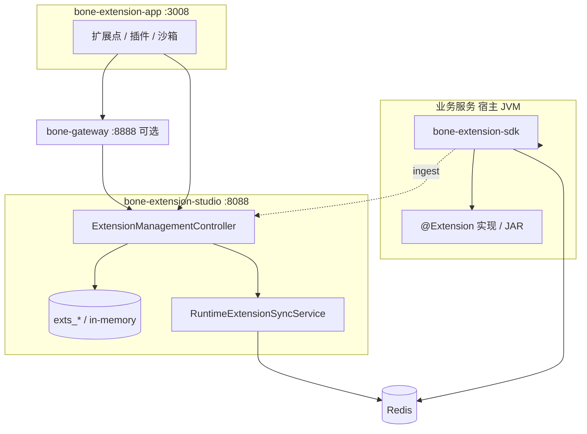

# 扩展管理模块详细设计方案

## —— 企业级全栈开源快速开发平台 · 扩展管理模块

> **文档性质**：详细设计文档，指导开发实现  
> **适用产品**：BONE 企业级全栈开源快速开发平台  
> **对标标准**：SPI/策略扩展（BAdI）、PF4J 类插件、SemVer 制品、平台 API/可观测规范  
> **版本**：v2.3 | **更新**：2026-05-21 | **状态**：✅ 已发布（As-Is 与 Vision 分层）  
> **仓库对照**：`bone-extension-engine`（SDK + Studio）、`bone-extension-studio`（**8088**）、`bone-extension-app`（**3008**）  
> **DDL 真源**：[`bone-init.sql`](../../../bone-init.sql) **§5** `exts_*` 五表  
> **API 真源**：[Bone-API-规范.md](../../architecture/Bone-API-规范.md) §13.1、[extension-v1.yaml](../../architecture/openapi/extension-v1.yaml)  
> **平台理念**：[README.md](../../../README.md) · 设计原则之 **开闭原则（ExtPoint）**

### 阅读约定

| 标记 | 含义 |
|------|------|
| **As-Is** | 仓库已实现或已约定，验收以此为准 |
| **[Target]** | 目标态，须在 OpenAPI/代码落地前标注迁移期 |
| **[Vision]** | 路线图，单独立项/ADR，**不得**写入当前版本验收 |

---

## 目录

1. [模块概述](#1-模块概述)（含 §1.5 与元数据双模式协同）
2. [实现符合度矩阵](#2-实现符合度矩阵)
3. [术语与领域模型](#3-术语与领域模型)
4. [功能设计](#4-功能设计)
5. [技术实现](#5-技术实现)
6. [数据模型](#6-数据模型)
7. [API 设计](#7-api设计)
8. [部署与集成](#8-部署与集成)
9. [性能与安全](#9-性能与安全)
10. [测试与质量](#10-测试与质量)
11. [监控与可观测性](#11-监控与可观测性)
12. [路线图 Vision](#12-路线图-vision)
13. [总结](#13-总结)

---

## 1. 模块概述

### 1.0 设计理念（对齐 README）

| README 原则 | 在本模块的落点 |
|-------------|----------------|
| **开闭原则（ExtPoint）** | 核心流程与扩展点接口稳定；差异逻辑以 **扩展实现（插件）** 注入 |
| **元数据先行** | 扩展点/实现元数据存 `exts_*`；与 `meta_*` 分工：元数据管「模型与 CRUD 路径」，ExtPoint 管「行业算法与流程差异」 |
| **契约化 API** | Studio 统一 `/api/v1/extension/**` |
| **工程诚实** | 本文 As-Is / [Target] / [Vision] 分层；Wasm/市场为 Vision |

**在四大引擎中的位置**（README 协同架构）：元数据定义业务骨架 → 主数据保障核心数据质量 → **本模块注入个性化逻辑** → 集成连接外部系统。扩展引擎 **不替代** 元数据引擎，也 **不替代** 代码生成/动态 CRUD。

### 1.1 模块定位

扩展管理模块为 BONE 提供**可治理的扩展点 + 扩展实现 + JAR 制品**能力：业务通过稳定 Java 接口（扩展点）与维度路由（`BizContext`）挂载租户/场景化逻辑，无需修改核心代码。

**As-Is（2026-05）**：

- **运行时**：`bone-extension-sdk` — Java 接口代理 + 四级路由 + `@Extension` 实现
- **管理台**：`bone-extension-studio` — REST **`/api/v1/extension`**
- **制品**：JAR 上传、版本表 `exts_plugin_version`、运行时元数据同步（Redis / 内存）
- **非当前运行时**：Wasm 沙箱（见 [§12](#12-路线图-vision)）
- **热更新边界**（重要）：As-Is 的「热部署」指 **路由/启用态元数据热更新**（实现类必须已随宿主发布在 classpath）；上传 JAR 仅做 **制品归档 + checksum 留痕**，**不进行字节码动态加载**；动态 ClassLoader / 字节码热载属 **[Target]**（见 [§4.4](#44-隔离与治理)）。

### 1.2 核心功能（As-Is）

| 能力 | 说明 |
|------|------|
| 扩展点管理 | 注册接口 FQCN、业务域、启用状态 |
| 扩展实现管理 | 控制台称「插件」；落库 `exts_extension_impl`，含路由维度与 `config_json` |
| 制品版本 | JAR 版本、checksum、激活版本 |
| 部署与路由发布 | `:deploy` / `:publish-runtime` 推送路由元数据 |
| 执行与审计 | 执行日志游标查询、SDK `:ingest`、操作审计 `exts_audit_log` |
| 权限 | JWT Scope：`extension:points:read|write`、`extension:plugins:deploy` |

**[Target]**：插件依赖图、部署状态机、Redis 集群幂等。  
**[Vision]**：Wasm 运行时、插件市场、资源计量表。

**已落地（v2.2）**：`POST` 创建 **201+Location**、**Idempotency-Key**、**If-Match/412**、`:deploy` **LRO（202 + `/operations/{operationId}`）**、SDK **舱壁+超时**（`ExtensionExecutionGuard`）。

**v2.3 文档收紧**：`Idempotency-Key` 冲突 **409 `COMMON_IDEMPOTENCY_CONFLICT`**、`X-Request-Id` 回显、`ProblemDetail.traceId` 与 MDC 同源、字符串枚举、ISO-8601 UTC、`Sunset`/`Deprecation` 等 [API 规范](../../architecture/Bone-API-规范.md) §6/§7/§8/§14 全部纳入 [§7.1 横切约定](#71-横切约定) 检查单。

### 1.3 设计目标

| 目标 | As-Is 手段 | [Target] / [Vision] |
|------|------------|---------------------|
| 安全 | Scope + 审计；进程内隔离（路由元数据叠加 + 执行舱壁/超时） | 独立 ClassLoader + 制品签名校验（GPG/Sigstore）、SBOM 扫描 |
| 隔离 | 全局 Semaphore 舱壁 + `Future.get(timeout)`（`ExtensionExecutionGuard`） | 按插件/租户独立线程池、熔断、Resilience4j 原生集成 |
| 热部署 | 元数据发布 + 运行时路由刷新（**类已在宿主 classpath**） | 字节码热载（独立 ClassLoader）；蓝绿/金丝雀与 `rollout_percent` 联动 |
| 可扩展 | 多实现 + 优先级 + 默认 SpEL（Aviator 可选） | 插件依赖解析、依赖图 |
| 可观测 | 执行日志、审计、MDC `traceId` | Prometheus RED 指标、SLI/SLO（见平台规范） |

### 1.5 与智能元数据双模式协同

元数据引擎提供 **模式 A（生成式）** 与 **模式 B（运行时）** 两条交付路径（见 [元数据能力对照](./元数据能力-实现映射与竞品对照.md) §1.3、[PRD §4.4](../../prd/BONE产品需求文档正式版.md)）。扩展引擎与之分工如下：

| 场景 | 推荐载体 | 说明 |
|------|----------|------|
| 标准实体 CRUD、列表、表单 | 元数据 **模式 B**（规划）或 **模式 A** 生成代码 | **不应** 为每家客户复制一套实体仅因字段差异 |
| 促销计价、审批会签、行业 BOM | **ExtPoint + 插件** | 稳定接口 + 多实现路由 |
| 信创要求完整源码入库 | 元数据 **模式 A** + 手写/插件实现 ExtPoint | 生成 DDD 工程进 Git |
| 运营后台快速上线 | 元数据 **模式 B** + 少量 ExtPoint | 减少生成与发布周期 |

**反模式（设计门禁）**：

- 用「再建一个 meta 实体 + 生成 CRUD」表达本可用 **一个扩展点多实现** 解决的差异。
- 在插件内硬编码完整 CRUD 替代元数据/runtime（应调用宿主领域服务或动态 API）。

**宿主集成（As-Is）**：

- 业务服务依赖 `bone-extension-sdk`，`@EnableExtensionPoints` 扫描实现类。
- Studio 与宿主可共用 `bone-metadata-sdk` 持久化 `exts_*`（EMBEDDED）。

---

## 2. 实现符合度矩阵

| 能力项 | PRD/详设 | As-Is | 测试 |
|--------|----------|-------|------|
| 扩展点 CRUD | ✓ | `ExtensionManagementController` | `ExtensionApiContractTest` |
| 扩展实现（插件）CRUD | ✓ | `Extension` + `exts_extension_impl` | 同上 |
| JAR 上传/版本 | ✓ | `plugins:upload`、`exts_plugin_version` | 契约测试 |
| 部署/回滚/绑定 | ✓ | `:deploy` `:rollback` `:bind` | 契约测试 |
| 运行时发布 | ✓ | `:publish-runtime` | Redis E2E（需 Docker） |
| 执行日志游标 | ✓ | `execution-logs` + `nextCursor` | `PluginExecutionLogCursorTest` |
| 审计日志 | ✓ | `audit-logs` + `exts_audit_log` | `InMemoryStudioAuditRepositoryTest` |
| 四级路由 | ✓ | `DefaultExtensionPointRouter` | SDK 单测 |
| 幂等写 / If-Match | ✓ | `StudioIdempotencyService` + `If-Match`（进程内 TTL 24h） | `ExtensionApiTargetFeaturesTest` |
| LRO 部署 | ✓ | `StudioLroService`：默认 **202** + `GET /operations/{id}`；`?sync=true` 或 `deploy-sync-by-default` 同步 200 | `ExtensionApiLroTest` |
| 执行舱壁/超时 | ✓ | `ExtensionExecutionGuard`（JDK，语义对齐 Resilience4j Bulkhead/TimeLimiter） | `ExtensionExecutionGuardTest` |
| Wasm 沙箱 | [Vision] | 无 | — |
| 插件市场 | [Vision] | 无 | — |

---

## 3. 术语与领域模型

### 3.1 术语对照（强制）

| 控制台/API 用语 | 领域对象 | 表 / 代码 | 说明 |
|-----------------|----------|-----------|------|
| 扩展点 | `ExtPoint` | `exts_extension_point` | 稳定 **Java 接口 FQCN**（`interface_name` / `point_code`） |
| 插件 / 扩展实现 | `Extension` | `exts_extension_impl` | **非**独立 `exts_plugin` 表；`plugin_id` 在版本/日志表中指 **实现 ID** |
| 插件制品版本 | `PluginVersion` | `exts_plugin_version` | JAR 路径、`checksum`、SemVer `release_version` |
| 绑定 | — | `extension_point_id` 外键 | `:bind` 修改实现的扩展点归属，无单独 Binding 表 |

> **禁止**在设计与接口文档中混用「插件聚合根」与「扩展实现」而不加脚注。

### 3.2 扩展点 vs 生命周期钩子

| 概念 | 层级 | 说明 |
|------|------|------|
| **扩展点** | 元数据 + 接口契约 | 业务注入 `OrderPricingExtPoint` 等接口，**无**「前置/后置/环绕」类型字段 |
| **调用链钩子** | SDK `ExtensionLifecycle` | `before` / `around` / `after` 作用于**单次方法调用**，非扩展点分类 |
| **领域事件** | SDK `ExtensionEvent` | 注册/调用前后异步通知；**不等同** RocketMQ 业务事件 |

业界对标：Salesforce/Fusion **Extensibility SPI**、SAP **BAdI**、JDK **ServiceLoader** 的企业版路由。

### 3.3 部署状态机 [Target]

制品与运行时解耦，建议状态（`deployment_status` 字段或等价枚举）：

```
Uploaded → Validated → Staged → Active → Deprecated
                ↓失败
            Rejected
```

| 状态 | 含义 |
|------|------|
| Uploaded |  multipart 已落盘，checksum 已记录 |
| Validated | 病毒扫描/依赖检查通过 [Target] |
| Staged | 已加载 ClassLoader，未参与路由 |
| Active | `is_active=1` 且已 `publish-runtime` |
| Deprecated | 保留只读，不参与路由 |

回滚：将 Active 指针切回上一 **Validated** 版本，并重新 `publish-runtime`。

---

## 4. 功能设计

### 4.1 扩展点管理（As-Is）

- 创建/编辑/删除/列表/搜索（`keyword`、`domain`、`category`）
- 启用/禁用：`:enable` / `:disable`
- **业务规则**：
  - `point_code` 租户内唯一，通常为接口 FQCN
  - `status`：`ENABLED` / `DISABLED`
  - 扩展点**不**区分前置/后置/环绕类型

### 4.2 扩展实现与制品（As-Is）

- 列表/详情/创建/更新/删除（API 路径 `/plugins` 映射 `Extension`）
- 上传 JAR：`plugins:upload` → `exts_plugin_version`
- 部署/卸载/回滚：`:deploy` `:undeploy` `:rollback`
- 绑定扩展点：`:bind` / `:unbind`（更新 `extension_point_id` 与路由维度）
- **业务规则**：
  - 制品格式：**JAR**；保留最近 **3** 个版本（`bone.extension.studio.artifact.max-versions-per-plugin` 可配）
  - `checksum`（SHA-256）必填；[Target] GPG/Sigstore 验签
  - **热部署边界**：当前 `:deploy` 只更新 **路由元数据 + `is_active`**（经 Redis `publish-runtime` 通知 SDK 刷新缓存），**不动态加载 JAR 字节码**；类必须已在宿主 classpath（随宿主一起发布或 mount）。**字节码热载**（独立 ClassLoader + 依赖隔离） 见 [§4.4](#44-隔离与治理) [Target]
  - 上传校验（As-Is）：扩展名 `.jar`、`max-file-size=50MB`、SHA-256；**[Target]** 增加 MIME magic-number 校验 + 路径穿越防护 + 病毒/依赖扫描（对齐 [API 规范 §14.4](../../architecture/Bone-API-规范.md#144-文件上传)）
  - 制品存储路径（`file_path`）：As-Is 写入绝对路径；**[Target]** 改为存储相对 `storage-root` 的逻辑路径，下载走鉴权 `GET /api/v1/extension/plugins/{id}/versions/{ver}:download`（对齐 API 规范 §14.4「禁止返回服务器绝对路径」）

### 4.3 路由与灰度（As-Is）

`exts_extension_impl` 字段驱动 SDK **四级路由**（实现于 `DefaultExtensionPointRouter`，与 [SDK 使用指南 §4.1](../../../bone-engine/bone-extension-engine/docs/使用指南.md) 须保持顺序一致）：

1. **精确匹配**：维度键值完全相等（`tenant_code` / `biz_code` / `use_case` / `scenario` / `user_group`）
2. **表达式匹配**：`@Extension.condition` / `config_json.condition`，默认 **SpEL**；Aviator 通过 `ExpressionEvaluator` SPI 替换
3. **模糊匹配**：维度规则含通配 `*`
4. **默认实现**：`is_default = true`（落地为 `config_json.defaultImpl`）

**灰度（As-Is）**：通过 `config_json.traffic`（0-100，稳定分桶：`requestId + 扩展点 + code`）实现；`@Extension.traffic = 50` ≈ 50% 命中。  
**[规划/二选一]**：DDL 列 `exts_extension_impl.rollout_percent` **当前未接线**（同步链路读 `config_json.traffic`）；ADR 二选一后保留唯一字段，避免双轨语义。  
**[Target]**：金丝雀按 traceId/tenant 哈希分流，与路由层金丝雀联动。

### 4.4 隔离与治理

**As-Is**：

- 同进程 JVM；类由宿主 Spring 容器加载（**共享 classpath**，非独立 ClassLoader）
- `ExtensionPointExecutor` 权限检查 + 执行日志上报 Studio
- **`ExtensionExecutionGuard`**：全局 Semaphore 舱壁（默认 64）+ `Future.get(timeout)`（默认 30s，`bone.extension.execution.*`）；语义对齐 Resilience4j Bulkhead/TimeLimiter
- 沙箱页展示策略配置（`sandbox/config`），执行日志 + 审计

**[Target]**（业界 PF4J / Equinox / Apache PF4J 隔离最佳实践）：

- **字节码热载**：每插件 **独立 `URLClassLoader`**（parent-last）+ 依赖冲突检测；与 `is_active` 版本对齐
- **按插件/租户**独立线程池与熔断（当前为全局舱壁）
- **熔断**：连续失败打开 circuit，fallback 到 `is_default` 实现
- 制品供应链：GPG/Sigstore 签名校验、SBOM 扫描、OWASP Dependency-Check

**[Vision]**：Wasm/WASI 进程外隔离（§12）。

### 4.5 同步扩展 vs 异步事件

| 模式 | 用途 | 技术 |
|------|------|------|
| **同步扩展点** | 业务链路内计价/校验/路由 | 接口注入 + `ExtensionPointProxy` |
| **SDK 生命周期事件** | 监控、审计钩子 | `ExtensionEvent` |
| **平台域事件** [Target] | 跨模块解耦 | [Bone-消息与事件规范](../../architecture/Bone-消息与事件规范.md)，**禁止**用 MQ 替代扩展点接口 |

---

## 5. 技术实现

### 5.1 技术栈（As-Is / Target / Vision）

| 技术 | 版本 | 用途 | 状态 |
|------|------|------|------|
| Java | 17+ | 语言 | As-Is |
| Spring Boot | 3.2+ | Studio / 宿主 | As-Is |
| bone-extension-sdk | — | 路由、代理、执行 | As-Is |
| bone-metadata-sdk | — | Studio 持久化（EMBEDDED） | As-Is |
| MySQL | 8.0+ | `exts_*` | As-Is |
| Redis | 7.x | 运行时元数据同步 | As-Is（可关） |
| **SpEL**（Spring Expression） | Spring 6.x | **默认**表达式引擎（`SpELExpressionEvaluator`） | As-Is |
| Aviator | 5.4+ | 可替换表达式引擎（`ExpressionEvaluator` SPI），用于复杂规则 | As-Is（可选） |
| Resilience4j（语义） | — | 舱壁+超时：`ExtensionExecutionGuard` | As-Is；熔断 [Target] |
| Micrometer Prometheus | — | RED 指标（`extension_invoke_*`） | [Target] |
| RocketMQ | 5.x | 域事件 | [Target] 选配 |
| WasmEdge / WASI | — | 插件运行时 | [Vision] |

### 5.2 架构（As-Is）



**核心流程**：

1. 控制台维护扩展点与实现 → 写入 `exts_*`
2. `:deploy` / `:publish-runtime` → Redis（或内存）路由元数据
3. 业务服务 `@EnableExtensionPoints` → 代理按 `BizContext` 路由到实现类
4. 执行完成 → 可选 `execution-logs:ingest` + 审计日志

### 5.3 核心组件

| 组件 | 职责 | 模块 |
|------|------|------|
| `ExtensionManagementController` | 统一 REST | bone-extension-studio |
| `ExtPointService` / `ExtensionService` | 应用服务 | studio |
| `domain/repository/*Repository` + Metadata 实现 | 持久化 | studio domain + infrastructure |
| `RuntimeExtensionSyncService` | 路由元数据推送 | studio |
| `DefaultExtensionPointRouter` | 四级路由 | bone-extension-sdk |
| `ExtensionPointProxy` | 接口代理 | bone-extension-sdk |

### 5.4 扩展点机制（路由模型）

**定义**：扩展点 = 稳定 Java 接口 + 文档化契约（OpenAPI 登记接口 FQCN）。

**触发**：业务代码注入扩展点接口；设置 `BizContext`（或 ThreadLocal）后调用方法。

**路由优先级**：见 §4.3；缓存键由实现列表 + 维度构成（`DefaultExtensionPointRouter`）。

**契约演进**：接口仅允许 **additive** 变更；破坏性变更升接口版本并新扩展点 FQCN。

### 5.5 工程结构（As-Is / Target）

**模块性质**（真源：[Bone-DDD §14.4](../../architecture/Bone-DDD-最终实践方案.md)）：`bone-extension-studio` 为**应用 / 控制面 BFF**（虽位于 `bone-engine/`），须满足 DDD P0；`bone-extension-sdk` 为**引擎 SDK**（仅 D0/D1）。

**As-Is（仓库实构，2026-05）**：

```
bone-extension-engine/
├── bone-extension-sdk/          # 引擎 SDK：router、proxy、executor
└── bone-extension-studio/       # 应用 BFF（DDD P0）
    ├── adapter/web/controller/  # REST（ExtensionManagementController 等）
    ├── application/
    │   ├── command/handler/     # 写侧（ExtPoint/Extension/ExecutionLog CommandHandler）
    │   ├── query/handler/       # 读侧
    │   └── service/             # 共享服务（Audit、Idempotency、LRO、Artifact）
    ├── domain/model/
    ├── domain/repository/       # 持久化端口（§14.5，已统一）
    ├── infrastructure/persistence/
    ├── security/、sync/、config/
```

**Bone-DDD v4.0（已收敛）**：`ExtensionManagementController` 仅注入 Handler + `ExtensionStudioProperties`（读配置）；幂等/LRO/审计编排在 `*CommandHandler` / `ExtensionStudioCommandHandler` / `StudioIdempotentExecutor`；`ArchitectureTest` 已启用（**禁止** `*UseCase` / `domain/store` / 顶层 `controller/`）。

**新代码**：REST 仅落 `adapter/web/controller`；不得新增 `application/usecase` 或 `domain/store`；业务模块异常统一 `com.bone.core.exception.BizException`；SDK 插件侧继承 `com.bone.engine.extension.api.exception.ExtensionBizException`（**禁止** `BusinessException` 命名，见《Bone-DDD》§16.3）。

---

## 6. 数据模型

### 6.1 表清单（真源）

[`bone-init.sql`](../../../bone-init.sql) **§5**；说明见 [数据库开发规范.md](../../architecture/数据库开发规范.md) §2.5。

| 表 | 说明 |
|----|------|
| `exts_extension_point` | 扩展点 |
| `exts_extension_impl` | 扩展实现（控制台「插件」） |
| `exts_plugin_version` | JAR 制品版本（`plugin_id` → 实现 ID） |
| `exts_plugin_execution_log` | 执行日志 |
| `exts_audit_log` | 操作审计 |

**[Vision] 表**：`ext_plugin_resource_usage`、`ext_marketplace_item` — 须先 ADR 再入 init。

### 6.2 关键字段（实现相关）

| 表 | 字段 | 用途 | 状态 |
|----|------|------|------|
| `exts_extension_impl` | `priority` | 路由内排序（同级择优） | As-Is |
| `exts_extension_impl` | `is_default` | 兜底实现标记（落地为 `config_json.defaultImpl`） | As-Is |
| `exts_extension_impl` | `config_json.traffic` | **灰度比例（0-100）**，SDK 真正使用 | As-Is |
| `exts_extension_impl` | `config_json.condition` | SpEL/Aviator 表达式 | As-Is |
| `exts_extension_impl` | `rollout_percent` | **DDL 已建列、运行时未接线**；规划与 `traffic` 二选一 | **[规划/未生效]** |
| `exts_extension_impl` | `version` | 乐观锁（DB 已建列；API 已暴露 `If-Match` / 412） | As-Is |
| `exts_extension_impl` | `deployment_status` | 部署状态机（[§3.3](#33-部署状态机-target)） | **[Target] DDL 未建列**，枚举类 `DeploymentStatus` 已预留 |
| `exts_plugin_version` | `checksum` (SHA-256) | 制品完整性 | As-Is |
| `exts_plugin_version` | `is_active` | 当前激活版本 | As-Is |
| `exts_plugin_version` | `file_path` | 制品路径；**As-Is 为绝对路径，[Target] 改逻辑路径**（API 规范 §14.4） | As-Is（规划重构） |
| 全部 | `tenant_id`, `deleted` | 多租户 + 软删 | As-Is |

**规划**：新字段只改 `bone-init.sql`；禁止详设维护 SQL 副本。`rollout_percent` 与 `config_json.traffic` 须出 ADR 二选一后清理冗余。

---

## 7. API 设计

> **平台契约**：[Bone-API-规范.md](../../architecture/Bone-API-规范.md)。唯一前缀 **`/api/v1/extension`**。OpenAPI：[extension-v1.yaml](../../architecture/openapi/extension-v1.yaml)。

### 7.1 横切约定

> **平台落地检查单**（[API 规范 §8.1](../../architecture/Bone-API-规范.md#81-模块横切约定索引详设-50) 索引到本节）。各字段语义见 [API 规范 §6.1/§7/§8/§14](../../architecture/Bone-API-规范.md)。

|  topic | As-Is | [Target] | API 规范引用 |
|--------|-------|----------|--------------|
| 成功信封 | `com.bone.core.model.ApiResponse` + `PageResult.records` | — | §3.1 / §3.3 |
| 失败 | `ProblemDetail`（`type/title/status/detail/errorCode/traceId`）+ `EXT_*` | — | §4.2 |
| 时间 | ISO-8601 UTC `Z`（`Instant`） | — | §14.1 |
| 枚举 | 字符串（`ENABLED` / `DEPLOYED`），OpenAPI `enum` | — | §14.2 |
| 分页 | 列表 `page`/`size`（上限 100）；`execution-logs`、`audit-logs` **游标 + `Link: rel=next`** | — | §2.5 / §5 |
| 创建 | **201 + `Location`**（`POST /points`、`POST /plugins`、`:upload`） | — | §2.4 / §3.2 |
| 更新 | PUT + **`If-Match`/`version`**（**412** Precondition Failed） | **PATCH** 部分更新（同 If-Match） | §2.4 / §6.1 |
| 删除 | **204 无 body**（统一） | — | §2.4 |
| 幂等 | `Idempotency-Key`（进程内 24h；`:upload` `:deploy` `:rollback`、创建）；键同 body 异 → **409 `COMMON_IDEMPOTENCY_CONFLICT`** | Redis 集群幂等 | §6.1 / §8 |
| 长任务 | `:deploy` 默认 **202** + `Location` → `GET /operations/{operationId}`（`done/progress/result/error`）；`?sync=true` 同步 200 | 持久化 LRO 队列（Redis/DB） | §7 |
| 追踪 | `X-Request-Id` 请求头透传 + **响应头回显**；`ProblemDetail.traceId` 与 MDC 一致 | — | §6.1 / §6.2 / §10 |
| 限流 | 上传/部署 429 + `Retry-After`、`RateLimit-*`（推荐） | 网关统一 | §6.2 |
| 上传 | `multipart/form-data`、`.jar` 扩展名校验、SHA-256 checksum、`max-file-size=50MB` | MIME magic-number + 病毒/依赖扫描；返回 `versionId`/逻辑路径而非绝对路径 | §14.4 |
| 异常处理 | Controller 抛 `BizException`，由 `GlobalExceptionHandler` 翻译为 `ProblemDetail`（禁止 catch 后丢 `errorCode`） | — | §12 |
| 权限 | Scope 见 [§7.2/§7.4](#72-扩展点-api) | 环境级：prod 禁 upload，仅 deploy | §9.2 |
| 废弃接口 | `Deprecation` + `Sunset` + `Link rel="successor-version"` | — | §6.2 / §13.2 |

### 7.2 扩展点 API

| 路径 | 方法 | 成功码 | 功能 | Scope |
|------|------|--------|------|-------|
| `/points` | GET | 200 | 列表/搜索 | `extension:points:read` |
| `/points` | POST | **201 + Location** | 创建 | `extension:points:write` |
| `/points/{id}` | GET | 200 | 详情 | read |
| `/points/{id}` | PUT | 200（412 If-Match 失败） | 更新 | write |
| `/points/{id}` | PATCH **[Target]** | 200 | 部分更新 | write |
| `/points/{id}` | DELETE | **204**（[Target] 统一） | 删除 | write |
| `/points/{id}:enable` | POST | 200 | 启用 | write |
| `/points/{id}:disable` | POST | 200 | 禁用 | write |

### 7.3 扩展实现（插件）API

| 路径 | 方法 | 成功码 | 功能 | Scope |
|------|------|--------|------|-------|
| `/plugins` | GET | 200 | 实现列表 | read |
| `/plugins` | POST | **201 + Location** | 创建实现元数据 | write |
| `/plugins:upload` | POST | **201 + Location** | 上传 JAR（multipart；返回 `versionId` + checksum；**不返回绝对路径**） | `extension:plugins:deploy` |
| `/plugins/{id}` | GET | 200 | 详情 | read |
| `/plugins/{id}` | PUT | 200（412 If-Match 失败） | 更新 | write |
| `/plugins/{id}` | PATCH **[Target]** | 200 | 部分更新 | write |
| `/plugins/{id}` | DELETE | **204**（[Target] 统一） | 删除 | write |
| `/plugins/{id}/versions` | GET | 200 | 版本列表 | read |
| `/plugins/{id}/versions/{ver}:download` **[Target]** | GET | 302（短期鉴权 URL）或 200 | 制品下载（替代裸 `file_path`） | deploy |
| `/plugins/{id}/doc` | GET | 200 | 扩展文档元数据 | read |

> `{id}` = **扩展实现 ID**（`exts_extension_impl.id`）。**勿与** `bone-iam` 内联 `ExtensionE2eController`（联调子集）混淆；生产真源为 **`bone-extension-studio`** `ExtensionManagementController`。
>
> **上传约束**（对齐 [API 规范 §14.4](../../architecture/Bone-API-规范.md#144-文件上传)）：扩展名 `.jar` + `max-file-size=50MB` + SHA-256 checksum；**[Target]** MIME magic-number + 防路径穿越 + 病毒/依赖扫描。

### 7.4 部署与路由 API

| 路径 | 方法 | 成功码 | 功能 | Scope |
|------|------|--------|------|-------|
| `/plugins/{id}:deploy` | POST | **202 + Location**（默认 LRO）/ 200（`?sync=true`） | 部署/激活 | deploy |
| `/operations/{operationId}` | GET | 200 | LRO 轮询（`done`/`progress`/`result`/`error`，对齐 [API 规范 §7](../../architecture/Bone-API-规范.md#7-长任务lro)） | deploy |
| `/plugins/{id}:undeploy` | POST | 200 | 卸载 | deploy |
| `/plugins/{id}:rollback` | POST | 200 | 回滚版本 | deploy |
| `/plugins/{id}:bind` | POST | 200 | 绑定扩展点 + 路由维度 | write |
| `/plugins/{id}:unbind` | POST | 200 | 解绑 | write |
| `/plugins/{id}:publish-runtime` | POST | 200 | 发布路由元数据 | deploy |
| `/plugins/{id}:simulate` | POST | 200 | 沙箱模拟 | deploy |

### 7.5 可观测与审计 API

| 路径 | 方法 | 成功码 | 功能 | Scope |
|------|------|--------|------|-------|
| `/overview` | GET | 200 | 概览统计 | read |
| `/execution-logs` | GET | 200（`Link rel=next`） | 执行日志（**cursor** + `limit`） | read |
| `/execution-logs:ingest` | POST | 200 | SDK 上报 | deploy |
| `/audit-logs` | GET | 200（`Link rel=next`） | 审计（**cursor**） | read |
| `/sandbox/config` | GET | 200 | 沙箱策略 | read |

### 7.6 错误码

业务码前缀 **`EXT_`**，登记见 [Bone-错误码登记.md](../../architecture/Bone-错误码登记.md)。

---

## 8. 部署与集成

### 8.1 部署架构（As-Is）

| 项 | 说明 |
|----|------|
| 形态 | Spring Boot 可执行 JAR（`bone-extension-studio`） |
| 端口 | 默认 **8088**（`BONE_EXTENSION_STUDIO_PORT`） |
| Profile | `in-memory`（联调）、`metadata`（H2）、`metadata-mysql`/`prod`（MySQL） |
| 网关 | `bone-gateway:8888` → `/api/v1/extension/**` |
| 容器/K8s | **[Vision]** Helm/水平扩展；仓库暂无 Dockerfile |

本地：

```bash
mvn spring-boot:run -Dspring-boot.run.profiles=in-memory -pl bone-engine/bone-extension-engine/bone-extension-studio
```

### 8.2 集成方式

| 模块 | 集成 |
|------|------|
| bone-iam | JWT `scopes`、`tenantId` |
| 业务宿主 | 依赖 `bone-extension-sdk`，`@EnableExtensionPoints` |
| 元数据/主数据/集成 | 扩展点接口由业务域定义，Studio 仅登记 FQCN |

### 8.3 配置管理

| 配置项 | 说明 |
|--------|------|
| `bone.extension.studio.persistence.mode` | in-memory / metadata |
| `bone.extension.studio.runtime-sync.enabled` | Redis 同步 |
| `bone.extension.studio.security.permit-unauthenticated` | 仅 dev |
| `bone.iam.jwt.secret-key` | 与 IAM 一致 |

**[Target]**：Nacos 热更新 `config_json` 模板；变更走审计。

---

## 9. 性能与安全

### 9.1 性能（SLO 草案）

| 指标 | 目标（P95） | 备注 |
|------|-------------|------|
| 路由选择 | &lt; 5ms | 不含业务逻辑 |
| 元数据发布 | &lt; 500ms | `publish-runtime` |
| 控制台 API | &lt; 300ms | 不含上传体积 |

**手段（As-Is + Target）**：路由缓存、异步执行（`AsyncExtensionExecutor`）、预加载 [Target]。

### 9.2 安全（As-Is + Target）

| 措施 | 状态 |
|------|------|
| JWT Scope | As-Is |
| 操作审计 | As-Is |
| JAR checksum | As-Is |
| 上传大小/MIME 限制 | [Target] |
| 依赖漏洞扫描（OWASP DC） | [Target] |
| 开发者签名 / Sigstore | [Target] |
| 租户隔离（`tenant_id` + `BizContext`） | As-Is |

**策略**：不可信 JAR **不得**默认与宿主共享全权限；最小权限 API 白名单 [Target]。

### 9.3 资源限制 [Target]

| 项 | 建议默认 |
|----|----------|
| 单次扩展调用超时 | 30s |
| 插件线程池队列 | 按租户限制 |
| 上传大小 | 50MB（可配置） |

Wasm 资源上限见 §12。

---

## 10. 测试与质量

> 平台真源：[Bone-测试策略.md](../../architecture/Bone-测试策略.md)、API 契约 [Bone-API-规范 §15](../../architecture/Bone-API-规范.md#15-契约测试http--openapi)。

### 10.1 本模块测试资产（As-Is）

| 类型 | 类 / 工具 |
|------|-----------|
| 契约 | `ExtensionApiContractTest`、`ExtensionApiTargetFeaturesTest`、`ExtensionApiLroTest` |
| Controller | `ExtensionManagementControllerTest` |
| 幂等/LRO | `StudioIdempotencyServiceTest`、`ExtensionApiLroTest` |
| SDK 执行隔离 | `ExtensionExecutionGuardTest`（`bone-extension-sdk`） |
| 冒烟 | `ExtensionStudioSmokeIT` |
| 持久化 | `MetadataPersistenceIntegrationTest`、`StudioMetadataMysqlIT`（Docker） |
| 游标/审计 | `PluginExecutionLogCursorTest`、`InMemoryStudioAuditRepositoryTest` |
| Redis E2E | `StudioRuntimeSyncRedisE2ETest`（Docker） |
| 前端 | `bone-extension-app` Vitest（含 LRO `onProgress`） |
| Gateway 路由 | `ExtensionGatewayRouteIT`（`bone-gateway` → Studio mock） |

CI：`.github/workflows/extension-studio.yml`（Studio / SDK / Gateway / 前端）

本地 E2E：`bone-extension-app` 下 `npm run e2e:api`（经 Gateway）、`npm run e2e:ui`（Playwright）；Vite 默认代理 **8888**。

### 10.2 覆盖率门禁

| 级别 | 行覆盖率 | 分支 |
|------|----------|------|
| L1 | ≥ 80% | ≥ 60% |
| L2 | ≥ 85% | ≥ 60% |

### 10.3 [Target] 增量

- ArchUnit 分层（Studio 引入 `ArchitectureTest`）
- 恶意 JAR / 类加载隔离安全测试
- LRO/幂等 Redis 持久化与多实例一致性
- 按插件熔断与 Resilience4j 原生集成（替代全局 Semaphore）

---

## 11. 监控与可观测性

> 平台真源：[Bone-可观测性规范.md](../../architecture/Bone-可观测性规范.md)、[Bone-日志规范.md](../../architecture/Bone-日志规范.md)。

### 11.1 指标（RED） **[Target]**

> 当前 SDK / Studio **未注册** Micrometer 指标；`extension_*` 计数器属规划，落地后须遵循 [Bone-可观测性规范.md](../../architecture/Bone-可观测性规范.md) 命名与基数约束。

| 指标 | 类型 | 标签（低基数） | 状态 |
|------|------|----------------|------|
| `extension_invoke_total` | counter | `ext_point`, `impl`, `status` | [Target] |
| `extension_invoke_duration_seconds` | histogram | `ext_point`, `impl` | [Target] |
| `extension_deploy_total` | counter | `action`, `status` | [Target] |
| `extension_router_no_match_total` | counter | `ext_point` | [Target] |
| `extension_bulkhead_rejected_total` | counter | （`ExtensionExecutionGuard`） | [Target] |
| `extension_lro_operation_total` | counter | `action`, `result` | [Target] |

**禁止**高基数标签（原始 `execution_id`、完整 URI、`tenant_id` 明文）；超时/熔断指标须与 [Bone-可观测性规范.md](../../architecture/Bone-可观测性规范.md) §4.2.1 SLI 对齐。

### 11.2 日志（As-Is）

- 访问：`StudioRequestContextFilter` `[API]` + `traceId`（`X-Request-Id` 回显，对齐 API 规范 §10）
- 审计：`StudioAuditService` `[Audit]` → `exts_audit_log`
- 执行：SDK 上报 `execution-logs:ingest`
- 错误：`ProblemDetail.traceId` 与 MDC `traceId` 同一值；`status >= 400` 在 access log 中带 `errorCode`

### 11.3 告警 [Target]

- 执行失败率 &gt; 5%（5m）
- 路由无匹配（`extension_router_no_match_total`）突增
- 部署失败连续 3 次
- 舱壁拒绝率 &gt; 1%（5m）

---

## 12. 路线图 Vision

### 12.1 Wasm 运行时 [Vision]

- **WASI** 能力模型优于裸 Wasm；与 JAR **双轨**并存
- 适用：不可信第三方、多语言、强隔离；**不适用**：深度 Spring 集成
- 冷启动与宿主调用成本单独 SLI，**不**复用 JAR &lt;100ms 指标

### 12.2 插件市场 [Vision]

- 表 `ext_marketplace_item`、订阅审核、费率与签名

### 12.3 插件依赖 [Vision]

- 依赖图、循环检测、拓扑部署顺序

### 12.4 资源计量 [Vision]

- 表 `ext_plugin_resource_usage`；与 K8s limits 或 Wasm fuel 对齐

---

## 13. 总结

扩展管理模块落实 README **开闭原则**：**As-Is** 以 **Java 扩展点 + BizContext 四级路由 + Studio 治理** 为核心，通过 JAR 制品与运行时元数据发布实现热更新；与智能元数据 **双模式** 互补——标准能力走元数据，行业差异走 ExtPoint。

**当前优势**：

- 契约清晰（`/api/v1/extension` + OpenAPI + 契约测试）
- 路由模型可表达多租户/场景/灰度
- 可观测基础完备（执行日志、审计、traceId）
- 与四大引擎协同边界明确（§1.0、§1.5）

**演进重点**：

1. **[Target]** 部署状态机 + `deployment_status` DDL；PATCH 部分更新；DELETE 统一 204
2. **[Target]** 字节码热载：每插件独立 `URLClassLoader` + 依赖隔离（消除「热部署仅元数据」边界）
3. **[Target]** JAR 供应链安全：GPG/Sigstore 签名、MIME magic-number、依赖扫描；下载走鉴权 URL（API 规范 §14.4）
4. **[Target]** 灰度字段二选一：`rollout_percent` 与 `config_json.traffic` 收敛到唯一字段
5. **[Target]** 按插件/租户熔断 + Resilience4j 原生集成；RED 指标接入 Micrometer
6. **[Target]** 与 metadata-engine 执行链的标准化扩展点回调契约
7. **[Vision]** Wasm / 市场 / 依赖图

---

## 附录 A：迁移登记（详设 → 代码）

| 项 | 目标 | 跟踪 |
|----|------|------|
| POST 201 + Location | API 规范 §2.4 | ✅ OpenAPI v1.2 + Controller |
| Idempotency-Key | API 规范 §8 | ✅ `StudioIdempotencyService`（进程内 24h） |
| If-Match / version | API 规范 §6.1 | ✅ PUT 扩展点/实现（`StudioHttpSupport.parseIfMatchVersion`） |
| LRO `:deploy` | API 规范 §7 | ✅ `StudioLroService` + `GET /operations/{operationId}` |
| 执行舱壁/超时 | §4.4 | ✅ `ExtensionExecutionGuard` |
| X-Request-Id 回显 | API 规范 §6.2 / §10 | ✅ `StudioRequestContextFilter` |
| DELETE 204 统一 | API 规范 §2.4 | [Target] Controller 现有 200，需收敛 |
| PATCH 部分更新 | API 规范 §2.4 | [Target] 仅 PUT 全量 |
| Idempotency 冲突 409 | API 规范 §8 | [Target] 键同 body 异返回 `COMMON_IDEMPOTENCY_CONFLICT` |
| Idempotency Redis 集群 | API 规范 §8 | [Target] 当前进程内 |
| deployment_status DDL | §3.3 | [Target] 枚举 `DeploymentStatus` 已就位，DDL 未建列 |
| RED 指标 (Micrometer) | API 规范 §10 + 可观测性规范 §4.2.1 | [Target] 未注册 |
| 字节码热载 / ClassLoader 隔离 | §4.4 | [Target] As-Is 仅元数据热更 |
| 制品下载鉴权 URL | API 规范 §14.4 | [Target] 当前 `file_path` 为绝对路径 |
| MIME magic-number 校验 | API 规范 §14.4 | [Target] 仅扩展名校验 |
| `rollout_percent` ↔ `traffic` 收敛 | §4.3 / §6.2 | [Target] ADR + 字段合并 |
| Resilience4j 熔断 | §4.4 | [Target] per-plugin circuit |

## 附录 B：历史文档变更

### v2.2 → v2.3（2026-05-21）

- **§1.2 / §1.3 / §4.2 / §4.4**：纠正「ClassLoader 独立隔离」As-Is 表述，明确 **JAR 上传仅归档 + 路由元数据热更新**；字节码热载（独立 ClassLoader）归并至 **[Target]**
- **§4.3 / §6.2**：澄清灰度 As-Is 走 `config_json.traffic`；`rollout_percent` 标 **未接线（规划）**，待 ADR 二选一
- **§5.1**：拆分 **SpEL 默认 / Aviator 可选**；新增 Micrometer Prometheus（[Target]）
- **§6.2**：`version` 乐观锁明确为 As-Is（API 已暴露 `If-Match`）；新增 `file_path` 绝对路径 [Target] 收紧；新增 `deployment_status` 字段状态
- **§7.1 横切约定**：扩展为 **API 规范落地检查单**（对齐 [API 规范 §6/§7/§8/§14](../../architecture/Bone-API-规范.md) 全部要求）：时间格式、字符串枚举、`X-Request-Id` 回显、DELETE 204、PATCH、`Idempotency-Key` 冲突 409、`Sunset`/`Deprecation`
- **§7.4 / §7.5**：补充 LRO `operationId` 字段一致性；与 [API 规范 §13.1](../../architecture/Bone-API-规范.md#131-扩展extension规范路径) 路径表对齐
- **§11.1**：RED 指标整体降为 **[Target]**（当前未注册 Micrometer）；新增 `extension_router_no_match_total` / `extension_bulkhead_rejected_total` / `extension_lro_operation_total`
- **§11.2**：补充 `ProblemDetail.traceId` 与 MDC `traceId` 同源
- **§13 / 附录 A**：演进重点新增「字节码热载、灰度字段收敛、DELETE 204、PATCH、制品下载鉴权」
- **路由顺序**：与 SDK `DefaultExtensionPointRouter` 源码对齐（精确 → 表达式 → 模糊 → 默认）；同步更新 [SDK 使用指南](../../../bone-engine/bone-extension-engine/docs/使用指南.md) [Target]

### v2.1 → v2.2（2026-05-17）

- 符合度矩阵：幂等/If-Match、LRO、执行舱壁标为 **As-Is**
- §7.4 增加 `GET /operations/{operationId}`；§7.1 长任务约定与实现对齐
- CI：`ExtensionApiLroTest`、`ExtensionExecutionGuardTest`

### v2.0 → v2.1

- 拆分 **As-Is / [Target] / [Vision]**，删除 Wasm 作为主线叙述
- 修正扩展点「前置/后置/环绕」为 SDK 生命周期钩子
- 统一 **Extension = 控制台插件** 术语
- 工程结构改为 `bone-extension-studio` 实构
- §8–§11 改为引用平台测试/可观测规范
- Wasm 伪代码移至 §12，不再作为实现示例
