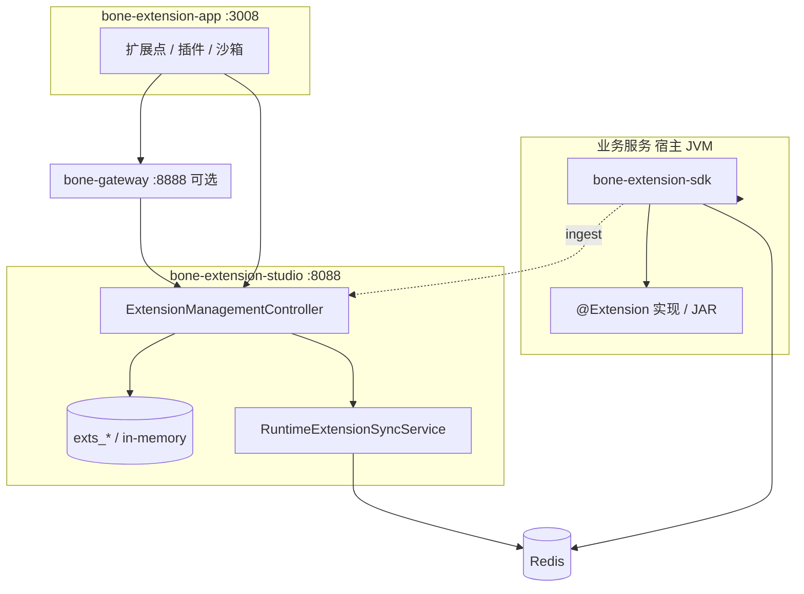

# 扩展管理模块详细设计方案

## —— 企业级全栈开源快速开发平台 · 扩展管理模块

> **文档性质**：详细设计文档，指导开发实现  
> **适用产品**：BONE 企业级全栈开源快速开发平台  
> **对标标准**：SPI/策略扩展（BAdI）、PF4J 类插件、SemVer 制品、平台 API/可观测规范  
> **版本**：v2.1 | **更新**：2026-05-17 | **状态**：✅ 已发布（As-Is 与 Vision 分层）  
> **仓库对照**：`bone-extension-engine`（SDK + Studio）、`bone-extension-studio`（**8088**）、`bone-extension-app`（**3008**）  
> **DDL 真源**：[`bone-init.sql`](../../../bone-init.sql) **§5** `exts_*` 五表  
> **API 真源**：[Bone-API-规范.md](../../architecture/Bone-API-规范.md) §13.1、[extension-v1.yaml](../../architecture/openapi/extension-v1.yaml)

### 阅读约定

| 标记 | 含义 |
|------|------|
| **As-Is** | 仓库已实现或已约定，验收以此为准 |
| **[Target]** | 目标态，须在 OpenAPI/代码落地前标注迁移期 |
| **[Vision]** | 路线图，单独立项/ADR，**不得**写入当前版本验收 |

---

## 目录

1. [模块概述](#1-模块概述)
2. [实现符合度矩阵](#2-实现符合度矩阵)
3. [术语与领域模型](#3-术语与领域模型)
4. [功能设计](#4-功能设计)
5. [技术实现](#5-技术实现)
6. [数据模型](#6-数据模型)
7. [API 设计](#7-api设计)
8. [部署与集成](#8-部署与集成)
9. [性能与安全](#9-性能与安全)
10. [测试与质量](#10-测试与质量)
11. [监控与可观测性](#11-监控与可观测性)
12. [路线图 Vision](#12-路线图-vision)
13. [总结](#13-总结)

---

## 1. 模块概述

### 1.1 模块定位

扩展管理模块为 BONE 提供**可治理的扩展点 + 扩展实现 + JAR 制品**能力：业务通过稳定 Java 接口（扩展点）与维度路由（`BizContext`）挂载租户/场景化逻辑，无需修改核心代码。

**As-Is（2026-05）**：

- **运行时**：`bone-extension-sdk` — Java 接口代理 + 四级路由 + `@Extension` 实现
- **管理台**：`bone-extension-studio` — REST **`/api/v1/extension`**
- **制品**：JAR 上传、版本表 `exts_plugin_version`、运行时元数据同步（Redis / 内存）
- **非当前运行时**：Wasm 沙箱（见 [§12](#12-路线图-vision)）

### 1.2 核心功能（As-Is）

| 能力 | 说明 |
|------|------|
| 扩展点管理 | 注册接口 FQCN、业务域、启用状态 |
| 扩展实现管理 | 控制台称「插件」；落库 `exts_extension_impl`，含路由维度与 `config_json` |
| 制品版本 | JAR 版本、checksum、激活版本 |
| 部署与路由发布 | `:deploy` / `:publish-runtime` 推送路由元数据 |
| 执行与审计 | 执行日志游标查询、SDK `:ingest`、操作审计 `exts_audit_log` |
| 权限 | JWT Scope：`extension:points:read|write`、`extension:plugins:deploy` |

**[Target]**：插件依赖图、部署状态机、幂等写、LRO 大制品部署。  
**[Vision]**：Wasm 运行时、插件市场、资源计量表。

### 1.3 设计目标

| 目标 | As-Is 手段 | [Target] / [Vision] |
|------|------------|---------------------|
| 安全 | Scope + 审计；JVM 内隔离（独立 ClassLoader 思路） | 制品签名校验、SBOM 扫描 |
| 隔离 | 路由失败快速失败；异步执行可选 | Bulkhead 线程池、熔断 |
| 热部署 | 元数据发布 + 运行时刷新 | 蓝绿/金丝雀与 `rollout_percent` 联动 |
| 可扩展 | 多实现 + 优先级 + SpEL | 插件依赖解析 |
| 可观测 | 执行日志、审计、MDC `traceId` | Prometheus SLI/SLO（见平台规范） |

---

## 2. 实现符合度矩阵

| 能力项 | PRD/详设 | As-Is | 测试 |
|--------|----------|-------|------|
| 扩展点 CRUD | ✓ | `ExtensionManagementController` | `ExtensionApiContractTest` |
| 扩展实现（插件）CRUD | ✓ | `Extension` + `exts_extension_impl` | 同上 |
| JAR 上传/版本 | ✓ | `plugins:upload`、`exts_plugin_version` | 契约测试 |
| 部署/回滚/绑定 | ✓ | `:deploy` `:rollback` `:bind` | 契约测试 |
| 运行时发布 | ✓ | `:publish-runtime` | Redis E2E（需 Docker） |
| 执行日志游标 | ✓ | `execution-logs` + `nextCursor` | `PluginExecutionLogCursorTest` |
| 审计日志 | ✓ | `audit-logs` + `exts_audit_log` | `InMemoryStudioAuditStoreTest` |
| 四级路由 | ✓ | `DefaultExtensionPointRouter` | SDK 单测 |
| 幂等写 / If-Match | [Target] | 未实现 | — |
| LRO 部署 | [Target] | 同步 200 | — |
| Wasm 沙箱 | [Vision] | 无 | — |
| 插件市场 | [Vision] | 无 | — |

---

## 3. 术语与领域模型

### 3.1 术语对照（强制）

| 控制台/API 用语 | 领域对象 | 表 / 代码 | 说明 |
|-----------------|----------|-----------|------|
| 扩展点 | `ExtPoint` | `exts_extension_point` | 稳定 **Java 接口 FQCN**（`interface_name` / `point_code`） |
| 插件 / 扩展实现 | `Extension` | `exts_extension_impl` | **非**独立 `exts_plugin` 表；`plugin_id` 在版本/日志表中指 **实现 ID** |
| 插件制品版本 | `PluginVersion` | `exts_plugin_version` | JAR 路径、`checksum`、SemVer `release_version` |
| 绑定 | — | `extension_point_id` 外键 | `:bind` 修改实现的扩展点归属，无单独 Binding 表 |

> **禁止**在设计与接口文档中混用「插件聚合根」与「扩展实现」而不加脚注。

### 3.2 扩展点 vs 生命周期钩子

| 概念 | 层级 | 说明 |
|------|------|------|
| **扩展点** | 元数据 + 接口契约 | 业务注入 `OrderPricingExtPoint` 等接口，**无**「前置/后置/环绕」类型字段 |
| **调用链钩子** | SDK `ExtensionLifecycle` | `before` / `around` / `after` 作用于**单次方法调用**，非扩展点分类 |
| **领域事件** | SDK `ExtensionEvent` | 注册/调用前后异步通知；**不等同** RocketMQ 业务事件 |

业界对标：Salesforce/Fusion **Extensibility SPI**、SAP **BAdI**、JDK **ServiceLoader** 的企业版路由。

### 3.3 部署状态机 [Target]

制品与运行时解耦，建议状态（`deployment_status` 字段或等价枚举）：

```
Uploaded → Validated → Staged → Active → Deprecated
                ↓失败
            Rejected
```

| 状态 | 含义 |
|------|------|
| Uploaded |  multipart 已落盘，checksum 已记录 |
| Validated | 病毒扫描/依赖检查通过 [Target] |
| Staged | 已加载 ClassLoader，未参与路由 |
| Active | `is_active=1` 且已 `publish-runtime` |
| Deprecated | 保留只读，不参与路由 |

回滚：将 Active 指针切回上一 **Validated** 版本，并重新 `publish-runtime`。

---

## 4. 功能设计

### 4.1 扩展点管理（As-Is）

- 创建/编辑/删除/列表/搜索（`keyword`、`domain`、`category`）
- 启用/禁用：`:enable` / `:disable`
- **业务规则**：
  - `point_code` 租户内唯一，通常为接口 FQCN
  - `status`：`ENABLED` / `DISABLED`
  - 扩展点**不**区分前置/后置/环绕类型

### 4.2 扩展实现与制品（As-Is）

- 列表/详情/创建/更新/删除（API 路径 `/plugins` 映射 `Extension`）
- 上传 JAR：`plugins:upload` → `exts_plugin_version`
- 部署/卸载/回滚：`:deploy` `:undeploy` `:rollback`
- 绑定扩展点：`:bind` / `:unbind`（更新 `extension_point_id` 与路由维度）
- **业务规则**：
  - 制品格式：**JAR**；保留最近 **3** 个版本 [可配置]
  - `checksum`（SHA-256）必填；[Target] 增加 GPG/Sigstore 验签
  - 热部署：通过**元数据发布**生效，非重启宿主 JVM

### 4.3 路由与灰度（As-Is）

`exts_extension_impl` 字段驱动 SDK **四级路由**：

1. 精确匹配（`tenant_code` / `biz_code` / `use_case` / `scenario` / `user_group`）
2. SpEL 表达式（`config_json`）
3. 模糊匹配（通配 `*`）
4. 默认实现（`is_default`）

**[Target]**：`rollout_percent` 与路由层金丝雀一致（按 traceId/tenant 哈希分流）。

### 4.4 隔离与治理

**As-Is**：

- 同进程 JVM；`ExtensionPointExecutor` 权限检查 + 超时上报 Studio
- 沙箱页展示策略配置（`sandbox/config`），执行日志 + 审计

**[Target]**（业界 PF4J / 隔离最佳实践）：

- 每插件 **独立 ClassLoader** + 依赖冲突检测
- **Bulkhead**：按插件/租户独立线程池
- **Timeout**：`Future.get(timeout)`，默认 30s 可配置
- **熔断**：连续失败打开 circuit，fallback 到 `is_default` 实现

**[Vision]**：Wasm/WASI 进程外隔离（§12）。

### 4.5 同步扩展 vs 异步事件

| 模式 | 用途 | 技术 |
|------|------|------|
| **同步扩展点** | 业务链路内计价/校验/路由 | 接口注入 + `ExtensionPointProxy` |
| **SDK 生命周期事件** | 监控、审计钩子 | `ExtensionEvent` |
| **平台域事件** [Target] | 跨模块解耦 | [Bone-消息与事件规范](../../architecture/Bone-消息与事件规范.md)，**禁止**用 MQ 替代扩展点接口 |

---

## 5. 技术实现

### 5.1 技术栈（As-Is / Target / Vision）

| 技术 | 版本 | 用途 | 状态 |
|------|------|------|------|
| Java | 17+ | 语言 | As-Is |
| Spring Boot | 3.2+ | Studio / 宿主 | As-Is |
| bone-extension-sdk | — | 路由、代理、执行 | As-Is |
| bone-metadata-sdk | — | Studio 持久化（EMBEDDED） | As-Is |
| MySQL | 8.0+ | `exts_*` | As-Is |
| Redis | 7.x | 运行时元数据同步 | As-Is（可关） |
| Aviator | 5.4+ | 表达式/规则 | As-Is |
| Resilience4j | — | 熔断/舱壁/超时 | [Target] |
| RocketMQ | 5.x | 域事件 | [Target] 选配 |
| WasmEdge / WASI | — | 插件运行时 | [Vision] |

### 5.2 架构（As-Is）



**核心流程**：

1. 控制台维护扩展点与实现 → 写入 `exts_*`
2. `:deploy` / `:publish-runtime` → Redis（或内存）路由元数据
3. 业务服务 `@EnableExtensionPoints` → 代理按 `BizContext` 路由到实现类
4. 执行完成 → 可选 `execution-logs:ingest` + 审计日志

### 5.3 核心组件

| 组件 | 职责 | 模块 |
|------|------|------|
| `ExtensionManagementController` | 统一 REST | bone-extension-studio |
| `ExtPointService` / `ExtensionService` | 应用服务 | studio |
| `*Store` / Metadata 仓储 | 持久化 | studio infrastructure |
| `RuntimeExtensionSyncService` | 路由元数据推送 | studio |
| `DefaultExtensionPointRouter` | 四级路由 | bone-extension-sdk |
| `ExtensionPointProxy` | 接口代理 | bone-extension-sdk |

### 5.4 扩展点机制（路由模型）

**定义**：扩展点 = 稳定 Java 接口 + 文档化契约（OpenAPI 登记接口 FQCN）。

**触发**：业务代码注入扩展点接口；设置 `BizContext`（或 ThreadLocal）后调用方法。

**路由优先级**：见 §4.3；缓存键由实现列表 + 维度构成（`DefaultExtensionPointRouter`）。

**契约演进**：接口仅允许 **additive** 变更；破坏性变更升接口版本并新扩展点 FQCN。

### 5.5 工程结构（As-Is）

与 [Bone-DDD-最终实践方案.md](../../architecture/Bone-DDD-最终实践方案.md) 对齐；Studio **当前**为 pragmatic 分层（非完整 CQRS 代码生成树）：

```
bone-extension-engine/
├── bone-extension-sdk/          # 运行时：router、proxy、executor、lifecycle
└── bone-extension-studio/
    ├── adapter/web/
    │   └── ExtensionManagementController.java   # 唯一 REST 入口
    ├── service/                 # ExtPointService, ExtensionService, ...
    ├── domain/model/            # ExtPoint, Extension, PluginVersion, ...
    ├── domain/store/            # 仓储接口
    ├── infrastructure/persistence/  # Metadata*Store, entity, converter
    ├── security/                # JWT, Scopes, PreAuthorize
    ├── sync/                    # RuntimeExtensionSyncService
    └── config/                  # profile: in-memory | metadata | metadata-mysql
```

**[Target]**：按 DDD 拆 `application/command|query` 与 `adapter/web/dto`，与蓝图模块一致。

---

## 6. 数据模型

### 6.1 表清单（真源）

[`bone-init.sql`](../../../bone-init.sql) **§5**；说明见 [数据库开发规范.md](../../architecture/数据库开发规范.md) §2.5。

| 表 | 说明 |
|----|------|
| `exts_extension_point` | 扩展点 |
| `exts_extension_impl` | 扩展实现（控制台「插件」） |
| `exts_plugin_version` | JAR 制品版本（`plugin_id` → 实现 ID） |
| `exts_plugin_execution_log` | 执行日志 |
| `exts_audit_log` | 操作审计 |

**[Vision] 表**：`ext_plugin_resource_usage`、`ext_marketplace_item` — 须先 ADR 再入 init。

### 6.2 关键字段（实现相关）

| 表 | 字段 | 用途 |
|----|------|------|
| `exts_extension_impl` | `priority`, `is_default`, `rollout_percent`, `config_json` | 路由/灰度 |
| `exts_extension_impl` | `version` | 乐观锁 [Target] API 暴露 |
| `exts_plugin_version` | `checksum`, `is_active` | 制品完整性 / 当前版本 |
| 全部 | `tenant_id`, `deleted` | 多租户 + 软删 |

**规划**：新字段只改 `bone-init.sql`；禁止详设维护 SQL 副本。

---

## 7. API 设计

> **平台契约**：[Bone-API-规范.md](../../architecture/Bone-API-规范.md)。唯一前缀 **`/api/v1/extension`**。OpenAPI：[extension-v1.yaml](../../architecture/openapi/extension-v1.yaml)。

### 7.1 横切约定

|  topic | As-Is | [Target] |
|--------|-------|----------|
| 成功信封 | `ApiResponse` + `PageResult.records` | — |
| 失败 | `ProblemDetail` + `EXT_*` | — |
| 分页 | 列表 `page`/`size`；`execution-logs`、`audit-logs` **游标** | — |
| 创建 | 多数 200 | **201 + `Location`**（`POST /points`、`:upload`） |
| 更新 | PUT | **PATCH** 部分更新；**`If-Match`/`version`** 乐观锁 |
| 幂等 | — | `Idempotency-Key` on `:upload` `:deploy` `:rollback`（§8 API 规范） |
| 长任务 | 同步 200 | 大 JAR **202** + `/operations/{id}` LRO |
| 权限 | Scope 见下表 | 环境级：prod 禁 upload，仅 deploy |

### 7.2 扩展点 API

| 路径 | 方法 | 功能 | Scope |
|------|------|------|-------|
| `/points` | GET | 列表/搜索 | `extension:points:read` |
| `/points` | POST | 创建 | `extension:points:write` |
| `/points/{id}` | GET | 详情 | read |
| `/points/{id}` | PUT | 更新 | write |
| `/points/{id}` | DELETE | 删除 | write |
| `/points/{id}:enable` | POST | 启用 | write |
| `/points/{id}:disable` | POST | 禁用 | write |

### 7.3 扩展实现（插件）API

| 路径 | 方法 | 功能 | Scope |
|------|------|------|-------|
| `/plugins` | GET | 实现列表 | read |
| `/plugins` | POST | 创建实现元数据 | write |
| `/plugins:upload` | POST | 上传 JAR（multipart） | `extension:plugins:deploy` |
| `/plugins/{id}` | GET/PUT/DELETE | 详情/更新/删除 | read/write |
| `/plugins/{id}/versions` | GET | 版本列表 | read |

> `{id}` = **扩展实现 ID**（`exts_extension_impl.id`）。

### 7.4 部署与路由 API

| 路径 | 方法 | 功能 | Scope |
|------|------|------|-------|
| `/plugins/{id}:deploy` | POST | 部署/激活 | deploy |
| `/plugins/{id}:undeploy` | POST | 卸载 | deploy |
| `/plugins/{id}:rollback` | POST | 回滚版本 | deploy |
| `/plugins/{id}:bind` | POST | 绑定扩展点 + 路由维度 | write |
| `/plugins/{id}:unbind` | POST | 解绑 | write |
| `/plugins/{id}:publish-runtime` | POST | 发布路由元数据 | deploy |
| `/plugins/{id}:simulate` | POST | 沙箱模拟 | deploy |

### 7.5 可观测与审计 API

| 路径 | 方法 | 功能 | Scope |
|------|------|------|-------|
| `/overview` | GET | 概览统计 | read |
| `/execution-logs` | GET | 执行日志（**cursor** + `limit`） | read |
| `/execution-logs:ingest` | POST | SDK 上报 | deploy |
| `/audit-logs` | GET | 审计（**cursor**） | read |
| `/sandbox/config` | GET | 沙箱策略 | read |

### 7.6 错误码

业务码前缀 **`EXT_`**，登记见 [Bone-错误码登记.md](../../architecture/Bone-错误码登记.md)。

---

## 8. 部署与集成

### 8.1 部署架构（As-Is）

| 项 | 说明 |
|----|------|
| 形态 | Spring Boot 可执行 JAR（`bone-extension-studio`） |
| 端口 | 默认 **8088**（`BONE_EXTENSION_STUDIO_PORT`） |
| Profile | `in-memory`（联调）、`metadata`（H2）、`metadata-mysql`/`prod`（MySQL） |
| 网关 | `bone-gateway:8888` → `/api/v1/extension/**` |
| 容器/K8s | **[Vision]** Helm/水平扩展；仓库暂无 Dockerfile |

本地：

```bash
mvn spring-boot:run -Dspring-boot.run.profiles=in-memory -pl bone-engine/bone-extension-engine/bone-extension-studio
```

### 8.2 集成方式

| 模块 | 集成 |
|------|------|
| bone-iam | JWT `scopes`、`tenantId` |
| 业务宿主 | 依赖 `bone-extension-sdk`，`@EnableExtensionPoints` |
| 元数据/主数据/集成 | 扩展点接口由业务域定义，Studio 仅登记 FQCN |

### 8.3 配置管理

| 配置项 | 说明 |
|--------|------|
| `bone.extension.studio.persistence.mode` | in-memory / metadata |
| `bone.extension.studio.runtime-sync.enabled` | Redis 同步 |
| `bone.extension.studio.security.permit-unauthenticated` | 仅 dev |
| `bone.iam.jwt.secret-key` | 与 IAM 一致 |

**[Target]**：Nacos 热更新 `config_json` 模板；变更走审计。

---

## 9. 性能与安全

### 9.1 性能（SLO 草案）

| 指标 | 目标（P95） | 备注 |
|------|-------------|------|
| 路由选择 | &lt; 5ms | 不含业务逻辑 |
| 元数据发布 | &lt; 500ms | `publish-runtime` |
| 控制台 API | &lt; 300ms | 不含上传体积 |

**手段（As-Is + Target）**：路由缓存、异步执行（`AsyncExtensionExecutor`）、预加载 [Target]。

### 9.2 安全（As-Is + Target）

| 措施 | 状态 |
|------|------|
| JWT Scope | As-Is |
| 操作审计 | As-Is |
| JAR checksum | As-Is |
| 上传大小/MIME 限制 | [Target] |
| 依赖漏洞扫描（OWASP DC） | [Target] |
| 开发者签名 / Sigstore | [Target] |
| 租户隔离（`tenant_id` + `BizContext`） | As-Is |

**策略**：不可信 JAR **不得**默认与宿主共享全权限；最小权限 API 白名单 [Target]。

### 9.3 资源限制 [Target]

| 项 | 建议默认 |
|----|----------|
| 单次扩展调用超时 | 30s |
| 插件线程池队列 | 按租户限制 |
| 上传大小 | 50MB（可配置） |

Wasm 资源上限见 §12。

---

## 10. 测试与质量

> 平台真源：[Bone-测试策略.md](../../architecture/Bone-测试策略.md)、API 契约 [Bone-API-规范 §15](../../architecture/Bone-API-规范.md#15-契约测试http--openapi)。

### 10.1 本模块测试资产（As-Is）

| 类型 | 类 / 工具 |
|------|-----------|
| 契约 | `ExtensionApiContractTest` |
| Controller | `ExtensionManagementControllerTest` |
| 冒烟 | `ExtensionStudioSmokeIT` |
| 持久化 | `MetadataPersistenceIntegrationTest`、`StudioMetadataMysqlIT`（Docker） |
| 游标/审计 | `PluginExecutionLogCursorTest`、`InMemoryStudioAuditStoreTest` |
| Redis E2E | `StudioRuntimeSyncRedisE2ETest`（Docker） |
| 前端 | `bone-extension-app` Vitest |

CI：`.github/workflows/extension-studio.yml` + `scripts/ci/validate-extension-openapi.sh`

### 10.2 覆盖率门禁

| 级别 | 行覆盖率 | 分支 |
|------|----------|------|
| L1 | ≥ 80% | ≥ 60% |
| L2 | ≥ 85% | ≥ 60% |

### 10.3 [Target] 增量

- ArchUnit 分层（Studio 引入 `ArchitectureTest`）
- 幂等/LRO 契约测试
- 恶意 JAR / 类加载隔离安全测试

---

## 11. 监控与可观测性

> 平台真源：[Bone-可观测性规范.md](../../architecture/Bone-可观测性规范.md)、[Bone-日志规范.md](../../architecture/Bone-日志规范.md)。

### 11.1 指标（RED）

| 指标 | 标签 |
|------|------|
| `extension_invoke_total` | `ext_point`, `impl`, `status` |
| `extension_invoke_duration_seconds` | histogram |
| `extension_deploy_total` | `action` |

**禁止**高基数标签（原始 `execution_id`、完整 URI）。

### 11.2 日志

- 访问：`StudioRequestContextFilter` `[API]` + `traceId`
- 审计：`StudioAuditService` `[Audit]` → `exts_audit_log`
- 执行：SDK 上报 `execution-logs:ingest`

### 11.3 告警 [Target]

- 执行失败率 &gt; 5%（5m）
- 路由无匹配突增
- 部署失败连续 3 次

---

## 12. 路线图 Vision

### 12.1 Wasm 运行时 [Vision]

- **WASI** 能力模型优于裸 Wasm；与 JAR **双轨**并存
- 适用：不可信第三方、多语言、强隔离；**不适用**：深度 Spring 集成
- 冷启动与宿主调用成本单独 SLI，**不**复用 JAR &lt;100ms 指标

### 12.2 插件市场 [Vision]

- 表 `ext_marketplace_item`、订阅审核、费率与签名

### 12.3 插件依赖 [Vision]

- 依赖图、循环检测、拓扑部署顺序

### 12.4 资源计量 [Vision]

- 表 `ext_plugin_resource_usage`；与 K8s limits 或 Wasm fuel 对齐

---

## 13. 总结

扩展管理模块 **As-Is** 以 **Java SPI + BizContext 四级路由 + Studio 治理** 为核心，通过 JAR 制品与运行时元数据发布实现热更新，并与平台 API/审计/游标日志规范对齐。

**当前优势**：

- 契约清晰（`/api/v1/extension` + OpenAPI + 契约测试）
- 路由模型可表达多租户/场景/灰度
- 可观测基础完备（执行日志、审计、traceId）

**演进重点**：

1. **[Target]** 术语与 API 语义统一（201/幂等/乐观锁/部署状态机）
2. **[Target]** JAR 供应链安全与运行时 Bulkhead/熔断
3. **[Vision]** Wasm / 市场 / 依赖图

---

## 附录 A：迁移登记（详设 → 代码）

| 项 | 目标 | 跟踪 |
|----|------|------|
| POST 201 + Location | API 规范 §2.4 | OpenAPI + Controller |
| Idempotency-Key | API 规范 §8 | Studio 写接口 |
| If-Match / version | API 规范 §6.1 | PUT 扩展点/实现 |
| deployment_status | §3.3 | DDL + 领域枚举 |
| Resilience4j | §4.4 | SDK executor |

## 附录 B：历史文档变更（v2.0 → v2.1）

- 拆分 **As-Is / [Target] / [Vision]**，删除 Wasm 作为主线叙述
- 修正扩展点「前置/后置/环绕」为 SDK 生命周期钩子
- 统一 **Extension = 控制台插件** 术语
- 工程结构改为 `bone-extension-studio` 实构
- §8–§11 改为引用平台测试/可观测规范
- Wasm 伪代码移至 §12，不再作为实现示例
