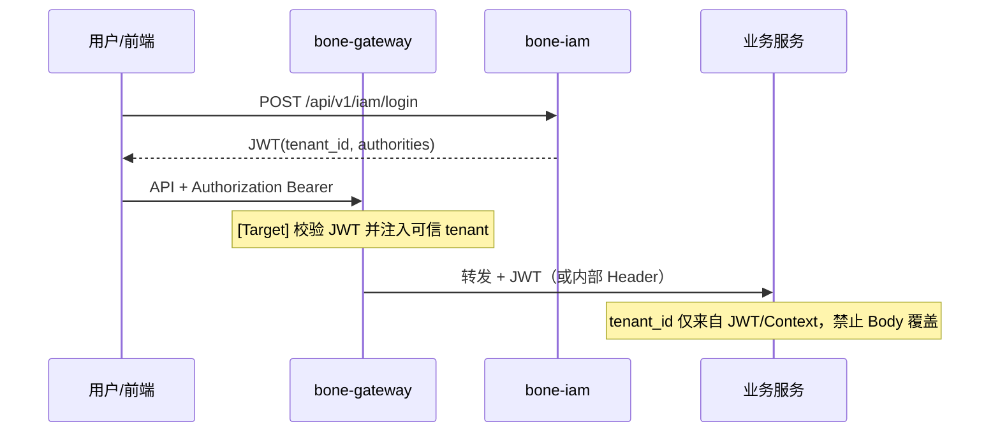

# IAM账号权限管理模块详细设计方案

## —— 企业级全栈开源快速开发平台 · IAM模块

> **文档性质**：详细设计文档，指导开发实现
> **适用产品**：BONE企业级全栈开源快速开发平台
> **对标标准**：业界最佳实践、零信任安全模型、等保三级要求
> **版本**：v2.2 | **发布日期**：2026‑05‑20 | **文档状态**：✅ 已发布（PRD/架构/DDL 对齐修订） | **密级**：内部机密  
> **对齐**：工程实现与门禁以 `doc/architecture/Bone-DDD-最终实践方案.md` 为准；能力与优先级以 `doc/prd/BONE产品需求文档正式版.md` 第 4 章为准。  
> **v2.2 修订**：新增 §1.4 能力成熟度矩阵；§3.4～3.7 认证/授权分层；§4.x 字段对齐 `bone-init.sql`；§6 部署降级为 [Vision]；§8 测试映射 P0 看板。

**仓库对照（As-Is）**：`bone-platform/bone-iam` · 默认 HTTP **8081** · API 唯一前缀 **`/api/v1/iam`**  
**DDL 真源**：[`bone-init.sql`](../../../bone-init.sql)（含 `iam_tenant`、`iam_policy`、`iam_refresh_token` 等 10 表）· [数据库开发规范.md](../../architecture/数据库开发规范.md)  
**设计理念**（[README](../../../README.md)）：RBAC + 多租户按阶段交付；本文 **As-Is / [Target] / [Vision]** 分层，避免将路线图写成已上线能力。

### 实现状态分层

| 层级 | 范围（示例） |
|------|----------------|
| **As-Is** | 账号/角色/权限 CRUD、JWT 登录/登出/刷新（`iam_refresh_token`）、Token 黑名单（Redis）、账号/角色详情、导入导出、`bone-iam-app` 五页、行级 `tenant_id` |
| **[Target]** | 租户 REST（`TenantController`）、角色继承求值、审计设置落库、SSO IdP 联邦写配置与回调、跨域权限码注册表、`iam-v1.yaml` + Gateway IT |
| **[Vision]** | 商业版 WORM、MFA、进程内/独立 PDE、`iam_policy` ABAC、字段级权限、三模式库/Schema 隔离、平台级访问审计总线、等保专项交付包 |

**2026-05 代码审计 Gap**（见 [07-P0-TODO看板](../../wiki/07-P0-TODO看板.md) IAM-06～09）：`PUT /audit/settings` 占位；`GET /sso/callback` Stub；无 `TenantController`；前端分页已对齐 `PageResult.records` + 查询参数 `size`。

> **DDL 注意**：`iam_tenant` 当前以 `bone-init.sql` 为准（基础列 + 审计）；§4.5 扩展字段为 **[Target]**，非 As-Is 列。验收边界见 [§1.4](#14-能力成熟度矩阵验收边界)。

---

## 目录

1. [模块概述](#1-模块概述)
   - 1.1 模块定位
   - 1.2 核心功能
   - 1.3 设计目标
   - 1.4 能力成熟度矩阵
2. [功能设计](#2-功能设计)
   - 2.1 用户管理
   - 2.2 角色管理
   - 2.3 权限管理
   - 2.4 审计日志
   - 2.5 多租户管理（商业版）
3. [技术实现](#3-技术实现)
   - 3.1 技术栈选型
   - 3.2 架构设计
   - 3.3 核心组件
   - 3.4 认证机制（As-Is）
   - 3.5 授权机制（As-Is / Target / Vision）
   - 3.6 审计日志实现
   - 3.7 跨模块权限码契约
4. [数据模型](#4-数据模型)
   - 4.1 用户模型
   - 4.2 角色模型
   - 4.3 权限模型
   - 4.4 审计日志模型
   - 4.5 多租户模型
   - 4.8 与平台租户字段策略
5. [API设计](#5-API设计)
   - 5.1 认证API
   - 5.2 用户管理API
   - 5.3 角色管理API
   - 5.4 权限管理API
   - 5.5 审计日志API
   - 5.6 多租户管理API
6. [部署与集成](#6-部署与集成)
   - 6.1 部署架构
   - 6.2 集成方式
   - 6.3 配置管理
7. [性能与安全](#7-性能与安全)
   - 7.1 性能优化
   - 7.2 安全措施
   - 7.3 合规性
8. [测试计划](#8-测试计划)
   - 8.1 单元测试
   - 8.2 集成测试
   - 8.3 安全测试
   - 8.4 性能测试
9. [监控与告警](#9-监控与告警)
   - 9.1 监控指标
   - 9.2 告警机制
   - 9.3 日志管理
10. [总结](#10-总结)

---

## 1. 模块概述

### 1.1 模块定位

IAM（Identity and Access Management）账号权限管理模块是 BONE 平台的核心安全组件，负责认证、RBAC 授权与 IAM 域审计。**零信任、五层策略、等保三级**为演进目标（[Vision]），非当前 As-Is 承诺；落地边界见 §1.4。

### 1.2 核心功能

| 功能 | 成熟度 |
|------|--------|
| **账号管理**（`iam_account`） | **As-Is** |
| **角色管理**、角色-权限绑定 | **As-Is** |
| **权限目录**、权限树 | **As-Is** |
| **认证**（JWT + refresh + 黑名单） | **As-Is** |
| **IAM 域审计**（DB，30 天） | **As-Is** |
| **多租户管理**、配额、Schema/库隔离 | **[Target]** / 商业版 |
| **企业 SSO 联邦**（OAuth2/SAML/LDAP） | **[Target]** / 商业版（社区版 PRD ❌） |
| **平台全量审计 + WORM** | **[Vision]** / 商业版 |
| **MFA**、**ABAC/`iam_policy`**、**字段级权限** | **[Vision]** |

### 1.3 设计目标

- **安全性**：采用零信任安全模型，实现细粒度的权限控制
- **可靠性**：确保认证和授权的高可用性
- **可扩展性**：支持大规模用户和权限管理
- **合规性**：满足等保三级要求
- **易用性**：提供简单直观的权限管理界面
- **性能**：确保认证和授权的高性能

### 1.4 能力成熟度矩阵（验收边界）

> 与 PRD §4.8、§3.1.3 社区/商业版边界及 P0 看板 **IAM-*** 项一一对应；**未标 As-Is 不得按已上线验收**。

| 能力 | 层级 | PRD / 看板 | 说明 |
|------|------|------------|------|
| 账号 CRUD、启用/禁用、锁定（连续失败） | **As-Is** | IAM-001 | `status` 含 0/1/2，超出 PRD「仅启用/禁用」的扩展状态 |
| 角色 CRUD、角色-权限绑定 | **As-Is** | IAM-002 | 经 `iam_role_permission` |
| 权限目录 CRUD、权限树 | **As-Is** | IAM-003 | `iam_permission` **无 tenant_id**（平台级目录） |
| 权限分配给**用户**（直连） | **[Target]** | IAM-003 | **无** `iam_account_permission` 表；MVP 仅 RBAC |
| 角色继承（`parent_role_id`） | **[Target]** | IAM-002 | DDL 已预留，**无**继承求值逻辑 |
| JWT + refresh + 黑名单 | **As-Is** | — | IAM-01/02 done |
| RBAC（Spring Security + 权限码） | **As-Is** | §5.3 | 无独立 PDE 进程 |
| 租户行级隔离（`tenant_id`） | **As-Is** | IAM-005 子集 | 默认共享库 + 行级；**网关注入 [Target]** |
| 租户 REST、配额、三模式隔离 | **[Target]** / 商业 | IAM-005 | IAM-06 open |
| IAM 域审计（`iam_audit_log`） | **As-Is** | IAM-004 社区版 | 30 天 DB；字段见 §4.4 |
| 全平台操作审计 + WORM | **[Vision]** / 商业 | IAM-004 商业版 | 非仅 IAM 模块 AOP |
| SSO 配置读取 | **As-Is** 占位 | — | `GET /sso/config`；**≠** 企业 IdP 联邦 |
| SSO/LDAP/OAuth/SAML 联邦 | **[Target]** / 商业 | §3.1.3 | IAM-08；社区版 PRD 为 ❌ |
| MFA | **[Vision]** | — | IAM-08 |
| `iam_policy` / 五层 ABAC·ReBAC | **[Vision]** | §5.3 字段级 | 须独立 ADR（总体架构 §10.2） |
| `biz_identity_code` | **暂不建模** | — | IAM 表仅 `tenant_id`；与业务表双字段策略见 §4.8 |

---

## 2. 功能设计

### 2.1 用户管理

**功能描述**：管理系统用户，包括创建、编辑、禁用用户，管理用户信息。

**核心功能**：
- 创建用户：填写用户名、邮箱、密码，选择角色
- 编辑用户：修改用户信息、角色分配
- 禁用用户：禁止用户登录系统
- 重置密码：重置用户密码
- 查询用户：获取用户列表和详情
- 导入/导出用户：批量导入和导出用户信息

**业务规则**：
- 用户名必须唯一（同一租户内）
- 密码必须符合强度要求（长度≥8，包含大小写字母、数字、特殊字符）
- 用户状态：**As-Is** 含启用(1)、禁用(0)、**锁定(2)**（连续登录失败，超出 PRD「仅启用/禁用」基线）
- 企业 SSO 联邦：**[Target]** / 商业版（PRD §3.1.3 社区版不含）

### 2.2 角色管理

**功能描述**：管理系统角色，包括创建、编辑角色，分配权限。

**核心功能**：
- 创建角色：填写角色名称、描述
- 编辑角色：修改角色名称、描述
- 分配权限：为角色分配功能权限和数据权限
- 查询角色：获取角色列表和详情
- 角色继承：**[Target]**（`parent_role_id` 已入 DDL，继承求值未实现）

**业务规则**：
- 角色名称/编码必须唯一（同一 `tenant_id` 内）
- 权限包括：功能权限、数据权限（经角色绑定，**As-Is** 无数据权限引擎）
- 角色继承：**[Target]** — 子角色合并父角色权限集（落地前勿按 PRD 验收继承）

### 2.3 权限管理

**功能描述**：定义系统权限，管理权限分配。

**核心功能**：
- 创建权限：填写权限名称、代码、描述
- 编辑权限：修改权限名称、描述
- 分配权限：**As-Is** 仅分配给角色（`iam_role_permission`）；分配给账号直连为 **[Target]**（需 `iam_account_permission` 或回写收敛 PRD）
- 查询权限：获取权限列表和详情
- 权限层级：**As-Is** `parent_id` 树形展示

**业务规则**：
- 权限 `code` 全局唯一（`iam_permission` **无** `tenant_id` — 平台级权限目录，租户通过角色绑定消费）
- 权限类型：**As-Is** 列 `type`（如 `MENU` / `OPERATION`，见 init SQL 默认 `OPERATION`）
- 权限树：**As-Is**；菜单/操作/数据权限的 UI 与引擎校验逐步对齐 **[Target]**

### 2.4 审计日志

**功能描述**：分两层（勿混为单一能力）：

| 层级 | 范围 | 成熟度 |
|------|------|--------|
| **IAM 域审计** | 登录、账号/角色/权限变更等 IAM API | **As-Is** → `iam_audit_log` |
| **平台访问审计** | 元数据/主数据/集成/扩展等全域 API | **[Vision]** — 各服务 AOP + 统一索引/traceId |

**核心功能**：
- 日志记录：**As-Is** IAM 域操作；全平台操作 **[Vision]**
- 日志查询：支持按时间、用户、操作类型等条件查询
- 日志导出：支持导出为Excel、CSV格式
- 日志存储：商业版使用WORM存储，社区版使用数据库存储

**业务规则**：
- 社区版：审计日志存储在关系型数据库，保留30天，支持按日清理
- 商业版：日志实时写入对象存储（MinIO/AWS S3/阿里云OSS），启用WORM锁定180天，之后自动归档到冷存储
- 审计日志包含：租户ID、用户ID、操作类型、资源ID、请求参数（脱敏）、结果、耗时、来源IP、User-Agent

### 2.5 多租户管理（商业版）

**功能描述**：管理多个租户，为每个租户分配独立的资源配额和用户，以实现多组织隔离。

**核心功能**：
- 创建租户：填写租户名称、管理员邮箱、资源配额
- 编辑租户：修改租户信息、资源配额
- 删除租户：删除不再需要的租户
- 查询租户：获取租户列表和详情
- 租户数据隔离：确保租户间数据完全隔离

**业务规则**：
- **As-Is 默认**：共享数据库 + **`tenant_id` 行级隔离**（与 `bone-init.sql`、业务表一致）
- **[Target] / 商业版**：独立 Schema、独立库（§4.5 `isolation_mode` 扩展字段落地后启用）
- 租户内可设置子管理员，管理本租户用户和权限
- 租户配额包括：最大用户数、最大实体数、存储容量（GB）、API调用量（次/天）

---

## 3. 技术实现

### 3.1 技术栈选型

| 技术 | 版本 | 用途 |
|------|------|------|
| Java | 17+ | 核心开发语言 |
| Spring Boot | 3.2+ | 后端框架 |
| Spring Security | 6.2+ | 安全框架 |
| JWT | 0.11+ | 认证令牌 |
| MySQL | 8.0+ | 关系型数据库 |
| Redis | 7.0+ | 缓存（用于Token存储） |
| MinIO | 2024+ | 对象存储（用于审计日志WORM存储） |
| OAuth2/SAML/LDAP | - | 企业SSO集成 |

### 3.2 架构设计

**架构层次**：
- **前端层**：`bone-iam-app` — 账号/角色/权限/审计管理
- **应用层**：`bone-iam` — 认证、RBAC 编排、IAM 域审计
- **授权（As-Is）**：各业务服务进程内 **Spring Security** + JWT 中的 `authorities`（权限码）；**非**独立 PDE 微服务
- **授权（[Target]）**：进程内 `PolicyEvaluator`（可读 `iam_policy`）
- **授权（[Vision]）**：独立 `authz-service`（总体架构规划示例端口 8082，须 ADR）
- **数据层**：MySQL `iam_*` 表 + Redis（Token 黑名单/权限缓存）

**核心流程（As-Is）**：
1. 登录 → `AuthController` 签发 JWT（含 `tenant_id`、权限码列表）
2. 业务请求 → 网关/服务校验 JWT → `@PreAuthorize` / `hasAuthority('domain:action')`
3. IAM 变更 → 写 `iam_audit_log`；权限变更后 **[Target]** 失效 Redis 权限缓存

### 3.3 Java工程结构

与 [`doc/architecture/Bone-DDD-最终实践方案.md`](../../architecture/Bone-DDD-最终实践方案.md) **§14** 对齐：六边形 + **CQRS**（`command`/`query` + Handler）；**bone-metadata-sdk** 持久化（部分表结构若仍为遗留 MyBatis 路径，迁移见 P0 看板）。

```
bone-iam/
├── src/
│   ├── main/
│   │   ├── java/
│   │   │   └── com/
│   │   │       └── bone/
│   │   │           └── iam/
│   │   │               ├── IamApplication.java  # 应用入口
│   │   │               │
│   │   │               ├── adapter/               # 入站适配器层
│   │   │               │   ├── web/
│   │   │               │   │   ├── controller/    # 控制器
│   │   │               │   │   │   ├── AuthController.java
│   │   │               │   │   │   ├── UserController.java
│   │   │               │   │   │   ├── RoleController.java
│   │   │               │   │   │   ├── PermissionController.java
│   │   │               │   │   │   └── AuditController.java
│   │   │               │   │   ├── dto/          # DTO
│   │   │               │   │   │   ├── req/       # 请求DTO
│   │   │               │   │   │   │   ├── LoginReq.java
│   │   │               │   │   │   │   ├── CreateUserReq.java
│   │   │               │   │   │   │   ├── CreateRoleReq.java
│   │   │               │   │   │   │   └── CreatePermissionReq.java
│   │   │               │   │   │   └── resp/      # 响应DTO
│   │   │               │   │   │       ├── LoginResp.java
│   │   │               │   │   │       ├── UserDetailResp.java
│   │   │               │   │   │       ├── RoleDetailResp.java
│   │   │               │   │   │       └── AuditLogResp.java
│   │   │               │   │   └── converter/    # 转换器
│   │   │               │   │       ├── AuthWebConverter.java
│   │   │               │   │       ├── UserWebConverter.java
│   │   │               │   │       ├── RoleWebConverter.java
│   │   │               │   │       └── PermissionWebConverter.java
│   │   │               │   └── schedule/         # 定时任务
│   │   │               │       └── AuditLogCleanupJob.java
│   │   │               │
│   │   │               ├── application/            # 应用层
│   │   │               │   ├── command/           # 命令
│   │   │               │   │   ├── cmd/            # 命令对象
│   │   │               │   │   │   ├── LoginCmd.java
│   │   │               │   │   │   ├── CreateUserCmd.java
│   │   │               │   │   │   ├── UpdateUserCmd.java
│   │   │               │   │   │   ├── CreateRoleCmd.java
│   │   │               │   │   │   ├── CreatePermissionCmd.java
│   │   │               │   │   │   └── AssignPermissionCmd.java
│   │   │               │   │   └── handler/        # 命令处理器
│   │   │               │   │       ├── LoginHandler.java
│   │   │               │   │       ├── CreateUserHandler.java
│   │   │               │   │       ├── UpdateUserHandler.java
│   │   │               │   │       ├── CreateRoleHandler.java
│   │   │               │   │       ├── CreatePermissionHandler.java
│   │   │               │   │       └── AssignPermissionHandler.java
│   │   │               │   ├── query/             # 查询
│   │   │               │   │   ├── qry/            # 查询对象
│   │   │               │   │   │   ├── UserPageQry.java
│   │   │               │   │   │   ├── RolePageQry.java
│   │   │               │   │   │   ├── PermissionPageQry.java
│   │   │               │   │   │   └── AuditLogListQry.java
│   │   │               │   │   ├── handler/        # 查询处理器
│   │   │               │   │       ├── UserPageQueryHandler.java
│   │   │               │   │       ├── RolePageQueryHandler.java
│   │   │               │   │       ├── PermissionPageQueryHandler.java
│   │   │               │   │       └── AuditLogListQueryHandler.java
│   │   │               │   │   └── dto/            # 查询结果DTO
│   │   │               │   │       ├── UserDTO.java
│   │   │               │   │       ├── RoleDTO.java
│   │   │               │   │       ├── PermissionDTO.java
│   │   │               │   │       └── AuditLogDTO.java
│   │   │               │   └── event/             # 事件处理器
│   │   │               │       ├── UserCreatedHandler.java
│   │   │               │       ├── RoleCreatedHandler.java
│   │   │               │       └── AuditLogCreatedHandler.java
│   │   │               │
│   │   │               ├── domain/                # 领域层（零依赖）
│   │   │               │   ├── model/             # 领域模型
│   │   │               │   │   ├── user/         # 用户领域
│   │   │               │   │   │   ├── User.java                # 聚合根
│   │   │               │   │   │   ├── vo/                      # 值对象
│   │   │               │   │   │   │   ├── UserId.java
│   │   │               │   │   │   │   ├── Username.java
│   │   │               │   │   │   │   ├── Email.java
│   │   │               │   │   │   │   └── UserStatus.java
│   │   │               │   │   │   └── event/                   # 领域事件
│   │   │               │   │   │       └── UserCreatedEvent.java
│   │   │               │   │   ├── role/         # 角色领域
│   │   │               │   │   │   ├── Role.java                # 聚合根
│   │   │               │   │   │   ├── vo/                      # 值对象
│   │   │               │   │   │   │   ├── RoleId.java
│   │   │               │   │   │   │   └── RoleName.java
│   │   │               │   │   │   └── event/                   # 领域事件
│   │   │               │   │   │       └── RoleCreatedEvent.java
│   │   │               │   │   ├── permission/   # 权限领域
│   │   │               │   │   │   ├── Permission.java          # 聚合根
│   │   │               │   │   │   ├── vo/                      # 值对象
│   │   │               │   │   │   │   ├── PermissionId.java
│   │   │               │   │   │   │   ├── PermissionCode.java
│   │   │               │   │   │   │   └── PermissionType.java
│   │   │               │   │   │   └── event/                   # 领域事件
│   │   │               │   │   │       └── PermissionCreatedEvent.java
│   │   │               │   │   └── audit/        # 审计领域
│   │   │               │   │       ├── AuditLog.java              # 聚合根
│   │   │               │   │       ├── vo/                      # 值对象
│   │   │               │   │       │   ├── AuditLogId.java
│   │   │               │   │       │   └── OperationType.java
│   │   │               │   │       └── event/                   # 领域事件
│   │   │               │   │           └── AuditLogCreatedEvent.java
│   │   │               │   ├── repository/       # 仓储接口
│   │   │               │   │   ├── UserRepository.java
│   │   │               │   │   ├── RoleRepository.java
│   │   │               │   │   ├── PermissionRepository.java
│   │   │               │   │   └── AuditLogRepository.java
│   │   │               │   ├── client/           # 防腐层接口
│   │   │               │   │   ├── SsoClient.java
│   │   │               │   │   └── StorageClient.java
│   │   │               │   └── service/          # 领域服务
│   │   │               │       ├── AuthService.java
│   │   │               │       ├── UserService.java
│   │   │               │       ├── RoleService.java
│   │   │               │       ├── PermissionService.java
│   │   │               │       └── AuditService.java
│   │   │               │
│   │   │               ├── infrastructure/       # 基础设施层
│   │   │               │   ├── external/         # 外部服务实现
│   │   │               │   │   ├── OAuth2SsoClientImpl.java
│   │   │               │   │   ├── SamlSsoClientImpl.java
│   │   │               │   │   ├── LdapSsoClientImpl.java
│   │   │               │   │   └── MinioStorageClientImpl.java
│   │   │               │   └── config/           # 配置
│   │   │               │       ├── SecurityConfig.java
│   │   │               │       ├── SwaggerConfig.java
│   │   │               │       ├── JwtConfig.java
│   │   │               │       └── RedisConfig.java
│   │   │               │
│   │   │               └── common/               # 应用级通用组件
│   │   │                   ├── exception/        # 异常
│   │   │                   │   ├── BusinessException.java
│   │   │                   │   ├── NotFoundException.java
│   │   │                   │   └── SystemException.java
│   │   │                   ├── result/           # 响应
│   │   │                   │   ├── ApiResponse.java
│   │   │                   │   └── PageResult.java
│   │   │                   └── util/             # 工具
│   │   │                       ├── JwtUtils.java
│   │   │                       ├── PasswordUtils.java
│   │   │                       └── AuditUtils.java
│   │   └── resources/
│   │       ├── application.yml
│   │       ├── application-dev.yml
│   │       └── application-prod.yml
│   └── test/            # 测试代码
│       └── java/
│           └── com/
│               └── bone/
│                   └── iam/
│                       ├── adapter/
│                       ├── application/
│                       ├── domain/
│                       └── infrastructure/
├── pom.xml             # Maven配置
├── README.md           # 服务说明
└── （部署）              # 仓库暂无 Dockerfile；见 doc/deployment [Vision]
```

### 3.4 认证机制（**As-Is**）

**认证流程**：
1. `POST /api/v1/iam/login` — 校验 `iam_account`（BCrypt）
2. 签发 access JWT + 持久化 `iam_refresh_token`
3. 客户端 `Authorization: Bearer`；`POST /refresh` 轮换 refresh；`POST /logout` 撤销
4. 各服务 `JwtAuthenticationFilter` 解析 JWT；**`tenant_id` 须来自 JWT claim**，禁止仅用请求体覆盖（总体架构 §8、§10.1）

**认证方式**：
| 方式 | 成熟度 |
|------|--------|
| 用户名/密码 | **As-Is** |
| Refresh + Redis 黑名单 | **As-Is**（无 Redis 时仅撤销 refresh，见 IAM-01） |
| SSO 配置读取 | **As-Is** 占位（`GET /sso/config`） |
| OAuth2 / SAML / LDAP 联邦 | **[Target]** / 商业 |
| MFA | **[Vision]** |

**Token 管理**：access 默认约 2h；refresh 约 7d；黑名单 Redis **[As-Is]**。

### 3.5 授权机制（分层）

#### 3.5.1 As-Is — RBAC + 权限码

- 账号 → `iam_account_role` → 角色 → `iam_role_permission` → `iam_permission.code`
- 登录时将权限码写入 JWT `authorities`；下游 `hasAuthority('…')` 校验
- **无**独立 Policy Decision Engine 进程；**无** `iam_policy` 运行时求值

#### 3.5.2 [Target]

- 进程内策略求值（读 `iam_policy` + RBAC 合并）
- 角色继承闭包计算；权限变更 → Redis 缓存主动失效
- 用户直连权限（若保留 PRD 表述）→ `iam_account_permission` + API

#### 3.5.3 [Vision]

- 五层模型：Owner / Deny(ABAC) / ReBAC / RBAC / Default — **须独立 ADR**（[BONE-总体架构](../../architecture/BONE-总体架构设计方案.md) §10.2）
- 字段级权限、独立 `authz-service`、与元数据字段 ACL 联动

**权限缓存 [Target]**：Redis 缓存用户权限集，TTL 约 30min；与架构 H-008「最终一致 + 对账」对齐。

### 3.6 审计日志实现

**IAM 域（As-Is）**：
- IAM 模块记录登录、账号/角色/权限变更等
- 落库 `iam_audit_log`（列集见 §4.4，**以 init SQL 为准**）
- 社区版保留 30 天、按日清理 **[Target]** 定时任务（`AuditLogCleanupJob`）

**平台域（[Vision]）**：
- 各引擎 AOP → 统一审计管道（含 `traceId`）
- 商业版 WORM 对象存储 180 天 + 冷归档（PRD IAM-004）

### 3.7 跨模块权限码契约

> 命名与 [Bone-API-规范](../../architecture/Bone-API-规范.md) 及 PRD §4.x 对齐；JWT `authorities` 与 DB `iam_permission.code` **字符串一致**。

| 域 | 权限码示例（As-Is / 规划） | 消费方 |
|----|---------------------------|--------|
| IAM | `iam:accounts:read`, `iam:roles:write` … | `bone-iam` |
| 元数据 | `metadata:read`, `metadata:write` | `bone-metadata-server` `@PreAuthorize` |
| 扩展 | `extension:points:read`, `extension:points:write`, `extension:plugins:deploy` | `bone-extension-studio`；admin JWT 种子权限 |
| 主数据 | `masterdata:entities:read` … | **[Target]** `bone-masterdata` |
| 集成 | `integration:flows:write` … | **[Target]** `bone-integration` |

**约定**：`{domain}:{resource}:{action}` 或 `{domain}:{action}`；新增域须登记 init 数据或迁移脚本插入 `iam_permission`，并更新角色绑定与 JWT 签发逻辑。

---

## 4. 数据模型

### 4.0 数据模型

`iam_tenant`、`iam_account`、`iam_role`、`iam_permission`、`iam_account_role`、`iam_role_permission`、`iam_audit_log`、`iam_policy`、`iam_refresh_token` — 均以 [`bone-init.sql`](../../../bone-init.sql) 为准。

认证实现：**Spring Security + JWT**（见模块 `pom.xml`），非 SA-Token 默认栈。

### 4.1 账户模型

**用户表 (iam_account)**
| 字段名 | 数据类型 | 描述 |
|--------|----------|------|
| id | BIGINT | 账户主键（Snowflake） |
| tenant_id | BIGINT | 所属租户ID，0为平台 |
| username | VARCHAR(100) | 用户名 |
| password_hash | VARCHAR(255) | 密码哈希值 |
| email | VARCHAR(200) | 邮箱 |
| phone | VARCHAR(20) | 手机号 |
| real_name | VARCHAR(100) | 真实姓名 |
| avatar_url | VARCHAR(500) | 头像URL |
| status | TINYINT | 账户状态：0-禁用，1-启用，2-锁定 |
| is_admin | TINYINT(1) | 是否管理员：0-否，1-是 |
| last_login_at | DATETIME(3) | 最后登录时间 |
| last_login_ip | VARCHAR(50) | 最后登录IP |
| login_fail_count | SMALLINT | 连续登录失败次数 |
| locked_at | DATETIME(3) | 锁定截止时间 |
| password_updated_at | DATETIME(3) | 密码最后修改时间 |
| created_by | BIGINT | 创建人ID |
| updated_by | BIGINT | 修改人ID |
| created_at | DATETIME(3) | 创建时间 |
| updated_at | DATETIME(3) | 更新时间 |
| deleted | TINYINT(1) | 逻辑删除：0-未删除，1-已删除 |
| version | INT | 乐观锁版本号 |

### 4.2 角色模型

**角色表 (iam_role)**
| 字段名 | 数据类型 | 描述 |
|--------|----------|------|
| id | BIGINT | 角色主键（Snowflake） |
| tenant_id | BIGINT | 所属租户ID |
| name | VARCHAR(100) | 角色名称 |
| code | VARCHAR(100) | 角色编码 |
| type | TINYINT | 角色类型：0-系统角色，1-自定义角色 |
| description | VARCHAR(500) | 角色描述 |
| parent_role_id | BIGINT | 父角色ID（支持继承） |
| created_by | BIGINT | 创建人ID |
| updated_by | BIGINT | 修改人ID |
| created_at | DATETIME(3) | 创建时间 |
| updated_at | DATETIME(3) | 更新时间 |
| deleted | TINYINT(1) | 逻辑删除：0-未删除，1-已删除 |
| version | INT | 乐观锁版本号 |

**用户角色关联表 (iam_account_role)**（**As-Is 列集**）
| 字段名 | 数据类型 | 描述 |
|--------|----------|------|
| id | BIGINT | 关联主键（Snowflake） |
| tenant_id | BIGINT | 租户ID |
| account_id | BIGINT | 账户ID |
| role_id | BIGINT | 角色ID |
| created_at | DATETIME(3) | 创建时间 |

### 4.3 权限模型

> **`iam_permission` 无 `tenant_id`**：权限为平台级目录；租户隔离通过 **`iam_role.tenant_id` + `iam_account_role`** 绑定实现。

**权限表 (iam_permission)**
| 字段名 | 数据类型 | 描述 |
|--------|----------|------|
| id | BIGINT | 权限主键（Snowflake） |
| code | VARCHAR(200) | 权限编码 |
| name | VARCHAR(200) | 权限名称 |
| resource_type | VARCHAR(50) | 资源类型 |
| resource_path | VARCHAR(500) | 资源路径 |
| action | VARCHAR(50) | 操作：view,create,update,delete等 |
| parent_id | BIGINT | 父权限ID |
| type | VARCHAR(50) | 权限类型（As-Is 默认 `OPERATION`；菜单等为 `MENU` 等） |
| sort_order | INT | 排序号 |
| description | VARCHAR(500) | 描述 |
| created_by | BIGINT | 创建人ID |
| updated_by | BIGINT | 修改人ID |
| created_at | DATETIME(3) | 创建时间 |
| updated_at | DATETIME(3) | 更新时间 |
| deleted | TINYINT(1) | 逻辑删除：0-未删除，1-已删除 |

**角色权限关联表 (iam_role_permission)**（**As-Is 列集**）
| 字段名 | 数据类型 | 描述 |
|--------|----------|------|
| id | BIGINT | 关联主键（Snowflake） |
| role_id | BIGINT | 角色ID |
| permission_id | BIGINT | 权限ID |
| created_at | DATETIME(3) | 创建时间 |

### 4.4 审计日志模型（**As-Is · 对齐 init SQL**）

**审计日志表 (iam_audit_log)**

| 字段名 | 数据类型 | 描述 |
|--------|----------|------|
| id | BIGINT | 审计主键（Snowflake） |
| tenant_id | BIGINT | 租户ID |
| user_id | BIGINT | 操作用户ID |
| operation | VARCHAR(50) | 操作类型（init 列名 `operation`，非 `action`） |
| resource_id | VARCHAR(100) | 资源ID |
| resource_type | VARCHAR(50) | 资源类型 |
| ip | VARCHAR(45) | 来源 IP（init 列名 `ip`） |
| user_agent | VARCHAR(255) | User-Agent |
| parameters | TEXT | 请求参数（脱敏后） |
| result | TEXT | 操作结果描述 |
| duration | INT | 耗时（毫秒） |
| created_at | DATETIME(3) | 创建时间 |

> **[Target] 扩列**（若需对齐 PRD 全量 HTTP 审计）：`request_method`、`request_url`、`response_status` 等 — 须迁移脚本 + ADR，**非**当前 As-Is 验收字段。

### 4.5 多租户模型（**[Target]** · DDL 以 `bone-init.sql` 为准）

> **As-Is**：`iam_tenant` 在 init 中仅含基础列 + 审计字段；下列 `isolation_mode`、`schema_name`、`contact_*` 等为 **目标态字段**，落地前须先改 init 与迁移策略。

**租户表 (iam_tenant)**
| 字段名 | 数据类型 | 描述 |
|--------|----------|------|
| id | BIGINT | 租户主键（Snowflake） |
| name | VARCHAR(200) | 租户名称 |
| code | VARCHAR(50) | 租户编码 |
| level | TINYINT | 租户等级：0-标准，1-VIP，2-企业 |
| isolation_mode | VARCHAR(20) | 数据隔离模式：ROW_LEVEL-行级，SCHEMA_LEVEL-模式级，DATABASE_LEVEL-库级 |
| status | TINYINT | 状态：0-待开通，1-已激活，2-已暂停，3-已注销 |
| admin_email | VARCHAR(200) | 管理员邮箱 |
| contact_name | VARCHAR(100) | 联系人姓名 |
| contact_phone | VARCHAR(20) | 联系人电话 |
| schema_name | VARCHAR(64) | 独立Schema名称（Schema隔离时使用） |
| db_instance | VARCHAR(200) | 独立数据库实例（库隔离时使用） |
| activated_at | DATETIME(3) | 激活时间 |
| expired_at | DATETIME(3) | 过期时间 |
| created_by | BIGINT | 创建人ID |
| updated_by | BIGINT | 修改人ID |
| created_at | DATETIME(3) | 创建时间 |
| updated_at | DATETIME(3) | 更新时间 |
| deleted | TINYINT(1) | 逻辑删除：0-未删除，1-已删除 |
| version | INT | 乐观锁版本号 |

### 4.6 其他模型

**ABAC 策略表 (iam_policy)**（DDL **As-Is** 已建；运行时求值 **[Vision]**，见 §3.5.3）
| 字段名 | 数据类型 | 描述 |
|--------|----------|------|
| id | BIGINT | 策略主键（Snowflake） |
| tenant_id | BIGINT | 租户ID |
| code | VARCHAR(100) | 策略编码 |
| name | VARCHAR(200) | 策略名称 |
| resource_type | VARCHAR(50) | 资源类型 |
| resource_path | VARCHAR(500) | 资源路径 |
| action | VARCHAR(50) | 操作 |
| condition | JSON | SpEL条件表达式 |
| effect | VARCHAR(10) | 效果：ALLOW-允许，DENY-拒绝 |
| priority | INT | 优先级 |
| is_enabled | TINYINT(1) | 是否启用：0-禁用，1-启用 |
| description | VARCHAR(500) | 描述 |
| created_by | BIGINT | 创建人ID |
| updated_by | BIGINT | 修改人ID |
| created_at | DATETIME(3) | 创建时间 |
| updated_at | DATETIME(3) | 更新时间 |
| deleted | TINYINT(1) | 逻辑删除：0-未删除，1-已删除 |

**刷新令牌表 (iam_refresh_token)**
| 字段名 | 数据类型 | 描述 |
|--------|----------|------|
| id | BIGINT | 令牌主键（Snowflake） |
| tenant_id | BIGINT | 租户ID |
| account_id | BIGINT | 账户ID |
| token_hash | VARCHAR(255) | 令牌哈希值 |
| expires_at | DATETIME(3) | 过期时间 |
| is_revoked | TINYINT(1) | 是否已撤销：0-否，1-是 |
| replaced_by | VARCHAR(255) | 替换令牌哈希 |
| created_by | BIGINT | 创建人ID |
| created_at | DATETIME(3) | 创建时间 |

### 4.7 建表说明

10 张 IAM 表已在 [`bone-init.sql`](../../../bone-init.sql) §1 定义（含 `iam_tenant`、`iam_policy`、`iam_refresh_token`）。可执行 DDL 勿复制详设；**As-Is 物理列**以 init 为准；§4.1～§4.6 中标注「As-Is 列集」的关联表已与 init 对齐，其余为目标态参考。

### 4.8 与平台租户字段策略

- 业务表常用 **`tenant_id` + `biz_identity_code`**（`TenantAbstractEntity`）；**IAM 10 表当前仅 `tenant_id`**，不建模 `biz_identity_code`。
- **MVP 口径**：JWT 携带 `tenant_id`；各服务 `TenantContext` / SQL 拦截器按行级隔离；**禁止**信任请求体覆盖租户（总体架构 §9.2）。
- 若未来同一租户多业务身份：**[Target]** 扩展 JWT claim + IAM 会话上下文，须与元数据/主数据消费链联合 ADR。

## 5. API设计

> **契约真源**：统一前缀 **`/api/v1/iam`**（[Bone-API-规范](../../architecture/Bone-API-规范.md) §2）。

### 5.1 认证API

| API路径 | 方法 | 功能 | 权限 |
|---------|------|------|------|
| `/api/v1/iam/login` | POST | 用户登录 | 无 |
| `/api/v1/iam/logout` | POST | 用户登出 | 已认证 |
| `/api/v1/iam/refresh` | POST | 刷新令牌 | 已认证 |
| `/api/v1/iam/sso/config` | GET | 获取 SSO 配置（占位） | 管理员（**As-Is**） |
| `/api/v1/iam/sso/callback` | GET | SSO 回调（**Stub**） | 无 |

> **契约说明**：以 `AuthController` 为准（**GET** `/sso/config`）。总体架构 §8.3.1 若写 **POST**，属索引漂移，应回写架构文档。企业 IdP 联邦交付 = **[Target]**，非配置 GET 本身。

### 5.2 账号管理 API

> **As-Is**：统一前缀 **`/api/v1/iam`**（`AccountController` → `/api/v1/iam/accounts`）。旧 `/api/iam/*` 已废止。

| API路径 | 方法 | 功能 | 权限 |
|---------|------|------|------|
| `/api/v1/iam/accounts` | GET | 获取账号列表 | 管理员 |
| `/api/v1/iam/accounts` | POST | 创建账号 | 管理员 |
| `/api/v1/iam/accounts/{id}` | GET | 获取账号详情 | 管理员 |
| `/api/v1/iam/accounts/{id}` | PUT | 更新账号 | 管理员 |
| `/api/v1/iam/accounts/{id}` | DELETE | 删除账号 | 管理员 |
| `/api/v1/iam/accounts/{id}/enable` | POST | 启用账号 | 管理员 |
| `/api/v1/iam/accounts/{id}/disable` | POST | 禁用账号 | 管理员 |
| `/api/v1/iam/accounts/{id}/reset-password` | POST | 重置密码 | 管理员 |
| `/api/v1/iam/accounts/import` | POST | 批量导入 | 管理员 |
| `/api/v1/iam/accounts/export` | GET | 导出账号 | 管理员 |

> **控制台**：`bone-iam` 与 `bone-system` 均映射 **`/api/v1/console/*`**（联调期双宿主，见控制台详设 §5.1）；生产推荐以 **gateway → bone-system** 为默认上游。

### 5.3 角色管理API

| API路径 | 方法 | 功能 | 权限 |
|---------|------|------|------|
| `/api/v1/iam/roles` | GET | 获取角色列表 | 管理员 |
| `/api/v1/iam/roles` | POST | 创建角色 | 管理员 |
| `/api/v1/iam/roles/{id}` | GET | 获取角色详情 | 管理员 |
| `/api/v1/iam/roles/{id}` | PUT | 更新角色 | 管理员 |
| `/api/v1/iam/roles/{id}` | DELETE | 删除角色 | 管理员 |
| `/api/v1/iam/roles/{id}/permissions` | POST | 为角色分配权限 | 管理员 |
| `/api/v1/iam/roles/{id}/permissions` | GET | 获取角色权限 | 管理员 |

### 5.4 权限管理API

| API路径 | 方法 | 功能 | 权限 |
|---------|------|------|------|
| `/api/v1/iam/permissions` | GET | 获取权限列表 | 管理员 |
| `/api/v1/iam/permissions` | POST | 创建权限 | 管理员 |
| `/api/v1/iam/permissions/{id}` | GET | 获取权限详情 | 管理员 |
| `/api/v1/iam/permissions/{id}` | PUT | 更新权限 | 管理员 |
| `/api/v1/iam/permissions/{id}` | DELETE | 删除权限 | 管理员 |
| `/api/v1/iam/permissions/tree` | GET | 获取权限树 | 管理员 |

### 5.5 审计日志API

| API路径 | 方法 | 功能 | 权限 |
|---------|------|------|------|
| `/api/v1/iam/audit/logs` | GET | 获取审计日志 | 管理员 |
| `/api/v1/iam/audit/logs/export` | GET | 导出审计日志 | 管理员 |
| `/api/v1/iam/audit/settings` | GET | 获取审计设置 | 管理员 |
| `/api/v1/iam/audit/settings` | PUT | 更新审计设置 | 管理员 |

### 5.6 多租户管理 API（**[Target]** · 当前无 `TenantController`）

| API路径 | 方法 | 功能 | 权限 |
|---------|------|------|------|
| `/api/v1/iam/tenants` | GET | 获取租户列表 | 系统管理员 |
| `/api/v1/iam/tenants` | POST | 创建租户 | 系统管理员 |
| `/api/v1/iam/tenants/{id}` | GET | 获取租户详情 | 系统管理员 |
| `/api/v1/iam/tenants/{id}` | PUT | 更新租户 | 系统管理员 |
| `/api/v1/iam/tenants/{id}` | DELETE | 删除租户 | 系统管理员 |
| `/api/v1/iam/tenants/{id}/enable` | POST | 启用租户 | 系统管理员 |
| `/api/v1/iam/tenants/{id}/disable` | POST | 禁用租户 | 系统管理员 |
| `/api/v1/iam/tenants/{id}/quota` | PUT | 更新租户配额 | 系统管理员 |

---

## 6. 部署与集成

### 6.1 部署架构

**As-Is（当前仓库）**：
- 可执行 JAR：`bone-platform/bone-iam`，默认端口 **8081**
- 依赖：MySQL（`iam_*`）、Redis（可选，Token 黑名单）
- 启动与端口真源：[doc/wiki/03-本地开发与构建.md](../../wiki/03-本地开发与构建.md)

**[Vision] 规划**：
- Kubernetes + Helm、水平扩展、生产多副本
- 单实例参考：2 核 CPU / 4GB 内存；商业版审计 WORM → 对象存储

### 6.2 集成方式

**租户与 JWT 传递（[Target] 强化）**：



**与其他模块**：
- 控制台：`/api/v1/console/*`（IAM / system 双宿主，见控制台详设）
- 元数据 / 主数据 / 集成 / 扩展：各服务校验 JWT 权限码（§3.7）；**[Target]** Gateway 统一鉴权与路由

**集成接口（As-Is）**：
- `POST /login`、`/refresh`、`/logout`
- 各服务复制 JWT 校验过滤器或共享 `bone-security` 组件 **[Target]**

### 6.3 配置管理

**As-Is**：`application.yml` / 环境变量（`BONE_DB_*`、JWT secret、Redis）

**[Vision]**：Nacos 配置中心、热更新、变更审计

**配置项**：JWT 有效期、密码策略、审计保留天数、SSO IdP 参数（**[Target]**）、租户默认配额（**[Target]**）

---

## 7. 性能与安全

### 7.1 性能优化

**性能优化措施**：
- 权限缓存：使用Redis缓存用户权限信息
- Token管理：使用Redis存储Token黑名单
- 异步处理：审计日志记录异步处理
- 数据库优化：合理索引，优化查询
- 连接池：使用数据库连接池和HTTP连接池

**性能指标（目标方向，非对外 SLA）**：
- 认证 P99：与 PRD §5.1 对齐（核心 API P99 <500ms）；单点登录链路 **<100ms** 为压测基线 **[Target]**
- 授权检查：进程内 RBAC **<50ms** 为设计目标
- 并发：**PRD OKR KR7 ≥1000+** 并发用户；≥10000 为扩展压测上限，须基准测试后写入 Runbook

### 7.2 安全措施

**安全措施**：
- 传输加密：使用TLS 1.3加密所有网络传输
- 存储加密：敏感数据使用AES-256加密存储
- 密码哈希：使用BCrypt对密码进行哈希处理
- 防暴力破解：登录失败次数限制，IP封禁
- 防CSRF攻击：使用CSRF令牌
- 防XSS攻击：输入验证和输出编码
- 权限控制：基于RBAC的细粒度权限控制

**安全策略**：
- 最小权限原则：用户只能访问必要的资源
- 定期密码更换：强制用户定期更换密码
- 多因素认证：**[Vision]** — 敏感操作 MFA
- 权限审计：定期审计权限分配情况

### 7.3 合规性

**合规要求**：
- 等保三级要求：满足信息系统安全等级保护三级要求
- GDPR合规：满足欧盟通用数据保护条例要求
- 行业合规：满足金融、政务等行业的合规要求

**合规措施**：
- 审计日志：记录所有用户操作，支持WORM存储
- 数据脱敏：API返回数据脱敏，日志敏感信息脱敏
- 访问控制：基于角色和权限的细粒度访问控制
- 安全审计：定期进行安全审计和渗透测试

---

## 8. 测试计划

> 与 [07-P0-TODO看板](../../wiki/07-P0-TODO看板.md) **IAM-*** 及 PRD §5.7 质量门禁对齐。

| 看板 ID | 测试类型 | 验收要点 |
|---------|----------|----------|
| IAM-03 | ArchUnit | 分层依赖、domain 无框架泄漏 |
| IAM-01/02 | 单元 + 集成 | refresh、黑名单、登出撤销 |
| IAM-04 | API | 账号/角色详情非空占位 |
| IAM-06 | 集成 | 双 `tenant_id` 账号互不可见数据 **[Target]** |
| IAM-07 | API | `PUT /audit/settings` 持久化 **[Target]** |
| IAM-08/09 | 集成 / 契约 | SSO callback、MFA、`iam-v1.yaml` Gateway IT **[Target]** |

### 8.1 单元测试

**测试内容（As-Is 必测）**：
- 认证：登录、refresh、logout、失败锁定
- RBAC：角色-权限绑定、JWT authorities 生成
- 账号/角色/权限 CRUD
- 审计写入 `iam_audit_log` 字段映射（§4.4）

**测试工具**：
- JUnit 5
- Mockito
- Spring Security Test

**测试覆盖率**：
- 核心功能测试覆盖率：≥85%
- 分支覆盖率：≥60%（JaCoCo 分支门禁）；**行覆盖率** L1 ≥80% / L2 ≥85%（与主 PRD 一致）

### 8.2 集成测试

**测试内容**：
- JWT 携带 `metadata:read` 访问元数据 API（允许/拒绝）
- 扩展域 `extension:plugins:deploy` 与 studio 路由
- 租户隔离：租户 A 账号不可列出租户 B 账号 **[Target]**
- SSO / MFA / WORM：**[Target]** / **[Vision]**，未实现前返回 501 或契约测试标注 Stub（对齐集成引擎 INT-01 策略）

**测试工具**：
- Spring Boot Test
- TestContainers
- Selenium（用于UI测试）

### 8.3 安全测试

**测试内容**：
- 认证安全测试
- 授权安全测试
- 密码安全测试
- 防暴力破解测试
- 防CSRF攻击测试
- 防XSS攻击测试
- 权限绕过测试

**测试工具**：
- OWASP ZAP
- Burp Suite
- 自定义安全测试工具

### 8.4 性能测试

**测试内容**：
- 认证性能测试
- 授权性能测试
- 并发用户测试
- 系统负载测试
- 响应时间测试

**测试工具**：
- JMeter
- Gatling
- LoadRunner

**性能指标（目标方向，非对外 SLA）**：
- 认证 P99：与 PRD §5.1 对齐（核心 API P99 <500ms）；单点登录链路 **<100ms** 为压测基线 **[Target]**
- 授权检查：进程内 RBAC **<50ms** 为设计目标
- 并发：**PRD OKR KR7 ≥1000+** 并发用户；≥10000 为扩展压测上限，须基准测试后写入 Runbook

---

## 9. 监控与告警

### 9.1 监控指标

**监控指标**：
- 认证成功率和失败率
- 授权成功率和失败率
- API响应时间
- 系统并发用户数
- 审计日志存储使用率
- 异常登录尝试次数

**监控工具**：
- Prometheus
- Grafana

### 9.2 告警机制

**告警规则**：
- 认证失败率超过5%
- 授权失败率超过10%
- API响应时间超过500ms
- 异常登录尝试次数超过阈值
- 审计日志存储使用率超过80%

**告警渠道**：
- 邮件
- 短信
- 企业微信
- 钉钉

**告警级别**：
- 严重：认证服务不可用
- 警告：认证失败率升高
- 信息：系统状态变更

### 9.3 日志管理

**日志内容**：
- 认证日志：记录用户登录、登出、认证失败等
- 授权日志：记录权限检查结果
- 操作日志：记录用户操作
- 系统日志：记录系统运行状态

**日志存储**：
- 使用ELK Stack收集和分析日志
- 日志保留期：180天
- 支持日志搜索和可视化

---

## 10. 总结

IAM 是 BONE 横切安全基线：**As-Is** 交付账号/角色/权限 RBAC、JWT 认证与 IAM 域审计；**[Target]** 补齐租户 API、SSO 联邦、角色继承与跨域权限码治理；**[Vision]** 承载五层策略、MFA、WORM 与独立 authz。详设 v2.2 已与 PRD §4.8、总体架构 §8/§10 及 `bone-init.sql` 对齐，避免将路线图误作验收标准。

**核心优势（分阶段）**：
- **As-Is**：可运行的 RBAC + JWT + `bone-iam-app`，DDL/端口/API 可核对
- **Target**：多租户 REST、网关注入 tenant、OpenAPI 契约测试
- **Vision**：零信任/等保/商业版审计与 ABAC 演进（ADR 驱动）

**文档同步建议**（实现外）：
- 总体架构 §8.3.1：`sso/config` 方法改为 **GET**；§9.3 表名改为 `iam_account` 等
- PRD IAM-003：明确「用户直连权限」为 **[Target]** 或删除该验收句

**应用场景**：
- 企业内部系统：统一的身份认证和权限管理
- 多租户SaaS应用：租户隔离和权限控制
- 金融系统：严格的权限控制和审计
- 政务系统：满足合规要求的安全管理

IAM账号权限管理模块的设计充分考虑了安全性、性能和可扩展性，为BONE平台提供了强大的安全保障，使平台能够满足企业级应用的安全需求，同时保持系统的易用性和可维护性。