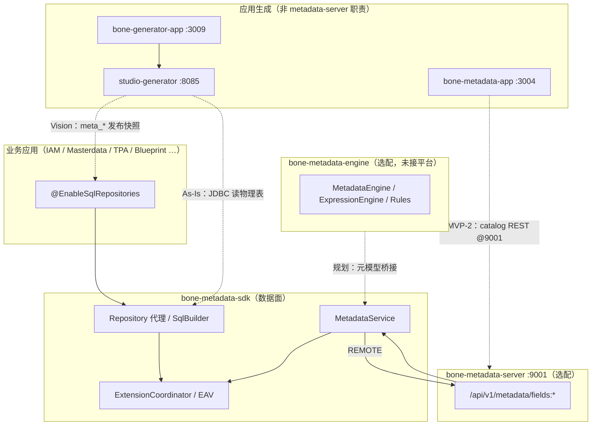

# 元数据能力：三模块定义、协作关系与竞品对照

> **文档性质**：`bone-metadata-sdk` / `bone-metadata-server` / `bone-metadata-engine` 及代码生成的**单一真源**（定义 + As-Is 映射 + 行业对标）。  
> **读者**：产品、架构、研发；修订时请同步 [2. 元数据管理模块详细设计方案](./2.%20元数据管理模块详细设计方案.md)、[主 PRD §4.4](../../prd/BONE产品需求文档正式版.md)、[BONE X Studio](../BONE-X-Studio-详细设计方案.md) 文首对照表。  
> **版本**：2026-05-17 · **修订**：§1.3 双模式交付、§3.3 引擎 vs 生成器、§6 竞品；§1.2 API 路径；catalog As-Is  
> **产品理念**：[README.md](../../../README.md) · 与 [BONE-总体架构](../../architecture/BONE-总体架构设计方案.md) §2.1.1、§3.1 对齐

---

## 1. 产品能力 vs 工程模块（先读此表）

PRD「元数据管理 / 应用生成」是**产品能力包**，不等于某一个 Maven 模块。实现由多模块协作：

| 产品能力（PRD §4.4） | 主要实现 | 状态（As-Is） |
|----------------------|----------|---------------|
| 平台持久化、仓储 CRUD、扩展字段 EAV | **bone-metadata-sdk** | ✅ 已用于 IAM/Masterdata/Blueprint 等 |
| 扩展字段元数据集中 API | **bone-metadata-server** :9001 | ✅ `/api/v1/metadata/fields:*` |
| 规则 / 表达式 / SmartQL / 动态操作 | **bone-metadata-engine** | ⚠️ 库存在，**未**接入平台单体 |
| **业务实体 / 字段 / 关系**（catalog，`meta_*`） | **bone-metadata-server** :9001（catalog 包）+ SDK 持久化 | ✅ REST + `bone-metadata-app` CRUD（MVP-2 基线）；版本历史等仍为 P1 |
| 代码生成与模板 | **studio-generator** | ✅ 支持 **CATALOG_SNAPSHOT**（读已发布 `meta_*`）+ 物理库；Freemarker 路径仍 🔶 |
| 建模控制台 UI | **bone-metadata-app** :3004 | ✅ 实体/字段/关系 CRUD；代码生成/模板仍为占位 |
| 代码生成控制台 UI | **bone-generator-app** :3009 | 🔶 对接 `studio-generator`（数据源/模板/生成历史） |

**结论**：三模块 `bone-metadata-*` 是「元数据能力族」的核心实现，**不**单独等于 PRD 中的完整「元数据管理模块」。

### 1.1 术语：两类「字段」（必读）

| 术语 | 含义 | API / 表 | 勿混淆 |
|------|------|----------|--------|
| **扩展字段（EAV）** | 运行时给业务表**分配物理列**、扩展属性注册 | `POST /api/v1/metadata/fields:allocate` 等；sdk `MetadataService` | ≠ 建模 catalog |
| **建模字段（catalog）** | 应用生成用的实体模型字段定义 | 表 `meta_field`；REST **`/api/v1/metadata/entities/{entityId}/fields`**（嵌套，见 §1.2） | ≠ `fields:search` / `fields:allocate` |

详设 API：**§5.0** = 扩展字段（As-Is）；**§5.1～5.3** = 建模 catalog（**As-Is REST 已落地**；版本历史等为 P1）。对外表述时区分 EAV 与 catalog 路径。

### 1.3 双模式交付（产品定位 · 必读）

智能元数据引擎对外提供 **两种可并存、按场景选型** 的交付路径（业界常称 *Code Generation* vs *Metadata Runtime*，参见 [Ensemble UI 对照文](https://blog.ensembleui.com/low-code-platforms-code-generation-vs-metadata/)）。

| 维度 | **模式 A · 生成式交付** | **模式 B · 运行时元数据面** |
|------|-------------------------|-----------------------------|
| **目标** | 元数据 → **可编译源码** 进 Git，再走 CI/CD | 元数据 → **解释执行** 动态数据访问，标准 CRUD **无需** 为每实体生成 Java Controller |
| **核心模块** | `bone-metadata-sdk` + `bone-metadata-server` + **studio-generator** | `bone-metadata-sdk` + **bone-metadata-engine**（+ server 作 catalog 控制面） |
| **何时优先** | 信创/审计要源码、复杂领域逻辑、ExtPoint 深织入、ArchUnit 门禁 | 运营台、配置型实体、多租户标准对象、快速试错 |
| **业界参照** | OutSystems、JHipster、Salesforce DX | Salesforce 声明式标准对象、Mendix 默认运行时、Directus / Hasura |
| **As-Is** | ✅ 主线（catalog + generator + sdk 已落地） | ⚠️ engine 库存在，动态 CRUD / SmartQL **未**接平台 |
| **演进** | 生成器收窄为「骨架 + 逃逸舱」 | 引擎成熟后 **可替代** 模式 A 中的 **标准 CRUD 生成**；不排斥模式 A 用于合规与深度定制 |

```text
         meta_* / EAV（server + sdk）
                │
    ┌───────────┴───────────┐
    ▼                       ▼
模式 A                  模式 B
studio-generator        bone-metadata-engine
→ *.java / 前端样板      → Dynamic API / SmartQL
→ 编译部署               → sdk Repository 直读写库
```

**原则**：`bone-metadata-sdk` 是两模式的 **公共数据面**；`server` 是 **元模型控制面**；`engine` 与 `generator` **不是二选一的全平台替代品**，而是 **同一元模型上的两种消费方式**。

### 1.2 API 路径约定（避免与 EAV 冲突）

| 能力 | 前缀 / 形态 | 示例 | 说明 |
|------|-------------|------|------|
| 扩展字段 EAV（As-Is） | `/api/v1/metadata` | `POST …/fields:search`、`…/fields:allocate` | **动作式**资源名 + 冒号动作 |
| 建模 catalog（As-Is） | `/api/v1/metadata` | `GET/POST …/entities`、`…/entities/{id}/fields`、`…/relationships` | **REST 资源**；catalog 字段**必须**挂在实体下，禁止与 EAV 共用顶层 `…/fields` |
| 代码生成 | `/api/v1/generate`（或 generator 模块域） | 见 studio-generator 详设 | **非** metadata-server 主责 |

**分页响应**：新 catalog API 目标态使用 `ApiResponse` + `PageResult.records`（[Bone-API-规范](../../architecture/Bone-API-规范.md) §3.3）；与部分存量模块 `list` 字段并存期见 §13.2 迁移行。

---

## 2. 三模块定义（官方表述）

### 2.1 bone-metadata-sdk — 平台数据面（必选）

| 项 | 说明 |
|----|------|
| **定位** | Bone **默认持久化栈**（P0）：`@EnableSqlRepositories`、`Repository` / `FluentQuery` / `Criteria`、SQL 模板、多数据源；扩展字段 **EAV** 与列分配。 |
| **层级** | **平台基础设施**（与 `bone-datasource`、`bone-core` 同级），不是可单独售卖的「第四个引擎」。 |
| **形态** | Maven `jar`，嵌入各业务 Spring Boot 进程。 |
| **MetadataService** | `EMBEDDED`（本进程 + DB）/ `REMOTE`（Feign → server）。 |
| **不负责** | 业务实体 `meta_*` 全套控制台 API；SmartQL/规则运行时；独立 HTTP 服务。 |

文档：[bone-metadata-sdk/README.md](../../../bone-engine/bone-metadata-sdk/README.md)

### 2.2 bone-metadata-server — 扩展字段控制面（选配）

| 项 | 说明 |
|----|------|
| **定位** | 将 SDK 内 **扩展字段元数据**能力以 REST 集中暴露，供多应用 `REMOTE` 模式共享。 |
| **层级** | **控制面 / 部署单元**（薄壳），不是「智能元数据引擎」本体。 |
| **形态** | Spring Boot 可执行 Jar，默认端口 **9001**。 |
| **已实现 API** | `POST/GET /api/v1/metadata/fields:search`、`fields:searchByNames`、`fields:allocate`、`health` |
| **As-Is 不负责** | 代码生成、规则引擎。 |
| **catalog（As-Is）** | 同进程 **catalog** 包：`meta_*` 实体/字段/关系 REST（`/api/v1/metadata/*`，与 EAV 路径分离，见 §1.2）。 |

文档：[bone-metadata-server/README.md](../../../bone-engine/bone-metadata-server/README.md)

### 2.3 bone-metadata-engine — 智能元数据引擎（模式 B · 计算面）

| 项 | 说明 |
|----|------|
| **定位** | **模式 B** 核心：在 **不生成业务 CRUD 源码** 的前提下，按 `meta_*` 提供动态查询/写入、表达式、校验、业务规则、SmartQL 等 **运行时能力**。 |
| **层级** | **产品引擎**（`core` + `starter`，包 `com.bone.metadata.engine`）。 |
| **形态** | 库 + 自动配置；**默认不参与**平台单体启动。 |
| **与 SDK** | 目标态：**engine 编排 → sdk 执行**（`Repository` / `SqlBuilder` / 方言），**禁止**引擎内再实现一套 JDBC。 |
| **与 Generator** | 引擎成熟后，**标准实体 CRUD 不再依赖** studio-generator；生成器保留 DDD 骨架、集成桩、信创导出等 **逃逸舱**。 |
| **不负责** | 替代 `bone-metadata-server` 的 catalog 管理 UI/API；替代 EAV `fields:allocate` 注册（仍走 server/sdk）。 |

文档：[9. SmartMeta 引擎模块技术说明](./9.%20SmartMeta%20引擎模块技术说明.md)

---

## 3. 协作关系

### 3.1 依赖与调用（As-Is）



### 3.2 部署模式

| 模式 | 配置 | 适用 |
|------|------|------|
| **嵌入式** | `metadata.sdk.deploymentMode=EMBEDDED`（默认） | 单应用内扩展字段，直连 MySQL |
| **远程** | `REMOTE` + Feign 指向 server | 多服务共享扩展字段注册表 |
| **引擎增强** | 宿主引入 `bone-metadata-engine-starter` | 规则/表达式/动态页；与生成代码共存 |

### 3.3 模式 A vs 模式 B 能力切分（Bone 混合路线）

| 能力 | 模式 B · engine | 模式 A · generator |
|------|-----------------|-------------------|
| 按 `meta_*` 动态 CRUD / 列表 / 详情 API | ✅ **目标主责** | 🔶 当前由生成 Controller 承担 |
| 字段校验公式、业务规则、SmartQL | ✅ 运行时 | ❌ 不生成规则引擎代码 |
| 扩展字段 EAV 读写 | 🔶 经 sdk；与 catalog 正交 | — |
| DDD 分包、CommandHandler、ArchUnit | ❌ | ✅ 生成或 Blueprint |
| 信创 / 源码审计 / 离线交付 | ❌ 需配套导出策略 | ✅ |
| ExtPoint、复杂集成、长事务 | 🔶 编排 + 插件 | ✅ 骨架 + 手写 |

**演进原则**（对齐 README 与 PRD）：

1. **短期**：模式 A 为平台主线；engine 与 sdk 打通元模型桥接。  
2. **中期**：模式 B 覆盖 **标准 CRUD 与运营类实体**；generator 仅生成 **壳工程 + 非标准域**。  
3. **长期**：同一 `meta_*` 发布包可同时驱动 B（在线 API）与 A（按需导出快照）；企业按合规选型，**不要求全站生成代码**。

**与竞品**：Bone 显式支持 **双模式**——比单一「只生成」（OutSystems）或「只运行时」（部分 aPaaS）更贴近 Salesforce「声明式 + Apex」、Mendix「运行时 + 可选 MxSDK 导出」的分层。

---

## 4. 与 PRD「三大能力 / 四大引擎」映射

| PRD 三大能力 | README 四大引擎 | 工程落点 |
|--------------|-----------------|----------|
| 应用生成 | 智能元数据引擎 | **模式 A**：generator + catalog；**模式 B**：engine 动态面 + sdk |
| （横切） | — | **sdk** 持久化所有平台模块 |
| 企业集成 / 主数据 | 集成 / 主数据 | 各平台服务；持久化仍走 **sdk** |

---

## 5. API 真源（避免混用路径）

### 5.1 已实现（As-Is）— 扩展字段 EAV only

> 路径**无** `/api` 前缀；与 [Bone-API-规范](../../architecture/Bone-API-规范.md) §13.2 过渡登记一致。均为 **§1.1 扩展字段**，非 `meta_field` 建模 CRUD。

| 方法 | 路径 | 模块 |
|------|------|------|
| POST | `/api/v1/metadata/fields:search` | server → sdk |
| POST | `/api/v1/metadata/fields:searchByNames` | 同上 |
| POST | `/api/v1/metadata/fields:allocate` | 同上 |
| GET | `/api/v1/metadata/health` | 同上 |

### 5.2 规划（Vision / MVP-2，详设 §5）— 建模 catalog + 生成

| 前缀 | 示例 | 说明 |
|------|------|------|
| `/api/v1/metadata` | `entities`、`entities/{id}/fields`、`relationships` | 业务实体 catalog；**字段嵌套**于实体，避免与 EAV `fields:*` 冲突 |
| `/api/v1/generate` 等 | 生成任务、模板 | 主责 **studio-generator**；非 server 内嵌 |

OpenAPI 与网关路由以各模块 Controller 及 [Bone-API-规范](../../architecture/Bone-API-规范.md) 为准。

---

## 6. 行业竞品对照（元数据引擎 vs 代码生成）

| 厂商 | 元数据引擎角色 | 是否生成完整应用源码 | 与 Bone 对齐点 |
|------|----------------|----------------------|----------------|
| **Salesforce** | Metadata API + **声明式运行时** | Apex/LWC 手写（**模式 A 补充**） | Bone **模式 B** 对标标准对象运行时；**模式 A** 对标 DX |
| **Microsoft Dataverse** | 表/关系元数据 + 模型驱动 UI | Code Apps 生成 **TS 客户端** | sdk ≈ 数据面；engine ≈ Power Fx |
| **Workday XO** | 全栈元数据运行时 | 否 | 接近 Bone **模式 B** |
| **Coupa** | Custom Fields API | 否 | server EAV 类似 |
| **OutSystems** | 模型 → **生成** C#/JS | **是** | Bone **模式 A** |
| **Mendix** | **默认运行时** | 可选 MxSDK 导出 | Bone **模式 B 为主、A 为逃逸** |
| **Directus / Hasura** | 元数据 → **即时 REST/GraphQL** | 否 | Bone **模式 B** 动态 API 方向 |

参考阅读：

- [Salesforce Metadata API](https://developer.salesforce.com/blogs/2022/03/demystifying-the-salesforce-metadata-api)
- [Dataverse tables and metadata](https://learn.microsoft.com/en-us/power-apps/maker/data-platform/create-edit-metadata)
- [Workday Platform Technology (XO)](https://knowledge.workday.com/en-au-ebook/workday-platform-technology/chapter-2)
- [Coupa Custom Objects API](https://docs.coupa.com/en/developer-documentation/the-coupa-core-api/resources/transactional-resources/custom-object-api-custom_objectsid)
- [Low-code: Code Generation vs Metadata](https://blog.ensembleui.com/low-code-platforms-code-generation-vs-metadata/)

---

## 7. 需求实现状态（META-* 速查）

| 需求 ID | 能力 | SDK | Server | Engine | Generator |
|---------|------|-----|--------|--------|-----------|
| META-001 | 业务实体/字段/关系（catalog） | 持久化 ✅ | REST ✅ | — | — |
| META-001 | 扩展字段 EAV | ✅ | ✅ | — | — |
| META-002 | 代码生成（物理表 / 模板） | — | — | — | 🔶 As-Is |
| META-002 | 代码生成（读 meta_* 快照） | ✅ | — | — | `metadataSource=CATALOG_SNAPSHOT` |
| META-002B | 运行时动态 CRUD（`delivery_mode=RUNTIME`） | ✅ 列 + REST | `JdbcRuntimeRecordService` | ✅ `/api/v1/runtime/**` | `JdbcRuntimeRecordServiceTest` |
| — | 规则/表达式 | — | — | 🔶 | — |

图例：✅ 已用；🔶 部分/规划；— 非主责。

---

## 8. 与 bone-masterdata 的边界

| 维度 | 元数据管理（应用生成 / catalog） | 企业主数据（bone-masterdata） |
|------|----------------------------------|-------------------------------|
| **产品目标** | 建模、发布、生成 DDD 工程 | 主数据实体治理、质量规则、数据记录 |
| **表 / 域** | `meta_*`（init §4） | 主数据域表与 API（如 `MasterDataEntityController`） |
| **As-Is** | `meta_*` 有 DDL；REST/UI 未闭环 | 主数据 CRUD 已部分落地 |
| **PRD 衔接** | META-001 建模；META-001「转主数据」为 **跨模块** 流程 | §4.5 主数据管理 |

**务实口径**：MVP-2 前 catalog REST 未验收时，勿对外宣称「实体管理已上线」；「业务实体 → 主数据实体」需在 **catalog API + bone-masterdata** 间用 ADR 定义同步方式（复制定义、发布事件等），避免 `meta_*` 与 `md_*` 双写无规范。

---

## 10. MVP 分阶段交付（务实口径）

与 [主 PRD §8.1](../../prd/BONE产品需求文档正式版.md#81-分阶段发布里程碑)、[P0 看板](../../wiki/07-P0-TODO看板.md) 一致：

| 阶段 | 范围 | 验收要点 | 状态 |
|------|------|----------|------|
| **MVP-1** | `bone-metadata-sdk` + `bone-metadata-server` **扩展字段 EAV**；IAM；Shell/微应用骨架；Helm | `fields:*` 可调通；平台模块持久化走 SDK | ✅ 扩展字段链路 |
| **MVP-2** | **`meta_*` catalog**：实体/字段/关系 REST + `bone-metadata-app` CRUD；generator **CATALOG_SNAPSHOT** | META-001 + META-002 基线 | ✅ 已完成 |
| **阶段 0+** | 模板管理（META-003）、实体版本历史、generator 读 `meta_*` 发布快照、engine 接平台 | 按 PRD 阶段表 | 规划 |

**产品承诺**：PRD「元数据管理（实体、字段、关系）」为 **P0 产品能力**，不因工程拆分而删除；社区版在 **MVP-2** 交付基础 catalog，商业版叠加模板与高级治理。

---

## 11. 文档维护 checklist

修订三模块代码或 API 时，请检查：

- [ ] 本文 §2 定义、§1.1～§1.2 两类 Field 与 API 路径、§8 masterdata 边界、§10 MVP 是否仍准确  
- [ ] Generator 边注（§3.1）：As-Is 物理表 vs Vision `meta_*`  
- [ ] [2. 元数据管理模块详细设计方案](./2.%20元数据管理模块详细设计方案.md) 文首 As-Is 链接  
- [x] [Bone-API-规范](../../architecture/Bone-API-规范.md) §13.2 `/api/v1/metadata` 迁移（旧 `/v1/metadata` 已移除）  
- [ ] [modules/README](./README.md) 索引表  
- [ ] [主 PRD §4.4](../../prd/BONE产品需求文档正式版.md) 实现映射小节  
- [ ] [bone-engine/README.md](../../../bone-engine/README.md) 模块表  
- [ ] [wiki/03](../../wiki/03-本地开发与构建.md) 端口  
