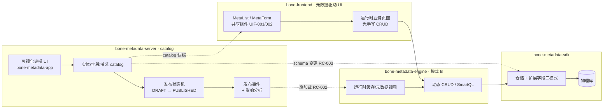
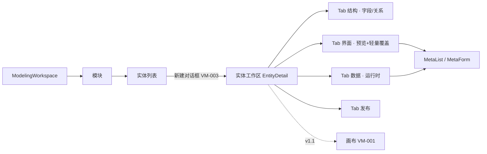

# BONE 低代码最小闭环 PRD：建模即页面 · 发布即生效

> **主题**：模式 B（运行时元数据面）闭环补齐 + 契约补齐 + 可视化建模 + 元数据驱动 UI 渲染（原名《元数据运行时闭环与可视化建模 PRD》，更名见 v0.7 修订）。
> **定位**：本 PRD 为**子需求 / 迭代 PRD**（依据 [`PRD模板.md`](./PRD模板.md) 编制），不替代平台级 [`BONE产品需求文档正式版.md`](./BONE产品需求文档正式版.md)。
> **决策前置**：本迭代**不新增独立"低代码引擎"模块**。结论依据见 §1.1。
> **融合说明（v0.2）**：本文由《BONE-元数据运行时闭环与可视化建模 PRD v0.1》与《低代码能力补齐-模式B运行时与Schema渲染 PRD v0.2》融合而成，取两稿优点；关键调和见 §1.1 与修订记录，原独立文件已归并。

---

## 文档元信息

| 项目 | 内容 |
|------|------|
| 需求名称 | 低代码最小闭环：建模即页面 · 发布即生效 |
| 产品 | BONE 企业级全栈开源快速开发平台 |
| 文档版本 | v0.32 |
| 文档状态 | Draft（待评审） |
| 产品经理 | [TBD: 由需求提出方指定] |
| 技术负责人 | [TBD: 由模块 owner 指定] |
| 关联模块 | `bone-metadata-server`（catalog 控制面，:9001）、`bone-metadata-engine`（模式 B 计算面）、`bone-metadata-sdk`（数据面）、`bone-metadata-app`（前端建模 UI，:3004）、`bone-frontend` 共享层（MetaList/MetaForm）、`studio-generator`（模式 A，仅受接口影响）、`bone-platform/bone-integration`（流程编排，P2） |
| 目标发布 | [TBD: 排期见 §11 与 D4] |

---

## 0. v0.17 优化定案（评审入口 · 先读本节）

> **为什么改**：v0.16 把交互规范、ALM、安全/灾备、测试金字塔等压进「最小闭环」，叙事/原型/MVP 表互相矛盾。本节为**产品决策真源**；后文章节与本节冲突时，**以本节为准**（细节仍可在后文保留为技术方案附录）。

### 0.1 第一验收人与 JTBD（已确认）

| 项 | 定案 |
|----|------|
| **角色覆盖** | **两者都要**：应用开发（少写 CRUD）+ 实施/配置（自助建模上线叙事） |
| **MVP 验收路径** | **以 A 为准**——应用开发人员路径验收（契约完整、MetaList/MetaForm 可复用、业务仓少写/免写 CRUD、复杂逻辑可逃逸模式 A） |
| **B 的定位** | 实施/配置人员**仅作产品叙事与演示脚本配角**——不设独立验收门禁、不承诺公民开发者全自助运营；metadata-app 内建模→发布→试用服务于「开发也能快速跑通」，不单独考核「配置人员 SUS」 |
| **示范实体** | **任意配置型 RUNTIME 实体**（见 §2.5 场景矩阵）。验收任选其一即可（默认推荐「设备巡检」验够用、「补货单」验边界）。**禁止**用订单 / 库存记账等复杂聚合示范模式 B 全量（复杂域走模式 A） |
| **真闭环定义（A 路径）** | 开发者用表单建模（或既有 API）→ 发布 → 热生效 → **UIF-007 壳内入口或 UIF-004 一次声明式挂载**得到可用列表/表单 → filter/sort + 412/校验可用；业务仓 **0～1 次**页面级改动（优先 0）。**闭环步骤与具体业务名无关**——换场景不换产品路径 |

### 0.2 MVP Must / Should / Could（与 §11.1 对齐）

| 级别 | 范围 | 说明 |
|------|------|------|
| **Must（本迭代验收）** | W0→W2：契约+前端接线；**W0-P0 八项断点清障**（§0.6.1C3/§5.2.1，含 `/data` 绑 id、取消列截断、412/If-Match、控件补 DATE/ENUM、默认 RUNTIME、创建后落 Tab、顶栏「打开数据」）；**UID-9 四 Tab（结构｜界面｜数据｜发布）**——**界面 Tab=Must**（Meta* 草稿预览 + 列显隐/显示名/密度轻量覆盖）+ **列投影单一真源**（§0.6.3）；**ENUM 贯通 T1/T2/T3**（§0.6.2，场景串联前置）；UIF-005 MVP；UIF-007 数据 Tab；RC-002/003/007；VM-002=publish-preview；VM-003；**门禁 G31/G32/G33**（§0.6.5） | 画布/Outbox/回滚/拖拽设计器/自定义 render/后端 `ui_config` 表**不进** Must |
| **Should（v1.1）** | VM-001 画布、VM-002 完整发布面板、RC-005 Outbox、RC-006 快照回滚、覆盖配置增强（过滤器布局/自定义 render）、**覆盖配置服务端化（跨用户共享）**、UIF-005 画布双态打磨、UIF-006 权限感知、环境导出/导入 | 闭环验证通过后再投体验与治理 |
| **Could / 附录** | VF-001 流程编排；§10.5 STRIDE、§10.6 DR/HA、§8.4 全量视觉回归工具链——**写入技术方案，不作为本迭代验收门禁** | 防止「清单剧场」稀释交付 |

### 0.3 诚实指标（替换旧口径处见 §1.2 / §9）

| 指标 | 口径 |
|------|------|
| **零编码（MVP · A 路径）** | 验收以开发者视角：业务仓 **0 新增页面源码**（UIF-007）或 **≤1 次**声明式挂载（UIF-004）；不得要求手写整页 Table/Form |
| **交付时长** | **A 路径验收**：建模→发布→开发者可用页（自动入口或一次挂载）≤ **15 分钟**；B 叙事可同演示，不单独立项考核 |
| **热加载** | 嵌入式形态产品目标 **P95 ≤ 5s**；**60s 为 SLO 告警上限**（非「即生效」口号） |
| **可用性** | MVP：5 人 × 3 任务完成率 ≥ 90%；SUS ≥ 80 **后置灰度后** |

### 0.4 文档分层（阅读指引）

| 层 | 内容 | 本文件位置 |
|----|------|-----------|
| **代码级实测修正（先读）** | 三处假设被推翻 + ENUM 三步 + 列投影单一真源 + UID-9 阻塞项 + 菜单/门禁定案 | **§0.6**（优先于前文 As-Is 声明） |
| **串联入口（先读）** | 三块怎么叠、0→1 / 1→n、用例 UC-01～06 | **§2.0、§2.4** |
| **落地融合（实现前读）** | As-Is metadata-app / 菜单如何演进到 UID-9，W0 摩擦点 | **§5.2.1** + 独立细则 `doc/design/ui/元数据工作区前端融合方案.md` |
| 产品决策 | 假设、角色、主路径、In/Out、成功标准 | §0、§1–3、§9、§11–12 |
| 功能需求 | MoSCoW FR | §4（Must 优先；Should 标注 v1.1） |
| UX | 页面/交互；**原型演示实体工作区**（非四步条） | §5（规则 1–31 为实现期检查表，非原型验收全集） |
| 工程附录 | NFR、弹性、威胁、灾备、测试金字塔细节 | §6–8、§10.3–10.6 —— **非 Must 验收门禁** |

### 0.5 交互定案：要不要保留「1→2→3→4」？（v0.19）

| 问题 | 定案 |
|------|------|
| **领域生命周期** | **保留顺序语义**：先有实体 → 再加字段 → RUNTIME 须发布后才有运行时数据 → 再录入。这是状态机事实，不是 UI 样式。 |
| **界面是否做成四步条** | **不保留**。日常主界面**禁止**「①新建→②建模→③发布→④使用」步骤条/进度条（易被当成向导，抬高学习成本、打断连续编辑）。 |
| **业界怎么做** | **NocoBase**：集合页内配置字段，权限用户一点进配置，数据与结构同上下文。**Airtable**：建表后直接在网格加列/录数据。**Salesforce Object Manager**：对象工作区（详情/字段/页面）+ 顶栏动作，非线性步骤。**简道云**：表单设计即模型，发布是工具栏动作。共识=**一个对象一个工作区，下一步靠空态 CTA / 工具栏，不靠步骤编号**。 |
| **BONE UI 形态（UID-9～12 · v0.23）** | **实体工作区单页**，顶栏「保存草稿 / 发布 / 打开数据」+ **未发布脏态**。页内 Tab＝**结构｜界面｜数据｜发布**；界面内 **配置\|预览** + 字段双向高亮（§5.3.0a）。禁止四步条。新建 →「结构」。 |
| **验收演示怎么讲** | 口头可说「结构→界面→发布→数据」；**产品不画步骤编号**。 |

**工作区四象限（通俗）**：

| Tab | 解决什么问题 | 用户一句话 | MVP 内容 |
|-----|-------------|-----------|---------|
| **结构** | 有哪些字段/关系 | 「表长什么样」 | 字段表 + 关系（原字段/关系 Tab 合并；关系可次级） |
| **界面** | 列表/表单长什么样 | 「页面长什么样」 | MetaList/MetaForm **预览** + 列显隐/标签轻量覆盖（UIF-001/002/005 最小）；**不**做拖拽页面设计器 |
| **数据** | 真实业务录入 | 「填数据」 | 运行时 CRUD（UIF-007）；须已发布 |
| **发布** | 让结构+界面生效 | 「上线」 | publish-preview + L1/L2 + 确认 |

> **为何必须有「界面」**：只有「结构/数据」会变成纯元数据后台，丢掉「建模即页面」。业界（NocoBase 区块、简道云表单设计、Retool 组件）均把**呈现面**与模型并列；BONE 用 **catalog 默认渲染 + 轻量覆盖** 达成，不引入第二套页面引擎。

**为什么这样更顺、更好懂、门槛更低**：

1. **四个词对齐心智**：结构 / 界面 / 数据 / 发布——比「字段、关系、MetaList」好懂。  
2. **界面可先看再发**：未发布也可在「界面」Tab 预览草稿渲染（UIF-005 MVP），降低「发完才知道长什么样」的返工。  
3. **数据与界面分离**：「界面」看长什么样；「数据」才写真实记录——避免把预览和生产数据搅在一起。  
4. **发布仍是决策点**：确认后可切「数据」或停留「界面」。  
5. **与代码同构**：结构=EntityDetail；界面=预览挂 Meta*；数据=RuntimeDataManagement；发布=publish-preview。

---

### 0.6 v0.32 代码级实测修正（实现前必读 · 优先于前文所有 As-Is 声明）

> **为什么有这一节**：§1.1.2 之后做了一轮**逐行代码实测**（`bone-metadata-app` 4677 行 + `0024`菜单种子 + `bone-init.sql` +后端 catalog/runtime），发现 §5.2.1 的三处假设**不成立**。本节是**最高优先级修正**，与前文冲突时**以本节为准**。落地细则见 [`doc/design/ui/元数据工作区前端融合方案.md`](../design/ui/元数据工作区前端融合方案.md)。

#### 0.6.1 三处假设推翻（声明 vs 实际）

| # | 前文假设 | 代码实测（真源） | 结论修正 |
|---|---------|----------------|---------|
| **C1** | §5.2.1「界面 Tab = MetaList/MetaForm 预览」、§1.1.2「W1 提取共享层」，隐含**共享层已存在，只是没接线** | **MetaList / MetaForm 全仓零命中**；`@bone/ui` 只导出 tokens/theme/authority；`@bone/shared-components` 是**零消费死包** | **不是接线，是从零新建 + 抽共享层**。W1 工作量被系统性低估，且「界面预览列 ≡ 发布后数据列」需先有**列投影单一真源**（§0.6.3） |
| **C2** | §2.5 场景矩阵以「5 态 ENUM 状态机」为核心验收物；§5.5 控件映射含「枚举 → Select」 | `FIELD_TYPES = [STRING,INTEGER,LONG,DECIMAL,BOOLEAN,DATE,DATETIME,TEXT]`（`packages/shared-types/src/metadata.ts:175`）**无 ENUM/SELECT**；`MetaTemplateApplicationService.java:106` 实例化时显式置`null`；`meta_model_template_field` **无 `enum_values` 列** | **场景串联在第一步就断**：补货 5 态 / 访客枚举 / 巡检结果，**在建模 UI 里根本建不出来**。须新增 **T1（DDL，L3）→ T2 → T3** 三步（§0.6.2） |
| **C3** | §5.2.1 把 `/…/data` 绑定 `:id` 列为「W0a 摩擦点」，与「全新建模落到模块列表」同类 | 列表跳的是 **path id**（`EntityManagement.tsx:461`），页面只读 **`?entity=<code>`**（`RuntimeDataManagement.tsx:88`），`:id` 被完全丢弃 ⇒ 点任意实体「数据」都落到列表第一个 RUNTIME 实体 | **不是体验摩擦，是数据正确性缺陷**（静默展示他人数据、无任何提示）⇒ 提为 **W0-P0 首位**，须有负向断言（造 2 个实体 A/B，点 A 必须断言请求 code 是 A） |

#### 0.6.2 ENUM 贯通三步（场景串联的前置，缺一不可）

| 步 | 内容 | 级别 |
|---|------|------|
| **T1** | `meta_model_template_field` 增 `enum_values JSON` / `validation_rules JSON`（expand，不改`bone-init.sql` 既有行） | **L3 · DDL**，需架构师审批 |
| **T2** | `MetaTemplateApplicationService.instantiate` 透传两列（替换 `:100-107` 两处 `null` 注释） | P0 |
| **T3** | `FIELD_TYPES` 增 `ENUM`；`FieldWizardModal` 增枚举值编辑器；`MetaForm → Select`、`MetaList → Tag`；**未支持类型显式降级提示**（禁静默渲染空） | P0 |

> **判据**：T3 落地后，§2.5 三场景的字段表必须**能在生产建模 UI 里逐字敲出来**；敲不出来就是 T3 未完成，不得以「原型已演示」替代。

#### 0.6.3 列投影单一真源（让「预览 ≡ 数据」结构上成立）

PRD §5.3.0a 要求「界面预览列 ≡ 发布后数据列」。若两边各算一遍必然漂移 ⇒ 抽**纯函数** `projectColumns(fields, overrides, opts)`，三处共用：界面 Tab 预览 / 数据 Tab 列表 / runtime `fields` 请求参数（后端 `RuntimePageQuery` 已有白名单校验）。**比「写测试保证一致」强一个量级**——共用函数使漂移在结构上不可能。

#### 0.6.4 UID-9 壳的实测阻塞项（必须写进 W0b 判据）

| # | 阻塞 | 证据 | 影响 |
|---|------|------|------|
| B1 | **发布按钮仅 `status===0` 可见** | `EntityDetail.tsx:653` | **1→n 在详情页无法完成**：已发布实体加字段后发布按钮消失，UC-02 断路⇒ 顶栏必须**常驻**发布 |
| B2 | `activeTab` 是纯 `useState('fields')`，**不与 URL 同步** | `:132` | 刷新丢上下文、不可深链分享 ⇒ 改 `useSearchParams`（原型深链 `#scene=x&t-<tab>` 同思路） |
| B3 | 「返回实体列表」硬编码 `/entities` | `:594` | 从 scoped 路由进来返回即掉上下文 |
| B4 | metadata-app **无 ErrorBoundary** | 全应用零命中 | 单 Tab 崩 ⇒ 白屏 |

#### 0.6.5 菜单与门禁（跨文件漂移的根因）

| 项 | 实测 | 定案 |
|---|------|------|
| 关系管理菜单 | 路由已 302 到实体列表（`App.tsx:36`）⇒ **点了等于「模型管理」**，信息架构自欺 | **L3 软删**（仿 `0025` 备份 + 软删 + 计数校验 + `SIGNAL` 范式） |
| 模型管理命名 | 与工作区「实体工作区」心智不一致 | 改名**实体** |
| 运行时数据菜单 | 与工作区「数据」Tab 争夺职责，但跨实体批量运营是真实高频 | **保留但降order**，文案声明非主路径 |
| 门禁覆盖 | `check.sh` 30 步**无任何前端路由/菜单一致性校验** | 新增 **G31 路由 id 绑定 / G32 菜单↔路由可达 / G33 列截断禁令**，接为 [31]–[33]；每道须做**变异验证**（改回去必须变红） |

#### 0.6.6 两处建议偏离前文（待拍板）

| # | 偏离 | 理由 |
|---|------|------|
| **P1** | UC-01 从**模板**起盘后落点建议 `?tab=ui`（界面）而非 `?tab=structure`（结构） | 模板已带字段 ⇒ 落结构给用户一个「已完成」的零信息量页面；落界面立刻「见结果」，呼应 §0.5「界面可先看再发，降低返工」。**空白建模仍落结构**（空态有 CTA） |
| **P2** | 工作台首屏：三个 CTA 优先（从场景模板 / 空白建模 / 从已有表导入），4 个统计卡降级为一行小字 | 现状 4 张Stat卡占据首屏，而「全新建模」落到模块列表且硬取 `apps[0]`（`ModelingWorkspace.tsx:106`）。**降低门槛的本质是让「下一步」在第一屏且唯一** |

---

## 修订记录

| 版本 | 日期 | 修订人 | 核心变更 | 状态 |
|------|------|--------|----------|------|
| v0.32 | 2026-10-09 | — | **诊断收尾（可测性/一致性）**：§6 Metrics⑥ 与 §0.3 热加载口径统一（P95≤5s / 60s 告警）；§9.2 补 `ifmatch_missing_count`（D3 宽限期→强制的决策依据）；RC-003 补「字段停用（deprecate）」L2 出口；§2.3 故事 3/RC-002 故事主语与 UIF-006 权限矩阵对齐（草稿提报+审批发布）；§3.4 #4 环境提升补 MVP 临时答案（catalog 快照 JSON 导出/导入）；W1 补 CSV 导出 | Draft |
| v0.32 | 2026-10-09 | — | **代码级实测修正**：新增 §0.6（实现前必读，优先于前文 As-Is 声明）——推翻三处假设：① MetaList/MetaForm **全仓零命中**（非接线，是从零新建）；② `FIELD_TYPES` **无 ENUM** + 模板实例化丢 `enum_values` ⇒ 场景串联在建模层就断（T1/T2/T3）；③ `/…/data` **静默看错实体**（path id vs query code）⇒ 提为 P0 首位。另定案：列投影单一真源 `projectColumns()`、发布按钮常驻（1→n 断路）、Tab 与 URL 同步、菜单关系管理软删、门禁 G31/G32/G33；两处建议偏离（模板落点 `?tab=ui`、工作台 CTA 优先）；落地细则独立成文 `doc/design/ui/元数据工作区前端融合方案.md` | Draft |
| v0.31 | 2026-10-09 | — | **As-Is 融合落地**：新增 §5.2.1（菜单收口、EntityDetail→UID-9、W0 三摩擦点、模板=场景起盘、生产禁演示控件）；阅读指引补「落地融合」；不并行第二套产品 | Draft |
| v0.30 | 2026-10-09 | — | **整体串联（0→1 → 1→n → UC-04）**：闭环清单第 8 步「复用到新场景 · 业务线+1」——闭环完成后「下一步」自动切场景重置 0→1，阶段标签带业务线计数（当前·UC-xx·业务线#N）；§2.4 UC-04 串联动作、§9.1.1 评审路径同步（同一套步骤贯穿业务线 #1→#3） | Draft |
| v0.29 | 2026-10-09 | — | **原型对齐用例**：§2.0.4 控件↔UC 映射；原型顶栏「0→1 走通 / 1→n 演进」+ 阶段条 + 清单标 UC；深链 `#loop`/`#evolve`/`#auto`；§5.8/§9.1.1 同步 v0.29（评审原型可含演示控件，生产 metadata-app 不含） | Draft |
| v0.28 | 2026-10-09 | — | **串联可读**：新增 §2.0「方案怎么串起来」+ §2.4 用例 UC-01～06（0→1 创建 / 1→n 改模型与改界面 / 换场景 / 逃逸对照 / 412）；评审入口先读 §2.0 | Draft |
| v0.27 | 2026-10-09 | — | **场景串联收口**：§2.5.1 状态机补齐 CANCELLED（5 态，与 §2.5.4/blueprint DDL 对齐）；§2.5.1 字段表补 writeOnce 快照字段（available/safety_snapshot，§2.5.5 MVP Must 才可验）；§2.5.4 补实测记录（supplychain-replenishment-demo 低代码路径验证，定位为证据非交付物）；原型补货场景包同步（5 态徽标 + writeOnce 只读呈现 + 修复外部版本 syncGates 缺 `}`） | Draft |
| v0.26 | 2026-10-09 | — | **通用性收口**：§0.1/§2.5 明确 Mode B 能力与业务场景解耦；场景矩阵（巡检 / 补货 / 访客）可切换验收；原型 v0.26「场景包」驱动闭环（换实体不换步骤）；补货为边界样例而非唯一叙事 | Draft |
| v0.25 | 2026-10-09 | — | **场景验证：供应链补货**：新增 §2.5 场景验证（bone-blueprint 补货单实体；§2.5.4-2.5.7 验证矩阵/PRD 启示/设备巡检单对照）；UIF-008 状态机动作（v1.1）；§2.2 补 3 行场景；§3.4 补 #25-26 业界对标；路线图补状态机/跨实体编排；串联旗舰场景（Mode B CRUD 壳 vs Mode A 逃逸）与原型 §9.1.1 脚本对齐 | Draft |
| v0.24 | 2026-10-09 | — | **场景闭环可演示**：原型状态机（草稿锁数据 / 发布解锁 / 加字段同步界面 / 提交真记录 / 412 / 热加载第二发）；右下闭环清单 +「走通闭环」「自动播放」；§9.1.1 演示脚本；深链 `#loop` / `#auto` | Draft |
| v0.23 | 2026-10-09 | — | **业界 UI 标配补齐**：§3.4 #21–24（Configure\|Preview、字段双向高亮、未发布脏态、覆盖一键重置）；UID-10/11/12；界面 Tab 左点右亮 + 跳转结构；控件映射可读；原型 v0.23 | Draft |
| v0.22 | 2026-10-09 | — | **界面 Tab 深化**：§5.3.0a 线框（预览框+覆盖面板+粘性 CTA）；列显隐/显示名/列序可交互；结构→界面即时联动；未支持类型显式降级；UIF-005 BDD 改「界面 Tab」主语；UID-2/W0–W1/路线图拆分「MVP 预览」vs「画布双态」；原型 v0.22 | Draft |
| v0.21 | 2026-10-09 | — | **补回「界面」一等公民**：UID-9 工作区 Tab 定为 **结构｜界面｜数据｜发布**；界面 Tab=列表/表单预览（MetaList/MetaForm）+ 轻量列显隐/标签（覆盖配置最小集）；对齐 NocoBase「模型+界面」与「建模即页面」；UIF-005 MVP 落界面 Tab（无需画布）；原型补界面页 | Draft |
| v0.20 | 2026-10-09 | — | **业界实践深度对标 + 原型重构**：UID-9 实体工作区；Schema diff / 骨架屏 / 内联编辑提示；§5.4 规则 32-35 | Draft |
| v0.19 | 2026-10-09 | — | **交互定案 UID-9**：生命周期「建→模→发→用」保留为**领域顺序**；UI **不做四步条/向导**，改为**实体工作区单页**（字段/发布/数据 Tab + 顶栏发布）；对标 NocoBase 集合页 / Airtable 表工作区；原型改为工作区；学习门槛靠空态单 CTA | Draft |
| v0.18 | 2026-10-09 | — | **前后端二次体检驱动收敛**：新增 §1.1.2（可复用 As-Is + 三波交付）；修正热加载/物理 align/发布预览为更强 As-Is；UIF-007 落点=增强既有 RuntimeDataManagement；Must 波次 0=契约对齐+前端接线；原型补「实现差距 / 打开运行时页」 | Draft |
| v0.17.1 | 2026-10-09 | — | **验收人定案**：两者都要，**以应用开发（A）路径验收**；实施/配置（B）**仅叙事**、不设独立门禁；§0.1/§2.1/指标/UIF-007 故事主语对齐 | Draft |
| v0.17 | 2026-10-09 | — | **方案收敛**：新增 §0 优化定案；验收人=开发者优先；真闭环=自动入口（UIF-007）；MVP 砍掉画布/Outbox/快照回滚；热加载 P95≤5s（60s=SLO）；示范实体改配置型；UID-1 区分「高频禁向导 / 低频开通可短向导」；§10.5/10.6/§8.4 降为附录非门禁；原型改为任务流 | Draft |
| v0.2 | 2026-10-09 | — | **融合两稿优点**：并入契约实查修正（A1 不成立 → 契约先行）、`If-Match`/412 并发语义、向后兼容、测试策略、灰度发布、迭代规划、护栏指标、待决策 D0–D5；渲染协议统一为"**catalog 快照默认渲染 + 覆盖配置增强**"（见 §1.1 调和） | Draft |
| v0.3 | 2026-10-09 | — | **业界对标与 UI 设计决策**：新增 §5.1 业界最佳实践对标（NocoBase / 简道云 / Appsmith / OutSystems），定案 UID-1 向导边界（创建用向导、编辑用画布）、UID-2 双态模式（界面即配置）、UID-3 即时预览；新增需求 UIF-005（配置态/使用态双态 + 实时预览）；§5 子章节顺延重编号 | Draft |
| v0.4 | 2026-10-09 | — | **操作体验专项优化**：§5.4 交互规则新增 Nielsen 对齐六原则（反馈闭环/上下文保持/撤销重做/批量与快捷键/智能默认与渐进披露/错误恢复路径）；§5.7 验收标准补齐操作体验条目；原型全部页签按原则增强（全局快捷键提示、即时反馈、批量操作、撤销重做、智能默认） | Draft |
| v0.4a | 2026-10-09 | — | **业界最佳实践对标（全景）**：新增 §3.4 采纳/后置/不采纳决策表（环境提升、细粒度权限、公式字段、数据导入导出、AI 辅助建模等 11 项）；新增需求 UIF-006 权限感知渲染（实体/操作级，后端强制）及 IAM 依赖与待决策 D6；路线图补环境提升、数据导入导出、AI 辅助建模探索 | Draft |
| v0.5 | 2026-10-09 | — | **UI 设计方法论补强**：§5.1 新增"向导适用判据（决策矩阵）"与 UID-4 编辑器效率交互（拖拽排序/撤销重做/草稿自动暂存）、UID-5 空态即引导；列交互对齐业界表格惯例（UIF-001）；画布工具栏、交互规则、UI 验收同步扩充 | Draft |
| v0.6 | 2026-10-09 | — | **操作流畅性**：§5.1 新增共识 5"操作不断流"与 UID-6 上下文保持（防抖/竞态丢弃/CRUD 后状态保留）、UID-7 乐观反馈与防重（412 例外）、UID-8 长任务后台化；§5.4 补键盘焦点流、离开保护与错误恢复；属性面板渐进披露、大列表虚拟滚动；验收与测试同步 | Draft |
| v0.7 | 2026-10-09 | — | **取消向导式 + 更名**：UID-1 改为"全流程无向导"——创建改用轻量对话框（原 VM-003 向导步骤取消，移入新建实体对话框），存量 TemplateWizard 冻结不再增强；相关页面地图/交互规则/问答同步改写；标题更名《BONE 低代码最小闭环 PRD：建模即页面 · 发布即生效》 | Draft |
| v0.8 | 2026-10-09 | — | **界面去向导感打磨（业界最佳实践）**：创建对话框即点即用（去"模板起点"字段概念 → "从模板创建（可选）"次级入口）；UID-5 改为"空态即动线（单动作 CTA）"、首次发布用内联提示（inline hint）非流程式；用户可见文案不再出现"引导/向导"流程词；原型侧边栏/文案同步 | Draft |
| v0.8a | 2026-10-09 | — | **交互微观细节**：§5.4 新增规则 22–27——拖放微交互与键盘替代、校验时机（失焦/提交）、Toast 分级、确认分级 L0–L3（不可逆输入确认）、刷新不闪白（stale-while-revalidate）与错误边界、空态三分；预览选中联动、表单粘性操作条、创建对话框编码即时校验、日期/数字格式化；验收同步 | Draft |
| v0.9 | 2026-10-09 | — | **交互细节二轮**：§5.4 新增规则 28–31——提示层级（tooltip/popover/行内错误分工）、表格列渲染细节（数字右对齐/状态徽标/截断 tooltip/mono）、动效规范（reduced-motion）、Ctrl+K 命令面板闭环；规则 10 补 aria-live；视觉规范补对比度 AA 与断点策略；验收同步 | Draft |
| v0.10 | 2026-10-09 | — | **功能完整性收尾（原型补齐）**：新增流程编排页（VF-001 配置化展示 + 执行开关 + DSL 摘要）、审计日志页（G6 100% 留痕 + 筛选）、全局命令面板（Ctrl+K，header 按钮 + 键盘监听）、发布页热加载生效链路可视化（发布中 → 生效中 P95≤60s → 已生效）+ 直达运行时入口；CSS 补 reduced-motion / tab 换行；§5.8 页签与截图清单同步 | Draft |
| v0.11 | 2026-10-09 | — | **原型 × 交互规则核对（31 条实查）**：结果 ✅12 / ⚠️13 / ❌6，结论与补齐清单写入 §5.8；❌ 项（aria 无障碍、离开保护、拖放、校验时机、Toast 分级、不闪白/错误边界）中可静态演示的 4 项列入原型补齐 | Draft |
| v0.12 | 2026-10-09 | — | **业界 PRD 标配补齐**：新增 §9.2 数据与埋点（10 个事件支撑北极星/护栏可测）与 §9.3 可用性验收（5 用户 × 3 任务、完成率 ≥90%、SUS ≥80）；UIF-006 补角色 × 操作权限矩阵；§8 补伪本地化检查；新增待决策 D7（前端埋点通道） | Draft |
| v0.13 | 2026-10-09 | — | **流程体检落地 + 业界实践增强**：修复原型 5 处流程断点（创建不跳画布/发布草稿死胡同/侧边栏死按钮/工具栏缺保存发布）；发布面板按 delivery_mode 双模式分叉（§5.3.2）；属性面板覆盖配置入口与空态动线（§5.3.1）；通知中心（规则 24）、命令面板无结果态（规则 31）原型落地；§5.8/§5.8.1 同步 | Draft |
| v0.14 | 2026-10-09 | — | **前后端实现体检（代码级实测）**：新增 §1.1.1 体检清单（后端 8 主题 + 前端 6 主题 + Gap G1~G9 分级）；修正热加载声明（同步 evict 非未闭环）；新增需求 RC-005（发布事件 Outbox）、RC-006（快照与回滚）、RC-007（写路径校验门禁）；UIF-001 补契约客户端与查询能力；§4.4 契约先行增强 | Draft |
| v0.15 | 2026-10-09 | — | **业界最佳实践深度对标 + 错误恢复 + 容量弹性**：§1.1.1 体检深化（补 POST Idempotency-Key、GET/{id} ETag、7 个错误码枚举、前端 `slice(0,8)` 列截断、MetaForm 类型映射不全 5 项证据）；§3.4 新增 #12 错误恢复 Playbook、#13 容量规划与弹性降级；RC-004 契约同步扩展到 7 错误码 + Idempotency-Key + ETag；§6 NFR 新增业务 Metrics 6 指标 + Resilience4j 弹性策略；新增 §10.3 错误恢复 Playbook（8 个 errorCode × 恢复动作）+ §10.4 容量与弹性策略；新增 D8 前端数据层选型；§5.8.1 更新 6 项低成本补齐状态 | Draft |
| v0.16 | 2026-10-09 | — | **业界 PRD 标配全面对标**：§3.4 新增 #14-17（开发者体验/API 文档生成/渐进式发布/数据生命周期）；§6 NFR 新增前端性能预算（Core Web Vitals 三指标+bundle 限制）、i18n 完整方案（locale 检测→fallback→pluralization→日期数字格式化）、a11y WCAG 2.1 AA 合规计划；§8.4 新增前端测试策略（Vitest+Testing Library+Playwright+Storybook 视觉回归）；新增 §10.5 安全威胁建模（STRIDE per component）、§10.6 灾备与高可用（RPO/RTO/多 AZ/failover）；UI 原型补全 MetaForm 字段类型（DATE/SELECT/ENUM）+ i18n 切换演示 + 键盘快捷键帮助面板 | Draft |
| v0.1 | 2026-10-09 | — | 初稿：基于"低代码是否新增大模块"评审结论编制（运行时闭环 + 可视化建模 + UIF） | Draft |

---

## 1. 背景与目标

### 1.1 问题陈述

**一句话**：BONE 离"低代码体验"只差"运行时闭环 + 建模/渲染 UI 打磨"两步，而不是一个新模块。

**现状盘点（As-Is，全部可取证）**：

| 能力 | 现状 | 证据 |
|------|------|------|
| catalog 建模（实体/字段/关系） | ✅ As-Is | `bone-metadata-server` catalog API；`MetaEntity` 已有 `DRAFT / PUBLISHED` 状态机与发布后变更保护 |
| 模式 A · 生成式交付 | ✅ As-Is | `studio-generator`（:8086） |
| 模式 B · 运行时动态 CRUD | 🟡 MVP As-Is | `JdbcRuntimeRecordService` + `/api/v1/runtime/entities/{code}/records`（P0 看板 META-002B-01~05 全 done） |
| 运行时查询/写契约 | 🟡 契约缺口 | 实查 `metadata-runtime-v1.yaml`：GET 仅 `page`/`size`（无 filter/sort/fields）、PUT 无 `If-Match`、错误为 `RuntimeErrorEnvelope`、分页为 `list` 字段（2026-10-09 实查，详见 §4.3 RC-004 与 A1） |
| 模型发布 → 运行时生效（热加载） | 🟡 同步 evict | 实测发布动作**同步**调用缓存驱逐（`MetaEntityApplicationService:174-192`）；事件化 + 可靠投递待补（G3，§1.1.1） |
| 低停机 schema 变更 | ❌ Gap | 仅发布保护，无变更分级与在线生效策略 |
| 可视化建模 UI | 🟡 表单级 As-Is | `bone-metadata-app` 已有 deliveryMode 建模表单（META-002B-04），非可视化画布 |
| 可视化流程编排 | 🟡 编译器 As-Is | 集成引擎 Camel 编译器已交付（INT-11），默认执行仍为线性（INT-09） |
| 元数据驱动 UI（表单/列表自动生成） | ❌ Gap | 前端无 schema 渲染组件；`bone-commerce-app` 业务页面（OrderManagement 等）均为手写 antd Form/Table |

**根因**：模式 B MVP 只是"能跑"，未形成"建模 → 发布 → 运行时生效 → 变更治理 → 前端渲染"的**完整生命周期闭环**。此时若投入拖拽表单/页面设计器等无代码范式，属于在未闭环的底座上盖楼——与 BONE"元数据先行、复杂逻辑保留显式代码"的设计原则相悖。

**为什么是这个时间点**：双模式交付是已写入主 PRD 的定位（§4.4），模式 A 主线 ✅、模式 B 数据面 MVP ✅；补齐闭环与渲染层是既有路线的收口，而非新方向立项。**明确不新增第四个引擎或独立"低代码模块"**——engine 与 generator 是同一元模型上的两种消费方式。

**两稿关键调和（v0.2 融合决策）**：

1. **渲染协议统一**：前端渲染以**已发布 catalog 快照为默认协议**（UIF 主路径，零新增存储）；原独立"UI Schema 存储"方案降级为**覆盖配置增强**（列显式覆盖、过滤器布局等），且优先轻量承载避免新 DDL（见 D2）。理由：catalog 元数据（`MetaField` 的 type/required/unique/枚举）足以驱动标准列表与表单，独立 Schema 层会引入第二套数据模型与 DDL 审批成本。
2. **契约先行**：详设 ⏳ 图例称"契约已声明"，实查 OpenAPI 并未定义 filter/sort/fields/If-Match（A1 不成立）——本迭代先补 `metadata-runtime-v1.yaml` 评审，再实现（RC-004）。
3. **并发与错误结构沿存量**：写路径并发控制采用 `If-Match`（宽限期见 D3）；错误沿用 runtime 既有 `RuntimeErrorEnvelope`（`META_` 前缀），与平台 `ProblemDetail` 的对齐时机见 D5，本版不改存量。

**不做低代码大模块的代价**：无（当前无真实低代码用户场景）；**不补运行时闭环的代价**：模式 B 永远停留在"演示可用"，元数据驱动价值无法兑现，双模式战略失衡。

### 1.1.1 实现体检（2026-10-09 代码级实测，区别于 §1.1 声明盘点）

**后端实测（`bone-engine/bone-metadata-server` + `bone-engine/bone-metadata-engine`）**：

| 主题 | 实测现状 | 证据 |
|---|---|---|
| catalog API | 分层完整（Controller→Application→Domain→Infra）；实体/字段/关系 CRUD + `publish`/`validate`/`publish-preview`/`copy`/`batch-publish` | `MetaEntityCatalogController.java:38` `/api/v1/metadata/entities` |
| 状态机 | `DRAFT(0) / PUBLISHED(1) / ARCHIVED(2)`；发布走乐观锁 + `entity.publish()` 域逻辑 + 发布后变更保护 | `MetaEntityStatus.java`；`MetaEntityApplicationService.java:174-192` |
| 发布动作 | **同步调用** `runtimeEntityCacheEvictor.evict(...)`（非事件驱动）；发 `MetaEntityPublishedEvent` 但**无订阅方**（事件总线注释"当前无订阅方属预期"） | `SpringDomainEventPublisher.java`；`CaffeineCachedRuntimeEntityCatalog`（expireAfterWrite:20）/ `RedisCachedRuntimeEntityCatalog` |
| 运行时 CRUD | GET 已支持 `fields`/`sort`/`q`（`RuntimePageQuery.parse` + 列白名单）；PUT `If-Match` 乐观锁(:177-219)；POST `Idempotency-Key`；GET `/{id}` 返回 `ETag`；DELETE 软删（deleted 列） | `RuntimeRecordController.java:58-149`（page/GET/POST/PUT/DELETE 五端点）；`JdbcRuntimeRecordService.java:40-260`（engine-runtime） |
| 契约 | `metadata-runtime-v1.yaml`（231 行）**落后于实现**：①GET 仅声明 `page`/`size`，实现支持 `fields`/`sort`/`q`；②PUT 无 `If-Match` 头声明；③POST 无 `Idempotency-Key` 头声明；④GET `/{id}` 无 `ETag` 响应头声明；⑤`RuntimeErrorEnvelope` 仅声明 3 个 errorCode（`ENTITY_NOT_FOUND`/`RECORD_NOT_FOUND`/`INVALID_IDENTIFIER`），实现有 **7 个**（另含 `INVALID_QUERY`/`VALIDATION_FAILED`/`DUPLICATE`/`PRECONDITION_FAILED`） | `metadata-runtime-v1.yaml:29-36/102-128/208-230`；`MetadataErrorCodes.java:24-44`（7 个常量）；`GlobalExceptionHandler.java:71-90`（码→状态映射 400/404/412/409） |
| 校验 | 写路径仅 required/type/unique **轻校验**；engine 规则引擎（`ValidationEngine`/`BusinessRuleRegistry`/`ExpressionEngine`）**存在但未接入写路径**（`RuleEngineAutoConfiguration` 注释自证仅解决构造器问题） | `JdbcRuntimeRecordService.java:266-305`（validateForCreate/Update） |
| 快照/回滚 | **无版本快照、无回滚实现类**；仅有 `PhysicalTableSnapshot`（表结构，非版本快照）与乐观锁版本号 | `version/DefaultMetadataVersionController.java`（AtomicLong 简单实现） |
| 审计 | `DefaultAuditService`（异步 executor）存在但**未接入 metadata-server 写路径**；运行时仅 `stampAuditColumns`(:415) 写 created_by/updated_by | `security/DefaultAuditService.java`（engine-runtime） |
| 架构门禁 | ArchUnit 门禁存在 **freeze 例外**（Controller 直注 `JdbcRuntimeRecordService` 被登记为冻结项） | `ArchitectureTest.java`（@ArchTest + FreezingArchRule） |

**前端实测（`bone-frontend/apps/bone-metadata-app`）**：

| 主题 | 实测现状 | 证据 |
|---|---|---|
| 路由 | 与 §5.2 页面地图一致：`/apps`、`/template-wizard`、`/apps/:appId/modules`、`/entities`、EntityDetail、RuntimeDataManagement | `App.tsx:26-41`（HashRouter） |
| EntityDetail | 字段网格**行内编辑（Airtable 式）**、关系 Tab、校验问题面板（F7）、脏状态守卫（F5）、字段向导（F10 两步）、已发布受限编辑引导（UC-W6）、发布摘要预览（UC-W7）——均表格/表单式，**无可视化画布** | `pages/EntityDetail.tsx`（F10b 行内编辑/UC-W6/UC-W7） |
| 运行时页 | 仅 `page/size` 分页（`runtimeRecordApi.page`）；**filter/sort/fields 未接**——后端已实现但前端未消费；**列表列硬截断 `writableFields.slice(0, 8)`**（前 8 列），超 8 列无"更多列"入口；**412 乐观锁冲突无重试**——`message.error(errorMessage(res))` 后仅关闭表单 | `pages/RuntimeDataManagement.tsx:119/181-201/205`；`metadataApi.ts:31-39` |
| MetaForm 字段映射 | **仅 4 类映射**：BOOLEAN→`Switch`、INTEGER/LONG→`InputNumber`、DECIMAL→`InputNumber(step=0.01)`、TEXT→`TextArea`；**缺 DATE/DATETIME→DatePicker、SELECT/ENUM→Select、REFERENCE→关联选择器**；无跨字段联动；校验仅 `field.required ? [{required:true}] : []`，未消费元数据 `length`/`pattern`/`min`/`max` 等约束 | `pages/RuntimeDataManagement.tsx:247-305`（`renderFieldInput`） |
| 业务应用 | `bone-commerce-app` 的 Order/Channel/**ReplenishmentManagement** 等为**手写 antd Form+Table**（每实体一套样板）；补货页为供应链场景 As-Is 对照，**非**本迭代低代码目标交付物 | `pages/OrderManagement.tsx`；`pages/ReplenishmentManagement.tsx`（手写 CRUD 壳） |
| Schema 渲染 | **无 MetaForm/MetaList 共享组件**（全仓库 grep 零命中） | — |
| 基建 | antd 5.27.6；统一请求封装 `@bone/shared-services` createApiClient；i18n（BONE_LOCALE_CHANGE 事件）已具备；**但 `AppAntdProvider` 硬编码 `zhCN`，无 i18next 动态语言包**；**无 React Query/SWR**（`useState` + `useEffect` 手动管理）；**无 ErrorBoundary**；**无虚拟滚动** | `package.json`；`AppAntdProvider.tsx:5-64`（zhCN 硬编码） |

**Gap 分级（P0=阻塞闭环 / P1=能力缺失 / P2=治理欠账）**：

| # | Gap | 级别 | 业界最佳实践对照 | 落点 |
|---|---|---|---|---|
| G1 | 契约落后于实现（filter/sort/If-Match/幂等键/错误信封未入 OpenAPI） | P0 | **契约即真源**：OpenAPI 先行 + 契约测试门禁（生成式 spec + consumer contract tests） | RC-004 增强 |
| G2 | engine 规则引擎未接入运行时写路径（仅轻校验） | P0 | **写路径统一校验门禁（Validation Pipeline）**：字段约束 + 业务规则同一入口、错误信封化 | 新增 RC-007 |
| G3 | 发布为同步 evict、非事件驱动，`MetaEntityPublishedEvent` 无订阅方 | P2（MVP）/ P1（多实例） | 嵌入式 MVP：**同步实体级 evict + 指标**即可；Outbox → v1.1（RC-005） | RC-002 Must；RC-005 Should |
| G4 | 无版本快照与回滚实现 | P2（MVP）/ P1（v1.1） | MVP 用开关回退 + 再发布；快照回滚 → v1.1（RC-006） | RC-006 Should |
| G5 | 审计未接入写路径 | P2 | 审计为横切关注点：写路径统一 append-only 埋点 | G6 需求强化 |
| G6 | 架构门禁 freeze 违规（Controller 直注 Service） | P2 | **门禁不 freeze**：修复违规而非冻结（BONE 样板 0 违规原则） | 架构治理 |
| G7 | 前端未消费 filter/sort/fields（契约能力悬空） | P1 | **契约客户端**：OpenAPI 生成 TS client + 查询状态（react-query/swr） | UIF-001 增强 |
| G8 | 无 Schema 渲染组件（手写 CRUD 样板） | P1 | **Schema 驱动渲染**：MetaForm/MetaList 共享组件 | UIF-001/002（已规划） |
| G9 | 无可视化画布（表格编辑已具备） | P1 | 画布=设计时可视化 + 表格=效率编辑并存（Mendix/OutSystems） | VM-001（已规划） |

**体检结论**：PRD 声明的"模式 B 闭环"在代码层面为**"CRUD 能力已具备但闭环治理缺三环"**——契约（G1）、校验（G2）、事件/快照/审计治理（G3~G5）；前端为**"编辑能力已强但渲染/查询能力未释放"**（G7~G9）。业界实践落地优先级：**G1/G2（P0，阻塞契约先行与写安全）→ G3/G4/G7（P1，治理与体验）→ G5/G6/G8/G9（P2，随迭代收敛）**。

### 1.1.2 二次体检增量（2026-10-09 · 对照代码真源，驱动 v0.18）

> 目的：在 §1.1.1 之上标清**「已具备可复用」vs「仅差接线」vs「真缺口」**，避免重复造轮子；对齐业界「先释放已有能力 → 再补治理」节奏（Stripe API 契约先行、Retool/Appsmith「资源已接即可见」、NocoBase 集合即数据页）。

#### A. 后端：比 v0.17 声明更强的 As-Is（应优先复用）

| 能力 | 实测结论 | 证据 | 对方案含义 |
|------|---------|------|-----------|
| 发布热失效 | 发布事务内 **同步** `runtimeEntityCacheEvictor.evict(code, tenantId)` + Caffeine/Redis 实体级缓存 | `MetaEntityApplicationService.publishEntity:182-183`；`CaffeineCachedRuntimeEntityCatalog.evict` | **单节点嵌入式下热加载已接近即时**；P95≤5s 现实可达；RC-005 Outbox 仅多实例刚需 |
| RUNTIME 物理对齐 | 发布时 `allocateReservedColumns` + `validatePhysicalStructureForPublish` + `physicalStructureGateway.align` | `publishEntity:184-190`；`JdbcPhysicalStructureGatewayAdapter` | RC-003 **L1 加列部分 As-Is**；PRD 应写「固化契约 + L2 策略」，勿从零做迁移引擎 |
| 发布治理 API | `validate` / `publish-preview` / `copy` / `import-from-table` / `batch-publish` + 发布 `If-Match` + `Idempotency-Key` | `MetaEntityCatalogController:85-167` | VM-002 MVP = **接线既有 publish-preview**，不新建影响分析服务 |
| 运行时查询/写 | `fields`/`sort`/`q`、If-Match→412、Idempotency-Key、ETag、软删、租户谓词、系统列过滤 | `RuntimeRecordController` + `JdbcRuntimeRecordService` | **后端能力超前于 OpenAPI 与前端**——波次 0 只补契约与消费方 |
| 统一响应 | Controller 返回 **`ApiResponse`/`PageResult`**（非独立 RuntimeErrorEnvelope 路径） | `RuntimeRecordController`；前端 `errorMessage` 读 `data.errorCode` | D5/RC-004：契约文档须与 **ApiResponse + errorCode** 真源对齐，避免双信封叙述 |
| 规则引擎 | `ValidationEngine`/`RuleEngine` 在 engine 存在；**runtime 写路径未调用** | `JdbcRuntimeRecordService.validate*` 仅轻校验 | RC-007 仍 Must，但是「接线」不是「新建引擎」 |

#### B. 前端：闭环最短路径已半成形

| 能力 | 实测结论 | 证据 | 对方案含义 |
|------|---------|------|-----------|
| 运行时页路由 | 已有 `/runtime`、`/entities/:id/data`、`?entity=` 深链选中 | `App.tsx:31-40`；`RuntimeDataManagement` searchParams | **UIF-007 MVP = 增强本页 + EntityDetail CTA**，勿新建微应用 |
| 客户端缺口 | `runtimeRecordApi.page` **只传 page/size**；无 If-Match/Idempotency；`publish()` 无版本头 | `metadataApi.ts:97-98/182-210` | 波次 0：客户端对齐后端契约（开发者验收核心） |
| 列表/表单缺口 | `slice(0,8)`；控件缺 DATE/ENUM/FK；无列选择器 | `RuntimeDataManagement.tsx:205/247-297` | 波次 0～1：本页先补齐，再抽 `MetaList`/`MetaForm` 共享层 |
| 建模 As-Is | EntityDetail 行内编辑 + PublishPreviewModal + ImportTableModal + FieldWizard | 组件目录实测 | MVP **禁止**以画布替换；验收走表单路径 |
| 共享组件 | 全仓无 MetaList/MetaForm | grep 零命中 | UIF-003 可「先页内实现 → 再提取 shared」降低风险（业界 strangler） |

#### C. 业界对照下的交付波次（写入执行计划，替代「一次做完 MVP 清单」）

| 波次 | 目标（验收路径 A） | 范围 | 退出标准 |
|------|-------------------|------|---------|
| **W0 · 契约与接线（P0）** | 开发者可按文档调用完整 runtime API；运行时页消费 filter/sort/fields + If-Match；**工作区露出界面 Tab 骨架**；**W0a 摩擦清障**（§5.2.1） | 补 `metadata-runtime-v1.yaml`；`runtimeRecordApi`/`publish` 头参数；Runtime 页查询条+列全量/可配置；DATE/ENUM 控件；去掉硬截断 8；**新建默认 RUNTIME + 创建后进结构 Tab**；**`/…/data` 绑定 `:id`**；EntityDetail「打开运行时页」；**Tabs=结构｜界面｜数据｜发布**（界面可先只读预览） | 契约测试绿；从工作台可 0→1 点进结构；演示：增字段→界面预览→发布→本实体数据 CRUD；412 可「重新加载」 |
| **W1 · 组件化与自动入口（P0）** | 少写 CRUD：共享组件 + 正式入口；界面 Tab 与数据 Tab 同源 | 提取 `MetaList`/`MetaForm`；界面/数据同源挂载；覆盖最小集；**UID-10 配置\|预览、UID-11 双向高亮、UID-12 脏态、恢复默认**；UIF-004 示例（可选） | G3 + 界面预览≡发布后；配置/预览双模可演示 |
| **W2 · 写安全与治理最小集（P0/P1）** | 非法数据不入库；发布可预览 | RC-007 接线 ValidationEngine；发布面板展示既有 publish-preview；审计接入写路径（可薄）；热加载时延指标 | 非法写入返回 META_ 码；预览与发布一致 |
| **W3 · v1.1** | 画布、Outbox、快照回滚、权限裁剪 UI | 见 §0.2 Should | 不阻塞 W0–W2 完成判定 |

> **反模式（本次明确禁止）**：在 W0 完成前投入画布/流程编排/视觉回归全套/DR 演练——与「开发者少写 CRUD」验收无关。

### 1.2 目标与成功标准

> 口径以 **§0.3** 为准。下表为可验收指标；G6 完整回滚属 Should（v1.1）。

| 目标 | 可验证指标 | 优先级 |
|------|------------|--------|
| G1 · 运行时闭环：元数据变更到运行时 API 生效全自动 | 嵌入式形态热加载 **P95 ≤ 5s**（告警上限 60s）；无需重启；L2 破坏性变更有明确拒绝/窗口提示（RC-003）。**端到端口径**：catalog 接口返回实体 `version/updatedAt`，前端进入数据/界面 Tab 时与本地快照比对，不同则重拉——「发布 → 前端列表出现新字段」≤5s | P0 |
| G2 · 契约补齐：查询/写并发契约完整可测 | `delivery_mode=RUNTIME` 实体支持过滤/排序/列裁剪/分页与 `If-Match` 写协商（412），全部通过 `metadata-runtime-v1.yaml` 契约测试；**契约先行** | P0 |
| G3 · 建模即页面：开发者少写 CRUD | **验收路径 A**：结构建模→**界面 Tab 预览**→发布→UIF-007 / UIF-004 → MetaList/MetaForm 可用，业务仓免手写整页 CRUD，≤ 15 分钟；实施同学同演示仅叙事 | P0 |
| G4 · 校验一致：前后端校验同源、错误可 i18n | 写路径校验门禁（RC-007）+ 前端 errorCode → zh-CN/en-US | P0 |
| G5 · 工程纪律：不新增独立低代码模块 | 0 新增顶层 Maven 模块 / 0 新增微应用；ArchUnit 0 新增违规 | P0 |
| G6 · 变更治理（MVP 最小集） | 发布 100% 审计留痕；L1/L2 影响提示；**不可变快照一键回滚 → v1.1（RC-006）** | P1（MVP 最小）/ Should（完整） |
| G7 · 零回归 | 模式 A 与已有 CRUD v1 调用方无破坏性变更 | P0 |

> **北极星**：RUNTIME 配置型实体从「已建模」到「壳内可用页」的交付时长（自动入口，非手写挂载）。
>
> **反向指标（Guardrail）**：模式 A 使用量不下降；runtime 查询错误率与 P99 不劣于基线——劣化即暂停灰度。

### 1.3 与平台能力的关系

| 关联 | 说明 |
|------|------|
| 平台 PRD 章节 | 正式版 §4.4 元数据管理（双模式交付）；§4.7 集成管理（流程编排，P2） |
| 产品定位 | `doc/glossary.md`：元数据/建模为**核心域**，勿称"低代码引擎"替代本词 |
| 双模式定位（单一真源） | [元数据能力-实现映射与竞品对照 §1.3](../design/modules/元数据能力-实现映射与竞品对照.md)：模式 B = engine + `/api/v1/runtime/**`，与 generator 并存不替代 |
| 架构约束 | [Bone-DDD-最终实践方案](../architecture/Bone-DDD-最终实践方案.md)（HC 门禁）、[BONE-总体架构设计方案](../architecture/BONE-总体架构设计方案.md)、[Bone-API-规范](../architecture/Bone-API-规范.md)；Clean Core 映射：低代码能力属扩展层，核心元模型稳定封箱 |
| 模块详设 | [元数据能力-实现映射与竞品对照](../design/modules/元数据能力-实现映射与竞品对照.md)；[2. 元数据管理模块详细设计方案](../design/modules/2.%20元数据管理模块详细设计方案.md) §0.1/§2.4/§5.3.1；[9. SmartMeta 引擎模块技术说明](../design/modules/9.%20SmartMeta%20引擎模块技术说明.md) |
| 看板基线 | [P0-TODO看板](../wiki/07-P0-TODO看板.md)：META-002B-01~05（done）、INT-11（done）、EXT-PH3-01（open，与本迭代无依赖） |
| DDL 真源 | `bone-init.sql` §4 `meta_*` 五表；所有环境 `ddl-auto=validate`；新增 DDL 属 L3 架构师审批 |

---

## 2. 用户与场景

### 2.0 方案怎么串起来（先读 · v0.28）

> **一句话**：blueprint 证明「业务真实」；Mode B 证明「CRUD 壳可配置、可复用」；场景包证明「换业务名不换路径」。三者叠在同一条验收绳上，不是三套产品。

#### 2.0.1 三块东西各干什么

| 块 | 仓库位置 | 角色 | 本迭代是否改它 |
|----|----------|------|----------------|
| **A · 样板业务语义** | `bone-blueprint` 补货聚合/API；`commerce` 手写补货页（若有） | 证明供应链「低于安全库存→开单→审批→入库」说得通 | **手写页不改**；只作对照 |
| **B · 低代码平台能力** | `bone-metadata-app` + runtime API + MetaList/MetaForm（本 PRD） | 任意配置型实体：建模→界面→发布→数据→热加载 | **本迭代交付主体** |
| **C · 评审原型** | `doc/design/ui/bone-metadata-ui-prototype.html` | 用巡检/补货/访客三套「场景包」预演 B；步骤固定 | 只改文档/原型，不写生产代码 |

```
                    ┌─────────────────────────────────────┐
                    │  Mode B 通用路径（与业务名无关）        │
                    │  结构 → 界面 → 发布 → 数据 → 热加载   │
                    └──────────────┬──────────────────────┘
           ┌───────────────────────┼───────────────────────┐
           ▼                       ▼                       ▼
     场景包·巡检              场景包·补货               场景包·访客
     （验够用）               （验边界+逃逸话术）         （验换皮通用）
           │                       │
           │                       └──对照──► blueprint 手写补货
           │                                   （复杂规则仍逃逸）
           └──────────────► 正式验收任选其一走通 UC-01～03 即可
```

#### 2.0.2 两条生命周期：0→1 与 1→n

| 阶段 | 含义 | 谁做 | 系统状态变化 | 对应用例 |
|------|------|------|--------------|----------|
| **0→1** | 从「没有这个业务对象」到「有可用列表/表单」 | 开发者（验收路径 A） | 无实体 → 草稿 → 已发布 → 可写运行时数据 | **UC-01** |
| **1→n** | 已上线后继续演进（加字段、改显示、再发布） | 开发者 / 配置叙事 | 已发布 + 脏态 → 再发布 → 热加载出新列/新控件 | **UC-02 / UC-03** |
| **换皮** | 换一个垂直业务，重复同一路径 | 评审演示 | 仅字段数据变，产品步骤不变 | **UC-04** |
| **逃逸** | Mode B 做不了的复杂规则 | 开发者写显式代码 | 不进本迭代 Must | **UC-05** |

**0→1 时序（产品路径）**：

```
新建 RUNTIME 实体（对话框）
    → 结构 Tab：加字段（草稿，数据 Tab 锁定）
    → 界面 Tab：预览自动生成列表/表单（可改列显隐）
    → 发布：确认 L1/L2 → 热加载 ≤5s
    → 数据 Tab：新建第一条业务记录（filter / 412 可演）
结果：业务仓 0 新增页面源码（UIF-007）
```

**1→n 时序（持续演进）**：

```
已发布实体仍在线上
    → 结构：再加可空字段（或界面：改显示名/显隐）→ 出现「未发布脏态」
    → 发布（第二次）→ 热加载
    → 数据/列表：新列出现；旧记录该列为空或默认
结果：无需改业务仓、无需重启
```

#### 2.0.3 和「补货」怎么连（避免误解）

1. **补货不是平台本身**——它是场景包之一，用来讲边界（状态 ENUM、入库逃逸）。  
2. **巡检/访客同样走 UC-01～03**——证明通用。  
3. **今日 commerce 手写补货页** = As-Is 对照（「没有 Mode B 时多写了整页」）；目标态用 Meta* 替换 CRUD 壳，**本迭代不要求改造该手写页**。  
4. **入库改库存 / 建议补货算法** = UC-05 逃逸，永远不要说成「低代码自动完成」。

> 评审建议阅读顺序：§2.0（本页）→ §2.4 用例表 → 打开原型按 §2.0.4 点控件 → 侧栏换场景包重复一遍。

#### 2.0.4 原型怎么点（控件 ↔ 用例）

| 你在原型里点什么 | 对应用例 | 阶段 |
|------------------|----------|------|
| 顶栏 **「▶ 0→1 走通」** / `#loop` | UC-01 | 0→1 |
| 右下清单「下一步」依次点完 1～5 | UC-01 | 0→1 |
| 清单第 6 步 / 「+ 添加字段」→ 再发布 | UC-02 | 1→n |
| 界面 Tab 改列显隐/显示名 → 去发布 | UC-03 | 1→n |
| 侧栏换 巡检 / 补货 / 访客 | UC-04 | 换皮 |
| 补货场景「Mode B 边界」卡片 + 口述 | UC-05 | 边界 |
| 数据 Tab「演示 412」 | UC-06 | 横切 |
| 顶栏 **「切换到 1→n」**（已发布态下加字段） | UC-02 快捷入口 | 1→n |

**评审默认路径（5 分钟）**：0→1 走通（巡检）→ 切 1→n 加字段再发 → 闭环完成后点「下一步」/ 清单第 8 步：自动串联切到补货（业务线#2）看边界 → 再串联切访客（业务线#3）证换皮。


### 2.1 用户角色

| 角色 | 定义 | 关注点 | MVP 优先级 |
|------|------|--------|-----------|
| **应用开发人员（MVP 验收路径 A）** | 使用 BONE 交付业务应用的开发者 | 少写 CRUD、契约稳定、复杂逻辑可逃逸（生成式模式 A） | **P0 · 唯一验收门禁角色** |
| 实施/配置人员（叙事 B） | 可协助建模/发布的实施同学 | 表单建模、发布、壳内试用——**出现在故事与演示中，不单独验收** | 叙事 / 演示配角 |
| 业务/运营人员 | 使用已发布配置型实体的后台用户 | 列表/表单好用、校验清晰；**MVP 不承诺自助改模型** | P1（使用态） |
| 平台管理员 | catalog 发布与生产稳定性 | 审计、L2 管控；完整回滚 v1.1 | P1 |
| 集成工程师 | 编排/调用 runtime API | 契约与错误码（VF-001 后置） | P2 |
| 前端团队 | 共享组件维护 | MetaList/MetaForm 一套复用 | P0（实现方） |

### 2.2 典型使用场景

| 场景 | 用户操作 | 系统行为 | 结果 |
|------|---------|---------|------|
| 供应链补货单上线（旗舰 · §2.5） | 建模 `ReplenishmentOrder` → 界面预览 → 发布 → 数据 Tab 开单/改状态枚举 | Meta* 自动列表/表单；热加载加「预计到货日」 | 业务仓 **0** 手写 CRUD 页（对照今日手写 `ReplenishmentManagement`） |
| 配置型实体快速上线 | 在 `bone-metadata-app` 表单建模 → 发布 RUNTIME → **点「打开运行时页」自动入口** | engine 动态 CRUD；MetaList/MetaForm 按快照渲染；**无需改业务仓库** | 壳内可用页（UIF-007） |
| 列表精准查询 | 设置过滤/排序/列（如按 `status`/`warehouse_code`） | runtime 解析 filter/sort/fields | 裁剪后分页数据 |
| 发布即生效 | 发布新增可空字段（如 `expected_arrival_date`） | 实体级缓存失效（RC-002） | **P95 ≤ 5s** 出现新字段（告警上限 60s） |
| 并发编辑保护 | 后提交者带过期 If-Match | 412 + 非破坏提示 | 无静默覆盖 |
| 破坏性变更治理 | 删除被约束引用的字段 | L2 提示/拒绝或迁移窗口 | 可审计 |
| 校验失败反馈 | 提交非法数据（如 quantity≤0） | `META_` 错误码 | 前端 i18n |
| 复杂规则逃逸（叙事） | 建议补货算法 / 入库调库存 | **不进 Mode B 示范**；走模式 A 或显式 ApplicationService | 见 §2.5 边界表 |
| 供应链补货 · 列表与状态 | 在低代码平台建模"补货单"实体 → 发布 → 列表自动渲染状态徽标 | MetaList 按字段类型渲染 Tag | 补货单 CRUD 可用 |
| 供应链补货 · 状态推进（v1.1） | 在数据页点"提交/审批/到货" | 状态机动作调用 runtime API | 状态流转 + 跨实体入库 |
| 供应链补货 · 防重复（v1.1） | 创建时校验同商品同仓库无未完结单 | 业务规则引擎拦截 | 409 + 错误提示 |

### 2.3 用户故事

1. 作为应用开发人员，我希望通过可视化建模快速搭建配置型 CRUD 应用（模式 B，旗舰示范＝供应链补货单），并把「建议补货 / 入库改库存」留给显式代码逃逸，以便少写 CRUD 壳、复杂逻辑仍可审计（§2.5）。
2. 作为配置人员，我希望实体发布为 RUNTIME 后自动获得列表与表单页面，以便不投入开发资源即可上线业务页面。
3. 作为业务/运营人员，我希望以草稿方式自助提交字段与校验变更（由配置/管理员审批发布），以便运营调整不必阻塞在开发排期上（与 UIF-006 权限矩阵一致）。
4. 作为业务人员，我希望列表支持过滤、排序、列显隐，以便不同角色看到不同的数据视图。
5. 作为业务人员，我希望表单提交时前后端校验规则一致，以便错误提示准确且不会提交脏数据。
6. 作为业务人员，我希望并发编辑冲突时收到明确提示而不是数据被覆盖，以便安全地协作录入。
7. 作为平台管理员，我希望发布变更可回滚、可审计、变更前可影响分析，以便保护生产环境与租户数据。
8. 作为开发者，我希望 runtime API 契约（OpenAPI）完整且向后兼容，以便集成方平滑升级。
9. 作为开发者，我希望模式 A 生成路径不受影响，以便信创审计与复杂领域场景继续走源码交付。
10. 作为租户管理员，我希望建模、发布与运行数据严格按 `tenant_id` 隔离，以便多租户数据不互见。
11. 作为集成工程师，我希望以可视化方式编排流程 DSL（P2），以便减少手写 Camel DSL 的出错率。
12. 作为前端维护者，我希望 MetaList/MetaForm 复用现有微前端、i18n 与主题体系，以便不引入第二套基建。
13. 作为架构师，我希望新增能力经过 ArchUnit 与 DDL 门禁，以便分层与硬约束不被低代码能力绕过。

### 2.4 关键用例（串起来 · 0→1 / 1→n）

> 下列用例共用同一产品路径；**场景包只换字段数据**。原型：侧栏选场景 →「▶ 走通闭环」对应 UC-01；再「+ 添加字段 → 发布」对应 UC-02。

#### 用例总表

| ID | 名称 | 阶段 | 必验 | 原型入口 | 正式落点 |
|----|------|------|------|----------|----------|
| **UC-01** | 0→1 新建实体并上线可用页 | 0→1 | **Must** | `#loop` / 走通闭环 | metadata-app |
| **UC-02** | 1→n 加字段后热加载 | 1→n | **Must** | 闭环第 6 步 | 同上 |
| **UC-03** | 1→n 只改界面覆盖再发布 | 1→n | Must（轻） | 界面 Tab 显隐/改名 | UIF-005 |
| **UC-04** | 换场景包重复路径（通用性） | 换皮 | Must（评审） | 侧栏巡检↔补货↔访客；闭环清单第 8 步「复用到新场景」/ 闭环完成后点「下一步」自动串联，带**业务线计数**（当前 · UC-xx · 业务线#N） | — |
| **UC-05** | 补货边界：Mode B vs 逃逸 | 边界话术 | 评审口述 | 补货场景 + 边界卡片 | §2.5.2 |
| **UC-06** | 并发冲突 412 | 横切 | Must | 数据 Tab「演示 412」 | RC-004 |

---

#### UC-01 · 0→1 创建并上线（主路径）

| 项 | 内容 |
|----|------|
| **角色** | 应用开发人员（验收路径 A） |
| **触发** | 租户要上线一个配置型对象（例：设备巡检；可换成补货/访客） |
| **前置** | 有 metadata-app 权限；选 RUNTIME 交付模式 |
| **步骤** | ① 新建实体对话框填名称/编码，选 **RUNTIME** → ② **结构**：按字段表建模 → ③ **界面**：预览列表/表单，可调列显隐 → ④ **发布**确认 → ⑤ 热加载生效（目标 P95≤5s）→ ⑥ **数据**：新建第一条记录；可 filter |
| **后置** | 实体=已发布；数据 Tab 解锁；业务仓 **0** 新增页面文件（UIF-007） |
| **失败/异常** | 未发布时数据 Tab 锁定；校验失败返回 `META_` 错误码 |
| **不做** | 不写跨聚合业务；不改 commerce 手写页 |

**验收口述**：从 0 到「能录入第一条业务数据」≤15 分钟，无重启。

---

#### UC-02 · 1→n 修改结构（加字段 → 再发布 → 热加载）

| 项 | 内容 |
|----|------|
| **角色** | 应用开发人员 |
| **触发** | 业务要多一个可空字段（例：巡检「设备位置」/ 补货「预计到货日」/ 访客「车牌号」） |
| **前置** | UC-01 已完成；实体已发布 |
| **步骤** | ① **结构**「+ 添加字段」（可空）→ 出现 **未发布脏态**（UID-12）→ ② **界面**确认预览已多一列 → ③ **发布**（第二次）→ ④ 热加载 → ⑤ **数据**列表出现新列；旧行该列为空 |
| **后置** | 脏态清零；线上跑新快照；**仍无需**改业务仓代码 |
| **约束** | MVP 示范优先「新增可空」；破坏性变更（删字段/改类型）走 L2，见 RC-003 |

**与 0→1 的差别**：不再「新建实体」，只在**已有实体**上演进；产品 Tab 不变。

---

#### UC-03 · 1→n 只改界面（覆盖配置）

| 项 | 内容 |
|----|------|
| **角色** | 开发者 / 配置叙事 |
| **触发** | 只要改显示（隐藏备注列、改列标题、调列序），**不改**元数据字段定义 |
| **步骤** | ① **界面**配置态改显隐/显示名/列序 → 脏态 → ② 发布（或按 D2 覆盖草稿策略）→ ③ 数据/预览按新覆盖渲染 |
| **后置** | catalog 字段定义不变；仅覆盖层变化 |
| **价值** | 证明「界面」是一等公民，不是纯后台元数据工具 |

---

#### UC-04 · 换场景包（证明通用，不是补货专用）

> **串联动作（v0.29）**：闭环第 6 步（1→n 热加载完成后），清单第 8 步「复用到新场景」激活——点击/点「下一步」自动切到下一个场景包并重置 0→1 草稿态，`当前 · UC-xx · 业务线#N` 标签递增。评审叙事：「第 1 条业务线用六步走通 0→1+1→n；第 2 条业务线**同一套步骤**，只换数据包」。

| 项 | 内容 |
|----|------|
| **角色** | 产品评审 |
| **步骤** | ① 侧栏切「设备巡检」跑 UC-01（或自动播放）→ ② 切「供应链补货」再跑同一清单 → ③ 切「访客登记」再跑一遍 |
| **期望** | **清单步骤不变**；变的只是字段名与边界卡片文案 |
| **失败标准** | 若换场景后必须换一套操作流程，则通用性不成立 |

---

#### UC-05 · 补货边界对照（Mode B 壳 vs 逃逸）

| 项 | 内容 |
|----|------|
| **角色** | 架构 / 产品评审 |
| **Mode B 内（本迭代）** | 补货单字段、列表/表单、status ENUM 展示、CRUD、热加载（UC-01/02） |
| **逃逸（口述，不点低代码完成）** | 建议补货算法；入库 `Inventory.receive`；防重复开单；多级审批 |
| **对照物** | `bone-blueprint` 聚合/应用服务；commerce 手写页（As-Is，**不改**） |
| **一句话** | 低代码替换的是 **CRUD 壳**；不是整条供应链大脑 |

---

#### UC-06 · 并发 412（横切）

| 项 | 内容 |
|----|------|
| **触发** | 两人同时改同一条运行时记录 |
| **步骤** | 后提交者带过期 `If-Match` → 412 → 非破坏提示 +「重新加载」 |
| **不做** | 静默覆盖；对 412 做乐观本地更新 |

---

#### 2.4.1 用例串联故事（评审 3 分钟版）

1. **今天没有「设备巡检」页** → 走 **UC-01** → 15 分钟内有列表/表单可录入。  
2. **业务说要加「设备位置」** → 走 **UC-02** → 再发布，列表出新列，零改业务仓。  
3. **运营嫌备注列吵** → 走 **UC-03** → 只藏列，不动结构。  
4. **有人问「是不是只能做巡检？」** → 走 **UC-04** 切补货/访客，步骤不变。  
5. **有人问「补货入库呢？」** → **UC-05**：入库是逃逸；对照 blueprint；本迭代不验收「自动改库存」。  
6. **有人问「两个人一起改会怎样？」** → **UC-06** 演 412。

### 2.5 通用能力 × 场景矩阵（v0.26）

> **产品原则**：Mode B 交付的是**与业务名无关**的能力（建模 → 界面 → 发布 → 数据 → 热加载）。补货 / 巡检 / 访客等只是**场景包**，用来证明「换实体不换路径」。  
> **禁止**：把平台文案、验收脚本、共享组件 API 绑死在「补货单」一词上。

#### 2.5.0 通用能力（与场景解耦 · Must）

| 通用能力 | 验收口径（与实体无关） | 对应需求 |
|----------|----------------------|---------|
| 结构建模 | 任意 RUNTIME 实体可增删改字段/ENUM/必填 | VM-003 / EntityDetail |
| 界面预览 | catalog → MetaList/MetaForm；列显隐/显示名覆盖 | UIF-001/002/005 |
| 发布热加载 | 草稿锁数据 → 发布解锁；新增可空字段 P95≤5s | RC-001/002 |
| 运行时 CRUD | filter/sort + 412 + 校验错误码 | RC-004/007 · UIF-007 |
| 逃逸边界 | 跨聚合事务 / 复杂域规则 **不进** Mode B Must | §2.5.2 同类边界 |

**配置型判定（进 Mode B 示范）**：单聚合主数据或轻状态凭证；无跨聚合记账；状态可用 ENUM 展示（推进动作可后置 UIF-008）。  
**不进 Mode B 示范**：订单履约、库存数量账、支付、渠道同步等。

#### 2.5.0a 场景矩阵（原型可切换 · 验收任选）

| 场景包 | 实体编码（示例） | 复杂度 | 验证什么 | 原型侧栏 |
|--------|-----------------|--------|---------|---------|
| **设备巡检** | `t_device_inspect` | 纯配置型 | MVP **够用**（无状态机、无跨实体） | ✅ |
| **供应链补货** | `bp_replenishment_order` / `t_replenishment` | 配置型 + 轻状态机 | MVP **边界**（ENUM 展示；入库/建议量逃逸） | ✅ 旗舰样例 |
| **访客登记** | `t_visitor_pass` | 纯配置型（另一垂直） | **通用性**（换行业字段，闭环步骤相同） | ✅ |

> 正式验收：**任选一场景包**走通 §9.1.1 即可；评审建议先巡检（够用）再补货（边界）再访客（换皮验证）。

#### 2.5.1 样例叙事 A · 供应链补货（一句话 + 状态机）

**一句话**：库存低于安全水位 → 开补货单 → 提交/审批 →（到货后入库；入库写库存属逃逸）。

| 状态（ENUM） | 含义 | Mode B 数据 Tab 可演示 |
|--------------|------|------------------------|
| `DRAFT` | 草稿开单 | ✅ 新建/编辑 |
| `SUBMITTED` | 已提交 | ✅ 改枚举或只读展示（MVP 可用手工改字段演示） |
| `APPROVED` | 已审批 | ✅ |
| `RECEIVED` | 已入库完结 | ✅ 展示；**真正改库存数量不在 Mode B** |

**MVP 示范字段（结构 Tab）**：

| 字段 code | 类型 | 约束 | 说明 |
|-----------|------|------|------|
| `replenish_no` | STRING | PK / 唯一 | 补货单号 |
| `product_name` | STRING | 必填 | 商品名称（MVP 用名称；正式可 REFERENCE→Product） |
| `warehouse_code` | STRING | 必填 | 仓库编码 |
| `quantity` | INTEGER | 必填 · >0 | 补货数量 |
| `status` | ENUM | 必填 | DRAFT / SUBMITTED / APPROVED / RECEIVED |
| `supplier_code` | STRING | 可空 | 供应商（可作扩展列叙事） |
| `remark` | TEXT | 可空 | 备注 |
| `expected_arrival_date` | DATE | 可空 | **热加载演示字段**（发布后再加） |

#### 2.5.2 Mode B 边界 vs Mode A / 显式代码逃逸

| 能力 | 落点 | 说明 |
|------|------|------|
| 补货单字段建模 / 发布 / 热加载 | **Mode B · Must** | 本 PRD 闭环验收主体 |
| 列表/表单自动生成、filter（status/warehouse）、412 | **Mode B · Must** | UIF-001/002/007 + RC-004 |
| 轻量列显隐、显示名覆盖 | **Mode B · Must** | 界面 Tab（UIF-005 MVP） |
| 「建议补货」算法（安全库存 − 可用量） | **逃逸 · 模式 A 或 ApplicationService** | 可继续读 Inventory；不要求 runtime 公式引擎 |
| 防重复开单（同商品+仓未完结） | **逃逸 · 域规则 / 唯一约束** | 可先用 DB 唯一/应用层；非 MetaForm 责任 |
| 审批流（多级人审） | **Out of Scope**（VF-001/BPM） | MVP 用状态枚举手工推进即可 |
| 到货入库 → `Inventory.receive`（跨聚合事务） | **逃逸 · 显式 ApplicationService** | 与今日 blueprint `ReplenishmentApplicationService.receive` 同边界；**禁止**宣称 Mode B「自动改库存」 |
| 订单履约 / 渠道 / 复杂库存账 | **模式 A** | 继续禁止作为 Mode B 示范实体 |

#### 2.5.3 与样板工程的关系（Strangler）

```
今日（As-Is）                         目标（低代码闭环后）
┌─────────────────────────┐          ┌──────────────────────────────┐
│ blueprint 聚合 + API    │  保留    │ 复杂规则仍显式代码            │
│ commerce 手写补货页     │ ──────► │ MetaList/MetaForm 替换 CRUD 壳 │
│ （演示业务语义）         │  不改手写│ UIF-007 壳内入口 / 声明式挂载   │
└─────────────────────────┘  页验收  └──────────────────────────────┘
```

- **评审话术**：先走原型「补货单」闭环（结构→界面→发布→数据）→ 再对照手写页说明「今天多写了整页 Table/Form，闭环后这页可删/可降为挂载一行」。
- **不验收**：把手写 `ReplenishmentManagement` 改造成低代码（另开迭代）；本迭代只要求 **metadata-app 路径** 能跑通同一业务对象。

#### 2.5.4 场景背景与手写成本对照（v0.25）

> **目的**：用真实业务对象量化低代码收益。`bone-blueprint` 中 **Inventory（库存）** 已完整手写 DDD 四层（Inventory 聚合根 + InventoryApplicationService + InventoryController + InventoryManagement.tsx 前端页），含 @Version 乐观锁、安全库存预警、多仓库、渠道广播——**4 层 Java + 1 页 TSX ≈ 800 行代码**。
>
> **补货单（ReplenishmentOrder）** 的领域模型+DDL+状态机已存在（`bp_replenishment_order` 表，DRAFT→SUBMITTED→APPROVED→RECEIVED/CANCELLED），但 **ApplicationService/Controller/DTO/前端页面缺失**——这正是低代码平台要解决的痛点。补货单走低代码路径可省 **90%+ 代码**。

| 对照项 | Inventory（已手写） | ReplenishmentOrder（待低代码） |
|--------|---------------------|------------------------------|
| 聚合根 | ✅ 手写 | ✅ 已存在 |
| 状态机 | ✅ 手写（@Version 乐观锁） | ✅ 已存在（5 态） |
| ApplicationService | ✅ 手写 | ❌ 缺失 → 低代码生成 |
| Controller + DTO | ✅ 手写 | ❌ 缺失 → runtime API |
| 前端页 | ✅ 手写（InventoryManagement.tsx） | ❌ 缺失 → MetaList/MetaForm |
| 代码量 | ≈ 800 行 | 目标 ≤ 80 行（覆盖配置 + 挂载） |

#### 2.5.5 场景验证矩阵（MVP 能/不能）

| 能力 | 验证点 | MVP 范围 | 说明 |
|------|--------|----------|------|
| ✅ 基础 CRUD | 补货单列表/详情/创建/取消 | **MVP Must** | 验证 MetaList/MetaForm 渲染（UIF-001/002/007） |
| ✅ 状态字段渲染 | DRAFT/SUBMITTED/APPROVED/RECEIVED/CANCELLED 五态 | **MVP Must** | 验证 ENUM 字段类型渲染为 Tag/徽标 |
| ✅ 快照字段只读 | availableSnapshot/safetySnapshot 创建后不可改 | **MVP Must** | 验证字段 `writeOnce` 语义 |
| ⚠️ 状态机推进 | submit/approve/receive/cancel 动作 | **v1.1（UIF-008）** | 需状态动作按钮；超出当前 MVP 纯 CRUD 范围 |
| ⚠️ 跨实体操作 | receive → Inventory.receive 入库 | **v1.1（VF-001 + 扩展点）** | 需流程编排或扩展点；超出单实体 CRUD 范围 |
| ⚠️ 防重复 | 同商品同仓库已有未完结补货单时拒绝创建 | **v1.1（业务规则引擎）** | 需业务规则校验；超出 MetaForm 责任 |

#### 2.5.6 对 PRD 的启示

补货单场景暴露了低代码平台需要补强的三个能力，对应 §4 已有/新增需求：

| 能力缺口 | 对应需求 | 说明 |
|----------|----------|------|
| ① 状态动作（非纯 CRUD） | **UIF-008（v0.25 新增）** | 含状态枚举字段的实体在列表行/详情页渲染状态动作按钮（如 DRAFT→提交、SUBMITTED→审批） |
| ② 跨实体编排 | **VF-001（P2 探索）+ 扩展点** | receive → Inventory 入库需跨聚合事务，runtime 仅单实体 CRUD |
| ③ 业务规则校验 | **RC-007 写路径校验门禁** | 防重复开单属域规则，须校验引擎拦截（非 MetaForm 责任） |

- **MVP 边界**：覆盖"配置型 CRUD + 状态字段展示"；状态机推进和跨实体操作需 v1.1 扩展。
- **路线图驱动**：补货单的 ⚠️ 项直接驱动 §11.2 v1.1 路线图补"状态机动作 + 跨实体编排"。

#### 2.5.7 与"设备巡检单"示范的对照

| 对照维度 | 设备巡检单（纯配置型） | 补货单（配置型 + 状态机） |
|----------|----------------------|--------------------------|
| 状态机 | 无 | DRAFT→SUBMITTED→APPROVED→RECEIVED/CANCELLED |
| 跨实体操作 | 无 | receive → Inventory 入库 |
| 业务规则 | 简单字段校验 | 防重复开单 + 建议补货算法 |
| MVP 验证什么 | **够用**：纯配置型 CRUD 全覆盖 | **边界**：MVP 覆盖 CRUD+状态展示，状态推进/跨实体 v1.1 |
| 驱动路线图 | 无（MVP 内闭环） | **是**：驱动 UIF-008/VF-001/RC-007 增强 |

- **设备巡检单**：纯配置型 CRUD（无状态机、无跨实体），验证 **MVP 够用**。
- **补货单**："有状态机的配置型实体"，验证 **MVP 边界**并驱动 **v1.1 路线图**。
- **访客登记**：另一垂直换皮，验证 **通用性**（闭环步骤不变，见 §2.5.0a）。
- 三者互补：够用 · 边界 · 换皮；产品能力始终是同一套 Mode B 路径。

#### 2.5.8 端到端串联用例：补货单的一生（0→1→n→逃逸 · v0.27）

> **本节回答评审问题——"具体怎么串起来？"**
>
> 前面的矩阵回答了「什么能做 / 什么不能做」；本节用**补货单这一个业务对象**，按真实时间线走三遍：
> ① **0→1** 从零建实体到开出第一张补货单；② **1→n** 上线后业务要加字段怎么办；③ **逃逸** 低代码做不了的"到货入库"在哪里跳到手写代码。
>
> 每步都标注 **【界面动作 → 系统行为】**，并给出原型上的对应点击（原型打开后选侧栏「供应链补货」，或深链 `#scene=repl`；步骤编号 A/B/C 与原型右下闭环教练一致）。
>
> **与 §2.0 / §2.4 的关系**：§2.0 讲「三块怎么叠、两条生命周期」，§2.4 的 UC-01～06 是与业务名无关的粗用例；本节是它们在**补货单这一个对象上的字段级展开**——UC-A ≙ UC-01（具象到 9 个字段怎么填）、UC-B ≙ UC-02 + UC-06（具象到加哪列、哪张单撞 412）、UC-C ≙ UC-05（不止口述，给出 MVP 挂载 receive 按钮的具体落地）。

##### （0）一张图先看全链路：数据在哪、动作在哪

```
开发者操作              metadata-app             catalog 元数据           engine + 物理表           用户看到的页面
                       （建模 UI）              MetaEntity/MetaField      RUNTIME 动态 CRUD         MetaList / MetaForm
────────────────────────────────────────────────────────────────────────────────────────────────────────────────────
 0→1 ① 新建实体对话框 ─► MetaEntity(DRAFT)
     ② 结构 Tab 加字段 ─► MetaField × 9（草稿，不碰物理表）
     ③ 界面 Tab       ◄─ 读草稿快照 → 列表/表单预览（0 行前端代码）
     ④ 发布确认       ─► publish() ───────────► L1 建表/列对齐 + evict ──► 数据 Tab 解锁
     ⑤ 打开数据(UIF-007) ──────────────────────────────────────────────► 壳内菜单自动出现「补货单」
     ⑥ 新建第一张单    ───────────────────────────────────────────────► POST /runtime/entities/…/records
                                                                         列表出现 RPL-001 · DRAFT
 1→n ⑦ 加「预计到货日」 ─► MetaField(DRAFT) ─────► 脏态·1 · 线上仍跑旧版
     ⑧ 界面 Tab 再看   ◄─ 草稿预览立即多一列（不发布不影响线上）
     ⑨ 再发布(L1 加列) ─► publish-preview diff ► ALTER TABLE ADD +evict ► 不刷新，列表自动多列（P95≤5s）
     ⑩ 两人同改 RPL-001 ──────────────────────────────────────────────► 后提交者收到 412 → 重新加载
 逃逸 ⑪ 改状态         MVP：ENUM 下拉手工改（DRAFT→SUBMITTED…）   v1.1：UIF-008 自动动作按钮
     ⑫ 到货入库        ╳ 不能只改枚举 ───────► 手写 ReplenishmentApplicationService.receive()
                                            └─ 同一事务：补货单→RECEIVED ＋ Inventory.receive() 库存 +数量
                                               （v1.1：在元数据声明跨实体动作，按钮自动生成并调此服务）
```

**一句话记忆**：**字段和界面归元数据管（①～⑩全自动）；会动别的聚合的动作归手写代码管（⑫）**，两者通过运行时页上的一个动作按钮拼成完整业务。

##### UC-A · 0→1：从零把补货单建出来、开出第一张单

> 前置事实：`bone-blueprint` 里补货单的 DDL（`bp_replenishment_order`）与领域状态机已存在。MVP 演示两种起点二选一：**(a)** 全新建模（在对话框里建实体、逐行加字段，验完整路径）；**(b)** 用既有「import-from-table」从物理表反向导入字段（后端 As-Is，验省时间）。下表以 (a) 走全程，(b) 只替换 A2。

| # | 界面动作（你点什么） | 系统行为（背后发生什么） | 看到什么 / 验收点 |
|---|--------------------|------------------------|------------------|
| A1 | 顶栏「+ 新建实体」→ 对话框填：名称「补货单」、编码自动带出 `bu_huo_dan`→手改 `t_replenishment`、交付模式选 **B 运行时」→ 创建 | 建 `MetaEntity(status=DRAFT)`；**不建物理表、不出菜单** | 进入实体工作区；顶栏显示「草稿」徽标；**数据 Tab 带锁不可点**（草稿对象无运行时数据，对标 Salesforce） |
| A2 | 结构 Tab 逐行加 9 个字段：`replenish_no`(STRING,唯一)、`product_name`(必填)、`warehouse_code`(必填,默认DEFAULT)、`quantity`(INTEGER,>0)、`status`(ENUM 五态)、`supplier_code`(可空)、`remark`(TEXT)、`available_snapshot`/`safety_snapshot`(INTEGER,可空,writeOnce) | 每行存一条 `MetaField` 草稿；ENUM 录入选项 `DRAFT/SUBMITTED/APPROVED/RECEIVED/CANCELLED`；writeOnce 只是字段语义标记 | 字段表 9 行；status 行带「状态机」小徽标；两个 snapshot 行带 writeOnce 标记。**(b 路线：点「从表导入」选 `bp_replenishment_order`，9 行自动带出后微调类型)** |
| A3 | 切「界面」Tab → 默认就在**预览**（列表↔表单可切） | 前端用**草稿快照**渲染，不要求已发布（UIF-005） | 列表列 = 单号/商品/仓库/数量/状态/供应商；**status 自动渲染成彩色徽标**（DRAFT 灰）；表单里 quantity 是数字框、status 是下拉、snapshot 字段置灰；右侧可试列显隐/改显示名（覆盖，不动元数据） |
| A4 | 切「发布」Tab → 看发布预览 → 确认发布 | `publish()`：L1 判定（全是新增）→ 物理对齐（建表或对齐既有 `bp_replenishment_order`）→ **同步 evict 实体缓存**；写审计 | diff 全是「+ 新增」绿行，无 L2 风险项；确认后脏态徽标消失；toast「热加载 ~1s」；**自动跳到数据 Tab**（锁已解） |
| A5 | 数据 Tab 首次进入 | 前端按 IAM 菜单树（UIF-007）/ 深链 `?entity=t_replenishment` 挂 MetaList；`GET /runtime/.../records` 返回空页 | 空态（三分空态之「首次使用」）：插画 +「还没有补货单」+ 单个主按钮「+ 新建补货单」 |
| A6 | 点「+ 新建补货单」→ MetaForm 填：蓝牙耳机 Pro / DEFAULT / 120 / 供应商 SUP-01 / 备注「低于安全库存」→ 提交 | `POST` 带必填/类型轻校验（RC-007 接入前）；后端补 tenant_id/审计列；status 缺省 DRAFT | 列表顶部多一行 `RPL-… · DRAFT(灰徽标)`；toast 成功；再开 shell（bone-commerce-app）——**菜单里已有「补货单」，业务仓 0 新增页面源码** |

**A 路线验收（对齐 §0.3）**：A1→A6 总耗时 **≤15 分钟**；业务仓新增页面源码 = **0**（UIF-007）或 ≤1 次声明式挂载（UIF-004）；全程无四步向导，只有对话框 + 工作区。

##### UC-B · 1→n：上线第二周，业务要加「预计到货日」

> 这是**迭代场景**——实体已发布、已有真实数据。关键看点：**改草稿不影响线上；加可空列是 L1 在线生效；页面跟着元数据热变**。

| # | 界面动作 | 系统行为 | 看到什么 / 验收点 |
|---|---------|---------|------------------|
| B1 |（回到结构 Tab）「+ 添加字段」：`expected_arrival_date` DATE 可空 | 存 MetaField 草稿 | 顶栏出现橙色「未发布 · 1」；顶部脏态条提示「**线上仍跑上一版快照**」；数据 Tab 此刻**没有**新列（草稿与生产隔离） |
| B2 | 切界面 Tab | 草稿预览立即可见新列「预计到货日」（DatePicker） | 不发布就能先看长相、先调列位；切回数据 Tab 线上列表依旧无此列——两个世界互不干扰 |
| B3 | 发布 Tab：发布预览 | 变更分级：**L1 = 加可空列**（存量行该列 NULL，不丢数据、不要停机）；若改的是删必填列则显示 **L2 拒绝/迁移窗口** | diff 只有一行 `+ expected_arrival_date date NULL`，标 L1 |
| B4 | 确认发布 | `ALTER TABLE ADD COLUMN`（既有 As-Is 物理对齐）+ evict；记 `hotload_effective_duration` 埋点 | **不刷新浏览器**：≤5s（P95 目标）后数据列表与表单自动出现「预计到货日」；存量 1 行旧数据该列显示「—」 |
| B5 | 编辑 RPL-001 填日期 2026-10-20 → 此时另一人也开着该单旧版本并先存了 | 更新带 `If-Match: <etag>`；后端版本号比对失败 | 后提交者收到 **412**：非破坏弹窗「该单已被他人修改」+「重新加载 / 另存副本」（RC-004）；点重新加载看到对方改动后再填日期提交成功 |

**B 路线要点**：① 元数据是**可反复再发布**的，不是一次性生成；② L1/L2 决定"在线加列"还是"走窗口"；③ 界面随发布热变，这是"建模即页面"在迭代期的核心价值——**改字段不用发版前端**。

##### UC-C · 逃逸：状态推进与「到货入库」怎么和手写代码拼起来

补货单不是纯静态数据，它有 5 态流转，且最后一步**要真的改库存数量**。这一步跨了聚合，必须讲清楚 MVP 怎么落地、v1.1 怎么自动化：

| 业务动作 | MVP（本迭代）怎么完成 | v1.1 目标态 | 为什么这样划界 |
|---------|---------------------|------------|--------------|
| DRAFT→SUBMITTED→APPROVED（只改本单状态 + 填时间戳） | **数据 Tab 直接改 ENUM**：MetaForm 的 status 下拉手工选（同时可手填 submitted_at）；演示与配置场景够用 | **UIF-008**：实体元数据把 `status` 标为状态机字段并登记合法转移，列表行自动出现「提交/审批」按钮，非法转移（如 DRAFT→RECEIVED）前端置灰、后端 409 | 状态推推进本质是"带规则的单实体更新"，规则化后可生成；但 MVP 规则引擎未接（RC-007 未完成），先手工 |
| **APPROVED→RECEIVED 到货入库**（要给 Inventory 加库存） | **必须逃逸，不能只改枚举**：在 bone-blueprint 手写一个 `ReplenishmentApplicationService.receive(id)`（约 50 行），一个事务内做两件事：补货单置 RECEIVED + 调 `Inventory.receive()` 增加 availableQty；暴露 `POST /api/v1/replenishments/{id}/receive`。运行时列表通过 **UIF-004 声明式挂载**在 APPROVED 行挂一个「到货入库」按钮调它 | 在元数据里声明**跨实体动作**：`receive → service://blueprint/replenishment#receive`；UIF-008 自动生成按钮，VF-001/扩展点负责编排与事务边界 | 库存数量是**另一个聚合的账**（还要触发渠道广播），runtime 的单实体 CRUD 永远不该直接写库存表——这是 §2.5.2 的硬边界，不是临时妥协 |
| 防重复开单（同商品+仓库有未完结单时拦截） | DB 唯一约束 / 手写校验（与入库服务同处） | RC-007 业务规则引擎：声明式规则在 runtime 写路径统一拦截，返回 errorCode | 跨行唯一性不是单字段约束，超出 MetaForm 职责 |

**拼接后的完整用户体验（MVP 即可演示）**：

```
数据 Tab 补货单列表（MetaList 自动生成）
├─ RPL-001  DRAFT(灰)     [编辑] [删除]                 ← 纯低代码
├─ RPL-002  SUBMITTED(蓝) [编辑] [删除]                 ← 改状态用编辑表单里的 ENUM 下拉
└─ RPL-003  APPROVED(橙)  [编辑] [删除] [📦 到货入库]   ← 最后这个按钮是 UIF-004 挂载的手写服务
                                                          点了 → 弹确认 → POST …/receive
                                                          → 补货单变 RECEIVED(绿) + 库存页数量增加
```

> **评审话术**：「页面、列表、表单、筛选、加字段热加载——90% 的壳由元数据生成；只有'到货入库'这一个会动库存账的按钮是手写挂载。今天没有低代码时，这整页 Table/Form 都要手写（参照已手写的 InventoryManagement ≈800 行）；闭环后手写代码只剩那个 50 行的 receive 服务。」

##### （附）原型对照：每步点哪里

| 用例 | 原型入口 |
|------|---------|
| UC-A 全程 | 深链 `#scene=repl` → 右下教练「▶ 走通闭环」自动按 A1→A6 引导（也可「自动播放」） |
| UC-B | 教练继续 B1→B5；或手动：结构 Tab「+ 添加字段」→ 界面看新列 → 发布 → 数据看热加载 → 数据页「演示 412」 |
| UC-C | 数据 Tab：编辑任一行用 ENUM 下拉改状态；APPROVED 行点「📦 到货入库」看跨实体逃逸说明弹窗（v1.1 声明式动作演示） |
| 换皮验证 | 同一路径在「设备巡检」「访客登记」各走一遍——**步骤、按钮、教练文案完全不变**，只换字段数据（§2.5.0a） |

---

## 3. 范围

### 3.1 In Scope

> 与 **§0.2** 一致。下列按 Must / Should 标注，避免「In Scope = 全部做完」。

1. **Must · 模式 B 运行时闭环**：RC-001（最小生命周期+审计）、RC-002（热加载；D0=嵌入式时允许同步失效优先）、RC-003（L2 可先拒绝+提示）、RC-004（契约先行）、**RC-007**（写路径校验）。
2. **Must · 元数据驱动 UI + 自动入口**：UIF-001/002/003 最小渲染；**UIF-007** 壳内自动入口；VM-003 新建对话框；既有表单建模增强。
3. **Should · v1.1**：VM-001 画布、VM-002 完整发布/版本历史、RC-005 Outbox、RC-006 快照回滚、覆盖配置增强、UIF-005 画布双态打磨、UIF-006。
4. **Could · 探索**：VF-001 流程编排（可降级只读图）。
5. **配套**：OpenAPI/错误码同步；灰度与兼容（§7、§10.1）；§10.3 Playbook 随错误码落地；§10.5/10.6 为附录。

### 3.2 Out of Scope

| 明确不做 | 理由 |
|----------|------|
| 新增独立"低代码引擎 / 低代码平台"顶层模块 | 与元数据引擎能力重叠、稀释核心域投资；违反"复杂度驱动架构" |
| 前端拖拽表单/页面设计器（无代码范式） | 无真实用户场景；BONE 目标用户是开发者，"元数据驱动 + 显式代码逃逸"已覆盖 |
| BPM / 工作流引擎、可视化流程编排的完整交付 | 编排为 P2 探索项（VF-001），正式流程引擎另立项 |
| 移动端/小程序低代码适配 | 正式版已列为后续路线（多端复用），不在本迭代 |
| 流程编排的沙箱执行、制品隔离 | 属 ExtPoint 扩展引擎演进目标（EXT-PH3），非本迭代 |
| 主数据血缘、数据质量评分 | 主数据平台演进目标，与本迭代无依赖 |
| 替代模式 A | generator 的 DDD 骨架、集成桩、信创导出等"逃逸舱"能力不变 |

### 3.3 依赖与前置

| 前置 | 状态 | 说明 |
|------|------|------|
| 模式 B MVP（动态记录读写） | ✅ done | META-002B-01~05；本迭代在其上闭环 |
| catalog 发布状态机（DRAFT/PUBLISHED） | ✅ done（基础） | `MetaEntityStatus`；RC-001 在其上补全生命周期 |
| Camel 编译器 | ✅ done（P2 依赖） | INT-11；VF-001 直接复用 |
| engine 参与平台启动 | ⚠️ 待决策（D0） | `bone-metadata-engine` 默认不参与单体启动；RC-002 需先决策部署形态（嵌入式 starter 或独立进程），**迭代启动首个决策项** |
| OpenAPI 契约缺口 | ⚠️ 待补（A1 实查） | filter/sort/fields/If-Match 未定义——**契约先行**，先补契约评审再开发 |
| 新增存储（覆盖配置，若确需） | ⚠️ L3 审批 | 优先 JSON/轻量承载避免新 DDL（D2）；若新增表，以 `bone-init.sql` 为唯一真源 |
| IAM 实体/操作级资源权限模型 | ⚠️ 待确认 | UIF-006 依赖；需确认 `bone-iam` 可复用的资源权限粒度，不满足则 UIF-006 降级至 v1.1（见 D6） |

### 3.4 业界最佳实践对标与采纳决策（全景）

> 目的：以业界低代码平台（2024–2026）成熟实践为参照，逐项给出**采纳 / 后置 / 不采纳**结论，防止评审反复与范围漂移。UI 交互层对标（双态、无向导原则、预览）见 §5.1（UID-1~8）。
> 业界来源（外部参考，非项目规范）：[Gartner 低代码市场预测](https://www.gartner.com/en/newsroom/press-releases/2024-10-23-gartner-forecasts-worldwide-low-code-development-technologies-market-to-grow-20-percent-in-2025)、[Forrester State of Low-Code](https://www.forrester.com/blogs/category/low-code-development/)、Power Platform / NocoBase / 简道云 / OutSystems / Appsmith 公开文档。

| # | 业界实践 | 代表平台/来源 | BONE 现状 | 本迭代决策 |
|---|---------|--------------|-----------|-----------|
| 1 | 模型驱动 + 配置态/使用态分离 + 所见即所得 | NocoBase、Appsmith、简道云 | 建模表单 As-Is，无渲染组件 | **采纳**：UID-1~8、UIF-001/002/005（§5.1） |
| 2 | 发布生命周期：版本快照、影响分析、回滚、审计 | OutSystems / Mendix 应用生命周期管理 | `DRAFT/PUBLISHED` + 发布后变更保护（基础） | **采纳（P0）**：RC-001、RC-003、VM-002 |
| 3 | 元数据运行时热生效（免重启） | Salesforce 声明式标准对象、Mendix | 发布 → 运行时未闭环 | **采纳（P0）**：RC-002 |
| 4 | 环境提升（Dev→Test→Prod 元数据迁移、Git 化） | OutSystems ALM、Appsmith Git 同步 | 无快照导出/导入 | **后置（v1.1）**：catalog 快照 JSON 导出/导入工件，衔接 Git/CI；模式 A 已天然源码进 Git，BONE 双模式在"进 Git"上殊途同归 |
| 5 | 细粒度权限（屏/字段/记录/动作级） | Power Platform 安全角色、NocoBase 集合/字段权限、简道云数据权限 | IAM JWT + RBAC、租户隔离 As-Is；实体级操作权限未接线渲染面 | **部分采纳**：本迭代实体/操作级权限感知渲染（UIF-006，后端强制）；**字段级/行级数据权限后置**（D6） |
| 6 | 表达式/公式/计算字段 | 简道云公式字段、Salesforce formula | SmartMeta 引擎库 As-Is（未 HTTP 暴露） | **后置（v1.2）**：本迭代仅复用规则运行时做校验；计算字段随后续迭代（对齐既有路线图，不重复立项） |
| 7 | 数据导入/导出（Excel/CSV） | 简道云、NocoBase 内置 | 无 | **后置（v1.2）**：runtime 记录导入导出 |
| 8 | AI 辅助建模（自然语言 → 实体/表单/应用） | Gartner：2026 年超 80% 企业将部署 AI 应用；Power Apps AI authoring、Mendix Assist | 无 | **探索（v2.0 路线图）**：原则"AI 增强治理而非绕过治理"——AI 产物必须走同一 RC-001 发布/影响分析/门禁管线；另立 PRD，不在本迭代承诺 |
| 9 | 可组合架构 + 代码逃逸舱 | Gartner composable enterprise、OutSystems 自定义代码 | 模式 A 逃逸舱 As-Is | **采纳**：UIF-004 + 字段级 slot（既有原则） |
| 10 | 规模化治理（governance at scale） | Forrester 2026：低代码竞争焦点转向"如何规模化治理" | ArchUnit / DDL 门禁 / 审计 As-Is | **采纳**：G5 工程纪律、G6 变更治理 + "数据诚实"原则 |
| 11 | 拖拽页面设计器、组件市场、移动端适配 | Appsmith 拖拽画布、各平台应用市场 | — | **不采纳**：已列 §3.2 Out of Scope，另立项再议 |
| 12 | **错误恢复 Playbook（运维手册化）** | Retool 运行时错误面板 + 恢复指引、Appsmith 错误排查文档、Salesforce Runbook Practice | 后端已定义 7 个 `META_` 错误码但 PRD 缺"出错后如何恢复"操作手册；前端 412 无重试、错误 toast 自动消失 | **采纳（P0）**：§10.3 错误恢复 Playbook（8 个 errorCode × 恢复动作 × 验证方式）；前端错误 toast 不自动消失（§5.4 规则 24）+ 412 自动重新加载最新版本 |
| 13 | **容量规划与弹性降级** | AWS Well-Architected 弹性支柱、Retool 性能监控、Appsmith 限流、Salesforce Governor Limits | 运行时 API 无速率限制、无业务 Metrics、无降级策略；PRD 性能基线仅 P99 时延 | **采纳（P1）**：§10.4 容量与弹性策略（QPS 预估 + 速率限制 + Resilience4j 断路器 + 降级策略 + 业务 Metrics 6 指标）；§6 NFR 补业务 Metrics 定义 |
| 14 | **开发者体验（DX）** | Stripe API Design、Retool 官方文档、Appsmith Developer Docs | OpenAPI 契约存在但无交互式 API 浏览器；错误消息质量参差；无沙箱环境 | **采纳（P1）**：OpenAPI → Swagger UI / Redoc 交互式文档挂在 `bone-metadata-server :9001/docs`；错误码登记附"恢复指引"链接（对齐 §10.3）；v1.1 探索 sandbox 实体（可重置数据） |
| 15 | **API 文档生成与版本管理** | Stripe API 版本管理（日期版本 + Sunset 头）、GitHub API deprecation、Twilio semantic versioning | runtime API 无版本头、无 deprecation 策略、无文档自动生成 | **采纳（P1）**：OpenAPI spec → 自动生成交互式文档（springdoc-openapi）；API 版本管理：URL path 版本（`/api/v1/`）+ deprecation 头（`Sunset` + `Deprecation`）；变更日志自动生成 |
| 16 | **渐进式发布（Progressive Delivery）** | Feature Flag 平台（LaunchDarkly/Unleash）、Canary、Blue-Green、GitHub Actions 矩阵 | 功能开关已有（§10.1），但无 A/B 测试、无灰度百分比精细控制 | **部分采纳**：本迭代功能开关 + 逐租户灰度（§10.1 已有）；A/B 测试后置 v1.2；灰度百分比精确控制（基于 Redis 计数器）采纳 |
| 17 | **数据生命周期管理** | GDPR 数据保留/删除权、Salesforce Data Retention Policy、AWS S3 Lifecycle | 无数据归档策略、无 TTL、无 PII 识别、无数据清除接口 | **后置（v1.2）**：本迭代不承诺 GDPR 合规；但数据模型预留 `retention_policy` 字段（RC-001 扩展点）；运行时记录软删后保留策略见 D9 |
| 18 | **Schema 变更 diff 可视化** | Prisma migrate diff、Flyway baseline+diff、Liquibase diff-view、Atlas schema visualizer | 后端已有 `publish-preview` API 但前端未展示字段级 diff；发布确认面板仅摘要 | **采纳（P0）**：发布 Tab 展示字段变更 diff（+/✎/-/= 四态 + L1/L2 分级标记），复用既有 `publish-preview` 数据源；L2 破坏性变更（类型修改/字段删除）标橙提示需迁移窗口；对标 Prisma 的「before → after」并排 diff |
| 19 | **骨架屏加载（Skeleton Screens）** | LinkedIn / YouTube / Facebook / GitHub skeleton loading patterns | 前端无骨架屏；首次加载用 antd `<Spin>` 整页旋转 | **采纳（P1）**：列表/表单首次加载用骨架屏（shimmer 动画）替代 spinner，减少感知等待时间；二次加载用 `stale-while-revalidate`（规则 26）保留旧数据 + 顶部细进度条；尊重 `prefers-reduced-motion`（骨架屏 shimmer 降级为静态灰条） |
| 20 | **列表内联编辑** | Airtable grid editing、Smartsheet cell edit、Notion inline edit、Retool table edit | 前端列表仅整行「编辑」按钮打开表单；无单元格级内联编辑 | **部分采纳**：MVP 提供内联编辑**提示**（hover ✎ 图标 + tooltip 指引到表单）；W1 实现单元格级内联编辑（varchar/number/boolean/enum 可直接编辑，复杂类型仍走表单）；对标 Airtable「grid 即编辑器」但不承诺全类型 inline edit；**禁止在 MVP 阻塞验收路径上实现完整 grid editor** |
| 21 | **Configure \| Preview 双模（配置中看效果）** | Airtable Form Builder「Preview」开关、NocoBase 配置态一点进使用态、Appsmith Live Preview | 界面 Tab 仅有列表/表单切换，无「纯预览 vs 带覆盖面板」模式 | **采纳（P0 · UID-10）**：界面 Tab 顶条 **配置 \| 预览**；配置=左预览+右覆盖可改；预览=全宽只读、隐藏覆盖面板（发版前「用户眼中所见」） |
| 22 | **选中字段双向高亮 + 跳转结构** | Airtable 点画布字段→右侧属性；NocoBase 区块字段选中；Salesforce Page Layout 字段点击 | 预览与覆盖面板无选中联动；改类型须手切结构 Tab 盲找 | **采纳（P0 · UID-11）**：预览区点击列/控件 ↔ 右侧覆盖行高亮；「在结构中编辑」深链到结构 Tab 并定位该字段行 |
| 23 | **未发布脏态（Dirty / Unpublished）** | Salesforce 草稿、Airtable「Publish form」、GitHub PR 未合并标记、NocoBase 未保存提示 | 顶栏「已发布」与草稿并存时无「有未发布变更」提示 | **采纳（P0 · UID-12）**：结构/界面有未发布草稿时，工作区顶栏与相关 Tab 显示「未发布 · N 项」橙徽；发布成功清除；离开保护沿用规则 21 |
| 24 | **覆盖一键恢复 catalog 默认** | Airtable reset field、NocoBase 恢复默认、Retool reset | 覆盖改乱后只能手改回 | **采纳（P1）**：界面 Tab「恢复默认显示」清空本实体覆盖草稿，预览回到 catalog `displayName`/`sort_order`；二次确认防误触 |
| 25 | **状态机驱动实体（Stateful Entity）** | Salesforce Object + Status Field + Action、NocoBase 状态字段 + 操作按钮 | 当前仅枚举展示，无动作按钮 | **后置（v1.1 UIF-008）**：补货单场景驱动；含状态枚举字段实体自动渲染状态动作按钮（DRAFT→提交等） |
| 26 | **跨实体操作编排** | NocoBase 工作表关联 / Retool 资源动作 / Salesforce Flow | runtime 仅单实体 CRUD，无跨聚合事务 | **后置（v1.1 VF-001 + 扩展点）**：补货单 receive → Inventory 入库需跨实体编排；MVP 标记为逃逸路径 |

**决策原则**：

1. **采纳** = 进本迭代 FR（§4）；**后置** = 进 §11 路线图并锁定版本；**不采纳** = 记录在 §3.2——三类结论都显式落表，评审只对新论点开放。
2. 任何采纳项不得突破工程纪律：0 新增顶层模块 / 0 新增微应用（G5）、不绕过 ArchUnit 与 DDL 门禁。
3. AI 与自动化的边界：**产物必须与人工配置走同一条发布、影响分析与门禁管线**，不允许影子配置通道。

---

## 4. 功能需求（MoSCoW）

### 4.1 优先级说明

| 优先级 | 定义 | 对应章节 |
|--------|------|----------|
| P0 / Must | 本迭代核心，缺失则低代码闭环不成立 | §4.3 运行时闭环 |
| P1 / Should | 高业务价值，直接兑现"低代码体验" | §4.4 可视化建模 UI、§4.5 元数据驱动 UI 渲染 |
| P2 / Could | 探索增值，有条件可纳入 | §4.6 流程编排可视化 |

### 4.2 能力全景



### 4.3 P0 · 模式 B 运行时闭环

#### 需求ID: RC-001 模型发布状态机闭环

**用户故事**
> 作为平台管理员，我希望实体从草稿到发布的生命周期完整闭环（含版本、撤回、回滚），以便保护生产环境。

**验收标准（BDD）**
```gherkin
Scenario: 实体发布与撤回
  Given 存在一个 DRAFT 状态的 meta_entity
  When 管理员执行发布操作
  Then 实体状态变为 PUBLISHED
    And 生成不可变的发布版本号（snapshot）
    And 触发发布事件（RC-002 消费）

Scenario: 已发布实体变更保护
  Given 实体状态为 PUBLISHED
  When 尝试修改其 schema（字段增删改）
  Then 修改被拒绝或要求进入新 DRAFT 版本
    And 运行时记录读写不受影响
```

**业务规则**
- 发布 = 新建不可变快照 + 状态迁移；发布后 schema 变更必须经"新草稿版本 → 再发布"，不允许原位修改。
- 支持发布撤回（回退到上一 PUBLISHED 快照）；撤回至少保证数据完整性，完整在线回滚见 RC-003。
- 所有发布/撤回操作写入审计日志（操作人、时间、版本、影响实体列表）。
- **影响分析覆盖 UI 层**：字段删除/改类型时，同步列出引用该字段的规则、扩展点、运行时记录规模，**以及引用它的列覆盖/过滤器配置（UIF 覆盖层）**，不产生静默渲染错误。
- **As-Is**：`MetaEntityStatus`（DRAFT/PUBLISHED）+ 发布后变更保护已存在；**Gap**：不可变快照、版本号、发布事件、撤回与审计闭环未落地。

#### 需求ID: RC-002 运行时热加载（发布事件 → 运行时生效）

**用户故事**
> 作为应用开发人员，我希望发布后运行时 API 无需重启即可感知新字段与新实体，以便变更即时生效（发布人不越权，见 UIF-006）。

**验收标准（BDD）**
```gherkin
Scenario: 热加载生效
  Given 实体已由 DRAFT 发布为 PUBLISHED
  When 运行时 API 收到发布事件（或缓存过期）
  Then 在嵌入式形态 P95 ≤ 5s 内（SLO 告警上限 60s），新增字段可通过 runtime records API 读写
    And 期间存量请求不中断、不返回错误
```

**业务规则**
- **MVP（D0=嵌入式）**：**复用**发布路径内同步 `evict`（已实现）；补 micrometer 时延指标即可验收 G1。
- **v1.1+**：事件通道 + Outbox（RC-005）；多实例/跨进程刚需时再上。
- 失效粒度"实体级"；前端列表在发布成功后应主动刷新或失效本地字段缓存（UIF-007 CTA 回流）。
- **As-Is（v0.18 强化）**：`publishEntity` 已 evict + RUNTIME `align`（§1.1.2）；事件无订阅方属预期。**Gap**：时延指标、前端发布后跳转/刷新、多实例 Outbox。

#### 需求ID: RC-003 低停机 schema 变更

**用户故事**
> 作为平台管理员，我希望 schema 变更按兼容性分级处理，以便尽量在线生效、停机可预估。

**验收标准（BDD）**
```gherkin
Scenario: 向后兼容变更在线生效
  Given 已发布实体存在字段 A
  When 新增可空字段 B（无默认值依赖、无唯一约束）
  Then 变更在线生效，运行时 API 立即可写字段 B

Scenario: 破坏性变更走迁移窗口
  Given 已发布实体存在字段 A 且被唯一约束引用
  When 计划删除字段 A
  Then 系统标记该变更为破坏性，要求显式停机/迁移窗口
    And 提供影响分析（引用该字段的规则、扩展点、UI 覆盖配置、运行时记录数）

Scenario: L2 被拒后的字段停用出口（v0.32）
  Given 已发布实体存在字段 A 且删除被 L2 拒绝
  When 配置人员将字段 A 标记为「停用」（deprecated）
  Then 字段 A 在 MetaList/MetaForm 默认不再渲染、新录入被拒绝
    And 历史数据与快照保留（可审计回看），不触发物理删除
```

**业务规则**
- 变更分级：**L1 在线**（新增可空字段、放宽长度、新增索引）/ **L2 需迁移窗口**（删除字段、收紧约束、变更主键语义）。分级判定规则固化为文档 + 引擎校验，不接受人工拍脑袋。
- 扩展表字段变更遵循 `bone-metadata-sdk` 三模式约束：预留列（默认推荐）/ JSON / EAV，分配失败自动降级 JSON（既有行为，PRD 只做契约固化）。
- 影响分析输出：引用字段的规则、扩展点、校验表达式、UI 覆盖配置、运行时记录规模估算。
- **字段停用（deprecate）作为 L2 拒绝后的出口（v0.32 新增，对标 Salesforce/NocoBase 不物理删惯例）**：L2 删除被拒时可先「停用」字段——停止录入与校验、UI 默认隐藏（数据与历史渲染保留）；物理删除仅在停用满一个发布周期后随迁移窗口执行。元数据增加 `deprecated` 标记（零 DDL 语义，走既有扩展位），避免「拒绝即死胡同」（对齐 §5.4 规则 21）。
- **字段停用（v0.32，业界惯例：Salesforce/NocoBase 删字段先 deprecate）**：L2 被拒后的运行时出口——元数据加 `deprecated` 标记（零 DDL）：停用字段默认从渲染面隐藏且拒绝新写入，历史数据/快照保留；物理删除仅进迁移窗口。避免「拒绝」成为死胡同。
- **As-Is（v0.18）**：发布期 `allocateReservedColumns` + `physicalStructureGateway.align` + 漂移校验已存在（L1 加列主路径）；SDK 预留列/JSON 降级已存在。**Gap**：L1/L2 **产品分级提示与拒绝策略**未产品化；删除字段/收紧约束的迁移窗口工具未做。

#### 需求ID: RC-004 运行时记录 CRUD 与查询/写契约补齐（契约先行）

**用户故事**
> 作为应用开发人员，我希望运行时 CRUD 具备企业级查询、并发与治理能力，以便模式 B 实体可真正对业务开放。

**验收标准（BDD）**
```gherkin
Scenario: 复杂查询
  Given 实体已发布且存在运行时记录
  When 调用 runtime records API 携带过滤/排序/列裁剪/分页参数
  Then 正确返回结果
    And 支持扩展字段条件过滤（预留列/JSON 两模式语义一致）

Scenario: 并发更新保护
  Given 记录 version=N，两名用户先后编辑
  When 后提交者携带过期 If-Match 版本提交
  Then 返回 412（或契约声明的等价语义），数据不被覆盖

Scenario: 校验与审计
  Given 实体配置了字段校验规则（复用 engine 规则运行时）
  When 提交非法数据
  Then 返回规则级错误（META_ 前缀错误码），不入库
    And 所有写操作写入审计日志
```

**业务规则**
- **契约先行（A1 实查结论）**：先补 `metadata-runtime-v1.yaml`（现契约 GET 仅 `page`/`size`、PUT 无版本头）再实现；契约测试为验收门槛。**契约即真源（G1 强化）**：OpenAPI 为前后端单一真源，filter/sort/fields/If-Match/幂等键/错误信封全部声明；契约测试门禁（生成式 spec 校验 + consumer contract tests）纳入 CI，实现与契约不一致视为失败。**v0.15 深化（7 项契约补齐清单）**：①GET 补 `fields`/`sort`/`q` 参数声明；②PUT 补 `If-Match` 请求头声明；③POST 补 `Idempotency-Key` 请求头声明；④GET `/{id}` 补 `ETag` 响应头声明；⑤`RuntimeErrorEnvelope.errorCode` 从 3 枚举扩展到 7 枚举（`META_RUNTIME_ENTITY_NOT_FOUND` / `META_RUNTIME_RECORD_NOT_FOUND` / `META_RUNTIME_INVALID_QUERY` / `META_RUNTIME_VALIDATION_FAILED` / `META_RUNTIME_DUPLICATE` / `META_RUNTIME_INVALID_IDENTIFIER` / `META_PRECONDITION_FAILED`）；⑥补 412/409 状态码响应；⑦补 `RuntimeRecordPage` 的 `hasNext`/`hasPrevious` 布尔字段（实现已有，契约缺失）。
- 查询参数规范化：`filter` / `sort` / `fields`（列裁剪）/ 分页；**过滤/排序仅允许作用于实体已声明字段**（含可查询的扩展字段模式），非法字段 → 400 + `META_` 错误码，不触达全表扫描。
- 分页沿用存量契约（实查：`size` 默认 20、上限 200；响应 `list`/`pageNum`/`pageSize`/`pages`）——对齐 `PageResult` 属并存期议题（元数据详设 §13.2），本版不改存量结构。
- 写并发：`If-Match` 版本协商，版本不匹配拒绝写入；**宽限期策略见 D3**（先缺省放行 + 告警，再强制）。与聚合根乐观锁语义一致。
- 错误结构沿用存量 `RuntimeErrorEnvelope { errorCode, message }`（现有 `META_RUNTIME_*` 枚举，本迭代扩展校验类错误码并入错误码登记）；与 `ProblemDetail` 的对齐时机见 D5。
- 校验规则复用 `bone-metadata-engine` 规则运行时（表达式/校验），不重复造规则引擎；聚合遇扩展表字段条件 fail-fast 语义保持。
- 所有查询经 sdk 数据面执行（**engine 内禁止再实现一套 JDBC**，详设目标态约束）；租户谓词注入沿用既有 `withTenantEntity/withTenantField`。
- 性能基线：单实体列表查询 P99 ≤ 200ms（1 万行数据规模），写操作 P99 ≤ 300ms（基准以联调报告为准，不得低于生成式路径）。
- **As-Is**：MVP 已交付（META-002B-01~05）；**Gap**：查询参数与 If-Match 契约、规则执行接线、审计与性能基线。

#### 需求ID: RC-005 发布事件可靠投递（Outbox）【Should · v1.1 · 原 G3】

> **v0.17**：不进 MVP Must。D0=嵌入式 starter 时，MVP 以**同步实体级 evict + 指标**满足 RC-002；多实例/跨进程或事件丢失成实测风险后再上 Outbox。

**用户故事**
> 作为平台管理员，我希望实体发布事件被可靠投递到热加载/集成引擎/通知中心等订阅方，以便发布即生效不丢事件。

**验收标准（BDD）**
```gherkin
Scenario: 发布事件可靠投递
  Given 实体完成发布（状态机 → PUBLISHED）
  When 提交发布事务
  Then 事件先落本地 Outbox 表（与状态变更同事务）
    And Outbox 投递器异步发送 `MetaEntityPublishedEvent` 至订阅方
    And 订阅方（运行时缓存刷新/集成引擎/通知中心）消费成功后才标记已投递
  Scenario: 投递失败重试
    When Outbox 投递失败
    Then 按退避策略重试（指数退避），失败留存可查询、可手工补发
```

**业务规则**
- **事务性发件箱（Outbox Pattern）**：状态变更与事件入表同一本地事务，杜绝"发布成功但事件丢失"；
- 订阅方：运行时缓存刷新（替代现有同步 evict，G3）、集成引擎（Camel 路由重新编译）、通知中心（治理操作常驻）；
- 现有同步 `runtimeEntityCacheEvictor.evict()` 保留为兜底，事件化后逐步退役；
- **As-Is**：同步 evict + 事件发布但无订阅方（§1.1.1）；**Gap**：Outbox 表、投递器、订阅方接入。

#### 需求ID: RC-006 版本快照与时间点回滚【Should · v1.1 · 原 G4】

> **v0.17**：不进 MVP Must。MVP 回退手段 = 功能开关关闭新能力 + 手工修正草稿再发布；不可变快照表与一键回滚随 VM-002 完整面板进 v1.1。

**用户故事**
> 作为应用开发人员，我希望发布生成不可变快照并能一键回滚到历史版本，以便变更出错时可安全恢复。

**验收标准（BDD）**
```gherkin
Scenario: 发布生成快照
  Given 实体存在待发布草稿 vN+1
  When 完成发布
  Then 生成不可变快照 vN（元数据全量 + 运行时表结构变更记录）
    And 快照可审计（发布人/时间/变更 diff）
  Scenario: 回滚到历史版本
    Given 已发布 vN+1 且出现线上问题
    When 管理员执行回滚到 vN
    Then 运行时 schema 恢复 vN 语义（变更分级策略内允许的降级）
      And 恢复不可变快照 vN 为当前发布态
      And 回滚动作本身生成审计记录与通知（规则 24）
```

**业务规则**
- 快照存储沿用 catalog 存储（新增快照表，非 DDL 重建）；与现有 `PhysicalTableSnapshot` 区分：后者为表结构探测，前者为版本治理；
- 回滚仅管理员 + 二次确认 + 影响分析（L1/L2 分级语义复用 RC-003）；
- **As-Is**：无快照/回滚实现（§1.1.1）；**Gap**：快照表、发布写快照、回滚执行器。

#### 需求ID: RC-007 运行时写路径统一校验门禁【Must · P0 · 原 G2】

**用户故事**
> 作为应用开发人员，我希望运行时写入自动执行"字段约束 + 业务规则"的统一校验，以便非法数据不入库。

**验收标准（BDD）**
```gherkin
Scenario: 写路径校验门禁
  Given 实体配置了字段校验规则（表达式/枚举/长度，复用 engine 规则运行时）
  When 提交创建/更新记录
  Then 依次执行字段约束校验与业务规则校验（同一 Pipeline）
    And 校验失败返回规则级错误（META_ 前缀错误码，i18n）不入库
  Scenario: 无规则实体
    Given 实体未配置业务规则
    Then 仅执行字段约束轻校验（不降级跳过，保底 required/type/unique）
```

**业务规则**
- 校验 Pipeline 作为写路径统一门禁：`required/type/unique`（现状轻校验）+ engine 规则引擎（`BusinessRuleRegistry`）串联；
- 规则失败错误沿用 `RuntimeErrorEnvelope` + `META_` 错误码登记（RC-004 契约同步声明）；
- 修复 `RuleEngineAutoConfiguration` 的构造器回接问题为显式依赖注入；
- **As-Is**：仅轻校验，规则引擎孤岛（§1.1.1）；**Gap**：Pipeline 接入、错误码登记、契约声明。

### 4.4 P1 · 可视化建模 UI

#### 需求ID: VM-001 实体/字段/关系可视化建模【Should · v1.1】

> **v0.17**：MVP 用既有 EntityDetail **表单/行内编辑**完成建模验收；画布为效率增强，不阻塞 G3。

**用户故事**
> 作为应用开发人员，我希望以画布方式维护实体、字段与关系，以便直观建模。

**验收标准（BDD）**
```gherkin
Scenario: 画布建模
  Given 用户进入建模页（bone-metadata-app）
  When 创建实体并在画布中添加字段、设置类型与约束
  Then 画布实时同步生成 catalog 草稿
    And 字段类型、扩展字段模式（预留列/JSON）、校验规则可视化配置

Scenario: 关系建模
  When 在两个实体间建立关系
  Then 生成 meta_entity_relation 记录，运行时查询支持关联语义
```

**业务规则**
- 能力落在 `bone-metadata-app` 既有模块边界内，不新建前端应用。
- 可视化编辑与既有表单编辑共存（编辑态同源：catalog API），画布只做视图增强，不引入第二套数据模型。
- 里程碑要求：建模页交互可用、架构门禁 0 违规（ArchUnit + Spotless）。

#### 需求ID: VM-002 发布与变更管理【MVP 最小面板 Must · 完整面板 Should/v1.1】

> **v0.17**：MVP 必须有发布确认 + L1/L2 提示 + 审计入口；版本时间线/一键回滚/双模式完整分叉 UI 随 RC-006 进 v1.1。**模式 A 与模式 B 发布心智不同**：MVP 发布面板以 RUNTIME 热加载为主；GENERATIVE 仅提示「走 generator/Git」，不共用「生效链路」文案。

**用户故事**
> 作为平台管理员，我希望在 UI 上完成发布、影响分析与版本回滚，以便治理变更。

**验收标准（BDD）**
```gherkin
Scenario: 发布流程可视化
  Given 实体处于 DRAFT 状态
  When 在 UI 点击发布
  Then 展示影响分析摘要（字段变更、引用规则、UI 覆盖配置、运行时记录规模）
    And 确认后完成发布并展示新版本号

Scenario: 版本回滚
  When 在版本历史中执行回滚
  Then 系统按 RC-001/RC-003 策略执行并展示结果
```

**业务规则**
- 发布确认页 = 影响分析页（防误操作）：破坏性变更（L2）必须二次确认。
- 版本历史展示：快照版本、发布人、发布时间、变更 diff。
- 覆盖配置（UIF 增强层）的草稿/发布状态与变更记录随实体发布一并管理，未发布不影响线上渲染。

#### 需求ID: VM-003 双模式交付选择可视化

**用户故事**
> 作为应用开发人员，我希望在建模时直观选择 GENERATIVE / RUNTIME 交付模式，以便按场景决策。

**验收标准（BDD）**
```gherkin
Scenario: 交付模式选择
  Given 用户在实体列表点击「新建实体」
  When 在新建实体对话框选择"运行时交付（模式 B）"
  Then 实体 delivery_mode 标记为 RUNTIME
    And 对话框内提示运行时能力边界（如复杂逻辑需逃逸舱）
```

**业务规则**
- 复用既有 `meta_entity.delivery_mode`（0-GENERATIVE / 1-RUNTIME，META-002B-01 As-Is）；UI 升级为**新建实体对话框**内显式选择 + 边界提示（UID-1 v0.17）。
- 提示内容：模式 B 标准 CRUD 免生成；复杂领域逻辑仍建议模式 A（生成器逃逸舱）。

### 4.5 P1 · 元数据驱动 UI 渲染（UIF）

> **现状痛点（As-Is）**：`bone-commerce-app` 的 `OrderManagement`、`ChannelManagement` 等业务页面均为**手写 antd Form/Table**（每实体一套样板代码）。模式 B 已在后端免生成 Controller，前端应同样免手写 CRUD 页面——由 catalog 元数据驱动运行时渲染。
> **原则**：渲染协议 = **已发布 catalog 快照（默认） + 覆盖配置（增强）**；前端组件**只读消费**快照，禁止回写元数据（防第二套数据模型）。

#### 需求ID: UIF-001 元数据驱动列表渲染（MetaList）

**用户故事**
> 作为应用开发人员，我希望已发布实体自动获得可查询的列表页，以便无需手写 Table 与查询区。

**验收标准（BDD）**
```gherkin
Scenario: 列表自动渲染
  Given 实体已发布且 delivery_mode = RUNTIME
  When 业务应用按实体 code 挂载 MetaList
  Then 自动渲染列（字段 displayName / 类型映射对齐与宽度）
    And 自动生成查询区（关键字 + 枚举下拉 + 数值范围）
    And 扩展字段（预留列模式）作为普通列渲染，数据来自 runtime records API
```

**业务规则**
- 列定义从已发布 catalog 快照生成：字段顺序 `sort_order`、`displayName`、类型→对齐/宽度映射；
- 查询区自动生成：关键字（name/display_name）、枚举字段下拉、数值字段范围、扩展字段条件（预留列语义，JSON 降级列条件 fail-fast）；
- 支持列级**显式覆盖**（自定义 render / 列显隐 / 过滤器布局），覆盖配置存轻量层（见 D2），**展示定制不改元数据**；
- 列交互对齐业界表格惯例（UID-4）：**列宽拖拽、列拖拽排序、表格密度切换**——用户调整写入覆盖配置，字段默认顺序仍来自元数据 `sort_order`；
- 大数据量流畅：单页行数较大时启用表格虚拟滚动（AntD Table `virtual`，建议阈值 200 行，实现定）；翻页/筛选后滚动位置按 UID-6 保持策略处理；
- 性能沿用 RC-004 基线（列表 P99 ≤ 200ms，1 万行基准）。
- **契约客户端（G7）**：查询/写操作经 OpenAPI 生成的 TS client 消费 `metadata-runtime-v1.yaml`（filter/sort/fields/If-Match/幂等键）——后端契约与前端类型单一真源；查询状态用 react-query/swr（防抖、竞态丢弃对齐 UID-6），不手写重复请求样板。

#### 需求ID: UIF-002 元数据驱动表单渲染（MetaForm）

**用户故事**
> 作为业务/运营人员，我希望新建/编辑记录的表单按元数据自动生成控件与校验，以便录入体验与建模一致。

**验收标准（BDD）**
```gherkin
Scenario: 表单自动渲染
  Given 实体已发布
  When 打开新建/编辑表单
  Then 按字段 type / required / unique / 枚举 / default_value 渲染控件并带内联校验
    And 枚举与关联（FK）字段渲染为下拉（关联数据源为运行时 API）
    And 扩展字段按声明模式渲染（预留列普通输入并标注"扩展"徽标）

Scenario: 校验一致
  When 提交违反规则的数据（如金额 < 0）
  Then 表单层内联提示规则级错误，不发起无效提交
    And 后端返回 META_ 前缀错误码，前端凭 errorCode 做 zh-CN/en-US 展示
```

**业务规则**
- 控件映射见 §5.5（字段 type → antd 控件）；
- 校验两处同源：`MetaField` 约束（required/unique/长度）生成基础校验 + engine 规则运行时（表达式/枚举）生成规则校验；提交前表单层先拦截，再经 runtime records API 二次校验（RC-004）；错误结构沿用 `RuntimeErrorEnvelope`（D5）；
- 字段级自定义渲染槽（slot）注册机制：复杂控件（富文本、级联选择等）按字段 code 注册，未注册走默认映射——坚持"元数据驱动 + 显式代码逃逸"；
- **并发冲突态**：编辑表单遇 412 → 非破坏式提示"记录已被他人修改"，提供「重新加载」入口，不静默丢弃用户输入（见 §5.4）。

#### 需求ID: UIF-003 前端渲染组件库（bone-frontend 共享层）

**用户故事**
> 作为前端团队，我希望 MetaForm / MetaList 成为共享组件被各业务应用复用，以便一套实现处处生效。

**验收标准（BDD）**
```gherkin
Scenario: 组件复用
  Given bone-frontend 共享层存在 MetaForm / MetaList 组件
  When bone-commerce-app 等业务应用声明式挂载（传入实体 code）
  Then 渲染结果与建模页同源一致
    And 组件依赖 antd 5 与既有 Qiankun 微前端体系，不引入新组件库
```

**业务规则**
- 组件落位 `bone-frontend` 共享层（**不新建微应用、不新建顶层模块**——此项同时解决原待决策 D1 的渲染侧归属）；
- 渲染协议 = 已发布 catalog 快照（字段元数据 + 校验规则摘要）+ 覆盖配置，快照从 `bone-metadata-server` 拉取并本地缓存（失效语义跟随 RC-002 热加载）；
- 组件只读消费快照，禁止在前端回写元数据；
- 覆盖配置支持草稿/发布状态与变更审计（复用 VM-002 发布面板）。

#### 需求ID: UIF-004 生成与手写混合（逃逸舱）

**用户故事**
> 作为应用开发人员，我希望复杂页面仍可手写并局部复用生成组件，以便不被模板限制。

**验收标准（BDD）**
```gherkin
Scenario: 混合渲染
  Given 业务应用需要自定义页面
  When 页面主体手写、局部挂载 MetaForm / MetaList
  Then 两者共存于同一页面，数据链路一致
```

**业务规则**
- 生成组件为**可组合单元**（非整页模板），可局部嵌入任意手写页面；
- 手写页面为默认逃逸路径，与本迭代"复杂逻辑保留显式代码"原则一致。

#### 需求ID: UIF-005 界面即配置（实时预览 · MVP=界面 Tab）

**用户故事**
> 作为建模者，我希望在「界面」Tab 实时预览自动生成的列表/表单，以便发版前确认页面长什么样、减少返工。

**验收标准（BDD）**
```gherkin
Scenario: 界面 Tab 草稿预览（MVP）
  Given 实体工作区存在字段草稿（可未发布）
  When 用户打开「界面」Tab
  Then 基于当前草稿快照渲染 MetaList / MetaForm（演示数据、只读）
    And 可在列表 ↔ 表单间切换
    And 结构 Tab 中字段类型/约束/校验/扩展模式变更后切回界面即时反映
    And L2 破坏性变更在预览区标橙提示（与 RC-003 联动）
Scenario: 轻量覆盖不污染元数据
  When 用户在界面 Tab 调整列显隐 / 显示名 / 密度 / 列序
  Then 写入覆盖配置草稿（D2 最小集）
    And 字段元数据 sort_order / displayName 不被改写
Scenario: 预览与发布后一致
  When 实体发布（RC-001）
  Then 「数据」Tab（或 UIF-007 入口）渲染结果与发布前界面预览一致（同源 Meta*）
Scenario: 未支持类型显式降级（防静默）
  Given 字段类型为 REFERENCE 等 MVP 未映射控件
  When 界面 / 表单预览渲染该字段
  Then 展示显式提示（非静默 Input）
```

**业务规则**
- **MVP 落位（v0.22）**：预览落在实体工作区 **「界面」Tab**（UID-9）；**不依赖**建模画布双态（画布双态 → v1.1 Should）。
- 与「数据」Tab 分离：界面=演示数据只读预览；数据=真实 CRUD（须已发布）。
- 预览基于**当前草稿快照**；与 MetaList/MetaForm（UIF-001/002）**同一组件**（UIF-003）。
- 「界面即配置」= 结构驱动呈现 + 轻量覆盖；禁止第二套页面模型 / 拖拽设计器。
- 覆盖最小集（Must）：列显隐、显示名覆盖、列序、密度；**恢复默认显示**（§3.4 #24）；过滤器布局 / 自定义 render → Should。
- 界面 Tab 内 **配置 \| 预览**（UID-10）、字段双向高亮与跳转结构（UID-11）、工作区脏态（UID-12）为 MVP Must。

#### 需求ID: UIF-006 权限感知渲染（实体/操作级）

**用户故事**
> 作为平台管理员，我希望生成页面按角色自动隐藏/禁用无权限的字段视图与操作按钮，以便生成 UI 不放大越权暴露面（业界对标 §3.4 #5）。

**验收标准（BDD）**
```gherkin
Scenario: 操作级裁剪
  Given 当前用户角色对实体无"删除"操作权限
  When MetaList 渲染行操作区
  Then 删除操作隐藏或禁用（禁用时给出无权限提示）

Scenario: 后端强制（安全边界）
  Given 用户绕过 UI，直接调用 runtime records API 执行无权操作
  When 请求到达
  Then 后端按 IAM RBAC 拒绝并返回 COMMON_FORBIDDEN
    And 前端裁剪不作为安全边界
```

**业务规则**
- 范围仅**实体级 + 操作级**（create/read/update/delete/发布），复用既有 IAM RBAC 资源权限（依赖见 §3.3，粒度不足则降级至 v1.1，见 D6）；**字段级/行级数据权限明确后置**，不在此承诺。
- 渲染面依据快照携带的权限摘要做呈现层裁剪（隐藏或禁用 + 提示）；**后端始终强制鉴权**，前端裁剪只影响体验、不影响安全。
- 权限摘要随 catalog 快照下发，缓存与失效语义跟随 RC-002 热加载。
- 无权限状态复用 §5.4 交互规则；错误文案走 `COMMON_FORBIDDEN` 的 errorCode i18n。
- 本需求不新建权限系统：仅"接线"既有 IAM 权限到渲染面与 runtime 写路径（G5 不新增模块）。

**角色 × 操作权限矩阵（MVP 目标态建议，业界权限设计标准交付物）**：

| 角色 \ 操作 | 草稿编辑 | 发布 | 回滚 | 运行时记录 CRUD | 批量删除 | 审计查看 |
|---|---|---|---|---|---|---|
| 平台管理员 | ✓ | ✓ | ✓ | ✓ | ✓ | 全租户 |
| 租户配置人员 | ✓ | ✗（仅管理员，见 NFR·安全） | ✗ | ✓ | ✓（L1 确认） | 本租户 |
| 业务人员（运行时用户） | ✗ | ✗ | ✗ | ✓（按授权实体） | ✗ | ✗ |
| 只读 / 审计角色 | ✗ | ✗ | ✗ | 只读 | ✗ | ✓ |

> 角色命名对齐 `bone-iam` 既有角色 [TBD: 实查后落名]；字段级/行级粒度不在此矩阵（后置，D6）；矩阵为 UIF-006 后端强制鉴权的测试用例输入（§8.2 权限强制行）。
>
> **v0.17**：UIF-006 整项为 **Should（v1.1）**——MVP 仍走既有 IAM 鉴权（后端强制），渲染面裁剪可后置；不阻塞 G3。

#### 需求ID: UIF-007 壳内自动入口（菜单/路由 · 真闭环必选项）【Must · P0 · v0.17 新增】

**用户故事**
> 作为**应用开发人员**，我希望实体发布为 RUNTIME 后，在 metadata-app（或 Shell）内直接打开列表/表单（或业务应用一次声明式挂载 UIF-004），以便**少写/免写业务仓 CRUD 页面**即可联调与交付；实施同学同路径试用仅作叙事演示。

**验收标准（BDD）**
```gherkin
Scenario: 发布后自动入口
  Given 实体已发布且 delivery_mode = RUNTIME
  When 用户在实体详情或实体列表点击「打开运行时页」
  Then 系统路由至 MetaList（可切换 MetaForm）
    And 无需新增 bone-commerce-app 等业务应用页面源码
    And 菜单项/快捷入口对当前租户可见（权限不足则按既有 IAM 拒绝）

Scenario: 与手写挂载并存
  Given 开发者已在业务应用声明式挂载 MetaList（UIF-004）
  When 同一实体 code
  Then 壳内自动入口与业务页渲染同源（同一共享组件 + 同一快照）
```

**业务规则**
- **闭环定义依赖本需求**：仅共享组件却要求业务仓手写整页，**不得**宣称少写 CRUD 达成（§0.1 / G3）。
- **落位（代码已半成形，v0.18）**：
  1. EntityDetail / 实体列表增加显式 CTA「打开运行时页」→ 既有路由 `/apps/.../entities/:id/data` 或 `/runtime?entity={code}`（`RuntimeDataManagement` 已支持 `?entity=`）；
  2. W0 先增强本页（查询/列/控件/412）；W1 再提取共享 `MetaList`/`MetaForm`（strangler，降低一次抽组件风险）；
  3. 不新建微应用。
- 自动入口只读消费**已发布**字段元数据；**草稿预览**走界面 Tab / UIF-005（Must）。
- UIF-004 声明式挂载为开发者逃逸舱，**可与 UIF-007 并列验收**（0 整页或 ≤1 次挂载）。

#### 需求ID: UIF-008 状态机动作渲染（v1.1 Should）

> **来源（v0.25）**：供应链补货场景验证驱动（§2.5.5 ⚠️ 项 / §2.5.6 ①）。补货单含 5 态状态机（DRAFT→SUBMITTED→APPROVED→RECEIVED/CANCELLED），MVP 仅渲染状态枚举为 Tag/徽标，**状态推进动作超出纯 CRUD 范围**。

**用户故事**
> 作为业务/运营人员，我希望在补货单列表行和详情页直接看到当前状态徽标，并点击状态动作按钮（如 DRAFT→提交、SUBMITTED→审批）推进状态，以便不必手切字段值或走代码逃逸即可完成状态流转。

**验收标准（BDD）**
```gherkin
Scenario: 状态徽标 + 动作按钮渲染
  Given 实体已发布且含 `state_machine` 语义标注的枚举字段（如 ReplenishmentOrder.status）
  When MetaList 渲染列表行 / MetaForm 渲染详情页
  Then 当前状态值渲染为彩色 Tag/徽标（按枚举值映射颜色）
    And 行操作区/详情页动作栏渲染合法的下一状态动作按钮（如 DRAFT→「提交」）

Scenario: 状态动作调用 runtime API
  Given 用户点击「提交」动作按钮
  When 调用 runtime 状态推进 API（POST /records/:id/actions/:action）
  Then 后端校验状态机合法性（DRAFT→SUBMITTED 合法）
    And 记录状态变更并返回新状态
    And 前端乐观更新徽标 + 行操作按钮集合

Scenario: 非法状态转移拦截
  Given 当前状态为 RECEIVED（终态）
  When 用户尝试再次推进
  Then 后端拒绝并返回 META_INVALID_STATE_TRANSITION
    And 前端提示「当前状态不可执行此操作」
```

**业务规则**
- **依赖**：RC-007 写路径校验门禁（状态转移属写路径）+ 状态机元数据（字段标注 `state_machine` 语义，声明合法转移图）。
- **状态机元数据**：字段级标注 `state_machine: true` + 合法转移矩阵（如 `DRAFT→SUBMITTED, SUBMITTED→APPROVED|CANCELLED, APPROVED→RECEIVED`）；MVP 不要求可视化编辑状态机，可由结构 Tab 字段配置携带。
- **动作按钮集合**由合法转移矩阵 + 当前状态值动态计算；终态（RECEIVED/CANCELLED）不渲染动作按钮。
- **跨实体操作（receive → Inventory 入库）**不在本需求范围——属 VF-001 + 扩展点（§2.5.6 ②）；本需求仅负责渲染动作按钮并调用 runtime 单实体状态推进 API。
- **v1.1 定位**：MVP 不承诺本需求；补货单 MVP 验收时用「手工改 status 枚举值」演示状态展示，状态推进动作为 v1.1 增量。
- **业界对标**：§3.4 #25（Salesforce Object + Status Field + Action、NocoBase 状态字段 + 操作按钮）。

**验收**
- 补货单实体发布后，数据页可见状态徽标（MVP）+ 动作按钮（v1.1）。
- 动作按钮点击后状态流转生效，非法转移被拦截。

### 4.6 P2 · 可视化流程编排（探索）

#### 需求ID: VF-001 流程 DSL 可视化配置

**用户故事**
> 作为集成工程师，我希望以可视化方式编辑流程 DSL，以便减少手写 Camel DSL 出错。

**验收标准（BDD）**
```gherkin
Scenario: 可视化编排
  Given 集成引擎已存在 int_flow_node 图 DSL（INT-11 As-Is）
  When 在集成前端以节点图方式编辑流程
  Then 生成等价图 DSL 并保存
    And 经 Camel 编译器编译验证（执行仍以线性 INT-09 为默认，Camel 执行按开关启用）
```

**业务规则**
- 探索性质：仅做图 DSL 编辑与编译校验，**不承诺**本迭代交付 Camel 执行切换的运维化。
- 复用 `bone-integration-app` 与 Camel 编译器产物，不新建模块。
- 若探索结论为投入产出不达标，允许降级为"配置化展示（只读图）"，需在迭代评审时显式决策。

---

## 5. UI 设计

> 本章为 PRD 的 UI 配套设计：页面地图、关键页面布局与交互规则、控件映射与原型。
> 原则：**表单/创建对话框/渲染组件为能力视图增强，数据模型同源（catalog API + 快照）**；MVP 建模主路径=表单；画布 v1.1；**高频无向导 / 低频短向导（UID-1 v0.17）**。

### 5.1 业界最佳实践对标与设计决策（UID-1~12）

**对标（2024–2026 主流低代码/无代码平台 UI 设计模式）**：

| 平台 | 数据模型与界面关系 | 建模/配置 UI 模式 | 向导的使用 |
|------|-------------------|-------------------|------------|
| NocoBase（开源·模型驱动） | **数据结构与使用界面分离**；"界面即配置"：有权限管理员一次点击进入配置，所见即所得 | 区块 + 字段可视化编辑器（表格/表单/图表区块，配置即使用） | 无编辑器向导；模板/插件化创建入口 |
| 简道云（表单驱动） | 表单即数据 | 表单拖拽字段 + **数据管理页内置（无需搭建）** | 新建应用走模板/向导 |
| Appsmith（拖拽 + 数据源） | 组件库 + 数据源绑定 | 拖拽画布 + 右侧属性面板 + 即时预览 | 无向导 |
| OutSystems（企业级闭源） | 模型驱动 | 页面级可视化编辑器（微流） | 新建应用向导 |
| m-Power / GeneXus（生成式） | 生成式（与模式 A 同构） | 4 步构建过程（向导式生成管线） | 向导 = 生成管线 |

**提炼的业界共识（设计决策依据）**：

1. **双态分离**：数据模型（配置态）与使用界面（使用态）分离，是模型驱动平台的基础（NocoBase 明确主张）；配置与使用同源，杜绝两套模型。
2. **所见即所得 > 向导**：日常建模/编辑的主流交互是"可视化编辑器 + 属性面板 + 实时预览"（NocoBase 区块编辑器、Appsmith 画布、简道云表单拖拽）；向导是高频编辑的反模式。
3. **向导适用边界**：线性步骤 × 低频 × 决策链长（选模板→命名→选交付模式→确认）适合向导；非线性 × 高频 × 强上下文（字段增删改、校验、关系、发布治理）必须用编辑器。
4. **预览与发布一致性**：配置态所见 = 使用态所得；未发布草稿可预览，发布后保持一致。
5. **操作不断流（流畅性）**：CRUD 后保留上下文（筛选/滚动/页码）、常规写操作乐观反馈、长任务后台化 + 通知——减少"操作中断感"是现代应用的通行做法；中断只留给真正的决策点（冲突、破坏性确认）。
6. **发布前可验、发布后可知**：Airtable Preview / NocoBase 使用态 / Salesforce 草稿——配置中随时看用户所见；未发布变更有脏态提示，发布后脏态清零（UID-10/12）。

**向导适用判据（决策矩阵）**——四条**全中**才用向导，任一不中即用编辑器：

| 判据 | 用向导 | 用编辑器（画布/表单 + 属性面板） |
|------|--------|----------------------------------|
| 步骤结构 | 线性、可枚举、无回头 | 非线性、可随机访问 |
| 频率 | 低频（创建/首次，一生一次） | 高频（日常增删改字段） |
| 上下文依赖 | 弱（每步相互独立） | 强（字段/关系/校验互相牵连，需"全貌可见"） |
| 回退成本 | 低（作废重跑一遍） | 高（必须就地修改） |
| 业界对照 | 简道云新建应用、OutSystems 新建应用向导、BONE TemplateWizard | NocoBase 区块编辑器、Appsmith 画布、简道云表单编辑 |

> 判定（业界）：日常编辑一律用编辑器；创建流程四条全中时业界存在向导用法（简道云/OutSystems）。
> **BONE 产品决策（v0.17 修订 v0.7）**：
> - **高频编辑禁止向导**（字段/关系/校验/发布日常操作）——用表单/画布 + 属性面板；
> - **实体创建默认轻量对话框**（VM-003，Appsmith/NocoBase 惯例）；
> - **低频开通允许短向导（≤3 步）**：如「从模板起盘 / 首次租户开通」——与 TemplateWizard 存量入口对齐时可保留，**不强制拆掉**；禁止把日常建模塞进多步向导。

**BONE UI 设计决策（已定案，评审确认）**：

| 决策 | 内容 | 依据 |
|------|------|------|
| **UID-1 · 高频无向导 / 低频短向导（v0.17）** | 日常创建实体用**轻量对话框**（VM-003）；日常编辑用表单（MVP）/画布（v1.1）；**不新增**把高频操作拆成多步的向导；存量 TemplateWizard 仅保留「模板/开通」类低频路径，不扩展为日常建模主路径 | 共识 2/3 + 避免意识形态化「全面禁向导」 |
| **UID-2 · 界面即配置（MVP=界面 Tab）** | **MVP**：结构 Tab 建模 + **界面 Tab** 使用态预览（UIF-005），同源 Meta*；**v1.1**：画布内配置态/使用态一键切换（双态打磨） | 共识 1/4：NocoBase「数据与界面分离」；防两套模型 |
| **UID-3 · 即时预览** | 结构变更（类型/约束/校验/扩展模式）在**界面 Tab** 即时反映；L2 破坏性变更标橙（与 RC-003 联动）；未支持类型显式提示 | 共识 4 + Appsmith/NocoBase 实时预览惯例 |
| **UID-4 · 编辑器效率交互** | 画布/属性面板支持：字段与列**拖拽排序**、**撤销/重做**（Ctrl/Cmd+Z、Shift+Z）、**草稿自动暂存 + 显式保存/发布**；列表支持列宽拖拽与密度切换 | 现代编辑器标配（Figma/Appsmith/NocoBase）；高频编辑器必须"可逆 + 就手 + 不丢草稿" |
| **UID-5 · 空态即动线（empty-state CTA）** | 所有空态给出<b>单动作 CTA</b>（当前工作区内只显示一个下一动作，如「添加第一个字段」）；首次发布用**工作区内联提示**，非步骤列表/四步条；目标 ≤15 分钟 | empty-state-as-onboarding；对齐 G3 |
| **UID-9 · 实体工作区（结构｜界面｜数据｜发布）** | 主界面四 Tab；**禁止**四步条；**界面 Tab 必选**（预览+轻量覆盖，§5.3.0a）；新建→结构 Tab | §0.5 v0.23；NocoBase 模型+界面 |
| **UID-10 · 配置 \| 预览（界面 Tab 内）** | 界面 Tab 顶条切换：**配置**=预览+右侧覆盖可改；**预览**=全宽只读、藏覆盖面板（用户眼中所见） | §3.4 #21；Airtable Form Preview |
| **UID-11 · 字段双向高亮 + 跳转结构** | 预览列/控件 ↔ 覆盖行选中高亮；「在结构中编辑」定位结构 Tab 字段行 | §3.4 #22；Airtable/NocoBase 选中联动 |
| **UID-12 · 未发布脏态** | 有结构/覆盖草稿时顶栏与 Tab 显示「未发布 · N」；发布成功清除 | §3.4 #23；Salesforce/Airtable Publish |
| **UID-6 · 上下文保持** | 列表增删改后**停留原页**，筛选/排序/列配置/滚动位置保持；筛选输入防抖（~300ms）且旧请求丢弃（latest-wins 防竞态）；从详情返回恢复来源状态 | 共识 5；Linear/Stripe 类现代应用惯例 |
| **UID-7 · 乐观反馈与防重** | 常规写操作乐观更新、失败回滚 + 可行动提示；**412 冲突例外——不乐观**，先校验版本；提交按钮 loading 防重复提交，重复请求幂等 | 共识 5 + RC-004 幂等语义 |
| **UID-8 · 长任务后台化** | 发布/热加载等耗时操作不阻塞界面：后台任务 + 通知；热加载状态可查询（联动 RC-002，**目标 P95 ≤ 5s**，告警上限 60s） | 共识 5 |

**问答（防追问）——向导边界（v0.17）**：

- 高频字段编辑用向导 = 效率灾难 → **禁止**；
- 连续创建多个实体 → 用对话框，不用「完成即离开」的长向导；
- 模板起盘/首次开通 → **允许 ≤3 步短向导**（低频、线性）；
- MVP 引导靠 **空态 CTA（UID-5）+ 实体工作区（UID-9：结构｜界面｜数据｜发布）+ UIF-005 预览 + UIF-007 数据**，不靠四步条或画布双态；
- **结论：高频无向导、无四步条；创建用对话框；编辑=工作区（含界面预览）；画布 v1.1。**

### 5.2 页面地图（信息架构）

**现状路由（As-Is，真源 `bone-frontend/apps/bone-metadata-app/src/App.tsx`）**：

| 路由 | 页面 | 现状 | 本迭代增强点 |
|------|------|------|--------------|
| `/apps` | ModelingWorkspace 领域建模工作区 | ✅ As-Is | 首屏重排：**三个 CTA 优先**（从场景模板 / 空白建模 / 从已有表导入），4张 Stat 卡降级为一行小字（§0.6.6P2） |
| `/template-wizard` | TemplateWizard 模板向导 | ✅ As-Is | **仅保留低频模板/开通路径**（UID-1 v0.17）；日常交付模式选择在「新建实体对话框」（VM-003） |
| `/apps/:appId/modules` | ModuleManagement 模块管理 | ✅ As-Is | — |
| `/apps/:appId/modules/:moduleId/entities` | EntityManagement 实体列表 | ✅ As-Is | 列表增加状态徽标（DRAFT/PUBLISHED）与发布入口 |
| `/apps/:appId/modules/:moduleId/entities/:id` | EntityDetail → **实体工作区（UID-9）** | ✅ 表单 As-Is | **MVP**：Tabs=**结构｜界面｜数据｜发布**；界面=Meta* 预览；顶栏发布；无四步条；画布 → v1.1。**Tab 与 URL 同步**（§0.6.4B2） |
| `…/entities/:id/data` | RuntimeDataManagement | 🟡 MVP As-Is | UIF-007：**必须绑定 `:id`**（§0.6.1C3，当前静默看错实体）；filter/sort/fields + 412 |
| 业务应用页（如 `bone-commerce-app` OrderManagement） | 手写 CRUD 页面 | ❌ 现状痛点 | UIF-004 逃逸舱可选；**MVP 不要求改业务仓即可验收** |

**增强后页面关系（目标态 · UID-9）**：



> **禁止**：把上图画成「①→②→③→④」步骤条当作主导航。列表→工作区即可；下一步只靠空态 CTA 与顶栏按钮。

#### 5.2.1 As-Is → 目标态融合（metadata-app · v0.31）

> **一句话**：在现有 `bone-metadata-app` **原地演进**，不新开「低代码」微应用；原型（§5.8）只作评审演示，**生产不含**「▶ 0→1 / 1→n / phase-bar / `#loop`」类控件。

##### 融合原则

| # | 原则 | 落地含义 |
|---|------|----------|
| 1 | **一对象一工作区** | 进实体后同页完成结构→界面→发布→数据（UID-9）；对标 NocoBase / Salesforce Object Manager |
| 2 | **高频对话框 / 低频向导** | 日常「+ 新建实体」= VM-003；`TemplateWizard` 仅「从平台模板起盘」，不扩成日常建模主路径 |
| 3 | **下一步靠空态 CTA** | 禁止四步条；草稿锁「数据」、脏态条指引「去发布」 |
| 4 | **场景包 = 模板数据** | 巡检/补货/访客用平台模板字段差体现（UC-04）；产品步骤不变 |
| 5 | **吃掉存量投资** | 复用 PublishPreview、FieldWizard、RuntimeDataManagement、instantiate API；禁止平行重写 |

##### As-Is 差距（代码实查 2026-10-09 · v0.32 复核）

> ⚠️ 本表已按 §0.6 实测结论修订。三处前文假设不成立：**Meta\* 共享层不存在**（非接线，从零新建）、**字段类型无 ENUM**（场景串联断点）、**`/…/data` 不读 `:id`**（数据正确性缺陷，非体验摩擦）。

| 能力 | As-Is（`bone-metadata-app`） | 目标 | 主改文件 |
|------|------------------------------|------|----------|
| 工作区 Tabs | **字段 \| 关系 \| 校验** | **结构 \| 界面 \| 数据 \| 发布** | `EntityDetail.tsx` |
| Tab 状态 | 纯 `useState`（`:132`），刷新丢上下文、不可深链 | `useSearchParams`（`?tab=`）双向同步 | `EntityDetail.tsx` |
| 发布入口 | **仅 `status===0` 可见**（`:653`）⇒ 1→n 断路 | 顶栏**常驻**发布 + 脏态徽标 | `EntityDetail.tsx` |
| 界面预览 | 无；且 **MetaList/MetaForm 全仓零命中**（`@bone/ui` 仅 tokens/theme/authority） | 从零新建 Meta\* +抽共享层 + **列投影单一真源** | 新组件 + `shared-services` |
| 数据入口 | 侧栏「运行时数据」+ 列表「数据」；**`/…/data` 不读路由 `:id`**（只读 `?entity=code`，`:88`）⇒ **静默看错实体** | 工作区「数据」Tab；**path `:id` 必绑且优先于 query** | `RuntimeDataManagement.tsx` |
| 数据列 | 硬截断 `writableFields.slice(0, 8)`（`:205`） | 列投影 + 可配置；第 9 列起**可见可解释** | 同上 |
| 实体选择器 | `size: 50` 硬编码（`:77`）⇒ 第 51 个后永久不可选 | 服务端搜索（debounce 300ms） | 同上 |
| 并发写 | 无 If-Match/412；`apiClient` 拦截器丢 ETag | GET 读 ETag → PUT 带 If-Match → 412 非破坏提示 | `metadataApi.ts` + `apiClient.ts` |
| 字段类型 | `FIELD_TYPES` **无 ENUM/SELECT**（`shared-types/metadata.ts:175`） | 增 ENUM + 枚举编辑器 + Select/Tag 渲染 | `shared-types` + `FieldWizardModal` |
| 新建落点 | Modal `deliveryMode: 0`（GENERATIVE，`:279`）；全新创建后**停在列表**（`:358`） | 默认 **RUNTIME**；成功后进`…/:id?tab=structure` | `EntityManagement.tsx` |
| 模板 | 仅 1 个种子（`tpl_customer_base`，5 个文本字段）；实例化**显式丢 `enumValues`**（`MetaTemplateApplicationService.java:106`）；`meta_model_template_field` **无 `enum_values` 列** | 三套场景模板 + enum透传（T1/T2，**L3 DDL**） | `bone-init.sql` + 迁移脚本 + 服务 |
| 菜单 | 业务建模：工作台 / 模型管理 / **关系管理** / **运行时数据**。其中关系管理路由已 302 到实体列表（`App.tsx:36`）⇒ **点了等于「模型管理」** | 主链：工作台 + **实体**；关系管理**软删**；运行时数据降序保留 | `0027_menu_metadata_ia.sql`（**L3**） |
| 错误边界 | metadata-app **无 ErrorBoundary** | 单 Tab 崩 ⇒ 卡片级错误 + 重试，不白屏 | 新增组件 |

**Shell 菜单真源**：`scripts/migration/0024_seed_iam_menu_tree.sql`（分组「业务建模」→ `/metadata#/apps|entities|relations|runtime`），由 `bone-shell/src/App.tsx:449-483` 运行时拉取（**失败不回退静态菜单**，刻意设计）。⇒ 菜单变更属**L3 数据迁移，须新增脚本（如 `0027_menu_metadata_ia.sql`）并沿用 `0025` 的「备份 → 软删 → 计数校验 + SIGNAL」范式**，不改 `0024`（已执行）。`TemplateWizard` **不进一级菜单**（按钮入口即可）。

##### 目标菜单（信息架构）

| 菜单 | 路由 | 动作 | 角色 |
|------|------|------|------|
| **建模工作台** | `/metadata#/apps` | 保留 | 唯一首页：三个 CTA 优先 + 继续建模 / 最近编辑 / 我的实体 |
| **实体**（原「模型管理」） | `/metadata#/entities` | **改名** | 列表 → 点进工作区 |
| ~~关系管理~~ | ~~`/metadata#/relations`~~ | **软删**（路由已 302 到实体列表 ⇒ 留着是自欺） | 能力在「结构」内 |
| 运行时数据 | `/metadata#/runtime` | **降 order，文案声明非主路径** | 跨实体批量运营是真实高频；主路径改走工作区「数据」Tab |
| （非菜单）从模板 | `/metadata#/template-wizard` | 保留按钮 | 工作台 CTA / 新建对话框 |

##### 用例 → 真页面动线

| 用例 | 用户怎么走（生产） | 空态 / 关键 CTA |
|------|-------------------|-----------------|
| **UC-01 0→1** | 工作台「**从场景模板开始**」或实体列表「+ 新建实体」→ 对话框（默认 RUNTIME）→ **结构**加字段 → **界面**预览 → 顶栏/发布 Tab 确认 → **数据**首条记录 | 结构：「添加第一个字段」；数据草稿锁定 |
| **UC-01'从模板起盘** | 同上，但**成功落 `?tab=ui`（界面）而非结构**——模板已带字段，落结构是零信息量页面（§0.6.6P1 待拍板） | 界面：「调整列显示」/「直接发布」 |
| **UC-02 1→n 加字段** | 同一工作区结构「+ 字段」→ 脏态条 → **顶栏发布**（1→n 要求发布常驻，§0.6.4B1）→ 数据见新列 | 脏态「未发布 · N 项」可点进发布 |
| **UC-03 改界面** | 界面 Tab 改显隐/显示名 → 发布 | 「恢复默认显示」 |
| **UC-04 换场景** | 再走一遍：从模板实例化另一场景包（或全新建模） | **禁止**生产侧栏「换皮」演示器 |
| **UC-05逃逸** | 工作区轻量说明 + 链到手写服务/文档 | 不承诺 Mode B 完成入库等跨实体 |
| **UC-06 412** | 数据 Tab 冲突提示「重新加载」（**必须绑本实体**，见 §0.6.1C3） | 非破坏 |

> 评审脚本仍以原型 §9.1.1 预演；**正式验收**按本表在 metadata-app 走三遍（换模板 = 换业务线）。

##### 实施切片（与 §1.1.2 W0–W2 对齐 · 含摩擦修复）

| 切片 | 做什么 | 完成定义（DoD） |
|------|--------|-----------------|
| **W0a · 摩擦清障（可先于UI 壳）** | ① 新建默认 `deliveryMode=RUNTIME`（`EntityManagement.tsx:279`）② 创建成功 `navigate` 到 `…/:id?tab=structure`（`:358-366`）③ **`/…/data` 绑定 `:id` 且优先于 `?entity=`（`RuntimeDataManagement.tsx:88`）—— P0 首位，需负向断言：造 2 个已发布实体 A/B，点 A 必须断言请求 code 为 A** ④ 工作台「全新建模」改为打开新建实体对话框（不再跳模块列表、不硬取 `apps[0]`）⑤ 顶栏「打开数据」带正确 entity：未发布 disabled + tooltip「发布后可录入数据」 | 新人从工作台 3 次点击内进入「结构」空态；**RUNTIME 已发布点「数据」必打开本实体**；创建后停详情而非列表 |
| **W0a2 · 数据正确性（v0.32 新增 · P0）** | ① 实体选择器去 `size:50` 硬编码（`:77`）⇒ 服务端搜索 ② 取消 `slice(0,8)` 列截断（`:205`）③ `runtimeRecordApi.page` 补 `fields/sort/q`（后端已实现）④ `apiClient` 透传 `ETag` + PUT 带 `If-Match` + 412 非破坏提示 | 造 51+ 实体 ⇒ 第 51 个可搜到；造 12 字段实体 ⇒ 第 9–12 列可见可配置；两浏览器并发改同一条 ⇒ 后提交者见 412 而非静默覆盖 |
| **W0a3 · 控件补齐（P0）** | `renderFieldInput` 补 `DATE/DATETIME → DatePicker`、`enumValues` 非空 → `Select`（优先于 type 分支，因 ENUM 是 `STRING` + 枚举值）；**未支持类型显式Alert 提示 + 字段名，禁静默渲染空**（§5.5） | 建 DATE 字段 ⇒ 日期选择器；造 REFERENCE 字段 ⇒ 见显式降级提示 |
| **W0b · UID-9 壳** | Tabs 重命名合并：结构=字段+关系（关系为同 Tab 内子区块）；校验并入结构右侧问题面板 + 发布 Tab 前置检查；界面=只读预览骨架；数据=嵌 Runtime；发布=现PublishPreview 升级为 Tab；**`activeTab` 改 URL 同步**；**顶栏发布常驻**；**补脏态徽标**；**补 ErrorBoundary**；**修返回上下文**（`:594` 硬编码 `/entities`） | 四 Tab 可点且`?tab=` 可深链/刷新不丢；草稿数据锁定；无四步条；1→n 可在详情页再发布 |
| **W1 · ENUM 与场景模板（v0.32 新增 · 含 L3）** | **T1** `meta_model_template_field` 增 `enum_values`/`validation_rules`（DDL，**架构师审批**）→ **T2** 实例化透传（替换 `MetaTemplateApplicationService.java:100-107` 两处 `null`）→ **T3** `FIELD_TYPES` 增 ENUM + 枚举值编辑器 + Select/Tag 渲染 → **T4** 三套场景模板种子（`device_inspection`/`replenishment`/`visitor_pass`，各 6–9 字段） | **§2.5 三场景字段表能在生产建模 UI 里逐字敲出来**；敲不出来即T3 未完成，不得以「原型已演示」替代 |
| **W1 · 界面与同源组件** | 抽 `projectColumns(fields, overrides, opts)` **列投影单一真源**，三处共用（界面预览/数据列表/runtime `fields` 参数）；从零建 MetaList/MetaForm（strangler：先页内后 shared）；配置\|预览；脏态；列显隐（**D2 = localStorage**，零 DDL）；未支持类型降级 | **界面预览列 ≡ 发布后数据列**（共用函数，结构上不可能漂移）；双模可演示 |
| **W2 · 写安全与发布治理** | 校验接线、publish-preview 一致（**后端补 schema diff 与影响面**：当前 `PublishPreview` 仅 `fields/relationCount/validationIssues/physical`）、发布成功给三动作（看界面预览/打开数据/继续加字段）、热加载指标、接入 React Query（D8） | 非法写入有 META_ 码；预览与发布一致；发布不留下一步猜测 |
| **门禁 G31–G33（v0.32 新增）** | G31 `RuntimeDataManagement` 必须消费 `useParams().id`；G32遍历菜单 seed 每个 `path#hash`，断言 hash 段在 `App.tsx` 有路由（**死链菜单检测**）；G33 禁列投影用 `.slice(0,N)`。接入 `check.sh` [31]–[33]，**每道须做变异验证**（改回去必须变红） | `check.sh` 绿；且**故意制造违规时必须红**（否则门禁无效） |
| **菜单 L3（可并行）** | 新增迁移脚本：模型管理→实体、关系管理软删、运行时数据降序 | 菜单不再把用户引到死链；脚本含备份 + 计数校验 + `SIGNAL` |

##### 模板 = 场景起盘（降低门槛）

| 项 | 约定 |
|----|------|
| 命名建议 | 与 §2.5 矩阵对齐：`device_inspection` / `replenishment` / `visitor_pass`（或等价显示名） |
| **字段能力前置** | 模板字段必须能携带 **`enum_values`**——否则场景起盘出来的实体没有枚举字段，补货 5 态状态机不存在（§0.6.2 T1/T2，**L3 DDL**） |
| 实例化默认 | `deliveryMode=RUNTIME`（TemplateWizard 已满足 `:259`；列表 Modal 须从 `0` 改为 `1`，`:279`） |
| 成功后落点 | **建议 `?tab=ui`（界面）**：模板已带字段，落结构是零信息量页面；空态改为「调整列显示」/「直接发布」双CTA（§0.6.6P1 待拍板）。空白建模仍落结构 |
| 模板性质 | **可编辑副本，不是共享实例**：实例化后提示「已复制自模板 X，模板更新不会影响本实体」（对标 Airtable / 简道云） |
| 不做什么 | 不把模板向导改成四步「建→模→发→用」；不在生产做场景切换器 |

##### 明确不做（防稀释）

- 生产页加入「▶ 0→1 走通 / 1→n 演进 / 自动播放 / 业务线#N」——**仅原型**
- 新建「低代码」微应用或平行 EntityDetail
- 把 TemplateWizard 做成唯一新建入口
- **MVP 建后端 `ui_config` 表**（覆盖配置走 localStorage，§0.6.2D2 已定案；跨用户共享留v1.1）
- W0a2/W0a3 完成前投入画布 / 流程编排 / 完整 grid editor  

### 5.3 关键页面设计

#### 5.3.0 实体工作区（UID-9 · MVP 主界面 · 含界面）

**一句话**：进入实体后，在**同一页**完成「改结构 → 看界面 → 发布 → 填数据」，不走四步条。

| 区域 | 内容 | 通俗说明 |
|------|------|----------|
| 顶栏 | 实体名 + 状态徽标；保存草稿；发布；打开数据 | 动作在顶栏 |
| **Tab：结构** | 字段表（默认）+ 关系（次级区块/子 Tab） | 「表有哪些列」 |
| **Tab：界面** | **列表预览 / 表单预览**（同一套 MetaList/MetaForm）；右侧轻量：列显隐、显示名覆盖、密度；角标「自动生成 · 可微调」 | 「用户将来看到的页面」；草稿可预览（UIF-005 MVP） |
| **Tab：数据** | 运行时真实 CRUD（UIF-007）；未发布禁用 | 「填真数据」 |
| **Tab：发布** | 影响分析 / schema diff / 确认 | 「让结构+界面生效」 |

**界面 Tab 规则（防范围膨胀）**：

- ✅ Must：按字段元数据自动渲染列表列与表单控件；列表↔表单切换；列显隐/顺序（写入覆盖配置草稿，D2）；未支持类型显式提示。  
- ❌ 不做：拖拽自由画布、组件市场、多页面路由设计器（仍 §3.2 Out of Scope）。  
- 界面预览**默认只读演示数据**；写真实记录只在「数据」Tab（发布后）。

**新手动线（无步骤编号）**：

1. 新建 → 进入**结构**，空态「添加第一个字段」；  
2. 切到**界面**看自动生成的列表/表单，按需勾选列；  
3. 点**发布**确认；  
4. 切到**数据**试用增删改——始终知道下一步。

**验收叙事**：「结构 → 界面 → 发布 → 数据」；**UI 不画 1 2 3 4**。

#### 5.3.0a 界面 Tab 线框与交互（UIF-005 · v0.23）

**布局（配置态：左预览 | 右覆盖；预览态：全宽）**：

| 区域 | 内容 | 规则 |
|------|------|------|
| 工作区脏态条 | 「未发布 · N 项变更」（结构字段 + 覆盖合计） | UID-12；发布成功清除；可点进发布 Tab |
| 顶条 | **配置 \| 预览**（UID-10）+ 列表/表单 +「自动生成」徽标 | 配置=双栏；预览=藏右侧、全宽只读 |
| 左 · 列表预览 | 列头=显示名；扩展徽标；查询条禁用 | 点击列头/单元格 → 选中该字段（UID-11） |
| 左 · 表单预览 | 控件按类型映射（§5.5）；只读提交条 | 点击控件 → 选中；类型 chip 可读 |
| 右 · 显示微调 | 显隐 / 显示名 / ↑↓ / 密度；选中行高亮；**恢复默认显示** | 覆盖草稿（D2）；禁改 code/type |
| 右 · 选中摘要 | 当前字段：code、类型→控件、必填；「在结构中编辑」 | 跳转结构并定位行（UID-11） |
| 右 · 控件映射卡 | 折叠：「类型 → 控件」速查（§5.5 摘要） | 建模即页面可读性；非第二套 Schema |
| 底 · 粘性 CTA | ← 结构 / 去发布 / 打开数据 | 预览态仍保留 CTA |

**空态**：无字段时隐藏预览区，单 CTA「去结构添加第一个字段」（UID-5）。

**与数据 / 发布的边界**：

```
结构（写元数据） → 界面（配置微调 | 预览验收） → 发布（结构+覆盖生效） → 数据（真 CRUD）
     ↑ 脏态累计              ↑ UID-10/11                    ↑ 脏态清零
```

**禁止**：拖拽自由画布、多页面路由设计器、组件市场、在界面 Tab 写生产数据、把覆盖写成独立 UI Schema 引擎。

#### 5.3.1 实体详情 · 可视化建模画布（VM-001 · v1.1）

**布局（左中右三段式）**：

| 区域 | 内容 | 说明 |
|------|------|------|
| 左侧 | 实体/字段导航树 | 切换实体；展开字段列表；快捷定位 |
| 中部 | 建模画布 | 实体卡片（标题 + delivery_mode 徽标 + 字段行）+ 关系连线（标注 1:N / N:N） |
| 右侧 | 属性面板 | 选中字段后编辑：名称、类型、约束、扩展字段模式（预留列/JSON）、校验规则 |
| 右侧下方 | **覆盖配置（UIF 增强层）** + **空态动线（UID-5）** | 列显式覆盖/标签覆盖/过滤器布局（草稿-发布状态随实体，复用 VM-002 审计）；新实体无字段时单动作 CTA「添加第一个字段」 |

**画布元素**：
- 实体卡片：实体名 + `RUNTIME`/`GENERATIVE` 徽标 + 字段行（字段名 / 类型图标 / 约束图标：PK、唯一、非空、默认值）；
- 关系连线：两实体间连线 + 基数标注（1:N / N:N），悬停显示关系名；
- 工具栏：添加字段、添加关系、**撤销/重做**、保存草稿、发布（跳转发布面板）；
- 字段排序：画布内**拖拽字段行**调整 `sort_order`（与列表渲染列序同源，UID-4）；草稿变更**自动暂存**，关闭页面不丢草稿；
- 属性面板**渐进披露**：基础/高级分组折叠，默认仅展开高频项（名称/类型/约束），校验与扩展模式收进"高级"——减少每次编辑的视觉负荷（Mendix/OutSystems 属性面板惯例）。
- **覆盖配置入口（UIF 增强层）**：属性面板内置覆盖配置区块（列显式覆盖 / 标签覆盖 / 过滤器布局），保存走草稿、随实体发布管理（复用 VM-002 发布面板审计）——避免 UIF-001 增强能力无 UI 落点；组件仍只读消费快照 + 覆盖配置（不引入第二套数据模型）。

**视图切换**：画布视图 / 表单视图 Tab 共存，编辑态同源（catalog API），不引入第二套数据模型；画布选中字段 ↔ 使用态预览对应控件**双向高亮联动**（UID-3 所见即所得的关键细节）。

#### 5.3.2 实体详情 · 发布与变更面板（VM-002 / RC-001~003）

**交付模式分叉（业界发布目标区分）**：发布面板按实体 `delivery_mode` 呈现不同发布目标，同一面板统一入口（防误操作），按钮语义与影响分析按模式呈现：
- **模式 B · RUNTIME（MVP 主面板）**：发布 = 运行时热加载；展示「发布中 → 生效中（目标数秒）→ 已生效」；成功后提供 **「打开运行时页」**（UIF-007）。
- **模式 A · GENERATIVE**：**勿与 B 共用「热加载生效」文案**；提示走 generator / Git；完整分叉 UI 可 v1.1 再打磨。
- 影响分析 / L1·L2 提示两种模式可共用；版本一键回滚属 RC-006/v1.1。

| 区块 | 内容 |
|------|------|
| 版本历史 | 快照版本列表：版本号、发布人、发布时间、变更 diff 标记（新增/修改/删除） |
| 影响分析 | 确认摘要卡：变更字段清单、引用规则数、引用扩展点数、引用 UI 覆盖配置数、运行时记录规模估算 |
| 变更分级 | L1 在线（绿色徽标）→ 直接发布；L2 破坏性（橙色徽标）→ 显式迁移窗口提示 + 二次确认 |
| 操作 | 发布（管理员 + 确认）、回滚到历史版本（管理员 + 二次确认 + 破坏性提示） |

#### 5.3.3 新建实体对话框 · 交付模式选择（VM-003，无向导）

**创建流**：实体列表「新建实体」→ 轻量对话框（名称/编码 + 交付模式，白话：「运行时=配置型少写页面 / 生成代码=复杂业务」）→ 确认后**进入实体工作区·结构 Tab**（空态 CTA「添加第一个字段」，UID-5/UID-9）→ 有字段后可切**界面**预览——**不进入四步向导、不默认进画布**。

- 模式 A · 生成式卡片：元数据 → 生成可审计源码；适合复杂领域逻辑、源码审计；
- 模式 B · 运行时卡片：元数据 → 运行时动态 CRUD/API；适合配置型实体、运营后台；**标准 CRUD 免生成**；
- 边界提示：模式 B 复杂逻辑需逃逸舱（经生成器/扩展点）。
- **单步创建（UID-1 v0.17）**：本对话框不拆多步；创建后日常编辑在 **EntityDetail 表单**（MVP）/ 画布（v1.1）；TemplateWizard 仅低频模板路径（§5.2）。
- 即时校验与智能默认：实体编码唯一性**防抖远程校验**（字段内 loading + 冲突即时提示，规则 23）；由名称**智能生成编码**初值、可手改（规则 17）；确认按钮在必填项未过校验前禁用并给出原因 tooltip。

#### 5.3.4 运行时数据管理增强（RC-004 前端配合）

- 查询区：字段过滤（含扩展字段条件）、排序、列显隐、分页参数化（对接契约先行后的 filter/sort/fields）；
- 校验错误：内联错误提示（复用 engine 规则运行时返回的规则级错误码，`META_` 前缀 errorCode i18n）；
- 并发冲突：412 → 非破坏式提示 +「重新加载」（见 §5.4）；
- 审计：记录操作留痕入口（写入人/时间）。

#### 5.3.5 元数据驱动 UI（运行时生成表单/列表，UIF-001/002/005）

**页面形态**（对照 `bone-commerce-app` 现有手写 `OrderManagement`，目标态自动生成）：

| 视图 | 自动生成内容 | 说明 |
|------|--------------|------|
| 列表视图 | 列（displayName、类型对齐）、查询区（关键字/枚举/数值范围/扩展字段）、分页 | 角标"自动生成 · 0 行手写"；扩展字段列带"扩展"徽标；支持列覆盖配置 |
| 表单视图 | 控件按类型映射（见 §5.5）+ 内联校验 | 关联 FK 字段下拉数据源为运行时 API；扩展字段标注"扩展"徽标 |

**渲染链路**：已发布 catalog 快照（+ 覆盖配置） → `MetaList` / `MetaForm`（bone-frontend 共享组件） → antd 5 控件 → runtime records API。组件**只读消费**快照，禁止回写元数据。

**预览（UIF-005 / UID-2·UID-3 · MVP）**：落在工作区 **「界面」Tab**（§5.3.0a）——基于当前草稿快照，与 MetaList/MetaForm **同一组件**，未发布亦可预览；结构变更即时反映；L2 标橙；未支持类型显式降级。**v1.1**：画布内配置态/使用态一键切换（双态打磨），仍禁止第二套页面模型。

**混合模式**：复杂页面手写主体 + 局部挂载生成组件（UIF-004），生成组件为可组合单元。

**表单/列表交互细节（业界惯例）**：
- 表单按字段**分组标题**分区；底部**粘性操作条**（提交/取消常驻可见，长表单免滚动回底）；
- 字段标签常驻（不以 placeholder 代替 label）；帮助文案、单位/后缀就位于字段下方；
- 列表行：整行可点击进入详情，行 hover 浮现行操作；危险操作（删除）靠右并用语义色描边；
- 唯一性/远程类校验遵循规则 23 时机，避免边输边红。

### 5.4 交互规则与状态

1. **画布与表单同源**：编辑态数据全部来自 catalog API，画布仅做视图增强；
2. **发布确认 = 影响分析页**：破坏性变更（L2）必须二次确认，L1 在线变更单次确认；
3. **回滚操作**：仅管理员，二次确认，回滚前展示目标版本 diff；
4. **并发冲突（412）**：非破坏式提示（Modal）"记录已被他人修改"，提供「重新加载」与差异查看入口，**不静默丢弃用户输入**；
5. **校验失败**：字段级红框 + 顶部汇总提示；按 `META_` 错误码查 zh-CN/en-US 语言包（errorCode 优先于原始 message 回退）；
6. **字段失效（RC-001 影响分析联动）**：引用被删字段的列覆盖/控件标红 + 说明文案，阻止发布而非打开即白屏；未支持控件显式提示"暂不支持"并给出字段名，不静默渲染为空；
7. **加载/空态**：页面骨架屏、提交按钮 loading 态；列表空数据引导"暂无数据 + 新建"，配置空态引导添加第一个字段；
8. **错误信封**：统一 error envelope（复用既有约定；runtime 侧为 `RuntimeErrorEnvelope`，对齐时机见 D5）；
9. **主题/多语言**：跟随 Shell `themeMode` 与 `BONE_LOCALE_CHANGE` 切换，暗色取 dark 令牌，无需刷新；画布缩放/平移为 P1 内可选项，不影响建模功能验收；
10. **无障碍**：WCAG 2.1 AA——筛选与表单键盘可达、焦点可见、错误提示与字段关联（`aria-describedby`）；toast 通知带 `aria-live`（成功 polite、错误 assertive）；
11. **高频无向导（UID-1 v0.17）**：日常创建用轻量对话框（VM-003）；日常编辑用表单/画布；**不把高频操作拆成多步向导**；TemplateWizard 仅保留低频模板/开通路径；
12. **操作反馈闭环（UID-7 / Nielsen #1 系统状态可见）**：所有写操作 ≤300ms 内给出反馈——按钮 loading → 成功/失败 toast；常规写操作乐观更新、失败回滚 + 可行动提示；**412 冲突例外不做乐观更新**（走规则 4）；提交按钮 loading 防重复提交，请求幂等；
13. **上下文保持（UID-6 / Nielsen #2 用户控制与自由）**：编辑/新建优先抽屉/面板，不整页跳转；列表增删改/发布后**停留原位**，筛选、排序、列配置、滚动位置、页码全部保持，发布后提供"查看运行时数据"快捷入口；面包屑/返回键可回退；筛选输入防抖（~300ms）且旧响应丢弃（latest-wins 防竞态）；从详情返回恢复来源状态；
14. **可逆性与不丢草稿（UID-4）**：画布/属性面板支持撤销/重做（Ctrl/Cmd+Z、Shift+Z，草稿版本内连续撤销）；草稿**自动暂存**（防误关丢数据），**保存/发布始终是显式动作**，自动暂存不等于发布；**发布后不可撤销**，走版本回滚（RC-001）；
15. **长任务后台化（UID-8）**：发布/热加载转后台任务 + toast/通知（"生效中 → 已生效"；文案用「通常数秒」，超时按 60s SLO 告警），期间可继续操作；阻塞模态仅用于 L2/412；
16. **批量与效率操作**：运行时列表支持勾选批量删除/导出（对齐 Airtable / 简道云惯例）；快捷键：Ctrl+S 保存草稿、Ctrl+K 全局搜索实体、Esc 取消/关闭弹窗（与规则 20 焦点流一致）；
17. **智能默认与渐进披露（UID-4 / Nielsen #5 识别优于回忆）**：添加字段按类型预填默认配置（长度/精度/控件建议）；属性面板基础/高级分组折叠（§5.3.1），高级配置（扩展模式、迁移窗口）收进次级入口，默认界面只暴露高频操作；
18. **空态即动线（UID-5）**：每个空态给出<b>单动作 CTA</b>（创建实体 → 添加字段 → 发布 → 挂载组件，一次一个动作）；首次发布以<b>画布内内联提示（inline hint）</b>引导，非流程式；目标新手 ≤15 分钟完成第一个可用实体（G3）；
19. **权限态（UIF-006）**：无权操作在列表行操作区/表单按钮区隐藏或禁用（禁用需给出提示）；被后端拒绝时按 `COMMON_FORBIDDEN` 展示无权限文案——前端裁剪是体验，不是安全边界；
20. **键盘与焦点**：Esc 关闭弹层并将焦点还给触发元素；Enter 提交单字段表单；弹层内焦点陷阱、关闭后焦点回还；错误提示可 Tab 到达并关联字段（与规则 10 无障碍一致）；
21. **离开保护与错误恢复（Nielsen #9）**：自动暂存的草稿不阻断离开（规则 14）；显式表单存在未提交变更时离开需确认；校验/请求失败**保留已填输入**，并给出明确动作（重试 / 重新加载 / 查看差异 / 修正入口），不将用户留在死胡同；
22. **拖放微交互（DnD）**：仅拖拽手柄可抓取（避免误拖）；拖起项半透明"幽灵"+ 目标位置虚线占位高亮；Esc 取消拖放并回位；放置后行位置平滑过渡；**键盘替代**：Alt+↑/↓ 或显式上移/下移按钮完成排序（无障碍要求，拖拽不可成为唯一路径）；
23. **校验时机**：输入过程中不标红（避免"边输边红"）；失焦校验单项、提交时全量校验并**自动聚焦首个错误字段**；远程唯一性校验（如实体编码）防抖 + 字段内 loading，冲突即时提示且不清空已输内容；
24. **Toast/通知分级**：位置右上、避开主操作区；成功 ~3s 自动消失；**错误停留至手动关闭**并内嵌操作按钮（重试/查看详情）；同时堆叠上限 3 条，超出进通知中心；发布/回滚等治理操作结果在通知中心**常驻可查**（与审计留痕互补）；
25. **确认分级（决策点最小化，衔接规则 15）**：L0 无确认（乐观更新可回滚，如列宽调整）→ L1 轻确认（行内 popover，如删除单条记录）→ L2 影响分析 + 二次确认（发布、回滚、L2 破坏性变更）→ **L3 输入确认**（不可逆且影响面大：删除实体——需输入实体编码确认）；**仅 L2/L3 允许阻塞模态**；
26. **刷新不闪白 + 错误边界**：二次加载/筛选变化采用 stale-while-revalidate——保留旧数据 + 局部 loading 或顶部细进度条，禁止整页闪白；首次加载用骨架屏（规则 7）；渲染组件包裹错误边界：单组件崩溃降级为卡片级错误态（含重试），不拖垮整页；
27. **空态三分**：**初始空态**（单动作 CTA，UID-5）→ **筛选无结果**（提示"无匹配结果 + 清除筛选"，不与初始空态混用）→ **无权限空态**（规则 19 文案）；三者文案与操作各自独立，不复用同一句"暂无数据"；
28. **提示层级（四层分工）**：字段下方常驻**帮助文案**（说明规则）→ **tooltip**（解释名词/截断全文，悬停即现）→ **popover**（含链接或富内容的补充）→ **行内错误**（必须行动，唯一标红层）；纯装饰信息不弹层；**图标按钮一律带 tooltip + `aria-label`**，禁止纯图标承载唯一含义；
29. **表格列渲染细节**：数字列**右对齐** + 等宽数字（tabular figures）、日期列统一格式（视觉规范·日期/数字行）；状态列用**徽标 Tag** 而非裸文本着色；编码/ID 列用等宽字体；长文本单行截断 + hover tooltip 展全文；操作列固定右侧、列宽设最小值（内容不被挤压为 0）；
30. **动效规范**：动效仅表达**状态与空间关系**（列表增删淡入淡出、排序位移、面板开合、预览切换），轻量且不阻塞操作；时长与缓动遵循 [ui-spec §15 微交互](../architecture/frontend/frontend-ui-spec.md) 惯例；**尊重 `prefers-reduced-motion`**——系统开启减动效时禁用非必要动画，仅保留状态色变化；
31. **命令面板（Ctrl+K）**：全局搜索实体/模块/页面，结果**分组展示** + 键盘上下选择、Enter 跳转、Esc 关闭；最近访问置顶；搜索命中片段高亮；**搜索无结果时给创建入口**（与规则 27 空态动线、UID-5 衔接，不让搜索成为死胡同）。
32. **Schema 变更 diff 展示（v0.20）**：发布 Tab 展示**字段级变更 diff**——新增 `+`（绿）、修改 `✎`（橙）、删除 `-`（红）、不变 `=`（灰），标注变更类型与 L1/L2 分级；复用既有 `publish-preview` 数据源；L2 破坏性变更显眼提示"需迁移窗口"；对标 Prisma migrate diff 的 before→after 对照，帮助评审者在发布前看清影响（衔接 RC-003 变更分级、§5.3.2 发布面板）。
33. **骨架屏加载（v0.20）**：列表/表单**首次加载**用骨架屏（shimmer 动画灰条占位）替代 antd `<Spin>` 整页旋转，减少感知等待时间（对标 LinkedIn/YouTube 首屏骨架）；**二次加载/筛选变化**用 stale-while-revalidate（规则 26），保留旧数据可见 + 顶部细进度条；`prefers-reduced-motion` 开启时 shimmer 降级为**静态灰条**（规则 30 减动效一致）；骨架屏行数对齐分页 size（避免占位与实际行数差过大引起跳动）。
34. **列表内联编辑提示（v0.20）**：运行时列表单元格 **hover 显示 ✎ 编辑图标**（对标 Airtable/Smartsheet cell edit），提示"可点击编辑"；MVP 阶段仅**提示并引导到表单**（click → open form with field focused），W1 实现真正单元格级 inline edit（varchar/number/boolean/enum 可直接编辑，复杂类型仍走表单）；**禁止在 MVP 阻塞验收路径上实现完整 grid editor**——验收标准仍以「编辑按钮打开表单」为准，内联编辑是体验增强。
35. **Tab 切换状态保持（UID-9）**：工作区 Tab（结构/界面/数据/发布）切换保持各 Tab 内部状态；不整页加载；未发布时「数据」禁用并提示先发布；「界面」始终可预览草稿。

### 5.5 控件类型映射（v1 范围）

| 字段类型（MetaField / Schema） | Ant Design 控件 | 说明 |
|------|------|------|
| varchar / text | Input / Input.TextArea | 长度校验来自字段定义 |
| decimal / int / bigint | InputNumber | 精度、范围来自字段定义 |
| date / datetime | DatePicker（showTime） | dayjs + utc/timezone 插件 |
| 枚举（单/多） | Select / mode="multiple" | 选项来自字段枚举或字典 |
| boolean | Switch / Checkbox | |
| 关联 FK | Select（数据源 runtime API） | 关联记录下拉 |
| 未支持类型 | — | 显式提示"该控件暂不支持"并给出字段名，**不静默渲染为空**（配合 RC-001 影响分析） |

### 5.6 视觉规范

| 项 | 规范 |
|----|------|
| 组件体系 | Ant Design 5 + `@ant-design/pro-components`（按需），与 `bone-frontend` 既有应用一致，**禁止引入第二套平行组件库** |
| 设计令牌 | 唯一语义来源 `packages/ui/design-system`，经 `applyTheme` + `ConfigProvider` 注入（见 [BONE 前端 UI 规范 §1.1/§1.2](../architecture/frontend/frontend-ui-spec.md)），不私自定义主色板/字号阶梯 |
| 状态色 | DRAFT 灰、PUBLISHED 绿、变更中（L2）橙 |
| 徽标 | delivery_mode：`RUNTIME` / `GENERATIVE` 双色徽标（与画布卡片一致） |
| 字体/间距 | 沿用 Qiankun Shell 全局样式与 design-system 令牌，不单独定义 |
| 日期/数字 | 日期时间经 dayjs（utc/timezone 插件）格式化、数字经 `Intl.NumberFormat`，zh-CN / en-US 展示一致（项目既有约定，见主 PRD i18n 章节） |
| 对比度 | 文本与状态色满足 WCAG 2.1 AA（正文对比度 ≥ 4.5:1），暗色主题同样校验 |
| 动效 | 见 §5.4 规则 30；系统减动效偏好（`prefers-reduced-motion`）下禁用非必要动画 |
| 断点/响应式 | 沿 [BONE 前端 UI 规范](../architecture/frontend/frontend-ui-spec.md) 断点；管理端**桌面优先**——窄屏优先保证可读（次要列可隐藏、属性面板可折叠），不承诺移动端建模体验（§3.2 Out of Scope） |

### 5.7 UI 验收标准

- [ ] 同一页面在亮/暗主题下渲染正常，切换主题无需刷新（跟 Shell 下发）。
- [ ] zh-CN/en-US 切换后，字段标题、校验文案、错误码文案全部可读（语言包对称，受 CI 同步检查守护）。
- [ ] 业务页无自建 Button / Table 等平行组件（代码评审检查项）。
- [ ] 412 冲突、校验失败、空态、加载四类状态均有明确视觉反馈。
- [ ] 列表筛选、翻页、表单提交操作键盘可达，焦点顺序合理。
- [ ] **界面 Tab** 可草稿预览列表/表单；结构变更即时反映；轻量覆盖不改元数据（UID-2/UID-3 / UIF-005 MVP）。画布双态为 v1.1。
- [ ] 操作反馈闭环：保存/发布/查询/提交均有 loading → 成功/失败反馈（≤300ms 内可见）。
- [ ] 编辑/新建不整页跳转（抽屉/面板），发布后停留原位置。
- [ ] 草稿编辑支持 Ctrl+Z 撤销 / Ctrl+Y 重做；Ctrl+S 保存 / Esc 关闭快捷键生效。
- [ ] 运行时列表支持勾选批量操作（删除/导出）。
- [ ] 错误提示均带恢复动作（重试 / 重新加载 / 查看差异）。
- [ ] 画布支持撤销/重做；草稿自动暂存，误关页面不丢未发布变更（UID-4）。
- [ ] 所有空态均提供**单动作 CTA**（非步骤列表），新手首次发布 ≤15 分钟（UID-5 / G3）。
- [ ] 列表列宽/列序/密度调整生效且写入覆盖配置，不污染元数据 `sort_order`（UID-4 / D2）。
- [ ] 列表 CRUD 后停留原页且筛选/排序/列/滚动状态保持；筛选防抖、无竞态错序（UID-6）。
- [ ] 常规写操作有即时反馈且失败可回滚；412 冲突不走乐观更新；提交按钮防重复点击（UID-7）。
- [ ] 发布/热加载期间页面可继续操作，状态经通知反馈（UID-8）；Esc/Enter/焦点陷阱基础键盘流可用（§5.4 规则 20）。
- [ ] 请求失败保留已填输入并可重试；显式表单未提交变更离开有确认（§5.4 规则 21）。
- [ ] 日常创建走新建实体对话框；高频无多步向导；**无四步步骤条**（UID-9）；TemplateWizard 非日常主路径。
- [ ] 实体工作区含 **结构｜界面｜数据｜发布**；空态仅一个下一动作 CTA。
- [ ] **界面 Tab** 可预览自动生成列表/表单（草稿亦可）；与数据 Tab 分离。
- [ ] 界面 Tab 支持 **配置 \| 预览**（UID-10）；预览区与覆盖行**双向高亮**，可「在结构中编辑」（UID-11）。
- [ ] 有未发布草稿时顶栏/Tab 显示脏态徽标；发布成功清除（UID-12）；覆盖可「恢复默认」。
- [ ] 发布后「数据」Tab（或 CTA）可真实 CRUD；验收不依赖改业务仓库（UIF-007）。
- [ ] 拖拽排序支持键盘替代（Alt+↑/↓ 或上移/下移按钮），拖放含占位高亮与 Esc 取消（规则 22）。
- [ ] 校验失焦触发、提交聚焦首个错误字段；输入过程中不标红（规则 23）。
- [ ] 二次加载保留旧数据不闪白；单组件崩溃降级卡片错误态、不拖垮整页（规则 26）。
- [ ] 删除实体需输入编码确认（L3）；仅 L2/L3 使用阻塞模态（规则 25）。
- [ ] 初始空态/筛选无结果/无权限三类空态文案与操作相互独立（规则 27）。
- [ ] 四层提示各司其职（帮助/tooltip/popover/行内错误）；图标按钮均有 tooltip + `aria-label`（规则 28）。
- [ ] 数字右对齐等宽、状态用徽标 Tag、长文本截断 hover 展全文（规则 29）。
- [ ] 系统开启减动效时无非必要动画（规则 30）；Ctrl+K 可纯键盘完成"搜索 → 跳转"（规则 31）。

### 5.8 UI 原型

可交互 HTML 原型（自包含、离线可打开）：

> **`doc/design/ui/bone-metadata-ui-prototype.html`** — **v0.29 UC 串联 · 0→1 / 1→n**：  
> - 顶栏 **「▶ 0→1 走通」** / **「1→n 演进」** + 阶段条；右下清单步骤标注 UC-01/02（§2.0.4）。  
> - 侧栏切换 **巡检 / 补货 / 访客**（UC-04）；字段与 Mode B 边界随场景变。  
> - 深链：`#loop`（0→1）/ `#evolve`（1→n）/ `#auto` / `#scene=device|repl|visitor`。  
> - **范围说明**：本文件为**评审演示原型**，可含「走通闭环」等验收控件；正式 `bone-metadata-app` **不**带这些演示入口（产品态仍是工作区四 Tab）。生产落地路径见 **§5.2.1**。  
> - 详见 §2.0.4 / §2.4 / §5.2.1 / §9.1.1。  
>
> 历史截图（对照）：`preview-1-canvas.png` … `preview-14-notify.png`；补货场景截图若有则见 `preview-scene-replenishment.png`。

> 评审低保真基线：§0 + 本原型主路径；正式设计稿 [TBD]。

#### 5.8.1 原型 × 交互规则核对（§5.4 规则 1–35，2026-10-09 实查）

**结论：✅ 16 / ⚠️ 13 / ❌ 6**（v0.20 新增规则 32-35 全部 ✅，证据均为原型文件行号级实查）

> **v0.13 更新**：❌ 项中的「24 Toast 分级（无通知中心）」已部分闭环——原型新增 🔔 通知中心（治理操作结果常驻可查 + 与 G6 审计互补），错误停留/操作按钮/堆叠上限的完整 toast 分级仍需交互化；「22 拖放微交互」已补拖拽手柄视觉（实体卡片字段行 ⠿）与 UID-4 说明，键盘替代仍需真实事件；「21 离开保护」由自动暂存（UID-4）部分覆盖；「10 无障碍 / 23 校验时机 / 26 不闪白 + 错误边界」保持 ❌，列入下轮补齐。

| 结果 | 规则 | 说明与证据 |
|------|------|-----------|
| ❌ | 10 无障碍 | 仅 1 处 `title`（主题按钮）与 `<kbd>` 快捷键提示；**无 `aria-live` / `aria-label` / `aria-describedby`** |
| ❌ | 21 离开保护与错误恢复 | 未见离开确认、失败保留输入 + 重试演示 |
| ❌ | 22 拖放微交互 | 无 `draggable`、无占位高亮、无键盘替代（Alt+↑/↓）演示 |
| ❌ | 23 校验时机 | 无失焦校验/提交聚焦首错的交互演示（仅有"校验失败"状态卡 #772） |
| ❌ | 24 Toast 分级 | `toast()` 为**统一 2600ms 自动消失**（#946-948）——错误不停留、无操作按钮、无堆叠上限、无通知中心 |
| ❌ | 26 不闪白 + 错误边界 | 未见 stale-while-revalidate 与组件错误边界演示 |
| ⚠️ | 3 回滚操作 | 版本历史 + diff 查看有（#407），回滚二次确认入口未见 |
| ⚠️ | 5 校验失败 i18n | `META_0004` 错误码有（#772），zh-CN/en-US 切换演示无 |
| ⚠️ | 9 主题/多语言 | 暗色切换有（#258 + `body.dark`）；多语言切换演示无 |
| ⚠️ | 13 上下文保持 | 抽屉不跳页有（#535）；防抖/latest-wins 无 |
| ⚠️ | 14 可逆性/暂存 | 撤销/重做按钮有（#295-296，toast 演示）；草稿自动暂存（localStorage）无 |
| ⚠️ | 17 智能默认/渐进披露 | 智能预填提示有（#313）；属性面板基础/高级分组折叠未见 |
| ⚠️ | 19 权限态 | 有 t11「权限与协作」页签（#279）；`COMMON_FORBIDDEN` 文案与禁用态未见 |
| ⚠️ | 20 键盘与焦点 | Esc 关闭 + 面板 focus 有（#897/#939）；焦点回还、焦点陷阱、Enter 提交未见 |
| ⚠️ | 25 确认分级 | L2 影响分析 + 二次确认（#429）、迁移窗口（#894）有；**L3 输入实体编码确认未见** |
| ⚠️ | 27 空态三分 | 初始空态 CTA 有（#518/#790）；"清除筛选"无结果态、无权限空态未见（#789 统一"暂无数据"） |
| ⚠️ | 28 提示层级 | 字段帮助 `rule-tip` 有（#609）；图标按钮 tooltip + aria-label 未普遍 |
| ⚠️ | 29 列渲染 | 状态徽标 pill、"上海市…"截断有（#612）；**数字列右对齐 / `tabular-nums` 未见**（`th` 为 `text-align:left` #94） |
| ⚠️ | 31 命令面板 | Ctrl+K 全链路有（#240/#897/#939）；搜索无结果创建入口、命中高亮未见 |
| ✅ | 1/2/4/6/7/8/11/12/15/16/18/30 | 同源草稿快照（#395）、影响分析（#429）、412 状态（#763）、字段失效（#815）、骨架/空态（#750/#790）、META_ 错误信封、新建实体单步对话框（#518）、即时反馈 toast、热加载链路（#420-444）、批量+快捷键（#507-508/#265）、空态单动作 CTA、reduced-motion（#185） |
| ✅ | **32 Schema diff**（v0.20） | 发布 Tab `.diff-section` 含 `+/✎/-/=` 四态行 + `pill green/orange/red` 分级标记 + L2 破坏性提示（原型 diff-section 节） |
| ✅ | **33 骨架屏**（v0.20） | 数据 Tab `view-skel` 含 shimmer 动画（`@keyframes shimmer`）+ 骨架行 + stale-while-revalidate 说明 alert（seg 切换"骨架屏"视图可演示） |
| ✅ | **34 内联编辑提示**（v0.20） | 数据 Tab 列表 `.cell-edit` hover 显示 ✎ 图标（`.edit-ico` opacity 0→.7）+ alert 说明 MVP 仅提示 W1 实现 |
| ✅ | **35 Tab 状态保持**（v0.20） | 工作区 Tab 切换 `goTab(id)` 用 `display:none/''` 切换 panel（`panel.on`），**非销毁重建**——各 Tab 内部状态保留（与步骤式 panel 切换同机制，DOM 保持） |

**补齐分类**：
- **原型可低成本补（建议评审前做）**：规则 24（错误 toast 不自动消失 + 操作按钮）、25（L3 输入编码确认卡）、27（"清除筛选"无结果态）、29（数字列右对齐 + `font-variant-numeric: tabular-nums`）、28（图标按钮补 `title`）、19（权限禁用态文案）。**v0.15 状态：6 项已全部原型落地**——①规则 24：`toast(msg,level,actions)` 函数分级，error/warning 不自动消失 + 操作按钮 + 关闭按钮 + CSS `.toast-error/.toast-warning`；②规则 25：`confirmDelete(code)` 函数 + `m-del` 模态框，输入编码匹配后启用删除按钮；③规则 27：`#emptyFilter` 空态含"清除筛选条件"CTA + 演示开关；④规则 29：`th.num,td.num` CSS（`text-align:right` + `font-variant-numeric:tabular-nums`），金额列已标注；⑤规则 28：撤销/重做/删除按钮补 `title` 属性；⑥规则 19：权限矩阵 `—` 改 `🚫` + `title` 标注权限码与引导文案。
- **属实现期必查（静态原型天然难演示，转入测试门槛）**：规则 10（aria-live 等）、13（防抖/竞态）、21（离开保护）、22（真实拖放）、23（校验时机）、26（不闪白/错误边界）——已纳入 §8.2 测试范围的执行口径，原型不作为其验收载体。**v0.15 补充**：规则 26（错误边界）+ 规则 13（竞态丢弃）的 PRD 契约已在 §10.4 降级策略（stale-while-revalidate）+ D8（前端数据层 React Query 选型）覆盖；规则 23（校验时机）由 RC-007 写路径校验门禁覆盖。

---

## 6. 非功能需求

| 类别 | 要求 |
|------|------|
| 性能 | 热加载嵌入式 **P95 ≤ 5s**（SLO 告警上限 60s，RC-002）；列表 P99 ≤ 200ms、写 P99 ≤ 300ms（1 万行，RC-004）；MetaList/MetaForm 首屏 ≤ 1s；筛选防抖/竞态丢弃/虚拟滚动按 §5.4 |
| 安全 | 建模/发布/回滚操作均走 IAM JWT 鉴权与 RBAC（发布、回滚仅限管理员）；实体/操作级鉴权在 runtime 侧**强制**，UIF-006 前端裁剪不作为安全边界；审计日志 100% 留痕；租户隔离沿用 `withTenant*` 谓词注入，禁直访 TenantContext（走 TenantProvider） |
| 多租户 | 发布、热加载、schema 变更按租户隔离生效；跨租户影响分析仅管理员可见 |
| 可观测性 | 发布事件、热加载、回滚操作输出指标与日志；runtime 与新增能力复用既有 ModuleHealthIndicator 与 micrometer-prometheus；`health,info,metrics,prometheus` 端点配置一致；`META_` 错误码入 [Bone-错误码登记](../architecture/Bone-错误码登记.md)。**v0.15 新增业务 Metrics（6 指标）**：①`bone.metadata.runtime.records.created`（Counter，POST 创建计数，tag=entityCode）；②`bone.metadata.runtime.records.updated`（Counter，PUT 更新计数，tag=entityCode）；③`bone.metadata.runtime.records.deleted`（Counter，DELETE 计数，tag=entityCode,soft/hard）；④`bone.metadata.runtime.query.duration`（Timer，分页查询时延，tag=entityCode，百分位 P50/P95/P99）；⑤`bone.metadata.runtime.conflict.count`（Counter，412 乐观锁冲突计数，tag=entityCode）；⑥`bone.metadata.runtime.publish.latency`（Timer，发布→热加载生效时延，百分位 **P95≤5s（目标）/ 60s（SLO 告警上限）**，与 §0.3 统一口径）。**Resilience4j 弹性策略**：runtime API 外部依赖（DB/Redis 缓存）配置断路器（failureRateThreshold=50%, waitDurationInOpenState=10s, slidingWindowSize=100）+ 重试（maxAttempts=3, waitDuration=200ms，仅幂等读操作）；断路器 OPEN 时返回 503 + `META_RUNTIME_CIRCUIT_OPEN` 错误码（须登记）；降级策略见 §10.4 |
| 兼容性 | 见 §7 向后兼容性（runtime API 仅新增可选参数/可选请求头，旧调用行为不变） |
| 工程质量 | 本次迭代 0 新增顶层 Maven 模块 / 0 新增微应用；ArchUnit 门禁 0 新增违规；Spotless/ESLint 通过；覆盖率门槛唯一真源 [Bone-DDD G-1.7 HC-005](../architecture/Bone-DDD-最终实践方案.md)；本地自检 `./scripts/check.sh` 必须通过 |
| 数据诚实 | 所有"已实现/规划"标注与 P0 看板、代码真源一致；本 PRD 不做未验证承诺（实查结论标注日期） |
| **前端性能预算（v0.16 新增）** | **Core Web Vitals 三指标**：LCP ≤ 2.5s（首屏最大内容渲染）、FID ≤ 100ms（首次输入延迟）、CLS ≤ 0.1（累积布局偏移）；**bundle 限制**：主 chunk gzip ≤ 200KB（antd 5 按需加载 + MetaList/MetaForm 懒加载）、路由级 code-split、第三方依赖 ≤ 50KB gzip；**Lighthouse 评分**：Performance ≥ 85、Accessibility ≥ 90、Best Practices ≥ 90；**实测基准**：`bone-metadata-app` 首屏 Lighthouse 实测基线（上线前必过） |
| **国际化 i18n 完整方案（v0.16 新增）** | **locale 检测三级链**：Shell 属性 → localStorage(`bone.locale`) → 浏览器 `navigator.language` → 默认 `zh-CN`（对齐 BoneAppProvider 三级解析）；**fallback 链**：`zh-CN` → `zh` → `en-US` → `en` → key 原文；**pluralization**：i18next `{count}` 插值 + 复数规则（`one`/`other`/`zero` 三态，zh-CN 无复数变化但 en-US 必须正确）；**日期/数字格式化**：dayjs(utc+timezone 插件) + `Intl.NumberFormat`（跨 locale 一致性，已在 project_memory 登记）；**语言包对称**：zh-CN/en-US 对称维护 + CI 脚本强制（errorCode 键与 en-US 语言包条目同步）；**locale 切换机制**：`window.dispatchEvent(new CustomEvent('BONE_LOCALE_CHANGE', {detail: locale}))`，dayjs 全局 locale 同步更新；**微应用独立运行回退**：无 Shell 时回退 localStorage（已登记） |
| **可访问性 a11y（v0.16 新增）** | **WCAG 2.1 AA 合规计划**：①所有交互元素含 `aria-label`/`aria-describedby`（规则 10）；②动态内容变更用 `aria-live="polite"`（toast/校验面板）或 `aria-live="assertive"`（错误 toast）；③焦点管理：模态打开聚焦首个输入、关闭后焦点还原、Tab 焦点陷阱（规则 20）；④颜色对比度 ≥ 4.5:1（正文）/ 3:1（大文本/UI 组件），暗色主题同步达标；⑤键盘可达 100%：所有交互可通过 Tab/Enter/Space/Esc 操作；⑥表单错误 `aria-invalid="true"` + `aria-describedby` 指向错误文案；⑦图表/图标提供 `aria-hidden="true"`（装饰性）或 `aria-label`（信息性）；**验收**：axe-core 扫描 0 critical/serious 违规；键盘流测试（不使用鼠标完成建模→发布→运行时 CRUD 全流程） |

---

## 7. 向后兼容性

| 维度 | 策略 |
|------|------|
| 老数据 | 既有 RUNTIME 实体与记录零迁移；`delivery_mode` 语义不变（0=GENERATIVE / 1=RUNTIME）；catalog 既有 `DRAFT/PUBLISHED` 状态机向上扩展（RC-001），不改既有状态语义 |
| API 兼容 | `/api/v1/runtime/**` **仅新增**可选参数（filter/sort/fields）与可选 `If-Match` 头；无参数请求按 v1 行为返回；分页与错误结构本版不改存量（见 §4.3 RC-004 与 D5） |
| 老用户迁移 | 渐进切换：MetaList/MetaForm 生成页与既有手写页可并存，按实体逐个切换，无强制升级；手写页面始终是逃逸舱（UIF-004） |
| `If-Match` 缺省行为 | 宽限期（缺省放行 + 告警计量）→ 再强制；宽限时长与强制时间点见 D3 |
| 模式 A | generator 链路（CATALOG_SNAPSHOT 消费）不受影响；不删除任何生成能力 |
| 废弃时间表 | 本版无废弃项 |

---

## 8. 测试策略

### 8.1 测试原则

- 测试外部行为与契约（OpenAPI），不测实现细节；优先复用既有测试基础设施（ArchUnit、契约测试、JaCoCo 门禁、H2 `schema-test.sql` 模式），高层级覆盖优先。

### 8.2 测试范围

| 模块/功能 | 测试类型 | 覆盖要点 | 参考（Prior Art） |
|----------|---------|---------|------------------|
| RC-001 发布状态机 | 单元 + 集成 | 发布生成快照、变更保护、撤回、审计留痕 | 既有 `MetaEntityStatus` 相关测试 |
| RC-002 热加载 | 集成 | 发布事件 → 缓存失效粒度（实体级）、存量请求零错误、P95 达标 | H2 集成测试（`schema-test.sql` 模式） |
| RC-003 变更分级 | 单元 | L1/L2 判定规则、影响分析输出完整性 | 引擎校验规则测试 |
| RC-004 查询/写契约 | 集成 + 契约 | filter/sort/fields/分页正确性、非法字段拒绝、If-Match 412、租户隔离 | `metadata-runtime-v1.yaml` 契约测试（**需先补契约**，见 A1） |
| 校验联动（UIF-002/RC-004） | 单元 + 集成 | 同一规则前后端一致；`META_` 错误码返回结构 | SmartMeta `ExpressionEngineTest` / `BusinessRuleEngineTest` |
| MetaList/MetaForm 渲染 | 前端组件/E2E | 列表渲染、表单提交、412/校验/空态/加载状态、操作后状态保持与防抖竞态（UID-6）、失败回滚与防重（UID-7）、权限裁剪（UIF-006）、zh-CN/en-US | 既有微应用测试（见 doc/agents/04 §6.2） |
| 权限强制（UIF-006） | 集成 | 绕过 UI 直调 runtime API 的无权操作被拒（COMMON_FORBIDDEN）；权限摘要随快照下发 | IAM 既有鉴权测试 |
| 分层门禁 | 静态 | ArchUnit 分层、包归属、TenantProvider 使用 | `ArchitectureTest.java` + `FreezingArchRule` |

### 8.3 测试验收标准

- [ ] 核心场景（建模 → 发布 → 运行时读写 → 变更再发布 → UI 自动更新）有 E2E 覆盖。
- [ ] 并发冲突（412）、非法参数、越权租户、无权操作拒绝（UIF-006）、破坏性变更拒绝五类异常路径均有对应测试。
- [ ] 新 API 契约测试通过 OpenAPI 校验；`./scripts/check.sh` 通过。
- [ ] 测试可脱离外部依赖独立运行（H2，无真实外部系统依赖）。
- [ ] i18n：zh-CN/en-US 语言包对称 + **伪本地化字符串**（拉长/带重音）跑一遍页面，无文案截断与布局溢出（业界预防性 i18n 检查）。

### 8.4 前端测试策略（附录 · 非本迭代 Must 门禁）

> **v0.17**：下列为工程目标态与 v1.1+ 逐步落地参考；**本迭代验收门禁**仅要求：共享组件单测关键路径 + 契约/集成测试 + §9.1 演示脚本可复现。Chromatic/全量 Storybook 视觉回归**不**阻塞 MVP。
>
> 目的：对齐业界前端测试金字塔（Unit > Integration > E2E > Visual）。

| 层级 | 工具 | 覆盖范围 | 覆盖率目标 |
|---|---|---|---|
| **单元测试** | Vitest + React Testing Library | MetaList 列渲染（字段类型映射/列裁剪/排序/分页/空态）、MetaForm 表单渲染（字段类型映射/校验规则/跨字段联动/412 冲突处理）、权限裁剪逻辑（UIF-006）、错误码→文案映射（errorCode→i18n key）、locale 切换逻辑 | 共享组件行覆盖 ≥ 80% |
| **集成测试** | Vitest + MSW（Mock Service Worker） | API 请求/响应契约（OpenAPI 生成 TS client + MSW mock）、分页/筛选/排序交互链、表单提交→412→重新加载→重新提交完整流、断路器 OPEN 时前端降级行为 | 关键路径 100% |
| **E2E 测试** | Playwright | 建模→发布→运行时 CRUD→变更再发布→UI 自动更新全流程（§8.2 核心场景）、键盘流测试（无鼠标完成全流程，对齐 §6 a11y 验收）、多浏览器（Chrome/Firefox/Safari）、暗色主题切换、locale 切换内容变化 | 核心场景 5 条 |
| **视觉回归** | Storybook + Chromatic / Percy | MetaList/MetaForm 各字段类型 Story、空态三分（初始/无结果/无权限）、暗色主题、zh-CN/en-US 双语 Story、412 冲突态、加载态/错误态 | 50+ Stories |
| **契约测试** | Pact / OpenAPI 生成式校验 | 前端作为消费方：OpenAPI spec → TypeScript client（`openapi-typescript-codegen`），spec 变更触发前端构建失败 | 100% 契约对齐 |
| **可访问性** | axe-core（集成入 Jest/Playwright） | WCAG 2.1 AA 自动扫描（对齐 §6 a11y 验收标准）：`aria-label`/`aria-live`/焦点管理/颜色对比度/键盘可达 | 0 critical/serious 违规 |

**测试数据策略**：
- 单元/集成测试使用 MSW mock OpenAPI 响应，无真实后端依赖。
- E2E 测试使用 H2 内存数据库 + 测试专用租户（`tenant_id=999`），可脱离外部依赖独立运行。
- 视觉回归使用固定快照（非动态数据），避免时间戳/ID 导致的 flaky。

**CI 集成**：
- PR 触发：单元 + 集成 + 契约 + axe-core（总时长 ≤ 3 分钟）。
- 主干触发：追加 E2E + 视觉回归（总时长 ≤ 10 分钟）。
- 视觉回归失败需人工审核（Chromatic Percy 模式），非自动阻断。

---

## 9. 成功口径与验收

### 9.1 迭代完成口径

> **一句话验收（v0.26 · 路径 A）**：应用开发人员对 **§2.5.0a 任一场景包**完成 RUNTIME 闭环：**结构** → **界面** → 发布 → **数据** CRUD（filter + 412）→（可选）再加可空字段热加载；业务仓 **0～1 次**页面级改动。步骤与业务名无关；换场景包重复同一路径。跨聚合逃逸不验收。

**本轮迭代完成 = 以下全部成立**：

1. **真闭环（G1 ∩ G3 ∩ UIF-005 ∩ UIF-007，验收人=开发者）**：任选配置型 RUNTIME 实体，建模→界面预览→发布→可用页，≤ 15 分钟、无重启、免手写整页 CRUD。
2. **热加载（G1）**：已发布实体新增可空字段，嵌入式 **P95 ≤ 5s** 可读写（告警上限 60s）。
3. **契约补齐（G2 ∩ G7）**：filter/sort/fields/If-Match 入 OpenAPI + 契约测试全绿。
4. **校验（G4 ∩ RC-007）**：非法写入被门禁拒绝；前端 errorCode i18n。
5. **变更治理（G6 最小）**：发布审计留痕；L2 有拒绝/窗口提示。
6. **工程纪律（G5）**：构建/测试通过；ArchUnit 0 新增违规；顶层模块数不变。
7. **通用性**：原型/材料可切换 ≥2 场景包且闭环步骤不变；产品文案不绑死单一业务名。
8. **边界诚实**：跨聚合 / 复杂域规则不在 Mode B Must（§2.5.2）；手写 commerce 页不要求本迭代改造。
9. **非 Must**：画布、Outbox、快照回滚、UIF-006/008、VF-001 等——**不阻塞**完成判定。

**MVP 验收 Checklist**：
- [ ] 示范实体属配置型（场景矩阵任选），非订单/库存记账复杂域。
- [ ] 工作区 **结构｜界面｜数据｜发布**；界面与数据同源 Meta*。
- [ ] 未发布锁数据；发布后解锁 CRUD。
- [ ] 0 新增业务仓库页面文件即可完成所选场景 CRUD。
- [ ] filter/sort 与 412 可用。
- [ ] 评审可演示「换场景包、步骤不变」（原型侧栏）。
- [ ] `./scripts/check.sh` 与 ArchUnit 全绿；契约测试通过。

#### 9.1.1 闭环演示脚本（产品评审 / 原型预演 · v0.29 · 对齐 UC）

> **真源原型**：`doc/design/ui/bone-metadata-ui-prototype.html`  
> 先读 **§2.0 / §2.0.4 / §2.4**。入口：侧栏选场景 → **「▶ 0→1 走通」** / **「1→n 演进」** ｜ `#loop` / `#evolve` / `#auto` / `#scene=…`

| # | 动作 | 期望可见结果 | 用例 |
|---|------|-------------|------|
| 0 | 侧栏切换场景包（巡检 → 补货 → 访客） | 字段变、**步骤不变** | **UC-04** |
| 1 | 点 **「▶ 0→1 走通」**（或 `#loop`） | 草稿；脏态；**数据锁定**；阶段条=0→1 | **UC-01** |
| 2 | 结构确认 → 界面预览 → 发布 | 已发布；进数据 Tab | UC-01 |
| 3 | 数据：新建一条 → 提交 | 列表多一行 | UC-01 |
| 4 | 点 **「1→n 演进」**（或 `#evolve` / 清单第 6 步） | 阶段条=1→n；保持已发布 | **UC-02** |
| 5 | 「+ 添加字段」→ 再发布 | 热加载出新列 | UC-02 |
| 6 | （可选）只改列显隐 | 覆盖生效、结构不变 | **UC-03** |
| 7 | （可选）演示 412 | 非破坏提示 | **UC-06** |
| 8 | （补货场景）status 推进 / 「到货入库」口述或原型演示 | 入库属**跨实体逃逸**（非 Mode B Must） | **UC-05** |

> **正式验收**以 metadata-app + 后端为准；UC-01+UC-02 为 Must；UC-04 为评审通用性门闩。

### 9.2 数据与埋点（支撑指标可测）

> 业界 PRD 标配：§1.2 的北极星/护栏指标必须有采集口径，否则"基线待实测"永远无法闭环。下表为最小事件集（产品分析口径，区别于 NFR 的运维 metrics）。

| 事件 | 触发时机 | 关键属性 | 支撑指标 / 规则 |
|------|---------|---------|----------------|
| `entity_create_start / complete / abandon` | 新建实体对话框打开 / 确认 / 关闭放弃 | 起点（列表/空态/Ctrl+K）、耗时 | G3 ≤15 分钟、创建漏斗完成率、UID-5 CTA |
| `publish_click / publish_success / publish_rejected` | 点击发布 / 成功 / L2 拒绝或转迁移窗口 | 变更分级 L1/L2、影响分析项数 | G1 发布成功率、G6 治理有效性 |
| `hotload_effective_duration` | 发布成功 → 运行时读写到新字段 | 实体、耗时（ms） | **G1：P95 ≤ 5s**（告警 >60s） |
| `runtime_query_perf` | runtime 列表查询返回 | 是否带 filter/sort/fields、耗时、行数 | RC-004 性能基线 |
| `conflict_412_count` | 写路径返回 412 | 实体、时间 | G2 冲突率、D3 宽限期计量 |
| `ifmatch_missing_count` | 按调用方统计未携带 If-Match 的 PUT 请求数；**D3 宽限期→强制的决策依据**（该计数归零/低于阈值且稳定一周后强制 412） |
| `metaui_auto_open` | 点击「打开运行时页」/自动菜单进入 MetaList | 实体、首屏耗时 | **G3 / UIF-007** 采用数 |
| `metaui_mount` | 业务应用声明式挂载（UIF-004，可选） | 实体、首屏耗时 | 逃逸舱采用数（非 MVP 必经） |
| `empty_cta_click / cmdk_usage` | 空态 CTA 点击 / Ctrl+K 打开与跳转 | 入口位置、是否有结果 | UID-5 动线有效性、规则 31 使用率 |
| `permission_denied` | 后端拒绝无权操作（前端裁剪不计） | 角色、操作、errorCode | UIF-006 后端强制验证、安全护栏 |
| `error_code_dist` | `META_` / `COMMON_` 错误返回 | errorCode、接口 | §1.2 护栏"错误率不劣于基线" |
| `usability_task_result` | 可用性测试执行（§9.3） | 任务、完成/失败、耗时、求助次数 | §9.3 可用性验收 |

**采集原则**：只发事件与耗时，**不含业务数据内容**（数据最小化，业界隐私惯例）；后端事件走既有 micrometer/日志通道；前端上报通道 [TBD: 见 D7]；试点期全量，稳定后可采样。

### 9.3 可用性验收（ISO 9241 / Nielsen 实践）

体验目标不靠主观评审，用最小可用性测试验收：

- **方法**：5 名用户，**≥3 名为应用开发人员**（验收路径 A）；可含实施同学作叙事对照，**不单独构成通过条件**。3 项任务——① 建模到发布→开发者可用页 → ② 列表过滤排序 + 表单提交 → ③ 处理一次 412 冲突；
- **通过线**：开发者样本任务完成率 ≥ 90%；任务① ≤ 15 分钟（G3）；SUS ≥ 80 **后置灰度**（MVP 可不强卡）；
- **过程记录**：每次求助/出错点记为可用性缺陷，按 §5.4 规则归因后进入修复清单——测试报告作为迭代完成证据之一（与 9.1 演示脚本并列）。

---

## 10. 发布与风险

### 10.1 发布策略

- **配置开关**：热加载、新查询参数、MetaList/MetaForm 挂载入口按功能开关灰度（默认关闭，逐租户/逐实体开启）；所有条件装配 `matchIfMissing=false` 显式启用。
- **灰度**：先内部演示租户 → 单租户 RUNTIME 实体试点 → 扩大；扩量节奏以 §1.2 护栏指标为准。
- **回滚**：关闭开关即回退到既有 CRUD v1 行为；新增 API 参数为可选，回滚无数据迁移负担；实体级回滚走 RC-001 撤回。
- **发布检查清单**：Feature Flag 就绪；监控大盘与告警（`META_` 错误率、runtime P99、热加载时延）就绪；OpenAPI 与错误码登记已更新；`bone-init.sql` 与代码同批提交（依赖文件成组提交）。

### 10.2 风险

| 风险 | 等级 | 应对 |
|------|------|------|
| engine 部署形态未冻结（嵌入式 vs 独立进程）影响 RC-002 设计 | 高 | 迭代启动首个决策项（D0）；倾向嵌入式 starter（MVP 形态） |
| 与考核主线（Drive 服务 / 轻舟 L3）抢资源 | 高 | 本迭代为 BONE 工程次级任务，排期避开考核主线冲刺窗口；人力冲突时优先保主线 |
| 动态查询被构造为慢查询/全表扫描 | 高 | 过滤字段白名单（仅已声明字段）、分页上限（size ≤ 200）、超时与断路；上线后以 metrics 调优 |
| Schema/覆盖配置绕过 DDD 硬约束（租户/审计/乐观锁） | 高 | 渲染只读消费快照；写入统一走 sdk 数据面；ArchUnit + 门禁测试拦截 |
| 详设 ↔ OpenAPI 契约漂移（⏳ 图例称"契约已声明"，实查未定义，见 A1） | 中 | 契约先行；评审时同步修正详设口径，以 OpenAPI 为对外唯一契约真源 |
| 热加载与事务/缓存一致性（发布瞬间的读写窗口） | 中 | 实体级失效 + 全量重建双模式；窗口期接口幂等返回重试提示 |
| 可视化建模 UI 工作量被低估（画布交互复杂度） | 中 | 画布只做视图增强、与表单同源，禁止第二套数据模型；里程碑拆分 |
| 扩展字段 JSON 降级路径下查询语义漂移（RC-004） | 中 | 沿用既有 fail-fast 语义，契约固化并在集成测试覆盖 |
| `If-Match` 强制导致存量调用方破坏 | 中 | 宽限期（缺省放行 + 告警）→ 再强制（D3） |
| 实体字段变更导致渲染/覆盖配置失配 | 中 | RC-001 影响分析覆盖 UI 配置 + 显式失效态，阻止发布而非白屏 |
| 范围蔓延（拖拽画布/流程引擎全量交付被顺带提出） | 中 | §3.2 Out of Scope 为评审基线，新增诉求走新迭代 PRD |
| 焦点稀释：偏离"开发者工作空间"定位 | 中 | 本 PRD 仅补双模式闭环，不改变 BONE X Studio 定位（详设 §1.1） |
| P2 流程编排投入产出不达标 | 低 | 允许降级为只读图展示，评审时显式决策 |

### 10.3 错误恢复 Playbook（§3.4 #12 采纳落地）

> 目的：为每个 `META_` 错误码给出**出错后 5 分钟内的恢复操作**，使运维人员不必读代码即可处置。对齐 Retool/Appsmith 运行时错误面板的"给出恢复指引"实践。

| errorCode | HTTP | 含义 | 根因排查 | 恢复操作 | 验证方式 |
|---|---|---|---|---|---|
| `META_RUNTIME_ENTITY_NOT_FOUND` | 404 | 实体未发布或 delivery_mode≠RUNTIME | ①查 `meta_entity` 的 `status` 与 `delivery_mode`；②查 `entityCode` 拼写 | 走 RC-001 发布流程：建模 → 字段 → 校验 → 发布 → 确认 status=1 | GET `/api/v1/metadata/entities/{code}` 返回 status=PUBLISHED, delivery_mode=RUNTIME |
| `META_RUNTIME_RECORD_NOT_FOUND` | 404 | 记录不存在或跨租户不可见 | ①查 `tenant_id` 是否匹配（JWT 中的租户 vs 记录的 tenant_id）；②查 `deleted` 是否=1（软删后不可见） | 若软删需恢复：直接改 `deleted=0`（DBA 介入）；若是租户错误：纠正调用方 JWT | GET `/{entityCode}/records/{id}` 返回 200 |
| `META_RUNTIME_INVALID_QUERY` | 400 | fields/sort/q 含未建模列或格式错 | ①查 `meta_field` 的 `code` 是否匹配查询参数；②查 `q` 格式是否为 `code:value` | 修正查询参数为已声明字段；参考 `GET /entities/{code}/fields` 查可用字段 | 重放原请求返回 200 |
| `META_RUNTIME_VALIDATION_FAILED` | 400 | 必填缺失/类型不匹配/长度超限 | ①查 `meta_field` 的 `required`/`type`/`length`；②查提交 payload 是否含系统列（id/tenant_id/deleted/version） | 按 meta_field 约束修正 payload；移除系统列（服务端已过滤但显式移除更安全） | POST/PUT 重放返回 200 |
| `META_RUNTIME_DUPLICATE` | 409 | 唯一约束冲突 | ①查 `meta_field.unique=true` 的字段值是否已存在；②查是否有软删记录占用唯一值 | 改唯一字段值或恢复软删记录后重用原值 | POST 重放返回 200 |
| `META_RUNTIME_INVALID_IDENTIFIER` | 400 | entityCode/表名/列名不符合 `[a-zA-Z][a-zA-Z0-9_]*` | ①查 entityCode 拼写；②查物理表名是否含特殊字符 | 修正标识符为合法格式 | GET 请求返回 200 |
| `META_PRECONDITION_FAILED` | 412 | If-Match 版本与当前记录不一致（并发冲突） | ①查记录当前 `version` 值；②查其他用户是否已修改同一条记录 | **前端自动恢复**：GET 最新记录 → 合并字段差异 → 重新提交（带新 If-Match）；**无法自动合并时**：提示用户"他人已修改 X 字段，请刷新后重试" | PUT 重放返回 200；或用户手动合并后 PUT 200 |
| `META_RUNTIME_CIRCUIT_OPEN` | 503 | 断路器 OPEN（下游 DB/Redis 不可用） | ①查 `/actuator/health` 下游组件状态；②查 Resilience4j metrics `resilience4j.circuitbreaker.state` | 等待下游恢复（断路器 10s 后 HALF_OPEN 探测）；期间返回 503 引导重试 | `/actuator/health` 恢复 UP；断路器 CLOSED |

**前端错误处理契约（对应 §5.4 规则 24）**：
- 4xx 错误（400/404/409/412）：toast **不自动消失**，含"重试"/"详情"按钮；412 触发自动重新加载最新版本 + 差异合并提示。
- 5xx 错误（500/503）：toast 停留 + "稍后重试"按钮；503 触发指数退避自动重试（3 次，间隔 1s/2s/4s）。
- toast 堆叠上限 3 条，超出后最早一条折叠为"已隐藏 N 条"。

### 10.4 容量与弹性策略（§3.4 #13 采纳落地）

> 目的：给出运行时 API 的容量预估、速率限制、降级策略，对齐 AWS Well-Architected 弹性支柱 + Salesforce Governor Limits 实践。

**容量预估（单租户基准）**：

| 场景 | QPS 预估 | 数据量级 | 资源消耗 |
|---|---|---|---|
| 运行时列表查询 | 50 QPS（峰值） | 1 万行/实体 | DB 连接 1 条/请求 ≤ 200ms |
| 运行时记录写入 | 10 QPS（峰值） | — | DB 连接 1 条/请求 ≤ 300ms + 事务 |
| 实体发布 | 0.1 QPS（低频） | 元数据全量快照 | DB 事务 + 缓存失效 |
| 热加载生效 | 等同发布频率 | — | 缓存重建 ≤ 60s |

**速率限制**：
- **租户级**：单租户 runtime API 总 QPS ≤ 200（超限返回 429 + `Retry-After` 头）。
- **实体级**：单实体写入 QPS ≤ 50（防止单实体高频写压垮 DB）。
- **实现方式**：复用 `bone-gateway` 既有限流中间件（Redis 令牌桶）；若 gateway 未覆盖 runtime 路由，在 `RuntimeRecordController` 加 `@RateLimiter` 注解（Resilience4j）。

**断路器配置**（§6 NFR 已定义，此处补配置参数）：

| 参数 | 值 | 说明 |
|---|---|---|
| `failureRateThreshold` | 50% | 50% 请求失败时开启断路器 |
| `waitDurationInOpenState` | 10s | OPEN 状态持续 10s 后进入 HALF_OPEN |
| `slidingWindowSize` | 100 | 滑动窗口 100 次请求 |
| `minimumNumberOfCalls` | 20 | 至少 20 次调用后才计算失败率 |
| `permittedNumberOfCallsInHalfOpenState` | 5 | HALF_OPEN 探测 5 次 |
| `automaticTransitionFromOpenToHalfOpenEnabled` | true | 自动 HALF_OPEN |

**降级策略（断路器 OPEN 期间）**：

| 端点 | 降级行为 | 说明 |
|---|---|---|
| GET（列表/详情） | 返回缓存中最近一次成功响应（stale-while-revalidate） + `Warning: 110 Response is stale` 头 | 只读操作可容忍短时过期 |
| POST/PUT/DELETE | 返回 503 + `META_RUNTIME_CIRCUIT_OPEN` + `Retry-After: 10` | 写操作不可降级，引导重试 |
| 发布/回滚 | 直接拒绝 + 503 | 发布不可降级 |

**告警阈值**：

| 指标 | 告警阈值 | 严重度 |
|---|---|---|
| runtime API P99 > 500ms | 持续 5 分钟 | P1 |
| 412 冲突率 > 5% | 持续 10 分钟 | P2（提示乐观锁竞争激烈） |
| 断路器 OPEN 事件 | 任一发生 | P1 |
| 热加载时延 P95 > 120s | 任一发生 | P1 |
| `META_RUNTIME_VALIDATION_FAILED` 率 > 10% | 持续 10 分钟 | P2（提示前端提交质量差） |

### 10.5 安全威胁建模（STRIDE per Component）【附录 · 非 MVP 验收门禁】

> **v0.17**：供技术方案与安全评审引用；本迭代 Must 仅保证既有 IAM/租户隔离/系统列过滤不回退。
> 目的：基于 STRIDE 框架对运行时闭环各组件进行威胁分析，给出缓解措施。对齐 Microsoft Threat Modeling 实践。

| 组件 | 威胁类型 (STRIDE) | 威胁场景 | 缓解措施 | 状态 |
|---|---|---|---|---|
| `RuntimeRecordController` | **S**poofing（伪造） | 攻击者伪造 JWT 窃取其他租户数据 | IAM JWT 鉴权 + `TenantProvider.currentTenantId()` 从 JWT claim 提取（非请求参数） | ✅ 已实现 |
| `RuntimeRecordController` | **T**ampering（篡改） | 攻击者修改请求体注入 `id`/`tenant_id`/`deleted` 系统列 | `JdbcRuntimeRecordService.filterWritable()` 过滤 `SYSTEM_COLUMNS`（id/tenant_id/created_at/updated_at/created_by/updated_by/deleted/version） | ✅ 已实现 |
| `RuntimeRecordController` | **I**nfo Disclosure（信息泄露） | 攻击者通过 `fields` 参数获取其他租户字段值 | `buildTenantWhere()` 自动追加 `tenant_id=:tenantId` + `deleted=0`；`fields` 仅限已声明字段白名单 | ✅ 已实现 |
| `RuntimeRecordController` | **D**oS（拒绝服务） | 攻击者构造全表扫描查询（`q=code:*`）压垮 DB | ①字段白名单（仅已声明字段可过滤/排序）；②分页上限 `size ≤ 200`；③速率限制（§10.4 租户级 QPS ≤ 200）；④断路器（§10.4 Resilience4j） | ⚠️ 速率限制待实现 |
| `JdbcRuntimeRecordService` | **R**epudiation（抵赖） | 用户否认执行了写操作 | `stampAuditColumns()` 写 `created_by`/`updated_by`（从 `SecurityContextHolder` 取 userId）；`DefaultAuditService` 异步 append-only 审计 | ⚠️ AuditService 未接入写路径 |
| `JdbcRuntimeRecordService` | **E**oP（权限提升） | 低权限用户通过 runtime API 执行 DDL 或访问 `meta_entity` 表 | SQL 参数化（`NamedParameterJdbcTemplate`，无字符串拼接）；`@PreAuthorize` 方法级鉴权；`SYSTEM_COLUMNS` 过滤防列注入 | ✅ 已实现 |
| MetaList/MetaForm 前端 | **I**nfo Disclosure | 前端缓存了其他租户的元数据快照 | 快照按 `tenantId` 隔离（`PublishedRuntimeEntity` 含 tenantId 上下文）；locale 切换不泄露数据 | ✅ 已实现 |
| OpenAPI 契约 | **T**ampering | 攻击者篡改 OpenAPI spec 误导前端 client 生成 | OpenAPI spec 纳入 Git 版本控制；CI 校验 spec 与实现一致性（契约测试）；spec 变更需 PR Review | ⚠️ 契约测试待实现 |

### 10.6 灾备与高可用（DR/HA）【附录 · 非 MVP 验收门禁】

> **v0.17**：平台级运维目标，不纳入本迭代完成口径；首次 chaos 演练随生产灰度节奏，非 MVP Checklist 项。
> 目的：给出运行时闭环的灾备目标（RPO/RTO）、高可用部署和 failover 策略。对齐 AWS Well-Architected Reliability Pillar。

**灾备目标**：

| 维度 | 目标 | 说明 |
|---|---|---|
| **RPO**（恢复点目标） | ≤ 5 分钟 | 数据丢失窗口：MySQL 主从延迟 + binlog 重放 ≤ 5min |
| **RTO**（恢复时间目标） | ≤ 30 分钟 | 服务恢复窗口：故障检测 + 自动 failover + 健康检查通过 ≤ 30min |
| **MTBF**（平均无故障时间） | ≥ 30 天 | 两次故障间隔：基于当前部署频率估算 |
| **MTTR**（平均修复时间） | ≤ 15 分钟 | 从告警到恢复：运维 Runbook（§10.3）指导 + 自动化恢复 |

**高可用部署架构**：

| 组件 | 部署形态 | 副本数 | 健康检查 | Failover |
|---|---|---|---|---|
| `bone-metadata-server` | 无状态 | ≥ 2 副本 | `/actuator/health` | Nginx/网关自动剔除不健康节点 |
| `bone-metadata-engine` | 无状态（嵌入式 starter） | 随 server 副本 | 同上 | 同上 |
| MySQL | 主从复制 | 1 主 1 从 | MySQL HealthIndicator | MHA/MGR 自动主从切换 |
| Redis（缓存） | 哨兵/集群 | ≥ 3 节点 | Redis HealthIndicator | 哨兵自动故障转移 |
| bone-gateway | 无状态 | ≥ 2 副本 | 网关健康检查 | 自动剔除 |

**数据备份策略**：

| 数据 | 备份频率 | 保留期 | 恢复方式 |
|---|---|---|---|
| `meta_entity` / `meta_field`（元数据） | 每日全量 + binlog 增量 | 30 天 | MySQL point-in-time recovery |
| 运行时记录（业务数据） | 每日全量 + binlog 增量 | 7 天（可配置） | MySQL point-in-time recovery |
| 覆盖配置（UIF 增强层） | 随元数据备份 | 30 天 | 同元数据恢复 |
| 快照（RC-006 版本快照） | 不额外备份（随元数据） | — | 从元数据恢复 |

**failover 演练**：
- 每季度执行一次 chaos engineering 演练（kill metadata-server pod / 断 Redis / 断 DB 从库）。
- 演练结果记录到运维 Wiki，验证 RPO/RTO 是否达标。
- 首次演练在上线前执行（MVP 验收门槛之一）。

---

## 11. 迭代规划

### 11.1 MVP 范围（第一个可交付版本）

**目标**：验证开发者路径 A「配置型实体 → 发布 → **少写 CRUD 的可用页** → 热生效可感知」（§0.1）。执行顺序强制 **§1.1.2 W0→W2**。

| 功能 | 波次 | 是否在 MVP | 说明 |
|------|------|-----------|------|
| RC-004 OpenAPI↔实现对齐 + 契约测试 | W0 | ✅ | **最先做**（后端已超前） |
| **W0a · 五项摩擦清障**（默认 RUNTIME / 创建后落 Tab / `/data` 绑 id / 工作台 CTA / 顶栏打开数据） | W0 | ✅ | §5.2.1；**`/data` 绑 id 是 P0 首位**（数据正确性） |
| **W0a2 · 数据正确性**（去 `size:50` / 去 `slice(0,8)` / `fields+sort+q` / If-Match+412） | W0 | ✅ | 后端能力已实现，仅接线；§0.6.1 |
| **W0a3 · 控件补齐**（DATE/DATETIME/ENUM→Select / 未支持类型显式降级） | W0 | ✅ | §5.5 映射表落地 |
| 前端 runtime 客户端接线（filter/sort/fields/If-Match/幂等） | W0 | ✅ | `metadataApi.ts` 改造 |
| **EntityDetail 四 Tab + `?tab=` URL 同步 + 发布常驻 + 脏态 + ErrorBoundary** | W0 | ✅ | UID-9；界面 Tab 可先只读预览 |
| **T1–T3 ENUM 贯通**（模板表增列 **L3** / 实例化透传 / FIELD_TYPES+编辑器+渲染） | W0–W1 | ✅ | **场景串联前置**；§0.6.2 |
| **T4 三套场景模板种子**（巡检/补货/访客） | W1 | ✅ | 让 UC-04 生产可复现 |
| RC-002 热加载指标（复用同步 evict） | W0 | ✅ | 目标 P95 ≤ 5s |
| RC-003 L2 提示（复用 align） | W0–W2 | ✅ | 迁移工具后置 |
| **列投影单一真源 `projectColumns()`** | W1 | ✅ | §0.6.3；让「预览列 ≡ 数据列」结构上成立 |
| UIF-001/002/003 **从零新建** MetaList/MetaForm + 界面/数据同源 | W1 | ✅ | ⚠️ 非「提取共享层」——全仓零命中，**从零建**（§0.6.1 C1） |
| **UIF-005 MVP + UID-10/11/12**（覆盖走 localStorage，D2 已定案） | W1 | ✅ | 预览+覆盖+配置\|预览+双向高亮+脏态+恢复默认；画布双态后置 |
| RC-007 接线 ValidationEngine | W2 | ✅ | 不新建引擎 |
| VM-002 最小=publish-preview 接线 + **补 schema diff/影响面** | W2 | ✅ | API 已存在；diff/影响面需后端补字段 |
| VM-003 / EntityDetail 表单建模 | — | ✅ | As-Is 主路径 |
| **门禁 G31/G32/G33**（路由 id 绑定 /菜单↔路由可达 / 列截断禁令） | W0 | ✅ | 每道须变异验证；接 `check.sh` [31]–[33] |
| 菜单收口迁移（改名实体 / 关系管理软删 / runtime 降序） | W1 | ✅🟡 | **L3 DDL**，可与前端并行 |
| import-from-table（存量纳管） | W1 可选 | 🟡 | 后端已有；开发者 JTBD 强相关，建议 W1 暴露入口（工作台第三 CTA） |
| RC-005/006、VM-001 画布、UIF-005 画布双态、UIF-006、覆盖增强、**覆盖配置服务端化** | — | ❌ v1.1 | |
| VF-001 | — | ❌ Could | |

### 11.2 后续迭代与扩展点预留

| 迭代 | 核心交付物 | 备注 |
|------|----------|------|
| v1.1 | VM-001/002、RC-005/006、UIF-005 画布双态打磨、UIF-006、覆盖增强（过滤器/自定义 render）、**元数据快照导出/导入**（§3.4 #4）、**UIF-008 状态机动作渲染**（§3.4 #25）、**跨实体操作编排扩展点**（§3.4 #26 / VF-001 + 扩展点） | 依赖 MVP 闭环验证；补货单场景驱动状态机动作 + 跨实体入库 |
| v1.2 | 计算字段/规则 HTTP、Excel/CSV、`If-Match` 强制（D3） | |
| v2.0 | SmartQL、VF-001 正式、AI 辅助建模探索（§3.4 #8） | 另立 PRD |

**为下版本预留的接口/扩展点**：覆盖配置模型预留 `schemaVersion` 与类型判别字段；runtime 查询参数预留扩展位（未知参数按契约容忍策略处理）；表达式/规则注册表沿用 SmartMeta 既有注册机制；MetaForm slot 注册机制为字段级逃逸舱，不另起炉灶。

---

## 12. 假设与待决策

### 12.1 假设（假设即风险）

| 假设 | 验证方式 | 如果不成立怎么办 |
|------|----------|------------------|
| A1：详设 ⏳ 图例称"契约已声明"，即 OpenAPI 已定义 filter/sort/fields/If-Match | ✅ 已实查（2026-10-09）：现契约 GET 仅 `page`/`size`、PUT 无版本头 —— **假设不成立** | 按"契约先行"：本迭代先补 OpenAPI 评审再实现，并同步修正详设 ⏳ 口径（漂移风险见 §10.2） |
| A2：`MetaField` 元数据（type/required/unique/枚举/宽度）足以驱动标准列表/表单，无需独立 UI Schema 层 | MVP 用 `bone-commerce-app` 对照页面验证 | 缺口以**覆盖配置增强**补足（D2），仍不引入第二套完整数据模型 |
| A3：配置型实体的典型字段规模在数十级，快照渲染性能无压力；补货单示范字段 ≤10 | 试点实体压测（含 bp_replenishment_order） | 超大实体场景裁剪渲染或延后支持 |
| A4：评审接受「Mode B 只管 CRUD 壳、入库逃逸」而不要求本迭代改造 commerce 手写补货页 | 产品评审签字 §2.5.2 | 另开 strangler 迭代替换手写页 |
| A4：覆盖配置可轻量承载（JSON/现有表扩展），无需新增 DDL | 技术方案评审 | 若必须新增表 → 走 L3 架构师审批，`bone-init.sql` 唯一真源 |
| A5：`bone-metadata-app`（:3004）可承载建模/发布 UI，渲染组件落 `bone-frontend` 共享层 | 前端架构确认（UIF-003 已定大方向） | 调整落位但坚持"不新建微应用"（G5） |

### 12.2 未知问题与待决策

| # | 问题 | 提出人 | 需要谁决策 | 截止日期 |
|---|------|--------|------------|----------|
| D0 | **engine 部署形态**：嵌入式 starter（推荐）vs 独立进程订阅事件——阻塞 RC-002 设计 | 本 PRD | 架构师 / 技术负责人 | **迭代启动第一项** |
| D1 | 建模/发布 UI 与渲染组件归属（**已定案 v0.22**：建模 ∈ `bone-metadata-app`；渲染 ∈ `bone-frontend` 共享层；**覆盖配置编辑入口 = 界面 Tab 右侧「显示微调」**） | 本 PRD | 前端架构 | ✅ 关闭 |
| D2 | **已定案（v0.31，MVP）**：覆盖配置写入 **localStorage（键 `bone.meta.overlay.{tenantId}.{userId}.{entityCode}`）**，零 DDL、随界面 Tab MVP 交付；v1.1 服务端化（升团队级共享）时再评估 JSON 列 vs 新表（若涉 DDL 走 L3 审批） | 本 PRD | 架构师（复核） | ✅ MVP 关闭 |
| **D10** | **ENUM 字段的建模入口归属**：`FIELD_TYPES` 新增 `ENUM` 后，「枚举值」是 `FieldWizardModal` 的一个独立步骤，还是 `STRING/TEXT` + 字段级 `enumValues` 属性？—— 前者是新类型（一等公民，对标 Airtable 单选字段），后者是属性（复用现有 `meta_field.enum_values JSON` 列，零 DDL）。**实测现状：列已存在（`bone-init.sql:1255`）但词表无该类型**，且模板层无对应列 ⇒ 建议**属性路线**（改动面小、`meta_field` 不用改），但需确认 `MetaFieldDTO` 与运行时 `Select` 渲染的映射约定 | 本 PRD | 前端架构 + 后端 owner | **W0a3 前必须定**（阻塞 T3） |
| **D11** | **门禁 G32（菜单↔路由可达）的解析规则**：`path` 采用 `path#hash` 形态（如 `/metadata#/apps`），判定「可达」的规则是——① hash 段须有显式路由；② 或存在**显式声明的通配/重定向**（如 `/fields → /entities`）。否则 `App.tsx:36-38` 的兼容重定向会被误判为死链 | 本 PRD | 架构师 | 技术方案评审前 |
| **D12** | **`/runtime`（全局跨实体入口）的存废**：保留则需声明「非主路径」文案并承接跨实体批量运营；下线则跨实体查看只能逐实体进工作区。当前实测：无参进入会**默认选中列表第一个实体**（`RuntimeDataManagement.tsx:91-93`），属「静默替用户决策」，建议改为**显式选择空态** | 本 PRD | 产品 + 架构师 | W0b前 |
| D3 | `If-Match` 宽限期长度与强制时间点 | 本 PRD | 技术负责人 | 契约评审时 |
| D4 | 目标发布时间与灰度租户范围 | [TBD: 需求提出方] | 产品 | 排期会 |
| D5 | runtime 错误/分页真源：实现为 **`ApiResponse` + `PageResult`（records）+ data.errorCode**；OpenAPI 仍写 `RuntimeErrorEnvelope`/`list`——**以代码与 API 规范为准修订契约文档**（见 §1.1.2）；与平台 ProblemDetail 深度对齐可后置 | 本 PRD | 架构师 / 技术负责人 | **W0 契约评审时** |
| D6 | **细粒度权限推进节奏**：本迭代仅实体/操作级（UIF-006）；字段级/行级数据权限的立项时机，以及 `bone-iam` 资源权限粒度是否满足（不满足则 UIF-006 降级 v1.1）——对标 §3.4 #5 | 本 PRD | 架构师 / 安全负责人 | 技术方案评审前 |
| D7 | **前端埋点上报通道**：复用 Shell 既有日志/上报 vs 新增轻量埋点接口——决定 §9.2 前端事件（CTA/Ctrl+K/UIF 挂载）的落地方式；须满足数据最小化（只发事件与耗时） | 本 PRD | 前端架构 / 数据负责人 | 技术方案评审前 |
| D8 | **前端数据层选型**：`@tanstack/react-query` vs `swr` vs 既有 `useState`+`useEffect` 手动管理——实查 `RuntimeDataManagement.tsx` 为 `useState`+`useEffect` 手动管理，无缓存/无竞态丢弃/无乐观更新/无 SWR。React Query 能提供缓存失效、自动重新获取、乐观更新、请求竞态（latest-wins 对齐 §5.4 规则 13）、`ErrorBoundary` 集成（对齐规则 26）。需评估包体积（React Query ~13KB gzip）与学习成本是否值得 | 本 PRD | 前端架构 | 技术方案评审前 |
| D9 | **数据保留策略**：运行时记录软删后保留多久？是否需要 TTL 自动清理？是否需要 PII 标识字段（GDPR 合规前置）？——关联 §3.4 #17 数据生命周期管理后置决策，但 `retention_policy` 字段是否本迭代预留需明确 | 本 PRD | 架构师 / 数据负责人 | 技术方案评审前 |

---

## 13. 附录

### 13.1 术语

| 术语 | 说明 |
|------|------|
| 模式 A · 生成式 | catalog → studio-generator → 源码进 Git，走 CI/CD |
| 模式 B · 运行时 | catalog → bone-metadata-engine → `/api/v1/runtime/**` 解释执行，不生成业务 Controller |
| delivery_mode | 实体字段：0=GENERATIVE / 1=RUNTIME（DB 为 TINYINT，API 用枚举名） |
| catalog 快照 | 已发布实体的元数据（字段/类型/约束/校验摘要），渲染面只读消费的协议载体 |
| 覆盖配置 | 对自动生成列表/表单的展示定制（列显隐/自定义 render/过滤器布局），不改元数据（D2） |
| **列投影（projection）** | `projectColumns(fields, overrides, opts)`：字段集 + 覆盖 → 实际渲染列的**纯函数**。界面预览 / 数据列表 / runtime `fields` 请求三处共用，是「预览列 ≡ 数据列」的结构性保证（§0.6.3） |
| **场景模板（平台模板）** | 生产侧「场景包」的实现形态：落`meta_model_template` + `meta_model_template_field`，租户实例化为独立草稿实体（**可编辑副本**，模板更新不影响已实例化实体） |
| **ENUM（枚举字段）** | 有候选值集合的字段；列表渲染为彩色徽标、表单渲染为下拉。**须在建模 UI 可录入**（当前词表缺失，§0.6.2） |
| MetaList / MetaForm | `bone-frontend` 共享层元数据驱动列表/表单组件（UIF-001/002） |
| 自动入口（UIF-007） | 发布后在 metadata-app/Shell 内直接打开 MetaList/MetaForm，无需业务仓库新增页面 |
| 扩展字段 | 实体动态扩展属性，SDK 三模式（预留列默认/JSON/EAV）；与 catalog 建模字段（`meta_field`）不同 |
| L1 / L2 变更 | L1 在线生效（兼容变更）/ L2 需迁移窗口（破坏性变更），见 RC-003 |
| SmartMeta | 引擎的表达式/业务规则能力（`bone-metadata-engine`，详设 §9） |
| 契约先行 | 先补 OpenAPI 评审、再实现，契约测试为验收门槛（A1 实查结论） |

### 13.2 附录：与既有看板/文档映射

| 本 PRD 需求 | 既有条目/真源 | 关系 |
|-------------|---------------|------|
| RC-001 | `MetaEntityStatus`（DRAFT/PUBLISHED）、MD-04（仅已发布可转主数据） | 扩展既有状态机 |
| RC-002 | META-002B-02（JdbcRuntimeRecordService）、`IamMetadataBridge.publishEvent` | 在 MVP 之上闭环 |
| RC-003 | `bone-metadata-sdk` 扩展字段三模式（预留列/JSON/EAV） | 契约固化 + 变更分级 |
| RC-004 | META-002B-01~05、engine 规则运行时、`metadata-runtime-v1.yaml`（实查 2026-10-09） | 增强既有 MVP + 契约先行 |
| VM-001~003 | META-002B-04（建模表单）、`delivery_mode` | UI 升级，不新建应用 |
| UIF-001~003/007 | `MetaField` + RuntimeDataManagement 升级为自动入口；对照 commerce 手写页 | Must（真闭环） |
| UIF-004~006 | 混合挂载 / 双态 / 权限裁剪 | Should / 逃逸舱 |
| VF-001 | INT-09 / INT-11（Camel 编译器） | Could |

> **文档一致性声明**：本 PRD 中所有 As-Is 标注以 `README.md`、`doc/wiki/07-P0-TODO看板.md` 与代码为准；实现状态变化时，优先更新看板与本 PRD 的映射表。

### 13.3 参考文档

| 文档 | 用途 |
|------|------|
| [BONE产品需求文档正式版.md](./BONE产品需求文档正式版.md) | 平台范围与 NFR 基线（§4.4 元数据） |
| [PRD模板.md](./PRD模板.md) | 本 PRD 编制骨架 |
| [元数据能力-实现映射与竞品对照.md](../design/modules/元数据能力-实现映射与竞品对照.md) | 双模式交付单一真源（§1.3） |
| [2. 元数据管理模块详细设计方案.md](../design/modules/2.%20元数据管理模块详细设计方案.md) | runtime As-Is/Target/Vision 口径、§0.1/§2.4/§5.3.1/§13.2 |
| [**元数据工作区前端融合方案.md**](../design/ui/元数据工作区前端融合方案.md) | **§0.6 的落地细则**：逐文件改法（`file:line` 级）、W0–W2 切片、菜单迁移范式、G31/G32/G33 门禁设计（含变异验证要求） |
| [bone-metadata-ui-prototype.html](../design/ui/bone-metadata-ui-prototype.html) | 评审原型（v0.32）：实体工作区四 Tab + 场景包驱动；**仅演示用**，生产不含演示控件 |
| [openapi/metadata-runtime-v1.yaml](../architecture/openapi/metadata-runtime-v1.yaml) | 对外契约真源（契约先行的补契约对象） |
| [frontend-ui-spec.md](../architecture/frontend/frontend-ui-spec.md) | UI 组件、令牌与主题规范 |
| [doc/architecture/](../architecture/README.md) | 架构与 DDD 门禁、错误码登记 |
| [06-AI协作与编码准则](../agents/06-AI协作与编码准则.md) | 交付流程 P1–P8、自检清单 |

---

**审批**（可选）

| 角色 | 审批人 | 日期 | 状态 |
|------|--------|------|------|
| 产品 | | | |
| 技术 | | | |
| 产品 | | | |
| 技术 | | | |
