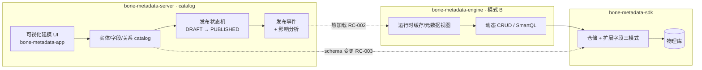
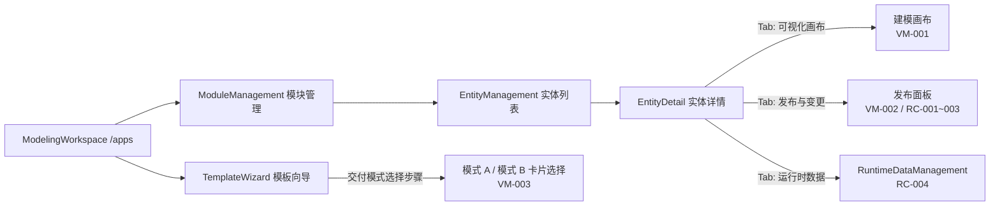

# BONE 元数据运行时闭环与可视化建模 PRD

> **主题**：模式 B（运行时元数据面）闭环补齐 + 可视化建模 UI —— "低代码最小闭环"迭代需求。
> **定位**：本 PRD 为**子需求 / 迭代 PRD**（依据 [`PRD模板.md`](./PRD模板.md) 编制），不替代平台级 [`BONE产品需求文档正式版.md`](./BONE产品需求文档正式版.md)。
> **决策前置**：本迭代**不新增独立"低代码引擎"模块**。结论依据见 §1.1（为什么是"补闭环"而非"加模块"）。

---

## 文档元信息

| 项目 | 内容 |
|------|------|
| 需求名称 | 元数据运行时闭环与可视化建模（低代码最小闭环） |
| 产品 | BONE 企业级全栈开源快速开发平台 |
| 文档版本 | v0.1 |
| 文档状态 | Draft（待评审） |
| 产品经理 | — |
| 技术负责人 | — |
| 关联模块 | `bone-metadata-server`（catalog 控制面）、`bone-metadata-engine`（模式 B 计算面）、`bone-metadata-sdk`（数据面）、`bone-metadata-app`（前端建模 UI）、`bone-platform/bone-integration`（流程编排，P2） |
| 目标发布 | 下一里程碑（强化运行时与工程闭环），具体排期见 §8 |

---

## 修订记录

| 版本 | 日期 | 修订人 | 核心变更 | 状态 |
|------|------|--------|----------|------|
| v0.1 | 2026-10-09 | — | 初稿：基于"低代码是否新增大模块"评审结论编制 | Draft |

---

## 1. 背景与目标

### 1.1 问题陈述

**一句话**：BONE 离"低代码体验"只差"运行时闭环 + 建模 UI 打磨"两步，而不是一个新模块。

**现状盘点（As-Is，全部可取证）**：

| 能力 | 现状 | 证据 |
|------|------|------|
| catalog 建模（实体/字段/关系） | ✅ As-Is | `bone-metadata-server` catalog API；`MetaEntity` 已有 `DRAFT / PUBLISHED` 状态机与发布后变更保护 |
| 模式 A · 生成式交付 | ✅ As-Is | `studio-generator`（:8086） |
| 模式 B · 运行时动态 CRUD | 🟡 MVP As-Is | `JdbcRuntimeRecordService` + `/api/v1/runtime/entities/{code}/records`（P0 看板 META-002B-01~05 全 done） |
| 模型发布 → 运行时生效（热加载） | ❌ Gap | `bone-metadata-engine` 默认不参与平台单体启动；发布事件 → 引擎运行时缓存同步未闭环 |
| 低停机 schema 变更 | ❌ Gap | 仅发布保护，无变更分级与在线生效策略 |
| 可视化建模 UI | 🟡 表单级 As-Is | `bone-metadata-app` 已有 deliveryMode 建模表单（META-002B-04），非可视化画布 |
| 可视化流程编排 | 🟡 编译器 As-Is | 集成引擎 Camel 编译器已交付（INT-11），默认执行仍为线性（INT-09） |

**根因**：模式 B MVP 只是"能跑"，未形成"建模 → 发布 → 运行时生效 → 变更治理"的**完整生命周期闭环**。此时若投入可视化拖拽表单/页面设计器等前端低代码能力，属于在未闭环的底座上盖楼——与 BONE"元数据先行、复杂逻辑保留显式代码"的设计原则相悖，也违背"以真实项目验证后逐步交付"的演进路线。

**不做低代码大模块的代价**：无（当前无真实低代码用户场景）；**不补运行时闭环的代价**：模式 B 永远停留在"演示可用"，元数据驱动价值无法兑现，双模式战略失衡。

### 1.2 目标与成功标准

| 目标 | 可验证指标 | 优先级 |
|------|------------|--------|
| G1 · 运行时闭环：元数据变更到运行时 API 生效全自动 | 热加载生效时延 P95 ≤ 60s，无需重启；破坏性变更停机窗口可预估（见 RC-003） | P0 |
| G2 · 可视化建模：配置型 CRUD 应用端到端自助交付 | 新建"实体 + 字段 + 发布 + 运行时验证"全程 ≤ 15 分钟、零编码；对照生成式路径（约 2 小时） | P1 |
| G3 · 工程纪律：不新增独立低代码模块 | 本次迭代 0 个新增顶层 Maven 模块；能力全部落在既有模块边界内；ArchUnit 门禁 0 新增违规 | P0 |
| G4 · 变更治理：生产发布可回滚、可审计、可影响分析 | 发布操作 100% 留痕；变更前影响分析覆盖率 100%（字段级）；支持版本回滚（见 RC-001/RC-002） | P1 |

### 1.3 与平台能力的关系

| 关联 | 说明 |
|------|------|
| 平台 PRD 章节 | 正式版 §4.4 元数据管理（双模式交付）；§4.7 集成管理（流程编排，P2） |
| 产品定位 | `doc/glossary.md`：元数据/建模为**核心域**，勿称"低代码引擎"替代本词 |
| 架构约束 | [Bone-DDD-最终实践方案](../architecture/Bone-DDD-最终实践方案.md)；[BONE-总体架构设计方案](../architecture/BONE-总体架构设计方案.md)（模式 B 归属）；Clean Core 映射：低代码能力属扩展层，核心元模型稳定封箱 |
| 模块详设 | [元数据能力-实现映射与竞品对照](../design/modules/元数据能力-实现映射与竞品对照.md)；[9. SmartMeta 引擎模块技术说明](../design/modules/9.%20SmartMeta%20引擎模块技术说明.md) |
| 看板基线 | [P0-TODO看板](../wiki/07-P0-TODO看板.md)：META-002B-01~05（done）、INT-11（done）、EXT-PH3-01（open，与本迭代无依赖） |

---

## 2. 用户与场景

### 2.1 用户角色

| 角色 | 定义 | 关注点 |
|------|------|--------|
| 应用开发人员 | 使用 BONE 交付业务应用的开发者 | 快速建模、代码量最小化、复杂逻辑可逃逸（模式 A 保留） |
| 业务/运营人员 | 管理配置型实体、运营后台的准业务用户 | 自助改字段、不依赖开发排期 |
| 平台管理员 | 管理 catalog 发布与生产稳定性 | 变更可回滚、可审计、停机可控 |
| 集成工程师 | 编排异构系统流程 | 可视化 DSL、减少手写（P2） |

### 2.2 用户故事

```gherkin
作为 应用开发人员
我希望 通过可视化建模快速搭建配置型 CRUD 应用（模式 B）
以便 把时间投入复杂领域逻辑，而非样板 CRUD

作为 业务/运营人员
我希望 自助调整配置型实体的字段与校验规则并发布
以便 运营调整不阻塞在开发排期上

作为 平台管理员
我希望 发布变更可回滚、可审计、变更前可影响分析
以便 保护生产环境与租户数据

作为 集成工程师
我希望 以可视化方式编排流程 DSL（P2）
以便 减少手写 Camel DSL 的出错率
```

---

## 3. 范围

### 3.1 In Scope

1. **P0 · 模式 B 运行时闭环**：模型发布状态机闭环（RC-001）、发布事件 → 运行时热加载（RC-002）、低停机 schema 变更分级策略（RC-003）、运行时记录 CRUD 能力补齐（RC-004）。
2. **P1 · 可视化建模 UI**：`bone-metadata-app` 实体/字段/关系可视化建模（VM-001）、发布与变更管理（VM-002）、双模式交付选择可视化（VM-003）。
3. **P2 · 可视化流程编排（探索）**：复用集成引擎 Camel 编译器，提供图 DSL 可视化配置与执行开关（VF-001）。

### 3.2 Out of Scope

| 明确不做 | 理由 |
|----------|------|
| 新增独立"低代码引擎 / 低代码平台"顶层模块 | 与元数据引擎能力重叠、稀释核心域投资；违反"复杂度驱动架构" |
| 前端拖拽表单/页面设计器（无代码范式） | 无真实用户场景；BONE 目标用户是开发者，"元数据驱动 + 显式代码逃逸"已覆盖 |
| 移动端/小程序低代码适配 | 正式版已列为后续路线（多端复用），不在本迭代 |
| 流程编排的沙箱执行、制品隔离 | 属 ExtPoint 扩展引擎演进目标（EXT-PH3），非本迭代 |
| 主数据血缘、数据质量评分 | 主数据平台演进目标，与本迭代无依赖 |

### 3.3 依赖与前置

| 前置 | 状态 | 说明 |
|------|------|------|
| 模式 B MVP（动态记录读写） | ✅ done | META-002B-01~05；本迭代在其上闭环 |
| catalog 发布状态机（DRAFT/PUBLISHED） | ✅ done（基础） | `MetaEntityStatus`；RC-001 在其上补全生命周期 |
| Camel 编译器 | ✅ done（P2 依赖） | INT-11；VF-001 直接复用 |
| engine 参与平台启动 | ⚠️ 待确认 | `bone-metadata-engine` 默认不参与单体启动；RC-002 需先决策部署形态（嵌入式 starter 或独立进程） |

---

## 4. 功能需求（MoSCoW）

### 4.1 优先级说明

| 优先级 | 定义 | 对应章节 |
|--------|------|----------|
| P0 / Must | 本迭代核心，缺失则低代码闭环不成立 | §4.3 运行时闭环 |
| P1 / Should | 高业务价值，直接兑现"低代码体验" | §4.4 可视化建模 UI |
| P2 / Could | 探索增值，有条件可纳入 | §4.5 流程编排可视化 |

### 4.2 能力全景



### 4.3 P0 · 模式 B 运行时闭环

#### 需求ID: RC-001 模型发布状态机闭环

**用户故事**
> 作为平台管理员，我希望实体从草稿到发布的生命周期完整闭环（含版本、撤回、回滚），以便保护生产环境。

**验收标准（BDD）**
```gherkin
Scenario: 实体发布与撤回
  Given 存在一个 DRAFT 状态的 meta_entity
  When 管理员执行发布操作
  Then 实体状态变为 PUBLISHED
    And 生成不可变的发布版本号（snapshot）
    And 触发发布事件（RC-002 消费）
  Scenario: 已发布实体变更保护
  Given 实体状态为 PUBLISHED
  When 尝试修改其 schema（字段增删改）
  Then 修改被拒绝或要求进入新 DRAFT 版本
    And 运行时记录读写不受影响
```

**业务规则**
- 发布 = 新建不可变快照 + 状态迁移；发布后 schema 变更必须经"新草稿版本 → 再发布"，不允许原位修改。
- 支持发布撤回（回退到上一 PUBLISHED 快照），撤回为在线操作（P0 语义上至少保证数据完整性，完整在线回滚见 RC-003）。
- 所有发布/撤回操作写入审计日志（操作人、时间、版本、影响实体列表）。
- **As-Is**：`MetaEntityStatus`（DRAFT/PUBLISHED）+ 发布后变更保护已存在；**Gap**：不可变快照、版本号、发布事件、撤回与审计闭环未落地。

#### 需求ID: RC-002 运行时热加载（发布事件 → 运行时生效）

**用户故事**
> 作为业务/运营人员，我希望发布后运行时 API 无需重启即可感知新字段与新实体，以便自助交付。

**验收标准（BDD）**
```gherkin
Scenario: 热加载生效
  Given 实体已由 DRAFT 发布为 PUBLISHED
  When 运行时 API 收到发布事件（或缓存过期）
  Then 在 P95 ≤ 60s 内，新增字段可通过 runtime records API 读写
    And 期间存量请求不中断、不返回错误
```

**业务规则**
- 事件通道：优先复用 Spring `ApplicationEventPublisher`（`IamMetadataBridge.publishEvent` 已有接线），分布式场景评估事件总线（RocketMQ 可选，与集成 Outbox 中继同链路）。
- 运行时元数据视图（cache）须支持**增量失效 + 全量重建**两种模式；失效粒度为"实体级"，避免全局清缓存。
- 部署形态决策（前置）：`bone-metadata-engine` 作为 starter 嵌入 catalog 宿主进程（推荐，MVP 形态）或独立进程订阅事件；由 §3.3 决策后冻结。
- **As-Is**：`runtime.adapter.SdkMetadataRepository` 直接读已发布 `meta_*`；**Gap**：无缓存失效机制、无发布事件消费。

#### 需求ID: RC-003 低停机 schema 变更

**用户故事**
> 作为平台管理员，我希望 schema 变更按兼容性分级处理，以便尽量在线生效、停机可预估。

**验收标准（BDD）**
```gherkin
Scenario: 向后兼容变更在线生效
  Given 已发布实体存在字段 A
  When 新增可空字段 B（无默认值依赖、无唯一约束）
  Then 变更在线生效，运行时 API 立即可写字段 B
Scenario: 破坏性变更走迁移窗口
  Given 已发布实体存在字段 A 且被唯一约束引用
  When 计划删除字段 A
  Then 系统标记该变更为破坏性，要求显式停机/迁移窗口
    And 提供影响分析（引用该字段的规则、扩展点、运行时记录数）
```

**业务规则**
- 变更分级：**L1 在线**（新增可空字段、放宽长度、新增索引）/ **L2 需迁移窗口**（删除字段、收紧约束、变更主键语义）。分级判定规则固化为文档 + 引擎校验，不接受人工拍脑袋。
- 扩展表字段变更遵循 `bone-metadata-sdk` 三模式约束：预留列（默认推荐）/ JSON / EAV，分配失败自动降级 JSON（既有行为，PRD 只做契约固化）。
- 影响分析输出：引用字段的规则、扩展点、校验表达式、运行时记录规模估算。
- **As-Is**：无分级策略与在线迁移工具；SDK 预留列/JSON 降级机制已存在。

#### 需求ID: RC-004 运行时记录 CRUD 能力补齐

**用户故事**
> 作为应用开发人员，我希望运行时 CRUD 具备企业级查询与治理能力，以便模式 B 实体可真正对业务开放。

**验收标准（BDD）**
```gherkin
Scenario: 复杂查询
  Given 实体已发布且存在运行时记录
  When 调用 runtime records API 携带过滤/排序/分页参数
  Then 正确返回结果
    And 支持扩展字段条件过滤（预留列/JSON 两模式语义一致）
Scenario: 校验与审计
  Given 实体配置了字段校验规则（复用 engine 规则运行时）
  When 提交非法数据
  Then 返回规则级错误，不入库
    And 所有写操作写入审计日志
```

**业务规则**
- 基于既有 `JdbcRuntimeRecordService` 增强：分页/排序/过滤参数规范化、扩展字段条件（聚合遇扩展表字段条件 fail-fast 语义保持）、租户谓词注入（既有 `withTenantEntity/withTenantField`）。
- 校验规则复用 `bone-metadata-engine` 规则运行时（表达式/校验），不重复造规则引擎。
- 性能基线：单实体列表查询 P99 ≤ 200ms（1 万行数据规模），写操作 P99 ≤ 300ms（基准以联调报告为准，不得低于生成式路径）。
- **As-Is**：MVP 已交付（META-002B-01~05）；**Gap**：查询参数能力、规则执行接线、审计与性能基线。

### 4.4 P1 · 可视化建模 UI

#### 需求ID: VM-001 实体/字段/关系可视化建模

**用户故事**
> 作为应用开发人员，我希望以画布方式维护实体、字段与关系，以便直观建模。

**验收标准（BDD）**
```gherkin
Scenario: 画布建模
  Given 用户进入建模页（bone-metadata-app）
  When 创建实体并在画布中添加字段、设置类型与约束
  Then 画布实时同步生成 catalog 草稿
    And 字段类型、扩展字段模式（预留列/JSON）、校验规则可视化配置
  Scenario: 关系建模
  When 在两个实体间建立关系
  Then 生成 meta_entity_relation 记录，运行时查询支持关联语义
```

**业务规则**
- 能力落在 `bone-metadata-app` 既有模块边界内，不新建前端应用。
- 可视化编辑与既有表单编辑共存（编辑态同源：catalog API），画布只做视图增强，不引入第二套数据模型。
- 里程碑要求：建模页交互可用、架构门禁 0 违规（ArchUnit + Spotless）。

#### 需求ID: VM-002 发布与变更管理

**用户故事**
> 作为平台管理员，我希望在 UI 上完成发布、影响分析与版本回滚，以便治理变更。

**验收标准（BDD）**
```gherkin
Scenario: 发布流程可视化
  Given 实体处于 DRAFT 状态
  When 在 UI 点击发布
  Then 展示影响分析摘要（字段变更、引用规则、运行时记录规模）
    And 确认后完成发布并展示新版本号
Scenario: 版本回滚
  When 在版本历史中执行回滚
  Then 系统按 RC-001/RC-003 策略执行并展示结果
```

**业务规则**
- 发布确认页 = 影响分析页（防误操作）：破坏性变更必须二次确认。
- 版本历史展示：快照版本、发布人、发布时间、变更 diff。

#### 需求ID: VM-003 双模式交付选择可视化

**用户故事**
> 作为应用开发人员，我希望在建模时直观选择 GENERATIVE / RUNTIME 交付模式，以便按场景决策。

**验收标准（BDD）**
```gherkin
Scenario: 交付模式选择
  Given 用户创建实体
  When 在建模向导选择"运行时交付（模式 B）"
  Then 实体 delivery_mode 标记为 RUNTIME
    And 建模页提示运行时能力边界（如复杂逻辑需逃逸舱）
```

**业务规则**
- 复用既有 `meta_entity.delivery_mode`（0-GENERATIVE / 1-RUNTIME，META-002B-01 As-Is）；UI 升级为建模向导内显式选择 + 边界提示。
- 提示内容：模式 B 标准 CRUD 免生成；复杂领域逻辑仍建议模式 A（生成器逃逸舱）。

### 4.5 P2 · 可视化流程编排（探索）

#### 需求ID: VF-001 流程 DSL 可视化配置

**用户故事**
> 作为集成工程师，我希望以可视化方式编辑流程 DSL，以便减少手写 Camel DSL 出错。

**验收标准（BDD）**
```gherkin
Scenario: 可视化编排
  Given 集成引擎已存在 int_flow_node 图 DSL（INT-11 As-Is）
  When 在集成前端以节点图方式编辑流程
  Then 生成等价图 DSL 并保存
    And 经 Camel 编译器编译验证（执行仍以线性 INT-09 为默认，Camel 执行按开关启用）
```

**业务规则**
- 探索性质：仅做图 DSL 编辑与编译校验，**不承诺**本迭代交付 Camel 执行切换的运维化。
- 复用 `bone-integration-app` 与 Camel 编译器产物，不新建模块。
- 若探索结论为投入产出不达标，允许降级为"配置化展示（只读图）"，需在迭代评审时显式决策。

---

## 5. UI 设计

> 本章为 PRD 的 UI 配套设计：页面地图、关键页面布局与交互规则，以及**可交互 HTML 原型**（§5.5）。
> 原则：**画布/向导均为既有页面的视图增强，数据模型同源（catalog API），禁止引入第二套数据模型**（VM-001 业务规则）。

### 5.1 页面地图（信息架构）

**现状路由（As-Is，真源 `bone-frontend/apps/bone-metadata-app/src/App.tsx`）**：

| 路由 | 页面 | 现状 | 本迭代增强点 |
|------|------|------|--------------|
| `/apps` | ModelingWorkspace 领域建模工作区 | ✅ As-Is | —（入口） |
| `/template-wizard` | TemplateWizard 模板向导 | ✅ As-Is | **新增「交付模式选择」步骤**（VM-003） |
| `/apps/:appId/modules` | ModuleManagement 模块管理 | ✅ As-Is | — |
| `/apps/:appId/modules/:moduleId/entities` | EntityManagement 实体列表 | ✅ As-Is | 列表增加状态徽标（DRAFT/PUBLISHED）与发布入口 |
| `/apps/:appId/modules/:moduleId/entities/:id` | EntityDetail 实体详情（字段/关系 Tabs） | ✅ As-Is | **新增「可视化画布」Tab（VM-001）与「发布与变更」面板（VM-002）** |
| `/apps/:appId/modules/:moduleId/entities/:id/data` | RuntimeDataManagement 运行时数据管理 | 🟡 MVP As-Is | 查询/校验/审计能力增强（RC-004 前端配合） |

**增强后页面关系（目标态）**：



### 5.2 关键页面设计

#### 5.2.1 实体详情 · 可视化建模画布（VM-001）

**布局（左中右三段式）**：

| 区域 | 内容 | 说明 |
|------|------|------|
| 左侧 | 实体/字段导航树 | 切换实体；展开字段列表；快捷定位 |
| 中部 | 建模画布 | 实体卡片（标题 + delivery_mode 徽标 + 字段行）+ 关系连线（标注 1:N / N:N） |
| 右侧 | 属性面板 | 选中字段后编辑：名称、类型、约束、扩展字段模式（预留列/JSON）、校验规则 |

**画布元素**：

- 实体卡片：实体名 + `RUNTIME`/`GENERATIVE` 徽标 + 字段行（字段名 / 类型图标 / 约束图标：PK、唯一、非空、默认值）；
- 关系连线：两实体间连线 + 基数标注（1:N / N:N），悬停显示关系名；
- 工具栏：添加字段、添加关系、保存草稿、发布（跳转发布面板）。

**视图切换**：画布视图 / 表单视图 Tab 共存，编辑态同源（catalog API），不引入第二套数据模型。

#### 5.2.2 实体详情 · 发布与变更面板（VM-002 / RC-001~003）

| 区块 | 内容 |
|------|------|
| 版本历史 | 快照版本列表：版本号、发布人、发布时间、变更 diff 标记（新增/修改/删除） |
| 影响分析 | 确认摘要卡：变更字段清单、引用规则数、引用扩展点数、运行时记录规模估算 |
| 变更分级 | L1 在线（绿色徽标）→ 直接发布；L2 破坏性（橙色徽标）→ 显式迁移窗口提示 + 二次确认 |
| 操作 | 发布（管理员 + 确认）、回滚到历史版本（管理员 + 二次确认 + 破坏性提示） |

#### 5.2.3 模板向导 · 交付模式选择（VM-003）

**步骤流**：选择模板 → 交付模式选择（卡片单选）→ 能力边界提示 → 确认创建。

- 模式 A · 生成式卡片：元数据 → 生成可审计源码；适合复杂领域逻辑、源码审计；
- 模式 B · 运行时卡片：元数据 → 运行时动态 CRUD/API；适合配置型实体、运营后台；**标准 CRUD 免生成**；
- 边界提示：模式 B 复杂逻辑需逃逸舱（经生成器/扩展点）。

#### 5.2.4 运行时数据管理增强（RC-004 前端配合）

- 查询区：字段过滤（含扩展字段条件）、排序、分页参数化；
- 校验错误：内联错误提示（复用 engine 规则运行时返回的规则级错误码）；
- 审计：记录操作留痕入口（写入人/时间）。

### 5.3 交互规则

1. 画布与表单同源：编辑态数据全部来自 catalog API，画布仅做视图增强；
2. 发布确认 = 影响分析页：**破坏性变更（L2）必须二次确认**，L1 在线变更单次确认；
3. 回滚操作：仅管理员，二次确认，回滚前展示目标版本 diff；
4. 错误提示统一 error envelope（复用 `CatalogErrorCodes` 既有约定）；
5. 画布缩放/平移为 P1 内可选项，不影响建模功能验收。

### 5.4 视觉规范

| 项 | 规范 |
|----|------|
| 组件体系 | Ant Design 5（与 `bone-frontend` 既有应用一致，不引入新组件库） |
| 主色 | `#1677ff`（antd 默认蓝） |
| 状态色 | DRAFT 灰、PUBLISHED 绿、变更中（L2）橙 |
| 徽标 | delivery_mode：`RUNTIME`（蓝）/ `GENERATIVE`（紫） |
| 字体/间距 | 沿用 Qiankun Shell 全局样式，不单独定义 |

### 5.5 UI 原型

可交互 HTML 原型（自包含、离线可打开，覆盖 §5.2 全部关键页面）：

> **`doc/design/ui/bone-metadata-ui-prototype.html`** — 浏览器直接打开即可预览（支持 `#t1~#t4` 直接定位页签）；页面含：建模画布、发布与变更、交付模式向导、运行时数据管理。
>
> 关键页面静态预览（截图由原型生成）：
>
> | 页面 | 截图 |
> |------|------|
> | 可视化建模画布 | `doc/design/ui/preview-1-canvas.png` |
> | 发布与变更 | `doc/design/ui/preview-2-publish.png` |
> | 交付模式向导 | `doc/design/ui/preview-3-wizard.png` |
> | 运行时数据 | `doc/design/ui/preview-4-runtime.png` |

---

## 6. 非功能需求

| 类别 | 要求 |
|------|------|
| 性能 | 热加载生效 P95 ≤ 60s（RC-002）；运行时列表查询 P99 ≤ 200ms、写 P99 ≤ 300ms（1 万行基准，RC-004）；不劣于生成式路径基线 |
| 安全 | 建模/发布/回滚操作均走 IAM JWT 鉴权与 RBAC（发布、回滚仅限管理员）；审计日志 100% 留痕；租户隔离沿用 `withTenant*` 谓词注入 |
| 多租户 | 发布、热加载、schema 变更按租户隔离生效；跨租户影响分析仅管理员可见 |
| 可观测性 | 发布事件、热加载、回滚操作输出指标与日志；运行时 API 复用既有 ModuleHealthIndicator |
| 工程质量 | 本次迭代 0 新增顶层 Maven 模块；ArchUnit 门禁 0 新增违规；Spotless/ESLint 通过；新增能力覆盖集成测试（H2 沿用 schema-test.sql 模式） |
| 数据诚实 | 所有"已实现/规划"标注与 P0 看板、代码真源一致；本 PRD 不做未验证承诺 |

---

## 7. 成功口径与验收

**本轮迭代完成 = 以下全部成立**：

1. **运行时闭环**：新建一个模式 B 实体（含扩展字段），从建模到运行时 API 读写生效，**全程 ≤ 15 分钟、零编码、无重启**（G1 ∩ G2）。
2. **热加载**：对已发布实体新增可空字段，P95 ≤ 60s 内 runtime records API 可读写新字段，期间存量请求无错误（G1）。
3. **变更治理**：破坏性变更触发影响分析 + 二次确认，拒绝/迁移窗口提示正确；发布与回滚 100% 留痕可查（G4）。
4. **工程纪律**：`mvn` 全量构建 + 相关模块测试通过；ArchUnit 0 新增违规；顶层模块数不变（G3）。
5. **性能基线**：RC-004 基准跑通并记入联调报告（G1 附加项）。

> 验收演示脚本（防追问口径）：从 `bone-metadata-app` 建模 → 发布 → 调 `/api/v1/runtime/entities/{code}/records` 增删改查 → 变更字段再发布 → 复验生效，输出全链路录屏 + 时间戳。

---

## 8. 风险与依赖

| 风险 | 等级 | 应对 |
|------|------|------|
| engine 部署形态未冻结（嵌入式 vs 独立进程）影响 RC-002 设计 | 高 | 迭代启动首个决策项，方案见 §3.3；倾向嵌入式 starter（MVP 形态） |
| 热加载与事务/缓存一致性（发布瞬间的读写窗口） | 中 | 实体级失效 + 全量重建双模式；窗口期接口幂等返回重试提示 |
| 可视化建模 UI 工作量被低估（画布交互复杂度） | 中 | 画布只做视图增强、与表单同源，禁止第二套数据模型；里程碑拆分 |
| 扩展字段 JSON 降级路径下查询语义漂移（RC-004） | 中 | 沿用既有 fail-fast 语义（聚合遇扩展表字段条件报错），契约固化并在集成测试覆盖 |
| P2 流程编排投入产出不达标 | 低 | 允许降级为只读图展示，评审时显式决策 |
| 与考核主线（Drive 服务 / 轻舟 L3）抢资源 | 高 | 本迭代为 BONE 工程次级任务，排期须避开考核主线冲刺窗口；任何人力冲突时优先保主线 |

---

## 9. 附录：与既有看板/文档映射

| 本 PRD 需求 | 既有条目/真源 | 关系 |
|-------------|---------------|------|
| RC-001 | `MetaEntityStatus`（DRAFT/PUBLISHED）、MD-04（仅已发布可转主数据） | 扩展既有状态机 |
| RC-002 | META-002B-02（JdbcRuntimeRecordService）、`IamMetadataBridge.publishEvent` | 在 MVP 之上闭环 |
| RC-003 | `bone-metadata-sdk` 扩展字段三模式（预留列/JSON/EAV） | 契约固化 + 变更分级 |
| RC-004 | META-002B-01~05、engine 规则运行时 | 增强既有 MVP |
| VM-001~003 | META-002B-04（建模表单）、`delivery_mode` | UI 升级，不新建应用 |
| VF-001 | INT-09 / INT-11（Camel 编译器） | 复用编译器产物 |

> **文档一致性声明**：本 PRD 中所有 As-Is 标注以 `README.md`、`doc/wiki/07-P0-TODO看板.md` 与代码为准；实现状态变化时，优先更新看板与本 PRD 的映射表。
