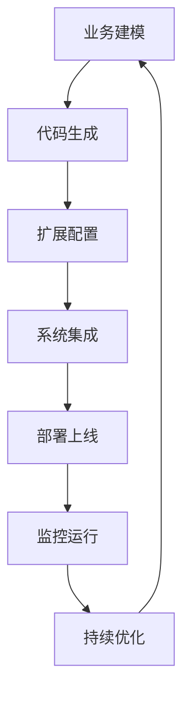
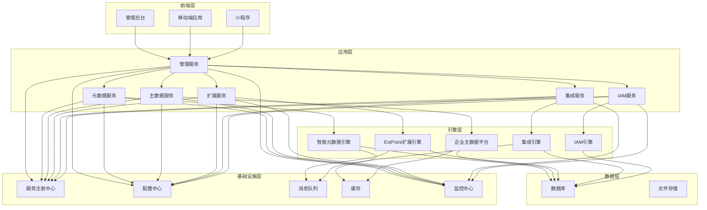

# BONE产品需求文档（PRD）

## —— 企业级全栈开源快速开发平台 · 完整详细版

> **文档性质**：正式产品需求文档，可直接指导研发排期、测试用例编写  
> **适用产品**：BONE企业级全栈开源快速开发平台  
> **对标标准**：字节跳动 DRF、腾讯 TAPD、阿里云效  
> **版本**：v1.0 Final | **发布日期**：2026‑04‑19 | **文档状态**：✅ 已发布 | **密级**：内部机密  

---

## 文档元信息

| 项目 | 内容 |
|------|------|
| 产品名称 | BONE企业级全栈开源快速开发平台 |
| 产品代号 | BONE |
| 文档版本 | v1.0 Final |
| 文档状态 | ✅ 已发布 |
| 密级 | 内部机密 |
| 产品经理 | [姓名] |
| 技术负责人 | [姓名] |
| 项目负责人 | [姓名] |
| 生效日期 | 2026‑04‑19 |
| 目标发布 | 2026年Q2起滚动发布，总工期12个月 |

---

## 修订记录

| 版本 | 日期 | 修订人 | 审核人 | 核心变更 | 状态 |
|------|------|--------|--------|----------|------|
| v0.1 | 2026-04-10 | 产品组 | 架构组 | 初稿框架 | Draft |
| v0.5 | 2026-04-15 | 产品+技术组 | 架构委 | 增补核心引擎设计、微服务架构 | Draft |
| v0.9 | 2026-04-17 | 产品+架构组 | 技术委 | 融合元数据驱动、扩展引擎、集成引擎 | Review |
| v1.0 | 2026-04-19 | 产品全组 | VP Office | 正式发布 | Final |

**评审记录**  
- T0 架构评审：2026-04-16 ✅ 通过  
- T1 产品评审：2026-04-17 ✅ 通过  
- T2 合规评审：2026-04-17 ✅ 通过  

---

## 目录

1. [产品概览](#1-产品概览)
2. [核心功能](#2-核心功能)
   - 2.1 用户角色
   - 2.2 功能模块
   - 2.3 页面详情
3. [核心流程](#3-核心流程)
4. [用户界面设计](#4-用户界面设计)
   - 4.1 设计风格
   - 4.2 页面设计概览
   - 4.3 响应式设计
5. [技术架构](#5-技术架构)
   - 5.1 架构设计
   - 5.2 技术选型
   - 5.3 核心API定义
   - 5.4 数据模型
6. [部署架构](#6-部署架构)
7. [实施计划](#7-实施计划)
8. [市场价值](#8-市场价值)
9. [总结](#9-总结)

---

## 1. 产品概览

BONE是一个企业级全栈开源原生快速开发平台，以"Build Once, Natively Everywhere"为理念，通过元数据驱动开发，实现一次构建多端运行的能力。
- 解决企业级应用开发效率低、多端开发维护成本高、系统集成复杂等问题，为企业数字化转型提供完整技术解决方案
- 目标用户为企业IT团队、开发人员、业务分析师，市场价值在于大幅提升开发效率，降低数字化转型成本

## 2. 核心功能

### 2.1 用户角色

| 角色 | 注册方式 | 核心权限 |
|------|---------------------|------------------|
| 系统管理员 | 系统配置 | 完全管理权限，包括用户管理、系统配置、引擎配置 |
| 开发人员 | 邀请码注册 | 应用开发、扩展点开发、API调用 |
| 业务分析师 | 邮箱注册 | 业务模型设计、流程配置、数据分析 |
| 运维人员 | 邮箱注册 | 系统监控、部署管理、性能优化 |

### 2.2 功能模块

1. **智能元数据引擎**：动态业务建模、智能代码生成、多源数据适配、细粒度权限内嵌、实时热更新机制
2. **企业主数据平台**：全品类主数据治理、数据血缘追踪、数据质量管控、服务化交付、数据资产目录
3. **ExtPoint扩展引擎**：标准化扩展点、插件生命周期管理、依赖治理与隔离、扩展可观测性、动态参数配置
4. **集成引擎**：多协议兼容、标准化连接器工厂、可视化数据转换、流程编排引擎、企业级可靠性保障
5. **IAM账号权限模块**：用户身份管理、角色权限管理、细粒度权限控制、单点登录集成、安全审计

### 2.3 页面详情

| 页面名称 | 模块名称 | 功能描述 |
|-----------|-------------|---------------------|
| 控制台首页 | 仪表盘 | 系统运行状态、关键指标监控、快速访问入口 |
| 元数据管理 | 业务建模 | 可视化定义业务实体、字段关系及校验规则 |
| 元数据管理 | 代码生成 | 一键生成前后端代码、API文档、数据库脚本与单元测试 |
| 主数据管理 | 数据治理 | 统一管理客户、供应商、物料、组织、产品等核心主数据 |
| 主数据管理 | 数据质量 | 自动化数据校验、清洗，提供质量评分体系与改进建议 |
| 扩展管理 | 扩展点管理 | 管理系统预设的扩展点，配置扩展逻辑 |
| 扩展管理 | 插件管理 | 插件的注册、安装、升级、卸载，支持热部署 |
| 集成管理 | 连接器管理 | 管理与外部系统的连接配置 |
| 集成管理 | 流程编排 | 可视化编排多系统调用链路，支持复杂业务集成需求 |
| 系统管理 | 用户管理 | 管理系统用户、角色、权限 |
| 系统管理 | 监控中心 | 系统运行状态监控、性能分析、异常告警 |
| IAM管理 | 用户管理 | 管理用户身份、认证方式、个人信息 |
| IAM管理 | 角色管理 | 管理角色定义、权限分配、角色继承 |
| IAM管理 | 权限管理 | 管理权限项、权限组、权限策略 |
| IAM管理 | SSO配置 | 配置单点登录、第三方认证集成 |
| IAM管理 | 审计日志 | 查看用户操作审计、权限变更记录 |

## 3. 核心流程

**应用开发流程**：
1. 业务分析师在元数据管理页面定义业务模型
2. 系统自动生成前后端代码和数据库脚本
3. 开发人员在扩展管理页面配置业务逻辑扩展
4. 集成管理页面配置与外部系统的集成
5. 运维人员部署应用并监控运行状态

**主数据治理流程**：
1. 业务分析师在主数据管理页面定义主数据模型
2. 系统导入或同步现有主数据
3. 系统进行数据质量检查和清洗
4. 业务分析师审核并发布主数据
5. 其他系统通过API消费主数据

**扩展开发流程**：
1. 开发人员在扩展管理页面查看可用扩展点
2. 开发人员编写扩展逻辑并打包为插件
3. 开发人员上传并安装插件
4. 系统验证插件依赖并部署
5. 运维人员监控扩展执行情况

**IAM账号权限管理流程**：
1. 系统管理员在IAM管理页面创建用户和角色
2. 系统管理员为角色分配权限
3. 系统管理员将角色分配给用户
4. 用户通过SSO或本地认证登录系统
5. 系统验证用户身份和权限
6. 系统记录用户操作审计日志

## 4. 用户界面设计

### 4.1 设计风格

- **主色调**：蓝色系 (#1890ff)，代表专业和可靠
- **辅助色**：绿色 (#52c41a)、橙色 (#fa8c16)、红色 (#f5222d)
- **按钮样式**：圆角矩形，有轻微的阴影效果
- **字体**：系统默认无衬线字体，标题 16-20px，正文 14px，说明文字 12px
- **布局风格**：左侧固定导航栏，右侧内容区，卡片式布局
- **图标风格**：使用 Ant Design 图标库，保持一致性

### 4.2 页面设计概览

| 页面名称 | 模块名称 | UI元素 |
|-----------|-------------|-------------|
| 控制台首页 | 仪表盘 | 卡片式布局，展示系统运行状态、关键指标，使用图表可视化数据 |
| 元数据管理 | 业务建模 | 拖拽式界面，支持实体关系可视化设计，实时预览 |
| 元数据管理 | 代码生成 | 配置表单，生成进度条，代码预览窗口 |
| 主数据管理 | 数据治理 | 表格展示主数据，筛选器，批量操作按钮 |
| 扩展管理 | 扩展点管理 | 树状结构展示扩展点，配置表单，测试按钮 |
| 集成管理 | 流程编排 | 拖拽式流程图设计器，节点配置面板 |
| 系统管理 | 监控中心 | 实时监控图表，告警列表，性能分析图表 |

### 4.3 响应式设计

- **桌面优先**：主要针对桌面端设计
- **平板适配**：在平板设备上调整布局，保持核心功能可用
- **移动端**：提供简化版移动界面，仅包含查看和基本操作功能
- **触控优化**：为触控设备优化交互元素大小和间距

## 5. 技术架构

### 5.1 架构设计

### 5.2 技术选型

| 分类 | 技术 | 版本 | 用途 |
|------|------|------|------|
| 前端框架 | React | 18+ | 构建用户界面 |
| 构建工具 | Vite | 4.4+ | 前端构建和开发服务器 |
| UI组件库 | Ant Design | 5.12+ | 提供UI组件 |
| 跨端框架 | React Native | 0.74+ | 实现多端适配 |
| 后端框架 | Spring Boot | 3.2+ | 构建后端服务 |
| 微服务框架 | Spring Cloud | 2023+ | 微服务治理 |
| 数据持久化 | Bone Metadata SDK | 1.0+ | 数据库操作，与MyBatis Plus对标 |
| 服务注册与发现 | Nacos | 2.2+ | 服务管理 |
| 服务熔断与限流 | Sentinel | 1.8+ | 系统保护 |
| 消息队列 | RocketMQ | 5.1+ | 异步通信 |
| 分布式事务 | Seata | 1.6+ | 事务一致性 |
| 缓存 | Redis | 7.0+ | 数据缓存 |
| 数据库 | MySQL | 8.0+ | 关系型数据库 |
| 数据库 | PostgreSQL | 15.0+ | 关系型数据库 |
| 集成框架 | Apache Camel | 4.0+ | 系统集成 |
| 规则引擎 | LiteFlow | 2.10+ | 业务规则管理 |

### 5.3 核心API定义

**元数据服务 API**：
- GET /api/metadata/entities - 获取业务实体列表
- POST /api/metadata/entities - 创建业务实体
- PUT /api/metadata/entities/{id} - 更新业务实体
- POST /api/metadata/generate - 生成代码
- GET /api/metadata/generate/{id} - 获取生成结果

**主数据服务 API**：
- GET /api/masterdata/entities - 获取主数据实体列表
- POST /api/masterdata/entities - 创建主数据实体
- PUT /api/masterdata/entities/{id} - 更新主数据实体
- GET /api/masterdata/quality - 获取数据质量报告

**扩展服务 API**：
- GET /api/extension/points - 获取扩展点列表
- POST /api/extension/plugins - 上传插件
- PUT /api/extension/plugins/{id} - 更新插件
- POST /api/extension/plugins/{id}/deploy - 部署插件

**集成服务 API**：
- GET /api/integration/connectors - 获取连接器列表
- POST /api/integration/flows - 创建集成流程
- PUT /api/integration/flows/{id} - 更新集成流程
- POST /api/integration/flows/{id}/test - 测试集成流程

**IAM服务 API**：
- GET /api/iam/users - 获取用户列表
- POST /api/iam/users - 创建用户
- PUT /api/iam/users/{id} - 更新用户
- DELETE /api/iam/users/{id} - 删除用户
- GET /api/iam/roles - 获取角色列表
- POST /api/iam/roles - 创建角色
- PUT /api/iam/roles/{id} - 更新角色
- POST /api/iam/roles/{id}/permissions - 为角色分配权限
- GET /api/iam/permissions - 获取权限列表
- POST /api/iam/sso/config - 配置SSO
- GET /api/iam/audit/logs - 获取审计日志

### 5.4 数据模型

**元数据模型**：
- Entity: 业务实体
- Field: 字段
- Relationship: 关系
- ValidationRule: 校验规则
- CodeTemplate: 代码模板

**主数据模型**：
- MasterDataEntity: 主数据实体
- MasterDataRecord: 主数据记录
- DataQualityRule: 数据质量规则
- DataQualityResult: 数据质量结果

**扩展模型**：
- ExtensionPoint: 扩展点
- ExtensionPlugin: 扩展插件
- ExtensionConfig: 扩展配置
- ExtensionExecution: 扩展执行记录

**集成模型**：
- Connector: 连接器
- IntegrationFlow: 集成流程
- FlowNode: 流程节点
- FlowConnection: 流程连接
- IntegrationLog: 集成日志

## 6. 部署架构

### 6.1 部署方案

- **开发环境**：本地开发环境，使用Docker容器
- **测试环境**：独立测试环境，模拟生产配置
- **生产环境**：高可用集群部署，多节点负载均衡

### 6.2 配置管理

- **环境变量**：使用环境变量管理配置
- **配置中心**：使用Nacos作为配置中心
- **密钥管理**：使用密钥管理服务存储敏感信息

### 6.3 监控与告警

- **系统监控**：使用Prometheus + Grafana监控系统运行状态
- **链路追踪**：使用SkyWalking实现全链路追踪
- **告警机制**：配置多级告警策略，及时发现和处理问题

## 7. 实施计划

### 7.1 开发阶段

1. **基础设施搭建**：搭建开发环境、测试环境、CI/CD流程
2. **核心引擎开发**：实现四大核心引擎的基础功能
3. **管理后台开发**：开发管理后台界面和功能
4. **移动端开发**：开发移动端应用和小程序
5. **集成测试**：进行功能测试、性能测试、安全测试
6. **文档编写**：编写用户手册、开发文档、API文档

### 7.2 上线计划

1. **内部测试**：在内部环境进行全面测试
2. **公测**：邀请部分用户进行公测
3. **正式上线**：发布正式版本
4. **持续迭代**：根据用户反馈进行持续优化

## 8. 市场价值

- **开发效率提升**：新功能开发周期从2-3周缩短至3天，提升80%效率
- **多端开发成本降低**：一次构建多端运行，减少70%重复开发工作
- **系统集成成本降低**：标准适配器+可视化编排，降低60%集成成本
- **数据质量提升**：统一主数据平台，提升90%数据质量
- **架构灵活性提升**：元数据调整自动同步，提升300%架构灵活性

## 9. 总结

BONE平台通过四大核心引擎的协同运作，为企业提供从数据治理、业务开发到系统集成的全链路解决方案，助力企业构建"稳定、灵活、可扩展"的面向未来的数字化架构。平台以"Build Once, Natively Everywhere"为理念，通过元数据驱动开发，实现一次构建多端运行的能力，大幅提升开发效率，降低数字化转型成本。

BONE不仅是一个开发工具，更是企业数字化转型的核心基础设施，为企业构建面向未来的数字化架构提供坚实的技术支撑。