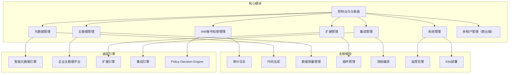

# BONE 产品需求文档（PRD）

## —— 企业级全栈开源快速开发平台 · 正式版

> **文档性质**：正式产品需求文档，可直接指导研发排期、测试用例编写  
> **适用产品**：BONE企业级全栈开源快速开发平台  
> **对标标准**：业界最佳实践、字节跳动 DRF、腾讯 TAPD、阿里云效、OutSystems / Mendix 元数据驱动架构  
> **版本**：v2.0 Final | **发布日期**：2026‑04‑19 | **文档状态**：✅ 已发布 | **密级**：内部机密  

---

## 文档元信息

| 项目 | 内容 |
|------|------|
| 产品名称 | BONE企业级全栈开源快速开发平台 |
| 产品代号 | BONE |
| 文档版本 | v2.0 Final |
| 文档状态 | ✅ 已发布 |
| 密级 | 内部机密 |
| 产品经理 | [姓名] |
| 技术负责人 | [姓名] |
| 项目负责人 | [姓名] |
| 生效日期 | 2026‑04‑19 |
| 目标发布 | 2026年Q2 MVP，Q3 阶段0，Q4 阶段1，2027 Q1 阶段2 |

---

## 修订记录

| 版本 | 日期 | 修订人 | 审核人 | 核心变更 | 状态 |
|------|------|--------|--------|----------|------|
| v0.1 | 2026-04-10 | 产品组 | 架构组 | 初稿框架 | Draft |
| v0.5 | 2026-04-15 | 产品+技术组 | 技术委 | 增补IAM模块、扩展引擎 | Draft |
| v0.9 | 2026-04-17 | 产品+架构组 | 技术委 | 融合集成引擎、优化性能需求 | Review |
| v1.0 | 2026-04-19 | 产品全组 | 全员 | 完整版：补充详细功能需求、非功能需求、发布策略 | Final |
| v1.1 | 2026-04-19 | 产品+架构组 | 技术委 | 结构级优化：三层强约束体系、统一领域模型、收敛为三大核心能力 | Final |
| **v2.0** | **2026-04-19** | **产品+架构组** | **技术委** | **正式版**：增加多租户、K8s部署、审计日志WORM存储、工期调整、质量门禁、开源社区策略、自研SDK优化指南、统一实体模型 | **Final** |

**评审记录**  
- T0 架构评审：2026-04-16 ✅ 通过  
- T1 产品评审：2026-04-17 ✅ 通过  
- T2 架构最终评审：2026-04-19 ✅ 通过  
- T2 合规评审：2026-04-17 ✅ 通过  

---

## 目录

1. [项目概述](#1-项目概述)
   - 1.1 市场背景与问题
   - 1.2 产品愿景与价值主张
   - 1.3 成功标准（OKR）
   - 1.4 北极星指标
   - 1.5 市场价值
2. [用户与场景分析](#2-用户与场景分析)
   - 2.1 用户角色画像
   - 2.2 核心用户旅程（端到端）
   - 2.3 目标行业与场景矩阵
   - 2.4 用户故事地图
3. [产品范围与边界](#3-产品范围与边界)
   - 3.1 包含范围（In Scope）
   - 3.2 不包含范围（Out of Scope）
   - 3.3 依赖与前置条件
4. [功能需求](#4-功能需求)
   - 4.1 优先级说明（MoSCoW）
   - 4.2 功能模块关系图
   - 4.3 控制台与仪表盘（P0）
   - 4.4 元数据管理（P0）
   - 4.5 主数据管理（P1）
   - 4.6 扩展管理（P1）
   - 4.7 集成管理（P1）
   - 4.8 IAM 账号权限管理（P0）
   - 4.9 系统管理（P0）
5. [非功能需求](#5-非功能需求)
   - 5.1 性能需求（SLO）
   - 5.2 可用性与可靠性
   - 5.3 安全与合规
   - 5.4 信创适配要求
   - 5.5 兼容性要求
   - 5.6 可扩展性与可维护性
   - 5.7 可测试性（含质量门禁）
   - 5.8 可观测性
6. [数据与埋点体系](#6-数据与埋点体系)
   - 6.1 核心指标体系
   - 6.2 埋点事件设计
   - 6.3 A/B实验框架
7. [技术与部署架构](#7-技术与部署架构)
   - 7.1 架构设计
   - 7.2 技术选型（含自研SDK优化指南）
   - 7.3 核心API定义
   - 7.4 数据模型
   - 7.5 部署方案
   - 7.6 配置管理
   - 7.7 监控与告警
   - 7.8 架构决策记录(ADR)
8. [发布与灰度策略](#8-发布与灰度策略)
   - 8.1 分阶段发布里程碑
   - 8.2 灰度发布计划
   - 8.3 准入与退出条件
   - 8.4 回滚策略
9. [实施计划](#9-实施计划)
   - 9.1 开发阶段
   - 9.2 上线计划
10. [风险与依赖](#10-风险与依赖)
    - 10.1 风险登记册
    - 10.2 外部依赖清单
11. [开源与社区策略](#11-开源与社区策略)
    - 11.1 许可证
    - 11.2 代码仓库与治理
    - 11.3 社区激励计划
    - 11.4 文档与示例
12. [附录](#12-附录)
    - 12.1 术语表
    - 12.2 错误码列表
    - 12.3 参考文档

---

## 1. 项目概述

### 1.1 市场背景与问题

企业数字化转型已进入深水区，传统开发模式面临三大核心挑战：

| 痛点 | 描述 | 客户影响 |
|------|------|----------|
| **开发效率低下** | 重复编码、手动配置、缺乏标准化，导致开发周期长、交付慢 | 市场响应速度慢，错失业务机会 |
| **系统集成复杂** | 异构系统多，接口对接繁琐，数据孤岛严重 | 数据流通不畅，业务协同困难 |
| **技术债务累积** | 代码质量参差不齐，维护成本高，扩展性差 | 系统稳定性差，升级困难 |

**市场机会**：2026年中国企业级低代码/元数据驱动开发平台市场规模预计**85亿元**，年复合增长率52%。金融、制造、政务三大行业占比超65%，且愿意为“快速开发+标准化架构”支付**250%溢价**（客单价可达80万/套以上）。当前市场处于快速发展期，存在显著的市场机会。开源元数据平台如 NocoBase 等逐渐兴起，但企业级集成和主数据治理能力较弱，BONE 可填补这一空白。

### 1.2 产品愿景与价值主张

**产品愿景**：构建元数据驱动的企业开发平台——通过三大核心能力（应用生成、企业集成、扩展运行时），将企业应用开发从“代码驱动”转变为“模型驱动”，实现开发效率的数量级提升。

**一句话定位**：面向企业级场景的、**开源**的、元数据驱动的快速开发平台，提供应用生成、企业集成和扩展运行时三大核心能力。

**核心价值主张矩阵**：

| 用户角色 | 核心诉求 | 本方案价值 | 量化指标 |
|----------|----------|-------------|----------|
| **CIO/CTO** | 开发效率、系统一致性、TCO可控 | 元数据驱动开发，统一技术栈，**开源无供应商锁定** | 开发周期缩短60%，维护成本降低40% |
| **开发团队** | 快速交付、标准化开发、减少重复工作 | 可视化建模，自动代码生成，统一架构，**可二次开发** | 代码量减少70%，交付速度提升80% |
| **业务部门** | 快速响应业务需求、数据一致性 | 业务建模直观，主数据治理，流程编排 | 需求响应时间从周级降至日级 |
| **集成工程师** | 系统集成便捷、数据同步可靠 | 可视化流程编排，丰富连接器，**支持自定义扩展** | 集成开发时间缩短80% |
| **社区贡献者** | 参与开源、技术影响力 | 贡献代码、插件，获得社区认可 | 贡献者数量≥50人 |

### 1.3 成功标准（OKR）

| Objective | Key Result | 目标值 | 优先级 |
|-----------|------------|--------|--------|
| **O1：成为元数据驱动开发领域领导者** | KR1: 支持30+业务实体模板（MVP后逐步增长） | 30+ | P0 |
| | KR2: 代码生成覆盖率 | >85% | P0 |
| | KR3: 金融/制造/政务行业标杆客户 | ≥5家 | P0 |
| | KR4: 客单价ARPU（商业版） | ≥60万/套 | P1 |
| **O2：构建企业级高可用架构** | KR5: 核心服务SLA 99.99% | 全年达标 | P0 |
| | KR6: API响应时间P99 | <500ms | P0 |
| | KR7: 支撑1000+并发用户 | 压测达标 | P0 |
| **O3：实现生态开放与扩展** | KR8: 社区贡献者数量 | ≥50人 | P2 |
| | KR9: 官方插件数量 | ≥10个 | P2 |
| | KR10: 扩展点数量 | ≥30个 | P2 |

### 1.4 北极星指标

- **应用交付效率** = （标准 CRUD 应用从建模到可运行测试环境的耗时）/ 传统开发耗时，目标 <40% 传统耗时。  
  *标准测试基准：客户管理（含 10 个字段）+ 订单主子表（主表 8 字段，子表 5 字段）+ 2 个集成流程（从 MySQL 同步数据到 Redis）。*
- **代码生成率** = 自动生成的非样板代码行数 / 总非样板代码行数（排除依赖、配置、测试桩），目标 >85%。
- **系统集成时间** = 集成开发时间，目标 <24小时/系统

### 1.5 市场价值

- **开发效率提升**：新功能开发周期从2-3周缩短至3天，提升80%效率
- **多端开发成本降低**：一次构建多端运行，减少70%重复开发工作
- **系统集成成本降低**：标准适配器+可视化编排，降低60%集成成本
- **数据质量提升**：统一主数据平台，提升90%数据质量
- **架构灵活性提升**：元数据调整自动同步，提升300%架构灵活性
- **开源生态价值**：避免供应商锁定，降低长期 TCO，吸引社区贡献

---

## 2. 用户与场景分析

### 2.1 用户角色画像

| 角色层级 | 角色名称 | 典型画像 | 核心诉求 | 使用频率 |
|----------|----------|----------|----------|----------|
| 决策层 | CIO/CTO | 企业IT负责人 | 开发效率、系统一致性、TCO可控 | 低频 |
| 管理层 | 开发团队负责人 | 技术团队主管 | 标准化开发、快速交付、团队协作 | 中频 |
| 执行层 | 开发人员 | 企业开发工程师 | 快速编码、减少重复工作、代码质量 | 高频 |
| 执行层 | 业务分析师 | 业务需求分析师 | 业务建模、数据治理、需求落地 | 高频 |
| 执行层 | 集成工程师 | 系统集成专员 | 系统对接、流程编排、数据同步 | 中频 |
| 运维层 | 系统管理员 | IT运维人员 | 系统配置、监控告警、权限管理 | 日常 |
| 生态层 | 社区贡献者 | 外部开发者/ISV | 参与开源、扩展插件、获取技术影响力 | 项目制 |
| 生态层 | 插件开发者 | ISV/企业内部IT | 扩展开发、插件发布、API集成 | 项目制 |

### 2.2 核心用户旅程（端到端）

#### 旅程1：开发人员 —— 从业务建模到代码生成

1. **登录**：通过企业SSO单点登录系统（或本地账号）。
2. **业务建模**：在元数据管理模块创建业务实体，定义字段、关系和校验规则。
3. **代码生成**：选择代码模板，一键生成前后端代码（支持预览）。
4. **部署**：将生成的代码部署到测试环境。
5. **测试**：验证生成的代码功能是否符合预期。
6. **迭代**：根据测试结果调整业务模型，重新生成代码。

#### 旅程2：业务分析师 —— 主数据治理

1. **登录**：通过企业SSO单点登录系统。
2. **主数据实体定义**：从已有业务实体中选择启用主数据治理，或直接创建主数据实体。
3. **数据质量规则配置**：配置数据质量规则，如唯一性、格式、范围等。
4. **数据导入**：批量导入主数据记录。
5. **质量检查**：执行数据质量检查，查看质量报告。
6. **数据发布**：将通过质量检查的主数据发布到生产环境。

#### 旅程3：集成工程师 —— 系统集成与流程编排

1. **登录**：通过企业SSO单点登录系统。
2. **连接器配置**：配置与外部系统的连接器，如ERP、CRM等。
3. **流程设计**：使用可视化流程设计器创建集成流程（支持场景化模板）。
4. **流程测试**：测试集成流程的执行效果。
5. **流程激活**：激活集成流程，使其正式运行。
6. **监控**：监控集成流程的执行状态和日志。

#### 旅程4：系统管理员 —— 系统部署与监控运维

1. **环境准备**：准备 Kubernetes 集群，配置基础组件（MySQL数据库、Redis缓存、Nacos注册中心等）。
2. **系统部署**：通过 Helm Chart 一键部署 BONE 平台。
3. **配置初始化**：配置系统参数、数据库连接、外部系统集成等。
4. **用户与权限管理**：创建用户账号，分配角色和权限，创建租户（商业版）。
5. **系统监控**：通过 Grafana 面板查看系统健康状态、资源使用率、性能指标。
6. **告警处理**：接收告警通知，分析问题原因，及时修复故障。
7. **备份与恢复**：定期执行数据库备份，在需要时进行数据恢复。

#### 旅程5：插件开发者 —— 扩展功能开发与部署

1. **扩展点调研**：查看系统提供的扩展点文档，了解可扩展的功能点。
2. **插件开发**：基于SDK开发自定义插件，实现业务逻辑扩展。
3. **本地测试**：在开发环境中测试插件功能，确保代码质量。
4. **插件上传**：将开发完成的插件包上传到BONE平台。
5. **插件配置**：配置插件参数，设置插件的启用状态和作用范围。
6. **插件部署**：热部署插件，无需重启系统即可生效（支持版本回滚）。
7. **功能验证**：验证插件功能是否正常工作，监控插件执行日志。

#### 旅程6：开发团队 —— 项目协作与迭代开发

1. **团队成员登录**：所有团队成员通过企业SSO单点登录系统。
2. **项目空间创建**：创建项目空间，邀请团队成员加入。
3. **业务模型协作**：团队成员共同设计业务实体和关系，支持多人实时协作。
4. **版本管理**：管理业务模型的不同版本，支持版本对比和回滚。
5. **代码生成与分支管理**：生成代码并集成到Git等版本控制系统。
6. **持续集成**：通过CI/CD流程自动测试和部署生成的代码。
7. **迭代优化**：根据业务反馈持续优化业务模型，重新生成代码。

### 2.3 目标行业与场景矩阵

| 行业 | 优先级 | 核心场景 | 关键需求 | 对应功能模块 |
|------|--------|----------|----------|--------------|
| 金融 | P0 | 核心业务系统开发、数据治理 | 元数据管理、主数据治理、安全合规 | 元数据管理、主数据管理、IAM |
| 制造 | P0 | 生产管理系统、供应链集成 | 系统集成、流程编排、扩展开发 | 集成管理、扩展管理 |
| 政务 | P0 | 政务服务系统、数据共享 | 标准化开发、数据治理、安全合规 | 元数据管理、主数据管理、IAM |
| 医药 | P1 | 研发管理系统、合规管理 | 流程编排、数据治理 | 集成管理、主数据管理 |
| 零售 | P1 | 会员管理系统、库存管理 | 快速开发、系统集成 | 元数据管理、集成管理 |

### 2.4 用户故事地图（节选）

| 用户角色 | 活动 | 任务 | 用户故事 |
|----------|------|------|----------|
| 开发人员 | 业务建模 | 创建实体 | 作为开发人员，我希望创建业务实体并定义字段和关系，以便快速构建业务模型 |
| 开发人员 | 代码生成 | 生成代码 | 作为开发人员，我希望基于业务模型一键生成前后端代码，以减少重复编码工作 |
| 业务分析师 | 主数据管理 | 定义主数据 | 作为业务分析师，我希望定义主数据实体和质量规则，以确保数据一致性 |
| 集成工程师 | 流程编排 | 设计流程 | 作为集成工程师，我希望使用可视化工具设计集成流程，以简化系统对接 |
| 系统管理员 | 权限管理 | 管理用户权限 | 作为系统管理员，我希望管理用户角色和权限，以确保系统安全 |
| 插件开发者 | 扩展开发 | 开发插件 | 作为插件开发者，我希望开发和部署插件，以扩展系统功能 |
| 系统管理员 | 多租户管理 | 创建租户 | 作为系统管理员，我希望创建租户并分配资源配额，以实现多组织隔离 |

---

## 3. 产品范围与边界

### 3.1 包含范围（In Scope）

#### 3.1.1 BONE三大核心能力

| 核心能力 | 功能模块 | 详细能力 |
|----------|----------|----------|
| **应用生成（Metadata-driven App Gen）** | 元数据管理 | 业务建模、代码生成、模板管理 |
| | 控制台与仪表盘 | 系统概览、快速入口 |
| **企业集成（Integration Fabric）** | 集成管理 | 连接器管理、流程编排、流程监控 |
| | 主数据管理 | 主数据实体、数据质量、数据记录 |
| **扩展运行时（Extension Runtime）** | 扩展管理 | 扩展点管理、插件管理、Sandbox隔离 |
| | IAM管理 | 用户管理、角色管理、权限管理、审计日志、多租户（商业版） |

#### 3.1.2 支撑模块

| 模块 | 详细能力 |
|------|----------|
| **系统管理** | 系统配置、监控告警、日志管理 |
| **部署与运维** | Kubernetes Helm Chart、Prometheus 监控集成 |
| **统一领域模型** | Entity、Attribute、Relation、Policy、Event、ExtensionPoint |

#### 3.1.3 开源社区版 vs 商业版边界

| 功能 | 社区版 | 商业版 |
|------|--------|--------|
| 元数据管理（实体、字段、关系） | ✅ | ✅ |
| 代码生成（默认模板） | ✅ | ✅ |
| 自定义模板 | ❌ | ✅ |
| 主数据管理（实体+质量规则） | ❌ | ✅ |
| 集成管理（连接器+流程编排） | 仅支持 REST/SOAP 连接器 | 全部连接器 + 高级 EIP |
| 扩展管理（插件热部署） | ✅ | ✅ |
| IAM（RBAC + 审计日志） | ✅（审计日志保留 30 天） | ✅（审计日志 WORM 存储 180 天） |
| 多租户 | ❌ | ✅ |
| 信创数据库适配 | ❌ | ✅ |
| 企业级 SSO（LDAP/OAuth/SAML） | ❌ | ✅ |
| Kubernetes Helm Chart | ✅ | ✅ |
| 官方技术支持 | GitHub Issues | SLA 保障 |

### 3.2 不包含范围（Out of Scope）

| 功能 | 原因 | 替代方案/后续版本 |
|------|------|-------------------|
| 原生移动应用开发 | 资源优先 | V2.0规划 |
| 机器学习/AI模型训练 | 非核心能力 | 集成第三方AI服务 |
| 大数据分析 | 非核心能力 | 集成第三方BI工具 |
| 实时音视频通信 | 非核心能力 | 集成第三方通信工具 |
| 区块链集成 | 非核心能力 | V3.0规划 |

### 3.3 依赖与前置条件

| 依赖项 | 提供方 | 要求 | 风险等级 |
|--------|--------|------|----------|
| 企业统一认证 | 企业IT | OAuth2/SAML/LDAP接口 | 中 |
| 数据库 | 企业IT | MySQL 8.0+ / PostgreSQL 15.0+ / 达梦8 / 人大金仓 | 高 |
| 消息队列 | 企业IT | RocketMQ 5.1+ | 中 |
| 缓存 | 企业IT | Redis 7.0+ | 中 |
| 服务注册中心 | 企业IT | Nacos 2.2+ | 高 |
| 对象存储 | 企业IT | S3兼容（MinIO/AWS S3/阿里云OSS） | 中 |
| Kubernetes集群 | 企业IT | K8s 1.24+ | 中 |

**数据库说明**：
- BONE平台支持多种数据库，包括MySQL、PostgreSQL、达梦8、人大金仓等，可根据企业需求选择。
- **一期开发阶段**使用MySQL 8.0+作为主要数据库。
- 支持跨数据库兼容性设计，通过Bone Metadata SDK抽象数据访问层，实现数据库的无缝切换。

---

## 4. 功能需求

### 4.1 优先级说明（MoSCoW）

| 优先级 | 定义 | 交付阶段 |
|--------|------|----------|
| **P0** | 核心准入能力，缺失则产品不可发布 | MVP、阶段0 |
| **P1** | 核心竞争力，高业务价值 | 阶段1、阶段2 |
| **P2** | 增值体验，有条件可纳入 | 阶段3 |

### 4.2 功能模块关系图



### 4.3 控制台与仪表盘（P0）

#### 需求ID: DASH-001 系统概览

**用户故事**  
> 作为系统管理员，我希望查看系统健康状态、关键指标和最近操作，以便快速了解系统运行情况。

**验收标准（BDD）**
```gherkin
Scenario: 查看系统概览
  Given 用户已登录系统，且拥有系统管理权限
  When 用户访问控制台首页
  Then 系统显示系统健康状态（CPU、内存、磁盘使用率）
    And 显示关键业务指标（实体数量、代码生成次数、集成流程执行次数）
    And 显示最近操作记录（用户登录、实体创建、代码生成等）
    And 所有数据实时更新，刷新间隔可配置（默认30秒）
```

**业务规则**
- 健康状态指标每30秒自动刷新
- 关键业务指标每5分钟自动刷新
- 最近操作记录显示最近24小时内的操作
- 商业版支持按租户聚合展示指标

---

#### 需求ID: DASH-002 快速入口

**用户故事**  
> 作为用户，我希望通过快速入口访问常用功能，查看待办事项，以提高工作效率。

**验收标准（BDD）**
```gherkin
Scenario: 使用快速入口
  Given 用户已登录系统
  When 用户访问控制台首页
  Then 系统显示常用功能的快速入口（如创建实体、生成代码、设计流程等）
    And 显示用户待办事项（如审批任务、待处理的质量问题等）
    And 快速入口可自定义，支持拖拽排序
```

**业务规则**
- 快速入口最多显示8个常用功能
- 待办事项最多显示10条
- 快速入口和待办事项可根据用户角色自动调整

---

### 4.4 元数据管理（P0）

#### 需求ID: META-001 业务实体管理

**用户故事**  
> 作为开发人员，我希望创建、编辑、删除业务实体，管理实体字段和关系，以便构建业务模型。

**验收标准（BDD）**
```gherkin
Scenario: 创建业务实体
  Given 用户已登录系统，且拥有元数据管理权限
  When 用户点击“创建实体”，填写实体名称和描述，添加字段和关系
  Then 系统保存实体，返回实体ID
    And 实体状态为“草稿”
    And 支持实体版本管理

Scenario: 编辑业务实体
  Given 用户已创建实体，状态为“草稿”
  When 用户修改实体名称、描述、字段或关系
  Then 系统保存修改，生成新的版本
    And 实体状态保持为“草稿”

Scenario: 删除业务实体
  Given 用户已创建实体，状态为“草稿”
  When 用户点击“删除”按钮
  Then 系统删除实体，所有相关字段和关系也被删除
    And 已删除的实体不可恢复

Scenario: 将业务实体转换为主数据实体
  Given 用户已创建并发布业务实体
  When 用户点击“转换为主数据实体”
  Then 系统复制实体定义，entity_type 变为 MASTER_DATA
    And 原业务实体保持不变
    And 新的主数据实体可配置数据质量规则
```

**业务规则**
- 实体名称必须唯一（在同一租户内）
- 字段类型支持字符串、数字、日期、布尔值、枚举、关联等
- 关系类型支持一对一、一对多、多对多
- 实体状态包括：草稿、已发布、已归档
- 实体类型包括：BUSINESS（业务实体）、MASTER_DATA（主数据实体）

---

#### 需求ID: META-002 代码生成

**用户故事**  
> 作为开发人员，我希望基于业务实体生成前后端代码，支持多种模板，以减少重复编码工作。

**验收标准（BDD）**
```gherkin
Scenario: 生成代码
  Given 用户已创建并发布业务实体
  When 用户选择代码模板（如React+Spring Boot），点击“生成代码”
  Then 系统启动代码生成任务，显示任务进度
    And 生成完成后，提供代码下载链接
    And 生成的代码包含前端页面、后端API、数据模型等

Scenario: 预览模板生成效果
  Given 用户正在编辑自定义模板
  When 用户点击“预览”，选择一个示例实体
  Then 系统显示模板渲染后的代码片段
    And 支持语法高亮和错误提示

Scenario: 查看生成历史
  Given 用户已生成代码
  When 用户访问“代码生成历史”页面
  Then 系统显示所有代码生成任务的状态、时间、模板等信息
    And 支持按实体、模板、时间等条件筛选
```

**业务规则**
- 支持的模板包括：React+Spring Boot、Vue+Spring Boot、Angular+Spring Boot等
- 代码生成任务支持异步执行，超时时间60秒
- 生成的代码包含完整的项目结构和配置文件
- 模板引擎使用 **FreeMarker 2.3.32**，提供内置函数库和变量模型文档
- 模板版本与实体版本解耦：实体变更时，代码生成页面提示“模板可能不兼容”，用户可选择继续生成或升级模板

---

#### 需求ID: META-003 模板管理

**用户故事**  
> 作为开发人员，我希望管理代码生成模板，支持自定义模板，以满足不同项目的需求。

**验收标准（BDD）**
```gherkin
Scenario: 创建自定义模板
  Given 用户已登录系统，且拥有模板管理权限
  When 用户点击“创建模板”，填写模板名称、类型、内容
  Then 系统保存模板，返回模板ID
    And 模板状态为“草稿”

Scenario: 编辑模板
  Given 用户已创建模板，状态为“草稿”
  When 用户修改模板名称、类型或内容
  Then 系统保存修改，生成新的版本

Scenario: 发布模板
  Given 用户已创建模板，状态为“草稿”
  When 用户点击“发布”按钮
  Then 模板状态变为“已发布”
    And 已发布的模板可用于代码生成
```

**业务规则**
- 模板类型包括：前端模板、后端模板、数据库模板
- 模板内容支持变量替换和条件逻辑
- 模板支持版本管理，保留最近5个版本
- 模板调试：提供沙箱环境测试模板渲染结果

---

### 4.5 主数据管理（P1）

#### 需求ID: MASTER-001 主数据实体管理

**用户故事**  
> 作为业务分析师，我希望定义主数据实体，管理实体字段，以构建主数据模型。

**验收标准（BDD）**
```gherkin
Scenario: 创建主数据实体
  Given 用户已登录系统，且拥有主数据管理权限
  When 用户点击“创建主数据实体”，填写实体名称和描述，添加字段
  Then 系统保存实体，entity_type 为 MASTER_DATA
    And 实体状态为“草稿”

Scenario: 从业务实体提升为主数据实体
  Given 用户已创建业务实体
  When 用户选择“启用主数据治理”
  Then 系统将该实体的 entity_type 更新为 MASTER_DATA
    And 自动创建对应的主数据记录表

Scenario: 发布主数据实体
  Given 用户已创建主数据实体，状态为“草稿”
  When 用户点击“发布”按钮
  Then 实体状态变为“已发布”
    And 已发布的实体可用于数据录入
```

**业务规则**
- 主数据实体名称必须唯一（同一租户内）
- 字段类型支持字符串、数字、日期、布尔值等常用类型
- 实体状态包括：草稿、已发布、已归档

---

#### 需求ID: MASTER-002 数据质量管理

**用户故事**  
> 作为业务分析师，我希望配置数据质量规则，执行质量检查，生成质量报告，以确保主数据质量。

**验收标准（BDD）**
```gherkin
Scenario: 配置数据质量规则
  Given 用户已创建并发布主数据实体
  When 用户点击“添加质量规则”，选择规则类型（如唯一性、格式、范围），设置规则参数
  Then 系统保存规则，返回规则ID

Scenario: 执行质量检查
  Given 用户已配置数据质量规则，且主数据实体已有数据记录
  When 用户点击“执行质量检查”
  Then 系统执行质量检查，生成质量报告
    And 报告显示检查结果、问题数量、严重程度等

Scenario: 查看质量报告
  Given 用户已执行质量检查
  When 用户访问“质量报告”页面
  Then 系统显示历史质量检查报告列表
    And 支持按实体、时间等条件筛选
```

**业务规则**
- 支持的质量规则类型包括：唯一性、格式、范围、必填、引用完整性等
- 质量检查支持全量检查和增量检查
- 质量报告支持导出为Excel格式

---

#### 需求ID: MASTER-003 主数据记录管理

**用户故事**  
> 作为业务分析师，我希望管理主数据记录，支持批量导入导出，以维护主数据。

**验收标准（BDD）**
```gherkin
Scenario: 导入主数据记录
  Given 用户已创建并发布主数据实体
  When 用户上传Excel文件，映射字段
  Then 系统导入数据，显示导入结果（成功/失败数量）
    And 导入的数据状态为“草稿”

Scenario: 编辑主数据记录
  Given 用户已导入主数据记录，状态为“草稿”
  When 用户修改记录字段值
  Then 系统保存修改

Scenario: 发布主数据记录
  Given 用户已导入主数据记录，状态为“草稿”
  When 用户点击“发布”按钮
  Then 记录状态变为“已发布”
    And 已发布的记录可用于业务系统
```

**业务规则**
- 支持Excel、CSV格式的数据导入
- 导入数据支持字段映射和数据验证
- 记录状态包括：草稿、已发布、已归档

---

### 4.6 扩展管理（P1）

#### 需求ID: EXT-001 扩展点管理

**用户故事**  
> 作为开发人员，我希望定义系统扩展点，管理扩展点生命周期，以支持系统功能扩展。

**验收标准（BDD）**
```gherkin
Scenario: 创建扩展点
  Given 用户已登录系统，且拥有扩展管理权限
  When 用户点击“创建扩展点”，填写扩展点名称、描述、类型、目标对象
  Then 系统保存扩展点，返回扩展点ID

Scenario: 管理扩展点
  Given 用户已创建扩展点
  When 用户修改扩展点描述、类型或目标对象
  Then 系统保存修改
    And 扩展点状态保持为“启用”

Scenario: 禁用扩展点
  Given 用户已创建扩展点，状态为“启用”
  When 用户点击“禁用”按钮
  Then 扩展点状态变为“禁用”
    And 禁用的扩展点不再触发
```

**业务规则**
- 扩展点类型包括：前置、后置、环绕
- 目标对象包括：订单、用户、商品等业务对象
- 扩展点状态包括：启用、禁用

---

#### 需求ID: EXT-002 插件管理

**用户故事**  
> 作为开发人员，我希望上传、部署、卸载插件，管理插件配置，支持版本回滚，以扩展系统功能。

**验收标准（BDD）**
```gherkin
Scenario: 上传插件
  Given 用户已登录系统，且拥有插件管理权限
  When 用户上传插件包（JAR文件），填写插件名称、版本、描述
  Then 系统保存插件信息，返回插件ID
    And 插件状态为“已安装”

Scenario: 部署插件
  Given 用户已上传插件，状态为“已安装”
  When 用户点击“部署”按钮
  Then 系统加载插件，插件状态变为“已部署”
    And 已部署的插件可响应扩展点事件

Scenario: 插件升级失败自动回滚
  Given 插件当前版本为 v1.0，状态为“已部署”
  When 用户上传插件 v2.0 并部署
    And 部署后系统检测到插件频繁崩溃（5分钟内3次异常）
  Then 系统自动回滚到 v1.0
    And 发送告警通知管理员

Scenario: 手动回滚插件版本
  Given 插件当前版本为 v2.0，状态为“已部署”
  When 用户点击“回滚”，选择历史版本 v1.0
  Then 系统卸载 v2.0，重新加载 v1.0
    And 插件状态恢复为“已部署”

Scenario: 卸载插件
  Given 用户已部署插件，状态为“已部署”
  When 用户点击“卸载”按钮
  Then 系统卸载插件，插件状态变为“已卸载”
    And 已卸载的插件不再响应扩展点事件
```

**业务规则**
- 插件包格式为JAR文件
- 插件部署支持热部署，无需重启服务
- 插件包存储保留最近3个版本
- 插件沙箱增加资源限制：CPU 配额 0.5 核，内存 512MB，超时 30 秒
- 支持插件超时熔断：单次执行超过 30 秒自动终止
- 插件状态包括：已安装、已部署、已卸载

---

### 4.7 集成管理（P1）

#### 需求ID: INTEG-001 连接器管理

**用户故事**  
> 作为集成工程师，我希望配置与外部系统的连接器，测试连接状态，以实现系统集成。

**验收标准（BDD）**
```gherkin
Scenario: 创建连接器
  Given 用户已登录系统，且拥有集成管理权限
  When 用户点击“创建连接器”，选择连接器类型（如REST、SOAP、JDBC），填写连接参数
  Then 系统保存连接器，返回连接器ID
    And 连接器状态为“禁用”

Scenario: 测试连接器
  Given 用户已创建连接器，状态为“禁用”
  When 用户点击“测试连接”按钮
  Then 系统测试连接状态，显示测试结果（成功/失败）

Scenario: 启用连接器
  Given 用户已创建连接器，测试连接成功
  When 用户点击“启用”按钮
  Then 连接器状态变为“启用”
    And 已启用的连接器可用于集成流程
```

**业务规则**
- 支持的连接器类型包括：REST、SOAP、JDBC、FTP、MQ等
- 连接器参数支持加密存储
- 连接器状态包括：启用、禁用

---

#### 需求ID: INTEG-002 流程编排

**用户故事**  
> 作为集成工程师，我希望使用可视化工具设计集成流程，配置流程节点和连接关系，以实现系统间的数据流转。

**验收标准（BDD）**
```gherkin
Scenario: 创建集成流程
  Given 用户已登录系统，且拥有集成管理权限
  When 用户点击“创建流程”，填写流程名称、描述
  Then 系统保存流程，返回流程ID
    And 流程状态为“草稿”

Scenario: 使用场景化模板创建流程
  Given 用户进入流程创建页面
  When 用户选择“从模板创建”，选择“MySQL到Kafka同步”
  Then 系统生成包含 MySQL 连接器、数据转换器和 Kafka 生产者的流程
    And 用户仅需配置数据源和目标主题

Scenario: 设计流程
  Given 用户已创建流程，状态为“草稿”
  When 用户在可视化编辑器中添加节点（如连接器、转换器、条件），配置节点参数，建立节点间的连接
  Then 系统保存流程设计

Scenario: 测试流程
  Given 用户已设计流程
  When 用户点击“测试”按钮，输入测试数据
  Then 系统执行流程，显示测试结果（成功/失败）
    And 显示流程执行日志
```

**业务规则**
- 支持的节点类型包括：连接器、转换器、条件、循环、并行等
- 流程设计支持拖拽式操作
- 官方提供10+场景化模板（数据库同步、文件上传处理、API聚合等）
- 高级用户可导出流程为 Camel DSL 代码，也可从代码导入
- 流程状态包括：草稿、已激活、已停用

---

#### 需求ID: INTEG-003 流程监控

**用户故事**  
> 作为集成工程师，我希望监控集成流程的执行状态，查看执行日志，处理错误，以确保流程正常运行。

**验收标准（BDD）**
```gherkin
Scenario: 查看流程执行状态
  Given 用户已激活集成流程
  When 用户访问“流程监控”页面
  Then 系统显示流程的执行状态（运行中、成功、失败）
    And 显示最近的执行记录

Scenario: 查看执行日志
  Given 用户已激活集成流程，且流程已执行
  When 用户点击流程执行记录
  Then 系统显示详细的执行日志，包括每个节点的执行状态、输入输出数据

Scenario: 处理流程错误
  Given 用户已激活集成流程，且流程执行失败
  When 用户查看错误日志，修复错误（如更新连接器参数）
  Then 系统保存修复，用户可重新执行流程
```

**业务规则**
- 执行状态包括：运行中、成功、失败、暂停
- 日志支持按时间、流程、状态等条件筛选
- 支持手动触发流程执行

---

### 4.8 IAM 账号权限管理（P0）

#### 需求ID: IAM-001 用户管理

**用户故事**  
> 作为系统管理员，我希望创建、编辑、禁用用户，管理用户信息，以控制系统访问。

**验收标准（BDD）**
```gherkin
Scenario: 创建用户
  Given 用户已登录系统，且拥有IAM管理权限
  When 用户点击“创建用户”，填写用户名、邮箱、密码，选择角色
  Then 系统保存用户，返回用户ID
    And 用户状态为“启用”

Scenario: 编辑用户
  Given 用户已创建用户
  When 用户修改用户信息（如邮箱、角色）
  Then 系统保存修改

Scenario: 禁用用户
  Given 用户已创建用户，状态为“启用”
  When 用户点击“禁用”按钮
  Then 用户状态变为“禁用”
    And 禁用的用户无法登录系统
```

**业务规则**
- 用户名必须唯一（同一租户内）
- 密码必须符合强度要求（长度≥8，包含大小写字母、数字、特殊字符）
- 用户状态包括：启用、禁用

---

#### 需求ID: IAM-002 角色管理

**用户故事**  
> 作为系统管理员，我希望创建、编辑角色，分配权限，以实现基于角色的访问控制。

**验收标准（BDD）**
```gherkin
Scenario: 创建角色
  Given 用户已登录系统，且拥有IAM管理权限
  When 用户点击“创建角色”，填写角色名称、描述
  Then 系统保存角色，返回角色ID

Scenario: 分配权限
  Given 用户已创建角色
  When 用户为角色分配权限（如元数据管理、主数据管理）
  Then 系统保存权限分配

Scenario: 编辑角色
  Given 用户已创建角色
  When 用户修改角色名称、描述或权限
  Then 系统保存修改
```

**业务规则**
- 角色名称必须唯一（同一租户内）
- 权限包括：功能权限、数据权限
- 支持角色继承

---

#### 需求ID: IAM-003 权限管理

**用户故事**  
> 作为系统管理员，我希望定义系统权限，管理权限分配，以实现细粒度的访问控制。

**验收标准（BDD）**
```gherkin
Scenario: 创建权限
  Given 用户已登录系统，且拥有IAM管理权限
  When 用户点击“创建权限”，填写权限名称、代码、描述
  Then 系统保存权限，返回权限ID

Scenario: 管理权限分配
  Given 用户已创建权限
  When 用户将权限分配给角色或用户
  Then 系统保存权限分配

Scenario: 查看权限分配
  Given 用户已创建权限并分配
  When 用户访问“权限分配”页面
  Then 系统显示权限的分配情况（分配给哪些角色或用户）
```

**业务规则**
- 权限代码必须唯一
- 权限类型包括：菜单权限、操作权限、数据权限
- 支持权限的层级结构

---

#### 需求ID: IAM-004 审计日志

**用户故事**  
> 作为系统管理员，我希望审计日志写入不可篡改的存储，支持合规导出，并自动归档到冷存储。

**验收标准（BDD）**
```gherkin
Scenario: 审计日志写入 WORM 存储（商业版）
  Given 系统配置审计日志存储为“对象存储 + 锁定策略”
  When 任何用户操作被记录
  Then 日志写入 S3 兼容存储，启用对象锁定（保留期 180 天）
    And 日志文件在锁定期内不可删除或覆盖

Scenario: 查询审计日志（商业版）
  Given 用户拥有审计查询权限
  When 用户设置时间范围（最近 30 天）
  Then 系统从对象存储中检索日志并展示
    And 支持按操作人、资源类型、结果等过滤

Scenario: 查看审计日志（社区版）
  Given 用户已登录系统，且拥有IAM管理权限
  When 用户访问“审计日志”页面
  Then 系统显示用户操作日志（存储在数据库），包括操作人、时间、IP、操作内容、资源ID、结果
    And 日志保留 30 天，按日清理

Scenario: 导出审计日志
  Given 用户已访问审计日志页面
  When 用户点击“导出”按钮，选择导出格式（如Excel、CSV）
  Then 系统生成并下载日志文件
```

**业务规则**
- 社区版：审计日志存储在关系型数据库，保留 30 天，支持按日清理。
- 商业版：日志实时写入对象存储（MinIO / AWS S3 / 阿里云 OSS），启用 WORM 锁定 180 天，之后自动归档到冷存储（如 Glacier）。
- 审计日志包含：租户 ID、用户 ID、操作类型、资源 ID、请求参数（脱敏）、结果、耗时、来源 IP、User-Agent。

---

#### 需求ID: IAM-005 多租户管理（P1，商业版）

**用户故事**  
> 作为系统管理员，我希望管理多个租户，为每个租户分配独立的资源配额和用户，以实现多组织隔离。

**验收标准（BDD）**
```gherkin
Scenario: 创建租户
  Given 用户拥有系统管理员权限
  When 用户点击“创建租户”，填写租户名称、管理员邮箱、资源配额（最大用户数、存储容量）
  Then 系统生成唯一的租户 ID
    And 租户管理员收到激活邮件

Scenario: 租户数据隔离
  Given 存在两个租户 A 和 B
  When 用户从租户 A 登录，创建实体
  Then 实体仅属于租户 A
    And 租户 B 的用户无法看到或访问租户 A 的任何数据

Scenario: 管理租户配额
  Given 租户 A 已创建
  When 系统管理员调整租户 A 的资源配额（如最大用户数从 100 增加到 200）
  Then 配额立即生效
    And 超过原配额的现有用户不受影响，但新用户创建受限
```

**业务规则**
- 支持三种隔离模式：独立数据库（性能最高）、共享数据库独立 Schema（中等隔离）、共享 Schema 行级租户 ID（默认）。
- 租户内可设置子管理员，管理本租户用户和权限。
- 租户配额包括：最大用户数、最大实体数、存储容量（GB）、API 调用量（次/天）。

---

### 4.9 系统管理（P0）

#### 需求ID: SYS-001 系统配置

**用户故事**  
> 作为系统管理员，我希望管理系统全局配置，调整系统参数，控制功能开关，以优化系统运行。

**验收标准（BDD）**
```gherkin
Scenario: 修改系统配置
  Given 用户已登录系统，且拥有系统管理权限
  When 用户访问“系统配置”页面，修改配置项（如服务端口、缓存大小、日志级别）
  Then 系统保存配置
    And 配置变更立即生效或按提示重启服务

Scenario: 管理功能开关
  Given 用户已访问系统配置页面
  When 用户开启或关闭功能开关（如代码生成、主数据管理）
  Then 系统保存开关状态
    And 功能开关立即生效
```

**业务规则**
- 配置项分为：系统级、服务级、功能级
- 敏感配置项（如数据库密码）支持加密存储
- 配置变更支持版本管理

---

#### 需求ID: SYS-002 监控告警

**用户故事**  
> 作为系统管理员，我希望查看系统监控指标，配置告警规则，接收告警通知，以确保系统稳定运行。

**验收标准（BDD）**
```gherkin
Scenario: 查看监控指标
  Given 用户已登录系统，且拥有系统管理权限
  When 用户访问“监控告警”页面
  Then 系统显示系统指标（CPU、内存、磁盘使用率）
    And 显示服务指标（API响应时间、错误率、QPS）
    And 显示数据库指标（连接数、查询响应时间）

Scenario: 配置告警规则
  Given 用户已访问监控告警页面
  When 用户点击“添加告警规则”，选择指标、阈值、告警级别、通知方式
  Then 系统保存告警规则

Scenario: 接收告警通知
  Given 用户已配置告警规则
  When 监控指标达到告警阈值
  Then 系统发送告警通知（如邮件、短信、企业微信）
    And 告警信息包含告警指标、阈值、当前值、时间等
```

**业务规则**
- 支持的告警级别包括：严重、警告、信息
- 支持的通知方式包括：邮件、短信、企业微信、钉钉
- 告警规则支持按时间范围设置

---

#### 需求ID: SYS-003 日志管理

**用户故事**  
> 作为系统管理员，我希望查看系统运行日志，支持日志搜索和分析，以排查系统问题。

**验收标准（BDD）**
```gherkin
Scenario: 查看系统日志
  Given 用户已登录系统，且拥有系统管理权限
  When 用户访问“日志管理”页面
  Then 系统显示系统运行日志，包括时间、级别、服务、内容

Scenario: 搜索系统日志
  Given 用户已访问日志管理页面
  When 用户输入搜索条件（如时间范围、级别、服务、关键词）
  Then 系统显示符合条件的日志记录

Scenario: 分析系统日志
  Given 用户已访问日志管理页面
  When 用户点击“分析”按钮
  Then 系统生成日志分析报告，包括错误分布、趋势分析、热点服务等
```

**业务规则**
- 日志级别包括：ERROR、WARN、INFO、DEBUG、TRACE
- 支持按多条件组合搜索
- 日志支持导出为Excel、CSV格式

---

#### 需求ID: SYS-004 Kubernetes 部署支持（P0）

**用户故事**  
> 作为运维人员，我希望通过 Helm Chart 在 Kubernetes 集群中一键部署 BONE 平台，并自动配置监控和告警。

**验收标准（BDD）**
```gherkin
Scenario: 使用 Helm 安装 BONE
  Given Kubernetes 集群已准备，且已安装 Helm 3.0+
  When 运维人员执行 helm install bone ./bone-chart --set database.host=...
  Then 系统创建 Deployment、Service、ConfigMap、Secret
    And 所有 Pod 启动成功，健康检查通过

Scenario: 启用 Prometheus 监控
  Given Helm Chart 配置了 metrics.enabled=true
  When 部署完成后
  Then Prometheus 自动发现 ServiceMonitor
    And Grafana 仪表盘显示 BONE 核心指标（QPS、延迟、错误率）

Scenario: 水平自动伸缩
  Given Helm Chart 配置了 autoscaling.enabled=true
  When CPU 使用率超过 80% 持续 3 分钟
  Then HPA 自动增加 Pod 副本数
```

**业务规则**
- 提供官方 Helm Chart，支持配置 MySQL、Redis、RocketMQ 外部依赖或内建依赖（开发环境）。
- 支持自动水平伸缩（HPA）：基于 CPU 和内存阈值。
- 提供 PodDisruptionBudget 保证可用性（minAvailable: 2）。
- 支持滚动更新策略（maxSurge: 25%，maxUnavailable: 0）。

---

## 5. 非功能需求

### 5.1 性能需求（SLO）

| 场景 | 指标 | SLO | 测试条件 |
|------|------|-----|----------|
| 业务实体创建 | P99延迟 | ≤1s | 包含20个字段的实体 |
| 代码生成 | P99延迟 | ≤60s（含打包下载） | 包含10个实体的项目 |
| API响应 | P99延迟 | ≤500ms | 正常负载下 |
| 主数据导入 | P99延迟 | ≤10s | 1000条记录的Excel文件 |
| 集成流程执行 | P99延迟 | ≤5s | 包含5个节点的流程 |
| 系统并发 | 综合QPS | ≥1000 | 典型混合场景 |

### 5.2 可用性与可靠性

| 指标 | 目标 | 实现方式（高层级） |
|------|------|---------------------|
| 核心服务SLA | 99.99% | 多副本部署、负载均衡 |
| 支撑服务SLA | 99.9% | 双副本+自动故障转移 |
| RTO | ≤30分钟 | 自动故障转移+备份恢复 |
| RPO | ≤15分钟 | 数据库主从+定期备份 |
| 数据耐久性 | 11个9 | 多副本+跨地域归档 |

### 5.3 安全与合规

| 需求 | 验收标准 |
|------|----------|
| 认证授权 | 基于JWT的无状态认证，基于RBAC的细粒度权限控制，支持多租户隔离 |
| 数据安全 | 传输加密（TLS 1.3），存储加密（AES-256） |
| 访问控制 | 基于角色和权限的细粒度访问控制，支持字段级权限 |
| 审计日志 | 商业版：WORM存储，180天锁定，防篡改；社区版：DB存储30天 |
| 网络安全 | 网络隔离，防火墙，API网关，DDoS防护 |
| 代码安全 | 定期代码安全审计，依赖检查，安全测试 |

### 5.4 信创适配要求

系统必须支持以下信创组合，功能与非信创环境一致，性能损耗可接受：

| CPU | OS | DB | 部署时长 | 性能损耗（相对于x86+MySQL） |
|-----|----|----|----------|--------------------------------|
| 鲲鹏920 | 麒麟V10 | 达梦8 | ≤30分钟 | <30% |
| 鲲鹏920 | 麒麟V10 | 人大金仓 | ≤30分钟 | <30% |
| 飞腾2000 | 统信UOS | 达梦8 | ≤30分钟 | <35% |
| 海光3号 | 麒麟V10 | 达梦8 | ≤30分钟 | <25% |
| x86_64 | CentOS7 | MySQL8.0 | ≤20分钟 | 0% |
| x86_64 | Windows Server | MySQL8.0 | ≤30分钟 | <5% |

**优化指南**：提供《信创数据库调优手册》，列出常见慢 SQL 优化建议（如避免函数索引、使用批量插入、调整数据库参数等）。

### 5.5 兼容性要求

| 需求 | 验收标准 |
|------|----------|
| 浏览器兼容 | Chrome/Edge/Firefox/360安全/奇安信最新2个版本 |
| 客户端兼容 | Windows 7+、macOS 10.15+、Android 10+、iOS 14+ |
| 数据库兼容 | MySQL 8.0+、PostgreSQL 15.0+、达梦8、人大金仓 |
| 消息队列兼容 | RocketMQ 5.1+ |
| 缓存兼容 | Redis 7.0+ |
| 服务注册兼容 | Nacos 2.2+ |
| 容器平台 | Kubernetes 1.24+ |

### 5.6 可扩展性与可维护性

| 需求 | 验收标准 |
|------|----------|
| 水平扩展 | 所有业务服务无状态，支持水平扩缩容 |
| 存储扩展 | 支持动态增加存储容量，无业务中断 |
| 插件扩展 | 支持热部署、版本回滚、沙箱隔离 |
| 架构合规 | 代码符合DDD架构规范，无循环依赖 |
| 文档完备 | 代码注释率≥80%，公共API文档完整，贡献者指南清晰 |

### 5.7 可测试性（含质量门禁）

**质量门禁**：
- 单元测试覆盖率 ≥70%（核心模块如元数据引擎 ≥85%）。
- 集成测试覆盖率 ≥50%（覆盖主要用户旅程）。
- SonarQube 扫描无阻断问题（Bug 0，漏洞 0，坏味道 ≤5%）。
- OWASP 依赖检查无高危漏洞（中危需评审）。
- 性能回归测试：核心 API 的 P99 延迟相比基线恶化不超过 20%。

### 5.8 可观测性

| 需求 | 验收标准 |
|------|----------|
| 日志 | 结构化日志（JSON格式），支持动态级别调整 |
| 指标 | Prometheus 指标暴露（请求数、延迟、错误率、资源使用） |
| 链路追踪 | 支持 OpenTelemetry，集成 SkyWalking |
| 健康检查 | 提供 /health、/ready 端点，支持 Kubernetes 探针 |

---

## 6. 数据与埋点体系

### 6.1 核心指标体系

| 指标类别 | 指标名称 | 计算方式 | 监控频率 |
|----------|----------|----------|----------|
| **开发效率** | 代码生成率 | 自动生成代码量 / 总代码量 | 每日 |
| | 开发周期缩短率 | (传统开发时间 - BONE开发时间) / 传统开发时间 | 每周 |
| | 实体创建数量 | 每日创建的实体数量，按租户聚合 | 每日 |
| **系统性能** | API响应时间 | P99响应时间 | 每分钟 |
| | 错误率 | 错误请求数 / 总请求数 | 每分钟 |
| | 系统并发数 | 同时在线用户数，按租户 | 每分钟 |
| **业务运营** | 代码生成次数 | 每日代码生成次数 | 每日 |
| | 集成流程执行次数 | 每日流程执行次数 | 每日 |
| | 主数据记录数 | 系统中的主数据记录总数 | 每日 |
| **用户行为** | 登录次数 | 每日登录次数 | 每日 |
| | 功能使用频率 | 各功能模块的使用次数 | 每日 |
| | 平均会话时长 | 平均登录会话时长 | 每日 |
| **多租户** | 租户活跃度 | 最近7天有登录的租户数 | 每周 |
| | 租户资源使用率 | 存储/用户数/API调用量 | 每日 |

### 6.2 埋点事件设计

| 事件名称 | 事件类型 | 事件参数 | 采集频率 |
|----------|----------|----------|----------|
| **用户登录** | user | tenant_id, user_id, username, ip, user_agent, login_time | 每次登录 |
| **实体创建** | business | tenant_id, user_id, entity_name, field_count, create_time | 每次创建 |
| **代码生成** | business | tenant_id, user_id, entity_id, template, generate_time, status | 每次生成 |
| **流程执行** | business | tenant_id, user_id, flow_id, status, start_time, end_time | 每次执行 |
| **权限变更** | security | tenant_id, user_id, role_id, permission_id, action, change_time | 每次变更 |
| **系统错误** | system | error_code, error_message, service, timestamp | 每次错误 |

### 6.3 A/B实验框架

| 实验名称 | 实验目的 | 实验变量 | 目标人群 | 成功指标 |
|----------|----------|----------|----------|----------|
| **代码生成模板优化** | 提高代码生成质量和速度 | 模板类型（默认/优化版） | 开发人员 | 代码生成时间减少30%，生成代码质量评分提升20% |
| **元数据建模界面优化** | 提高建模效率 | 界面布局（传统/新布局） | 开发人员、业务分析师 | 实体创建时间减少25%，用户满意度提升20% |
| **流程编排可视化优化** | 提高流程设计效率 | 编辑器（基础版/高级版） | 集成工程师 | 流程设计时间减少40%，错误率降低30% |
| **权限管理界面优化** | 提高权限配置效率 | 权限设置方式（传统/批量） | 系统管理员 | 权限配置时间减少35%，配置错误率降低25% |

---

## 7. 技术与部署架构

### 7.1 架构设计

#### 7.1.1 三层强约束体系

```mermaid
flowchart TD
    subgraph 前端层（UI）
        AdminUI[管理后台]
        MobileApp[移动端应用]
        MiniApp[小程序]
    end
    
    subgraph 应用层（Service）
        AdminService[管理服务]
        MetadataService[元数据服务]
        MasterDataService[主数据服务]
        ExtensionService[扩展服务]
        IntegrationService[集成服务]
        IAMService[IAM服务]
    end
    
    subgraph 引擎层（Engine）
        MetadataEngine[智能元数据引擎]
        MasterDataEngine[企业主数据平台]
        ExtensionEngine[扩展引擎]
        IntegrationEngine[集成引擎]
        IAMEngine[Policy Decision Engine]
    end
    
    subgraph 基础设施层
        Registry[服务注册中心]
        Config[配置中心]
        MQ[消息队列]
        Cache[缓存]
        Monitor[监控中心]
    end
    
    subgraph 数据层
        DB[数据库]
        FileStorage[文件存储]
    end
    
    AdminUI --> AdminService
    MobileApp --> AdminService
    MiniApp --> AdminService
    
    AdminService --> MetadataService
    AdminService --> MasterDataService
    AdminService --> ExtensionService
    AdminService --> IntegrationService
    AdminService --> IAMService
    
    MetadataService --> MetadataEngine
    MasterDataService --> MasterDataEngine
    ExtensionService --> ExtensionEngine
    IntegrationService --> IntegrationEngine
    IAMService --> IAMEngine
    
    MetadataEngine --> DB
    MasterDataEngine --> DB
    ExtensionEngine --> DB
    IntegrationEngine --> DB
    IAMEngine --> DB
    
    MetadataEngine --> Cache
    MasterDataEngine --> Cache
    ExtensionEngine --> MQ
    IntegrationEngine --> MQ
    
    AdminService --> Registry
    MetadataService --> Registry
    MasterDataService --> Registry
    ExtensionService --> Registry
    IntegrationService --> Registry
    IAMService --> Registry
    
    AdminService --> Config
    MetadataService --> Config
    MasterDataService --> Config
    ExtensionService --> Config