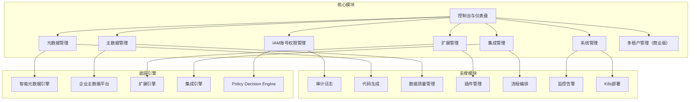

# BONE 产品需求文档（PRD）

## —— 企业级全栈开源快速开发平台 · 正式版（v2.1 修订，基线 v2.0 + 文档真源对齐）

> **产品口号（与根目录 README 一致）**：**Build Once, Natively Everywhere** — 元数据驱动，一次构建、多端运行。  
> **真源优先级**：**开源许可、仓库地址与快速开始** 以根目录 **README.md**、**LICENSE** 为准；**默认端口** 以 **`doc/wiki/03-本地开发与构建.md`** 与各模块 **`application.yml`** 为准；依赖版本以 **`bone-parent/pom.xml`** 为准。本 PRD 若与之冲突，以仓库为准并应回写修订本 PRD。  
> **文档性质**：正式产品需求文档，可直接指导研发排期、测试用例编写  
> **适用产品**：BONE企业级全栈开源快速开发平台  
> **对标参考**：字节跳动 DRF、腾讯 TAPD、阿里云效、OutSystems / Mendix 元数据驱动架构  
> **版本**：v2.1（v2.0 Final 修订稿） | **发布日期**：2026‑04‑19 | **最近修订**：2026‑05‑17 | **文档状态**：✅ 已发布 | **密级**：内部机密  

---

## 文档元信息

| 项目 | 内容 |
|------|------|
| 产品名称 | BONE企业级全栈开源快速开发平台 |
| 产品代号 | BONE |
| 文档版本 | v2.1（v2.0 Final 修订稿，与 README/LICENSE 对齐） |
| 文档状态 | ✅ 已发布 |
| 密级 | 内部机密 |
| 产品经理 | [姓名] |
| 技术负责人 | [姓名] |
| 项目负责人 | [姓名] |
| 生效日期 | 2026‑04‑19 |
| 目标发布 | 2026年Q2 MVP，Q3 阶段0，Q4 阶段1，2027 Q1 阶段2 |

---

## 修订记录

| 版本 | 日期 | 修订人 | 审核人 | 核心变更 | 状态 |
|------|------|--------|--------|----------|------|
| v0.1 | 2026-04-10 | 产品组 | 架构组 | 初稿框架 | Draft |
| v0.5 | 2026-04-15 | 产品+技术组 | 技术委 | 增补IAM模块、扩展引擎 | Draft |
| v0.9 | 2026-04-17 | 产品+架构组 | 技术委 | 融合集成引擎、优化性能需求 | Review |
| v1.0 | 2026-04-19 | 产品全组 | 全员 | 完整版：补充详细功能需求、非功能需求、发布策略 | Final |
| v1.1 | 2026-04-19 | 产品+架构组 | 技术委 | 结构级优化：三层强约束体系、统一领域模型、收敛为三大核心能力 | Final |
| **v2.0** | **2026-04-19** | **产品+架构组** | **技术委** | **正式版**：增加多租户、K8s部署、审计日志WORM存储、工期调整、质量门禁、开源社区策略、自研SDK优化指南、统一实体模型 | **Final** |
| v2.1 | 2026-05-16 | 产品+文档组 | 技术委 | 恢复 §7～§12 正文；与 README/MIT/Gitee monorepo、Bone-DDD 持久化 P0、架构/详设索引对齐；§1.2 补充「三大能力 ↔ 四大引擎」映射；修正 Metadata SDK 版本、质量门禁分层、§7 API 规划标注、§12.2 错误码分类、端口真源指向 wiki/03 | Final |
| v2.1-rev2 | 2026-05-17 | 产品+文档组 | 技术委 | 对齐 [README](../../README.md) 六大设计原则；§1.4–1.5 与价值矩阵改为「目标方向」；§4.4 双模式 + ExtPoint/主数据协同；旅程 1 双模式；详设模块 2/5 同步 | Final |

**评审记录**  
- T0 架构评审：2026-04-16 ✅ 通过  
- T1 产品评审：2026-04-17 ✅ 通过  
- T2 架构最终评审：2026-04-19 ✅ 通过  
- T2 合规评审：2026-04-17 ✅ 通过  

---

## 目录

1. [项目概述](#1-项目概述)
   - 1.1 市场背景与问题
   - 1.2 产品愿景与价值主张
   - 1.3 成功标准（OKR）
   - 1.4 北极星指标
   - 1.5 市场价值
2. [用户与场景分析](#2-用户与场景分析)
   - 2.1 用户角色画像
   - 2.2 核心用户旅程（端到端）
   - 2.3 目标行业与场景矩阵
   - 2.4 用户故事地图
3. [产品范围与边界](#3-产品范围与边界)
   - 3.1 包含范围（In Scope）
   - 3.2 不包含范围（Out of Scope）
   - 3.3 依赖与前置条件
4. [功能需求](#4-功能需求)
   - 4.1 优先级说明（MoSCoW）
   - 4.2 功能模块关系图
   - 4.3 控制台与仪表盘（P0）
   - 4.4 元数据管理（P0）
   - 4.5 主数据管理（P1）
   - 4.6 扩展管理（P1）
   - 4.7 集成管理（P1）
   - 4.8 IAM 账号权限管理（P0）
   - 4.9 系统管理（P0）
5. [非功能需求](#5-非功能需求)
   - 5.1 性能需求（SLO）
   - 5.2 可用性与可靠性
   - 5.3 安全与合规
   - 5.4 信创适配要求
   - 5.5 兼容性要求
   - 5.6 可扩展性与可维护性
   - 5.7 可测试性（含质量门禁）
   - 5.8 可观测性
6. [数据与埋点体系](#6-数据与埋点体系)
   - 6.1 核心指标体系
   - 6.2 埋点事件设计
   - 6.3 A/B实验框架
7. [技术与部署架构](#7-技术与部署架构)
   - 7.1 架构设计
   - 7.2 技术选型（含自研SDK优化指南）
   - 7.3 核心API定义
   - 7.4 数据模型
   - 7.5 部署方案
   - 7.6 配置管理
   - 7.7 监控与告警
   - 7.8 架构决策记录(ADR)
8. [发布与灰度策略](#8-发布与灰度策略)
   - 8.1 分阶段发布里程碑
   - 8.2 灰度发布计划
   - 8.3 准入与退出条件
   - 8.4 回滚策略
9. [实施计划](#9-实施计划)
   - 9.1 开发阶段
   - 9.2 上线计划
10. [风险与依赖](#10-风险与依赖)
    - 10.1 风险登记册
    - 10.2 外部依赖清单
11. [开源与社区策略](#11-开源与社区策略)
    - 11.1 许可证
    - 11.2 代码仓库与治理
    - 11.3 社区激励计划
    - 11.4 文档与示例
12. [附录](#12-附录)
    - 12.1 术语表
    - 12.2 错误码列表
    - 12.3 参考文档

---

## 1. 项目概述

### 1.1 市场背景与问题

企业数字化转型已进入深水区，传统开发模式面临三大核心挑战：

| 痛点 | 描述 | 客户影响 |
|------|------|----------|
| **开发效率低下** | 重复编码、手动配置、缺乏标准化，导致开发周期长、交付慢 | 市场响应速度慢，错失业务机会 |
| **系统集成复杂** | 异构系统多，接口对接繁琐，数据孤岛严重 | 数据流通不畅，业务协同困难 |
| **技术债务累积** | 代码质量参差不齐，维护成本高，扩展性差 | 系统稳定性差，升级困难 |

**市场机会**：2026 年中国企业级低代码 / 元数据驱动开发平台市场规模预计 **85 亿元**，年复合增长率 52%。金融、制造、政务三大行业占比超 65%，且愿意为“快速开发+标准化架构”支付 **250% 溢价**（客单价可达 80 万/套以上）。开源元数据平台如 NocoBase 等逐渐兴起，但企业级集成与主数据治理能力较弱——这是 BONE 的切入点。

> **数据口径**：上段量化指标为**内部研判与叙事辅助**；若用于对外商务、投融资或监管材料，须替换为**可引用来源的第三方数据**或标注为估算区间，避免将 PRD 当作单一事实源。

### 1.2 产品愿景与价值主张

**产品愿景**：构建元数据驱动的企业开发平台——通过三大核心能力（应用生成、企业集成、扩展运行时），将企业应用开发从“代码驱动”转变为“模型驱动”，缩短标准应用的交付周期。

**一句话定位**：面向企业级场景的、**开源**的、元数据驱动的快速开发平台，提供应用生成、企业集成和扩展运行时三大核心能力。

#### 与 README「四大引擎」的对应（避免「三大 vs 四大」歧义）

根目录 README 用 **四大引擎** 描述技术闭环（数据—质量—功能—生态）；本 PRD 用 **三大核心能力** 描述立项与交付边界。二者**分工不同、互为补充**，映射如下：

| PRD 三大核心能力（产品叙事） | README 技术引擎 / 能力域 |
|------------------------------|---------------------------|
| **应用生成** | **智能元数据引擎**（双模式：**A** `sdk`+`server`+`studio-generator` 生成式；**B** `sdk`+`bone-metadata-engine` 运行时动态 CRUD）+ 控制台；详见 [元数据能力对照](../design/modules/元数据能力-实现映射与竞品对照.md) §1.3 |
| **企业集成** | **集成引擎**（连接器、流程编排）；**主数据与质量**由 **企业主数据平台** 独立承载，在消费链路与集成侧协同 |
| **扩展运行时** | **ExtPoint 扩展引擎**（扩展点、插件生命周期、隔离与观测） |
| （横切，贯穿上表） | **IAM / 审计 / 多租户（商业版）/ 系统管理** — 安全与运维基线 |

总体技术边界与非功能基线仍以 **[doc/architecture/BONE-总体架构设计方案.md](../architecture/BONE-总体架构设计方案.md)** 为准。

#### 设计原则（与 [README](../../README.md) 一致）

下列原则**不因单版本交付进度而削弱**；PRD 需求与详设须显式标注 As-Is / 目标态：

| 原则 | 对产品需求的影响 |
|------|------------------|
| **元数据先行** | 实体/字段/规则可配置、可版本化；应用生成含 **模式 A 生成** 与 **模式 B 运行时** 两条路径 |
| **开闭原则（ExtPoint）** | §4.6 扩展运行时：稳定接口 + 插件实现，**禁止**以改主干代码交付行业差异 |
| **单一可信数据源** | §4.5 主数据与元数据 catalog 边界清晰，消费走 API/SDK |
| **契约化集成** | §4.x 集成：连接器、编排、幂等与可观测为一等公民 |
| **契约化 API** | 统一 `/api/v1/{domain}/**`；错误码见 [Bone-API-规范](../architecture/Bone-API-规范.md) |
| **工程诚实** | 愿景在本 PRD；实际进度以 [P0 看板](../wiki/07-P0-TODO看板.md) 与各详设 As-Is 为准 |

**核心价值主张矩阵**：

| 用户角色 | 核心诉求 | 本方案价值 | 目标方向（非承诺 SLA） |
|----------|----------|-------------|------------------------|
| **CIO/CTO** | 开发效率、系统一致性、TCO可控 | 元数据驱动开发，统一技术栈，**开源无供应商锁定** | 交付周期与维护成本低于项目制重复建设 |
| **开发团队** | 快速交付、标准化开发、减少重复工作 | 可视化建模，双模式交付，统一架构，**可二次开发** | 样板代码减少（模式 A 生成率见 §1.4） |
| **业务部门** | 快速响应业务需求、数据一致性 | 业务建模直观，主数据治理，流程编排 | 标准需求响应从周级向天级演进 |
| **集成工程师** | 系统集成便捷、数据同步可靠 | 可视化流程编排，连接器，**ExtPoint 扩展** | 标准连接器对接人天下降 |
| **社区贡献者** | 参与开源、技术影响力 | 贡献代码、插件，获得社区认可 | 贡献者规模随版本增长（见 OKR KR8–10） |

### 1.3 成功标准（OKR）

| Objective | Key Result | 目标值 | 优先级 |
|-----------|------------|--------|--------|
| **O1：成为元数据驱动开发领域领导者** | KR1: 支持30+业务实体模板（MVP后逐步增长） | 30+ | P0 |
| | KR2: 代码生成覆盖率 | >85% | P0 |
| | KR3: 金融/制造/政务行业标杆客户 | ≥5家 | P0 |
| | KR4: 客单价ARPU（商业版） | ≥60万/套 | P1 |
| **O2：构建企业级高可用架构** | KR5: 核心服务SLA（分级，见 §5.2） | 社区版 99.5% / 商业版 99.9%（[Target]） | P0 |
| | KR6: API响应时间P99（分级，见 §5.1） | 社区版 <2s / 商业版 <500ms（[Target]） | P0 |
| | KR7: 支撑并发用户（分级，见 §5.1） | 社区版 100 / 商业版 1000（[Target]） | P0 |
| **O3：扩展与社区开放** | KR8: 社区贡献者数量 | ≥50人 | P2 |
| | KR9: 官方插件数量 | ≥10个 | P2 |
| | KR10: 扩展点数量 | ≥30个 | P2 |

### 1.4 北极星指标（目标方向）

> 下列为 **产品目标与 OKR 对齐口径**，非对外 SLA；与 [README](../../README.md)「目标效能」一致，上线后须以基准测试补充数据。

| 指标 | 定义 | 目标方向 |
|------|------|----------|
| **应用交付效率** | 标准 CRUD 应用从建模到可运行测试环境耗时 / 传统开发耗时 | &lt;40% 传统耗时（**模式 B** 优先衡量免生成路径；**模式 A** 含生成+编译） |
| **代码生成率** | 自动生成非样板代码 / 总非样板代码（模式 A 域） | &gt;85% |
| **模式 B 覆盖率** | `delivery_mode=RUNTIME` 且已发布实体中，由 engine 提供标准 CRUD 的比例 | 路线图递增（见 §4.4 META-002B） |
| **系统集成时间** | 单系统标准连接器对接人天 | 目标低于纯定制（见集成详设 As-Is） |

*标准测试基准（建议）*：客户管理（10 字段）+ 订单主子表 + 2 条集成流；分别跑 **GENERATIVE** 与 **RUNTIME** 两条路径对比。

### 1.5 市场价值（目标方向）

- **开发效率**：元数据驱动 + 双模式选型，缩短标准应用交付周期（模式 B：天级可演示；模式 A：可审计源码）
- **多端**：一次建模，Web 已为主线；App/小程序为规划
- **集成与主数据**：连接器 + 统一主数据，降低孤岛与核对成本
- **架构演进**：模型发布与扩展点热更新，减少全量重构
- **开源**：无供应商锁定，社区可贡献连接器与扩展实现

---

## 2. 用户与场景分析

### 2.1 用户角色画像

| 角色层级 | 角色名称 | 典型画像 | 核心诉求 | 使用频率 |
|----------|----------|----------|----------|----------|
| 决策层 | CIO/CTO | 企业IT负责人 | 开发效率、系统一致性、TCO可控 | 低频 |
| 管理层 | 开发团队负责人 | 技术团队主管 | 标准化开发、快速交付、团队协作 | 中频 |
| 执行层 | 开发人员 | 企业开发工程师 | 快速编码、减少重复工作、代码质量 | 高频 |
| 执行层 | 业务分析师 | 业务需求分析师 | 业务建模、数据治理、需求交付 | 高频 |
| 执行层 | 集成工程师 | 系统集成专员 | 系统对接、流程编排、数据同步 | 中频 |
| 运维层 | 系统管理员 | IT运维人员 | 系统配置、监控告警、权限管理 | 日常 |
| 社区层 | 社区贡献者 | 外部开发者/ISV | 参与开源、扩展插件、获取技术影响力 | 项目制 |
| 社区层 | 插件开发者 | ISV/企业内部IT | 扩展开发、插件发布、API集成 | 项目制 |

### 2.2 核心用户旅程（端到端）

#### 旅程1：开发人员 —— 从业务建模到可运行应用（双模式）

1. **登录**：通过企业 SSO 或本地账号。
2. **业务建模**：在元数据模块创建实体/字段/关系，选择 **交付模式**（`delivery_mode`）：
   - **GENERATIVE（模式 A）**：信创/深度定制 → 走代码生成；
   - **RUNTIME（模式 B，规划）**：运营类标准 CRUD → 发布后直接获得动态 API。
3. **交付**：
   - **模式 A**：选模板 → `studio-generator` 生成前后端 → 编译部署；
   - **模式 B**：发布实体 → `bone-metadata-engine` 提供动态 REST（META-002B）。
4. **扩展（可选）**：在生成代码或宿主服务中挂载 ExtPoint 实现行业逻辑（§4.6）。
5. **测试与迭代**：验证 API/页面；模型变更按发布流程演进。
6. **迭代**：根据测试结果调整业务模型，重新生成代码。

#### 旅程2：业务分析师 —— 主数据治理

1. **登录**：通过企业SSO单点登录系统。
2. **主数据模型定义**：从已有业务实体中选择启用主数据治理，或直接创建主数据模型。
3. **数据质量规则配置**：配置数据质量规则，如唯一性、格式、范围等。
4. **数据导入**：批量导入主数据记录。
5. **质量检查**：执行数据质量检查，查看质量报告。
6. **数据发布**：将通过质量检查的主数据发布到生产环境。

#### 旅程3：集成工程师 —— 系统集成与流程编排

1. **登录**：通过企业SSO单点登录系统。
2. **连接器配置**：配置与外部系统的连接器，如ERP、CRM等。
3. **流程设计**：使用可视化流程设计器创建集成流程（支持场景化模板）。
4. **流程测试**：测试集成流程的执行效果。
5. **流程激活**：激活集成流程，使其正式运行。
6. **监控**：监控集成流程的执行状态和日志。

#### 旅程4：系统管理员 —— 系统部署与监控运维

1. **环境准备**：准备 Kubernetes 集群，配置基础组件（MySQL数据库、Redis缓存、Nacos注册中心等）。
2. **系统部署**：通过 Helm Chart 一键部署 BONE 平台。
3. **配置初始化**：配置系统参数、数据库连接、外部系统集成等。
4. **用户与权限管理**：创建用户账号，分配角色和权限，创建租户（商业版）。
5. **系统监控**：通过 Grafana 面板查看系统健康状态、资源使用率、性能指标。
6. **告警处理**：接收告警通知，分析问题原因，及时修复故障。
7. **备份与恢复**：定期执行数据库备份，在需要时进行数据恢复。

#### 旅程5：插件开发者 —— 扩展功能开发与部署

> **术语**：控制台「插件」= 扩展实现（`@Extension` + `exts_extension_impl`）；制品为 JAR（`exts_plugin_version`）。见 [扩展管理详设 v2.1](../design/modules/5.%20扩展管理模块详细设计方案.md) §3.1。

1. **扩展点调研**：查看扩展点接口契约（Java FQCN）与路由维度说明。
2. **扩展实现开发**：基于 `bone-extension-sdk` 实现 `@Extension`，配置 `BizContext` 维度（租户/业务/场景等）。
3. **本地测试**：在宿主应用中联调扩展点调用与路由。
4. **制品上传**：上传 JAR，登记版本与 checksum。
5. **绑定与配置**：绑定扩展点、设置优先级/默认实现/`config_json`（含 SpEL）。
6. **发布生效**：`:deploy` + `:publish-runtime` 推送路由元数据，无需重启宿主 JVM。
7. **功能验证**：查看执行日志、审计记录与概览统计。

#### 旅程6：开发团队 —— 项目协作与迭代开发

1. **团队成员登录**：所有团队成员通过企业SSO单点登录系统。
2. **项目空间创建**：创建项目空间，邀请团队成员加入。
3. **业务模型协作**：团队成员共同设计业务实体和关系，支持多人实时协作。
4. **版本管理**：管理业务模型的不同版本，支持版本对比和回滚。
5. **代码生成与分支管理**：生成代码并集成到Git等版本控制系统。
6. **持续集成**：通过CI/CD流程自动测试和部署生成的代码。
7. **迭代优化**：根据业务反馈持续优化业务模型，重新生成代码。

### 2.3 目标行业与场景矩阵

| 行业 | 优先级 | 核心场景 | 关键需求 | 对应功能模块 |
|------|--------|----------|----------|--------------|
| 金融 | P0 | 核心业务系统开发、数据治理 | 元数据管理、主数据治理、安全合规 | 元数据管理、主数据管理、IAM |
| 制造 | P0 | 生产管理系统、供应链集成 | 系统集成、流程编排、扩展开发 | 集成管理、扩展管理 |
| 政务 | P0 | 政务服务系统、数据共享 | 标准化开发、数据治理、安全合规 | 元数据管理、主数据管理、IAM |
| 医药 | P1 | 研发管理系统、合规管理 | 流程编排、数据治理 | 集成管理、主数据管理 |
| 零售 | P1 | 会员管理系统、库存管理 | 快速开发、系统集成 | 元数据管理、集成管理 |

### 2.4 用户故事地图（节选）

| 用户角色 | 活动 | 任务 | 用户故事 |
|----------|------|------|----------|
| 开发人员 | 业务建模 | 创建实体 | 作为开发人员，我希望创建业务实体并定义字段和关系，以便快速构建业务模型 |
| 开发人员 | 代码生成 | 生成代码 | 作为开发人员，我希望基于业务模型一键生成前后端代码，以减少重复编码工作 |
| 业务分析师 | 主数据管理 | 定义主数据 | 作为业务分析师，我希望定义主数据模型和质量规则，以确保数据一致性 |
| 集成工程师 | 流程编排 | 设计流程 | 作为集成工程师，我希望使用可视化工具设计集成流程，以简化系统对接 |
| 系统管理员 | 权限管理 | 管理用户权限 | 作为系统管理员，我希望管理用户角色和权限，以确保系统安全 |
| 插件开发者 | 扩展开发 | 开发插件 | 作为插件开发者，我希望开发和部署插件，以扩展系统功能 |
| 系统管理员 | 多租户管理 | 创建租户 | 作为系统管理员，我希望创建租户并分配资源配额，以实现多组织隔离 |

---

## 3. 产品范围与边界

### 3.1 包含范围（In Scope）

#### 3.1.1 BONE三大核心能力

| 核心能力 | 功能模块 | 详细能力 |
|----------|----------|----------|
| **应用生成（Metadata-driven App Gen）** | 元数据管理（能力包） | 业务建模、扩展字段、规则引擎；**模式 A** 代码生成/模板、**模式 B** 运行时动态 CRUD；见 [元数据能力对照](../design/modules/元数据能力-实现映射与竞品对照.md) §1.3 |
| | 控制台与仪表盘 | 系统概览、快速入口 |
| **企业集成（Integration Fabric）** | 集成管理 | 连接器管理、流程编排、流程监控 |
| | 主数据管理 | 主数据模型、数据质量、数据记录 |
| **扩展运行时（Extension Runtime）** | 扩展管理 | 扩展点契约、扩展实现（控制台称插件）、JAR 制品与路由发布、执行/审计（详设 v2.1；Wasm 为 [Vision]） |
| | IAM管理 | 用户管理、角色管理、权限管理、审计日志、多租户（商业版） |

#### 3.1.2 支撑模块

| 模块 | 详细能力 |
|------|----------|
| **系统管理** | 系统配置、监控告警、日志管理 |
| **部署与运维** | Kubernetes Helm Chart、Prometheus 监控集成 |
| **统一领域模型** | Entity、Attribute、Relation、Policy、Event、ExtensionPoint |

#### 3.1.3 开源社区版 vs 商业版边界

| 功能 | 社区版 | 商业版 |
|------|--------|--------|
| 元数据管理（实体、字段、关系） | ✅ **MVP-2 基线**（catalog REST + 控制台 CRUD；版本历史/转主数据为 P1+） | ✅ |
| 扩展字段（预留列/JSON/EAV，sdk + server） | ✅ | ✅ |
| 代码生成（默认模板） | 🔶（studio-generator） | ✅ |
| 自定义模板 | ❌ | ✅ |
| 主数据管理（模型+质量规则） | ❌ | ✅ |
| 集成管理（连接器+流程编排） | 仅支持 REST/SOAP 连接器 | 全部连接器 + 高级 EIP |
| 扩展管理（插件热部署） | ✅ | ✅ |
| IAM（RBAC + 审计日志） | ✅（审计日志保留 30 天） | ✅（审计日志 WORM 存储 180 天） |
| 多租户 | ❌ | ✅ |
| 信创数据库适配 | ❌ | ✅ |
| 企业级 SSO（LDAP/OAuth/SAML） | ❌ | ✅ |
| Kubernetes Helm Chart | ✅ | ✅ |
| 官方技术支持 | GitHub Issues | SLA 保障 |

### 3.2 不包含范围（Out of Scope）

| 功能 | 原因 | 替代方案/后续版本 |
|------|------|-------------------|
| 原生移动应用开发 | 资源优先 | V2.0规划 |
| 机器学习/AI模型训练 | 非核心能力 | 集成第三方AI服务 |
| 大数据分析 | 非核心能力 | 集成第三方BI工具 |
| 实时音视频通信 | 非核心能力 | 集成第三方通信工具 |
| 区块链集成 | 非核心能力 | V3.0规划 |

### 3.3 依赖与前置条件

| 依赖项 | 提供方 | 要求 | 风险等级 |
|--------|--------|------|----------|
| 企业统一认证 | 企业IT | OAuth2/SAML/LDAP接口 | 中 |
| 数据库 | 企业IT | MySQL 8.0+ / PostgreSQL 15.0+ / 达梦8 / 人大金仓 | 高 |
| 消息队列 | 企业IT | RocketMQ 5.1+ | 中 |
| 缓存 | 企业IT | Redis 7.0+ | 中 |
| 服务注册中心 | 企业IT | Nacos 2.2+ | 高 |
| 对象存储 | 企业IT | S3兼容（MinIO/AWS S3/阿里云OSS） | 中 |
| Kubernetes集群 | 企业IT | K8s 1.24+ | 中 |

**数据库说明**：
- BONE平台支持多种数据库，包括MySQL、PostgreSQL、达梦8、人大金仓等，可根据企业需求选择。
- **一期开发阶段**使用MySQL 8.0+作为主要数据库。
- 支持跨数据库兼容性设计，通过 Bone Metadata SDK 抽象数据访问层，业务代码不随数据库切换而改动。

---

## 4. 功能需求

### 4.1 优先级说明（MoSCoW）

| 优先级 | 定义 | 交付阶段 |
|--------|------|----------|
| **P0** | 核心准入能力，缺失则产品不可发布 | MVP、阶段0 |
| **P1** | 核心竞争力，高业务价值 | 阶段1、阶段2 |
| **P2** | 增值体验，有条件可纳入 | 阶段3 |

### 4.2 功能模块关系图

> **工程注记**：图中「元数据管理」= 产品模块；实现为 `bone-metadata-sdk` + `server` + `engine` + `studio-generator` + `bone-metadata-app`，非单一服务。见 §4.4 实现映射。



### 4.3 控制台与仪表盘（P0）

#### 需求ID: DASH-001 系统概览

**用户故事**  
> 作为系统管理员，我希望查看系统健康状态、关键指标和最近操作，以便快速了解系统运行情况。

**验收标准（BDD）**
```gherkin
Scenario: 查看系统概览
  Given 用户已登录系统，且拥有系统管理权限
  When 用户访问控制台首页
  Then 系统显示系统健康状态（CPU、内存、磁盘使用率）
    And 显示关键业务指标（实体数量、代码生成次数、集成流程执行次数）
    And 显示最近操作记录（用户登录、实体创建、代码生成等）
    And 所有数据实时更新，刷新间隔可配置（默认30秒）
```

**业务规则**
- 健康状态指标每30秒自动刷新
- 关键业务指标每5分钟自动刷新
- 最近操作记录显示最近24小时内的操作
- 商业版支持按租户聚合展示指标

> **As-Is**: CPU/磁盘指标为 [Target]，当前仅 JVM 内存可用；关键业务指标与最近操作记录为 As-Is。

---

#### 需求ID: DASH-002 快速入口

**用户故事**  
> 作为用户，我希望通过快速入口访问常用功能，查看待办事项，以提高工作效率。

**验收标准（BDD）**
```gherkin
Scenario: 使用快速入口
  Given 用户已登录系统
  When 用户访问控制台首页
  Then 系统显示常用功能的快速入口（如创建实体、生成代码、设计流程等）
    And 显示用户待办事项（如审批任务、待处理的质量问题等）
    And 快速入口可自定义，支持拖拽排序
```

**业务规则**
- 快速入口最多显示8个常用功能
- 待办事项最多显示10条
- 快速入口和待办事项可根据用户角色自动调整

> **As-Is**: 拖拽排序和待办事项为 [Vision]；快速入口静态展示为 As-Is。

---

### 4.4 元数据管理（P0）

> **工程实现映射（单一真源）**：[元数据能力-实现映射与竞品对照.md](../design/modules/元数据能力-实现映射与竞品对照.md)  
> - **bone-metadata-sdk**：平台数据面（持久化 + 扩展字段三模式：预留列（默认）/JSON/EAV），**模式 A / B 共用**。  
> - **bone-metadata-server**（`:9001`）：元模型控制面 — 扩展字段 REST + catalog REST（`/api/v1/metadata/*`）。多应用共享扩展字段时用 `REMOTE`。  
> - **模式 A · 生成式**：`studio-generator` / `bone-codegen` → 可编译源码进 Git（信创、深度定制、ExtPoint）。  
> - **模式 B · 运行时**：`bone-metadata-engine` → 按已发布 `meta_*` 提供动态 CRUD / SmartQL / 规则，**标准场景可不生成业务 Controller**（对标 Salesforce 声明式运行时）。  
> 下文 META-* 验收为目标态；As-Is 见对照文档 §7（**当前主线为模式 A**；模式 B 引擎待接平台）。

#### 双模式交付（产品定位）

| 维度 | **模式 A · 生成式** | **模式 B · 运行时** |
|------|---------------------|---------------------|
| 消费方式 | 元数据 → 生成 Java/TS → 编译部署 | 元数据 → 解释执行 → `sdk` 直读写库 |
| 主责模块 | `studio-generator` | `bone-metadata-engine` |
| 优先场景 | 源码审计、DDD 门禁、复杂领域逻辑 | 运营台、配置型实体、多租户标准对象 |
| 同类产品参照 | OutSystems、JHipster | Mendix 默认运行时、Directus / Hasura |
| 演进 | 收窄为「骨架 + 逃逸舱」 | 覆盖标准 CRUD 后，**不必**为每实体生成代码 |

**原则**：`engine` 与 `generator` 是同一 `meta_*` 的两种消费路径，**可并存**；企业可按系统/域选型（详见 [README](../../README.md) 智能元数据引擎节）。

**与扩展引擎协同**：**模式 A** 生成代码中可预置 ExtPoint 接口供手写/插件实现；**模式 B** 动态 API 执行链可在 engine 内调用扩展点（规划）。与主数据：catalog 实体可标 `type=主数据类`，发布后经主数据模块治理（§4.5）。

#### 需求ID: META-001 业务实体管理

**用户故事**  
> 作为开发人员，我希望创建、编辑、删除业务实体，管理实体字段和关系，以便构建业务模型。

**验收标准（BDD）**
```gherkin
Scenario: 创建业务实体
  Given 用户已登录系统，且拥有元数据管理权限
  When 用户点击“创建实体”，填写实体名称和描述，添加字段和关系
  Then 系统保存实体，返回实体ID
    And 实体状态为“草稿”
    And 支持实体版本管理

Scenario: 编辑业务实体
  Given 用户已创建实体，状态为“草稿”
  When 用户修改实体名称、描述、字段或关系
  Then 系统保存修改，生成新的版本
    And 实体状态保持为“草稿”

Scenario: 删除业务实体
  Given 用户已创建实体，状态为“草稿”
  When 用户点击“删除”按钮
  Then 系统删除实体，所有相关字段和关系也被删除
    And 已删除的实体不可恢复

Scenario: 将业务实体转换为主数据模型
  Given 用户已创建并发布业务实体
  When 用户点击“转换为主数据模型”
  Then 系统复制实体定义，entity_type 变为 MASTER_DATA
    And 原业务实体保持不变
    And 新的主数据模型可配置数据质量规则
```

**业务规则**
- 实体名称必须唯一（在同一租户内）
- 字段类型支持字符串、数字、日期、布尔值、枚举、关联等
- 关系类型支持一对一、一对多、多对多
- 实体状态包括：草稿、已发布、已归档
- 实体类型与 `meta_entity.type` 对齐：`0` 普通业务实体、`1` 主数据类实体（PRD 叙事 BUSINESS / MASTER_DATA）；「转主数据」为跨模块流程，见 [masterdata 边界](../design/modules/元数据能力-实现映射与竞品对照.md) §8
- 实体版本历史（`/entities/{id}/versions`）为 **P1**，MVP-2 验收以草稿/发布/归档为主

---

#### 需求ID: META-002 代码生成（模式 A · 生成式交付）

**用户故事**  
> 作为开发人员，我希望基于业务实体生成前后端代码，支持多种模板，以减少重复编码工作（**模式 A**；若实体已启用模式 B 运行时面，标准 CRUD 可不经过本需求）。

**验收标准（BDD）**
```gherkin
Scenario: 生成代码
  Given 用户已创建并发布业务实体
  When 用户选择代码模板（如React+Spring Boot），点击“生成代码”
  Then 系统启动代码生成任务，显示任务进度
    And 生成完成后，提供代码下载链接
    And 生成的代码包含前端页面、后端API、数据模型等

Scenario: 预览模板生成效果
  Given 用户正在编辑自定义模板
  When 用户点击“预览”，选择一个示例实体
  Then 系统显示模板渲染后的代码片段
    And 支持语法高亮和错误提示

Scenario: 查看生成历史
  Given 用户已生成代码
  When 用户访问“代码生成历史”页面
  Then 系统显示所有代码生成任务的状态、时间、模板等信息
    And 支持按实体、模板、时间等条件筛选
```

**业务规则**
- 支持的模板包括：React+Spring Boot、Vue+Spring Boot、Angular+Spring Boot等
- 代码生成任务支持异步执行，超时时间60秒
- 生成的代码包含完整的项目结构和配置文件
- 模板引擎使用 **FreeMarker 2.3.32**，提供内置函数库和变量模型文档
- 模板版本与实体版本解耦：实体变更时，代码生成页面提示“模板可能不兼容”，用户可选择继续生成或升级模板
- 实体可标注交付模式：`meta_entity.delivery_mode` — `0` GENERATIVE（默认，走本需求）/ `1` RUNTIME（走 META-002B，跳过标准 CRUD 生成）；**As-Is** 已落库与 catalog API

---

#### 需求ID: META-002B 运行时元数据面（模式 B · P1）

> **As-Is**: 已实现（META-002B-01~05 done，见 [P0 看板](../wiki/07-P0-TODO看板.md)），待验收。

**用户故事**  
> 作为开发人员或实施顾问，我希望对已发布的业务实体直接获得标准 CRUD API 与列表能力，而无需为每个实体生成并部署 Controller 代码。

**验收标准（BDD）**
```gherkin
Scenario: 发布实体后获得动态 API
  Given 用户已发布业务实体 E，且 E 的交付模式为 RUNTIME
  When 系统完成发布
  Then 可通过统一前缀访问 E 的列表、详情、创建、更新、删除 API
    And 请求经 bone-metadata-engine 解析 meta_* 后由 bone-metadata-sdk 执行持久化
    And 不生成 E 专属的 Java Controller 源码

Scenario: 规则与校验在运行时生效
  Given 实体 E 已配置字段校验或业务规则
  When 用户通过动态 API 写入不符合规则的数据
  Then 返回统一错误码与校验说明
    And 行为与模式 A 生成代码的校验语义一致（可配置对齐）

Scenario: 模式 B 与模式 A 共存
  Given 租户内实体 E1 为 RUNTIME、E2 为 GENERATIVE
  When 用户分别访问两类实体
  Then E1 走动态 API，E2 仍通过生成工程或手工 Controller 访问
    And 元模型与控制面 API 一致（catalog @ bone-metadata-server）
```

**业务规则**
- 动态 API 路径纳入 `/api/v1/metadata` 或独立 `dynamic` 域，以 [Bone-API-规范](../architecture/Bone-API-规范.md) 登记为准
- **engine 编排、sdk 执行**：禁止在 engine 内重复实现 JDBC 栈
- 复杂流程、ExtPoint 织入、信创源码交付仍走 **模式 A** 或手写
- As-Is：`bone-metadata-engine` 库存在，本需求已实现（META-002B-01~05 done），待验收；见对照文档 §1.3

---

#### 需求ID: META-003 模板管理

**用户故事**  
> 作为开发人员，我希望管理代码生成模板，支持自定义模板，以满足不同项目的需求。

**验收标准（BDD）**
```gherkin
Scenario: 创建自定义模板
  Given 用户已登录系统，且拥有模板管理权限
  When 用户点击“创建模板”，填写模板名称、类型、内容
  Then 系统保存模板，返回模板ID
    And 模板状态为“草稿”

Scenario: 编辑模板
  Given 用户已创建模板，状态为“草稿”
  When 用户修改模板名称、类型或内容
  Then 系统保存修改，生成新的版本

Scenario: 发布模板
  Given 用户已创建模板，状态为“草稿”
  When 用户点击“发布”按钮
  Then 模板状态变为“已发布”
    And 已发布的模板可用于代码生成
```

**业务规则**
- 模板类型包括：前端模板、后端模板、数据库模板
- 模板内容支持变量替换和条件逻辑
- 模板支持版本管理，保留最近5个版本
- 模板调试：提供沙箱环境测试模板渲染结果

---

### 4.5 主数据管理（P1）

#### 需求ID: MASTER-001 主数据模型管理

**用户故事**  
> 作为业务分析师，我希望定义主数据模型，管理模型字段，以构建主数据模型。

**验收标准（BDD）**
```gherkin
Scenario: 创建主数据模型
  Given 用户已登录系统，且拥有主数据管理权限
  When 用户点击“创建主数据模型”，填写模型名称和描述，添加字段
  Then 系统保存模型，entity_type 为 MASTER_DATA
    And 模型状态为“草稿”

Scenario: 从业务实体提升为主数据模型
  Given 用户已创建业务实体
  When 用户选择“启用主数据治理”
  Then 系统将该实体的 entity_type 更新为 MASTER_DATA
    And 自动创建对应的主数据记录表

Scenario: 发布主数据模型
  Given 用户已创建主数据模型，状态为“草稿”
  When 用户点击“发布”按钮
  Then 模型状态变为“已发布”
    And 已发布的模型可用于数据录入
```

**业务规则**
- 主数据模型名称必须唯一（同一租户内）
- 字段类型支持字符串、数字、日期、布尔值等常用类型
- 主数据模型状态包括：草稿、已发布、已归档

---

#### 需求ID: MASTER-002 数据质量管理

**用户故事**  
> 作为业务分析师，我希望配置数据质量规则，执行质量检查，生成质量报告，以确保主数据质量。

**验收标准（BDD）**
```gherkin
Scenario: 配置数据质量规则
  Given 用户已创建并发布主数据模型
  When 用户点击“添加质量规则”，选择规则类型（如唯一性、格式、范围），设置规则参数
  Then 系统保存规则，返回规则ID

Scenario: 执行质量检查
  Given 用户已配置数据质量规则，且主数据模型已有数据记录
  When 用户点击“执行质量检查”
  Then 系统执行质量检查，生成质量报告
    And 报告显示检查结果、问题数量、严重程度等

Scenario: 查看质量报告
  Given 用户已执行质量检查
  When 用户访问“质量报告”页面
  Then 系统显示历史质量检查报告列表
    And 支持按实体、时间等条件筛选
```

**业务规则**
- 支持的质量规则类型包括：唯一性、格式、范围、必填、引用完整性等
- 质量检查支持全量检查和增量检查
- 质量报告支持导出为Excel格式

---

#### 需求ID: MASTER-003 主数据记录管理

**用户故事**  
> 作为业务分析师，我希望管理主数据记录，支持批量导入导出，以维护主数据。

**验收标准（BDD）**
```gherkin
Scenario: 导入主数据记录
  Given 用户已创建并发布主数据模型
  When 用户上传Excel文件，映射字段
  Then 系统导入数据，显示导入结果（成功/失败数量）
    And 导入的数据状态为“草稿”

Scenario: 编辑主数据记录
  Given 用户已导入主数据记录，状态为“草稿”
  When 用户修改记录字段值
  Then 系统保存修改

Scenario: 发布主数据记录
  Given 用户已导入主数据记录，状态为“草稿”
  When 用户点击“发布”按钮
  Then 记录状态变为“已发布”
    And 已发布的记录可用于业务系统
```

**业务规则**
- 支持Excel、CSV格式的数据导入
- 导入数据支持字段映射和数据验证
- 记录状态包括：草稿、已发布、已归档

---

### 4.6 扩展管理（P1）

> **平台定位（README）**：**ExtPoint 扩展引擎** — 在 **不修改核心代码** 的前提下，通过稳定扩展点接口与 JAR 插件生长业务能力（开闭原则）。  
> **详设真源**：[扩展管理模块详细设计方案 v2.1](../design/modules/5.%20扩展管理模块详细设计方案.md)（As-Is / [Target] / [Vision] 分层）。  
> **工程**：`bone-extension-sdk`（运行时）、`bone-extension-studio`（**8088**）、`bone-extension-app`（**3008**）。  
> **API**：`/api/v1/extension/*`；鉴权 Scope 见 [Bone-API-规范](../architecture/Bone-API-规范.md) §9.2。  
> **As-Is 运行时**：Java 扩展点 + `BizContext` 四级路由 + JAR 制品 + 元数据热发布；**非** Wasm 沙箱（Wasm 见详设 §12 [Vision]）。  
> **与元数据双模式**：行业逻辑优先 **ExtPoint**；标准 CRUD 由元数据 **模式 A/B** 承担，避免把「变体业务」建模为重复实体（见详设 §1.5）。

#### 需求ID: EXT-001 扩展点管理（As-Is）

**用户故事**  
> 作为开发人员，我希望登记稳定扩展点接口（Java FQCN），并管理其启用状态，以支撑多实现路由。

**验收标准（BDD）**
```gherkin
Scenario: 创建扩展点
  Given 用户已登录且 JWT 含 scope extension:points:write
  When 用户 POST /api/v1/extension/points，填写名称、描述、interfaceName（接口 FQCN）、业务域
  Then 系统保存至 exts_extension_point 并返回扩展点 ID
    And 响应为 ApiResponse 成功信封

Scenario: 查询与搜索扩展点
  Given 用户含 scope extension:points:read
  When 用户 GET /api/v1/extension/points，可选 keyword、domain、category
  Then 返回扩展点列表（支持 page/size 分页）

Scenario: 禁用扩展点
  Given 扩展点状态为 ENABLED
  When 用户 POST /api/v1/extension/points/{id}:disable
  Then 状态变为 DISABLED
    And 运行时不再对该扩展点选路（已发布元数据同步后生效）
```

**业务规则（As-Is）**
- 扩展点 = **稳定 Java 接口契约**（`interface_name` / `point_code`，通常 FQCN）；**不**使用「前置/后置/环绕」作为扩展点类型字段
- 单次方法调用的 before/around/after 属于 SDK `ExtensionLifecycle`，与扩展点元数据无关
- 状态：`ENABLED` / `DISABLED`
- 租户隔离：`tenant_id`；禁止跨租户修改

**As-Is（2026-05）**：创建返回 **201 + `Location`**；PUT 支持 **`If-Match` / `version`**（冲突 412）；写操作支持 **`Idempotency-Key`**（进程内 24h）。SDK 扩展执行 **舱壁 + 超时**（`ExtensionExecutionGuard`，默认 30s / 64 并发）。

---

#### 需求ID: EXT-002 扩展实现与 JAR 制品（As-Is，控制台称「插件」）

**用户故事**  
> 作为开发人员，我希望管理扩展实现及其 JAR 版本，完成部署、路由发布与回滚，使业务宿主在不重启 JVM 的情况下加载新逻辑。

**验收标准（BDD）**
```gherkin
Scenario: 创建扩展实现并绑定扩展点
  Given 用户含 scope extension:points:write，且已存在扩展点
  When 用户创建扩展实现（POST /api/v1/extension/plugins 或控制台等价操作）
    And 配置 className、路由维度（tenantCode/bizCode/useCase/scenario 等）与 priority
    And POST /api/v1/extension/plugins/{id}:bind 指定 extensionPointId
  Then 记录写入 exts_extension_impl

Scenario: 上传 JAR 制品
  Given 用户含 scope extension:plugins:deploy
  When 用户 POST /api/v1/extension/plugins:upload（multipart JAR）
  Then 写入 exts_plugin_version（checksum、release_version）
    And 保留最近 3 个版本策略可配置

Scenario: 部署并发布运行时（同步）
  Given 用户含 scope extension:plugins:deploy
  When 用户 POST /api/v1/extension/plugins/{id}:deploy?sync=true
    And POST /api/v1/extension/plugins/{id}:publish-runtime
  Then 激活版本 is_active=1
    And 路由元数据同步至 Redis 或内存（profile 可关闭 Redis）

Scenario: 异步部署 LRO
  Given deploy-sync-by-default=false 或请求未带 sync=true
  When 用户 POST /api/v1/extension/plugins/{id}:deploy
  Then 响应 202 Accepted，Location 指向 /api/v1/extension/operations/{operationId}
    And 轮询 GET /operations/{operationId} 直至 done=true

Scenario: 手动回滚版本
  Given 存在多个 release_version
  When 用户 POST /api/v1/extension/plugins/{id}:rollback
  Then 当前激活版本切换为所选历史版本
    And 须再次 publish-runtime 使路由生效

Scenario: 卸载
  When 用户 POST /api/v1/extension/plugins/{id}:undeploy
  Then 扩展实现不再参与路由（元数据与启用状态按实现逻辑更新）
```

**业务规则（As-Is）**
- 制品格式：**JAR**；`plugin_id` 在版本表中指 **扩展实现 ID**（无独立 `exts_plugin` 主表）
- 热生效：依赖 **元数据发布**（`:publish-runtime`），非重启 `bone-extension-studio`
- 路由：精确匹配 → SpEL → 模糊（`*`）→ 默认实现（`is_default`）；支持 `rollout_percent` 字段 **[Target：与路由金丝雀联动]**
- 权限：`extension:points:read|write`、`extension:plugins:deploy`

**As-Is（v2.1-rev3，2026-05-17）**：写操作 `Idempotency-Key`；`:deploy` 默认 **202 LRO**（`?sync=true` 可同步 200）；全局执行舱壁+超时（`bone.extension.execution.*`）。

**[Target]**
- 部署状态机：Uploaded → Validated → Staged → Active → Deprecated
- 失败自动回滚（连续异常触发）+ 告警
- 按插件熔断与独立 Bulkhead；上传病毒扫描与依赖漏洞扫描
- LRO/幂等 Redis 持久化（多实例）

**[Vision]**：Wasm/WASI 运行时、插件市场、插件依赖图。

---

#### 需求ID: EXT-003 可观测与审计（As-Is）

**用户故事**  
> 作为运维/开发人员，我希望查询扩展执行日志与操作审计，支撑排障与合规。

**验收标准（BDD）**
```gherkin
Scenario: 游标查询执行日志
  Given 用户含 scope extension:points:read
  When GET /api/v1/extension/execution-logs?limit=20
  Then 返回 PageResult（records + nextCursor）
    And 响应头可含 Link rel=next

Scenario: SDK 上报执行日志
  Given 宿主配置 studio report 且含 deploy scope
  When SDK POST /api/v1/extension/execution-logs:ingest
  Then 写入 exts_plugin_execution_log

Scenario: 查询审计日志
  When GET /api/v1/extension/audit-logs?limit=20
  Then 返回管理操作审计（deploy/rollback 等），落库 exts_audit_log
```

**业务规则**
- 日志类接口**默认游标分页**（见 Bone-API-规范 §5）
- `traceId` 与 `X-Request-Id` / MDC 一致
- 社区版审计保留策略见 §3.1.3；商业版 WORM 见 ADR-012

---

#### 扩展管理 — 实现符合度（与详设 §2 同步）

| 需求 | MVP 验收（As-Is） | [Target] | [Vision] |
|------|-------------------|----------|----------|
| EXT-001 | Studio CRUD + enable/disable + **201/If-Match/幂等** | PATCH、状态机 | — |
| EXT-002 | JAR 上传/部署/回滚/bind + publish-runtime + **LRO** + 执行舱壁 | 状态机、按插件熔断、供应链扫描 | Wasm、市场 |
| EXT-003 | 游标日志 + ingest + audit | Prometheus SLI | 资源计量表 |

---

### 4.7 集成管理（P1）

#### 需求ID: INTEG-001 连接器管理

**用户故事**  
> 作为集成工程师，我希望配置与外部系统的连接器，测试连接状态，以实现系统集成。

**验收标准（BDD）**
```gherkin
Scenario: 创建连接器
  Given 用户已登录系统，且拥有集成管理权限
  When 用户点击“创建连接器”，选择连接器类型（如REST、SOAP、JDBC），填写连接参数
  Then 系统保存连接器，返回连接器ID
    And 连接器状态为“禁用”

Scenario: 测试连接器
  Given 用户已创建连接器，状态为“禁用”
  When 用户点击“测试连接”按钮
  Then 系统测试连接状态，显示测试结果（成功/失败）

Scenario: 启用连接器
  Given 用户已创建连接器，测试连接成功
  When 用户点击“启用”按钮
  Then 连接器状态变为“启用”
    And 已启用的连接器可用于集成流程
```

**业务规则**
- 支持的连接器类型包括：REST、SOAP、JDBC、FTP、MQ等
- 连接器参数支持加密存储
- 连接器状态包括：启用、禁用

---

#### 需求ID: INTEG-002 流程编排

**用户故事**  
> 作为集成工程师，我希望使用可视化工具设计集成流程，配置流程节点和连接关系，以实现系统间的数据流转。

**验收标准（BDD）**
```gherkin
Scenario: 创建集成流程
  Given 用户已登录系统，且拥有集成管理权限
  When 用户点击“创建流程”，填写流程名称、描述
  Then 系统保存流程，返回流程ID
    And 流程状态为“草稿”

Scenario: 使用场景化模板创建流程
  Given 用户进入流程创建页面
  When 用户选择“从模板创建”，选择“MySQL到Kafka同步”
  Then 系统生成包含 MySQL 连接器、数据转换器和 Kafka 生产者的流程
    And 用户仅需配置数据源和目标主题

Scenario: 设计流程
  Given 用户已创建流程，状态为“草稿”
  When 用户在可视化编辑器中添加节点（如连接器、转换器、条件），配置节点参数，建立节点间的连接
  Then 系统保存流程设计

Scenario: 测试流程
  Given 用户已设计流程
  When 用户点击“测试”按钮，输入测试数据
  Then 系统执行流程，显示测试结果（成功/失败）
    And 显示流程执行日志
```

**业务规则**
- 支持的节点类型包括：连接器、转换器、条件、循环、并行等
- 流程设计支持拖拽式操作
- 官方提供10+场景化模板（数据库同步、文件上传处理、API聚合等）
- 高级用户可导出流程为 Camel DSL 代码，也可从代码导入
- 流程状态包括：草稿、已激活、已停用

> **As-Is**: 仅 INT-09 线性同步运行时（START→HTTP→END）已实现；可视化拖拽设计器与场景化模板为 [Vision]，Camel DSL 编排为 [Target]（INT-11）。

---

#### 需求ID: INTEG-003 流程监控

**用户故事**  
> 作为集成工程师，我希望监控集成流程的执行状态，查看执行日志，处理错误，以确保流程正常运行。

**验收标准（BDD）**
```gherkin
Scenario: 查看流程执行状态
  Given 用户已激活集成流程
  When 用户访问“流程监控”页面
  Then 系统显示流程的执行状态（运行中、成功、失败）
    And 显示最近的执行记录

Scenario: 查看执行日志
  Given 用户已激活集成流程，且流程已执行
  When 用户点击流程执行记录
  Then 系统显示详细的执行日志，包括每个节点的执行状态、输入输出数据

Scenario: 处理流程错误
  Given 用户已激活集成流程，且流程执行失败
  When 用户查看错误日志，修复错误（如更新连接器参数）
  Then 系统保存修复，用户可重新执行流程
```

**业务规则**
- 执行状态包括：运行中、成功、失败、暂停
- 日志支持按时间、流程、状态等条件筛选
- 支持手动触发流程执行

---

### 4.8 IAM 账号权限管理（P0）

#### 需求ID: IAM-001 用户管理

**用户故事**  
> 作为系统管理员，我希望创建、编辑、禁用用户，管理用户信息，以控制系统访问。

**验收标准（BDD）**
```gherkin
Scenario: 创建用户
  Given 用户已登录系统，且拥有IAM管理权限
  When 用户点击“创建用户”，填写用户名、邮箱、密码，选择角色
  Then 系统保存用户，返回用户ID
    And 用户状态为“启用”

Scenario: 编辑用户
  Given 用户已创建用户
  When 用户修改用户信息（如邮箱、角色）
  Then 系统保存修改

Scenario: 禁用用户
  Given 用户已创建用户，状态为“启用”
  When 用户点击“禁用”按钮
  Then 用户状态变为“禁用”
    And 禁用的用户无法登录系统
```

**业务规则**
- 用户名必须唯一（同一租户内）
- 密码必须符合强度要求（长度≥8，包含大小写字母、数字、特殊字符）
- 用户状态包括：启用、禁用

---

#### 需求ID: IAM-002 角色管理

**用户故事**  
> 作为系统管理员，我希望创建、编辑角色，分配权限，以实现基于角色的访问控制。

**验收标准（BDD）**
```gherkin
Scenario: 创建角色
  Given 用户已登录系统，且拥有IAM管理权限
  When 用户点击“创建角色”，填写角色名称、描述
  Then 系统保存角色，返回角色ID

Scenario: 分配权限
  Given 用户已创建角色
  When 用户为角色分配权限（如元数据管理、主数据管理）
  Then 系统保存权限分配

Scenario: 编辑角色
  Given 用户已创建角色
  When 用户修改角色名称、描述或权限
  Then 系统保存修改
```

**业务规则**
- 角色名称必须唯一（同一租户内）
- 权限包括：功能权限、数据权限
- 支持角色继承

---

#### 需求ID: IAM-003 权限管理

**用户故事**  
> 作为系统管理员，我希望定义系统权限，管理权限分配，以实现细粒度的访问控制。

**验收标准（BDD）**
```gherkin
Scenario: 创建权限
  Given 用户已登录系统，且拥有IAM管理权限
  When 用户点击“创建权限”，填写权限名称、代码、描述
  Then 系统保存权限，返回权限ID

Scenario: 管理权限分配（As-Is · RBAC）
  Given 用户已创建权限
  When 用户将权限分配给角色
  Then 系统保存「角色-权限」分配（`iam_role_permission`）

Scenario: 查看权限分配
  Given 用户已创建权限并完成角色绑定
  When 用户访问"权限分配"页面
  Then 系统显示权限被哪些角色引用

Scenario: 分配权限给账号（[Target]）
  Given 业务需要绕过角色直接授权
  When 调用 `iam_account_permission` 直连授权 API
  Then 系统保存直连授权
  Note: MVP 仅支持 RBAC（经角色），账号直连 = [Target]；实现前 IAM 详设须新增表与 API
```

**业务规则**
- 权限编码（`code`）全局唯一；`iam_permission` 为**平台级目录**，不带 `tenant_id`
- 权限类型：`MENU` / `OPERATION` / `DATA`（数据权限 As-Is 仅在 UI 标识，引擎级强校验 [Target]）
- 支持权限的树形层级结构（`parent_id`）
- 账号直连授权（用户级权限）= **[Target]**；As-Is 仅经角色，详见 IAM 详设 §1.4 能力成熟度矩阵

---

#### 需求ID: IAM-004 审计日志

**用户故事**  
> 作为系统管理员，我希望审计日志写入不可篡改的存储，支持合规导出，并自动归档到冷存储。

**验收标准（BDD）**
```gherkin
Scenario: 审计日志写入 WORM 存储（商业版）
  Given 系统配置审计日志存储为“对象存储 + 锁定策略”
  When 任何用户操作被记录
  Then 日志写入 S3 兼容存储，启用对象锁定（保留期 180 天）
    And 日志文件在锁定期内不可删除或覆盖

Scenario: 查询审计日志（商业版）
  Given 用户拥有审计查询权限
  When 用户设置时间范围（最近 30 天）
  Then 系统从对象存储中检索日志并展示
    And 支持按操作人、资源类型、结果等过滤

Scenario: 查看审计日志（社区版）
  Given 用户已登录系统，且拥有IAM管理权限
  When 用户访问“审计日志”页面
  Then 系统显示用户操作日志（存储在数据库），包括操作人、时间、IP、操作内容、资源ID、结果
    And 日志保留 30 天，按日清理

Scenario: 导出审计日志
  Given 用户已访问审计日志页面
  When 用户点击“导出”按钮，选择导出格式（如Excel、CSV）
  Then 系统生成并下载日志文件
```

**业务规则**
- 社区版：审计日志存储在关系型数据库，保留 30 天，支持按日清理。
- 商业版：日志实时写入对象存储（MinIO / AWS S3 / 阿里云 OSS），启用 WORM 锁定 180 天，之后自动归档到冷存储（如 Glacier）。
- 审计日志包含：租户 ID、用户 ID、操作类型、资源 ID、请求参数（脱敏）、结果、耗时、来源 IP、User-Agent。

---

#### 需求ID: IAM-005 多租户管理（P1，商业版）

**用户故事**  
> 作为系统管理员，我希望管理多个租户，为每个租户分配独立的资源配额和用户，以实现多组织隔离。

**验收标准（BDD）**
```gherkin
Scenario: 创建租户
  Given 用户拥有系统管理员权限
  When 用户点击“创建租户”，填写租户名称、管理员邮箱、资源配额（最大用户数、存储容量）
  Then 系统生成唯一的租户 ID
    And 租户管理员收到激活邮件

Scenario: 租户数据隔离
  Given 存在两个租户 A 和 B
  When 用户从租户 A 登录，创建实体
  Then 实体仅属于租户 A
    And 租户 B 的用户无法看到或访问租户 A 的任何数据

Scenario: 管理租户配额
  Given 租户 A 已创建
  When 系统管理员调整租户 A 的资源配额（如最大用户数从 100 增加到 200）
  Then 配额立即生效
    And 超过原配额的现有用户不受影响，但新用户创建受限
```

**业务规则**
- 支持三种隔离模式：独立数据库（性能最高）、共享数据库独立 Schema（中等隔离）、共享 Schema 行级租户 ID（默认）。
- 租户内可设置子管理员，管理本租户用户和权限。
- 租户配额包括：最大用户数、最大实体数、存储容量（GB）、API 调用量（次/天）。

---

### 4.9 系统管理（P0）

#### 需求ID: SYS-001 系统配置

**用户故事**  
> 作为系统管理员，我希望管理系统全局配置，调整系统参数，控制功能开关，以优化系统运行。

**验收标准（BDD）**
```gherkin
Scenario: 修改系统配置
  Given 用户已登录系统，且拥有系统管理权限
  When 用户访问“系统配置”页面，修改配置项（如服务端口、缓存大小、日志级别）
  Then 系统保存配置
    And 配置变更立即生效或按提示重启服务

Scenario: 管理功能开关
  Given 用户已访问系统配置页面
  When 用户开启或关闭功能开关（如代码生成、主数据管理）
  Then 系统保存开关状态
    And 功能开关立即生效
```

**业务规则**
- 配置项分为：系统级、服务级、功能级
- 敏感配置项（如数据库密码）支持加密存储
- 配置变更支持版本管理

---

#### 需求ID: SYS-002 监控告警

**用户故事**  
> 作为系统管理员，我希望查看系统监控指标，配置告警规则，接收告警通知，以确保系统稳定运行。

**验收标准（BDD）**
```gherkin
Scenario: 查看监控指标
  Given 用户已登录系统，且拥有系统管理权限
  When 用户访问“监控告警”页面
  Then 系统显示系统指标（CPU、内存、磁盘使用率）
    And 显示服务指标（API响应时间、错误率、QPS）
    And 显示数据库指标（连接数、查询响应时间）

Scenario: 配置告警规则
  Given 用户已访问监控告警页面
  When 用户点击“添加告警规则”，选择指标、阈值、告警级别、通知方式
  Then 系统保存告警规则

Scenario: 接收告警通知
  Given 用户已配置告警规则
  When 监控指标达到告警阈值
  Then 系统发送告警通知（如邮件、短信、企业微信）
    And 告警信息包含告警指标、阈值、当前值、时间等
```

**业务规则**
- 支持的告警级别包括：严重、警告、信息
- 支持的通知方式包括：邮件、短信、企业微信、钉钉
- 告警规则支持按时间范围设置

---

#### 需求ID: SYS-003 日志管理

**用户故事**  
> 作为系统管理员，我希望查看系统运行日志，支持日志搜索和分析，以排查系统问题。

**验收标准（BDD）**
```gherkin
Scenario: 查看系统日志
  Given 用户已登录系统，且拥有系统管理权限
  When 用户访问“日志管理”页面
  Then 系统显示系统运行日志，包括时间、级别、服务、内容

Scenario: 搜索系统日志
  Given 用户已访问日志管理页面
  When 用户输入搜索条件（如时间范围、级别、服务、关键词）
  Then 系统显示符合条件的日志记录

Scenario: 分析系统日志
  Given 用户已访问日志管理页面
  When 用户点击“分析”按钮
  Then 系统生成日志分析报告，包括错误分布、趋势分析、热点服务等
```

**业务规则**
- 日志级别包括：ERROR、WARN、INFO、DEBUG、TRACE
- 支持按多条件组合搜索
- 日志支持导出为Excel、CSV格式

---

#### 需求ID: SYS-004 Kubernetes 部署支持（P2）

> **As-Is**: [Target] 仓库暂无 Helm Chart；当前部署方式为可执行 JAR + 网关（见 README「生产部署」FAQ）。优先级由 P0 降级为 P2。

**用户故事**  
> 作为运维人员，我希望通过 Helm Chart 在 Kubernetes 集群中一键部署 BONE 平台，并自动配置监控和告警。

**验收标准（BDD）**
```gherkin
Scenario: 使用 Helm 安装 BONE
  Given Kubernetes 集群已准备，且已安装 Helm 3.0+
  When 运维人员执行 helm install bone ./bone-chart --set database.host=...
  Then 系统创建 Deployment、Service、ConfigMap、Secret
    And 所有 Pod 启动成功，健康检查通过

Scenario: 启用 Prometheus 监控
  Given Helm Chart 配置了 metrics.enabled=true
  When 部署完成后
  Then Prometheus 自动发现 ServiceMonitor
    And Grafana 仪表盘显示 BONE 核心指标（QPS、延迟、错误率）

Scenario: 水平自动伸缩
  Given Helm Chart 配置了 autoscaling.enabled=true
  When CPU 使用率超过 80% 持续 3 分钟
  Then HPA 自动增加 Pod 副本数
```

**业务规则**
- 提供官方 Helm Chart，支持配置 MySQL、Redis、RocketMQ 外部依赖或内建依赖（开发环境）。
- 支持自动水平伸缩（HPA）：基于 CPU 和内存阈值。
- 提供 PodDisruptionBudget 保证可用性（minAvailable: 2）。
- 支持滚动更新策略（maxSurge: 25%，maxUnavailable: 0）。

---

## 5. 非功能需求

### 5.1 性能需求（SLO）

> **分级 SLA 说明**：下列 SLO 按环境/版本分级。当前无压测基线，将以基准测试补充数据。

| 场景 | 指标 | 社区版生产 SLO | 商业版 SLO（[Target]） | 开发环境 | 测试条件 |
|------|------|---------------|----------------------|----------|----------|
| 业务实体创建 | P99延迟 | ≤2s | ≤1s | 无保证 | 包含20个字段的实体 |
| 代码生成 | P99延迟 | ≤120s | ≤60s（含打包下载） | 无保证 | 包含10个实体的项目 |
| API响应 | P99延迟 | ≤2s | ≤500ms | 无保证 | 正常负载下 |
| 主数据导入 | P99延迟 | ≤20s | ≤10s | 无保证 | 1000条记录的Excel文件 |
| 集成流程执行 | P99延迟 | ≤10s | ≤5s | 无保证 | 包含5个节点的流程 |
| 系统并发 | 综合QPS | ≥100 | ≥1000 | 无保证 | 典型混合场景 |

### 5.2 可用性与可靠性

> **分级 SLA**：开发环境无 SLA 保证；社区版生产环境 99.5% 可用性；商业版 99.9% 可用性（[Target]，原 99.99% 为产品愿景目标）。
>
> **两套口径的映射（勿混用）**：本表是**对外产品承诺**，按 **社区版 / 商业版** 分级；[BONE-总体架构设计方案 §1.6](../architecture/BONE-总体架构设计方案.md) 的「核心域 99.99% / 支撑域 99.9%」是**内部架构设计目标**，按 **核心域 / 支撑域** 分级。二者维度不同、**不冲突**——对外承诺（99.9%）刻意保守于内部设计目标（核心域 99.99%）以留余量。引用任一数值时须注明所属口径。

| 指标 | 社区版生产 | 商业版（[Target]） | 实现方式（高层级） |
|------|-----------|-------------------|---------------------|
| 核心服务SLA | 99.5% | 99.9% | 多副本部署、负载均衡 |
| 支撑服务SLA | 99.5% | 99.9% | 双副本+自动故障转移 |
| RTO | ≤4小时 | ≤30分钟 | 自动故障转移+备份恢复 |
| RPO | ≤1小时 | ≤15分钟 | 数据库主从+定期备份 |
| 数据耐久性 | 99.9999999% (9个9) | 11个9 | 多副本+跨地域归档 |

### 5.3 安全与合规

| 需求 | 验收标准 |
|------|----------|
| 认证授权 | 基于JWT的无状态认证，基于RBAC的细粒度权限控制，支持多租户隔离 |
| 数据安全 | 传输加密（TLS 1.3），存储加密（AES-256） |
| 访问控制 | 基于角色和权限的细粒度访问控制，支持字段级权限 |
| 审计日志 | 商业版：WORM存储，180天锁定，防篡改；社区版：DB存储30天 |
| 网络安全 | 网络隔离，防火墙，API网关，DDoS防护 |
| 代码安全 | 定期代码安全审计，依赖检查，安全测试 |

### 5.4 信创适配要求

系统必须支持以下信创组合，功能与非信创环境一致，性能损耗可接受：

| CPU | OS | DB | 部署时长 | 性能损耗（相对于x86+MySQL） |
|-----|----|----|----------|--------------------------------|
| 鲲鹏920 | 麒麟V10 | 达梦8 | ≤30分钟 | <30% |
| 鲲鹏920 | 麒麟V10 | 人大金仓 | ≤30分钟 | <30% |
| 飞腾2000 | 统信UOS | 达梦8 | ≤30分钟 | <35% |
| 海光3号 | 麒麟V10 | 达梦8 | ≤30分钟 | <25% |
| x86_64 | CentOS7 | MySQL8.0 | ≤20分钟 | 0% |
| x86_64 | Windows Server | MySQL8.0 | ≤30分钟 | <5% |

**优化指南**：提供《信创数据库调优手册》，列出常见慢 SQL 优化建议（如避免函数索引、使用批量插入、调整数据库参数等）。

### 5.5 兼容性要求

| 需求 | 验收标准 |
|------|----------|
| 浏览器兼容 | Chrome/Edge/Firefox/360安全/奇安信最新2个版本 |
| 客户端兼容 | Windows 7+、macOS 10.15+、Android 10+、iOS 14+ |
| 数据库兼容 | MySQL 8.0+、PostgreSQL 15.0+、达梦8、人大金仓 |
| 消息队列兼容 | RocketMQ 5.1+ |
| 缓存兼容 | Redis 7.0+ |
| 服务注册兼容 | Nacos 2.2+ |
| 容器平台 | Kubernetes 1.24+ |

### 5.6 可扩展性与可维护性

| 需求 | 验收标准 |
|------|----------|
| 水平扩展 | 所有业务服务无状态，支持水平扩缩容 |
| 存储扩展 | 支持动态增加存储容量，无业务中断 |
| 插件扩展 | 支持热部署、版本回滚、沙箱隔离 |
| 架构合规 | 代码符合DDD架构规范，无循环依赖 |
| 文档完备 | 代码注释率≥80%，公共API文档完整，贡献者指南清晰 |

### 5.7 可测试性（含质量门禁）

**质量门禁**（**目标态**；实测状态与执行载体以 [Bone-DDD G-1.7 的 HC-005](../architecture/Bone-DDD-最终实践方案.md#hc-hard-constraints) 为**唯一真源**，此处不复述数值）：
- **L1 功能**：单元测试行覆盖率 ≥ **80%**（目标）。
- **L2 功能**：单元测试行覆盖率 ≥ **85%**（目标）；圈复杂度、方法/类行数等见 [doc/agents/04](../agents/04-测试与代码质量.md)。
- **集成测试**：主要用户旅程覆盖率 ≥50%（按迭代裁剪）。
- 静态扫描无阻断问题（SonarQube **规划中**；当前 CI 以 OWASP 依赖检查为主，未接入 SonarQube）。

**工程硬约束（非功能准入）**：PRD 需求落地须满足 [AGENTS.md](../../AGENTS.md) 与 [Bone-DDD G-1.7](../architecture/Bone-DDD-最终实践方案.md#hc-hard-constraints) 定义的 HC-001～HC-008：

| 约束 | 对 PRD 落地的含义 |
|------|------------------|
| HC-001 | 持久化仅 `bone-metadata-sdk`，**禁** MyBatis-Plus / JPA / Hibernate 作为默认栈 |
| HC-003 | Controller 统一返回 `ApiResponse<T>` / `PageResult<T>`，不裸返领域对象 |
| HC-006 | 平台库访问唯一走 SDK Repository，禁绕过直连 JDBC |
| HC-008 | 新表必含 `tenant_id` + 审计列 + `deleted`，且**实体须声明 `tenantId`** |

> 各 HC 的实测状态与执行载体以 G-1.7 为唯一真源，本节不复述。
- OWASP 依赖检查无高危漏洞（中危需评审）。
- 性能回归测试：核心 API 的 P99 延迟相比基线恶化不超过 20%。

### 5.8 可观测性

| 需求 | 验收标准 |
|------|----------|
| 日志 | 结构化日志（JSON格式），支持动态级别调整 |
| 指标 | Prometheus 指标暴露（请求数、延迟、错误率、资源使用） |
| 链路追踪 | 支持 OpenTelemetry，集成 SkyWalking |
| 健康检查 | 提供 /health、/ready 端点，支持 Kubernetes 探针 |

---

## 6. 数据与埋点体系

### 6.1 核心指标体系

| 指标类别 | 指标名称 | 计算方式 | 监控频率 |
|----------|----------|----------|----------|
| **开发效率** | 代码生成率 | 自动生成代码量 / 总代码量 | 每日 |
| | 开发周期缩短率 | (传统开发时间 - BONE开发时间) / 传统开发时间 | 每周 |
| | 实体创建数量 | 每日创建的实体数量，按租户聚合 | 每日 |
| **系统性能** | API响应时间 | P99响应时间 | 每分钟 |
| | 错误率 | 错误请求数 / 总请求数 | 每分钟 |
| | 系统并发数 | 同时在线用户数，按租户 | 每分钟 |
| **业务运营** | 代码生成次数 | 每日代码生成次数 | 每日 |
| | 集成流程执行次数 | 每日流程执行次数 | 每日 |
| | 主数据记录数 | 系统中的主数据记录总数 | 每日 |
| **用户行为** | 登录次数 | 每日登录次数 | 每日 |
| | 功能使用频率 | 各功能模块的使用次数 | 每日 |
| | 平均会话时长 | 平均登录会话时长 | 每日 |
| **多租户** | 租户活跃度 | 最近7天有登录的租户数 | 每周 |
| | 租户资源使用率 | 存储/用户数/API调用量 | 每日 |

### 6.2 埋点事件设计

| 事件名称 | 事件类型 | 事件参数 | 采集频率 |
|----------|----------|----------|----------|
| **用户登录** | user | tenant_id, user_id, username, ip, user_agent, login_time | 每次登录 |
| **实体创建** | business | tenant_id, user_id, entity_name, field_count, created_at | 每次创建 |
| **代码生成** | business | tenant_id, user_id, entity_id, template, generate_time, status | 每次生成 |
| **流程执行** | business | tenant_id, user_id, flow_id, status, start_time, end_time | 每次执行 |
| **权限变更** | security | tenant_id, user_id, role_id, permission_id, action, change_time | 每次变更 |
| **系统错误** | system | error_code, error_message, service, timestamp | 每次错误 |

### 6.3 A/B实验框架

| 实验名称 | 实验目的 | 实验变量 | 目标人群 | 成功指标 |
|----------|----------|----------|----------|----------|
| **代码生成模板优化** | 提高代码生成质量和速度 | 模板类型（默认/优化版） | 开发人员 | 代码生成时间减少30%，生成代码质量评分提升20% |
| **元数据建模界面优化** | 提高建模效率 | 界面布局（传统/新布局） | 开发人员、业务分析师 | 实体创建时间减少25%，用户满意度提升20% |
| **流程编排可视化优化** | 提高流程设计效率 | 编辑器（基础版/高级版） | 集成工程师 | 流程设计时间减少40%，错误率降低30% |
| **权限管理界面优化** | 提高权限配置效率 | 权限设置方式（传统/批量） | 系统管理员 | 权限配置时间减少35%，配置错误率降低25% |

---

## 7. 技术与部署架构

### 7.1 架构设计

#### 7.1.1 三层强约束体系

```mermaid
flowchart TD
    subgraph 前端层（UI）
        AdminUI[管理后台]
        MobileApp[移动端应用]
        MiniApp[小程序]
    end
    
    subgraph 应用层（Service）
        AdminService[管理服务]
        MetadataService[元数据服务]
        MasterDataService[主数据服务]
        ExtensionService[扩展服务]
        IntegrationService[集成服务]
        IAMService[IAM服务]
    end
    
    subgraph 引擎层（Engine）
        MetadataEngine[智能元数据引擎]
        MasterDataEngine[企业主数据平台]
        ExtensionEngine[扩展引擎]
        IntegrationEngine[集成引擎]
        IAMEngine[Policy Decision Engine]
    end
    
    subgraph 基础设施层
        Registry[服务注册中心]
        Config[配置中心]
        MQ[消息队列]
        Cache[缓存]
        Monitor[监控中心]
    end
    
    subgraph 数据层
        DB[数据库]
        FileStorage[文件存储]
    end
    
    AdminUI --> AdminService
    MobileApp --> AdminService
    MiniApp --> AdminService
    
    AdminService --> MetadataService
    AdminService --> MasterDataService
    AdminService --> ExtensionService
    AdminService --> IntegrationService
    AdminService --> IAMService
    
    MetadataService --> MetadataEngine
    MasterDataService --> MasterDataEngine
    ExtensionService --> ExtensionEngine
    IntegrationService --> IntegrationEngine
    IAMService --> IAMEngine
    
    MetadataEngine --> DB
    MasterDataEngine --> DB
    ExtensionEngine --> DB
    IntegrationEngine --> DB
    IAMEngine --> DB
    
    MetadataEngine --> Cache
    MasterDataEngine --> Cache
    ExtensionEngine --> MQ
    IntegrationEngine --> MQ
    
    AdminService --> Registry
    MetadataService --> Registry
    MasterDataService --> Registry
    ExtensionService --> Registry
    IntegrationService --> Registry
    IAMService --> Registry
    
    IntegrationService --> Config
    IAMService --> Config
    
    AdminService --> Monitor
    MetadataService --> Monitor
    MasterDataService --> Monitor
    ExtensionService --> Monitor
    IntegrationService --> Monitor
    IAMService --> Monitor
```

**三层强约束体系说明**：
- **前端层（UI）**：负责用户界面展示和交互，不直接与引擎层交互
- **应用层（Service）**：负责业务逻辑处理，作为前端和引擎之间的桥梁
- **引擎层（Engine）**：负责核心计算和处理，纯计算层，不直接与前端交互
- **例外**：读操作可绕过 Engine 层，Service 可直接查询缓存或只读从库，以提升性能。

这种分层架构解决了职责混乱、双写和依赖反转问题，确保系统的可维护性和可扩展性。

> **与仓库 As-Is 的关系**：上图为**逻辑分层视图**（UI → 平台服务 → 引擎能力）。当前 monorepo 以 `bone-platform/*`、`bone-engine/*` 等 **Maven 模块**承载，可为多进程部署或同机多端口调试，**不必**一一对应图中每个 `*Service` 独立微服务。模块边界与默认端口见 [doc/wiki/03-本地开发与构建.md](../wiki/03-本地开发与构建.md)。  
> **元数据落点**：图中 `MetadataService` 为目标态；As-Is 扩展字段 API 为 **bone-metadata-server**；全平台持久化为 **bone-metadata-sdk**；`MetadataEngine` 对应 **bone-metadata-engine**（模式 B，默认未启用）。双模式见 §4.4 与 [元数据能力对照](../design/modules/元数据能力-实现映射与竞品对照.md) §1.3。

### 7.2 技术选型（含自研SDK优化指南）

| 分类 | 技术 | 版本 | 用途 |
|------|------|------|------|
| 前端框架 | React | 18+ | 构建用户界面 |
| 构建工具 | Vite | 4.4+ | 前端构建和开发服务器 |
| UI组件库 | Ant Design | 5.12+ | 提供UI组件 |
| 跨端框架 | React Native | 0.74+ | 实现多端适配 |
| 后端框架 | Spring Boot | 3.2+ | 构建后端服务 |
| 微服务框架 | Spring Cloud | 2023+ | 微服务治理 |
| **数据持久化** | **Bone Metadata SDK（自研）** | **1.0.x**（`bone-parent` BOM） | 平台默认持久化：`@EnableSqlRepositories`、Criteria/DSL、扩展字段（预留列/JSON/EAV）、多库适配；**不**等同于控制台「业务实体建模」全套 API。版本以 `bone-metadata-sdk.version` 为准 |
| 服务注册与发现 | Nacos | 2.2+ | 服务管理（按需启用） |
| 服务熔断与限流 | Sentinel | 2.x（按需） | 系统保护（非所有模块默认引入） |
| 消息队列 | RocketMQ | 5.1+ | 异步通信（按需） |
| 分布式事务 | Seata | 2.x（规划/按需） | 跨服务强一致；根 POM 未统一锁定时以引入模块为准 |
| 缓存 | Redis | 7.0+ | 数据缓存 |
| 数据库 | MySQL | 8.0+ | 主数据库（开发阶段） |
| 数据库（信创） | 达梦8 / 人大金仓 | - | 商业版适配 |
| 集成框架 | Apache Camel | 4.0+ | 系统集成 |
| 规则引擎 | LiteFlow | 2.10+ | 业务规则管理 |
| **容器编排** | **Kubernetes** | **1.24+** | **生产部署** |
| **监控** | **Prometheus + Grafana** | **latest** | **系统监控** |

**Bone Metadata SDK 优化指南**（基于已实现版本）：
- **连接池管理**：使用 HikariCP，支持动态配置最大连接数、最小空闲连接、超时时间。
- **二级缓存**：集成 Redis，支持实体级缓存失效策略（TTL 可配置）。
- **多数据库方言**：已实现 MySQL、PostgreSQL 方言，信创数据库通过 SQL 重写适配（性能损耗 <30% 可接受）。
- **分页优化**：支持 `offset/limit` 和 `cursor` 两种分页模式，大数据量场景推荐 cursor。
- **动态建表**：**[Vision/引擎]** 根据实体定义自动建表等，以 ADR 与 [元数据能力对照](../design/modules/元数据能力-实现映射与竞品对照.md) 为准；SDK 当前强项为仓储与扩展字段（预留列/JSON/EAV），非完整建模运行时。
- **性能监控**：集成 Micrometer，暴露 SQL 执行时间、慢查询统计（阈值 >200ms）。
- **遗留迁移**：个别模块若仍保留 MyBatis 路径，仅作 **ADR 登记的遗留迁移**；新模块默认 **Bone Metadata SDK**（见《Bone-DDD》§5.1.1），不得以 MyBatis-Plus 作为默认栈。

### 7.3 核心API定义

> **说明**：下列路径为 **REST 资源命名示意**，非 OpenAPI 真源。实现以各模块 Controller、`bone-gateway` 路由及 SpringDoc 导出为准；**统一前缀** `/api/v1/{domain}`（见 [Bone-API-规范](../architecture/Bone-API-规范.md) §2、§13.2）。

**元数据服务 API**（分 As-Is / Vision，真源见 [元数据能力对照](../design/modules/元数据能力-实现映射与竞品对照.md) §5）：

*已实现（bone-metadata-server，:9001）*：
- `POST /api/v1/metadata/fields:search` — 扩展字段复合查询
- `POST /api/v1/metadata/fields:searchByNames` — 按名批量查询
- `POST /api/v1/metadata/fields:allocate` — 批量分配扩展字段
- `GET /api/v1/metadata/health` — 健康检查

*catalog（As-Is，前缀 `/api/v1/metadata`；真源见对照文档 §1.2、§5.2）*：
- `GET/POST/PUT/DELETE …/entities`、`POST …/entities/{id}/publish` — 业务实体
- `GET/POST/PUT/DELETE …/entities/{entityId}/fields` — 建模字段（**嵌套**，非 EAV `fields:*`）
- `GET/POST/PUT/DELETE …/relationships` — 实体关系
- `POST /api/v1/generate` 等 — 代码生成（主责 **studio-generator** :8085）

**主数据服务 API**（前缀 `/api/v1/masterdata`）：
- `GET /api/v1/masterdata/entities` — 主数据模型列表
- `POST /api/v1/masterdata/entities` — 创建实体
- `PUT /api/v1/masterdata/entities/{id}` — 更新实体
- `GET/POST /api/v1/masterdata/fields` — 字段
- `GET/POST /api/v1/masterdata/records` — 记录/导入
- `POST /api/v1/masterdata/records/{id}/publish` — 发布记录
- `GET/POST /api/v1/masterdata/quality/rules` — 质量规则
- `POST /api/v1/masterdata/quality/check` — 执行质检

**扩展服务 API**：
- `GET /api/v1/extension/points` - 获取扩展点列表
- `POST /api/v1/extension/plugins` - 上传插件
- `PUT /api/v1/extension/plugins/{id}` - 更新插件
- `POST /api/v1/extension/plugins/{id}:deploy` - 部署插件
- `POST /api/v1/extension/plugins/{id}:rollback` - 回滚插件

**集成服务 API**（前缀 `/api/v1/integration`）：
- `GET /api/v1/integration/connectors` — 连接器列表
- `POST /api/v1/integration/flows` — 创建流程
- `PUT /api/v1/integration/flows/{id}` — 更新流程
- `POST /api/v1/integration/flows/{id}/test` — 测试流程

**IAM 服务 API**（前缀 `/api/v1/iam`；账号资源为 `accounts`，非 `users`）：
- `POST /api/v1/iam/login` — 登录
- `GET /api/v1/iam/accounts` — 账号列表
- `POST /api/v1/iam/accounts` — 创建账号
- `PUT /api/v1/iam/accounts/{id}` — 更新账号
- `DELETE /api/v1/iam/accounts/{id}` — 删除账号
- `GET /api/v1/iam/roles` — 角色列表
- `POST /api/v1/iam/roles` — 创建角色
- `PUT /api/v1/iam/roles/{id}` — 更新角色
- `POST /api/v1/iam/roles/{id}/permissions` — 分配权限
- `GET /api/v1/iam/permissions` — 权限列表
- `POST /api/v1/iam/sso/config` — SSO 配置（商业版）
- `GET /api/v1/iam/audit/logs` — 审计日志

### 7.4 数据模型

#### 7.4.1 统一领域模型（Core Domain Model）

| 模型 | 描述 | 用途 |
|------|------|------|
| **Entity** | 业务实体 | 定义业务对象的结构和属性，包含 entity_type（BUSINESS/MASTER_DATA） |
| **Attribute** | 属性 | 定义实体的字段和特性 |
| **Relation** | 关系 | 定义实体之间的关联关系 |
| **Policy** | 策略 | 定义业务规则和权限控制 |
| **Event** | 事件 | 定义系统事件和触发机制 |
| **ExtensionPoint** | 扩展点 | 定义系统的可扩展接口 |

#### 7.4.2 功能域模型

**元数据模型**：
- Entity: 业务实体（id, name, entity_type, status, version, tenant_id）
- Field: 字段（id, entity_id, name, type, required, default_value）
- Relationship: 关系（id, source_entity_id, target_entity_id, type）
- ValidationRule: 校验规则（id, entity_id, field_id, rule_type, rule_params）
- CodeTemplate: 代码模板（id, name, type, content, version）

**主数据模型**：
- MasterDataEntity: 主数据模型（继承 Entity）
- MasterDataRecord: 主数据记录（id, entity_id, data_json, status, tenant_id）
- DataQualityRule: 数据质量规则（id, entity_id, rule_type, params）
- DataQualityResult: 数据质量结果（id, rule_id, execution_time, pass_count, fail_count）

**扩展模型**（DDL 真源 `bone-init.sql` §5 `exts_*`，详设 v2.1）：
- ExtPoint → `exts_extension_point`（interface_name, point_code, status, tenant_id）
- Extension（控制台「插件」）→ `exts_extension_impl`（extension_point_id, class_name, 路由维度, config_json, rollout_percent）
- PluginVersion → `exts_plugin_version`（plugin_id=实现 ID, checksum, is_active）
- PluginExecutionLog → `exts_plugin_execution_log`；AuditLog → `exts_audit_log`
- **[Vision]**：Wasm 运行时、插件市场、资源计量；**[Target]**：部署状态机、供应链签名校验

**集成模型**：
- Connector: 连接器（id, name, type, config, status, tenant_id）
- IntegrationFlow: 集成流程（id, name, definition_json, status, tenant_id）
- FlowNode: 流程节点（id, flow_id, node_type, config）
- FlowConnection: 流程连接（id, flow_id, source_node_id, target_node_id）
- IntegrationLog: 集成日志（id, flow_id, execution_id, log_level, message, timestamp）

**IAM模型**：
- User: 用户（id, username, email, password_hash, status, tenant_id）
- Role: 角色（id, name, description, tenant_id）
- Permission: 权限（id, code, name, type）
- Policy: 策略（id, role_id, permission_id, effect）
- AuditLog: 审计日志（id, tenant_id, user_id, action, resource_id, params, result, ip, user_agent, timestamp）
- Tenant: 租户（id, name, admin_email, quota_config, status）

### 7.5 部署方案

- **开发环境**：Docker Compose，包含 BONE 所有服务 + MySQL + Redis + Nacos。
- **测试环境**：Kubernetes（minikube 或云厂商托管），使用 Helm Chart 部署。
- **生产环境**：Kubernetes 集群，多可用区部署，使用 Helm Chart 配置高可用（3 个副本 + HPA）。

### 7.6 配置管理

- **环境变量**：使用环境变量管理配置（数据库连接、Redis 地址等）。
- **配置中心**：使用 Nacos 作为配置中心，支持动态刷新。
- **密钥管理**：使用 Kubernetes Secret 或外部密钥管理服务（如 HashiCorp Vault）存储敏感信息。

### 7.7 监控与告警

- **系统监控**：使用 Prometheus 采集指标，Grafana 展示仪表盘。
- **链路追踪**：使用 SkyWalking 实现全链路追踪。
- **告警机制**：Alertmanager 配置告警规则，对接钉钉/企业微信/邮件。

### 7.8 架构决策记录(ADR)

| 决策ID | 决策内容 | 背景 | 最终选择 | 影响范围 |
|--------|----------|------|----------|----------|
| ADR-001 | 选择React作为前端框架 | 前端技术选型 | React 18+ | 前端开发 |
| ADR-002 | 使用自研 Bone Metadata SDK | 数据持久化方案 | Bone Metadata SDK 1.0.x（BOM 管理） | 数据访问层 |
| ADR-003 | 采用微服务架构 | 系统架构设计 | Spring Cloud 2023+ | 整体架构 |
| ADR-004 | 支持多数据库 | 数据库选型 | MySQL 8.0+ 作为主要数据库 | 数据存储 |
| ADR-005 | 采用三层强约束体系 | 系统架构设计 | UI → Service → Engine，读操作可 bypass | 整体架构 |
| ADR-006 | 引入统一领域模型 | 数据模型设计 | Entity、Attribute、Relation、Policy、Event、ExtensionPoint | 全系统 |
| ADR-007 | 收敛为三大核心能力 | 产品定位 | 应用生成、企业集成、扩展运行时 | 产品战略 |
| ADR-008 | IAM升级为Policy Decision Engine | 安全架构 | Policy Decision Engine | 安全模块 |
| ADR-009 | 插件系统增强 | 扩展架构 | JAR + ClassLoader 隔离思路 + 元数据热发布 + 版本回滚（Wasm 另立 ADR [Vision]） | 扩展模块 |
| ADR-010 | 支持多租户行级隔离 | 大型集团客户需求 | 共享 Schema + tenant_id 过滤 | 所有服务、数据层 |
| ADR-011 | 采用 Kubernetes 为官方部署平台 | 企业运维标准化 | Helm Chart + HPA | 运维、部署 |
| ADR-012 | 审计日志使用 WORM 对象存储（商业版） | 金融合规要求 | MinIO + 对象锁定 | IAM 模块 |

> **本表为历史快照（2 位编号），已废止，勿用于定位 ADR 文件**：ADR 唯一真源为 [`doc/architecture/adr/`](../architecture/adr/) 目录，采用 **4 位编号**（如 `ADR-0028` 默认 ApplicationService、`ADR-0034` 租户隔离显式性）。本表编号与实际 ADR 文件**不对应**（实际 `ADR-0010` 为账号直连权限），仅用于追溯 v2.0 决策背景。

---

## 8. 发布与灰度策略

### 8.1 分阶段发布里程碑

| 阶段 | 时间 | 核心功能 | 验收标准 |
|------|------|----------|----------|
| **MVP** | 2026年Q2（6月） | **MVP-1**：扩展字段（sdk+server）+ IAM + 控制台 + Helm；**MVP-2**：`meta_*` 建模 REST/UI + generator 默认模板 | 分阶段验收；映射见 [元数据能力对照](../design/modules/元数据能力-实现映射与竞品对照.md) §7 |
| **阶段0：基础平台** | 2026年Q3（7-9月） | 模板管理、审计日志（DB版）、系统配置、监控告警、扩展点管理 | 功能完整，性能达标，可生产试用 |
| **阶段1：核心能力** | 2026年Q4（10-12月） | 主数据管理（实体+质量规则）、插件管理（含回滚）、多租户（行级隔离） | 功能完整，性能达标 |
| **阶段2：集成能力** | 2027年Q1（1-3月） | 集成管理（全连接器+流程编排）、信创数据库适配（达梦/金仓） | 功能完整，性能达标 |
| **阶段3：社区与插件扩展** | 2027年Q2（4-6月） | 插件市场、社区运营、商业版高级特性（SSO、WORM审计） | 插件供给齐备，文档完整 |

### 8.2 灰度发布计划

| 阶段 | 灰度比例 | 目标用户 | 验证重点 |
|------|----------|----------|----------|
| **灰度1** | 10% | 内部测试用户 | 系统稳定性 |
| **灰度2** | 30% | 友好客户 | 功能完整性 |
| **灰度3** | 60% | 部分客户 | 性能与扩展性 |
| **灰度4** | 100% | 所有客户 | 全量验证 |

### 8.3 准入与退出条件

**准入条件**：
- 功能测试通过率 ≥95%
- 性能测试达标（P99延迟不超过SLO的120%）
- 安全测试通过（OWASP无高危）
- 代码覆盖率达标（L1 单元≥80%，L2 单元≥85%；集成≥50%，以契约/CI 为准）
- 文档完整（用户手册、API文档、部署指南）

**退出条件**：
- 严重bug数量 ≤3个
- 关键功能无P0故障
- 性能指标达标
- 用户反馈良好

### 8.4 回滚策略

- **代码回滚**：自动/手动回滚，目标 ≤10分钟。
- **数据库回滚**：所有 DDL 变更必须提供回滚 SQL；采用蓝绿部署或金丝雀发布，数据层变更向后兼容（新增字段允许 NULL）。
- **回滚流程**：停止新流量 → 回滚代码 → 执行数据库回滚（如需）→ 恢复数据 → 验证系统 → 恢复流量。

---

## 9. 实施计划

### 9.1 开发阶段

1. **MVP冲刺（2个月，4-5月）**：MVP-1 扩展字段与 IAM/控制台/Helm；并行推进 MVP-2 实体建模 API 与 generator 模板（以对照文档 §7 状态为准）。
2. **阶段0（3个月，7-9月）**：完善模板管理、审计日志（DB版）、系统配置、监控告警、扩展点管理。
3. **阶段1（3个月，10-12月）**：主数据管理、插件管理（含回滚）、多租户（行级隔离）。
4. **阶段2（3个月，1-3月）**：集成管理（Camel 集成）、信创数据库适配（达梦/金仓）。
5. **阶段3（3个月，4-6月）**：插件供给、社区建设、商业版打包（SSO、WORM审计）。

### 9.2 上线计划

1. **内部测试**：在内部环境进行全量测试（MVP后）。
2. **公测**：邀请部分用户进行公测（阶段0后）。
3. **正式上线**：发布正式版本（阶段1后）。
4. **持续迭代**：根据用户反馈进行持续优化。

---

## 10. 风险与依赖

### 10.1 风险登记册

| 风险ID | 风险描述 | 影响等级 | 可能性 | 缓解措施 |
|--------|----------|----------|----------|----------|
| R001 | 元数据模型复杂度高，用户学习成本大 | 中 | 中 | 提供详细文档和视频教程，开发向导式界面 |
| R002 | 代码生成质量不满足复杂业务需求 | 高 | 中 | 提供模板定制能力，支持代码后处理 |
| R003 | 系统集成复杂度高，连接器适配困难 | 中 | 中 | 提供标准连接器库，支持自定义连接器 |
| R004 | 性能瓶颈，大规模数据处理慢 | 高 | 中 | 优化数据库查询，引入缓存机制，支持异步处理 |
| R005 | 安全漏洞，权限控制不严格 | 高 | 低 | 定期安全审计，实施最小权限原则，加密敏感数据 |
| R006 | 自研 Bone Metadata SDK 性能或稳定性不足 | 高 | 中 | 持续性能压测，增加监控指标；遗留模块按 ADR 迁移，新代码禁止回退为 MyBatis-Plus 默认栈 |
| R007 | 多租户数据隔离实现复杂，可能引入性能损耗 | 中 | 中 | 初期采用行级隔离，提供租户级性能监控，必要时升级到 Schema 隔离 |
| R008 | 开源社区活跃度低，贡献者增长不及预期 | 中 | 中 | 设立社区经理，定期举办活动，激励贡献者，与高校合作 |

### 10.2 外部依赖清单

| 依赖项 | 版本要求 | 用途 | 风险等级 |
|--------|----------|------|----------|
| Spring Boot | 3.2+ | 后端框架 | 低 |
| Spring Cloud | 2023+ | 微服务框架 | 低 |
| Bone Metadata SDK | 1.0.x（BOM） | 数据持久化 | 中 |
| Nacos | 2.2+ | 服务注册与发现 | 中 |
| RocketMQ | 5.1+ | 消息队列 | 中 |
| Redis | 7.0+ | 缓存 | 中 |
| MySQL | 8.0+ | 关系型数据库 | 中 |
| PostgreSQL | 15.0+ | 关系型数据库 | 中 |
| Apache Camel | 4.0+ | 系统集成 | 中 |
| React | 18+ | 前端框架 | 低 |
| Ant Design | 5.12+ | UI组件库 | 低 |
| Kubernetes | 1.24+ | 容器编排 | 中 |
| Prometheus | latest | 监控 | 低 |

---

## 11. 开源与社区策略

### 11.1 许可证

- **仓库默认可用许可**：以根目录 **[LICENSE](../../LICENSE)** 为准（当前为 **MIT**）。
- **商业版 / 专有插件**：可另行约定专有许可证，须在发行物中明示，且不得与开源主干许可混淆。

### 11.2 代码仓库与治理

- **主仓库**：[Gitee `meishan315/bone`](https://gitee.com/meishan315/bone)（**Maven + npm workspaces 单体 monorepo**，见根 README）。
- **模块划分**：`bone-framework`、`bone-engine`、`bone-platform`、`bone-frontend`、`bone-blueprint` 等，以仓库目录与 `pom.xml` 聚合为准。
- **治理模式**：BDFL（产品经理最终决策）+ 技术委员会（核心贡献者）；贡献流程见 [CONTRIBUTING.md](../../CONTRIBUTING.md)。

### 11.3 社区激励计划

- 贡献者等级：Contributor → Committer → Maintainer。
- 奖励：Gitee 贡献者标识、技术书籍、免费商业版授权、年度大会门票。
- 定期举办线上贡献者会议、Bug 悬赏活动（每季度一次）。

### 11.4 文档与示例

- **仓库内权威**：`doc/architecture/`（总体架构、DDD）、`doc/prd/`（本 PRD）、`doc/design/`（模块详设）、`doc/wiki/`（新人指引）、根 [README.md](../../README.md)。
- **示例应用**：`bone-blueprint`（订单 DDD 参考实现）；对外官网/文档站点为规划能力，以实际发布为准。

---

## 12. 附录

### 12.1 术语表

| 术语 | 解释 |
|------|------|
| 元数据 | 描述数据的数据，如实体结构、字段定义、关系等 |
| 主数据 | 企业核心业务数据，如客户、产品、供应商等 |
| 扩展点 | 系统中可被插件扩展的接口或事件 |
| 连接器 | 与外部系统通信的组件，如REST、SOAP等 |
| 集成流程 | 定义系统间数据流转的流程 |
| IAM | 身份与访问管理，负责用户认证和授权 |
| RBAC | 基于角色的访问控制，通过角色分配权限 |
| JWT | JSON Web Token，用于无状态认证 |
| SLA | 服务级别协议，定义服务的可用性和性能 |
| RTO | 恢复时间目标，系统从故障中恢复的时间 |
| RPO | 恢复点目标，系统故障后数据丢失的时间 |
| 多租户 | 多个组织共享同一套系统，但数据相互隔离 |
| WORM | Write Once Read Many，一次写入多次读取，用于合规存储 |
| Helm Chart | Kubernetes 的包管理工具 |

### 12.2 错误码列表

**HTTP 状态码**（传输层，由网关/框架统一映射，**非**业务错误码）：

| HTTP | 含义 | 典型处理 |
|------|------|----------|
| 400 | 请求参数不合法 | 修正请求体/查询参数 |
| 401 | 未认证 | 登录或刷新 Token |
| 403 | 无权限 | 检查角色/策略 |
| 404 | 资源不存在 | 核对 ID 与租户上下文 |
| 409 | 冲突 | 如唯一键/版本冲突 |
| 5xx | 服务端/网关故障 | 查日志与依赖健康 |

**业务错误码**（出现在 `ApiResponse.code` 或领域异常映射中，须集中登记、禁止与 HTTP 状态混用同一编号空间）：

| 错误码 | 描述 | 解决方案 |
|--------|------|----------|
| **META_001** | 实体名称重复 | 使用其他名称 |
| **PLUGIN_001** | 插件部署失败 | 检查插件包格式和依赖 |
| **AUDIT_001** | 审计日志写入失败 | 检查对象存储配置 |

### 12.3 参考文档

| 文档名称 | 版本 | 用途 |
|----------|------|------|
| 根目录 README.md（Bone — Build Once, Natively Everywhere） | 随仓库 | 产品理念、四大引擎叙事、快速开始 |
| doc/wiki/03-本地开发与构建.md | 随仓库 | **默认端口**与各模块 `application.yml` 对照 |
| doc/architecture/数据库开发规范.md | 随仓库 | DDL 唯一权威；可执行脚本为根目录 `bone-init.sql` |
| LICENSE（MIT） | 随仓库 | 开源许可真源 |
| BONE-总体架构设计方案（doc/architecture/BONE-总体架构设计方案.md） | 随仓库（头部 v2.2 / 2026-05-27） | 总体架构与技术方案唯一权威 |
| Bone-DDD 最终实践方案（doc/architecture/Bone-DDD-最终实践方案.md） | 随仓库（头部 5.5.23） | DDD 分层、CQRS、Metadata SDK 持久化 P0 门禁 |
| 模块详细设计索引（doc/design/modules/README.md） | 随仓库 | 控制台、元数据、主数据、集成、扩展、IAM、系统、Generator、SmartMeta |
| BONE X Studio 详细设计（doc/design/BONE-X-Studio-详细设计方案.md） | v5.0 | Studio 跨模块技术详设 |
| bone-metadata-sdk/doc/README.md | 随仓库 | Metadata SDK 使用说明 |
| 元数据能力-实现映射与竞品对照（doc/design/modules/） | 随仓库 | 三模块定义、协作关系、竞品对标 |
| Spring Boot官方文档 | 3.2 | 后端框架参考 |
| React官方文档 | 18 | 前端框架参考 |
| Apache Camel官方文档 | 4.0 | 系统集成参考 |

---

**文档审批**

| 审批角色 | 审批人 | 审批日期 | 审批状态 |
|----------|--------|----------|----------|
| 产品经理 | [姓名] | 2026-04-19 | ✅ 通过 |
| 技术负责人 | [姓名] | 2026-04-19 | ✅ 通过 |
| 架构师 | [姓名] | 2026-04-19 | ✅ 通过 |
| 安全专家 | [姓名] | 2026-04-19 | ✅ 通过 |
| 运维负责人 | [姓名] | 2026-04-19 | ✅ 通过 |

**发布日期**：2026-04-19  
**生效日期**：2026-04-19  
**文档状态**：✅ 已发布